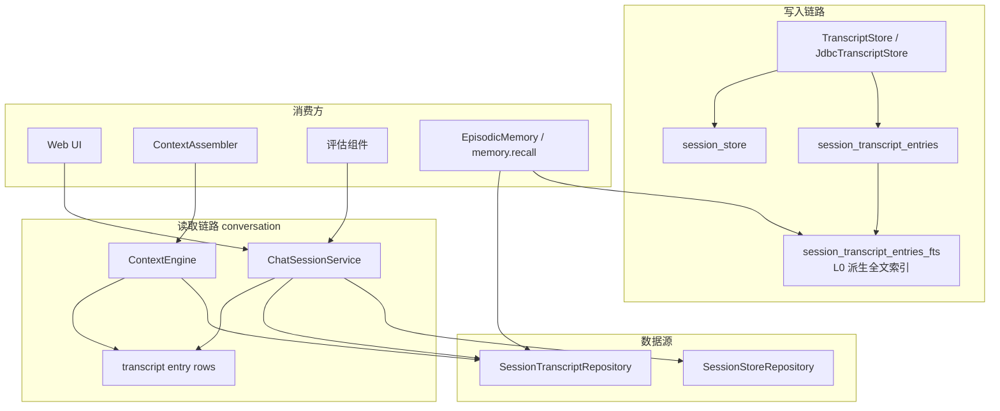
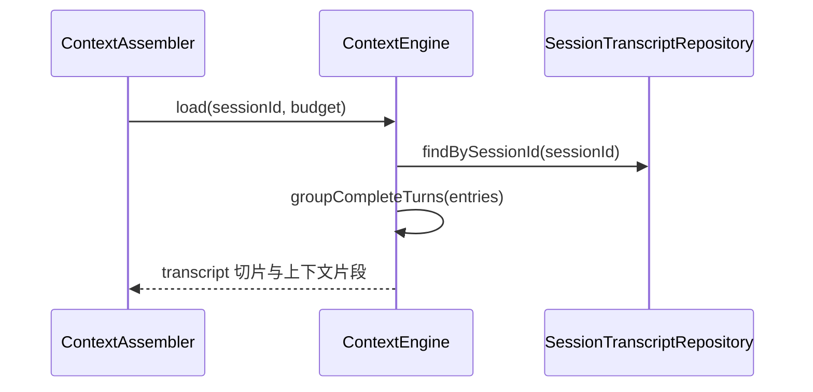
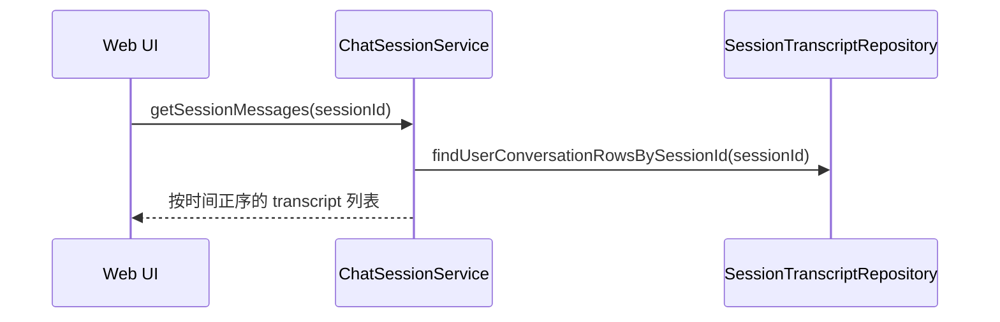

# 对话系统 — 架构设计

> **文档性质**：架构设计文档
> **模块归属**：`com.lifepilot.conversation`
> **最后更新**：2026-05-05（对齐 L0 transcript 真源与 L2 读模型关系）

## 1. 模块概述

对话系统模块为上层提供统一的只读会话视图，并明确与记忆分层解耦：

- 原始对话写入由 `TranscriptStore` 抽象负责
- Agent 上下文读取由 `ContextEngine` 负责
- Web 时间线读取由 `ChatSessionService + SessionTranscriptRepository` 负责
- 会话元信息来自 `SessionStoreRepository`

当前实现已经取消“L2 优先、L0 退化”的读策略。原始对话统一写入 `session_store / session_transcript_entries`，当前会话上下文直接从 L0 transcript 读取，不再通过情景记忆回灌当前会话。

与记忆系统的边界：

- L0 transcript 是唯一原始事实源。
- L2 `EpisodicMemory` 是 L0 的读模型 / 召回工具，不是第二份会话真源。
- 工具完整结果属于 L0 `tool_result.outputJson`，默认不进入 L2 recall snippet。

## 2. 架构图

## 3. 核心组件

### 3.1 ContextEngine

- 负责 transcript-first 的上下文切片和最近完整轮次选择
- 从 `SessionTranscriptRepository.findBySessionId(sessionId)` 读取条目，再按 `visible_to_model` 和压缩边界过滤
- 内部按 user/assistant 顺序分组完整轮次
- 为 `ContextAssembler` 返回可直接注入 Prompt 的历史消息片段

### 3.2 TranscriptStore

- `TranscriptStore` 是会话层统一写入接口，当前 JDBC 实现为 `JdbcTranscriptStore`
- 提供 user / assistant / system / tool_call / tool_result / artifact_ref 等条目的持久化写入抽象
- `tool_call.payload_json.inputJson` 保存完整工具入参；`tool_result.payload_json.outputJson` 保存完整工具原始结果
- `tool_result` 可 `visibleToModel=true` 且 `visibleToUser=false`，用于模型续跑、审计和 trace 回放，不等同于 Web 可见聊天内容
- 该层是记忆系统之外的“对话事实源”

### 3.3 transcript entry rows

- 当前历史消息读取基于 transcript 条目读模型
- `session_transcript_entries_fts` 是 transcript 条目的派生全文索引，只用于定位命中，不是事实表
- 最近完整轮次由 `ContextEngine / CompactionEngine` 内部按顺序分组
- Web 时间线通常只展示 `visible_to_user=1` 的条目；Agent 上下文读取使用 `visible_to_model` 与压缩边界规则
- 不再依赖独立的 `ConversationTurnView` 视图类型

### 3.4 ChatSessionService / SessionStoreRepository

- `ChatSessionService` 为 Web 层组装会话列表、详情和完整时间线
- `SessionStoreRepository` 提供会话级元信息，如 `lastActiveAt`、`totalTokensUsed`
- Web 页面的完整聊天记录直接来自 transcript 读模型
- `session_store.project_id`（V17）标识会话的项目归属：NULL = 主账户对话，非 NULL = 归属具体项目；`SessionStoreRepository` 使用 `ProjectScope` sealed interface 表达两种互斥查询语义（`MainAccount` / `OfProject(projectId)`），并提供 `findIdsByProjectId` 供级联删除使用

## 4. 核心流程

### 4.1 读取最近完整轮次

### 4.2 读取完整时间线

## 5. 设计决策

| 决策 | 选择 | 理由 |
|------|------|------|
| 原始对话真源 | `session_store / session_transcript_entries` | 保存消息、工具调用、工具结果和 artifact 引用的完整事实 |
| 原始对话读路径 | 会话层直读 | 与 L1/L2 解耦，避免多份对话副本 |
| L2 定位 | L0 transcript 的读模型 | `memory.recall` 通过 FTS 命中后回读 L0 组装 snippet |
| 最近消息裁剪单位 | 完整轮次 | 保证 user/assistant 成对保留 |
| 视图模型 | transcript 条目读模型 | 统一 Agent 与 Web 的历史事实源 |
| 工具完整结果 | 只在 L0 / trace 查询中完整保存 | L1 只存摘要，L2 snippet 默认不展开，L3 需治理后才可沉淀 |
| 写入与读取分离 | TranscriptStore 写、ContextEngine / ChatSessionService 读 | 清晰隔离职责，便于替换实现 |

## 6. 集成点

| 集成模块 | 方向 | 说明 |
|---------|------|------|
| Agent 引擎（`com.lifepilot.agent`） | Agent → Conversation | `ContextAssembler` 读取最近完整轮次 |
| Web 层（`com.lifepilot.interaction.web`） | Web → Conversation | 对话页展示完整时间线 |
| 记忆系统（`com.lifepilot.memory`） | Memory → Conversation | L2 recall 的底层消息来源是 L0 transcript；FTS 只定位，snippet 回读 transcript 组装 |
| 项目工作空间（`com.lifepilot.project`） | Project → Conversation | `session_store.project_id` 承载会话的项目归属；`ProjectService.deleteProject` 通过 `SessionStoreRepository.findIdsByProjectId` 找到归属会话并级联删除；fork 会话继承源会话的 `projectId` |

## 7. 当前限制

- 当前读模型以“会话层正确性”优先，不再做 L2 回退兜底
- 最近轮次裁剪依赖 `ContextEngine / CompactionEngine` 内部的完整轮次分组规则
- 对话系统本身不负责跨会话 recall，那部分职责已明确交给记忆工具
- 工具完整结果复盘应走 trace / transcript 专用查询能力，不应混入默认 Web 时间线或 L2 recall snippet
