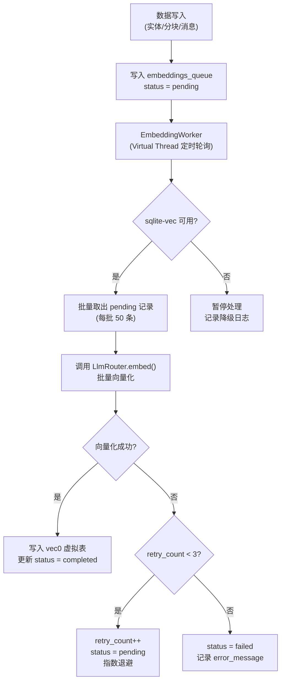

> 本文档从 [ARCHITECTURE.md](../ARCHITECTURE.md) 拆分而来，对应原文 §12 章节。
> 本文档经过深度分析设计，结合业界最佳实践和前沿研究进行了全面扩展。

# 数据模型设计

## 1. 设计哲学与原则

ZhiWei 的数据模型设计围绕一个核心命题：**如何为本地运行的个人 AI Agent 构建一个兼具结构化查询、语义检索和时序推理能力的统一存储层？**

受 MemoriesDB（[arXiv 2511.06179](https://arxiv.org/abs/2511.06179)）"时间-语义-关系实体"（time-semantic-relational entity）概念的启发，ZhiWei 将每条核心数据视为同时编码了 **何时（when）、是什么（what）、如何关联（how it connects）** 三个维度的实体。这一理念贯穿整个数据模型。

五大设计原则：

| 原则 | 说明 | 体现 |
|------|------|------|
| **本地优先** | 所有数据存储在 `~/.lifepilot/`，零外部依赖 | SQLite 单文件数据库，无需安装数据库服务 |
| **追加优先** | 核心数据（对话、轨迹、事件日志）采用追加写入 | 支持事件溯源、审计追踪和 Undo 操作 |
| **时序感知** | 实体和关系都带时间维度 | 版本化更新 + `valid_from`/`valid_to` 支持时间旅行查询 |
| **向量原生** | 向量索引与结构化数据同库 | sqlite-vec 扩展提供 `vec0` 虚拟表，KNN 查询原生支持 |
| **Schema 演进** | Flyway 管理版本化迁移 | `V{version}__{description}.sql` 命名规范，支持平滑升级 |

---

## 2. 数据库架构

### 2.1 双库分离策略

ZhiWei 采用双 SQLite 数据库架构：

| 数据库 | 文件 | 内容 | 说明 |
|--------|------|------|------|
| 主数据库 | `lifepilot.db` | 结构化数据 + FTS5 全文索引 | 核心业务数据，Flyway 管理迁移 |
| 向量数据库 | `vectors.db` | sqlite-vec `vec0` 虚拟表 | 向量索引，可独立重建 |

**分离理由**：

1. **容错隔离** — sqlite-vec 是 native 扩展（pre-v1），加载可能因平台兼容性失败。分离后主库不受影响，Agent 核心功能（待办、日程、对话）正常运行。
2. **独立重建** — 向量索引可从主库数据重新生成，`vectors.db` 损坏时无需恢复，重建即可。
3. **生命周期解耦** — 主库需要严格的 Flyway 迁移管理，向量库的 Schema 由 sqlite-vec 扩展自行管理。

### 2.2 连接管理

```java
/**
 * 数据库连接管理器。
 * 管理主数据库和向量数据库的连接池。
 *
 * <p>设计要点：
 * <ul>
 *   <li>主库使用 HikariCP 连接池，WAL 模式支持并发读</li>
 *   <li>向量库使用独立连接，sqlite-vec 扩展按连接加载</li>
 *   <li>写操作通过 {@link WriteSerializer} 串行化，避免 SQLITE_BUSY</li>
 * </ul></p>
 */
@Configuration
public class DatabaseConfig {

    @Bean
    @Primary
    public DataSource mainDataSource(
            @Value("${lifepilot.data-dir:${user.home}/.lifepilot/data}") String dataDir) {
        var config = new HikariConfig();
        config.setJdbcUrl("jdbc:sqlite:" + dataDir + "/lifepilot.db");
        config.setMaximumPoolSize(5);       // 读连接池
        config.setMinimumIdle(1);
        config.setConnectionInitSql("""
            PRAGMA journal_mode = WAL;
            PRAGMA synchronous = NORMAL;
            PRAGMA foreign_keys = ON;
            PRAGMA busy_timeout = 5000;
            PRAGMA cache_size = -8000;
            PRAGMA mmap_size = 268435456;
            PRAGMA temp_store = MEMORY;
            PRAGMA auto_vacuum = INCREMENTAL;
            PRAGMA page_size = 4096;
            PRAGMA wal_autocheckpoint = 1000;
            """);
        return new HikariDataSource(config);
    }

    @Bean("vectorDataSource")
    public DataSource vectorDataSource(
            @Value("${lifepilot.data-dir:${user.home}/.lifepilot/data}") String dataDir) {
        var config = new HikariConfig();
        config.setJdbcUrl("jdbc:sqlite:" + dataDir + "/vectors.db");
        config.setMaximumPoolSize(2);
        config.setMinimumIdle(1);
        // sqlite-vec 扩展在连接建立后加载
        return new HikariDataSource(config);
    }
}
```


**sqlite-vec 扩展加载**：

```java
/**
 * sqlite-vec 扩展加载器。
 * 从 JAR 资源中解压 native library 到临时目录，然后通过 SQL 加载。
 *
 * <p>各平台 native 文件：
 * <ul>
 *   <li>Windows: vec0.dll</li>
 *   <li>macOS: vec0.dylib</li>
 *   <li>Linux: vec0.so</li>
 * </ul></p>
 */
@Component
public class SqliteVecLoader {

    private volatile boolean loaded = false;

    /**
     * 在指定连接上加载 sqlite-vec 扩展。
     * 加载失败时记录警告并降级为 JVM 暴力搜索。
     */
    public boolean loadExtension(Connection connection) {
        if (loaded) return true;
        try {
            Path nativeLib = extractNativeLibrary();
            try (var stmt = connection.createStatement()) {
                stmt.execute("SELECT load_extension('" + nativeLib.toString() + "')");
            }
            loaded = true;
            log.info("sqlite-vec 扩展加载成功: path={}", nativeLib);
            return true;
        } catch (Exception e) {
            log.warn("sqlite-vec 扩展加载失败，降级为 JVM 暴力搜索: {}", e.getMessage());
            return false;
        }
    }
}
```

**写操作串行化器**：

SQLite 的 WAL 模式支持并发读，但写操作仍然是单写者模型。所有写操作通过 `WriteSerializer` 串行执行，避免 `SQLITE_BUSY` 错误。

```java
/**
 * 写操作串行化器。
 * SQLite 单写者模型下，所有写操作通过此组件串行执行。
 *
 * <p>使用 Virtual Thread + 单线程 Executor 实现：
 * 调用方不阻塞（Virtual Thread 挂起），
 * 写操作按提交顺序串行执行。</p>
 */
@Service
public class WriteSerializer {

    private final ExecutorService writeExecutor =
        Executors.newSingleThreadExecutor(Thread.ofVirtual().name("db-writer").factory());

    /**
     * 提交写操作。
     * 调用方获得 CompletableFuture，可异步等待结果。
     *
     * @param operation 写操作（在单线程 Executor 中执行）
     * @return 操作结果的 Future
     */
    public <T> CompletableFuture<T> write(Callable<T> operation) {
        return CompletableFuture.supplyAsync(() -> {
            try {
                return operation.call();
            } catch (Exception e) {
                throw new DatabaseWriteException("写操作失败", e);
            }
        }, writeExecutor);
    }

    /**
     * 提交无返回值的写操作。
     */
    public CompletableFuture<Void> writeVoid(Runnable operation) {
        return CompletableFuture.runAsync(() -> {
            try {
                operation.run();
            } catch (Exception e) {
                throw new DatabaseWriteException("写操作失败", e);
            }
        }, writeExecutor);
    }
}
```

### 2.3 SQLite PRAGMA 配置

| PRAGMA | 值 | 说明 |
|--------|---|------|
| `journal_mode` | `WAL` | 写前日志模式，支持并发读写。读操作不阻塞写，写操作不阻塞读 |
| `synchronous` | `NORMAL` | WAL 模式下 NORMAL 已足够安全——仅在 WAL checkpoint 时 fsync，平衡安全性和性能 |
| `foreign_keys` | `ON` | 强制外键约束，SQLite 默认关闭，必须显式开启 |
| `busy_timeout` | `5000` | 写冲突时等待 5 秒而非立即返回 SQLITE_BUSY 错误 |
| `cache_size` | `-8000` | 负值表示 KB，即 8MB 页缓存。提升热数据查询性能 |
| `mmap_size` | `268435456` | 256MB 内存映射 I/O，加速大表顺序读取 |
| `temp_store` | `MEMORY` | 临时表和临时索引存储在内存中，加速排序和聚合 |
| `auto_vacuum` | `INCREMENTAL` | 增量回收空间，避免全量 VACUUM 长时间阻塞 |
| `page_size` | `4096` | 4KB 页大小，匹配主流操作系统的文件系统页大小 |
| `wal_autocheckpoint` | `1000` | 每 1000 页（约 4MB）自动执行 WAL checkpoint，防止 WAL 文件无限增长 |

---

## 3. 完整 ER 图

```mermaid
erDiagram
    %% ===== 对话与消息 =====
    conversations ||--o{ messages : "包含"
    conversations {
        TEXT id PK "UUID"
        TEXT session_id "会话 ID"
        TEXT goal "用户原始目标"
        TEXT summary "对话摘要"
        TEXT created_at "ISO 8601"
        TEXT updated_at "最后更新"
    }
    messages {
        TEXT id PK "UUID"
        TEXT conversation_id FK "所属对话"
        TEXT role "角色(user/assistant/system/tool)"
        TEXT content "原始内容"
        TEXT compressed_content "压缩后内容"
        INTEGER compression_level "压缩层级(0/1/2)"
        INTEGER is_pinned "用户标记重要(0/1)"
        TEXT tool_call_json "工具调用 JSON"
        INTEGER token_count "Token 数"
        TEXT created_at "ISO 8601"
    }

    %% ===== 待办事项 =====
    todos {
        TEXT id PK "UUID"
        TEXT title "标题"
        TEXT description "描述"
        TEXT priority "优先级"
        TEXT status "状态"
        TEXT due_date "截止日期"
        TEXT recurrence_rule "iCal RRULE"
        TEXT parent_id FK "父任务 ID"
        TEXT tags_json "标签 JSON"
        TEXT source_conversation_id FK "来源对话"
        TEXT completed_at "完成时间"
        TEXT created_at "ISO 8601"
        TEXT updated_at "最后更新"
    }
    todos ||--o{ todos : "子任务"

    %% ===== 日程管理 =====
    schedules {
        TEXT id PK "UUID"
        TEXT title "标题"
        TEXT description "描述"
        TEXT location "地点"
        TEXT start_time "开始时间"
        TEXT end_time "结束时间"
        TEXT recurrence_rule "iCal RRULE"
        TEXT attendees_json "参与者 JSON"
        TEXT source "来源(manual/agent/sync)"
        TEXT external_id "外部同步 ID"
        INTEGER reminded "已提醒(0/1)"
        TEXT created_at "ISO 8601"
        TEXT updated_at "最后更新"
    }

    %% ===== 习惯养成 =====
    habits ||--o{ habit_checkins : "打卡记录"
    habits {
        TEXT id PK "UUID"
        TEXT name "习惯名称"
        TEXT description "描述"
        TEXT frequency "频率(daily/weekly)"
        TEXT target_frequency "目标频率"
        TEXT category "分类"
        TEXT reminder_time "提醒时间"
        INTEGER streak_days "连续天数"
        INTEGER total_checkins "总打卡数"
        TEXT last_checkin_at "最后打卡"
        TEXT created_at "ISO 8601"
    }
    habit_checkins {
        TEXT id PK "UUID"
        TEXT habit_id FK "所属习惯"
        TEXT checkin_at "打卡时间"
        TEXT note "备注"
    }

    %% ===== 时序知识图谱 =====
    temporal_entities ||--o{ temporal_relations : "源实体"
    temporal_entities ||--o{ temporal_relations : "目标实体"
    temporal_entities {
        TEXT id PK "UUID"
        TEXT type "实体类型"
        TEXT name "名称"
        TEXT description "描述"
        TEXT properties_json "结构化属性"
        INTEGER version "版本号"
        INTEGER is_current "当前版本(0/1)"
        TEXT valid_from "生效时间"
        TEXT valid_to "失效时间"
        TEXT source_conversation_id FK "来源对话"
        REAL extraction_confidence "提取置信度"
        REAL importance_score "重要度"
        INTEGER access_count "检索次数"
        TEXT last_accessed_at "最后访问"
        TEXT created_at "ISO 8601"
        TEXT updated_at "最后更新"
    }
    temporal_relations {
        TEXT id PK "UUID"
        TEXT source_entity_id FK "源实体"
        TEXT target_entity_id FK "目标实体"
        TEXT relation_type "关系类型"
        REAL strength "关系强度"
        TEXT properties_json "关系属性"
        TEXT valid_from "生效时间"
        TEXT valid_to "失效时间"
        TEXT source_conversation_id FK "来源对话"
        TEXT created_at "ISO 8601"
    }

    %% ===== 程序记忆 =====
    procedures {
        TEXT id PK "UUID"
        TEXT name "名称"
        TEXT description "描述"
        TEXT intent_pattern "意图匹配模式"
        TEXT trigger_conditions_json "触发条件"
        TEXT steps_json "步骤模板"
        TEXT context_requirements_json "上下文要求"
        TEXT template_json "完整模板"
        INTEGER usage_count "使用次数"
        REAL success_rate "成功率"
        TEXT created_at "ISO 8601"
        TEXT updated_at "最后更新"
    }

    %% ===== 轨迹记录 =====
    traces ||--o{ trace_steps : "包含步骤"
    traces {
        TEXT trace_id PK "全局追踪 ID"
        TEXT session_id "会话 ID"
        TEXT goal "用户目标"
        TEXT final_output "最终输出"
        INTEGER success "是否成功(0/1)"
        TEXT error_message "错误信息"
        TEXT termination_reason "终止原因"
        INTEGER total_steps "总步骤数"
        INTEGER total_tokens "总 Token"
        INTEGER duration_ms "总耗时(ms)"
        TEXT created_at "ISO 8601"
    }
    trace_steps {
        TEXT id PK "UUID"
        TEXT trace_id FK "所属轨迹"
        INTEGER step_index "步骤序号"
        TEXT phase "阶段"
        TEXT llm_provider_id "LLM 提供商"
        TEXT llm_scene "LLM 场景"
        INTEGER tokens_used "Token 消耗"
        INTEGER llm_latency_ms "LLM 延迟(ms)"
        INTEGER llm_cache_hit "缓存命中(0/1)"
        TEXT tool_id "工具 ID"
        TEXT tool_action "工具操作"
        TEXT tool_input_json "工具输入"
        TEXT tool_output_json "工具输出"
        INTEGER tool_duration_ms "工具耗时(ms)"
        INTEGER tool_success "工具成功(0/1)"
        TEXT thought "思考过程"
        TEXT memory_retrievals_json "记忆检索记录"
        INTEGER context_tokens "上下文 Token 数"
        INTEGER guardrail_blocked "护栏阻断(0/1)"
        TEXT block_reason "阻断原因"
        TEXT phase_before "转换前阶段"
        TEXT phase_after "转换后阶段"
        TEXT created_at "ISO 8601"
    }

    %% ===== Skill 定义 =====
    skill_definitions {
        TEXT id PK "Skill ID"
        TEXT name "名称"
        TEXT description "描述"
        TEXT version "版本"
        TEXT source "来源(BUILTIN/USER_DEFINED/AUTO_GENERATED)"
        TEXT system_prompt "系统提示词"
        TEXT allowed_tools_json "允许工具列表"
        INTEGER max_steps "最大步骤数"
        INTEGER timeout_seconds "超时秒数"
        INTEGER require_confirmation "需要确认(0/1)"
        TEXT memory_access_json "记忆访问权限"
        INTEGER max_tokens "Token 上限"
        INTEGER max_cost_cents "成本上限(分)"
        TEXT preferred_provider_id "首选 LLM"
        TEXT created_at "ISO 8601"
        TEXT updated_at "最后更新"
    }

    %% ===== 文档与知识库 =====
    knowledge_bases ||--o{ documents : "包含文档"
    documents ||--o{ document_chunks : "包含分块"
    knowledge_bases {
        TEXT id PK "UUID"
        TEXT name "知识库名称"
        TEXT description "描述"
        TEXT base_path "文档根路径"
        INTEGER document_count "文档数"
        INTEGER total_chunks "总分块数"
        TEXT created_at "ISO 8601"
        TEXT updated_at "最后更新"
    }
    documents {
        TEXT id PK "UUID"
        TEXT knowledge_base_id FK "所属知识库"
        TEXT filename "文件名"
        TEXT content_type "内容类型"
        TEXT status "状态(pending/processing/ready/error)"
        INTEGER chunk_count "分块数"
        TEXT chunk_strategy "分块策略"
        TEXT metadata_json "元数据"
        TEXT error_message "错误信息"
        TEXT created_at "ISO 8601"
    }
    document_chunks {
        TEXT id PK "UUID"
        TEXT document_id FK "所属文档"
        INTEGER chunk_index "分块序号"
        TEXT content "分块内容"
        TEXT heading_path "标题路径"
        INTEGER start_offset "起始偏移"
        INTEGER end_offset "结束偏移"
        TEXT metadata_json "元数据"
        TEXT created_at "ISO 8601"
    }

    %% ===== MCP Server 管理 =====
    mcp_servers ||--o{ mcp_server_tools : "提供工具"
    mcp_servers {
        TEXT name PK "Server 名称"
        TEXT transport "传输方式(stdio/sse)"
        TEXT command "启动命令"
        TEXT args_json "启动参数"
        TEXT url "SSE URL"
        TEXT status "状态"
        INTEGER tool_count "工具数"
        INTEGER health_check_interval "健康检查间隔(s)"
        INTEGER restart_count "重启次数"
        TEXT last_connected_at "最后连接时间"
        TEXT created_at "ISO 8601"
    }
    mcp_server_tools {
        TEXT id PK "UUID"
        TEXT server_name FK "所属 Server"
        TEXT tool_name "工具名称"
        TEXT description "工具描述"
        TEXT input_schema_json "输入 Schema"
        TEXT risk_level "风险等级"
        TEXT created_at "ISO 8601"
    }

    %% ===== 工作流 =====
    workflows ||--o{ workflow_executions : "执行记录"
    workflows {
        TEXT id PK "UUID"
        TEXT name "名称"
        TEXT description "描述"
        TEXT trigger_type "触发类型(cron/event/memory_pattern)"
        TEXT trigger_json "触发配置"
        TEXT steps_json "步骤定义"
        INTEGER enabled "启用(0/1)"
        TEXT last_executed_at "最后执行"
        TEXT created_at "ISO 8601"
        TEXT updated_at "最后更新"
    }
    workflow_executions {
        TEXT id PK "UUID"
        TEXT workflow_id FK "所属工作流"
        TEXT trigger_reason "触发原因"
        TEXT status "状态(running/completed/failed)"
        TEXT result_json "执行结果"
        TEXT trace_id "关联 Trace"
        INTEGER duration_ms "耗时(ms)"
        TEXT started_at "开始时间"
        TEXT completed_at "完成时间"
    }

    %% ===== 事件日志 =====
    event_log {
        INTEGER id PK "自增 ID"
        TEXT event_type "事件类型"
        TEXT entity_type "实体类型"
        TEXT entity_id "实体 ID"
        TEXT action "操作"
        TEXT payload_json "事件载荷"
        TEXT actor "操作者"
        TEXT trace_id "关联 Trace"
        TEXT created_at "ISO 8601"
    }

    %% ===== LLM 使用统计 =====
    llm_usage_stats {
        TEXT id PK "UUID"
        TEXT provider_id "提供商 ID"
        TEXT scene "使用场景"
        TEXT model_id "模型 ID"
        INTEGER input_tokens "输入 Token"
        INTEGER output_tokens "输出 Token"
        INTEGER total_tokens "总 Token"
        INTEGER latency_ms "延迟(ms)"
        INTEGER cost_cents "成本(分)"
        INTEGER cache_hit "缓存命中(0/1)"
        INTEGER success "成功(0/1)"
        TEXT error_type "错误类型"
        TEXT trace_id "关联 Trace"
        TEXT created_at "ISO 8601"
    }

    %% ===== 主动推理相关 =====
    proactive_signals {
        TEXT id PK "UUID"
        TEXT signal_type "信号类型"
        TEXT source "信号来源"
        TEXT payload_json "信号载荷"
        TEXT evaluation_result "评估结果"
        REAL confidence "置信度"
        INTEGER notified "已通知(0/1)"
        TEXT created_at "ISO 8601"
    }
    notification_history {
        TEXT id PK "UUID"
        TEXT signal_id FK "关联信号"
        TEXT channel "通知通道"
        TEXT title "标题"
        TEXT body "内容"
        TEXT user_response "用户响应"
        TEXT responded_at "响应时间"
        TEXT created_at "ISO 8601"
    }
    proactive_signals ||--o{ notification_history : "触发通知"
    frequency_states {
        TEXT id PK "UUID"
        TEXT reminder_type "提醒类型"
        TEXT state "状态(NORMAL/REDUCED/MUTED)"
        INTEGER consecutive_ignores "连续忽略次数"
        TEXT last_transition_at "最后状态转换"
        TEXT created_at "ISO 8601"
        TEXT updated_at "最后更新"
    }

    %% ===== 系统管理 =====
    user_preferences {
        TEXT key PK "配置键"
        TEXT value "配置值"
        TEXT value_type "值类型(string/int/boolean/json)"
        TEXT description "说明"
        TEXT updated_at "最后更新"
    }
    embeddings_queue {
        INTEGER id PK "自增 ID"
        TEXT source_type "来源类型"
        TEXT source_id "来源 ID"
        TEXT text_content "待向量化文本"
        TEXT status "状态"
        INTEGER retry_count "重试次数"
        TEXT error_message "错误信息"
        TEXT created_at "ISO 8601"
        TEXT processed_at "处理时间"
    }
    memory_consolidation_log {
        TEXT id PK "UUID"
        TEXT consolidation_type "巩固类型"
        TEXT source_type "源类型"
        TEXT source_id "源 ID"
        TEXT target_type "目标类型"
        TEXT target_id "目标 ID"
        TEXT summary "巩固摘要"
        TEXT created_at "ISO 8601"
    }
    forgetting_log {
        TEXT id PK "UUID"
        TEXT entity_id FK "实体 ID"
        TEXT entity_name "实体名称"
        TEXT strategy "遗忘策略"
        TEXT action_taken "执行操作"
        REAL forgetting_priority "遗忘优先级"
        TEXT created_at "ISO 8601"
    }
    circuit_breaker_states {
        TEXT provider_capability PK "提供商:能力类型"
        TEXT state "状态(CLOSED/OPEN/HALF_OPEN)"
        INTEGER failure_count "失败计数"
        TEXT last_failure_at "最后失败时间"
        TEXT state_changed_at "状态变更时间"
        TEXT updated_at "最后更新"
    }
```




---

## 4. 核心表详细设计

### 4.1 对话与消息

对话和消息是情景记忆（L2 Episodic Memory）的物理存储。采用追加写入模式，支持渐进式压缩。

#### conversations 表

| 列名 | 类型 | 约束 | 说明 |
|------|------|------|------|
| `id` | TEXT | PK | UUID，对话唯一标识 |
| `session_id` | TEXT | NOT NULL, INDEX | 会话 ID，同一会话可包含多轮对话 |
| `goal` | TEXT | NOT NULL | 用户原始目标（首条消息的意图摘要） |
| `summary` | TEXT | | 对话摘要（压缩后生成） |
| `created_at` | TEXT | NOT NULL | ISO 8601 创建时间 |
| `updated_at` | TEXT | NOT NULL | 最后更新时间 |

#### messages 表

| 列名 | 类型 | 约束 | 说明 |
|------|------|------|------|
| `id` | TEXT | PK | UUID |
| `conversation_id` | TEXT | NOT NULL, FK → conversations(id) | 所属对话 |
| `role` | TEXT | NOT NULL | 角色：`user` / `assistant` / `system` / `tool` |
| `content` | TEXT | NOT NULL | 原始消息内容 |
| `compressed_content` | TEXT | | 压缩后内容（Layer 1 摘要 / Layer 2 要点） |
| `compression_level` | INTEGER | NOT NULL DEFAULT 0 | 压缩层级：0=原文, 1=摘要, 2=要点 |
| `is_pinned` | INTEGER | NOT NULL DEFAULT 0 | 用户标记的重要消息，永不压缩 |
| `tool_call_json` | TEXT | | 工具调用详情 JSON |
| `token_count` | INTEGER | DEFAULT 0 | 消息 Token 数 |
| `created_at` | TEXT | NOT NULL | ISO 8601 |

**渐进式压缩策略**：

```
Layer 0（原文）→ Layer 1（摘要，压缩率 ~60%）→ Layer 2（要点，压缩率 ~80%）
```

- 当对话 Token 总量超过预算时，从最早的未固定消息开始压缩
- `is_pinned = 1` 的消息永不压缩，保留原文
- 压缩由 LLM 异步执行，原文保留在 `content` 列，压缩结果写入 `compressed_content`

**索引设计**：

```sql
CREATE INDEX idx_messages_conversation ON messages(conversation_id, created_at);
CREATE INDEX idx_messages_pinned ON messages(conversation_id)
    WHERE is_pinned = 1;
```

### 4.2 待办事项

| 列名 | 类型 | 约束 | 说明 |
|------|------|------|------|
| `id` | TEXT | PK | UUID |
| `title` | TEXT | NOT NULL | 待办标题 |
| `description` | TEXT | | 详细描述 |
| `priority` | TEXT | NOT NULL DEFAULT 'medium' | 优先级：`low` / `medium` / `high` / `urgent` |
| `status` | TEXT | NOT NULL DEFAULT 'pending' | 状态：`pending` / `in_progress` / `completed` / `cancelled` |
| `due_date` | TEXT | | 截止日期 ISO 8601 |
| `recurrence_rule` | TEXT | | 重复规则（iCal RRULE 格式，如 `FREQ=WEEKLY;BYDAY=MO,WE,FR`） |
| `parent_id` | TEXT | FK → todos(id) | 父任务 ID，支持子任务层级 |
| `tags_json` | TEXT | | 标签数组 JSON，如 `["工作","紧急"]` |
| `source_conversation_id` | TEXT | FK → conversations(id) | 创建来源对话（Agent 从对话中提取时记录） |
| `completed_at` | TEXT | | 完成时间 |
| `created_at` | TEXT | NOT NULL | ISO 8601 |
| `updated_at` | TEXT | NOT NULL | 最后更新 |

**索引设计**：

```sql
CREATE INDEX idx_todos_status ON todos(status) WHERE status != 'cancelled';
CREATE INDEX idx_todos_due ON todos(due_date) WHERE status = 'pending';
CREATE INDEX idx_todos_parent ON todos(parent_id) WHERE parent_id IS NOT NULL;
```

### 4.3 日程管理

| 列名 | 类型 | 约束 | 说明 |
|------|------|------|------|
| `id` | TEXT | PK | UUID |
| `title` | TEXT | NOT NULL | 日程标题 |
| `description` | TEXT | | 详细描述 |
| `location` | TEXT | | 地点 |
| `start_time` | TEXT | NOT NULL | 开始时间 ISO 8601 |
| `end_time` | TEXT | NOT NULL | 结束时间 ISO 8601 |
| `recurrence_rule` | TEXT | | 重复规则（iCal RRULE 格式） |
| `attendees_json` | TEXT | | 参与者 JSON，如 `[{"name":"张总","email":"..."}]` |
| `source` | TEXT | NOT NULL DEFAULT 'manual' | 来源：`manual`（手动）/ `agent`（Agent 创建）/ `sync`（外部同步） |
| `external_id` | TEXT | UNIQUE | 外部同步 ID（CalDAV UID 等），用于去重 |
| `reminded` | INTEGER | NOT NULL DEFAULT 0 | 是否已提醒 |
| `created_at` | TEXT | NOT NULL | ISO 8601 |
| `updated_at` | TEXT | NOT NULL | 最后更新 |

**索引设计**：

```sql
CREATE INDEX idx_schedules_time ON schedules(start_time, end_time);
CREATE INDEX idx_schedules_external ON schedules(external_id)
    WHERE external_id IS NOT NULL;
```

### 4.4 习惯养成

#### habits 表

| 列名 | 类型 | 约束 | 说明 |
|------|------|------|------|
| `id` | TEXT | PK | UUID |
| `name` | TEXT | NOT NULL | 习惯名称 |
| `description` | TEXT | | 描述 |
| `frequency` | TEXT | NOT NULL | 基础频率：`daily` / `weekly` |
| `target_frequency` | TEXT | | 目标频率描述，如 `"3/week"`, `"1/day"` |
| `category` | TEXT | | 分类，如 `"健康"`, `"学习"`, `"运动"` |
| `reminder_time` | TEXT | | 提醒时间（HH:mm 格式） |
| `streak_days` | INTEGER | DEFAULT 0 | 当前连续打卡天数 |
| `total_checkins` | INTEGER | DEFAULT 0 | 累计打卡次数 |
| `last_checkin_at` | TEXT | | 最后打卡时间 |
| `created_at` | TEXT | NOT NULL | ISO 8601 |

#### habit_checkins 表

| 列名 | 类型 | 约束 | 说明 |
|------|------|------|------|
| `id` | TEXT | PK | UUID |
| `habit_id` | TEXT | NOT NULL, FK → habits(id) ON DELETE CASCADE | 所属习惯 |
| `checkin_at` | TEXT | NOT NULL | 打卡时间 ISO 8601 |
| `note` | TEXT | | 打卡备注 |

**索引设计**：

```sql
CREATE INDEX idx_checkins_habit ON habit_checkins(habit_id, checkin_at DESC);
```


### 4.5 时序知识图谱

时序知识图谱是 ZhiWei 语义记忆（L3 Semantic Memory）的核心存储，也是整个数据模型中最复杂的部分。受 MemoriesDB 论文启发，每个实体和关系都编码了时间维度，支持版本化更新和时间旅行查询。

#### 实体类型体系

```java
/**
 * 实体类型枚举。
 * 采用 sealed interface 实现，支持类型安全的穷举匹配。
 *
 * <p>扩展机制：新增实体类型只需添加枚举值，
 * 数据库中以 TEXT 存储，无需 Schema 迁移。</p>
 */
public enum EntityType {
    // === 人物与组织 ===
    PERSON,          // 人物（同事、朋友、家人、客户）
    ORGANIZATION,    // 组织（公司、部门、团队）

    // === 事物与概念 ===
    PLACE,           // 地点
    EVENT,           // 事件（会议、活动、里程碑）
    PROJECT,         // 项目
    TOPIC,           // 主题/话题

    // === 用户相关 ===
    PREFERENCE,      // 偏好（饮食、工作习惯、沟通风格）
    HABIT,           // 习惯模式
    GOAL,            // 目标（短期/长期）
    SKILL,           // 技能/能力

    // === 扩展预留 ===
    CUSTOM;          // 自定义类型（properties_json 中存储 custom_type 字段）
}
```

#### 关系类型分类体系

```java
/**
 * 关系类型常量。
 * 关系类型以 TEXT 存储在数据库中，使用常量类管理已知类型。
 *
 * <p>分类体系：
 * <ul>
 *   <li>社交关系：人与人之间的关系</li>
 *   <li>组织关系：人与组织、组织与组织</li>
 *   <li>项目关系：人/组织与项目</li>
 *   <li>因果关系：事件之间的因果链</li>
 *   <li>偏好关系：用户与偏好/习惯</li>
 * </ul></p>
 */
public final class RelationTypes {
    // 社交关系
    public static final String KNOWS = "knows";
    public static final String IS_FRIEND_OF = "is_friend_of";
    public static final String IS_FAMILY_OF = "is_family_of";
    public static final String IS_CLIENT_OF = "is_client_of";

    // 组织关系
    public static final String WORKS_AT = "works_at";
    public static final String BELONGS_TO = "belongs_to";
    public static final String MANAGES = "manages";
    public static final String REPORTS_TO = "reports_to";

    // 项目关系
    public static final String RESPONSIBLE_FOR = "responsible_for";
    public static final String PARTICIPATES_IN = "participates_in";
    public static final String HAS_MILESTONE = "has_milestone";
    public static final String DEPENDS_ON = "depends_on";

    // 因果关系
    public static final String CAUSED_BY = "caused_by";
    public static final String LEADS_TO = "leads_to";
    public static final String RELATED_TO = "related_to";

    // 偏好关系
    public static final String PREFERS = "prefers";
    public static final String DISLIKES = "dislikes";
    public static final String HAS_GOAL = "has_goal";
    public static final String HAS_HABIT = "has_habit";

    private RelationTypes() {}
}
```

#### temporal_entities 表

| 列名 | 类型 | 约束 | 说明 |
|------|------|------|------|
| `id` | TEXT | PK | UUID，每个版本独立 ID |
| `type` | TEXT | NOT NULL | 实体类型（EntityType 枚举值） |
| `name` | TEXT | NOT NULL | 实体名称 |
| `description` | TEXT | | 实体描述 |
| `properties_json` | TEXT | | JSON 格式结构化属性 |
| `version` | INTEGER | NOT NULL DEFAULT 1 | 版本号（同名同类型实体内单调递增） |
| `is_current` | INTEGER | NOT NULL DEFAULT 1 | 是否为当前版本（0/1） |
| `valid_from` | TEXT | NOT NULL | 此版本生效时间 ISO 8601 |
| `valid_to` | TEXT | | 此版本失效时间（NULL = 当前有效） |
| `source_conversation_id` | TEXT | FK → conversations(id) | 提取来源对话 |
| `extraction_confidence` | REAL | DEFAULT 0.0 | 提取置信度 [0.0, 1.0] |
| `importance_score` | REAL | DEFAULT 0.5 | 重要度评分 [0.0, 1.0] |
| `access_count` | INTEGER | DEFAULT 0 | 被检索次数（用于 LRU 遗忘策略） |
| `last_accessed_at` | TEXT | | 最后访问时间 |
| `created_at` | TEXT | NOT NULL | 创建时间 |
| `updated_at` | TEXT | NOT NULL | 更新时间 |

**索引设计**：

```sql
-- 名称+类型复合索引，用于精确匹配和冲突检测
CREATE INDEX idx_entities_name_type ON temporal_entities(name, type);

-- 部分索引：只索引当前版本，加速常规查询
CREATE INDEX idx_entities_current ON temporal_entities(is_current)
    WHERE is_current = 1;

-- 类型+时间索引，用于时间旅行查询
CREATE INDEX idx_entities_type_valid ON temporal_entities(type, valid_from, valid_to);

-- 重要度索引，用于遗忘策略排序
CREATE INDEX idx_entities_importance ON temporal_entities(importance_score, access_count)
    WHERE is_current = 1;

-- 来源对话索引，用于追溯知识来源
CREATE INDEX idx_entities_source ON temporal_entities(source_conversation_id)
    WHERE source_conversation_id IS NOT NULL;
```

#### temporal_relations 表

| 列名 | 类型 | 约束 | 说明 |
|------|------|------|------|
| `id` | TEXT | PK | UUID |
| `source_entity_id` | TEXT | NOT NULL, FK → temporal_entities(id) | 源实体 ID |
| `target_entity_id` | TEXT | NOT NULL, FK → temporal_entities(id) | 目标实体 ID |
| `relation_type` | TEXT | NOT NULL | 关系类型 |
| `strength` | REAL | DEFAULT 0.5 | 关系强度 [0.0, 1.0] |
| `properties_json` | TEXT | | 关系附加属性 JSON |
| `valid_from` | TEXT | NOT NULL | 关系生效时间 |
| `valid_to` | TEXT | | 关系失效时间（NULL = 当前有效） |
| `source_conversation_id` | TEXT | FK → conversations(id) | 提取来源对话 |
| `created_at` | TEXT | NOT NULL | ISO 8601 |

**索引设计**：

```sql
-- 源实体出边索引
CREATE INDEX idx_relations_source ON temporal_relations(source_entity_id, relation_type);
-- 目标实体入边索引
CREATE INDEX idx_relations_target ON temporal_relations(target_entity_id, relation_type);
-- 当前有效关系索引
CREATE INDEX idx_relations_valid ON temporal_relations(valid_from, valid_to)
    WHERE valid_to IS NULL;
```

#### 版本化更新 SQL 示例

```sql
-- 版本化更新实体（事务内执行）
-- 场景：张总从"产品经理"升职为"产品总监"

BEGIN TRANSACTION;

-- Step 1: 关闭当前版本
UPDATE temporal_entities
SET is_current = 0,
    valid_to = '2026-03-15T10:00:00Z',
    updated_at = '2026-03-15T10:00:00Z'
WHERE name = '张总'
  AND type = 'PERSON'
  AND is_current = 1;

-- Step 2: 创建新版本
INSERT INTO temporal_entities (
    id, type, name, description, properties_json,
    version, is_current, valid_from, valid_to,
    source_conversation_id, extraction_confidence, importance_score,
    access_count, last_accessed_at, created_at, updated_at
) VALUES (
    'uuid-new-version',
    'PERSON',
    '张总',
    '产品总监，负责整体产品战略',
    '{"title":"产品总监","department":"产品部","phone":"138****5678"}',
    (SELECT COALESCE(MAX(version), 0) + 1
     FROM temporal_entities WHERE name = '张总' AND type = 'PERSON'),
    1,
    '2026-03-15T10:00:00Z',
    NULL,
    'conv-uuid-xxx',
    0.95,
    0.8,
    0,
    NULL,
    '2026-03-15T10:00:00Z',
    '2026-03-15T10:00:00Z'
);

COMMIT;
```

#### 时间旅行查询

```sql
-- 查询指定时间点的实体状态
-- "2025年6月时，张总的职位是什么？"
SELECT id, name, description, properties_json, version, valid_from, valid_to
FROM temporal_entities
WHERE name = '张总'
  AND type = 'PERSON'
  AND valid_from <= '2025-06-01T00:00:00Z'
  AND (valid_to IS NULL OR valid_to > '2025-06-01T00:00:00Z')
ORDER BY version DESC
LIMIT 1;

-- 查询实体的完整变更历史
SELECT version, description,
       json_extract(properties_json, '$.title') AS title,
       valid_from, valid_to
FROM temporal_entities
WHERE name = '张总' AND type = 'PERSON'
ORDER BY version ASC;

-- 查询某时间段内新增的实体
SELECT name, type, description, extraction_confidence
FROM temporal_entities
WHERE is_current = 1
  AND created_at BETWEEN '2026-03-01' AND '2026-03-31'
ORDER BY importance_score DESC;
```

#### 图遍历查询（递归 CTE）

```sql
-- 从指定实体出发，沿关系边扩展 N 跳
-- 场景：查找与"张总"相关的所有实体（最多 2 跳）
WITH RECURSIVE graph_walk AS (
    -- 起点：张总
    SELECT
        e.id,
        e.name,
        e.type,
        0 AS depth,
        e.name AS path
    FROM temporal_entities e
    WHERE e.name = '张总'
      AND e.type = 'PERSON'
      AND e.is_current = 1

    UNION ALL

    -- 递归：沿关系边扩展
    SELECT
        e2.id,
        e2.name,
        e2.type,
        gw.depth + 1,
        gw.path || ' → ' || r.relation_type || ' → ' || e2.name
    FROM graph_walk gw
    JOIN temporal_relations r
        ON r.source_entity_id = gw.id
        AND r.valid_to IS NULL          -- 只沿当前有效关系
    JOIN temporal_entities e2
        ON e2.id = r.target_entity_id
        AND e2.is_current = 1
    WHERE gw.depth < 2                  -- 最多 2 跳
)
SELECT DISTINCT id, name, type, depth, path
FROM graph_walk
ORDER BY depth, name;
```


### 4.6 程序记忆

程序记忆（L4 Procedural Memory）存储从成功执行轨迹中提炼的操作模板和用户偏好模式。

| 列名 | 类型 | 约束 | 说明 |
|------|------|------|------|
| `id` | TEXT | PK | UUID |
| `name` | TEXT | NOT NULL | 模板名称 |
| `description` | TEXT | | 模板描述 |
| `intent_pattern` | TEXT | NOT NULL | 意图匹配模式（正则或语义描述） |
| `trigger_conditions_json` | TEXT | | 触发条件 JSON，如 `{"time":"morning","context":"work"}` |
| `steps_json` | TEXT | NOT NULL | 步骤模板 JSON 数组 |
| `context_requirements_json` | TEXT | | 上下文要求，如 `{"memory_types":["PERSON","PROJECT"]}` |
| `template_json` | TEXT | | 完整模板（包含变量占位符） |
| `usage_count` | INTEGER | DEFAULT 0 | 使用次数 |
| `success_rate` | REAL | DEFAULT 0.0 | 成功率 [0.0, 1.0] |
| `created_at` | TEXT | NOT NULL | ISO 8601 |
| `updated_at` | TEXT | NOT NULL | 最后更新 |

**`steps_json` 示例**：

```json
[
  {"step": 1, "tool": "schedule.query", "params": {"range": "today"}},
  {"step": 2, "tool": "todo.query", "params": {"status": "pending"}},
  {"step": 3, "tool": "llm.generate", "params": {"template": "daily-summary"}}
]
```

### 4.7 轨迹记录

轨迹记录是可观测性引擎的核心数据，参考 OpenTelemetry Agent 语义约定设计。

#### traces 表

| 列名 | 类型 | 约束 | 说明 |
|------|------|------|------|
| `trace_id` | TEXT | PK | 全局追踪 ID |
| `session_id` | TEXT | NOT NULL | 会话 ID |
| `goal` | TEXT | NOT NULL | 用户原始目标 |
| `final_output` | TEXT | | 最终输出 |
| `success` | INTEGER | NOT NULL | 是否成功（0/1） |
| `error_message` | TEXT | | 错误信息 |
| `termination_reason` | TEXT | | 终止原因：`completed` / `max_steps` / `error` / `user_cancel` / `guardrail_blocked` |
| `total_steps` | INTEGER | DEFAULT 0 | 总步骤数 |
| `total_tokens` | INTEGER | DEFAULT 0 | 总 Token 消耗 |
| `duration_ms` | INTEGER | DEFAULT 0 | 总耗时（毫秒） |
| `created_at` | TEXT | NOT NULL | ISO 8601 |

#### trace_steps 表

| 列名 | 类型 | 约束 | 说明 |
|------|------|------|------|
| `id` | TEXT | PK | UUID |
| `trace_id` | TEXT | NOT NULL, FK → traces(trace_id) | 所属轨迹 |
| `step_index` | INTEGER | NOT NULL | 步骤序号（从 0 开始） |
| `phase` | TEXT | NOT NULL | 阶段：`UNDERSTANDING` / `PLANNING` / `EXECUTING` / `RESPONDING` |
| `llm_provider_id` | TEXT | | LLM 提供商 ID |
| `llm_scene` | TEXT | | LLM 场景（如 `chat`, `knowledge_extraction`） |
| `tokens_used` | INTEGER | DEFAULT 0 | 本步骤 Token 消耗 |
| `llm_latency_ms` | INTEGER | | LLM 调用延迟（毫秒） |
| `llm_cache_hit` | INTEGER | DEFAULT 0 | 是否命中缓存（0/1） |
| `tool_id` | TEXT | | 工具 ID |
| `tool_action` | TEXT | | 工具操作 |
| `tool_input_json` | TEXT | | 工具输入参数 JSON |
| `tool_output_json` | TEXT | | 工具输出结果 JSON |
| `tool_duration_ms` | INTEGER | | 工具执行耗时（毫秒） |
| `tool_success` | INTEGER | | 工具执行是否成功（0/1） |
| `thought` | TEXT | | LLM 思考过程（Chain-of-Thought） |
| `memory_retrievals_json` | TEXT | | 本步骤的记忆检索记录 JSON |
| `context_tokens` | INTEGER | | 本步骤上下文 Token 数 |
| `guardrail_blocked` | INTEGER | DEFAULT 0 | 是否被护栏阻断（0/1） |
| `block_reason` | TEXT | | 阻断原因 |
| `phase_before` | TEXT | | 状态机转换前阶段 |
| `phase_after` | TEXT | | 状态机转换后阶段 |
| `created_at` | TEXT | NOT NULL | ISO 8601 |

**`memory_retrievals_json` 示例**：

```json
[
  {"source": "vector", "entity": "张总", "score": 0.91, "latency_ms": 12},
  {"source": "fts5", "entity": "XX项目", "score": 0.87, "latency_ms": 3},
  {"source": "graph", "entity": "Q1评审", "hops": 2, "latency_ms": 8}
]
```

**索引设计**：

```sql
CREATE INDEX idx_traces_session ON traces(session_id, created_at DESC);
CREATE INDEX idx_traces_success ON traces(success, created_at DESC);
CREATE INDEX idx_trace_steps_trace ON trace_steps(trace_id, step_index);
CREATE INDEX idx_trace_steps_tool ON trace_steps(tool_id)
    WHERE tool_id IS NOT NULL;
```

### 4.8 Skill 定义

Skill 定义表存储三种来源的 Skill 元数据：BUILTIN（内置）、USER_DEFINED（用户 YAML）、AUTO_GENERATED（自动生成）。

| 列名 | 类型 | 约束 | 说明 |
|------|------|------|------|
| `id` | TEXT | PK | Skill ID（如 `todo-manager`, `writing-assistant`） |
| `name` | TEXT | NOT NULL | 显示名称 |
| `description` | TEXT | | 功能描述 |
| `version` | TEXT | NOT NULL DEFAULT '1.0.0' | 语义化版本号 |
| `source` | TEXT | NOT NULL | 来源：`BUILTIN` / `USER_DEFINED` / `AUTO_GENERATED` |
| `system_prompt` | TEXT | | 系统提示词 |
| `allowed_tools_json` | TEXT | | 允许使用的工具列表 JSON |
| `max_steps` | INTEGER | DEFAULT 10 | 最大执行步骤数 |
| `timeout_seconds` | INTEGER | DEFAULT 30 | 超时秒数 |
| `require_confirmation` | INTEGER | DEFAULT 0 | 高风险操作是否需要用户确认 |
| `memory_access_json` | TEXT | | 记忆访问权限 JSON |
| `max_tokens` | INTEGER | | Token 预算上限 |
| `max_cost_cents` | INTEGER | | 成本预算上限（分） |
| `preferred_provider_id` | TEXT | | 首选 LLM 提供商 |
| `created_at` | TEXT | NOT NULL | ISO 8601 |
| `updated_at` | TEXT | NOT NULL | 最后更新 |

### 4.9 文档与知识库

#### knowledge_bases 表

| 列名 | 类型 | 约束 | 说明 |
|------|------|------|------|
| `id` | TEXT | PK | UUID |
| `name` | TEXT | NOT NULL, UNIQUE | 知识库名称 |
| `description` | TEXT | | 描述 |
| `base_path` | TEXT | | 文档根路径（如 `~/.lifepilot/documents/work-docs`） |
| `document_count` | INTEGER | DEFAULT 0 | 文档数量 |
| `total_chunks` | INTEGER | DEFAULT 0 | 总分块数 |
| `created_at` | TEXT | NOT NULL | ISO 8601 |
| `updated_at` | TEXT | NOT NULL | 最后更新 |

#### documents 表

| 列名 | 类型 | 约束 | 说明 |
|------|------|------|------|
| `id` | TEXT | PK | UUID |
| `knowledge_base_id` | TEXT | NOT NULL, FK → knowledge_bases(id) | 所属知识库 |
| `filename` | TEXT | NOT NULL | 文件名 |
| `content_type` | TEXT | NOT NULL | MIME 类型（如 `application/pdf`, `text/markdown`） |
| `status` | TEXT | NOT NULL DEFAULT 'pending' | 处理状态：`pending` / `processing` / `ready` / `error` |
| `chunk_count` | INTEGER | DEFAULT 0 | 分块数量 |
| `chunk_strategy` | TEXT | | 使用的分块策略 |
| `metadata_json` | TEXT | | 文档元数据（标题、作者、页数等） |
| `error_message` | TEXT | | 处理错误信息 |
| `created_at` | TEXT | NOT NULL | ISO 8601 |

**索引设计**：

```sql
CREATE INDEX idx_documents_kb ON documents(knowledge_base_id, status);
CREATE INDEX idx_documents_status ON documents(status)
    WHERE status IN ('pending', 'processing');
```

#### document_chunks 表

| 列名 | 类型 | 约束 | 说明 |
|------|------|------|------|
| `id` | TEXT | PK | UUID |
| `document_id` | TEXT | NOT NULL, FK → documents(id) ON DELETE CASCADE | 所属文档 |
| `chunk_index` | INTEGER | NOT NULL | 在文档中的序号 |
| `content` | TEXT | NOT NULL | 分块文本内容 |
| `heading_path` | TEXT | | 标题路径（如 `"第一章 > 1.1 概述"`），HeadingChunker 生成 |
| `start_offset` | INTEGER | NOT NULL | 在原文中的起始字符偏移 |
| `end_offset` | INTEGER | NOT NULL | 在原文中的结束字符偏移 |
| `metadata_json` | TEXT | | 分块元数据（页码、标题层级等） |
| `created_at` | TEXT | NOT NULL | ISO 8601 |

**索引设计**：

```sql
CREATE INDEX idx_chunks_document ON document_chunks(document_id, chunk_index);
```

### 4.10 MCP Server 管理

#### mcp_servers 表

| 列名 | 类型 | 约束 | 说明 |
|------|------|------|------|
| `name` | TEXT | PK | Server 名称（唯一标识） |
| `transport` | TEXT | NOT NULL | 传输方式：`stdio` / `sse` |
| `command` | TEXT | | 启动命令（stdio 模式） |
| `args_json` | TEXT | | 启动参数 JSON 数组 |
| `url` | TEXT | | SSE URL（sse 模式） |
| `status` | TEXT | NOT NULL DEFAULT 'disconnected' | 状态：`connected` / `disconnected` / `error` |
| `tool_count` | INTEGER | DEFAULT 0 | 提供的工具数量 |
| `health_check_interval` | INTEGER | DEFAULT 60 | 健康检查间隔（秒） |
| `restart_count` | INTEGER | DEFAULT 0 | 累计重启次数 |
| `last_connected_at` | TEXT | | 最后连接时间 |
| `created_at` | TEXT | NOT NULL | ISO 8601 |

#### mcp_server_tools 表

| 列名 | 类型 | 约束 | 说明 |
|------|------|------|------|
| `id` | TEXT | PK | UUID |
| `server_name` | TEXT | NOT NULL, FK → mcp_servers(name) ON DELETE CASCADE | 所属 Server |
| `tool_name` | TEXT | NOT NULL | 工具名称 |
| `description` | TEXT | | 工具描述 |
| `input_schema_json` | TEXT | | 输入参数 JSON Schema |
| `risk_level` | TEXT | NOT NULL DEFAULT 'LOW' | 风险等级：`LOW` / `MEDIUM` / `HIGH` / `CRITICAL` |
| `created_at` | TEXT | NOT NULL | ISO 8601 |

**索引设计**：

```sql
CREATE UNIQUE INDEX idx_mcp_tools_unique ON mcp_server_tools(server_name, tool_name);
```

### 4.11 工作流

#### workflows 表

| 列名 | 类型 | 约束 | 说明 |
|------|------|------|------|
| `id` | TEXT | PK | UUID |
| `name` | TEXT | NOT NULL | 工作流名称 |
| `description` | TEXT | | 描述 |
| `trigger_type` | TEXT | NOT NULL | 触发类型：`cron`（定时）/ `event`（事件）/ `memory_pattern`（记忆模式） |
| `trigger_json` | TEXT | NOT NULL | 触发配置 JSON |
| `steps_json` | TEXT | NOT NULL | 步骤定义 JSON |
| `enabled` | INTEGER | NOT NULL DEFAULT 1 | 是否启用 |
| `last_executed_at` | TEXT | | 最后执行时间 |
| `created_at` | TEXT | NOT NULL | ISO 8601 |
| `updated_at` | TEXT | NOT NULL | 最后更新 |

#### workflow_executions 表

| 列名 | 类型 | 约束 | 说明 |
|------|------|------|------|
| `id` | TEXT | PK | UUID |
| `workflow_id` | TEXT | NOT NULL, FK → workflows(id) | 所属工作流 |
| `trigger_reason` | TEXT | NOT NULL | 触发原因描述 |
| `status` | TEXT | NOT NULL DEFAULT 'running' | 状态：`running` / `completed` / `failed` |
| `result_json` | TEXT | | 执行结果 JSON |
| `trace_id` | TEXT | | 关联的 Trace ID |
| `duration_ms` | INTEGER | | 执行耗时（毫秒） |
| `started_at` | TEXT | NOT NULL | 开始时间 |
| `completed_at` | TEXT | | 完成时间 |

**索引设计**：

```sql
CREATE INDEX idx_workflow_exec ON workflow_executions(workflow_id, started_at DESC);
CREATE INDEX idx_workflow_exec_status ON workflow_executions(status)
    WHERE status = 'running';
```


### 4.12 事件日志（审计追踪）

事件日志采用追加写入（append-only）模式，是整个系统的审计追踪基础。借鉴事件溯源（Event Sourcing）模式，每次状态变更都记录为一条不可变事件，支持完整的操作回溯和 Undo 能力。

| 列名 | 类型 | 约束 | 说明 |
|------|------|------|------|
| `id` | INTEGER | PK AUTOINCREMENT | 自增 ID，保证事件的全局顺序 |
| `event_type` | TEXT | NOT NULL | 事件类型（如 `todo.created`, `entity.updated`, `skill.activated`） |
| `entity_type` | TEXT | NOT NULL | 实体类型（如 `todo`, `schedule`, `temporal_entity`） |
| `entity_id` | TEXT | NOT NULL | 实体 ID |
| `action` | TEXT | NOT NULL | 操作：`CREATE` / `UPDATE` / `DELETE` / `EXECUTE` / `ARCHIVE` |
| `payload_json` | TEXT | | 事件载荷 JSON（变更前后的差异或完整快照） |
| `actor` | TEXT | NOT NULL DEFAULT 'agent' | 操作者：`agent` / `user` / `system` / `consolidation` |
| `trace_id` | TEXT | | 关联的 Trace ID（可追溯到具体的 Agent 执行轨迹） |
| `created_at` | TEXT | NOT NULL | ISO 8601 |

**设计要点**：

- **自增 ID 而非 UUID** — 事件日志需要严格的全局顺序，`INTEGER PRIMARY KEY AUTOINCREMENT` 保证单调递增
- **追加写入** — 事件一旦写入不可修改或删除，保证审计完整性
- **`payload_json` 存储差异** — 对于 UPDATE 操作，存储变更前后的字段差异，而非完整快照，节省存储空间


**`payload_json` 示例**：

```json
{
  "before": {"status": "pending", "priority": "medium"},
  "after": {"status": "in_progress", "priority": "high"},
  "changed_fields": ["status", "priority"]
}
```

**索引设计**：

```sql
-- 按实体查询事件历史
CREATE INDEX idx_event_log_entity ON event_log(entity_type, entity_id, created_at DESC);
-- 按 Trace 关联查询
CREATE INDEX idx_event_log_trace ON event_log(trace_id) WHERE trace_id IS NOT NULL;
-- 按时间范围查询（审计报告）
CREATE INDEX idx_event_log_time ON event_log(created_at);
-- 按操作者查询
CREATE INDEX idx_event_log_actor ON event_log(actor, created_at DESC);
```

**Undo 操作实现思路**：

```sql
-- 查询某实体的最近一次变更事件
SELECT id, action, payload_json
FROM event_log
WHERE entity_type = 'todo' AND entity_id = ?
ORDER BY id DESC
LIMIT 1;

-- 根据 payload_json 中的 before 字段恢复状态
-- 应用层解析 JSON 并执行反向操作
```


### 4.13 LLM 使用统计

LLM 使用统计表支持按提供商、场景、模型维度的 Token 消耗和成本分析，为预算监控和成本控制提供数据基础。

| 列名 | 类型 | 约束 | 说明 |
|------|------|------|------|
| `id` | TEXT | PK | UUID |
| `provider_id` | TEXT | NOT NULL | 提供商 ID（如 `deepseek`, `ollama`, `qwen`） |
| `scene` | TEXT | NOT NULL | 使用场景（如 `chat`, `knowledge_extraction`, `embedding`, `compression`） |
| `model_id` | TEXT | NOT NULL | 模型 ID（如 `deepseek-chat`, `qwen2.5-7b`） |
| `input_tokens` | INTEGER | NOT NULL DEFAULT 0 | 输入 Token 数 |
| `output_tokens` | INTEGER | NOT NULL DEFAULT 0 | 输出 Token 数 |
| `total_tokens` | INTEGER | NOT NULL DEFAULT 0 | 总 Token 数 |
| `latency_ms` | INTEGER | NOT NULL DEFAULT 0 | 调用延迟（毫秒） |
| `cost_cents` | INTEGER | DEFAULT 0 | 估算成本（分），本地模型为 0 |
| `cache_hit` | INTEGER | DEFAULT 0 | 是否命中缓存（0/1） |
| `success` | INTEGER | NOT NULL DEFAULT 1 | 是否成功（0/1） |
| `error_type` | TEXT | | 错误类型（如 `TIMEOUT`, `RATE_LIMIT`, `PARSE_ERROR`） |
| `trace_id` | TEXT | | 关联的 Trace ID |
| `created_at` | TEXT | NOT NULL | ISO 8601 |

**索引设计**：

```sql
-- 按提供商+场景统计
CREATE INDEX idx_llm_stats_provider ON llm_usage_stats(provider_id, scene, created_at);
-- 按时间范围统计成本
CREATE INDEX idx_llm_stats_cost ON llm_usage_stats(created_at, cost_cents);
-- 失败记录查询
CREATE INDEX idx_llm_stats_error ON llm_usage_stats(success, error_type)
    WHERE success = 0;
```

**常用统计查询**：

```sql
-- 今日各提供商 Token 消耗和成本
SELECT provider_id,
       SUM(total_tokens) AS total_tokens,
       SUM(cost_cents) AS total_cost_cents,
       COUNT(*) AS call_count,
       AVG(latency_ms) AS avg_latency_ms
FROM llm_usage_stats
WHERE created_at >= date('now', 'start of day')
GROUP BY provider_id;

-- 本月各场景成本排行
SELECT scene,
       SUM(cost_cents) AS total_cost_cents,
       SUM(total_tokens) AS total_tokens
FROM llm_usage_stats
WHERE created_at >= date('now', 'start of month')
GROUP BY scene
ORDER BY total_cost_cents DESC;
```


### 4.14 主动推理相关

主动推理（ProactiveReasoner）涉及三张表：信号记录、通知历史和降频状态机。

#### proactive_signals 表

记录 Stage 1 规则引擎收集的信号及 Stage 2 LLM 评估结果。

| 列名 | 类型 | 约束 | 说明 |
|------|------|------|------|
| `id` | TEXT | PK | UUID |
| `signal_type` | TEXT | NOT NULL | 信号类型：`time` / `task` / `habit` / `behavior` / `memory_pattern` |
| `source` | TEXT | NOT NULL | 信号来源（如 `scheduler`, `todo_monitor`, `habit_tracker`） |
| `payload_json` | TEXT | | 信号载荷 JSON |
| `evaluation_result` | TEXT | | Stage 2 评估结果：`notify` / `skip` / `defer` |
| `confidence` | REAL | | 评估置信度 [0.0, 1.0] |
| `notified` | INTEGER | NOT NULL DEFAULT 0 | 是否已发送通知（0/1） |
| `created_at` | TEXT | NOT NULL | ISO 8601 |

#### notification_history 表

记录所有发送给用户的通知及用户响应，用于训练降频状态机。

| 列名 | 类型 | 约束 | 说明 |
|------|------|------|------|
| `id` | TEXT | PK | UUID |
| `signal_id` | TEXT | FK → proactive_signals(id) | 关联的信号 |
| `channel` | TEXT | NOT NULL | 通知通道：`cli` / `web` / `tray` / `wechat` / `dingtalk` / `feishu` |
| `title` | TEXT | NOT NULL | 通知标题 |
| `body` | TEXT | | 通知内容 |
| `user_response` | TEXT | | 用户响应：`confirmed` / `dismissed` / `ignored` / `snoozed` |
| `responded_at` | TEXT | | 响应时间 |
| `created_at` | TEXT | NOT NULL | ISO 8601 |

#### frequency_states 表

每个提醒类型独立维护降频状态机：`NORMAL → REDUCED → MUTED`。

| 列名 | 类型 | 约束 | 说明 |
|------|------|------|------|
| `id` | TEXT | PK | UUID |
| `reminder_type` | TEXT | NOT NULL, UNIQUE | 提醒类型（如 `todo_due`, `habit_checkin`, `weekly_report`） |
| `state` | TEXT | NOT NULL DEFAULT 'NORMAL' | 状态：`NORMAL` / `REDUCED` / `MUTED` |
| `consecutive_ignores` | INTEGER | DEFAULT 0 | 连续忽略次数 |
| `last_transition_at` | TEXT | | 最后状态转换时间 |
| `created_at` | TEXT | NOT NULL | ISO 8601 |
| `updated_at` | TEXT | NOT NULL | 最后更新 |

**状态转换规则**：

```sql
-- 用户忽略通知 → 递增忽略计数，可能触发降频
UPDATE frequency_states
SET consecutive_ignores = consecutive_ignores + 1,
    state = CASE
        WHEN state = 'NORMAL' AND consecutive_ignores + 1 >= 3 THEN 'REDUCED'
        WHEN state = 'REDUCED' AND consecutive_ignores + 1 >= 3 THEN 'MUTED'
        ELSE state
    END,
    last_transition_at = CASE
        WHEN (state = 'NORMAL' AND consecutive_ignores + 1 >= 3)
          OR (state = 'REDUCED' AND consecutive_ignores + 1 >= 3)
        THEN datetime('now')
        ELSE last_transition_at
    END,
    updated_at = datetime('now')
WHERE reminder_type = ?;

-- 用户响应通知 → 立即恢复为 NORMAL（避免沉默螺旋）
UPDATE frequency_states
SET state = 'NORMAL',
    consecutive_ignores = 0,
    last_transition_at = datetime('now'),
    updated_at = datetime('now')
WHERE reminder_type = ?;
```


### 4.15 用户偏好

用户偏好采用 Key-Value 存储模式，支持多种值类型。

| 列名 | 类型 | 约束 | 说明 |
|------|------|------|------|
| `key` | TEXT | PK | 配置键（kebab-case，如 `llm.default-provider`, `ui.theme`） |
| `value` | TEXT | NOT NULL | 配置值（统一存为 TEXT，按 `value_type` 解析） |
| `value_type` | TEXT | NOT NULL DEFAULT 'string' | 值类型：`string` / `int` / `boolean` / `json` |
| `description` | TEXT | | 配置项说明 |
| `updated_at` | TEXT | NOT NULL | 最后更新 |

**预置配置项示例**：

| key | value | value_type | description |
|-----|-------|------------|-------------|
| `llm.default-provider` | `deepseek` | string | 默认 LLM 提供商 |
| `llm.monthly-budget-cents` | `5000` | int | 月度 LLM 预算（分） |
| `memory.forgetting-enabled` | `true` | boolean | 是否启用自动遗忘 |
| `notification.quiet-hours` | `{"start":"22:00","end":"08:00"}` | json | 免打扰时段 |
| `ui.theme` | `auto` | string | 界面主题（auto/light/dark） |
| `backup.auto-enabled` | `true` | boolean | 是否启用自动备份 |
| `backup.retention-count` | `7` | int | 自动备份保留份数 |

### 4.16 系统辅助表

#### embeddings_queue 表（向量化队列）

异步向量化队列，解耦数据写入和向量化过程。当 sqlite-vec 不可用时，队列暂停处理，待扩展恢复后批量补偿。

| 列名 | 类型 | 约束 | 说明 |
|------|------|------|------|
| `id` | INTEGER | PK AUTOINCREMENT | 自增 ID，保证处理顺序 |
| `source_type` | TEXT | NOT NULL | 来源类型：`entity` / `chunk` / `message` |
| `source_id` | TEXT | NOT NULL | 来源 ID |
| `text_content` | TEXT | NOT NULL | 待向量化的文本内容 |
| `status` | TEXT | NOT NULL DEFAULT 'pending' | 状态：`pending` / `processing` / `completed` / `failed` |
| `retry_count` | INTEGER | DEFAULT 0 | 重试次数 |
| `error_message` | TEXT | | 失败错误信息 |
| `created_at` | TEXT | NOT NULL | ISO 8601 |
| `processed_at` | TEXT | | 处理完成时间 |

**索引设计**：

```sql
CREATE INDEX idx_embeddings_queue_status ON embeddings_queue(status, created_at)
    WHERE status IN ('pending', 'processing');
```


#### memory_consolidation_log 表

记录记忆巩固管线的每次执行，用于追踪知识从情景记忆到语义/程序记忆的流转过程。

| 列名 | 类型 | 约束 | 说明 |
|------|------|------|------|
| `id` | TEXT | PK | UUID |
| `consolidation_type` | TEXT | NOT NULL | 巩固类型：`episodic_to_semantic` / `episodic_to_procedural` |
| `source_type` | TEXT | NOT NULL | 源类型（如 `conversation`, `trace`） |
| `source_id` | TEXT | NOT NULL | 源 ID |
| `target_type` | TEXT | NOT NULL | 目标类型（如 `temporal_entity`, `procedure`） |
| `target_id` | TEXT | NOT NULL | 目标 ID |
| `summary` | TEXT | | 巩固摘要（描述提炼了什么知识） |
| `created_at` | TEXT | NOT NULL | ISO 8601 |

#### forgetting_log 表

记录遗忘策略的每次执行，确保遗忘操作可审计、可追溯。

| 列名 | 类型 | 约束 | 说明 |
|------|------|------|------|
| `id` | TEXT | PK | UUID |
| `entity_id` | TEXT | NOT NULL | 被遗忘的实体 ID |
| `entity_name` | TEXT | NOT NULL | 实体名称（冗余存储，因为实体可能已被归档） |
| `strategy` | TEXT | NOT NULL | 遗忘策略：`FIFO` / `LRU` / `PRIORITY_DECAY` / `REFLECTION_SUMMARY` / `HYBRID` |
| `action_taken` | TEXT | NOT NULL | 执行操作：`compressed` / `archived` / `deleted` |
| `forgetting_priority` | REAL | NOT NULL | 遗忘优先级分数 |
| `created_at` | TEXT | NOT NULL | ISO 8601 |

#### circuit_breaker_states 表

持久化熔断器状态快照，应用重启后恢复熔断器状态，避免重启后立即冲击已故障的 LLM 提供商。

| 列名 | 类型 | 约束 | 说明 |
|------|------|------|------|
| `provider_capability` | TEXT | PK | 复合键：`{providerId}:{capabilityType}`（如 `deepseek:CHAT`） |
| `state` | TEXT | NOT NULL DEFAULT 'CLOSED' | 状态：`CLOSED` / `OPEN` / `HALF_OPEN` |
| `failure_count` | INTEGER | DEFAULT 0 | 连续失败计数 |
| `last_failure_at` | TEXT | | 最后失败时间 |
| `state_changed_at` | TEXT | | 状态变更时间 |
| `updated_at` | TEXT | NOT NULL | 最后更新 |

---

## 5. 向量存储设计

### 5.1 sqlite-vec 集成架构

[sqlite-vec](https://github.com/asg017/sqlite-vec) 是 SQLite 的向量搜索扩展，通过 `vec0` 虚拟表提供向量存储和 KNN 查询能力。目前处于 pre-v1 阶段，但已在 OpenClaw 等大型项目中验证可用。

**核心特性**：

| 特性 | 说明 |
|------|------|
| 向量类型 | `float32`（默认）、`int8`（量化）、`bit`（二值） |
| 距离函数 | `vec_distance_cosine()`、`vec_distance_L2()`、`vec_distance_hamming()` |
| KNN 查询 | 通过 `WHERE embedding MATCH ? AND k = N` 语法 |
| 存储格式 | 向量以 BLOB 形式存储（float32 数组的字节表示） |
| 索引方式 | 精确搜索（暴力扫描），适合中小规模数据集（< 100 万条） |


### 5.2 多维度向量索引

ZhiWei 维护三张向量表，分别服务于不同的语义检索场景：

```sql
-- ① 知识图谱实体向量（vectors.db）
CREATE VIRTUAL TABLE entity_vectors USING vec0(
    entity_id TEXT PRIMARY KEY,
    embedding float[768]            -- 768 维（text-embedding-v3 等模型）
);

-- ② 文档分块向量（vectors.db）
CREATE VIRTUAL TABLE chunk_vectors USING vec0(
    chunk_id TEXT PRIMARY KEY,
    embedding float[768]
);

-- ③ 对话消息向量（vectors.db，可选，用于语义搜索历史对话）
CREATE VIRTUAL TABLE message_vectors USING vec0(
    message_id TEXT PRIMARY KEY,
    embedding float[768]
);
```

**KNN 查询示例**：

```sql
-- 语义检索：查找与查询最相似的 Top-10 实体
SELECT
    ev.entity_id,
    ev.distance,
    te.name,
    te.type,
    te.description
FROM entity_vectors ev
JOIN lifepilot.temporal_entities te
    ON te.id = ev.entity_id
    AND te.is_current = 1
WHERE ev.embedding MATCH vec_f32(?)   -- ? = 查询向量的 float32 BLOB
  AND ev.k = 10                        -- Top-10
ORDER BY ev.distance;

-- 文档分块语义检索
SELECT
    cv.chunk_id,
    cv.distance,
    dc.content,
    dc.heading_path,
    d.filename
FROM chunk_vectors cv
JOIN lifepilot.document_chunks dc ON dc.id = cv.chunk_id
JOIN lifepilot.documents d ON d.id = dc.document_id
WHERE cv.embedding MATCH vec_f32(?)
  AND cv.k = 20
ORDER BY cv.distance;
```

**距离函数选择**：

| 函数 | 适用场景 | 说明 |
|------|---------|------|
| `vec_distance_cosine()` | 文本语义相似度 | ZhiWei 默认选择，对向量长度不敏感 |
| `vec_distance_L2()` | 需要考虑向量幅度时 | 欧氏距离，适合已归一化的向量 |
| `vec_distance_hamming()` | 二值向量快速筛选 | 配合 `bit` 类型使用，适合粗筛阶段 |

### 5.3 向量化队列处理流程



### 5.4 降级策略

当 sqlite-vec 扩展不可用时（native library 加载失败），系统按以下策略降级：

| 数据规模 | 降级方案 | 性能预期 |
|---------|---------|---------|
| < 1,000 条 | JVM 内存暴力搜索（余弦相似度） | < 10ms |
| 1,000 ~ 10,000 条 | JVM 暴力搜索 + 预过滤（按类型/时间缩小范围） | < 100ms |
| > 10,000 条 | 降级为 FTS5 全文检索（放弃语义检索） | < 50ms |

```java
/**
 * 向量检索降级实现。
 * sqlite-vec 不可用时，在 JVM 内存中执行暴力余弦相似度搜索。
 */
@Component
@ConditionalOnProperty(name = "lifepilot.vector.fallback", havingValue = "jvm")
public class JvmVectorFallback implements VectorSearcher {

    /** 内存中的向量缓存：entityId → float[] */
    private final ConcurrentHashMap<String, float[]> vectorCache = new ConcurrentHashMap<>();

    @Override
    public List<VectorResult> search(float[] query, int topK) {
        return vectorCache.entrySet().parallelStream()
            .map(e -> new VectorResult(e.getKey(), cosineSimilarity(query, e.getValue())))
            .sorted(Comparator.comparingDouble(VectorResult::score).reversed())
            .limit(topK)
            .toList();
    }

    private double cosineSimilarity(float[] a, float[] b) {
        double dot = 0, normA = 0, normB = 0;
        for (int i = 0; i < a.length; i++) {
            dot += a[i] * b[i];
            normA += a[i] * a[i];
            normB += b[i] * b[i];
        }
        return dot / (Math.sqrt(normA) * Math.sqrt(normB));
    }
}
```

---

## 6. 全文搜索设计

### 6.1 FTS5 虚拟表

ZhiWei 为三类核心内容建立 FTS5 全文索引，与向量语义检索互补：

```sql
-- 对话消息全文索引
CREATE VIRTUAL TABLE messages_fts USING fts5(
    content,
    content='messages',
    content_rowid='rowid',
    tokenize='unicode61 remove_diacritics 2'
);

-- 知识实体全文索引
CREATE VIRTUAL TABLE entities_fts USING fts5(
    name,
    description,
    content='temporal_entities',
    content_rowid='rowid',
    tokenize='unicode61 remove_diacritics 2'
);

-- 文档分块全文索引
CREATE VIRTUAL TABLE chunks_fts USING fts5(
    content,
    content='document_chunks',
    content_rowid='rowid',
    tokenize='unicode61 remove_diacritics 2'
);
```


### 6.2 中文分词策略

SQLite FTS5 的内置 tokenizer 对中文支持有限，这是本地中文 AI 应用的常见挑战。

**问题分析**：

- `ascii` tokenizer：仅按 ASCII 空白分词，完全不支持中文
- `unicode61` tokenizer：按 Unicode 类别分词，对中文做字符级分割（每个汉字作为独立 token）
- `porter` tokenizer：英文词干提取，不适用于中文

**ZhiWei 的分词策略**：

| 阶段 | 方案 | 说明 |
|------|------|------|
| 初期（v1.0） | `unicode61 remove_diacritics 2` | 字符级分割，简单可靠，无外部依赖 |
| 中期（v1.x） | ICU tokenizer | 基于 ICU 库的分词，支持中文词级分割，需编译 ICU 扩展 |
| 长期（v2.x） | 自定义 tokenizer | 参考 siyuan-note 的 simple tokenizer 实现，针对中文优化 |

**字符级分割的局限与弥补**：

`unicode61` 对中文做字符级分割意味着搜索"机器学习"会匹配所有包含"机"、"器"、"学"、"习"的文档。精确度不足，但召回率高。

弥补策略：
1. **FTS5 + 向量检索双路互补** — FTS5 负责精确关键词匹配，向量检索负责语义理解
2. **短语搜索** — 使用 FTS5 的短语查询语法 `"机器学习"` 要求连续匹配
3. **BM25 排序** — FTS5 内置 BM25 排序算法，字符级 token 的 TF-IDF 仍有区分度

```sql
-- 中文短语搜索（要求连续匹配）
SELECT rowid, rank FROM messages_fts
WHERE messages_fts MATCH '"机器学习"'
ORDER BY rank;

-- 多关键词 AND 搜索
SELECT rowid, rank FROM entities_fts
WHERE entities_fts MATCH 'name:张总 AND description:产品'
ORDER BY rank;

-- BM25 排序
SELECT rowid, bm25(entities_fts, 5.0, 1.0) AS score
FROM entities_fts
WHERE entities_fts MATCH ?
ORDER BY score;
```

### 6.3 FTS5 同步触发器

FTS5 content 表（`content='messages'`）需要通过触发器保持与源表同步：

```sql
-- ===== messages_fts 同步触发器 =====

-- 插入同步
CREATE TRIGGER messages_fts_ai AFTER INSERT ON messages BEGIN
    INSERT INTO messages_fts(rowid, content)
    VALUES (new.rowid, new.content);
END;

-- 删除同步
CREATE TRIGGER messages_fts_ad AFTER DELETE ON messages BEGIN
    INSERT INTO messages_fts(messages_fts, rowid, content)
    VALUES ('delete', old.rowid, old.content);
END;

-- 更新同步
CREATE TRIGGER messages_fts_au AFTER UPDATE ON messages BEGIN
    INSERT INTO messages_fts(messages_fts, rowid, content)
    VALUES ('delete', old.rowid, old.content);
    INSERT INTO messages_fts(rowid, content)
    VALUES (new.rowid, new.content);
END;

-- ===== entities_fts 同步触发器 =====

CREATE TRIGGER entities_fts_ai AFTER INSERT ON temporal_entities BEGIN
    INSERT INTO entities_fts(rowid, name, description)
    VALUES (new.rowid, new.name, new.description);
END;

CREATE TRIGGER entities_fts_ad AFTER DELETE ON temporal_entities BEGIN
    INSERT INTO entities_fts(entities_fts, rowid, name, description)
    VALUES ('delete', old.rowid, old.name, old.description);
END;

CREATE TRIGGER entities_fts_au AFTER UPDATE ON temporal_entities BEGIN
    INSERT INTO entities_fts(entities_fts, rowid, name, description)
    VALUES ('delete', old.rowid, old.name, old.description);
    INSERT INTO entities_fts(rowid, name, description)
    VALUES (new.rowid, new.name, new.description);
END;

-- ===== chunks_fts 同步触发器 =====

CREATE TRIGGER chunks_fts_ai AFTER INSERT ON document_chunks BEGIN
    INSERT INTO chunks_fts(rowid, content)
    VALUES (new.rowid, new.content);
END;

CREATE TRIGGER chunks_fts_ad AFTER DELETE ON document_chunks BEGIN
    INSERT INTO chunks_fts(chunks_fts, rowid, content)
    VALUES ('delete', old.rowid, old.content);
END;

CREATE TRIGGER chunks_fts_au AFTER UPDATE ON document_chunks BEGIN
    INSERT INTO chunks_fts(chunks_fts, rowid, content)
    VALUES ('delete', old.rowid, old.content);
    INSERT INTO chunks_fts(rowid, content)
    VALUES (new.rowid, new.content);
END;
```


---

## 7. 数据访问层设计

### 7.1 Repository 模式

ZhiWei 选择 Spring JDBC Template 而非 JPA/Hibernate 作为数据访问层实现，原因如下：

1. **SQLite 兼容性** — SQLite 不完全兼容 JPA 方言（如不支持 `SEQUENCE`、`IDENTITY` 策略有限制）
2. **特殊功能支持** — FTS5 虚拟表、sqlite-vec 扩展、递归 CTE 等 SQLite 特性需要原生 SQL
3. **轻量高效** — JDBC Template 无 ORM 开销，Record 映射通过 RowMapper 实现，代码简洁
4. **写操作串行化** — 所有写操作通过 `WriteSerializer` 提交，与 JPA 的 EntityManager 生命周期模型冲突

```java
/**
 * 数据访问层基础接口。
 * 所有 Repository 继承此接口，提供统一的 CRUD 操作。
 *
 * @param <T>  实体类型
 * @param <ID> 主键类型
 */
public interface BaseRepository<T, ID> {

    /** 按 ID 查询。 */
    Optional<T> findById(ID id);

    /** 查询全部。 */
    List<T> findAll();

    /** 保存（插入或更新）。 */
    T save(T entity);

    /** 按 ID 删除。 */
    void deleteById(ID id);

    /** 判断是否存在。 */
    boolean existsById(ID id);
}
```

### 7.2 核心 Repository 接口

```java
/**
 * 对话 Repository。
 */
public interface ConversationRepository extends BaseRepository<Conversation, String> {

    /** 按会话 ID 查询对话列表。 */
    List<Conversation> findBySessionId(String sessionId);

    /** 查询最近 N 天的对话。 */
    List<Conversation> findRecent(Duration timeRange);

    /** 查询对话的所有消息（按时间正序）。 */
    List<Message> findMessages(String conversationId);

    /** 查询对话中未压缩的消息。 */
    List<Message> findUncompressedMessages(String conversationId);
}


/**
 * 时序实体 Repository。
 * 支持版本化查询、时间旅行、图遍历。
 */
public interface TemporalEntityRepository extends BaseRepository<TemporalEntity, String> {

    /** 查询当前版本的实体（按名称和类型）。 */
    Optional<TemporalEntity> findCurrent(String name, EntityType type);

    /** 时间旅行查询 — 获取指定时间点的实体状态。 */
    Optional<TemporalEntity> findAtTime(String name, EntityType type, Instant pointInTime);

    /** 查询实体的完整版本历史。 */
    List<TemporalEntity> findVersionHistory(String name, EntityType type);

    /** 版本化更新（关闭旧版本 + 创建新版本，事务内执行）。 */
    TemporalEntity upsertVersioned(TemporalEntity entity, String sourceConversationId);

    /** 图遍历 — 从指定实体出发，沿关系边扩展 N 跳。 */
    List<GraphTraversalResult> traverse(String entityId, int maxHops);

    /** 查询遗忘候选实体（按遗忘优先级排序）。 */
    List<TemporalEntity> findForgettingCandidates(float threshold);

    /** 递增访问计数（检索时调用）。 */
    void incrementAccessCount(String entityId);
}

/**
 * 轨迹 Repository。
 */
public interface TraceRepository {

    /** 保存完整轨迹（含所有步骤）。 */
    void saveTrace(TraceRecord trace);

    /** 按 Trace ID 查询详情。 */
    Optional<TraceRecord> findByTraceId(String traceId);

    /** 查询成功的多步执行轨迹（用于记忆巩固）。 */
    List<TraceRecord> findSuccessful(Duration timeRange, int minSteps);

    /** 按会话 ID 查询轨迹列表。 */
    List<TraceSummary> findBySessionId(String sessionId);
}

/**
 * 文档 Repository。
 */
public interface DocumentRepository extends BaseRepository<Document, String> {

    /** 按知识库 ID 查询文档列表。 */
    List<Document> findByKnowledgeBaseId(String knowledgeBaseId);

    /** 查询待处理的文档。 */
    List<Document> findPending();

    /** 查询文档的所有分块。 */
    List<DocumentChunk> findChunks(String documentId);
}
```

### 7.3 RowMapper 示例

```java
/**
 * TemporalEntity 行映射器。
 * 将 JDBC ResultSet 映射为 TemporalEntity record。
 */
public class TemporalEntityRowMapper implements RowMapper<TemporalEntity> {

    private final ObjectMapper objectMapper;

    @Override
    public TemporalEntity mapRow(ResultSet rs, int rowNum) throws SQLException {
        return new TemporalEntity(
            rs.getString("id"),
            EntityType.valueOf(rs.getString("type")),
            rs.getString("name"),
            rs.getString("description"),
            parseJson(rs.getString("properties_json")),
            rs.getInt("version"),
            rs.getInt("is_current") == 1,
            Instant.parse(rs.getString("valid_from")),
            Optional.ofNullable(rs.getString("valid_to")).map(Instant::parse).orElse(null),
            rs.getString("source_conversation_id"),
            rs.getFloat("extraction_confidence"),
            rs.getFloat("importance_score"),
            rs.getInt("access_count"),
            Optional.ofNullable(rs.getString("last_accessed_at"))
                .map(Instant::parse).orElse(null),
            Instant.parse(rs.getString("created_at")),
            Instant.parse(rs.getString("updated_at"))
        );
    }

    @SuppressWarnings("unchecked")
    private Map<String, Object> parseJson(@Nullable String json) {
        if (json == null) return Map.of();
        try {
            return objectMapper.readValue(json, Map.class);
        } catch (Exception e) {
            log.warn("JSON 解析失败，返回空 Map: {}", e.getMessage());
            return Map.of();
        }
    }
}
```


### 7.4 WriteSerializer 集成示例

```java
/**
 * 时序实体 Repository 实现。
 * 读操作直接使用 JdbcTemplate，写操作通过 WriteSerializer 串行化。
 */
@Repository
public class JdbcTemporalEntityRepository implements TemporalEntityRepository {

    private final JdbcTemplate jdbc;
    private final WriteSerializer writeSerializer;
    private final TemporalEntityRowMapper rowMapper = new TemporalEntityRowMapper();

    @Override
    public Optional<TemporalEntity> findCurrent(String name, EntityType type) {
        // 读操作：直接查询，利用 WAL 并发读
        return jdbc.query("""
            SELECT * FROM temporal_entities
            WHERE name = ? AND type = ? AND is_current = 1
            """, rowMapper, name, type.name())
            .stream().findFirst();
    }

    @Override
    public TemporalEntity upsertVersioned(TemporalEntity entity, String sourceConversationId) {
        // 写操作：通过 WriteSerializer 串行化
        return writeSerializer.write(() -> {
            // 事务内执行版本化更新
            return new TransactionTemplate(transactionManager).execute(status -> {
                // 1. 关闭旧版本
                jdbc.update("""
                    UPDATE temporal_entities
                    SET is_current = 0, valid_to = ?, updated_at = ?
                    WHERE name = ? AND type = ? AND is_current = 1
                    """, now(), now(), entity.name(), entity.type().name());

                // 2. 查询最大版本号
                int maxVersion = Optional.ofNullable(
                    jdbc.queryForObject("""
                        SELECT MAX(version) FROM temporal_entities
                        WHERE name = ? AND type = ?
                        """, Integer.class, entity.name(), entity.type().name())
                ).orElse(0);

                // 3. 插入新版本
                var newEntity = entity.withVersion(maxVersion + 1)
                    .withIsCurrent(true)
                    .withValidFrom(Instant.now());
                jdbc.update(/* INSERT SQL */, /* params */);

                return newEntity;
            });
        }).join(); // 阻塞等待写操作完成
    }
}
```

---

## 8. Schema 迁移策略

### 8.1 Flyway 配置

```yaml
spring:
  flyway:
    enabled: true
    locations: classpath:db/migration
    baseline-on-migrate: true
    baseline-version: '0'
    table: flyway_schema_history
    # SQLite 不支持 DDL 事务，Flyway 自动检测并适配
    # 每个迁移脚本应保证幂等性（使用 IF NOT EXISTS）
```

### 8.2 迁移脚本规范

| 规范 | 说明 | 示例 |
|------|------|------|
| 命名格式 | `V{major}.{minor}__{description}.sql` | `V1.0__init_schema.sql` |
| 幂等性 | 使用 `IF NOT EXISTS` / `IF EXISTS` | `CREATE TABLE IF NOT EXISTS ...` |
| 原子性 | 每个脚本只做一件事 | Schema 迁移与数据迁移分离 |
| 向后兼容 | 新增列使用 `DEFAULT` 值 | `ALTER TABLE ADD COLUMN ... DEFAULT ...` |
| 不可逆操作 | 删除列/表前先备份 | 提供对应的回滚说明 |

**迁移脚本目录结构**：

```
src/main/resources/db/migration/
├── V1.0__init_schema.sql              # 初始 Schema（所有表 + 索引 + 触发器）
├── V1.1__add_recurrence_to_todos.sql  # 待办增加重复规则
├── V1.2__add_knowledge_bases.sql      # 新增知识库表
├── V1.3__add_workflow_executions.sql   # 新增工作流执行记录表
└── ...
```


### 8.3 初始迁移脚本

以下是完整的 `V1.0__init_schema.sql`，创建所有核心表、索引、触发器和 FTS5 虚拟表：

```sql
-- ============================================================
-- ZhiWei 初始 Schema 迁移
-- 版本: V1.0
-- 描述: 创建所有核心表、索引、触发器和 FTS5 虚拟表
-- ============================================================

-- ===== 1. 对话与消息 =====

CREATE TABLE IF NOT EXISTS conversations (
    id          TEXT PRIMARY KEY,
    session_id  TEXT NOT NULL,
    goal        TEXT NOT NULL,
    summary     TEXT,
    created_at  TEXT NOT NULL,
    updated_at  TEXT NOT NULL
);

CREATE INDEX IF NOT EXISTS idx_conversations_session
    ON conversations(session_id, created_at DESC);

CREATE TABLE IF NOT EXISTS messages (
    id                  TEXT PRIMARY KEY,
    conversation_id     TEXT NOT NULL REFERENCES conversations(id),
    role                TEXT NOT NULL CHECK (role IN ('user', 'assistant', 'system', 'tool')),
    content             TEXT NOT NULL,
    compressed_content  TEXT,
    compression_level   INTEGER NOT NULL DEFAULT 0 CHECK (compression_level IN (0, 1, 2)),
    is_pinned           INTEGER NOT NULL DEFAULT 0 CHECK (is_pinned IN (0, 1)),
    tool_call_json      TEXT CHECK (json_valid(tool_call_json) OR tool_call_json IS NULL),
    token_count         INTEGER DEFAULT 0,
    created_at          TEXT NOT NULL
);

CREATE INDEX IF NOT EXISTS idx_messages_conversation
    ON messages(conversation_id, created_at);
CREATE INDEX IF NOT EXISTS idx_messages_pinned
    ON messages(conversation_id) WHERE is_pinned = 1;

-- ===== 2. 待办事项 =====

CREATE TABLE IF NOT EXISTS todos (
    id                      TEXT PRIMARY KEY,
    title                   TEXT NOT NULL,
    description             TEXT,
    priority                TEXT NOT NULL DEFAULT 'medium'
                            CHECK (priority IN ('low', 'medium', 'high', 'urgent')),
    status                  TEXT NOT NULL DEFAULT 'pending'
                            CHECK (status IN ('pending', 'in_progress', 'completed', 'cancelled')),
    due_date                TEXT,
    recurrence_rule         TEXT,
    parent_id               TEXT REFERENCES todos(id) ON DELETE SET NULL,
    tags_json               TEXT CHECK (json_valid(tags_json) OR tags_json IS NULL),
    source_conversation_id  TEXT REFERENCES conversations(id),
    completed_at            TEXT,
    created_at              TEXT NOT NULL,
    updated_at              TEXT NOT NULL
);

CREATE INDEX IF NOT EXISTS idx_todos_status
    ON todos(status) WHERE status != 'cancelled';
CREATE INDEX IF NOT EXISTS idx_todos_due
    ON todos(due_date) WHERE status = 'pending';
CREATE INDEX IF NOT EXISTS idx_todos_parent
    ON todos(parent_id) WHERE parent_id IS NOT NULL;
```


```sql
-- ===== 3. 日程管理 =====

CREATE TABLE IF NOT EXISTS schedules (
    id               TEXT PRIMARY KEY,
    title            TEXT NOT NULL,
    description      TEXT,
    location         TEXT,
    start_time       TEXT NOT NULL,
    end_time         TEXT NOT NULL,
    recurrence_rule  TEXT,
    attendees_json   TEXT CHECK (json_valid(attendees_json) OR attendees_json IS NULL),
    source           TEXT NOT NULL DEFAULT 'manual'
                     CHECK (source IN ('manual', 'agent', 'sync')),
    external_id      TEXT UNIQUE,
    reminded         INTEGER NOT NULL DEFAULT 0 CHECK (reminded IN (0, 1)),
    created_at       TEXT NOT NULL,
    updated_at       TEXT NOT NULL
);

CREATE INDEX IF NOT EXISTS idx_schedules_time
    ON schedules(start_time, end_time);
CREATE INDEX IF NOT EXISTS idx_schedules_external
    ON schedules(external_id) WHERE external_id IS NOT NULL;

-- ===== 4. 习惯养成 =====

CREATE TABLE IF NOT EXISTS habits (
    id               TEXT PRIMARY KEY,
    name             TEXT NOT NULL,
    description      TEXT,
    frequency        TEXT NOT NULL CHECK (frequency IN ('daily', 'weekly')),
    target_frequency TEXT,
    category         TEXT,
    reminder_time    TEXT,
    streak_days      INTEGER DEFAULT 0,
    total_checkins   INTEGER DEFAULT 0,
    last_checkin_at  TEXT,
    created_at       TEXT NOT NULL
);

CREATE TABLE IF NOT EXISTS habit_checkins (
    id          TEXT PRIMARY KEY,
    habit_id    TEXT NOT NULL REFERENCES habits(id) ON DELETE CASCADE,
    checkin_at  TEXT NOT NULL,
    note        TEXT
);

CREATE INDEX IF NOT EXISTS idx_checkins_habit
    ON habit_checkins(habit_id, checkin_at DESC);

-- ===== 5. 时序知识图谱 =====

CREATE TABLE IF NOT EXISTS temporal_entities (
    id                      TEXT PRIMARY KEY,
    type                    TEXT NOT NULL,
    name                    TEXT NOT NULL,
    description             TEXT,
    properties_json         TEXT CHECK (json_valid(properties_json) OR properties_json IS NULL),
    version                 INTEGER NOT NULL DEFAULT 1,
    is_current              INTEGER NOT NULL DEFAULT 1 CHECK (is_current IN (0, 1)),
    valid_from              TEXT NOT NULL,
    valid_to                TEXT,
    source_conversation_id  TEXT REFERENCES conversations(id),
    extraction_confidence   REAL DEFAULT 0.0 CHECK (extraction_confidence BETWEEN 0.0 AND 1.0),
    importance_score        REAL DEFAULT 0.5 CHECK (importance_score BETWEEN 0.0 AND 1.0),
    access_count            INTEGER DEFAULT 0,
    last_accessed_at        TEXT,
    created_at              TEXT NOT NULL,
    updated_at              TEXT NOT NULL
);

CREATE INDEX IF NOT EXISTS idx_entities_name_type
    ON temporal_entities(name, type);
CREATE INDEX IF NOT EXISTS idx_entities_current
    ON temporal_entities(is_current) WHERE is_current = 1;
CREATE INDEX IF NOT EXISTS idx_entities_type_valid
    ON temporal_entities(type, valid_from, valid_to);
CREATE INDEX IF NOT EXISTS idx_entities_importance
    ON temporal_entities(importance_score, access_count) WHERE is_current = 1;
CREATE INDEX IF NOT EXISTS idx_entities_source
    ON temporal_entities(source_conversation_id) WHERE source_conversation_id IS NOT NULL;

CREATE TABLE IF NOT EXISTS temporal_relations (
    id                      TEXT PRIMARY KEY,
    source_entity_id        TEXT NOT NULL REFERENCES temporal_entities(id),
    target_entity_id        TEXT NOT NULL REFERENCES temporal_entities(id),
    relation_type           TEXT NOT NULL,
    strength                REAL DEFAULT 0.5 CHECK (strength BETWEEN 0.0 AND 1.0),
    properties_json         TEXT CHECK (json_valid(properties_json) OR properties_json IS NULL),
    valid_from              TEXT NOT NULL,
    valid_to                TEXT,
    source_conversation_id  TEXT REFERENCES conversations(id),
    created_at              TEXT NOT NULL
);

CREATE INDEX IF NOT EXISTS idx_relations_source
    ON temporal_relations(source_entity_id, relation_type);
CREATE INDEX IF NOT EXISTS idx_relations_target
    ON temporal_relations(target_entity_id, relation_type);
CREATE INDEX IF NOT EXISTS idx_relations_valid
    ON temporal_relations(valid_from, valid_to) WHERE valid_to IS NULL;
```


```sql
-- ===== 6. 程序记忆 =====

CREATE TABLE IF NOT EXISTS procedures (
    id                          TEXT PRIMARY KEY,
    name                        TEXT NOT NULL,
    description                 TEXT,
    intent_pattern              TEXT NOT NULL,
    trigger_conditions_json     TEXT CHECK (json_valid(trigger_conditions_json) OR trigger_conditions_json IS NULL),
    steps_json                  TEXT NOT NULL CHECK (json_valid(steps_json)),
    context_requirements_json   TEXT CHECK (json_valid(context_requirements_json) OR context_requirements_json IS NULL),
    template_json               TEXT CHECK (json_valid(template_json) OR template_json IS NULL),
    usage_count                 INTEGER DEFAULT 0,
    success_rate                REAL DEFAULT 0.0 CHECK (success_rate BETWEEN 0.0 AND 1.0),
    created_at                  TEXT NOT NULL,
    updated_at                  TEXT NOT NULL
);

-- ===== 7. 轨迹记录 =====

CREATE TABLE IF NOT EXISTS traces (
    trace_id            TEXT PRIMARY KEY,
    session_id          TEXT NOT NULL,
    goal                TEXT NOT NULL,
    final_output        TEXT,
    success             INTEGER NOT NULL CHECK (success IN (0, 1)),
    error_message       TEXT,
    termination_reason  TEXT,
    total_steps         INTEGER DEFAULT 0,
    total_tokens        INTEGER DEFAULT 0,
    duration_ms         INTEGER DEFAULT 0,
    created_at          TEXT NOT NULL
);

CREATE INDEX IF NOT EXISTS idx_traces_session
    ON traces(session_id, created_at DESC);
CREATE INDEX IF NOT EXISTS idx_traces_success
    ON traces(success, created_at DESC);

CREATE TABLE IF NOT EXISTS trace_steps (
    id                      TEXT PRIMARY KEY,
    trace_id                TEXT NOT NULL REFERENCES traces(trace_id),
    step_index              INTEGER NOT NULL,
    phase                   TEXT NOT NULL,
    llm_provider_id         TEXT,
    llm_scene               TEXT,
    tokens_used             INTEGER DEFAULT 0,
    llm_latency_ms          INTEGER,
    llm_cache_hit           INTEGER DEFAULT 0 CHECK (llm_cache_hit IN (0, 1)),
    tool_id                 TEXT,
    tool_action             TEXT,
    tool_input_json         TEXT CHECK (json_valid(tool_input_json) OR tool_input_json IS NULL),
    tool_output_json        TEXT CHECK (json_valid(tool_output_json) OR tool_output_json IS NULL),
    tool_duration_ms        INTEGER,
    tool_success            INTEGER CHECK (tool_success IN (0, 1) OR tool_success IS NULL),
    thought                 TEXT,
    memory_retrievals_json  TEXT CHECK (json_valid(memory_retrievals_json) OR memory_retrievals_json IS NULL),
    context_tokens          INTEGER,
    guardrail_blocked       INTEGER DEFAULT 0 CHECK (guardrail_blocked IN (0, 1)),
    block_reason            TEXT,
    phase_before            TEXT,
    phase_after             TEXT,
    created_at              TEXT NOT NULL
);

CREATE INDEX IF NOT EXISTS idx_trace_steps_trace
    ON trace_steps(trace_id, step_index);
CREATE INDEX IF NOT EXISTS idx_trace_steps_tool
    ON trace_steps(tool_id) WHERE tool_id IS NOT NULL;

-- ===== 8. Skill 定义 =====

CREATE TABLE IF NOT EXISTS skill_definitions (
    id                      TEXT PRIMARY KEY,
    name                    TEXT NOT NULL,
    description             TEXT,
    version                 TEXT NOT NULL DEFAULT '1.0.0',
    source                  TEXT NOT NULL CHECK (source IN ('BUILTIN', 'USER_DEFINED', 'AUTO_GENERATED')),
    system_prompt           TEXT,
    allowed_tools_json      TEXT CHECK (json_valid(allowed_tools_json) OR allowed_tools_json IS NULL),
    max_steps               INTEGER DEFAULT 10,
    timeout_seconds         INTEGER DEFAULT 30,
    require_confirmation    INTEGER DEFAULT 0 CHECK (require_confirmation IN (0, 1)),
    memory_access_json      TEXT CHECK (json_valid(memory_access_json) OR memory_access_json IS NULL),
    max_tokens              INTEGER,
    max_cost_cents          INTEGER,
    preferred_provider_id   TEXT,
    created_at              TEXT NOT NULL,
    updated_at              TEXT NOT NULL
);
```


```sql
-- ===== 9. 文档与知识库 =====

CREATE TABLE IF NOT EXISTS knowledge_bases (
    id              TEXT PRIMARY KEY,
    name            TEXT NOT NULL UNIQUE,
    description     TEXT,
    base_path       TEXT,
    document_count  INTEGER DEFAULT 0,
    total_chunks    INTEGER DEFAULT 0,
    created_at      TEXT NOT NULL,
    updated_at      TEXT NOT NULL
);

CREATE TABLE IF NOT EXISTS documents (
    id                  TEXT PRIMARY KEY,
    knowledge_base_id   TEXT NOT NULL REFERENCES knowledge_bases(id),
    filename            TEXT NOT NULL,
    content_type        TEXT NOT NULL,
    status              TEXT NOT NULL DEFAULT 'pending'
                        CHECK (status IN ('pending', 'processing', 'ready', 'error')),
    chunk_count         INTEGER DEFAULT 0,
    chunk_strategy      TEXT,
    metadata_json       TEXT CHECK (json_valid(metadata_json) OR metadata_json IS NULL),
    error_message       TEXT,
    created_at          TEXT NOT NULL
);

CREATE INDEX IF NOT EXISTS idx_documents_kb
    ON documents(knowledge_base_id, status);
CREATE INDEX IF NOT EXISTS idx_documents_status
    ON documents(status) WHERE status IN ('pending', 'processing');

CREATE TABLE IF NOT EXISTS document_chunks (
    id              TEXT PRIMARY KEY,
    document_id     TEXT NOT NULL REFERENCES documents(id) ON DELETE CASCADE,
    chunk_index     INTEGER NOT NULL,
    content         TEXT NOT NULL,
    heading_path    TEXT,
    start_offset    INTEGER NOT NULL,
    end_offset      INTEGER NOT NULL,
    metadata_json   TEXT CHECK (json_valid(metadata_json) OR metadata_json IS NULL),
    created_at      TEXT NOT NULL
);

CREATE INDEX IF NOT EXISTS idx_chunks_document
    ON document_chunks(document_id, chunk_index);

-- ===== 10. MCP Server 管理 =====

CREATE TABLE IF NOT EXISTS mcp_servers (
    name                    TEXT PRIMARY KEY,
    transport               TEXT NOT NULL CHECK (transport IN ('stdio', 'sse')),
    command                 TEXT,
    args_json               TEXT CHECK (json_valid(args_json) OR args_json IS NULL),
    url                     TEXT,
    status                  TEXT NOT NULL DEFAULT 'disconnected',
    tool_count              INTEGER DEFAULT 0,
    health_check_interval   INTEGER DEFAULT 60,
    restart_count           INTEGER DEFAULT 0,
    last_connected_at       TEXT,
    created_at              TEXT NOT NULL
);

CREATE TABLE IF NOT EXISTS mcp_server_tools (
    id                  TEXT PRIMARY KEY,
    server_name         TEXT NOT NULL REFERENCES mcp_servers(name) ON DELETE CASCADE,
    tool_name           TEXT NOT NULL,
    description         TEXT,
    input_schema_json   TEXT CHECK (json_valid(input_schema_json) OR input_schema_json IS NULL),
    risk_level          TEXT NOT NULL DEFAULT 'LOW'
                        CHECK (risk_level IN ('LOW', 'MEDIUM', 'HIGH', 'CRITICAL')),
    created_at          TEXT NOT NULL
);

CREATE UNIQUE INDEX IF NOT EXISTS idx_mcp_tools_unique
    ON mcp_server_tools(server_name, tool_name);

-- ===== 11. 工作流 =====

CREATE TABLE IF NOT EXISTS workflows (
    id                  TEXT PRIMARY KEY,
    name                TEXT NOT NULL,
    description         TEXT,
    trigger_type        TEXT NOT NULL CHECK (trigger_type IN ('cron', 'event', 'memory_pattern')),
    trigger_json        TEXT NOT NULL CHECK (json_valid(trigger_json)),
    steps_json          TEXT NOT NULL CHECK (json_valid(steps_json)),
    enabled             INTEGER NOT NULL DEFAULT 1 CHECK (enabled IN (0, 1)),
    last_executed_at    TEXT,
    created_at          TEXT NOT NULL,
    updated_at          TEXT NOT NULL
);

CREATE TABLE IF NOT EXISTS workflow_executions (
    id              TEXT PRIMARY KEY,
    workflow_id     TEXT NOT NULL REFERENCES workflows(id),
    trigger_reason  TEXT NOT NULL,
    status          TEXT NOT NULL DEFAULT 'running'
                    CHECK (status IN ('running', 'completed', 'failed')),
    result_json     TEXT CHECK (json_valid(result_json) OR result_json IS NULL),
    trace_id        TEXT,
    duration_ms     INTEGER,
    started_at      TEXT NOT NULL,
    completed_at    TEXT
);

CREATE INDEX IF NOT EXISTS idx_workflow_exec
    ON workflow_executions(workflow_id, started_at DESC);
CREATE INDEX IF NOT EXISTS idx_workflow_exec_status
    ON workflow_executions(status) WHERE status = 'running';
```


```sql
-- ===== 12. 事件日志 =====

CREATE TABLE IF NOT EXISTS event_log (
    id              INTEGER PRIMARY KEY AUTOINCREMENT,
    event_type      TEXT NOT NULL,
    entity_type     TEXT NOT NULL,
    entity_id       TEXT NOT NULL,
    action          TEXT NOT NULL CHECK (action IN ('CREATE', 'UPDATE', 'DELETE', 'EXECUTE', 'ARCHIVE')),
    payload_json    TEXT CHECK (json_valid(payload_json) OR payload_json IS NULL),
    actor           TEXT NOT NULL DEFAULT 'agent',
    trace_id        TEXT,
    created_at      TEXT NOT NULL
);

CREATE INDEX IF NOT EXISTS idx_event_log_entity
    ON event_log(entity_type, entity_id, created_at DESC);
CREATE INDEX IF NOT EXISTS idx_event_log_trace
    ON event_log(trace_id) WHERE trace_id IS NOT NULL;
CREATE INDEX IF NOT EXISTS idx_event_log_time
    ON event_log(created_at);
CREATE INDEX IF NOT EXISTS idx_event_log_actor
    ON event_log(actor, created_at DESC);

-- ===== 13. LLM 使用统计 =====

CREATE TABLE IF NOT EXISTS llm_usage_stats (
    id              TEXT PRIMARY KEY,
    provider_id     TEXT NOT NULL,
    scene           TEXT NOT NULL,
    model_id        TEXT NOT NULL,
    input_tokens    INTEGER NOT NULL DEFAULT 0,
    output_tokens   INTEGER NOT NULL DEFAULT 0,
    total_tokens    INTEGER NOT NULL DEFAULT 0,
    latency_ms      INTEGER NOT NULL DEFAULT 0,
    cost_cents      INTEGER DEFAULT 0,
    cache_hit       INTEGER DEFAULT 0 CHECK (cache_hit IN (0, 1)),
    success         INTEGER NOT NULL DEFAULT 1 CHECK (success IN (0, 1)),
    error_type      TEXT,
    trace_id        TEXT,
    created_at      TEXT NOT NULL
);

CREATE INDEX IF NOT EXISTS idx_llm_stats_provider
    ON llm_usage_stats(provider_id, scene, created_at);
CREATE INDEX IF NOT EXISTS idx_llm_stats_cost
    ON llm_usage_stats(created_at, cost_cents);
CREATE INDEX IF NOT EXISTS idx_llm_stats_error
    ON llm_usage_stats(success, error_type) WHERE success = 0;

-- ===== 14. 主动推理 =====

CREATE TABLE IF NOT EXISTS proactive_signals (
    id                  TEXT PRIMARY KEY,
    signal_type         TEXT NOT NULL,
    source              TEXT NOT NULL,
    payload_json        TEXT CHECK (json_valid(payload_json) OR payload_json IS NULL),
    evaluation_result   TEXT,
    confidence          REAL CHECK (confidence BETWEEN 0.0 AND 1.0 OR confidence IS NULL),
    notified            INTEGER NOT NULL DEFAULT 0 CHECK (notified IN (0, 1)),
    created_at          TEXT NOT NULL
);

CREATE TABLE IF NOT EXISTS notification_history (
    id              TEXT PRIMARY KEY,
    signal_id       TEXT REFERENCES proactive_signals(id),
    channel         TEXT NOT NULL,
    title           TEXT NOT NULL,
    body            TEXT,
    user_response   TEXT,
    responded_at    TEXT,
    created_at      TEXT NOT NULL
);

CREATE INDEX IF NOT EXISTS idx_notifications_signal
    ON notification_history(signal_id);
CREATE INDEX IF NOT EXISTS idx_notifications_response
    ON notification_history(user_response, created_at DESC);

CREATE TABLE IF NOT EXISTS frequency_states (
    id                      TEXT PRIMARY KEY,
    reminder_type           TEXT NOT NULL UNIQUE,
    state                   TEXT NOT NULL DEFAULT 'NORMAL'
                            CHECK (state IN ('NORMAL', 'REDUCED', 'MUTED')),
    consecutive_ignores     INTEGER DEFAULT 0,
    last_transition_at      TEXT,
    created_at              TEXT NOT NULL,
    updated_at              TEXT NOT NULL
);

-- ===== 15. 系统管理 =====

CREATE TABLE IF NOT EXISTS user_preferences (
    key         TEXT PRIMARY KEY,
    value       TEXT NOT NULL,
    value_type  TEXT NOT NULL DEFAULT 'string'
                CHECK (value_type IN ('string', 'int', 'boolean', 'json')),
    description TEXT,
    updated_at  TEXT NOT NULL
);

CREATE TABLE IF NOT EXISTS embeddings_queue (
    id              INTEGER PRIMARY KEY AUTOINCREMENT,
    source_type     TEXT NOT NULL,
    source_id       TEXT NOT NULL,
    text_content    TEXT NOT NULL,
    status          TEXT NOT NULL DEFAULT 'pending'
                    CHECK (status IN ('pending', 'processing', 'completed', 'failed')),
    retry_count     INTEGER DEFAULT 0,
    error_message   TEXT,
    created_at      TEXT NOT NULL,
    processed_at    TEXT
);

CREATE INDEX IF NOT EXISTS idx_embeddings_queue_status
    ON embeddings_queue(status, created_at) WHERE status IN ('pending', 'processing');

CREATE TABLE IF NOT EXISTS memory_consolidation_log (
    id                  TEXT PRIMARY KEY,
    consolidation_type  TEXT NOT NULL,
    source_type         TEXT NOT NULL,
    source_id           TEXT NOT NULL,
    target_type         TEXT NOT NULL,
    target_id           TEXT NOT NULL,
    summary             TEXT,
    created_at          TEXT NOT NULL
);

CREATE TABLE IF NOT EXISTS forgetting_log (
    id                  TEXT PRIMARY KEY,
    entity_id           TEXT NOT NULL,
    entity_name         TEXT NOT NULL,
    strategy            TEXT NOT NULL,
    action_taken        TEXT NOT NULL,
    forgetting_priority REAL NOT NULL,
    created_at          TEXT NOT NULL
);

CREATE TABLE IF NOT EXISTS circuit_breaker_states (
    provider_capability TEXT PRIMARY KEY,
    state               TEXT NOT NULL DEFAULT 'CLOSED'
                        CHECK (state IN ('CLOSED', 'OPEN', 'HALF_OPEN')),
    failure_count       INTEGER DEFAULT 0,
    last_failure_at     TEXT,
    state_changed_at    TEXT,
    updated_at          TEXT NOT NULL
);
```


```sql
-- ===== 16. FTS5 全文索引 =====

CREATE VIRTUAL TABLE IF NOT EXISTS messages_fts USING fts5(
    content,
    content='messages',
    content_rowid='rowid',
    tokenize='unicode61 remove_diacritics 2'
);

CREATE VIRTUAL TABLE IF NOT EXISTS entities_fts USING fts5(
    name,
    description,
    content='temporal_entities',
    content_rowid='rowid',
    tokenize='unicode61 remove_diacritics 2'
);

CREATE VIRTUAL TABLE IF NOT EXISTS chunks_fts USING fts5(
    content,
    content='document_chunks',
    content_rowid='rowid',
    tokenize='unicode61 remove_diacritics 2'
);

-- ===== 17. FTS5 同步触发器 =====

-- messages_fts 同步
CREATE TRIGGER IF NOT EXISTS messages_fts_ai AFTER INSERT ON messages BEGIN
    INSERT INTO messages_fts(rowid, content) VALUES (new.rowid, new.content);
END;
CREATE TRIGGER IF NOT EXISTS messages_fts_ad AFTER DELETE ON messages BEGIN
    INSERT INTO messages_fts(messages_fts, rowid, content)
    VALUES ('delete', old.rowid, old.content);
END;
CREATE TRIGGER IF NOT EXISTS messages_fts_au AFTER UPDATE ON messages BEGIN
    INSERT INTO messages_fts(messages_fts, rowid, content)
    VALUES ('delete', old.rowid, old.content);
    INSERT INTO messages_fts(rowid, content) VALUES (new.rowid, new.content);
END;

-- entities_fts 同步
CREATE TRIGGER IF NOT EXISTS entities_fts_ai AFTER INSERT ON temporal_entities BEGIN
    INSERT INTO entities_fts(rowid, name, description)
    VALUES (new.rowid, new.name, new.description);
END;
CREATE TRIGGER IF NOT EXISTS entities_fts_ad AFTER DELETE ON temporal_entities BEGIN
    INSERT INTO entities_fts(entities_fts, rowid, name, description)
    VALUES ('delete', old.rowid, old.name, old.description);
END;
CREATE TRIGGER IF NOT EXISTS entities_fts_au AFTER UPDATE ON temporal_entities BEGIN
    INSERT INTO entities_fts(entities_fts, rowid, name, description)
    VALUES ('delete', old.rowid, old.name, old.description);
    INSERT INTO entities_fts(rowid, name, description)
    VALUES (new.rowid, new.name, new.description);
END;

-- chunks_fts 同步
CREATE TRIGGER IF NOT EXISTS chunks_fts_ai AFTER INSERT ON document_chunks BEGIN
    INSERT INTO chunks_fts(rowid, content) VALUES (new.rowid, new.content);
END;
CREATE TRIGGER IF NOT EXISTS chunks_fts_ad AFTER DELETE ON document_chunks BEGIN
    INSERT INTO chunks_fts(chunks_fts, rowid, content)
    VALUES ('delete', old.rowid, old.content);
END;
CREATE TRIGGER IF NOT EXISTS chunks_fts_au AFTER UPDATE ON document_chunks BEGIN
    INSERT INTO chunks_fts(chunks_fts, rowid, content)
    VALUES ('delete', old.rowid, old.content);
    INSERT INTO chunks_fts(rowid, content) VALUES (new.rowid, new.content);
END;

-- ===== 18. updated_at 自动更新触发器 =====

CREATE TRIGGER IF NOT EXISTS conversations_updated AFTER UPDATE ON conversations BEGIN
    UPDATE conversations SET updated_at = datetime('now') WHERE id = new.id;
END;

CREATE TRIGGER IF NOT EXISTS todos_updated AFTER UPDATE ON todos BEGIN
    UPDATE todos SET updated_at = datetime('now') WHERE id = new.id;
END;

CREATE TRIGGER IF NOT EXISTS schedules_updated AFTER UPDATE ON schedules BEGIN
    UPDATE schedules SET updated_at = datetime('now') WHERE id = new.id;
END;

CREATE TRIGGER IF NOT EXISTS temporal_entities_updated AFTER UPDATE ON temporal_entities BEGIN
    UPDATE temporal_entities SET updated_at = datetime('now') WHERE id = new.id;
END;

CREATE TRIGGER IF NOT EXISTS procedures_updated AFTER UPDATE ON procedures BEGIN
    UPDATE procedures SET updated_at = datetime('now') WHERE id = new.id;
END;

CREATE TRIGGER IF NOT EXISTS workflows_updated AFTER UPDATE ON workflows BEGIN
    UPDATE workflows SET updated_at = datetime('now') WHERE id = new.id;
END;

CREATE TRIGGER IF NOT EXISTS frequency_states_updated AFTER UPDATE ON frequency_states BEGIN
    UPDATE frequency_states SET updated_at = datetime('now') WHERE id = new.id;
END;
```


---

## 9. 备份与恢复

### 9.1 备份策略

| 策略 | 频率 | 保留数量 | 实现方式 |
|------|------|---------|---------|
| 自动备份 | 每日凌晨 2 点 | 最近 7 份 | SQLite Online Backup API |
| 手动备份 | 用户触发 | 不限 | CLI `lifepilot backup` 命令 |
| 导出 | 用户触发 | — | JSON 格式完整导出 |
| WAL checkpoint | 每 1000 页自动 | — | `wal_autocheckpoint` PRAGMA |

### 9.2 SQLite Online Backup API

SQLite 提供 Online Backup API，可以在不阻塞读写的情况下执行热备份。xerial sqlite-jdbc 通过 `org.sqlite.core.DB.backup()` 方法暴露此能力。

```java
/**
 * 数据库备份服务。
 * 使用 SQLite Online Backup API 实现热备份（不阻塞读写）。
 */
@Service
public class DatabaseBackupService {

    @Value("${lifepilot.data-dir:${user.home}/.lifepilot/data}")
    private String dataDir;

    @Value("${lifepilot.backup-dir:${user.home}/.lifepilot/backups}")
    private String backupDir;

    /**
     * 执行数据库备份。
     *
     * @return 备份文件路径
     */
    public Path backup() {
        String timestamp = LocalDateTime.now()
            .format(DateTimeFormatter.ofPattern("yyyyMMdd-HHmmss"));
        Path backupPath = Path.of(backupDir, "lifepilot-" + timestamp + ".db");

        try (var conn = DriverManager.getConnection("jdbc:sqlite:" + dataDir + "/lifepilot.db")) {
            var sqliteConn = conn.unwrap(org.sqlite.SQLiteConnection.class);
            sqliteConn.createStatement().execute(
                "VACUUM INTO '" + backupPath.toString() + "'");
            log.info("数据库备份完成: path={}", backupPath);
            return backupPath;
        } catch (SQLException e) {
            throw new BackupException("数据库备份失败", e);
        }
    }

    /**
     * 自动备份（每日凌晨 2 点）。
     * 备份完成后清理超过保留数量的旧备份。
     */
    @Scheduled(cron = "0 0 2 * * ?")
    public void autoBackup() {
        backup();
        cleanOldBackups(7); // 保留最近 7 份
    }

    /**
     * 清理旧备份，保留最近 N 份。
     */
    private void cleanOldBackups(int retainCount) {
        try (var files = Files.list(Path.of(backupDir))) {
            var backups = files
                .filter(p -> p.getFileName().toString().startsWith("lifepilot-"))
                .filter(p -> p.getFileName().toString().endsWith(".db"))
                .sorted(Comparator.reverseOrder())
                .toList();

            if (backups.size() > retainCount) {
                backups.subList(retainCount, backups.size())
                    .forEach(p -> {
                        try {
                            Files.delete(p);
                            log.info("清理旧备份: path={}", p);
                        } catch (IOException e) {
                            log.warn("清理旧备份失败: path={}, error={}", p, e.getMessage());
                        }
                    });
            }
        } catch (IOException e) {
            log.warn("列举备份文件失败: {}", e.getMessage());
        }
    }
}
```

### 9.3 数据导出与导入

JSON 格式导出支持跨版本迁移和数据可移植性：

```java
/**
 * 数据导出格式。
 * 包含版本信息和所有核心数据。
 */
public record ExportData(
    String version,                         // 导出格式版本
    String exportedAt,                      // 导出时间 ISO 8601
    String schemaVersion,                   // 数据库 Schema 版本
    List<Conversation> conversations,       // 对话
    List<Message> messages,                 // 消息
    List<Todo> todos,                       // 待办
    List<Schedule> schedules,               // 日程
    List<Habit> habits,                     // 习惯
    List<TemporalEntity> entities,          // 知识实体
    List<TemporalRelation> relations,       // 知识关系
    List<Procedure> procedures,             // 程序记忆
    List<SkillDefinition> skills,           // Skill 定义
    Map<String, String> preferences         // 用户偏好
) {}
```


---

## 10. 性能优化

### 10.1 索引策略

ZhiWei 的索引设计遵循三个原则：覆盖高频查询、利用部分索引减少存储、避免过度索引拖慢写入。

**覆盖索引**：

覆盖索引（Covering Index）将查询所需的所有列包含在索引中，避免回表查询（table lookup）。适用于高频只读查询。

```sql
-- 覆盖索引示例：待办列表查询只需 title + priority + due_date
-- 查询 SELECT title, priority, due_date FROM todos WHERE status = 'pending'
-- 可以完全从索引中获取数据，无需回表
CREATE INDEX idx_todos_pending_cover
    ON todos(status, priority DESC, due_date)
    WHERE status = 'pending';
```

**部分索引**：

部分索引（Partial Index）只索引满足条件的行，显著减少索引大小和维护开销。

```sql
-- 只索引当前版本的实体（历史版本不需要频繁查询）
CREATE INDEX idx_entities_current ON temporal_entities(is_current)
    WHERE is_current = 1;

-- 只索引未完成的待办（已完成/已取消的不需要频繁查询）
CREATE INDEX idx_todos_status ON todos(status)
    WHERE status != 'cancelled';

-- 只索引待处理的向量化任务
CREATE INDEX idx_embeddings_queue_status ON embeddings_queue(status, created_at)
    WHERE status IN ('pending', 'processing');
```

**表达式索引**：

对 JSON 字段中的常用属性建立表达式索引，加速 `json_extract()` 查询。

```sql
-- 对实体的 title 属性建立表达式索引
CREATE INDEX idx_entities_title
    ON temporal_entities(json_extract(properties_json, '$.title'))
    WHERE properties_json IS NOT NULL AND is_current = 1;
```

### 10.2 查询优化

**使用 `EXPLAIN QUERY PLAN` 验证索引使用**：

```sql
-- 验证查询是否使用了预期的索引
EXPLAIN QUERY PLAN
SELECT * FROM temporal_entities
WHERE name = '张总' AND type = 'PERSON' AND is_current = 1;

-- 期望输出：SEARCH temporal_entities USING INDEX idx_entities_name_type (name=? AND type=?)
```

**避免索引失效的常见陷阱**：

| 陷阱 | 说明 | 正确做法 |
|------|------|---------|
| 对索引列使用函数 | `WHERE lower(name) = '张总'` 无法使用索引 | 存储时统一大小写，或建立表达式索引 |
| 隐式类型转换 | `WHERE id = 123`（id 是 TEXT 类型） | 保持类型一致：`WHERE id = '123'` |
| `OR` 条件 | `WHERE a = 1 OR b = 2` 可能不使用索引 | 改为 `UNION ALL` 两个查询 |
| `LIKE` 前缀通配 | `WHERE name LIKE '%总'` 无法使用索引 | 使用 FTS5 全文搜索替代 |

**大批量写入优化**：

```java
/**
 * 批量写入优化。
 * 将多条写操作包裹在单个事务中，减少 WAL 同步次数。
 */
public <T> List<T> batchInsert(List<T> entities, BiConsumer<JdbcTemplate, T> inserter) {
    return writeSerializer.write(() -> {
        return new TransactionTemplate(transactionManager).execute(status -> {
            for (T entity : entities) {
                inserter.accept(jdbc, entity);
            }
            return entities;
        });
    }).join();
}
```

### 10.3 存储优化

**类型选择原则**：

| 数据类型 | SQLite 类型 | 说明 |
|---------|------------|------|
| UUID | TEXT | SQLite 无原生 UUID 类型，TEXT 存储 36 字符标准格式 |
| 时间戳 | TEXT | ISO 8601 格式（如 `2026-03-15T10:00:00Z`），支持字符串比较排序 |
| 布尔值 | INTEGER | 0 = false, 1 = true，配合 `CHECK (col IN (0, 1))` 约束 |
| JSON | TEXT | 列名以 `_json` 后缀标识，配合 `CHECK (json_valid(col) OR col IS NULL)` |
| 向量 | BLOB | 仅在 sqlite-vec `vec0` 虚拟表中使用，float32 数组的字节表示 |
| 枚举 | TEXT | 以字符串存储枚举值，配合 `CHECK (col IN (...))` 约束 |

**空间回收**：

```sql
-- 增量回收空间（不阻塞读写，适合定期执行）
PRAGMA incremental_vacuum(100);  -- 回收最多 100 页

-- 完整回收（阻塞所有操作，仅在维护窗口执行）
-- 注意：VACUUM 会重建整个数据库文件，耗时较长
VACUUM;
```

---

## 11. 数据完整性与约束

### 11.1 CHECK 约束汇总

```sql
-- ===== 枚举值约束 =====
CHECK (role IN ('user', 'assistant', 'system', 'tool'))
CHECK (status IN ('pending', 'in_progress', 'completed', 'cancelled'))
CHECK (priority IN ('low', 'medium', 'high', 'urgent'))
CHECK (source IN ('manual', 'agent', 'sync'))
CHECK (source IN ('BUILTIN', 'USER_DEFINED', 'AUTO_GENERATED'))
CHECK (risk_level IN ('LOW', 'MEDIUM', 'HIGH', 'CRITICAL'))
CHECK (transport IN ('stdio', 'sse'))
CHECK (trigger_type IN ('cron', 'event', 'memory_pattern'))
CHECK (state IN ('CLOSED', 'OPEN', 'HALF_OPEN'))
CHECK (state IN ('NORMAL', 'REDUCED', 'MUTED'))
CHECK (action IN ('CREATE', 'UPDATE', 'DELETE', 'EXECUTE', 'ARCHIVE'))
CHECK (value_type IN ('string', 'int', 'boolean', 'json'))

-- ===== 布尔值约束 =====
CHECK (is_current IN (0, 1))
CHECK (is_pinned IN (0, 1))
CHECK (reminded IN (0, 1))
CHECK (enabled IN (0, 1))
CHECK (success IN (0, 1))
CHECK (cache_hit IN (0, 1))
CHECK (notified IN (0, 1))

-- ===== 范围约束 =====
CHECK (extraction_confidence BETWEEN 0.0 AND 1.0)
CHECK (importance_score BETWEEN 0.0 AND 1.0)
CHECK (strength BETWEEN 0.0 AND 1.0)
CHECK (success_rate BETWEEN 0.0 AND 1.0)
CHECK (compression_level IN (0, 1, 2))

-- ===== JSON 格式约束 =====
CHECK (json_valid(properties_json) OR properties_json IS NULL)
CHECK (json_valid(tags_json) OR tags_json IS NULL)
CHECK (json_valid(attendees_json) OR attendees_json IS NULL)
CHECK (json_valid(tool_call_json) OR tool_call_json IS NULL)
CHECK (json_valid(steps_json))  -- 必填 JSON 字段不允许 NULL
```


### 11.2 外键约束

所有外键关系及其级联行为：

| 子表 | 外键列 | 父表 | 父列 | ON DELETE | 说明 |
|------|--------|------|------|-----------|------|
| `messages` | `conversation_id` | `conversations` | `id` | RESTRICT | 删除对话前必须先删除消息 |
| `todos` | `parent_id` | `todos` | `id` | SET NULL | 删除父任务时子任务变为顶级任务 |
| `todos` | `source_conversation_id` | `conversations` | `id` | SET NULL | 对话删除不影响待办 |
| `habit_checkins` | `habit_id` | `habits` | `id` | CASCADE | 删除习惯时级联删除打卡记录 |
| `temporal_entities` | `source_conversation_id` | `conversations` | `id` | SET NULL | 对话删除不影响知识实体 |
| `temporal_relations` | `source_entity_id` | `temporal_entities` | `id` | RESTRICT | 删除实体前必须先删除关系 |
| `temporal_relations` | `target_entity_id` | `temporal_entities` | `id` | RESTRICT | 同上 |
| `documents` | `knowledge_base_id` | `knowledge_bases` | `id` | RESTRICT | 删除知识库前必须先删除文档 |
| `document_chunks` | `document_id` | `documents` | `id` | CASCADE | 删除文档时级联删除分块 |
| `mcp_server_tools` | `server_name` | `mcp_servers` | `name` | CASCADE | 删除 Server 时级联删除工具 |
| `workflow_executions` | `workflow_id` | `workflows` | `id` | RESTRICT | 有执行记录的工作流不可删除 |
| `notification_history` | `signal_id` | `proactive_signals` | `id` | SET NULL | 信号删除不影响通知历史 |

**级联策略选择原则**：

- `CASCADE` — 子记录无独立意义（打卡记录、文档分块、MCP 工具列表）
- `SET NULL` — 子记录有独立意义，外键仅为追溯来源（待办的来源对话、实体的来源对话）
- `RESTRICT` — 需要显式处理依赖关系，防止误删（对话与消息、实体与关系）

### 11.3 触发器汇总

| 触发器 | 表 | 事件 | 功能 |
|--------|---|------|------|
| `messages_fts_ai/ad/au` | `messages` | INSERT/DELETE/UPDATE | 同步 FTS5 全文索引 |
| `entities_fts_ai/ad/au` | `temporal_entities` | INSERT/DELETE/UPDATE | 同步 FTS5 全文索引 |
| `chunks_fts_ai/ad/au` | `document_chunks` | INSERT/DELETE/UPDATE | 同步 FTS5 全文索引 |
| `conversations_updated` | `conversations` | UPDATE | 自动更新 `updated_at` |
| `todos_updated` | `todos` | UPDATE | 自动更新 `updated_at` |
| `schedules_updated` | `schedules` | UPDATE | 自动更新 `updated_at` |
| `temporal_entities_updated` | `temporal_entities` | UPDATE | 自动更新 `updated_at` |
| `procedures_updated` | `procedures` | UPDATE | 自动更新 `updated_at` |
| `workflows_updated` | `workflows` | UPDATE | 自动更新 `updated_at` |
| `frequency_states_updated` | `frequency_states` | UPDATE | 自动更新 `updated_at` |

---

## 12. 存储目录结构

```
~/.lifepilot/
├── data/                              # 数据库文件
│   ├── lifepilot.db                   # 主数据库（结构化数据 + FTS5）
│   ├── lifepilot.db-wal               # WAL 日志文件（运行时自动创建）
│   ├── lifepilot.db-shm               # 共享内存文件（运行时自动创建）
│   └── vectors.db                     # 向量索引数据库（sqlite-vec）
│
├── skills/                            # 用户定义的 YAML Skill
│   ├── writing-assistant.yml          # 写作助手 Skill
│   ├── weather-query.yml              # 天气查询 Skill
│   └── ...
│
├── documents/                         # 知识库文档存储
│   ├── work-docs/                     # 工作文档知识库
│   │   ├── project-plan.pdf
│   │   └── meeting-notes.md
│   └── study-notes/                   # 学习笔记知识库
│       └── ...
│
├── logs/                              # 日志文件
│   ├── lifepilot.log                  # 应用日志（Logback 滚动）
│   └── audit.log                      # 审计日志（独立文件，便于合规审查）
│
├── backups/                           # 数据库备份
│   ├── lifepilot-20260315-020000.db   # 自动备份（每日凌晨 2 点）
│   ├── lifepilot-20260314-020000.db
│   └── ...                            # 保留最近 7 份
│
├── temp/                              # 临时文件
│   └── vec0.so                        # sqlite-vec native library（启动时从 JAR 解压）
│
├── exports/                           # 数据导出
│   └── lifepilot-export-20260315.json # JSON 格式完整导出
│
└── config/                            # 用户配置
    └── settings.json                  # 用户配置文件（CLI 设置命令管理）
```

**目录说明**：

| 目录 | 权限 | 生命周期 | 说明 |
|------|------|---------|------|
| `data/` | 读写 | 永久 | 核心数据，必须备份 |
| `skills/` | 读写 | 永久 | 用户自定义 Skill，可版本控制 |
| `documents/` | 只读（应用视角） | 用户管理 | 知识库源文档，应用只读取不修改 |
| `logs/` | 读写 | 滚动清理 | Logback 配置滚动策略（按大小/日期） |
| `backups/` | 读写 | 自动清理 | 保留最近 N 份，超出自动删除 |
| `temp/` | 读写 | 临时 | 应用退出时可清理 |
| `exports/` | 读写 | 用户管理 | 用户手动触发导出 |
| `config/` | 读写 | 永久 | 用户配置，可备份 |

---

> **文档结束**
>
> 本文档是 ZhiWei 数据模型的权威参考。所有表结构变更必须通过 Flyway 迁移脚本管理，
> 并同步更新本文档。数据模型的设计原则（本地优先、追加优先、时序感知、向量原生、Schema 演进）
> 应在后续迭代中始终贯穿。
