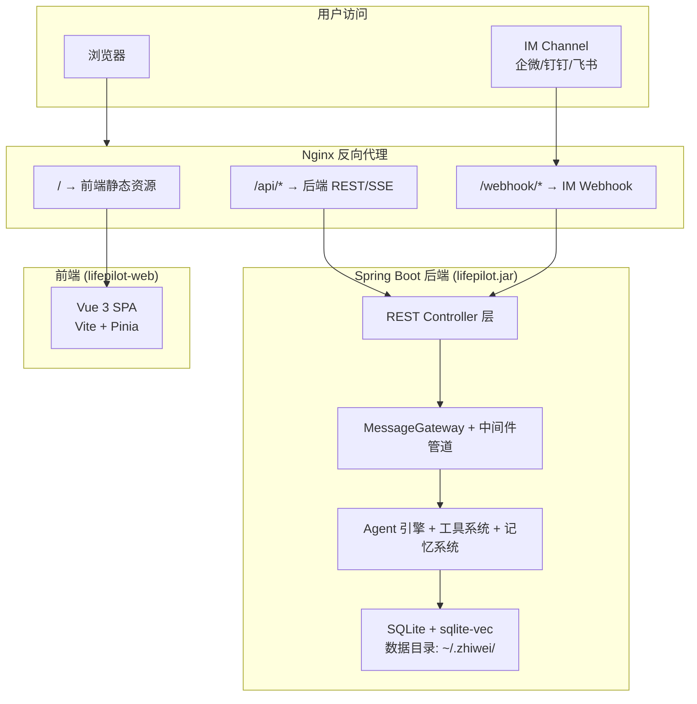

# 部署体验 — 架构设计

> **文档性质**：架构设计文档
> **模块归属**：跨模块（部署基础设施）
> **最后更新**：2026-03

## 1. 模块概述

部署体验模块负责 ZhiWei 的打包、分发、启动和升级全流程，目标是让用户以最低门槛完成部署，无论是本地桌面还是云端 VPS。

### 1.1 核心职责

- **架构简化**：删除 CLI 模式、Tray 模式和 LaunchMode 枚举，后端统一为纯 REST/SSE Web 服务
- **容器化**：Docker 多阶段构建 + docker-compose 编排（后端 + 前端 Nginx 反代）
- **启动脚本**：本地桌面用户的一键启动体验（Java 环境检测、JVM 参数调优、首次引导）
- **配置版本迁移**：应用升级时自动迁移旧版配置到新版格式

### 1.2 不在本模块范围

- GraalVM native image（探索性任务，SQLite JNI + sqlite-vec native 兼容性问题尚未解决，归入远期）
- 多设备数据同步（需要独立的同步协议设计）
- CI/CD 流水线（GitHub Actions 等，归入运维层面）
- 桌面客户端（Electron / Tauri，远期需求；如需桌面体验，Tauri 包一个 WebView 指向本地 Web UI 即可）

---

## 2. 核心概念与术语

| 术语 | 定义 |
|------|------|
| 后端服务 | Spring Boot JAR，提供 REST/SSE API，内嵌 SQLite + sqlite-vec native |
| 前端应用 | Vue 3 SPA（lifepilot-web），独立构建为静态资源，通过 Nginx 部署 |
| 数据目录 | `~/.zhiwei/`（本地）或 Docker Volume 挂载点，存放 SQLite 数据库、配置、日志 |
| 配置版本 | `application.yml` 中的 `lifepilot.config-version` 字段，标识当前配置格式版本 |
| 配置迁移器 | 启动时自动检测配置版本并执行迁移链的组件 |

---

## 3. 架构设计

### 3.1 部署架构总览



### 3.2 架构简化：删除 CLI / Tray / LaunchMode

当前 `LifePilotApplication.main()` 通过 `LaunchMode` 枚举（CLI / WEB / TRAY / FULL）解析启动模式，根据模式注入不同的 Spring 属性。简化后：

**删除的组件：**

| 组件 | 位置 | 说明 |
|------|------|------|
| `LaunchMode` | `com.lifepilot.app` | 启动模式枚举，不再需要 |
| `FastPathRunner` | `com.lifepilot.interaction.cli` | CLI 快速路径，不再需要 |
| `AppConfigProperties` | `com.lifepilot.app` | 包含 launch-mode 配置，不再需要 |
| `interaction/cli/*` | 整个包 | CLI 交互层全部删除（CliShell / CommandRouter / ChatCommand 等） |
| `CliAutoConfiguration` | `interaction/cli/config` | CLI 自动配置 |
| `CliChannelAdapter` | `interaction/channel` | CLI Channel 适配器 |
| `CliAuthStrategy` | `interaction/middleware/auth` | CLI 认证策略 |
| `CliUserConfirmationService` | `interaction/cli` | CLI 用户确认服务 |
| `CliConfigProperties` | `interaction/cli` | CLI 配置属性 |
| `interaction/tray/*` | 整个包 | Tray 模块全部删除（TrayManager / TrayNotificationChannel） |
| `TrayAutoConfiguration` | `interaction/tray/config` | Tray 自动配置 |
| `TrayConfigProperties` | `interaction/tray/config` | Tray 配置属性 |

**简化后的 `LifePilotApplication.main()`：**

```java
public static void main(String[] args) {
    SpringApplication.run(LifePilotApplication.class, args);
}
```

不再需要模式解析、属性注入、FastPath 检测。后端始终以 Web 模式启动。

**关联清理：**

- `ChannelType` 枚举中删除 `CLI` 值
- `application.yml` 中删除 `lifepilot.cli.*` 和 `lifepilot.tray.*` 配置段
- `@ComponentScan` 排除规则中移除 CLI 相关的 pattern（如果有）
- Maven `pom.xml` 中移除 JLine 3 依赖

### 3.3 Docker 多阶段构建

采用多阶段构建，分离编译环境和运行环境，最小化镜像体积。

**后端 Dockerfile 设计：**

```
阶段 1: builder（Maven + JDK 22）
  - 复制 pom.xml，下载依赖（利用 Docker 层缓存）
  - 复制源码，mvn package -DskipTests
  - 产出：target/lifepilot.jar

阶段 2: runtime（JRE 22 slim）
  - 复制 lifepilot.jar
  - 创建数据目录 /data
  - ENTRYPOINT: java -jar lifepilot.jar
  - EXPOSE 8080
```

**前端 Nginx 配置：**

```
阶段 1: builder（Node 22 alpine）
  - npm ci + npm run build
  - 产出：dist/

阶段 2: runtime（nginx:alpine）
  - 复制 dist/ 到 /usr/share/nginx/html
  - 复制 nginx.conf（SPA fallback + API 反代）
  - EXPOSE 80
```

**Nginx 核心配置要点：**

- `/` → 前端 SPA，`try_files $uri $uri/ /index.html`
- `/api/` → `proxy_pass http://backend:8080`
- `/api/chat/*/stream` → SSE 专用配置（`proxy_buffering off`、`proxy_read_timeout 3600s`）
- `/webhook/` → `proxy_pass http://backend:8080`
- gzip 压缩静态资源

### 3.4 docker-compose 编排

```yaml
services:
  backend:
    build: .
    ports:
      - "8080:8080"        # 可选：直接暴露后端（调试用）
    volumes:
      - lifepilot-data:/data
    environment:
      - SPRING_PROFILES_ACTIVE=docker
      - LIFEPILOT_DATA_DIR=/data
    restart: unless-stopped

  frontend:
    build: ./lifepilot-web
    ports:
      - "80:80"
    depends_on:
      - backend
    restart: unless-stopped

volumes:
  lifepilot-data:
```

**Docker profile 配置（`application-docker.yml`）：**

- 数据目录指向 `/data`（Volume 挂载点）
- 日志输出到 stdout（容器日志收集友好）
- SQLite 数据库路径：`/data/lifepilot.db`

### 3.5 启动脚本

提供 `start.sh`（Linux/macOS）和 `start.bat`（Windows）一键启动脚本，面向不使用 Docker 的桌面用户。

**核心功能：**

1. **Java 环境检测**：检查 `java` 命令是否可用，版本是否 ≥ 22
2. **JVM 参数调优**：根据可用内存自动设置 `-Xmx`（默认取系统内存的 50%，上限 2G）
3. **数据目录初始化**：首次运行时创建 `~/.zhiwei/` 目录结构
4. **启动后端服务**：`java $JVM_OPTS -jar lifepilot.jar`
5. **友好错误提示**：Java 未安装或版本不对时，输出清晰的安装指引

**不包含的功能：**

- 不启动前端（前端由用户自行部署或通过 Docker 启动）
- 不做进程守护（用户可自行配置 systemd / launchd / Windows Service）
- 不做自动更新

### 3.6 配置版本迁移

应用升级时，配置格式可能发生变化（如配置键重命名、结构调整）。配置版本迁移机制确保旧配置自动适配新版本。

**设计方案：**

```java
// 配置迁移器接口
public interface ConfigMigration {
    int fromVersion();          // 源版本
    int toVersion();            // 目标版本
    void migrate(Map<String, Object> config);  // 执行迁移
}
```

**迁移流程：**

1. 应用启动时，`ConfigMigrationRunner`（实现 `ApplicationRunner`）读取当前配置版本
2. 查找从当前版本到最新版本的迁移链
3. 按顺序执行每个迁移步骤
4. 更新配置版本号
5. 如果没有需要迁移的内容，跳过

**配置版本存储：**

- `application.yml` 中声明 `lifepilot.config-version: 1`
- 每次有破坏性配置变更时，递增版本号并编写对应的 `ConfigMigration` 实现
- 当前为 v1（首个版本），本模块建立迁移框架，暂无实际迁移脚本

---

## 4. 关键设计决策

| 决策 | 选择 | 理由 |
|------|------|------|
| 删除 CLI 模式 | 是 | Web UI 已覆盖核心交互，CLI 维护成本高，JLine 依赖重 |
| 删除 Tray 模式 | 是 | 通知推送可通过 IM Channel / Web Notification 实现，桌面托盘跨平台兼容性差 |
| 删除 LaunchMode | 是 | 只剩 Web 模式，枚举无存在必要 |
| 前后端分离部署 | 是 | 前端 Nginx 静态部署，后端纯 API 服务，职责清晰，可独立扩展 |
| Docker 多阶段构建 | 是 | 分离编译和运行环境，最小化镜像体积 |
| 不做 GraalVM native | 是 | SQLite JNI + sqlite-vec native 兼容性问题未解决，归入远期 |
| 不做桌面客户端 | 是 | 浏览器即客户端，远期如需可用 Tauri WebView 包装 |
| 配置迁移用代码而非脚本 | 是 | Java 代码可测试、可调试，比 shell 脚本可靠 |

---

## 5. 与已有模块的集成点

| 集成模块 | 集成方式 | 说明 |
|---------|---------|------|
| Web UI（模块 18/19） | Nginx 反代 | 前端静态资源通过 Nginx 服务，API 请求反代到后端 |
| Gateway（模块 13） | 保持不变 | MessageGateway 中间件管道继续工作，只是不再有 CLI Channel |
| IM Channel（模块 13） | Nginx 反代 | Webhook 端点通过 Nginx 转发到后端 |
| 主动推理（模块 12） | IM Channel | 通知推送走 IM Channel 而非 Tray 通知 |

---

## 6. 调研参考

本模块为纯工程实践模块，主要参考：

- **Spring Boot Docker 官方指南**：多阶段构建最佳实践（[Spring Boot Docker](https://spring.io/guides/topicals/spring-boot-docker)）
- **Nginx 反向代理 + SPA 配置**：`try_files` fallback + SSE proxy 配置
- **Docker Compose v2 规范**：服务编排、Volume 管理、环境变量注入
