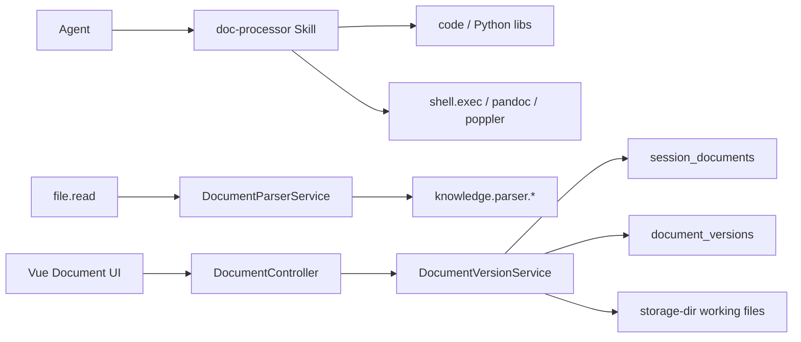

# 文档工作空间架构

> **最后更新**：2026-05-04
> **状态**：Java 文档生成/编辑工具已下架；保留解析 facade 与历史工作副本 REST 基础设施。

## 1. 当前边界

文档处理能力拆成两条链路：

1. **Agent 文档处理链路**：`doc-processor` Skill + `code` / `shell.exec` / Python 库 / CLI。负责生成 Word/Excel/PPT、PDF 抽取、格式转换、批量处理。
2. **后端基础设施链路**：`com.lifepilot.document` 中保留的 parser facade、历史工作副本元数据、版本链、REST 下载与用户确认动作。

旧的 `document.create` / `document.edit` BuiltinTool 不再注册给 Agent，也不再作为工具检索目标。

## 2. 保留组件

| 组件 | 作用 | 保留原因 |
|---|---|---|
| `DocumentParserService` | 按扩展名路由 Markdown/Text/Word/PDF/Excel/PowerPoint parser | `file.read` 多格式解析依赖 |
| `DocumentController` | `/api/documents/**` REST | 前端历史工作副本、DiffCard、下载入口依赖 |
| `SessionDocumentRepository` | `session_documents` 元数据 | 历史文档资产、渠道文件投递、前端列表依赖 |
| `DocumentVersionRepository` | `document_versions` 版本链 | 历史工作副本版本/diff/rollback 依赖 |
| `DocumentVersionService` | commit/rollback/discard/diff 编排 | REST 用户动作依赖 |
| docx/xlsx patch/diff engine | 对已有版本计算和工作副本处理 | 只服务保留的工作区基础设施 |

## 3. 已删除组件

Java POI 文档生成器已删除：

- `DocumentGenerator`
- `ExcelGenerator`
- `PowerpointGenerator`
- `MarkdownToDocxGenerator`
- `StructuredDataToXlsxGenerator`
- `OutlineToPptxGenerator`
- `SheetData`
- `SlideData`
- `DocumentGenerationException`

这些能力由 `doc-processor` Skill 的脚本和 Python/CLI 工具替代。

## 4. 运行时关系

## 5. 后续可删除范围

如果产品上不再需要历史工作副本和前端 DiffCard，可整体删除：

- `DocumentController`
- `DocumentVersionService`
- `document.patch.*`
- `DocumentVersionRepository`
- `SessionDocumentRepository`
- `DocumentDiffCard` / `DocumentXlsxDiffCard` / `DocumentWorkspacePanel`
- `session_documents` / `document_versions` 相关迁移和测试

不要单独删除其中一层；这些组件互相依赖，必须作为一次独立重构处理。
