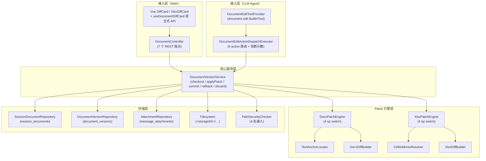
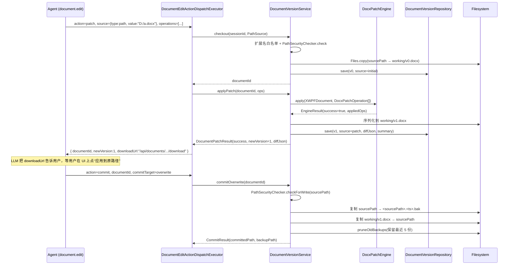
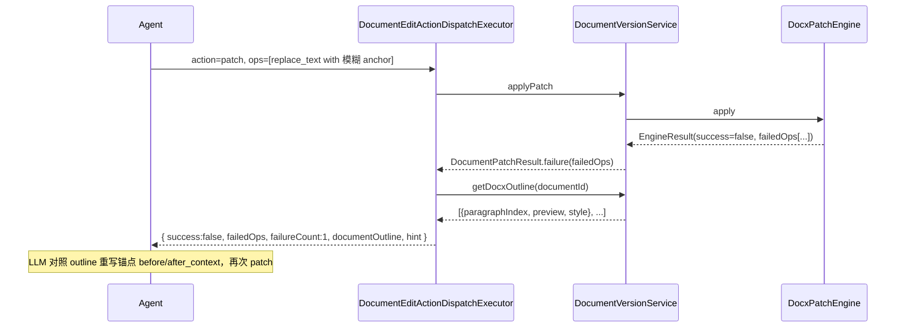
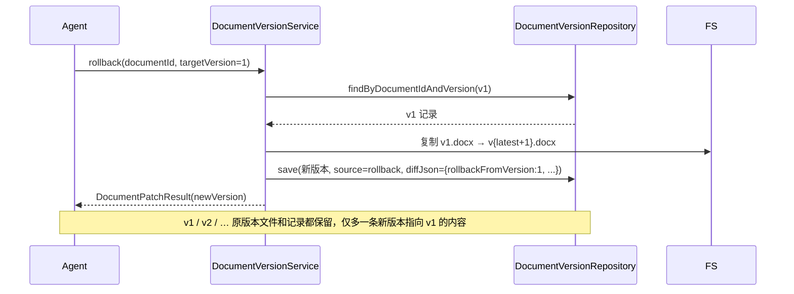

# 文档工作空间 — 架构设计

> **文档性质**：架构设计文档
> **模块归属**：`com.lifepilot.document`
> **最后更新**：2026-04-22
> **实现状态**：✅ Phase 0 → 3B 已完成（docx / xlsx 支持锚点编辑与版本链；pptx 仅支持从零创建）

## 1. 模块概述

文档工作空间为知微提供对本地已存在 docx / xlsx 文档的锚点式增量编辑能力，以「签出工作副本 → 逐次 patch 生成新版本 → 由用户决定 commit / rollback / 丢弃」为核心生命周期，保证 AI 侧的每次修改都保留完整版本链与物理回滚能力。`pptx` 目前仅通过 `document.create` 从零生成，不进入 patch 管线。

Phase 演进简介：

| Phase | 里程碑 | 产物 |
|-------|-------|------|
| Phase 0 | document 模块骨架 + `DocumentProperties` 配置 | `com.lifepilot.document` 骨架 |
| Phase 2A | `session_documents` 表 + `DocumentController` 下载端点 | Flyway V12 + 生成器（markdown→docx / 结构化→xlsx / 大纲→pptx） |
| Phase 2B | 三类 create executor 合并为单 `document.create` 工具 + action 枚举 | `DocumentToolProvider` + `DocumentCreateActionDispatchExecutor` |
| Phase 3A | 工作副本 + 版本链 + docx 锚点 patch + 5 个 REST 端点 | Flyway V13/V14、`DocumentVersionService`、`DocxPatchEngine`、`document.edit` 工具 |
| Phase 3B | xlsx 锚点 patch（`XlsxPatchEngine` + `XlsxDiffBuilder`）+ 熔断 + path 安全兜底 | sealed interface 分层、`PathSecurityChecker` 接入、4 点集成 |

### 1.1 问题域

| 现有能力 | 缺口 |
|----------|------|
| `file.read` / `file.write` | 只能对 UTF-8 文本行级改写，遇到 OOXML 二进制直接读出乱码 |
| `document.create` | 只能从结构化数据从零生成产物，无法在已有 docx / xlsx 上做局部修改 |
| `knowledge.search` | 检索但不编辑 |

对「改一下某份 docx 的第 3 段」「把 xlsx 里 B5 改成 5.5」「给表格加一行」这类高频需求，缺乏既能保留格式又保留版本历史的通道。

### 1.2 设计目标

- 锚点式增量编辑：docx 以文本锚点、xlsx 以 A1 地址唯一定位，保留原 run / CellStyle 样式。
- 工作副本与源隔离：所有 patch 写入 `<storageDir>/<sessionId>/working/<documentId>/` 下，源文件不动，直到用户显式 commit。
- 版本链完整可追溯：每次 patch 生成 `v1 / v2 / …` 物理文件并落 `document_versions` 行，diff JSON 随版本持久化。
- 事务性与熔断：单次 patch 内多 op 整批成败一致；同一文档连续失败 3 次强制熔断，阻止 LLM 死循环。
- 安全兜底：对 LLM 提供的本地路径 / saveAsPath 走 `PathSecurityChecker`，同一套白名单与 `file.read` 对齐。


## 2. 架构图




## 3. 核心数据模型

### 3.1 SessionDocumentRecord（会话级文档元数据）

```java
public record SessionDocumentRecord(
        String id,                 // UUID
        String sessionId,          // 所属会话，FK session_store
        @Nullable String entryId,  // 关联的 transcript 条目
        String fileName,           // 用户可见文件名（含扩展名）
        String filePath,           // 当前“最新工作副本”绝对路径（patch/rollback 后会改写）
        long fileSize,             // 当前 filePath 文件大小
        String mimeType,           // DOCX_MIME / XLSX_MIME / pptx 对应 MIME
        String origin,             // 来源常量（5 个）
        @Nullable String sourcePath, // 本机路径源首次 checkout 时填，附件/AI 产物为 null
        int latestVersion,         // 0 = 未被 patch 过；递增 1/2/3…
        Instant createdAt
) {}
```

Origin 常量（`SessionDocumentRecord` 内定义）：

| 常量 | 场景 |
|------|------|
| `agent_generated` | AI 通过 `document.create` 生成 |
| `user_upload` | 用户直接上传（前端附件） |
| `template_rendered` | 模板渲染产物（预留） |
| `user_local_file` | 用户给本机路径，`checkoutFromPath` 首次签出 |
| `user_attachment_edited` | 用户贴附件后 `checkoutFromAttachment` 首次签出 |

### 3.2 DocumentVersionRecord（版本链）

```java
public record DocumentVersionRecord(
        String id,                 // 版本记录 UUID
        String documentId,         // FK session_documents.id
        int versionNo,             // 0 = initial；patch/rollback 时递增
        String filePath,           // 该版本物理文件绝对路径 working/<documentId>/v{n}.{ext}
        String source,             // initial / patch / rollback
        @Nullable String patchSummary, // 一句话摘要，如“共 3 处修改(replace_text x2, add_table_row x1)”
        @Nullable String diffJson, // 缓存的 diff JSON 字符串（rollback 有简化 payload）
        Instant createdAt
) {}
```

Source 常量：`SOURCE_INITIAL = "initial"` / `SOURCE_PATCH = "patch"` / `SOURCE_ROLLBACK = "rollback"`。

### 3.3 数据库表（Flyway V12 / V13 / V14）

```sql
-- V12 创建 session_documents（Phase 2A）
CREATE TABLE session_documents (
    id           TEXT PRIMARY KEY,
    session_id   TEXT NOT NULL,
    entry_id     TEXT,
    file_name    TEXT NOT NULL,
    file_path    TEXT NOT NULL,
    file_size    INTEGER NOT NULL,
    mime_type    TEXT NOT NULL,
    origin       TEXT NOT NULL,
    created_at   TEXT NOT NULL,
    FOREIGN KEY (session_id) REFERENCES session_store(session_id) ON DELETE CASCADE
);

-- V13 扩展为工作副本 + 新建 document_versions（Phase 3A）
ALTER TABLE session_documents ADD COLUMN source_path     TEXT;
ALTER TABLE session_documents ADD COLUMN latest_version  INTEGER NOT NULL DEFAULT 0;

CREATE TABLE document_versions (
    id             TEXT PRIMARY KEY,
    document_id    TEXT NOT NULL,
    version_no     INTEGER NOT NULL,
    file_path      TEXT NOT NULL,
    source         TEXT NOT NULL,
    patch_summary  TEXT,
    diff_json      TEXT,
    created_at     TEXT NOT NULL,
    FOREIGN KEY (document_id) REFERENCES session_documents(id) ON DELETE CASCADE,
    UNIQUE (document_id, version_no)
);

-- V14 session + source_path 唯一：同一 session 内同 path 只能有一份工作副本（Phase 3A 补丁）
CREATE UNIQUE INDEX uk_session_documents_source_path
    ON session_documents(session_id, source_path)
    WHERE source_path IS NOT NULL;
```

### 3.4 Patch 操作的 sealed interface 分层

```java
public sealed interface DocumentPatchOperation
        permits DocxPatchOperation, XlsxPatchOperation { String reason(); }

public sealed interface DocxPatchOperation extends DocumentPatchOperation
        permits ReplaceTextOp, InsertParagraphAfterOp, DeleteParagraphOp, AddTableRowOp {}

public sealed interface XlsxPatchOperation extends DocumentPatchOperation
        permits UpdateCellOp, InsertRowOp, DeleteRowOp, SetRangeOp {}
```

设计权衡：

- 顶层 `DocumentPatchOperation` 面向 LLM 和 `ActionDispatchExecutor.parseOperations()`，只暴露统一协议与 `reason` 字段。
- 第二层按 MIME 分到 `DocxPatchOperation` / `XlsxPatchOperation`，`DocxPatchEngine` 与 `XlsxPatchEngine` 各自按子接口做 pattern matching switch，Java 22 sealed + record 保证穷尽性。
- `DocumentVersionService.castDocxOps` / `castXlsxOps` 在运行时以 `instanceof` 校验，LLM 若在同一批里混用 docx 与 xlsx op，立即抛 `IllegalArgumentException` 并带明确错误消息。

### 3.5 存储目录布局

```
<storageDir>/                                   # 默认 ~/.zhiwei/documents
├── <documentId>_<fileName>                     # document.create 落盘的原始字节；discard 时按前缀扫清
└── <sessionId>/
    └── working/
        └── <documentId>/
            ├── v0.docx                         # checkout 签出快照
            ├── v1.docx                         # patch 后新版本
            └── v2.docx
```

- 工作副本文件名固定 `v{N}.{ext}`，扩展名由 `workingExtension(mimeType)` 派生（`.docx` / `.xlsx`）。
- `session_documents.file_path` 在每次 patch / rollback 后被改写为最新 `v{N}.{ext}`，`document_versions.file_path` 是该次版本的不可变指向。
- `storageDir` 由 `DocumentProperties.storageDir` 配置（默认 `${user.home}/.zhiwei/documents`）。


## 4. 核心组件

### 4.1 DocumentVersionService（生命周期编排器）

职责：把 sealed 分层的 patch 操作串成「签出 → patch → commit / rollback / discard」完整链路。不标 `@Service`，由 `DocumentAutoConfiguration` 用 `@Bean` 显式装配以注入 `storageDir` 字符串与 `PathSecurityChecker`。

两个聚合 record 压缩构造器入参：

```java
public record DocumentRepositories(
        SessionDocumentRepository documents,
        DocumentVersionRepository versions,
        AttachmentRepository attachments) {}

public record PatchEngines(
        DocxPatchEngine docxEngine,
        DocxDiffBuilder docxDiffBuilder,
        XlsxPatchEngine xlsxEngine,
        XlsxDiffBuilder xlsxDiffBuilder) {}
```

#### 4.1.1 checkout

根据 `SourceRef`（`PathSource` / `AttachmentSource` / `DocumentSource`）统一分发：

| 子类型 | 行为 |
|--------|------|
| `PathSource` | 扩展名白名单校验（仅 `.docx` / `.xlsx`）→ `PathSecurityChecker.check` → 若 `session+sourcePath` 已有记录直接复用；否则复制到 `working/v0.{ext}`，写入 `session_documents`（`origin=user_local_file`） + `document_versions v0`。 |
| `AttachmentSource` | 扩展名 / mimeType 白名单（docx / xlsx）→ 从附件 filePath 复制到 `working/v0.{ext}`，`origin=user_attachment_edited`。 |
| `DocumentSource` | 复用已有 `documentId`；若 `latestVersion == 0` 则把 Phase 2 的原始字节复制为 `v0`，并把 `session_documents.file_path` 指向 `working/v0`。 |

#### 4.1.2 applyPatch

按 `record.mimeType()` 分支到 `applyDocxPatch` / `applyXlsxPatch`；默认分支抛 `IllegalStateException("不支持的 MIME：…")`。

每次 patch 的事务语义：
1. 打开 `current filePath` 为 POI `XWPFDocument` / `XSSFWorkbook`。
2. Engine 顺序应用 ops，任一失败立即返回 `DocumentPatchResult.failure(failedOps)`，内存对象由 `try-with-resources` 丢弃（天然回滚）。
3. 全部成功：序列化为字节 → 写入 `working/v{N+1}.{ext}` → `DocumentVersionRepository.save` 新版本记录 → `SessionDocumentRepository.updateLatestVersion` + `updateFilePath` → 同步更新 `message_attachments.size`（若附件挂在 transcript 上）。

返回结构：

```java
public record DocumentPatchResult(
        boolean success,
        int newVersion,
        @Nullable String diffJson,
        @Nullable String patchSummary,
        List<FailedOp> failedOps
) {}

public record FailedOp(int opIndex, String opType, String reason, int matchCount, String hint) {}
```

#### 4.1.3 commit / rollback / discard

| 操作 | 流程 |
|------|------|
| `commitOverwrite(documentId)` | 校验 `sourcePath` 非空 → `PathSecurityChecker.checkForWrite(sourcePath)` → 若源文件存在先复制为 `<sourcePath>.yyyyMMddHHmmss.bak` → `Files.copy` 工作副本字节到 sourcePath → 调用 `pruneOldBackups` 保留最近 5 份自动 `.bak`。 |
| `commitSaveAs(documentId, saveAsPath)` | `checkForWrite(saveAsPath)` → `Files.createDirectories(parent)` → `Files.copy` 到 saveAsPath；不生成 `.bak`。 |
| `rollback(documentId, targetVersion)` | 校验目标版本存在 → 将目标版本文件复制为新的 `working/v{latest+1}.{ext}` → 写入 `document_versions` 行（`source=rollback`，`diffJson` 为简化 payload：`{documentId, fromVersion, toVersion, summary, rollbackFromVersion, changes:[]}`）→ 更新 `latest_version`。版本链不抹除历史，只追加。 |
| `discard(documentId)` | `UUID.fromString(documentId)` 格式校验 → 校验 `latestVersion ≥ 1` → 递归删 `<storageDir>/<sessionId>/working/<documentId>/` 整个目录 → 删 `document_versions` 里所有版本 filePath → 删 `record.filePath` → 按 `<documentId>_` 前缀扫 `storageDir` 根清理 create 落盘的原始字节孤儿 → 删 `document_versions` 表行 → 删 `session_documents` 表行。 |

#### 4.1.4 getDocxOutline（patch 失败时的 hint 源）

仅对 docx MIME 有意义，xlsx 返回空列表。打开最新工作副本，按段落输出 `paragraphIndex` / `preview`（≤ 80 字，长则后缀 `…`） / 可选 `style`。空段落跳过，异常与路径校验失败均 soft fail 返回空列表，不中断 patch 链路。

### 4.2 DocxPatchEngine（docx 锚点引擎）

4 个 op 的定位与改写策略：

| op | 定位器 | 改写策略 |
|----|--------|----------|
| `replace_text` | `TextAnchorLocator.locate(doc, before, target, after)` —— 段内查找 `before+target+after` 拼接串的唯一出现，返回 `ParagraphRunRange`。 | 首 run 保留前缀 + 新文本；中间 run 清空；尾 run 保留后缀。首 run 样式（字体 / 字号 / 颜色 / 粗斜体）自动传承。 |
| `insert_paragraph_after` | `locateParagraphIndexByFullText` —— 要求 `anchorParagraphText` 在全文精确匹配一个段落。 | 用 `XmlCursor.toEndToken().toNextToken()` 定位到 anchor 之后，`doc.insertNewParagraph(cursor)` 逆序插入（保持最终顺序），对每段调用 `setStyle(Heading1/2/3/ListBullet/Normal)`。 |
| `delete_paragraph` | 同 `insert_paragraph_after`。 | `doc.removeBodyElement(posOfParagraph)` 按 body-element 下标删除。 |
| `add_table_row` | `findTableByAnchor` —— 扫全表格的单元格 text，anchor 必须在单表内命中。 | `position=start` 走 `insertNewTableRow(0)` 并手动补齐 cell；`position=end` 走 `createRow()`。`cells.size()` 必须等于表格列数，否则抛 `cells_mismatch`。 |

所有定位失败走内部 `PatchLocatorException`，apply 转为 `FailedOp(opIndex, opType, reason, matchCount, hint)`；`reason` 枚举：

- `locator_not_unique_or_missing`
- `anchor_paragraph_not_unique_or_missing`
- `paragraph_text_not_unique_or_missing`
- `table_anchor_not_unique_or_missing`
- `cells_mismatch`
- `execution_error`

### 4.3 XlsxPatchEngine（xlsx 锚点引擎）

4 个 op 的定位与改写：

| op | 定位与校验 | 改写策略 |
|----|------------|----------|
| `update_cell` | `CellAddressResolver.parseCell("B5")` 剥 `$`、upper-case、拒绝含 `!` 的 sheet-prefix；`checkNotInsideMergedRegion` 拒绝合并区域内非 anchor 的格。 | `writeCellValue` 多态写入：`Number`→数值格；`Boolean`→布尔格；`String` 以 `=` 开头→`setCellFormula`（剥前缀）；其它 `String`→字面量；`null`→`setBlank`。保留 `CellStyle`（POI 默认行为）。 |
| `insert_row` | 校验 `beforeRow ∈ [1, lastRow+2]`。 | 若 `beforeRow > lastRow` 直接 `createRow(targetIdx)` 追加；否则 `sheet.shiftRows(targetIdx, lastRow, 1)` 下移再 `createRow`。values 按 0-based 列写入，公式引用自动 +1（POI shiftRows 行为）。 |
| `delete_row` | 校验 `row ∈ [1, lastRow+1]`；若行横跨合并区域直接抛 `row_in_merged_region`。 | `removeRow` + 若非末行 `shiftRows(idx+1, lastRow, -1)` 上移。 |
| `set_range` | `CellAddressResolver.parseRange("B2:D4")`；校验 `values` 外层长度 = 行数，每行长度 = 列数；任何合并区域与 range 相交直接抛 `range_contains_merged_region`。 | 逐格 `writeCellValue`，不做样式改动。 |

Reason 枚举：

- `sheet_not_found`
- `invalid_cell_address` / `invalid_range`
- `cell_inside_merged_region` / `row_in_merged_region` / `range_contains_merged_region`
- `invalid_row_number` / `row_not_found`
- `range_size_mismatch`
- `execution_error`

### 4.4 DocumentEditToolProvider + DocumentEditActionDispatchExecutor（Agent 工具）

单一 BuiltinTool `document.edit`（`MEDIUM` 风险，`WRITE_FILE`，`SEQUENTIAL`），`action` 枚举路由到 5 个 handler：

| action | 风险 | 权限类型 | 说明 |
|--------|------|----------|------|
| `patch` | LOW | WRITE_FILE | 首次会调 `checkout(sessionId, source)`，后续走 `applyPatch`；失败累计入 `patchFailCounter`。 |
| `diff` | LOW | READ_FILE | 取 `to` 版本缓存的 `diffJson`（简化语义，不支持任意双向对比）。 |
| `commit` | MEDIUM | WRITE_FILE | 根据 `commitTarget ∈ {overwrite, saveAs}` 分派，用户动作，LLM 不应主动调用。 |
| `rollback` | LOW | WRITE_FILE | 回滚后清 `patchFailCounter` 中匹配 `:documentId` 的条目。 |
| `list_versions` | LOW | READ_FILE | 返回 `{versionNo, source, summary, createdAt}` 列表。 |

**熔断机制**：`MAX_PATCH_FAILURES = 3`。同一 `sessionId:documentId` 连续失败 3 次后，下次 patch 直接返回 error 并清空计数；patch 成功或 rollback 成功都会清计数。`FAIL_COUNTER_WARN_THRESHOLD = 1024` 用作容量告警，出现告警说明 session 泄漏。

Patch 失败返回结构（除 `failedOps` 外）：

```json
{
  "success": false,
  "documentId": "…",
  "failedOps": [ { "opIndex": 0, "opType": "replace_text", "reason": "locator_not_unique_or_missing", "matchCount": 0, "hint": "…" } ],
  "failureCount": 2,
  "maxAllowedFailures": 3,
  "documentOutline": [ { "paragraphIndex": 3, "preview": "…", "style": "Heading1" } ],
  "hint": "failedOps 无法匹配，请对照 documentOutline 里每段的 preview 重写 locator 的 before_context/target/after_context；若累计失败接近 3 次请停下和用户确认。"
}
```

`documentOutline` 只对 docx 非空，xlsx 当前不回 outline（xlsx 的失败 hint 直接放在 `FailedOp.hint` 里）。

### 4.5 DocumentController（Web REST）

Base Path `/api/documents`，`@ConditionalOnProperty(lifepilot.gateway.channels.web.enabled=true)` 装载。7 个端点，`download` 返回二进制 `ByteArrayResource`，`discardWorkingCopy` 返回 `ResponseEntity<Void>` (204)，其余 5 个走 `ApiResponse<T>`。完整端点列表见 [API_ENDPOINTS.md#documents文档工作空间](../API_ENDPOINTS.md#documents文档工作空间)。

错误语义对齐：
- `IllegalArgumentException` / `IllegalStateException` → 400
- 文档或版本缺失 / 物理文件丢失 → 404
- `IOException` → 500

### 4.6 DocumentAutoConfiguration（装配）

`@AutoConfiguration` + `@ConditionalOnProperty(lifepilot.document.enabled, matchIfMissing=true)`，分两段装配：

1. **Phase 2B（create 链）**：3 个 generator → 3 个 `DocumentCreate*ToolExecutor` → `DocumentCreateActionDispatchExecutor` → `DocumentToolProvider` → `document.create` BuiltinTool。
2. **Phase 3A/3B（edit 链）**：`TextAnchorLocator` → `DocxPatchEngine` + `DocxDiffBuilder`；`XlsxPatchEngine` + `XlsxDiffBuilder` 无依赖直接装配 → `DocumentVersionService`（显式 new `PathSecurityChecker(metaProperties.getInfra().getFile())` 注入）→ `DocumentEditActionDispatchExecutor` → `DocumentEditToolProvider` → `document.edit` BuiltinTool。

两个 BuiltinTool 通过 `lifepilot.tool.tier1.pinned` 纳入 Tier 1 常驻可见集合（参见 [工具系统架构](tool-ecosystem.md)）；未在 pinned 时也可通过 `tools.search` 被 LLM 发现。

### 4.7 前端渲染（Vue）

组件层次：

- `DocumentDiffHeader.vue` —— 顶部条（fileName / latestVersion / 下载 / 版本历史展开）。
- `DocumentDiffActions.vue` —— 底部三按钮（应用到原路径 / 另存为 / 丢弃）。`canOverwrite` 根据 `metadata.sourcePath` 决定。
- `DocumentDiffCard.vue` —— docx 差异渲染，segments 用 `keep/delete/insert` 三色染。
- `DocumentXlsxDiffCard.vue` —— xlsx 差异渲染，按 change 项分组列 cell / row / range。
- `DocumentVersionHistoryList.vue` —— 分页展开版本链。
- `useDocumentDiffCard.ts` —— 两个卡片共享：拉 metadata → 拉 diff（`from=latest-1, to=latest`）→ commit / saveAs / discard / rollback 统一二次确认。
- `useDocumentMeta.ts` —— 独立拉 `GET /api/documents/{id}` 的轻量组合式 API。

`MessageBubble.vue` 按 `attachment.mimeType` 分派：docx → `DocumentDiffCard`，xlsx → `DocumentXlsxDiffCard`，其它仍走普通附件 UI。


## 5. 核心流程

### 5.1 path 源完整链路：checkout → patch → commit overwrite



### 5.2 patch 失败 → LLM 重规划



### 5.3 rollback（生成新版本，不抹历史）




## 6. 设计决策

| 决策 | 选择 | 备选 | 理由 |
|------|------|------|------|
| 编辑模型 | 锚点定位（before+target+after / A1 地址） | 行号 / 绝对偏移 / diff-patch | 行号脆弱（中途有插入就失效），offset 对 LLM 不友好；锚点对齐 LLM 读文档的自然表达 |
| 定位器作用域 | docx 仅段内定位 | 跨段 / 跨文档 | POI run 天然段内组织，跨段很少见且逻辑复杂；跨段场景由 LLM 拆成多个 op 解决 |
| 事务语义 | 整批成败一致 | 部分成功部分失败 | LLM 收到混合结果难以决策；整批失败丢弃内存对象 = 天然原子回滚 |
| 版本存储 | 每版独立文件 + 关系表 | 行级 diff 累加 | 每版独立恢复 O(1)；OOXML 二进制不适合行 diff |
| Rollback 语义 | 追加新版本指向历史内容 | 物理删除后续版本 | 回滚后还能再回滚到任意版本；diff 链不丢信息 |
| sealed 分层 | 两层 sealed interface（顶层 + docx/xlsx 子层） | 单层 sealed with all ops | 让两个 Engine 的 switch 保持穷尽性；LLM 侧的顶层 API 依然统一 |
| 工作目录 | `<storageDir>/<sessionId>/working/<documentId>/` | 全局共享 working 目录 | 会话隔离，session 级 discard 语义清晰；多会话并发不互相覆盖 |
| 熔断次数 | 3 次 | 无熔断 / 5 次 | 3 次是 LLM 实测重规划能收敛的上限，再多就是锚点理解偏差需要用户介入 |
| commit backup 策略 | 每次自动 `.ts.bak` + 保留最近 5 份 | 永久保留 / 不备份 | 保留最近 5 份兼顾「反悔」与「磁盘占用」；精确 regex 只匹配自动备份，不误伤手工 `.bak` |
| 单 BuiltinTool + action | `document.edit` + 5 action 扁平 schema | 每 action 单工具 | 对齐 `git.mutate` / `datastore` 模式，减少 LLM 侧 schema 噪声 |


## 7. SQLite WAL 运维风险

知微默认使用 SQLite + WAL 模式（`~/.zhiwei/zhiwei.db`）。WAL 允许多读单写，但**单写入者**仍然意味着：

- 一次 `applyPatch` 内会串联 3 条写操作：`document_versions` INSERT + `session_documents` UPDATE(latest_version, file_path) + `message_attachments` UPDATE(size)。当前 `applyDocxPatch` / `applyXlsxPatch` 不标注 `@Transactional`，各语句自动提交，对单写入者的压力主要来自「单次 patch 里三条 SQL 的连续短突发」。
- 大文档（数百 KB 以上）的 POI 序列化阶段（`doc.write(bos)` 到 `ByteArrayOutputStream`）与磁盘写入 `Files.write(nextFile, bytes)` 会占用一段 CPU / IO 时间；若 LLM 连续发起多个大 patch，多次突发写入点会叠加。

运维建议：

1. **commit 后尽快释放**：`commit` / `rollback` 后若用户不再继续编辑，鼓励走 `discard` 归还工作目录与记录；长期堆积会拖慢 `listVersions` 的 `COUNT(*)` 与 `document_versions` 读扫描。
2. **单次 patch 保持短突发**：ops 越多，POI 对 XWPFDocument / XSSFWorkbook 的内存操作耗时越长，期间 try-with-resources 持有 POI 句柄但不占 DB 连接；等 `Files.write` 返回后才下 3 条 SQL。尽量不要在一次 patch 里塞几十上百个 op，建议拆分成多次。
3. **跨多个大文件编辑场景**：若 AI 需要批量改同一 session 下多个大 docx / xlsx，考虑在 agent 侧让用户一次只处理一份文档，避免并发 patch 集中叠加写入。
4. **不要修改已有迁移**：V12 / V13 / V14 已全部执行，任何字段 / 索引调整必须新建 V15+。


## 8. 安全设计

### 8.1 PathSecurityChecker 接入

共 4 处接入点（均使用与 `FileReadToolExecutor` / `FileWriteToolExecutor` 相同的白名单 / 黑名单配置）：

| 接入点 | 调用 | 场景 |
|--------|------|------|
| `checkoutFromPath` | `check(source)` | LLM 给出本机路径时，防越界到系统敏感目录（`~/.ssh`、`/etc` 等） |
| `commitOverwrite` | `checkForWrite(target)` | 即便 sourcePath 入库时校验过，再校一次以防配置变化或数据库被篡改 |
| `commitSaveAs` | `checkForWrite(target)` | LLM / 用户提供的另存路径必须校验 |
| `getDocxOutline` | `check(filePath)` | patch 失败时的 hint 函数，多一层校验兜住历史脏数据和 symlink 攻击；校验失败 soft fail 返回空列表 |

`checkoutFromAttachment` **不调用** `PathSecurityChecker`，因为附件路径是知微自身托管的 `attachments` 表记录，已由 Gateway 入口的 Attachment 管线校验。

### 8.2 输入白名单

- `checkoutFromPath`：扩展名只允许 `.docx` / `.xlsx`，避免 LLM 注入让 AI 复制 `.exe` / `.bat` 等进工作目录。
- `checkoutFromAttachment`：同时校验 `fileName` 扩展名和 `attachment.mimeType`，任一匹配 docx / xlsx 才放行。
- `discard`：`UUID.fromString(documentId)` 格式校验，防止 `../` / `*` 等字符穿越到 storageDir 外。

### 8.3 commit 的 .bak 自动清理

- `BACKUP_RETENTION_COUNT = 5`：保留最近 5 份（按文件名 `yyyyMMddHHmmss` 时间戳字典序倒排）。
- `BACKUP_FILENAME` regex 精确匹配 `^.+\.(\d{14})\.bak$`，不误伤手工命名的 `.bak`。
- `pruneOldBackups` best-effort：任何 IO 异常只 warn，不影响 commit 主流程。


## 9. 集成点

| 依赖模块 | 交互方式 | 说明 |
|----------|---------|------|
| Tool System（`com.lifepilot.tool`） | BuiltinTool 注册 | `document.create` + `document.edit` 两个 BuiltinTool 由 `DocumentAutoConfiguration` 装配；Tier 1 可见性由 `lifepilot.tool.tier1.pinned` 控制，未 pin 时由 `tools.search` 按需发现 |
| Skill System（`com.lifepilot.skill`） | Skill 定义 | `src/main/resources/skills/document-workspace/SKILL.md`，`skill.load(names=["document-workspace"])` 按需激活 |
| Web Gateway（`com.lifepilot.interaction.web`） | REST 暴露 | `DocumentController` 依赖 Web 通道开关；`MessageBubble.vue` 通过附件 MIME 分派 DiffCard |
| Meta File（`com.lifepilot.meta.infra.file`） | 路径安全 | `PathSecurityChecker` 从 `MetaProperties.infra.file` 读取白/黑名单，不注册为独立 Bean |
| Attachment（`com.lifepilot.interaction.web.repository`） | 附件元数据 | `AttachmentRepository.updateSizeByFilePath` 在每次 patch 后同步附件大小，让消息气泡上的文件大小跟随最新版本 |
| Knowledge Parser（`com.lifepilot.knowledge.parser`） | Parser facade | `com.lifepilot.document.parser.DocumentParserService` 作为 facade 调用知识库的 `WordParser` / `ExcelParser` / `PowerpointParser`，供 Phase 0 `document.parse` 能力使用；与编辑链路独立 |


## 10. 配置参考

| 配置键 | 默认值 | 说明 |
|--------|--------|------|
| `lifepilot.document.enabled` | `true` | 文档工作空间自动装配总开关 |
| `lifepilot.document.storage-dir` | `${user.home}/.zhiwei/documents` | 工作副本 / create 产物根目录 |
| `lifepilot.document.default-max-chars` | `30000` | `document.parse` 读取内容时的默认最大字符数（Phase 0 遗留） |
| `lifepilot.gateway.channels.web.enabled` | `true` | 控制 `DocumentController` 是否装载 |
| `lifepilot.meta.infra.file.*` | 见 `FileToolProvider` 文档 | `PathSecurityChecker` 使用的白/黑名单，`document` 模块与 `file.read` / `file.write` 共用同一份 |


## 11. 测试与验证

关键测试类（部分，按命名约定 `类名_中文描述.java`）：

- `DocumentVersionService_CheckoutFlow测试`：三种 SourceRef checkout 路径
- `DocumentVersionService_ApplyPatch测试`：docx / xlsx MIME 分支 + 跨 MIME 混用拦截
- `DocumentVersionService_CommitOverwrite测试`：路径校验 + 自动 `.bak` + 备份保留策略
- `DocumentVersionService_Discard测试`：UUID 格式校验 + 目录递归删除 + 孤儿文件清理
- `DocxPatchEngine_ReplaceTextOp测试` / `XlsxPatchEngine_UpdateCell测试`：各 op 的定位 / 失败路径
- `DocumentEditActionDispatchExecutor_熔断测试`：连续失败 3 次触发熔断、rollback 清计数
- 前端：`DocumentDiffCard.spec.ts` / `DocumentXlsxDiffCard.spec.ts` / `DocumentVersionHistoryList.spec.ts`
