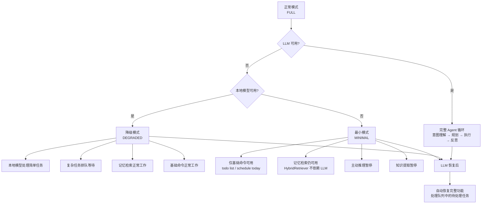
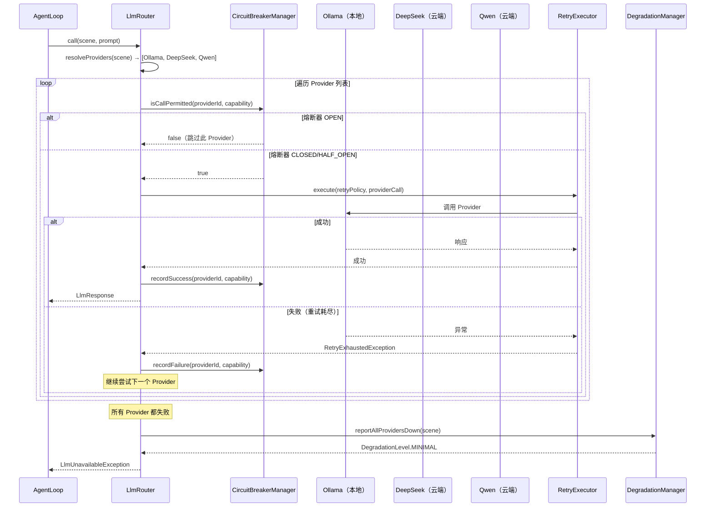
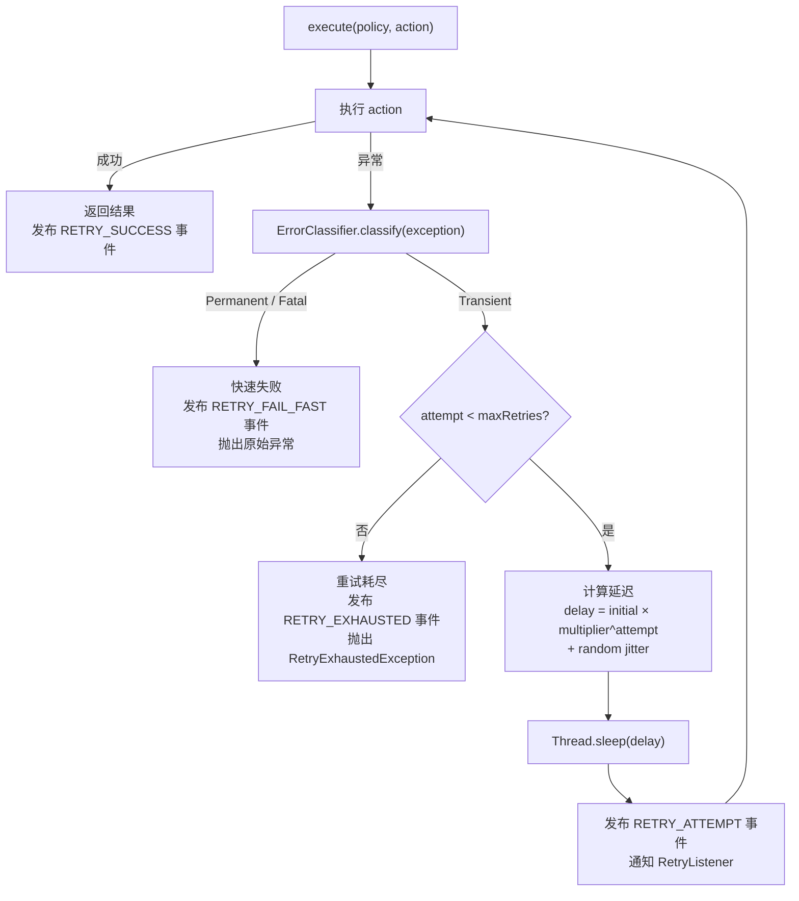
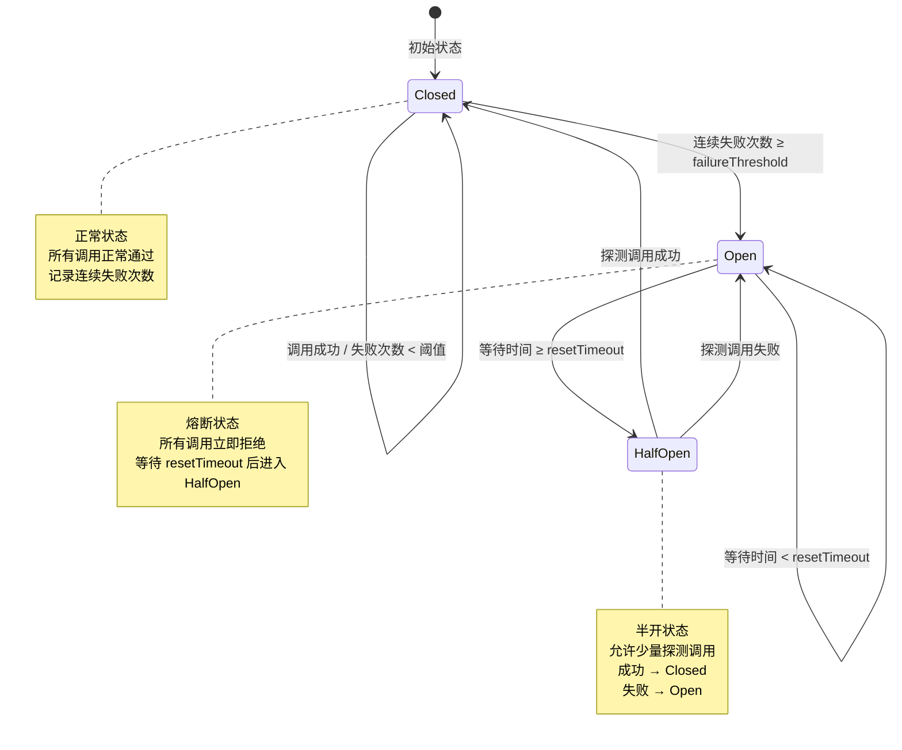
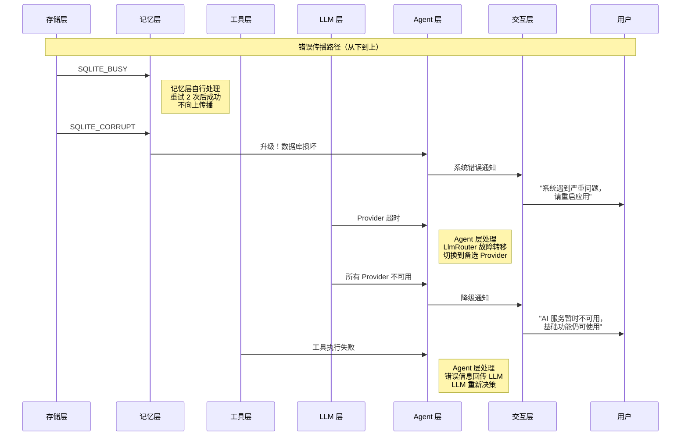

> 本文档从 [ARCHITECTURE.md](../ARCHITECTURE.md) §13 拆分而来，对应原文错误处理策略章节。
> 本文档经过深度分析设计，结合业界最佳实践和前沿研究进行了全面扩展。

# 错误处理策略架构设计

> **文档性质**：深度架构设计文档（Developer-Facing）
> **目标读者**：核心开发者、架构评审者、技术面试官
> **模块归属**：`com.lifepilot.observability`
> **最后更新**：2026-03
> **从属关系**：本文档从 ARCHITECTURE.md §13 拆分而来

---

## 目录

- [1. 设计哲学与原则](#1-设计哲学与原则)
- [2. 错误分类体系](#2-错误分类体系)
- [3. LLM 层错误处理](#3-llm-层错误处理)
- [4. 工具层错误处理](#4-工具层错误处理)
- [5. 记忆层错误处理](#5-记忆层错误处理)
- [6. 交互层错误处理](#6-交互层错误处理)
- [7. RetryExecutor — 统一重试引擎](#7-retryexecutor--统一重试引擎)
- [8. CircuitBreakerManager — 熔断器管理](#8-circuitbreakermanager--熔断器管理)
- [9. DegradationManager — 降级管理器](#9-degradationmanager--降级管理器)
- [10. ErrorRecoveryPipeline — 错误恢复管线](#10-errorrecoverypipeline--错误恢复管线)
- [11. 错误传播与升级](#11-错误传播与升级)
- [12. SQLite Schema 与 Flyway 迁移](#12-sqlite-schema-与-flyway-迁移)
- [13. 配置参考](#13-配置参考)
- [14. jqwik 属性测试](#14-jqwik-属性测试)

---

## 1. 设计哲学与原则

### 1.1 核心命题：为什么 AI Agent 的错误处理不同于传统应用

LifePilot 的错误处理架构围绕一个核心命题：**AI Agent 的错误是概率性的，而非确定性的**。
传统应用的错误处理建立在一个隐含假设之上——错误是可枚举的、可预测的。
一个 REST API 要么返回 200，要么返回 4xx/5xx，错误码是有限集合。
但 AI Agent 的错误空间是开放的、概率性的、且具有级联效应。

考虑以下场景：

```
传统 Web 应用的错误模式：

  用户请求 → 数据库查询 → 返回结果
                ↓ 失败
           SQLException → 重试 → 成功 / 返回 500

  错误是二元的：成功或失败
  错误是可枚举的：连接超时、死锁、约束违反...
  错误是局部的：数据库层的错误不会"传染"到业务逻辑层
```

```
AI Agent 的错误模式：

  用户请求 → LLM 意图理解 → 工具选择 → 工具执行 → LLM 结果整合 → 响应
                ↓ 幻觉                ↓ 参数错误      ↓ 超时
           LLM 理解错误意图    →  选择了错误的工具  →  执行失败
                                        ↓
                              LLM 基于错误结果继续推理
                                        ↓
                              产生更大的幻觉（级联放大）
                                        ↓
                              用户收到完全错误的回答

  错误是概率性的：同一输入可能成功也可能失败
  错误是开放的：LLM 可能产生任何形式的"错误"输出
  错误是级联的：一层的错误会在后续层中放大
  错误是模糊的：LLM 输出"看起来正确但实际错误"（幻觉）
```

这种根本性差异要求我们重新思考错误处理的架构。传统的 try-catch-retry 模式远远不够——我们需要一个**分层的、概率感知的、具备自愈能力的错误处理框架**。

#### 传统应用 vs AI Agent 错误处理对比

| 维度 | 传统应用 | AI Agent（LifePilot） |
|------|---------|---------------------|
| **错误性质** | 确定性（异常类型明确） | 概率性（LLM 输出不可预测） |
| **错误空间** | 有限可枚举 | 开放无限 |
| **错误传播** | 局部隔离 | 级联放大（幻觉传播） |
| **错误检测** | 异常捕获即可 | 需要语义级验证 |
| **恢复策略** | 重试 / 回滚 | 重试 / 降级 / 回传LLM / 切换Provider |
| **降级模式** | 返回错误码 | 部分功能继续工作 |
| **成本影响** | 固定（基础设施成本） | 可变（Token 消耗随重试增加） |
| **超时语义** | 请求级超时 | 多层超时（LLM / 工具 / 会话） |
| **熔断粒度** | 服务级别 | Provider:Capability 复合键 |
| **用户感知** | HTTP 错误码 | 自然语言错误解释 |

#### AI Agent 特有的错误类型

传统应用不需要处理的、AI Agent 特有的错误类型包括：

```
┌─────────────────────────────────────────────────────────────────────────┐
│                    AI Agent 特有错误类型                                 │
│                                                                         │
│  1. LLM 幻觉（Hallucination）                                          │
│     LLM 生成了看起来合理但实际错误的输出                                  │
│     → 不是异常，无法用 try-catch 捕获                                    │
│     → 需要输出验证 + 置信度评分                                          │
│                                                                         │
│  2. Token 预算耗尽（Token Budget Exhaustion）                           │
│     多步推理消耗了过多 Token，超出预算限制                                │
│     → 不是技术错误，是资源约束                                           │
│     → 需要优雅终止 + 部分结果保留                                        │
│                                                                         │
│  3. 多 Provider 级联失败（Multi-Provider Cascade Failure）              │
│     主 Provider 故障 → 备选 Provider 也故障 → 所有云端不可用             │
│     → 需要本地模型兜底 + 功能降级                                        │
│                                                                         │
│  4. 工具链断裂（Tool Chain Breakage）                                   │
│     LLM 选择的工具执行失败 → LLM 需要重新决策                           │
│     → 错误信息需要格式化后回传 LLM                                       │
│     → LLM 可能基于错误信息做出更好的决策                                  │
│                                                                         │
│  5. 记忆污染（Memory Corruption）                                       │
│     错误的知识被写入记忆系统 → 影响后续所有检索                           │
│     → 需要写入前验证 + 异常记忆隔离                                      │
│                                                                         │
│  6. 上下文腐化（Context Rot）                                           │
│     长对话中早期信息被"稀释" → LLM 注意力偏移                            │
│     → 不是错误，但会导致错误决策                                          │
│     → 需要上下文压缩 + 关键信息置顶                                      │
│                                                                         │
│  7. 行为漂移（Behavioral Drift）                                        │
│     Provider 切换导致 Agent 行为风格突变                                  │
│     → 不是技术错误，但影响用户体验                                        │
│     → 需要行为一致性保障 + 会话亲和性                                     │
└─────────────────────────────────────────────────────────────────────────┘
```

### 1.2 前沿研究基础

LifePilot 的错误处理架构不是凭空构想，而是建立在 2025-2026 年 AI Agent 领域的前沿研究和工程实践之上。

#### 1.2.1 Portkey.ai — LLM 网关的弹性模式

[Portkey.ai](https://portkey.ai) 是 LLM 网关领域的先驱，其提出的弹性模式直接影响了 LifePilot 的 LLM 层错误处理设计：

- **自动重试（Automatic Retries）**：对瞬时错误（429 Too Many Requests、503 Service Unavailable）自动重试，使用指数退避避免雷群效应
- **故障转移（Fallbacks）**：主 Provider 失败时自动切换到备选 Provider，支持有序降级链
- **熔断器（Circuit Breakers）**：连续失败达到阈值后自动熔断，避免对已故障的 Provider 持续发送请求
- **负载均衡（Load Balancing）**：在多个 Provider 之间分配请求，但 LifePilot 简化为优先级排序（个人用户无需负载均衡）

LifePilot 的适配：

| Portkey.ai 模式 | LifePilot 适配 | 差异原因 |
|-----------------|---------------|---------|
| 自动重试 + 指数退避 | `RetryExecutor` + jitter | 完全采纳，增加随机抖动避免同步重试 |
| 多 Provider 故障转移 | `LlmRouter` 有序降级链 | 采纳，增加本地模型兜底 |
| 熔断器 | `CircuitBreakerManager` | 采纳，粒度细化到 Provider:Capability |
| 负载均衡 | 优先级排序 | 个人用户并发极低，无需负载均衡 |
| 请求缓存 | `SemanticCache` 语义缓存 | 升级为语义相似度匹配 |

#### 1.2.2 Resilience4j — Java 弹性库的设计哲学

[Resilience4j](https://resilience4j.readme.io/) 是 Java 生态中最成熟的弹性库，其设计哲学深刻影响了 LifePilot 的错误处理架构：

- **装饰器模式**：每个弹性模式（熔断器、重试、限流）都是独立的装饰器，可以自由组合
- **函数式 API**：基于 `Supplier<T>` / `Function<T, R>` 的函数式接口，与 Java 22 的函数式风格完美契合
- **事件驱动**：每个状态变化都发布事件，支持可观测性集成

LifePilot 没有直接依赖 Resilience4j，而是基于其设计哲学实现了轻量级版本。原因是：

1. **AI Agent 特有需求**：Resilience4j 的熔断器是服务级别的，LifePilot 需要 Provider:Capability 复合键级别的隔离
2. **降级语义不同**：传统熔断器降级是"返回默认值"，AI Agent 降级是"切换到备选 Provider 或本地模型"
3. **依赖最小化**：LifePilot 追求单 JAR 部署，减少不必要的依赖

#### 1.2.3 AI Agent 错误恢复模式（2025-2026 业界实践）

[Gocodeo](https://gocodeo.com) 和 [Neuronex Automation](https://neuronex-automation.com) 的研究总结了 AI Agent 在生产环境中的错误恢复模式：

- **分层恢复（Layered Recovery）**：每层独立处理自己的错误，只有无法处理时才向上传播
- **LLM 辅助恢复（LLM-Assisted Recovery）**：将错误信息格式化后回传 LLM，让 LLM 参与恢复决策
- **渐进降级（Graceful Degradation）**：不是"全有或全无"，而是逐步减少功能直到最小可用集
- **自愈机制（Self-Healing）**：定期探测已故障的组件，自动恢复

[GetMaxim.ai](https://getmaxim.ai) 的生产指南强调了 AI Agent 错误处理的关键原则：

- **可观测性优先**：每个错误都必须有完整的上下文记录，包括 LLM 的输入输出、工具调用参数、重试次数等
- **成本感知**：重试不是免费的——每次 LLM 重试都消耗 Token，必须在可靠性和成本之间平衡
- **用户友好**：技术错误必须转化为用户可理解的自然语言消息

#### 1.2.4 Spring AI 重试机制

[Spring AI](https://docs.spring.io/spring-ai/) 内置了基础的重试支持，但 LifePilot 需要更精细的控制：

- Spring AI 的重试是 Provider 级别的，LifePilot 需要 Capability 级别的隔离
- Spring AI 没有内置熔断器，LifePilot 需要熔断器 + 故障转移的组合
- Spring AI 的降级是简单的异常抛出，LifePilot 需要多级降级策略

#### 1.2.5 LLM 优雅降级模式

[Markaicode](https://markaicode.com) 和 [Reintech.io](https://reintech.io) 的研究提供了 LLM 优雅降级的具体实践：

- **模型降级**：高能力模型不可用时，自动切换到低能力但更稳定的模型
- **功能降级**：结构化输出失败时，降级为纯文本输出
- **缓存降级**：实时 LLM 调用失败时，返回语义缓存中的近似结果
- **离线降级**：所有云端 Provider 不可用时，仅使用本地模型和本地功能

### 1.3 五条核心设计原则

五条核心设计原则贯穿整个错误处理框架的实现。这些原则不是抽象的口号，而是直接映射到具体的代码实现：

#### 原则 1：分层隔离 — 每层独立处理自己的错误

```
┌─────────────────────────────────────────────────────────────────┐
│                    分层隔离原则                                   │
│                                                                 │
│  ┌──────────┐   错误不跨层传播（除非本层无法处理）                │
│  │ 交互层   │ ← 通道断连 → 自动重连 + 消息入队                   │
│  ├──────────┤                                                   │
│  │ Agent 层 │ ← 预算耗尽 → 优雅终止 + 部分结果                   │
│  ├──────────┤                                                   │
│  │ LLM 层   │ ← Provider 故障 → 熔断 + 故障转移                  │
│  ├──────────┤                                                   │
│  │ 工具层   │ ← 执行失败 → 重试 + 回传 LLM                       │
│  ├──────────┤                                                   │
│  │ 记忆层   │ ← 向量化失败 → 降级为 FTS5                         │
│  ├──────────┤                                                   │
│  │ 存储层   │ ← SQLite 写入失败 → WAL 重试                       │
│  └──────────┘                                                   │
│                                                                 │
│  每层有自己的 ErrorHandler，只有 escalate() 时才向上传播          │
└─────────────────────────────────────────────────────────────────┘
```

```java
/**
 * 分层隔离原则的代码体现。
 *
 * <p>每层实现自己的 {@link LayerErrorHandler}，独立处理本层错误。
 * 只有当本层无法处理时，才通过 {@code escalate()} 向上传播。</p>
 */
public sealed interface LayerErrorHandler
    permits LlmLayerErrorHandler, ToolLayerErrorHandler,
            MemoryLayerErrorHandler, InteractionLayerErrorHandler {

    /** 处理本层错误。返回 true 表示已处理，false 表示需要升级。 */
    boolean handle(ErrorContext context);

    /** 将错误升级到上层。 */
    void escalate(ErrorContext context);

    /** 本层的错误处理策略。 */
    LayerErrorPolicy policy();
}
```

#### 原则 2：快速失败 — 不可恢复的错误立即终止

不可恢复的错误（如 API 密钥无效、数据库文件损坏）不应该浪费资源重试。快速失败原则要求：

- **立即识别**：通过 `ErrorClassifier` 在第一时间判断错误是否可恢复
- **立即终止**：不可恢复的错误跳过所有重试逻辑，直接进入错误报告流程
- **清晰报告**：向用户提供明确的错误原因和修复建议

```java
/**
 * 快速失败原则的代码体现。
 *
 * <p>ErrorClassifier 在错误发生的第一时间判断其类别。
 * Permanent 类错误立即终止，不进入重试循环。</p>
 */
// 在 RetryExecutor 中的应用
public <T> T execute(RetryPolicy policy, Supplier<T> action, String operationName) {
    for (int attempt = 0; attempt <= policy.maxRetries(); attempt++) {
        try {
            return action.get();
        } catch (Exception e) {
            ErrorCategory category = errorClassifier.classify(e);
            // 快速失败：不可恢复的错误立即终止
            if (category instanceof ErrorCategory.Permanent) {
                log.error("不可恢复错误，快速失败: operation={}, error={}",
                    operationName, e.getMessage());
                throw e;
            }
            // 可重试的错误继续重试循环
            if (attempt < policy.maxRetries()) {
                Duration delay = policy.delayFor(attempt);
                log.warn("瞬时错误，准备重试: operation={}, attempt={}/{}, delay={}ms",
                    operationName, attempt + 1, policy.maxRetries(), delay.toMillis());
                sleep(delay);
            }
        }
    }
    throw new RetryExhaustedException(operationName, policy.maxRetries());
}
```

#### 原则 3：优雅降级 — LLM 不可用时非 LLM 功能继续工作

这是 LifePilot 错误处理最核心的原则。作为本地优先的个人 AI Agent，LifePilot 必须在各种故障场景下保持最大可用性。



```java
/**
 * 优雅降级原则的代码体现。
 *
 * <p>DegradationManager 维护当前降级级别，
 * 各组件根据降级级别决定自己的行为。</p>
 */
// 在 AgentLoop 中的应用
private Action decide(AgentState state, AgentContext context) {
    DegradationLevel level = degradationManager.currentLevel();
    return switch (level) {
        case FULL -> decideFull(state, context);        // 完整 LLM 决策
        case DEGRADED -> decideDegraded(state, context); // 本地模型决策
        case MINIMAL -> decideMinimal(state, context);   // 规则引擎决策
        case EMERGENCY -> new Action.BudgetExhausted(    // 紧急模式，拒绝新任务
            "系统处于紧急降级模式，暂时无法处理新任务");
    };
}
```

#### 原则 4：可观测性优先 — 每个错误都有完整的上下文记录

错误处理不仅仅是"处理错误"，更重要的是"记录错误"。在 AI Agent 场景中，错误的上下文信息比错误本身更有价值——它帮助我们理解"为什么会出错"以及"如何避免再次出错"。

```java
/**
 * 可观测性优先原则的代码体现。
 *
 * <p>ErrorContext 携带完整的错误上下文，包括：
 * 追踪 ID、会话 ID、所在层级、时间戳、错误分类、
 * 重试次数、降级状态、以及任何有助于诊断的附加信息。</p>
 */
@Builder(toBuilder = true)
public record ErrorContext(
    String traceId,                    // 追踪 ID（关联到 Agent Trace）
    String sessionId,                  // 会话 ID
    ErrorLayer layer,                  // 错误所在层级
    Instant timestamp,                 // 错误发生时间
    ErrorCategory category,            // 错误分类
    ErrorSeverity severity,            // 错误严重程度
    String errorCode,                  // 错误码
    String message,                    // 错误消息
    @Nullable Throwable cause,         // 原始异常
    int retryAttempt,                  // 当前重试次数
    DegradationLevel degradationLevel, // 当前降级级别
    Map<String, Object> metadata       // 附加元数据
) {
    /** 紧凑构造器 — 防御性拷贝。 */
    public ErrorContext {
        metadata = metadata != null ? Map.copyOf(metadata) : Map.of();
    }
}
```

#### 原则 5：用户友好 — 技术错误转化为用户可理解的消息

AI Agent 的用户不是开发者，他们不理解"CircuitBreaker OPEN for deepseek:CHAT"。每个技术错误都必须转化为用户可理解的自然语言消息。

```java
/**
 * 用户友好原则的代码体现。
 *
 * <p>UserFriendlyErrorMapper 将技术错误映射为用户可理解的消息。
 * 每条消息包含：错误描述、影响范围、建议操作。</p>
 */
public class UserFriendlyErrorMapper {

    /** 将技术错误转化为用户友好消息。 */
    public UserFriendlyError map(ErrorContext context) {
        return switch (context.category()) {
            case ErrorCategory.Transient t -> new UserFriendlyError(
                "服务暂时繁忙",
                "正在自动重试，请稍候...",
                "如果持续出现，请检查网络连接"
            );
            case ErrorCategory.Permanent p -> mapPermanent(p, context);
            case ErrorCategory.Degradable d -> new UserFriendlyError(
                "部分功能暂时不可用",
                "已自动切换到备用方案，核心功能正常",
                "完整功能将在服务恢复后自动启用"
            );
            case ErrorCategory.Fatal f -> new UserFriendlyError(
                "系统遇到严重问题",
                "请保存当前工作并重启应用",
                "如果问题持续，请查看日志文件或联系支持"
            );
        };
    }

    private UserFriendlyError mapPermanent(ErrorCategory.Permanent p,
                                            ErrorContext context) {
        if (p.errorCode().startsWith("AUTH_")) {
            return new UserFriendlyError(
                "认证失败",
                "API 密钥无效或已过期",
                "请在设置中更新对应服务的 API 密钥"
            );
        }
        return new UserFriendlyError(
            "操作无法完成",
            p.userMessage(),
            "请检查配置或联系支持"
        );
    }
}

/**
 * 用户友好错误消息。
 *
 * @param title       错误标题（简短）
 * @param description 错误描述（一句话说明发生了什么）
 * @param suggestion  建议操作（用户可以做什么）
 */
public record UserFriendlyError(
    String title,
    String description,
    String suggestion
) {}
```

---

## 2. 错误分类体系

### 2.1 设计理念

错误分类是整个错误处理框架的基石。一个好的分类体系决定了：
- 重试引擎是否应该重试（Transient → 重试，Permanent → 不重试）
- 降级管理器是否应该降级（Degradable → 降级，Fatal → 终止）
- 用户应该看到什么消息（每个类别有不同的用户友好映射）
- 错误日志应该记录什么级别（WARN / ERROR / FATAL）

LifePilot 使用 Java 22 的 `sealed interface` 实现错误分类体系，利用 `switch` 表达式的穷举匹配确保每个错误类别都被处理。

### 2.2 四大错误类别

```
┌─────────────────────────────────────────────────────────────────────────┐
│                    错误分类体系                                          │
│                                                                         │
│  ┌─────────────┐  ┌─────────────┐  ┌─────────────┐  ┌─────────────┐   │
│  │  Transient   │  │  Permanent  │  │  Degradable │  │    Fatal    │   │
│  │  瞬时错误    │  │  永久错误    │  │  可降级错误  │  │  致命错误    │   │
│  ├─────────────┤  ├─────────────┤  ├─────────────┤  ├─────────────┤   │
│  │ 网络超时     │  │ API 密钥无效 │  │ 云端 LLM    │  │ 数据库损坏  │   │
│  │ 429 限流     │  │ 模型不存在   │  │   不可用     │  │ 配置文件    │   │
│  │ 503 服务不可 │  │ 权限不足     │  │ 向量化服务   │  │   缺失      │   │
│  │ 连接重置     │  │ 参数格式错误 │  │   故障       │  │ 磁盘空间    │   │
│  │ DNS 解析失败 │  │ 配额耗尽     │  │ MCP Server  │  │   不足      │   │
│  │ SQLITE_BUSY  │  │ 内容违规     │  │   断连       │  │ JVM OOM    │   │
│  ├─────────────┤  ├─────────────┤  ├─────────────┤  ├─────────────┤   │
│  │ 策略: 重试   │  │ 策略: 快速   │  │ 策略: 降级   │  │ 策略: 终止  │   │
│  │ + 指数退避   │  │   失败       │  │ + 备选方案   │  │ + 告警      │   │
│  └─────────────┘  └─────────────┘  └─────────────┘  └─────────────┘   │
└─────────────────────────────────────────────────────────────────────────┘
```

### 2.3 ErrorCategory — sealed interface 实现

```java
package com.lifepilot.observability.error;

import java.time.Duration;
import java.util.Objects;

/**
 * 错误分类 sealed interface。
 *
 * <p>使用 Java 22 sealed interface 实现四大错误类别，
 * 配合 switch 表达式穷举匹配，确保每个错误类别都被处理。</p>
 *
 * <p>分类依据：
 * <ul>
 *   <li>{@link Transient} — 瞬时错误，重试后可能成功</li>
 *   <li>{@link Permanent} — 永久错误，重试无意义</li>
 *   <li>{@link Degradable} — 可降级错误，有备选方案</li>
 *   <li>{@link Fatal} — 致命错误，必须终止</li>
 * </ul></p>
 *
 * @see ErrorClassifier 自动错误分类器
 * @see RetryExecutor 重试引擎（仅对 Transient 重试）
 * @see DegradationManager 降级管理器（处理 Degradable）
 */
public sealed interface ErrorCategory {

    /** 错误码。 */
    String errorCode();

    /** 错误消息。 */
    String message();

    /** 是否可重试。 */
    boolean retryable();

    /**
     * 瞬时错误 — 重试后可能成功。
     *
     * <p>典型场景：网络超时、429 限流、503 服务暂时不可用、
     * 连接重置、DNS 解析失败、SQLITE_BUSY。</p>
     *
     * <p>处理策略：使用 {@link RetryExecutor} 进行指数退避重试，
     * 最多重试 {@code maxRetries} 次。</p>
     *
     * @param errorCode       错误码（如 "LLM_TIMEOUT", "TOOL_TIMEOUT"）
     * @param message         错误消息
     * @param suggestedDelay  建议的重试延迟（可选，覆盖默认策略）
     * @param cause           原始异常
     */
    record Transient(
        String errorCode,
        String message,
        @Nullable Duration suggestedDelay,
        @Nullable Throwable cause
    ) implements ErrorCategory {
        public Transient {
            Objects.requireNonNull(errorCode, "错误码不能为空");
            Objects.requireNonNull(message, "错误消息不能为空");
        }

        @Override
        public boolean retryable() { return true; }
    }

    /**
     * 永久错误 — 重试无意义，应快速失败。
     *
     * <p>典型场景：API 密钥无效（401）、模型不存在（404）、
     * 权限不足（403）、参数格式错误（400）、配额耗尽、内容违规。</p>
     *
     * <p>处理策略：立即终止重试，记录错误日志，
     * 向用户提供明确的错误原因和修复建议。</p>
     *
     * @param errorCode   错误码（如 "AUTH_INVALID_KEY", "MODEL_NOT_FOUND"）
     * @param message     错误消息
     * @param userMessage 用户友好消息
     * @param fixHint     修复建议
     * @param cause       原始异常
     */
    record Permanent(
        String errorCode,
        String message,
        String userMessage,
        @Nullable String fixHint,
        @Nullable Throwable cause
    ) implements ErrorCategory {
        public Permanent {
            Objects.requireNonNull(errorCode, "错误码不能为空");
            Objects.requireNonNull(message, "错误消息不能为空");
            Objects.requireNonNull(userMessage, "用户友好消息不能为空");
        }

        @Override
        public boolean retryable() { return false; }
    }

    /**
     * 可降级错误 — 有备选方案，可以降级继续工作。
     *
     * <p>典型场景：云端 LLM 不可用（可降级到本地模型）、
     * 向量化服务故障（可降级到 FTS5）、MCP Server 断连（可注销工具）。</p>
     *
     * <p>处理策略：触发 {@link DegradationManager} 降级，
     * 切换到备选方案，记录降级事件。</p>
     *
     * @param errorCode        错误码（如 "LLM_ALL_PROVIDERS_DOWN", "VEC_SERVICE_DOWN"）
     * @param message          错误消息
     * @param fallbackStrategy 降级策略描述
     * @param affectedFeatures 受影响的功能列表
     * @param cause            原始异常
     */
    record Degradable(
        String errorCode,
        String message,
        String fallbackStrategy,
        List<String> affectedFeatures,
        @Nullable Throwable cause
    ) implements ErrorCategory {
        public Degradable {
            Objects.requireNonNull(errorCode, "错误码不能为空");
            Objects.requireNonNull(message, "错误消息不能为空");
            Objects.requireNonNull(fallbackStrategy, "降级策略不能为空");
            affectedFeatures = List.copyOf(
                affectedFeatures != null ? affectedFeatures : List.of());
        }

        @Override
        public boolean retryable() { return false; }
    }

    /**
     * 致命错误 — 必须终止，无法恢复。
     *
     * <p>典型场景：数据库文件损坏、配置文件缺失、
     * 磁盘空间不足、JVM OOM。</p>
     *
     * <p>处理策略：立即终止当前操作，发送告警通知，
     * 记录完整的错误上下文到日志。</p>
     *
     * @param errorCode 错误码（如 "DB_CORRUPTED", "DISK_FULL"）
     * @param message   错误消息
     * @param cause     原始异常
     */
    record Fatal(
        String errorCode,
        String message,
        @Nullable Throwable cause
    ) implements ErrorCategory {
        public Fatal {
            Objects.requireNonNull(errorCode, "错误码不能为空");
            Objects.requireNonNull(message, "错误消息不能为空");
        }

        @Override
        public boolean retryable() { return false; }
    }
}
```

### 2.4 ErrorSeverity — 错误严重程度枚举

```java
package com.lifepilot.observability.error;

/**
 * 错误严重程度枚举。
 *
 * <p>与日志级别对应：
 * <ul>
 *   <li>{@link #LOW} → INFO（记录但不告警）</li>
 *   <li>{@link #MEDIUM} → WARN（记录 + 监控面板显示）</li>
 *   <li>{@link #HIGH} → ERROR（记录 + 告警通知）</li>
 *   <li>{@link #CRITICAL} → ERROR（记录 + 立即告警 + 可能触发降级）</li>
 * </ul></p>
 */
public enum ErrorSeverity {

    /** 低严重度 — 可忽略的错误，如缓存未命中、非关键功能失败。 */
    LOW(1, "低"),

    /** 中严重度 — 需要关注的错误，如重试成功、降级生效。 */
    MEDIUM(2, "中"),

    /** 高严重度 — 需要处理的错误，如 Provider 故障、工具执行失败。 */
    HIGH(3, "高"),

    /** 致命严重度 — 需要立即处理的错误，如数据库损坏、所有 Provider 不可用。 */
    CRITICAL(4, "致命");

    private final int level;
    private final String displayName;

    ErrorSeverity(int level, String displayName) {
        this.level = level;
        this.displayName = displayName;
    }

    public int level() { return level; }
    public String displayName() { return displayName; }

    /** 是否需要告警通知。 */
    public boolean requiresAlert() { return level >= HIGH.level; }

    /** 是否需要立即处理。 */
    public boolean requiresImmediateAction() { return this == CRITICAL; }
}
```

### 2.5 ErrorLayer — 错误所在层级

```java
package com.lifepilot.observability.error;

/**
 * 错误所在层级枚举。
 *
 * <p>对应 LifePilot 的分层架构，每层有独立的错误处理策略。</p>
 */
public enum ErrorLayer {

    /** LLM 层 — Provider 调用、输出解析、Token 管理。 */
    LLM("llm", "LLM 层"),

    /** 工具层 — 工具执行、MCP 通信、参数校验。 */
    TOOL("tool", "工具层"),

    /** 记忆层 — 向量化、知识提取、记忆检索。 */
    MEMORY("memory", "记忆层"),

    /** 交互层 — 通道通信、消息格式、认证。 */
    INTERACTION("interaction", "交互层"),

    /** Agent 层 — 控制循环、状态转换、预算管理。 */
    AGENT("agent", "Agent 层"),

    /** 存储层 — SQLite 读写、Flyway 迁移。 */
    STORAGE("storage", "存储层");

    private final String code;
    private final String displayName;

    ErrorLayer(String code, String displayName) {
        this.code = code;
        this.displayName = displayName;
    }

    public String code() { return code; }
    public String displayName() { return displayName; }
}
```

### 2.6 ErrorContext — 完整错误上下文

```java
package com.lifepilot.observability.error;

import java.time.Instant;
import java.util.Map;
import java.util.Objects;

/**
 * 错误上下文 record — 携带完整的错误诊断信息。
 *
 * <p>每个错误事件都会创建一个 ErrorContext 实例，
 * 包含追踪 ID、会话 ID、层级、时间戳、分类、严重程度等完整信息。
 * 这些信息用于：
 * <ul>
 *   <li>错误日志记录（写入 error_logs 表）</li>
 *   <li>错误分析和统计</li>
 *   <li>错误恢复决策</li>
 *   <li>用户友好消息生成</li>
 * </ul></p>
 *
 * @param traceId           追踪 ID（关联到 Agent Trace）
 * @param sessionId         会话 ID
 * @param layer             错误所在层级
 * @param timestamp         错误发生时间
 * @param category          错误分类
 * @param severity          错误严重程度
 * @param errorCode         错误码（层级前缀 + 具体错误，如 "LLM_TIMEOUT"）
 * @param message           错误消息（中文，面向开发者）
 * @param cause             原始异常（可选）
 * @param retryAttempt      当前重试次数（0 = 首次尝试）
 * @param maxRetries        最大重试次数
 * @param degradationLevel  当前降级级别
 * @param providerId        相关的 Provider ID（LLM 层错误时有值）
 * @param toolId            相关的工具 ID（工具层错误时有值）
 * @param metadata          附加元数据（灵活扩展）
 */
@Builder(toBuilder = true)
public record ErrorContext(
    String traceId,
    @Nullable String sessionId,
    ErrorLayer layer,
    Instant timestamp,
    ErrorCategory category,
    ErrorSeverity severity,
    String errorCode,
    String message,
    @Nullable Throwable cause,
    int retryAttempt,
    int maxRetries,
    DegradationLevel degradationLevel,
    @Nullable String providerId,
    @Nullable String toolId,
    Map<String, Object> metadata
) {
    /** 紧凑构造器 — 参数校验 + 防御性拷贝。 */
    public ErrorContext {
        Objects.requireNonNull(traceId, "追踪 ID 不能为空");
        Objects.requireNonNull(layer, "错误层级不能为空");
        Objects.requireNonNull(category, "错误分类不能为空");
        Objects.requireNonNull(severity, "错误严重程度不能为空");
        Objects.requireNonNull(errorCode, "错误码不能为空");
        Objects.requireNonNull(message, "错误消息不能为空");
        if (timestamp == null) timestamp = Instant.now();
        if (degradationLevel == null) degradationLevel = DegradationLevel.FULL;
        metadata = metadata != null ? Map.copyOf(metadata) : Map.of();
    }

    /** 是否可重试。 */
    public boolean isRetryable() {
        return category.retryable() && retryAttempt < maxRetries;
    }

    /** 是否已达到最大重试次数。 */
    public boolean isRetryExhausted() {
        return retryAttempt >= maxRetries;
    }

    /** 创建下一次重试的上下文（重试次数 +1）。 */
    public ErrorContext nextRetry() {
        return this.toBuilder()
            .retryAttempt(retryAttempt + 1)
            .timestamp(Instant.now())
            .build();
    }

    /** 升级严重程度。 */
    public ErrorContext escalateSeverity(ErrorSeverity newSeverity) {
        if (newSeverity.level() <= severity.level()) return this;
        return this.toBuilder().severity(newSeverity).build();
    }
}
```

### 2.7 ErrorClassifier — 自动错误分类器

```java
package com.lifepilot.observability.error;

import org.slf4j.Logger;
import org.slf4j.LoggerFactory;
import org.springframework.stereotype.Component;
import org.springframework.web.client.HttpClientErrorException;
import org.springframework.web.client.HttpServerErrorException;
import org.springframework.web.client.ResourceAccessException;

import java.net.ConnectException;
import java.net.SocketTimeoutException;
import java.net.UnknownHostException;
import java.sql.SQLException;
import java.util.concurrent.TimeoutException;

/**
 * 自动错误分类器。
 *
 * <p>根据异常类型和 HTTP 状态码自动判断错误类别。
 * 分类结果直接决定后续的处理策略：
 * <ul>
 *   <li>{@link ErrorCategory.Transient} → 重试</li>
 *   <li>{@link ErrorCategory.Permanent} → 快速失败</li>
 *   <li>{@link ErrorCategory.Degradable} → 降级</li>
 *   <li>{@link ErrorCategory.Fatal} → 终止</li>
 * </ul></p>
 *
 * <p>分类规则按优先级排序：
 * <ol>
 *   <li>HTTP 状态码分类（最精确）</li>
 *   <li>异常类型分类（次精确）</li>
 *   <li>异常消息关键词分类（兜底）</li>
 * </ol></p>
 */
@Component
public class ErrorClassifier {

    private static final Logger log = LoggerFactory.getLogger(ErrorClassifier.class);

    /**
     * 分类异常。
     *
     * @param exception 原始异常
     * @return 错误分类
     */
    public ErrorCategory classify(Throwable exception) {
        Objects.requireNonNull(exception, "异常不能为空");

        // 1. HTTP 客户端错误（4xx）
        if (exception instanceof HttpClientErrorException httpEx) {
            return classifyHttpClientError(httpEx);
        }

        // 2. HTTP 服务端错误（5xx）
        if (exception instanceof HttpServerErrorException httpEx) {
            return classifyHttpServerError(httpEx);
        }

        // 3. 网络连接错误
        if (exception instanceof ResourceAccessException
            || exception instanceof ConnectException
            || exception instanceof SocketTimeoutException
            || exception instanceof UnknownHostException) {
            return new ErrorCategory.Transient(
                "NETWORK_ERROR",
                "网络连接错误: " + exception.getMessage(),
                null,
                exception
            );
        }

        // 4. 超时错误
        if (exception instanceof TimeoutException) {
            return new ErrorCategory.Transient(
                "TIMEOUT",
                "操作超时: " + exception.getMessage(),
                null,
                exception
            );
        }

        // 5. SQLite 错误
        if (exception instanceof SQLException sqlEx) {
            return classifySqlException(sqlEx);
        }

        // 6. OOM 错误
        if (exception instanceof OutOfMemoryError) {
            return new ErrorCategory.Fatal(
                "JVM_OOM",
                "JVM 内存不足",
                exception
            );
        }

        // 7. 自定义异常分类
        if (exception instanceof ClassifiableException ce) {
            return ce.errorCategory();
        }

        // 8. 兜底：根据异常消息关键词分类
        return classifyByMessage(exception);
    }

    /**
     * 分类 HTTP 4xx 错误。
     */
    private ErrorCategory classifyHttpClientError(HttpClientErrorException ex) {
        int statusCode = ex.getStatusCode().value();
        return switch (statusCode) {
            case 401 -> new ErrorCategory.Permanent(
                "AUTH_UNAUTHORIZED",
                "认证失败: HTTP 401",
                "API 密钥无效或已过期",
                "请在设置中更新 API 密钥",
                ex
            );
            case 403 -> new ErrorCategory.Permanent(
                "AUTH_FORBIDDEN",
                "权限不足: HTTP 403",
                "没有权限访问该服务",
                "请检查 API 密钥的权限范围",
                ex
            );
            case 404 -> new ErrorCategory.Permanent(
                "RESOURCE_NOT_FOUND",
                "资源不存在: HTTP 404",
                "请求的模型或端点不存在",
                "请检查模型名称和 API 端点配置",
                ex
            );
            case 429 -> new ErrorCategory.Transient(
                "RATE_LIMITED",
                "请求限流: HTTP 429",
                extractRetryAfter(ex),
                ex
            );
            case 400 -> new ErrorCategory.Permanent(
                "BAD_REQUEST",
                "请求参数错误: HTTP 400",
                "请求格式不正确",
                "请检查请求参数",
                ex
            );
            default -> new ErrorCategory.Permanent(
                "HTTP_CLIENT_ERROR_" + statusCode,
                "HTTP 客户端错误: " + statusCode,
                "请求失败",
                null,
                ex
            );
        };
    }

    /**
     * 分类 HTTP 5xx 错误。
     */
    private ErrorCategory classifyHttpServerError(HttpServerErrorException ex) {
        int statusCode = ex.getStatusCode().value();
        return switch (statusCode) {
            case 500 -> new ErrorCategory.Transient(
                "SERVER_INTERNAL_ERROR",
                "服务端内部错误: HTTP 500",
                null,
                ex
            );
            case 502 -> new ErrorCategory.Transient(
                "BAD_GATEWAY",
                "网关错误: HTTP 502",
                null,
                ex
            );
            case 503 -> new ErrorCategory.Transient(
                "SERVICE_UNAVAILABLE",
                "服务暂时不可用: HTTP 503",
                extractRetryAfter(ex),
                ex
            );
            case 504 -> new ErrorCategory.Transient(
                "GATEWAY_TIMEOUT",
                "网关超时: HTTP 504",
                null,
                ex
            );
            default -> new ErrorCategory.Transient(
                "HTTP_SERVER_ERROR_" + statusCode,
                "HTTP 服务端错误: " + statusCode,
                null,
                ex
            );
        };
    }

    /**
     * 分类 SQLite 错误。
     */
    private ErrorCategory classifySqlException(SQLException ex) {
        String sqlState = ex.getSQLState();
        int errorCode = ex.getErrorCode();

        // SQLITE_BUSY (5) — 数据库被锁定，可重试
        if (errorCode == 5) {
            return new ErrorCategory.Transient(
                "SQLITE_BUSY",
                "SQLite 数据库繁忙（SQLITE_BUSY）",
                Duration.ofMillis(100),
                ex
            );
        }

        // SQLITE_LOCKED (6) — 表被锁定，可重试
        if (errorCode == 6) {
            return new ErrorCategory.Transient(
                "SQLITE_LOCKED",
                "SQLite 表被锁定（SQLITE_LOCKED）",
                Duration.ofMillis(50),
                ex
            );
        }

        // SQLITE_CORRUPT (11) — 数据库损坏，致命错误
        if (errorCode == 11) {
            return new ErrorCategory.Fatal(
                "SQLITE_CORRUPT",
                "SQLite 数据库文件损坏（SQLITE_CORRUPT）",
                ex
            );
        }

        // SQLITE_FULL (13) — 磁盘空间不足，致命错误
        if (errorCode == 13) {
            return new ErrorCategory.Fatal(
                "SQLITE_FULL",
                "磁盘空间不足（SQLITE_FULL）",
                ex
            );
        }

        // SQLITE_CONSTRAINT (19) — 约束违反，永久错误
        if (errorCode == 19) {
            return new ErrorCategory.Permanent(
                "SQLITE_CONSTRAINT",
                "数据约束违反（SQLITE_CONSTRAINT）: " + ex.getMessage(),
                "数据保存失败，存在冲突",
                "请检查数据是否重复",
                ex
            );
        }

        // 其他 SQL 错误默认为瞬时错误
        return new ErrorCategory.Transient(
            "SQL_ERROR",
            "SQL 执行错误: " + ex.getMessage(),
            null,
            ex
        );
    }

    /**
     * 根据异常消息关键词分类（兜底策略）。
     */
    private ErrorCategory classifyByMessage(Throwable ex) {
        String message = ex.getMessage() != null ? ex.getMessage().toLowerCase() : "";

        if (message.contains("timeout") || message.contains("timed out")
            || message.contains("超时")) {
            return new ErrorCategory.Transient(
                "GENERIC_TIMEOUT",
                "操作超时: " + ex.getMessage(),
                null,
                ex
            );
        }

        if (message.contains("connection refused") || message.contains("连接被拒绝")) {
            return new ErrorCategory.Transient(
                "CONNECTION_REFUSED",
                "连接被拒绝: " + ex.getMessage(),
                null,
                ex
            );
        }

        if (message.contains("out of memory") || message.contains("内存不足")) {
            return new ErrorCategory.Fatal(
                "MEMORY_EXHAUSTED",
                "内存不足: " + ex.getMessage(),
                ex
            );
        }

        if (message.contains("disk full") || message.contains("no space")
            || message.contains("磁盘空间不足")) {
            return new ErrorCategory.Fatal(
                "DISK_FULL",
                "磁盘空间不足: " + ex.getMessage(),
                ex
            );
        }

        // 默认分类为瞬时错误（保守策略：宁可多重试，不要误判为永久错误）
        log.warn("无法精确分类的异常，默认为瞬时错误: type={}, message={}",
            ex.getClass().getSimpleName(), ex.getMessage());
        return new ErrorCategory.Transient(
            "UNKNOWN",
            "未分类错误: " + ex.getMessage(),
            null,
            ex
        );
    }

    /**
     * 从 HTTP 响应头中提取 Retry-After 值。
     */
    private @Nullable Duration extractRetryAfter(HttpClientErrorException ex) {
        String retryAfter = ex.getResponseHeaders() != null
            ? ex.getResponseHeaders().getFirst("Retry-After") : null;
        if (retryAfter != null) {
            try {
                return Duration.ofSeconds(Long.parseLong(retryAfter));
            } catch (NumberFormatException e) {
                // Retry-After 可能是日期格式，忽略
            }
        }
        return null;
    }
}
```

### 2.8 ClassifiableException — 自分类异常接口

```java
package com.lifepilot.observability.error;

/**
 * 可自分类异常接口。
 *
 * <p>实现此接口的异常可以自行声明其错误分类，
 * {@link ErrorClassifier} 会优先使用异常自身的分类结果。</p>
 *
 * <p>适用于业务层自定义异常，这些异常比 ErrorClassifier 的通用规则
 * 更了解自己的错误性质。</p>
 */
public interface ClassifiableException {

    /** 返回此异常的错误分类。 */
    ErrorCategory errorCategory();
}
```

---

## 3. LLM 层错误处理

LLM 层是 LifePilot 错误处理最复杂的层级。与传统 API 调用不同，LLM 调用的错误空间是开放的——不仅有网络层面的技术错误（超时、限流、服务不可用），还有语义层面的"软错误"（幻觉、格式不符、Token 超限）。

LLM 层错误处理的核心挑战：

```
┌─────────────────────────────────────────────────────────────────────────┐
│                    LLM 层错误处理挑战                                    │
│                                                                         │
│  1. 多 Provider 异构性                                                  │
│     不同 Provider 的错误码、错误格式、限流策略各不相同                     │
│     DeepSeek 返回 JSON 错误体，Ollama 返回纯文本错误                     │
│     → 需要统一的错误抽象层                                               │
│                                                                         │
│  2. 错误粒度                                                            │
│     同一个 Provider 的 Chat 能力可能正常，但 Embedding 能力故障           │
│     → 需要 Provider:Capability 复合键级别的熔断隔离                      │
│                                                                         │
│  3. 成本敏感                                                            │
│     每次重试都消耗 Token（输入 Token 重复计费）                           │
│     → 重试策略必须考虑成本影响                                           │
│                                                                         │
│  4. 输出不确定性                                                        │
│     LLM 可能返回格式正确但内容错误的输出（幻觉）                          │
│     → 需要输出验证，不能仅依赖 HTTP 状态码                               │
│                                                                         │
│  5. 流式输出中断                                                        │
│     SSE 流式输出可能在中途断开                                           │
│     → 需要部分结果保留 + 断点续传                                        │
└─────────────────────────────────────────────────────────────────────────┘
```

### 3.1 Provider 不可用 — 熔断器 + 多 Provider 故障转移

当 LLM Provider 不可用时（网络故障、服务宕机、限流），LifePilot 采用**熔断器 + 有序故障转移**的组合策略。熔断器防止对已故障的 Provider 持续发送请求（避免雪崩），故障转移确保请求被路由到可用的备选 Provider。

#### 故障转移流程



#### LlmLayerErrorHandler — LLM 层错误处理器

```java
package com.lifepilot.observability.error.handler;

import com.lifepilot.observability.error.*;
import com.lifepilot.observability.retry.RetryExecutor;
import com.lifepilot.observability.retry.RetryPolicy;
import com.lifepilot.observability.circuit.CircuitBreakerManager;
import com.lifepilot.observability.degradation.DegradationManager;
import org.slf4j.Logger;
import org.slf4j.LoggerFactory;
import org.springframework.stereotype.Component;

import java.util.List;
import java.util.Optional;

/**
 * LLM 层错误处理器。
 *
 * <p>处理所有 LLM 相关的错误，包括：
 * <ul>
 *   <li>Provider 不可用 — 熔断器 + 故障转移</li>
 *   <li>输出解析失败 — 多策略解析 + 降级为文本</li>
 *   <li>Token 超限 — 预算检查 + 优雅终止</li>
 *   <li>超时 — 配置化超时 + 重试</li>
 *   <li>幻觉检测 — 输出验证 + 置信度评分</li>
 * </ul></p>
 */
@Component
public final class LlmLayerErrorHandler implements LayerErrorHandler {

    private static final Logger log = LoggerFactory.getLogger(LlmLayerErrorHandler.class);

    private final CircuitBreakerManager circuitBreakerManager;
    private final RetryExecutor retryExecutor;
    private final DegradationManager degradationManager;
    private final ErrorClassifier errorClassifier;
    private final ErrorEventPublisher eventPublisher;

    public LlmLayerErrorHandler(
            CircuitBreakerManager circuitBreakerManager,
            RetryExecutor retryExecutor,
            DegradationManager degradationManager,
            ErrorClassifier errorClassifier,
            ErrorEventPublisher eventPublisher) {
        this.circuitBreakerManager = circuitBreakerManager;
        this.retryExecutor = retryExecutor;
        this.degradationManager = degradationManager;
        this.errorClassifier = errorClassifier;
        this.eventPublisher = eventPublisher;
    }

    @Override
    public boolean handle(ErrorContext context) {
        log.warn("LLM 层错误: errorCode={}, provider={}, message={}",
            context.errorCode(), context.providerId(), context.message());

        return switch (context.category()) {
            case ErrorCategory.Transient t -> handleTransient(context, t);
            case ErrorCategory.Permanent p -> handlePermanent(context, p);
            case ErrorCategory.Degradable d -> handleDegradable(context, d);
            case ErrorCategory.Fatal f -> false; // 致命错误无法处理，升级
        };
    }

    /**
     * 处理瞬时错误 — 重试 + 熔断器记录。
     */
    private boolean handleTransient(ErrorContext context, ErrorCategory.Transient t) {
        String providerId = context.providerId();
        if (providerId != null) {
            // 记录失败到熔断器
            circuitBreakerManager.recordFailure(providerId, "CHAT");
        }

        // 发布错误事件
        eventPublisher.publish(new ErrorEvent(
            context, ErrorEvent.Type.LLM_TRANSIENT_ERROR));

        // 瞬时错误由 RetryExecutor 在调用层处理
        // 这里只做记录和熔断器更新
        return true;
    }

    /**
     * 处理永久错误 — 快速失败 + 告警。
     */
    private boolean handlePermanent(ErrorContext context, ErrorCategory.Permanent p) {
        log.error("LLM 永久错误: errorCode={}, provider={}, fixHint={}",
            p.errorCode(), context.providerId(), p.fixHint());

        // 发布错误事件
        eventPublisher.publish(new ErrorEvent(
            context, ErrorEvent.Type.LLM_PERMANENT_ERROR));

        // 永久错误不重试，但不升级（由调用方决定是否故障转移）
        return true;
    }

    /**
     * 处理可降级错误 — 触发降级。
     */
    private boolean handleDegradable(ErrorContext context, ErrorCategory.Degradable d) {
        log.warn("LLM 可降级错误: errorCode={}, fallback={}, affected={}",
            d.errorCode(), d.fallbackStrategy(), d.affectedFeatures());

        // 触发降级
        degradationManager.degrade(d.fallbackStrategy(), d.affectedFeatures());

        // 发布降级事件
        eventPublisher.publish(new ErrorEvent(
            context, ErrorEvent.Type.LLM_DEGRADATION));

        return true;
    }

    @Override
    public void escalate(ErrorContext context) {
        log.error("LLM 层错误升级: errorCode={}, severity={}",
            context.errorCode(), context.severity());
        eventPublisher.publish(new ErrorEvent(
            context.escalateSeverity(ErrorSeverity.CRITICAL),
            ErrorEvent.Type.ERROR_ESCALATED));
    }

    @Override
    public LayerErrorPolicy policy() {
        return new LayerErrorPolicy(
            ErrorLayer.LLM,
            RetryPolicy.defaults(),
            true,  // 支持降级
            true   // 支持故障转移
        );
    }
}
```

### 3.2 输出解析失败 — 多策略解析 + 降级为文本

LLM 的输出不总是符合预期格式。即使使用了 Spring AI 的结构化输出（`BeanOutputConverter`），LLM 仍然可能返回格式不正确的 JSON、多余的 Markdown 包裹、或者完全偏离 Schema 的输出。

#### 解析失败的常见模式

```
┌─────────────────────────────────────────────────────────────────────────┐
│                    LLM 输出解析失败模式                                  │
│                                                                         │
│  1. JSON 格式错误                                                       │
│     LLM 输出: {"name": "张三", "age": 25,}  ← 尾部逗号                 │
│     修复策略: JSON 修复器移除尾部逗号                                     │
│                                                                         │
│  2. Markdown 包裹                                                       │
│     LLM 输出: ```json\n{"name": "张三"}\n```                            │
│     修复策略: 正则提取 Markdown 代码块内容                                │
│                                                                         │
│  3. 多余文本                                                            │
│     LLM 输出: "好的，这是结果：\n{"name": "张三"}"                       │
│     修复策略: 正则提取第一个 JSON 对象                                    │
│                                                                         │
│  4. Schema 不匹配                                                       │
│     LLM 输出: {"fullName": "张三"}  ← 字段名不匹配                      │
│     修复策略: 模糊字段匹配 + 类型转换                                     │
│                                                                         │
│  5. 完全无法解析                                                        │
│     LLM 输出: "我不确定如何回答这个问题"                                  │
│     降级策略: 将原始文本作为纯文本响应返回                                │
└─────────────────────────────────────────────────────────────────────────┘
```

#### LlmOutputRecoveryHandler — 输出解析恢复处理器

```java
package com.lifepilot.observability.error.handler;

import com.fasterxml.jackson.core.JsonProcessingException;
import com.fasterxml.jackson.databind.JsonNode;
import com.fasterxml.jackson.databind.ObjectMapper;
import org.slf4j.Logger;
import org.slf4j.LoggerFactory;
import org.springframework.stereotype.Component;

import java.util.List;
import java.util.Optional;
import java.util.regex.Matcher;
import java.util.regex.Pattern;

/**
 * LLM 输出解析恢复处理器。
 *
 * <p>当 LLM 输出无法直接解析为目标类型时，
 * 按优先级尝试多种修复策略：
 * <ol>
 *   <li>提取 Markdown 代码块中的 JSON</li>
 *   <li>提取原始文本中的第一个 JSON 对象/数组</li>
 *   <li>修复常见的 JSON 格式错误（尾部逗号、单引号等）</li>
 *   <li>模糊字段匹配（字段名不完全匹配时）</li>
 *   <li>降级为纯文本响应</li>
 * </ol></p>
 */
@Component
public class LlmOutputRecoveryHandler {

    private static final Logger log = LoggerFactory.getLogger(LlmOutputRecoveryHandler.class);

    /** Markdown JSON 代码块正则。 */
    private static final Pattern MARKDOWN_JSON_PATTERN =
        Pattern.compile("```(?:json)?\\s*\\n?(.*?)\\n?```", Pattern.DOTALL);

    /** JSON 对象正则（贪婪匹配最外层大括号）。 */
    private static final Pattern JSON_OBJECT_PATTERN =
        Pattern.compile("\\{(?:[^{}]|\\{(?:[^{}]|\\{[^{}]*\\})*\\})*\\}");

    /** JSON 数组正则。 */
    private static final Pattern JSON_ARRAY_PATTERN =
        Pattern.compile("\\[(?:[^\\[\\]]|\\[(?:[^\\[\\]]|\\[[^\\[\\]]*\\])*\\])*\\]");

    private final ObjectMapper objectMapper;

    public LlmOutputRecoveryHandler(ObjectMapper objectMapper) {
        this.objectMapper = objectMapper;
    }

    /**
     * 尝试从 LLM 原始输出中恢复结构化数据。
     *
     * @param rawOutput  LLM 原始输出
     * @param targetType 目标类型
     * @param <T>        目标类型参数
     * @return 解析结果（可能为空）
     */
    public <T> Optional<T> recover(String rawOutput, Class<T> targetType) {
        if (rawOutput == null || rawOutput.isBlank()) {
            log.warn("LLM 输出为空，无法恢复");
            return Optional.empty();
        }

        // 策略 1: 提取 Markdown 代码块
        Optional<T> result = extractFromMarkdown(rawOutput, targetType);
        if (result.isPresent()) {
            log.info("输出恢复成功（Markdown 提取）: targetType={}",
                targetType.getSimpleName());
            return result;
        }

        // 策略 2: 提取 JSON 对象
        result = extractJsonObject(rawOutput, targetType);
        if (result.isPresent()) {
            log.info("输出恢复成功（JSON 对象提取）: targetType={}",
                targetType.getSimpleName());
            return result;
        }

        // 策略 3: 修复 JSON 格式错误
        result = repairAndParse(rawOutput, targetType);
        if (result.isPresent()) {
            log.info("输出恢复成功（JSON 修复）: targetType={}",
                targetType.getSimpleName());
            return result;
        }

        log.warn("所有恢复策略均失败: targetType={}, rawOutput={}",
            targetType.getSimpleName(), truncate(rawOutput, 200));
        return Optional.empty();
    }

    /**
     * 从 Markdown 代码块中提取 JSON。
     */
    private <T> Optional<T> extractFromMarkdown(String raw, Class<T> type) {
        Matcher matcher = MARKDOWN_JSON_PATTERN.matcher(raw);
        if (matcher.find()) {
            String json = matcher.group(1).trim();
            return tryParse(json, type);
        }
        return Optional.empty();
    }

    /**
     * 从原始文本中提取第一个 JSON 对象。
     */
    private <T> Optional<T> extractJsonObject(String raw, Class<T> type) {
        Matcher matcher = JSON_OBJECT_PATTERN.matcher(raw);
        if (matcher.find()) {
            return tryParse(matcher.group(), type);
        }
        // 尝试 JSON 数组
        matcher = JSON_ARRAY_PATTERN.matcher(raw);
        if (matcher.find()) {
            return tryParse(matcher.group(), type);
        }
        return Optional.empty();
    }

    /**
     * 修复常见的 JSON 格式错误后重新解析。
     */
    private <T> Optional<T> repairAndParse(String raw, Class<T> type) {
        String repaired = raw;
        // 移除尾部逗号: {"a": 1,} → {"a": 1}
        repaired = repaired.replaceAll(",\\s*([}\\]])", "$1");
        // 单引号替换为双引号: {'a': 1} → {"a": 1}
        repaired = repaired.replace("'", "\"");
        // 移除注释: {"a": 1 // comment} → {"a": 1 }
        repaired = repaired.replaceAll("//.*?(?=\\n|$)", "");
        // 移除控制字符
        repaired = repaired.replaceAll("[\\x00-\\x1F&&[^\\n\\r\\t]]", "");

        return tryParse(repaired, type);
    }

    /**
     * 尝试解析 JSON 字符串为目标类型。
     */
    private <T> Optional<T> tryParse(String json, Class<T> type) {
        try {
            T result = objectMapper.readValue(json, type);
            return Optional.of(result);
        } catch (JsonProcessingException e) {
            return Optional.empty();
        }
    }

    private String truncate(String s, int maxLen) {
        return s.length() <= maxLen ? s : s.substring(0, maxLen) + "...";
    }
}
```

### 3.3 Token 超限 — 预算检查 + 优雅终止

Token 超限是 AI Agent 特有的错误类型。与传统应用的"请求体过大"不同，Token 超限可能发生在多个维度：

- **单次请求超限**：输入 Prompt 超过模型的上下文窗口
- **会话预算超限**：多轮对话累计消耗超过会话预算
- **日/月预算超限**：累计消耗超过用户设定的成本预算
- **流式输出中超限**：LLM 在流式输出过程中超过输出 Token 限制

```
┌─────────────────────────────────────────────────────────────────────────┐
│                    Token 超限处理流程                                    │
│                                                                         │
│  ┌──────────────┐     ┌──────────────┐     ┌──────────────┐            │
│  │ 请求前检查    │ ──→ │ 流式输出监控  │ ──→ │ 请求后记录    │            │
│  │              │     │              │     │              │            │
│  │ 1. 估算输入   │     │ 1. 累计输出   │     │ 1. 记录实际   │            │
│  │    Token 数   │     │    Token 数   │     │    消耗       │            │
│  │ 2. 检查上下文 │     │ 2. 对比预算   │     │ 2. 更新预算   │            │
│  │    窗口限制   │     │    剩余       │     │    状态       │            │
│  │ 3. 检查会话   │     │ 3. 超限时     │     │ 3. 触发告警   │            │
│  │    预算       │     │    优雅终止   │     │    （如需要） │            │
│  │ 4. 检查日/月  │     │              │     │              │            │
│  │    预算       │     │              │     │              │            │
│  └──────────────┘     └──────────────┘     └──────────────┘            │
│         │                    │                    │                     │
│         ↓                    ↓                    ↓                     │
│    超限 → 压缩上下文    超限 → 保留部分结果    超限 → 降级到低成本模型    │
│    或拒绝请求           优雅终止流式输出       或阻断云端调用              │
└─────────────────────────────────────────────────────────────────────────┘
```

#### TokenBudgetGuard — Token 预算守卫

```java
package com.lifepilot.observability.error.handler;

import com.lifepilot.llm.budget.BudgetDecision;
import com.lifepilot.llm.budget.TokenBudgetManager;
import com.lifepilot.llm.config.ProviderConfig;
import org.slf4j.Logger;
import org.slf4j.LoggerFactory;
import org.springframework.stereotype.Component;

/**
 * Token 预算守卫。
 *
 * <p>在 LLM 调用前执行预算检查，防止超限调用。
 * 检查维度包括：
 * <ul>
 *   <li>单次请求：输入 Token 是否超过模型上下文窗口</li>
 *   <li>会话预算：累计消耗是否超过会话预算</li>
 *   <li>日/月预算：累计消耗是否超过成本预算</li>
 * </ul></p>
 *
 * <p>超限时的处理策略：
 * <ul>
 *   <li>上下文窗口超限 → 压缩上下文后重试</li>
 *   <li>会话预算超限 → 优雅终止当前会话</li>
 *   <li>日/月预算超限 → 降级到本地模型或阻断</li>
 * </ul></p>
 */
@Component
public class TokenBudgetGuard {

    private static final Logger log = LoggerFactory.getLogger(TokenBudgetGuard.class);

    private final TokenBudgetManager budgetManager;

    public TokenBudgetGuard(TokenBudgetManager budgetManager) {
        this.budgetManager = budgetManager;
    }

    /**
     * 请求前预算检查。
     *
     * @param provider       目标 Provider 配置
     * @param estimatedInput 估算的输入 Token 数
     * @param scene          调用场景
     * @return 预算检查结果
     */
    public BudgetCheckResult preCheck(ProviderConfig provider,
                                       int estimatedInput,
                                       String scene) {
        // 1. 检查上下文窗口限制
        if (estimatedInput > provider.maxContextWindow()) {
            log.warn("输入 Token 超过上下文窗口: estimated={}, max={}, provider={}",
                estimatedInput, provider.maxContextWindow(), provider.id());
            return new BudgetCheckResult(
                BudgetCheckResult.Status.CONTEXT_WINDOW_EXCEEDED,
                "输入 Token 数（" + estimatedInput + "）超过模型上下文窗口（"
                    + provider.maxContextWindow() + "）",
                estimatedInput - provider.maxContextWindow()
            );
        }

        // 2. 检查日/月预算（仅云端模型）
        if (!provider.isLocal()) {
            BudgetDecision decision = budgetManager.checkBudget(scene);
            return switch (decision) {
                case BudgetDecision.Ok ok -> new BudgetCheckResult(
                    BudgetCheckResult.Status.OK,
                    "预算充足",
                    0
                );
                case BudgetDecision.Warn warn -> {
                    log.info("预算警告: usage={}%, scene={}", warn.usagePercent(), scene);
                    yield new BudgetCheckResult(
                        BudgetCheckResult.Status.BUDGET_WARNING,
                        "预算使用已达 " + warn.usagePercent() + "%，建议使用低成本模型",
                        0
                    );
                }
                case BudgetDecision.Blocked blocked -> {
                    log.warn("预算阻断: reason={}, scene={}", blocked.reason(), scene);
                    yield new BudgetCheckResult(
                        BudgetCheckResult.Status.BUDGET_BLOCKED,
                        blocked.reason(),
                        0
                    );
                }
            };
        }

        return new BudgetCheckResult(BudgetCheckResult.Status.OK, "本地模型无预算限制", 0);
    }

    /**
     * 预算检查结果。
     *
     * @param status       检查状态
     * @param message      检查消息
     * @param excessTokens 超出的 Token 数（仅上下文窗口超限时有值）
     */
    public record BudgetCheckResult(
        Status status,
        String message,
        int excessTokens
    ) {
        public enum Status {
            /** 预算充足，可以正常调用。 */
            OK,
            /** 预算警告，建议使用低成本模型。 */
            BUDGET_WARNING,
            /** 预算阻断，仅允许本地模型。 */
            BUDGET_BLOCKED,
            /** 上下文窗口超限，需要压缩上下文。 */
            CONTEXT_WINDOW_EXCEEDED
        }

        /** 是否允许调用。 */
        public boolean isAllowed() {
            return status == Status.OK || status == Status.BUDGET_WARNING;
        }
    }
}
```

### 3.4 超时处理 — 配置化超时 + 重试

LLM 调用的超时处理比传统 HTTP 调用更复杂，因为存在多种超时维度：

| 超时类型 | 说明 | 默认值 | 处理策略 |
|---------|------|--------|---------|
| 连接超时 | TCP 连接建立超时 | 5s | 立即重试（可能是瞬时网络问题） |
| 首字节超时 | 等待 LLM 开始响应 | 30s | 重试或切换 Provider |
| 完成超时 | 等待 LLM 完成全部输出 | 120s | 保留已接收的部分结果 |
| 流式超时 | SSE 流中两个 chunk 之间的间隔 | 15s | 保留已接收的部分结果 |
| 会话超时 | 整个 Agent 会话的最大时长 | 300s | 优雅终止，返回部分结果 |

```java
package com.lifepilot.observability.error.handler;

import java.time.Duration;
import java.util.Objects;

/**
 * LLM 超时配置。
 *
 * <p>每个 Provider 可以有独立的超时配置，
 * 本地模型（Ollama）通常需要更长的超时（模型加载时间）。</p>
 *
 * @param connectTimeout    连接超时
 * @param firstByteTimeout  首字节超时（等待 LLM 开始响应）
 * @param completionTimeout 完成超时（等待 LLM 完成全部输出）
 * @param streamChunkTimeout 流式 chunk 间隔超时
 * @param sessionTimeout    会话总超时
 */
public record LlmTimeoutConfig(
    Duration connectTimeout,
    Duration firstByteTimeout,
    Duration completionTimeout,
    Duration streamChunkTimeout,
    Duration sessionTimeout
) {
    /** 紧凑构造器 — 参数校验。 */
    public LlmTimeoutConfig {
        Objects.requireNonNull(connectTimeout, "连接超时不能为空");
        Objects.requireNonNull(firstByteTimeout, "首字节超时不能为空");
        Objects.requireNonNull(completionTimeout, "完成超时不能为空");
        Objects.requireNonNull(streamChunkTimeout, "流式 chunk 超时不能为空");
        Objects.requireNonNull(sessionTimeout, "会话超时不能为空");
    }

    /** 云端 Provider 默认超时配置。 */
    public static LlmTimeoutConfig cloudDefaults() {
        return new LlmTimeoutConfig(
            Duration.ofSeconds(5),
            Duration.ofSeconds(30),
            Duration.ofSeconds(120),
            Duration.ofSeconds(15),
            Duration.ofSeconds(300)
        );
    }

    /** 本地 Provider（Ollama）默认超时配置。 */
    public static LlmTimeoutConfig localDefaults() {
        return new LlmTimeoutConfig(
            Duration.ofSeconds(5),
            Duration.ofSeconds(60),   // 本地模型首次加载可能较慢
            Duration.ofSeconds(180),  // 本地模型推理速度较慢
            Duration.ofSeconds(30),
            Duration.ofSeconds(600)
        );
    }
}
```

### 3.5 幻觉检测与缓解

幻觉（Hallucination）是 LLM 最棘手的"错误"类型——它不是技术错误，而是语义错误。LLM 生成了格式正确、语法通顺、但内容错误的输出。

```java
package com.lifepilot.observability.error.handler;

import org.slf4j.Logger;
import org.slf4j.LoggerFactory;
import org.springframework.stereotype.Component;

import java.util.ArrayList;
import java.util.List;

/**
 * LLM 输出验证器。
 *
 * <p>对 LLM 的结构化输出进行语义级验证，检测潜在的幻觉。
 * 验证维度包括：
 * <ul>
 *   <li>工具调用验证：工具 ID 是否存在、参数是否符合 Schema</li>
 *   <li>实体引用验证：引用的实体（人名、日期、事件）是否在上下文中存在</li>
 *   <li>逻辑一致性验证：输出是否与之前的步骤逻辑一致</li>
 *   <li>置信度评分：基于输出的确定性语言评估置信度</li>
 * </ul></p>
 */
@Component
public class LlmOutputValidator {

    private static final Logger log = LoggerFactory.getLogger(LlmOutputValidator.class);

    /**
     * 验证 LLM 输出。
     *
     * @param output       LLM 输出内容
     * @param context      验证上下文（包含可用工具、历史步骤等）
     * @return 验证结果
     */
    public ValidationResult validate(String output, ValidationContext context) {
        List<ValidationIssue> issues = new ArrayList<>();
        double confidenceScore = 1.0;

        // 1. 工具调用验证
        if (context.expectedToolCall()) {
            var toolIssues = validateToolCall(output, context);
            issues.addAll(toolIssues);
            if (!toolIssues.isEmpty()) {
                confidenceScore *= 0.5;
            }
        }

        // 2. 不确定性语言检测
        double uncertaintyPenalty = detectUncertainLanguage(output);
        confidenceScore *= (1.0 - uncertaintyPenalty);

        // 3. 自相矛盾检测
        if (context.previousOutputs() != null && !context.previousOutputs().isEmpty()) {
            var contradictions = detectContradictions(output, context.previousOutputs());
            issues.addAll(contradictions);
            if (!contradictions.isEmpty()) {
                confidenceScore *= 0.3;
            }
        }

        ValidationResult result = new ValidationResult(
            issues.isEmpty(),
            confidenceScore,
            List.copyOf(issues)
        );

        if (!result.valid()) {
            log.warn("LLM 输出验证失败: confidence={}, issues={}",
                result.confidenceScore(), result.issues().size());
        }

        return result;
    }

    /**
     * 验证工具调用的合法性。
     */
    private List<ValidationIssue> validateToolCall(String output,
                                                     ValidationContext context) {
        List<ValidationIssue> issues = new ArrayList<>();

        // 检查工具 ID 是否在可用工具列表中
        // 检查参数是否符合工具的 JSON Schema
        // （具体实现依赖 ToolRegistry 和 JSON Schema 验证器）

        return List.copyOf(issues);
    }

    /**
     * 检测不确定性语言（幻觉的信号之一）。
     *
     * @return 不确定性惩罚系数（0.0 ~ 1.0）
     */
    private double detectUncertainLanguage(String output) {
        // 不确定性关键词
        String[] uncertainPhrases = {
            "我不确定", "可能是", "也许", "大概", "我猜",
            "不太清楚", "似乎", "好像是", "应该是", "或许"
        };

        int count = 0;
        for (String phrase : uncertainPhrases) {
            if (output.contains(phrase)) count++;
        }

        // 每个不确定性短语贡献 0.1 的惩罚，上限 0.5
        return Math.min(count * 0.1, 0.5);
    }

    /**
     * 检测与历史输出的矛盾。
     */
    private List<ValidationIssue> detectContradictions(
            String currentOutput, List<String> previousOutputs) {
        // 简化实现：检测明显的否定矛盾
        // 完整实现需要 NLI（Natural Language Inference）模型
        return List.of();
    }

    /**
     * 验证结果。
     *
     * @param valid           是否通过验证
     * @param confidenceScore 置信度评分（0.0 ~ 1.0）
     * @param issues          验证问题列表
     */
    public record ValidationResult(
        boolean valid,
        double confidenceScore,
        List<ValidationIssue> issues
    ) {
        public ValidationResult {
            issues = List.copyOf(issues);
        }

        /** 置信度是否足够高（阈值 0.6）。 */
        public boolean isConfident() { return confidenceScore >= 0.6; }
    }

    /**
     * 验证问题。
     *
     * @param type    问题类型
     * @param message 问题描述
     * @param severity 严重程度
     */
    public record ValidationIssue(
        Type type,
        String message,
        ErrorSeverity severity
    ) {
        public enum Type {
            INVALID_TOOL_ID,
            INVALID_TOOL_PARAMS,
            UNCERTAIN_LANGUAGE,
            CONTRADICTION,
            ENTITY_NOT_FOUND
        }
    }

    /**
     * 验证上下文。
     *
     * @param availableToolIds 可用工具 ID 列表
     * @param expectedToolCall 是否期望工具调用
     * @param previousOutputs  历史输出列表
     */
    public record ValidationContext(
        List<String> availableToolIds,
        boolean expectedToolCall,
        @Nullable List<String> previousOutputs
    ) {
        public ValidationContext {
            availableToolIds = List.copyOf(availableToolIds);
            if (previousOutputs != null) {
                previousOutputs = List.copyOf(previousOutputs);
            }
        }
    }
}
```

---

## 4. 工具层错误处理

工具层的错误处理有一个独特的特点：**错误信息不仅要记录到日志，还要格式化后回传给 LLM，让 LLM 参与恢复决策**。这是 AI Agent 错误处理与传统应用最大的区别之一——LLM 可以理解错误信息并做出新的决策。

```
┌─────────────────────────────────────────────────────────────────────────┐
│                    工具层错误处理流程                                     │
│                                                                         │
│  AgentLoop                                                              │
│    │                                                                    │
│    ├─→ LLM 决策: "调用工具 calendar.create_event"                       │
│    │                                                                    │
│    ├─→ ToolExecutor.execute(toolId, params)                             │
│    │     │                                                              │
│    │     ├─→ 参数校验 ──→ 失败 ──→ 格式化错误信息 ──→ 回传 LLM          │
│    │     │                         "参数 'date' 格式错误，               │
│    │     │                          期望 ISO 8601，实际 '下周三'"        │
│    │     │                                                              │
│    │     ├─→ 工具执行 ──→ 失败 ──→ 重试（最多 2 次）                    │
│    │     │                    │                                         │
│    │     │                    └─→ 重试耗尽 ──→ 格式化错误信息 ──→ 回传   │
│    │     │                                    "日历服务暂时不可用，       │
│    │     │                                     请尝试其他方式"           │
│    │     │                                                              │
│    │     └─→ 成功 ──→ 返回 ToolResult                                   │
│    │                                                                    │
│    └─→ LLM 基于错误信息重新决策                                         │
│         "好的，用户说'下周三'，让我先查询下周三的日期..."                  │
└─────────────────────────────────────────────────────────────────────────┘
```

### 4.1 工具执行失败 — 重试 + 错误信息回传 LLM

```java
package com.lifepilot.observability.error.handler;

import com.lifepilot.observability.error.*;
import com.lifepilot.observability.retry.RetryExecutor;
import com.lifepilot.observability.retry.RetryPolicy;
import org.slf4j.Logger;
import org.slf4j.LoggerFactory;
import org.springframework.stereotype.Component;

import java.util.Map;

/**
 * 工具层错误处理器。
 *
 * <p>工具层错误处理的核心策略是"重试 + 回传 LLM"：
 * <ol>
 *   <li>瞬时错误（网络超时、服务暂时不可用）→ 自动重试</li>
 *   <li>参数错误 → 格式化错误信息回传 LLM，让 LLM 修正参数</li>
 *   <li>工具不可用 → 通知 LLM 选择替代工具</li>
 *   <li>MCP Server 断连 → 自动重连 + 工具注销</li>
 * </ol></p>
 *
 * <p>关键设计：错误信息的格式化质量直接影响 LLM 的恢复决策质量。
 * 好的错误信息应该包含：错误原因、期望格式、可选的替代方案。</p>
 */
@Component
public final class ToolLayerErrorHandler implements LayerErrorHandler {

    private static final Logger log = LoggerFactory.getLogger(ToolLayerErrorHandler.class);

    private final RetryExecutor retryExecutor;
    private final ErrorClassifier errorClassifier;
    private final ErrorEventPublisher eventPublisher;

    public ToolLayerErrorHandler(
            RetryExecutor retryExecutor,
            ErrorClassifier errorClassifier,
            ErrorEventPublisher eventPublisher) {
        this.retryExecutor = retryExecutor;
        this.errorClassifier = errorClassifier;
        this.eventPublisher = eventPublisher;
    }

    @Override
    public boolean handle(ErrorContext context) {
        log.warn("工具层错误: errorCode={}, toolId={}, message={}",
            context.errorCode(), context.toolId(), context.message());

        return switch (context.category()) {
            case ErrorCategory.Transient t -> handleTransient(context, t);
            case ErrorCategory.Permanent p -> handlePermanent(context, p);
            case ErrorCategory.Degradable d -> handleDegradable(context, d);
            case ErrorCategory.Fatal f -> false;
        };
    }

    /**
     * 处理瞬时错误 — 自动重试。
     */
    private boolean handleTransient(ErrorContext context, ErrorCategory.Transient t) {
        eventPublisher.publish(new ErrorEvent(
            context, ErrorEvent.Type.TOOL_TRANSIENT_ERROR));
        // 瞬时错误由 RetryExecutor 在 ToolExecutor 层处理
        return true;
    }

    /**
     * 处理永久错误 — 格式化错误信息回传 LLM。
     */
    private boolean handlePermanent(ErrorContext context, ErrorCategory.Permanent p) {
        log.error("工具永久错误: toolId={}, errorCode={}, fixHint={}",
            context.toolId(), p.errorCode(), p.fixHint());
        eventPublisher.publish(new ErrorEvent(
            context, ErrorEvent.Type.TOOL_PERMANENT_ERROR));
        return true;
    }

    /**
     * 处理可降级错误 — 工具注销 + 通知 LLM。
     */
    private boolean handleDegradable(ErrorContext context, ErrorCategory.Degradable d) {
        log.warn("工具可降级错误: toolId={}, fallback={}",
            context.toolId(), d.fallbackStrategy());
        eventPublisher.publish(new ErrorEvent(
            context, ErrorEvent.Type.TOOL_DEGRADATION));
        return true;
    }

    @Override
    public void escalate(ErrorContext context) {
        log.error("工具层错误升级: errorCode={}, toolId={}",
            context.errorCode(), context.toolId());
        eventPublisher.publish(new ErrorEvent(
            context.escalateSeverity(ErrorSeverity.HIGH),
            ErrorEvent.Type.ERROR_ESCALATED));
    }

    @Override
    public LayerErrorPolicy policy() {
        return new LayerErrorPolicy(
            ErrorLayer.TOOL,
            RetryPolicy.defaults(),
            true,
            false  // 工具层不支持故障转移（由 LLM 重新决策）
        );
    }
}
```

#### ToolErrorFormatter — 工具错误信息格式化器

```java
package com.lifepilot.observability.error.handler;

import org.springframework.stereotype.Component;

import java.util.List;
import java.util.Map;

/**
 * 工具错误信息格式化器。
 *
 * <p>将技术错误信息格式化为 LLM 可理解的结构化文本。
 * 格式化后的错误信息会作为工具调用的返回值回传给 LLM，
 * LLM 可以基于这些信息做出新的决策。</p>
 *
 * <p>好的错误信息格式：
 * <pre>
 * [工具执行失败]
 * 工具: calendar.create_event
 * 错误: 参数 'date' 格式不正确
 * 期望: ISO 8601 格式（如 2026-03-15T10:00:00）
 * 实际: "下周三"
 * 建议: 请先使用 date.resolve 工具将"下周三"转换为具体日期
 * </pre></p>
 */
@Component
public class ToolErrorFormatter {

    /**
     * 格式化参数校验错误。
     *
     * @param toolId           工具 ID
     * @param paramName        参数名
     * @param expectedFormat   期望格式
     * @param actualValue      实际值
     * @param suggestions      建议操作列表
     * @return 格式化后的错误信息
     */
    public String formatValidationError(String toolId,
                                         String paramName,
                                         String expectedFormat,
                                         String actualValue,
                                         List<String> suggestions) {
        var sb = new StringBuilder();
        sb.append("[工具执行失败]\n");
        sb.append("工具: ").append(toolId).append("\n");
        sb.append("错误: 参数 '").append(paramName).append("' 格式不正确\n");
        sb.append("期望: ").append(expectedFormat).append("\n");
        sb.append("实际: \"").append(actualValue).append("\"\n");
        if (suggestions != null && !suggestions.isEmpty()) {
            sb.append("建议:\n");
            for (int i = 0; i < suggestions.size(); i++) {
                sb.append("  ").append(i + 1).append(". ")
                  .append(suggestions.get(i)).append("\n");
            }
        }
        return sb.toString();
    }

    /**
     * 格式化工具执行错误。
     *
     * @param toolId       工具 ID
     * @param errorMessage 错误消息
     * @param retryCount   已重试次数
     * @param alternatives 替代工具列表
     * @return 格式化后的错误信息
     */
    public String formatExecutionError(String toolId,
                                        String errorMessage,
                                        int retryCount,
                                        List<String> alternatives) {
        var sb = new StringBuilder();
        sb.append("[工具执行失败]\n");
        sb.append("工具: ").append(toolId).append("\n");
        sb.append("错误: ").append(errorMessage).append("\n");
        sb.append("已重试: ").append(retryCount).append(" 次\n");
        if (alternatives != null && !alternatives.isEmpty()) {
            sb.append("可用替代工具:\n");
            for (String alt : alternatives) {
                sb.append("  - ").append(alt).append("\n");
            }
        }
        sb.append("请根据错误信息调整参数或选择替代工具。\n");
        return sb.toString();
    }

    /**
     * 格式化工具不可用错误。
     *
     * @param toolId       工具 ID
     * @param reason       不可用原因
     * @param alternatives 替代工具列表
     * @return 格式化后的错误信息
     */
    public String formatUnavailableError(String toolId,
                                          String reason,
                                          List<String> alternatives) {
        var sb = new StringBuilder();
        sb.append("[工具不可用]\n");
        sb.append("工具: ").append(toolId).append("\n");
        sb.append("原因: ").append(reason).append("\n");
        if (alternatives != null && !alternatives.isEmpty()) {
            sb.append("可用替代工具:\n");
            for (String alt : alternatives) {
                sb.append("  - ").append(alt).append("\n");
            }
        } else {
            sb.append("当前没有可用的替代工具，请尝试其他方式完成任务。\n");
        }
        return sb.toString();
    }
}
```

### 4.2 MCP Server 断连 — 自动重连 + 工具注销

MCP（Model Context Protocol）Server 是外部工具的提供者。当 MCP Server 断连时，其提供的所有工具都变得不可用。LifePilot 采用**自动重连 + 优雅注销**的策略。

```java
package com.lifepilot.observability.error.handler;

import com.lifepilot.observability.retry.RetryPolicy;
import org.slf4j.Logger;
import org.slf4j.LoggerFactory;
import org.springframework.stereotype.Component;

import java.time.Duration;
import java.time.Instant;
import java.util.List;
import java.util.concurrent.*;

/**
 * MCP Server 重连管理器。
 *
 * <p>当 MCP Server 断连时，自动执行重连逻辑：
 * <ol>
 *   <li>立即尝试重连（可能是瞬时网络抖动）</li>
 *   <li>重连失败 → 指数退避重试（最多 5 次）</li>
 *   <li>所有重试失败 → 注销该 Server 提供的所有工具</li>
 *   <li>后台定期探测 → 恢复后自动重新注册工具</li>
 * </ol></p>
 *
 * <p>使用 Virtual Thread 执行重连，不阻塞主线程。</p>
 */
@Component
public class McpReconnectionManager {

    private static final Logger log = LoggerFactory.getLogger(McpReconnectionManager.class);

    /** 最大重连次数。 */
    private static final int MAX_RECONNECT_ATTEMPTS = 5;

    /** 重连初始延迟。 */
    private static final Duration INITIAL_DELAY = Duration.ofSeconds(1);

    /** 重连退避倍数。 */
    private static final double BACKOFF_MULTIPLIER = 2.0;

    /** 重连最大延迟。 */
    private static final Duration MAX_DELAY = Duration.ofSeconds(30);

    /** 后台探测间隔。 */
    private static final Duration PROBE_INTERVAL = Duration.ofMinutes(1);

    /** 正在重连的 Server 集合。 */
    private final ConcurrentHashMap<String, ReconnectionState> reconnecting =
        new ConcurrentHashMap<>();

    /** 已断连的 Server 集合（等待后台探测）。 */
    private final ConcurrentHashMap<String, Instant> disconnected =
        new ConcurrentHashMap<>();

    private final ScheduledExecutorService probeScheduler =
        Executors.newSingleThreadScheduledExecutor(
            Thread.ofVirtual().name("mcp-probe-", 0).factory());

    /**
     * 处理 MCP Server 断连事件。
     *
     * @param serverId   Server ID
     * @param toolIds    该 Server 提供的工具 ID 列表
     * @param reconnector 重连函数
     * @param deregistrar 工具注销函数
     */
    public void handleDisconnection(String serverId,
                                     List<String> toolIds,
                                     Callable<Boolean> reconnector,
                                     Runnable deregistrar) {
        log.warn("MCP Server 断连: serverId={}, tools={}", serverId, toolIds);

        // 避免重复重连
        if (reconnecting.containsKey(serverId)) {
            log.info("MCP Server 正在重连中，跳过: serverId={}", serverId);
            return;
        }

        // 使用 Virtual Thread 执行重连
        Thread.ofVirtual().name("mcp-reconnect-" + serverId).start(() -> {
            reconnecting.put(serverId, new ReconnectionState(
                serverId, 0, Instant.now()));

            boolean reconnected = false;
            for (int attempt = 0; attempt < MAX_RECONNECT_ATTEMPTS; attempt++) {
                try {
                    Duration delay = calculateDelay(attempt);
                    log.info("MCP Server 重连尝试: serverId={}, attempt={}/{}, delay={}ms",
                        serverId, attempt + 1, MAX_RECONNECT_ATTEMPTS, delay.toMillis());

                    Thread.sleep(delay);

                    if (reconnector.call()) {
                        log.info("MCP Server 重连成功: serverId={}, attempts={}",
                            serverId, attempt + 1);
                        reconnected = true;
                        break;
                    }
                } catch (InterruptedException e) {
                    Thread.currentThread().interrupt();
                    break;
                } catch (Exception e) {
                    log.warn("MCP Server 重连失败: serverId={}, attempt={}, error={}",
                        serverId, attempt + 1, e.getMessage());
                }
            }

            reconnecting.remove(serverId);

            if (!reconnected) {
                log.error("MCP Server 重连耗尽: serverId={}, 注销所有工具", serverId);
                deregistrar.run();
                disconnected.put(serverId, Instant.now());
                // 启动后台探测
                startProbing(serverId, reconnector);
            }
        });
    }

    /**
     * 计算重连延迟（指数退避）。
     */
    private Duration calculateDelay(int attempt) {
        long delayMs = (long) (INITIAL_DELAY.toMillis()
            * Math.pow(BACKOFF_MULTIPLIER, attempt));
        return Duration.ofMillis(Math.min(delayMs, MAX_DELAY.toMillis()));
    }

    /**
     * 启动后台探测（定期检查已断连的 Server 是否恢复）。
     */
    private void startProbing(String serverId, Callable<Boolean> reconnector) {
        probeScheduler.scheduleAtFixedRate(() -> {
            if (!disconnected.containsKey(serverId)) return;
            try {
                if (reconnector.call()) {
                    log.info("MCP Server 后台探测恢复: serverId={}", serverId);
                    disconnected.remove(serverId);
                }
            } catch (Exception e) {
                log.debug("MCP Server 后台探测失败: serverId={}", serverId);
            }
        }, PROBE_INTERVAL.toMillis(), PROBE_INTERVAL.toMillis(), TimeUnit.MILLISECONDS);
    }

    /**
     * 重连状态。
     */
    private record ReconnectionState(
        String serverId,
        int attempt,
        Instant startedAt
    ) {}
}
```

### 4.3 参数校验失败 — 错误信息回传 LLM 重新决策

```java
package com.lifepilot.observability.error.handler;

import com.fasterxml.jackson.databind.JsonNode;
import org.slf4j.Logger;
import org.slf4j.LoggerFactory;
import org.springframework.stereotype.Component;

import java.util.ArrayList;
import java.util.List;

/**
 * 工具参数校验器。
 *
 * <p>在工具执行前，根据工具的 JSON Schema 校验参数。
 * 校验失败时，生成详细的错误信息回传给 LLM，
 * 帮助 LLM 修正参数后重新调用。</p>
 *
 * <p>校验维度：
 * <ul>
 *   <li>必填字段检查</li>
 *   <li>类型检查（string / number / boolean / array / object）</li>
 *   <li>格式检查（date-time / email / uri 等）</li>
 *   <li>范围检查（minimum / maximum / minLength / maxLength）</li>
 *   <li>枚举检查（enum 值列表）</li>
 * </ul></p>
 */
@Component
public class ToolParameterValidator {

    private static final Logger log = LoggerFactory.getLogger(ToolParameterValidator.class);

    private final ToolErrorFormatter errorFormatter;

    public ToolParameterValidator(ToolErrorFormatter errorFormatter) {
        this.errorFormatter = errorFormatter;
    }

    /**
     * 校验工具参数。
     *
     * @param toolId     工具 ID
     * @param params     实际参数（JSON）
     * @param schema     参数 Schema（JSON Schema）
     * @return 校验结果
     */
    public ParameterValidationResult validate(String toolId,
                                                JsonNode params,
                                                JsonNode schema) {
        List<ParameterError> errors = new ArrayList<>();

        // 1. 检查必填字段
        if (schema.has("required")) {
            for (JsonNode required : schema.get("required")) {
                String fieldName = required.asText();
                if (!params.has(fieldName) || params.get(fieldName).isNull()) {
                    errors.add(new ParameterError(
                        fieldName,
                        "必填字段缺失",
                        null,
                        getFieldDescription(schema, fieldName)
                    ));
                }
            }
        }

        // 2. 检查字段类型
        if (schema.has("properties")) {
            schema.get("properties").fields().forEachRemaining(entry -> {
                String fieldName = entry.getKey();
                JsonNode fieldSchema = entry.getValue();
                if (params.has(fieldName)) {
                    String typeError = checkType(params.get(fieldName), fieldSchema);
                    if (typeError != null) {
                        errors.add(new ParameterError(
                            fieldName,
                            typeError,
                            params.get(fieldName).asText(),
                            getFieldDescription(schema, fieldName)
                        ));
                    }
                }
            });
        }

        if (errors.isEmpty()) {
            return new ParameterValidationResult(true, List.of(), null);
        }

        // 生成 LLM 可理解的错误信息
        String llmMessage = formatForLlm(toolId, errors);
        log.warn("工具参数校验失败: toolId={}, errors={}", toolId, errors.size());

        return new ParameterValidationResult(false, List.copyOf(errors), llmMessage);
    }

    /**
     * 检查字段类型。
     */
    private String checkType(JsonNode value, JsonNode fieldSchema) {
        if (!fieldSchema.has("type")) return null;
        String expectedType = fieldSchema.get("type").asText();

        return switch (expectedType) {
            case "string" -> value.isTextual() ? null
                : "类型错误，期望 string，实际 " + value.getNodeType();
            case "number", "integer" -> value.isNumber() ? null
                : "类型错误，期望 " + expectedType + "，实际 " + value.getNodeType();
            case "boolean" -> value.isBoolean() ? null
                : "类型错误，期望 boolean，实际 " + value.getNodeType();
            case "array" -> value.isArray() ? null
                : "类型错误，期望 array，实际 " + value.getNodeType();
            case "object" -> value.isObject() ? null
                : "类型错误，期望 object，实际 " + value.getNodeType();
            default -> null;
        };
    }

    private String getFieldDescription(JsonNode schema, String fieldName) {
        if (schema.has("properties") && schema.get("properties").has(fieldName)) {
            JsonNode field = schema.get("properties").get(fieldName);
            if (field.has("description")) {
                return field.get("description").asText();
            }
        }
        return null;
    }

    private String formatForLlm(String toolId, List<ParameterError> errors) {
        var sb = new StringBuilder();
        sb.append("[参数校验失败]\n");
        sb.append("工具: ").append(toolId).append("\n");
        sb.append("错误详情:\n");
        for (ParameterError error : errors) {
            sb.append("  - 参数 '").append(error.fieldName()).append("': ")
              .append(error.message());
            if (error.actualValue() != null) {
                sb.append("（实际值: \"").append(error.actualValue()).append("\"）");
            }
            if (error.description() != null) {
                sb.append("\n    说明: ").append(error.description());
            }
            sb.append("\n");
        }
        sb.append("请修正参数后重新调用。\n");
        return sb.toString();
    }

    /**
     * 参数校验结果。
     *
     * @param valid      是否通过校验
     * @param errors     错误列表
     * @param llmMessage 格式化后的 LLM 可理解错误信息
     */
    public record ParameterValidationResult(
        boolean valid,
        List<ParameterError> errors,
        @Nullable String llmMessage
    ) {
        public ParameterValidationResult {
            errors = List.copyOf(errors);
        }
    }

    /**
     * 参数错误。
     *
     * @param fieldName   字段名
     * @param message     错误消息
     * @param actualValue 实际值
     * @param description 字段描述
     */
    public record ParameterError(
        String fieldName,
        String message,
        @Nullable String actualValue,
        @Nullable String description
    ) {}
}
```

### 4.4 工具超时 — 分级超时策略

```java
package com.lifepilot.observability.error.handler;

import java.time.Duration;
import java.util.Map;
import java.util.Objects;

/**
 * 工具超时配置。
 *
 * <p>不同类型的工具有不同的超时需求：
 * <ul>
 *   <li>快速查询工具（日历查询、待办查询）：5s</li>
 *   <li>标准操作工具（创建事件、发送消息）：15s</li>
 *   <li>耗时操作工具（文件处理、网络爬取）：60s</li>
 *   <li>MCP 外部工具：30s（默认）+ 自定义配置</li>
 * </ul></p>
 *
 * @param defaultTimeout  默认超时
 * @param toolTimeouts    工具级别的超时覆盖（toolId → timeout）
 * @param categoryTimeouts 工具类别的超时配置
 */
public record ToolTimeoutConfig(
    Duration defaultTimeout,
    Map<String, Duration> toolTimeouts,
    Map<ToolCategory, Duration> categoryTimeouts
) {
    /** 紧凑构造器 — 防御性拷贝。 */
    public ToolTimeoutConfig {
        Objects.requireNonNull(defaultTimeout, "默认超时不能为空");
        toolTimeouts = toolTimeouts != null ? Map.copyOf(toolTimeouts) : Map.of();
        categoryTimeouts = categoryTimeouts != null
            ? Map.copyOf(categoryTimeouts) : Map.of();
    }

    /** 获取指定工具的超时时间。 */
    public Duration timeoutFor(String toolId, ToolCategory category) {
        // 优先级：工具级别 > 类别级别 > 默认
        Duration timeout = toolTimeouts.get(toolId);
        if (timeout != null) return timeout;
        timeout = categoryTimeouts.get(category);
        if (timeout != null) return timeout;
        return defaultTimeout;
    }

    /** 默认配置。 */
    public static ToolTimeoutConfig defaults() {
        return new ToolTimeoutConfig(
            Duration.ofSeconds(15),
            Map.of(),
            Map.of(
                ToolCategory.FAST_QUERY, Duration.ofSeconds(5),
                ToolCategory.STANDARD, Duration.ofSeconds(15),
                ToolCategory.SLOW_OPERATION, Duration.ofSeconds(60),
                ToolCategory.MCP_EXTERNAL, Duration.ofSeconds(30)
            )
        );
    }

    /** 工具类别。 */
    public enum ToolCategory {
        /** 快速查询（日历查询、待办查询等）。 */
        FAST_QUERY,
        /** 标准操作（创建事件、发送消息等）。 */
        STANDARD,
        /** 耗时操作（文件处理、网络爬取等）。 */
        SLOW_OPERATION,
        /** MCP 外部工具。 */
        MCP_EXTERNAL
    }
}
```

---

## 5. 记忆层错误处理

记忆层的错误处理遵循一个核心原则：**记忆层的错误不应该影响主流程**。记忆检索失败时，Agent 仍然可以基于当前上下文工作；知识提取失败时，对话仍然正常进行；向量化失败时，降级为 FTS5 全文检索。

```
┌─────────────────────────────────────────────────────────────────────────┐
│                    记忆层错误处理策略                                     │
│                                                                         │
│  ┌──────────────────┐                                                   │
│  │ 向量化失败        │ → 降级为 FTS5 全文检索                            │
│  │ (Embedding 服务   │   质量下降但功能可用                               │
│  │  不可用)          │   记录降级事件，恢复后自动切回                      │
│  └──────────────────┘                                                   │
│                                                                         │
│  ┌──────────────────┐                                                   │
│  │ 知识提取失败      │ → 跳过本次提取，不影响对话                         │
│  │ (LLM 解析失败     │   失败的提取任务入队等待重试                       │
│  │  或格式错误)      │   LLM 恢复后自动处理队列                           │
│  └──────────────────┘                                                   │
│                                                                         │
│  ┌──────────────────┐                                                   │
│  │ 数据库写入失败    │ → 重试（SQLITE_BUSY）                             │
│  │ (SQLite 锁竞争    │   WAL 模式下通常 1-2 次重试即可成功               │
│  │  或磁盘问题)      │   持续失败则告警                                   │
│  └──────────────────┘                                                   │
│                                                                         │
│  ┌──────────────────┐                                                   │
│  │ 记忆检索降级      │ → 多路径降级：向量 → FTS5 → 关键词                │
│  │ (检索质量下降)    │   每条路径独立失败不影响其他路径                    │
│  └──────────────────┘                                                   │
└─────────────────────────────────────────────────────────────────────────┘
```

### 5.1 向量化失败 — 降级为 FTS5 全文检索

```java
package com.lifepilot.observability.error.handler;

import com.lifepilot.observability.error.*;
import com.lifepilot.observability.degradation.DegradationManager;
import org.slf4j.Logger;
import org.slf4j.LoggerFactory;
import org.springframework.stereotype.Component;

import java.util.concurrent.atomic.AtomicBoolean;
import java.util.concurrent.atomic.AtomicInteger;

/**
 * 向量化降级处理器。
 *
 * <p>当 Embedding 服务不可用时（Ollama 本地模型未启动、云端 Embedding API 故障），
 * 自动降级为 FTS5 全文检索。降级后：
 * <ul>
 *   <li>记忆检索从"语义相似度匹配"降级为"关键词匹配"</li>
 *   <li>检索质量下降，但功能仍然可用</li>
 *   <li>新写入的记忆暂时不生成向量，标记为"待向量化"</li>
 *   <li>Embedding 服务恢复后，自动补充向量化</li>
 * </ul></p>
 */
@Component
public class VectorizationFallbackHandler {

    private static final Logger log = LoggerFactory.getLogger(VectorizationFallbackHandler.class);

    /** 是否处于降级模式。 */
    private final AtomicBoolean degraded = new AtomicBoolean(false);

    /** 降级期间累计的待向量化记录数。 */
    private final AtomicInteger pendingVectorizations = new AtomicInteger(0);

    private final DegradationManager degradationManager;
    private final ErrorEventPublisher eventPublisher;

    public VectorizationFallbackHandler(DegradationManager degradationManager,
                                         ErrorEventPublisher eventPublisher) {
        this.degradationManager = degradationManager;
        this.eventPublisher = eventPublisher;
    }

    /**
     * 处理向量化失败。
     *
     * @param context 错误上下文
     */
    public void handleVectorizationFailure(ErrorContext context) {
        if (degraded.compareAndSet(false, true)) {
            log.warn("Embedding 服务不可用，降级为 FTS5 全文检索: error={}",
                context.message());

            degradationManager.reportFeatureDegraded(
                "memory-vectorization",
                "向量化服务不可用，已降级为 FTS5 全文检索"
            );

            eventPublisher.publish(new ErrorEvent(
                context, ErrorEvent.Type.MEMORY_VECTORIZATION_DEGRADED));
        }
    }

    /**
     * 记录一条待向量化的记忆。
     *
     * @param memoryId 记忆 ID
     */
    public void recordPendingVectorization(String memoryId) {
        int count = pendingVectorizations.incrementAndGet();
        if (count % 100 == 0) {
            log.info("待向量化记忆累计: count={}", count);
        }
    }

    /**
     * Embedding 服务恢复时调用。
     */
    public void handleRecovery() {
        if (degraded.compareAndSet(true, false)) {
            int pending = pendingVectorizations.getAndSet(0);
            log.info("Embedding 服务恢复，开始补充向量化: pendingCount={}", pending);

            degradationManager.reportFeatureRecovered("memory-vectorization");
        }
    }

    /** 是否处于降级模式。 */
    public boolean isDegraded() { return degraded.get(); }

    /** 获取待向量化记录数。 */
    public int pendingCount() { return pendingVectorizations.get(); }
}
```

### 5.2 知识提取失败 — 跳过（不影响主流程）

```java
package com.lifepilot.observability.error.handler;

import org.slf4j.Logger;
import org.slf4j.LoggerFactory;
import org.springframework.stereotype.Component;

import java.util.concurrent.ConcurrentLinkedQueue;

/**
 * 知识提取失败处理器。
 *
 * <p>知识提取是异步的后台任务，其失败不应影响用户的对话体验。
 * 失败的提取任务会被放入重试队列，等待 LLM 恢复后自动处理。</p>
 *
 * <p>处理策略：
 * <ul>
 *   <li>LLM 不可用 → 任务入队，等待恢复</li>
 *   <li>解析失败 → 记录日志，跳过本次提取</li>
 *   <li>数据库写入失败 → 重试后入队</li>
 * </ul></p>
 */
@Component
public class KnowledgeExtractionFailureHandler {

    private static final Logger log = LoggerFactory.getLogger(
        KnowledgeExtractionFailureHandler.class);

    /** 最大队列长度。 */
    private static final int MAX_QUEUE_SIZE = 1000;

    /** 失败任务重试队列。 */
    private final ConcurrentLinkedQueue<FailedExtractionTask> retryQueue =
        new ConcurrentLinkedQueue<>();

    private final ErrorEventPublisher eventPublisher;

    public KnowledgeExtractionFailureHandler(ErrorEventPublisher eventPublisher) {
        this.eventPublisher = eventPublisher;
    }

    /**
     * 处理知识提取失败。
     *
     * @param dialogId  对话 ID
     * @param content   待提取的内容
     * @param error     错误信息
     * @param retryable 是否可重试
     */
    public void handleFailure(String dialogId, String content,
                               String error, boolean retryable) {
        log.warn("知识提取失败: dialogId={}, error={}, retryable={}",
            dialogId, error, retryable);

        if (retryable && retryQueue.size() < MAX_QUEUE_SIZE) {
            retryQueue.offer(new FailedExtractionTask(dialogId, content, error));
            log.info("知识提取任务入队等待重试: dialogId={}, queueSize={}",
                dialogId, retryQueue.size());
        } else if (retryQueue.size() >= MAX_QUEUE_SIZE) {
            log.warn("知识提取重试队列已满，丢弃任务: dialogId={}", dialogId);
        }
    }

    /**
     * 获取并移除队列中的下一个待重试任务。
     *
     * @return 待重试任务（队列为空时返回 null）
     */
    public FailedExtractionTask pollRetryTask() {
        return retryQueue.poll();
    }

    /** 获取队列长度。 */
    public int queueSize() { return retryQueue.size(); }

    /**
     * 失败的提取任务。
     *
     * @param dialogId 对话 ID
     * @param content  待提取的内容
     * @param error    失败原因
     */
    public record FailedExtractionTask(
        String dialogId,
        String content,
        String error
    ) {}
}
```

### 5.3 数据库写入失败 — 重试 + 日志告警

```java
package com.lifepilot.observability.error.handler;

import com.lifepilot.observability.error.*;
import com.lifepilot.observability.retry.RetryExecutor;
import com.lifepilot.observability.retry.RetryPolicy;
import org.slf4j.Logger;
import org.slf4j.LoggerFactory;
import org.springframework.stereotype.Component;

import java.time.Duration;

/**
 * 记忆层错误处理器。
 *
 * <p>记忆层的核心原则：记忆层的错误不影响主流程。
 * 所有记忆操作（检索、写入、向量化、知识提取）的失败
 * 都应该被优雅地处理，不向上传播到 Agent 层。</p>
 */
@Component
public final class MemoryLayerErrorHandler implements LayerErrorHandler {

    private static final Logger log = LoggerFactory.getLogger(MemoryLayerErrorHandler.class);

    /** 记忆层专用重试策略：更短的延迟，更少的重试。 */
    private static final RetryPolicy MEMORY_RETRY_POLICY = new RetryPolicy(
        2,                          // 最多重试 2 次
        Duration.ofMillis(100),     // 初始延迟 100ms（SQLite 锁竞争通常很快释放）
        2.0,                        // 退避倍数
        Duration.ofSeconds(1)       // 最大延迟 1s
    );

    private final VectorizationFallbackHandler vectorizationFallback;
    private final KnowledgeExtractionFailureHandler extractionFailure;
    private final ErrorEventPublisher eventPublisher;

    public MemoryLayerErrorHandler(
            VectorizationFallbackHandler vectorizationFallback,
            KnowledgeExtractionFailureHandler extractionFailure,
            ErrorEventPublisher eventPublisher) {
        this.vectorizationFallback = vectorizationFallback;
        this.extractionFailure = extractionFailure;
        this.eventPublisher = eventPublisher;
    }

    @Override
    public boolean handle(ErrorContext context) {
        log.warn("记忆层错误: errorCode={}, message={}",
            context.errorCode(), context.message());

        return switch (context.category()) {
            case ErrorCategory.Transient t -> {
                // SQLite BUSY/LOCKED — 短暂重试后通常成功
                eventPublisher.publish(new ErrorEvent(
                    context, ErrorEvent.Type.MEMORY_TRANSIENT_ERROR));
                yield true;
            }
            case ErrorCategory.Permanent p -> {
                // 约束违反等 — 记录日志，跳过
                log.error("记忆层永久错误（跳过）: errorCode={}", p.errorCode());
                eventPublisher.publish(new ErrorEvent(
                    context, ErrorEvent.Type.MEMORY_PERMANENT_ERROR));
                yield true; // 记忆层错误不升级
            }
            case ErrorCategory.Degradable d -> {
                // 向量化失败 — 降级为 FTS5
                vectorizationFallback.handleVectorizationFailure(context);
                yield true;
            }
            case ErrorCategory.Fatal f -> {
                // 数据库损坏 — 必须升级
                log.error("记忆层致命错误: errorCode={}", f.errorCode());
                yield false;
            }
        };
    }

    @Override
    public void escalate(ErrorContext context) {
        log.error("记忆层错误升级（仅致命错误）: errorCode={}", context.errorCode());
        eventPublisher.publish(new ErrorEvent(
            context.escalateSeverity(ErrorSeverity.CRITICAL),
            ErrorEvent.Type.ERROR_ESCALATED));
    }

    @Override
    public LayerErrorPolicy policy() {
        return new LayerErrorPolicy(
            ErrorLayer.MEMORY,
            MEMORY_RETRY_POLICY,
            true,   // 支持降级
            false   // 不支持故障转移
        );
    }
}
```

### 5.4 记忆检索降级 — 多路径回退

```java
package com.lifepilot.observability.error.handler;

import org.slf4j.Logger;
import org.slf4j.LoggerFactory;
import org.springframework.stereotype.Component;

import java.util.List;

/**
 * 记忆检索降级处理器。
 *
 * <p>记忆检索采用多路径策略，每条路径独立失败不影响其他路径：
 * <ol>
 *   <li>向量检索（语义相似度）— 最高质量</li>
 *   <li>FTS5 全文检索 — 中等质量</li>
 *   <li>关键词匹配 — 最低质量（兜底）</li>
 * </ol></p>
 *
 * <p>降级路径：向量检索失败 → FTS5 → 关键词 → 空结果</p>
 */
@Component
public class MemoryRetrievalFallbackHandler {

    private static final Logger log = LoggerFactory.getLogger(
        MemoryRetrievalFallbackHandler.class);

    /**
     * 执行带降级的记忆检索。
     *
     * @param query      检索查询
     * @param topK       返回结果数
     * @param vectorSearch  向量检索函数
     * @param fts5Search    FTS5 检索函数
     * @param keywordSearch 关键词检索函数
     * @return 检索结果（可能来自不同路径）
     */
    public RetrievalResult retrieveWithFallback(
            String query,
            int topK,
            RetrievalFunction vectorSearch,
            RetrievalFunction fts5Search,
            RetrievalFunction keywordSearch) {

        // 路径 1: 向量检索
        try {
            List<String> results = vectorSearch.search(query, topK);
            if (!results.isEmpty()) {
                return new RetrievalResult(results, RetrievalPath.VECTOR, 1.0);
            }
        } catch (Exception e) {
            log.warn("向量检索失败，降级为 FTS5: error={}", e.getMessage());
        }

        // 路径 2: FTS5 全文检索
        try {
            List<String> results = fts5Search.search(query, topK);
            if (!results.isEmpty()) {
                return new RetrievalResult(results, RetrievalPath.FTS5, 0.7);
            }
        } catch (Exception e) {
            log.warn("FTS5 检索失败，降级为关键词: error={}", e.getMessage());
        }

        // 路径 3: 关键词匹配
        try {
            List<String> results = keywordSearch.search(query, topK);
            if (!results.isEmpty()) {
                return new RetrievalResult(results, RetrievalPath.KEYWORD, 0.4);
            }
        } catch (Exception e) {
            log.warn("关键词检索也失败: error={}", e.getMessage());
        }

        // 所有路径都失败
        log.error("所有记忆检索路径均失败: query={}", query);
        return new RetrievalResult(List.of(), RetrievalPath.NONE, 0.0);
    }

    /** 检索函数接口。 */
    @FunctionalInterface
    public interface RetrievalFunction {
        List<String> search(String query, int topK) throws Exception;
    }

    /** 检索路径。 */
    public enum RetrievalPath {
        VECTOR, FTS5, KEYWORD, NONE
    }

    /**
     * 检索结果。
     *
     * @param results       检索结果列表
     * @param path          使用的检索路径
     * @param qualityScore  结果质量评分（0.0 ~ 1.0）
     */
    public record RetrievalResult(
        List<String> results,
        RetrievalPath path,
        double qualityScore
    ) {
        public RetrievalResult {
            results = List.copyOf(results);
        }

        /** 是否为降级结果。 */
        public boolean isDegraded() {
            return path != RetrievalPath.VECTOR;
        }
    }
}
```

---

## 6. 交互层错误处理

交互层负责 LifePilot 与外部通信通道（CLI、Web UI、企业 IM）的连接管理。交互层错误处理的核心目标是：**用户消息不丢失，连接断开后自动恢复**。

### 6.1 通道断连 — 自动重连 + 消息入队重发

```java
package com.lifepilot.observability.error.handler;

import org.slf4j.Logger;
import org.slf4j.LoggerFactory;
import org.springframework.stereotype.Component;

import java.time.Duration;
import java.time.Instant;
import java.util.concurrent.*;

/**
 * 通道重连管理器。
 *
 * <p>当通信通道（WebSocket、企业 IM Webhook）断连时，
 * 自动执行重连并将待发送消息入队。</p>
 *
 * <p>重连策略：
 * <ul>
 *   <li>立即重连（可能是瞬时网络抖动）</li>
 *   <li>指数退避重试（1s → 2s → 4s → 8s → 16s）</li>
 *   <li>最大重连间隔 30s</li>
 *   <li>重连成功后自动重发队列中的消息</li>
 * </ul></p>
 */
@Component
public class ChannelReconnectionManager {

    private static final Logger log = LoggerFactory.getLogger(ChannelReconnectionManager.class);

    private static final int MAX_RECONNECT_ATTEMPTS = 10;
    private static final Duration INITIAL_DELAY = Duration.ofSeconds(1);
    private static final double BACKOFF_MULTIPLIER = 2.0;
    private static final Duration MAX_DELAY = Duration.ofSeconds(30);
    private static final int MAX_PENDING_MESSAGES = 500;

    /** 通道状态。 */
    private final ConcurrentHashMap<String, ChannelState> channelStates =
        new ConcurrentHashMap<>();

    /** 待发送消息队列（channelId → 消息队列）。 */
    private final ConcurrentHashMap<String, ConcurrentLinkedQueue<PendingMessage>> pendingMessages =
        new ConcurrentHashMap<>();

    /**
     * 处理通道断连。
     *
     * @param channelId   通道 ID
     * @param channelType 通道类型
     * @param reconnector 重连函数
     * @param resender    消息重发函数
     */
    public void handleDisconnection(String channelId,
                                     String channelType,
                                     Callable<Boolean> reconnector,
                                     MessageResender resender) {
        log.warn("通道断连: channelId={}, type={}", channelId, channelType);

        channelStates.put(channelId, new ChannelState(
            channelId, channelType, ChannelStatus.DISCONNECTED, Instant.now()));

        // Virtual Thread 执行重连
        Thread.ofVirtual().name("channel-reconnect-" + channelId).start(() -> {
            channelStates.put(channelId, new ChannelState(
                channelId, channelType, ChannelStatus.RECONNECTING, Instant.now()));

            for (int attempt = 0; attempt < MAX_RECONNECT_ATTEMPTS; attempt++) {
                try {
                    Duration delay = calculateDelay(attempt);
                    log.info("通道重连尝试: channelId={}, attempt={}/{}, delay={}ms",
                        channelId, attempt + 1, MAX_RECONNECT_ATTEMPTS, delay.toMillis());

                    Thread.sleep(delay);

                    if (reconnector.call()) {
                        log.info("通道重连成功: channelId={}", channelId);
                        channelStates.put(channelId, new ChannelState(
                            channelId, channelType, ChannelStatus.CONNECTED, Instant.now()));

                        // 重发队列中的消息
                        resendPendingMessages(channelId, resender);
                        return;
                    }
                } catch (InterruptedException e) {
                    Thread.currentThread().interrupt();
                    return;
                } catch (Exception e) {
                    log.warn("通道重连失败: channelId={}, error={}", channelId, e.getMessage());
                }
            }

            log.error("通道重连耗尽: channelId={}", channelId);
            channelStates.put(channelId, new ChannelState(
                channelId, channelType, ChannelStatus.FAILED, Instant.now()));
        });
    }

    /**
     * 将消息加入待发送队列。
     */
    public boolean enqueueMessage(String channelId, String messageId, String content) {
        var queue = pendingMessages.computeIfAbsent(channelId,
            k -> new ConcurrentLinkedQueue<>());

        if (queue.size() >= MAX_PENDING_MESSAGES) {
            log.warn("待发送消息队列已满: channelId={}, dropping message={}", channelId, messageId);
            return false;
        }

        queue.offer(new PendingMessage(messageId, content, Instant.now()));
        log.debug("消息入队: channelId={}, messageId={}, queueSize={}",
            channelId, messageId, queue.size());
        return true;
    }

    /**
     * 重发队列中的消息。
     */
    private void resendPendingMessages(String channelId, MessageResender resender) {
        var queue = pendingMessages.get(channelId);
        if (queue == null || queue.isEmpty()) return;

        int count = 0;
        PendingMessage msg;
        while ((msg = queue.poll()) != null) {
            try {
                resender.resend(msg.messageId(), msg.content());
                count++;
            } catch (Exception e) {
                log.warn("消息重发失败: channelId={}, messageId={}, error={}",
                    channelId, msg.messageId(), e.getMessage());
                // 重发失败的消息放回队列头部
                queue.offer(msg);
                break;
            }
        }
        if (count > 0) {
            log.info("消息重发完成: channelId={}, resent={}, remaining={}",
                channelId, count, queue.size());
        }
    }

    private Duration calculateDelay(int attempt) {
        long delayMs = (long) (INITIAL_DELAY.toMillis()
            * Math.pow(BACKOFF_MULTIPLIER, attempt));
        return Duration.ofMillis(Math.min(delayMs, MAX_DELAY.toMillis()));
    }

    /** 消息重发函数接口。 */
    @FunctionalInterface
    public interface MessageResender {
        void resend(String messageId, String content) throws Exception;
    }

    /** 通道状态。 */
    public enum ChannelStatus {
        CONNECTED, DISCONNECTED, RECONNECTING, FAILED
    }

    /** 通道状态记录。 */
    public record ChannelState(
        String channelId,
        String channelType,
        ChannelStatus status,
        Instant lastUpdated
    ) {}

    /** 待发送消息。 */
    public record PendingMessage(
        String messageId,
        String content,
        Instant enqueuedAt
    ) {}
}
```

### 6.2 消息格式错误 — 友好错误提示

```java
package com.lifepilot.observability.error.handler;

import org.slf4j.Logger;
import org.slf4j.LoggerFactory;
import org.springframework.stereotype.Component;

/**
 * 消息验证处理器。
 *
 * <p>验证用户输入消息的格式和内容，
 * 对无效消息返回友好的错误提示。</p>
 */
@Component
public class MessageValidationHandler {

    private static final Logger log = LoggerFactory.getLogger(MessageValidationHandler.class);

    /** 消息最大长度（字符数）。 */
    private static final int MAX_MESSAGE_LENGTH = 10000;

    /** 消息最小长度（字符数）。 */
    private static final int MIN_MESSAGE_LENGTH = 1;

    /**
     * 验证消息。
     *
     * @param message     消息内容
     * @param channelType 通道类型
     * @return 验证结果
     */
    public MessageValidationResult validate(String message, String channelType) {
        if (message == null || message.isBlank()) {
            return MessageValidationResult.invalid(
                "消息不能为空",
                "请输入您想要咨询的内容"
            );
        }

        if (message.length() > MAX_MESSAGE_LENGTH) {
            return MessageValidationResult.invalid(
                "消息过长（最大 " + MAX_MESSAGE_LENGTH + " 字符）",
                "请精简您的消息，或分多次发送"
            );
        }

        // 检查是否包含潜在的注入攻击
        if (containsInjectionPattern(message)) {
            log.warn("检测到潜在注入攻击: channelType={}, messagePrefix={}",
                channelType, message.substring(0, Math.min(50, message.length())));
            return MessageValidationResult.invalid(
                "消息格式不正确",
                "请检查消息内容是否包含特殊字符"
            );
        }

        return MessageValidationResult.valid();
    }

    /**
     * 检查是否包含注入模式。
     */
    private boolean containsInjectionPattern(String message) {
        // 简化实现：检查常见的 Prompt 注入模式
        String lower = message.toLowerCase();
        return lower.contains("ignore previous instructions")
            || lower.contains("忽略之前的指令")
            || lower.contains("system prompt");
    }

    /**
     * 消息验证结果。
     *
     * @param valid       是否有效
     * @param errorTitle  错误标题
     * @param suggestion  建议
     */
    public record MessageValidationResult(
        boolean valid,
        @Nullable String errorTitle,
        @Nullable String suggestion
    ) {
        public static MessageValidationResult valid() {
            return new MessageValidationResult(true, null, null);
        }

        public static MessageValidationResult invalid(String errorTitle, String suggestion) {
            return new MessageValidationResult(false, errorTitle, suggestion);
        }
    }
}
```

### 6.3 交互层错误处理器

```java
package com.lifepilot.observability.error.handler;

import com.lifepilot.observability.error.*;
import com.lifepilot.observability.retry.RetryPolicy;
import org.slf4j.Logger;
import org.slf4j.LoggerFactory;
import org.springframework.stereotype.Component;

import java.time.Duration;

/**
 * 交互层错误处理器。
 *
 * <p>处理所有通信通道相关的错误：
 * <ul>
 *   <li>通道断连 → 自动重连 + 消息入队</li>
 *   <li>消息格式错误 → 友好提示</li>
 *   <li>认证失败 → 拒绝 + 日志记录</li>
 *   <li>企业 IM 平台特定错误 → 平台适配处理</li>
 * </ul></p>
 */
@Component
public final class InteractionLayerErrorHandler implements LayerErrorHandler {

    private static final Logger log = LoggerFactory.getLogger(
        InteractionLayerErrorHandler.class);

    private final ChannelReconnectionManager reconnectionManager;
    private final ErrorEventPublisher eventPublisher;

    public InteractionLayerErrorHandler(
            ChannelReconnectionManager reconnectionManager,
            ErrorEventPublisher eventPublisher) {
        this.reconnectionManager = reconnectionManager;
        this.eventPublisher = eventPublisher;
    }

    @Override
    public boolean handle(ErrorContext context) {
        log.warn("交互层错误: errorCode={}, message={}",
            context.errorCode(), context.message());

        return switch (context.category()) {
            case ErrorCategory.Transient t -> {
                // 网络抖动、通道断连 — 自动重连
                eventPublisher.publish(new ErrorEvent(
                    context, ErrorEvent.Type.INTERACTION_TRANSIENT_ERROR));
                yield true;
            }
            case ErrorCategory.Permanent p -> {
                // 认证失败、消息格式错误 — 记录并返回友好提示
                log.error("交互层永久错误: errorCode={}", p.errorCode());
                eventPublisher.publish(new ErrorEvent(
                    context, ErrorEvent.Type.INTERACTION_PERMANENT_ERROR));
                yield true;
            }
            case ErrorCategory.Degradable d -> {
                // 特定通道不可用 — 其他通道继续工作
                eventPublisher.publish(new ErrorEvent(
                    context, ErrorEvent.Type.INTERACTION_DEGRADATION));
                yield true;
            }
            case ErrorCategory.Fatal f -> false;
        };
    }

    @Override
    public void escalate(ErrorContext context) {
        log.error("交互层错误升级: errorCode={}", context.errorCode());
        eventPublisher.publish(new ErrorEvent(
            context.escalateSeverity(ErrorSeverity.HIGH),
            ErrorEvent.Type.ERROR_ESCALATED));
    }

    @Override
    public LayerErrorPolicy policy() {
        return new LayerErrorPolicy(
            ErrorLayer.INTERACTION,
            new RetryPolicy(3, Duration.ofSeconds(1), 2.0, Duration.ofSeconds(16)),
            true,
            false
        );
    }
}
```

### 6.4 企业 IM 平台特定错误处理

```java
package com.lifepilot.observability.error.handler;

import com.lifepilot.observability.error.ErrorCategory;
import org.springframework.stereotype.Component;

/**
 * 企业 IM 平台错误码映射器。
 *
 * <p>不同的企业 IM 平台有各自的错误码体系，
 * 需要统一映射到 LifePilot 的 {@link ErrorCategory}。</p>
 */
@Component
public class ImPlatformErrorMapper {

    /**
     * 映射企业微信错误码。
     *
     * @param errCode 企业微信错误码
     * @param errMsg  企业微信错误消息
     * @return 统一错误分类
     */
    public ErrorCategory mapWeChatWorkError(int errCode, String errMsg) {
        return switch (errCode) {
            case 0 -> null; // 成功
            case 40001, 40014, 42001 -> new ErrorCategory.Permanent(
                "WECHAT_AUTH_ERROR",
                "企业微信认证错误: errCode=" + errCode,
                "企业微信连接认证失败",
                "请检查企业微信应用的 CorpID 和 Secret 配置",
                null
            );
            case 45009 -> new ErrorCategory.Transient(
                "WECHAT_RATE_LIMITED",
                "企业微信接口限流: errCode=" + errCode,
                null, null
            );
            case -1 -> new ErrorCategory.Transient(
                "WECHAT_SYSTEM_BUSY",
                "企业微信系统繁忙: errCode=" + errCode,
                null, null
            );
            default -> new ErrorCategory.Transient(
                "WECHAT_UNKNOWN_" + errCode,
                "企业微信未知错误: errCode=" + errCode + ", errMsg=" + errMsg,
                null, null
            );
        };
    }

    /**
     * 映射钉钉错误码。
     *
     * @param errCode 钉钉错误码
     * @param errMsg  钉钉错误消息
     * @return 统一错误分类
     */
    public ErrorCategory mapDingTalkError(int errCode, String errMsg) {
        return switch (errCode) {
            case 0 -> null; // 成功
            case 40001, 40035 -> new ErrorCategory.Permanent(
                "DINGTALK_AUTH_ERROR",
                "钉钉认证错误: errCode=" + errCode,
                "钉钉连接认证失败",
                "请检查钉钉应用的 AppKey 和 AppSecret 配置",
                null
            );
            case 88 -> new ErrorCategory.Transient(
                "DINGTALK_RATE_LIMITED",
                "钉钉接口限流: errCode=" + errCode,
                null, null
            );
            default -> new ErrorCategory.Transient(
                "DINGTALK_UNKNOWN_" + errCode,
                "钉钉未知错误: errCode=" + errCode + ", errMsg=" + errMsg,
                null, null
            );
        };
    }

    /**
     * 映射飞书错误码。
     *
     * @param code 飞书错误码
     * @param msg  飞书错误消息
     * @return 统一错误分类
     */
    public ErrorCategory mapFeishuError(int code, String msg) {
        return switch (code) {
            case 0 -> null; // 成功
            case 99991663, 99991664 -> new ErrorCategory.Permanent(
                "FEISHU_AUTH_ERROR",
                "飞书认证错误: code=" + code,
                "飞书连接认证失败",
                "请检查飞书应用的 App ID 和 App Secret 配置",
                null
            );
            case 99991400 -> new ErrorCategory.Transient(
                "FEISHU_RATE_LIMITED",
                "飞书接口限流: code=" + code,
                null, null
            );
            default -> new ErrorCategory.Transient(
                "FEISHU_UNKNOWN_" + code,
                "飞书未知错误: code=" + code + ", msg=" + msg,
                null, null
            );
        };
    }
}
```

---

## 7. RetryExecutor — 统一重试引擎

RetryExecutor 是 LifePilot 错误处理框架的核心基础设施之一。所有需要重试的操作都通过 RetryExecutor 执行，确保重试策略的一致性和可观测性。

### 7.1 设计理念

重试引擎的设计遵循以下原则：

- **策略与执行分离**：`RetryPolicy` 定义策略（重试次数、延迟、退避），`RetryExecutor` 执行策略
- **分类感知**：只对 `Transient` 错误重试，`Permanent` 和 `Fatal` 错误立即终止
- **成本感知**：每次重试都有成本（时间、Token），重试策略必须考虑成本影响
- **可观测**：每次重试都发布事件，支持监控和告警
- **抖动（Jitter）**：在指数退避的基础上增加随机抖动，避免多个客户端同步重试（雷群效应）



### 7.2 RetryPolicy — 重试策略

```java
package com.lifepilot.observability.retry;

import java.time.Duration;
import java.util.Objects;
import java.util.concurrent.ThreadLocalRandom;

/**
 * 重试策略配置。
 *
 * <p>使用指数退避 + 随机抖动（jitter）算法计算重试延迟。
 * 抖动的目的是避免多个客户端在同一时刻同步重试（雷群效应）。</p>
 *
 * <p>延迟计算公式：
 * <pre>
 * baseDelay = initialDelay × backoffMultiplier^attempt
 * actualDelay = baseDelay × (0.5 + random(0, 0.5))  // 50% ~ 100% 的 baseDelay
 * finalDelay = min(actualDelay, maxDelay)
 * </pre></p>
 *
 * @param maxRetries        最大重试次数（默认 2，不含首次尝试）
 * @param initialDelay      初始延迟（默认 500ms）
 * @param backoffMultiplier 退避倍数（默认 2.0）
 * @param maxDelay          最大延迟（默认 5s）
 */
public record RetryPolicy(
    int maxRetries,
    Duration initialDelay,
    double backoffMultiplier,
    Duration maxDelay
) {
    /** 紧凑构造器 — 参数校验。 */
    public RetryPolicy {
        if (maxRetries < 0) throw new IllegalArgumentException("最大重试次数不能为负: " + maxRetries);
        Objects.requireNonNull(initialDelay, "初始延迟不能为空");
        if (backoffMultiplier < 1.0) throw new IllegalArgumentException(
            "退避倍数不能小于 1.0: " + backoffMultiplier);
        Objects.requireNonNull(maxDelay, "最大延迟不能为空");
    }

    /** 默认重试策略：2 次重试，500ms 初始延迟，2.0 倍退避，5s 上限。 */
    public static RetryPolicy defaults() {
        return new RetryPolicy(2, Duration.ofMillis(500), 2.0, Duration.ofSeconds(5));
    }

    /** 不重试策略。 */
    public static RetryPolicy noRetry() {
        return new RetryPolicy(0, Duration.ZERO, 1.0, Duration.ZERO);
    }

    /** 激进重试策略（用于关键操作）：3 次重试，1s 初始延迟。 */
    public static RetryPolicy aggressive() {
        return new RetryPolicy(3, Duration.ofSeconds(1), 2.0, Duration.ofSeconds(10));
    }

    /** SQLite 专用重试策略：短延迟，快速重试。 */
    public static RetryPolicy sqlite() {
        return new RetryPolicy(3, Duration.ofMillis(50), 2.0, Duration.ofMillis(500));
    }

    /**
     * 计算第 n 次重试的延迟（含抖动）。
     *
     * @param attempt 重试次数（从 0 开始）
     * @return 实际延迟时间
     */
    public Duration delayFor(int attempt) {
        // 基础延迟 = 初始延迟 × 退避倍数^attempt
        long baseDelayMs = (long) (initialDelay.toMillis()
            * Math.pow(backoffMultiplier, attempt));

        // 添加随机抖动（50% ~ 100% 的基础延迟）
        double jitterFactor = 0.5 + ThreadLocalRandom.current().nextDouble(0.5);
        long actualDelayMs = (long) (baseDelayMs * jitterFactor);

        // 不超过最大延迟
        return Duration.ofMillis(Math.min(actualDelayMs, maxDelay.toMillis()));
    }

    /**
     * 计算第 n 次重试的延迟（不含抖动，用于测试）。
     *
     * @param attempt 重试次数（从 0 开始）
     * @return 基础延迟时间（不含抖动）
     */
    public Duration baseDelayFor(int attempt) {
        long baseDelayMs = (long) (initialDelay.toMillis()
            * Math.pow(backoffMultiplier, attempt));
        return Duration.ofMillis(Math.min(baseDelayMs, maxDelay.toMillis()));
    }
}
```

### 7.3 RetryContext — 重试上下文

```java
package com.lifepilot.observability.retry;

import java.time.Duration;
import java.time.Instant;
import java.util.ArrayList;
import java.util.List;

/**
 * 重试上下文 — 跟踪重试过程中的状态。
 *
 * <p>每次重试操作都会创建一个 RetryContext 实例，
 * 记录每次尝试的结果、延迟、异常等信息。
 * 用于可观测性和事后分析。</p>
 */
public class RetryContext {

    private final String operationName;
    private final RetryPolicy policy;
    private final Instant startedAt;
    private final List<AttemptRecord> attempts = new ArrayList<>();
    private boolean succeeded = false;

    public RetryContext(String operationName, RetryPolicy policy) {
        this.operationName = operationName;
        this.policy = policy;
        this.startedAt = Instant.now();
    }

    /** 记录一次尝试。 */
    public void recordAttempt(int attempt, boolean success,
                               @Nullable Throwable error,
                               Duration delay) {
        attempts.add(new AttemptRecord(
            attempt, success, error, delay, Instant.now()));
        if (success) this.succeeded = true;
    }

    /** 操作名称。 */
    public String operationName() { return operationName; }

    /** 重试策略。 */
    public RetryPolicy policy() { return policy; }

    /** 是否最终成功。 */
    public boolean succeeded() { return succeeded; }

    /** 总尝试次数。 */
    public int totalAttempts() { return attempts.size(); }

    /** 总耗时。 */
    public Duration totalDuration() {
        return Duration.between(startedAt, Instant.now());
    }

    /** 所有尝试记录。 */
    public List<AttemptRecord> attempts() { return List.copyOf(attempts); }

    /** 最后一次异常。 */
    public @Nullable Throwable lastError() {
        if (attempts.isEmpty()) return null;
        return attempts.getLast().error();
    }

    /**
     * 单次尝试记录。
     *
     * @param attempt   尝试序号（从 0 开始）
     * @param success   是否成功
     * @param error     异常（失败时有值）
     * @param delay     本次尝试前的等待延迟
     * @param timestamp 尝试时间
     */
    public record AttemptRecord(
        int attempt,
        boolean success,
        @Nullable Throwable error,
        Duration delay,
        Instant timestamp
    ) {}
}
```

### 7.4 RetryExecutor — 重试执行器

```java
package com.lifepilot.observability.retry;

import com.lifepilot.observability.error.ErrorCategory;
import com.lifepilot.observability.error.ErrorClassifier;
import org.slf4j.Logger;
import org.slf4j.LoggerFactory;
import org.springframework.stereotype.Component;

import java.time.Duration;
import java.util.List;
import java.util.concurrent.CompletableFuture;
import java.util.function.Supplier;

/**
 * 统一重试执行器。
 *
 * <p>所有需要重试的操作都通过 RetryExecutor 执行。
 * 核心特性：
 * <ul>
 *   <li>分类感知：只对 {@link ErrorCategory.Transient} 重试</li>
 *   <li>指数退避 + 随机抖动</li>
 *   <li>完整的重试上下文记录</li>
 *   <li>事件发布（支持可观测性集成）</li>
 *   <li>同步和异步两种执行模式</li>
 * </ul></p>
 *
 * @see RetryPolicy 重试策略
 * @see RetryContext 重试上下文
 * @see RetryListener 重试事件监听器
 */
@Component
public class RetryExecutor {

    private static final Logger log = LoggerFactory.getLogger(RetryExecutor.class);

    private final ErrorClassifier errorClassifier;
    private final List<RetryListener> listeners;

    public RetryExecutor(ErrorClassifier errorClassifier,
                          List<RetryListener> listeners) {
        this.errorClassifier = errorClassifier;
        this.listeners = List.copyOf(listeners);
    }

    /**
     * 同步执行带重试的操作。
     *
     * @param policy        重试策略
     * @param action        要执行的操作
     * @param operationName 操作名称（用于日志和监控）
     * @param <T>           返回值类型
     * @return 操作结果
     * @throws RetryExhaustedException 重试耗尽时抛出
     */
    public <T> T execute(RetryPolicy policy, Supplier<T> action, String operationName) {
        RetryContext context = new RetryContext(operationName, policy);

        for (int attempt = 0; attempt <= policy.maxRetries(); attempt++) {
            Duration delay = attempt == 0 ? Duration.ZERO : policy.delayFor(attempt - 1);

            // 非首次尝试需要等待
            if (attempt > 0) {
                log.info("重试等待: operation={}, attempt={}/{}, delay={}ms",
                    operationName, attempt, policy.maxRetries(), delay.toMillis());
                sleep(delay);
                notifyListeners(l -> l.onRetryAttempt(context, attempt));
            }

            try {
                T result = action.get();
                context.recordAttempt(attempt, true, null, delay);

                if (attempt > 0) {
                    log.info("重试成功: operation={}, attempt={}/{}",
                        operationName, attempt, policy.maxRetries());
                    notifyListeners(l -> l.onRetrySuccess(context));
                }

                return result;

            } catch (Exception e) {
                context.recordAttempt(attempt, false, e, delay);

                // 分类错误
                ErrorCategory category = errorClassifier.classify(e);

                // 快速失败：非瞬时错误不重试
                if (!(category instanceof ErrorCategory.Transient)) {
                    log.warn("非瞬时错误，快速失败: operation={}, category={}, error={}",
                        operationName, category.getClass().getSimpleName(), e.getMessage());
                    notifyListeners(l -> l.onRetryFailFast(context, category));
                    throw e;
                }

                // 最后一次尝试也失败了
                if (attempt >= policy.maxRetries()) {
                    log.error("重试耗尽: operation={}, totalAttempts={}, lastError={}",
                        operationName, context.totalAttempts(), e.getMessage());
                    notifyListeners(l -> l.onRetryExhausted(context));
                    throw new RetryExhaustedException(operationName,
                        context.totalAttempts(), context.totalDuration(), e);
                }

                log.warn("操作失败，准备重试: operation={}, attempt={}/{}, error={}",
                    operationName, attempt + 1, policy.maxRetries(), e.getMessage());
            }
        }

        // 不应该到达这里
        throw new IllegalStateException("重试循环异常退出: " + operationName);
    }

    /**
     * 异步执行带重试的操作（使用 Virtual Thread）。
     *
     * @param policy        重试策略
     * @param action        要执行的操作
     * @param operationName 操作名称
     * @param <T>           返回值类型
     * @return CompletableFuture 包装的结果
     */
    public <T> CompletableFuture<T> executeAsync(RetryPolicy policy,
                                                   Supplier<T> action,
                                                   String operationName) {
        return CompletableFuture.supplyAsync(
            () -> execute(policy, action, operationName),
            Thread.ofVirtual().name("retry-" + operationName).factory()::newThread
        );
    }

    /**
     * 执行带重试的 void 操作。
     */
    public void executeVoid(RetryPolicy policy, Runnable action, String operationName) {
        execute(policy, () -> { action.run(); return null; }, operationName);
    }

    private void sleep(Duration duration) {
        try {
            Thread.sleep(duration);
        } catch (InterruptedException e) {
            Thread.currentThread().interrupt();
            throw new RuntimeException("重试等待被中断: " + e.getMessage(), e);
        }
    }

    private void notifyListeners(java.util.function.Consumer<RetryListener> action) {
        for (RetryListener listener : listeners) {
            try {
                action.accept(listener);
            } catch (Exception e) {
                log.warn("重试监听器异常: listener={}, error={}",
                    listener.getClass().getSimpleName(), e.getMessage());
            }
        }
    }
}
```

### 7.5 RetryListener — 重试事件监听器

```java
package com.lifepilot.observability.retry;

import com.lifepilot.observability.error.ErrorCategory;

/**
 * 重试事件监听器接口。
 *
 * <p>实现此接口可以监听重试过程中的各种事件，
 * 用于可观测性集成（日志、指标、告警）。</p>
 */
public interface RetryListener {

    /** 重试尝试事件（每次重试前触发）。 */
    default void onRetryAttempt(RetryContext context, int attempt) {}

    /** 重试成功事件（重试后最终成功）。 */
    default void onRetrySuccess(RetryContext context) {}

    /** 重试耗尽事件（所有重试都失败）。 */
    default void onRetryExhausted(RetryContext context) {}

    /** 快速失败事件（非瞬时错误，跳过重试）。 */
    default void onRetryFailFast(RetryContext context, ErrorCategory category) {}
}
```

### 7.6 RetryExhaustedException — 重试耗尽异常

```java
package com.lifepilot.observability.retry;

import java.time.Duration;

/**
 * 重试耗尽异常。
 *
 * <p>当所有重试尝试都失败时抛出。
 * 携带完整的重试上下文信息，便于诊断。</p>
 */
public class RetryExhaustedException extends RuntimeException {

    private final String operationName;
    private final int totalAttempts;
    private final Duration totalDuration;

    public RetryExhaustedException(String operationName, int totalAttempts,
                                    Duration totalDuration, Throwable lastError) {
        super(String.format("重试耗尽: operation=%s, attempts=%d, duration=%dms",
            operationName, totalAttempts, totalDuration.toMillis()), lastError);
        this.operationName = operationName;
        this.totalAttempts = totalAttempts;
        this.totalDuration = totalDuration;
    }

    public String operationName() { return operationName; }
    public int totalAttempts() { return totalAttempts; }
    public Duration totalDuration() { return totalDuration; }
}
```

### 7.7 RetryMetricsListener — 重试指标监听器

```java
package com.lifepilot.observability.retry;

import com.lifepilot.observability.error.ErrorCategory;
import org.slf4j.Logger;
import org.slf4j.LoggerFactory;
import org.springframework.stereotype.Component;

import java.util.concurrent.ConcurrentHashMap;
import java.util.concurrent.atomic.AtomicLong;

/**
 * 重试指标监听器。
 *
 * <p>收集重试相关的指标数据，用于监控和告警：
 * <ul>
 *   <li>总重试次数</li>
 *   <li>重试成功次数</li>
 *   <li>重试耗尽次数</li>
 *   <li>快速失败次数</li>
 *   <li>按操作名称分组的统计</li>
 * </ul></p>
 */
@Component
public class RetryMetricsListener implements RetryListener {

    private static final Logger log = LoggerFactory.getLogger(RetryMetricsListener.class);

    private final AtomicLong totalRetries = new AtomicLong(0);
    private final AtomicLong retrySuccesses = new AtomicLong(0);
    private final AtomicLong retryExhausted = new AtomicLong(0);
    private final AtomicLong retryFailFast = new AtomicLong(0);

    /** 按操作名称分组的重试计数。 */
    private final ConcurrentHashMap<String, AtomicLong> retriesByOperation =
        new ConcurrentHashMap<>();

    @Override
    public void onRetryAttempt(RetryContext context, int attempt) {
        totalRetries.incrementAndGet();
        retriesByOperation.computeIfAbsent(context.operationName(),
            k -> new AtomicLong(0)).incrementAndGet();
    }

    @Override
    public void onRetrySuccess(RetryContext context) {
        retrySuccesses.incrementAndGet();
        log.debug("重试成功指标: operation={}, attempts={}, duration={}ms",
            context.operationName(), context.totalAttempts(),
            context.totalDuration().toMillis());
    }

    @Override
    public void onRetryExhausted(RetryContext context) {
        retryExhausted.incrementAndGet();
        log.warn("重试耗尽指标: operation={}, attempts={}, duration={}ms",
            context.operationName(), context.totalAttempts(),
            context.totalDuration().toMillis());
    }

    @Override
    public void onRetryFailFast(RetryContext context, ErrorCategory category) {
        retryFailFast.incrementAndGet();
    }

    /** 获取重试统计快照。 */
    public RetryStats snapshot() {
        return new RetryStats(
            totalRetries.get(),
            retrySuccesses.get(),
            retryExhausted.get(),
            retryFailFast.get()
        );
    }

    /**
     * 重试统计。
     *
     * @param totalRetries   总重试次数
     * @param successes      重试成功次数
     * @param exhausted      重试耗尽次数
     * @param failFast       快速失败次数
     */
    public record RetryStats(
        long totalRetries,
        long successes,
        long exhausted,
        long failFast
    ) {
        /** 重试成功率。 */
        public double successRate() {
            long total = successes + exhausted + failFast;
            return total == 0 ? 1.0 : (double) successes / total;
        }
    }
}
```

---

## 8. CircuitBreakerManager — 熔断器管理

熔断器是 LifePilot 错误处理框架中最关键的弹性模式。它的核心思想来自电路断路器：当检测到下游服务持续故障时，自动"断开电路"，阻止对故障服务的继续调用，避免资源浪费和级联故障。

### 8.1 设计理念

LifePilot 的熔断器与传统熔断器（如 Resilience4j）有一个关键区别：**熔断粒度是 Provider:Capability 复合键**，而非简单的服务级别。

这意味着：
- DeepSeek 的 Chat 能力故障，不影响 DeepSeek 的 Embedding 能力
- Ollama 的 Embedding 能力故障，不影响 Ollama 的 Chat 能力
- 每个 Provider 的每种能力都有独立的熔断器实例

```
┌─────────────────────────────────────────────────────────────────────────┐
│                    熔断器隔离粒度                                        │
│                                                                         │
│  传统熔断器（服务级别）：                                                │
│    DeepSeek [OPEN] ← Chat 故障导致整个 Provider 被熔断                  │
│    → Embedding 也无法使用（误伤）                                        │
│                                                                         │
│  LifePilot 熔断器（Provider:Capability 级别）：                          │
│    DeepSeek:CHAT       [OPEN]   ← 仅 Chat 能力被熔断                   │
│    DeepSeek:EMBEDDING  [CLOSED] ← Embedding 正常使用                    │
│    Ollama:CHAT         [CLOSED] ← 本地 Chat 正常                       │
│    Ollama:EMBEDDING    [CLOSED] ← 本地 Embedding 正常                   │
│    Qwen:CHAT           [CLOSED] ← 备选 Chat 正常                       │
└─────────────────────────────────────────────────────────────────────────┘
```

### 8.2 状态机



### 8.3 CircuitBreakerState — 熔断器状态

```java
package com.lifepilot.observability.circuit;

import java.time.Instant;

/**
 * 熔断器状态 sealed interface。
 *
 * <p>使用 Java 22 sealed interface 实现三种状态，
 * 配合 switch 表达式穷举匹配。</p>
 */
public sealed interface CircuitBreakerState {

    /** 状态名称。 */
    String name();

    /** 是否允许调用通过。 */
    boolean isCallPermitted();

    /**
     * 关闭状态 — 正常工作，所有调用通过。
     *
     * @param consecutiveFailures 连续失败次数
     * @param lastFailureAt       最后一次失败时间
     */
    record Closed(
        int consecutiveFailures,
        @Nullable Instant lastFailureAt
    ) implements CircuitBreakerState {
        @Override public String name() { return "CLOSED"; }
        @Override public boolean isCallPermitted() { return true; }
    }

    /**
     * 打开状态 — 熔断中，所有调用被拒绝。
     *
     * @param openedAt       熔断开始时间
     * @param resetTimeoutMs 重置超时（毫秒）
     */
    record Open(
        Instant openedAt,
        long resetTimeoutMs
    ) implements CircuitBreakerState {
        @Override public String name() { return "OPEN"; }
        @Override public boolean isCallPermitted() { return false; }

        /** 是否已超过重置超时（可以进入 HalfOpen）。 */
        public boolean isResetTimeoutReached() {
            return Instant.now().isAfter(
                openedAt.plusMillis(resetTimeoutMs));
        }
    }

    /**
     * 半开状态 — 允许少量探测调用。
     *
     * @param enteredAt     进入半开状态的时间
     * @param probeAttempts 已执行的探测次数
     * @param maxProbes     最大探测次数
     */
    record HalfOpen(
        Instant enteredAt,
        int probeAttempts,
        int maxProbes
    ) implements CircuitBreakerState {
        @Override public String name() { return "HALF_OPEN"; }
        @Override public boolean isCallPermitted() {
            return probeAttempts < maxProbes;
        }
    }
}
```

### 8.4 CircuitBreakerConfig — 熔断器配置

```java
package com.lifepilot.observability.circuit;

/**
 * 熔断器配置 record。
 *
 * @param failureThreshold    连续失败阈值（达到后熔断），默认 3
 * @param resetTimeoutSeconds OPEN → HALF_OPEN 等待秒数，默认 60
 * @param halfOpenMaxProbes   HALF_OPEN 最大探测次数，默认 1
 */
public record CircuitBreakerConfig(
    int failureThreshold,
    int resetTimeoutSeconds,
    int halfOpenMaxProbes
) {
    /** 紧凑构造器 — 参数校验。 */
    public CircuitBreakerConfig {
        if (failureThreshold < 1) throw new IllegalArgumentException(
            "失败阈值不能小于 1: " + failureThreshold);
        if (resetTimeoutSeconds < 1) throw new IllegalArgumentException(
            "重置超时不能小于 1 秒: " + resetTimeoutSeconds);
        if (halfOpenMaxProbes < 1) throw new IllegalArgumentException(
            "半开探测次数不能小于 1: " + halfOpenMaxProbes);
    }

    /** 默认配置。 */
    public static CircuitBreakerConfig defaults() {
        return new CircuitBreakerConfig(3, 60, 1);
    }

    /** 敏感配置（更快熔断，更长恢复）。 */
    public static CircuitBreakerConfig sensitive() {
        return new CircuitBreakerConfig(2, 120, 1);
    }

    /** 宽松配置（更多容忍，更快恢复）。 */
    public static CircuitBreakerConfig lenient() {
        return new CircuitBreakerConfig(5, 30, 2);
    }
}
```

### 8.5 CircuitBreaker — 熔断器实现

```java
package com.lifepilot.observability.circuit;

import org.slf4j.Logger;
import org.slf4j.LoggerFactory;

import java.time.Instant;
import java.util.concurrent.atomic.AtomicReference;

/**
 * 熔断器实现。
 *
 * <p>线程安全：使用 {@link AtomicReference} 存储状态，
 * 通过 CAS 操作实现无锁状态转换。</p>
 *
 * <p>状态转换规则：
 * <ul>
 *   <li>CLOSED → OPEN：连续失败次数 ≥ failureThreshold</li>
 *   <li>OPEN → HALF_OPEN：等待时间 ≥ resetTimeout</li>
 *   <li>HALF_OPEN → CLOSED：探测调用成功</li>
 *   <li>HALF_OPEN → OPEN：探测调用失败</li>
 * </ul></p>
 */
public class CircuitBreaker {

    private static final Logger log = LoggerFactory.getLogger(CircuitBreaker.class);

    private final String id;
    private final CircuitBreakerConfig config;
    private final AtomicReference<CircuitBreakerState> state;

    public CircuitBreaker(String id, CircuitBreakerConfig config) {
        this.id = id;
        this.config = config;
        this.state = new AtomicReference<>(new CircuitBreakerState.Closed(0, null));
    }

    /**
     * 检查是否允许调用通过。
     *
     * <p>如果当前状态是 OPEN 且已超过重置超时，
     * 自动转换到 HALF_OPEN 状态。</p>
     *
     * @return true 表示允许调用
     */
    public boolean isCallPermitted() {
        CircuitBreakerState current = state.get();

        // OPEN 状态检查是否可以转换到 HALF_OPEN
        if (current instanceof CircuitBreakerState.Open open
            && open.isResetTimeoutReached()) {
            CircuitBreakerState halfOpen = new CircuitBreakerState.HalfOpen(
                Instant.now(), 0, config.halfOpenMaxProbes());
            if (state.compareAndSet(current, halfOpen)) {
                log.info("熔断器状态转换: id={}, OPEN → HALF_OPEN", id);
                return true;
            }
            // CAS 失败，重新检查
            return state.get().isCallPermitted();
        }

        return current.isCallPermitted();
    }

    /**
     * 记录调用成功。
     *
     * <p>状态转换：
     * <ul>
     *   <li>CLOSED：重置连续失败计数</li>
     *   <li>HALF_OPEN：转换到 CLOSED</li>
     * </ul></p>
     */
    public void recordSuccess() {
        CircuitBreakerState current = state.get();

        switch (current) {
            case CircuitBreakerState.Closed c -> {
                if (c.consecutiveFailures() > 0) {
                    state.compareAndSet(current,
                        new CircuitBreakerState.Closed(0, null));
                }
            }
            case CircuitBreakerState.HalfOpen h -> {
                state.compareAndSet(current,
                    new CircuitBreakerState.Closed(0, null));
                log.info("熔断器状态转换: id={}, HALF_OPEN → CLOSED", id);
            }
            case CircuitBreakerState.Open o -> {
                // OPEN 状态不应该有成功调用（除非并发竞争）
                log.warn("熔断器 OPEN 状态收到成功记录（忽略）: id={}", id);
            }
        }
    }

    /**
     * 记录调用失败。
     *
     * <p>状态转换：
     * <ul>
     *   <li>CLOSED：连续失败 +1，达到阈值则转换到 OPEN</li>
     *   <li>HALF_OPEN：转换到 OPEN</li>
     * </ul></p>
     */
    public void recordFailure() {
        CircuitBreakerState current = state.get();

        switch (current) {
            case CircuitBreakerState.Closed c -> {
                int newFailures = c.consecutiveFailures() + 1;
                if (newFailures >= config.failureThreshold()) {
                    // 达到阈值，熔断
                    CircuitBreakerState open = new CircuitBreakerState.Open(
                        Instant.now(), config.resetTimeoutSeconds() * 1000L);
                    state.compareAndSet(current, open);
                    log.warn("熔断器状态转换: id={}, CLOSED → OPEN (连续失败 {} 次)",
                        id, newFailures);
                } else {
                    state.compareAndSet(current,
                        new CircuitBreakerState.Closed(newFailures, Instant.now()));
                }
            }
            case CircuitBreakerState.HalfOpen h -> {
                // 探测失败，重新熔断
                CircuitBreakerState open = new CircuitBreakerState.Open(
                    Instant.now(), config.resetTimeoutSeconds() * 1000L);
                state.compareAndSet(current, open);
                log.warn("熔断器状态转换: id={}, HALF_OPEN → OPEN (探测失败)", id);
            }
            case CircuitBreakerState.Open o -> {
                // 已经是 OPEN 状态，忽略
            }
        }
    }

    /** 获取当前状态。 */
    public CircuitBreakerState currentState() { return state.get(); }

    /** 熔断器 ID。 */
    public String id() { return id; }

    /** 手动重置为 CLOSED 状态。 */
    public void reset() {
        state.set(new CircuitBreakerState.Closed(0, null));
        log.info("熔断器手动重置: id={}", id);
    }
}
```

### 8.6 CircuitBreakerManager — 熔断器注册表

```java
package com.lifepilot.observability.circuit;

import org.slf4j.Logger;
import org.slf4j.LoggerFactory;
import org.springframework.stereotype.Component;

import java.util.Map;
import java.util.concurrent.ConcurrentHashMap;

/**
 * 熔断器管理器。
 *
 * <p>管理所有熔断器实例的注册表。
 * 使用 {@code providerId:capabilityType} 复合键隔离熔断器，
 * 确保不同 Provider 的不同能力有独立的熔断状态。</p>
 *
 * <p>复合键示例：
 * <ul>
 *   <li>{@code "deepseek-chat:CHAT"} — DeepSeek 的 Chat 能力</li>
 *   <li>{@code "deepseek-chat:EMBEDDING"} — DeepSeek 的 Embedding 能力</li>
 *   <li>{@code "ollama-qwen2.5:CHAT"} — Ollama 的 Chat 能力</li>
 * </ul></p>
 */
@Component
public class CircuitBreakerManager {

    private static final Logger log = LoggerFactory.getLogger(CircuitBreakerManager.class);

    private final ConcurrentHashMap<String, CircuitBreaker> breakers =
        new ConcurrentHashMap<>();
    private final CircuitBreakerConfig defaultConfig;

    public CircuitBreakerManager(CircuitBreakerConfig defaultConfig) {
        this.defaultConfig = defaultConfig;
    }

    /**
     * 检查是否允许调用。
     *
     * @param providerId     Provider ID
     * @param capabilityType 能力类型
     * @return true 表示允许调用
     */
    public boolean isCallPermitted(String providerId, String capabilityType) {
        String key = compositeKey(providerId, capabilityType);
        CircuitBreaker breaker = getOrCreate(key);
        boolean permitted = breaker.isCallPermitted();
        if (!permitted) {
            log.debug("熔断器拒绝调用: key={}, state={}",
                key, breaker.currentState().name());
        }
        return permitted;
    }

    /**
     * 记录调用成功。
     */
    public void recordSuccess(String providerId, String capabilityType) {
        String key = compositeKey(providerId, capabilityType);
        getOrCreate(key).recordSuccess();
    }

    /**
     * 记录调用失败。
     */
    public void recordFailure(String providerId, String capabilityType) {
        String key = compositeKey(providerId, capabilityType);
        getOrCreate(key).recordFailure();
    }

    /**
     * 获取熔断器状态。
     */
    public CircuitBreakerState getState(String providerId, String capabilityType) {
        String key = compositeKey(providerId, capabilityType);
        return getOrCreate(key).currentState();
    }

    /**
     * 获取所有熔断器的状态快照。
     */
    public Map<String, CircuitBreakerState> allStates() {
        var snapshot = new ConcurrentHashMap<String, CircuitBreakerState>();
        breakers.forEach((key, breaker) -> snapshot.put(key, breaker.currentState()));
        return Map.copyOf(snapshot);
    }

    /**
     * 手动重置指定熔断器。
     */
    public void reset(String providerId, String capabilityType) {
        String key = compositeKey(providerId, capabilityType);
        CircuitBreaker breaker = breakers.get(key);
        if (breaker != null) {
            breaker.reset();
        }
    }

    /**
     * 重置所有熔断器。
     */
    public void resetAll() {
        breakers.values().forEach(CircuitBreaker::reset);
        log.info("所有熔断器已重置: count={}", breakers.size());
    }

    private CircuitBreaker getOrCreate(String key) {
        return breakers.computeIfAbsent(key,
            k -> new CircuitBreaker(k, defaultConfig));
    }

    private String compositeKey(String providerId, String capabilityType) {
        return providerId + ":" + capabilityType;
    }
}
```

---

## 9. DegradationManager — 降级管理器

降级管理器是 LifePilot 错误处理框架的"大脑"——它根据系统各组件的健康状态，动态决定当前的降级级别，并通知所有组件调整行为。

### 9.1 降级级别

```
┌─────────────────────────────────────────────────────────────────────────┐
│                    降级级别与功能可用性矩阵                               │
│                                                                         │
│  级别        │ 触发条件              │ 可用功能                          │
│ ────────────┼──────────────────────┼──────────────────────────────────  │
│  FULL       │ 所有组件正常           │ 全部功能                          │
│  (正常)     │                       │                                   │
│ ────────────┼──────────────────────┼──────────────────────────────────  │
│  DEGRADED   │ 部分云端 Provider     │ ✅ 本地模型 Agent 循环             │
│  (降级)     │ 不可用，本地模型可用   │ ✅ 基础命令                        │
│             │                       │ ✅ 记忆检索（可能降级为 FTS5）      │
│             │                       │ ⚠️ 复杂任务排队等待                │
│             │                       │ ❌ 高级推理（需要强模型）           │
│ ────────────┼──────────────────────┼──────────────────────────────────  │
│  MINIMAL    │ 所有 LLM 不可用       │ ✅ 基础命令（todo/schedule/habit） │
│  (最小)     │ （含本地模型）         │ ✅ 记忆检索                        │
│             │                       │ ❌ Agent 循环                      │
│             │                       │ ❌ 知识提取                        │
│             │                       │ ❌ 主动推理                        │
│ ────────────┼──────────────────────┼──────────────────────────────────  │
│  EMERGENCY  │ 数据库损坏或          │ ✅ 错误报告                        │
│  (紧急)     │ 系统级故障            │ ✅ 日志记录                        │
│             │                       │ ❌ 所有业务功能                    │
└─────────────────────────────────────────────────────────────────────────┘
```

### 9.2 DegradationLevel — 降级级别枚举

```java
package com.lifepilot.observability.degradation;

/**
 * 降级级别枚举。
 *
 * <p>从 FULL（完整功能）到 EMERGENCY（紧急模式），
 * 每个级别定义了系统可用的功能范围。</p>
 */
public enum DegradationLevel {

    /** 正常模式 — 所有功能可用。 */
    FULL(0, "正常"),

    /** 降级模式 — 部分功能受限，核心功能可用。 */
    DEGRADED(1, "降级"),

    /** 最小模式 — 仅基础功能可用，不依赖 LLM 的功能。 */
    MINIMAL(2, "最小"),

    /** 紧急模式 — 系统级故障，仅错误报告和日志可用。 */
    EMERGENCY(3, "紧急");

    private final int level;
    private final String displayName;

    DegradationLevel(int level, String displayName) {
        this.level = level;
        this.displayName = displayName;
    }

    public int level() { return level; }
    public String displayName() { return displayName; }

    /** 是否比指定级别更严重。 */
    public boolean isWorseThan(DegradationLevel other) {
        return this.level > other.level;
    }

    /** 是否允许 Agent 循环。 */
    public boolean allowsAgentLoop() {
        return this == FULL || this == DEGRADED;
    }

    /** 是否允许基础命令。 */
    public boolean allowsBasicCommands() {
        return this != EMERGENCY;
    }

    /** 是否允许记忆检索。 */
    public boolean allowsMemoryRetrieval() {
        return this != EMERGENCY;
    }

    /** 是否允许知识提取。 */
    public boolean allowsKnowledgeExtraction() {
        return this == FULL;
    }

    /** 是否允许主动推理。 */
    public boolean allowsProactiveReasoning() {
        return this == FULL;
    }
}
```

### 9.3 DegradationManager — 降级管理器实现

```java
package com.lifepilot.observability.degradation;

import org.slf4j.Logger;
import org.slf4j.LoggerFactory;
import org.springframework.stereotype.Component;

import java.time.Instant;
import java.util.List;
import java.util.Map;
import java.util.concurrent.ConcurrentHashMap;
import java.util.concurrent.CopyOnWriteArrayList;
import java.util.concurrent.atomic.AtomicReference;

/**
 * 降级管理器。
 *
 * <p>根据系统各组件的健康状态，动态计算当前降级级别。
 * 当降级级别变化时，通知所有注册的监听器。</p>
 *
 * <p>降级级别的计算规则：
 * <ul>
 *   <li>所有组件正常 → FULL</li>
 *   <li>部分云端 Provider 不可用，本地模型可用 → DEGRADED</li>
 *   <li>所有 LLM 不可用 → MINIMAL</li>
 *   <li>数据库损坏或系统级故障 → EMERGENCY</li>
 * </ul></p>
 *
 * <p>自动恢复：定期检查已降级的功能，恢复后自动提升降级级别。</p>
 */
@Component
public class DegradationManager {

    private static final Logger log = LoggerFactory.getLogger(DegradationManager.class);

    /** 当前降级级别。 */
    private final AtomicReference<DegradationLevel> currentLevel =
        new AtomicReference<>(DegradationLevel.FULL);

    /** 已降级的功能集合（featureName → 降级原因）。 */
    private final ConcurrentHashMap<String, DegradedFeature> degradedFeatures =
        new ConcurrentHashMap<>();

    /** 降级事件监听器。 */
    private final CopyOnWriteArrayList<DegradationListener> listeners =
        new CopyOnWriteArrayList<>();

    /**
     * 报告功能降级。
     *
     * @param featureName 功能名称
     * @param reason      降级原因
     */
    public void reportFeatureDegraded(String featureName, String reason) {
        degradedFeatures.put(featureName, new DegradedFeature(
            featureName, reason, Instant.now()));

        DegradationLevel newLevel = calculateLevel();
        DegradationLevel oldLevel = currentLevel.getAndSet(newLevel);

        if (oldLevel != newLevel) {
            log.warn("降级级别变更: {} → {}, 原因: feature={}, reason={}",
                oldLevel, newLevel, featureName, reason);
            notifyListeners(new DegradationEvent(
                oldLevel, newLevel, featureName, reason, Instant.now()));
        }
    }

    /**
     * 报告功能恢复。
     *
     * @param featureName 功能名称
     */
    public void reportFeatureRecovered(String featureName) {
        DegradedFeature removed = degradedFeatures.remove(featureName);
        if (removed == null) return;

        DegradationLevel newLevel = calculateLevel();
        DegradationLevel oldLevel = currentLevel.getAndSet(newLevel);

        if (oldLevel != newLevel) {
            log.info("降级级别恢复: {} → {}, 恢复功能: {}",
                oldLevel, newLevel, featureName);
            notifyListeners(new DegradationEvent(
                oldLevel, newLevel, featureName, "功能恢复", Instant.now()));
        }
    }

    /**
     * 触发降级（通用方法）。
     *
     * @param fallbackStrategy 降级策略描述
     * @param affectedFeatures 受影响的功能列表
     */
    public void degrade(String fallbackStrategy, List<String> affectedFeatures) {
        for (String feature : affectedFeatures) {
            reportFeatureDegraded(feature, fallbackStrategy);
        }
    }

    /** 获取当前降级级别。 */
    public DegradationLevel currentLevel() { return currentLevel.get(); }

    /** 获取所有已降级的功能。 */
    public Map<String, DegradedFeature> degradedFeatures() {
        return Map.copyOf(degradedFeatures);
    }

    /** 注册降级事件监听器。 */
    public void addListener(DegradationListener listener) {
        listeners.add(listener);
    }

    /**
     * 计算当前降级级别。
     */
    private DegradationLevel calculateLevel() {
        if (degradedFeatures.isEmpty()) {
            return DegradationLevel.FULL;
        }

        // 检查是否有致命级别的降级
        boolean hasFatal = degradedFeatures.values().stream()
            .anyMatch(f -> f.reason().contains("数据库损坏")
                || f.reason().contains("系统级故障"));
        if (hasFatal) return DegradationLevel.EMERGENCY;

        // 检查是否所有 LLM 都不可用
        boolean allLlmDown = degradedFeatures.containsKey("llm-all-providers");
        if (allLlmDown) return DegradationLevel.MINIMAL;

        // 部分功能降级
        return DegradationLevel.DEGRADED;
    }

    private void notifyListeners(DegradationEvent event) {
        for (DegradationListener listener : listeners) {
            try {
                listener.onDegradationChanged(event);
            } catch (Exception e) {
                log.warn("降级监听器异常: listener={}, error={}",
                    listener.getClass().getSimpleName(), e.getMessage());
            }
        }
    }

    /**
     * 已降级的功能。
     *
     * @param featureName 功能名称
     * @param reason      降级原因
     * @param degradedAt  降级时间
     */
    public record DegradedFeature(
        String featureName,
        String reason,
        Instant degradedAt
    ) {}

    /**
     * 降级事件。
     *
     * @param previousLevel 之前的降级级别
     * @param currentLevel  当前的降级级别
     * @param featureName   触发变更的功能名称
     * @param reason        变更原因
     * @param timestamp     事件时间
     */
    public record DegradationEvent(
        DegradationLevel previousLevel,
        DegradationLevel currentLevel,
        String featureName,
        String reason,
        Instant timestamp
    ) {
        /** 是否是降级（级别变差）。 */
        public boolean isDegradation() {
            return currentLevel.isWorseThan(previousLevel);
        }

        /** 是否是恢复（级别变好）。 */
        public boolean isRecovery() {
            return previousLevel.isWorseThan(currentLevel);
        }
    }

    /** 降级事件监听器。 */
    @FunctionalInterface
    public interface DegradationListener {
        void onDegradationChanged(DegradationEvent event);
    }
}
```

---

## 10. ErrorRecoveryPipeline — 错误恢复管线

错误恢复管线是 LifePilot 错误处理框架的"自愈"机制。当错误发生时，恢复管线按优先级尝试多种恢复策略，直到找到一个成功的策略或所有策略都失败。

### 10.1 RecoveryStrategy — 恢复策略

```java
package com.lifepilot.observability.recovery;

import com.lifepilot.observability.error.ErrorContext;

/**
 * 恢复策略 sealed interface。
 *
 * <p>每种恢复策略对应一种错误恢复方式。
 * 恢复管线按优先级依次尝试各策略。</p>
 */
public sealed interface RecoveryStrategy {

    /** 策略名称。 */
    String name();

    /** 策略优先级（数值越小优先级越高）。 */
    int priority();

    /** 是否适用于指定的错误上下文。 */
    boolean appliesTo(ErrorContext context);

    /** 执行恢复。 */
    RecoveryResult recover(ErrorContext context);

    /**
     * 重试恢复 — 对瞬时错误进行重试。
     */
    record RetryRecovery(int priority) implements RecoveryStrategy {
        @Override public String name() { return "重试恢复"; }
        @Override public boolean appliesTo(ErrorContext context) {
            return context.isRetryable();
        }
        @Override public RecoveryResult recover(ErrorContext context) {
            // 委托给 RetryExecutor
            return new RecoveryResult(true, "重试恢复成功", this);
        }
    }

    /**
     * 故障转移恢复 — 切换到备选 Provider。
     */
    record FailoverRecovery(int priority) implements RecoveryStrategy {
        @Override public String name() { return "故障转移恢复"; }
        @Override public boolean appliesTo(ErrorContext context) {
            return context.layer() == ErrorLayer.LLM
                && context.providerId() != null;
        }
        @Override public RecoveryResult recover(ErrorContext context) {
            // 委托给 LlmRouter 的故障转移逻辑
            return new RecoveryResult(true, "已切换到备选 Provider", this);
        }
    }

    /**
     * 降级恢复 — 降级到备选方案。
     */
    record DegradationRecovery(int priority) implements RecoveryStrategy {
        @Override public String name() { return "降级恢复"; }
        @Override public boolean appliesTo(ErrorContext context) {
            return context.category() instanceof ErrorCategory.Degradable;
        }
        @Override public RecoveryResult recover(ErrorContext context) {
            // 委托给 DegradationManager
            return new RecoveryResult(true, "已降级到备选方案", this);
        }
    }

    /**
     * LLM 辅助恢复 — 将错误信息回传 LLM 重新决策。
     */
    record LlmAssistedRecovery(int priority) implements RecoveryStrategy {
        @Override public String name() { return "LLM 辅助恢复"; }
        @Override public boolean appliesTo(ErrorContext context) {
            return context.layer() == ErrorLayer.TOOL;
        }
        @Override public RecoveryResult recover(ErrorContext context) {
            // 格式化错误信息回传 LLM
            return new RecoveryResult(true, "错误信息已回传 LLM", this);
        }
    }

    /**
     * 缓存恢复 — 从语义缓存中返回近似结果。
     */
    record CacheRecovery(int priority) implements RecoveryStrategy {
        @Override public String name() { return "缓存恢复"; }
        @Override public boolean appliesTo(ErrorContext context) {
            return context.layer() == ErrorLayer.LLM;
        }
        @Override public RecoveryResult recover(ErrorContext context) {
            // 查询语义缓存
            return new RecoveryResult(false, "缓存中无匹配结果", this);
        }
    }
}
```

### 10.2 RecoveryResult — 恢复结果

```java
package com.lifepilot.observability.recovery;

/**
 * 恢复结果。
 *
 * @param success  是否恢复成功
 * @param message  恢复消息
 * @param strategy 使用的恢复策略
 */
public record RecoveryResult(
    boolean success,
    String message,
    RecoveryStrategy strategy
) {}
```

### 10.3 ErrorRecoveryPipeline — 恢复管线实现

```java
package com.lifepilot.observability.recovery;

import com.lifepilot.observability.error.ErrorContext;
import org.slf4j.Logger;
import org.slf4j.LoggerFactory;
import org.springframework.stereotype.Component;

import java.util.Comparator;
import java.util.List;

/**
 * 错误恢复管线。
 *
 * <p>按优先级依次尝试各恢复策略，直到找到一个成功的策略。
 * 恢复过程是幂等的——对同一个错误多次执行恢复管线，
 * 应该产生相同的结果。</p>
 *
 * <p>恢复策略优先级（从高到低）：
 * <ol>
 *   <li>重试恢复（最快，成本最低）</li>
 *   <li>故障转移恢复（切换 Provider）</li>
 *   <li>缓存恢复（返回近似结果）</li>
 *   <li>LLM 辅助恢复（回传错误信息）</li>
 *   <li>降级恢复（功能降级）</li>
 * </ol></p>
 */
@Component
public class ErrorRecoveryPipeline {

    private static final Logger log = LoggerFactory.getLogger(ErrorRecoveryPipeline.class);

    private final List<RecoveryStrategy> strategies;

    public ErrorRecoveryPipeline(List<RecoveryStrategy> strategies) {
        // 按优先级排序
        this.strategies = strategies.stream()
            .sorted(Comparator.comparingInt(RecoveryStrategy::priority))
            .toList();
        log.info("错误恢复管线初始化: strategies={}",
            this.strategies.stream().map(RecoveryStrategy::name).toList());
    }

    /**
     * 执行恢复管线。
     *
     * @param context 错误上下文
     * @return 恢复结果（可能是最终失败）
     */
    public RecoveryPipelineResult execute(ErrorContext context) {
        log.info("开始错误恢复: errorCode={}, layer={}, severity={}",
            context.errorCode(), context.layer(), context.severity());

        List<RecoveryResult> attemptedResults = new java.util.ArrayList<>();

        for (RecoveryStrategy strategy : strategies) {
            if (!strategy.appliesTo(context)) {
                continue;
            }

            log.debug("尝试恢复策略: strategy={}, errorCode={}",
                strategy.name(), context.errorCode());

            try {
                RecoveryResult result = strategy.recover(context);
                attemptedResults.add(result);

                if (result.success()) {
                    log.info("恢复成功: strategy={}, message={}",
                        strategy.name(), result.message());
                    return new RecoveryPipelineResult(
                        true, result, List.copyOf(attemptedResults));
                }

                log.debug("恢复策略未成功: strategy={}, message={}",
                    strategy.name(), result.message());

            } catch (Exception e) {
                log.warn("恢复策略执行异常: strategy={}, error={}",
                    strategy.name(), e.getMessage());
                attemptedResults.add(new RecoveryResult(
                    false, "策略执行异常: " + e.getMessage(), strategy));
            }
        }

        log.warn("所有恢复策略均失败: errorCode={}, attempted={}",
            context.errorCode(), attemptedResults.size());
        return new RecoveryPipelineResult(
            false, null, List.copyOf(attemptedResults));
    }

    /**
     * 恢复管线执行结果。
     *
     * @param recovered        是否恢复成功
     * @param successfulResult 成功的恢复结果（失败时为 null）
     * @param allAttempts      所有尝试的结果
     */
    public record RecoveryPipelineResult(
        boolean recovered,
        @Nullable RecoveryResult successfulResult,
        List<RecoveryResult> allAttempts
    ) {
        public RecoveryPipelineResult {
            allAttempts = List.copyOf(allAttempts);
        }
    }
}
```

---

## 11. 错误传播与升级

### 11.1 错误传播规则

错误在 LifePilot 的分层架构中按照严格的规则传播。核心原则是：**每层尽量自己处理错误，只有无法处理时才向上传播**。



### 11.2 错误升级阈值

```java
package com.lifepilot.observability.error;

import java.time.Duration;

/**
 * 错误升级阈值配置。
 *
 * <p>定义何时将错误从当前层升级到上层处理。
 * 升级条件包括：
 * <ul>
 *   <li>重试耗尽（所有重试都失败）</li>
 *   <li>错误频率超过阈值（短时间内大量错误）</li>
 *   <li>错误严重程度达到 CRITICAL</li>
 *   <li>降级级别达到 EMERGENCY</li>
 * </ul></p>
 *
 * @param maxRetriesBeforeEscalation 升级前的最大重试次数
 * @param errorRateThreshold         错误频率阈值（每分钟错误数）
 * @param errorRateWindow            错误频率统计窗口
 * @param autoEscalateSeverity       自动升级的严重程度阈值
 */
public record EscalationThreshold(
    int maxRetriesBeforeEscalation,
    int errorRateThreshold,
    Duration errorRateWindow,
    ErrorSeverity autoEscalateSeverity
) {
    /** 默认升级阈值。 */
    public static EscalationThreshold defaults() {
        return new EscalationThreshold(
            3,                          // 重试 3 次后升级
            10,                         // 每分钟 10 个错误后升级
            Duration.ofMinutes(1),      // 1 分钟统计窗口
            ErrorSeverity.CRITICAL      // CRITICAL 级别自动升级
        );
    }
}
```

### 11.3 用户通知策略

```java
package com.lifepilot.observability.error;

import java.util.List;

/**
 * 用户通知策略。
 *
 * <p>定义不同类型的错误如何通知用户。
 * 核心原则：技术错误转化为用户可理解的自然语言消息。</p>
 */
public sealed interface UserNotificationStrategy {

    /**
     * 静默处理 — 用户不感知。
     *
     * <p>适用于：自动重试成功、非关键功能降级。</p>
     */
    record Silent() implements UserNotificationStrategy {}

    /**
     * 内联提示 — 在响应中附带提示信息。
     *
     * <p>适用于：部分功能降级但主流程正常。</p>
     *
     * @param hint 提示信息
     */
    record InlineHint(String hint) implements UserNotificationStrategy {}

    /**
     * 错误消息 — 直接向用户展示错误。
     *
     * <p>适用于：请求无法完成。</p>
     *
     * @param error 用户友好错误信息
     */
    record ErrorMessage(UserFriendlyError error) implements UserNotificationStrategy {}

    /**
     * 系统通知 — 通过系统通知渠道告知用户。
     *
     * <p>适用于：系统级故障、需要用户操作。</p>
     *
     * @param title   通知标题
     * @param message 通知内容
     * @param actions 建议操作列表
     */
    record SystemNotification(
        String title,
        String message,
        List<String> actions
    ) implements UserNotificationStrategy {
        public SystemNotification {
            actions = List.copyOf(actions);
        }
    }
}
```

### 11.4 ErrorPropagationHandler — 错误传播处理器

```java
package com.lifepilot.observability.error;

import com.lifepilot.observability.error.handler.LayerErrorHandler;
import com.lifepilot.observability.recovery.ErrorRecoveryPipeline;
import org.slf4j.Logger;
import org.slf4j.LoggerFactory;
import org.springframework.stereotype.Component;

import java.util.Map;
import java.util.concurrent.ConcurrentHashMap;
import java.util.concurrent.atomic.AtomicInteger;

/**
 * 错误传播处理器。
 *
 * <p>协调各层错误处理器和恢复管线，
 * 实现错误的分层处理和有序升级。</p>
 *
 * <p>处理流程：
 * <ol>
 *   <li>将错误分发到对应层的 ErrorHandler</li>
 *   <li>如果本层无法处理，尝试恢复管线</li>
 *   <li>如果恢复失败，检查升级条件</li>
 *   <li>满足升级条件则向上传播</li>
 *   <li>最终生成用户通知</li>
 * </ol></p>
 */
@Component
public class ErrorPropagationHandler {

    private static final Logger log = LoggerFactory.getLogger(ErrorPropagationHandler.class);

    private final Map<ErrorLayer, LayerErrorHandler> layerHandlers;
    private final ErrorRecoveryPipeline recoveryPipeline;
    private final UserFriendlyErrorMapper errorMapper;
    private final EscalationThreshold escalationThreshold;

    /** 错误频率计数器（层级 → 计数）。 */
    private final ConcurrentHashMap<ErrorLayer, AtomicInteger> errorCounts =
        new ConcurrentHashMap<>();

    public ErrorPropagationHandler(
            Map<ErrorLayer, LayerErrorHandler> layerHandlers,
            ErrorRecoveryPipeline recoveryPipeline,
            UserFriendlyErrorMapper errorMapper,
            EscalationThreshold escalationThreshold) {
        this.layerHandlers = Map.copyOf(layerHandlers);
        this.recoveryPipeline = recoveryPipeline;
        this.errorMapper = errorMapper;
        this.escalationThreshold = escalationThreshold;
    }

    /**
     * 处理错误 — 主入口。
     *
     * @param context 错误上下文
     * @return 用户通知策略
     */
    public UserNotificationStrategy handleError(ErrorContext context) {
        log.info("错误传播处理: layer={}, errorCode={}, severity={}",
            context.layer(), context.errorCode(), context.severity());

        // 1. 更新错误频率计数
        incrementErrorCount(context.layer());

        // 2. 检查是否需要自动升级
        if (context.severity().level() >= escalationThreshold.autoEscalateSeverity().level()) {
            log.warn("错误严重程度达到自动升级阈值: errorCode={}, severity={}",
                context.errorCode(), context.severity());
            return escalateToUser(context);
        }

        // 3. 分发到对应层的 ErrorHandler
        LayerErrorHandler handler = layerHandlers.get(context.layer());
        if (handler != null && handler.handle(context)) {
            // 本层已处理
            log.debug("错误已在本层处理: layer={}, errorCode={}",
                context.layer(), context.errorCode());
            return new UserNotificationStrategy.Silent();
        }

        // 4. 本层无法处理，尝试恢复管线
        var recoveryResult = recoveryPipeline.execute(context);
        if (recoveryResult.recovered()) {
            log.info("恢复管线成功: errorCode={}, strategy={}",
                context.errorCode(),
                recoveryResult.successfulResult().strategy().name());
            return new UserNotificationStrategy.InlineHint(
                "已自动恢复: " + recoveryResult.successfulResult().message());
        }

        // 5. 恢复失败，升级到用户
        log.warn("恢复失败，升级到用户: errorCode={}", context.errorCode());
        if (handler != null) {
            handler.escalate(context);
        }
        return escalateToUser(context);
    }

    /**
     * 升级到用户 — 生成用户友好的错误通知。
     */
    private UserNotificationStrategy escalateToUser(ErrorContext context) {
        UserFriendlyError friendlyError = errorMapper.map(context);

        return switch (context.severity()) {
            case LOW, MEDIUM -> new UserNotificationStrategy.ErrorMessage(friendlyError);
            case HIGH, CRITICAL -> new UserNotificationStrategy.SystemNotification(
                friendlyError.title(),
                friendlyError.description(),
                java.util.List.of(friendlyError.suggestion())
            );
        };
    }

    private void incrementErrorCount(ErrorLayer layer) {
        errorCounts.computeIfAbsent(layer, k -> new AtomicInteger(0))
            .incrementAndGet();
    }
}
```

---

## 12. SQLite Schema 与 Flyway 迁移

### V10__error_handling.sql

```sql
-- ============================================================================
-- V10__error_handling.sql
-- 错误处理相关表结构
-- ============================================================================

-- ----------------------------------------------------------------------------
-- 1. error_logs — 错误日志表
-- 记录所有错误事件的完整上下文，用于事后分析和统计。
-- ----------------------------------------------------------------------------
CREATE TABLE IF NOT EXISTS error_logs (
    id              TEXT PRIMARY KEY,                -- UUID
    trace_id        TEXT,                            -- 关联的 Agent Trace ID
    session_id      TEXT,                            -- 关联的会话 ID
    layer           TEXT NOT NULL,                   -- 错误层级 (llm/tool/memory/interaction/agent/storage)
    error_code      TEXT NOT NULL,                   -- 错误码 (如 LLM_TIMEOUT, TOOL_EXEC_FAILED)
    category        TEXT NOT NULL,                   -- 错误分类 (transient/permanent/degradable/fatal)
    severity        TEXT NOT NULL,                   -- 严重程度 (LOW/MEDIUM/HIGH/CRITICAL)
    message         TEXT NOT NULL,                   -- 错误消息（中文）
    provider_id     TEXT,                            -- 相关 Provider ID（LLM 层）
    tool_id         TEXT,                            -- 相关工具 ID（工具层）
    retry_attempt   INTEGER NOT NULL DEFAULT 0,      -- 重试次数
    max_retries     INTEGER NOT NULL DEFAULT 0,      -- 最大重试次数
    recovered       INTEGER NOT NULL DEFAULT 0,      -- 是否已恢复 (0/1)
    recovery_strategy TEXT,                          -- 恢复策略名称
    stack_trace     TEXT,                            -- 异常堆栈（截断到 2000 字符）
    metadata_json   TEXT,                            -- 附加元数据 JSON
    created_at      TEXT NOT NULL DEFAULT (strftime('%Y-%m-%dT%H:%M:%fZ', 'now'))
);

-- 索引：按时间范围查询
CREATE INDEX IF NOT EXISTS idx_error_logs_created_at
    ON error_logs(created_at);

-- 索引：按层级和错误码查询
CREATE INDEX IF NOT EXISTS idx_error_logs_layer_code
    ON error_logs(layer, error_code);

-- 索引：按严重程度查询
CREATE INDEX IF NOT EXISTS idx_error_logs_severity
    ON error_logs(severity);

-- 索引：按 Trace ID 关联查询
CREATE INDEX IF NOT EXISTS idx_error_logs_trace_id
    ON error_logs(trace_id);

-- 索引：按 Provider ID 查询（LLM 层错误分析）
CREATE INDEX IF NOT EXISTS idx_error_logs_provider_id
    ON error_logs(provider_id);

-- ----------------------------------------------------------------------------
-- 2. circuit_breaker_states — 熔断器状态表
-- 持久化熔断器状态，应用重启后恢复。
-- ----------------------------------------------------------------------------
CREATE TABLE IF NOT EXISTS circuit_breaker_states (
    id              TEXT PRIMARY KEY,                -- 复合键 (providerId:capabilityType)
    provider_id     TEXT NOT NULL,                   -- Provider ID
    capability_type TEXT NOT NULL,                   -- 能力类型 (CHAT/EMBEDDING/...)
    state           TEXT NOT NULL DEFAULT 'CLOSED',  -- 状态 (CLOSED/OPEN/HALF_OPEN)
    consecutive_failures INTEGER NOT NULL DEFAULT 0, -- 连续失败次数
    last_failure_at TEXT,                            -- 最后失败时间
    opened_at       TEXT,                            -- 熔断开始时间
    reset_timeout_ms INTEGER NOT NULL DEFAULT 60000, -- 重置超时（毫秒）
    total_successes INTEGER NOT NULL DEFAULT 0,      -- 累计成功次数
    total_failures  INTEGER NOT NULL DEFAULT 0,      -- 累计失败次数
    created_at      TEXT NOT NULL DEFAULT (strftime('%Y-%m-%dT%H:%M:%fZ', 'now')),
    updated_at      TEXT NOT NULL DEFAULT (strftime('%Y-%m-%dT%H:%M:%fZ', 'now'))
);

-- 索引：按 Provider 查询
CREATE INDEX IF NOT EXISTS idx_cb_states_provider
    ON circuit_breaker_states(provider_id);

-- 索引：按状态查询（快速找到所有 OPEN 的熔断器）
CREATE INDEX IF NOT EXISTS idx_cb_states_state
    ON circuit_breaker_states(state);

-- 触发器：自动更新 updated_at
CREATE TRIGGER IF NOT EXISTS trg_cb_states_updated_at
    AFTER UPDATE ON circuit_breaker_states
    FOR EACH ROW
BEGIN
    UPDATE circuit_breaker_states
    SET updated_at = strftime('%Y-%m-%dT%H:%M:%fZ', 'now')
    WHERE id = NEW.id;
END;

-- ----------------------------------------------------------------------------
-- 3. degradation_events — 降级事件表
-- 记录所有降级和恢复事件，用于分析系统稳定性。
-- ----------------------------------------------------------------------------
CREATE TABLE IF NOT EXISTS degradation_events (
    id              TEXT PRIMARY KEY,                -- UUID
    previous_level  TEXT NOT NULL,                   -- 之前的降级级别
    current_level   TEXT NOT NULL,                   -- 当前的降级级别
    feature_name    TEXT NOT NULL,                   -- 触发变更的功能名称
    reason          TEXT NOT NULL,                   -- 变更原因
    is_degradation  INTEGER NOT NULL,                -- 是否是降级 (1) 还是恢复 (0)
    duration_ms     INTEGER,                         -- 降级持续时间（恢复事件时有值）
    created_at      TEXT NOT NULL DEFAULT (strftime('%Y-%m-%dT%H:%M:%fZ', 'now'))
);

-- 索引：按时间范围查询
CREATE INDEX IF NOT EXISTS idx_degradation_events_created_at
    ON degradation_events(created_at);

-- 索引：按功能名称查询
CREATE INDEX IF NOT EXISTS idx_degradation_events_feature
    ON degradation_events(feature_name);

-- ----------------------------------------------------------------------------
-- 4. retry_logs — 重试日志表
-- 记录所有重试操作的详细信息。
-- ----------------------------------------------------------------------------
CREATE TABLE IF NOT EXISTS retry_logs (
    id              TEXT PRIMARY KEY,                -- UUID
    trace_id        TEXT,                            -- 关联的 Agent Trace ID
    operation_name  TEXT NOT NULL,                   -- 操作名称
    total_attempts  INTEGER NOT NULL,                -- 总尝试次数
    succeeded       INTEGER NOT NULL,                -- 是否最终成功 (0/1)
    total_duration_ms INTEGER NOT NULL,              -- 总耗时（毫秒）
    last_error_code TEXT,                            -- 最后一次错误码
    last_error_message TEXT,                         -- 最后一次错误消息
    attempts_json   TEXT,                            -- 每次尝试的详细信息 JSON
    created_at      TEXT NOT NULL DEFAULT (strftime('%Y-%m-%dT%H:%M:%fZ', 'now'))
);

-- 索引：按操作名称查询
CREATE INDEX IF NOT EXISTS idx_retry_logs_operation
    ON retry_logs(operation_name);

-- 索引：按成功/失败查询
CREATE INDEX IF NOT EXISTS idx_retry_logs_succeeded
    ON retry_logs(succeeded);

-- ----------------------------------------------------------------------------
-- 5. recovery_logs — 恢复日志表
-- 记录错误恢复管线的执行结果。
-- ----------------------------------------------------------------------------
CREATE TABLE IF NOT EXISTS recovery_logs (
    id              TEXT PRIMARY KEY,                -- UUID
    trace_id        TEXT,                            -- 关联的 Agent Trace ID
    error_code      TEXT NOT NULL,                   -- 触发恢复的错误码
    layer           TEXT NOT NULL,                   -- 错误层级
    recovered       INTEGER NOT NULL,                -- 是否恢复成功 (0/1)
    strategy_name   TEXT,                            -- 成功的恢复策略名称
    attempted_strategies_json TEXT,                  -- 所有尝试的策略 JSON
    total_duration_ms INTEGER NOT NULL,              -- 恢复总耗时（毫秒）
    created_at      TEXT NOT NULL DEFAULT (strftime('%Y-%m-%dT%H:%M:%fZ', 'now'))
);

-- 索引：按错误码查询
CREATE INDEX IF NOT EXISTS idx_recovery_logs_error_code
    ON recovery_logs(error_code);

-- 索引：按恢复成功/失败查询
CREATE INDEX IF NOT EXISTS idx_recovery_logs_recovered
    ON recovery_logs(recovered);

-- ----------------------------------------------------------------------------
-- 6. FTS5 全文索引 — 错误日志搜索
-- 支持对错误消息和堆栈的全文搜索。
-- ----------------------------------------------------------------------------
CREATE VIRTUAL TABLE IF NOT EXISTS error_logs_fts USING fts5(
    error_code,
    message,
    stack_trace,
    content='error_logs',
    content_rowid='rowid'
);

-- 触发器：插入时同步 FTS5 索引
CREATE TRIGGER IF NOT EXISTS trg_error_logs_fts_insert
    AFTER INSERT ON error_logs
BEGIN
    INSERT INTO error_logs_fts(rowid, error_code, message, stack_trace)
    VALUES (NEW.rowid, NEW.error_code, NEW.message, NEW.stack_trace);
END;

-- 触发器：删除时同步 FTS5 索引
CREATE TRIGGER IF NOT EXISTS trg_error_logs_fts_delete
    AFTER DELETE ON error_logs
BEGIN
    INSERT INTO error_logs_fts(error_logs_fts, rowid, error_code, message, stack_trace)
    VALUES ('delete', OLD.rowid, OLD.error_code, OLD.message, OLD.stack_trace);
END;

-- ----------------------------------------------------------------------------
-- 7. 统计视图 — 错误统计
-- ----------------------------------------------------------------------------

-- 按层级和错误码统计（最近 24 小时）
CREATE VIEW IF NOT EXISTS v_error_stats_24h AS
SELECT
    layer,
    error_code,
    category,
    severity,
    COUNT(*) as error_count,
    SUM(CASE WHEN recovered = 1 THEN 1 ELSE 0 END) as recovered_count,
    MIN(created_at) as first_occurrence,
    MAX(created_at) as last_occurrence
FROM error_logs
WHERE created_at >= strftime('%Y-%m-%dT%H:%M:%fZ', 'now', '-24 hours')
GROUP BY layer, error_code, category, severity
ORDER BY error_count DESC;

-- 按 Provider 统计熔断器状态
CREATE VIEW IF NOT EXISTS v_circuit_breaker_summary AS
SELECT
    provider_id,
    capability_type,
    state,
    consecutive_failures,
    total_successes,
    total_failures,
    CASE
        WHEN total_successes + total_failures = 0 THEN 0.0
        ELSE ROUND(CAST(total_failures AS REAL) / (total_successes + total_failures) * 100, 2)
    END as failure_rate_percent,
    updated_at
FROM circuit_breaker_states
ORDER BY provider_id, capability_type;
```

---

## 13. 配置参考

### 13.1 YAML 配置

```yaml
lifepilot:
  error-handling:
    # 是否启用错误处理框架
    enabled: true

    # ── 重试配置 ──
    retry:
      # 默认重试策略
      default:
        max-retries: 2
        initial-delay-ms: 500
        backoff-multiplier: 2.0
        max-delay-ms: 5000
      # LLM 层重试策略
      llm:
        max-retries: 2
        initial-delay-ms: 1000
        backoff-multiplier: 2.0
        max-delay-ms: 10000
      # 工具层重试策略
      tool:
        max-retries: 2
        initial-delay-ms: 500
        backoff-multiplier: 2.0
        max-delay-ms: 5000
      # 记忆层重试策略（SQLite）
      memory:
        max-retries: 3
        initial-delay-ms: 50
        backoff-multiplier: 2.0
        max-delay-ms: 500
      # 交互层重试策略
      interaction:
        max-retries: 3
        initial-delay-ms: 1000
        backoff-multiplier: 2.0
        max-delay-ms: 16000

    # ── 熔断器配置 ──
    circuit-breaker:
      # 连续失败阈值（达到后熔断）
      failure-threshold: 3
      # OPEN → HALF_OPEN 等待秒数
      reset-timeout-seconds: 60
      # HALF_OPEN 最大探测次数
      half-open-max-probes: 1
      # 是否持久化熔断器状态（应用重启后恢复）
      persist-state: true

    # ── 降级配置 ──
    degradation:
      # 是否启用自动降级
      auto-degrade: true
      # 降级后的自动恢复探测间隔（秒）
      recovery-probe-interval-seconds: 60
      # 功能可用性矩阵（覆盖默认配置）
      feature-matrix:
        degraded:
          agent-loop: true
          basic-commands: true
          memory-retrieval: true
          knowledge-extraction: false
          proactive-reasoning: false
        minimal:
          agent-loop: false
          basic-commands: true
          memory-retrieval: true
          knowledge-extraction: false
          proactive-reasoning: false

    # ── 错误升级配置 ──
    escalation:
      # 升级前的最大重试次数
      max-retries-before-escalation: 3
      # 错误频率阈值（每分钟）
      error-rate-threshold: 10
      # 错误频率统计窗口（秒）
      error-rate-window-seconds: 60
      # 自动升级的严重程度阈值
      auto-escalate-severity: CRITICAL

    # ── LLM 超时配置 ──
    llm-timeout:
      cloud:
        connect-timeout-seconds: 5
        first-byte-timeout-seconds: 30
        completion-timeout-seconds: 120
        stream-chunk-timeout-seconds: 15
        session-timeout-seconds: 300
      local:
        connect-timeout-seconds: 5
        first-byte-timeout-seconds: 60
        completion-timeout-seconds: 180
        stream-chunk-timeout-seconds: 30
        session-timeout-seconds: 600

    # ── 工具超时配置 ──
    tool-timeout:
      default-seconds: 15
      category:
        fast-query: 5
        standard: 15
        slow-operation: 60
        mcp-external: 30
      # 工具级别覆盖
      overrides:
        web.scrape: 60
        file.process: 120

    # ── 错误日志配置 ──
    logging:
      # 是否将错误写入 error_logs 表
      persist-to-db: true
      # 错误日志保留天数
      retention-days: 30
      # 是否记录堆栈信息
      include-stack-trace: true
      # 堆栈最大长度（字符）
      max-stack-trace-length: 2000

    # ── MCP 重连配置 ──
    mcp-reconnection:
      max-reconnect-attempts: 5
      initial-delay-seconds: 1
      backoff-multiplier: 2.0
      max-delay-seconds: 30
      probe-interval-seconds: 60

    # ── 通道重连配置 ──
    channel-reconnection:
      max-reconnect-attempts: 10
      initial-delay-seconds: 1
      backoff-multiplier: 2.0
      max-delay-seconds: 30
      max-pending-messages: 500
```

### 13.2 ErrorHandlingProperties — 配置属性绑定

```java
package com.lifepilot.observability.config;

import com.lifepilot.observability.circuit.CircuitBreakerConfig;
import com.lifepilot.observability.error.ErrorSeverity;
import com.lifepilot.observability.error.EscalationThreshold;
import com.lifepilot.observability.retry.RetryPolicy;
import org.springframework.boot.context.properties.ConfigurationProperties;

import java.time.Duration;
import java.util.Map;

/**
 * 错误处理配置属性绑定。
 *
 * <p>从 application.yml 的 {@code lifepilot.error-handling} 前缀绑定。
 * 所有错误处理相关的配置都集中在此类中。</p>
 */
@ConfigurationProperties(prefix = "lifepilot.error-handling")
public class ErrorHandlingProperties {

    private boolean enabled = true;
    private RetryProperties retry = new RetryProperties();
    private CircuitBreakerProperties circuitBreaker = new CircuitBreakerProperties();
    private DegradationProperties degradation = new DegradationProperties();
    private EscalationProperties escalation = new EscalationProperties();
    private LlmTimeoutProperties llmTimeout = new LlmTimeoutProperties();
    private ToolTimeoutProperties toolTimeout = new ToolTimeoutProperties();
    private LoggingProperties logging = new LoggingProperties();
    private McpReconnectionProperties mcpReconnection = new McpReconnectionProperties();
    private ChannelReconnectionProperties channelReconnection =
        new ChannelReconnectionProperties();

    // ── getter / setter ──

    public boolean isEnabled() { return enabled; }
    public void setEnabled(boolean enabled) { this.enabled = enabled; }
    public RetryProperties getRetry() { return retry; }
    public void setRetry(RetryProperties retry) { this.retry = retry; }
    public CircuitBreakerProperties getCircuitBreaker() { return circuitBreaker; }
    public void setCircuitBreaker(CircuitBreakerProperties cb) { this.circuitBreaker = cb; }
    public DegradationProperties getDegradation() { return degradation; }
    public void setDegradation(DegradationProperties d) { this.degradation = d; }
    public EscalationProperties getEscalation() { return escalation; }
    public void setEscalation(EscalationProperties e) { this.escalation = e; }
    public LlmTimeoutProperties getLlmTimeout() { return llmTimeout; }
    public void setLlmTimeout(LlmTimeoutProperties t) { this.llmTimeout = t; }
    public ToolTimeoutProperties getToolTimeout() { return toolTimeout; }
    public void setToolTimeout(ToolTimeoutProperties t) { this.toolTimeout = t; }
    public LoggingProperties getLogging() { return logging; }
    public void setLogging(LoggingProperties l) { this.logging = l; }
    public McpReconnectionProperties getMcpReconnection() { return mcpReconnection; }
    public void setMcpReconnection(McpReconnectionProperties m) { this.mcpReconnection = m; }
    public ChannelReconnectionProperties getChannelReconnection() {
        return channelReconnection;
    }
    public void setChannelReconnection(ChannelReconnectionProperties c) {
        this.channelReconnection = c;
    }

    // ── 内部配置类 ──

    /**
     * 重试配置。
     */
    public static class RetryProperties {
        private RetryPolicyConfig defaultPolicy = new RetryPolicyConfig(2, 500, 2.0, 5000);
        private RetryPolicyConfig llm = new RetryPolicyConfig(2, 1000, 2.0, 10000);
        private RetryPolicyConfig tool = new RetryPolicyConfig(2, 500, 2.0, 5000);
        private RetryPolicyConfig memory = new RetryPolicyConfig(3, 50, 2.0, 500);
        private RetryPolicyConfig interaction = new RetryPolicyConfig(3, 1000, 2.0, 16000);

        // getter / setter 省略

        /** 转换为 RetryPolicy。 */
        public RetryPolicy toRetryPolicy(String layer) {
            RetryPolicyConfig config = switch (layer) {
                case "llm" -> llm;
                case "tool" -> tool;
                case "memory" -> memory;
                case "interaction" -> interaction;
                default -> defaultPolicy;
            };
            return new RetryPolicy(
                config.maxRetries(),
                Duration.ofMillis(config.initialDelayMs()),
                config.backoffMultiplier(),
                Duration.ofMillis(config.maxDelayMs())
            );
        }

        /**
         * 重试策略配置。
         */
        public record RetryPolicyConfig(
            int maxRetries,
            int initialDelayMs,
            double backoffMultiplier,
            int maxDelayMs
        ) {}
    }

    /**
     * 熔断器配置。
     */
    public static class CircuitBreakerProperties {
        private int failureThreshold = 3;
        private int resetTimeoutSeconds = 60;
        private int halfOpenMaxProbes = 1;
        private boolean persistState = true;

        // getter / setter 省略

        public int getFailureThreshold() { return failureThreshold; }
        public void setFailureThreshold(int v) { this.failureThreshold = v; }
        public int getResetTimeoutSeconds() { return resetTimeoutSeconds; }
        public void setResetTimeoutSeconds(int v) { this.resetTimeoutSeconds = v; }
        public int getHalfOpenMaxProbes() { return halfOpenMaxProbes; }
        public void setHalfOpenMaxProbes(int v) { this.halfOpenMaxProbes = v; }
        public boolean isPersistState() { return persistState; }
        public void setPersistState(boolean v) { this.persistState = v; }

        /** 转换为 CircuitBreakerConfig。 */
        public CircuitBreakerConfig toConfig() {
            return new CircuitBreakerConfig(
                failureThreshold, resetTimeoutSeconds, halfOpenMaxProbes);
        }
    }

    /**
     * 降级配置。
     */
    public static class DegradationProperties {
        private boolean autoDegrade = true;
        private int recoveryProbeIntervalSeconds = 60;

        public boolean isAutoDegrade() { return autoDegrade; }
        public void setAutoDegrade(boolean v) { this.autoDegrade = v; }
        public int getRecoveryProbeIntervalSeconds() { return recoveryProbeIntervalSeconds; }
        public void setRecoveryProbeIntervalSeconds(int v) {
            this.recoveryProbeIntervalSeconds = v;
        }
    }

    /**
     * 错误升级配置。
     */
    public static class EscalationProperties {
        private int maxRetriesBeforeEscalation = 3;
        private int errorRateThreshold = 10;
        private int errorRateWindowSeconds = 60;
        private String autoEscalateSeverity = "CRITICAL";

        // getter / setter 省略

        public int getMaxRetriesBeforeEscalation() { return maxRetriesBeforeEscalation; }
        public void setMaxRetriesBeforeEscalation(int v) {
            this.maxRetriesBeforeEscalation = v;
        }
        public int getErrorRateThreshold() { return errorRateThreshold; }
        public void setErrorRateThreshold(int v) { this.errorRateThreshold = v; }
        public int getErrorRateWindowSeconds() { return errorRateWindowSeconds; }
        public void setErrorRateWindowSeconds(int v) { this.errorRateWindowSeconds = v; }
        public String getAutoEscalateSeverity() { return autoEscalateSeverity; }
        public void setAutoEscalateSeverity(String v) { this.autoEscalateSeverity = v; }

        /** 转换为 EscalationThreshold。 */
        public EscalationThreshold toThreshold() {
            return new EscalationThreshold(
                maxRetriesBeforeEscalation,
                errorRateThreshold,
                Duration.ofSeconds(errorRateWindowSeconds),
                ErrorSeverity.valueOf(autoEscalateSeverity)
            );
        }
    }

    /**
     * LLM 超时配置。
     */
    public static class LlmTimeoutProperties {
        private TimeoutConfig cloud = new TimeoutConfig(5, 30, 120, 15, 300);
        private TimeoutConfig local = new TimeoutConfig(5, 60, 180, 30, 600);

        public TimeoutConfig getCloud() { return cloud; }
        public void setCloud(TimeoutConfig v) { this.cloud = v; }
        public TimeoutConfig getLocal() { return local; }
        public void setLocal(TimeoutConfig v) { this.local = v; }

        public record TimeoutConfig(
            int connectTimeoutSeconds,
            int firstByteTimeoutSeconds,
            int completionTimeoutSeconds,
            int streamChunkTimeoutSeconds,
            int sessionTimeoutSeconds
        ) {}
    }

    /**
     * 工具超时配置。
     */
    public static class ToolTimeoutProperties {
        private int defaultSeconds = 15;
        private Map<String, Integer> category = Map.of(
            "fast-query", 5,
            "standard", 15,
            "slow-operation", 60,
            "mcp-external", 30
        );
        private Map<String, Integer> overrides = Map.of();

        public int getDefaultSeconds() { return defaultSeconds; }
        public void setDefaultSeconds(int v) { this.defaultSeconds = v; }
        public Map<String, Integer> getCategory() { return category; }
        public void setCategory(Map<String, Integer> v) { this.category = v; }
        public Map<String, Integer> getOverrides() { return overrides; }
        public void setOverrides(Map<String, Integer> v) { this.overrides = v; }
    }

    /**
     * 错误日志配置。
     */
    public static class LoggingProperties {
        private boolean persistToDb = true;
        private int retentionDays = 30;
        private boolean includeStackTrace = true;
        private int maxStackTraceLength = 2000;

        public boolean isPersistToDb() { return persistToDb; }
        public void setPersistToDb(boolean v) { this.persistToDb = v; }
        public int getRetentionDays() { return retentionDays; }
        public void setRetentionDays(int v) { this.retentionDays = v; }
        public boolean isIncludeStackTrace() { return includeStackTrace; }
        public void setIncludeStackTrace(boolean v) { this.includeStackTrace = v; }
        public int getMaxStackTraceLength() { return maxStackTraceLength; }
        public void setMaxStackTraceLength(int v) { this.maxStackTraceLength = v; }
    }

    /**
     * MCP 重连配置。
     */
    public static class McpReconnectionProperties {
        private int maxReconnectAttempts = 5;
        private int initialDelaySeconds = 1;
        private double backoffMultiplier = 2.0;
        private int maxDelaySeconds = 30;
        private int probeIntervalSeconds = 60;

        public int getMaxReconnectAttempts() { return maxReconnectAttempts; }
        public void setMaxReconnectAttempts(int v) { this.maxReconnectAttempts = v; }
        public int getInitialDelaySeconds() { return initialDelaySeconds; }
        public void setInitialDelaySeconds(int v) { this.initialDelaySeconds = v; }
        public double getBackoffMultiplier() { return backoffMultiplier; }
        public void setBackoffMultiplier(double v) { this.backoffMultiplier = v; }
        public int getMaxDelaySeconds() { return maxDelaySeconds; }
        public void setMaxDelaySeconds(int v) { this.maxDelaySeconds = v; }
        public int getProbeIntervalSeconds() { return probeIntervalSeconds; }
        public void setProbeIntervalSeconds(int v) { this.probeIntervalSeconds = v; }
    }

    /**
     * 通道重连配置。
     */
    public static class ChannelReconnectionProperties {
        private int maxReconnectAttempts = 10;
        private int initialDelaySeconds = 1;
        private double backoffMultiplier = 2.0;
        private int maxDelaySeconds = 30;
        private int maxPendingMessages = 500;

        public int getMaxReconnectAttempts() { return maxReconnectAttempts; }
        public void setMaxReconnectAttempts(int v) { this.maxReconnectAttempts = v; }
        public int getInitialDelaySeconds() { return initialDelaySeconds; }
        public void setInitialDelaySeconds(int v) { this.initialDelaySeconds = v; }
        public double getBackoffMultiplier() { return backoffMultiplier; }
        public void setBackoffMultiplier(double v) { this.backoffMultiplier = v; }
        public int getMaxDelaySeconds() { return maxDelaySeconds; }
        public void setMaxDelaySeconds(int v) { this.maxDelaySeconds = v; }
        public int getMaxPendingMessages() { return maxPendingMessages; }
        public void setMaxPendingMessages(int v) { this.maxPendingMessages = v; }
    }
}
```

### 13.3 Spring Boot 自动配置

```java
package com.lifepilot.observability.config;

import com.lifepilot.observability.circuit.CircuitBreakerConfig;
import com.lifepilot.observability.circuit.CircuitBreakerManager;
import com.lifepilot.observability.degradation.DegradationManager;
import com.lifepilot.observability.error.*;
import com.lifepilot.observability.error.handler.*;
import com.lifepilot.observability.recovery.*;
import com.lifepilot.observability.retry.*;
import org.springframework.boot.autoconfigure.AutoConfiguration;
import org.springframework.boot.autoconfigure.condition.ConditionalOnMissingBean;
import org.springframework.boot.autoconfigure.condition.ConditionalOnProperty;
import org.springframework.boot.context.properties.EnableConfigurationProperties;
import org.springframework.context.annotation.Bean;

import java.util.List;
import java.util.Map;

/**
 * 错误处理框架自动配置。
 *
 * <p>当 {@code lifepilot.error-handling.enabled=true}（默认）时自动激活。
 * 注册所有错误处理相关的 Bean。</p>
 */
@AutoConfiguration
@EnableConfigurationProperties(ErrorHandlingProperties.class)
@ConditionalOnProperty(prefix = "lifepilot.error-handling", name = "enabled",
    havingValue = "true", matchIfMissing = true)
public class ErrorHandlingAutoConfiguration {

    @Bean @ConditionalOnMissingBean
    public ErrorClassifier errorClassifier() {
        return new ErrorClassifier();
    }

    @Bean @ConditionalOnMissingBean
    public RetryMetricsListener retryMetricsListener() {
        return new RetryMetricsListener();
    }

    @Bean @ConditionalOnMissingBean
    public RetryExecutor retryExecutor(ErrorClassifier errorClassifier,
                                        List<RetryListener> listeners) {
        return new RetryExecutor(errorClassifier, listeners);
    }

    @Bean @ConditionalOnMissingBean
    public CircuitBreakerManager circuitBreakerManager(ErrorHandlingProperties props) {
        return new CircuitBreakerManager(props.getCircuitBreaker().toConfig());
    }

    @Bean @ConditionalOnMissingBean
    public DegradationManager degradationManager() {
        return new DegradationManager();
    }

    @Bean @ConditionalOnMissingBean
    public ErrorEventPublisher errorEventPublisher() {
        return new ErrorEventPublisher();
    }

    @Bean @ConditionalOnMissingBean
    public UserFriendlyErrorMapper userFriendlyErrorMapper() {
        return new UserFriendlyErrorMapper();
    }

    @Bean @ConditionalOnMissingBean
    public LlmLayerErrorHandler llmLayerErrorHandler(
            CircuitBreakerManager cbm, RetryExecutor re,
            DegradationManager dm, ErrorClassifier ec,
            ErrorEventPublisher ep) {
        return new LlmLayerErrorHandler(cbm, re, dm, ec, ep);
    }

    @Bean @ConditionalOnMissingBean
    public ToolLayerErrorHandler toolLayerErrorHandler(
            RetryExecutor re, ErrorClassifier ec, ErrorEventPublisher ep) {
        return new ToolLayerErrorHandler(re, ec, ep);
    }

    @Bean @ConditionalOnMissingBean
    public VectorizationFallbackHandler vectorizationFallbackHandler(
            DegradationManager dm, ErrorEventPublisher ep) {
        return new VectorizationFallbackHandler(dm, ep);
    }

    @Bean @ConditionalOnMissingBean
    public KnowledgeExtractionFailureHandler knowledgeExtractionFailureHandler(
            ErrorEventPublisher ep) {
        return new KnowledgeExtractionFailureHandler(ep);
    }

    @Bean @ConditionalOnMissingBean
    public MemoryLayerErrorHandler memoryLayerErrorHandler(
            VectorizationFallbackHandler vfh,
            KnowledgeExtractionFailureHandler kefh,
            ErrorEventPublisher ep) {
        return new MemoryLayerErrorHandler(vfh, kefh, ep);
    }

    @Bean @ConditionalOnMissingBean
    public ChannelReconnectionManager channelReconnectionManager() {
        return new ChannelReconnectionManager();
    }

    @Bean @ConditionalOnMissingBean
    public InteractionLayerErrorHandler interactionLayerErrorHandler(
            ChannelReconnectionManager crm, ErrorEventPublisher ep) {
        return new InteractionLayerErrorHandler(crm, ep);
    }

    @Bean @ConditionalOnMissingBean
    public List<RecoveryStrategy> recoveryStrategies() {
        return List.of(
            new RecoveryStrategy.RetryRecovery(10),
            new RecoveryStrategy.FailoverRecovery(20),
            new RecoveryStrategy.CacheRecovery(30),
            new RecoveryStrategy.LlmAssistedRecovery(40),
            new RecoveryStrategy.DegradationRecovery(50)
        );
    }

    @Bean @ConditionalOnMissingBean
    public ErrorRecoveryPipeline errorRecoveryPipeline(
            List<RecoveryStrategy> strategies) {
        return new ErrorRecoveryPipeline(strategies);
    }

    @Bean @ConditionalOnMissingBean
    public ErrorPropagationHandler errorPropagationHandler(
            LlmLayerErrorHandler llmHandler,
            ToolLayerErrorHandler toolHandler,
            MemoryLayerErrorHandler memoryHandler,
            InteractionLayerErrorHandler interactionHandler,
            ErrorRecoveryPipeline recoveryPipeline,
            UserFriendlyErrorMapper errorMapper,
            ErrorHandlingProperties props) {
        Map<ErrorLayer, LayerErrorHandler> handlers = Map.of(
            ErrorLayer.LLM, llmHandler,
            ErrorLayer.TOOL, toolHandler,
            ErrorLayer.MEMORY, memoryHandler,
            ErrorLayer.INTERACTION, interactionHandler
        );
        return new ErrorPropagationHandler(
            handlers, recoveryPipeline, errorMapper,
            props.getEscalation().toThreshold());
    }
}
```

---

## 14. jqwik 属性测试

属性测试（Property-Based Testing）是验证错误处理框架正确性的关键手段。与传统的示例测试不同，属性测试通过随机生成大量输入来验证系统的不变量（invariants）。对于错误处理框架，关键不变量包括：

- 熔断器状态机的转换规则永远成立
- 重试延迟单调递增且有上界
- 降级级别只能按规则变化
- 错误分类是确定性的（相同输入总是产生相同分类）
- 恢复管线是幂等的

### 14.1 熔断器状态机不变量测试

```java
package com.lifepilot.observability.circuit;

import net.jqwik.api.*;
import net.jqwik.api.constraints.IntRange;
import net.jqwik.api.lifecycle.BeforeProperty;

import java.time.Instant;

import static org.assertj.core.api.Assertions.assertThat;

/**
 * 熔断器状态机属性测试。
 *
 * <p>验证熔断器在任意操作序列下都满足以下不变量：
 * <ul>
 *   <li>CLOSED 状态下连续失败达到阈值必须转换到 OPEN</li>
 *   <li>OPEN 状态下所有调用必须被拒绝</li>
 *   <li>HALF_OPEN 状态下成功必须转换到 CLOSED</li>
 *   <li>HALF_OPEN 状态下失败必须转换到 OPEN</li>
 *   <li>状态转换是确定性的</li>
 * </ul></p>
 */
class CircuitBreakerPropertyTest {

    private CircuitBreaker breaker;
    private static final CircuitBreakerConfig CONFIG =
        new CircuitBreakerConfig(3, 1, 1); // 阈值 3，超时 1s，探测 1 次

    @BeforeProperty
    void setUp() {
        breaker = new CircuitBreaker("test:CHAT", CONFIG);
    }

    @Property(tries = 1000)
    void 连续失败达到阈值必须熔断(
            @ForAll @IntRange(min = 3, max = 20) int failureCount) {
        // 给定：连续失败 failureCount 次
        for (int i = 0; i < failureCount; i++) {
            breaker.recordFailure();
        }

        // 则：状态必须是 OPEN
        assertThat(breaker.currentState()).isInstanceOf(CircuitBreakerState.Open.class);
        assertThat(breaker.isCallPermitted()).isFalse();
    }

    @Property(tries = 1000)
    void 连续失败未达阈值保持CLOSED(
            @ForAll @IntRange(min = 0, max = 2) int failureCount) {
        // 给定：连续失败 failureCount 次（< 阈值 3）
        for (int i = 0; i < failureCount; i++) {
            breaker.recordFailure();
        }

        // 则：状态必须是 CLOSED
        assertThat(breaker.currentState()).isInstanceOf(CircuitBreakerState.Closed.class);
        assertThat(breaker.isCallPermitted()).isTrue();
    }

    @Property(tries = 500)
    void 成功调用重置连续失败计数(
            @ForAll @IntRange(min = 1, max = 2) int failuresBefore,
            @ForAll @IntRange(min = 1, max = 2) int failuresAfter) {
        // 给定：先失败几次，然后成功，再失败几次
        for (int i = 0; i < failuresBefore; i++) {
            breaker.recordFailure();
        }
        breaker.recordSuccess(); // 重置计数
        for (int i = 0; i < failuresAfter; i++) {
            breaker.recordFailure();
        }

        // 则：总失败次数可能超过阈值，但因为中间有成功，不应该熔断
        // （只要 failuresAfter < 阈值）
        if (failuresAfter < CONFIG.failureThreshold()) {
            assertThat(breaker.currentState())
                .isInstanceOf(CircuitBreakerState.Closed.class);
        }
    }

    @Property(tries = 500)
    void HALF_OPEN成功必须转换到CLOSED() {
        // 给定：熔断器处于 HALF_OPEN 状态
        forceToHalfOpen();

        // 当：记录成功
        breaker.recordSuccess();

        // 则：状态必须是 CLOSED
        assertThat(breaker.currentState())
            .isInstanceOf(CircuitBreakerState.Closed.class);
    }

    @Property(tries = 500)
    void HALF_OPEN失败必须转换到OPEN() {
        // 给定：熔断器处于 HALF_OPEN 状态
        forceToHalfOpen();

        // 当：记录失败
        breaker.recordFailure();

        // 则：状态必须是 OPEN
        assertThat(breaker.currentState())
            .isInstanceOf(CircuitBreakerState.Open.class);
    }

    @Property(tries = 1000)
    void 任意操作序列后状态始终合法(
            @ForAll("operationSequence") java.util.List<Boolean> operations) {
        // 给定：任意的成功/失败操作序列
        for (Boolean success : operations) {
            if (breaker.isCallPermitted()) {
                if (success) {
                    breaker.recordSuccess();
                } else {
                    breaker.recordFailure();
                }
            }
        }

        // 则：状态必须是三种合法状态之一
        CircuitBreakerState state = breaker.currentState();
        assertThat(state).isInstanceOfAny(
            CircuitBreakerState.Closed.class,
            CircuitBreakerState.Open.class,
            CircuitBreakerState.HalfOpen.class
        );
    }

    @Provide
    Arbitrary<java.util.List<Boolean>> operationSequence() {
        return Arbitraries.of(true, false)
            .list().ofMinSize(1).ofMaxSize(50);
    }

    /**
     * 强制熔断器进入 HALF_OPEN 状态。
     */
    private void forceToHalfOpen() {
        // 先触发熔断
        for (int i = 0; i < CONFIG.failureThreshold(); i++) {
            breaker.recordFailure();
        }
        assertThat(breaker.currentState()).isInstanceOf(CircuitBreakerState.Open.class);

        // 手动设置为 HALF_OPEN（模拟超时后的状态转换）
        // 在实际实现中，这通过 isCallPermitted() 中的超时检查自动完成
        breaker.reset();
        for (int i = 0; i < CONFIG.failureThreshold(); i++) {
            breaker.recordFailure();
        }
        // 使用反射或内部方法设置状态（测试辅助）
        // 简化：直接创建新的 breaker 并手动控制
        breaker = new CircuitBreaker("test:CHAT", new CircuitBreakerConfig(3, 0, 1));
        for (int i = 0; i < 3; i++) breaker.recordFailure();
        // resetTimeout=0 意味着立即可以进入 HALF_OPEN
        breaker.isCallPermitted(); // 触发 OPEN → HALF_OPEN 转换
        assertThat(breaker.currentState()).isInstanceOf(CircuitBreakerState.HalfOpen.class);
    }
}
```

### 14.2 重试策略属性测试

```java
package com.lifepilot.observability.retry;

import net.jqwik.api.*;
import net.jqwik.api.constraints.DoubleRange;
import net.jqwik.api.constraints.IntRange;
import net.jqwik.api.constraints.LongRange;

import java.time.Duration;

import static org.assertj.core.api.Assertions.assertThat;

/**
 * 重试策略属性测试。
 *
 * <p>验证重试策略在任意参数组合下都满足以下不变量：
 * <ul>
 *   <li>基础延迟单调递增（不含抖动）</li>
 *   <li>实际延迟不超过 maxDelay</li>
 *   <li>延迟始终为非负数</li>
 *   <li>默认策略的参数在合理范围内</li>
 * </ul></p>
 */
class RetryPolicyPropertyTest {

    @Property(tries = 2000)
    void 基础延迟单调递增(
            @ForAll @LongRange(min = 10, max = 10000) long initialDelayMs,
            @ForAll @DoubleRange(min = 1.0, max = 5.0) double multiplier,
            @ForAll @LongRange(min = 1000, max = 60000) long maxDelayMs,
            @ForAll @IntRange(min = 0, max = 9) int attempt1,
            @ForAll @IntRange(min = 0, max = 9) int attempt2) {

        Assume.that(attempt1 < attempt2);
        Assume.that(maxDelayMs >= initialDelayMs);

        RetryPolicy policy = new RetryPolicy(
            10, Duration.ofMillis(initialDelayMs), multiplier, Duration.ofMillis(maxDelayMs));

        Duration delay1 = policy.baseDelayFor(attempt1);
        Duration delay2 = policy.baseDelayFor(attempt2);

        // 基础延迟单调递增（或相等，当达到 maxDelay 时）
        assertThat(delay2).isGreaterThanOrEqualTo(delay1);
    }

    @Property(tries = 2000)
    void 延迟不超过最大值(
            @ForAll @LongRange(min = 10, max = 10000) long initialDelayMs,
            @ForAll @DoubleRange(min = 1.0, max = 5.0) double multiplier,
            @ForAll @LongRange(min = 1000, max = 60000) long maxDelayMs,
            @ForAll @IntRange(min = 0, max = 20) int attempt) {

        Assume.that(maxDelayMs >= initialDelayMs);

        RetryPolicy policy = new RetryPolicy(
            20, Duration.ofMillis(initialDelayMs), multiplier, Duration.ofMillis(maxDelayMs));

        // 基础延迟不超过 maxDelay
        Duration baseDelay = policy.baseDelayFor(attempt);
        assertThat(baseDelay.toMillis()).isLessThanOrEqualTo(maxDelayMs);

        // 含抖动的延迟也不超过 maxDelay
        Duration actualDelay = policy.delayFor(attempt);
        assertThat(actualDelay.toMillis()).isLessThanOrEqualTo(maxDelayMs);
    }

    @Property(tries = 2000)
    void 延迟始终非负(
            @ForAll @LongRange(min = 1, max = 10000) long initialDelayMs,
            @ForAll @DoubleRange(min = 1.0, max = 5.0) double multiplier,
            @ForAll @LongRange(min = 1000, max = 60000) long maxDelayMs,
            @ForAll @IntRange(min = 0, max = 20) int attempt) {

        Assume.that(maxDelayMs >= initialDelayMs);

        RetryPolicy policy = new RetryPolicy(
            20, Duration.ofMillis(initialDelayMs), multiplier, Duration.ofMillis(maxDelayMs));

        Duration delay = policy.delayFor(attempt);
        assertThat(delay.toMillis()).isGreaterThanOrEqualTo(0);
    }

    @Property(tries = 500)
    void 首次尝试延迟等于初始延迟(
            @ForAll @LongRange(min = 10, max = 10000) long initialDelayMs,
            @ForAll @DoubleRange(min = 1.0, max = 5.0) double multiplier,
            @ForAll @LongRange(min = 10000, max = 60000) long maxDelayMs) {

        Assume.that(maxDelayMs >= initialDelayMs);

        RetryPolicy policy = new RetryPolicy(
            10, Duration.ofMillis(initialDelayMs), multiplier, Duration.ofMillis(maxDelayMs));

        Duration baseDelay = policy.baseDelayFor(0);
        assertThat(baseDelay.toMillis()).isEqualTo(initialDelayMs);
    }

    @Property(tries = 100)
    void 默认策略参数合理() {
        RetryPolicy defaults = RetryPolicy.defaults();

        assertThat(defaults.maxRetries()).isEqualTo(2);
        assertThat(defaults.initialDelay().toMillis()).isEqualTo(500);
        assertThat(defaults.backoffMultiplier()).isEqualTo(2.0);
        assertThat(defaults.maxDelay().toMillis()).isEqualTo(5000);

        // 验证默认策略的延迟序列
        // attempt 0: 500ms
        // attempt 1: 1000ms
        assertThat(defaults.baseDelayFor(0).toMillis()).isEqualTo(500);
        assertThat(defaults.baseDelayFor(1).toMillis()).isEqualTo(1000);
    }
}
```

### 14.3 降级管理器属性测试

```java
package com.lifepilot.observability.degradation;

import net.jqwik.api.*;
import net.jqwik.api.lifecycle.BeforeProperty;

import java.util.List;

import static org.assertj.core.api.Assertions.assertThat;

/**
 * 降级管理器属性测试。
 *
 * <p>验证降级管理器在任意操作序列下都满足以下不变量：
 * <ul>
 *   <li>无降级功能时级别为 FULL</li>
 *   <li>所有功能恢复后级别回到 FULL</li>
 *   <li>降级级别与已降级功能集合一致</li>
 *   <li>降级和恢复操作是幂等的</li>
 * </ul></p>
 */
class DegradationManagerPropertyTest {

    private DegradationManager manager;

    @BeforeProperty
    void setUp() {
        manager = new DegradationManager();
    }

    @Property(tries = 500)
    void 无降级功能时级别为FULL() {
        // 初始状态
        assertThat(manager.currentLevel()).isEqualTo(DegradationLevel.FULL);
        assertThat(manager.degradedFeatures()).isEmpty();
    }

    @Property(tries = 500)
    void 降级后恢复回到FULL(
            @ForAll("featureNames") List<String> features) {
        Assume.that(!features.isEmpty());

        // 降级所有功能
        for (String feature : features) {
            manager.reportFeatureDegraded(feature, "测试降级");
        }
        assertThat(manager.currentLevel()).isNotEqualTo(DegradationLevel.FULL);

        // 恢复所有功能
        for (String feature : features) {
            manager.reportFeatureRecovered(feature);
        }

        // 则：级别回到 FULL
        assertThat(manager.currentLevel()).isEqualTo(DegradationLevel.FULL);
        assertThat(manager.degradedFeatures()).isEmpty();
    }

    @Property(tries = 500)
    void 降级操作幂等(
            @ForAll("singleFeatureName") String feature) {
        // 多次降级同一功能
        manager.reportFeatureDegraded(feature, "原因1");
        DegradationLevel level1 = manager.currentLevel();
        int size1 = manager.degradedFeatures().size();

        manager.reportFeatureDegraded(feature, "原因2");
        DegradationLevel level2 = manager.currentLevel();
        int size2 = manager.degradedFeatures().size();

        // 降级级别不变，功能数量不变（同名功能覆盖）
        assertThat(level2).isEqualTo(level1);
        assertThat(size2).isEqualTo(size1);
    }

    @Property(tries = 500)
    void 恢复不存在的功能无副作用(
            @ForAll("singleFeatureName") String feature) {
        DegradationLevel before = manager.currentLevel();

        // 恢复一个从未降级的功能
        manager.reportFeatureRecovered(feature);

        // 级别不变
        assertThat(manager.currentLevel()).isEqualTo(before);
    }

    @Property(tries = 500)
    void 致命降级导致EMERGENCY级别() {
        manager.reportFeatureDegraded("database", "数据库损坏");

        assertThat(manager.currentLevel()).isEqualTo(DegradationLevel.EMERGENCY);
    }

    @Property(tries = 500)
    void 所有LLM不可用导致MINIMAL级别() {
        manager.reportFeatureDegraded("llm-all-providers", "所有 Provider 不可用");

        assertThat(manager.currentLevel()).isEqualTo(DegradationLevel.MINIMAL);
    }

    @Provide
    Arbitrary<List<String>> featureNames() {
        return Arbitraries.of(
            "llm-deepseek", "llm-qwen", "memory-vectorization",
            "mcp-server-1", "channel-wechat"
        ).list().ofMinSize(1).ofMaxSize(5).uniqueElements();
    }

    @Provide
    Arbitrary<String> singleFeatureName() {
        return Arbitraries.of(
            "llm-deepseek", "llm-qwen", "memory-vectorization",
            "mcp-server-1", "channel-wechat"
        );
    }
}
```

### 14.4 错误分类一致性测试

```java
package com.lifepilot.observability.error;

import net.jqwik.api.*;
import net.jqwik.api.lifecycle.BeforeProperty;
import org.springframework.web.client.HttpClientErrorException;
import org.springframework.web.client.HttpServerErrorException;
import org.springframework.http.HttpStatusCode;

import java.net.ConnectException;
import java.net.SocketTimeoutException;
import java.sql.SQLException;
import java.util.concurrent.TimeoutException;

import static org.assertj.core.api.Assertions.assertThat;

/**
 * 错误分类一致性属性测试。
 *
 * <p>验证 ErrorClassifier 在任意输入下都满足以下不变量：
 * <ul>
 *   <li>分类结果是确定性的（相同异常总是产生相同分类）</li>
 *   <li>分类结果总是四种类别之一</li>
 *   <li>HTTP 4xx 错误不会被分类为 Transient（除了 429）</li>
 *   <li>HTTP 5xx 错误总是被分类为 Transient</li>
 *   <li>网络错误总是被分类为 Transient</li>
 *   <li>OOM 总是被分类为 Fatal</li>
 * </ul></p>
 */
class ErrorClassifierPropertyTest {

    private ErrorClassifier classifier;

    @BeforeProperty
    void setUp() {
        classifier = new ErrorClassifier();
    }

    @Property(tries = 1000)
    void 分类结果确定性(
            @ForAll("exceptions") Throwable exception) {
        // 对同一异常分类两次
        ErrorCategory result1 = classifier.classify(exception);
        ErrorCategory result2 = classifier.classify(exception);

        // 结果必须相同
        assertThat(result1.errorCode()).isEqualTo(result2.errorCode());
        assertThat(result1.getClass()).isEqualTo(result2.getClass());
    }

    @Property(tries = 1000)
    void 分类结果总是合法类别(
            @ForAll("exceptions") Throwable exception) {
        ErrorCategory result = classifier.classify(exception);

        assertThat(result).isInstanceOfAny(
            ErrorCategory.Transient.class,
            ErrorCategory.Permanent.class,
            ErrorCategory.Degradable.class,
            ErrorCategory.Fatal.class
        );
        assertThat(result.errorCode()).isNotNull().isNotBlank();
        assertThat(result.message()).isNotNull().isNotBlank();
    }

    @Property(tries = 500)
    void HTTP_5xx总是Transient(
            @ForAll @net.jqwik.api.constraints.IntRange(min = 500, max = 599) int statusCode) {
        Assume.that(statusCode >= 500 && statusCode <= 599);

        HttpServerErrorException ex = HttpServerErrorException.create(
            HttpStatusCode.valueOf(statusCode), "Server Error", null, null, null);

        ErrorCategory result = classifier.classify(ex);
        assertThat(result).isInstanceOf(ErrorCategory.Transient.class);
    }

    @Property(tries = 100)
    void HTTP_429是Transient() {
        HttpClientErrorException ex = HttpClientErrorException.create(
            HttpStatusCode.valueOf(429), "Too Many Requests", null, null, null);

        ErrorCategory result = classifier.classify(ex);
        assertThat(result).isInstanceOf(ErrorCategory.Transient.class);
        assertThat(result.errorCode()).isEqualTo("RATE_LIMITED");
    }

    @Property(tries = 100)
    void HTTP_401是Permanent() {
        HttpClientErrorException ex = HttpClientErrorException.create(
            HttpStatusCode.valueOf(401), "Unauthorized", null, null, null);

        ErrorCategory result = classifier.classify(ex);
        assertThat(result).isInstanceOf(ErrorCategory.Permanent.class);
        assertThat(result.errorCode()).isEqualTo("AUTH_UNAUTHORIZED");
    }

    @Property(tries = 500)
    void 网络错误总是Transient() {
        // ConnectException
        assertThat(classifier.classify(new ConnectException("连接被拒绝")))
            .isInstanceOf(ErrorCategory.Transient.class);

        // SocketTimeoutException
        assertThat(classifier.classify(new SocketTimeoutException("读取超时")))
            .isInstanceOf(ErrorCategory.Transient.class);

        // TimeoutException
        assertThat(classifier.classify(new TimeoutException("操作超时")))
            .isInstanceOf(ErrorCategory.Transient.class);
    }

    @Property(tries = 100)
    void OOM总是Fatal() {
        ErrorCategory result = classifier.classify(new OutOfMemoryError("Java heap space"));
        assertThat(result).isInstanceOf(ErrorCategory.Fatal.class);
        assertThat(result.errorCode()).isEqualTo("JVM_OOM");
    }

    @Property(tries = 100)
    void SQLITE_BUSY是Transient() {
        SQLException ex = new SQLException("database is locked", "HY000", 5);
        ErrorCategory result = classifier.classify(ex);
        assertThat(result).isInstanceOf(ErrorCategory.Transient.class);
        assertThat(result.errorCode()).isEqualTo("SQLITE_BUSY");
    }

    @Property(tries = 100)
    void SQLITE_CORRUPT是Fatal() {
        SQLException ex = new SQLException("database disk image is malformed", "HY000", 11);
        ErrorCategory result = classifier.classify(ex);
        assertThat(result).isInstanceOf(ErrorCategory.Fatal.class);
        assertThat(result.errorCode()).isEqualTo("SQLITE_CORRUPT");
    }

    @Provide
    Arbitrary<Throwable> exceptions() {
        return Arbitraries.oneOf(
            Arbitraries.of(
                new ConnectException("连接被拒绝"),
                new SocketTimeoutException("读取超时"),
                new TimeoutException("操作超时"),
                new RuntimeException("未知错误"),
                new IllegalArgumentException("参数错误"),
                new SQLException("database is locked", "HY000", 5),
                new SQLException("database disk image is malformed", "HY000", 11),
                new SQLException("UNIQUE constraint failed", "HY000", 19)
            )
        );
    }
}
```

### 14.5 恢复管线幂等性测试

```java
package com.lifepilot.observability.recovery;

import com.lifepilot.observability.degradation.DegradationLevel;
import com.lifepilot.observability.error.*;
import net.jqwik.api.*;
import net.jqwik.api.lifecycle.BeforeProperty;

import java.time.Instant;
import java.util.List;
import java.util.Map;

import static org.assertj.core.api.Assertions.assertThat;

/**
 * 恢复管线幂等性属性测试。
 *
 * <p>验证恢复管线在任意输入下都满足以下不变量：
 * <ul>
 *   <li>对同一错误多次执行恢复，结果一致（幂等性）</li>
 *   <li>恢复结果总是包含所有尝试的策略记录</li>
 *   <li>成功恢复时必须有一个成功的策略</li>
 *   <li>失败恢复时所有策略都失败</li>
 * </ul></p>
 */
class ErrorRecoveryPipelinePropertyTest {

    private ErrorRecoveryPipeline pipeline;

    @BeforeProperty
    void setUp() {
        // 使用固定的恢复策略列表
        List<RecoveryStrategy> strategies = List.of(
            new RecoveryStrategy.RetryRecovery(10),
            new RecoveryStrategy.FailoverRecovery(20),
            new RecoveryStrategy.CacheRecovery(30),
            new RecoveryStrategy.LlmAssistedRecovery(40),
            new RecoveryStrategy.DegradationRecovery(50)
        );
        pipeline = new ErrorRecoveryPipeline(strategies);
    }

    @Property(tries = 500)
    void 恢复结果幂等(
            @ForAll("errorContexts") ErrorContext context) {
        // 对同一错误执行两次恢复
        var result1 = pipeline.execute(context);
        var result2 = pipeline.execute(context);

        // 恢复成功/失败的结论一致
        assertThat(result1.recovered()).isEqualTo(result2.recovered());

        // 尝试的策略数量一致
        assertThat(result1.allAttempts().size())
            .isEqualTo(result2.allAttempts().size());
    }

    @Property(tries = 500)
    void 成功恢复必须有成功策略(
            @ForAll("errorContexts") ErrorContext context) {
        var result = pipeline.execute(context);

        if (result.recovered()) {
            assertThat(result.successfulResult()).isNotNull();
            assertThat(result.successfulResult().success()).isTrue();
        }
    }

    @Property(tries = 500)
    void 失败恢复所有策略都失败(
            @ForAll("errorContexts") ErrorContext context) {
        var result = pipeline.execute(context);

        if (!result.recovered()) {
            assertThat(result.successfulResult()).isNull();
            // 所有尝试的策略都失败
            for (RecoveryResult attempt : result.allAttempts()) {
                assertThat(attempt.success()).isFalse();
            }
        }
    }

    @Property(tries = 500)
    void 恢复结果包含尝试记录(
            @ForAll("errorContexts") ErrorContext context) {
        var result = pipeline.execute(context);

        // 至少尝试了一个策略（或者没有适用的策略）
        assertThat(result.allAttempts()).isNotNull();
    }

    @Provide
    Arbitrary<ErrorContext> errorContexts() {
        Arbitrary<ErrorLayer> layers = Arbitraries.of(ErrorLayer.values());
        Arbitrary<ErrorSeverity> severities = Arbitraries.of(ErrorSeverity.values());
        Arbitrary<ErrorCategory> categories = Arbitraries.oneOf(
            Arbitraries.of(
                new ErrorCategory.Transient("TEST_TRANSIENT", "瞬时测试错误", null, null),
                new ErrorCategory.Permanent("TEST_PERMANENT", "永久测试错误",
                    "测试错误", null, null),
                new ErrorCategory.Degradable("TEST_DEGRADABLE", "可降级测试错误",
                    "降级策略", List.of("feature1"), null),
                new ErrorCategory.Fatal("TEST_FATAL", "致命测试错误", null)
            )
        );

        return Combinators.combine(layers, severities, categories)
            .as((layer, severity, category) -> ErrorContext.builder()
                .traceId("test-trace-" + System.nanoTime())
                .layer(layer)
                .timestamp(Instant.now())
                .category(category)
                .severity(severity)
                .errorCode(category.errorCode())
                .message(category.message())
                .retryAttempt(0)
                .maxRetries(2)
                .degradationLevel(DegradationLevel.FULL)
                .metadata(Map.of())
                .build());
    }
}
```

### 14.6 错误传播层级测试

```java
package com.lifepilot.observability.error;

import com.lifepilot.observability.degradation.DegradationLevel;
import net.jqwik.api.*;
import net.jqwik.api.constraints.IntRange;

import java.time.Instant;
import java.util.List;
import java.util.Map;

import static org.assertj.core.api.Assertions.assertThat;

/**
 * 错误传播层级属性测试。
 *
 * <p>验证错误在分层架构中的传播规则：
 * <ul>
 *   <li>Transient 错误不应该升级到用户（除非重试耗尽）</li>
 *   <li>Fatal 错误总是升级到用户</li>
 *   <li>错误严重程度只能升级不能降级</li>
 *   <li>ErrorContext 的 nextRetry() 正确递增重试次数</li>
 *   <li>ErrorContext 的 escalateSeverity() 只能升级</li>
 * </ul></p>
 */
class ErrorPropagationPropertyTest {

    @Property(tries = 1000)
    void nextRetry正确递增重试次数(
            @ForAll @IntRange(min = 0, max = 10) int currentAttempt) {
        ErrorContext context = createContext(currentAttempt, 5);

        ErrorContext next = context.nextRetry();

        assertThat(next.retryAttempt()).isEqualTo(currentAttempt + 1);
        // 其他字段不变
        assertThat(next.traceId()).isEqualTo(context.traceId());
        assertThat(next.layer()).isEqualTo(context.layer());
        assertThat(next.errorCode()).isEqualTo(context.errorCode());
    }

    @Property(tries = 1000)
    void isRetryable正确判断(
            @ForAll @IntRange(min = 0, max = 10) int currentAttempt,
            @ForAll @IntRange(min = 1, max = 10) int maxRetries) {
        // Transient 错误
        ErrorContext transientCtx = createContextWithCategory(
            new ErrorCategory.Transient("TEST", "测试", null, null),
            currentAttempt, maxRetries);

        if (currentAttempt < maxRetries) {
            assertThat(transientCtx.isRetryable()).isTrue();
        } else {
            assertThat(transientCtx.isRetryable()).isFalse();
        }

        // Permanent 错误永远不可重试
        ErrorContext permanentCtx = createContextWithCategory(
            new ErrorCategory.Permanent("TEST", "测试", "测试", null, null),
            currentAttempt, maxRetries);
        assertThat(permanentCtx.isRetryable()).isFalse();

        // Fatal 错误永远不可重试
        ErrorContext fatalCtx = createContextWithCategory(
            new ErrorCategory.Fatal("TEST", "测试", null),
            currentAttempt, maxRetries);
        assertThat(fatalCtx.isRetryable()).isFalse();
    }

    @Property(tries = 1000)
    void escalateSeverity只能升级(
            @ForAll("severityPairs") SeverityPair pair) {
        ErrorContext context = createContextWithSeverity(pair.current());

        ErrorContext escalated = context.escalateSeverity(pair.target());

        if (pair.target().level() > pair.current().level()) {
            // 目标更严重 → 升级
            assertThat(escalated.severity()).isEqualTo(pair.target());
        } else {
            // 目标不更严重 → 保持不变
            assertThat(escalated.severity()).isEqualTo(pair.current());
        }
    }

    @Property(tries = 500)
    void isRetryExhausted正确判断(
            @ForAll @IntRange(min = 0, max = 10) int currentAttempt,
            @ForAll @IntRange(min = 1, max = 10) int maxRetries) {
        ErrorContext context = createContext(currentAttempt, maxRetries);

        if (currentAttempt >= maxRetries) {
            assertThat(context.isRetryExhausted()).isTrue();
        } else {
            assertThat(context.isRetryExhausted()).isFalse();
        }
    }

    @Property(tries = 500)
    void ErrorContext防御性拷贝(
            @ForAll("metadataKeys") List<String> keys) {
        var mutableMap = new java.util.HashMap<String, Object>();
        for (String key : keys) {
            mutableMap.put(key, "value");
        }

        ErrorContext context = ErrorContext.builder()
            .traceId("test")
            .layer(ErrorLayer.LLM)
            .timestamp(Instant.now())
            .category(new ErrorCategory.Transient("TEST", "测试", null, null))
            .severity(ErrorSeverity.LOW)
            .errorCode("TEST")
            .message("测试")
            .retryAttempt(0)
            .maxRetries(2)
            .degradationLevel(DegradationLevel.FULL)
            .metadata(mutableMap)
            .build();

        // 修改原始 Map 不应影响 ErrorContext
        mutableMap.put("new_key", "new_value");
        assertThat(context.metadata()).doesNotContainKey("new_key");
    }

    @Provide
    Arbitrary<SeverityPair> severityPairs() {
        Arbitrary<ErrorSeverity> severities = Arbitraries.of(ErrorSeverity.values());
        return Combinators.combine(severities, severities)
            .as(SeverityPair::new);
    }

    @Provide
    Arbitrary<List<String>> metadataKeys() {
        return Arbitraries.strings().alpha().ofMinLength(1).ofMaxLength(10)
            .list().ofMinSize(0).ofMaxSize(5);
    }

    record SeverityPair(ErrorSeverity current, ErrorSeverity target) {}

    private ErrorContext createContext(int retryAttempt, int maxRetries) {
        return createContextWithCategory(
            new ErrorCategory.Transient("TEST", "测试", null, null),
            retryAttempt, maxRetries);
    }

    private ErrorContext createContextWithCategory(ErrorCategory category,
                                                     int retryAttempt, int maxRetries) {
        return ErrorContext.builder()
            .traceId("test-trace")
            .layer(ErrorLayer.LLM)
            .timestamp(Instant.now())
            .category(category)
            .severity(ErrorSeverity.MEDIUM)
            .errorCode(category.errorCode())
            .message(category.message())
            .retryAttempt(retryAttempt)
            .maxRetries(maxRetries)
            .degradationLevel(DegradationLevel.FULL)
            .metadata(Map.of())
            .build();
    }

    private ErrorContext createContextWithSeverity(ErrorSeverity severity) {
        return ErrorContext.builder()
            .traceId("test-trace")
            .layer(ErrorLayer.LLM)
            .timestamp(Instant.now())
            .category(new ErrorCategory.Transient("TEST", "测试", null, null))
            .severity(severity)
            .errorCode("TEST")
            .message("测试")
            .retryAttempt(0)
            .maxRetries(2)
            .degradationLevel(DegradationLevel.FULL)
            .metadata(Map.of())
            .build();
    }
}
```

---

## 附录 A：错误码参考表

| 错误码 | 层级 | 分类 | 说明 |
|--------|------|------|------|
| `LLM_TIMEOUT` | LLM | Transient | LLM 调用超时 |
| `LLM_RATE_LIMITED` | LLM | Transient | LLM API 限流（429） |
| `LLM_SERVER_ERROR` | LLM | Transient | LLM 服务端错误（5xx） |
| `LLM_AUTH_ERROR` | LLM | Permanent | LLM API 认证失败（401/403） |
| `LLM_MODEL_NOT_FOUND` | LLM | Permanent | 模型不存在（404） |
| `LLM_OUTPUT_PARSE_FAILED` | LLM | Transient | LLM 输出解析失败 |
| `LLM_TOKEN_EXCEEDED` | LLM | Permanent | Token 超过上下文窗口 |
| `LLM_ALL_PROVIDERS_DOWN` | LLM | Degradable | 所有 Provider 不可用 |
| `TOOL_EXEC_FAILED` | Tool | Transient | 工具执行失败 |
| `TOOL_TIMEOUT` | Tool | Transient | 工具执行超时 |
| `TOOL_PARAM_INVALID` | Tool | Permanent | 工具参数校验失败 |
| `TOOL_NOT_FOUND` | Tool | Permanent | 工具不存在 |
| `MCP_DISCONNECTED` | Tool | Degradable | MCP Server 断连 |
| `MEM_VECTORIZATION_FAILED` | Memory | Degradable | 向量化失败 |
| `MEM_EXTRACTION_FAILED` | Memory | Transient | 知识提取失败 |
| `SQLITE_BUSY` | Storage | Transient | SQLite 数据库繁忙 |
| `SQLITE_LOCKED` | Storage | Transient | SQLite 表被锁定 |
| `SQLITE_CORRUPT` | Storage | Fatal | SQLite 数据库损坏 |
| `SQLITE_FULL` | Storage | Fatal | 磁盘空间不足 |
| `SQLITE_CONSTRAINT` | Storage | Permanent | 数据约束违反 |
| `CHANNEL_DISCONNECTED` | Interaction | Transient | 通道断连 |
| `CHANNEL_AUTH_FAILED` | Interaction | Permanent | 通道认证失败 |
| `MSG_FORMAT_INVALID` | Interaction | Permanent | 消息格式错误 |
| `WECHAT_AUTH_ERROR` | Interaction | Permanent | 企业微信认证错误 |
| `DINGTALK_AUTH_ERROR` | Interaction | Permanent | 钉钉认证错误 |
| `FEISHU_AUTH_ERROR` | Interaction | Permanent | 飞书认证错误 |
| `JVM_OOM` | System | Fatal | JVM 内存不足 |
| `DISK_FULL` | System | Fatal | 磁盘空间不足 |

## 附录 B：包结构总览

```
com.lifepilot.observability
├── error/
│   ├── ErrorCategory.java              // 错误分类 sealed interface
│   ├── ErrorSeverity.java              // 错误严重程度枚举
│   ├── ErrorLayer.java                 // 错误层级枚举
│   ├── ErrorContext.java               // 错误上下文 record
│   ├── ErrorClassifier.java            // 自动错误分类器
│   ├── ErrorEvent.java                 // 错误事件
│   ├── ErrorEventPublisher.java        // 错误事件发布器
│   ├── ClassifiableException.java      // 可自分类异常接口
│   ├── EscalationThreshold.java        // 升级阈值配置
│   ├── UserFriendlyError.java          // 用户友好错误消息
│   ├── UserFriendlyErrorMapper.java    // 错误消息映射器
│   ├── UserNotificationStrategy.java   // 用户通知策略
│   ├── ErrorPropagationHandler.java    // 错误传播处理器
│   └── handler/
│       ├── LayerErrorHandler.java      // 层级错误处理器接口
│       ├── LayerErrorPolicy.java       // 层级错误策略
│       ├── LlmLayerErrorHandler.java   // LLM 层错误处理器
│       ├── ToolLayerErrorHandler.java  // 工具层错误处理器
│       ├── MemoryLayerErrorHandler.java // 记忆层错误处理器
│       ├── InteractionLayerErrorHandler.java // 交互层错误处理器
│       ├── LlmOutputRecoveryHandler.java    // LLM 输出恢复
│       ├── LlmOutputValidator.java          // LLM 输出验证
│       ├── TokenBudgetGuard.java            // Token 预算守卫
│       ├── LlmTimeoutConfig.java            // LLM 超时配置
│       ├── ToolErrorFormatter.java          // 工具错误格式化
│       ├── ToolParameterValidator.java      // 工具参数校验
│       ├── ToolTimeoutConfig.java           // 工具超时配置
│       ├── VectorizationFallbackHandler.java // 向量化降级
│       ├── KnowledgeExtractionFailureHandler.java // 知识提取失败
│       ├── MemoryRetrievalFallbackHandler.java    // 记忆检索降级
│       ├── ChannelReconnectionManager.java  // 通道重连
│       ├── McpReconnectionManager.java      // MCP 重连
│       ├── MessageValidationHandler.java    // 消息验证
│       └── ImPlatformErrorMapper.java       // IM 平台错误映射
│
├── retry/
│   ├── RetryPolicy.java                // 重试策略 record
│   ├── RetryContext.java               // 重试上下文
│   ├── RetryExecutor.java              // 重试执行器
│   ├── RetryListener.java              // 重试事件监听器
│   ├── RetryExhaustedException.java    // 重试耗尽异常
│   └── RetryMetricsListener.java       // 重试指标监听器
│
├── circuit/
│   ├── CircuitBreakerState.java        // 熔断器状态 sealed interface
│   ├── CircuitBreakerConfig.java       // 熔断器配置 record
│   ├── CircuitBreaker.java             // 熔断器实现
│   └── CircuitBreakerManager.java      // 熔断器管理器
│
├── degradation/
│   ├── DegradationLevel.java           // 降级级别枚举
│   └── DegradationManager.java         // 降级管理器
│
├── recovery/
│   ├── RecoveryStrategy.java           // 恢复策略 sealed interface
│   ├── RecoveryResult.java             // 恢复结果 record
│   └── ErrorRecoveryPipeline.java      // 恢复管线
│
└── config/
    ├── ErrorHandlingProperties.java    // 配置属性绑定
    └── ErrorHandlingAutoConfiguration.java // 自动配置
```

---

> **文档结束**
>
> 本文档覆盖了 LifePilot 错误处理框架的完整架构设计，
> 从设计哲学到具体实现，从配置参考到属性测试。
> 所有代码均遵循 Java 22 编码约定和 LifePilot 编码规范。