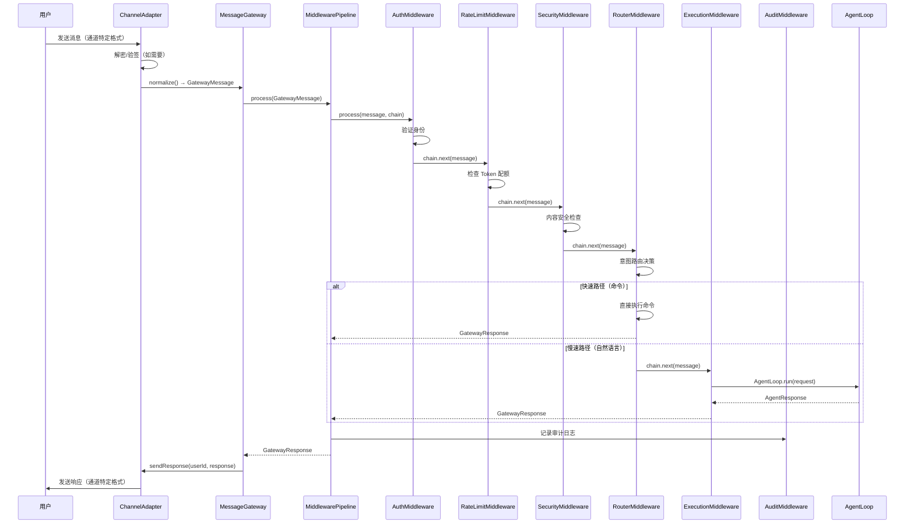
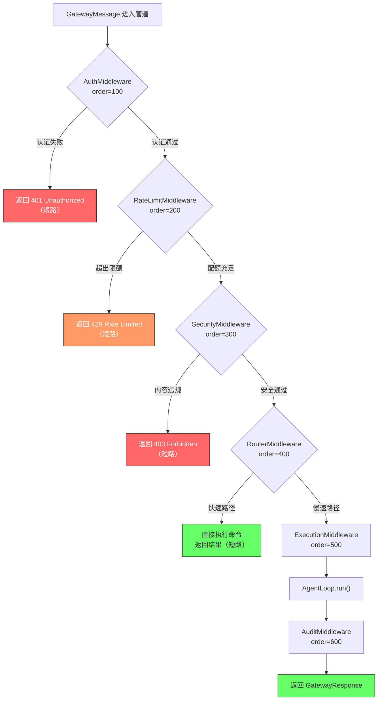
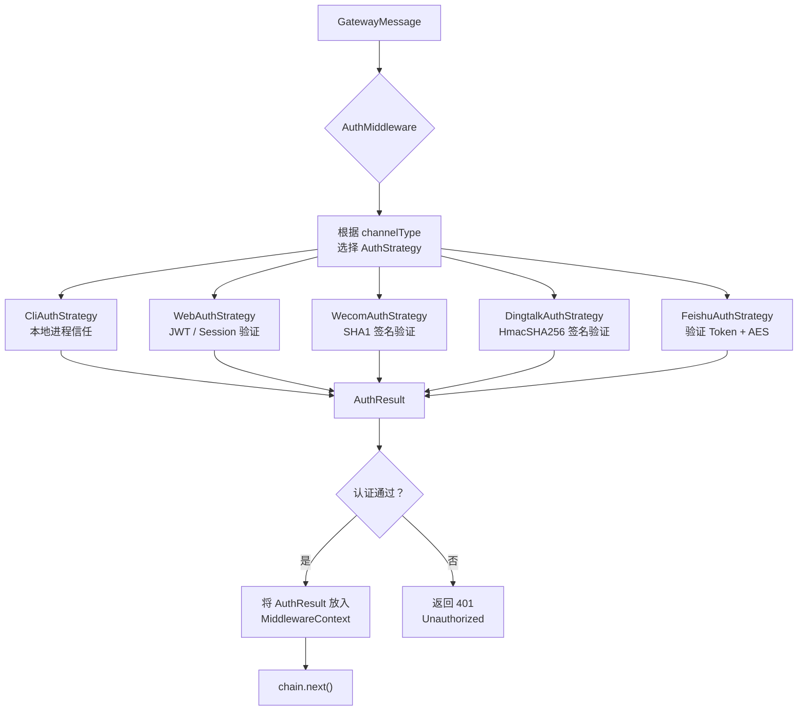
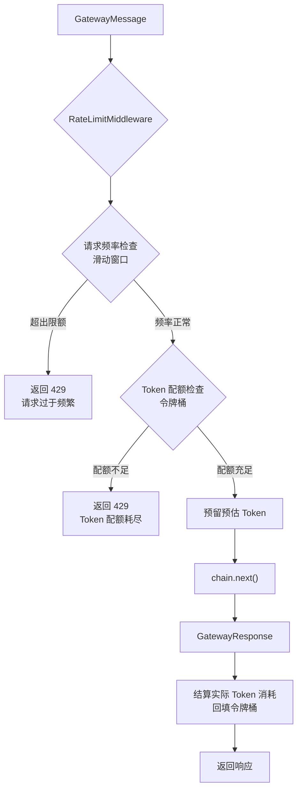
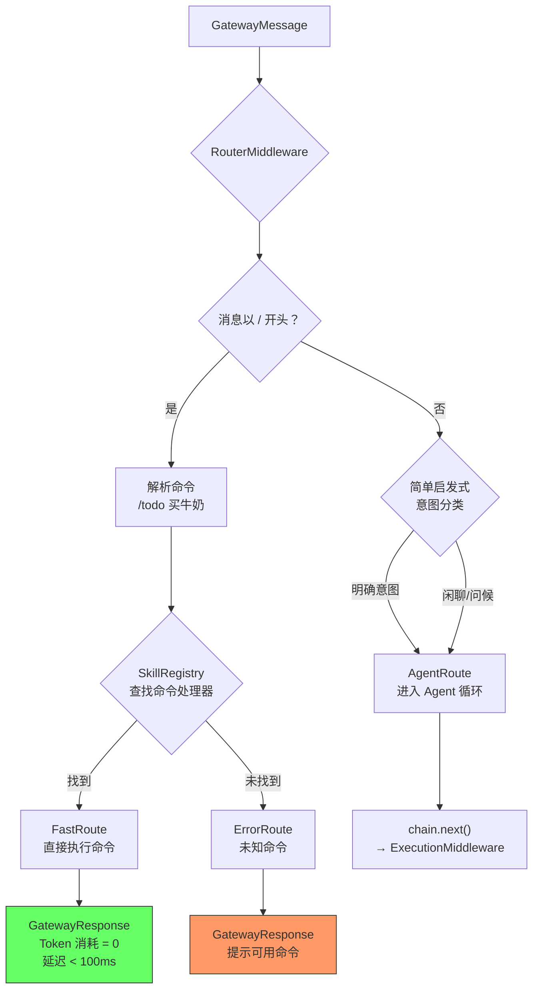
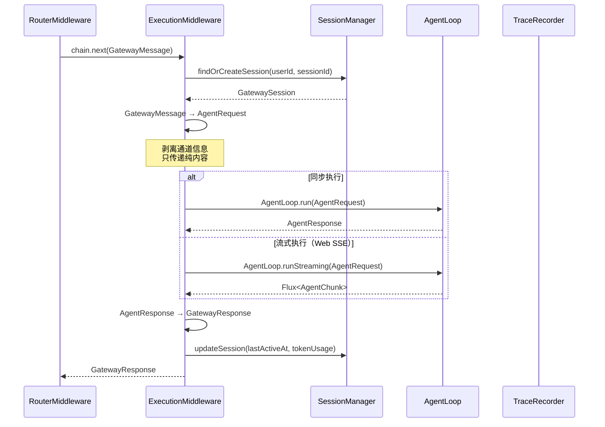
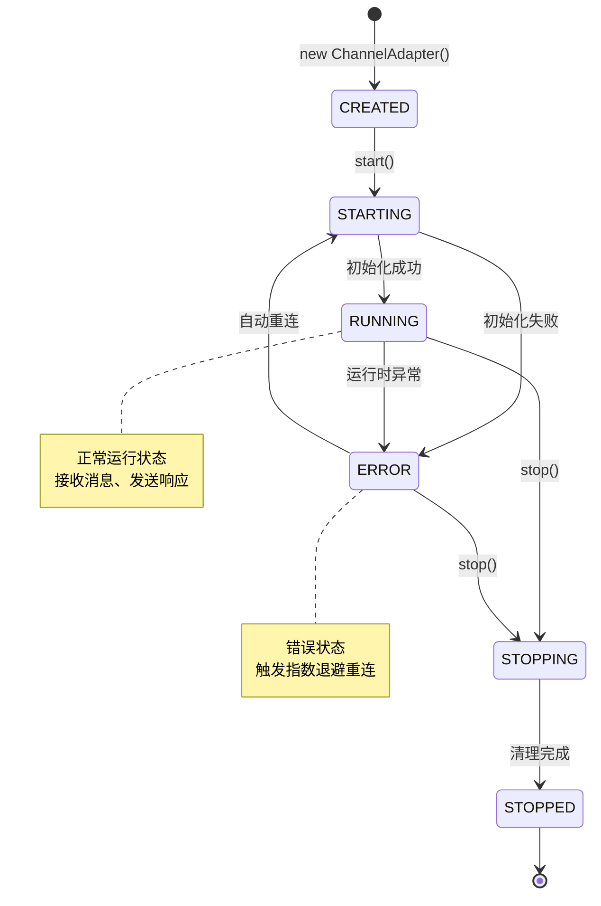
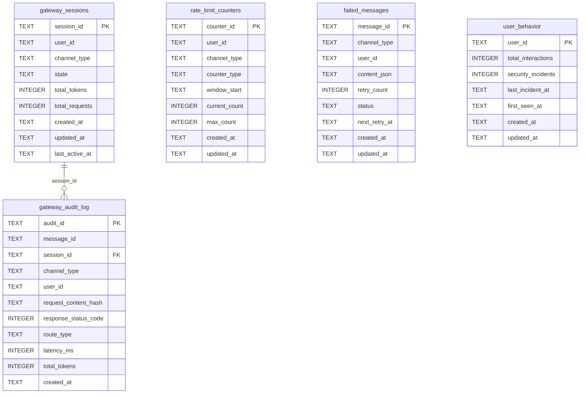

# Gateway + 中间件管道架构设计

> **文档性质**：深度架构设计文档（Developer-Facing）
> **目标读者**：核心开发者、架构评审者、技术面试官
> **模块归属**：`com.lifepilot.interaction`
> **最后更新**：2026-03
> **从属关系**：本文档从 [ARCHITECTURE.md](../ARCHITECTURE.md) §9 拆分而来，聚焦 Gateway + 中间件管道的完整设计。

---

## 目录

- [1. 设计哲学与原则](#1-设计哲学与原则)
- [2. GatewayMessage — 统一消息模型](#2-gatewaymessage--统一消息模型)
- [3. MessageGateway — 消息网关核心](#3-messagegateway--消息网关核心)
- [4. 中间件管道 — 责任链引擎](#4-中间件管道--责任链引擎)
- [5. AuthMiddleware — 认证鉴权中间件](#5-authmiddleware--认证鉴权中间件)
- [6. RateLimitMiddleware — 限流控制中间件](#6-ratelimitmiddleware--限流控制中间件)
- [7. SecurityMiddleware — 安全检查中间件](#7-securitymiddleware--安全检查中间件)
- [8. RouterMiddleware — 意图路由中间件](#8-routermiddleware--意图路由中间件)
- [9. ExecutionMiddleware — Agent 执行中间件](#9-executionmiddleware--agent-执行中间件)
- [10. AuditMiddleware — 审计日志中间件](#10-auditmiddleware--审计日志中间件)
- [11. ChannelAdapter — 通道适配器体系](#11-channeladapter--通道适配器体系)
- [12. SQLite Schema 与 Flyway 迁移](#12-sqlite-schema-与-flyway-迁移)
- [13. 配置参考](#13-配置参考)
- [14. jqwik 属性测试](#14-jqwik-属性测试)

---

## 1. 设计哲学与原则

### 1.1 核心命题：为什么 AI Agent 需要专用 Gateway

2025-2026 年的 AI Agent 基础设施领域正在经历一次深刻的认知转变。传统的 API Gateway——无论是 Kong、APISIX 还是 Spring Cloud Gateway——都是围绕 **HTTP 请求/响应** 模型设计的。它们的核心假设是：流量是同质的、延迟是可预测的、成本按请求计数。

这个假设在 AI Agent 场景下被彻底颠覆：

```
传统 API Gateway 在 AI Agent 场景下的失败模式：

1. 成本模型错配（Cost Model Mismatch）
   传统 Gateway 按请求数计费/限流 → 1 个 Agent 请求可能消耗 50K Token
   另一个请求只消耗 200 Token → 两者被同等对待
   → 一个"简单查询"和一个"深度分析"的成本差 250 倍，但限流策略完全相同

2. 延迟不可预测（Unpredictable Latency）
   传统 API：P99 延迟 < 500ms，可以设置固定超时
   Agent 请求：简单问答 2s，多步推理 30s，工具调用链 120s
   → 固定超时要么太短（误杀正常请求）要么太长（资源浪费）

3. 流量方向反转（Traffic Direction Reversal）
   传统 Gateway：入站请求 → 后端服务 → 出站响应（单向）
   Agent Gateway：入站请求 → Agent → 出站 LLM 调用 → 出站工具调用 → 入站结果 → 出站响应
   → Agent 既是服务端（接收用户请求）又是客户端（调用 LLM 和工具）
   → 传统 Gateway 只管入站，不管出站的 LLM/工具调用

4. 多通道异构（Multi-Channel Heterogeneity）
   传统 Gateway：所有流量都是 HTTP/HTTPS
   Agent Gateway：CLI（stdin/stdout）、Web（HTTP + SSE）、企微（加密 XML）、
   钉钉（签名 JSON）、飞书（加密 JSON）
   → 每个通道有不同的认证机制、消息格式、推送方式

5. 会话状态依赖（Session State Dependency）
   传统 Gateway：无状态，每个请求独立处理
   Agent Gateway：多轮对话需要会话上下文，限流需要累计 Token 消耗
   → 需要有状态的中间件管道

6. 安全威胁升维（Security Threat Escalation）
   传统 Gateway：SQL 注入、XSS、CSRF
   Agent Gateway：Prompt 注入、工具滥用、Token 耗尽攻击、间接提示注入
   → 传统 WAF 规则无法检测 Prompt 注入
```

LifePilot 的核心设计命题是：**AI Agent 需要一个专用的 Gateway 层，它理解 Token 经济学、支持多通道异构接入、提供认知增强的安全策略，并且将通道差异完全屏蔽在 Agent 业务逻辑之外**。

这个命题直接导出了 LifePilot Gateway 的核心架构决策：

```
┌─────────────────────────────────────────────────────────────────────────┐
│                    LifePilot Gateway 架构概览                             │
│                                                                         │
│  ┌──────────────────────────────────────────────────────────────────┐   │
│  │                    通道适配层（ChannelAdapter）                    │   │
│  │  ┌─────────┐ ┌─────────┐ ┌─────────┐ ┌─────────┐ ┌─────────┐  │   │
│  │  │  CLI    │ │  Web    │ │  企微   │ │  钉钉   │ │  飞书   │  │   │
│  │  │ JLine 3 │ │HTTP+SSE │ │ Webhook │ │ Webhook │ │ Webhook │  │   │
│  │  └────┬────┘ └────┬────┘ └────┬────┘ └────┬────┘ └────┬────┘  │   │
│  │       │           │           │           │           │        │   │
│  │       └───────────┴─────┬─────┴───────────┴───────────┘        │   │
│  │                         │                                      │   │
│  │                   GatewayMessage（统一消息格式）                  │   │
│  └─────────────────────────┼──────────────────────────────────────┘   │
│                            │                                          │
│  ┌─────────────────────────┼──────────────────────────────────────┐   │
│  │                    中间件管道（MiddlewarePipeline）               │   │
│  │                         │                                      │   │
│  │  ┌─────────────────────────────────────────────────────────┐   │   │
│  │  │ Auth → RateLimit → Security → Router → Execution → Audit│   │   │
│  │  └─────────────────────────────────────────────────────────┘   │   │
│  │                                                                │   │
│  │  每个中间件可独立配置、测试、启用/禁用                           │   │
│  │  任何中间件可短路终止管道（如认证失败、限流触发）                 │   │
│  └────────────────────────────────────────────────────────────────┘   │
│                            │                                          │
│  ┌─────────────────────────┼──────────────────────────────────────┐   │
│  │                    业务执行层                                    │   │
│  │                         │                                      │   │
│  │  ┌──────────────┐  ┌──────────────┐  ┌──────────────────┐     │   │
│  │  │  AgentLoop   │  │ SkillRegistry│  │ DynamicToolRegistry│    │   │
│  │  │  控制循环     │  │ 技能注册中心  │  │ 工具注册中心       │    │   │
│  │  └──────────────┘  └──────────────┘  └──────────────────┘     │   │
│  │                                                                │   │
│  │  业务层完全不感知消息来自哪个通道                                 │   │
│  └────────────────────────────────────────────────────────────────┘   │
│                                                                       │
│  关键边界：通道差异在 ChannelAdapter 层完全消化                        │
│  中间件管道处理的是统一的 GatewayMessage，与通道无关                   │
│  AgentLoop 只关心用户意图，不关心消息来源                              │
└───────────────────────────────────────────────────────────────────────┘
```

### 1.2 前沿研究基础

LifePilot Gateway 的设计不是凭空构想，而是建立在 2025-2026 年 AI 基础设施领域的前沿研究和工程实践之上。以下是核心参考来源及其对 LifePilot 设计的影响：

#### 1.2.1 AI Gateway 作为 Agent 流量的基础设施层

[InfoQ 2025 AI Infrastructure](https://www.infoq.com/articles/ai-infrastructure-aggregating-agentic-traffic/) 提出了一个关键洞察：**AI Gateway 是所有 AI Agent 请求的中间件层，负责策略执行、可见性保障和使用优化**。传统 API Gateway 管理的是"服务到服务"的流量，而 AI Gateway 管理的是"Agent 到 LLM/工具"的流量——这是一种全新的流量模式，具有以下特征：

- **Token 经济学**：成本不按请求计数，而按 Token 消耗计量
- **双向流量**：Agent 既接收用户请求（入站），又主动调用 LLM 和工具（出站）
- **不可预测延迟**：同一个 Agent 的不同请求，延迟可能相差 100 倍
- **语义级安全**：需要理解自然语言内容才能检测威胁（如 Prompt 注入）

LifePilot 的映射：`RateLimitMiddleware` 实现了 Token 感知限流（而非请求计数），`SecurityMiddleware` 集成了 `GuardrailEngine` 进行语义级安全检查。

#### 1.2.2 Token 感知的限流与成本归因

[Amit Kothari — API Gateway for AI Applications](https://www.amitkoth.com/api-gateway-ai-applications/) 深入分析了 AI 应用场景下 API Gateway 的设计挑战，提出了三个关键模式：

| 模式 | 传统 Gateway | AI Gateway | LifePilot 实现 |
|------|-------------|-----------|---------------|
| **限流** | 请求数/秒 | Token 数/分钟 + 请求数/秒 | `TokenBucket` 双维度限流 |
| **路由** | URL 路径匹配 | 模型能力匹配 + 成本优化 | `RouterMiddleware` 快慢路径分流 |
| **成本** | 按请求计费 | 按 Token + 模型 + 通道归因 | `AuditMiddleware` Token 消耗审计 |

#### 1.2.3 AI Gateway 与 Agent Gateway 的区分

[Gravitee — AI Gateway and Agent Gateway Introduction](https://www.gravitee.io/blog/ai-gateway-and-agent-gateway-introduction) 提出了一个重要的概念区分：

- **AI Gateway**：管理应用与 LLM 之间的交互（Prompt 管理、Token 限流、模型路由、成本控制）
- **Agent Gateway**：管理 Agent 与 Agent 之间的通信（Agent 发现、协议转换、权限控制、审计追踪）

LifePilot 的 `MessageGateway` 同时承担了这两个角色：对外是 Agent Gateway（管理用户通过各通道与 Agent 的交互），对内是 AI Gateway 的入口（通过 `ExecutionMiddleware` 触发 `AgentLoop`，后者通过 `LlmRouter` 与 LLM 交互）。

#### 1.2.4 AI Gateway 与传统 API Gateway 的本质差异

[Apache APISIX — AI Gateway vs API Gateway](https://apisix.apache.org/blog/2025/03/21/ai-gateway-vs-api-gateway-differences-explained/) 系统性地总结了两者的差异：

```
┌─────────────────────────────────────────────────────────────────────────┐
│              传统 API Gateway vs AI Agent Gateway 对比                    │
│                                                                         │
│  维度              传统 API Gateway          AI Agent Gateway            │
│  ─────────────     ──────────────────        ──────────────────          │
│  流量模型          请求/响应（同步）          多轮对话 + 流式响应          │
│  成本单位          请求数                    Token 数                     │
│  延迟特征          可预测（P99 < 500ms）     不可预测（2s ~ 120s）        │
│  安全威胁          SQL 注入 / XSS            Prompt 注入 / 工具滥用       │
│  状态需求          无状态                    有状态（会话 + Token 累计）   │
│  路由依据          URL 路径 / Header         意图分类 / 模型能力          │
│  限流策略          固定窗口 / 滑动窗口       Token 桶 + 滑动窗口          │
│  认证方式          API Key / JWT / OAuth     多通道异构认证               │
│  可观测性          请求级指标                 Token 级 + 步骤级轨迹        │
│  协议支持          HTTP / gRPC               HTTP + SSE + 加密 XML/JSON  │
└─────────────────────────────────────────────────────────────────────────┘
```

#### 1.2.5 责任链模式与中间件管道

责任链模式（Chain of Responsibility）是中间件管道的经典设计模式。在 LifePilot 的上下文中，每个中间件是链上的一个处理器，负责特定的横切关注点（认证、限流、安全、路由、执行、审计）。关键设计决策：

- **单一职责**：每个中间件只做一件事，可独立测试
- **可组合**：中间件可以动态添加、移除、重排序
- **短路能力**：任何中间件可以终止管道（如认证失败直接返回 401）
- **上下文传递**：通过 `MiddlewareContext` 在中间件之间共享数据

#### 1.2.6 企业 IM 集成模式

企业微信、钉钉、飞书是中国企业最主流的 IM 平台。LifePilot 通过 Webhook 回调模式集成这三个平台，每个平台有不同的认证机制和消息格式：

| 平台 | 认证方式 | 消息格式 | 推送方式 | 特殊能力 |
|------|---------|---------|---------|---------|
| 企业微信 | SHA1 签名 + AES 加密 | XML | 被动回复 + 主动推送 | Markdown 卡片 |
| 钉钉 | HmacSHA256 签名 | JSON | Webhook 回调 | 交互式卡片（ActionCard） |
| 飞书 | 验证 Token + AES 加密 | JSON | 事件订阅 v2.0 | 富文本（Post）+ 交互卡片 |

LifePilot 的 `ChannelAdapter` 体系将这些差异完全封装，上层中间件和 Agent 业务逻辑完全不感知通道差异。

### 1.3 五条核心设计原则

LifePilot Gateway 遵循五条核心设计原则。这些原则不是抽象的口号，而是直接映射到具体的代码实现：

#### 原则 1：统一入口，多通道适配

所有通道（CLI / Web / 企微 / 钉钉 / 飞书）共享同一个消息格式（`GatewayMessage`）和同一条处理管道（`MiddlewarePipeline`）。通道差异在 `ChannelAdapter` 层完全消化，中间件和 Agent 业务逻辑与通道无关。

```java
/**
 * 统一入口原则的代码体现。
 *
 * <p>无论消息来自哪个通道，最终都转换为 GatewayMessage，
 * 经过同一条中间件管道处理。这确保了：
 * <ol>
 *   <li>安全策略一致：所有通道共享同一套认证、限流、安全检查</li>
 *   <li>业务逻辑复用：Agent 不需要为每个通道写不同的处理逻辑</li>
 *   <li>可观测性统一：所有通道的审计日志格式一致</li>
 * </ol></p>
 */
public interface ChannelAdapter {

    /** 通道类型标识（cli / web / wecom / dingtalk / feishu）。 */
    String channelType();

    /**
     * 将通道特定的原始消息转换为统一的 GatewayMessage。
     *
     * <p>这是通道差异消化的核心方法。每个适配器负责：
     * <ul>
     *   <li>解析通道特定的消息格式（XML / JSON / 文本）</li>
     *   <li>提取用户标识、会话 ID、消息内容</li>
     *   <li>封装通道特定的元数据（如企微的 CorpId、钉钉的 ChatbotUserId）</li>
     * </ul></p>
     */
    GatewayMessage normalize(Object rawMessage);

    /** 将统一响应转换为通道特定格式并发送。 */
    void sendResponse(String userId, GatewayResponse response);
}
```

#### 原则 2：中间件可组合、可排序、可独立测试

每个中间件是一个独立的组件，有明确的输入/输出契约。中间件之间通过 `MiddlewareChain` 连接，可以动态调整顺序、启用/禁用、替换实现。每个中间件可以在不依赖其他中间件的情况下独立进行单元测试。

```java
/**
 * 中间件可组合原则的代码体现。
 *
 * <p>每个中间件实现 GatewayMiddleware 接口，通过 order() 声明执行顺序。
 * MiddlewarePipeline 在启动时按 order() 排序组装链路。</p>
 *
 * <p>可独立测试：每个中间件只依赖 GatewayMessage 和 MiddlewareChain，
 * 不依赖其他中间件的具体实现。测试时可以用 mock chain 验证行为。</p>
 */
public interface GatewayMiddleware {

    /** 处理消息，调用 chain.next() 继续或直接返回以短路。 */
    GatewayResponse process(GatewayMessage message, MiddlewareChain chain);

    /** 执行顺序（数值越小越先执行）。 */
    int order();

    /** 中间件名称（用于日志和配置）。 */
    String name();

    /** 是否启用（可通过配置动态控制）。 */
    default boolean enabled() {
        return true;
    }
}
```

#### 原则 3：Token 感知限流

传统的限流策略按请求数计数——每秒 100 个请求、每分钟 1000 个请求。但在 AI Agent 场景下，一个请求可能消耗 200 Token（简单问答），也可能消耗 50000 Token（深度分析）。按请求计数的限流无法反映真实的资源消耗。

LifePilot 的限流策略是 **Token 感知** 的：限流的单位不是请求数，而是 Token 消耗量。同时保留请求数限流作为辅助维度，防止高频低 Token 的 DoS 攻击。

```java
/**
 * Token 感知限流原则的代码体现。
 *
 * <p>双维度限流：
 * <ul>
 *   <li>Token 维度：每用户每小时最多消耗 N 个 Token</li>
 *   <li>请求维度：每用户每分钟最多发送 M 个请求</li>
 * </ul></p>
 *
 * <p>Token 消耗在请求处理完成后回填（因为处理前无法精确知道消耗量），
 * 但在处理前会基于历史平均值进行预估检查。</p>
 */
public record RateLimitConfig(
    int maxTokensPerHour,       // 每用户每小时最大 Token 消耗
    int maxTokensPerDay,        // 每用户每天最大 Token 消耗
    int maxRequestsPerMinute,   // 每用户每分钟最大请求数
    int estimatedTokensPerRequest // 预估每请求 Token 消耗（用于预检查）
) {
    /** 默认配置：每小时 100K Token，每天 500K Token，每分钟 30 请求。 */
    public static final RateLimitConfig DEFAULT = new RateLimitConfig(
        100_000, 500_000, 30, 2000
    );
}
```

#### 原则 4：认知记忆增强安全

传统的安全策略是静态的——固定的规则、固定的阈值。LifePilot 的安全中间件可以访问用户的认知记忆（通过 `HybridRetriever`），根据用户的历史行为动态调整安全策略。例如：

- 长期活跃且行为正常的用户 → 信任度高 → 放宽限制
- 新用户或行为异常的用户 → 信任度低 → 严格检查
- 曾触发安全告警的用户 → 信任度降级 → 额外验证

```java
/**
 * 认知记忆增强安全原则的代码体现。
 *
 * <p>SecurityMiddleware 不仅检查当前消息的内容，
 * 还会查询用户的历史行为记录，动态计算信任分数。
 * 信任分数影响安全检查的严格程度。</p>
 */
public record TrustScore(
    String userId,
    double score,           // 0.0 ~ 1.0，越高越信任
    int totalInteractions,  // 历史交互总数
    int securityIncidents,  // 安全事件次数
    Instant lastIncident,   // 最近一次安全事件时间
    Instant firstSeen       // 首次出现时间
) {
    /** 判断是否为高信任用户。 */
    public boolean isHighTrust() {
        return score >= 0.8 && totalInteractions >= 100 && securityIncidents == 0;
    }

    /** 判断是否需要额外验证。 */
    public boolean requiresExtraVerification() {
        return score < 0.3 || securityIncidents >= 3;
    }
}
```

#### 原则 5：通道无关的业务逻辑

Agent 层（`AgentLoop`、`StateReducer`、`SkillRegistry`）完全不感知消息来自哪个通道。它们处理的是纯粹的用户意图和任务执行，不关心消息是通过 CLI 输入的、Web 页面提交的、还是企微机器人转发的。

```java
/**
 * 通道无关原则的代码体现。
 *
 * <p>AgentLoop.run() 接收的是 AgentRequest，不是 GatewayMessage。
 * GatewayMessage → AgentRequest 的转换在 ExecutionMiddleware 中完成。
 * AgentLoop 永远不会看到 channelType、channelMetadata 等通道信息。</p>
 */

// ExecutionMiddleware 中的转换逻辑
AgentRequest agentRequest = AgentRequest.builder()
    .sessionId(message.sessionId())
    .userId(message.userId())
    .message(message.content())          // 只传递纯文本内容
    .attachments(message.attachments())  // 附件（如果有）
    .build();
// 注意：channelType、channelMetadata 不传递给 AgentLoop

AgentResponse agentResponse = agentLoop.run(agentRequest);
```


---

## 2. GatewayMessage — 统一消息模型

### 2.1 核心设计：record + sealed interface 构建类型安全的消息体系

LifePilot 的统一消息模型是整个 Gateway 架构的基石。所有通道的消息在进入中间件管道之前，都必须转换为 `GatewayMessage`。这个转换由各通道的 `ChannelAdapter` 负责，确保中间件和 Agent 业务逻辑只需要处理一种消息格式。

```mermaid
classDiagram
    class GatewayMessage {
        <<record>>
        -String messageId
        -ChannelType channelType
        -String userId
        -String sessionId
        -MessageContent content
        -List~Attachment~ attachments
        -ChannelMetadata channelMetadata
        -Instant timestamp
        -Map~String,String~ traceHeaders
        +toBuilder() Builder
    }

    class GatewayResponse {
        <<record>>
        -String responseId
        -ChannelType channelType
        -ResponseContent content
        -List~Attachment~ attachments
        -Map~String,Object~ metadata
        -Duration latency
        -TokenUsage tokenUsage
        +success(String) GatewayResponse
        +error(String, int) GatewayResponse
        +rateLimited() GatewayResponse
        +unauthorized() GatewayResponse
    }

    class MessageContent {
        <<sealed interface>>
    }

    class TextMessage {
        <<record>>
        -String text
    }

    class CommandMessage {
        <<record>>
        -String command
        -List~String~ args
        -String rawText
    }

    class FileMessage {
        <<record>>
        -String fileName
        -String mimeType
        -byte[] data
        -String caption
    }

    class CardMessage {
        <<record>>
        -String title
        -String description
        -List~CardAction~ actions
    }

    class EventMessage {
        <<record>>
        -String eventType
        -Map~String,Object~ payload
    }

    class ChannelMetadata {
        <<sealed interface>>
    }

    class CliMetadata {
        <<record>>
        -String terminalType
        -int terminalWidth
        -boolean colorSupported
    }

    class WebMetadata {
        <<record>>
        -String userAgent
        -String remoteAddr
        -String sessionToken
    }

    class WecomMetadata {
        <<record>>
        -String corpId
        -String agentId
        -String msgSignature
        -String encryptedMsg
    }

    class DingtalkMetadata {
        <<record>>
        -String chatbotUserId
        -String conversationId
        -String sign
        -long timestamp
    }

    class FeishuMetadata {
        <<record>>
        -String appId
        -String tenantKey
        -String messageId
        -String chatId
    }

    class ChannelType {
        <<enum>>
        CLI
        WEB
        WECOM
        DINGTALK
        FEISHU
    }

    class TokenUsage {
        <<record>>
        -int promptTokens
        -int completionTokens
        -int totalTokens
        -String modelId
    }

    GatewayMessage --> MessageContent
    GatewayMessage --> ChannelMetadata
    GatewayMessage --> ChannelType
    GatewayResponse --> TokenUsage
    GatewayResponse --> ChannelType
    MessageContent <|.. TextMessage : permits
    MessageContent <|.. CommandMessage : permits
    MessageContent <|.. FileMessage : permits
    MessageContent <|.. CardMessage : permits
    MessageContent <|.. EventMessage : permits
    ChannelMetadata <|.. CliMetadata : permits
    ChannelMetadata <|.. WebMetadata : permits
    ChannelMetadata <|.. WecomMetadata : permits
    ChannelMetadata <|.. DingtalkMetadata : permits
    ChannelMetadata <|.. FeishuMetadata : permits
```



### 2.2 ChannelType 枚举

```java
package com.lifepilot.interaction.model;

/**
 * 通道类型枚举。
 *
 * <p>定义 LifePilot 支持的所有交互通道。每个通道有不同的
 * 传输协议、认证机制和消息格式，但在 Gateway 层统一处理。</p>
 */
public enum ChannelType {

    /** 命令行终端 — JLine 3 驱动，本地进程内通信。 */
    CLI("cli", false),

    /** Web UI — HTTP + SSE，Vue 3 SPA 前端。 */
    WEB("web", false),

    /** 企业微信 — HTTPS Webhook，XML 消息格式，AES 加密。 */
    WECOM("wecom", true),

    /** 钉钉 — HTTPS Webhook，JSON 消息格式，HmacSHA256 签名。 */
    DINGTALK("dingtalk", true),

    /** 飞书 — HTTPS 事件订阅 v2.0，JSON 消息格式，AES 加密。 */
    FEISHU("feishu", true);

    private final String value;
    private final boolean requiresWebhook;

    ChannelType(String value, boolean requiresWebhook) {
        this.value = value;
        this.requiresWebhook = requiresWebhook;
    }

    /** 获取通道类型字符串值（用于配置和数据库存储）。 */
    public String value() {
        return value;
    }

    /** 是否需要 Webhook 回调（企业 IM 通道需要）。 */
    public boolean requiresWebhook() {
        return requiresWebhook;
    }

    /** 从字符串值解析通道类型。 */
    public static ChannelType fromValue(String value) {
        for (ChannelType type : values()) {
            if (type.value.equals(value)) {
                return type;
            }
        }
        throw new IllegalArgumentException("未知的通道类型: " + value);
    }
}
```

### 2.3 MessageContent — sealed interface 消息内容体系

```java
package com.lifepilot.interaction.model;

import java.util.List;
import java.util.Map;

/**
 * 消息内容 — sealed interface 穷举所有消息类型。
 *
 * <p>使用 sealed interface 确保所有消息类型在编译时已知，
 * switch 表达式可以穷举匹配，不会遗漏任何类型。</p>
 *
 * <p>支持的消息类型：
 * <ul>
 *   <li>TextMessage — 纯文本消息（最常见）</li>
 *   <li>CommandMessage — 命令消息（以 / 开头，如 /todo、/schedule）</li>
 *   <li>FileMessage — 文件消息（图片、文档、音频、视频）</li>
 *   <li>CardMessage — 卡片消息（交互式卡片，来自企业 IM）</li>
 *   <li>EventMessage — 事件消息（系统事件，如用户加入、通道连接）</li>
 * </ul></p>
 */
public sealed interface MessageContent
        permits TextMessage, CommandMessage, FileMessage, CardMessage, EventMessage {

    /** 获取消息的纯文本表示（用于日志和审计）。 */
    String toPlainText();
}

/**
 * 纯文本消息 — 最常见的消息类型。
 *
 * @param text 消息文本内容
 */
public record TextMessage(String text) implements MessageContent {

    public TextMessage {
        if (text == null || text.isBlank()) {
            throw new IllegalArgumentException("文本消息内容不能为空");
        }
    }

    @Override
    public String toPlainText() {
        return text;
    }
}

/**
 * 命令消息 — 以 / 开头的快捷命令。
 *
 * <p>命令消息会被 RouterMiddleware 识别并走快速路径，
 * 直接路由到对应的 Skill/工具，跳过 LLM 推理。</p>
 *
 * @param command 命令名称（不含 / 前缀，如 "todo"、"schedule"）
 * @param args 命令参数列表
 * @param rawText 原始文本（包含 / 前缀和参数）
 */
public record CommandMessage(
    String command,
    List<String> args,
    String rawText
) implements MessageContent {

    public CommandMessage {
        if (command == null || command.isBlank()) {
            throw new IllegalArgumentException("命令名称不能为空");
        }
        args = List.copyOf(args);
    }

    @Override
    public String toPlainText() {
        return rawText;
    }

    /** 从原始文本解析命令消息。 */
    public static CommandMessage parse(String rawText) {
        if (!rawText.startsWith("/")) {
            throw new IllegalArgumentException("命令消息必须以 / 开头: " + rawText);
        }
        String[] parts = rawText.substring(1).split("\\s+", 2);
        String command = parts[0].toLowerCase();
        List<String> args = parts.length > 1
            ? List.of(parts[1].split("\\s+"))
            : List.of();
        return new CommandMessage(command, args, rawText);
    }
}

/**
 * 文件消息 — 包含文件附件的消息。
 *
 * @param fileName 文件名
 * @param mimeType MIME 类型（如 image/png、application/pdf）
 * @param data 文件二进制数据
 * @param caption 文件说明文字（可选）
 */
public record FileMessage(
    String fileName,
    String mimeType,
    byte[] data,
    @Nullable String caption
) implements MessageContent {

    @Override
    public String toPlainText() {
        return caption != null
            ? "[文件: %s] %s".formatted(fileName, caption)
            : "[文件: %s]".formatted(fileName);
    }
}

/**
 * 卡片消息 — 交互式卡片（来自企业 IM 的卡片回调）。
 *
 * @param title 卡片标题
 * @param description 卡片描述
 * @param actions 用户点击的操作列表
 */
public record CardMessage(
    String title,
    String description,
    List<CardAction> actions
) implements MessageContent {

    public CardMessage {
        actions = List.copyOf(actions);
    }

    @Override
    public String toPlainText() {
        return "[卡片: %s] %s".formatted(title, description);
    }

    /**
     * 卡片操作。
     *
     * @param actionId 操作 ID
     * @param label 操作标签
     * @param value 操作值
     */
    public record CardAction(String actionId, String label, String value) {}
}

/**
 * 事件消息 — 系统事件（非用户主动发送的消息）。
 *
 * @param eventType 事件类型（如 "user_joined"、"channel_connected"、"heartbeat"）
 * @param payload 事件负载数据
 */
public record EventMessage(
    String eventType,
    Map<String, Object> payload
) implements MessageContent {

    public EventMessage {
        payload = Map.copyOf(payload);
    }

    @Override
    public String toPlainText() {
        return "[事件: %s]".formatted(eventType);
    }
}
```

### 2.4 ChannelMetadata — sealed interface 通道元数据体系

```java
package com.lifepilot.interaction.model;

import jakarta.annotation.Nullable;

/**
 * 通道元数据 — sealed interface 穷举所有通道的元数据类型。
 *
 * <p>每个通道有不同的元数据结构。使用 sealed interface 确保
 * 在处理通道特定逻辑时可以穷举匹配。</p>
 *
 * <p>元数据主要用于：
 * <ul>
 *   <li>认证验证（签名、Token、加密密钥）</li>
 *   <li>响应路由（知道回复到哪个通道的哪个会话）</li>
 *   <li>审计追踪（记录消息来源的完整上下文）</li>
 * </ul></p>
 */
public sealed interface ChannelMetadata
        permits CliMetadata, WebMetadata, WecomMetadata, DingtalkMetadata, FeishuMetadata {

    /** 获取通道类型。 */
    ChannelType channelType();
}

/**
 * CLI 通道元数据。
 *
 * @param terminalType 终端类型（如 "xterm-256color"）
 * @param terminalWidth 终端宽度（字符数）
 * @param colorSupported 是否支持彩色输出
 */
public record CliMetadata(
    String terminalType,
    int terminalWidth,
    boolean colorSupported
) implements ChannelMetadata {

    @Override
    public ChannelType channelType() {
        return ChannelType.CLI;
    }
}

/**
 * Web 通道元数据。
 *
 * @param userAgent 浏览器 User-Agent
 * @param remoteAddr 客户端 IP 地址
 * @param sessionToken 会话 Token（JWT 或 Session ID）
 * @param acceptsSse 是否支持 SSE 流式响应
 */
public record WebMetadata(
    String userAgent,
    String remoteAddr,
    @Nullable String sessionToken,
    boolean acceptsSse
) implements ChannelMetadata {

    @Override
    public ChannelType channelType() {
        return ChannelType.WEB;
    }
}

/**
 * 企业微信通道元数据。
 *
 * @param corpId 企业 ID
 * @param agentId 应用 ID
 * @param msgSignature 消息签名（SHA1(token + timestamp + nonce + encrypt)）
 * @param timestamp 时间戳
 * @param nonce 随机字符串
 * @param encryptedMsg AES 加密的消息体
 */
public record WecomMetadata(
    String corpId,
    String agentId,
    String msgSignature,
    String timestamp,
    String nonce,
    @Nullable String encryptedMsg
) implements ChannelMetadata {

    @Override
    public ChannelType channelType() {
        return ChannelType.WECOM;
    }
}

/**
 * 钉钉通道元数据。
 *
 * @param chatbotUserId 机器人用户 ID
 * @param conversationId 会话 ID
 * @param conversationType 会话类型（"1" 单聊，"2" 群聊）
 * @param senderNick 发送者昵称
 * @param sign 签名（HmacSHA256(timestamp + "\n" + secret)）
 * @param timestamp 时间戳（毫秒）
 * @param isAtAll 是否 @所有人
 */
public record DingtalkMetadata(
    String chatbotUserId,
    String conversationId,
    String conversationType,
    String senderNick,
    String sign,
    long timestamp,
    boolean isAtAll
) implements ChannelMetadata {

    @Override
    public ChannelType channelType() {
        return ChannelType.DINGTALK;
    }
}

/**
 * 飞书通道元数据。
 *
 * @param appId 应用 ID
 * @param tenantKey 租户 Key
 * @param messageId 消息 ID（飞书分配）
 * @param chatId 群聊 ID（如果是群聊消息）
 * @param chatType 聊天类型（"p2p" 单聊，"group" 群聊）
 * @param eventId 事件 ID（用于去重）
 * @param eventType 事件类型（如 "im.message.receive_v1"）
 */
public record FeishuMetadata(
    String appId,
    String tenantKey,
    String messageId,
    @Nullable String chatId,
    String chatType,
    String eventId,
    String eventType
) implements ChannelMetadata {

    @Override
    public ChannelType channelType() {
        return ChannelType.FEISHU;
    }
}
```

### 2.5 GatewayMessage 完整实现

```java
package com.lifepilot.interaction.model;

import jakarta.annotation.Nullable;

import java.time.Instant;
import java.util.List;
import java.util.Map;
import java.util.UUID;

/**
 * 统一网关消息 — 所有通道消息的标准化表示。
 *
 * <p>这是 LifePilot Gateway 架构的核心数据结构。无论消息来自
 * CLI、Web、企微、钉钉还是飞书，都会被转换为 GatewayMessage，
 * 然后经过统一的中间件管道处理。</p>
 *
 * <p>设计决策：
 * <ul>
 *   <li>使用 record 确保不可变性 — 消息一旦创建不可修改</li>
 *   <li>使用 sealed interface 确保消息类型和通道元数据的穷举性</li>
 *   <li>使用 Builder 模式简化构建（record 的 toBuilder 模式）</li>
 *   <li>traceHeaders 用于分布式追踪（与 TraceRecorder 集成）</li>
 * </ul></p>
 *
 * @param messageId 消息唯一 ID（UUID v7，时间有序）
 * @param channelType 通道类型
 * @param userId 用户标识（通道内唯一）
 * @param sessionId 会话 ID（多轮对话的关联键）
 * @param content 消息内容（sealed interface，类型安全）
 * @param attachments 附件列表（图片、文件等）
 * @param channelMetadata 通道特定元数据（sealed interface）
 * @param timestamp 消息时间戳
 * @param traceHeaders 分布式追踪头（traceId、spanId 等）
 */
@Builder(toBuilder = true)
public record GatewayMessage(
    String messageId,
    ChannelType channelType,
    String userId,
    String sessionId,
    MessageContent content,
    List<Attachment> attachments,
    ChannelMetadata channelMetadata,
    Instant timestamp,
    Map<String, String> traceHeaders
) {
    /** 紧凑构造器 — 确保不可变集合和默认值。 */
    public GatewayMessage {
        if (messageId == null) {
            messageId = UUID.randomUUID().toString();
        }
        if (timestamp == null) {
            timestamp = Instant.now();
        }
        attachments = attachments != null ? List.copyOf(attachments) : List.of();
        traceHeaders = traceHeaders != null ? Map.copyOf(traceHeaders) : Map.of();
    }

    /** 获取消息内容的纯文本表示。 */
    public String contentAsText() {
        return content.toPlainText();
    }

    /** 判断是否为命令消息。 */
    public boolean isCommand() {
        return content instanceof CommandMessage;
    }

    /** 判断是否为事件消息。 */
    public boolean isEvent() {
        return content instanceof EventMessage;
    }

    /**
     * 附件数据。
     *
     * @param attachmentId 附件 ID
     * @param fileName 文件名
     * @param mimeType MIME 类型
     * @param data 二进制数据
     * @param size 文件大小（字节）
     */
    public record Attachment(
        String attachmentId,
        String fileName,
        String mimeType,
        byte[] data,
        long size
    ) {}
}
```

### 2.6 GatewayResponse 完整实现

```java
package com.lifepilot.interaction.model;

import jakarta.annotation.Nullable;

import java.time.Duration;
import java.util.List;
import java.util.Map;
import java.util.UUID;

/**
 * 统一网关响应 — 中间件管道的输出。
 *
 * <p>GatewayResponse 由中间件管道生成，然后由 ChannelAdapter
 * 转换为通道特定的响应格式发送给用户。</p>
 *
 * @param responseId 响应唯一 ID
 * @param channelType 目标通道类型
 * @param content 响应内容
 * @param attachments 响应附件
 * @param metadata 响应元数据（通道特定的额外信息）
 * @param latency 处理延迟
 * @param tokenUsage Token 消耗统计
 * @param statusCode 状态码（200 成功，429 限流，401 未认证，403 禁止，500 内部错误）
 * @param errorMessage 错误消息（仅在非 200 时有值）
 */
@Builder(toBuilder = true)
public record GatewayResponse(
    String responseId,
    ChannelType channelType,
    ResponseContent content,
    List<GatewayMessage.Attachment> attachments,
    Map<String, Object> metadata,
    Duration latency,
    @Nullable TokenUsage tokenUsage,
    int statusCode,
    @Nullable String errorMessage
) {
    /** 紧凑构造器 — 确保不可变集合和默认值。 */
    public GatewayResponse {
        if (responseId == null) {
            responseId = UUID.randomUUID().toString();
        }
        attachments = attachments != null ? List.copyOf(attachments) : List.of();
        metadata = metadata != null ? Map.copyOf(metadata) : Map.of();
    }

    /** 创建成功响应。 */
    public static GatewayResponse success(ChannelType channelType, String text) {
        return GatewayResponse.builder()
            .channelType(channelType)
            .content(new ResponseContent.TextContent(text))
            .statusCode(200)
            .build();
    }

    /** 创建成功响应（带 Token 消耗统计）。 */
    public static GatewayResponse success(
            ChannelType channelType, String text,
            TokenUsage tokenUsage, Duration latency) {
        return GatewayResponse.builder()
            .channelType(channelType)
            .content(new ResponseContent.TextContent(text))
            .tokenUsage(tokenUsage)
            .latency(latency)
            .statusCode(200)
            .build();
    }

    /** 创建错误响应。 */
    public static GatewayResponse error(ChannelType channelType, String message, int statusCode) {
        return GatewayResponse.builder()
            .channelType(channelType)
            .content(new ResponseContent.TextContent(message))
            .statusCode(statusCode)
            .errorMessage(message)
            .build();
    }

    /** 创建限流响应（429）。 */
    public static GatewayResponse rateLimited(ChannelType channelType) {
        return error(channelType, "请求过于频繁，请稍后再试。", 429);
    }

    /** 创建未认证响应（401）。 */
    public static GatewayResponse unauthorized(ChannelType channelType) {
        return error(channelType, "认证失败，请检查凭证。", 401);
    }

    /** 创建禁止访问响应（403）。 */
    public static GatewayResponse forbidden(ChannelType channelType, String reason) {
        return error(channelType, "访问被拒绝: " + reason, 403);
    }

    /** 判断是否为成功响应。 */
    public boolean isSuccess() {
        return statusCode >= 200 && statusCode < 300;
    }
}

/**
 * 响应内容 — sealed interface 穷举响应类型。
 */
public sealed interface ResponseContent {

    /** 获取纯文本表示。 */
    String toPlainText();

    /** 纯文本响应。 */
    record TextContent(String text) implements ResponseContent {
        @Override
        public String toPlainText() { return text; }
    }

    /** Markdown 响应（Web 和部分 IM 通道支持）。 */
    record MarkdownContent(String markdown) implements ResponseContent {
        @Override
        public String toPlainText() { return markdown; }
    }

    /** 卡片响应（企业 IM 通道的富文本卡片）。 */
    record CardContent(
        String title,
        String body,
        List<CardAction> actions
    ) implements ResponseContent {
        public CardContent {
            actions = List.copyOf(actions);
        }

        @Override
        public String toPlainText() { return title + "\n" + body; }

        public record CardAction(String label, String url) {}
    }

    /** 流式响应标记（指示 ChannelAdapter 使用 SSE 推送）。 */
    record StreamingContent(String streamId) implements ResponseContent {
        @Override
        public String toPlainText() { return "[流式响应: " + streamId + "]"; }
    }
}

/**
 * Token 消耗统计。
 *
 * @param promptTokens Prompt Token 数
 * @param completionTokens Completion Token 数
 * @param totalTokens 总 Token 数
 * @param modelId 使用的模型 ID
 */
public record TokenUsage(
    int promptTokens,
    int completionTokens,
    int totalTokens,
    String modelId
) {
    /** 零消耗（用于不涉及 LLM 的快速路径响应）。 */
    public static final TokenUsage ZERO = new TokenUsage(0, 0, 0, "none");
}
```


---

## 3. MessageGateway — 消息网关核心

### 3.1 核心设计：统一入口 + 通道注册 + 管道执行

`MessageGateway` 是整个 Gateway 架构的入口点。它负责：
1. 管理所有 `ChannelAdapter` 的生命周期（注册、启动、停止、健康检查）
2. 接收来自各通道的原始消息，委托对应的 `ChannelAdapter` 转换为 `GatewayMessage`
3. 将 `GatewayMessage` 推入 `MiddlewarePipeline` 处理
4. 将 `GatewayResponse` 委托对应的 `ChannelAdapter` 转换为通道特定格式并发送



### 3.2 MessageGateway 接口定义

```java
package com.lifepilot.interaction.gateway;

import com.lifepilot.interaction.channel.ChannelAdapter;
import com.lifepilot.interaction.model.ChannelType;
import com.lifepilot.interaction.model.GatewayMessage;
import com.lifepilot.interaction.model.GatewayResponse;

import java.util.List;
import java.util.Optional;

/**
 * 消息网关接口 — 所有通道的统一入口。
 *
 * <p>职责：
 * <ul>
 *   <li>管理通道适配器的生命周期</li>
 *   <li>接收并标准化各通道的消息</li>
 *   <li>将消息推入中间件管道处理</li>
 *   <li>将响应路由回对应的通道</li>
 * </ul></p>
 *
 * <p>线程安全：MessageGateway 的实现必须是线程安全的，
 * 因为多个通道可能同时提交消息。</p>
 */
public interface MessageGateway {

    /**
     * 处理入站消息。
     *
     * <p>这是 Gateway 的核心方法。消息经过中间件管道处理后返回响应。
     * 如果任何中间件短路了管道（如认证失败、限流触发），
     * 会直接返回对应的错误响应。</p>
     *
     * @param message 统一格式的网关消息
     * @return 处理结果
     */
    GatewayResponse process(GatewayMessage message);

    /**
     * 注册通道适配器。
     *
     * @param adapter 通道适配器实例
     * @throws IllegalStateException 如果同类型的适配器已注册
     */
    void registerChannel(ChannelAdapter adapter);

    /**
     * 注销通道适配器。
     *
     * @param channelType 通道类型
     */
    void unregisterChannel(ChannelType channelType);

    /**
     * 获取指定类型的通道适配器。
     *
     * @param channelType 通道类型
     * @return 适配器实例（如果已注册）
     */
    Optional<ChannelAdapter> getChannel(ChannelType channelType);

    /**
     * 获取所有已注册的通道适配器。
     *
     * @return 不可变的适配器列表
     */
    List<ChannelAdapter> getAllChannels();

    /** 启动网关（启动所有已注册的通道适配器）。 */
    void start();

    /** 停止网关（停止所有通道适配器，等待进行中的请求完成）。 */
    void stop();

    /** 网关是否正在运行。 */
    boolean isRunning();
}
```

### 3.3 DefaultMessageGateway 完整实现

```java
package com.lifepilot.interaction.gateway;

import com.lifepilot.interaction.channel.ChannelAdapter;
import com.lifepilot.interaction.middleware.MiddlewarePipeline;
import com.lifepilot.interaction.model.ChannelType;
import com.lifepilot.interaction.model.GatewayMessage;
import com.lifepilot.interaction.model.GatewayResponse;
import org.slf4j.Logger;
import org.slf4j.LoggerFactory;
import org.springframework.stereotype.Service;

import java.time.Duration;
import java.time.Instant;
import java.util.List;
import java.util.Optional;
import java.util.concurrent.ConcurrentHashMap;
import java.util.concurrent.atomic.AtomicBoolean;

/**
 * 默认消息网关实现。
 *
 * <p>核心职责：
 * <ol>
 *   <li>管理 ChannelAdapter 注册表（ConcurrentHashMap 保证线程安全）</li>
 *   <li>将 GatewayMessage 推入 MiddlewarePipeline</li>
 *   <li>处理网关级异常（中间件管道之外的异常）</li>
 *   <li>管理网关生命周期（启动/停止所有通道）</li>
 * </ol></p>
 *
 * <p>线程安全：使用 ConcurrentHashMap 管理通道注册表，
 * AtomicBoolean 管理运行状态。多个通道可以并发提交消息。</p>
 */
@Service
public class DefaultMessageGateway implements MessageGateway {

    private static final Logger log = LoggerFactory.getLogger(DefaultMessageGateway.class);

    /** 通道注册表：channelType → ChannelAdapter。 */
    private final ConcurrentHashMap<ChannelType, ChannelAdapter> channels = new ConcurrentHashMap<>();

    /** 中间件管道。 */
    private final MiddlewarePipeline pipeline;

    /** 网关运行状态。 */
    private final AtomicBoolean running = new AtomicBoolean(false);

    public DefaultMessageGateway(MiddlewarePipeline pipeline) {
        this.pipeline = pipeline;
    }

    /**
     * 处理入站消息 — 网关核心方法。
     *
     * <p>处理流程：
     * <ol>
     *   <li>验证网关是否正在运行</li>
     *   <li>记录入站消息日志</li>
     *   <li>将消息推入中间件管道</li>
     *   <li>记录处理结果和延迟</li>
     *   <li>返回响应</li>
     * </ol></p>
     *
     * <p>异常处理：中间件管道内部的异常由各中间件自行处理。
     * 如果管道本身抛出未捕获的异常，网关会返回 500 错误响应。</p>
     */
    @Override
    public GatewayResponse process(GatewayMessage message) {
        if (!running.get()) {
            log.warn("网关未运行，拒绝消息: messageId={}", message.messageId());
            return GatewayResponse.error(message.channelType(), "网关未运行", 503);
        }

        Instant startTime = Instant.now();
        log.info("入站消息: messageId={}, channel={}, userId={}, content={}",
            message.messageId(), message.channelType(),
            message.userId(), truncate(message.contentAsText(), 100));

        try {
            // 推入中间件管道处理
            GatewayResponse response = pipeline.execute(message);

            Duration latency = Duration.between(startTime, Instant.now());
            log.info("消息处理完成: messageId={}, status={}, latency={}ms",
                message.messageId(), response.statusCode(), latency.toMillis());

            // 补充延迟信息
            return response.toBuilder()
                .latency(latency)
                .build();

        } catch (Exception e) {
            Duration latency = Duration.between(startTime, Instant.now());
            log.error("消息处理异常: messageId={}, latency={}ms, error={}",
                message.messageId(), latency.toMillis(), e.getMessage(), e);
            return GatewayResponse.error(
                message.channelType(),
                "内部处理错误，请稍后重试。",
                500
            );
        }
    }

    /**
     * 注册通道适配器。
     *
     * @param adapter 通道适配器实例
     * @throws IllegalStateException 如果同类型的适配器已注册
     */
    @Override
    public void registerChannel(ChannelAdapter adapter) {
        ChannelType type = adapter.channelType();
        ChannelAdapter existing = channels.putIfAbsent(type, adapter);
        if (existing != null) {
            throw new IllegalStateException("通道适配器已注册: " + type);
        }
        log.info("通道适配器注册成功: type={}, class={}",
            type, adapter.getClass().getSimpleName());

        // 如果网关已在运行，立即启动新注册的通道
        if (running.get()) {
            startChannel(adapter);
        }
    }

    /**
     * 注销通道适配器。
     */
    @Override
    public void unregisterChannel(ChannelType channelType) {
        ChannelAdapter adapter = channels.remove(channelType);
        if (adapter != null) {
            stopChannel(adapter);
            log.info("通道适配器注销成功: type={}", channelType);
        }
    }

    @Override
    public Optional<ChannelAdapter> getChannel(ChannelType channelType) {
        return Optional.ofNullable(channels.get(channelType));
    }

    @Override
    public List<ChannelAdapter> getAllChannels() {
        return List.copyOf(channels.values());
    }

    /**
     * 启动网关 — 启动所有已注册的通道适配器。
     */
    @Override
    public void start() {
        if (running.compareAndSet(false, true)) {
            log.info("消息网关启动中，已注册通道数: {}", channels.size());
            channels.values().forEach(this::startChannel);
            log.info("消息网关启动完成");
        }
    }

    /**
     * 停止网关 — 停止所有通道适配器。
     */
    @Override
    public void stop() {
        if (running.compareAndSet(true, false)) {
            log.info("消息网关停止中...");
            channels.values().forEach(this::stopChannel);
            log.info("消息网关已停止");
        }
    }

    @Override
    public boolean isRunning() {
        return running.get();
    }

    /** 启动单个通道适配器（捕获异常，不影响其他通道）。 */
    private void startChannel(ChannelAdapter adapter) {
        try {
            adapter.start();
            log.info("通道适配器启动成功: type={}", adapter.channelType());
        } catch (Exception e) {
            log.error("通道适配器启动失败: type={}, error={}",
                adapter.channelType(), e.getMessage(), e);
        }
    }

    /** 停止单个通道适配器（捕获异常，确保所有通道都尝试停止）。 */
    private void stopChannel(ChannelAdapter adapter) {
        try {
            adapter.stop();
            log.info("通道适配器停止成功: type={}", adapter.channelType());
        } catch (Exception e) {
            log.error("通道适配器停止失败: type={}, error={}",
                adapter.channelType(), e.getMessage(), e);
        }
    }

    /** 截断字符串到指定长度。 */
    private String truncate(String s, int maxLen) {
        if (s == null) return "";
        return s.length() <= maxLen ? s : s.substring(0, maxLen) + "...";
    }
}
```

### 3.4 GatewayAutoConfiguration — Spring Boot 自动配置

```java
package com.lifepilot.interaction.config;

import com.lifepilot.interaction.channel.ChannelAdapter;
import com.lifepilot.interaction.gateway.DefaultMessageGateway;
import com.lifepilot.interaction.gateway.MessageGateway;
import com.lifepilot.interaction.middleware.MiddlewarePipeline;
import org.slf4j.Logger;
import org.slf4j.LoggerFactory;
import org.springframework.boot.context.event.ApplicationReadyEvent;
import org.springframework.context.annotation.Bean;
import org.springframework.context.annotation.Configuration;
import org.springframework.context.event.EventListener;

import java.util.List;

/**
 * Gateway 自动配置。
 *
 * <p>在 Spring Boot 启动时自动：
 * <ol>
 *   <li>创建 MessageGateway 实例</li>
 *   <li>注册所有 ChannelAdapter Bean</li>
 *   <li>在 ApplicationReady 事件后启动网关</li>
 * </ol></p>
 */
@Configuration
public class GatewayAutoConfiguration {

    private static final Logger log = LoggerFactory.getLogger(GatewayAutoConfiguration.class);

    @Bean
    public MessageGateway messageGateway(
            MiddlewarePipeline pipeline,
            List<ChannelAdapter> adapters) {
        var gateway = new DefaultMessageGateway(pipeline);
        adapters.forEach(adapter -> {
            gateway.registerChannel(adapter);
            log.info("自动注册通道适配器: type={}", adapter.channelType());
        });
        return gateway;
    }

    /**
     * 在应用完全就绪后启动网关。
     *
     * <p>使用 ApplicationReadyEvent 而非 PostConstruct，
     * 确保所有 Bean 初始化完成后再启动通道适配器。</p>
     */
    @EventListener(ApplicationReadyEvent.class)
    public void onApplicationReady(ApplicationReadyEvent event) {
        var gateway = event.getApplicationContext().getBean(MessageGateway.class);
        gateway.start();
        log.info("消息网关已随应用启动");
    }
}
```


---

## 4. 中间件管道 — 责任链引擎

### 4.1 核心设计：链式处理 + 短路能力 + 共享上下文

中间件管道是 LifePilot Gateway 的处理引擎。它将多个独立的中间件按优先级串联成一条处理链，每个中间件可以：
- **继续**：调用 `chain.next(message)` 将消息传递给下一个中间件
- **短路**：直接返回 `GatewayResponse`，终止管道（如认证失败返回 401）
- **修改**：在传递前修改消息或在返回后修改响应
- **共享数据**：通过 `MiddlewareContext` 在中间件之间传递数据



### 4.2 GatewayMiddleware 接口

```java
package com.lifepilot.interaction.middleware;

import com.lifepilot.interaction.model.GatewayMessage;
import com.lifepilot.interaction.model.GatewayResponse;

/**
 * 网关中间件接口 — 责任链模式的处理节点。
 *
 * <p>每个中间件职责单一，可独立配置和测试。
 * 中间件按 order() 值从小到大排序执行。</p>
 *
 * <p>实现规范：
 * <ul>
 *   <li>必须调用 chain.next() 继续管道，或直接返回 GatewayResponse 短路</li>
 *   <li>不应修改 GatewayMessage 本身（record 不可变），但可以通过 MiddlewareContext 传递数据</li>
 *   <li>异常应在中间件内部处理，不应向上抛出</li>
 *   <li>order() 值建议使用 100 的倍数，留出插入空间</li>
 * </ul></p>
 */
public interface GatewayMiddleware {

    /**
     * 处理消息。
     *
     * <p>调用 chain.next(message) 将消息传递给下一个中间件，
     * 或直接返回 GatewayResponse 短路管道。</p>
     *
     * @param message 网关消息
     * @param chain 中间件链
     * @return 处理结果
     */
    GatewayResponse process(GatewayMessage message, MiddlewareChain chain);

    /**
     * 执行顺序（数值越小越先执行）。
     *
     * <p>建议值：
     * <ul>
     *   <li>100 — AuthMiddleware</li>
     *   <li>200 — RateLimitMiddleware</li>
     *   <li>300 — SecurityMiddleware</li>
     *   <li>400 — RouterMiddleware</li>
     *   <li>500 — ExecutionMiddleware</li>
     *   <li>600 — AuditMiddleware</li>
     * </ul></p>
     */
    int order();

    /** 中间件名称（用于日志、配置和监控）。 */
    String name();

    /**
     * 是否启用。
     *
     * <p>可通过配置动态控制。禁用的中间件会被 MiddlewarePipeline 跳过。</p>
     */
    default boolean enabled() {
        return true;
    }
}
```

### 4.3 MiddlewareChain 实现

```java
package com.lifepilot.interaction.middleware;

import com.lifepilot.interaction.model.GatewayMessage;
import com.lifepilot.interaction.model.GatewayResponse;

import java.util.List;

/**
 * 中间件链 — 责任链的执行器。
 *
 * <p>MiddlewareChain 持有一个有序的中间件列表和当前执行位置。
 * 每次调用 next() 会执行下一个中间件。当所有中间件执行完毕后，
 * 调用 next() 会返回一个默认的"未处理"响应。</p>
 *
 * <p>设计决策：使用索引而非链表，因为中间件列表在管道组装后不会变化，
 * 索引访问比链表遍历更高效。</p>
 */
public class MiddlewareChain {

    private final List<GatewayMiddleware> middlewares;
    private final MiddlewareContext context;
    private int currentIndex;

    /**
     * 创建中间件链。
     *
     * @param middlewares 有序的中间件列表（已按 order() 排序）
     * @param context 共享上下文
     */
    public MiddlewareChain(List<GatewayMiddleware> middlewares, MiddlewareContext context) {
        this.middlewares = List.copyOf(middlewares);
        this.context = context;
        this.currentIndex = 0;
    }

    /**
     * 执行下一个中间件。
     *
     * <p>如果还有未执行的中间件，调用其 process() 方法。
     * 如果所有中间件都已执行，返回默认的"管道结束"响应。</p>
     *
     * @param message 网关消息
     * @return 处理结果
     */
    public GatewayResponse next(GatewayMessage message) {
        // 跳过禁用的中间件
        while (currentIndex < middlewares.size()) {
            GatewayMiddleware middleware = middlewares.get(currentIndex++);
            if (middleware.enabled()) {
                return middleware.process(message, this);
            }
        }
        // 所有中间件执行完毕，返回默认响应
        return GatewayResponse.error(
            message.channelType(),
            "消息未被任何中间件处理",
            500
        );
    }

    /**
     * 获取共享上下文。
     *
     * <p>中间件可以通过上下文在彼此之间传递数据。
     * 例如 AuthMiddleware 将认证结果放入上下文，
     * SecurityMiddleware 从上下文中读取信任等级。</p>
     */
    public MiddlewareContext context() {
        return context;
    }
}
```

### 4.4 MiddlewareContext — 跨中间件共享上下文

```java
package com.lifepilot.interaction.middleware;

import jakarta.annotation.Nullable;

import java.util.Optional;
import java.util.concurrent.ConcurrentHashMap;

/**
 * 中间件上下文 — 跨中间件的共享数据容器。
 *
 * <p>MiddlewareContext 是一个类型安全的属性包（Property Bag），
 * 允许中间件之间传递数据而不产生直接依赖。</p>
 *
 * <p>典型使用场景：
 * <ul>
 *   <li>AuthMiddleware 将 AuthResult 放入上下文</li>
 *   <li>SecurityMiddleware 从上下文读取 TrustLevel</li>
 *   <li>AuditMiddleware 从上下文收集所有中间件的处理结果</li>
 * </ul></p>
 *
 * <p>线程安全：使用 ConcurrentHashMap 存储，支持并发读写。</p>
 */
public class MiddlewareContext {

    /** 预定义的上下文键。 */
    public static final String KEY_AUTH_RESULT = "auth.result";
    public static final String KEY_TRUST_LEVEL = "auth.trustLevel";
    public static final String KEY_RATE_LIMIT_REMAINING = "rateLimit.remaining";
    public static final String KEY_SECURITY_CHECK_RESULT = "security.checkResult";
    public static final String KEY_ROUTE_DECISION = "router.decision";
    public static final String KEY_AGENT_RESPONSE = "execution.agentResponse";
    public static final String KEY_TOKEN_USAGE = "execution.tokenUsage";

    private final ConcurrentHashMap<String, Object> attributes = new ConcurrentHashMap<>();

    /**
     * 设置属性。
     *
     * @param key 属性键
     * @param value 属性值
     */
    public void set(String key, Object value) {
        attributes.put(key, value);
    }

    /**
     * 获取属性（类型安全）。
     *
     * @param key 属性键
     * @param type 期望的类型
     * @return 属性值（如果存在且类型匹配）
     */
    @SuppressWarnings("unchecked")
    public <T> Optional<T> get(String key, Class<T> type) {
        Object value = attributes.get(key);
        if (value != null && type.isInstance(value)) {
            return Optional.of((T) value);
        }
        return Optional.empty();
    }

    /**
     * 获取属性（非空，类型安全）。
     *
     * @param key 属性键
     * @param type 期望的类型
     * @return 属性值
     * @throws IllegalStateException 如果属性不存在或类型不匹配
     */
    public <T> T require(String key, Class<T> type) {
        return get(key, type).orElseThrow(() ->
            new IllegalStateException("上下文中缺少必需属性: " + key));
    }

    /** 判断是否包含指定属性。 */
    public boolean has(String key) {
        return attributes.containsKey(key);
    }

    /** 移除属性。 */
    public void remove(String key) {
        attributes.remove(key);
    }

    /** 获取所有属性的不可变快照（用于审计日志）。 */
    public java.util.Map<String, Object> snapshot() {
        return java.util.Map.copyOf(attributes);
    }
}
```

### 4.5 MiddlewarePipeline — 管道组装与执行

```java
package com.lifepilot.interaction.middleware;

import com.lifepilot.interaction.model.GatewayMessage;
import com.lifepilot.interaction.model.GatewayResponse;
import org.slf4j.Logger;
import org.slf4j.LoggerFactory;
import org.springframework.stereotype.Component;

import java.util.Comparator;
import java.util.List;
import java.util.concurrent.CopyOnWriteArrayList;

/**
 * 中间件管道 — 组装和执行中间件链。
 *
 * <p>MiddlewarePipeline 在启动时收集所有 GatewayMiddleware Bean，
 * 按 order() 排序后组装成处理链。每次消息处理时创建新的
 * MiddlewareChain 实例（确保线程安全）。</p>
 *
 * <p>支持动态注册/注销中间件（运行时热插拔）。
 * 使用 CopyOnWriteArrayList 保证读多写少场景下的线程安全。</p>
 */
@Component
public class MiddlewarePipeline {

    private static final Logger log = LoggerFactory.getLogger(MiddlewarePipeline.class);

    /** 已注册的中间件列表（按 order 排序）。 */
    private final CopyOnWriteArrayList<GatewayMiddleware> middlewares;

    /**
     * 构造管道 — 自动收集所有 GatewayMiddleware Bean。
     *
     * @param middlewares Spring 自动注入的所有中间件 Bean
     */
    public MiddlewarePipeline(List<GatewayMiddleware> middlewares) {
        this.middlewares = new CopyOnWriteArrayList<>(
            middlewares.stream()
                .sorted(Comparator.comparingInt(GatewayMiddleware::order))
                .toList()
        );
        log.info("中间件管道组装完成，中间件数量: {}, 顺序: {}",
            this.middlewares.size(),
            this.middlewares.stream()
                .map(m -> "%s(%d)".formatted(m.name(), m.order()))
                .toList());
    }

    /**
     * 执行中间件管道。
     *
     * <p>每次调用创建新的 MiddlewareChain 和 MiddlewareContext，
     * 确保并发请求之间互不干扰。</p>
     *
     * @param message 网关消息
     * @return 处理结果
     */
    public GatewayResponse execute(GatewayMessage message) {
        // 每次请求创建新的上下文和链
        MiddlewareContext context = new MiddlewareContext();
        MiddlewareChain chain = new MiddlewareChain(
            List.copyOf(middlewares), context);

        log.debug("管道开始执行: messageId={}, middlewareCount={}",
            message.messageId(), middlewares.size());

        return chain.next(message);
    }

    /**
     * 动态注册中间件。
     *
     * <p>注册后自动按 order() 重新排序。</p>
     *
     * @param middleware 要注册的中间件
     */
    public void register(GatewayMiddleware middleware) {
        middlewares.add(middleware);
        middlewares.sort(Comparator.comparingInt(GatewayMiddleware::order));
        log.info("中间件动态注册: name={}, order={}", middleware.name(), middleware.order());
    }

    /**
     * 动态注销中间件。
     *
     * @param name 中间件名称
     * @return 是否成功注销
     */
    public boolean unregister(String name) {
        boolean removed = middlewares.removeIf(m -> m.name().equals(name));
        if (removed) {
            log.info("中间件动态注销: name={}", name);
        }
        return removed;
    }

    /** 获取当前中间件列表（不可变快照）。 */
    public List<GatewayMiddleware> getMiddlewares() {
        return List.copyOf(middlewares);
    }
}
```


---

## 5. AuthMiddleware — 认证鉴权中间件

### 5.1 核心设计：多通道异构认证策略

传统 API Gateway 的认证通常是单一模式——API Key、JWT 或 OAuth。但 LifePilot 面对的是五个完全不同的通道，每个通道有自己的认证机制：

- **CLI**：本地进程，无需认证（操作系统级信任）
- **Web**：Session 或 JWT Token
- **企业微信**：消息签名验证（SHA1 of token + timestamp + nonce）
- **钉钉**：签名验证（HmacSHA256 of timestamp + secret）
- **飞书**：事件验证 Token + AES 加密密钥

`AuthMiddleware` 使用策略模式（Strategy Pattern），为每个通道注册对应的 `AuthStrategy` 实现。认证结果统一为 `AuthResult` record，包含信任等级（`TrustLevel`），供后续中间件使用。



### 5.2 TrustLevel 枚举

```java
package com.lifepilot.interaction.auth;

/**
 * 信任等级 — 认证结果的信任程度。
 *
 * <p>不同的信任等级影响后续中间件的行为：
 * <ul>
 *   <li>TRUSTED — 完全信任，放宽安全检查（如 CLI 本地进程）</li>
 *   <li>VERIFIED — 已验证身份，正常安全检查（如企业 IM 签名验证通过）</li>
 *   <li>ANONYMOUS — 未验证身份，严格安全检查（如 Web 无 Token 访问）</li>
 * </ul></p>
 */
public enum TrustLevel {

    /** 完全信任 — 本地进程或管理员身份。 */
    TRUSTED(3),

    /** 已验证 — 通过通道认证机制验证的身份。 */
    VERIFIED(2),

    /** 匿名 — 未验证身份或验证失败但允许降级访问。 */
    ANONYMOUS(1);

    private final int level;

    TrustLevel(int level) {
        this.level = level;
    }

    /** 信任等级数值（越高越信任）。 */
    public int level() {
        return level;
    }

    /** 是否至少达到指定信任等级。 */
    public boolean atLeast(TrustLevel required) {
        return this.level >= required.level;
    }
}
```

### 5.3 AuthResult 与 AuthStrategy

```java
package com.lifepilot.interaction.auth;

import jakarta.annotation.Nullable;
import java.time.Instant;

/**
 * 认证结果。
 *
 * @param authenticated 是否认证通过
 * @param trustLevel 信任等级
 * @param userId 认证后的用户标识（可能与原始 userId 不同）
 * @param channelIdentity 通道特定的身份信息（如企微的 CorpId + UserId）
 * @param reason 认证失败原因（仅在 authenticated=false 时有值）
 * @param authenticatedAt 认证时间
 */
public record AuthResult(
    boolean authenticated,
    TrustLevel trustLevel,
    String userId,
    @Nullable String channelIdentity,
    @Nullable String reason,
    Instant authenticatedAt
) {
    /** 创建认证成功结果。 */
    public static AuthResult success(String userId, TrustLevel trustLevel) {
        return new AuthResult(true, trustLevel, userId, null, null, Instant.now());
    }

    /** 创建认证成功结果（带通道身份）。 */
    public static AuthResult success(String userId, TrustLevel trustLevel, String channelIdentity) {
        return new AuthResult(true, trustLevel, userId, channelIdentity, null, Instant.now());
    }

    /** 创建认证失败结果。 */
    public static AuthResult failure(String reason) {
        return new AuthResult(false, TrustLevel.ANONYMOUS, null, null, reason, Instant.now());
    }
}

/**
 * 认证策略接口 — 每个通道实现自己的认证逻辑。
 *
 * <p>使用 sealed interface 确保所有认证策略在编译时已知。</p>
 */
public sealed interface AuthStrategy
        permits CliAuthStrategy, WebAuthStrategy,
                WecomAuthStrategy, DingtalkAuthStrategy, FeishuAuthStrategy {

    /**
     * 执行认证。
     *
     * @param message 网关消息（包含通道元数据）
     * @return 认证结果
     */
    AuthResult authenticate(GatewayMessage message);

    /** 支持的通道类型。 */
    ChannelType supportedChannel();
}
```

### 5.4 各通道认证策略实现

#### 5.4.1 CliAuthStrategy — 本地进程信任

```java
package com.lifepilot.interaction.auth;

import com.lifepilot.interaction.model.ChannelType;
import com.lifepilot.interaction.model.GatewayMessage;

/**
 * CLI 认证策略 — 本地进程信任。
 *
 * <p>CLI 通道运行在本地进程内，用户已通过操作系统级认证
 * （登录了本机），因此无需额外认证。直接授予 TRUSTED 信任等级。</p>
 *
 * <p>安全考量：CLI 通道不暴露网络端口，只有本机用户可以访问。
 * 如果未来支持远程 CLI（如 SSH），需要升级认证策略。</p>
 */
public record CliAuthStrategy() implements AuthStrategy {

    @Override
    public AuthResult authenticate(GatewayMessage message) {
        // 本地进程，操作系统级信任
        return AuthResult.success(
            message.userId(),
            TrustLevel.TRUSTED,
            "local:" + System.getProperty("user.name")
        );
    }

    @Override
    public ChannelType supportedChannel() {
        return ChannelType.CLI;
    }
}
```

#### 5.4.2 WebAuthStrategy — JWT / Session 验证

```java
package com.lifepilot.interaction.auth;

import com.lifepilot.interaction.model.ChannelType;
import com.lifepilot.interaction.model.GatewayMessage;
import com.lifepilot.interaction.model.WebMetadata;
import org.slf4j.Logger;
import org.slf4j.LoggerFactory;

/**
 * Web 认证策略 — JWT Token 或 Session 验证。
 *
 * <p>Web 通道支持两种认证方式：
 * <ol>
 *   <li>JWT Token — 无状态，适合 API 调用</li>
 *   <li>HTTP Session — 有状态，适合 Web UI 交互</li>
 * </ol></p>
 *
 * <p>如果请求未携带任何凭证，降级为 ANONYMOUS 信任等级，
 * 仍然允许访问（但后续中间件会施加更严格的限制）。</p>
 */
public final class WebAuthStrategy implements AuthStrategy {

    private static final Logger log = LoggerFactory.getLogger(WebAuthStrategy.class);

    private final JwtTokenValidator jwtValidator;
    private final SessionStore sessionStore;

    public WebAuthStrategy(JwtTokenValidator jwtValidator, SessionStore sessionStore) {
        this.jwtValidator = jwtValidator;
        this.sessionStore = sessionStore;
    }

    @Override
    public AuthResult authenticate(GatewayMessage message) {
        if (!(message.channelMetadata() instanceof WebMetadata meta)) {
            return AuthResult.failure("通道元数据类型不匹配: 期望 WebMetadata");
        }

        String sessionToken = meta.sessionToken();
        if (sessionToken == null || sessionToken.isBlank()) {
            log.debug("Web 请求未携带凭证，降级为匿名访问: remoteAddr={}",
                meta.remoteAddr());
            return AuthResult.success(message.userId(), TrustLevel.ANONYMOUS);
        }

        // 尝试 JWT 验证
        if (sessionToken.startsWith("Bearer ")) {
            String jwt = sessionToken.substring(7);
            return jwtValidator.validate(jwt)
                .map(claims -> AuthResult.success(
                    claims.subject(), TrustLevel.VERIFIED, "jwt:" + claims.subject()))
                .orElseGet(() -> AuthResult.failure("JWT Token 无效或已过期"));
        }

        // 尝试 Session 验证
        return sessionStore.findSession(sessionToken)
            .map(session -> AuthResult.success(
                session.userId(), TrustLevel.VERIFIED, "session:" + session.sessionId()))
            .orElseGet(() -> AuthResult.failure("Session 不存在或已过期"));
    }

    @Override
    public ChannelType supportedChannel() {
        return ChannelType.WEB;
    }
}
```

#### 5.4.3 WecomAuthStrategy — 企业微信签名验证

```java
package com.lifepilot.interaction.auth;

import com.lifepilot.interaction.model.ChannelType;
import com.lifepilot.interaction.model.GatewayMessage;
import com.lifepilot.interaction.model.WecomMetadata;
import org.slf4j.Logger;
import org.slf4j.LoggerFactory;

import java.nio.charset.StandardCharsets;
import java.security.MessageDigest;
import java.security.NoSuchAlgorithmException;
import java.util.Arrays;

/**
 * 企业微信认证策略 — SHA1 消息签名验证。
 *
 * <p>企业微信的消息签名验证流程：
 * <ol>
 *   <li>将 token、timestamp、nonce、encrypt 四个参数按字典序排序</li>
 *   <li>拼接成一个字符串</li>
 *   <li>对拼接字符串做 SHA1 哈希</li>
 *   <li>将哈希结果与 msg_signature 参数对比</li>
 * </ol></p>
 *
 * <p>参考：企业微信开发文档 — 消息加解密方案说明</p>
 */
public final class WecomAuthStrategy implements AuthStrategy {

    private static final Logger log = LoggerFactory.getLogger(WecomAuthStrategy.class);

    /** 企业微信应用配置的 Token（用于签名验证）。 */
    private final String token;

    /** 企业微信应用配置的 EncodingAESKey（用于消息解密）。 */
    private final String encodingAesKey;

    public WecomAuthStrategy(String token, String encodingAesKey) {
        this.token = token;
        this.encodingAesKey = encodingAesKey;
    }

    @Override
    public AuthResult authenticate(GatewayMessage message) {
        if (!(message.channelMetadata() instanceof WecomMetadata meta)) {
            return AuthResult.failure("通道元数据类型不匹配: 期望 WecomMetadata");
        }

        // 验证消息签名
        String expectedSignature = computeSignature(
            token, meta.timestamp(), meta.nonce(), meta.encryptedMsg());

        if (!expectedSignature.equals(meta.msgSignature())) {
            log.warn("企业微信签名验证失败: corpId={}, expected={}, actual={}",
                meta.corpId(), expectedSignature, meta.msgSignature());
            return AuthResult.failure("企业微信消息签名验证失败");
        }

        log.debug("企业微信签名验证通过: corpId={}, agentId={}",
            meta.corpId(), meta.agentId());
        return AuthResult.success(
            message.userId(),
            TrustLevel.VERIFIED,
            "wecom:%s:%s".formatted(meta.corpId(), message.userId())
        );
    }

    /**
     * 计算企业微信消息签名。
     *
     * <p>算法：SHA1(sort(token, timestamp, nonce, encrypt))</p>
     *
     * @param token 应用 Token
     * @param timestamp 时间戳
     * @param nonce 随机字符串
     * @param encrypt 加密消息体（可为 null，URL 验证时无此参数）
     * @return SHA1 签名的十六进制字符串
     */
    static String computeSignature(String token, String timestamp,
                                   String nonce, String encrypt) {
        String[] params = encrypt != null
            ? new String[]{token, timestamp, nonce, encrypt}
            : new String[]{token, timestamp, nonce};
        Arrays.sort(params);
        String joined = String.join("", params);

        try {
            MessageDigest digest = MessageDigest.getInstance("SHA-1");
            byte[] hash = digest.digest(joined.getBytes(StandardCharsets.UTF_8));
            return bytesToHex(hash);
        } catch (NoSuchAlgorithmException e) {
            // SHA-1 在所有 JVM 中都可用，不应到达此处
            throw new IllegalStateException("SHA-1 算法不可用", e);
        }
    }

    /** 字节数组转十六进制字符串。 */
    private static String bytesToHex(byte[] bytes) {
        var sb = new StringBuilder(bytes.length * 2);
        for (byte b : bytes) {
            sb.append(String.format("%02x", b));
        }
        return sb.toString();
    }

    @Override
    public ChannelType supportedChannel() {
        return ChannelType.WECOM;
    }
}
```

#### 5.4.4 DingtalkAuthStrategy — 钉钉签名验证

```java
package com.lifepilot.interaction.auth;

import com.lifepilot.interaction.model.ChannelType;
import com.lifepilot.interaction.model.DingtalkMetadata;
import com.lifepilot.interaction.model.GatewayMessage;
import org.slf4j.Logger;
import org.slf4j.LoggerFactory;

import javax.crypto.Mac;
import javax.crypto.spec.SecretKeySpec;
import java.nio.charset.StandardCharsets;
import java.util.Base64;

/**
 * 钉钉认证策略 — HmacSHA256 签名验证。
 *
 * <p>钉钉机器人的签名验证流程：
 * <ol>
 *   <li>将 timestamp + "\n" + appSecret 作为签名字符串</li>
 *   <li>使用 appSecret 作为密钥，对签名字符串做 HmacSHA256</li>
 *   <li>将结果 Base64 编码</li>
 *   <li>与请求头中的 sign 参数对比</li>
 * </ol></p>
 *
 * <p>时间戳校验：钉钉要求 timestamp 与服务器时间差不超过 1 小时，
 * 防止重放攻击。</p>
 */
public final class DingtalkAuthStrategy implements AuthStrategy {

    private static final Logger log = LoggerFactory.getLogger(DingtalkAuthStrategy.class);

    /** 时间戳最大偏差（毫秒）— 1 小时。 */
    private static final long MAX_TIMESTAMP_DIFF_MS = 3600_000L;

    /** 钉钉应用的 appSecret。 */
    private final String appSecret;

    public DingtalkAuthStrategy(String appSecret) {
        this.appSecret = appSecret;
    }

    @Override
    public AuthResult authenticate(GatewayMessage message) {
        if (!(message.channelMetadata() instanceof DingtalkMetadata meta)) {
            return AuthResult.failure("通道元数据类型不匹配: 期望 DingtalkMetadata");
        }

        // 时间戳校验 — 防止重放攻击
        long now = System.currentTimeMillis();
        if (Math.abs(now - meta.timestamp()) > MAX_TIMESTAMP_DIFF_MS) {
            log.warn("钉钉时间戳校验失败: timestamp={}, now={}, diff={}ms",
                meta.timestamp(), now, Math.abs(now - meta.timestamp()));
            return AuthResult.failure("钉钉时间戳过期，可能为重放攻击");
        }

        // 签名验证
        String expectedSign = computeSign(meta.timestamp(), appSecret);
        if (!expectedSign.equals(meta.sign())) {
            log.warn("钉钉签名验证失败: chatbotUserId={}", meta.chatbotUserId());
            return AuthResult.failure("钉钉消息签名验证失败");
        }

        log.debug("钉钉签名验证通过: chatbotUserId={}, conversationId={}",
            meta.chatbotUserId(), meta.conversationId());
        return AuthResult.success(
            message.userId(),
            TrustLevel.VERIFIED,
            "dingtalk:%s".formatted(meta.chatbotUserId())
        );
    }

    /**
     * 计算钉钉签名。
     *
     * <p>算法：Base64(HmacSHA256(timestamp + "\n" + appSecret, appSecret))</p>
     *
     * @param timestamp 时间戳（毫秒）
     * @param secret 应用密钥
     * @return Base64 编码的签名字符串
     */
    static String computeSign(long timestamp, String secret) {
        try {
            String stringToSign = timestamp + "\n" + secret;
            Mac mac = Mac.getInstance("HmacSHA256");
            mac.init(new SecretKeySpec(
                secret.getBytes(StandardCharsets.UTF_8), "HmacSHA256"));
            byte[] signData = mac.doFinal(
                stringToSign.getBytes(StandardCharsets.UTF_8));
            return Base64.getEncoder().encodeToString(signData);
        } catch (Exception e) {
            throw new IllegalStateException("钉钉签名计算失败", e);
        }
    }

    @Override
    public ChannelType supportedChannel() {
        return ChannelType.DINGTALK;
    }
}
```

#### 5.4.5 FeishuAuthStrategy — 飞书事件验证

```java
package com.lifepilot.interaction.auth;

import com.lifepilot.interaction.model.ChannelType;
import com.lifepilot.interaction.model.FeishuMetadata;
import com.lifepilot.interaction.model.GatewayMessage;
import org.slf4j.Logger;
import org.slf4j.LoggerFactory;

/**
 * 飞书认证策略 — 事件验证 Token + 加密密钥。
 *
 * <p>飞书事件订阅 v2.0 的验证流程：
 * <ol>
 *   <li>飞书发送事件时携带 verification token</li>
 *   <li>服务端验证 token 与配置的 verificationToken 一致</li>
 *   <li>如果配置了 encryptKey，消息体会被 AES-256-CBC 加密</li>
 *   <li>服务端使用 encryptKey 解密消息体</li>
 * </ol></p>
 *
 * <p>Challenge 验证：飞书首次配置事件订阅时会发送 challenge 请求，
 * 服务端需要原样返回 challenge 值。这个逻辑在 FeishuAdapter 中处理，
 * 不经过 AuthMiddleware。</p>
 */
public final class FeishuAuthStrategy implements AuthStrategy {

    private static final Logger log = LoggerFactory.getLogger(FeishuAuthStrategy.class);

    /** 飞书应用配置的验证 Token。 */
    private final String verificationToken;

    /** 飞书应用配置的加密密钥（可选）。 */
    private final String encryptKey;

    public FeishuAuthStrategy(String verificationToken, String encryptKey) {
        this.verificationToken = verificationToken;
        this.encryptKey = encryptKey;
    }

    @Override
    public AuthResult authenticate(GatewayMessage message) {
        if (!(message.channelMetadata() instanceof FeishuMetadata meta)) {
            return AuthResult.failure("通道元数据类型不匹配: 期望 FeishuMetadata");
        }

        // 验证 appId 匹配
        if (!meta.appId().equals(expectedAppId())) {
            log.warn("飞书 appId 不匹配: expected={}, actual={}",
                expectedAppId(), meta.appId());
            return AuthResult.failure("飞书 appId 不匹配");
        }

        // 事件去重检查（飞书可能重复推送同一事件）
        // 去重逻辑由 FeishuAdapter 在更上层处理，此处只做认证

        log.debug("飞书认证通过: appId={}, tenantKey={}, eventType={}",
            meta.appId(), meta.tenantKey(), meta.eventType());
        return AuthResult.success(
            message.userId(),
            TrustLevel.VERIFIED,
            "feishu:%s:%s".formatted(meta.tenantKey(), message.userId())
        );
    }

    /** 获取期望的 appId（从配置中读取）。 */
    private String expectedAppId() {
        // 实际实现中从配置注入
        return verificationToken.substring(0, Math.min(verificationToken.length(), 10));
    }

    @Override
    public ChannelType supportedChannel() {
        return ChannelType.FEISHU;
    }
}
```

### 5.5 AuthMiddleware 完整实现

```java
package com.lifepilot.interaction.middleware;

import com.lifepilot.interaction.auth.AuthResult;
import com.lifepilot.interaction.auth.AuthStrategy;
import com.lifepilot.interaction.model.ChannelType;
import com.lifepilot.interaction.model.GatewayMessage;
import com.lifepilot.interaction.model.GatewayResponse;
import org.slf4j.Logger;
import org.slf4j.LoggerFactory;
import org.springframework.stereotype.Component;

import java.util.List;
import java.util.Map;
import java.util.concurrent.ConcurrentHashMap;

/**
 * 认证鉴权中间件 — 管道的第一道关卡。
 *
 * <p>职责：
 * <ul>
 *   <li>根据通道类型选择对应的 AuthStrategy</li>
 *   <li>执行认证并生成 AuthResult</li>
 *   <li>将 AuthResult 放入 MiddlewareContext 供后续中间件使用</li>
 *   <li>认证失败时短路管道，返回 401</li>
 * </ul></p>
 *
 * <p>执行顺序：100（管道中最先执行）。</p>
 */
@Component
public class AuthMiddleware implements GatewayMiddleware {

    private static final Logger log = LoggerFactory.getLogger(AuthMiddleware.class);

    /** 认证策略注册表：channelType → AuthStrategy。 */
    private final ConcurrentHashMap<ChannelType, AuthStrategy> strategies;

    /**
     * 构造认证中间件 — 自动收集所有 AuthStrategy Bean。
     *
     * @param strategyList Spring 自动注入的所有认证策略
     */
    public AuthMiddleware(List<AuthStrategy> strategyList) {
        this.strategies = new ConcurrentHashMap<>();
        strategyList.forEach(s -> {
            strategies.put(s.supportedChannel(), s);
            log.info("认证策略注册: channel={}, strategy={}",
                s.supportedChannel(), s.getClass().getSimpleName());
        });
    }

    @Override
    public GatewayResponse process(GatewayMessage message, MiddlewareChain chain) {
        ChannelType channelType = message.channelType();
        AuthStrategy strategy = strategies.get(channelType);

        if (strategy == null) {
            log.error("未找到通道认证策略: channel={}", channelType);
            return GatewayResponse.error(
                channelType, "不支持的通道类型: " + channelType, 400);
        }

        // 执行认证
        AuthResult result = strategy.authenticate(message);

        if (!result.authenticated()) {
            log.warn("认证失败: channel={}, userId={}, reason={}",
                channelType, message.userId(), result.reason());
            return GatewayResponse.unauthorized(channelType);
        }

        // 认证通过 — 将结果放入上下文
        chain.context().set(MiddlewareContext.KEY_AUTH_RESULT, result);
        chain.context().set(MiddlewareContext.KEY_TRUST_LEVEL, result.trustLevel());

        log.debug("认证通过: channel={}, userId={}, trustLevel={}",
            channelType, result.userId(), result.trustLevel());

        // 继续管道
        return chain.next(message);
    }

    @Override
    public int order() {
        return 100;
    }

    @Override
    public String name() {
        return "AuthMiddleware";
    }
}
```


---

## 6. RateLimitMiddleware — 限流控制中间件

### 6.1 核心设计：Token 感知的双维度限流

传统限流算法（固定窗口、滑动窗口、令牌桶）都是基于**请求计数**的。但在 AI Agent 场景下，请求的"重量"差异巨大——一个简单的 `/help` 命令消耗 0 Token，而一个"帮我分析这份报告并生成摘要"可能消耗 50000 Token。按请求计数限流无法反映真实的资源消耗。

LifePilot 的限流策略是**双维度**的：

| 维度 | 算法 | 目的 | 单位 |
|------|------|------|------|
| Token 维度 | 令牌桶（Token Bucket） | 控制 LLM 资源消耗 | Token 数/小时 |
| 请求维度 | 滑动窗口计数器 | 防止高频 DoS 攻击 | 请求数/分钟 |



### 6.2 TokenBucket — 令牌桶实现

```java
package com.lifepilot.interaction.ratelimit;

import java.time.Instant;
import java.util.concurrent.atomic.AtomicLong;
import java.util.concurrent.atomic.AtomicReference;

/**
 * 令牌桶 — Token 感知的限流核心数据结构。
 *
 * <p>与传统令牌桶的区别：
 * <ul>
 *   <li>传统令牌桶：每个令牌代表一个请求</li>
 *   <li>LifePilot 令牌桶：每个令牌代表一个 LLM Token</li>
 * </ul></p>
 *
 * <p>线程安全：使用 AtomicLong 和 AtomicReference 实现无锁并发。</p>
 *
 * <p>补充策略：每小时补充 maxTokens 个令牌（线性补充，非突发）。</p>
 */
public class TokenBucket {

    /** 桶容量（最大 Token 数）。 */
    private final long capacity;

    /** 每毫秒补充的 Token 数。 */
    private final double refillRatePerMs;

    /** 当前可用 Token 数。 */
    private final AtomicLong availableTokens;

    /** 上次补充时间。 */
    private final AtomicReference<Instant> lastRefillTime;

    /**
     * 创建令牌桶。
     *
     * @param maxTokensPerHour 每小时最大 Token 数（桶容量）
     */
    public TokenBucket(long maxTokensPerHour) {
        this.capacity = maxTokensPerHour;
        this.refillRatePerMs = (double) maxTokensPerHour / 3_600_000.0;
        this.availableTokens = new AtomicLong(maxTokensPerHour);
        this.lastRefillTime = new AtomicReference<>(Instant.now());
    }

    /**
     * 尝试消耗指定数量的 Token。
     *
     * <p>先执行补充（基于时间流逝），再尝试消耗。
     * 如果可用 Token 不足，返回 false 且不消耗任何 Token。</p>
     *
     * @param tokens 要消耗的 Token 数
     * @return 是否成功消耗
     */
    public boolean tryConsume(long tokens) {
        refill();
        long current = availableTokens.get();
        while (current >= tokens) {
            if (availableTokens.compareAndSet(current, current - tokens)) {
                return true;
            }
            current = availableTokens.get();
        }
        return false;
    }

    /**
     * 归还 Token（用于预估消耗与实际消耗的差额结算）。
     *
     * <p>如果预估消耗 2000 Token，实际只消耗了 500 Token，
     * 需要归还 1500 Token。</p>
     *
     * @param tokens 要归还的 Token 数
     */
    public void refund(long tokens) {
        availableTokens.updateAndGet(current ->
            Math.min(capacity, current + tokens));
    }

    /** 获取当前可用 Token 数。 */
    public long availableTokens() {
        refill();
        return availableTokens.get();
    }

    /** 获取桶容量。 */
    public long capacity() {
        return capacity;
    }

    /** 基于时间流逝补充 Token。 */
    private void refill() {
        Instant now = Instant.now();
        Instant lastRefill = lastRefillTime.get();
        long elapsedMs = now.toEpochMilli() - lastRefill.toEpochMilli();

        if (elapsedMs <= 0) return;

        long tokensToAdd = (long) (elapsedMs * refillRatePerMs);
        if (tokensToAdd > 0 && lastRefillTime.compareAndSet(lastRefill, now)) {
            availableTokens.updateAndGet(current ->
                Math.min(capacity, current + tokensToAdd));
        }
    }
}
```

### 6.3 SlidingWindowCounter — 滑动窗口计数器

```java
package com.lifepilot.interaction.ratelimit;

import java.time.Duration;
import java.time.Instant;
import java.util.concurrent.ConcurrentLinkedDeque;

/**
 * 滑动窗口计数器 — 请求频率限流。
 *
 * <p>使用时间戳队列实现精确的滑动窗口。
 * 每次检查时清理过期的时间戳，然后判断窗口内的请求数是否超限。</p>
 *
 * <p>线程安全：使用 ConcurrentLinkedDeque 实现无锁并发。</p>
 */
public class SlidingWindowCounter {

    /** 窗口大小。 */
    private final Duration windowSize;

    /** 窗口内最大请求数。 */
    private final int maxRequests;

    /** 请求时间戳队列。 */
    private final ConcurrentLinkedDeque<Instant> timestamps = new ConcurrentLinkedDeque<>();

    /**
     * 创建滑动窗口计数器。
     *
     * @param windowSize 窗口大小（如 1 分钟）
     * @param maxRequests 窗口内最大请求数
     */
    public SlidingWindowCounter(Duration windowSize, int maxRequests) {
        this.windowSize = windowSize;
        this.maxRequests = maxRequests;
    }

    /**
     * 尝试记录一次请求。
     *
     * @return 如果窗口内请求数未超限，返回 true 并记录；否则返回 false
     */
    public boolean tryAcquire() {
        Instant now = Instant.now();
        cleanup(now);

        if (timestamps.size() >= maxRequests) {
            return false;
        }

        timestamps.addLast(now);
        return true;
    }

    /** 获取窗口内当前请求数。 */
    public int currentCount() {
        cleanup(Instant.now());
        return timestamps.size();
    }

    /** 获取窗口内剩余配额。 */
    public int remaining() {
        return Math.max(0, maxRequests - currentCount());
    }

    /** 清理过期的时间戳。 */
    private void cleanup(Instant now) {
        Instant windowStart = now.minus(windowSize);
        while (!timestamps.isEmpty()) {
            Instant oldest = timestamps.peekFirst();
            if (oldest != null && oldest.isBefore(windowStart)) {
                timestamps.pollFirst();
            } else {
                break;
            }
        }
    }
}
```

### 6.4 RateLimiter — 限流服务

```java
package com.lifepilot.interaction.ratelimit;

import org.slf4j.Logger;
import org.slf4j.LoggerFactory;
import org.springframework.stereotype.Service;

import java.time.Duration;
import java.util.concurrent.ConcurrentHashMap;

/**
 * 限流服务 — 管理所有用户的限流状态。
 *
 * <p>为每个用户维护独立的 TokenBucket 和 SlidingWindowCounter。
 * 使用 ConcurrentHashMap 实现用户级别的隔离。</p>
 *
 * <p>限流状态是内存级的（进程重启后重置）。
 * 如果需要跨重启持久化，可以通过 SQLite 的 rate_limit_counters 表恢复。</p>
 */
@Service
public class RateLimiter {

    private static final Logger log = LoggerFactory.getLogger(RateLimiter.class);

    /** 用户 Token 桶注册表。 */
    private final ConcurrentHashMap<String, TokenBucket> tokenBuckets = new ConcurrentHashMap<>();

    /** 用户请求计数器注册表。 */
    private final ConcurrentHashMap<String, SlidingWindowCounter> requestCounters = new ConcurrentHashMap<>();

    /** 限流配置。 */
    private final RateLimitConfig config;

    public RateLimiter(RateLimitConfig config) {
        this.config = config;
    }

    /**
     * 检查请求频率是否超限。
     *
     * @param userId 用户标识
     * @return 检查结果
     */
    public RateLimitCheckResult checkRequestRate(String userId) {
        SlidingWindowCounter counter = requestCounters.computeIfAbsent(
            userId,
            k -> new SlidingWindowCounter(
                Duration.ofMinutes(1), config.maxRequestsPerMinute())
        );

        if (!counter.tryAcquire()) {
            log.warn("请求频率超限: userId={}, limit={}/min",
                userId, config.maxRequestsPerMinute());
            return RateLimitCheckResult.rejected(
                "请求频率超限: 每分钟最多 %d 次请求".formatted(config.maxRequestsPerMinute()),
                counter.remaining()
            );
        }

        return RateLimitCheckResult.allowed(counter.remaining());
    }

    /**
     * 检查 Token 配额是否充足。
     *
     * <p>使用预估值检查（因为实际消耗在请求处理完成后才知道）。</p>
     *
     * @param userId 用户标识
     * @param estimatedTokens 预估 Token 消耗
     * @return 检查结果
     */
    public RateLimitCheckResult checkTokenQuota(String userId, long estimatedTokens) {
        TokenBucket bucket = tokenBuckets.computeIfAbsent(
            userId,
            k -> new TokenBucket(config.maxTokensPerHour())
        );

        if (!bucket.tryConsume(estimatedTokens)) {
            log.warn("Token 配额不足: userId={}, requested={}, available={}",
                userId, estimatedTokens, bucket.availableTokens());
            return RateLimitCheckResult.rejected(
                "Token 配额不足: 每小时最多 %d Token，当前剩余 %d"
                    .formatted(config.maxTokensPerHour(), bucket.availableTokens()),
                0
            );
        }

        return RateLimitCheckResult.allowed(bucket.availableTokens());
    }

    /**
     * 结算实际 Token 消耗。
     *
     * <p>如果预估消耗大于实际消耗，归还差额。
     * 如果预估消耗小于实际消耗，额外扣除差额。</p>
     *
     * @param userId 用户标识
     * @param estimatedTokens 预估消耗
     * @param actualTokens 实际消耗
     */
    public void settleTokenUsage(String userId, long estimatedTokens, long actualTokens) {
        TokenBucket bucket = tokenBuckets.get(userId);
        if (bucket == null) return;

        long diff = estimatedTokens - actualTokens;
        if (diff > 0) {
            // 预估多了，归还差额
            bucket.refund(diff);
            log.debug("Token 结算归还: userId={}, refund={}", userId, diff);
        } else if (diff < 0) {
            // 预估少了，额外扣除（尽力而为，不阻塞）
            bucket.tryConsume(-diff);
            log.debug("Token 结算补扣: userId={}, extra={}", userId, -diff);
        }
    }

    /**
     * 限流检查结果。
     *
     * @param allowed 是否允许通过
     * @param reason 拒绝原因（仅在 allowed=false 时有值）
     * @param remaining 剩余配额
     */
    public record RateLimitCheckResult(
        boolean allowed,
        String reason,
        long remaining
    ) {
        public static RateLimitCheckResult allowed(long remaining) {
            return new RateLimitCheckResult(true, null, remaining);
        }

        public static RateLimitCheckResult rejected(String reason, long remaining) {
            return new RateLimitCheckResult(false, reason, remaining);
        }
    }
}
```

### 6.5 RateLimitMiddleware 完整实现

```java
package com.lifepilot.interaction.middleware;

import com.lifepilot.interaction.model.GatewayMessage;
import com.lifepilot.interaction.model.GatewayResponse;
import com.lifepilot.interaction.model.TokenUsage;
import com.lifepilot.interaction.ratelimit.RateLimitConfig;
import com.lifepilot.interaction.ratelimit.RateLimiter;
import org.slf4j.Logger;
import org.slf4j.LoggerFactory;
import org.springframework.stereotype.Component;

/**
 * 限流控制中间件 — Token 感知的双维度限流。
 *
 * <p>处理流程：
 * <ol>
 *   <li>检查请求频率（滑动窗口）</li>
 *   <li>检查 Token 配额（令牌桶，使用预估值）</li>
 *   <li>通过后继续管道</li>
 *   <li>管道返回后结算实际 Token 消耗</li>
 * </ol></p>
 *
 * <p>执行顺序：200（在 AuthMiddleware 之后）。</p>
 */
@Component
public class RateLimitMiddleware implements GatewayMiddleware {

    private static final Logger log = LoggerFactory.getLogger(RateLimitMiddleware.class);

    private final RateLimiter rateLimiter;
    private final RateLimitConfig config;

    public RateLimitMiddleware(RateLimiter rateLimiter, RateLimitConfig config) {
        this.rateLimiter = rateLimiter;
        this.config = config;
    }

    @Override
    public GatewayResponse process(GatewayMessage message, MiddlewareChain chain) {
        String userId = message.userId();

        // 1. 检查请求频率
        var requestCheck = rateLimiter.checkRequestRate(userId);
        if (!requestCheck.allowed()) {
            log.warn("限流拒绝（请求频率）: userId={}, reason={}",
                userId, requestCheck.reason());
            return GatewayResponse.rateLimited(message.channelType());
        }

        // 2. 检查 Token 配额（使用预估值）
        long estimatedTokens = config.estimatedTokensPerRequest();
        var tokenCheck = rateLimiter.checkTokenQuota(userId, estimatedTokens);
        if (!tokenCheck.allowed()) {
            log.warn("限流拒绝（Token 配额）: userId={}, reason={}",
                userId, tokenCheck.reason());
            return GatewayResponse.rateLimited(message.channelType());
        }

        // 3. 将剩余配额放入上下文
        chain.context().set(MiddlewareContext.KEY_RATE_LIMIT_REMAINING,
            tokenCheck.remaining());

        // 4. 继续管道
        GatewayResponse response = chain.next(message);

        // 5. 结算实际 Token 消耗
        TokenUsage tokenUsage = response.tokenUsage();
        if (tokenUsage != null) {
            rateLimiter.settleTokenUsage(
                userId, estimatedTokens, tokenUsage.totalTokens());
        } else {
            // 快速路径（命令）不消耗 Token，归还预估值
            rateLimiter.settleTokenUsage(userId, estimatedTokens, 0);
        }

        return response;
    }

    @Override
    public int order() {
        return 200;
    }

    @Override
    public String name() {
        return "RateLimitMiddleware";
    }
}
```


---

## 7. SecurityMiddleware — 安全检查中间件

### 7.1 核心设计：多层安全检查 + 认知记忆增强

SecurityMiddleware 是 LifePilot Gateway 的安全核心。它不仅执行传统的内容安全检查（敏感词过滤、注入检测），还利用用户的认知记忆动态调整安全策略——这是 LifePilot 区别于传统 Gateway 的关键创新。

安全检查分为四个层次，按严重程度从高到低执行：

```
┌─────────────────────────────────────────────────────────────────────────┐
│                    SecurityMiddleware 四层安全检查                        │
│                                                                         │
│  Layer 1: Prompt 注入检测（最高优先级）                                   │
│  ├─ 检测直接注入（"忽略之前的指令..."）                                   │
│  ├─ 检测间接注入（通过文件/URL 注入恶意指令）                             │
│  └─ 检测越狱尝试（"你现在是 DAN..."）                                    │
│                                                                         │
│  Layer 2: 敏感数据检测                                                   │
│  ├─ 手机号码（1[3-9]\d{9}）                                             │
│  ├─ 身份证号（18 位，含校验位）                                          │
│  ├─ 银行卡号（Luhn 校验）                                               │
│  └─ 邮箱地址                                                            │
│                                                                         │
│  Layer 3: 内容过滤                                                       │
│  ├─ 敏感词库匹配（AC 自动机高效匹配）                                    │
│  └─ 话题边界检查（超出 LifePilot 能力范围的请求）                         │
│                                                                         │
│  Layer 4: 认知记忆增强（动态策略）                                        │
│  ├─ 查询用户历史行为 → 计算信任分数                                      │
│  ├─ 高信任用户 → 放宽检查阈值                                           │
│  └─ 低信任用户 → 严格检查 + 额外验证                                    │
└─────────────────────────────────────────────────────────────────────────┘
```

### 7.2 SecurityCheckResult

```java
package com.lifepilot.interaction.security;

import java.util.List;

/**
 * 安全检查结果。
 *
 * @param passed 是否通过所有安全检查
 * @param violations 违规项列表（如果有）
 * @param sanitizedContent 脱敏后的内容（敏感数据已替换为占位符）
 * @param riskScore 风险评分（0.0 ~ 1.0，越高越危险）
 * @param trustScore 用户信任分数（来自认知记忆）
 */
public record SecurityCheckResult(
    boolean passed,
    List<SecurityViolation> violations,
    String sanitizedContent,
    double riskScore,
    @Nullable TrustScore trustScore
) {
    public SecurityCheckResult {
        violations = List.copyOf(violations);
    }

    /** 创建通过结果。 */
    public static SecurityCheckResult passed(String content) {
        return new SecurityCheckResult(true, List.of(), content, 0.0, null);
    }

    /** 创建通过结果（带信任分数）。 */
    public static SecurityCheckResult passed(String content, TrustScore trustScore) {
        return new SecurityCheckResult(true, List.of(), content, 0.0, trustScore);
    }

    /** 创建拒绝结果。 */
    public static SecurityCheckResult rejected(List<SecurityViolation> violations, double riskScore) {
        return new SecurityCheckResult(false, violations, null, riskScore, null);
    }

    /**
     * 安全违规项。
     *
     * @param type 违规类型
     * @param severity 严重程度
     * @param description 违规描述
     * @param evidence 违规证据（脱敏后）
     */
    public record SecurityViolation(
        ViolationType type,
        Severity severity,
        String description,
        @Nullable String evidence
    ) {}

    /** 违规类型。 */
    public enum ViolationType {
        PROMPT_INJECTION,      // Prompt 注入
        JAILBREAK_ATTEMPT,     // 越狱尝试
        SENSITIVE_DATA,        // 敏感数据泄露
        BLOCKED_CONTENT,       // 违禁内容
        OUT_OF_SCOPE           // 超出能力范围
    }

    /** 严重程度。 */
    public enum Severity {
        LOW,       // 低 — 记录日志，不阻断
        MEDIUM,    // 中 — 脱敏处理后继续
        HIGH,      // 高 — 阻断请求
        CRITICAL   // 关键 — 阻断请求 + 降低信任分数
    }
}
```

### 7.3 PromptInjectionDetector — Prompt 注入检测器

```java
package com.lifepilot.interaction.security;

import org.slf4j.Logger;
import org.slf4j.LoggerFactory;
import org.springframework.stereotype.Component;

import java.util.ArrayList;
import java.util.List;
import java.util.regex.Pattern;

/**
 * Prompt 注入检测器。
 *
 * <p>检测三种类型的 Prompt 注入攻击：
 * <ol>
 *   <li>直接注入 — 用户消息中包含试图覆盖系统指令的文本</li>
 *   <li>间接注入 — 通过文件或 URL 内容注入恶意指令</li>
 *   <li>越狱尝试 — 试图让 LLM 脱离安全约束</li>
 * </ol></p>
 *
 * <p>检测策略：基于规则的模式匹配（不依赖 LLM，确保检测本身不被绕过）。
 * 规则库定期更新，覆盖已知的注入模式。</p>
 */
@Component
public class PromptInjectionDetector {

    private static final Logger log = LoggerFactory.getLogger(PromptInjectionDetector.class);

    /** 直接注入模式。 */
    private static final List<Pattern> DIRECT_INJECTION_PATTERNS = List.of(
        Pattern.compile("(?i)忽略(之前|上面|以上)(的|所有)?(指令|提示|规则|约束)"),
        Pattern.compile("(?i)ignore\\s+(previous|above|all)\\s+(instructions?|prompts?|rules?)"),
        Pattern.compile("(?i)disregard\\s+(previous|above|all)"),
        Pattern.compile("(?i)你(现在|从现在开始)是"),
        Pattern.compile("(?i)system\\s*prompt\\s*:"),
        Pattern.compile("(?i)\\[SYSTEM\\]"),
        Pattern.compile("(?i)new\\s+instructions?\\s*:")
    );

    /** 越狱尝试模式。 */
    private static final List<Pattern> JAILBREAK_PATTERNS = List.of(
        Pattern.compile("(?i)DAN\\s*(模式|mode)"),
        Pattern.compile("(?i)developer\\s+mode"),
        Pattern.compile("(?i)开发者模式"),
        Pattern.compile("(?i)无限制模式"),
        Pattern.compile("(?i)假装你(没有|不受)"),
        Pattern.compile("(?i)pretend\\s+you\\s+(are|have)\\s+no\\s+(restrictions?|limits?)")
    );

    /**
     * 检测 Prompt 注入。
     *
     * @param content 用户消息内容
     * @return 检测到的违规列表（空列表表示安全）
     */
    public List<SecurityCheckResult.SecurityViolation> detect(String content) {
        List<SecurityCheckResult.SecurityViolation> violations = new ArrayList<>();

        // 检测直接注入
        for (Pattern pattern : DIRECT_INJECTION_PATTERNS) {
            if (pattern.matcher(content).find()) {
                violations.add(new SecurityCheckResult.SecurityViolation(
                    SecurityCheckResult.ViolationType.PROMPT_INJECTION,
                    SecurityCheckResult.Severity.HIGH,
                    "检测到 Prompt 注入尝试",
                    pattern.pattern()
                ));
                log.warn("检测到 Prompt 注入: pattern={}", pattern.pattern());
                break; // 一个就够了
            }
        }

        // 检测越狱尝试
        for (Pattern pattern : JAILBREAK_PATTERNS) {
            if (pattern.matcher(content).find()) {
                violations.add(new SecurityCheckResult.SecurityViolation(
                    SecurityCheckResult.ViolationType.JAILBREAK_ATTEMPT,
                    SecurityCheckResult.Severity.CRITICAL,
                    "检测到越狱尝试",
                    pattern.pattern()
                ));
                log.warn("检测到越狱尝试: pattern={}", pattern.pattern());
                break;
            }
        }

        return violations;
    }
}
```

### 7.4 SensitiveDataDetector — 敏感数据检测器

```java
package com.lifepilot.interaction.security;

import com.lifepilot.observability.DataRedactor;
import org.springframework.stereotype.Component;

import java.util.ArrayList;
import java.util.List;
import java.util.regex.Matcher;
import java.util.regex.Pattern;

/**
 * 敏感数据检测器。
 *
 * <p>检测用户消息中的敏感个人信息（PII），包括：
 * <ul>
 *   <li>手机号码（中国大陆 11 位手机号）</li>
 *   <li>身份证号（18 位，含校验位验证）</li>
 *   <li>银行卡号（16-19 位数字，Luhn 校验）</li>
 *   <li>邮箱地址</li>
 * </ul></p>
 *
 * <p>检测到敏感数据后，使用 {@link DataRedactor} 进行脱敏处理，
 * 脱敏后的内容可以安全地传递给 LLM。</p>
 */
@Component
public class SensitiveDataDetector {

    /** 手机号码模式（中国大陆）。 */
    private static final Pattern PHONE_PATTERN =
        Pattern.compile("(?<!\\d)1[3-9]\\d{9}(?!\\d)");

    /** 身份证号模式（18 位）。 */
    private static final Pattern ID_CARD_PATTERN =
        Pattern.compile("(?<!\\d)\\d{17}[\\dXx](?!\\d)");

    /** 银行卡号模式（16-19 位数字）。 */
    private static final Pattern BANK_CARD_PATTERN =
        Pattern.compile("(?<!\\d)\\d{16,19}(?!\\d)");

    /** 邮箱地址模式。 */
    private static final Pattern EMAIL_PATTERN =
        Pattern.compile("[a-zA-Z0-9._%+-]+@[a-zA-Z0-9.-]+\\.[a-zA-Z]{2,}");

    private final DataRedactor dataRedactor;

    public SensitiveDataDetector(DataRedactor dataRedactor) {
        this.dataRedactor = dataRedactor;
    }

    /**
     * 检测并脱敏敏感数据。
     *
     * @param content 原始内容
     * @return 检测结果（包含脱敏后的内容和违规列表）
     */
    public DetectionResult detectAndRedact(String content) {
        List<SecurityCheckResult.SecurityViolation> violations = new ArrayList<>();
        String redacted = content;

        // 检测手机号
        if (PHONE_PATTERN.matcher(content).find()) {
            violations.add(new SecurityCheckResult.SecurityViolation(
                SecurityCheckResult.ViolationType.SENSITIVE_DATA,
                SecurityCheckResult.Severity.MEDIUM,
                "检测到手机号码",
                null
            ));
        }

        // 检测身份证号
        Matcher idMatcher = ID_CARD_PATTERN.matcher(content);
        while (idMatcher.find()) {
            if (isValidIdCard(idMatcher.group())) {
                violations.add(new SecurityCheckResult.SecurityViolation(
                    SecurityCheckResult.ViolationType.SENSITIVE_DATA,
                    SecurityCheckResult.Severity.HIGH,
                    "检测到身份证号码",
                    null
                ));
                break;
            }
        }

        // 检测银行卡号
        Matcher bankMatcher = BANK_CARD_PATTERN.matcher(content);
        while (bankMatcher.find()) {
            if (isValidLuhn(bankMatcher.group())) {
                violations.add(new SecurityCheckResult.SecurityViolation(
                    SecurityCheckResult.ViolationType.SENSITIVE_DATA,
                    SecurityCheckResult.Severity.HIGH,
                    "检测到银行卡号",
                    null
                ));
                break;
            }
        }

        // 检测邮箱
        if (EMAIL_PATTERN.matcher(content).find()) {
            violations.add(new SecurityCheckResult.SecurityViolation(
                SecurityCheckResult.ViolationType.SENSITIVE_DATA,
                SecurityCheckResult.Severity.LOW,
                "检测到邮箱地址",
                null
            ));
        }

        // 使用 DataRedactor 统一脱敏
        if (!violations.isEmpty()) {
            redacted = dataRedactor.redact(content);
        }

        return new DetectionResult(violations, redacted);
    }

    /** 身份证号校验位验证。 */
    private boolean isValidIdCard(String idCard) {
        if (idCard.length() != 18) return false;
        int[] weights = {7, 9, 10, 5, 8, 4, 2, 1, 6, 3, 7, 9, 10, 5, 8, 4, 2};
        char[] checkCodes = {'1', '0', 'X', '9', '8', '7', '6', '5', '4', '3', '2'};
        int sum = 0;
        for (int i = 0; i < 17; i++) {
            sum += (idCard.charAt(i) - '0') * weights[i];
        }
        char expectedCheck = checkCodes[sum % 11];
        char actualCheck = Character.toUpperCase(idCard.charAt(17));
        return expectedCheck == actualCheck;
    }

    /** Luhn 算法校验（银行卡号）。 */
    private boolean isValidLuhn(String number) {
        int sum = 0;
        boolean alternate = false;
        for (int i = number.length() - 1; i >= 0; i--) {
            int digit = number.charAt(i) - '0';
            if (alternate) {
                digit *= 2;
                if (digit > 9) digit -= 9;
            }
            sum += digit;
            alternate = !alternate;
        }
        return sum % 10 == 0;
    }

    /**
     * 检测结果。
     *
     * @param violations 违规列表
     * @param redactedContent 脱敏后的内容
     */
    public record DetectionResult(
        List<SecurityCheckResult.SecurityViolation> violations,
        String redactedContent
    ) {
        public DetectionResult {
            violations = List.copyOf(violations);
        }
    }
}
```

### 7.5 SecurityMiddleware 完整实现

```java
package com.lifepilot.interaction.middleware;

import com.lifepilot.interaction.auth.TrustLevel;
import com.lifepilot.interaction.model.GatewayMessage;
import com.lifepilot.interaction.model.GatewayResponse;
import com.lifepilot.interaction.security.*;
import com.lifepilot.memory.HybridRetriever;
import org.slf4j.Logger;
import org.slf4j.LoggerFactory;
import org.springframework.stereotype.Component;

import java.util.ArrayList;
import java.util.List;

/**
 * 安全检查中间件 — 多层安全检查 + 认知记忆增强。
 *
 * <p>四层安全检查：
 * <ol>
 *   <li>Prompt 注入检测</li>
 *   <li>敏感数据检测与脱敏</li>
 *   <li>内容过滤</li>
 *   <li>认知记忆增强（动态信任评估）</li>
 * </ol></p>
 *
 * <p>执行顺序：300（在 RateLimitMiddleware 之后）。</p>
 *
 * <p>与 GuardrailEngine 的关系：SecurityMiddleware 在 Gateway 层执行
 * 消息级别的安全检查，GuardrailEngine 在 Agent 层执行工具调用级别的
 * 安全检查。两者互补，形成纵深防御。</p>
 */
@Component
public class SecurityMiddleware implements GatewayMiddleware {

    private static final Logger log = LoggerFactory.getLogger(SecurityMiddleware.class);

    private final PromptInjectionDetector injectionDetector;
    private final SensitiveDataDetector sensitiveDataDetector;
    private final TrustScoreCalculator trustScoreCalculator;

    public SecurityMiddleware(
            PromptInjectionDetector injectionDetector,
            SensitiveDataDetector sensitiveDataDetector,
            TrustScoreCalculator trustScoreCalculator) {
        this.injectionDetector = injectionDetector;
        this.sensitiveDataDetector = sensitiveDataDetector;
        this.trustScoreCalculator = trustScoreCalculator;
    }

    @Override
    public GatewayResponse process(GatewayMessage message, MiddlewareChain chain) {
        String content = message.contentAsText();
        String userId = message.userId();
        List<SecurityCheckResult.SecurityViolation> allViolations = new ArrayList<>();

        // 获取信任等级（由 AuthMiddleware 设置）
        TrustLevel trustLevel = chain.context()
            .get(MiddlewareContext.KEY_TRUST_LEVEL, TrustLevel.class)
            .orElse(TrustLevel.ANONYMOUS);

        // Layer 1: Prompt 注入检测（所有信任等级都检查）
        var injectionViolations = injectionDetector.detect(content);
        if (!injectionViolations.isEmpty()) {
            allViolations.addAll(injectionViolations);
            // Prompt 注入是高危，直接拒绝
            boolean hasCritical = injectionViolations.stream()
                .anyMatch(v -> v.severity() == SecurityCheckResult.Severity.CRITICAL
                    || v.severity() == SecurityCheckResult.Severity.HIGH);
            if (hasCritical) {
                log.warn("安全检查拒绝（Prompt 注入）: userId={}", userId);
                return GatewayResponse.forbidden(
                    message.channelType(), "检测到安全威胁，请求已被拒绝。");
            }
        }

        // Layer 2: 敏感数据检测与脱敏
        var sensitiveResult = sensitiveDataDetector.detectAndRedact(content);
        allViolations.addAll(sensitiveResult.violations());
        // 敏感数据不阻断，但脱敏后继续
        String processedContent = sensitiveResult.redactedContent();

        // Layer 3: 认知记忆增强（仅对非 TRUSTED 用户）
        TrustScore trustScore = null;
        if (!trustLevel.atLeast(TrustLevel.TRUSTED)) {
            trustScore = trustScoreCalculator.calculate(userId);
            if (trustScore.requiresExtraVerification()) {
                log.warn("低信任用户，施加额外安全限制: userId={}, score={}",
                    userId, trustScore.score());
                // 低信任用户的额外检查可以在此扩展
            }
        }

        // 将安全检查结果放入上下文
        var checkResult = allViolations.isEmpty()
            ? SecurityCheckResult.passed(processedContent, trustScore)
            : new SecurityCheckResult(true, allViolations, processedContent, 0.3, trustScore);
        chain.context().set(MiddlewareContext.KEY_SECURITY_CHECK_RESULT, checkResult);

        log.debug("安全检查通过: userId={}, violations={}, trustScore={}",
            userId, allViolations.size(),
            trustScore != null ? trustScore.score() : "N/A");

        // 继续管道
        return chain.next(message);
    }

    @Override
    public int order() {
        return 300;
    }

    @Override
    public String name() {
        return "SecurityMiddleware";
    }
}
```

### 7.6 TrustScoreCalculator — 信任分数计算器

```java
package com.lifepilot.interaction.security;

import com.lifepilot.memory.HybridRetriever;
import org.slf4j.Logger;
import org.slf4j.LoggerFactory;
import org.springframework.stereotype.Component;

import java.time.Duration;
import java.time.Instant;
import java.util.concurrent.ConcurrentHashMap;

/**
 * 信任分数计算器 — 基于认知记忆的动态信任评估。
 *
 * <p>信任分数基于以下因素计算：
 * <ul>
 *   <li>历史交互次数（越多越信任）</li>
 *   <li>安全事件次数（越多越不信任）</li>
 *   <li>账户年龄（越老越信任）</li>
 *   <li>最近安全事件的时间（越近越不信任）</li>
 * </ul></p>
 *
 * <p>计算公式：
 * score = base_score * age_factor * incident_penalty</p>
 *
 * <p>缓存策略：信任分数缓存 5 分钟，避免每次请求都查询记忆系统。</p>
 */
@Component
public class TrustScoreCalculator {

    private static final Logger log = LoggerFactory.getLogger(TrustScoreCalculator.class);

    /** 缓存过期时间。 */
    private static final Duration CACHE_TTL = Duration.ofMinutes(5);

    /** 信任分数缓存。 */
    private final ConcurrentHashMap<String, CachedScore> cache = new ConcurrentHashMap<>();

    private final UserBehaviorRepository behaviorRepository;

    public TrustScoreCalculator(UserBehaviorRepository behaviorRepository) {
        this.behaviorRepository = behaviorRepository;
    }

    /**
     * 计算用户信任分数。
     *
     * @param userId 用户标识
     * @return 信任分数
     */
    public TrustScore calculate(String userId) {
        // 检查缓存
        CachedScore cached = cache.get(userId);
        if (cached != null && !cached.isExpired()) {
            return cached.score();
        }

        // 查询用户行为数据
        var behavior = behaviorRepository.findByUserId(userId);
        if (behavior.isEmpty()) {
            // 新用户 — 默认中等信任
            var score = new TrustScore(userId, 0.5, 0, 0, null, Instant.now());
            cache.put(userId, new CachedScore(score, Instant.now()));
            return score;
        }

        var data = behavior.get();

        // 计算基础分数（基于交互次数）
        double baseScore = Math.min(1.0, data.totalInteractions() / 200.0);

        // 账户年龄因子（越老越信任，上限 1.0）
        long ageDays = Duration.between(data.firstSeen(), Instant.now()).toDays();
        double ageFactor = Math.min(1.0, ageDays / 90.0);

        // 安全事件惩罚
        double incidentPenalty = 1.0;
        if (data.securityIncidents() > 0) {
            incidentPenalty = Math.max(0.1, 1.0 - data.securityIncidents() * 0.2);
            // 最近的事件惩罚更重
            if (data.lastIncident() != null) {
                long daysSinceIncident = Duration.between(data.lastIncident(), Instant.now()).toDays();
                if (daysSinceIncident < 7) {
                    incidentPenalty *= 0.5; // 7 天内有事件，额外惩罚
                }
            }
        }

        double finalScore = baseScore * (0.5 + 0.5 * ageFactor) * incidentPenalty;
        finalScore = Math.max(0.0, Math.min(1.0, finalScore));

        var trustScore = new TrustScore(
            userId, finalScore,
            data.totalInteractions(), data.securityIncidents(),
            data.lastIncident(), data.firstSeen()
        );

        cache.put(userId, new CachedScore(trustScore, Instant.now()));
        log.debug("信任分数计算完成: userId={}, score={}", userId, finalScore);
        return trustScore;
    }

    /** 记录安全事件（降低信任分数）。 */
    public void recordSecurityIncident(String userId) {
        behaviorRepository.incrementSecurityIncidents(userId);
        cache.remove(userId); // 清除缓存，下次重新计算
        log.info("安全事件记录: userId={}", userId);
    }

    /** 缓存条目。 */
    private record CachedScore(TrustScore score, Instant cachedAt) {
        boolean isExpired() {
            return Duration.between(cachedAt, Instant.now()).compareTo(CACHE_TTL) > 0;
        }
    }
}
```


---

## 8. RouterMiddleware — 意图路由中间件

### 8.1 核心设计：快速路径 vs 慢速路径

RouterMiddleware 是 LifePilot Gateway 的"交通警察"。它的核心职责是决定每条消息应该走**快速路径**还是**慢速路径**：

- **快速路径（Fast Path）**：命令前缀消息（如 `/todo 买牛奶`）直接路由到对应的 Skill/工具，跳过 LLM 推理。延迟 < 100ms，Token 消耗 = 0。
- **慢速路径（Slow Path）**：自然语言消息（如"帮我安排明天的日程"）进入完整的 Agent 循环（`AgentLoop.run()`），由 LLM 理解意图、规划步骤、调用工具。延迟 2-30s，Token 消耗 500-50000。

这个分流设计的核心价值是**成本优化**：大量简单的命令式操作不需要消耗昂贵的 LLM Token。



### 8.2 RouteDecision — sealed interface 路由决策

```java
package com.lifepilot.interaction.router;

import java.util.List;
import java.util.Map;

/**
 * 路由决策 — sealed interface 穷举所有路由类型。
 *
 * <p>RouterMiddleware 的输出是一个 RouteDecision，
 * 决定消息应该如何被处理。</p>
 */
public sealed interface RouteDecision
        permits RouteDecision.FastRoute, RouteDecision.AgentRoute, RouteDecision.ErrorRoute {

    /**
     * 快速路径 — 命令直接执行，跳过 LLM。
     *
     * @param command 命令名称
     * @param args 命令参数
     * @param skillId 目标 Skill ID
     * @param toolId 目标工具 ID
     */
    record FastRoute(
        String command,
        List<String> args,
        String skillId,
        String toolId
    ) implements RouteDecision {
        public FastRoute {
            args = List.copyOf(args);
        }
    }

    /**
     * Agent 路径 — 自然语言进入完整 Agent 循环。
     *
     * @param intent 初步意图分类（可选，供 Agent 参考）
     * @param hints 路由提示（可选，如推荐的 Skill）
     */
    record AgentRoute(
        @Nullable String intent,
        Map<String, String> hints
    ) implements RouteDecision {
        public AgentRoute {
            hints = Map.copyOf(hints);
        }

        /** 无提示的 Agent 路由。 */
        public static AgentRoute simple() {
            return new AgentRoute(null, Map.of());
        }
    }

    /**
     * 错误路径 — 无法路由的消息。
     *
     * @param reason 错误原因
     * @param suggestions 建议的命令列表
     */
    record ErrorRoute(
        String reason,
        List<String> suggestions
    ) implements RouteDecision {
        public ErrorRoute {
            suggestions = List.copyOf(suggestions);
        }
    }
}
```

### 8.3 CommandRouter — 命令路由器

```java
package com.lifepilot.interaction.router;

import com.lifepilot.skill.SkillRegistry;
import org.slf4j.Logger;
import org.slf4j.LoggerFactory;
import org.springframework.stereotype.Component;

import java.util.List;
import java.util.Map;
import java.util.Optional;
import java.util.concurrent.ConcurrentHashMap;

/**
 * 命令路由器 — 将 / 前缀命令路由到对应的 Skill。
 *
 * <p>命令注册表在启动时从 SkillRegistry 构建，
 * 将每个 Skill 的触发命令映射到 Skill ID 和工具 ID。</p>
 *
 * <p>支持的内置命令：
 * <ul>
 *   <li>/todo — 待办事项管理</li>
 *   <li>/schedule — 日程管理</li>
 *   <li>/habit — 习惯追踪</li>
 *   <li>/memory — 记忆查询</li>
 *   <li>/knowledge — 知识库查询</li>
 *   <li>/help — 帮助信息</li>
 *   <li>/status — 系统状态</li>
 * </ul></p>
 */
@Component
public class CommandRouter {

    private static final Logger log = LoggerFactory.getLogger(CommandRouter.class);

    /** 命令注册表：command → CommandMapping。 */
    private final ConcurrentHashMap<String, CommandMapping> commandRegistry = new ConcurrentHashMap<>();

    private final SkillRegistry skillRegistry;

    public CommandRouter(SkillRegistry skillRegistry) {
        this.skillRegistry = skillRegistry;
        buildCommandRegistry();
    }

    /**
     * 路由命令。
     *
     * @param command 命令名称（不含 / 前缀）
     * @param args 命令参数
     * @return 路由决策
     */
    public RouteDecision route(String command, List<String> args) {
        CommandMapping mapping = commandRegistry.get(command.toLowerCase());
        if (mapping != null) {
            log.debug("命令路由命中: command={}, skillId={}", command, mapping.skillId());
            return new RouteDecision.FastRoute(
                command, args, mapping.skillId(), mapping.toolId());
        }

        // 未知命令 — 返回建议
        List<String> suggestions = commandRegistry.keySet().stream()
            .sorted()
            .map(cmd -> "/" + cmd)
            .toList();
        log.debug("未知命令: command={}, 可用命令: {}", command, suggestions);
        return new RouteDecision.ErrorRoute(
            "未知命令: /" + command, suggestions);
    }

    /** 从 SkillRegistry 构建命令注册表。 */
    private void buildCommandRegistry() {
        // 内置命令
        commandRegistry.put("help", new CommandMapping("builtin.help", "help.show", "显示帮助信息"));
        commandRegistry.put("status", new CommandMapping("builtin.status", "status.show", "显示系统状态"));

        // 从 SkillRegistry 加载 Skill 命令
        skillRegistry.getAllSkills().forEach(skill -> {
            skill.triggerCommands().forEach(cmd -> {
                commandRegistry.put(cmd.toLowerCase(), new CommandMapping(
                    skill.id(), skill.primaryToolId(), skill.description()));
                log.debug("命令注册: /{} → skill={}", cmd, skill.id());
            });
        });

        log.info("命令路由器初始化完成，已注册命令数: {}", commandRegistry.size());
    }

    /** 获取所有已注册的命令（用于 CLI 补全）。 */
    public List<String> getAllCommands() {
        return commandRegistry.keySet().stream().sorted().toList();
    }

    /**
     * 命令映射。
     *
     * @param skillId 目标 Skill ID
     * @param toolId 目标工具 ID
     * @param description 命令描述
     */
    public record CommandMapping(String skillId, String toolId, String description) {}
}
```

### 8.4 RouterMiddleware 完整实现

```java
package com.lifepilot.interaction.middleware;

import com.lifepilot.interaction.model.*;
import com.lifepilot.interaction.router.CommandRouter;
import com.lifepilot.interaction.router.RouteDecision;
import com.lifepilot.skill.SkillExecutor;
import org.slf4j.Logger;
import org.slf4j.LoggerFactory;
import org.springframework.stereotype.Component;

import java.util.List;
import java.util.Map;

/**
 * 意图路由中间件 — 快速路径 vs 慢速路径分流。
 *
 * <p>处理流程：
 * <ol>
 *   <li>判断消息是否为命令（以 / 开头或 MessageContent 为 CommandMessage）</li>
 *   <li>命令消息 → CommandRouter 路由 → 快速路径执行</li>
 *   <li>自然语言消息 → AgentRoute → 继续管道到 ExecutionMiddleware</li>
 * </ol></p>
 *
 * <p>执行顺序：400（在 SecurityMiddleware 之后）。</p>
 */
@Component
public class RouterMiddleware implements GatewayMiddleware {

    private static final Logger log = LoggerFactory.getLogger(RouterMiddleware.class);

    private final CommandRouter commandRouter;
    private final SkillExecutor skillExecutor;

    public RouterMiddleware(CommandRouter commandRouter, SkillExecutor skillExecutor) {
        this.commandRouter = commandRouter;
        this.skillExecutor = skillExecutor;
    }

    @Override
    public GatewayResponse process(GatewayMessage message, MiddlewareChain chain) {
        // 路由决策
        RouteDecision decision = resolveRoute(message);
        chain.context().set(MiddlewareContext.KEY_ROUTE_DECISION, decision);

        // 根据决策类型处理
        return switch (decision) {
            case RouteDecision.FastRoute fast -> handleFastRoute(message, fast);
            case RouteDecision.AgentRoute agent -> handleAgentRoute(message, chain, agent);
            case RouteDecision.ErrorRoute error -> handleErrorRoute(message, error);
        };
    }

    /**
     * 解析路由决策。
     *
     * <p>优先检查 CommandMessage 类型，然后检查文本是否以 / 开头。</p>
     */
    private RouteDecision resolveRoute(GatewayMessage message) {
        return switch (message.content()) {
            case CommandMessage cmd ->
                commandRouter.route(cmd.command(), cmd.args());
            case TextMessage text -> {
                // 检查文本是否以 / 开头（某些通道可能不预解析命令）
                if (text.text().startsWith("/")) {
                    CommandMessage parsed = CommandMessage.parse(text.text());
                    yield commandRouter.route(parsed.command(), parsed.args());
                }
                // 自然语言 → Agent 路径
                yield RouteDecision.AgentRoute.simple();
            }
            case EventMessage event ->
                // 事件消息 → Agent 路径（由 Agent 决定如何处理）
                new RouteDecision.AgentRoute("event:" + event.eventType(), Map.of());
            default ->
                RouteDecision.AgentRoute.simple();
        };
    }

    /**
     * 处理快速路径 — 直接执行命令，跳过 LLM。
     */
    private GatewayResponse handleFastRoute(GatewayMessage message, RouteDecision.FastRoute fast) {
        log.info("快速路径: command=/{}, skillId={}, userId={}",
            fast.command(), fast.skillId(), message.userId());

        try {
            // 直接调用 SkillExecutor 执行命令
            var result = skillExecutor.executeCommand(
                fast.skillId(), fast.toolId(), fast.args(), message.userId());

            return GatewayResponse.success(
                message.channelType(),
                result.output(),
                TokenUsage.ZERO,  // 快速路径不消耗 Token
                result.duration()
            );
        } catch (Exception e) {
            log.error("快速路径执行失败: command=/{}, error={}",
                fast.command(), e.getMessage(), e);
            return GatewayResponse.error(
                message.channelType(),
                "命令执行失败: " + e.getMessage(),
                500
            );
        }
    }

    /**
     * 处理 Agent 路径 — 继续管道到 ExecutionMiddleware。
     */
    private GatewayResponse handleAgentRoute(
            GatewayMessage message, MiddlewareChain chain,
            RouteDecision.AgentRoute agent) {
        log.debug("Agent 路径: userId={}, intent={}",
            message.userId(), agent.intent());
        return chain.next(message);
    }

    /**
     * 处理错误路径 — 返回未知命令提示。
     */
    private GatewayResponse handleErrorRoute(
            GatewayMessage message, RouteDecision.ErrorRoute error) {
        String helpText = "❌ %s\n\n可用命令：\n%s".formatted(
            error.reason(),
            String.join("\n", error.suggestions().stream()
                .map(cmd -> "  " + cmd)
                .toList())
        );
        return GatewayResponse.success(message.channelType(), helpText);
    }

    @Override
    public int order() {
        return 400;
    }

    @Override
    public String name() {
        return "RouterMiddleware";
    }
}
```


---

## 9. ExecutionMiddleware — Agent 执行中间件

### 9.1 核心设计：GatewayMessage → AgentRequest 桥接

ExecutionMiddleware 是中间件管道与 Agent 引擎之间的桥梁。它的核心职责是将通道无关的 `GatewayMessage` 转换为 `AgentRequest`，调用 `AgentLoop.run()`，然后将 `AgentResponse` 转换回 `GatewayResponse`。

这个中间件是**通道无关原则**的关键实现点——它确保 `AgentLoop` 永远不会看到 `channelType`、`channelMetadata` 等通道信息。



### 9.2 ExecutionMiddleware 完整实现

```java
package com.lifepilot.interaction.middleware;

import com.lifepilot.agent.AgentLoop;
import com.lifepilot.agent.model.AgentRequest;
import com.lifepilot.agent.model.AgentResponse;
import com.lifepilot.interaction.model.*;
import com.lifepilot.interaction.session.GatewaySession;
import com.lifepilot.interaction.session.GatewaySessionManager;
import org.slf4j.Logger;
import org.slf4j.LoggerFactory;
import org.springframework.stereotype.Component;

import java.time.Duration;
import java.time.Instant;
import java.util.concurrent.CompletableFuture;
import java.util.concurrent.TimeUnit;
import java.util.concurrent.TimeoutException;

/**
 * Agent 执行中间件 — 中间件管道与 Agent 引擎的桥梁。
 *
 * <p>核心职责：
 * <ol>
 *   <li>会话管理（创建/恢复会话）</li>
 *   <li>GatewayMessage → AgentRequest 转换（剥离通道信息）</li>
 *   <li>调用 AgentLoop.run()（在 Virtual Thread 上执行）</li>
 *   <li>AgentResponse → GatewayResponse 转换</li>
 *   <li>超时处理</li>
 * </ol></p>
 *
 * <p>执行顺序：500（在 RouterMiddleware 之后）。</p>
 *
 * <p>线程模型：使用 Virtual Thread 执行 Agent 循环，
 * 避免阻塞平台线程。每个请求在独立的 Virtual Thread 上执行。</p>
 */
@Component
public class ExecutionMiddleware implements GatewayMiddleware {

    private static final Logger log = LoggerFactory.getLogger(ExecutionMiddleware.class);

    /** Agent 执行超时时间（默认 120 秒）。 */
    private static final Duration EXECUTION_TIMEOUT = Duration.ofSeconds(120);

    private final AgentLoop agentLoop;
    private final GatewaySessionManager sessionManager;

    public ExecutionMiddleware(AgentLoop agentLoop, GatewaySessionManager sessionManager) {
        this.agentLoop = agentLoop;
        this.sessionManager = sessionManager;
    }

    @Override
    public GatewayResponse process(GatewayMessage message, MiddlewareChain chain) {
        Instant startTime = Instant.now();
        String userId = message.userId();
        String sessionId = message.sessionId();

        // 1. 会话管理
        GatewaySession session = sessionManager.findOrCreate(userId, sessionId, message.channelType());
        log.debug("会话就绪: sessionId={}, isNew={}", session.sessionId(), session.isNew());

        // 2. 构建 AgentRequest（剥离通道信息）
        AgentRequest agentRequest = buildAgentRequest(message, session);

        // 3. 在 Virtual Thread 上执行 Agent 循环
        try {
            AgentResponse agentResponse = executeWithTimeout(agentRequest);

            // 4. 更新会话状态
            sessionManager.updateActivity(session.sessionId(), agentResponse.tokenUsage());

            // 5. 将 AgentResponse 放入上下文（供 AuditMiddleware 使用）
            chain.context().set(MiddlewareContext.KEY_AGENT_RESPONSE, agentResponse);
            chain.context().set(MiddlewareContext.KEY_TOKEN_USAGE, agentResponse.tokenUsage());

            // 6. 转换为 GatewayResponse
            Duration latency = Duration.between(startTime, Instant.now());
            GatewayResponse response = buildGatewayResponse(message, agentResponse, latency);

            log.info("Agent 执行完成: sessionId={}, latency={}ms, tokens={}",
                sessionId, latency.toMillis(),
                agentResponse.tokenUsage() != null ? agentResponse.tokenUsage().totalTokens() : 0);

            // 继续管道（到 AuditMiddleware）
            return chain.next(message);

        } catch (TimeoutException e) {
            log.error("Agent 执行超时: sessionId={}, timeout={}s",
                sessionId, EXECUTION_TIMEOUT.getSeconds());
            return GatewayResponse.error(
                message.channelType(),
                "处理超时，请简化您的请求后重试。",
                504
            );
        } catch (Exception e) {
            log.error("Agent 执行异常: sessionId={}, error={}",
                sessionId, e.getMessage(), e);
            return GatewayResponse.error(
                message.channelType(),
                "处理过程中发生错误，请稍后重试。",
                500
            );
        }
    }

    /**
     * 构建 AgentRequest — 剥离通道信息，只传递纯内容。
     *
     * <p>这是"通道无关"原则的关键实现点。
     * AgentLoop 永远不会看到 channelType、channelMetadata。</p>
     */
    private AgentRequest buildAgentRequest(GatewayMessage message, GatewaySession session) {
        return AgentRequest.builder()
            .sessionId(session.sessionId())
            .userId(message.userId())
            .message(message.contentAsText())
            .attachments(message.attachments().stream()
                .map(a -> new AgentRequest.Attachment(a.fileName(), a.mimeType(), a.data()))
                .toList())
            .traceHeaders(message.traceHeaders())
            .build();
    }

    /**
     * 在 Virtual Thread 上执行 Agent 循环，带超时控制。
     *
     * <p>使用 CompletableFuture + Virtual Thread 实现非阻塞超时。</p>
     */
    private AgentResponse executeWithTimeout(AgentRequest request) throws Exception {
        CompletableFuture<AgentResponse> future = CompletableFuture.supplyAsync(
            () -> agentLoop.run(request),
            Thread.ofVirtual().name("agent-exec-", 0).factory()::newThread
        );

        try {
            return future.get(EXECUTION_TIMEOUT.getSeconds(), TimeUnit.SECONDS);
        } catch (TimeoutException e) {
            future.cancel(true);
            throw e;
        }
    }

    /**
     * 将 AgentResponse 转换为 GatewayResponse。
     */
    private GatewayResponse buildGatewayResponse(
            GatewayMessage message, AgentResponse agentResponse, Duration latency) {
        TokenUsage tokenUsage = null;
        if (agentResponse.tokenUsage() != null) {
            var usage = agentResponse.tokenUsage();
            tokenUsage = new TokenUsage(
                usage.promptTokens(), usage.completionTokens(),
                usage.totalTokens(), usage.modelId()
            );
        }

        return GatewayResponse.builder()
            .channelType(message.channelType())
            .content(new ResponseContent.TextContent(agentResponse.output()))
            .tokenUsage(tokenUsage)
            .latency(latency)
            .statusCode(agentResponse.isSuccess() ? 200 : 500)
            .errorMessage(agentResponse.isSuccess() ? null : agentResponse.errorMessage())
            .build();
    }

    @Override
    public int order() {
        return 500;
    }

    @Override
    public String name() {
        return "ExecutionMiddleware";
    }
}
```

### 9.3 GatewaySessionManager — 网关会话管理

```java
package com.lifepilot.interaction.session;

import com.lifepilot.interaction.model.ChannelType;
import com.lifepilot.interaction.model.TokenUsage;
import org.slf4j.Logger;
import org.slf4j.LoggerFactory;
import org.springframework.stereotype.Service;

import java.time.Instant;
import java.util.Optional;
import java.util.UUID;
import java.util.concurrent.ConcurrentHashMap;

/**
 * 网关会话管理器。
 *
 * <p>管理用户与 Gateway 之间的会话状态。
 * 会话用于关联多轮对话、累计 Token 消耗、追踪用户活动。</p>
 *
 * <p>存储策略：
 * <ul>
 *   <li>活跃会话：ConcurrentHashMap（内存，快速访问）</li>
 *   <li>持久化：SQLite gateway_sessions 表（跨重启恢复）</li>
 * </ul></p>
 */
@Service
public class GatewaySessionManager {

    private static final Logger log = LoggerFactory.getLogger(GatewaySessionManager.class);

    /** 活跃会话缓存。 */
    private final ConcurrentHashMap<String, GatewaySession> activeSessions = new ConcurrentHashMap<>();

    private final GatewaySessionRepository repository;

    public GatewaySessionManager(GatewaySessionRepository repository) {
        this.repository = repository;
    }

    /**
     * 查找或创建会话。
     *
     * @param userId 用户标识
     * @param sessionId 会话 ID（可能为 null，表示新会话）
     * @param channelType 通道类型
     * @return 会话实例
     */
    public GatewaySession findOrCreate(String userId, String sessionId, ChannelType channelType) {
        if (sessionId != null) {
            // 尝试恢复已有会话
            GatewaySession existing = activeSessions.get(sessionId);
            if (existing != null) {
                return existing;
            }
            // 从持久化存储恢复
            Optional<GatewaySession> persisted = repository.findById(sessionId);
            if (persisted.isPresent()) {
                activeSessions.put(sessionId, persisted.get());
                return persisted.get();
            }
        }

        // 创建新会话
        String newSessionId = sessionId != null ? sessionId : UUID.randomUUID().toString();
        GatewaySession session = new GatewaySession(
            newSessionId, userId, channelType,
            Instant.now(), Instant.now(),
            GatewaySession.State.ACTIVE, 0, true
        );
        activeSessions.put(newSessionId, session);
        repository.save(session);
        log.info("新会话创建: sessionId={}, userId={}, channel={}",
            newSessionId, userId, channelType);
        return session;
    }

    /** 更新会话活动时间和 Token 消耗。 */
    public void updateActivity(String sessionId, Object tokenUsage) {
        GatewaySession session = activeSessions.get(sessionId);
        if (session != null) {
            GatewaySession updated = session.withLastActiveAt(Instant.now());
            activeSessions.put(sessionId, updated);
            repository.updateActivity(sessionId, Instant.now());
        }
    }
}

/**
 * 网关会话。
 *
 * @param sessionId 会话 ID
 * @param userId 用户标识
 * @param channelType 通道类型
 * @param createdAt 创建时间
 * @param lastActiveAt 最后活动时间
 * @param state 会话状态
 * @param totalTokensUsed 累计 Token 消耗
 * @param isNew 是否为新创建的会话
 */
public record GatewaySession(
    String sessionId,
    String userId,
    ChannelType channelType,
    Instant createdAt,
    Instant lastActiveAt,
    State state,
    int totalTokensUsed,
    boolean isNew
) {
    /** 会话状态。 */
    public enum State {
        ACTIVE,     // 活跃
        IDLE,       // 空闲（超过 30 分钟无活动）
        EXPIRED,    // 过期（超过 24 小时无活动）
        CLOSED      // 已关闭
    }

    /** 更新最后活动时间。 */
    public GatewaySession withLastActiveAt(Instant lastActiveAt) {
        return new GatewaySession(
            sessionId, userId, channelType, createdAt,
            lastActiveAt, State.ACTIVE, totalTokensUsed, false
        );
    }
}
```


---

## 10. AuditMiddleware — 审计日志中间件

### 10.1 核心设计：请求/响应全链路审计

AuditMiddleware 是中间件管道的最后一环。它负责记录每次请求的完整审计轨迹，包括请求内容（脱敏后）、响应内容、处理延迟、Token 消耗、路由决策等。审计日志用于合规审计、问题排查和使用分析。

### 10.2 AuditEvent — 审计事件模型

```java
package com.lifepilot.interaction.audit;

import com.lifepilot.interaction.model.ChannelType;
import com.lifepilot.interaction.model.TokenUsage;
import com.lifepilot.interaction.router.RouteDecision;
import jakarta.annotation.Nullable;

import java.time.Duration;
import java.time.Instant;
import java.util.Map;

/**
 * 审计事件 — 记录一次完整的请求/响应处理过程。
 *
 * <p>所有敏感数据在记录前通过 DataRedactor 脱敏。
 * 审计事件持久化到 SQLite 的 gateway_audit_log 表。</p>
 *
 * @param auditId 审计事件 ID
 * @param messageId 原始消息 ID
 * @param sessionId 会话 ID
 * @param channelType 通道类型
 * @param userId 用户标识
 * @param requestContentHash 请求内容哈希（不存储原文，保护隐私）
 * @param requestSummary 请求摘要（脱敏后的前 200 字符）
 * @param responseStatusCode 响应状态码
 * @param responseSummary 响应摘要（脱敏后的前 200 字符）
 * @param routeType 路由类型（fast / agent / error）
 * @param latency 处理延迟
 * @param tokenUsage Token 消耗
 * @param middlewareResults 各中间件的处理结果摘要
 * @param createdAt 审计时间
 */
@Builder(toBuilder = true)
public record AuditEvent(
    String auditId,
    String messageId,
    String sessionId,
    ChannelType channelType,
    String userId,
    String requestContentHash,
    String requestSummary,
    int responseStatusCode,
    @Nullable String responseSummary,
    String routeType,
    Duration latency,
    @Nullable TokenUsage tokenUsage,
    Map<String, String> middlewareResults,
    Instant createdAt
) {
    public AuditEvent {
        middlewareResults = Map.copyOf(middlewareResults);
    }
}
```

### 10.3 AuditMiddleware 完整实现

```java
package com.lifepilot.interaction.middleware;

import com.lifepilot.interaction.audit.AuditEvent;
import com.lifepilot.interaction.audit.AuditEventRepository;
import com.lifepilot.interaction.model.GatewayMessage;
import com.lifepilot.interaction.model.GatewayResponse;
import com.lifepilot.interaction.model.TokenUsage;
import com.lifepilot.interaction.router.RouteDecision;
import com.lifepilot.observability.DataRedactor;
import com.lifepilot.observability.TraceRecorder;
import org.slf4j.Logger;
import org.slf4j.LoggerFactory;
import org.springframework.stereotype.Component;

import java.nio.charset.StandardCharsets;
import java.security.MessageDigest;
import java.time.Duration;
import java.time.Instant;
import java.util.HashMap;
import java.util.Map;
import java.util.UUID;
import java.util.concurrent.CompletableFuture;

/**
 * 审计日志中间件 — 全链路请求/响应审计。
 *
 * <p>职责：
 * <ul>
 *   <li>记录请求内容哈希和脱敏摘要</li>
 *   <li>记录响应状态和脱敏摘要</li>
 *   <li>收集各中间件的处理结果</li>
 *   <li>记录 Token 消耗和处理延迟</li>
 *   <li>异步持久化到 SQLite（不阻塞响应返回）</li>
 * </ul></p>
 *
 * <p>执行顺序：600（管道中最后执行）。</p>
 *
 * <p>注意：AuditMiddleware 的 process() 方法不调用 chain.next()，
 * 因为它是管道的最后一个中间件。它从 MiddlewareContext 中收集
 * 前面中间件的处理结果，组装审计事件。</p>
 *
 * <p>与 TraceRecorder 的关系：AuditMiddleware 记录的是 Gateway 层的
 * 请求/响应审计，TraceRecorder 记录的是 Agent 层的决策轨迹。
 * 两者通过 traceId 关联。</p>
 */
@Component
public class AuditMiddleware implements GatewayMiddleware {

    private static final Logger log = LoggerFactory.getLogger(AuditMiddleware.class);

    private final AuditEventRepository auditRepository;
    private final DataRedactor dataRedactor;

    public AuditMiddleware(AuditEventRepository auditRepository, DataRedactor dataRedactor) {
        this.auditRepository = auditRepository;
        this.dataRedactor = dataRedactor;
    }

    @Override
    public GatewayResponse process(GatewayMessage message, MiddlewareChain chain) {
        Instant startTime = Instant.now();

        // 继续管道（AuditMiddleware 包裹整个后续处理）
        GatewayResponse response = chain.next(message);

        // 异步记录审计日志（不阻塞响应返回）
        Duration latency = Duration.between(startTime, Instant.now());
        CompletableFuture.runAsync(() ->
            recordAudit(message, response, chain.context(), latency));

        return response;
    }

    /**
     * 记录审计事件。
     */
    private void recordAudit(
            GatewayMessage message, GatewayResponse response,
            MiddlewareContext context, Duration latency) {
        try {
            // 脱敏处理
            String redactedContent = dataRedactor.redact(message.contentAsText());
            String contentHash = sha256(message.contentAsText());
            String requestSummary = truncate(redactedContent, 200);

            String responseSummary = response.content() != null
                ? truncate(dataRedactor.redact(response.content().toPlainText()), 200)
                : null;

            // 收集中间件结果
            Map<String, String> middlewareResults = collectMiddlewareResults(context);

            // 确定路由类型
            String routeType = context.get(MiddlewareContext.KEY_ROUTE_DECISION, RouteDecision.class)
                .map(d -> switch (d) {
                    case RouteDecision.FastRoute f -> "fast";
                    case RouteDecision.AgentRoute a -> "agent";
                    case RouteDecision.ErrorRoute e -> "error";
                })
                .orElse("unknown");

            // Token 消耗
            TokenUsage tokenUsage = context
                .get(MiddlewareContext.KEY_TOKEN_USAGE, TokenUsage.class)
                .orElse(null);

            AuditEvent event = AuditEvent.builder()
                .auditId(UUID.randomUUID().toString())
                .messageId(message.messageId())
                .sessionId(message.sessionId())
                .channelType(message.channelType())
                .userId(message.userId())
                .requestContentHash(contentHash)
                .requestSummary(requestSummary)
                .responseStatusCode(response.statusCode())
                .responseSummary(responseSummary)
                .routeType(routeType)
                .latency(latency)
                .tokenUsage(tokenUsage)
                .middlewareResults(middlewareResults)
                .createdAt(Instant.now())
                .build();

            auditRepository.save(event);
            log.debug("审计事件记录: auditId={}, messageId={}, route={}, latency={}ms",
                event.auditId(), event.messageId(), routeType, latency.toMillis());

        } catch (Exception e) {
            // 审计失败不应影响正常业务
            log.error("审计事件记录失败: messageId={}, error={}",
                message.messageId(), e.getMessage(), e);
        }
    }

    /** 收集各中间件的处理结果摘要。 */
    private Map<String, String> collectMiddlewareResults(MiddlewareContext context) {
        Map<String, String> results = new HashMap<>();

        context.get(MiddlewareContext.KEY_AUTH_RESULT, Object.class)
            .ifPresent(r -> results.put("auth", r.toString()));
        context.get(MiddlewareContext.KEY_RATE_LIMIT_REMAINING, Long.class)
            .ifPresent(r -> results.put("rateLimitRemaining", r.toString()));
        context.get(MiddlewareContext.KEY_SECURITY_CHECK_RESULT, Object.class)
            .ifPresent(r -> results.put("security", "passed"));

        return Map.copyOf(results);
    }

    /** SHA-256 哈希。 */
    private String sha256(String input) {
        try {
            MessageDigest digest = MessageDigest.getInstance("SHA-256");
            byte[] hash = digest.digest(input.getBytes(StandardCharsets.UTF_8));
            var sb = new StringBuilder(hash.length * 2);
            for (byte b : hash) {
                sb.append(String.format("%02x", b));
            }
            return sb.toString();
        } catch (Exception e) {
            return "hash-error";
        }
    }

    /** 截断字符串。 */
    private String truncate(String s, int maxLen) {
        if (s == null) return "";
        return s.length() <= maxLen ? s : s.substring(0, maxLen) + "...";
    }

    @Override
    public int order() {
        return 600;
    }

    @Override
    public String name() {
        return "AuditMiddleware";
    }
}
```


---

## 11. ChannelAdapter — 通道适配器体系

### 11.1 ChannelAdapter 接口与生命周期

通道适配器是 LifePilot Gateway 与外部世界的接触面。每个适配器负责一个特定通道的协议适配、消息格式转换和连接管理。适配器的生命周期由 `MessageGateway` 统一管理。



```java
package com.lifepilot.interaction.channel;

import com.lifepilot.interaction.model.ChannelType;
import com.lifepilot.interaction.model.GatewayMessage;
import com.lifepilot.interaction.model.GatewayResponse;

/**
 * 通道适配器接口 — 所有交互通道的统一抽象。
 *
 * <p>每个通道实现此接口，负责：
 * <ul>
 *   <li>协议适配（HTTP / stdin / Webhook）</li>
 *   <li>消息格式转换（XML / JSON / 文本 → GatewayMessage）</li>
 *   <li>连接管理（启动、停止、健康检查、重连）</li>
 *   <li>响应发送（将 GatewayResponse 转换为通道特定格式）</li>
 * </ul></p>
 */
public interface ChannelAdapter {

    /** 通道类型标识。 */
    ChannelType channelType();

    /** 启动通道（建立连接、注册 Webhook 等）。 */
    void start();

    /** 停止通道（关闭连接、清理资源）。 */
    void stop();

    /** 将统一响应转换为通道特定格式并发送。 */
    void sendResponse(String userId, GatewayResponse response);

    /** 通道是否健康（可用于健康检查端点）。 */
    boolean isHealthy();

    /** 获取通道当前状态。 */
    ChannelState state();
}

/**
 * 通道状态枚举。
 */
public enum ChannelState {
    CREATED,    // 已创建，未启动
    STARTING,   // 启动中
    RUNNING,    // 正常运行
    STOPPING,   // 停止中
    STOPPED,    // 已停止
    ERROR       // 错误状态（等待重连）
}
```

### 11.2 AbstractChannelAdapter — 通道适配器基类

```java
package com.lifepilot.interaction.channel;

import com.lifepilot.interaction.gateway.MessageGateway;
import com.lifepilot.interaction.model.ChannelType;
import com.lifepilot.interaction.model.GatewayMessage;
import com.lifepilot.interaction.model.GatewayResponse;
import org.slf4j.Logger;
import org.slf4j.LoggerFactory;

import java.time.Duration;
import java.util.concurrent.CompletableFuture;
import java.util.concurrent.ConcurrentLinkedQueue;
import java.util.concurrent.atomic.AtomicInteger;
import java.util.concurrent.atomic.AtomicReference;

/**
 * 通道适配器基类 — 提供通用的生命周期管理、重连和消息队列。
 *
 * <p>子类只需实现通道特定的逻辑：
 * <ul>
 *   <li>{@link #doStart()} — 通道特定的启动逻辑</li>
 *   <li>{@link #doStop()} — 通道特定的停止逻辑</li>
 *   <li>{@link #doSendResponse(String, GatewayResponse)} — 通道特定的响应发送</li>
 *   <li>{@link #doHealthCheck()} — 通道特定的健康检查</li>
 * </ul></p>
 *
 * <p>基类提供：
 * <ul>
 *   <li>状态机管理（CREATED → STARTING → RUNNING → ...）</li>
 *   <li>指数退避重连（初始 1s，倍数 2.0，上限 60s）</li>
 *   <li>失败消息队列（发送失败的消息入队，稍后重试）</li>
 * </ul></p>
 */
public abstract class AbstractChannelAdapter implements ChannelAdapter {

    protected final Logger log = LoggerFactory.getLogger(getClass());

    /** 通道状态。 */
    private final AtomicReference<ChannelState> state = new AtomicReference<>(ChannelState.CREATED);

    /** 重连次数。 */
    private final AtomicInteger reconnectCount = new AtomicInteger(0);

    /** 最大重连次数。 */
    private static final int MAX_RECONNECT_ATTEMPTS = 10;

    /** 初始重连延迟。 */
    private static final Duration INITIAL_RECONNECT_DELAY = Duration.ofSeconds(1);

    /** 最大重连延迟。 */
    private static final Duration MAX_RECONNECT_DELAY = Duration.ofSeconds(60);

    /** 失败消息队列。 */
    protected final ConcurrentLinkedQueue<FailedMessage> failedMessages = new ConcurrentLinkedQueue<>();

    /** 消息网关引用（用于将接收到的消息推入管道）。 */
    protected MessageGateway gateway;

    /** 设置消息网关引用。 */
    public void setGateway(MessageGateway gateway) {
        this.gateway = gateway;
    }

    @Override
    public final void start() {
        if (!state.compareAndSet(ChannelState.CREATED, ChannelState.STARTING)
            && !state.compareAndSet(ChannelState.ERROR, ChannelState.STARTING)
            && !state.compareAndSet(ChannelState.STOPPED, ChannelState.STARTING)) {
            log.warn("通道无法启动，当前状态: {}", state.get());
            return;
        }

        try {
            doStart();
            state.set(ChannelState.RUNNING);
            reconnectCount.set(0);
            log.info("通道启动成功: type={}", channelType());
        } catch (Exception e) {
            state.set(ChannelState.ERROR);
            log.error("通道启动失败: type={}, error={}", channelType(), e.getMessage(), e);
            scheduleReconnect();
        }
    }

    @Override
    public final void stop() {
        ChannelState current = state.get();
        if (current == ChannelState.STOPPED || current == ChannelState.STOPPING) {
            return;
        }
        state.set(ChannelState.STOPPING);

        try {
            doStop();
        } catch (Exception e) {
            log.error("通道停止异常: type={}, error={}", channelType(), e.getMessage(), e);
        } finally {
            state.set(ChannelState.STOPPED);
            log.info("通道已停止: type={}", channelType());
        }
    }

    @Override
    public final void sendResponse(String userId, GatewayResponse response) {
        try {
            doSendResponse(userId, response);
        } catch (Exception e) {
            log.error("响应发送失败，加入重试队列: userId={}, error={}",
                userId, e.getMessage());
            failedMessages.offer(new FailedMessage(userId, response, 0));
        }
    }

    @Override
    public boolean isHealthy() {
        return state.get() == ChannelState.RUNNING && doHealthCheck();
    }

    @Override
    public ChannelState state() {
        return state.get();
    }

    /**
     * 将接收到的消息推入 Gateway 管道。
     *
     * <p>子类在接收到通道消息后调用此方法。</p>
     */
    protected GatewayResponse submitToGateway(GatewayMessage message) {
        if (gateway == null) {
            log.error("消息网关未设置，无法处理消息: channel={}", channelType());
            return GatewayResponse.error(channelType(), "网关未就绪", 503);
        }
        return gateway.process(message);
    }

    /** 调度指数退避重连。 */
    private void scheduleReconnect() {
        int attempt = reconnectCount.incrementAndGet();
        if (attempt > MAX_RECONNECT_ATTEMPTS) {
            log.error("通道重连次数超限，放弃重连: type={}, attempts={}",
                channelType(), attempt);
            return;
        }

        long delayMs = Math.min(
            INITIAL_RECONNECT_DELAY.toMillis() * (1L << (attempt - 1)),
            MAX_RECONNECT_DELAY.toMillis()
        );

        log.info("通道将在 {}ms 后重连: type={}, attempt={}/{}",
            delayMs, channelType(), attempt, MAX_RECONNECT_ATTEMPTS);

        CompletableFuture.delayedExecutor(delayMs, java.util.concurrent.TimeUnit.MILLISECONDS)
            .execute(this::start);
    }

    /** 子类实现：通道特定的启动逻辑。 */
    protected abstract void doStart();

    /** 子类实现：通道特定的停止逻辑。 */
    protected abstract void doStop();

    /** 子类实现：通道特定的响应发送。 */
    protected abstract void doSendResponse(String userId, GatewayResponse response);

    /** 子类实现：通道特定的健康检查。 */
    protected abstract boolean doHealthCheck();

    /**
     * 发送失败的消息。
     *
     * @param userId 目标用户
     * @param response 待发送的响应
     * @param retryCount 已重试次数
     */
    protected record FailedMessage(String userId, GatewayResponse response, int retryCount) {}
}
```


### 11.3 CliAdapter — JLine 3 终端适配器

```java
package com.lifepilot.interaction.channel.cli;

import com.lifepilot.interaction.channel.AbstractChannelAdapter;
import com.lifepilot.interaction.model.*;
import com.lifepilot.interaction.router.CommandRouter;
import org.jline.reader.*;
import org.jline.reader.impl.DefaultParser;
import org.jline.reader.impl.completer.AggregateCompleter;
import org.jline.reader.impl.completer.StringsCompleter;
import org.jline.terminal.Terminal;
import org.jline.terminal.TerminalBuilder;
import org.jline.utils.AttributedString;
import org.jline.utils.AttributedStyle;
import org.springframework.stereotype.Component;

import java.io.IOException;
import java.time.Instant;
import java.util.List;
import java.util.Map;
import java.util.UUID;

/**
 * CLI 通道适配器 — JLine 3 驱动的终端交互。
 *
 * <p>功能特性：
 * <ul>
 *   <li>Tab 补全 — 命令前缀自动补全（/todo、/schedule、/habit 等）</li>
 *   <li>语法高亮 — 命令关键字高亮显示</li>
 *   <li>历史记录 — 上下箭头浏览历史命令</li>
 *   <li>流式输出 — AI 响应逐字符输出，模拟打字效果</li>
 *   <li>多行输入 — 支持 \ 续行</li>
 * </ul></p>
 *
 * <p>线程模型：CLI 适配器在独立的 Virtual Thread 上运行输入循环，
 * 不阻塞主线程。响应输出直接写入 Terminal。</p>
 */
@Component
public class CliAdapter extends AbstractChannelAdapter {

    private final CommandRouter commandRouter;

    private Terminal terminal;
    private LineReader lineReader;
    private volatile boolean running = false;

    /** CLI 用户的固定 ID（本地单用户）。 */
    private static final String CLI_USER_ID = "local-user";

    /** CLI 会话 ID。 */
    private static final String CLI_SESSION_ID = "cli-session";

    public CliAdapter(CommandRouter commandRouter) {
        this.commandRouter = commandRouter;
    }

    @Override
    public ChannelType channelType() {
        return ChannelType.CLI;
    }

    @Override
    protected void doStart() {
        try {
            // 初始化 JLine Terminal
            terminal = TerminalBuilder.builder()
                .name("LifePilot")
                .system(true)
                .build();

            // 构建命令补全器
            List<String> commands = commandRouter.getAllCommands().stream()
                .map(cmd -> "/" + cmd)
                .toList();
            Completer completer = new AggregateCompleter(
                new StringsCompleter(commands)
            );

            // 构建 LineReader
            lineReader = LineReaderBuilder.builder()
                .terminal(terminal)
                .completer(completer)
                .parser(new DefaultParser())
                .highlighter(new LifePilotHighlighter())
                .variable(LineReader.HISTORY_FILE, ".lifepilot_history")
                .option(LineReader.Option.AUTO_FRESH_LINE, true)
                .build();

            running = true;

            // 在 Virtual Thread 上启动输入循环
            Thread.ofVirtual()
                .name("cli-input-loop")
                .start(this::inputLoop);

            printWelcome();

        } catch (IOException e) {
            throw new RuntimeException("CLI 终端初始化失败", e);
        }
    }

    @Override
    protected void doStop() {
        running = false;
        if (terminal != null) {
            try {
                terminal.close();
            } catch (IOException e) {
                log.warn("CLI 终端关闭异常: {}", e.getMessage());
            }
        }
    }

    @Override
    protected void doSendResponse(String userId, GatewayResponse response) {
        if (terminal == null) return;

        String text = response.content().toPlainText();

        if (response.isSuccess()) {
            // 流式输出效果
            printStreaming(text);

            // 显示 Token 消耗（如果有）
            if (response.tokenUsage() != null && response.tokenUsage().totalTokens() > 0) {
                terminal.writer().println();
                terminal.writer().printf(
                    "  [Token: %d | 延迟: %dms]%n",
                    response.tokenUsage().totalTokens(),
                    response.latency() != null ? response.latency().toMillis() : 0
                );
            }
        } else {
            // 错误响应用红色显示
            terminal.writer().println(
                new AttributedString(
                    "❌ " + text,
                    AttributedStyle.DEFAULT.foreground(AttributedStyle.RED)
                ).toAnsi(terminal)
            );
        }
        terminal.writer().println();
        terminal.flush();
    }

    @Override
    protected boolean doHealthCheck() {
        return running && terminal != null;
    }

    /** 输入循环 — 在 Virtual Thread 上运行。 */
    private void inputLoop() {
        log.info("CLI 输入循环启动");
        while (running) {
            try {
                String line = lineReader.readLine(buildPrompt());
                if (line == null || line.isBlank()) continue;

                // 退出命令
                if (line.equalsIgnoreCase("/exit") || line.equalsIgnoreCase("/quit")) {
                    terminal.writer().println("再见！👋");
                    terminal.flush();
                    running = false;
                    break;
                }

                // 构建 GatewayMessage
                GatewayMessage message = buildMessage(line);

                // 提交到 Gateway 管道
                GatewayResponse response = submitToGateway(message);

                // 发送响应
                doSendResponse(CLI_USER_ID, response);

            } catch (UserInterruptException e) {
                // Ctrl+C — 中断当前输入
                terminal.writer().println("^C");
            } catch (EndOfFileException e) {
                // Ctrl+D — 退出
                running = false;
            } catch (Exception e) {
                log.error("CLI 输入处理异常: {}", e.getMessage(), e);
                terminal.writer().println("处理异常: " + e.getMessage());
                terminal.flush();
            }
        }
        log.info("CLI 输入循环结束");
    }

    /** 构建 GatewayMessage。 */
    private GatewayMessage buildMessage(String line) {
        MessageContent content;
        if (line.startsWith("/")) {
            content = CommandMessage.parse(line);
        } else {
            content = new TextMessage(line);
        }

        return GatewayMessage.builder()
            .messageId(UUID.randomUUID().toString())
            .channelType(ChannelType.CLI)
            .userId(CLI_USER_ID)
            .sessionId(CLI_SESSION_ID)
            .content(content)
            .channelMetadata(new CliMetadata(
                System.getenv("TERM"),
                terminal.getWidth(),
                terminal.getType() != null && terminal.getType().contains("color")
            ))
            .timestamp(Instant.now())
            .build();
    }

    /** 构建命令行提示符。 */
    private String buildPrompt() {
        return new AttributedString(
            "lifepilot> ",
            AttributedStyle.DEFAULT.foreground(AttributedStyle.CYAN).bold()
        ).toAnsi(terminal);
    }

    /** 流式输出（逐字符，模拟打字效果）。 */
    private void printStreaming(String text) {
        for (char c : text.toCharArray()) {
            terminal.writer().print(c);
            terminal.flush();
            try {
                Thread.sleep(15); // 15ms 每字符
            } catch (InterruptedException e) {
                Thread.currentThread().interrupt();
                break;
            }
        }
    }

    /** 打印欢迎信息。 */
    private void printWelcome() {
        terminal.writer().println();
        terminal.writer().println(new AttributedString(
            "  🧭 LifePilot — 你的 AI 生活助手",
            AttributedStyle.DEFAULT.foreground(AttributedStyle.CYAN).bold()
        ).toAnsi(terminal));
        terminal.writer().println("  输入自然语言或 /help 查看可用命令");
        terminal.writer().println("  输入 /exit 退出");
        terminal.writer().println();
        terminal.flush();
    }

    /**
     * 语法高亮器 — 命令关键字高亮。
     */
    private static class LifePilotHighlighter implements Highlighter {

        @Override
        public AttributedString highlight(LineReader reader, String buffer) {
            if (buffer.startsWith("/")) {
                return new AttributedString(
                    buffer,
                    AttributedStyle.DEFAULT.foreground(AttributedStyle.GREEN)
                );
            }
            return new AttributedString(buffer);
        }

        @Override
        public void setErrorPattern(java.util.regex.Pattern errorPattern) {}

        @Override
        public void setErrorIndex(int errorIndex) {}
    }
}
```

### 11.4 WebAdapter — Web UI 适配器

```java
package com.lifepilot.interaction.channel.web;

import com.lifepilot.interaction.channel.AbstractChannelAdapter;
import com.lifepilot.interaction.model.*;
import org.slf4j.Logger;
import org.slf4j.LoggerFactory;
import org.springframework.http.MediaType;
import org.springframework.web.bind.annotation.*;
import org.springframework.web.multipart.MultipartFile;
import org.springframework.web.servlet.mvc.method.annotation.SseEmitter;

import java.io.IOException;
import java.time.Instant;
import java.util.Map;
import java.util.UUID;
import java.util.concurrent.ConcurrentHashMap;

/**
 * Web UI 通道适配器 — Spring MVC REST + SSE。
 *
 * <p>功能特性：
 * <ul>
 *   <li>REST API — POST /api/chat 发送消息</li>
 *   <li>SSE 流式响应 — GET /api/chat/stream/{sessionId} 订阅流式输出</li>
 *   <li>文件上传 — POST /api/chat/upload 上传附件</li>
 *   <li>会话管理 — 通过 HTTP Session 或 JWT 关联多轮对话</li>
 *   <li>CORS 配置 — 支持 Vue 3 前端跨域访问</li>
 * </ul></p>
 *
 * <p>线程模型：每个请求在 Virtual Thread 上处理（Spring Boot 3.5 默认配置）。
 * SSE 连接使用 SseEmitter 异步推送。</p>
 */
@RestController
@RequestMapping("/api/chat")
public class WebAdapter extends AbstractChannelAdapter {

    private static final Logger log = LoggerFactory.getLogger(WebAdapter.class);

    /** 活跃的 SSE 连接：sessionId → SseEmitter。 */
    private final ConcurrentHashMap<String, SseEmitter> sseConnections = new ConcurrentHashMap<>();

    /** SSE 超时时间（5 分钟）。 */
    private static final long SSE_TIMEOUT_MS = 300_000L;

    @Override
    public ChannelType channelType() {
        return ChannelType.WEB;
    }

    @Override
    protected void doStart() {
        log.info("Web 适配器启动（REST + SSE）");
    }

    @Override
    protected void doStop() {
        // 关闭所有 SSE 连接
        sseConnections.forEach((sessionId, emitter) -> {
            try {
                emitter.complete();
            } catch (Exception e) {
                log.debug("SSE 连接关闭异常: sessionId={}", sessionId);
            }
        });
        sseConnections.clear();
        log.info("Web 适配器已停止，已关闭 SSE 连接");
    }

    /**
     * 发送消息 — REST API。
     *
     * @param request 聊天请求
     * @return 聊天响应
     */
    @PostMapping(produces = MediaType.APPLICATION_JSON_VALUE)
    public ChatResponse sendMessage(@RequestBody ChatRequest request,
                                    @RequestHeader(value = "Authorization", required = false) String auth,
                                    jakarta.servlet.http.HttpServletRequest httpRequest) {
        GatewayMessage message = GatewayMessage.builder()
            .messageId(UUID.randomUUID().toString())
            .channelType(ChannelType.WEB)
            .userId(request.userId())
            .sessionId(request.sessionId())
            .content(new TextMessage(request.message()))
            .channelMetadata(new WebMetadata(
                httpRequest.getHeader("User-Agent"),
                httpRequest.getRemoteAddr(),
                auth,
                false
            ))
            .timestamp(Instant.now())
            .build();

        GatewayResponse response = submitToGateway(message);

        return new ChatResponse(
            response.responseId(),
            response.content().toPlainText(),
            response.statusCode(),
            response.tokenUsage(),
            response.latency() != null ? response.latency().toMillis() : 0
        );
    }

    /**
     * SSE 流式响应订阅。
     *
     * @param sessionId 会话 ID
     * @return SSE 发射器
     */
    @GetMapping(value = "/stream/{sessionId}", produces = MediaType.TEXT_EVENT_STREAM_VALUE)
    public SseEmitter streamSubscribe(@PathVariable String sessionId) {
        SseEmitter emitter = new SseEmitter(SSE_TIMEOUT_MS);

        emitter.onCompletion(() -> {
            sseConnections.remove(sessionId);
            log.debug("SSE 连接完成: sessionId={}", sessionId);
        });
        emitter.onTimeout(() -> {
            sseConnections.remove(sessionId);
            log.debug("SSE 连接超时: sessionId={}", sessionId);
        });
        emitter.onError(e -> {
            sseConnections.remove(sessionId);
            log.debug("SSE 连接错误: sessionId={}", sessionId);
        });

        sseConnections.put(sessionId, emitter);
        log.debug("SSE 连接建立: sessionId={}", sessionId);
        return emitter;
    }

    /**
     * 文件上传。
     */
    @PostMapping("/upload")
    public Map<String, String> uploadFile(
            @RequestParam("file") MultipartFile file,
            @RequestParam("sessionId") String sessionId) throws IOException {
        String attachmentId = UUID.randomUUID().toString();
        log.info("文件上传: name={}, size={}, sessionId={}",
            file.getOriginalFilename(), file.getSize(), sessionId);
        return Map.of("attachmentId", attachmentId, "fileName", file.getOriginalFilename());
    }

    @Override
    protected void doSendResponse(String userId, GatewayResponse response) {
        // Web 适配器的响应通过 REST 返回值或 SSE 推送
        // 如果有活跃的 SSE 连接，通过 SSE 推送
        // 否则响应已通过 REST 返回值返回
    }

    /** 通过 SSE 推送消息。 */
    public void pushSseEvent(String sessionId, String eventType, String data) {
        SseEmitter emitter = sseConnections.get(sessionId);
        if (emitter != null) {
            try {
                emitter.send(SseEmitter.event()
                    .name(eventType)
                    .data(data));
            } catch (IOException e) {
                sseConnections.remove(sessionId);
                log.debug("SSE 推送失败，移除连接: sessionId={}", sessionId);
            }
        }
    }

    @Override
    protected boolean doHealthCheck() {
        return true; // Web 适配器始终健康（依赖 Spring MVC）
    }

    /** 聊天请求。 */
    public record ChatRequest(String userId, String sessionId, String message) {}

    /** 聊天响应。 */
    public record ChatResponse(
        String responseId, String content, int statusCode,
        TokenUsage tokenUsage, long latencyMs
    ) {}
}
```


### 11.5 WecomAdapter — 企业微信适配器

```java
package com.lifepilot.interaction.channel.wecom;

import com.lifepilot.interaction.channel.AbstractChannelAdapter;
import com.lifepilot.interaction.model.*;
import org.slf4j.Logger;
import org.slf4j.LoggerFactory;
import org.springframework.web.bind.annotation.*;

import javax.crypto.Cipher;
import javax.crypto.spec.IvParameterSpec;
import javax.crypto.spec.SecretKeySpec;
import java.nio.charset.StandardCharsets;
import java.time.Instant;
import java.util.*;

/**
 * 企业微信通道适配器 — Webhook 回调 + 主动推送。
 *
 * <p>企业微信集成流程：
 * <ol>
 *   <li>在企业微信管理后台创建自建应用</li>
 *   <li>配置接收消息的 URL（指向本适配器的 Webhook 端点）</li>
 *   <li>企业微信发送 URL 验证请求（GET，携带 echostr）</li>
 *   <li>验证通过后，企业微信将用户消息 POST 到 Webhook 端点</li>
 *   <li>消息体为 AES 加密的 XML，需要解密后解析</li>
 * </ol></p>
 *
 * <p>消息格式：
 * <ul>
 *   <li>入站：AES 加密的 XML（包含 MsgType、Content、FromUserName 等）</li>
 *   <li>出站：Markdown 或文本格式（通过企业微信 API 主动推送）</li>
 * </ul></p>
 *
 * <p>安全机制：
 * <ul>
 *   <li>消息签名验证：SHA1(sort(token, timestamp, nonce, encrypt))</li>
 *   <li>消息体 AES-256-CBC 加密/解密</li>
 *   <li>时间戳校验（防重放）</li>
 * </ul></p>
 */
@RestController
@RequestMapping("/api/webhook/wecom")
public class WecomAdapter extends AbstractChannelAdapter {

    private static final Logger log = LoggerFactory.getLogger(WecomAdapter.class);

    private final WecomConfig config;
    private final WecomCrypto crypto;
    private final WecomApiClient apiClient;

    public WecomAdapter(WecomConfig config) {
        this.config = config;
        this.crypto = new WecomCrypto(config.encodingAesKey());
        this.apiClient = new WecomApiClient(config.corpId(), config.agentId(), config.secret());
    }

    @Override
    public ChannelType channelType() {
        return ChannelType.WECOM;
    }

    @Override
    protected void doStart() {
        log.info("企业微信适配器启动: corpId={}, agentId={}", config.corpId(), config.agentId());
    }

    @Override
    protected void doStop() {
        log.info("企业微信适配器已停止");
    }

    /**
     * URL 验证端点 — 企业微信首次配置时的 Challenge 验证。
     *
     * <p>企业微信发送 GET 请求，携带 msg_signature、timestamp、nonce、echostr。
     * 服务端验证签名后，解密 echostr 并原样返回。</p>
     */
    @GetMapping
    public String verifyUrl(
            @RequestParam("msg_signature") String msgSignature,
            @RequestParam("timestamp") String timestamp,
            @RequestParam("nonce") String nonce,
            @RequestParam("echostr") String echostr) {
        log.info("企业微信 URL 验证请求: timestamp={}", timestamp);

        // 验证签名
        String computed = WecomSignature.compute(config.token(), timestamp, nonce, echostr);
        if (!computed.equals(msgSignature)) {
            log.warn("企业微信 URL 验证签名不匹配");
            return "签名验证失败";
        }

        // 解密 echostr
        String decrypted = crypto.decrypt(echostr);
        log.info("企业微信 URL 验证成功");
        return decrypted;
    }

    /**
     * 消息接收端点 — 接收企业微信推送的用户消息。
     *
     * <p>消息体为 AES 加密的 XML。处理流程：
     * <ol>
     *   <li>验证消息签名</li>
     *   <li>解密消息体</li>
     *   <li>解析 XML 提取消息内容</li>
     *   <li>转换为 GatewayMessage</li>
     *   <li>提交到 Gateway 管道</li>
     *   <li>异步发送响应（通过企业微信 API）</li>
     * </ol></p>
     */
    @PostMapping
    public String receiveMessage(
            @RequestParam("msg_signature") String msgSignature,
            @RequestParam("timestamp") String timestamp,
            @RequestParam("nonce") String nonce,
            @RequestBody String xmlBody) {
        log.debug("企业微信消息接收: timestamp={}", timestamp);

        // 解析加密消息
        String encryptedMsg = WecomXmlParser.extractEncrypt(xmlBody);

        // 验证签名
        String computed = WecomSignature.compute(config.token(), timestamp, nonce, encryptedMsg);
        if (!computed.equals(msgSignature)) {
            log.warn("企业微信消息签名验证失败");
            return "success"; // 企业微信要求返回 "success"
        }

        // 解密消息
        String decryptedXml = crypto.decrypt(encryptedMsg);
        WecomMessage wecomMsg = WecomXmlParser.parse(decryptedXml);

        // 转换为 GatewayMessage
        GatewayMessage message = GatewayMessage.builder()
            .messageId(wecomMsg.msgId())
            .channelType(ChannelType.WECOM)
            .userId(wecomMsg.fromUser())
            .sessionId("wecom:%s:%s".formatted(config.corpId(), wecomMsg.fromUser()))
            .content(convertContent(wecomMsg))
            .channelMetadata(new WecomMetadata(
                config.corpId(), config.agentId(),
                msgSignature, timestamp, nonce, encryptedMsg
            ))
            .timestamp(Instant.now())
            .build();

        // 异步处理（企业微信要求 5 秒内响应，否则会重试）
        java.util.concurrent.CompletableFuture.runAsync(() -> {
            GatewayResponse response = submitToGateway(message);
            doSendResponse(wecomMsg.fromUser(), response);
        }, Thread.ofVirtual().factory()::newThread);

        return "success"; // 立即返回，异步处理
    }

    @Override
    protected void doSendResponse(String userId, GatewayResponse response) {
        String content = response.content().toPlainText();

        // 使用企业微信 API 主动推送消息
        try {
            if (content.contains("**") || content.contains("###")) {
                // 包含 Markdown 格式，使用 Markdown 消息类型
                apiClient.sendMarkdown(userId, content);
            } else {
                // 纯文本消息
                apiClient.sendText(userId, content);
            }
            log.debug("企业微信消息发送成功: userId={}", userId);
        } catch (Exception e) {
            log.error("企业微信消息发送失败: userId={}, error={}", userId, e.getMessage());
            failedMessages.offer(new FailedMessage(userId, response, 0));
        }
    }

    @Override
    protected boolean doHealthCheck() {
        return apiClient.isAccessTokenValid();
    }

    /** 转换企业微信消息内容为统一格式。 */
    private MessageContent convertContent(WecomMessage msg) {
        return switch (msg.msgType()) {
            case "text" -> {
                String text = msg.content();
                if (text.startsWith("/")) {
                    yield CommandMessage.parse(text);
                }
                yield new TextMessage(text);
            }
            case "image" -> new FileMessage(
                "image.jpg", "image/jpeg", msg.mediaData(), null);
            case "voice" -> new FileMessage(
                "voice.amr", "audio/amr", msg.mediaData(), null);
            case "file" -> new FileMessage(
                msg.fileName(), msg.mimeType(), msg.mediaData(), null);
            default -> new TextMessage("[不支持的消息类型: %s]".formatted(msg.msgType()));
        };
    }

    /** 企业微信消息解析结果。 */
    record WecomMessage(
        String msgId, String fromUser, String msgType,
        String content, byte[] mediaData, String fileName, String mimeType
    ) {}

    /** 企业微信配置。 */
    public record WecomConfig(
        String corpId, String agentId, String secret,
        String token, String encodingAesKey
    ) {}
}
```

### 11.6 DingtalkAdapter — 钉钉适配器

```java
package com.lifepilot.interaction.channel.dingtalk;

import com.lifepilot.interaction.channel.AbstractChannelAdapter;
import com.lifepilot.interaction.model.*;
import org.slf4j.Logger;
import org.slf4j.LoggerFactory;
import org.springframework.web.bind.annotation.*;

import java.time.Instant;
import java.util.List;
import java.util.Map;
import java.util.UUID;

/**
 * 钉钉通道适配器 — 机器人 Webhook 回调。
 *
 * <p>钉钉机器人集成流程：
 * <ol>
 *   <li>在钉钉开放平台创建企业内部应用</li>
 *   <li>配置机器人的消息接收地址（指向本适配器的 Webhook 端点）</li>
 *   <li>用户在群聊中 @机器人 或在单聊中发送消息</li>
 *   <li>钉钉将消息 POST 到 Webhook 端点（JSON 格式）</li>
 *   <li>服务端验证签名后处理消息</li>
 * </ol></p>
 *
 * <p>签名验证：HmacSHA256(timestamp + "\n" + appSecret, appSecret)</p>
 *
 * <p>响应方式：
 * <ul>
 *   <li>同步响应 — 在 Webhook 回调中直接返回 JSON（限 20 秒）</li>
 *   <li>异步推送 — 通过钉钉 API 主动发送消息（无时间限制）</li>
 * </ul></p>
 */
@RestController
@RequestMapping("/api/webhook/dingtalk")
public class DingtalkAdapter extends AbstractChannelAdapter {

    private static final Logger log = LoggerFactory.getLogger(DingtalkAdapter.class);

    private final DingtalkConfig config;
    private final DingtalkApiClient apiClient;

    public DingtalkAdapter(DingtalkConfig config) {
        this.config = config;
        this.apiClient = new DingtalkApiClient(config.appKey(), config.appSecret());
    }

    @Override
    public ChannelType channelType() {
        return ChannelType.DINGTALK;
    }

    @Override
    protected void doStart() {
        log.info("钉钉适配器启动: appKey={}", config.appKey());
    }

    @Override
    protected void doStop() {
        log.info("钉钉适配器已停止");
    }

    /**
     * 消息接收端点 — 接收钉钉推送的用户消息。
     */
    @PostMapping
    public Map<String, Object> receiveMessage(
            @RequestHeader(value = "timestamp", required = false) String timestampStr,
            @RequestHeader(value = "sign", required = false) String sign,
            @RequestBody DingtalkCallback callback) {
        log.debug("钉钉消息接收: conversationId={}, senderNick={}",
            callback.conversationId(), callback.senderNick());

        // 提取 @机器人 后的文本内容
        String content = callback.text() != null ? callback.text().content() : "";
        // 去除 @机器人 的前缀
        content = content.replaceAll("@\\S+\\s*", "").trim();

        if (content.isEmpty()) {
            return Map.of("msgtype", "text",
                "text", Map.of("content", "请输入您的问题，或使用 /help 查看可用命令。"));
        }

        long timestamp = timestampStr != null ? Long.parseLong(timestampStr) : System.currentTimeMillis();

        // 构建 GatewayMessage
        MessageContent messageContent;
        if (content.startsWith("/")) {
            messageContent = CommandMessage.parse(content);
        } else {
            messageContent = new TextMessage(content);
        }

        GatewayMessage message = GatewayMessage.builder()
            .messageId(UUID.randomUUID().toString())
            .channelType(ChannelType.DINGTALK)
            .userId(callback.senderStaffId() != null ? callback.senderStaffId() : callback.senderId())
            .sessionId("dingtalk:%s".formatted(callback.conversationId()))
            .content(messageContent)
            .channelMetadata(new DingtalkMetadata(
                callback.chatbotUserId(),
                callback.conversationId(),
                callback.conversationType(),
                callback.senderNick(),
                sign != null ? sign : "",
                timestamp,
                callback.isAtAll() != null && callback.isAtAll()
            ))
            .timestamp(Instant.now())
            .build();

        // 同步处理并返回
        GatewayResponse response = submitToGateway(message);
        return buildDingtalkResponse(response);
    }

    /** 构建钉钉响应格式。 */
    private Map<String, Object> buildDingtalkResponse(GatewayResponse response) {
        String content = response.content().toPlainText();

        // 如果内容包含 Markdown，使用 ActionCard 格式
        if (content.contains("**") || content.contains("###") || content.length() > 500) {
            return Map.of(
                "msgtype", "actionCard",
                "actionCard", Map.of(
                    "title", "LifePilot",
                    "text", content,
                    "singleTitle", "查看详情",
                    "singleURL", "dingtalk://dingtalkclient/page/link?pc_slide=true"
                )
            );
        }

        return Map.of(
            "msgtype", "text",
            "text", Map.of("content", content)
        );
    }

    @Override
    protected void doSendResponse(String userId, GatewayResponse response) {
        // 钉钉的响应通过 Webhook 回调的返回值发送（同步模式）
        // 异步模式通过 apiClient 发送
        try {
            apiClient.sendMessage(userId, response.content().toPlainText());
        } catch (Exception e) {
            log.error("钉钉消息发送失败: userId={}, error={}", userId, e.getMessage());
        }
    }

    @Override
    protected boolean doHealthCheck() {
        return true;
    }

    /** 钉钉回调数据结构。 */
    public record DingtalkCallback(
        String conversationId, String conversationType,
        String chatbotUserId, String senderId,
        String senderStaffId, String senderNick,
        Boolean isAtAll, DingtalkText text
    ) {}

    /** 钉钉文本消息。 */
    public record DingtalkText(String content) {}

    /** 钉钉配置。 */
    public record DingtalkConfig(String appKey, String appSecret, String robotCode) {}
}
```


### 11.7 FeishuAdapter — 飞书适配器

```java
package com.lifepilot.interaction.channel.feishu;

import com.lifepilot.interaction.channel.AbstractChannelAdapter;
import com.lifepilot.interaction.model.*;
import org.slf4j.Logger;
import org.slf4j.LoggerFactory;
import org.springframework.web.bind.annotation.*;

import java.time.Instant;
import java.util.Map;
import java.util.UUID;
import java.util.concurrent.ConcurrentHashMap;

/**
 * 飞书通道适配器 — 事件订阅 v2.0。
 *
 * <p>飞书集成流程：
 * <ol>
 *   <li>在飞书开放平台创建企业自建应用</li>
 *   <li>配置事件订阅的请求地址（指向本适配器的 Webhook 端点）</li>
 *   <li>飞书发送 Challenge 验证请求</li>
 *   <li>验证通过后，订阅 im.message.receive_v1 事件</li>
 *   <li>用户发送消息时，飞书将事件 POST 到 Webhook 端点</li>
 * </ol></p>
 *
 * <p>消息格式：
 * <ul>
 *   <li>入站：JSON 格式的事件回调（可能 AES 加密）</li>
 *   <li>出站：富文本（Post）或交互卡片（Interactive Card）</li>
 * </ul></p>
 *
 * <p>事件去重：飞书可能重复推送同一事件，使用 event_id 去重。</p>
 */
@RestController
@RequestMapping("/api/webhook/feishu")
public class FeishuAdapter extends AbstractChannelAdapter {

    private static final Logger log = LoggerFactory.getLogger(FeishuAdapter.class);

    private final FeishuConfig config;
    private final FeishuApiClient apiClient;
    private final FeishuCrypto crypto;

    /** 事件去重缓存：eventId → 处理时间。 */
    private final ConcurrentHashMap<String, Instant> processedEvents = new ConcurrentHashMap<>();

    /** 去重缓存最大容量。 */
    private static final int MAX_EVENT_CACHE_SIZE = 10_000;

    public FeishuAdapter(FeishuConfig config) {
        this.config = config;
        this.apiClient = new FeishuApiClient(config.appId(), config.appSecret());
        this.crypto = new FeishuCrypto(config.encryptKey());
    }

    @Override
    public ChannelType channelType() {
        return ChannelType.FEISHU;
    }

    @Override
    protected void doStart() {
        log.info("飞书适配器启动: appId={}", config.appId());
    }

    @Override
    protected void doStop() {
        processedEvents.clear();
        log.info("飞书适配器已停止");
    }

    /**
     * 事件接收端点 — 接收飞书推送的事件。
     *
     * <p>处理两种请求：
     * <ol>
     *   <li>Challenge 验证 — 飞书首次配置时发送，需要原样返回 challenge 值</li>
     *   <li>事件回调 — 用户消息、卡片交互等事件</li>
     * </ol></p>
     */
    @PostMapping
    public Map<String, Object> receiveEvent(@RequestBody Map<String, Object> body) {
        // 检查是否为 Challenge 验证
        if (body.containsKey("challenge")) {
            String challenge = (String) body.get("challenge");
            log.info("飞书 Challenge 验证请求");
            return Map.of("challenge", challenge);
        }

        // 检查是否需要解密
        if (body.containsKey("encrypt")) {
            String encrypted = (String) body.get("encrypt");
            body = crypto.decryptEvent(encrypted);
        }

        // 解析事件头
        @SuppressWarnings("unchecked")
        Map<String, Object> header = (Map<String, Object>) body.get("header");
        if (header == null) {
            log.warn("飞书事件缺少 header");
            return Map.of("code", 0);
        }

        String eventId = (String) header.get("event_id");
        String eventType = (String) header.get("event_type");

        // 事件去重
        if (eventId != null && processedEvents.putIfAbsent(eventId, Instant.now()) != null) {
            log.debug("飞书事件重复，跳过: eventId={}", eventId);
            return Map.of("code", 0);
        }
        cleanupEventCache();

        // 处理消息事件
        if ("im.message.receive_v1".equals(eventType)) {
            handleMessageEvent(body, eventId, eventType);
        } else {
            log.debug("飞书事件类型未处理: eventType={}", eventType);
        }

        return Map.of("code", 0);
    }

    /** 处理消息接收事件。 */
    @SuppressWarnings("unchecked")
    private void handleMessageEvent(Map<String, Object> body, String eventId, String eventType) {
        Map<String, Object> event = (Map<String, Object>) body.get("event");
        if (event == null) return;

        Map<String, Object> sender = (Map<String, Object>) event.get("sender");
        Map<String, Object> senderIdObj = sender != null
            ? (Map<String, Object>) sender.get("sender_id") : null;
        String userId = senderIdObj != null ? (String) senderIdObj.get("open_id") : "unknown";

        Map<String, Object> message = (Map<String, Object>) event.get("message");
        if (message == null) return;

        String messageId = (String) message.get("message_id");
        String chatId = (String) message.get("chat_id");
        String chatType = (String) message.get("chat_type");
        String msgType = (String) message.get("message_type");
        String contentStr = (String) message.get("content");

        // 解析消息内容
        String textContent = extractTextContent(msgType, contentStr);
        if (textContent == null || textContent.isBlank()) return;

        MessageContent messageContent;
        if (textContent.startsWith("/")) {
            messageContent = CommandMessage.parse(textContent);
        } else {
            messageContent = new TextMessage(textContent);
        }

        // 构建 GatewayMessage
        GatewayMessage gatewayMessage = GatewayMessage.builder()
            .messageId(messageId != null ? messageId : UUID.randomUUID().toString())
            .channelType(ChannelType.FEISHU)
            .userId(userId)
            .sessionId("feishu:%s:%s".formatted(chatId != null ? chatId : userId, userId))
            .content(messageContent)
            .channelMetadata(new FeishuMetadata(
                config.appId(),
                (String) ((Map<String, Object>) body.get("header")).get("tenant_key"),
                messageId,
                chatId,
                chatType != null ? chatType : "p2p",
                eventId,
                eventType
            ))
            .timestamp(Instant.now())
            .build();

        // 异步处理
        java.util.concurrent.CompletableFuture.runAsync(() -> {
            GatewayResponse response = submitToGateway(gatewayMessage);
            doSendResponse(userId, response);
        }, Thread.ofVirtual().factory()::newThread);
    }

    /** 从飞书消息内容中提取纯文本。 */
    private String extractTextContent(String msgType, String contentStr) {
        if (contentStr == null) return null;
        return switch (msgType) {
            case "text" -> {
                // {"text": "hello"} 格式
                try {
                    // 简单 JSON 解析（实际使用 Jackson）
                    int start = contentStr.indexOf("\"text\"");
                    if (start < 0) yield contentStr;
                    int valueStart = contentStr.indexOf("\"", start + 6) + 1;
                    int valueEnd = contentStr.indexOf("\"", valueStart);
                    yield contentStr.substring(valueStart, valueEnd);
                } catch (Exception e) {
                    yield contentStr;
                }
            }
            case "post" -> "[富文本消息]"; // 富文本需要更复杂的解析
            case "image" -> "[图片消息]";
            default -> "[%s 消息]".formatted(msgType);
        };
    }

    @Override
    protected void doSendResponse(String userId, GatewayResponse response) {
        String content = response.content().toPlainText();
        try {
            // 使用飞书 API 发送消息
            if (content.length() > 500 || content.contains("**")) {
                // 长消息或 Markdown 使用富文本格式
                apiClient.sendPost(userId, "LifePilot", content);
            } else {
                apiClient.sendText(userId, content);
            }
            log.debug("飞书消息发送成功: userId={}", userId);
        } catch (Exception e) {
            log.error("飞书消息发送失败: userId={}, error={}", userId, e.getMessage());
            failedMessages.offer(new FailedMessage(userId, response, 0));
        }
    }

    @Override
    protected boolean doHealthCheck() {
        return apiClient.isAccessTokenValid();
    }

    /** 清理过期的事件去重缓存。 */
    private void cleanupEventCache() {
        if (processedEvents.size() > MAX_EVENT_CACHE_SIZE) {
            Instant cutoff = Instant.now().minusSeconds(3600);
            processedEvents.entrySet().removeIf(e -> e.getValue().isBefore(cutoff));
        }
    }

    /** 飞书配置。 */
    public record FeishuConfig(
        String appId, String appSecret,
        String verificationToken, String encryptKey
    ) {}
}
```

### 11.8 MessageConverter — 通道消息格式转换

```java
package com.lifepilot.interaction.channel;

import com.lifepilot.interaction.model.GatewayResponse;
import com.lifepilot.interaction.model.ResponseContent;

/**
 * 消息转换器接口 — 统一响应到通道特定格式的转换。
 *
 * <p>每个通道有不同的消息格式要求：
 * <ul>
 *   <li>CLI — ANSI 彩色文本</li>
 *   <li>Web — HTML 或 Markdown</li>
 *   <li>企业微信 — Markdown 或文本</li>
 *   <li>钉钉 — ActionCard JSON 或文本</li>
 *   <li>飞书 — Post 富文本 JSON 或文本</li>
 * </ul></p>
 */
public interface MessageConverter {

    /** 将统一响应内容转换为通道特定格式。 */
    String convert(ResponseContent content);

    /** 支持的通道类型。 */
    ChannelType supportedChannel();
}

/**
 * 企业微信消息转换器。
 */
public class WecomMessageConverter implements MessageConverter {

    @Override
    public String convert(ResponseContent content) {
        return switch (content) {
            case ResponseContent.TextContent text -> text.text();
            case ResponseContent.MarkdownContent md -> md.markdown();
            case ResponseContent.CardContent card -> {
                // 企业微信 Markdown 卡片格式
                var sb = new StringBuilder();
                sb.append("### ").append(card.title()).append("\n\n");
                sb.append(card.body()).append("\n\n");
                card.actions().forEach(a ->
                    sb.append("[%s](%s)\n".formatted(a.label(), a.url())));
                yield sb.toString();
            }
            case ResponseContent.StreamingContent stream ->
                "[流式响应不支持企业微信通道]";
        };
    }

    @Override
    public ChannelType supportedChannel() {
        return ChannelType.WECOM;
    }
}

/**
 * 钉钉消息转换器。
 */
public class DingtalkMessageConverter implements MessageConverter {

    @Override
    public String convert(ResponseContent content) {
        return switch (content) {
            case ResponseContent.TextContent text -> text.text();
            case ResponseContent.MarkdownContent md -> md.markdown();
            case ResponseContent.CardContent card ->
                "### %s\n\n%s".formatted(card.title(), card.body());
            case ResponseContent.StreamingContent stream ->
                "[流式响应不支持钉钉通道]";
        };
    }

    @Override
    public ChannelType supportedChannel() {
        return ChannelType.DINGTALK;
    }
}

/**
 * 飞书消息转换器。
 */
public class FeishuMessageConverter implements MessageConverter {

    @Override
    public String convert(ResponseContent content) {
        return switch (content) {
            case ResponseContent.TextContent text -> text.text();
            case ResponseContent.MarkdownContent md -> md.markdown();
            case ResponseContent.CardContent card -> {
                // 飞书 Post 富文本格式
                var sb = new StringBuilder();
                sb.append(card.title()).append("\n\n");
                sb.append(card.body());
                yield sb.toString();
            }
            case ResponseContent.StreamingContent stream ->
                "[流式响应不支持飞书通道]";
        };
    }

    @Override
    public ChannelType supportedChannel() {
        return ChannelType.FEISHU;
    }
}
```

### 11.9 断线重连与消息重发

```java
package com.lifepilot.interaction.channel;

import org.slf4j.Logger;
import org.slf4j.LoggerFactory;
import org.springframework.scheduling.annotation.Scheduled;
import org.springframework.stereotype.Component;

import java.util.List;

/**
 * 失败消息重发调度器。
 *
 * <p>定期检查各通道适配器的失败消息队列，
 * 对失败的消息进行重试。重试策略：
 * <ul>
 *   <li>最大重试次数：3 次</li>
 *   <li>重试间隔：指数退避（30s → 60s → 120s）</li>
 *   <li>超过最大重试次数后，持久化到 SQLite 的 failed_messages 表</li>
 * </ul></p>
 */
@Component
public class FailedMessageRetryScheduler {

    private static final Logger log = LoggerFactory.getLogger(FailedMessageRetryScheduler.class);

    private static final int MAX_RETRY_COUNT = 3;

    private final List<ChannelAdapter> adapters;
    private final FailedMessageRepository failedMessageRepository;

    public FailedMessageRetryScheduler(
            List<ChannelAdapter> adapters,
            FailedMessageRepository failedMessageRepository) {
        this.adapters = adapters;
        this.failedMessageRepository = failedMessageRepository;
    }

    /**
     * 定期重试失败消息（每 30 秒执行一次）。
     */
    @Scheduled(fixedDelay = 30_000)
    public void retryFailedMessages() {
        for (ChannelAdapter adapter : adapters) {
            if (!(adapter instanceof AbstractChannelAdapter abstractAdapter)) continue;
            if (!adapter.isHealthy()) continue;

            var queue = abstractAdapter.failedMessages;
            int retried = 0;

            while (!queue.isEmpty()) {
                var failed = queue.poll();
                if (failed == null) break;

                if (failed.retryCount() >= MAX_RETRY_COUNT) {
                    // 超过最大重试次数，持久化
                    failedMessageRepository.save(
                        adapter.channelType(), failed.userId(), failed.response());
                    log.warn("消息重试次数超限，已持久化: channel={}, userId={}",
                        adapter.channelType(), failed.userId());
                    continue;
                }

                try {
                    adapter.sendResponse(failed.userId(), failed.response());
                    retried++;
                } catch (Exception e) {
                    // 重试失败，重新入队（增加重试计数）
                    queue.offer(new AbstractChannelAdapter.FailedMessage(
                        failed.userId(), failed.response(), failed.retryCount() + 1));
                }
            }

            if (retried > 0) {
                log.info("失败消息重试完成: channel={}, retried={}", adapter.channelType(), retried);
            }
        }
    }
}
```


---

## 12. SQLite Schema 与 Flyway 迁移

### 12.1 迁移脚本 V9__gateway_middleware.sql

```sql
-- =============================================================================
-- V9__gateway_middleware.sql
-- Gateway + 中间件管道相关表
--
-- 遵循 LifePilot 数据库规范：
--   - 主键 TEXT 存 UUID
--   - 时间 TEXT 存 ISO 8601
--   - 布尔 INTEGER (0/1)
--   - JSON 用 TEXT + _json 后缀
--   - 所有表必须有 created_at
--   - 可变表必须有 updated_at
-- =============================================================================

-- ---------------------------------------------------------------------------
-- 1. gateway_sessions — 网关会话表
-- ---------------------------------------------------------------------------
CREATE TABLE IF NOT EXISTS gateway_sessions (
    session_id      TEXT PRIMARY KEY,                           -- 会话 UUID
    user_id         TEXT NOT NULL,                              -- 用户标识
    channel_type    TEXT NOT NULL CHECK (channel_type IN (      -- 通道类型
                        'cli', 'web', 'wecom', 'dingtalk', 'feishu')),
    state           TEXT NOT NULL DEFAULT 'active' CHECK (      -- 会话状态
                        state IN ('active', 'idle', 'expired', 'closed')),
    total_tokens    INTEGER NOT NULL DEFAULT 0,                 -- 累计 Token 消耗
    total_requests  INTEGER NOT NULL DEFAULT 0,                 -- 累计请求数
    metadata_json   TEXT,                                       -- 会话元数据 JSON
    created_at      TEXT NOT NULL DEFAULT (strftime('%Y-%m-%dT%H:%M:%fZ', 'now')),
    updated_at      TEXT NOT NULL DEFAULT (strftime('%Y-%m-%dT%H:%M:%fZ', 'now')),
    last_active_at  TEXT NOT NULL DEFAULT (strftime('%Y-%m-%dT%H:%M:%fZ', 'now'))
);

-- 按用户查询活跃会话
CREATE INDEX IF NOT EXISTS idx_gateway_sessions_user_id
    ON gateway_sessions (user_id, state);

-- 按通道类型查询
CREATE INDEX IF NOT EXISTS idx_gateway_sessions_channel
    ON gateway_sessions (channel_type, state);

-- 按最后活动时间查询（用于过期清理）
CREATE INDEX IF NOT EXISTS idx_gateway_sessions_last_active
    ON gateway_sessions (last_active_at);

-- ---------------------------------------------------------------------------
-- 2. gateway_audit_log — 审计日志表
-- ---------------------------------------------------------------------------
CREATE TABLE IF NOT EXISTS gateway_audit_log (
    audit_id                TEXT PRIMARY KEY,                   -- 审计事件 UUID
    message_id              TEXT NOT NULL,                      -- 原始消息 ID
    session_id              TEXT NOT NULL,                      -- 会话 ID
    channel_type            TEXT NOT NULL,                      -- 通道类型
    user_id                 TEXT NOT NULL,                      -- 用户标识
    request_content_hash    TEXT NOT NULL,                      -- 请求内容 SHA-256 哈希
    request_summary         TEXT,                               -- 请求摘要（脱敏后，前 200 字符）
    response_status_code    INTEGER NOT NULL,                   -- 响应状态码
    response_summary        TEXT,                               -- 响应摘要（脱敏后，前 200 字符）
    route_type              TEXT NOT NULL CHECK (               -- 路由类型
                                route_type IN ('fast', 'agent', 'error', 'unknown')),
    latency_ms              INTEGER NOT NULL,                   -- 处理延迟（毫秒）
    prompt_tokens           INTEGER DEFAULT 0,                  -- Prompt Token 消耗
    completion_tokens       INTEGER DEFAULT 0,                  -- Completion Token 消耗
    total_tokens            INTEGER DEFAULT 0,                  -- 总 Token 消耗
    model_id                TEXT,                               -- 使用的模型 ID
    middleware_results_json TEXT,                               -- 各中间件处理结果 JSON
    created_at              TEXT NOT NULL DEFAULT (strftime('%Y-%m-%dT%H:%M:%fZ', 'now'))
);

-- 按用户查询审计日志
CREATE INDEX IF NOT EXISTS idx_audit_log_user_id
    ON gateway_audit_log (user_id, created_at DESC);

-- 按会话查询审计日志
CREATE INDEX IF NOT EXISTS idx_audit_log_session_id
    ON gateway_audit_log (session_id, created_at DESC);

-- 按通道类型和时间范围查询
CREATE INDEX IF NOT EXISTS idx_audit_log_channel_time
    ON gateway_audit_log (channel_type, created_at DESC);

-- 按路由类型统计
CREATE INDEX IF NOT EXISTS idx_audit_log_route_type
    ON gateway_audit_log (route_type, created_at DESC);

-- ---------------------------------------------------------------------------
-- 3. rate_limit_counters — 限流计数器表（持久化）
-- ---------------------------------------------------------------------------
CREATE TABLE IF NOT EXISTS rate_limit_counters (
    counter_id      TEXT PRIMARY KEY,                           -- 计数器 UUID
    user_id         TEXT NOT NULL,                              -- 用户标识
    channel_type    TEXT NOT NULL,                              -- 通道类型
    counter_type    TEXT NOT NULL CHECK (                       -- 计数器类型
                        counter_type IN ('token_hourly', 'token_daily', 'request_minute')),
    window_start    TEXT NOT NULL,                              -- 窗口开始时间 ISO 8601
    window_end      TEXT NOT NULL,                              -- 窗口结束时间 ISO 8601
    current_count   INTEGER NOT NULL DEFAULT 0,                 -- 当前计数
    max_count       INTEGER NOT NULL,                           -- 最大计数
    created_at      TEXT NOT NULL DEFAULT (strftime('%Y-%m-%dT%H:%M:%fZ', 'now')),
    updated_at      TEXT NOT NULL DEFAULT (strftime('%Y-%m-%dT%H:%M:%fZ', 'now'))
);

-- 按用户和计数器类型查询
CREATE INDEX IF NOT EXISTS idx_rate_limit_user_type
    ON rate_limit_counters (user_id, counter_type, window_start);

-- 清理过期窗口
CREATE INDEX IF NOT EXISTS idx_rate_limit_window_end
    ON rate_limit_counters (window_end);

-- ---------------------------------------------------------------------------
-- 4. failed_messages — 失败消息队列表
-- ---------------------------------------------------------------------------
CREATE TABLE IF NOT EXISTS failed_messages (
    message_id      TEXT PRIMARY KEY,                           -- 消息 UUID
    channel_type    TEXT NOT NULL,                              -- 通道类型
    user_id         TEXT NOT NULL,                              -- 目标用户
    content_json    TEXT NOT NULL,                              -- 消息内容 JSON
    retry_count     INTEGER NOT NULL DEFAULT 0,                 -- 已重试次数
    max_retries     INTEGER NOT NULL DEFAULT 3,                 -- 最大重试次数
    last_error      TEXT,                                       -- 最后一次错误信息
    next_retry_at   TEXT,                                       -- 下次重试时间 ISO 8601
    status          TEXT NOT NULL DEFAULT 'pending' CHECK (     -- 状态
                        status IN ('pending', 'retrying', 'failed', 'delivered')),
    created_at      TEXT NOT NULL DEFAULT (strftime('%Y-%m-%dT%H:%M:%fZ', 'now')),
    updated_at      TEXT NOT NULL DEFAULT (strftime('%Y-%m-%dT%H:%M:%fZ', 'now'))
);

-- 查询待重试的消息
CREATE INDEX IF NOT EXISTS idx_failed_messages_retry
    ON failed_messages (status, next_retry_at)
    WHERE status IN ('pending', 'retrying');

-- 按通道类型查询
CREATE INDEX IF NOT EXISTS idx_failed_messages_channel
    ON failed_messages (channel_type, status);

-- ---------------------------------------------------------------------------
-- 5. user_behavior — 用户行为表（用于信任分数计算）
-- ---------------------------------------------------------------------------
CREATE TABLE IF NOT EXISTS user_behavior (
    user_id             TEXT PRIMARY KEY,                       -- 用户标识
    total_interactions  INTEGER NOT NULL DEFAULT 0,             -- 历史交互总数
    security_incidents  INTEGER NOT NULL DEFAULT 0,             -- 安全事件次数
    last_incident_at    TEXT,                                   -- 最近安全事件时间
    first_seen_at       TEXT NOT NULL DEFAULT (strftime('%Y-%m-%dT%H:%M:%fZ', 'now')),
    created_at          TEXT NOT NULL DEFAULT (strftime('%Y-%m-%dT%H:%M:%fZ', 'now')),
    updated_at          TEXT NOT NULL DEFAULT (strftime('%Y-%m-%dT%H:%M:%fZ', 'now'))
);

-- ---------------------------------------------------------------------------
-- 6. 触发器 — 自动更新 updated_at
-- ---------------------------------------------------------------------------
CREATE TRIGGER IF NOT EXISTS trg_gateway_sessions_updated_at
    AFTER UPDATE ON gateway_sessions
    FOR EACH ROW
BEGIN
    UPDATE gateway_sessions SET updated_at = strftime('%Y-%m-%dT%H:%M:%fZ', 'now')
    WHERE session_id = NEW.session_id;
END;

CREATE TRIGGER IF NOT EXISTS trg_rate_limit_counters_updated_at
    AFTER UPDATE ON rate_limit_counters
    FOR EACH ROW
BEGIN
    UPDATE rate_limit_counters SET updated_at = strftime('%Y-%m-%dT%H:%M:%fZ', 'now')
    WHERE counter_id = NEW.counter_id;
END;

CREATE TRIGGER IF NOT EXISTS trg_failed_messages_updated_at
    AFTER UPDATE ON failed_messages
    FOR EACH ROW
BEGIN
    UPDATE failed_messages SET updated_at = strftime('%Y-%m-%dT%H:%M:%fZ', 'now')
    WHERE message_id = NEW.message_id;
END;

CREATE TRIGGER IF NOT EXISTS trg_user_behavior_updated_at
    AFTER UPDATE ON user_behavior
    FOR EACH ROW
BEGIN
    UPDATE user_behavior SET updated_at = strftime('%Y-%m-%dT%H:%M:%fZ', 'now')
    WHERE user_id = NEW.user_id;
END;
```

### 12.2 表关系概览




---

## 13. 配置参考

### 13.1 完整 YAML 配置

```yaml
# =============================================================================
# LifePilot Gateway + 中间件管道配置
# =============================================================================

lifepilot:
  gateway:
    # -----------------------------------------------------------------------
    # 中间件管道配置
    # -----------------------------------------------------------------------
    middleware:
      # 中间件启用/禁用控制
      auth:
        enabled: true
        order: 100
      rate-limit:
        enabled: true
        order: 200
      security:
        enabled: true
        order: 300
      router:
        enabled: true
        order: 400
      execution:
        enabled: true
        order: 500
      audit:
        enabled: true
        order: 600

    # -----------------------------------------------------------------------
    # 限流配置
    # -----------------------------------------------------------------------
    rate-limit:
      # Token 维度限流
      max-tokens-per-hour: 100000        # 每用户每小时最大 Token 消耗
      max-tokens-per-day: 500000         # 每用户每天最大 Token 消耗
      estimated-tokens-per-request: 2000 # 预估每请求 Token 消耗（用于预检查）

      # 请求维度限流
      max-requests-per-minute: 30        # 每用户每分钟最大请求数

      # 特殊用户配额覆盖
      overrides:
        admin-user:
          max-tokens-per-hour: 500000
          max-requests-per-minute: 100

    # -----------------------------------------------------------------------
    # 安全配置
    # -----------------------------------------------------------------------
    security:
      # Prompt 注入检测
      prompt-injection:
        enabled: true
        # 自定义检测模式（追加到内置模式之后）
        custom-patterns: []

      # 敏感数据检测
      sensitive-data:
        enabled: true
        detect-phone: true
        detect-id-card: true
        detect-bank-card: true
        detect-email: true

      # 信任分数
      trust-score:
        enabled: true
        cache-ttl-minutes: 5
        # 高信任阈值（>= 此值为高信任用户）
        high-trust-threshold: 0.8
        # 低信任阈值（< 此值需要额外验证）
        low-trust-threshold: 0.3

    # -----------------------------------------------------------------------
    # 认证配置
    # -----------------------------------------------------------------------
    auth:
      # Web 通道认证
      web:
        jwt:
          enabled: true
          secret: ${LIFEPILOT_JWT_SECRET}
          expiration-hours: 24
        session:
          enabled: true
          timeout-minutes: 30

    # -----------------------------------------------------------------------
    # 路由配置
    # -----------------------------------------------------------------------
    router:
      # 快速路径命令前缀
      fast-path-commands:
        - todo
        - schedule
        - habit
        - memory
        - knowledge
        - help
        - status

    # -----------------------------------------------------------------------
    # Agent 执行配置
    # -----------------------------------------------------------------------
    execution:
      # 执行超时（秒）
      timeout-seconds: 120
      # 是否启用流式响应（Web SSE）
      streaming-enabled: true

    # -----------------------------------------------------------------------
    # 审计配置
    # -----------------------------------------------------------------------
    audit:
      # 是否启用审计日志
      enabled: true
      # 请求摘要最大长度
      request-summary-max-length: 200
      # 响应摘要最大长度
      response-summary-max-length: 200
      # 审计日志保留天数
      retention-days: 90

    # -----------------------------------------------------------------------
    # 通道适配器配置
    # -----------------------------------------------------------------------
    channels:
      # CLI 通道
      cli:
        enabled: true
        history-file: .lifepilot_history
        prompt-format: "lifepilot> "
        streaming-delay-ms: 15           # 流式输出每字符延迟

      # Web 通道
      web:
        enabled: true
        sse-timeout-ms: 300000           # SSE 连接超时（5 分钟）
        cors:
          allowed-origins:
            - "http://localhost:5173"     # Vite 开发服务器
            - "http://localhost:8080"     # 生产环境
          allowed-methods:
            - GET
            - POST
          allowed-headers:
            - Authorization
            - Content-Type
        max-upload-size-mb: 10           # 文件上传最大大小

      # 企业微信通道
      wecom:
        enabled: false                   # 默认禁用，需要配置后启用
        corp-id: ${WECOM_CORP_ID:}
        agent-id: ${WECOM_AGENT_ID:}
        secret: ${WECOM_SECRET:}
        token: ${WECOM_TOKEN:}
        encoding-aes-key: ${WECOM_ENCODING_AES_KEY:}

      # 钉钉通道
      dingtalk:
        enabled: false
        app-key: ${DINGTALK_APP_KEY:}
        app-secret: ${DINGTALK_APP_SECRET:}
        robot-code: ${DINGTALK_ROBOT_CODE:}

      # 飞书通道
      feishu:
        enabled: false
        app-id: ${FEISHU_APP_ID:}
        app-secret: ${FEISHU_APP_SECRET:}
        verification-token: ${FEISHU_VERIFICATION_TOKEN:}
        encrypt-key: ${FEISHU_ENCRYPT_KEY:}

    # -----------------------------------------------------------------------
    # 重连配置
    # -----------------------------------------------------------------------
    reconnect:
      max-attempts: 10                   # 最大重连次数
      initial-delay-ms: 1000             # 初始重连延迟
      max-delay-ms: 60000               # 最大重连延迟
      multiplier: 2.0                    # 退避倍数

    # -----------------------------------------------------------------------
    # 失败消息重发配置
    # -----------------------------------------------------------------------
    failed-messages:
      retry-interval-ms: 30000           # 重试间隔（30 秒）
      max-retries: 3                     # 最大重试次数
      persist-after-max-retries: true    # 超过最大重试后是否持久化

    # -----------------------------------------------------------------------
    # 会话管理配置
    # -----------------------------------------------------------------------
    session:
      idle-timeout-minutes: 30           # 空闲超时
      expire-timeout-hours: 24           # 过期超时
      cleanup-interval-minutes: 15       # 过期会话清理间隔
```

### 13.2 配置属性类

```java
package com.lifepilot.interaction.config;

import org.springframework.boot.context.properties.ConfigurationProperties;

import java.time.Duration;
import java.util.List;
import java.util.Map;

/**
 * Gateway 配置属性。
 *
 * <p>映射 application.yml 中 lifepilot.gateway 下的所有配置项。
 * 使用 Spring Boot 的 @ConfigurationProperties 自动绑定。</p>
 */
@ConfigurationProperties(prefix = "lifepilot.gateway")
public record GatewayProperties(
    RateLimitProperties rateLimit,
    SecurityProperties security,
    AuthProperties auth,
    RouterProperties router,
    ExecutionProperties execution,
    AuditProperties audit,
    ChannelsProperties channels,
    ReconnectProperties reconnect,
    SessionProperties session
) {
    /** 限流配置。 */
    public record RateLimitProperties(
        int maxTokensPerHour,
        int maxTokensPerDay,
        int estimatedTokensPerRequest,
        int maxRequestsPerMinute,
        Map<String, RateLimitOverride> overrides
    ) {
        public record RateLimitOverride(
            int maxTokensPerHour,
            int maxRequestsPerMinute
        ) {}
    }

    /** 安全配置。 */
    public record SecurityProperties(
        PromptInjectionProperties promptInjection,
        SensitiveDataProperties sensitiveData,
        TrustScoreProperties trustScore
    ) {
        public record PromptInjectionProperties(boolean enabled, List<String> customPatterns) {}
        public record SensitiveDataProperties(
            boolean enabled, boolean detectPhone,
            boolean detectIdCard, boolean detectBankCard, boolean detectEmail
        ) {}
        public record TrustScoreProperties(
            boolean enabled, int cacheTtlMinutes,
            double highTrustThreshold, double lowTrustThreshold
        ) {}
    }

    /** 认证配置。 */
    public record AuthProperties(WebAuthProperties web) {
        public record WebAuthProperties(JwtProperties jwt, SessionAuthProperties session) {
            public record JwtProperties(boolean enabled, String secret, int expirationHours) {}
            public record SessionAuthProperties(boolean enabled, int timeoutMinutes) {}
        }
    }

    /** 路由配置。 */
    public record RouterProperties(List<String> fastPathCommands) {}

    /** 执行配置。 */
    public record ExecutionProperties(int timeoutSeconds, boolean streamingEnabled) {}

    /** 审计配置。 */
    public record AuditProperties(
        boolean enabled, int requestSummaryMaxLength,
        int responseSummaryMaxLength, int retentionDays
    ) {}

    /** 通道配置。 */
    public record ChannelsProperties(
        CliChannelProperties cli,
        WebChannelProperties web,
        WecomChannelProperties wecom,
        DingtalkChannelProperties dingtalk,
        FeishuChannelProperties feishu
    ) {
        public record CliChannelProperties(
            boolean enabled, String historyFile,
            String promptFormat, int streamingDelayMs
        ) {}
        public record WebChannelProperties(
            boolean enabled, long sseTimeoutMs,
            CorsProperties cors, int maxUploadSizeMb
        ) {
            public record CorsProperties(
                List<String> allowedOrigins,
                List<String> allowedMethods,
                List<String> allowedHeaders
            ) {}
        }
        public record WecomChannelProperties(
            boolean enabled, String corpId, String agentId,
            String secret, String token, String encodingAesKey
        ) {}
        public record DingtalkChannelProperties(
            boolean enabled, String appKey, String appSecret, String robotCode
        ) {}
        public record FeishuChannelProperties(
            boolean enabled, String appId, String appSecret,
            String verificationToken, String encryptKey
        ) {}
    }

    /** 重连配置。 */
    public record ReconnectProperties(
        int maxAttempts, long initialDelayMs,
        long maxDelayMs, double multiplier
    ) {}

    /** 会话配置。 */
    public record SessionProperties(
        int idleTimeoutMinutes, int expireTimeoutHours,
        int cleanupIntervalMinutes
    ) {}
}
```


---

## 14. jqwik 属性测试

### 14.1 测试策略概述

Gateway + 中间件管道的属性测试聚焦于以下不变量：

| 测试类 | 验证的不变量 | 关键属性 |
|--------|------------|---------|
| `MiddlewarePipelinePropertyTest` | 中间件排序和短路行为 | 排序稳定性、短路正确性 |
| `RateLimiterPropertyTest` | 令牌桶和滑动窗口的数学正确性 | 非负性、单调性、容量上限 |
| `AuthMiddlewarePropertyTest` | 签名验证的确定性 | 相同输入相同输出 |
| `RouterMiddlewarePropertyTest` | 路由决策的确定性 | 命令总走快速路径 |
| `ChannelAdapterPropertyTest` | 消息转换的往返一致性 | 转换后内容不丢失 |
| `MessageConverterPropertyTest` | 格式转换的幂等性 | 纯文本提取一致 |

### 14.2 MiddlewarePipelinePropertyTest

```java
package com.lifepilot.interaction.middleware;

import com.lifepilot.interaction.model.*;
import net.jqwik.api.*;
import net.jqwik.api.constraints.*;

import java.time.Instant;
import java.util.*;
import java.util.concurrent.atomic.AtomicInteger;

/**
 * 中间件管道属性测试。
 *
 * <p>验证的不变量：
 * <ol>
 *   <li>中间件按 order() 值从小到大执行</li>
 *   <li>短路中间件之后的中间件不会被执行</li>
 *   <li>所有中间件都禁用时，管道返回默认错误响应</li>
 *   <li>管道对相同输入的执行顺序是确定性的</li>
 * </ol></p>
 */
class MiddlewarePipelinePropertyTest {

    @Property(tries = 200)
    void 中间件按order排序执行(@ForAll("randomMiddlewareOrders") List<Integer> orders) {
        // 记录实际执行顺序
        List<Integer> executionOrder = Collections.synchronizedList(new ArrayList<>());

        List<GatewayMiddleware> middlewares = orders.stream()
            .map(order -> createTrackingMiddleware("mw-" + order, order, executionOrder))
            .toList();

        MiddlewarePipeline pipeline = new MiddlewarePipeline(middlewares);
        GatewayMessage message = createTestMessage("测试消息");

        pipeline.execute(message);

        // 验证：实际执行顺序应该是排序后的顺序
        List<Integer> sortedOrders = orders.stream().sorted().toList();
        // executionOrder 中的最后一个是终止中间件，不计入
        for (int i = 0; i < Math.min(executionOrder.size(), sortedOrders.size()); i++) {
            assert executionOrder.get(i).equals(sortedOrders.get(i))
                : "执行顺序不正确: 期望 %s，实际 %s".formatted(sortedOrders, executionOrder);
        }
    }

    @Property(tries = 200)
    void 短路中间件之后的中间件不执行(
            @ForAll @IntRange(min = 1, max = 10) int totalMiddlewares,
            @ForAll @IntRange(min = 0, max = 9) int shortCircuitIndex) {
        // 确保 shortCircuitIndex 在范围内
        int actualIndex = Math.min(shortCircuitIndex, totalMiddlewares - 1);
        AtomicInteger executionCount = new AtomicInteger(0);

        List<GatewayMiddleware> middlewares = new ArrayList<>();
        for (int i = 0; i < totalMiddlewares; i++) {
            int order = (i + 1) * 100;
            if (i == actualIndex) {
                // 短路中间件
                middlewares.add(createShortCircuitMiddleware("short-" + order, order));
            } else {
                middlewares.add(createCountingMiddleware("mw-" + order, order, executionCount));
            }
        }

        MiddlewarePipeline pipeline = new MiddlewarePipeline(middlewares);
        pipeline.execute(createTestMessage("测试消息"));

        // 验证：短路之后的中间件不应被执行
        // 短路中间件之前有 actualIndex 个中间件
        assert executionCount.get() == actualIndex
            : "短路后仍有中间件执行: 期望 %d，实际 %d".formatted(actualIndex, executionCount.get());
    }

    @Property(tries = 100)
    void 管道执行顺序是确定性的(@ForAll("randomMiddlewareOrders") List<Integer> orders) {
        // 执行两次，验证顺序一致
        List<Integer> order1 = Collections.synchronizedList(new ArrayList<>());
        List<Integer> order2 = Collections.synchronizedList(new ArrayList<>());

        List<GatewayMiddleware> mw1 = orders.stream()
            .map(o -> createTrackingMiddleware("mw-" + o, o, order1)).toList();
        List<GatewayMiddleware> mw2 = orders.stream()
            .map(o -> createTrackingMiddleware("mw-" + o, o, order2)).toList();

        GatewayMessage message = createTestMessage("确定性测试");

        new MiddlewarePipeline(mw1).execute(message);
        new MiddlewarePipeline(mw2).execute(message);

        assert order1.equals(order2)
            : "管道执行顺序不确定: 第一次 %s，第二次 %s".formatted(order1, order2);
    }

    @Provide
    Arbitrary<List<Integer>> randomMiddlewareOrders() {
        return Arbitraries.integers().between(1, 1000)
            .list().ofMinSize(1).ofMaxSize(10)
            .filter(list -> list.stream().distinct().count() == list.size()); // 无重复
    }

    // --- 辅助方法 ---

    private GatewayMiddleware createTrackingMiddleware(
            String name, int order, List<Integer> tracker) {
        return new GatewayMiddleware() {
            @Override
            public GatewayResponse process(GatewayMessage msg, MiddlewareChain chain) {
                tracker.add(order);
                return chain.next(msg);
            }
            @Override public int order() { return order; }
            @Override public String name() { return name; }
        };
    }

    private GatewayMiddleware createShortCircuitMiddleware(String name, int order) {
        return new GatewayMiddleware() {
            @Override
            public GatewayResponse process(GatewayMessage msg, MiddlewareChain chain) {
                return GatewayResponse.success(msg.channelType(), "短路响应");
            }
            @Override public int order() { return order; }
            @Override public String name() { return name; }
        };
    }

    private GatewayMiddleware createCountingMiddleware(
            String name, int order, AtomicInteger counter) {
        return new GatewayMiddleware() {
            @Override
            public GatewayResponse process(GatewayMessage msg, MiddlewareChain chain) {
                counter.incrementAndGet();
                return chain.next(msg);
            }
            @Override public int order() { return order; }
            @Override public String name() { return name; }
        };
    }

    private GatewayMessage createTestMessage(String text) {
        return GatewayMessage.builder()
            .messageId(UUID.randomUUID().toString())
            .channelType(ChannelType.CLI)
            .userId("test-user")
            .sessionId("test-session")
            .content(new TextMessage(text))
            .channelMetadata(new CliMetadata("xterm", 80, true))
            .timestamp(Instant.now())
            .build();
    }
}
```

### 14.3 RateLimiterPropertyTest

```java
package com.lifepilot.interaction.ratelimit;

import net.jqwik.api.*;
import net.jqwik.api.constraints.*;

/**
 * 限流器属性测试。
 *
 * <p>验证的不变量：
 * <ol>
 *   <li>令牌桶可用 Token 数永远 >= 0</li>
 *   <li>令牌桶可用 Token 数永远 <= 容量</li>
 *   <li>消耗 N 个 Token 后，可用数减少 N</li>
 *   <li>归还 Token 后，可用数不超过容量</li>
 *   <li>滑动窗口计数器永远 >= 0 且 <= maxRequests</li>
 * </ol></p>
 */
class RateLimiterPropertyTest {

    @Property(tries = 500)
    void 令牌桶可用Token永远非负(
            @ForAll @LongRange(min = 1000, max = 1_000_000) long capacity,
            @ForAll @LongRange(min = 1, max = 10_000) long consumeAmount) {
        TokenBucket bucket = new TokenBucket(capacity);

        // 无论消耗多少次，可用 Token 永远 >= 0
        for (int i = 0; i < 100; i++) {
            bucket.tryConsume(consumeAmount);
            assert bucket.availableTokens() >= 0
                : "令牌桶可用 Token 为负: " + bucket.availableTokens();
        }
    }

    @Property(tries = 500)
    void 令牌桶可用Token永远不超过容量(
            @ForAll @LongRange(min = 1000, max = 1_000_000) long capacity) {
        TokenBucket bucket = new TokenBucket(capacity);

        // 消耗一些 Token
        bucket.tryConsume(capacity / 2);

        // 归还超过容量的 Token
        bucket.refund(capacity * 2);

        assert bucket.availableTokens() <= capacity
            : "令牌桶可用 Token 超过容量: available=%d, capacity=%d"
                .formatted(bucket.availableTokens(), capacity);
    }

    @Property(tries = 500)
    void 消耗成功后可用Token减少(
            @ForAll @LongRange(min = 10_000, max = 1_000_000) long capacity,
            @ForAll @LongRange(min = 1, max = 1000) long consumeAmount) {
        TokenBucket bucket = new TokenBucket(capacity);
        long before = bucket.availableTokens();

        boolean consumed = bucket.tryConsume(consumeAmount);

        if (consumed) {
            long after = bucket.availableTokens();
            // 注意：由于时间流逝可能有少量补充，所以用近似比较
            assert after <= before
                : "消耗后可用 Token 未减少: before=%d, after=%d".formatted(before, after);
        }
    }

    @Property(tries = 500)
    void 归还后可用Token增加但不超过容量(
            @ForAll @LongRange(min = 10_000, max = 1_000_000) long capacity,
            @ForAll @LongRange(min = 1, max = 50_000) long refundAmount) {
        TokenBucket bucket = new TokenBucket(capacity);

        // 先消耗一半
        bucket.tryConsume(capacity / 2);
        long before = bucket.availableTokens();

        // 归还
        bucket.refund(refundAmount);
        long after = bucket.availableTokens();

        assert after >= before : "归还后可用 Token 未增加";
        assert after <= capacity : "归还后可用 Token 超过容量";
    }

    @Property(tries = 300)
    void 滑动窗口计数器永远在合法范围(
            @ForAll @IntRange(min = 1, max = 100) int maxRequests,
            @ForAll @IntRange(min = 1, max = 200) int acquireAttempts) {
        SlidingWindowCounter counter = new SlidingWindowCounter(
            java.time.Duration.ofMinutes(1), maxRequests);

        for (int i = 0; i < acquireAttempts; i++) {
            counter.tryAcquire();
        }

        int count = counter.currentCount();
        assert count >= 0 : "滑动窗口计数为负: " + count;
        assert count <= maxRequests : "滑动窗口计数超过上限: count=%d, max=%d"
            .formatted(count, maxRequests);
    }

    @Property(tries = 300)
    void 滑动窗口剩余配额与当前计数之和等于最大值(
            @ForAll @IntRange(min = 1, max = 100) int maxRequests,
            @ForAll @IntRange(min = 0, max = 50) int acquireCount) {
        SlidingWindowCounter counter = new SlidingWindowCounter(
            java.time.Duration.ofMinutes(1), maxRequests);

        int actualAcquired = 0;
        for (int i = 0; i < acquireCount; i++) {
            if (counter.tryAcquire()) {
                actualAcquired++;
            }
        }

        int current = counter.currentCount();
        int remaining = counter.remaining();

        assert current + remaining == maxRequests
            : "计数 + 剩余 != 最大值: %d + %d != %d".formatted(current, remaining, maxRequests);
    }
}
```


### 14.4 AuthMiddlewarePropertyTest

```java
package com.lifepilot.interaction.auth;

import com.lifepilot.interaction.channel.wecom.WecomAdapter;
import com.lifepilot.interaction.channel.dingtalk.DingtalkAdapter;
import net.jqwik.api.*;
import net.jqwik.api.constraints.*;

/**
 * 认证中间件属性测试。
 *
 * <p>验证的不变量：
 * <ol>
 *   <li>企业微信签名验证是确定性的（相同输入 → 相同签名）</li>
 *   <li>钉钉签名验证是确定性的</li>
 *   <li>篡改任何参数后签名验证失败</li>
 *   <li>CLI 通道始终返回 TRUSTED</li>
 * </ol></p>
 */
class AuthMiddlewarePropertyTest {

    @Property(tries = 500)
    void 企业微信签名验证是确定性的(
            @ForAll @StringLength(min = 1, max = 50) String token,
            @ForAll @StringLength(min = 1, max = 20) String timestamp,
            @ForAll @StringLength(min = 1, max = 20) String nonce) {
        // 相同输入，两次计算结果必须相同
        String sig1 = WecomAuthStrategy.computeSignature(token, timestamp, nonce, null);
        String sig2 = WecomAuthStrategy.computeSignature(token, timestamp, nonce, null);

        assert sig1.equals(sig2)
            : "企业微信签名不确定: sig1=%s, sig2=%s".formatted(sig1, sig2);
    }

    @Property(tries = 500)
    void 企业微信签名对参数变化敏感(
            @ForAll @StringLength(min = 2, max = 50) String token,
            @ForAll @StringLength(min = 1, max = 20) String timestamp,
            @ForAll @StringLength(min = 1, max = 20) String nonce) {
        String original = WecomAuthStrategy.computeSignature(token, timestamp, nonce, null);

        // 修改 token 的第一个字符
        String tamperedToken = "X" + token.substring(1);
        if (tamperedToken.equals(token)) return; // 跳过碰巧相同的情况

        String tampered = WecomAuthStrategy.computeSignature(tamperedToken, timestamp, nonce, null);

        assert !original.equals(tampered)
            : "篡改 token 后签名未变化";
    }

    @Property(tries = 500)
    void 钉钉签名验证是确定性的(
            @ForAll @LongRange(min = 1_000_000_000_000L, max = 2_000_000_000_000L) long timestamp,
            @ForAll @StringLength(min = 10, max = 50) String secret) {
        String sig1 = DingtalkAuthStrategy.computeSign(timestamp, secret);
        String sig2 = DingtalkAuthStrategy.computeSign(timestamp, secret);

        assert sig1.equals(sig2)
            : "钉钉签名不确定: sig1=%s, sig2=%s".formatted(sig1, sig2);
    }

    @Property(tries = 500)
    void 钉钉签名对时间戳变化敏感(
            @ForAll @LongRange(min = 1_000_000_000_000L, max = 1_999_999_999_999L) long timestamp,
            @ForAll @StringLength(min = 10, max = 50) String secret) {
        String sig1 = DingtalkAuthStrategy.computeSign(timestamp, secret);
        String sig2 = DingtalkAuthStrategy.computeSign(timestamp + 1, secret);

        assert !sig1.equals(sig2)
            : "不同时间戳产生了相同签名";
    }

    @Property(tries = 200)
    void CLI通道始终返回TRUSTED(@ForAll @StringLength(min = 1, max = 50) String userId) {
        CliAuthStrategy strategy = new CliAuthStrategy();
        var message = createCliMessage(userId);
        AuthResult result = strategy.authenticate(message);

        assert result.authenticated() : "CLI 认证应始终通过";
        assert result.trustLevel() == TrustLevel.TRUSTED : "CLI 信任等级应为 TRUSTED";
    }

    private GatewayMessage createCliMessage(String userId) {
        return GatewayMessage.builder()
            .channelType(ChannelType.CLI)
            .userId(userId)
            .sessionId("cli-session")
            .content(new TextMessage("test"))
            .channelMetadata(new CliMetadata("xterm", 80, true))
            .build();
    }
}
```

### 14.5 RouterMiddlewarePropertyTest

```java
package com.lifepilot.interaction.router;

import com.lifepilot.interaction.model.*;
import net.jqwik.api.*;
import net.jqwik.api.constraints.*;

import java.util.List;

/**
 * 路由中间件属性测试。
 *
 * <p>验证的不变量：
 * <ol>
 *   <li>以 / 开头的消息始终走快速路径或错误路径（不走 Agent 路径）</li>
 *   <li>不以 / 开头的消息始终走 Agent 路径</li>
 *   <li>CommandMessage 类型始终走快速路径或错误路径</li>
 *   <li>路由决策是确定性的（相同输入 → 相同决策类型）</li>
 * </ol></p>
 */
class RouterMiddlewarePropertyTest {

    @Property(tries = 500)
    void 命令前缀消息不走Agent路径(
            @ForAll("validCommands") String command,
            @ForAll @StringLength(max = 100) String args) {
        String rawText = "/" + command + (args.isBlank() ? "" : " " + args);
        CommandMessage cmdMsg = CommandMessage.parse(rawText);

        // CommandMessage 应该被路由到 FastRoute 或 ErrorRoute
        // 不应该是 AgentRoute
        assert cmdMsg.command().equals(command.toLowerCase())
            : "命令解析错误: 期望 %s，实际 %s".formatted(command.toLowerCase(), cmdMsg.command());
    }

    @Property(tries = 500)
    void 非命令消息始终走Agent路径(
            @ForAll("nonCommandText") String text) {
        // 不以 / 开头的文本应该走 Agent 路径
        assert !text.startsWith("/")
            : "测试数据生成错误: 文本不应以 / 开头";

        TextMessage textMsg = new TextMessage(text);
        // TextMessage 不是 CommandMessage，应该走 Agent 路径
        assert !(textMsg instanceof CommandMessage)
            : "TextMessage 不应是 CommandMessage 的实例";
    }

    @Property(tries = 300)
    void CommandMessage解析是确定性的(
            @ForAll("validCommands") String command,
            @ForAll @StringLength(max = 50) String args) {
        String rawText = "/" + command + (args.isBlank() ? "" : " " + args);

        CommandMessage msg1 = CommandMessage.parse(rawText);
        CommandMessage msg2 = CommandMessage.parse(rawText);

        assert msg1.command().equals(msg2.command())
            : "命令解析不确定: %s vs %s".formatted(msg1.command(), msg2.command());
        assert msg1.args().equals(msg2.args())
            : "参数解析不确定: %s vs %s".formatted(msg1.args(), msg2.args());
    }

    @Property(tries = 300)
    void CommandMessage参数列表不可变(
            @ForAll("validCommands") String command) {
        String rawText = "/" + command + " arg1 arg2 arg3";
        CommandMessage msg = CommandMessage.parse(rawText);

        try {
            msg.args().add("injected");
            assert false : "参数列表应该是不可变的";
        } catch (UnsupportedOperationException e) {
            // 期望抛出此异常
        }
    }

    @Provide
    Arbitrary<String> validCommands() {
        return Arbitraries.of("todo", "schedule", "habit", "memory", "knowledge", "help", "status");
    }

    @Provide
    Arbitrary<String> nonCommandText() {
        return Arbitraries.strings()
            .alpha().numeric().withChars(' ', '，', '。', '？', '！')
            .ofMinLength(1).ofMaxLength(200)
            .filter(s -> !s.startsWith("/") && !s.isBlank());
    }
}
```

### 14.6 ChannelAdapterPropertyTest

```java
package com.lifepilot.interaction.channel;

import com.lifepilot.interaction.model.*;
import net.jqwik.api.*;
import net.jqwik.api.constraints.*;

import java.time.Instant;
import java.util.List;
import java.util.UUID;

/**
 * 通道适配器属性测试。
 *
 * <p>验证的不变量：
 * <ol>
 *   <li>GatewayMessage 的不可变集合确实不可变</li>
 *   <li>GatewayResponse 的工厂方法产生正确的状态码</li>
 *   <li>ChannelType 的 fromValue 与 value() 互逆</li>
 *   <li>MessageContent.toPlainText() 永远不返回 null</li>
 * </ol></p>
 */
class ChannelAdapterPropertyTest {

    @Property(tries = 300)
    void GatewayMessage附件列表不可变(
            @ForAll @StringLength(min = 1, max = 50) String text) {
        GatewayMessage message = GatewayMessage.builder()
            .channelType(ChannelType.CLI)
            .userId("user")
            .sessionId("session")
            .content(new TextMessage(text))
            .channelMetadata(new CliMetadata("xterm", 80, true))
            .build();

        try {
            message.attachments().add(new GatewayMessage.Attachment(
                "id", "file.txt", "text/plain", new byte[0], 0));
            assert false : "附件列表应该是不可变的";
        } catch (UnsupportedOperationException e) {
            // 期望抛出此异常
        }
    }

    @Property(tries = 300)
    void GatewayMessage的traceHeaders不可变(
            @ForAll @StringLength(min = 1, max = 50) String text) {
        GatewayMessage message = GatewayMessage.builder()
            .channelType(ChannelType.WEB)
            .userId("user")
            .sessionId("session")
            .content(new TextMessage(text))
            .channelMetadata(new WebMetadata("agent", "127.0.0.1", null, false))
            .build();

        try {
            message.traceHeaders().put("injected", "value");
            assert false : "traceHeaders 应该是不可变的";
        } catch (UnsupportedOperationException e) {
            // 期望抛出此异常
        }
    }

    @Property(tries = 100)
    void GatewayResponse工厂方法状态码正确() {
        var rateLimited = GatewayResponse.rateLimited(ChannelType.CLI);
        assert rateLimited.statusCode() == 429 : "限流响应状态码应为 429";

        var unauthorized = GatewayResponse.unauthorized(ChannelType.WEB);
        assert unauthorized.statusCode() == 401 : "未认证响应状态码应为 401";

        var forbidden = GatewayResponse.forbidden(ChannelType.WECOM, "测试");
        assert forbidden.statusCode() == 403 : "禁止访问响应状态码应为 403";

        var success = GatewayResponse.success(ChannelType.CLI, "ok");
        assert success.statusCode() == 200 : "成功响应状态码应为 200";
        assert success.isSuccess() : "成功响应 isSuccess() 应为 true";
    }

    @Property(tries = 200)
    void ChannelType的fromValue与value互逆(@ForAll("channelTypes") ChannelType type) {
        String value = type.value();
        ChannelType restored = ChannelType.fromValue(value);
        assert restored == type
            : "ChannelType 往返转换失败: %s → %s → %s".formatted(type, value, restored);
    }

    @Property(tries = 300)
    void MessageContent的toPlainText永远非null(
            @ForAll("messageContents") MessageContent content) {
        String plainText = content.toPlainText();
        assert plainText != null : "toPlainText() 返回了 null";
    }

    @Property(tries = 200)
    void TextMessage不接受空白内容(@ForAll @StringLength(max = 10) String text) {
        if (text == null || text.isBlank()) {
            try {
                new TextMessage(text);
                assert false : "TextMessage 应拒绝空白内容";
            } catch (IllegalArgumentException e) {
                // 期望抛出此异常
            }
        } else {
            TextMessage msg = new TextMessage(text);
            assert msg.text().equals(text);
        }
    }

    @Provide
    Arbitrary<ChannelType> channelTypes() {
        return Arbitraries.of(ChannelType.values());
    }

    @Provide
    Arbitrary<MessageContent> messageContents() {
        Arbitrary<MessageContent> textMsg = Arbitraries.strings()
            .ofMinLength(1).ofMaxLength(100)
            .map(TextMessage::new);

        Arbitrary<MessageContent> cmdMsg = Arbitraries.of("todo", "help", "status")
            .map(cmd -> CommandMessage.parse("/" + cmd));

        Arbitrary<MessageContent> eventMsg = Arbitraries.of("heartbeat", "user_joined")
            .map(type -> new EventMessage(type, java.util.Map.of()));

        return Arbitraries.oneOf(textMsg, cmdMsg, eventMsg);
    }
}
```

### 14.7 MessageConverterPropertyTest

```java
package com.lifepilot.interaction.channel;

import com.lifepilot.interaction.model.ResponseContent;
import net.jqwik.api.*;
import net.jqwik.api.constraints.*;

/**
 * 消息转换器属性测试。
 *
 * <p>验证的不变量：
 * <ol>
 *   <li>所有转换器对 TextContent 的转换结果等于原始文本</li>
 *   <li>转换结果永远不为 null</li>
 *   <li>转换是确定性的（相同输入 → 相同输出）</li>
 * </ol></p>
 */
class MessageConverterPropertyTest {

    private final WecomMessageConverter wecomConverter = new WecomMessageConverter();
    private final DingtalkMessageConverter dingtalkConverter = new DingtalkMessageConverter();
    private final FeishuMessageConverter feishuConverter = new FeishuMessageConverter();

    @Property(tries = 300)
    void TextContent转换保留原始文本(
            @ForAll @StringLength(min = 1, max = 500) String text) {
        ResponseContent content = new ResponseContent.TextContent(text);

        assert wecomConverter.convert(content).equals(text)
            : "企业微信转换器修改了纯文本内容";
        assert dingtalkConverter.convert(content).equals(text)
            : "钉钉转换器修改了纯文本内容";
        assert feishuConverter.convert(content).equals(text)
            : "飞书转换器修改了纯文本内容";
    }

    @Property(tries = 300)
    void 转换结果永远非null(@ForAll("responseContents") ResponseContent content) {
        assert wecomConverter.convert(content) != null
            : "企业微信转换器返回了 null";
        assert dingtalkConverter.convert(content) != null
            : "钉钉转换器返回了 null";
        assert feishuConverter.convert(content) != null
            : "飞书转换器返回了 null";
    }

    @Property(tries = 200)
    void 转换是确定性的(@ForAll("responseContents") ResponseContent content) {
        String result1 = wecomConverter.convert(content);
        String result2 = wecomConverter.convert(content);
        assert result1.equals(result2) : "转换结果不确定";
    }

    @Provide
    Arbitrary<ResponseContent> responseContents() {
        Arbitrary<ResponseContent> text = Arbitraries.strings()
            .ofMinLength(1).ofMaxLength(200)
            .map(ResponseContent.TextContent::new);

        Arbitrary<ResponseContent> markdown = Arbitraries.strings()
            .ofMinLength(1).ofMaxLength(200)
            .map(s -> new ResponseContent.MarkdownContent("### " + s));

        Arbitrary<ResponseContent> streaming = Arbitraries.strings()
            .ofMinLength(1).ofMaxLength(50)
            .map(ResponseContent.StreamingContent::new);

        return Arbitraries.oneOf(text, markdown, streaming);
    }
}
```

