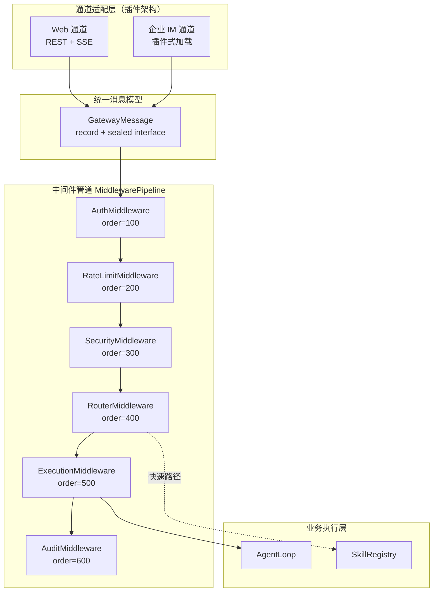
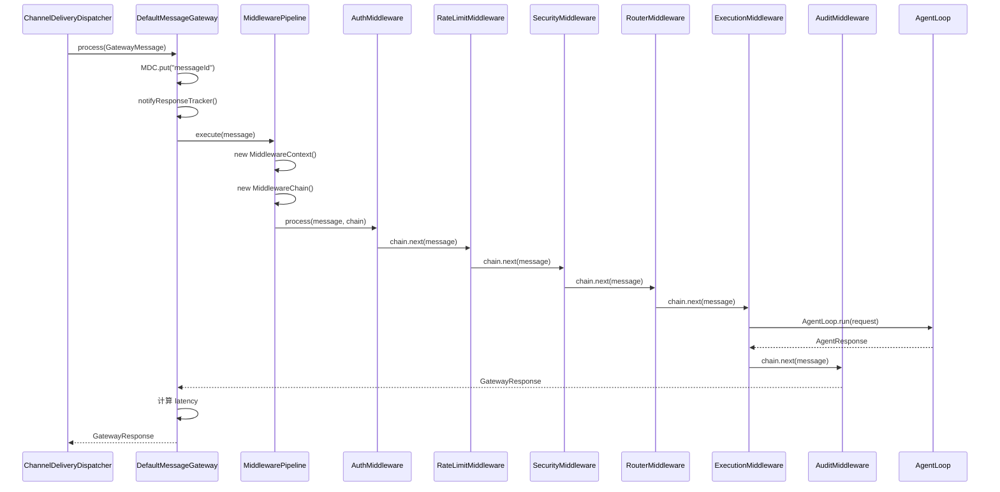
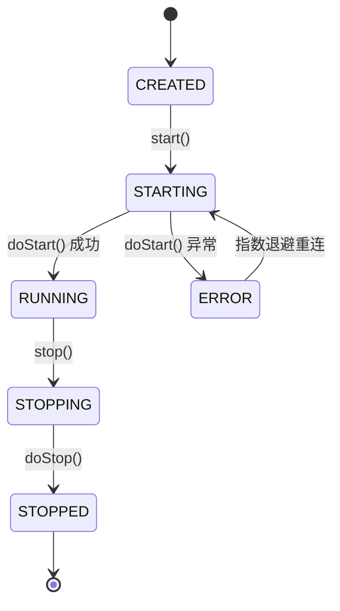

# Gateway + 中间件管道 — 架构设计

> **文档性质**：架构设计文档
> **模块归属**：`com.lifepilot.interaction`
> **最后更新**：2026-03

## 1. 模块概述

Gateway 是知微（ZhiWei）所有交互通道的统一消息入口。它将来自 Web UI、企业微信、钉钉、飞书等不同通道的消息标准化为 `GatewayMessage`，经过 6 层中间件管道（认证 → 限流 → 安全 → 路由 → 执行 → 审计）处理后，交由 Agent 引擎执行。通道差异在适配层完全消化，中间件和业务逻辑与通道无关。

核心包结构：

| 子包 | 职责 |
|------|------|
| `gateway` | `MessageGateway` 接口与默认实现 |
| `middleware` | 中间件接口、管道、责任链、6 个中间件实现 |
| `model` | 统一消息模型（GatewayMessage、GatewayResponse、MessageContent 等） |
| `channel` | 通道类型枚举与消息模型 |
| `web` | Web 通道（REST Controller、SSE 流式端点） |
| `config` | AutoConfiguration、GatewayProperties |

## 2. 架构图

## 3. 核心组件

### 3.1 MessageGateway / DefaultMessageGateway

- 职责：消息网关核心，管理通道注册表和生命周期，将消息推入中间件管道
- 关键接口：`process(GatewayMessage)` → `GatewayResponse`、`start()`/`stop()`
- 实现细节：`AtomicBoolean` 管理运行状态
- 集成：可选注入 `ResponseTracker`（主动推理模块），对文本消息通知用户交互事件
- MDC 注入：每条消息处理时将 `messageId` 注入 SLF4J MDC，整条链路日志可关联

### 3.2 MiddlewarePipeline

- 职责：收集所有 `GatewayMiddleware` 实例，按 `order()` 排序组装责任链
- 线程安全：`CopyOnWriteArrayList` 存储中间件列表，读多写少场景优化
- 请求隔离：每次 `execute()` 创建新的 `MiddlewareContext` 和 `MiddlewareChain`
- 动态管理：支持 `register()`/`unregister()` 运行时增删中间件

### 3.3 GatewayMiddleware 接口

- 职责：责任链模式的处理节点
- 核心方法：`process(GatewayMessage, MiddlewareChain)` → `GatewayResponse`
- 排序：`order()` 值越小越先执行
- 短路：任何中间件可直接返回响应而不调用 `chain.next()`
- 动态控制：`enabled()` 默认 `true`，可结合配置动态禁用

### 3.4 MiddlewareChain

- 职责：索引式责任链，按顺序执行启用的中间件
- 跳过禁用：自动跳过 `enabled() == false` 的中间件
- 兜底：所有中间件耗尽时返回 500 错误响应

### 3.5 MiddlewareContext

- 职责：请求级共享上下文，基于 `ConcurrentHashMap` 的类型安全属性包
- 预定义键：`KEY_AUTH_RESULT`、`KEY_TRUST_LEVEL`、`KEY_RATE_LIMIT_REMAINING`、`KEY_SECURITY_CHECK_RESULT`、`KEY_ROUTE_DECISION`、`KEY_AGENT_RESPONSE`、`KEY_TOKEN_USAGE`
- 类型安全：`get(key, Class<T>)` 返回 `Optional<T>`，`require(key, Class<T>)` 不存在时抛异常
- 审计支持：`snapshot()` 返回不可变快照

### 3.6 GatewayMessage（统一消息 record）

- 字段：`messageId`、`channelType`、`userId`、`sessionId`、`content`（MessageContent）、`attachments`、`channelMetadata`、`timestamp`、`traceHeaders`
- 不可变：紧凑构造器中 `List.copyOf()` / `Map.copyOf()` 防御性拷贝
- 默认值：`messageId` 默认 UUID、`timestamp` 默认当前时间
- Builder：`@Builder(toBuilder = true)` 支持不可变转换

### 3.7 MessageContent（sealed interface）

5 种消息类型，编译时穷举：

| 类型 | 说明 | 关键字段 |
|------|------|---------|
| `TextMessage` | 纯文本 | `text`（非空非 blank 校验） |
| `CommandMessage` | 命令消息（`/` 开头） | `command`、`args`、`rawText` |
| `FileMessage` | 文件消息 | `fileName`、`mimeType`、`data`、`caption` |
| `CardMessage` | 卡片消息（企业 IM） | `title`、`description`、`actions` |
| `EventMessage` | 系统事件 | `eventType`、`payload` |

### 3.8 ChannelType 枚举

| 值 | 字符串标识 | 需要 Webhook |
|----|-----------|-------------|
| `WEB` | `"web"` | 否 |
| `WECOM` | `"wecom"` | 是 |
| `DINGTALK` | `"dingtalk"` | 是 |
| `FEISHU` | `"feishu"` | 是 |

> 注意：当前 `ChannelType` 枚举中没有 `CLI` 值。CLI 交互层尚未实现，规划中 CLI 直接调用 AgentLoop，不经过 Gateway。

## 4. 核心流程

### 4.1 消息处理流程

### 4.2 通道生命周期

> ⚠️ 渠道适配层已重构为插件架构，具体通道适配器的生命周期管理详见 [channel-plugin-architecture.md](channel-plugin-architecture.md)。

## 5. 设计决策

| 决策 | 选择 | 理由 |
|------|------|------|
| 统一消息模型 | `GatewayMessage` record + sealed interface | 通道差异在适配器层消化，中间件和业务层只处理一种格式 |
| 中间件排序 | `order()` 数值排序 | 简单直观，可通过配置调整顺序 |
| 请求隔离 | 每次请求新建 MiddlewareContext | 避免跨请求数据污染 |
| 中间件列表 | CopyOnWriteArrayList | 读多写少场景优化，动态增删中间件 |
| 通道重连 | 指数退避 | 避免重连风暴，配置化上限和延迟参数 |
| 失败消息 | ConcurrentLinkedQueue + 重试调度 | 企业 IM 推送失败时入队重试，不丢消息 |
| Virtual Thread | 异步消息提交 | Webhook 回调快速返回，处理在虚拟线程上异步执行 |

## 6. 集成点

| 依赖方向 | 模块 | 交互方式 |
|---------|------|---------|
| Gateway → Agent | `com.lifepilot.agent` | `ExecutionMiddleware` 调用 `AgentLoop.run()` |
| Gateway → Guardrail | `com.lifepilot.guardrail` | `SecurityMiddleware` 调用 `GuardrailEngine` 进行安全检查 |
| Gateway → Skill | `com.lifepilot.skill` | `RouterMiddleware` 快速路径直接调用 Skill |
| Gateway → Observability | `com.lifepilot.observability` | `AuditMiddleware` 记录审计日志 |
| Gateway → 主动推理 | `com.lifepilot.agent.proactive` | `DefaultMessageGateway` 通知 `ResponseTracker` 用户交互 |
| Web UI → Gateway | 前端 Vue 3 SPA | 通过 REST Controller + SSE 端点接入 |
| 企业 IM → Gateway | Webhook 回调 | 各 IM 平台通过插件式通道适配器接入（详见 [channel-plugin-architecture.md](channel-plugin-architecture.md)） |

## 7. 配置参考

### 7.1 中间件排序与启用

| 配置键 | 默认值 | 说明 |
|--------|--------|------|
| `lifepilot.gateway.enabled` | `true` | 网关总开关 |
| `lifepilot.gateway.middleware.auth.enabled` | `true` | 认证中间件开关 |
| `lifepilot.gateway.middleware.auth.order` | `100` | 认证中间件顺序 |
| `lifepilot.gateway.middleware.rate-limit.enabled` | `true` | 限流中间件开关 |
| `lifepilot.gateway.middleware.rate-limit.order` | `200` | 限流中间件顺序 |
| `lifepilot.gateway.middleware.security.enabled` | `true` | 安全中间件开关 |
| `lifepilot.gateway.middleware.security.order` | `300` | 安全中间件顺序 |
| `lifepilot.gateway.middleware.router.enabled` | `true` | 路由中间件开关 |
| `lifepilot.gateway.middleware.router.order` | `400` | 路由中间件顺序 |
| `lifepilot.gateway.middleware.execution.enabled` | `true` | 执行中间件开关 |
| `lifepilot.gateway.middleware.execution.order` | `500` | 执行中间件顺序 |
| `lifepilot.gateway.middleware.audit.enabled` | `true` | 审计中间件开关 |
| `lifepilot.gateway.middleware.audit.order` | `600` | 审计中间件顺序 |

### 7.2 限流配置

| 配置键 | 默认值 | 说明 |
|--------|--------|------|
| `lifepilot.gateway.rate-limit.max-tokens-per-hour` | `100000` | 每用户每小时最大 Token 消耗 |
| `lifepilot.gateway.rate-limit.max-tokens-per-day` | `500000` | 每用户每天最大 Token 消耗 |
| `lifepilot.gateway.rate-limit.max-requests-per-minute` | `30` | 每用户每分钟最大请求数 |
| `lifepilot.gateway.rate-limit.estimated-tokens-per-request` | `2000` | 预估每请求 Token 消耗 |

### 7.3 通道配置

| 配置键 | 默认值 | 说明 |
|--------|--------|------|
| `lifepilot.gateway.channels.web.enabled` | `false` | Web 通道开关 |
| `lifepilot.gateway.channels.wecom.enabled` | `false` | 企业微信通道开关 |
| `lifepilot.gateway.channels.dingtalk.enabled` | `false` | 钉钉通道开关 |
| `lifepilot.gateway.channels.feishu.enabled` | `false` | 飞书通道开关 |

### 7.4 重连与会话

| 配置键 | 默认值 | 说明 |
|--------|--------|------|
| `lifepilot.gateway.reconnect.max-attempts` | `10` | 最大重连次数 |
| `lifepilot.gateway.reconnect.initial-delay-ms` | `1000` | 初始重连延迟（ms） |
| `lifepilot.gateway.reconnect.max-delay-ms` | `60000` | 最大重连延迟（ms） |
| `lifepilot.gateway.reconnect.multiplier` | `2.0` | 退避倍数 |
| `lifepilot.gateway.session.idle-timeout-minutes` | `30` | 会话空闲超时（分钟） |
| `lifepilot.gateway.session.expire-timeout-hours` | `24` | 会话过期超时（小时） |

### 7.5 审计与 Webhook

| 配置键 | 默认值 | 说明 |
|--------|--------|------|
| `lifepilot.gateway.audit.retention-days` | `90` | 审计日志保留天数 |
| `lifepilot.gateway.audit.request-summary-max-length` | `200` | 请求摘要最大长度 |
| `lifepilot.gateway.webhook.timestamp-tolerance-seconds` | `300` | 签名时间戳容忍窗口 |
| `lifepilot.gateway.webhook.max-retry-count` | `3` | 失败消息最大重试次数 |

> ⚠️ 渠道适配层已重构为插件架构，详见 [channel-plugin-architecture.md](channel-plugin-architecture.md)。
