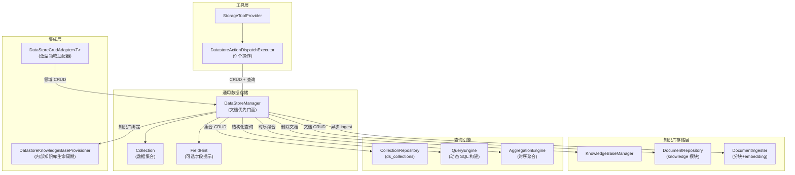
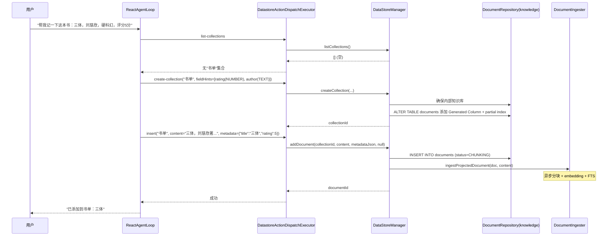
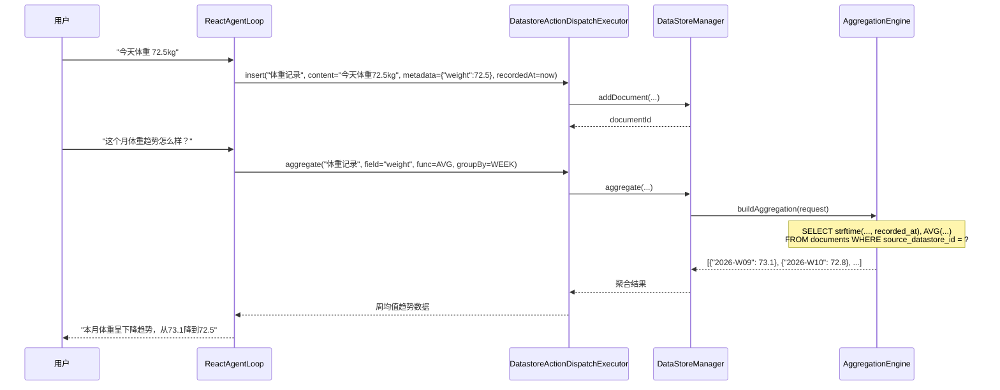

# 通用数据存储 — 架构设计

> **文档性质**：架构设计文档
> **模块归属**：`com.lifepilot.datastore`
> **最后更新**：2026-04-24
> **实现状态**：✅ 后端能力保留；Plan 3（2026-04-23）LLM 工具集下线、前端用户入口下架

## Plan 3 用户侧下架（2026-04-23）

`StorageToolProvider.buildStorageTools()` 当前返回 `List.of()` —— LLM 不再通过 `datastore` 工具直接操作数据存储。前端 `/datastores` 路由、`/datastores/:id` 详情路由与侧栏"资料仓库"菜单入口均已移除（`src/router/index.ts` 保留注释说明，`zhiwei-web/src/views/DatastoreView.vue` / `DatastoreDetailView.vue` 组件文件及 `stores/api` 保留不调用）。

**保留的能力**：

- `DataStoreManager` 及其全部仓储、索引、集合编排能力
- 后端 Datastore REST CRUD（`/api/datastores`，`DatastoreController`）——用于后续管理面恢复
- `DataStoreCrudAdapter<T>`（内置 Skill 如 Todo / Schedule / Habit 使用的泛型领域适配器）
- 知识库侧的 `DATASTORE_DOCUMENT` 同步与检索路径（`KnowledgeSyncWorker` 等）

下文的工具 action 描述（§4.7）与 Skill 使用示例保留作为后端能力参考；如需复活 LLM 工具集，取消 `StorageToolProvider.buildStorageTools()` 中被注释的返回语句即可。

## 1. 模块概述

通用数据存储（GenericDataStore）为知微的所有扩展模块（Skill、Agent、Workflow）提供统一的、Schema-Free 的数据持久化能力。本模块采用**文档优先**模型：每条记录以 Agent 整理的自然语言富文本（content）为主表示，直接存入知识库 `documents` 表；可选的结构化字段（metadata_json）作为副索引支持排序、过滤、聚合。通过「集合（Collection）+ 知识库文档（Document）+ 可选字段提示（FieldHint）」三层模型，任何扩展模块都能在运行时动态创建数据集合并执行 CRUD 操作，无需编写 Java 代码或 Flyway 迁移脚本。

### 1.1 问题域

| 扩展途径 | 当前存储能力 | 缺口 |
|---------|------------|------|
| YAML Skill | Skill 通过 `file.read(skill=...)` 按需激活，无数据存储 | 完全缺失 |
| 自定义 Agent | `AgentOrchestrator.run()` 执行，无持久化状态 | 完全缺失 |
| Workflow | `WorkflowContext` 为内存 HashMap，仅持久化执行状态 | 领域数据缺失 |
| MCP | 外部服务器自行管理存储 | 不在本模块范围 |

### 1.2 用户需求分类

通过分析个人助手的典型使用场景，用户数据需求归纳为两类存储模式：

**普通集合（结构化列表 + 笔记）**：书单、影单、购物清单、旅行计划、食谱、联系人、记账、日记、会议记录、灵感。CRUD + 过滤 + 排序 + 语义检索。在文档优先模型下，结构化列表和非结构化笔记的行为一致：content 存富文本，metadata 存可查询字段。

**时序集合（指标追踪）**：体重、运动量、睡眠、饮水、学习时长。追加 + 时间范围查询 + 聚合（均值、趋势、极值）。通过集合的 `timeSeries` 布尔标记区分。

### 1.3 设计目标

- 文档优先：每条记录的主表示是自然语言富文本，直接参与 embedding，语义检索效果好
- 消除双存储：文档直接存入知识库 `documents` 表，无异步同步链路，无一致性负担
- Schema-Free + 可选提示：默认无需定义结构，可选声明字段提示（FieldHint）以获得索引加速
- Agent 可发现：Agent 能通过工具调用自动创建集合、写入文档，无需用户手动配置
- 与记忆系统正交：GenericDataStore 存储用户显式管理的领域数据，记忆系统存储 Agent 隐式积累的认知数据


## 2. 架构图



## 3. 核心数据模型

### 3.1 Collection（数据集合）

集合是文档的逻辑容器。每个集合绑定一个内部知识库，文档直接存入知识库 `documents` 表。通过 `timeSeries` 布尔标记区分普通集合和时序集合。

```java
@Builder(toBuilder = true)
public record Collection(
    String id,                     // UUID
    String name,                   // 集合名称（唯一），如 "书单"、"体重记录"
    @Nullable String description,  // 集合描述（可选）
    boolean timeSeries,            // 是否为时序集合
    @Nullable String fieldHintsJson, // 字段提示 JSON（可选，List<FieldHint> 序列化）
    @Nullable String defaultKnowledgeBaseId, // 绑定的内部知识库 ID
    @Nullable String createdBy,    // 创建来源（skill:todo / agent:researcher）
    String createdAt,
    String updatedAt
) {}
```

### 3.2 文档存储（知识库 documents 表）

文档直接存入知识库的 `documents` 表，不再有独立的 `ds_documents` 表。每条 datastore 文档复用知识库现有字段，并使用两个新增列：

| 字段 | 用法 | 说明 |
|------|------|------|
| `source_type` | `'DATASTORE_DOCUMENT'` | 标识文档来源 |
| `source_datastore_id` | 指向 `ds_collections.id` | 集合归属 |
| `source_key` | `"DATASTORE:{collectionId}:{uuid}"` | 幂等标识 |
| `content` | Agent 整理的自然语言富文本 | **新增列**，作为 ingest 的输入源 |
| `metadata_json` | 结构化字段 JSON，如 `{"title":"三体","rating":5}` | 支持 `json_extract` 查询 |
| `recorded_at` | 时序集合的 ISO 8601 时间戳 | **新增列**，仅时序集合使用 |
| `content_hash` | content 的 SHA-256 | 更新时判断 content 是否变化 |
| `file_name` | `"{collection.name} - {title 或 docId}"` | 显示名 |
| `file_path` | `"datastore://{collectionId}/{documentId}"` | 虚拟路径 |
| `mime_type` | `"text/plain"` | 固定值 |

### 3.3 FieldHint（字段提示）

可选的字段提示，存储在 Collection 的 `fieldHintsJson` 中。声明后可获得：Generated Column 索引加速、Agent 查询时的字段描述。**不做写入校验**。

```java
public record FieldHint(
    String name,        // 字段名，如 "rating"
    String type,        // SQLite 亲和类型：TEXT / NUMBER / BOOLEAN
    @Nullable String description  // 语义描述，如 "用户对这本书的喜好评分，1-5"
) {}
```

与旧版 `PropertyDefinition` 的区别：
- 类型从 9 种精简为 3 种（TEXT / NUMBER / BOOLEAN），对应 SQLite 亲和类型
- 去除 `required` 约束，metadata 是自由 JSON
- 仅服务于索引和 Agent 提示，不做写入校验

### 3.4 数据库表设计

```sql
-- 集合表（ds_collections）
CREATE TABLE ds_collections (
    id                        TEXT PRIMARY KEY,
    name                      TEXT NOT NULL UNIQUE,
    description               TEXT,
    time_series               INTEGER NOT NULL DEFAULT 0,
    field_hints_json          TEXT,
    default_knowledge_base_id TEXT,
    created_by                TEXT,
    created_at                TEXT NOT NULL,
    updated_at                TEXT NOT NULL
);

-- 文档存储在知识库 documents 表，新增两列（V4 迁移）：
-- ALTER TABLE documents ADD COLUMN content TEXT;
-- ALTER TABLE documents ADD COLUMN recorded_at TEXT;

-- 时序查询索引
CREATE INDEX idx_documents_ds_recorded_at
    ON documents(source_datastore_id, recorded_at)
    WHERE source_datastore_id IS NOT NULL AND recorded_at IS NOT NULL;
```

**SQLite JSON + Generated Column 索引加速**：当集合声明了 FieldHint 后，通过 `ALTER TABLE` 动态在 `documents` 表添加 Generated Column + partial index，实现对 `metadata_json` 字段的高效查询：

```sql
-- 示例：为 "书单" 集合的 "rating" 字段创建索引
ALTER TABLE documents ADD COLUMN _idx_{prefix}_rating REAL
    GENERATED ALWAYS AS (json_extract(metadata_json, '$.rating')) VIRTUAL;
CREATE INDEX idx_ds_doc_{prefix}_rating ON documents(_idx_{prefix}_rating)
    WHERE source_datastore_id = '{collectionId}';
```

列名格式为 `_idx_{collectionId前8位}_{fieldName}`，partial index 按 `source_datastore_id` 过滤，查询只扫描该集合的行。这是 SQLite 3.31+ 支持的特性，利用 `json_extract` 虚拟生成列实现 B-tree 索引查找，避免全表 JSON 解析扫描。


## 4. 核心组件

### 4.1 DataStoreManager（数据存储管理门面）

- 职责：提供集合和文档的完整 CRUD 操作，是所有外部调用的统一入口
- 集合操作：创建、查询（按名称 / 按 timeSeries 标记）、更新、删除（级联删除文档）
- 文档操作：通过知识库 `DocumentRepository` 和 `DocumentIngester` 委托实现
  - 添加文档：创建知识库文档记录（状态 CHUNKING），异步 ingest（分块 + embedding + FTS）
  - 获取文档：按 ID 查询知识库文档
  - 更新文档：按 `contentHash` 判断 content 是否变化，变化则触发重新 ingest；仅改 metadata 不触发
  - 删除文档：委托 `KnowledgeBaseManager.removeDocument()`
- 创建集合时如果声明了 FieldHint，自动在 `documents` 表创建 Generated Column + partial index
- 创建集合时通过 `DatastoreKnowledgeBaseProvisioner` 自动确保一个系统托管的内部 Knowledge Base，并回填 `defaultKnowledgeBaseId`
- 核心依赖均为 `@Nullable`（`KnowledgeBaseManager`、`DocumentIngester`、`DocumentRepository`、`DatastoreKnowledgeBaseProvisioner`），知识库模块未启用时降级为仅集合管理
- 写操作标注 `@Transactional`

### 4.2 QueryEngine（动态查询引擎）

- 职责：将查询请求转换为针对 `documents` 表的参数化 SQL
- 查询基础条件：`WHERE source_datastore_id = ? AND source_type = 'DATASTORE_DOCUMENT'`
- 支持的过滤操作：`EQ`（等于）、`NE`（不等于）、`GT`/`GTE`/`LT`/`LTE`（比较）、`CONTAINS`（文本 LIKE + 通配符转义）、`IN`（枚举匹配，展开为多个 `?` 占位符）
- 索引感知：有 Generated Column 的字段使用索引列名（`_idx_{prefix}_{field}`），无索引字段使用 `json_extract(metadata_json, '$.{field}')` 表达式
- 支持时间范围过滤（`startTime` / `endTime`，基于 `COALESCE(recorded_at, created_at)`）
- 排序支持 metadata 字段排序
- 分页使用 `LIMIT` + `OFFSET`

查询条件模型：

```java
public record QueryFilter(
    String field,       // metadata 字段名，如 "rating"、"author"
    FilterOp op,        // 过滤操作
    Object value        // 过滤值
) {}

public enum FilterOp {
    EQ, NE, GT, GTE, LT, LTE, CONTAINS, IN
}

public record QueryRequest(
    String collectionId,
    List<QueryFilter> filters,
    @Nullable String sortField,
    @Nullable SortDirection sortDirection,
    int offset,
    int limit,
    @Nullable String startTime,   // 时间范围起始 ISO 8601
    @Nullable String endTime      // 时间范围结束 ISO 8601
) {}
```

### 4.3 AggregationEngine（时序聚合引擎）

- 职责：为时序集合提供时间范围聚合查询
- 查询目标为 `documents` 表，按 `source_datastore_id` + `recorded_at` 范围过滤
- 支持的聚合函数：`SUM`、`AVG`、`MIN`、`MAX`、`COUNT`
- 支持按时间粒度分组：`DAY`、`WEEK`、`MONTH`（基于 SQLite `strftime`）
- 无时间分组时返回总计（`time_bucket = 'total'`）
- 索引感知：与 QueryEngine 一致，有 Generated Column 用索引列，否则用 `json_extract`

```java
public record AggregationRequest(
    String collectionId,
    String field,                    // 聚合字段，如 "weight"
    AggregateFunction func,          // SUM / AVG / MIN / MAX / COUNT
    @Nullable TimeGranularity groupBy, // DAY / WEEK / MONTH（可选）
    @Nullable String startTime,      // ISO 8601 起始时间
    @Nullable String endTime         // ISO 8601 结束时间
) {}

public record AggregationResult(
    String timeBucket,  // 时间桶，如 "2026-03-01"、"total"
    double value        // 聚合值
) {}
```

### 4.4 CollectionRepository

- 基于 JdbcTemplate 操作 `ds_collections` 表
- 集合 CRUD + 按名称 / 按 `timeSeries` 标记查询
- Generated Column 管理：在 `documents` 表上创建/删除虚拟列和 partial index（直接执行 DDL）

### 4.5 DatastoreKnowledgeBaseProvisioner（内部知识库编排器）

- 接口定义在 `com.lifepilot.datastore.sync` 包
- 职责：为每个集合确保内部知识库存在（`ensureDefaultKnowledgeBase`），删除集合时清理对应知识库（`deleteDefaultKnowledgeBase`）
- 知识库的 `ON DELETE CASCADE` 外键自动级联删除所有关联的 documents 和 chunks

### 4.6 读取路径

**语义检索（主路径）**：Agent 调用 `knowledge.search(datastoreId=X, query="...")`。文档已在知识库中，向量检索 + FTS → 返回命中文档。

**结构化查询（精确路径）**：Agent 调用 `datastore(action="query")`。QueryEngine 生成 SQL 查询 `documents` 表，按 `source_datastore_id` 过滤，支持 metadata 字段过滤、排序、分页。

**时序聚合（时序集合专用）**：Agent 调用 `datastore(action="aggregate")`。AggregationEngine 生成 SQL 聚合 `documents` 表，按 `source_datastore_id` + `recorded_at` 范围过滤。

Agent 检索决策规则：
- 能翻译成字段条件 → `datastore(action="query")`（快、精确）
- 不能 → `knowledge.search`（语义、模糊）
- 需要统计 → `datastore(action="aggregate")`（数值聚合）
- 不确定 → `knowledge.search` 优先，必要时补充 `datastore(action="query")`

### 4.7 StorageToolProvider + DatastoreActionDispatchExecutor（Agent 工具）

注册为单个 BuiltinTool（`id = "datastore"`），通过 `action` 参数路由到 9 个操作：

| action | 说明 | 关键参数 |
|--------|------|---------|
| `create-collection` | 创建集合 | `name`、`type`（"TIME_SERIES"/"GENERAL"）、`fieldHints`、`description` |
| `list-collections` | 列出集合 | `type`（可选，按类型过滤） |
| `update-collection` | 更新集合 | `collectionName`、`description`、`fieldHintsJson` |
| `delete-collection` | 删除集合及其所有文档 | `collectionName` |
| `insert` | 添加文档 | `collectionName`、`data`（content 富文本）、`metadataJson`（可选）、`recordedAt`（时序必填） |
| `query` | 结构化查询 | `collectionName`、`filters`、`sortField`、`sortDirection`、`offset`、`limit`、`startTime`、`endTime` |
| `update` | 更新文档 | `documentId`、`data`（content）、`metadataJson`（可选） |
| `delete` | 删除文档 | `documentId` |
| `aggregate` | 时序聚合 | `collectionName`、`field`、`function`、`groupBy`、`startTime`、`endTime` |

Agent 使用示例：
- 用户说「帮我记一下这本书：三体，刘慈欣，硬科幻，讲三体文明入侵地球，非常好看，评分 5 分」
- Agent 调用 `list-collections` 查找是否有「书单」集合
- 如果没有，调用 `create-collection` 创建，`fieldHints` 包含 rating(NUMBER)、author(TEXT)
- 调用 `insert`，`data` 为 Agent 整理的富文本（保留"硬科幻"、"讲三体文明入侵地球"等描述性信息），`metadataJson` 为 `{"title":"三体","author":"刘慈欣","rating":5}`

### 4.8 DataStoreCrudAdapter（泛型领域适配器）

- 为内置 Skill（Todo / Schedule / Habit 等）提供类型安全的 CRUD 适配层
- 每个实例绑定一个 Collection（按 `CrudAdapterConfig` 配置），首次操作时幂等查找或创建
- 实体序列化/反序列化通过 Jackson `ObjectMapper` 委托
- 使用 double-checked locking 缓存 `collectionId`


## 5. 核心流程

### 5.1 Agent 自动创建集合并写入文档



### 5.2 时序指标追踪与聚合查询



## 6. 设计决策

| 决策 | 选择 | 备选方案 | 理由 |
|------|------|---------|------|
| 存储模型 | 文档优先 — content 富文本为主，metadata JSON 为副索引 | JSON 文档 + 投影同步 | 直接存入知识库消除双存储和同步延迟；content 保留用户原话中的描述性信息，embedding 质量更高 |
| 文档表 | 复用知识库 `documents` 表 | 独立 `ds_documents` 表 | 一份数据、无同步延迟、检索路径统一；partial index 按 `source_datastore_id` 隔离 |
| 索引加速 | SQLite Generated Column + json_extract (partial index) | 全表 JSON 扫描 / 独立索引表 | VIRTUAL Generated Column 零额外存储，partial index 仅扫描对应集合行 |
| 集合类型区分 | `timeSeries` 布尔标记 | `CollectionType` 枚举 | 文档优先模型下 DOCUMENT/NOTE 行为一致，合并；METRIC 因聚合需求保留为时序标记 |
| 字段定义 | FieldHint（无校验，3 种类型） | PropertyDefinition（有校验，9 种类型） | 去掉写入校验降低复杂度，3 种 SQLite 亲和类型（TEXT/NUMBER/BOOLEAN）覆盖所有索引需求 |
| 集合上下文注入 | contextPrefix 注入 chunk 级，不拼入 content | 拼入 content | content 保持干净、diff 简单；集合描述变更后重新 ingest 时自动使用最新描述 |
| 时序聚合 | SQLite strftime 分组 | 应用层聚合 | SQLite 内置时间函数足够，数据量在个人助手场景下不会成为瓶颈 |
| 与记忆系统关系 | 正交独立 | 复用 L3 语义记忆 | 记忆系统存储 Agent 隐式认知数据，DataStore 存储用户显式管理的领域数据，职责不同 |
| 工具暴露方式 | 单个 BuiltinTool（9 个 action） | 每个集合动态生成工具 | 固定工具集更简单，Agent 通过参数区分集合；动态工具会导致工具注册表膨胀 |

### 6.1 调研参考

**Notion 数据模型**：Notion 采用「Everything is a Block」理念，Database 是特殊的 Block 容器，每个 Page 是 Database 中的一行。知微借鉴其 Database + Property 概念，简化为 Collection + FieldHint，属性类型精简为 3 种覆盖个人助手场景。

**LangGraph BaseStore**：LangChain/LangGraph 的长期记忆采用 namespace + key-value JSON 文档模型，支持层级命名空间和可选向量搜索。知微借鉴其 JSON 文档存储理念，但增加了集合级字段提示和时序聚合能力，更适合结构化数据管理。

**SQLite JSON + Generated Column**：SQLite 3.31+ 支持 Generated Column，结合 json_extract 可创建虚拟列并建立 B-tree 索引，查询性能等同普通列。这是本模块索引加速的核心技术，避免了引入额外存储引擎。

**Mnemora（AI Agent Memory DB）**：采用直接数据库 CRUD 路径（不在读路径引入 LLM），状态读取延迟 < 10ms。知微 DataStore 同样采用纯数据库 CRUD 路径，LLM 仅在 Agent 决策层参与。

## 7. 集成点

| 依赖模块 | 交互方式 | 说明 |
|---------|---------|------|
| Tool System (`com.lifepilot.meta.infra.storage`) | BuiltinTool 注册 | `StorageToolProvider` 注册 `datastore` 工具，`DatastoreActionDispatchExecutor` 路由 9 个 action |
| Skill System (`com.lifepilot.skill`) | Skill 定义 | `src/main/resources/skills/datastore/SKILL.md`，通过 `file.read(skill="datastore")` 按需激活 |
| Knowledge System (`com.lifepilot.knowledge`) | 文档存储 + ingest | 文档直接存入 `documents` 表，通过 `DocumentIngester` 异步分块 + embedding |
| Knowledge System (`com.lifepilot.knowledge`) | 语义检索 | Agent 调用 `knowledge.search(datastoreId=X)` 检索 datastore 文档 |

## 8. 配置参考

| 配置键 | 默认值 | 说明 |
|--------|--------|------|
| `lifepilot.datastore.enabled` | `true` | 通用数据存储总开关 |
| `lifepilot.datastore.max-collections` | `100` | 最大集合数量 |
| `lifepilot.datastore.max-documents-per-collection` | `10000` | 单集合最大文档数 |
| `lifepilot.datastore.max-document-size-bytes` | `65536` | 单文档最大字节数（64KB） |
| `lifepilot.datastore.default-page-size` | `20` | 默认分页大小 |
| `lifepilot.datastore.max-page-size` | `100` | 最大分页大小 |
| `lifepilot.datastore.index-threshold` | `100` | 文档数超过此阈值时建议创建字段索引 |
