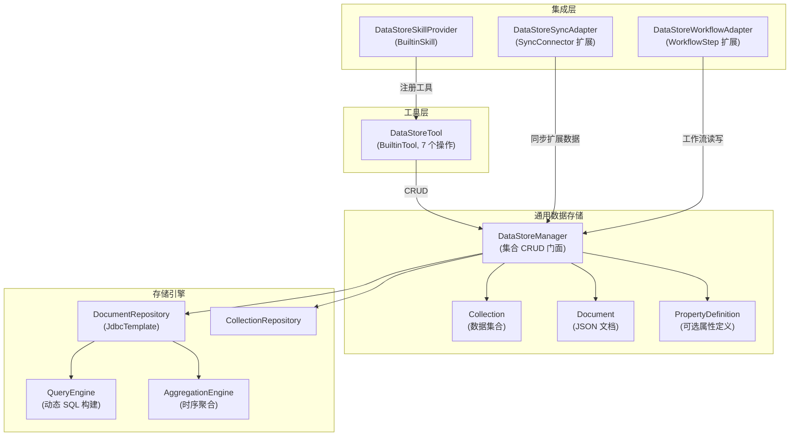
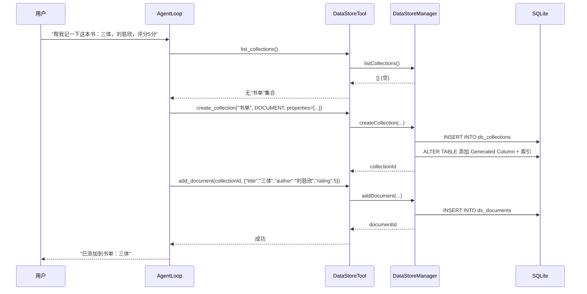
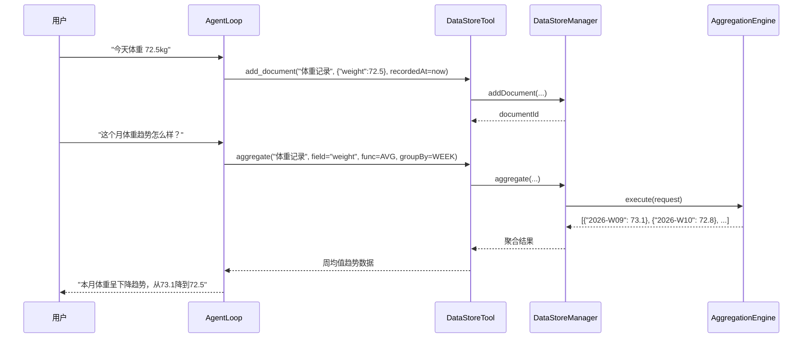

# 通用数据存储 — 架构设计

> **文档性质**：架构设计文档
> **模块归属**：`com.lifepilot.datastore`
> **最后更新**：2026-03-27
> **实现状态**：✅ 已完成

## 1. 模块概述

通用数据存储（GenericDataStore）为知微的所有扩展模块（Skill、Agent、Workflow、外部同步）提供统一的、Schema-Free 的数据持久化能力。当前内置 Skill（Todo / Schedule / Habit）各自维护独立的 Repository 和硬编码表结构，用户通过 YAML Skill、自定义 Agent 或 Workflow 扩展的功能无法持久化领域数据。本模块通过「集合（Collection）+ JSON 文档（Document）+ 可选属性定义（PropertyDefinition）」三层模型，让任何扩展模块都能在运行时动态创建数据集合并执行 CRUD 操作，无需编写 Java 代码或 Flyway 迁移脚本。

### 1.1 问题域

| 扩展途径 | 当前存储能力 | 缺口 |
|---------|------------|------|
| YAML Skill | Skill 通过 `load_skill` BuiltinTool 按需激活，无数据存储 | 完全缺失 |
| 自定义 Agent | `AgentExecutor` 运行 `AgentLoop.run()`，无持久化状态 | 完全缺失 |
| Workflow | `WorkflowContext` 为内存 HashMap，仅持久化执行状态 | 领域数据缺失 |
| 外部同步 | `SyncEngine` 硬编码 3 种内置实体类型映射 | 无法同步扩展数据 |
| MCP | 外部服务器自行管理存储 | 不在本模块范围 |

### 1.2 用户需求分类

通过分析个人助手的典型使用场景，用户数据需求归纳为三类存储模式：

**Document Store（结构化列表管理）**：书单、影单、购物清单、旅行计划、食谱、联系人、记账。CRUD + 过滤 + 排序。最高频需求。

**Note Store（非结构化笔记）**：日记、会议记录、灵感、梦境记录。写入 + 全文/语义搜索。与 L2 情景记忆有部分重叠，但用户期望显式的「笔记本」概念。

**Metric Store（时序指标追踪）**：体重、运动量、睡眠、饮水、学习时长。追加 + 时间范围查询 + 聚合（均值、趋势、极值）。

### 1.3 设计目标

- 统一存储接口：所有扩展模块通过同一套 API 读写数据
- Schema-Free + 可选 Schema：默认无需定义结构，可选声明属性定义以获得类型校验和索引加速
- Agent 可发现：Agent 能通过工具调用自动创建集合、写入文档，无需用户手动配置
- 与记忆系统正交：GenericDataStore 存储用户显式管理的领域数据，记忆系统存储 Agent 隐式积累的认知数据


## 2. 架构图



## 3. 核心数据模型

### 3.1 Collection（数据集合）

集合是文档的容器，类似 Notion 的 Database 或 Airtable 的 Table。每个集合有唯一名称和可选的属性定义。

```java
public record Collection(
    String id,              // UUID
    String name,            // 集合名称，如 "书单"、"体重记录"
    String description,     // 集合描述
    CollectionType type,    // DOCUMENT / NOTE / METRIC
    String propertiesJson,  // 属性定义 JSON（可选）
    String projectionConfigJson, // 向量投影配置 JSON（集合级）
    String metadataJson,    // 扩展元数据
    String createdBy,       // 创建来源（skill:todo / agent:researcher / workflow:daily-report）
    String createdAt,
    String updatedAt
) {}

public enum CollectionType {
    DOCUMENT,  // 结构化列表（书单、购物清单、联系人）
    NOTE,      // 非结构化笔记（日记、灵感）
    METRIC     // 时序指标（体重、睡眠、运动量）
}
```

### 3.1.1 projectionConfigJson（集合级向量投影配置）

`projection_config_json` 挂在 Collection 级，而不是知识库挂载级。它用于描述当 datastore 文档被同步到知识库时，结构化 JSON 应如何投影成可检索文本。

- 省略该配置时，系统会持久化为 `{}`，表示使用默认的通用投影规则
- 显式配置时，可覆盖默认规则，适配更复杂的结构化数据形态
- 该字段是 datastore 进入知识库向量检索链路的入口配置，不应再依赖硬编码字段名推断

### 3.2 Document（JSON 文档）

文档是集合中的一条记录，核心数据以 JSON 存储在 `data_json` 列。

```java
public record Document(
    String id,           // UUID
    String collectionId, // 所属集合 ID
    String dataJson,     // 核心数据 JSON，如 {"title":"三体","author":"刘慈欣","rating":5}
    String recordedAt,   // 记录时间（METRIC 类型用于时序排序）
    String createdAt,
    String updatedAt
) {}
```

### 3.3 PropertyDefinition（属性定义）

可选的属性定义，存储在 Collection 的 `propertiesJson` 中。声明后可获得：类型校验、SQLite Generated Column 索引加速、Agent 工具描述增强。

```java
public record PropertyDefinition(
    String name,          // 属性名，如 "title"、"weight"
    PropertyType type,    // 属性类型
    boolean required,     // 是否必填
    String description    // 属性描述（用于 Agent 工具 schema 生成）
) {}

public enum PropertyType {
    TEXT,       // 字符串
    NUMBER,     // 数值（整数或浮点）
    BOOLEAN,    // 布尔
    DATE,       // ISO 8601 日期
    DATETIME,   // ISO 8601 日期时间
    SELECT,     // 单选（枚举值）
    MULTI_SELECT, // 多选
    URL,        // URL
    JSON        // 嵌套 JSON 对象
}
```

### 3.4 数据库表设计

```sql
-- 集合表
CREATE TABLE ds_collections (
    id TEXT PRIMARY KEY,
    name TEXT NOT NULL UNIQUE,
    description TEXT,
    type TEXT NOT NULL DEFAULT 'DOCUMENT',  -- DOCUMENT / NOTE / METRIC
    properties_json TEXT,                    -- 属性定义 JSON 数组
    projection_config_json TEXT NOT NULL DEFAULT '{}', -- 向量投影配置
    metadata_json TEXT,
    created_by TEXT,
    created_at TEXT NOT NULL,
    updated_at TEXT NOT NULL
);

-- 文档表（核心存储）
CREATE TABLE ds_documents (
    id TEXT PRIMARY KEY,
    collection_id TEXT NOT NULL REFERENCES ds_collections(id) ON DELETE CASCADE,
    data_json TEXT NOT NULL DEFAULT '{}',
    recorded_at TEXT,                        -- METRIC 类型的时序时间戳
    created_at TEXT NOT NULL,
    updated_at TEXT NOT NULL
);

-- 索引
CREATE INDEX idx_ds_documents_collection ON ds_documents(collection_id);
CREATE INDEX idx_ds_documents_recorded_at ON ds_documents(collection_id, recorded_at);

-- FTS5 全文索引（NOTE 类型文档的全文搜索）
CREATE VIRTUAL TABLE ds_documents_fts USING fts5(
    document_id,
    content,
    content_source='ds_documents',
    tokenize='unicode61'
);
```

**SQLite JSON + Generated Column 索引加速**：当集合声明了属性定义后，通过 `ALTER TABLE` 动态添加 Generated Column + 索引，实现对 JSON 字段的高效查询：

```sql
-- 示例：为 "书单" 集合的 "rating" 属性创建索引
ALTER TABLE ds_documents ADD COLUMN _idx_rating REAL
    GENERATED ALWAYS AS (json_extract(data_json, '$.rating')) VIRTUAL;
CREATE INDEX idx_ds_doc_rating ON ds_documents(_idx_rating)
    WHERE collection_id = '{collection_id}';
```

这是 SQLite 3.31+ 支持的特性，利用 `json_extract` 虚拟生成列实现 B-tree 索引查找，避免全表 JSON 解析扫描。


## 4. 核心组件

### 4.1 DataStoreManager（数据存储管理门面）

- 职责：提供集合和文档的完整 CRUD 操作，是所有外部调用的统一入口
- 集合操作：创建、查询（按名称/类型）、更新、删除（级联删除文档）
- 文档操作：创建、查询（按集合 + 过滤条件）、更新、删除
- 创建集合时如果声明了属性定义，自动创建 Generated Column 索引
- 创建/更新集合时会将缺省的 `projectionConfigJson` 归一化为 `{}`，避免运行时写入 `NULL`
- 集合级投影配置会被后续 datastore → knowledge base 同步链路复用
- 写操作标注 `@Transactional`

### 4.2 QueryEngine（动态查询引擎）

- 职责：将用户的过滤、排序、分页条件转换为 SQLite SQL
- 支持的过滤操作：`eq`（等于）、`ne`（不等于）、`gt`/`gte`/`lt`/`lte`（比较）、`contains`（文本包含）、`in`（枚举匹配）
- 有 Generated Column 索引时使用索引列查询，否则降级为 `json_extract` 表达式
- 排序支持 JSON 路径字段排序
- 分页使用 `LIMIT` + `OFFSET`

查询条件模型：

```java
public record QueryFilter(
    String field,       // JSON 路径，如 "rating"、"author"
    FilterOp op,        // 过滤操作
    Object value        // 过滤值
) {}

public enum FilterOp {
    EQ, NE, GT, GTE, LT, LTE, CONTAINS, IN
}

public record QueryRequest(
    String collectionId,
    List<QueryFilter> filters,
    String sortField,
    SortDirection sortDirection,
    int offset,
    int limit
) {}
```

### 4.3 AggregationEngine（时序聚合引擎）

- 职责：为 METRIC 类型集合提供时间范围聚合查询
- 支持的聚合函数：`SUM`、`AVG`、`MIN`、`MAX`、`COUNT`
- 支持按时间粒度分组：`DAY`、`WEEK`、`MONTH`
- 基于 SQLite 的 `strftime` 函数实现时间分组
- 返回聚合结果列表，每项包含时间桶和聚合值

```java
public record AggregationRequest(
    String collectionId,
    String field,           // 聚合字段，如 "weight"
    AggregateFunction func, // SUM / AVG / MIN / MAX / COUNT
    TimeGranularity groupBy,// DAY / WEEK / MONTH
    String startTime,       // ISO 8601 起始时间
    String endTime          // ISO 8601 结束时间
) {}

public record AggregationResult(
    String timeBucket,  // 时间桶，如 "2026-03-01"
    double value        // 聚合值
) {}
```

### 4.4 CollectionRepository / DocumentRepository

- 基于 JdbcTemplate 的 SQLite 存储层
- CollectionRepository：集合表 CRUD + 按名称/类型查询
- DocumentRepository：文档表 CRUD + 动态 SQL 查询 + FTS5 全文搜索 + 时序聚合
- Generated Column 管理：创建/删除集合时动态添加/清理虚拟列和索引

### 4.5 DataStoreTool（Agent 工具集）

注册为 BuiltinTool，提供 7 个操作供 Agent 调用：

| 工具 ID | 操作 | 说明 |
|---------|------|------|
| `builtin.datastore.create_collection` | 创建集合 | 指定名称、类型、可选属性定义、可选 `projectionConfig` |
| `builtin.datastore.list_collections` | 列出集合 | 返回所有集合及其属性定义 |
| `builtin.datastore.add_document` | 添加文档 | 向指定集合写入 JSON 文档 |
| `builtin.datastore.query_documents` | 查询文档 | 按过滤条件查询，支持排序分页 |
| `builtin.datastore.update_document` | 更新文档 | 按 ID 更新文档数据 |
| `builtin.datastore.delete_document` | 删除文档 | 按 ID 删除文档 |
| `builtin.datastore.aggregate` | 聚合查询 | METRIC 类型集合的时序聚合 |

Agent 使用示例：
- 用户说「帮我记一下这本书：三体，刘慈欣，评分 5 分」
- Agent 调用 `list_collections` 查找是否有「书单」集合
- 如果没有，调用 `create_collection` 创建，属性定义包含 title(TEXT)、author(TEXT)、rating(NUMBER)
- 调用 `add_document` 写入 `{"title":"三体","author":"刘慈欣","rating":5}`

`create_collection` 的 `projectionConfig` 参数为可选项；如果未提供，系统会自动保存 `{}`，表示启用默认通用投影策略。

### 4.6 DataStoreSkillProvider（内置 Skill 提供者）

- 实现 `BuiltinSkillProvider` 接口，注册 DataStore 相关工具
- 提供 Skill 定义蓝图，包含数据存储操作的指令模板
- 通过 `@BuiltinSkill(id = "datastore", order = 5)` 注册，优先级高于具体业务 Skill


## 5. 核心流程

### 5.1 Agent 自动创建集合并写入文档



### 5.2 时序指标追踪与聚合查询



## 6. 设计决策

| 决策 | 选择 | 备选方案 | 理由 |
|------|------|---------|------|
| 存储模型 | JSON 文档 + 可选属性定义 | EAV 模型 / 动态建表 | JSON 文档最灵活，SQLite JSON 函数成熟；EAV 查询复杂度高；动态建表需要运行时 DDL 管理 |
| 索引加速 | SQLite Generated Column + json_extract | 全表 JSON 扫描 / 独立索引表 | Generated Column 是 SQLite 原生特性，零额外存储（VIRTUAL），B-tree 索引性能等同普通列 |
| 集合类型区分 | CollectionType 枚举（DOCUMENT/NOTE/METRIC） | 统一类型 | 三种类型的查询模式差异大：DOCUMENT 需过滤排序，NOTE 需全文搜索，METRIC 需时序聚合 |
| 全文搜索 | FTS5 虚拟表 | json_extract LIKE | FTS5 支持分词、排名、高亮，性能远优于 LIKE 模糊匹配 |
| 时序聚合 | SQLite strftime 分组 | 应用层聚合 | SQLite 内置时间函数足够，数据量在个人助手场景下不会成为瓶颈 |
| 与记忆系统关系 | 正交独立 | 复用 L3 语义记忆 | 记忆系统存储 Agent 隐式认知数据，DataStore 存储用户显式管理的领域数据，职责不同 |
| 工具暴露方式 | BuiltinTool（7 个操作） | 每个集合动态生成工具 | 固定工具集更简单，Agent 通过参数区分集合；动态工具会导致工具注册表膨胀 |

### 6.1 调研参考

**Notion 数据模型**：Notion 采用「Everything is a Block」理念，Database 是特殊的 Block 容器，每个 Page 是 Database 中的一行。Property 类型丰富（22 种），包括 checkbox、date、select、relation 等。知微借鉴其 Database + Property 概念，简化为 Collection + PropertyDefinition，属性类型精简为 9 种覆盖个人助手场景。

**LangGraph BaseStore**：LangChain/LangGraph 的长期记忆采用 namespace + key-value JSON 文档模型，支持层级命名空间和可选向量搜索。知微借鉴其 JSON 文档存储理念，但增加了集合级属性定义和时序聚合能力，更适合结构化数据管理。

**SQLite JSON + Generated Column**：SQLite 3.31+ 支持 Generated Column，结合 json_extract 可创建虚拟列并建立 B-tree 索引，查询性能等同普通列。这是本模块索引加速的核心技术，避免了引入额外存储引擎。

**Mnemora（AI Agent Memory DB）**：采用直接数据库 CRUD 路径（不在读路径引入 LLM），状态读取延迟 < 10ms。知微 DataStore 同样采用纯数据库 CRUD 路径，LLM 仅在 Agent 决策层参与。

## 7. 集成点

| 依赖模块 | 交互方式 | 说明 |
|---------|---------|------|
| Tool System (`com.lifepilot.tool`) | BuiltinTool 注册 | DataStoreTool 注册到 DynamicToolRegistry |
| Skill System (`com.lifepilot.skill`) | BuiltinSkillProvider | DataStoreSkillProvider 提供 Skill 定义 |
| Sync Engine (`com.lifepilot.sync`) | SyncConnector 扩展 | 未来扩展：DataStoreSyncAdapter 支持同步扩展数据 |
| Workflow (`com.lifepilot.workflow`) | WorkflowStep 扩展 | 未来扩展：DataStoreWorkflowAdapter 支持工作流读写 |
| Prompt Management (`com.lifepilot.prompt`) | PromptRegistry | 数据存储 Skill 指令模板 |

## 8. 配置参考

| 配置键 | 默认值 | 说明 |
|--------|--------|------|
| `lifepilot.datastore.enabled` | `true` | 通用数据存储总开关 |
| `lifepilot.datastore.max-collections` | `100` | 最大集合数量 |
| `lifepilot.datastore.max-documents-per-collection` | `10000` | 单集合最大文档数 |
| `lifepilot.datastore.max-document-size-bytes` | `65536` | 单文档 JSON 最大字节数（64KB） |
| `lifepilot.datastore.default-page-size` | `20` | 默认分页大小 |
| `lifepilot.datastore.max-page-size` | `100` | 最大分页大小 |
| `lifepilot.datastore.index-threshold` | `100` | 文档数超过此阈值时建议创建属性索引 |
