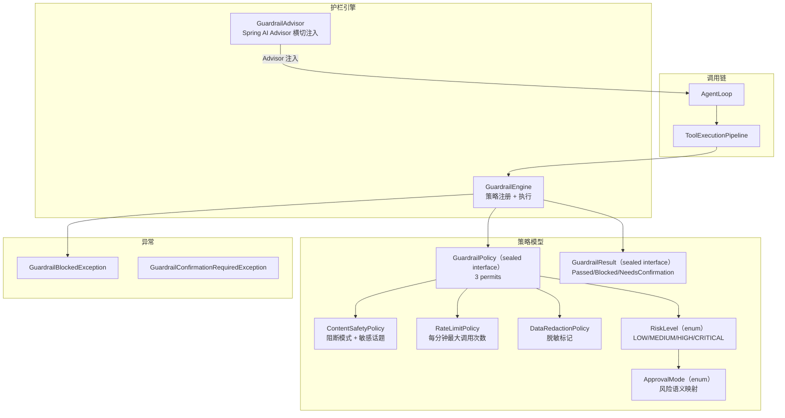
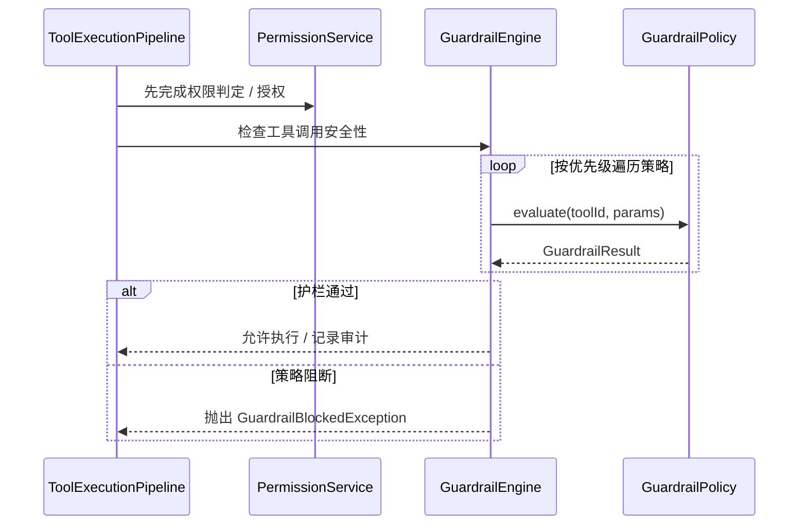

# 安全护栏 — 架构设计

> **文档性质**：架构设计文档
> **模块归属**：`com.lifepilot.observability.guardrail`
> **最后更新**：2026-04

## 1. 模块概述

安全护栏系统负责在 LLM 之外强制执行工具调用的安全策略，所有护栏类均位于 `observability.guardrail` 包中。当前它主要负责内容安全（ContentSafetyPolicy）、速率限制（RateLimitPolicy）、数据脱敏（DataRedactionPolicy）和审计日志；工具权限、风险判定、用户授权和白名单控制均由 `permission` 模块负责，预算限制已移除（个人助手场景下费用由用户自行承担）。

## 2. 架构图

## 3. 核心组件

### 3.1 GuardrailEngine

- 职责：策略注册表 + 执行引擎，按优先级顺序执行所有已注册策略
- 关键接口：`registerPolicy(GuardrailPolicy)`、`unregisterPolicy(policyId)`、`checkToolCall(tool, input)`、`checkInput(content)`、`checkOutput(content)`

### 3.2 GuardrailPolicy（sealed interface）

- 职责：可插拔的安全策略定义
- 三个 permits：`ContentSafetyPolicy`（内容安全，阻断模式 + 敏感话题）、`RateLimitPolicy`（速率限制，每分钟最大调用次数）、`DataRedactionPolicy`（数据脱敏标记）
- 关键属性：`policyId()`、`enabled()`、`priority()`

### 3.3 RiskLevel（enum）

- 四级风险：`LOW`（自动执行）→ `MEDIUM`（自动 + 审计）→ `HIGH`（高风险授权）→ `CRITICAL`（关键风险授权）
- 关键方法：`requiresConfirmation()`、`requiresAudit()`、`requiresSecondaryVerification()`

### 3.4 GuardrailAdvisor

- 职责：作为 Spring AI Advisor 横切注入 ChatClient 调用链，在 LLM 调用前后执行护栏检查

## 4. 核心流程

## 5. 设计决策

| 决策 | 选择 | 理由 |
|------|------|------|
| 策略模式 | GuardrailPolicy sealed interface（3 permits） | 编译时穷举策略类型，支持运行时动态注册/注销 |
| 风险分级 | 四级枚举 | 为权限系统和护栏阻断提供统一风险语义 |
| 注入方式 | Spring AI Advisor | 复用 Spring AI 生态，无侵入式横切注入 |
| 包归属 | 全部位于 `observability.guardrail` 包 | 护栏是可观测性的子能力，不再独立成包 |

## 6. 集成点

- **工具系统**（`tool`）：ToolExecutionPipeline 在权限判定之后调用 GuardrailEngine
- **权限系统**（`permission`）：高风险工具先经授权链路，再进入护栏检查
- **Agent 引擎**（`agent`）：GuardrailAdvisor 注入 ChatClient 调用链
- **可观测性**（`observability`）：审计记录写入轨迹系统

## 7. 配置参考

| 配置键 | 默认值 | 说明 |
|--------|--------|------|
| `lifepilot.observability.guardrail.enabled` | `true` | 是否启用护栏引擎（GuardrailEngine + GuardrailAdvisor） |
