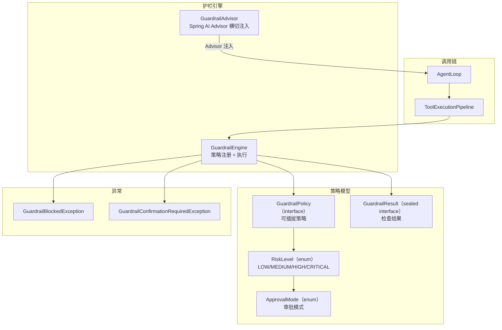
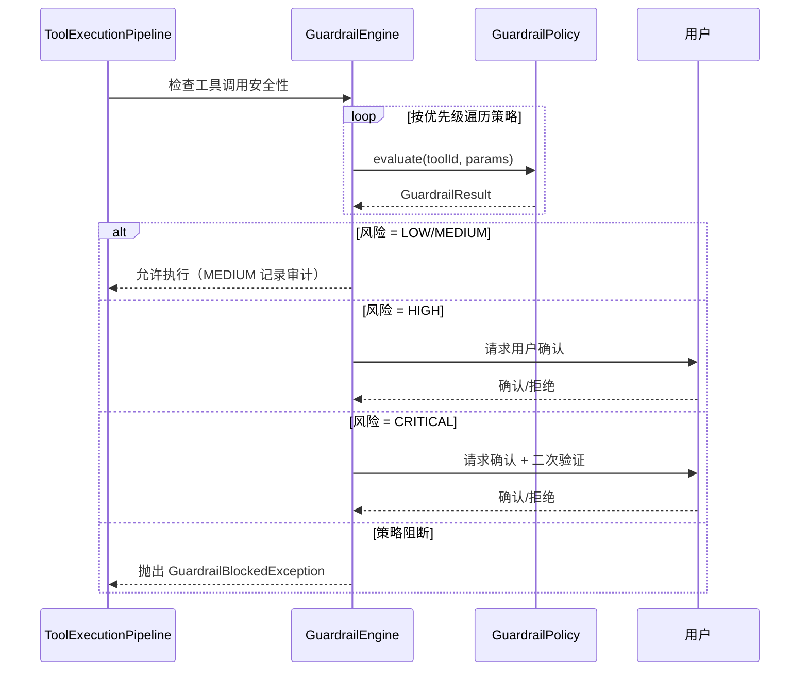

# 安全护栏 — 架构设计

> **文档性质**：架构设计文档
> **模块归属**：`com.lifepilot.guardrail` + `com.lifepilot.observability.guardrail`
> **最后更新**：2026-03

## 1. 模块概述

安全护栏系统负责在 LLM 之外强制执行工具调用的安全策略。`guardrail` 包定义策略标记和职责边界，实际引擎实现位于 `observability.guardrail` 包中。通过四级风险分级和可插拔策略机制，确保高风险操作经过审批和审计。

## 2. 架构图

## 3. 核心组件

### 3.1 GuardrailEngine

- 职责：策略注册表 + 执行引擎，按优先级顺序执行所有已注册策略
- 关键接口：`registerPolicy(GuardrailPolicy)`、`unregisterPolicy(policyId)`、`addAllowedTools(toolIds)`

### 3.2 GuardrailPolicy（interface）

- 职责：可插拔的安全策略定义
- 关键属性：`policyId()`、`enabled()`、`priority()`

### 3.3 RiskLevel（enum）

- 四级风险：`LOW`（自动执行）→ `MEDIUM`（自动 + 审计）→ `HIGH`（用户确认）→ `CRITICAL`（确认 + 二次验证）
- 关键方法：`requiresConfirmation()`、`requiresAudit()`、`requiresSecondaryVerification()`

### 3.4 GuardrailAdvisor

- 职责：作为 Spring AI Advisor 横切注入 ChatClient 调用链，在 LLM 调用前后执行护栏检查

## 4. 核心流程

## 5. 设计决策

| 决策 | 选择 | 理由 |
|------|------|------|
| 策略模式 | 可插拔 GuardrailPolicy 接口 | 支持运行时动态注册/注销策略，不同场景可定制 |
| 风险分级 | 四级枚举 | 覆盖从自动执行到严格审批的完整安全光谱 |
| 注入方式 | Spring AI Advisor | 复用 Spring AI 生态，无侵入式横切注入 |
| 包分离 | guardrail 包（标记）+ observability.guardrail（实现） | 策略定义与执行引擎解耦 |

## 6. 集成点

- **工具系统**（`tool`）：ToolExecutionPipeline 在执行前调用 GuardrailEngine
- **Agent 引擎**（`agent`）：GuardrailAdvisor 注入 ChatClient 调用链
- **可观测性**（`observability`）：审计记录写入轨迹系统

## 7. 配置参考

| 配置键 | 默认值 | 说明 |
|--------|--------|------|
| `lifepilot.guardrail.enabled` | `true` | 是否启用护栏系统 |
