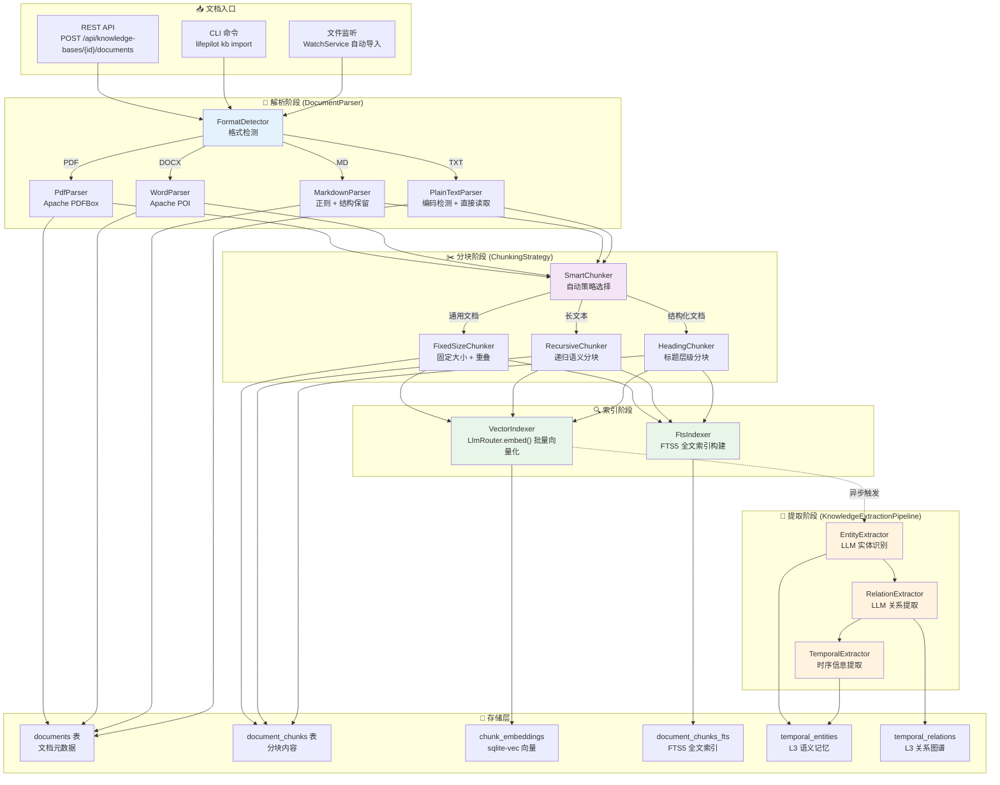
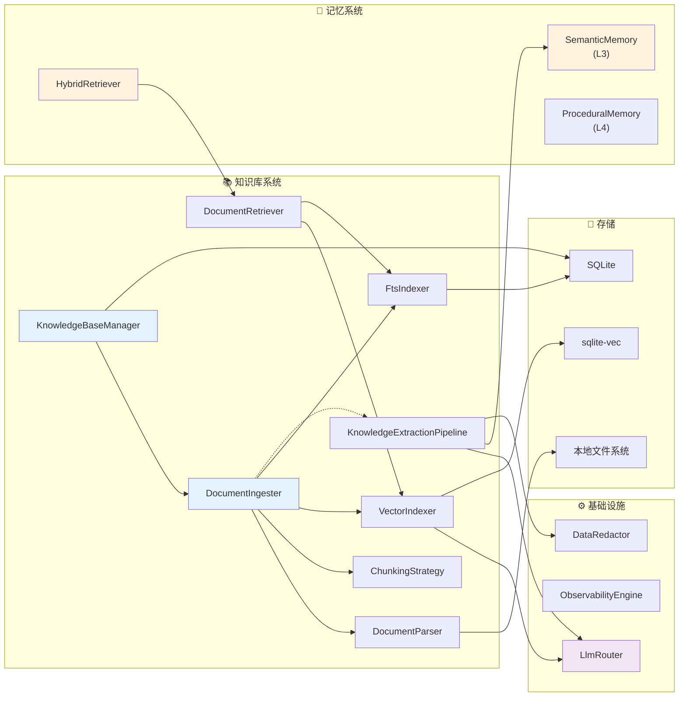
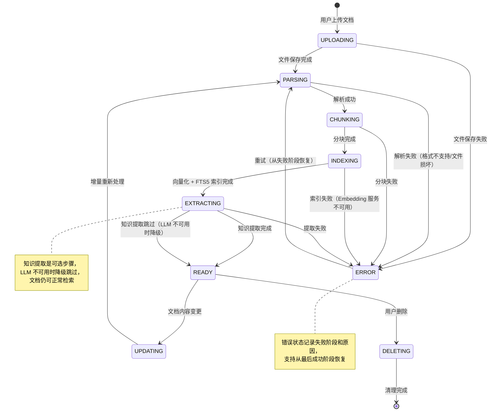
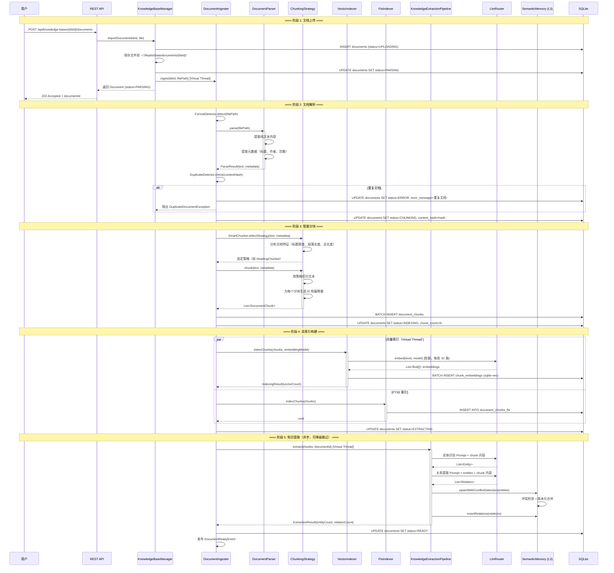
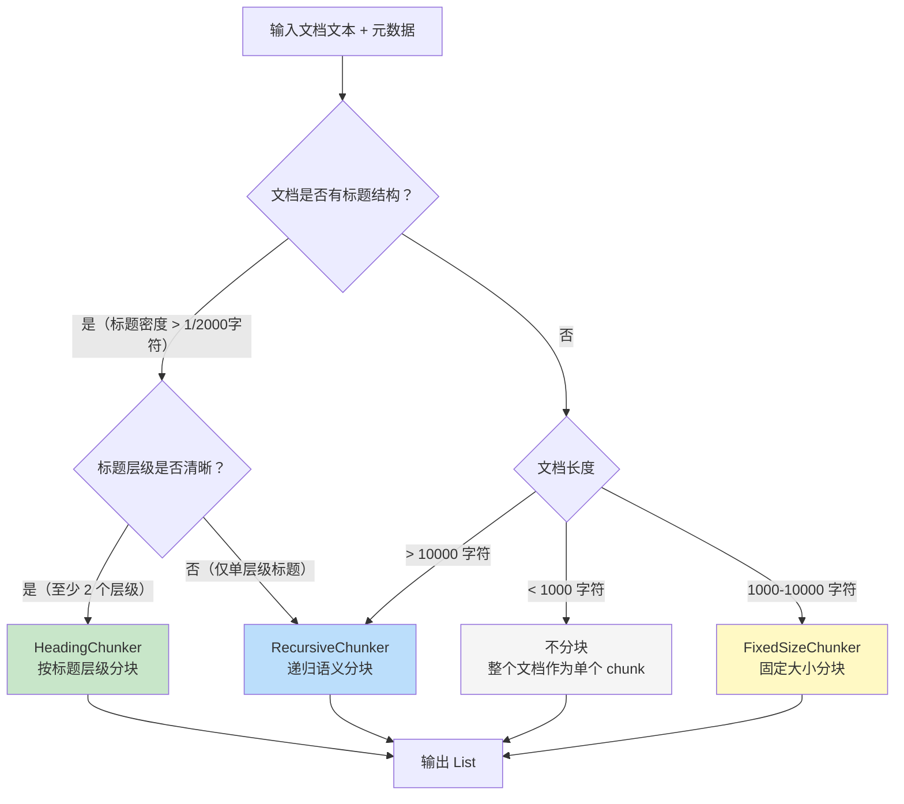
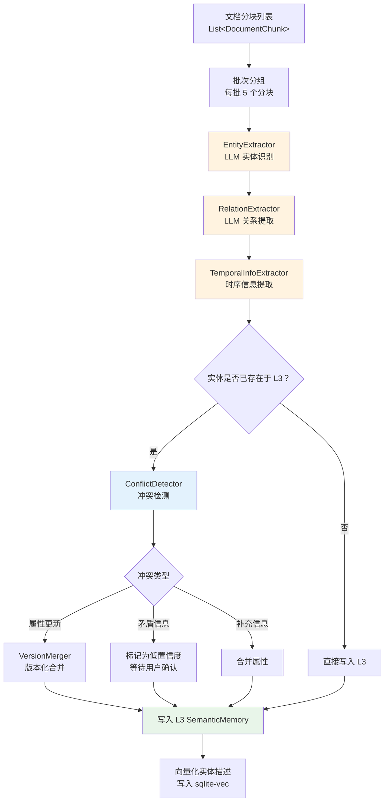
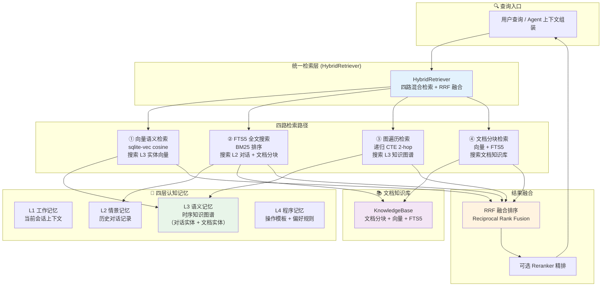
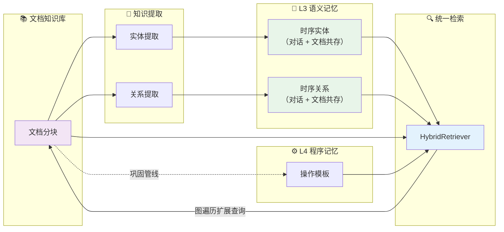
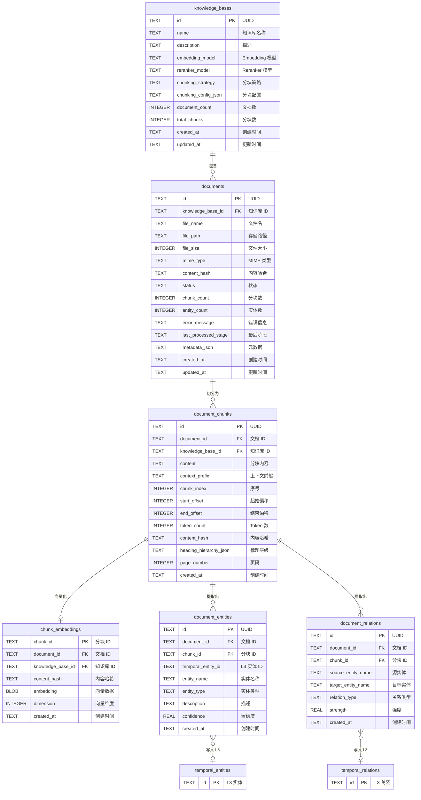

> 本文档从 [ARCHITECTURE.md](../ARCHITECTURE.md) 拆分而来，对应原文 §8 章节。
> 本文档经过深度分析设计，结合业界最佳实践和前沿研究进行了全面扩展。

# 文档/知识库管理架构设计

---

## 1. 设计哲学与原则

### 1.1 核心命题

**如何为本地优先的个人 AI Agent 构建一个与认知记忆系统有机融合的知识库管理系统，使文档知识不再是孤立的 RAG 检索源，而是成为 Agent 认知体系的一部分——可被理解、提炼、关联和遗忘？**

传统 RAG（检索增强生成）系统将知识库视为独立的"文档仓库"——上传文档、切块、向量化、Top-K 召回。这种方法在企业知识问答场景下有效，但对于需要深度理解用户个人文档的 AI Agent 而言，存在根本性缺陷：

- **知识是孤立的**：文档知识与对话记忆、用户偏好、行为模式完全割裂，无法交叉引用
- **理解是浅层的**：仅做文本切块和向量匹配，不提取实体、关系和时序信息
- **索引是静态的**：文档一旦导入就固化，不随用户认知演化而更新
- **检索是单路的**：仅依赖向量相似度，缺乏全文搜索和图遍历的互补

> **核心洞察：知识库不是独立的 RAG 模块，而是认知记忆体系的有机扩展。**
> A knowledge base is not a standalone RAG module, but an organic extension of the cognitive memory system.

这一洞察源于 LifePilot 的核心设计理念——Agent 的所有知识来源（对话、文档、外部工具结果）应当汇入统一的认知体系，
而非各自为政。文档中提取的实体应当与对话中提取的实体在同一个时序知识图谱中共存；文档中的操作步骤应当与用户行为模式
一起被提炼为程序记忆。

### 1.2 前沿研究基础

LifePilot 的知识库管理设计综合了 2024-2026 年 RAG 和知识管理领域的前沿研究成果：

| 研究 | 核心贡献 | LifePilot 采纳 |
|------|---------|---------------|
| **GraphRAG** ([Microsoft, 2024](https://arxiv.org/abs/2404.16130)) | 提出基于图的 RAG 方法——先从文档中提取实体和关系构建知识图谱，再通过图遍历增强检索。社区摘要（Community Summary）机制支持全局性问题的回答 | 文档实体提取 → 时序知识图谱的设计灵感；图遍历作为第三检索路径 |
| **Zep Temporal KG** ([Zep, 2025](https://graphrag.com/)) | 将时序维度引入知识图谱——每个实体和关系都有时间有效期，支持"时间旅行"查询。提出 Episode → Entity → Community 的三层抽象 | 文档实体的时序版本化；文档知识与对话知识在同一时序 KG 中共存 |
| **LlamaIndex** ([LlamaIndex, 2024-2025](https://www.llamaindex.ai/)) | 提出多种分块策略（Sentence Splitter、Semantic Chunker、Hierarchical Chunker）和多种索引类型（Vector、Summary、Knowledge Graph）的组合使用 | 多策略分块框架的设计参考；SmartChunker 自动选择策略的灵感 |
| **LangChain RAG** ([LangChain, 2024-2025](https://www.langchain.com/)) | 提出 RAG 管线的标准化抽象——Document Loader → Text Splitter → Embedding → Vector Store → Retriever → Chain | 文档导入管线的阶段划分参考；但 LifePilot 在此基础上增加了知识提取和记忆融合 |
| **ColBERT / ColPali** ([Stanford, 2024](https://arxiv.org/abs/2004.12832)) | 延迟交互（Late Interaction）检索模型，在保持高效率的同时实现接近交叉编码器的精度 | 可选 Reranker 精排的理论基础；未来可集成 ColBERT 作为本地 Reranker |
| **Contextual Retrieval** ([Anthropic, 2024](https://www.anthropic.com/news/contextual-retrieval)) | 在分块时为每个 chunk 添加上下文前缀（Contextual Embedding），显著提升检索召回率 | ChunkContextEnricher 的设计灵感；为每个分块添加文档级上下文摘要 |

### 1.3 与传统 RAG 系统的对比

| 维度 | **LifePilot 知识库** | **LangChain RAG** | **LlamaIndex** | **传统企业 RAG** |
|------|:-------------------:|:-----------------:|:--------------:|:---------------:|
| 定位 | 认知记忆体系的有机扩展 | 独立 RAG 管线 | 独立索引框架 | 独立知识问答系统 |
| 知识提取 | ✅ 实体/关系/时序提取 → 知识图谱 | ❌ 无 | ⚠️ 基础 KG 索引 | ❌ 无 |
| 记忆融合 | ✅ 文档知识与四层认知记忆互通 | ❌ 无记忆概念 | ❌ 无记忆概念 | ❌ 无 |
| 检索方式 | 四路混合（向量 + FTS5 + 图遍历 + 文档） | 单路/双路 | 多索引组合 | 单路向量 |
| 时序感知 | ✅ 文档实体版本化 + 时间旅行 | ❌ 无 | ❌ 无 | ❌ 无 |
| 分块策略 | 智能选择 + 上下文增强 | 多种可选 | 多种可选 | 固定大小 |
| 部署方式 | 本地单 JAR（SQLite + sqlite-vec） | 依赖向量数据库 | 依赖向量数据库 | 云端服务集群 |
| 隐私保护 | ✅ 本地处理 + 脱敏 | ❌ 依赖云端 | ❌ 依赖云端 | ❌ 云端存储 |
| 遗忘机制 | ✅ 低价值文档知识可被遗忘 | ❌ 无 | ❌ 无 | ❌ 无 |
| 增量索引 | ✅ 仅重新索引变更部分 | ⚠️ 需手动管理 | ⚠️ 需手动管理 | ⚠️ 全量重建 |

### 1.4 设计原则

| # | 原则 | 说明 | 体现 |
|---|------|------|------|
| 1 | **本地优先** (Local-First) | 所有文档数据和索引存储在 `~/.lifepilot/data/`，零外部依赖 | SQLite + sqlite-vec 单机方案；文档原文存储在本地文件系统 |
| 2 | **认知融合** (Cognitive Integration) | 文档知识不是孤立存在，而是与四层认知记忆深度融合 | 文档实体写入 L3 语义记忆；文档程序写入 L4 程序记忆；统一 HybridRetriever 检索 |
| 3 | **隐私感知** (Privacy-Aware) | 个人文档可能包含高度敏感信息，隐私保护贯穿全流程 | 文档解析和分块在本地完成；LLM 提取前 DataRedactor 脱敏；敏感文档标记和分级 |
| 4 | **增量处理** (Incremental Processing) | 文档更新时仅处理变更部分，避免全量重建 | 内容哈希检测变更；分块级增量索引；实体级增量提取 |
| 5 | **多格式支持** (Multi-Format) | 支持用户常用的文档格式，解析质量优先于格式覆盖面 | PDF（PDFBox）、Word（POI）、Markdown、纯文本四种核心格式 |
| 6 | **可观测** (Observable) | 文档导入管线的每个阶段都可追踪、可监控 | 管线阶段事件发布；进度百分比追踪；错误详情记录 |

### 1.5 架构定位

知识库管理系统在 LifePilot 分层架构中的定位：

```
┌─────────────────────────────────────────────────────────────────────────┐
│                            交互层 (Interaction Layer)                     │
│  CLI / Web UI / System Tray / IM 通道                                    │
├─────────────────────────────────────────────────────────────────────────┤
│                          Gateway 层 (Gateway Layer)                      │
│  文件上传端点 │ 知识库管理 REST API │ 检索 API                            │
├─────────────────────────────────────────────────────────────────────────┤
│                           Agent 层 (Agent Layer)                         │
│  AgentLoop │ ContextAssembler（集成文档检索结果）                          │
├─────────────────────────────────────────────────────────────────────────┤
│                        基础设施层 (Infrastructure Layer)                  │
│  ┌─────────────────────────────────────────────────────────────────┐    │
│  │              📚 知识库管理系统 (Knowledge Base System)            │    │
│  │  ┌──────────────┬──────────────┬──────────────┬──────────────┐ │    │
│  │  │ DocumentParser│ ChunkingStrategy│ VectorIndexer│ FtsIndexer │ │    │
│  │  │ 文档解析器     │ 分块策略        │ 向量索引器    │ 全文索引器  │ │    │
│  │  └──────────────┴──────────────┴──────────────┴──────────────┘ │    │
│  │  ┌──────────────┬──────────────┬──────────────────────────────┐ │    │
│  │  │ KnowledgeBase │ DocumentIngester│ KnowledgeExtractionPipeline│ │    │
│  │  │ Manager       │ 文档导入管线     │ 知识提取管线                │ │    │
│  │  └──────────────┴──────────────┴──────────────────────────────┘ │    │
│  └─────────────────────────────────────────────────────────────────┘    │
│  MemorySystem（四层认知记忆）│ LlmRouter │ ObservabilityEngine          │
├─────────────────────────────────────────────────────────────────────────┤
│                          存储层 (Storage Layer)                          │
│  SQLite（knowledge_bases / documents / document_chunks / FTS5）          │
│  sqlite-vec（chunk_embeddings）│ 本地文件系统（文档原文）                  │
└─────────────────────────────────────────────────────────────────────────┘
```

### 1.6 形式化定义

LifePilot 将知识库管理系统形式化为以下元组：

```
LifePilot Knowledge Base System = (K, D, C, I, E, R)

其中：
  K = {kb₁, kb₂, ..., kbₙ}      — 知识库集合，每个 KB 独立配置
  D = {d₁, d₂, ..., dₘ}          — 文档集合，每个文档属于一个 KB
  C : D → List<Chunk>             — 分块函数，将文档映射为分块列表
  I = (VectorIndex, FtsIndex)     — 双索引系统（向量 + 全文）
  E : List<Chunk> → (Entities, Relations)  — 知识提取函数
  R : Query × K → List<Result>    — 检索函数，支持跨知识库检索

约束条件：
  ∀ chunk ∈ C(d): chunk.content ⊆ d.content     — 分块内容是文档内容的子集
  ∀ chunk ∈ C(d): |chunk.content| ≤ maxChunkSize — 分块大小不超过上限
  ∪ chunk.content ≈ d.content                     — 所有分块的并集近似覆盖原文（允许重叠）
  ∀ entity ∈ E(chunks): entity ∈ L3.entities      — 提取的实体写入 L3 语义记忆
```

### 1.7 关键差异化总结

| 差异点 | 传统 RAG | LifePilot 知识库 |
|--------|---------|-----------------|
| 文档 → 分块 → 向量 | ✅ 标准流程 | ✅ 标准流程 + 上下文增强 |
| 文档 → 实体 → 知识图谱 | ❌ 不做 | ✅ 自动提取实体和关系，写入时序 KG |
| 文档知识 × 对话记忆 | ❌ 完全隔离 | ✅ 统一检索，交叉引用 |
| 文档知识 → 程序记忆 | ❌ 不做 | ✅ 文档中的操作步骤提炼为 L4 模板 |
| 知识遗忘 | ❌ 永久保留 | ✅ 低价值文档知识可被遗忘引擎清理 |
| 增量更新 | ❌ 全量重建 | ✅ 内容哈希 + 分块级增量 |

---

## 2. 整体架构

### 2.1 文档导入管线架构



### 2.2 组件概览

知识库管理系统由以下核心组件构成，每个组件职责单一、边界清晰：

| 组件 | 包路径 | 职责 | 依赖 |
|------|--------|------|------|
| `DocumentParser` | `com.lifepilot.knowledge.parser` | 将不同格式的文档解析为纯文本 + 元数据 | Apache PDFBox, Apache POI |
| `ChunkingStrategy` | `com.lifepilot.knowledge.chunking` | 将解析后的文本切分为语义连贯的分块 | — |
| `VectorIndexer` | `com.lifepilot.knowledge.index` | 批量向量化分块并存入 sqlite-vec | LlmRouter, sqlite-vec |
| `FtsIndexer` | `com.lifepilot.knowledge.index` | 构建和维护 FTS5 全文索引 | SQLite FTS5 |
| `KnowledgeBaseManager` | `com.lifepilot.knowledge` | 知识库 CRUD、文档生命周期管理 | JdbcTemplate |
| `DocumentIngester` | `com.lifepilot.knowledge.ingest` | 编排完整的文档导入管线 | 所有上游组件 |
| `KnowledgeExtractionPipeline` | `com.lifepilot.knowledge.extraction` | 从分块中提取实体和关系 | LlmRouter, SemanticMemory |
| `DocumentRetriever` | `com.lifepilot.knowledge.retrieval` | 文档级混合检索（向量 + FTS5） | sqlite-vec, FTS5 |
| `ChunkContextEnricher` | `com.lifepilot.knowledge.chunking` | 为分块添加文档级上下文前缀 | LlmRouter |

### 2.3 包结构

```
com.lifepilot.knowledge
├── parser/                         # 文档解析器
│   ├── DocumentParser.java             # sealed interface: 文档解析器
│   ├── PdfParser.java                  # PDF 解析（Apache PDFBox）
│   ├── WordParser.java                 # Word 解析（Apache POI）
│   ├── MarkdownParser.java             # Markdown 解析（正则 + 结构保留）
│   ├── PlainTextParser.java            # 纯文本解析（编码检测）
│   ├── ParseResult.java                # 解析结果 record
│   ├── DocumentMetadata.java           # 文档元数据 record
│   └── DocumentParseException.java     # 解析异常
│
├── chunking/                       # 分块策略
│   ├── ChunkingStrategy.java           # sealed interface: 分块策略
│   ├── FixedSizeChunker.java           # 固定大小分块
│   ├── RecursiveChunker.java           # 递归语义分块
│   ├── HeadingChunker.java             # 标题层级分块
│   ├── SmartChunker.java               # 智能策略选择器
│   ├── DocumentChunk.java              # 文档分块 record
│   ├── ChunkingConfig.java             # 分块配置 record
│   └── ChunkContextEnricher.java       # 分块上下文增强器
│
├── index/                          # 索引服务
│   ├── VectorIndexer.java              # 向量索引服务
│   ├── FtsIndexer.java                 # FTS5 全文索引服务
│   └── IndexingResult.java             # 索引结果 record
│
├── ingest/                         # 文档导入管线
│   ├── DocumentIngester.java           # 导入管线编排器
│   ├── IngestionProgress.java          # 导入进度 record
│   ├── IngestionEvent.java             # 管线阶段事件
│   └── DuplicateDetector.java          # 重复文档检测
│
├── extraction/                     # 知识提取管线
│   ├── KnowledgeExtractionPipeline.java    # 知识提取主管线
│   ├── DocumentEntityExtractor.java        # 文档实体提取器
│   ├── DocumentRelationExtractor.java      # 文档关系提取器
│   ├── TemporalInfoExtractor.java          # 时序信息提取器
│   └── ExtractionResult.java              # 提取结果 record
│
├── retrieval/                      # 文档检索
│   ├── DocumentRetriever.java          # 文档混合检索服务
│   └── DocumentSearchResult.java       # 文档检索结果 record
│
├── model/                          # 数据模型
│   ├── KnowledgeBase.java              # 知识库 record
│   ├── Document.java                   # 文档 record
│   ├── DocumentStatus.java             # 文档状态枚举
│   └── DocumentSource.java             # 文档来源 sealed interface
│
├── repository/                     # 数据访问
│   ├── KnowledgeBaseRepository.java    # 知识库数据访问
│   ├── DocumentRepository.java         # 文档数据访问
│   └── DocumentChunkRepository.java    # 分块数据访问
│
├── rest/                           # REST API
│   ├── KnowledgeBaseController.java    # 知识库管理 API
│   └── DocumentController.java         # 文档管理 API
│
└── config/                         # 配置
    ├── KnowledgeBaseConfig.java        # 知识库系统配置
    └── KnowledgeBaseProperties.java    # Spring Boot 配置属性
```

### 2.4 核心类关系图

```mermaid
classDiagram
    direction TB

    class KnowledgeBaseManager {
        -KnowledgeBaseRepository kbRepository
        -DocumentRepository docRepository
        -DocumentIngester ingester
        +createKnowledgeBase(name, config) KnowledgeBase
        +deleteKnowledgeBase(id) void
        +listKnowledgeBases() List~KnowledgeBase~
        +importDocument(kbId, file) Document
        +removeDocument(docId) void
        +getDocumentStatus(docId) DocumentStatus
    }

    class DocumentIngester {
        -DocumentParser parser
        -ChunkingStrategy chunker
        -VectorIndexer vectorIndexer
        -FtsIndexer ftsIndexer
        -KnowledgeExtractionPipeline extractionPipeline
        -DuplicateDetector duplicateDetector
        +ingest(kbId, filePath) CompletableFuture~Document~
        +ingestBatch(kbId, filePaths) CompletableFuture~List~Document~~
        +resume(docId) CompletableFuture~Document~
    }

    class DocumentParser {
        <<sealed interface>>
        +supportedExtensions() List~String~
        +parse(filePath) ParseResult
        +extractMetadata(filePath) DocumentMetadata
    }

    class PdfParser {
        +supportedExtensions() List~String~
        +parse(filePath) ParseResult
        +extractMetadata(filePath) DocumentMetadata
    }
    class WordParser {
        +supportedExtensions() List~String~
        +parse(filePath) ParseResult
        +extractMetadata(filePath) DocumentMetadata
    }
    class MarkdownParser {
        +supportedExtensions() List~String~
        +parse(filePath) ParseResult
        +extractMetadata(filePath) DocumentMetadata
    }
    class PlainTextParser {
        +supportedExtensions() List~String~
        +parse(filePath) ParseResult
        +extractMetadata(filePath) DocumentMetadata
    }

    DocumentParser <|.. PdfParser
    DocumentParser <|.. WordParser
    DocumentParser <|.. MarkdownParser
    DocumentParser <|.. PlainTextParser

    class ChunkingStrategy {
        <<sealed interface>>
        +chunk(text, metadata) List~DocumentChunk~
        +estimateChunkCount(textLength) int
    }

    class FixedSizeChunker {
        -int chunkSize
        -int overlap
    }
    class RecursiveChunker {
        -int maxChunkSize
        -int minChunkSize
        -List~String~ separators
    }
    class HeadingChunker {
        -int maxHeadingLevel
        -int maxChunkSize
    }
    class SmartChunker {
        -FixedSizeChunker fixedSizeChunker
        -RecursiveChunker recursiveChunker
        -HeadingChunker headingChunker
        +selectStrategy(text, metadata) ChunkingStrategy
    }

    ChunkingStrategy <|.. FixedSizeChunker
    ChunkingStrategy <|.. RecursiveChunker
    ChunkingStrategy <|.. HeadingChunker
    ChunkingStrategy <|.. SmartChunker

    class VectorIndexer {
        -LlmRouter llmRouter
        -JdbcTemplate jdbc
        +indexChunks(chunks, embeddingModel) IndexingResult
        +removeChunkEmbeddings(chunkIds) void
        +searchSimilar(query, kbId, topK) List~DocumentSearchResult~
    }

    class FtsIndexer {
        -JdbcTemplate jdbc
        +indexChunks(chunks) void
        +removeChunks(chunkIds) void
        +search(query, kbId, topK) List~DocumentSearchResult~
    }

    class KnowledgeExtractionPipeline {
        -LlmRouter llmRouter
        -SemanticMemory semanticMemory
        -DocumentEntityExtractor entityExtractor
        -DocumentRelationExtractor relationExtractor
        +extract(chunks, documentId) ExtractionResult
    }

    class DocumentRetriever {
        -VectorIndexer vectorIndexer
        -FtsIndexer ftsIndexer
        +retrieve(query, kbIds, topK) List~DocumentSearchResult~
    }

    KnowledgeBaseManager --> DocumentIngester
    DocumentIngester --> DocumentParser
    DocumentIngester --> ChunkingStrategy
    DocumentIngester --> VectorIndexer
    DocumentIngester --> FtsIndexer
    DocumentIngester ..> KnowledgeExtractionPipeline : "异步触发"
    DocumentRetriever --> VectorIndexer
    DocumentRetriever --> FtsIndexer
    SmartChunker --> FixedSizeChunker
    SmartChunker --> RecursiveChunker
    SmartChunker --> HeadingChunker
```



### 2.5 模块依赖关系



### 2.6 文档生命周期状态机



### 2.7 数据流详细时序

以下时序图展示了一个文档从上传到可检索的完整数据流：



---

## 3. 文档解析器 DocumentParser

### 3.1 设计原理

文档解析器是知识库管线的第一个环节，负责将不同格式的文档转换为统一的纯文本表示。设计要点：

- **sealed interface**：使用 Java 22 的 sealed interface 限定解析器类型，确保类型安全和穷举匹配
- **格式隔离**：每种文档格式由独立的解析器实现，互不影响
- **优雅降级**：解析失败时提供详细的错误信息，支持部分解析（如 PDF 中部分页面损坏时仍返回可解析的内容）
- **元数据提取**：除纯文本外，同时提取文档元数据（标题、作者、创建时间、页数等）

### 3.2 核心类型定义

```java
package com.lifepilot.knowledge.parser;

import java.nio.file.Path;
import java.time.Instant;
import java.util.List;
import java.util.Map;
import java.util.Optional;

/**
 * 文档元数据 — 从文档中提取的结构化元信息。
 *
 * <p>不同格式的文档可提取的元数据不同：
 * <ul>
 *   <li>PDF：标题、作者、创建时间、页数、是否加密</li>
 *   <li>Word：标题、作者、创建时间、修改时间、字数</li>
 *   <li>Markdown：从 YAML Front Matter 提取标题、标签等</li>
 *   <li>纯文本：仅文件系统级元数据（文件名、大小、修改时间）</li>
 * </ul></p>
 *
 * @param title         文档标题（可能为空）
 * @param author        作者（可能为空）
 * @param createdAt     文档创建时间（可能为空）
 * @param modifiedAt    文档修改时间（可能为空）
 * @param pageCount     页数（PDF/Word 有效，其他为 0）
 * @param wordCount     字数估算
 * @param language      检测到的语言（如 "zh-CN", "en"）
 * @param extraProperties 额外属性（格式特定的元数据）
 */
public record DocumentMetadata(
        Optional<String> title,
        Optional<String> author,
        Optional<Instant> createdAt,
        Optional<Instant> modifiedAt,
        int pageCount,
        long wordCount,
        Optional<String> language,
        Map<String, String> extraProperties
) {
    /** 创建空元数据（用于解析失败时的降级）。 */
    public static DocumentMetadata empty() {
        return new DocumentMetadata(
                Optional.empty(), Optional.empty(),
                Optional.empty(), Optional.empty(),
                0, 0, Optional.empty(), Map.of());
    }

    /** 创建仅包含基础文件信息的元数据。 */
    public static DocumentMetadata fromFile(Path filePath, long wordCount) {
        return new DocumentMetadata(
                Optional.of(filePath.getFileName().toString()),
                Optional.empty(),
                Optional.empty(), Optional.empty(),
                0, wordCount, Optional.empty(), Map.of());
    }
}

/**
 * 文档结构元素 — 表示文档中的结构化元素（标题、段落、表格等）。
 *
 * <p>使用 sealed interface 限定元素类型，支持 switch 穷举匹配。</p>
 */
public sealed interface DocumentElement
        permits DocumentElement.Heading, DocumentElement.Paragraph,
                DocumentElement.Table, DocumentElement.CodeBlock,
                DocumentElement.ListBlock, DocumentElement.Image {

    /** 元素在原文中的起始偏移量。 */
    int startOffset();

    /** 元素在原文中的结束偏移量。 */
    int endOffset();

    /**
     * 标题元素。
     *
     * @param level       标题层级（1-6）
     * @param text        标题文本
     * @param startOffset 起始偏移量
     * @param endOffset   结束偏移量
     */
    record Heading(int level, String text, int startOffset, int endOffset)
            implements DocumentElement {}

    /**
     * 段落元素。
     *
     * @param text        段落文本
     * @param startOffset 起始偏移量
     * @param endOffset   结束偏移量
     */
    record Paragraph(String text, int startOffset, int endOffset)
            implements DocumentElement {}

    /**
     * 表格元素。
     *
     * @param headers     表头列表
     * @param rows        数据行列表
     * @param startOffset 起始偏移量
     * @param endOffset   结束偏移量
     */
    record Table(List<String> headers, List<List<String>> rows,
                 int startOffset, int endOffset)
            implements DocumentElement {}

    /**
     * 代码块元素。
     *
     * @param language    编程语言标识
     * @param code        代码内容
     * @param startOffset 起始偏移量
     * @param endOffset   结束偏移量
     */
    record CodeBlock(Optional<String> language, String code,
                     int startOffset, int endOffset)
            implements DocumentElement {}

    /**
     * 列表元素。
     *
     * @param ordered     是否有序列表
     * @param items       列表项
     * @param startOffset 起始偏移量
     * @param endOffset   结束偏移量
     */
    record ListBlock(boolean ordered, List<String> items,
                     int startOffset, int endOffset)
            implements DocumentElement {}

    /**
     * 图片元素（仅记录元数据，不存储图片内容）。
     *
     * @param altText     替代文本
     * @param caption     图片说明
     * @param startOffset 起始偏移量
     * @param endOffset   结束偏移量
     */
    record Image(Optional<String> altText, Optional<String> caption,
                 int startOffset, int endOffset)
            implements DocumentElement {}
}

/**
 * 文档解析结果 — 包含解析后的纯文本、结构化元素和元数据。
 *
 * @param text       解析后的纯文本内容
 * @param elements   结构化元素列表（按文档顺序排列）
 * @param metadata   文档元数据
 * @param warnings   解析过程中的警告信息（如部分页面无法解析）
 */
public record ParseResult(
        String text,
        List<DocumentElement> elements,
        DocumentMetadata metadata,
        List<String> warnings
) {
    /** 文本是否为空。 */
    public boolean isEmpty() {
        return text == null || text.isBlank();
    }

    /** 估算 Token 数量（粗略：中文按字符数，英文按空格分词）。 */
    public int estimateTokenCount() {
        if (isEmpty()) return 0;
        // 中文字符直接计数，英文按空格分词
        long chineseChars = text.chars()
                .filter(c -> Character.UnicodeScript.of(c) == Character.UnicodeScript.HAN)
                .count();
        long englishWords = text.split("\\s+").length - chineseChars;
        return (int) (chineseChars + Math.max(0, englishWords));
    }
}
```

### 3.3 DocumentParser sealed interface

```java
package com.lifepilot.knowledge.parser;

import java.nio.file.Path;
import java.util.List;

/**
 * 文档解析器 — 将不同格式的文档转换为统一的纯文本 + 结构化表示。
 *
 * <p>使用 sealed interface 限定四种解析器实现：
 * <ul>
 *   <li>{@link PdfParser} — PDF 文档解析（Apache PDFBox）</li>
 *   <li>{@link WordParser} — Word 文档解析（Apache POI）</li>
 *   <li>{@link MarkdownParser} — Markdown 文档解析（正则 + 结构保留）</li>
 *   <li>{@link PlainTextParser} — 纯文本解析（编码检测 + 直接读取）</li>
 * </ul></p>
 *
 * <p>设计原则：
 * <ul>
 *   <li>每种解析器只处理自己支持的格式，通过 {@link #supportedExtensions()} 声明</li>
 *   <li>解析失败时抛出 {@link DocumentParseException}，包含详细错误信息</li>
 *   <li>支持部分解析——即使部分内容无法解析，仍返回可用部分并在 warnings 中记录</li>
 *   <li>元数据提取与文本提取分离，允许仅提取元数据（用于预览）</li>
 * </ul></p>
 */
public sealed interface DocumentParser
        permits PdfParser, WordParser, MarkdownParser, PlainTextParser {

    /**
     * 该解析器支持的文件扩展名列表。
     *
     * @return 扩展名列表（不含点号，如 "pdf", "docx"）
     */
    List<String> supportedExtensions();

    /**
     * 解析文档为纯文本 + 结构化元素。
     *
     * <p>解析过程：
     * <ol>
     *   <li>读取文件内容</li>
     *   <li>提取纯文本（保留段落结构）</li>
     *   <li>识别结构化元素（标题、表格、代码块等）</li>
     *   <li>提取文档元数据</li>
     * </ol></p>
     *
     * @param filePath 文档文件路径
     * @return 解析结果，包含纯文本、结构化元素和元数据
     * @throws DocumentParseException 解析失败时抛出
     */
    ParseResult parse(Path filePath) throws DocumentParseException;

    /**
     * 仅提取文档元数据（不解析全文）。
     *
     * <p>用于文档预览和快速信息获取，比完整解析更快。</p>
     *
     * @param filePath 文档文件路径
     * @return 文档元数据
     */
    DocumentMetadata extractMetadata(Path filePath);

    /**
     * 检查文件是否可被该解析器处理。
     *
     * @param filePath 文件路径
     * @return 如果文件扩展名在支持列表中则返回 true
     */
    default boolean canParse(Path filePath) {
        String fileName = filePath.getFileName().toString().toLowerCase();
        return supportedExtensions().stream()
                .anyMatch(ext -> fileName.endsWith("." + ext));
    }
}

/**
 * 文档解析异常 — 文档解析过程中发生的错误。
 *
 * <p>包含失败阶段和原始异常，便于错误恢复和用户提示。</p>
 */
public class DocumentParseException extends RuntimeException {

    /** 解析失败阶段。 */
    public enum Phase {
        /** 文件读取阶段。 */
        FILE_READ,
        /** 格式解码阶段。 */
        FORMAT_DECODE,
        /** 文本提取阶段。 */
        TEXT_EXTRACTION,
        /** 元数据提取阶段。 */
        METADATA_EXTRACTION
    }

    private final Phase phase;
    private final String filePath;

    public DocumentParseException(String message, Phase phase, String filePath) {
        super(message);
        this.phase = phase;
        this.filePath = filePath;
    }

    public DocumentParseException(String message, Phase phase, String filePath, Throwable cause) {
        super(message, cause);
        this.phase = phase;
        this.filePath = filePath;
    }

    public Phase getPhase() { return phase; }
    public String getFilePath() { return filePath; }
}
```

### 3.4 PdfParser 实现

```java
package com.lifepilot.knowledge.parser;

import org.apache.pdfbox.pdmodel.PDDocument;
import org.apache.pdfbox.pdmodel.PDDocumentInformation;
import org.apache.pdfbox.text.PDFTextStripper;
import org.slf4j.Logger;
import org.slf4j.LoggerFactory;

import java.io.IOException;
import java.nio.file.Path;
import java.time.Instant;
import java.util.*;

/**
 * PDF 文档解析器 — 基于 Apache PDFBox 提取 PDF 文本和元数据。
 *
 * <p>功能特性：
 * <ul>
 *   <li>全文提取：使用 {@link PDFTextStripper} 按页提取文本，保留段落结构</li>
 *   <li>元数据提取：标题、作者、创建时间、页数、PDF 版本</li>
 *   <li>表格识别：基于文本对齐模式的启发式表格检测</li>
 *   <li>加密检测：检测加密 PDF 并提供明确错误信息</li>
 *   <li>部分解析：单页解析失败时跳过该页，继续处理其余页面</li>
 * </ul></p>
 *
 * <p>已知限制：
 * <ul>
 *   <li>扫描版 PDF（纯图片）无法提取文本，需要 OCR 支持（未来版本）</li>
 *   <li>复杂表格的识别准确率有限</li>
 *   <li>嵌入式字体可能导致部分字符乱码</li>
 * </ul></p>
 */
public final class PdfParser implements DocumentParser {

    private static final Logger log = LoggerFactory.getLogger(PdfParser.class);

    /** 支持的文件扩展名。 */
    private static final List<String> EXTENSIONS = List.of("pdf");

    @Override
    public List<String> supportedExtensions() {
        return EXTENSIONS;
    }

    @Override
    public ParseResult parse(Path filePath) throws DocumentParseException {
        log.info("开始解析 PDF 文档: path={}", filePath);
        List<String> warnings = new ArrayList<>();
        List<DocumentElement> elements = new ArrayList<>();

        try (PDDocument document = PDDocument.load(filePath.toFile())) {
            // 检测加密
            if (document.isEncrypted()) {
                throw new DocumentParseException(
                        "PDF 文档已加密，无法解析: " + filePath,
                        DocumentParseException.Phase.FORMAT_DECODE,
                        filePath.toString());
            }

            int totalPages = document.getNumberOfPages();
            log.debug("PDF 页数: pages={}", totalPages);

            StringBuilder fullText = new StringBuilder();
            PDFTextStripper stripper = new PDFTextStripper();

            // 逐页提取文本，支持部分解析
            for (int page = 1; page <= totalPages; page++) {
                try {
                    stripper.setStartPage(page);
                    stripper.setEndPage(page);
                    String pageText = stripper.getText(document);

                    if (pageText != null && !pageText.isBlank()) {
                        int startOffset = fullText.length();
                        fullText.append(pageText);
                        int endOffset = fullText.length();

                        // 解析页面中的结构化元素
                        parsePageElements(pageText, startOffset, elements);
                    }
                } catch (Exception e) {
                    // 单页解析失败，记录警告并继续
                    String warning = "第 %d 页解析失败: %s".formatted(page, e.getMessage());
                    warnings.add(warning);
                    log.warn("PDF 页面解析失败: page={}, error={}", page, e.getMessage());
                }
            }

            String text = fullText.toString();
            if (text.isBlank()) {
                warnings.add("PDF 文档未提取到任何文本内容，可能是扫描版 PDF");
                log.warn("PDF 文档无文本内容（可能是扫描版）: path={}", filePath);
            }

            DocumentMetadata metadata = extractMetadataFromDocument(document, filePath);
            log.info("PDF 解析完成: path={}, textLength={}, elements={}, warnings={}",
                    filePath, text.length(), elements.size(), warnings.size());

            return new ParseResult(text, List.copyOf(elements), metadata, List.copyOf(warnings));

        } catch (DocumentParseException e) {
            throw e; // 直接抛出已知异常
        } catch (IOException e) {
            throw new DocumentParseException(
                    "PDF 文件读取失败: " + e.getMessage(),
                    DocumentParseException.Phase.FILE_READ,
                    filePath.toString(), e);
        } catch (Exception e) {
            throw new DocumentParseException(
                    "PDF 解析过程中发生未知错误: " + e.getMessage(),
                    DocumentParseException.Phase.TEXT_EXTRACTION,
                    filePath.toString(), e);
        }
    }

    @Override
    public DocumentMetadata extractMetadata(Path filePath) {
        try (PDDocument document = PDDocument.load(filePath.toFile())) {
            return extractMetadataFromDocument(document, filePath);
        } catch (Exception e) {
            log.warn("PDF 元数据提取失败，返回空元数据: path={}, error={}", filePath, e.getMessage());
            return DocumentMetadata.empty();
        }
    }

    /**
     * 从 PDDocument 中提取元数据。
     */
    private DocumentMetadata extractMetadataFromDocument(PDDocument document, Path filePath) {
        PDDocumentInformation info = document.getDocumentInformation();
        return new DocumentMetadata(
                Optional.ofNullable(info.getTitle()).filter(s -> !s.isBlank()),
                Optional.ofNullable(info.getAuthor()).filter(s -> !s.isBlank()),
                Optional.ofNullable(info.getCreationDate())
                        .map(cal -> cal.toInstant()),
                Optional.ofNullable(info.getModificationDate())
                        .map(cal -> cal.toInstant()),
                document.getNumberOfPages(),
                0L, // 字数在解析后计算
                Optional.empty(),
                Map.of(
                        "pdf.version", String.valueOf(document.getVersion()),
                        "pdf.producer", Optional.ofNullable(info.getProducer()).orElse(""),
                        "pdf.encrypted", String.valueOf(document.isEncrypted())
                )
        );
    }

    /**
     * 解析页面文本中的结构化元素（启发式识别标题和段落）。
     */
    private void parsePageElements(String pageText, int baseOffset,
                                   List<DocumentElement> elements) {
        String[] lines = pageText.split("\n");
        int currentOffset = baseOffset;

        for (String line : lines) {
            String trimmed = line.trim();
            if (trimmed.isEmpty()) {
                currentOffset += line.length() + 1;
                continue;
            }

            int startOffset = currentOffset;
            int endOffset = currentOffset + line.length();

            // 启发式标题检测：短行 + 全大写或特定格式
            if (trimmed.length() < 100 && isLikelyHeading(trimmed)) {
                int level = estimateHeadingLevel(trimmed);
                elements.add(new DocumentElement.Heading(level, trimmed, startOffset, endOffset));
            } else {
                elements.add(new DocumentElement.Paragraph(trimmed, startOffset, endOffset));
            }

            currentOffset = endOffset + 1;
        }
    }

    /**
     * 启发式判断一行文本是否可能是标题。
     */
    private boolean isLikelyHeading(String text) {
        // 全大写英文、以数字编号开头（如 "1.2 概述"）、或字体较大（PDF 中无法直接判断）
        return text.matches("^\\d+(\\.\\d+)*\\s+.*") // 编号标题
                || (text.length() < 50 && text.equals(text.toUpperCase()) && text.matches(".*[A-Z].*"));
    }

    /**
     * 估算标题层级。
     */
    private int estimateHeadingLevel(String text) {
        if (text.matches("^\\d+\\s+.*")) return 1;          // "1 概述"
        if (text.matches("^\\d+\\.\\d+\\s+.*")) return 2;   // "1.2 详细设计"
        if (text.matches("^\\d+\\.\\d+\\.\\d+\\s+.*")) return 3; // "1.2.3 子节"
        return 2; // 默认二级标题
    }
}
```

### 3.5 WordParser 实现

```java
package com.lifepilot.knowledge.parser;

import org.apache.poi.xwpf.usermodel.*;
import org.slf4j.Logger;
import org.slf4j.LoggerFactory;

import java.io.FileInputStream;
import java.io.IOException;
import java.nio.file.Path;
import java.time.Instant;
import java.util.*;

/**
 * Word 文档解析器 — 基于 Apache POI 提取 DOCX 文本和元数据。
 *
 * <p>功能特性：
 * <ul>
 *   <li>全文提取：按段落提取文本，保留段落结构和样式信息</li>
 *   <li>标题识别：通过段落样式（Heading 1-6）精确识别标题层级</li>
 *   <li>表格提取：完整提取表格结构（表头 + 数据行）</li>
 *   <li>列表识别：识别有序和无序列表</li>
 *   <li>元数据提取：标题、作者、创建时间、修改时间、字数</li>
 * </ul></p>
 *
 * <p>已知限制：
 * <ul>
 *   <li>仅支持 DOCX 格式（Office 2007+），不支持旧版 DOC 格式</li>
 *   <li>嵌入式图片仅提取替代文本，不处理图片内容</li>
 *   <li>复杂排版（如多栏、文本框）可能丢失部分结构信息</li>
 * </ul></p>
 */
public final class WordParser implements DocumentParser {

    private static final Logger log = LoggerFactory.getLogger(WordParser.class);

    private static final List<String> EXTENSIONS = List.of("docx");

    /** Word 标题样式名到层级的映射。 */
    private static final Map<String, Integer> HEADING_STYLE_MAP = Map.of(
            "Heading1", 1, "Heading2", 2, "Heading3", 3,
            "Heading4", 4, "Heading5", 5, "Heading6", 6,
            "heading 1", 1, "heading 2", 2, "heading 3", 3
    );

    @Override
    public List<String> supportedExtensions() {
        return EXTENSIONS;
    }

    @Override
    public ParseResult parse(Path filePath) throws DocumentParseException {
        log.info("开始解析 Word 文档: path={}", filePath);
        List<String> warnings = new ArrayList<>();
        List<DocumentElement> elements = new ArrayList<>();

        try (FileInputStream fis = new FileInputStream(filePath.toFile());
             XWPFDocument document = new XWPFDocument(fis)) {

            StringBuilder fullText = new StringBuilder();

            // 遍历文档体元素（段落和表格按文档顺序交替出现）
            for (IBodyElement element : document.getBodyElements()) {
                int startOffset = fullText.length();

                switch (element) {
                    case XWPFParagraph paragraph -> {
                        String text = paragraph.getText();
                        if (text == null || text.isBlank()) continue;

                        fullText.append(text).append("\n");
                        int endOffset = fullText.length();

                        // 通过样式识别标题
                        String styleName = paragraph.getStyle();
                        if (styleName != null && HEADING_STYLE_MAP.containsKey(styleName)) {
                            int level = HEADING_STYLE_MAP.get(styleName);
                            elements.add(new DocumentElement.Heading(
                                    level, text.trim(), startOffset, endOffset));
                        } else if (isListParagraph(paragraph)) {
                            // 列表项暂时作为段落处理
                            elements.add(new DocumentElement.Paragraph(
                                    text.trim(), startOffset, endOffset));
                        } else {
                            elements.add(new DocumentElement.Paragraph(
                                    text.trim(), startOffset, endOffset));
                        }
                    }
                    case XWPFTable table -> {
                        List<String> headers = new ArrayList<>();
                        List<List<String>> rows = new ArrayList<>();

                        List<XWPFTableRow> tableRows = table.getRows();
                        if (!tableRows.isEmpty()) {
                            // 第一行作为表头
                            XWPFTableRow headerRow = tableRows.getFirst();
                            for (XWPFTableCell cell : headerRow.getTableCells()) {
                                headers.add(cell.getText().trim());
                            }

                            // 其余行作为数据
                            for (int i = 1; i < tableRows.size(); i++) {
                                List<String> row = new ArrayList<>();
                                for (XWPFTableCell cell : tableRows.get(i).getTableCells()) {
                                    row.add(cell.getText().trim());
                                }
                                rows.add(row);
                            }
                        }

                        // 将表格转为文本表示
                        String tableText = formatTableAsText(headers, rows);
                        fullText.append(tableText).append("\n");
                        int endOffset = fullText.length();

                        elements.add(new DocumentElement.Table(
                                List.copyOf(headers), List.copyOf(rows),
                                startOffset, endOffset));
                    }
                    default -> {
                        // 忽略其他元素类型
                    }
                }
            }

            String text = fullText.toString();
            DocumentMetadata metadata = extractMetadataFromDocument(document, filePath, text);

            log.info("Word 解析完成: path={}, textLength={}, elements={}",
                    filePath, text.length(), elements.size());

            return new ParseResult(text, List.copyOf(elements), metadata, List.copyOf(warnings));

        } catch (IOException e) {
            throw new DocumentParseException(
                    "Word 文件读取失败: " + e.getMessage(),
                    DocumentParseException.Phase.FILE_READ,
                    filePath.toString(), e);
        } catch (Exception e) {
            throw new DocumentParseException(
                    "Word 解析过程中发生错误: " + e.getMessage(),
                    DocumentParseException.Phase.TEXT_EXTRACTION,
                    filePath.toString(), e);
        }
    }

    @Override
    public DocumentMetadata extractMetadata(Path filePath) {
        try (FileInputStream fis = new FileInputStream(filePath.toFile());
             XWPFDocument document = new XWPFDocument(fis)) {
            return extractMetadataFromDocument(document, filePath, "");
        } catch (Exception e) {
            log.warn("Word 元数据提取失败: path={}, error={}", filePath, e.getMessage());
            return DocumentMetadata.empty();
        }
    }

    /**
     * 从 XWPFDocument 中提取元数据。
     */
    private DocumentMetadata extractMetadataFromDocument(
            XWPFDocument document, Path filePath, String text) {
        var props = document.getProperties().getCoreProperties();
        return new DocumentMetadata(
                Optional.ofNullable(props.getTitle()).filter(s -> !s.isBlank()),
                Optional.ofNullable(props.getCreator()).filter(s -> !s.isBlank()),
                Optional.ofNullable(props.getCreated()).map(d -> d.toInstant()),
                Optional.ofNullable(props.getModified()).map(d -> d.toInstant()),
                0, // Word 无页数概念（需要渲染才能确定）
                text.isEmpty() ? 0 : text.split("\\s+").length,
                Optional.empty(),
                Map.of()
        );
    }

    /**
     * 判断段落是否为列表项。
     */
    private boolean isListParagraph(XWPFParagraph paragraph) {
        return paragraph.getNumID() != null;
    }

    /**
     * 将表格格式化为纯文本（Markdown 风格）。
     */
    private String formatTableAsText(List<String> headers, List<List<String>> rows) {
        StringBuilder sb = new StringBuilder();
        if (!headers.isEmpty()) {
            sb.append("| ").append(String.join(" | ", headers)).append(" |\n");
            sb.append("| ").append("--- | ".repeat(headers.size())).append("\n");
        }
        for (List<String> row : rows) {
            sb.append("| ").append(String.join(" | ", row)).append(" |\n");
        }
        return sb.toString();
    }
}
```

### 3.6 MarkdownParser 实现

```java
package com.lifepilot.knowledge.parser;

import org.slf4j.Logger;
import org.slf4j.LoggerFactory;

import java.io.IOException;
import java.nio.charset.StandardCharsets;
import java.nio.file.Files;
import java.nio.file.Path;
import java.time.Instant;
import java.util.*;
import java.util.regex.Matcher;
import java.util.regex.Pattern;

/**
 * Markdown 文档解析器 — 基于正则表达式解析 Markdown 结构。
 *
 * <p>功能特性：
 * <ul>
 *   <li>标题识别：精确识别 ATX 标题（# 到 ######）</li>
 *   <li>代码块识别：识别围栏代码块（```language ... ```）</li>
 *   <li>表格识别：识别 GFM 风格表格</li>
 *   <li>列表识别：识别有序和无序列表</li>
 *   <li>YAML Front Matter：提取文档元数据</li>
 *   <li>结构保留：保留标题层级关系，用于 HeadingChunker</li>
 * </ul></p>
 *
 * <p>Markdown 是 LifePilot 最推荐的文档格式，因为：
 * <ul>
 *   <li>结构清晰：标题层级天然适合 HeadingChunker</li>
 *   <li>纯文本：无需外部库解析，零依赖</li>
 *   <li>广泛使用：开发者笔记、Wiki、README 等</li>
 * </ul></p>
 */
public final class MarkdownParser implements DocumentParser {

    private static final Logger log = LoggerFactory.getLogger(MarkdownParser.class);

    private static final List<String> EXTENSIONS = List.of("md", "markdown", "mkd");

    // 正则模式
    private static final Pattern HEADING_PATTERN = Pattern.compile("^(#{1,6})\\s+(.+)$", Pattern.MULTILINE);
    private static final Pattern CODE_BLOCK_PATTERN = Pattern.compile("```(\\w*)\\n([\\s\\S]*?)```", Pattern.MULTILINE);
    private static final Pattern TABLE_PATTERN = Pattern.compile(
            "(\\|.+\\|\\n)(\\|[-: ]+\\|\\n)((?:\\|.+\\|\\n)*)", Pattern.MULTILINE);
    private static final Pattern FRONT_MATTER_PATTERN = Pattern.compile("^---\\n([\\s\\S]*?)\\n---\\n", Pattern.MULTILINE);
    private static final Pattern UNORDERED_LIST_PATTERN = Pattern.compile("^[\\s]*[-*+]\\s+(.+)$", Pattern.MULTILINE);
    private static final Pattern ORDERED_LIST_PATTERN = Pattern.compile("^[\\s]*\\d+\\.\\s+(.+)$", Pattern.MULTILINE);

    @Override
    public List<String> supportedExtensions() {
        return EXTENSIONS;
    }

    @Override
    public ParseResult parse(Path filePath) throws DocumentParseException {
        log.info("开始解析 Markdown 文档: path={}", filePath);

        try {
            String rawContent = Files.readString(filePath, StandardCharsets.UTF_8);
            List<DocumentElement> elements = new ArrayList<>();
            List<String> warnings = new ArrayList<>();

            // 提取 YAML Front Matter
            Map<String, String> frontMatter = extractFrontMatter(rawContent);
            String content = removeFrontMatter(rawContent);

            // 解析结构化元素
            parseHeadings(content, elements);
            parseCodeBlocks(content, elements);
            parseTables(content, elements);

            // 按偏移量排序
            elements.sort(Comparator.comparingInt(DocumentElement::startOffset));

            // 构建元数据
            DocumentMetadata metadata = buildMetadata(filePath, content, frontMatter);

            log.info("Markdown 解析完成: path={}, textLength={}, headings={}, codeBlocks={}",
                    filePath, content.length(),
                    elements.stream().filter(e -> e instanceof DocumentElement.Heading).count(),
                    elements.stream().filter(e -> e instanceof DocumentElement.CodeBlock).count());

            return new ParseResult(content, List.copyOf(elements), metadata, List.copyOf(warnings));

        } catch (IOException e) {
            throw new DocumentParseException(
                    "Markdown 文件读取失败: " + e.getMessage(),
                    DocumentParseException.Phase.FILE_READ,
                    filePath.toString(), e);
        }
    }

    @Override
    public DocumentMetadata extractMetadata(Path filePath) {
        try {
            String content = Files.readString(filePath, StandardCharsets.UTF_8);
            Map<String, String> frontMatter = extractFrontMatter(content);
            return buildMetadata(filePath, content, frontMatter);
        } catch (Exception e) {
            log.warn("Markdown 元数据提取失败: path={}, error={}", filePath, e.getMessage());
            return DocumentMetadata.empty();
        }
    }

    /**
     * 提取 YAML Front Matter 为键值对。
     */
    private Map<String, String> extractFrontMatter(String content) {
        Matcher matcher = FRONT_MATTER_PATTERN.matcher(content);
        if (!matcher.find()) return Map.of();

        Map<String, String> result = new LinkedHashMap<>();
        String yaml = matcher.group(1);
        for (String line : yaml.split("\n")) {
            int colonIndex = line.indexOf(':');
            if (colonIndex > 0) {
                String key = line.substring(0, colonIndex).trim();
                String value = line.substring(colonIndex + 1).trim();
                result.put(key, value);
            }
        }
        return Map.copyOf(result);
    }

    /**
     * 移除 YAML Front Matter，返回纯 Markdown 内容。
     */
    private String removeFrontMatter(String content) {
        return FRONT_MATTER_PATTERN.matcher(content).replaceFirst("");
    }

    /**
     * 解析标题元素。
     */
    private void parseHeadings(String content, List<DocumentElement> elements) {
        Matcher matcher = HEADING_PATTERN.matcher(content);
        while (matcher.find()) {
            int level = matcher.group(1).length();
            String text = matcher.group(2).trim();
            elements.add(new DocumentElement.Heading(
                    level, text, matcher.start(), matcher.end()));
        }
    }

    /**
     * 解析代码块元素。
     */
    private void parseCodeBlocks(String content, List<DocumentElement> elements) {
        Matcher matcher = CODE_BLOCK_PATTERN.matcher(content);
        while (matcher.find()) {
            String language = matcher.group(1);
            String code = matcher.group(2);
            elements.add(new DocumentElement.CodeBlock(
                    language.isBlank() ? Optional.empty() : Optional.of(language),
                    code, matcher.start(), matcher.end()));
        }
    }

    /**
     * 解析表格元素。
     */
    private void parseTables(String content, List<DocumentElement> elements) {
        Matcher matcher = TABLE_PATTERN.matcher(content);
        while (matcher.find()) {
            String headerLine = matcher.group(1).trim();
            String dataLines = matcher.group(3);

            List<String> headers = parseTableRow(headerLine);
            List<List<String>> rows = new ArrayList<>();
            if (dataLines != null) {
                for (String line : dataLines.split("\n")) {
                    if (!line.isBlank()) {
                        rows.add(parseTableRow(line.trim()));
                    }
                }
            }

            elements.add(new DocumentElement.Table(
                    headers, rows, matcher.start(), matcher.end()));
        }
    }

    /**
     * 解析表格行。
     */
    private List<String> parseTableRow(String line) {
        return Arrays.stream(line.split("\\|"))
                .map(String::trim)
                .filter(s -> !s.isEmpty())
                .toList();
    }

    /**
     * 构建文档元数据。
     */
    private DocumentMetadata buildMetadata(Path filePath, String content,
                                           Map<String, String> frontMatter) {
        return new DocumentMetadata(
                Optional.ofNullable(frontMatter.get("title"))
                        .or(() -> extractFirstHeading(content)),
                Optional.ofNullable(frontMatter.get("author")),
                Optional.ofNullable(frontMatter.get("date"))
                        .flatMap(this::parseDate),
                Optional.empty(),
                0,
                content.split("\\s+").length,
                Optional.ofNullable(frontMatter.get("lang")),
                Map.copyOf(frontMatter)
        );
    }

    /**
     * 提取文档中的第一个标题作为文档标题。
     */
    private Optional<String> extractFirstHeading(String content) {
        Matcher matcher = HEADING_PATTERN.matcher(content);
        return matcher.find() ? Optional.of(matcher.group(2).trim()) : Optional.empty();
    }

    /**
     * 尝试解析日期字符串。
     */
    private Optional<Instant> parseDate(String dateStr) {
        try {
            return Optional.of(Instant.parse(dateStr));
        } catch (Exception e) {
            return Optional.empty();
        }
    }
}
```

### 3.7 PlainTextParser 实现

```java
package com.lifepilot.knowledge.parser;

import org.slf4j.Logger;
import org.slf4j.LoggerFactory;

import java.io.IOException;
import java.nio.charset.Charset;
import java.nio.charset.StandardCharsets;
import java.nio.file.Files;
import java.nio.file.Path;
import java.util.*;

/**
 * 纯文本解析器 — 直接读取文本文件，支持编码自动检测。
 *
 * <p>功能特性：
 * <ul>
 *   <li>编码检测：优先 UTF-8，降级到 GBK（中文 Windows 常见编码）</li>
 *   <li>段落识别：通过空行分隔段落</li>
 *   <li>行尾规范化：统一为 LF（\n）</li>
 * </ul></p>
 *
 * <p>支持的文件扩展名：txt, text, log, csv, tsv</p>
 */
public final class PlainTextParser implements DocumentParser {

    private static final Logger log = LoggerFactory.getLogger(PlainTextParser.class);

    private static final List<String> EXTENSIONS = List.of("txt", "text", "log", "csv", "tsv");

    /** 编码检测顺序：UTF-8 → GBK → ISO-8859-1（兜底）。 */
    private static final List<Charset> CHARSET_CANDIDATES = List.of(
            StandardCharsets.UTF_8,
            Charset.forName("GBK"),
            StandardCharsets.ISO_8859_1
    );

    @Override
    public List<String> supportedExtensions() {
        return EXTENSIONS;
    }

    @Override
    public ParseResult parse(Path filePath) throws DocumentParseException {
        log.info("开始解析纯文本文档: path={}", filePath);

        try {
            // 编码检测
            Charset detectedCharset = detectCharset(filePath);
            String content = Files.readString(filePath, detectedCharset);

            // 行尾规范化
            content = content.replace("\r\n", "\n").replace("\r", "\n");

            // 解析段落
            List<DocumentElement> elements = parseParagraphs(content);

            DocumentMetadata metadata = DocumentMetadata.fromFile(
                    filePath, content.split("\\s+").length);

            log.info("纯文本解析完成: path={}, charset={}, textLength={}, paragraphs={}",
                    filePath, detectedCharset.name(), content.length(), elements.size());

            return new ParseResult(content, List.copyOf(elements), metadata, List.of());

        } catch (IOException e) {
            throw new DocumentParseException(
                    "文本文件读取失败: " + e.getMessage(),
                    DocumentParseException.Phase.FILE_READ,
                    filePath.toString(), e);
        }
    }

    @Override
    public DocumentMetadata extractMetadata(Path filePath) {
        try {
            long size = Files.size(filePath);
            return new DocumentMetadata(
                    Optional.of(filePath.getFileName().toString()),
                    Optional.empty(), Optional.empty(), Optional.empty(),
                    0, size / 5, // 粗略估算字数
                    Optional.empty(),
                    Map.of("file.size", String.valueOf(size))
            );
        } catch (Exception e) {
            return DocumentMetadata.empty();
        }
    }

    /**
     * 检测文件编码。
     *
     * <p>策略：尝试用 UTF-8 读取，如果出现乱码特征则尝试 GBK，最后兜底 ISO-8859-1。</p>
     */
    private Charset detectCharset(Path filePath) throws IOException {
        byte[] bytes = Files.readAllBytes(filePath);

        // 检查 BOM
        if (bytes.length >= 3 && bytes[0] == (byte) 0xEF
                && bytes[1] == (byte) 0xBB && bytes[2] == (byte) 0xBF) {
            return StandardCharsets.UTF_8;
        }

        // 尝试 UTF-8 解码
        try {
            String text = new String(bytes, StandardCharsets.UTF_8);
            // 检查是否包含替换字符（乱码标志）
            if (!text.contains("\uFFFD")) {
                return StandardCharsets.UTF_8;
            }
        } catch (Exception ignored) {
            // UTF-8 解码失败
        }

        // 尝试 GBK
        try {
            new String(bytes, Charset.forName("GBK"));
            return Charset.forName("GBK");
        } catch (Exception ignored) {
            // GBK 解码失败
        }

        // 兜底 ISO-8859-1
        return StandardCharsets.ISO_8859_1;
    }

    /**
     * 将文本按空行分隔为段落。
     */
    private List<DocumentElement> parseParagraphs(String content) {
        List<DocumentElement> elements = new ArrayList<>();
        String[] paragraphs = content.split("\n\\s*\n");
        int currentOffset = 0;

        for (String paragraph : paragraphs) {
            String trimmed = paragraph.trim();
            if (trimmed.isEmpty()) {
                currentOffset += paragraph.length() + 1;
                continue;
            }

            int startOffset = content.indexOf(trimmed, currentOffset);
            if (startOffset < 0) startOffset = currentOffset;
            int endOffset = startOffset + trimmed.length();

            elements.add(new DocumentElement.Paragraph(trimmed, startOffset, endOffset));
            currentOffset = endOffset;
        }

        return elements;
    }
}
```

### 3.8 格式检测与解析器路由

```java
package com.lifepilot.knowledge.parser;

import org.springframework.stereotype.Component;

import java.nio.file.Path;
import java.util.List;
import java.util.Optional;

/**
 * 格式检测器 — 根据文件扩展名选择合适的文档解析器。
 *
 * <p>路由规则：
 * <ul>
 *   <li>.pdf → {@link PdfParser}</li>
 *   <li>.docx → {@link WordParser}</li>
 *   <li>.md / .markdown / .mkd → {@link MarkdownParser}</li>
 *   <li>.txt / .text / .log / .csv / .tsv → {@link PlainTextParser}</li>
 * </ul></p>
 */
@Component
public class FormatDetector {

    private final List<DocumentParser> parsers;

    public FormatDetector() {
        this.parsers = List.of(
                new PdfParser(),
                new WordParser(),
                new MarkdownParser(),
                new PlainTextParser()
        );
    }

    /**
     * 根据文件路径选择合适的解析器。
     *
     * @param filePath 文件路径
     * @return 匹配的解析器，如果没有匹配则返回 empty
     */
    public Optional<DocumentParser> detect(Path filePath) {
        return parsers.stream()
                .filter(parser -> parser.canParse(filePath))
                .findFirst();
    }

    /**
     * 获取所有支持的文件扩展名。
     *
     * @return 扩展名列表
     */
    public List<String> supportedExtensions() {
        return parsers.stream()
                .flatMap(p -> p.supportedExtensions().stream())
                .toList();
    }
}
```

### 3.9 错误处理策略

文档解析的错误处理遵循以下原则：

| 错误类型 | 处理策略 | 用户提示 |
|---------|---------|---------|
| 文件不存在 | 立即失败，抛出 `DocumentParseException(FILE_READ)` | "文件不存在或无法访问" |
| 格式不支持 | 立即失败，返回支持的格式列表 | "不支持的文件格式，支持: pdf, docx, md, txt" |
| PDF 加密 | 立即失败 | "PDF 文档已加密，请提供未加密版本" |
| PDF 扫描版 | 返回空文本 + 警告 | "未提取到文本内容，可能是扫描版 PDF" |
| 部分页面损坏 | 跳过损坏页面，返回可用内容 + 警告 | "第 X 页解析失败，已跳过" |
| 编码错误 | 降级到 GBK → ISO-8859-1 | 无（自动处理） |
| 文件过大（> 100MB） | 立即失败 | "文件大小超过限制（最大 100MB）" |
| 内存不足 | 立即失败 | "文档过大，内存不足以处理" |

---

## 4. 分块策略 ChunkingStrategy

### 4.1 设计原理

分块（Chunking）是 RAG 系统中最关键的环节之一——分块质量直接决定检索质量。LifePilot 的分块策略设计基于以下认知：

- **语义连贯性**：每个分块应当是语义完整的单元，不应在句子中间或段落中间截断
- **大小均衡性**：分块大小应当相对均匀，避免极大或极小的分块影响检索效果
- **上下文保留**：通过重叠（overlap）机制保留分块间的上下文连续性
- **结构感知**：对于结构化文档（如 Markdown），应当利用标题层级进行智能分块
- **可配置性**：不同类型的文档适合不同的分块策略，应当支持灵活配置

### 4.2 分块策略选择决策流



### 4.3 ChunkingStrategy sealed interface

```java
package com.lifepilot.knowledge.chunking;

import java.util.List;
import java.util.Map;

/**
 * 分块策略 — 将文档文本切分为语义连贯的分块。
 *
 * <p>使用 sealed interface 限定四种分块策略：
 * <ul>
 *   <li>{@link FixedSizeChunker} — 固定大小分块，简单高效，适合通用文档</li>
 *   <li>{@link RecursiveChunker} — 递归语义分块，在段落/句子/词边界切分</li>
 *   <li>{@link HeadingChunker} — 标题层级分块，保留文档结构层次</li>
 *   <li>{@link SmartChunker} — 智能选择器，根据文档特征自动选择最佳策略</li>
 * </ul></p>
 *
 * <p>分块质量直接影响检索效果，核心不变量：
 * <ul>
 *   <li>无内容丢失：所有分块的文本并集应覆盖原文（允许重叠部分重复）</li>
 *   <li>大小约束：每个分块的大小不超过配置的最大值</li>
 *   <li>语义连贯：尽量在自然边界（段落、句子）处切分</li>
 * </ul></p>
 */
public sealed interface ChunkingStrategy
        permits FixedSizeChunker, RecursiveChunker, HeadingChunker, SmartChunker {

    /**
     * 将文本切分为分块列表。
     *
     * @param text     文档纯文本内容
     * @param metadata 文档元数据（用于上下文增强）
     * @return 分块列表，按文档顺序排列
     */
    List<DocumentChunk> chunk(String text, Map<String, String> metadata);

    /**
     * 估算给定文本长度的分块数量（用于进度预估）。
     *
     * @param textLength 文本字符数
     * @return 预估分块数量
     */
    int estimateChunkCount(int textLength);

    /**
     * 获取策略名称（用于日志和配置）。
     *
     * @return 策略名称
     */
    String strategyName();
}
```

### 4.4 DocumentChunk 数据模型

```java
package com.lifepilot.knowledge.chunking;

import java.util.List;
import java.util.Map;
import java.util.Optional;

/**
 * 文档分块 — 文档被切分后的最小检索单元。
 *
 * <p>每个分块携带丰富的元数据，用于：
 * <ul>
 *   <li>检索排序：通过 headingHierarchy 判断分块在文档中的位置和重要性</li>
 *   <li>上下文恢复：通过 startOffset/endOffset 定位到原文位置</li>
 *   <li>去重和增量：通过 contentHash 检测内容变更</li>
 *   <li>展示：通过 headingHierarchy 生成面包屑导航</li>
 * </ul></p>
 *
 * @param id                分块唯一 ID（UUID）
 * @param documentId        所属文档 ID
 * @param knowledgeBaseId   所属知识库 ID
 * @param content           分块文本内容
 * @param contextPrefix     上下文前缀（Contextual Retrieval 增强）
 * @param chunkIndex        在文档中的序号（从 0 开始）
 * @param startOffset       在原文中的起始字符偏移量
 * @param endOffset         在原文中的结束字符偏移量
 * @param tokenCount        估算的 Token 数量
 * @param contentHash       内容 SHA-256 哈希（用于增量检测）
 * @param headingHierarchy  标题层级路径（如 ["1. 概述", "1.2 架构设计"]）
 * @param pageNumber        所在页码（PDF 有效，其他为 0）
 * @param metadata          额外元数据
 */
public record DocumentChunk(
        String id,
        String documentId,
        String knowledgeBaseId,
        String content,
        Optional<String> contextPrefix,
        int chunkIndex,
        int startOffset,
        int endOffset,
        int tokenCount,
        String contentHash,
        List<String> headingHierarchy,
        int pageNumber,
        Map<String, String> metadata
) {
    /**
     * 获取用于 Embedding 的完整文本（上下文前缀 + 分块内容）。
     *
     * <p>受 Anthropic Contextual Retrieval 启发，在分块内容前添加文档级上下文摘要，
     * 可显著提升检索召回率。</p>
     *
     * @return 用于 Embedding 的完整文本
     */
    public String embeddingText() {
        return contextPrefix
                .map(prefix -> prefix + "\n\n" + content)
                .orElse(content);
    }

    /**
     * 获取标题层级的面包屑表示。
     *
     * @return 面包屑字符串，如 "概述 > 架构设计 > 分层架构"
     */
    public String breadcrumb() {
        return String.join(" > ", headingHierarchy);
    }

    /**
     * 分块内容的字符数。
     */
    public int contentLength() {
        return content.length();
    }
}

/**
 * 分块配置 — 控制分块行为的参数集合。
 *
 * @param maxChunkSize      最大分块大小（字符数）
 * @param minChunkSize      最小分块大小（字符数，小于此值的分块会与相邻分块合并）
 * @param overlapSize       重叠大小（字符数）
 * @param maxChunkTokens    最大分块 Token 数（用于 LLM 上下文约束）
 * @param respectSentences  是否在句子边界切分
 * @param respectParagraphs 是否在段落边界切分
 * @param enableContextPrefix 是否启用上下文前缀增强
 */
public record ChunkingConfig(
        int maxChunkSize,
        int minChunkSize,
        int overlapSize,
        int maxChunkTokens,
        boolean respectSentences,
        boolean respectParagraphs,
        boolean enableContextPrefix
) {
    /** 默认配置：适合大多数文档。 */
    public static final ChunkingConfig DEFAULT = new ChunkingConfig(
            1024, 100, 128, 512, true, true, true);

    /** 小分块配置：适合精确检索场景。 */
    public static final ChunkingConfig SMALL = new ChunkingConfig(
            512, 50, 64, 256, true, true, true);

    /** 大分块配置：适合长上下文 LLM。 */
    public static final ChunkingConfig LARGE = new ChunkingConfig(
            2048, 200, 256, 1024, true, true, true);

    /** 验证配置合法性。 */
    public ChunkingConfig {
        if (maxChunkSize <= 0) {
            throw new IllegalArgumentException("最大分块大小必须为正数: " + maxChunkSize);
        }
        if (minChunkSize < 0 || minChunkSize >= maxChunkSize) {
            throw new IllegalArgumentException(
                    "最小分块大小必须在 [0, maxChunkSize) 范围内: min=%d, max=%d"
                            .formatted(minChunkSize, maxChunkSize));
        }
        if (overlapSize < 0 || overlapSize >= maxChunkSize) {
            throw new IllegalArgumentException(
                    "重叠大小必须在 [0, maxChunkSize) 范围内: overlap=%d, max=%d"
                            .formatted(overlapSize, maxChunkSize));
        }
    }
}
```

### 4.5 FixedSizeChunker 实现

```java
package com.lifepilot.knowledge.chunking;

import org.slf4j.Logger;
import org.slf4j.LoggerFactory;

import java.nio.charset.StandardCharsets;
import java.security.MessageDigest;
import java.security.NoSuchAlgorithmException;
import java.util.*;

/**
 * 固定大小分块器 — 按固定字符数切分文本，支持重叠。
 *
 * <p>最简单的分块策略，适合：
 * <ul>
 *   <li>无明显结构的通用文档</li>
 *   <li>需要均匀分块大小的场景</li>
 *   <li>对分块速度要求高的批量导入</li>
 * </ul></p>
 *
 * <p>切分规则：
 * <ol>
 *   <li>从文本起始位置开始，每次取 maxChunkSize 个字符</li>
 *   <li>如果启用了 respectSentences，在最近的句子边界处切分</li>
 *   <li>下一个分块从 (当前结束位置 - overlapSize) 开始</li>
 *   <li>最后一个分块如果小于 minChunkSize，与前一个分块合并</li>
 * </ol></p>
 */
public final class FixedSizeChunker implements ChunkingStrategy {

    private static final Logger log = LoggerFactory.getLogger(FixedSizeChunker.class);

    /** 中文句子结束标点。 */
    private static final String SENTENCE_ENDINGS = "。！？；\n";

    /** 英文句子结束标点。 */
    private static final String ENGLISH_SENTENCE_ENDINGS = ".!?\n";

    private final ChunkingConfig config;

    public FixedSizeChunker(ChunkingConfig config) {
        this.config = config;
    }

    public FixedSizeChunker() {
        this(ChunkingConfig.DEFAULT);
    }

    @Override
    public String strategyName() {
        return "fixed-size";
    }

    @Override
    public List<DocumentChunk> chunk(String text, Map<String, String> metadata) {
        if (text == null || text.isBlank()) {
            return List.of();
        }

        log.debug("开始固定大小分块: textLength={}, chunkSize={}, overlap={}",
                text.length(), config.maxChunkSize(), config.overlapSize());

        List<DocumentChunk> chunks = new ArrayList<>();
        int position = 0;
        int chunkIndex = 0;
        String documentId = metadata.getOrDefault("documentId", "");
        String knowledgeBaseId = metadata.getOrDefault("knowledgeBaseId", "");

        while (position < text.length()) {
            int end = Math.min(position + config.maxChunkSize(), text.length());

            // 如果不是文本末尾，尝试在句子边界切分
            if (end < text.length() && config.respectSentences()) {
                int sentenceEnd = findNearestSentenceEnd(text, position, end);
                if (sentenceEnd > position + config.minChunkSize()) {
                    end = sentenceEnd;
                }
            }

            String chunkContent = text.substring(position, end).trim();

            if (!chunkContent.isEmpty()) {
                // 如果是最后一个分块且太小，与前一个合并
                if (chunkContent.length() < config.minChunkSize()
                        && !chunks.isEmpty()
                        && position + chunkContent.length() >= text.length()) {
                    DocumentChunk lastChunk = chunks.removeLast();
                    chunkContent = lastChunk.content() + "\n" + chunkContent;
                    position = lastChunk.startOffset();
                    chunkIndex--;
                }

                DocumentChunk chunk = new DocumentChunk(
                        UUID.randomUUID().toString(),
                        documentId,
                        knowledgeBaseId,
                        chunkContent,
                        Optional.empty(), // 上下文前缀由 ChunkContextEnricher 后续填充
                        chunkIndex,
                        position,
                        end,
                        estimateTokens(chunkContent),
                        computeHash(chunkContent),
                        List.of(), // 固定大小分块无标题层级
                        0,
                        Map.copyOf(metadata)
                );
                chunks.add(chunk);
                chunkIndex++;
            }

            // 下一个分块的起始位置（考虑重叠）
            position = end - config.overlapSize();
            if (position <= (end - config.maxChunkSize())) {
                position = end; // 防止无限循环
            }
        }

        log.debug("固定大小分块完成: chunks={}", chunks.size());
        return List.copyOf(chunks);
    }

    @Override
    public int estimateChunkCount(int textLength) {
        if (textLength <= 0) return 0;
        int effectiveStep = config.maxChunkSize() - config.overlapSize();
        return Math.max(1, (int) Math.ceil((double) textLength / effectiveStep));
    }

    /**
     * 在指定范围内查找最近的句子结束位置。
     */
    private int findNearestSentenceEnd(String text, int start, int end) {
        // 从 end 向前搜索句子结束标点
        for (int i = end - 1; i > start + config.minChunkSize(); i--) {
            char c = text.charAt(i);
            if (SENTENCE_ENDINGS.indexOf(c) >= 0 || ENGLISH_SENTENCE_ENDINGS.indexOf(c) >= 0) {
                return i + 1;
            }
        }
        return end; // 未找到句子边界，使用原始位置
    }

    /**
     * 估算文本的 Token 数量。
     */
    private int estimateTokens(String text) {
        // 粗略估算：中文 1 字符 ≈ 1 token，英文 4 字符 ≈ 1 token
        long chineseChars = text.chars()
                .filter(c -> Character.UnicodeScript.of(c) == Character.UnicodeScript.HAN)
                .count();
        long otherChars = text.length() - chineseChars;
        return (int) (chineseChars + otherChars / 4);
    }

    /**
     * 计算内容的 SHA-256 哈希。
     */
    private String computeHash(String content) {
        try {
            MessageDigest digest = MessageDigest.getInstance("SHA-256");
            byte[] hash = digest.digest(content.getBytes(StandardCharsets.UTF_8));
            return HexFormat.of().formatHex(hash);
        } catch (NoSuchAlgorithmException e) {
            throw new RuntimeException("SHA-256 算法不可用", e);
        }
    }
}
```

### 4.6 RecursiveChunker 实现

```java
package com.lifepilot.knowledge.chunking;

import org.slf4j.Logger;
import org.slf4j.LoggerFactory;

import java.nio.charset.StandardCharsets;
import java.security.MessageDigest;
import java.security.NoSuchAlgorithmException;
import java.util.*;

/**
 * 递归语义分块器 — 在自然语义边界处递归切分文本。
 *
 * <p>灵感来源于 LangChain 的 RecursiveCharacterTextSplitter，但针对中文文档做了优化。</p>
 *
 * <p>递归切分策略（按优先级从高到低）：
 * <ol>
 *   <li>段落边界（\n\n）：最优切分点，段落是最自然的语义单元</li>
 *   <li>换行符（\n）：次优切分点，行是较小的语义单元</li>
 *   <li>中文句号（。）：句子级切分</li>
 *   <li>英文句号（. ）：句子级切分（注意后面有空格，避免小数点误切）</li>
 *   <li>中文逗号（，）：子句级切分</li>
 *   <li>空格（ ）：词级切分（最后手段）</li>
 * </ol></p>
 *
 * <p>算法流程：
 * <ol>
 *   <li>尝试用最高优先级的分隔符切分文本</li>
 *   <li>如果切分后的片段仍然超过 maxChunkSize，用下一级分隔符递归切分</li>
 *   <li>将小片段合并，直到接近 maxChunkSize</li>
 *   <li>相邻分块之间保留 overlapSize 的重叠</li>
 * </ol></p>
 */
public final class RecursiveChunker implements ChunkingStrategy {

    private static final Logger log = LoggerFactory.getLogger(RecursiveChunker.class);

    /** 分隔符优先级列表（从高到低）。 */
    private static final List<String> DEFAULT_SEPARATORS = List.of(
            "\n\n",   // 段落边界
            "\n",     // 换行符
            "。",     // 中文句号
            ". ",     // 英文句号（后跟空格）
            "！",     // 中文感叹号
            "？",     // 中文问号
            "；",     // 中文分号
            "，",     // 中文逗号
            ", ",     // 英文逗号
            " ",      // 空格
            ""        // 字符级（最后手段）
    );

    private final ChunkingConfig config;
    private final List<String> separators;

    public RecursiveChunker(ChunkingConfig config) {
        this.config = config;
        this.separators = DEFAULT_SEPARATORS;
    }

    public RecursiveChunker(ChunkingConfig config, List<String> separators) {
        this.config = config;
        this.separators = List.copyOf(separators);
    }

    public RecursiveChunker() {
        this(ChunkingConfig.DEFAULT);
    }

    @Override
    public String strategyName() {
        return "recursive";
    }

    @Override
    public List<DocumentChunk> chunk(String text, Map<String, String> metadata) {
        if (text == null || text.isBlank()) {
            return List.of();
        }

        log.debug("开始递归语义分块: textLength={}, maxChunkSize={}",
                text.length(), config.maxChunkSize());

        // 递归切分
        List<String> rawChunks = recursiveSplit(text, 0);

        // 合并小片段 + 添加重叠
        List<String> mergedChunks = mergeSmallChunks(rawChunks);

        // 构建 DocumentChunk 列表
        List<DocumentChunk> result = new ArrayList<>();
        int currentOffset = 0;
        String documentId = metadata.getOrDefault("documentId", "");
        String knowledgeBaseId = metadata.getOrDefault("knowledgeBaseId", "");

        for (int i = 0; i < mergedChunks.size(); i++) {
            String chunkContent = mergedChunks.get(i).trim();
            if (chunkContent.isEmpty()) continue;

            int startOffset = text.indexOf(chunkContent, currentOffset);
            if (startOffset < 0) startOffset = currentOffset;
            int endOffset = startOffset + chunkContent.length();

            result.add(new DocumentChunk(
                    UUID.randomUUID().toString(),
                    documentId,
                    knowledgeBaseId,
                    chunkContent,
                    Optional.empty(),
                    i,
                    startOffset,
                    endOffset,
                    estimateTokens(chunkContent),
                    computeHash(chunkContent),
                    List.of(),
                    0,
                    Map.copyOf(metadata)
            ));

            currentOffset = endOffset;
        }

        log.debug("递归语义分块完成: chunks={}", result.size());
        return List.copyOf(result);
    }

    @Override
    public int estimateChunkCount(int textLength) {
        if (textLength <= 0) return 0;
        return Math.max(1, (int) Math.ceil((double) textLength / config.maxChunkSize()));
    }

    /**
     * 递归切分文本。
     *
     * @param text           待切分文本
     * @param separatorIndex 当前使用的分隔符索引
     * @return 切分后的文本片段列表
     */
    private List<String> recursiveSplit(String text, int separatorIndex) {
        // 文本已经足够小，直接返回
        if (text.length() <= config.maxChunkSize()) {
            return List.of(text);
        }

        // 所有分隔符都用完了，强制按字符切分
        if (separatorIndex >= separators.size()) {
            return forceSplit(text);
        }

        String separator = separators.get(separatorIndex);
        List<String> splits;

        if (separator.isEmpty()) {
            // 字符级切分
            return forceSplit(text);
        } else {
            splits = splitBySeparator(text, separator);
        }

        // 如果分隔符无法切分（文本中不包含该分隔符），尝试下一个
        if (splits.size() <= 1) {
            return recursiveSplit(text, separatorIndex + 1);
        }

        // 对超大片段递归切分
        List<String> result = new ArrayList<>();
        for (String split : splits) {
            if (split.length() <= config.maxChunkSize()) {
                result.add(split);
            } else {
                result.addAll(recursiveSplit(split, separatorIndex + 1));
            }
        }

        return result;
    }

    /**
     * 按分隔符切分文本（保留分隔符在前一个片段末尾）。
     */
    private List<String> splitBySeparator(String text, String separator) {
        List<String> result = new ArrayList<>();
        int start = 0;
        int index;

        while ((index = text.indexOf(separator, start)) >= 0) {
            String part = text.substring(start, index + separator.length());
            if (!part.isBlank()) {
                result.add(part);
            }
            start = index + separator.length();
        }

        // 最后一段
        if (start < text.length()) {
            String lastPart = text.substring(start);
            if (!lastPart.isBlank()) {
                result.add(lastPart);
            }
        }

        return result;
    }

    /**
     * 强制按字符数切分（最后手段）。
     */
    private List<String> forceSplit(String text) {
        List<String> result = new ArrayList<>();
        for (int i = 0; i < text.length(); i += config.maxChunkSize()) {
            int end = Math.min(i + config.maxChunkSize(), text.length());
            result.add(text.substring(i, end));
        }
        return result;
    }

    /**
     * 合并小片段，使每个分块接近 maxChunkSize。
     */
    private List<String> mergeSmallChunks(List<String> chunks) {
        List<String> merged = new ArrayList<>();
        StringBuilder current = new StringBuilder();

        for (String chunk : chunks) {
            if (current.length() + chunk.length() <= config.maxChunkSize()) {
                current.append(chunk);
            } else {
                if (!current.isEmpty()) {
                    merged.add(current.toString());
                }
                current = new StringBuilder(chunk);
            }
        }

        if (!current.isEmpty()) {
            // 最后一个分块如果太小，与前一个合并
            if (current.length() < config.minChunkSize() && !merged.isEmpty()) {
                String last = merged.removeLast();
                merged.add(last + current);
            } else {
                merged.add(current.toString());
            }
        }

        return merged;
    }

    /**
     * 估算 Token 数量。
     */
    private int estimateTokens(String text) {
        long chineseChars = text.chars()
                .filter(c -> Character.UnicodeScript.of(c) == Character.UnicodeScript.HAN)
                .count();
        long otherChars = text.length() - chineseChars;
        return (int) (chineseChars + otherChars / 4);
    }

    /**
     * 计算内容哈希。
     */
    private String computeHash(String content) {
        try {
            MessageDigest digest = MessageDigest.getInstance("SHA-256");
            byte[] hash = digest.digest(content.getBytes(StandardCharsets.UTF_8));
            return HexFormat.of().formatHex(hash);
        } catch (NoSuchAlgorithmException e) {
            throw new RuntimeException("SHA-256 算法不可用", e);
        }
    }
}
```

### 4.7 HeadingChunker 实现

```java
package com.lifepilot.knowledge.chunking;

import com.lifepilot.knowledge.parser.DocumentElement;
import org.slf4j.Logger;
import org.slf4j.LoggerFactory;

import java.nio.charset.StandardCharsets;
import java.security.MessageDigest;
import java.security.NoSuchAlgorithmException;
import java.util.*;
import java.util.regex.Matcher;
import java.util.regex.Pattern;

/**
 * 标题层级分块器 — 按文档标题结构进行智能分块。
 *
 * <p>这是 LifePilot 最推荐的分块策略，特别适合结构化文档（Markdown、技术文档、报告等）。</p>
 *
 * <p>核心思想：文档的标题层级天然定义了语义边界——同一标题下的内容通常讨论同一主题。
 * HeadingChunker 利用这一特性，在标题边界处切分文本，保留完整的标题层级路径。</p>
 *
 * <p>分块规则：
 * <ol>
 *   <li>识别文档中的所有标题（# 到 ######）</li>
 *   <li>每个标题及其下属内容构成一个候选分块</li>
 *   <li>如果候选分块超过 maxChunkSize，使用 RecursiveChunker 进一步切分</li>
 *   <li>如果候选分块小于 minChunkSize，与下一个同级或更低级标题的内容合并</li>
 *   <li>每个分块携带完整的标题层级路径（面包屑）</li>
 * </ol></p>
 *
 * <p>示例：对于以下 Markdown 文档：
 * <pre>
 * # 第一章
 * ## 1.1 概述
 * 这是概述内容...
 * ## 1.2 详细设计
 * 这是详细设计内容...
 * ### 1.2.1 模块 A
 * 模块 A 的内容...
 * </pre>
 * 将生成以下分块：
 * <ul>
 *   <li>Chunk 0: "1.1 概述\n这是概述内容..." → headingHierarchy: ["第一章", "1.1 概述"]</li>
 *   <li>Chunk 1: "1.2 详细设计\n这是详细设计内容..." → headingHierarchy: ["第一章", "1.2 详细设计"]</li>
 *   <li>Chunk 2: "1.2.1 模块 A\n模块 A 的内容..." → headingHierarchy: ["第一章", "1.2 详细设计", "1.2.1 模块 A"]</li>
 * </ul></p>
 */
public final class HeadingChunker implements ChunkingStrategy {

    private static final Logger log = LoggerFactory.getLogger(HeadingChunker.class);

    /** Markdown ATX 标题正则。 */
    private static final Pattern HEADING_PATTERN = Pattern.compile(
            "^(#{1,6})\\s+(.+)$", Pattern.MULTILINE);

    private final ChunkingConfig config;
    private final int maxHeadingLevel;
    private final RecursiveChunker fallbackChunker;

    /**
     * 创建标题层级分块器。
     *
     * @param config          分块配置
     * @param maxHeadingLevel 最大标题层级（1-6），超过此层级的标题不作为切分点
     */
    public HeadingChunker(ChunkingConfig config, int maxHeadingLevel) {
        this.config = config;
        this.maxHeadingLevel = maxHeadingLevel;
        this.fallbackChunker = new RecursiveChunker(config);
    }

    public HeadingChunker() {
        this(ChunkingConfig.DEFAULT, 3);
    }

    @Override
    public String strategyName() {
        return "heading";
    }

    @Override
    public List<DocumentChunk> chunk(String text, Map<String, String> metadata) {
        if (text == null || text.isBlank()) {
            return List.of();
        }

        log.debug("开始标题层级分块: textLength={}, maxHeadingLevel={}",
                text.length(), maxHeadingLevel);

        // 步骤 1: 识别所有标题及其位置
        List<HeadingInfo> headings = findHeadings(text);

        if (headings.isEmpty()) {
            // 无标题结构，降级到递归分块
            log.debug("文档无标题结构，降级到递归分块");
            return fallbackChunker.chunk(text, metadata);
        }

        // 步骤 2: 按标题切分为候选分块
        List<CandidateChunk> candidates = splitByHeadings(text, headings);

        // 步骤 3: 处理超大和超小分块
        List<DocumentChunk> result = new ArrayList<>();
        String documentId = metadata.getOrDefault("documentId", "");
        String knowledgeBaseId = metadata.getOrDefault("knowledgeBaseId", "");
        int chunkIndex = 0;

        for (CandidateChunk candidate : candidates) {
            if (candidate.content.length() > config.maxChunkSize()) {
                // 超大分块：使用递归分块器进一步切分
                List<DocumentChunk> subChunks = fallbackChunker.chunk(
                        candidate.content, metadata);
                for (DocumentChunk sub : subChunks) {
                    result.add(new DocumentChunk(
                            UUID.randomUUID().toString(),
                            documentId,
                            knowledgeBaseId,
                            sub.content(),
                            Optional.empty(),
                            chunkIndex++,
                            candidate.startOffset + sub.startOffset(),
                            candidate.startOffset + sub.endOffset(),
                            sub.tokenCount(),
                            sub.contentHash(),
                            List.copyOf(candidate.headingHierarchy),
                            0,
                            Map.copyOf(metadata)
                    ));
                }
            } else if (candidate.content.length() < config.minChunkSize()
                    && !result.isEmpty()) {
                // 超小分块：与前一个分块合并
                DocumentChunk lastChunk = result.removeLast();
                String mergedContent = lastChunk.content() + "\n\n" + candidate.content;
                result.add(new DocumentChunk(
                        lastChunk.id(),
                        documentId,
                        knowledgeBaseId,
                        mergedContent,
                        Optional.empty(),
                        lastChunk.chunkIndex(),
                        lastChunk.startOffset(),
                        candidate.startOffset + candidate.content.length(),
                        estimateTokens(mergedContent),
                        computeHash(mergedContent),
                        lastChunk.headingHierarchy(),
                        0,
                        Map.copyOf(metadata)
                ));
                chunkIndex = lastChunk.chunkIndex() + 1;
            } else {
                result.add(new DocumentChunk(
                        UUID.randomUUID().toString(),
                        documentId,
                        knowledgeBaseId,
                        candidate.content,
                        Optional.empty(),
                        chunkIndex++,
                        candidate.startOffset,
                        candidate.startOffset + candidate.content.length(),
                        estimateTokens(candidate.content),
                        computeHash(candidate.content),
                        List.copyOf(candidate.headingHierarchy),
                        0,
                        Map.copyOf(metadata)
                ));
            }
        }

        log.debug("标题层级分块完成: headings={}, chunks={}", headings.size(), result.size());
        return List.copyOf(result);
    }

    @Override
    public int estimateChunkCount(int textLength) {
        // 粗略估算：每 2000 字符一个标题
        return Math.max(1, textLength / 2000);
    }

    /**
     * 查找文本中的所有标题。
     */
    private List<HeadingInfo> findHeadings(String text) {
        List<HeadingInfo> headings = new ArrayList<>();
        Matcher matcher = HEADING_PATTERN.matcher(text);
        while (matcher.find()) {
            int level = matcher.group(1).length();
            if (level <= maxHeadingLevel) {
                headings.add(new HeadingInfo(
                        level, matcher.group(2).trim(), matcher.start()));
            }
        }
        return headings;
    }

    /**
     * 按标题位置切分文本为候选分块。
     */
    private List<CandidateChunk> splitByHeadings(String text, List<HeadingInfo> headings) {
        List<CandidateChunk> candidates = new ArrayList<>();
        Deque<String> hierarchyStack = new ArrayDeque<>();

        for (int i = 0; i < headings.size(); i++) {
            HeadingInfo heading = headings.get(i);
            int start = heading.offset;
            int end = (i + 1 < headings.size()) ? headings.get(i + 1).offset : text.length();

            // 维护标题层级栈
            while (!hierarchyStack.isEmpty() && getStackLevel(hierarchyStack) >= heading.level) {
                hierarchyStack.pollLast();
            }
            hierarchyStack.addLast(heading.text);

            String content = text.substring(start, end).trim();
            if (!content.isEmpty()) {
                candidates.add(new CandidateChunk(
                        content, start, new ArrayList<>(hierarchyStack)));
            }
        }

        // 处理第一个标题之前的内容
        if (!headings.isEmpty() && headings.getFirst().offset > 0) {
            String preamble = text.substring(0, headings.getFirst().offset).trim();
            if (!preamble.isEmpty()) {
                candidates.addFirst(new CandidateChunk(preamble, 0, List.of("前言")));
            }
        }

        return candidates;
    }

    private int getStackLevel(Deque<String> stack) {
        return stack.size(); // 简化：栈深度近似标题层级
    }

    private int estimateTokens(String text) {
        long chineseChars = text.chars()
                .filter(c -> Character.UnicodeScript.of(c) == Character.UnicodeScript.HAN)
                .count();
        return (int) (chineseChars + (text.length() - chineseChars) / 4);
    }

    private String computeHash(String content) {
        try {
            MessageDigest digest = MessageDigest.getInstance("SHA-256");
            byte[] hash = digest.digest(content.getBytes(StandardCharsets.UTF_8));
            return HexFormat.of().formatHex(hash);
        } catch (NoSuchAlgorithmException e) {
            throw new RuntimeException("SHA-256 算法不可用", e);
        }
    }

    /** 标题信息。 */
    private record HeadingInfo(int level, String text, int offset) {}

    /** 候选分块。 */
    private record CandidateChunk(String content, int startOffset, List<String> headingHierarchy) {}
}
```

### 4.8 SmartChunker 实现

```java
package com.lifepilot.knowledge.chunking;

import com.lifepilot.knowledge.parser.DocumentElement;
import org.slf4j.Logger;
import org.slf4j.LoggerFactory;

import java.util.List;
import java.util.Map;
import java.util.regex.Matcher;
import java.util.regex.Pattern;

/**
 * 智能分块选择器 — 根据文档特征自动选择最佳分块策略。
 *
 * <p>选择逻辑：
 * <ol>
 *   <li>分析文档的标题密度（标题数 / 文档字符数）</li>
 *   <li>分析文档的标题层级多样性（不同层级的标题数）</li>
 *   <li>分析文档长度</li>
 *   <li>根据以上特征选择最佳策略</li>
 * </ol></p>
 *
 * <p>选择规则：
 * <ul>
 *   <li>标题密度 > 1/2000 且层级 ≥ 2 → HeadingChunker</li>
 *   <li>文档长度 > 10000 字符 → RecursiveChunker</li>
 *   <li>文档长度 < 1000 字符 → 不分块（单个 chunk）</li>
 *   <li>其他情况 → FixedSizeChunker</li>
 * </ul></p>
 */
public final class SmartChunker implements ChunkingStrategy {

    private static final Logger log = LoggerFactory.getLogger(SmartChunker.class);

    private static final Pattern HEADING_PATTERN = Pattern.compile(
            "^#{1,6}\\s+.+$", Pattern.MULTILINE);

    /** 标题密度阈值：每 2000 字符至少 1 个标题。 */
    private static final double HEADING_DENSITY_THRESHOLD = 1.0 / 2000;

    /** 短文档阈值：低于此长度不分块。 */
    private static final int SHORT_DOCUMENT_THRESHOLD = 1000;

    /** 长文档阈值：超过此长度使用递归分块。 */
    private static final int LONG_DOCUMENT_THRESHOLD = 10000;

    private final FixedSizeChunker fixedSizeChunker;
    private final RecursiveChunker recursiveChunker;
    private final HeadingChunker headingChunker;
    private final ChunkingConfig config;

    public SmartChunker(ChunkingConfig config) {
        this.config = config;
        this.fixedSizeChunker = new FixedSizeChunker(config);
        this.recursiveChunker = new RecursiveChunker(config);
        this.headingChunker = new HeadingChunker(config, 3);
    }

    public SmartChunker() {
        this(ChunkingConfig.DEFAULT);
    }

    @Override
    public String strategyName() {
        return "smart";
    }

    @Override
    public List<DocumentChunk> chunk(String text, Map<String, String> metadata) {
        ChunkingStrategy selected = selectStrategy(text);
        log.info("SmartChunker 选择策略: strategy={}, textLength={}",
                selected.strategyName(), text.length());
        return selected.chunk(text, metadata);
    }

    @Override
    public int estimateChunkCount(int textLength) {
        // 使用中间估算
        return Math.max(1, textLength / config.maxChunkSize());
    }

    /**
     * 根据文档特征选择最佳分块策略。
     *
     * @param text 文档文本
     * @return 选定的分块策略
     */
    public ChunkingStrategy selectStrategy(String text) {
        if (text.length() < SHORT_DOCUMENT_THRESHOLD) {
            log.debug("短文档，不分块: length={}", text.length());
            return fixedSizeChunker; // 短文档用固定大小（实际只会产生 1 个 chunk）
        }

        // 分析标题特征
        HeadingAnalysis analysis = analyzeHeadings(text);

        if (analysis.headingDensity > HEADING_DENSITY_THRESHOLD
                && analysis.distinctLevels >= 2) {
            log.debug("结构化文档，使用标题分块: density={}, levels={}",
                    analysis.headingDensity, analysis.distinctLevels);
            return headingChunker;
        }

        if (text.length() > LONG_DOCUMENT_THRESHOLD) {
            log.debug("长文档，使用递归分块: length={}", text.length());
            return recursiveChunker;
        }

        log.debug("通用文档，使用固定大小分块: length={}", text.length());
        return fixedSizeChunker;
    }

    /**
     * 分析文档的标题特征。
     */
    private HeadingAnalysis analyzeHeadings(String text) {
        Matcher matcher = HEADING_PATTERN.matcher(text);
        int headingCount = 0;
        java.util.Set<Integer> levels = new java.util.HashSet<>();

        while (matcher.find()) {
            headingCount++;
            String hashes = matcher.group().trim().split("\\s+")[0];
            levels.add(hashes.length());
        }

        double density = text.length() > 0 ? (double) headingCount / text.length() : 0;
        return new HeadingAnalysis(headingCount, density, levels.size());
    }

    /** 标题分析结果。 */
    private record HeadingAnalysis(int headingCount, double headingDensity, int distinctLevels) {}
}
```

### 4.9 ChunkContextEnricher 上下文增强

```java
package com.lifepilot.knowledge.chunking;

import com.lifepilot.llm.LlmRouter;
import org.slf4j.Logger;
import org.slf4j.LoggerFactory;
import org.springframework.stereotype.Component;

import java.util.ArrayList;
import java.util.List;
import java.util.Optional;
import java.util.concurrent.CompletableFuture;

/**
 * 分块上下文增强器 — 为每个分块添加文档级上下文前缀。
 *
 * <p>灵感来源于 Anthropic 的 Contextual Retrieval 技术：
 * 在分块内容前添加一段简短的上下文描述，说明该分块在文档中的位置和角色，
 * 可以显著提升检索召回率（Anthropic 报告提升 49%）。</p>
 *
 * <p>上下文前缀示例：
 * <pre>
 * 本分块来自文档「技术方案v2.0」的「3.2 系统架构设计」章节。
 * 文档主要讨论微服务架构的设计方案，本节重点介绍分层架构和组件划分。
 * </pre></p>
 *
 * <p>实现方式：
 * <ul>
 *   <li>使用 LLM 为每个分块生成上下文前缀（批量处理）</li>
 *   <li>如果 LLM 不可用，降级为基于标题层级的模板化前缀</li>
 *   <li>使用 Virtual Thread 并行处理多个分块</li>
 * </ul></p>
 */
@Component
public class ChunkContextEnricher {

    private static final Logger log = LoggerFactory.getLogger(ChunkContextEnricher.class);

    /** 上下文前缀生成 Prompt 模板。 */
    private static final String CONTEXT_PROMPT_TEMPLATE = """
            请为以下文档分块生成一段简短的上下文描述（不超过 50 字），
            说明该分块在文档中的位置和主要内容。

            文档标题：%s
            分块所在章节：%s
            分块内容：
            %s

            请直接输出上下文描述，不要包含任何前缀或解释。
            """;

    private final LlmRouter llmRouter;

    public ChunkContextEnricher(LlmRouter llmRouter) {
        this.llmRouter = llmRouter;
    }

    /**
     * 为分块列表添加上下文前缀。
     *
     * @param chunks        原始分块列表
     * @param documentTitle 文档标题
     * @return 添加了上下文前缀的分块列表
     */
    public List<DocumentChunk> enrich(List<DocumentChunk> chunks, String documentTitle) {
        log.info("开始上下文增强: chunks={}, document={}", chunks.size(), documentTitle);

        List<CompletableFuture<DocumentChunk>> futures = new ArrayList<>();

        for (DocumentChunk chunk : chunks) {
            CompletableFuture<DocumentChunk> future = CompletableFuture.supplyAsync(() -> {
                try {
                    String contextPrefix = generateContextPrefix(chunk, documentTitle);
                    return new DocumentChunk(
                            chunk.id(), chunk.documentId(), chunk.knowledgeBaseId(),
                            chunk.content(), Optional.of(contextPrefix),
                            chunk.chunkIndex(), chunk.startOffset(), chunk.endOffset(),
                            chunk.tokenCount(), chunk.contentHash(),
                            chunk.headingHierarchy(), chunk.pageNumber(), chunk.metadata()
                    );
                } catch (Exception e) {
                    log.warn("上下文前缀生成失败，使用模板化前缀: chunkId={}, error={}",
                            chunk.id(), e.getMessage());
                    return enrichWithTemplate(chunk, documentTitle);
                }
            }, Thread.ofVirtual().factory()::newThread);

            futures.add(future);
        }

        List<DocumentChunk> enriched = futures.stream()
                .map(CompletableFuture::join)
                .toList();

        log.info("上下文增强完成: enrichedChunks={}", enriched.size());
        return enriched;
    }

    /**
     * 使用 LLM 生成上下文前缀。
     */
    private String generateContextPrefix(DocumentChunk chunk, String documentTitle) {
        String section = chunk.breadcrumb().isEmpty() ? "（无章节信息）" : chunk.breadcrumb();
        String prompt = CONTEXT_PROMPT_TEMPLATE.formatted(
                documentTitle, section,
                chunk.content().substring(0, Math.min(500, chunk.content().length())));

        return llmRouter.generate(prompt, "knowledge-context");
    }

    /**
     * 使用模板化前缀（LLM 不可用时的降级方案）。
     */
    private DocumentChunk enrichWithTemplate(DocumentChunk chunk, String documentTitle) {
        String prefix;
        if (!chunk.headingHierarchy().isEmpty()) {
            prefix = "本分块来自文档「%s」的「%s」章节。".formatted(
                    documentTitle, chunk.breadcrumb());
        } else {
            prefix = "本分块来自文档「%s」，位于第 %d 个分块。".formatted(
                    documentTitle, chunk.chunkIndex() + 1);
        }

        return new DocumentChunk(
                chunk.id(), chunk.documentId(), chunk.knowledgeBaseId(),
                chunk.content(), Optional.of(prefix),
                chunk.chunkIndex(), chunk.startOffset(), chunk.endOffset(),
                chunk.tokenCount(), chunk.contentHash(),
                chunk.headingHierarchy(), chunk.pageNumber(), chunk.metadata()
        );
    }
}
```

### 4.10 分块策略对比

| 维度 | FixedSizeChunker | RecursiveChunker | HeadingChunker | SmartChunker |
|------|:----------------:|:----------------:|:--------------:|:------------:|
| 适用场景 | 通用文档、批量导入 | 长文本、无结构文档 | 结构化文档（MD/技术文档） | 自动选择 |
| 语义连贯性 | ⚠️ 中等 | ✅ 高 | ✅ 最高 | ✅ 高 |
| 分块均匀性 | ✅ 最高 | ✅ 高 | ⚠️ 中等（取决于章节长度） | ✅ 高 |
| 处理速度 | ✅ 最快 | ✅ 快 | ✅ 快 | ✅ 快（选择开销极小） |
| 标题层级保留 | ❌ 无 | ❌ 无 | ✅ 完整保留 | ✅ 取决于选择 |
| 重叠支持 | ✅ 支持 | ✅ 支持 | ⚠️ 标题间无重叠 | ✅ 取决于选择 |
| 配置复杂度 | 低 | 中 | 中 | 低（自动） |

---

## 5. 知识库管理 KnowledgeBaseManager

### 5.1 数据模型

```java
package com.lifepilot.knowledge.model;

import java.time.Instant;
import java.util.Map;
import java.util.Optional;

/**
 * 知识库 — 文档的逻辑分组容器。
 *
 * <p>每个知识库独立配置 Embedding 模型、Reranker 模型和分块策略，
 * 允许用户为不同类型的文档创建不同的知识库。</p>
 *
 * <p>示例：
 * <ul>
 *   <li>「工作文档库」：使用大分块 + 中文 Embedding 模型</li>
 *   <li>「技术笔记库」：使用标题分块 + 代码感知 Embedding</li>
 *   <li>「读书笔记库」：使用递归分块 + 通用 Embedding</li>
 * </ul></p>
 *
 * @param id               知识库唯一 ID（UUID）
 * @param name             知识库名称
 * @param description      知识库描述
 * @param embeddingModel   Embedding 模型标识（如 "bge-m3", "text-embedding-3-small"）
 * @param rerankerModel    Reranker 模型标识（可选，如 "bge-reranker-v2-m3"）
 * @param chunkingStrategy 分块策略名称（"smart", "fixed-size", "recursive", "heading"）
 * @param chunkingConfig   分块配置参数
 * @param documentCount    文档数量（冗余字段，避免频繁 COUNT 查询）
 * @param totalChunks      总分块数量
 * @param createdAt        创建时间
 * @param updatedAt        最后更新时间
 */
public record KnowledgeBase(
        String id,
        String name,
        String description,
        String embeddingModel,
        Optional<String> rerankerModel,
        String chunkingStrategy,
        Map<String, Object> chunkingConfig,
        int documentCount,
        int totalChunks,
        Instant createdAt,
        Instant updatedAt
) {
    /** 创建新知识库的工厂方法。 */
    public static KnowledgeBase create(String name, String description,
                                       String embeddingModel) {
        Instant now = Instant.now();
        return new KnowledgeBase(
                java.util.UUID.randomUUID().toString(),
                name, description, embeddingModel,
                Optional.empty(), "smart", Map.of(),
                0, 0, now, now);
    }
}

/**
 * 文档 — 知识库中的单个文档。
 *
 * @param id              文档唯一 ID（UUID）
 * @param knowledgeBaseId 所属知识库 ID
 * @param fileName        原始文件名
 * @param filePath        本地存储路径
 * @param fileSize        文件大小（字节）
 * @param mimeType        MIME 类型
 * @param contentHash     内容 SHA-256 哈希（用于重复检测和增量更新）
 * @param status          文档状态
 * @param chunkCount      分块数量
 * @param entityCount     提取的实体数量
 * @param errorMessage    错误信息（仅 ERROR 状态有值）
 * @param lastProcessedStage 最后成功处理的阶段（用于错误恢复）
 * @param metadata        文档元数据 JSON
 * @param createdAt       创建时间
 * @param updatedAt       最后更新时间
 */
public record Document(
        String id,
        String knowledgeBaseId,
        String fileName,
        String filePath,
        long fileSize,
        String mimeType,
        String contentHash,
        DocumentStatus status,
        int chunkCount,
        int entityCount,
        Optional<String> errorMessage,
        Optional<String> lastProcessedStage,
        Map<String, String> metadata,
        Instant createdAt,
        Instant updatedAt
) {}

/**
 * 文档状态枚举 — 表示文档在导入管线中的当前阶段。
 *
 * <p>状态转换：UPLOADING → PARSING → CHUNKING → INDEXING → EXTRACTING → READY</p>
 * <p>任何阶段都可能转入 ERROR 状态，ERROR 状态可通过重试恢复。</p>
 */
public enum DocumentStatus {
    /** 文件上传中。 */
    UPLOADING("上传中"),
    /** 文档解析中。 */
    PARSING("解析中"),
    /** 文本分块中。 */
    CHUNKING("分块中"),
    /** 向量化和全文索引构建中。 */
    INDEXING("索引中"),
    /** 知识提取中（实体和关系）。 */
    EXTRACTING("提取中"),
    /** 处理完成，可检索。 */
    READY("就绪"),
    /** 文档内容更新中。 */
    UPDATING("更新中"),
    /** 删除中（清理索引和分块）。 */
    DELETING("删除中"),
    /** 处理失败。 */
    ERROR("错误");

    private final String displayName;

    DocumentStatus(String displayName) {
        this.displayName = displayName;
    }

    /** 获取中文显示名称。 */
    public String displayName() {
        return displayName;
    }

    /** 判断是否为终态。 */
    public boolean isTerminal() {
        return this == READY || this == ERROR;
    }

    /** 判断是否可以重试。 */
    public boolean isRetryable() {
        return this == ERROR;
    }
}

/**
 * 文档来源 — 描述文档的导入来源。
 */
public sealed interface DocumentSource
        permits DocumentSource.FileUpload, DocumentSource.DirectoryWatch,
                DocumentSource.CliImport, DocumentSource.ApiUpload {

    /** 来源描述。 */
    String description();

    /** 文件上传（Web UI）。 */
    record FileUpload(String uploadedBy) implements DocumentSource {
        @Override public String description() { return "Web UI 上传"; }
    }

    /** 目录监听（自动导入）。 */
    record DirectoryWatch(String watchedDirectory) implements DocumentSource {
        @Override public String description() { return "目录监听: " + watchedDirectory; }
    }

    /** CLI 导入。 */
    record CliImport(String command) implements DocumentSource {
        @Override public String description() { return "CLI 导入"; }
    }

    /** API 上传。 */
    record ApiUpload(String clientId) implements DocumentSource {
        @Override public String description() { return "API 上传: " + clientId; }
    }
}
```

### 5.2 KnowledgeBaseManager 服务

```java
package com.lifepilot.knowledge;

import com.lifepilot.knowledge.ingest.DocumentIngester;
import com.lifepilot.knowledge.model.*;
import com.lifepilot.knowledge.repository.DocumentRepository;
import com.lifepilot.knowledge.repository.KnowledgeBaseRepository;
import org.slf4j.Logger;
import org.slf4j.LoggerFactory;
import org.springframework.stereotype.Service;
import org.springframework.transaction.annotation.Transactional;

import java.nio.file.Path;
import java.time.Instant;
import java.util.List;
import java.util.Optional;
import java.util.UUID;
import java.util.concurrent.CompletableFuture;

/**
 * 知识库管理服务 — 知识库和文档的 CRUD 操作入口。
 *
 * <p>核心职责：
 * <ul>
 *   <li>知识库的创建、查询、更新、删除</li>
 *   <li>文档的导入、状态查询、删除</li>
 *   <li>委托 {@link DocumentIngester} 执行异步导入管线</li>
 *   <li>维护知识库的统计信息（文档数、分块数）</li>
 * </ul></p>
 *
 * <p>线程安全：所有写操作通过 {@code @Transactional} 保证原子性，
 * 文档导入通过 Virtual Thread 异步执行，不阻塞调用线程。</p>
 */
@Service
public class KnowledgeBaseManager {

    private static final Logger log = LoggerFactory.getLogger(KnowledgeBaseManager.class);

    /** 文档存储根目录。 */
    private static final String DOCUMENTS_DIR = "documents";

    private final KnowledgeBaseRepository kbRepository;
    private final DocumentRepository docRepository;
    private final DocumentIngester ingester;
    private final Path dataDir;

    public KnowledgeBaseManager(KnowledgeBaseRepository kbRepository,
                                DocumentRepository docRepository,
                                DocumentIngester ingester,
                                KnowledgeBaseProperties properties) {
        this.kbRepository = kbRepository;
        this.docRepository = docRepository;
        this.ingester = ingester;
        this.dataDir = Path.of(properties.dataDir());
    }

    // ─────────────────────────── 知识库 CRUD ───────────────────────────

    /**
     * 创建新知识库。
     *
     * @param name           知识库名称
     * @param description    知识库描述
     * @param embeddingModel Embedding 模型标识
     * @return 创建的知识库
     */
    @Transactional
    public KnowledgeBase createKnowledgeBase(String name, String description,
                                             String embeddingModel) {
        log.info("创建知识库: name={}, embeddingModel={}", name, embeddingModel);

        KnowledgeBase kb = KnowledgeBase.create(name, description, embeddingModel);
        kbRepository.save(kb);

        log.info("知识库创建成功: id={}, name={}", kb.id(), kb.name());
        return kb;
    }

    /**
     * 获取知识库详情。
     *
     * @param id 知识库 ID
     * @return 知识库，如果不存在则返回 empty
     */
    public Optional<KnowledgeBase> getKnowledgeBase(String id) {
        return kbRepository.findById(id);
    }

    /**
     * 列出所有知识库。
     *
     * @return 知识库列表
     */
    public List<KnowledgeBase> listKnowledgeBases() {
        return kbRepository.findAll();
    }

    /**
     * 更新知识库配置。
     *
     * @param id          知识库 ID
     * @param name        新名称（null 表示不更新）
     * @param description 新描述（null 表示不更新）
     * @return 更新后的知识库
     * @throws KnowledgeBaseNotFoundException 知识库不存在时抛出
     */
    @Transactional
    public KnowledgeBase updateKnowledgeBase(String id, String name, String description) {
        KnowledgeBase kb = kbRepository.findById(id)
                .orElseThrow(() -> new KnowledgeBaseNotFoundException(
                        "知识库不存在: id=" + id));

        KnowledgeBase updated = new KnowledgeBase(
                kb.id(),
                name != null ? name : kb.name(),
                description != null ? description : kb.description(),
                kb.embeddingModel(),
                kb.rerankerModel(),
                kb.chunkingStrategy(),
                kb.chunkingConfig(),
                kb.documentCount(),
                kb.totalChunks(),
                kb.createdAt(),
                Instant.now()
        );

        kbRepository.save(updated);
        log.info("知识库更新成功: id={}", id);
        return updated;
    }

    /**
     * 删除知识库及其所有文档。
     *
     * <p>删除操作包括：
     * <ol>
     *   <li>删除所有文档的向量索引和 FTS5 索引</li>
     *   <li>删除所有文档分块</li>
     *   <li>删除所有文档记录</li>
     *   <li>删除知识库记录</li>
     *   <li>删除本地文件</li>
     * </ol></p>
     *
     * @param id 知识库 ID
     */
    @Transactional
    public void deleteKnowledgeBase(String id) {
        log.info("删除知识库: id={}", id);

        // 删除所有文档（包括索引和文件）
        List<Document> documents = docRepository.findByKnowledgeBaseId(id);
        for (Document doc : documents) {
            removeDocumentInternal(doc);
        }

        kbRepository.deleteById(id);
        log.info("知识库删除完成: id={}, documentsRemoved={}", id, documents.size());
    }

    // ─────────────────────────── 文档管理 ───────────────────────────

    /**
     * 导入文档到知识库。
     *
     * <p>文档导入是异步操作：
     * <ol>
     *   <li>同步：保存文件到本地、创建文档记录（status=UPLOADING）</li>
     *   <li>异步：解析 → 分块 → 索引 → 提取（通过 Virtual Thread）</li>
     * </ol></p>
     *
     * @param knowledgeBaseId 知识库 ID
     * @param filePath        上传的文件路径
     * @param fileName        原始文件名
     * @return 文档记录（初始状态为 UPLOADING）
     */
    public Document importDocument(String knowledgeBaseId, Path filePath, String fileName) {
        log.info("导入文档: kbId={}, fileName={}", knowledgeBaseId, fileName);

        // 验证知识库存在
        KnowledgeBase kb = kbRepository.findById(knowledgeBaseId)
                .orElseThrow(() -> new KnowledgeBaseNotFoundException(
                        "知识库不存在: id=" + knowledgeBaseId));

        // 保存文件到本地存储
        Path storagePath = dataDir.resolve(DOCUMENTS_DIR)
                .resolve(knowledgeBaseId)
                .resolve(UUID.randomUUID() + "_" + fileName);

        // 创建文档记录
        Instant now = Instant.now();
        Document document = new Document(
                UUID.randomUUID().toString(),
                knowledgeBaseId,
                fileName,
                storagePath.toString(),
                filePath.toFile().length(),
                detectMimeType(fileName),
                "", // contentHash 在解析后填充
                DocumentStatus.UPLOADING,
                0, 0,
                Optional.empty(),
                Optional.empty(),
                java.util.Map.of(),
                now, now
        );

        docRepository.save(document);

        // 异步启动导入管线
        CompletableFuture.runAsync(
                () -> ingester.ingest(document.id(), kb, storagePath),
                Thread.ofVirtual().factory()::newThread
        ).exceptionally(ex -> {
            log.error("文档导入管线异常: docId={}, error={}", document.id(), ex.getMessage());
            docRepository.updateStatus(document.id(), DocumentStatus.ERROR,
                    Optional.of("导入管线异常: " + ex.getMessage()));
            return null;
        });

        log.info("文档导入已启动: docId={}, fileName={}", document.id(), fileName);
        return document;
    }

    /**
     * 批量导入文档。
     *
     * @param knowledgeBaseId 知识库 ID
     * @param filePaths       文件路径列表
     * @return 文档记录列表
     */
    public List<Document> importDocuments(String knowledgeBaseId,
                                          List<Path> filePaths) {
        log.info("批量导入文档: kbId={}, count={}", knowledgeBaseId, filePaths.size());
        return filePaths.stream()
                .map(path -> importDocument(knowledgeBaseId, path,
                        path.getFileName().toString()))
                .toList();
    }

    /**
     * 查询文档状态。
     *
     * @param documentId 文档 ID
     * @return 文档状态
     */
    public Optional<DocumentStatus> getDocumentStatus(String documentId) {
        return docRepository.findById(documentId).map(Document::status);
    }

    /**
     * 列出知识库中的所有文档。
     *
     * @param knowledgeBaseId 知识库 ID
     * @return 文档列表
     */
    public List<Document> listDocuments(String knowledgeBaseId) {
        return docRepository.findByKnowledgeBaseId(knowledgeBaseId);
    }

    /**
     * 删除文档。
     *
     * @param documentId 文档 ID
     */
    @Transactional
    public void removeDocument(String documentId) {
        Document doc = docRepository.findById(documentId)
                .orElseThrow(() -> new DocumentNotFoundException(
                        "文档不存在: id=" + documentId));
        removeDocumentInternal(doc);
        log.info("文档删除完成: docId={}", documentId);
    }

    /**
     * 重试失败的文档导入。
     *
     * @param documentId 文档 ID
     * @return 重试后的文档记录
     */
    public Document retryDocument(String documentId) {
        Document doc = docRepository.findById(documentId)
                .orElseThrow(() -> new DocumentNotFoundException(
                        "文档不存在: id=" + documentId));

        if (!doc.status().isRetryable()) {
            throw new IllegalStateException(
                    "文档当前状态不支持重试: status=" + doc.status().displayName());
        }

        log.info("重试文档导入: docId={}, lastStage={}",
                documentId, doc.lastProcessedStage().orElse("无"));

        KnowledgeBase kb = kbRepository.findById(doc.knowledgeBaseId())
                .orElseThrow(() -> new KnowledgeBaseNotFoundException(
                        "知识库不存在: id=" + doc.knowledgeBaseId()));

        // 从最后成功阶段恢复
        CompletableFuture.runAsync(
                () -> ingester.resume(doc.id(), kb, Path.of(doc.filePath()),
                        doc.lastProcessedStage().orElse(null)),
                Thread.ofVirtual().factory()::newThread
        );

        return doc;
    }

    // ─────────────────────────── 内部方法 ───────────────────────────

    /**
     * 内部删除文档（包括索引和文件清理）。
     */
    private void removeDocumentInternal(Document doc) {
        docRepository.updateStatus(doc.id(), DocumentStatus.DELETING, Optional.empty());
        ingester.cleanup(doc.id());
        docRepository.deleteById(doc.id());
    }

    /**
     * 根据文件名检测 MIME 类型。
     */
    private String detectMimeType(String fileName) {
        String lower = fileName.toLowerCase();
        if (lower.endsWith(".pdf")) return "application/pdf";
        if (lower.endsWith(".docx")) return "application/vnd.openxmlformats-officedocument.wordprocessingml.document";
        if (lower.endsWith(".md") || lower.endsWith(".markdown")) return "text/markdown";
        if (lower.endsWith(".txt") || lower.endsWith(".text")) return "text/plain";
        if (lower.endsWith(".csv")) return "text/csv";
        return "application/octet-stream";
    }
}
```

### 5.3 REST API 端点

```java
package com.lifepilot.knowledge.rest;

import com.lifepilot.knowledge.KnowledgeBaseManager;
import com.lifepilot.knowledge.model.*;
import org.springframework.http.HttpStatus;
import org.springframework.http.ResponseEntity;
import org.springframework.web.bind.annotation.*;
import org.springframework.web.multipart.MultipartFile;

import java.nio.file.Files;
import java.nio.file.Path;
import java.util.List;

/**
 * 知识库管理 REST API。
 *
 * <p>端点概览：
 * <ul>
 *   <li>POST   /api/knowledge-bases — 创建知识库</li>
 *   <li>GET    /api/knowledge-bases — 列出所有知识库</li>
 *   <li>GET    /api/knowledge-bases/{id} — 获取知识库详情</li>
 *   <li>PUT    /api/knowledge-bases/{id} — 更新知识库</li>
 *   <li>DELETE /api/knowledge-bases/{id} — 删除知识库</li>
 *   <li>POST   /api/knowledge-bases/{id}/documents — 上传文档</li>
 *   <li>GET    /api/knowledge-bases/{id}/documents — 列出文档</li>
 *   <li>GET    /api/knowledge-bases/{id}/documents/{docId} — 获取文档详情</li>
 *   <li>DELETE /api/knowledge-bases/{id}/documents/{docId} — 删除文档</li>
 *   <li>POST   /api/knowledge-bases/{id}/documents/{docId}/retry — 重试导入</li>
 * </ul></p>
 */
@RestController
@RequestMapping("/api/knowledge-bases")
public class KnowledgeBaseController {

    private final KnowledgeBaseManager manager;

    public KnowledgeBaseController(KnowledgeBaseManager manager) {
        this.manager = manager;
    }

    /** 创建知识库。 */
    @PostMapping
    public ResponseEntity<KnowledgeBase> create(@RequestBody CreateKnowledgeBaseRequest request) {
        KnowledgeBase kb = manager.createKnowledgeBase(
                request.name(), request.description(), request.embeddingModel());
        return ResponseEntity.status(HttpStatus.CREATED).body(kb);
    }

    /** 列出所有知识库。 */
    @GetMapping
    public List<KnowledgeBase> list() {
        return manager.listKnowledgeBases();
    }

    /** 获取知识库详情。 */
    @GetMapping("/{id}")
    public ResponseEntity<KnowledgeBase> get(@PathVariable String id) {
        return manager.getKnowledgeBase(id)
                .map(ResponseEntity::ok)
                .orElse(ResponseEntity.notFound().build());
    }

    /** 更新知识库。 */
    @PutMapping("/{id}")
    public KnowledgeBase update(@PathVariable String id,
                                @RequestBody UpdateKnowledgeBaseRequest request) {
        return manager.updateKnowledgeBase(id, request.name(), request.description());
    }

    /** 删除知识库。 */
    @DeleteMapping("/{id}")
    @ResponseStatus(HttpStatus.NO_CONTENT)
    public void delete(@PathVariable String id) {
        manager.deleteKnowledgeBase(id);
    }

    /** 上传文档到知识库。 */
    @PostMapping("/{id}/documents")
    public ResponseEntity<Document> uploadDocument(
            @PathVariable String id,
            @RequestParam("file") MultipartFile file) throws Exception {
        // 保存上传文件到临时目录
        Path tempFile = Files.createTempFile("lifepilot-upload-", "-" + file.getOriginalFilename());
        file.transferTo(tempFile);

        Document doc = manager.importDocument(id, tempFile, file.getOriginalFilename());
        return ResponseEntity.status(HttpStatus.ACCEPTED).body(doc);
    }

    /** 列出知识库中的文档。 */
    @GetMapping("/{id}/documents")
    public List<Document> listDocuments(@PathVariable String id) {
        return manager.listDocuments(id);
    }

    /** 删除文档。 */
    @DeleteMapping("/{id}/documents/{docId}")
    @ResponseStatus(HttpStatus.NO_CONTENT)
    public void deleteDocument(@PathVariable String id, @PathVariable String docId) {
        manager.removeDocument(docId);
    }

    /** 重试失败的文档导入。 */
    @PostMapping("/{id}/documents/{docId}/retry")
    public Document retryDocument(@PathVariable String id, @PathVariable String docId) {
        return manager.retryDocument(docId);
    }

    // ─────────────────────────── 请求/响应 DTO ───────────────────────────

    /** 创建知识库请求。 */
    public record CreateKnowledgeBaseRequest(
            String name,
            String description,
            String embeddingModel
    ) {}

    /** 更新知识库请求。 */
    public record UpdateKnowledgeBaseRequest(
            String name,
            String description
    ) {}
}
```

### 5.4 KnowledgeBaseRepository 数据访问

```java
package com.lifepilot.knowledge.repository;

import com.lifepilot.knowledge.model.KnowledgeBase;
import org.springframework.jdbc.core.JdbcTemplate;
import org.springframework.jdbc.core.RowMapper;
import org.springframework.stereotype.Repository;

import java.sql.ResultSet;
import java.sql.SQLException;
import java.time.Instant;
import java.util.List;
import java.util.Map;
import java.util.Optional;

/**
 * 知识库数据访问层 — 基于 JdbcTemplate 的 SQLite 数据访问。
 *
 * <p>遵循 LifePilot 数据库规范：
 * <ul>
 *   <li>主键 TEXT 存 UUID</li>
 *   <li>时间 TEXT 存 ISO 8601</li>
 *   <li>JSON 用 TEXT + _json 后缀</li>
 * </ul></p>
 */
@Repository
public class KnowledgeBaseRepository {

    private final JdbcTemplate jdbc;

    public KnowledgeBaseRepository(JdbcTemplate jdbc) {
        this.jdbc = jdbc;
    }

    /** 保存知识库（INSERT 或 UPDATE）。 */
    public void save(KnowledgeBase kb) {
        jdbc.update("""
                INSERT INTO knowledge_bases (
                    id, name, description, embedding_model, reranker_model,
                    chunking_strategy, chunking_config_json,
                    document_count, total_chunks, created_at, updated_at
                ) VALUES (?, ?, ?, ?, ?, ?, ?, ?, ?, ?, ?)
                ON CONFLICT(id) DO UPDATE SET
                    name = excluded.name,
                    description = excluded.description,
                    embedding_model = excluded.embedding_model,
                    reranker_model = excluded.reranker_model,
                    chunking_strategy = excluded.chunking_strategy,
                    chunking_config_json = excluded.chunking_config_json,
                    document_count = excluded.document_count,
                    total_chunks = excluded.total_chunks,
                    updated_at = excluded.updated_at
                """,
                kb.id(), kb.name(), kb.description(),
                kb.embeddingModel(), kb.rerankerModel().orElse(null),
                kb.chunkingStrategy(), serializeJson(kb.chunkingConfig()),
                kb.documentCount(), kb.totalChunks(),
                kb.createdAt().toString(), kb.updatedAt().toString()
        );
    }

    /** 根据 ID 查找知识库。 */
    public Optional<KnowledgeBase> findById(String id) {
        List<KnowledgeBase> results = jdbc.query(
                "SELECT * FROM knowledge_bases WHERE id = ?",
                KNOWLEDGE_BASE_ROW_MAPPER, id);
        return results.isEmpty() ? Optional.empty() : Optional.of(results.getFirst());
    }

    /** 查找所有知识库。 */
    public List<KnowledgeBase> findAll() {
        return jdbc.query(
                "SELECT * FROM knowledge_bases ORDER BY created_at DESC",
                KNOWLEDGE_BASE_ROW_MAPPER);
    }

    /** 根据 ID 删除知识库。 */
    public void deleteById(String id) {
        jdbc.update("DELETE FROM knowledge_bases WHERE id = ?", id);
    }

    /** 更新文档计数。 */
    public void updateDocumentCount(String id, int documentCount, int totalChunks) {
        jdbc.update("""
                UPDATE knowledge_bases
                SET document_count = ?, total_chunks = ?, updated_at = ?
                WHERE id = ?
                """,
                documentCount, totalChunks, Instant.now().toString(), id);
    }

    /** RowMapper：ResultSet → KnowledgeBase。 */
    private static final RowMapper<KnowledgeBase> KNOWLEDGE_BASE_ROW_MAPPER =
            (ResultSet rs, int rowNum) -> new KnowledgeBase(
                    rs.getString("id"),
                    rs.getString("name"),
                    rs.getString("description"),
                    rs.getString("embedding_model"),
                    Optional.ofNullable(rs.getString("reranker_model")),
                    rs.getString("chunking_strategy"),
                    deserializeJson(rs.getString("chunking_config_json")),
                    rs.getInt("document_count"),
                    rs.getInt("total_chunks"),
                    Instant.parse(rs.getString("created_at")),
                    Instant.parse(rs.getString("updated_at"))
            );

    private String serializeJson(Map<String, Object> map) {
        // 使用 Jackson ObjectMapper 序列化
        try {
            return new com.fasterxml.jackson.databind.ObjectMapper()
                    .writeValueAsString(map);
        } catch (Exception e) {
            return "{}";
        }
    }

    @SuppressWarnings("unchecked")
    private static Map<String, Object> deserializeJson(String json) {
        if (json == null || json.isBlank()) return Map.of();
        try {
            return new com.fasterxml.jackson.databind.ObjectMapper()
                    .readValue(json, Map.class);
        } catch (Exception e) {
            return Map.of();
        }
    }
}
```

---

## 6. 向量索引与存储

### 6.1 设计原理

向量索引是知识库检索的核心——通过将文本分块转换为高维向量，实现基于语义相似度的检索。LifePilot 使用 sqlite-vec 作为向量存储引擎，与 SQLite 无缝集成，无需额外的向量数据库进程。

关键设计决策：

| 决策 | 选择 | 理由 |
|------|------|------|
| 向量存储 | sqlite-vec | 与 SQLite 原生集成，零运维，本地优先 |
| Embedding 模型 | 可配置（per KB） | 不同知识库可能需要不同的 Embedding 模型 |
| 批量处理 | 每批 32 条 | 平衡吞吐量和内存占用 |
| 并发策略 | Virtual Thread | I/O 密集型的 Embedding API 调用适合 Virtual Thread |
| 增量索引 | 基于 contentHash | 仅重新索引内容变更的分块 |

### 6.2 VectorIndexer 实现

```java
package com.lifepilot.knowledge.index;

import com.lifepilot.knowledge.chunking.DocumentChunk;
import com.lifepilot.llm.LlmRouter;
import org.slf4j.Logger;
import org.slf4j.LoggerFactory;
import org.springframework.jdbc.core.JdbcTemplate;
import org.springframework.stereotype.Service;

import java.util.ArrayList;
import java.util.List;
import java.util.concurrent.CompletableFuture;
import java.util.concurrent.atomic.AtomicInteger;

/**
 * 向量索引服务 — 将文档分块向量化并存入 sqlite-vec。
 *
 * <p>核心流程：
 * <ol>
 *   <li>接收分块列表</li>
 *   <li>按批次（每批 32 条）调用 LlmRouter.embed() 获取向量</li>
 *   <li>将向量存入 sqlite-vec 的 vec0 虚拟表</li>
 *   <li>支持增量索引——通过 contentHash 检测变更</li>
 * </ol></p>
 *
 * <p>性能优化：
 * <ul>
 *   <li>批量 Embedding：减少 API 调用次数</li>
 *   <li>Virtual Thread 并行：多批次并行处理</li>
 *   <li>增量索引：仅处理新增或变更的分块</li>
 * </ul></p>
 */
@Service
public class VectorIndexer {

    private static final Logger log = LoggerFactory.getLogger(VectorIndexer.class);

    /** 每批 Embedding 的分块数量。 */
    private static final int BATCH_SIZE = 32;

    private final LlmRouter llmRouter;
    private final JdbcTemplate jdbc;

    public VectorIndexer(LlmRouter llmRouter, JdbcTemplate jdbc) {
        this.llmRouter = llmRouter;
        this.jdbc = jdbc;
    }

    /**
     * 为分块列表构建向量索引。
     *
     * @param chunks         分块列表
     * @param embeddingModel Embedding 模型标识
     * @return 索引结果
     */
    public IndexingResult indexChunks(List<DocumentChunk> chunks, String embeddingModel) {
        if (chunks.isEmpty()) {
            return new IndexingResult(0, 0, 0);
        }

        log.info("开始向量索引: chunks={}, model={}", chunks.size(), embeddingModel);
        long startTime = System.currentTimeMillis();
        AtomicInteger indexedCount = new AtomicInteger(0);
        AtomicInteger skippedCount = new AtomicInteger(0);

        // 按批次处理
        List<List<DocumentChunk>> batches = partition(chunks, BATCH_SIZE);
        log.debug("分为 {} 个批次处理", batches.size());

        // 使用 Virtual Thread 并行处理批次
        List<CompletableFuture<Void>> futures = batches.stream()
                .map(batch -> CompletableFuture.runAsync(() -> {
                    processBatch(batch, embeddingModel, indexedCount, skippedCount);
                }, Thread.ofVirtual().factory()::newThread))
                .toList();

        // 等待所有批次完成
        CompletableFuture.allOf(futures.toArray(CompletableFuture[]::new)).join();

        long elapsed = System.currentTimeMillis() - startTime;
        IndexingResult result = new IndexingResult(
                indexedCount.get(), skippedCount.get(), elapsed);

        log.info("向量索引完成: indexed={}, skipped={}, elapsed={}ms",
                result.indexedCount(), result.skippedCount(), result.elapsedMs());
        return result;
    }

    /**
     * 处理单个批次的向量化和存储。
     */
    private void processBatch(List<DocumentChunk> batch, String embeddingModel,
                              AtomicInteger indexedCount, AtomicInteger skippedCount) {
        // 过滤已索引的分块（增量索引）
        List<DocumentChunk> toIndex = batch.stream()
                .filter(chunk -> !isAlreadyIndexed(chunk.id(), chunk.contentHash()))
                .toList();

        skippedCount.addAndGet(batch.size() - toIndex.size());

        if (toIndex.isEmpty()) return;

        // 提取用于 Embedding 的文本（包含上下文前缀）
        List<String> texts = toIndex.stream()
                .map(DocumentChunk::embeddingText)
                .toList();

        // 调用 LlmRouter 批量 Embedding
        List<float[]> embeddings = llmRouter.embed(texts, embeddingModel);

        // 存入 sqlite-vec
        for (int i = 0; i < toIndex.size(); i++) {
            DocumentChunk chunk = toIndex.get(i);
            float[] embedding = embeddings.get(i);
            upsertEmbedding(chunk.id(), chunk.documentId(),
                    chunk.knowledgeBaseId(), chunk.contentHash(), embedding);
            indexedCount.incrementAndGet();
        }
    }

    /**
     * 检查分块是否已索引且内容未变更。
     */
    private boolean isAlreadyIndexed(String chunkId, String contentHash) {
        List<String> existing = jdbc.queryForList(
                "SELECT content_hash FROM chunk_embeddings WHERE chunk_id = ?",
                String.class, chunkId);
        return !existing.isEmpty() && existing.getFirst().equals(contentHash);
    }

    /**
     * 插入或更新分块向量。
     */
    private void upsertEmbedding(String chunkId, String documentId,
                                 String knowledgeBaseId, String contentHash,
                                 float[] embedding) {
        // 先删除旧向量（如果存在）
        jdbc.update("DELETE FROM chunk_embeddings WHERE chunk_id = ?", chunkId);

        // 插入新向量到 sqlite-vec vec0 虚拟表
        jdbc.update("""
                INSERT INTO chunk_embeddings (chunk_id, document_id, knowledge_base_id,
                    content_hash, embedding)
                VALUES (?, ?, ?, ?, ?)
                """,
                chunkId, documentId, knowledgeBaseId, contentHash,
                serializeVector(embedding));
    }

    /**
     * 向量相似度搜索。
     *
     * @param queryEmbedding 查询向量
     * @param knowledgeBaseId 知识库 ID（null 表示搜索所有知识库）
     * @param topK           返回结果数量
     * @return 搜索结果列表（按相似度降序）
     */
    public List<VectorSearchResult> searchSimilar(float[] queryEmbedding,
                                                   String knowledgeBaseId,
                                                   int topK) {
        String sql;
        Object[] params;

        if (knowledgeBaseId != null) {
            sql = """
                SELECT ce.chunk_id, ce.document_id, ce.knowledge_base_id,
                       distance
                FROM chunk_embeddings ce
                WHERE ce.knowledge_base_id = ?
                  AND ce.embedding MATCH ?
                ORDER BY distance
                LIMIT ?
                """;
            params = new Object[]{knowledgeBaseId, serializeVector(queryEmbedding), topK};
        } else {
            sql = """
                SELECT ce.chunk_id, ce.document_id, ce.knowledge_base_id,
                       distance
                FROM chunk_embeddings ce
                WHERE ce.embedding MATCH ?
                ORDER BY distance
                LIMIT ?
                """;
            params = new Object[]{serializeVector(queryEmbedding), topK};
        }

        return jdbc.query(sql, (rs, rowNum) -> new VectorSearchResult(
                rs.getString("chunk_id"),
                rs.getString("document_id"),
                rs.getString("knowledge_base_id"),
                1.0f - rs.getFloat("distance") // 将距离转换为相似度
        ), params);
    }

    /**
     * 删除文档的所有向量。
     */
    public void removeDocumentEmbeddings(String documentId) {
        int deleted = jdbc.update(
                "DELETE FROM chunk_embeddings WHERE document_id = ?", documentId);
        log.debug("删除文档向量: documentId={}, deleted={}", documentId, deleted);
    }

    /**
     * 将 float[] 序列化为 sqlite-vec 可接受的格式。
     */
    private byte[] serializeVector(float[] vector) {
        java.nio.ByteBuffer buffer = java.nio.ByteBuffer.allocate(vector.length * 4)
                .order(java.nio.ByteOrder.LITTLE_ENDIAN);
        for (float v : vector) {
            buffer.putFloat(v);
        }
        return buffer.array();
    }

    /**
     * 将列表按指定大小分区。
     */
    private <T> List<List<T>> partition(List<T> list, int size) {
        List<List<T>> partitions = new ArrayList<>();
        for (int i = 0; i < list.size(); i += size) {
            partitions.add(list.subList(i, Math.min(i + size, list.size())));
        }
        return partitions;
    }

    /** 向量搜索结果。 */
    public record VectorSearchResult(
            String chunkId,
            String documentId,
            String knowledgeBaseId,
            float similarity
    ) {}
}

/**
 * 索引结果 — 向量索引操作的统计信息。
 *
 * @param indexedCount 成功索引的分块数量
 * @param skippedCount 跳过的分块数量（已索引且未变更）
 * @param elapsedMs    耗时（毫秒）
 */
public record IndexingResult(int indexedCount, int skippedCount, long elapsedMs) {}
```

---

## 7. 全文索引 FTS5

### 7.1 设计原理

全文搜索（Full-Text Search）是向量检索的重要互补——向量检索擅长语义相似度匹配，但对精确关键词匹配（如人名、专有名词、代码标识符）效果不佳。FTS5 是 SQLite 内置的全文搜索引擎，支持 BM25 排序、高亮和摘要提取。

LifePilot 使用 FTS5 作为知识库的第二检索路径，与向量检索互补：

| 检索方式 | 擅长场景 | 不擅长场景 |
|---------|---------|-----------|
| 向量检索 | 语义相似（"如何部署应用" ≈ "应用上线步骤"） | 精确关键词（人名、代码） |
| FTS5 检索 | 精确关键词、布尔查询、短语匹配 | 语义理解（同义词、释义） |
| 两者融合 | 兼顾语义和精确匹配 | — |

### 7.2 中文分词策略

SQLite FTS5 默认使用 Unicode61 分词器，对中文支持有限（按 Unicode 字符类别分词）。LifePilot 采用以下策略：

1. **simple 分词器**：FTS5 内置的 simple 分词器按空格和标点分词，对中文效果一般但零依赖
2. **字符级 N-gram 增强**：在索引时为中文文本生成 bigram/trigram，提升中文搜索召回率
3. **未来扩展**：可集成 jieba 分词器的 SQLite 扩展（需要额外 native library）

### 7.3 FtsIndexer 实现

```java
package com.lifepilot.knowledge.index;

import com.lifepilot.knowledge.chunking.DocumentChunk;
import org.slf4j.Logger;
import org.slf4j.LoggerFactory;
import org.springframework.jdbc.core.JdbcTemplate;
import org.springframework.stereotype.Service;

import java.util.List;

/**
 * FTS5 全文索引服务 — 构建和维护文档分块的全文搜索索引。
 *
 * <p>基于 SQLite FTS5 引擎，提供：
 * <ul>
 *   <li>全文搜索：支持关键词匹配、短语搜索、布尔查询</li>
 *   <li>BM25 排序：基于 TF-IDF 的相关性排序</li>
 *   <li>高亮提取：在搜索结果中高亮匹配的关键词</li>
 *   <li>摘要生成：自动提取包含关键词的文本片段</li>
 * </ul></p>
 *
 * <p>FTS5 虚拟表结构：
 * <pre>
 * CREATE VIRTUAL TABLE document_chunks_fts USING fts5(
 *     chunk_id UNINDEXED,
 *     document_id UNINDEXED,
 *     knowledge_base_id UNINDEXED,
 *     content,
 *     heading_hierarchy,
 *     tokenize='unicode61 remove_diacritics 2'
 * );
 * </pre></p>
 */
@Service
public class FtsIndexer {

    private static final Logger log = LoggerFactory.getLogger(FtsIndexer.class);

    private final JdbcTemplate jdbc;

    public FtsIndexer(JdbcTemplate jdbc) {
        this.jdbc = jdbc;
    }

    /**
     * 为分块列表构建 FTS5 索引。
     *
     * @param chunks 分块列表
     */
    public void indexChunks(List<DocumentChunk> chunks) {
        if (chunks.isEmpty()) return;

        log.info("开始 FTS5 索引: chunks={}", chunks.size());
        long startTime = System.currentTimeMillis();

        for (DocumentChunk chunk : chunks) {
            jdbc.update("""
                INSERT INTO document_chunks_fts (
                    chunk_id, document_id, knowledge_base_id,
                    content, heading_hierarchy
                ) VALUES (?, ?, ?, ?, ?)
                """,
                    chunk.id(),
                    chunk.documentId(),
                    chunk.knowledgeBaseId(),
                    chunk.content(),
                    chunk.breadcrumb()
            );
        }

        long elapsed = System.currentTimeMillis() - startTime;
        log.info("FTS5 索引完成: chunks={}, elapsed={}ms", chunks.size(), elapsed);
    }

    /**
     * 全文搜索。
     *
     * @param query           搜索查询（支持 FTS5 查询语法）
     * @param knowledgeBaseId 知识库 ID（null 表示搜索所有知识库）
     * @param topK            返回结果数量
     * @return 搜索结果列表（按 BM25 相关性降序）
     */
    public List<FtsSearchResult> search(String query, String knowledgeBaseId, int topK) {
        log.debug("FTS5 搜索: query={}, kbId={}, topK={}", query, knowledgeBaseId, topK);

        // 转义特殊字符，构建 FTS5 查询
        String ftsQuery = buildFtsQuery(query);

        String sql;
        Object[] params;

        if (knowledgeBaseId != null) {
            sql = """
                SELECT chunk_id, document_id, knowledge_base_id,
                       snippet(document_chunks_fts, 3, '<mark>', '</mark>', '...', 64) as snippet,
                       highlight(document_chunks_fts, 3, '<mark>', '</mark>') as highlighted,
                       bm25(document_chunks_fts) as rank
                FROM document_chunks_fts
                WHERE document_chunks_fts MATCH ?
                  AND knowledge_base_id = ?
                ORDER BY rank
                LIMIT ?
                """;
            params = new Object[]{ftsQuery, knowledgeBaseId, topK};
        } else {
            sql = """
                SELECT chunk_id, document_id, knowledge_base_id,
                       snippet(document_chunks_fts, 3, '<mark>', '</mark>', '...', 64) as snippet,
                       highlight(document_chunks_fts, 3, '<mark>', '</mark>') as highlighted,
                       bm25(document_chunks_fts) as rank
                FROM document_chunks_fts
                WHERE document_chunks_fts MATCH ?
                ORDER BY rank
                LIMIT ?
                """;
            params = new Object[]{ftsQuery, topK};
        }

        return jdbc.query(sql, (rs, rowNum) -> new FtsSearchResult(
                rs.getString("chunk_id"),
                rs.getString("document_id"),
                rs.getString("knowledge_base_id"),
                rs.getString("snippet"),
                rs.getString("highlighted"),
                Math.abs(rs.getFloat("rank")) // BM25 返回负值，取绝对值
        ), params);
    }

    /**
     * 删除文档的 FTS5 索引。
     */
    public void removeDocumentIndex(String documentId) {
        int deleted = jdbc.update(
                "DELETE FROM document_chunks_fts WHERE document_id = ?", documentId);
        log.debug("删除文档 FTS5 索引: documentId={}, deleted={}", documentId, deleted);
    }

    /**
     * 删除指定分块的 FTS5 索引。
     */
    public void removeChunks(List<String> chunkIds) {
        if (chunkIds.isEmpty()) return;
        for (String chunkId : chunkIds) {
            jdbc.update("DELETE FROM document_chunks_fts WHERE chunk_id = ?", chunkId);
        }
    }

    /**
     * 构建 FTS5 查询字符串。
     *
     * <p>处理规则：
     * <ul>
     *   <li>多个词之间默认 AND 关系</li>
     *   <li>双引号包裹的短语进行精确匹配</li>
     *   <li>转义 FTS5 特殊字符</li>
     * </ul></p>
     */
    private String buildFtsQuery(String query) {
        if (query == null || query.isBlank()) return "";

        // 如果已经是 FTS5 查询语法（包含 AND/OR/NOT/引号），直接使用
        if (query.contains("\"") || query.contains(" AND ")
                || query.contains(" OR ") || query.contains(" NOT ")) {
            return query;
        }

        // 将空格分隔的词转为 AND 查询
        String[] terms = query.trim().split("\\s+");
        return String.join(" AND ", terms);
    }

    /**
     * FTS5 搜索结果。
     *
     * @param chunkId         分块 ID
     * @param documentId      文档 ID
     * @param knowledgeBaseId 知识库 ID
     * @param snippet         包含关键词的文本摘要（带高亮标记）
     * @param highlighted     高亮后的完整内容
     * @param bm25Score       BM25 相关性得分（越高越相关）
     */
    public record FtsSearchResult(
            String chunkId,
            String documentId,
            String knowledgeBaseId,
            String snippet,
            String highlighted,
            float bm25Score
    ) {}
}
```

---

## 8. 文档导入管线 DocumentIngester

### 8.1 设计原理

DocumentIngester 是知识库系统的核心编排器，负责协调文档从上传到可检索的完整管线。设计要点：

- **异步处理**：整个管线在 Virtual Thread 中异步执行，不阻塞用户请求
- **阶段化**：管线分为明确的阶段（解析 → 分块 → 索引 → 提取），每个阶段独立可观测
- **可恢复**：记录最后成功阶段，失败后可从断点恢复
- **事件驱动**：每个阶段完成后发布事件，支持进度追踪和外部监听
- **重复检测**：通过内容哈希检测重复文档，避免重复导入

### 8.2 管线阶段事件

```java
package com.lifepilot.knowledge.ingest;

import java.time.Instant;

/**
 * 导入管线阶段事件 — 管线每个阶段完成时发布。
 *
 * <p>用于：
 * <ul>
 *   <li>进度追踪：前端通过 SSE 接收进度更新</li>
 *   <li>可观测性：记录管线执行轨迹</li>
 *   <li>外部集成：触发后续处理（如通知用户）</li>
 * </ul></p>
 */
public sealed interface IngestionEvent
        permits IngestionEvent.StageStarted, IngestionEvent.StageCompleted,
                IngestionEvent.StageFailed, IngestionEvent.ProgressUpdated {

    /** 文档 ID。 */
    String documentId();

    /** 事件时间。 */
    Instant timestamp();

    /**
     * 阶段开始事件。
     */
    record StageStarted(
            String documentId,
            String stageName,
            Instant timestamp
    ) implements IngestionEvent {}

    /**
     * 阶段完成事件。
     */
    record StageCompleted(
            String documentId,
            String stageName,
            long elapsedMs,
            String summary,
            Instant timestamp
    ) implements IngestionEvent {}

    /**
     * 阶段失败事件。
     */
    record StageFailed(
            String documentId,
            String stageName,
            String errorMessage,
            boolean retryable,
            Instant timestamp
    ) implements IngestionEvent {}

    /**
     * 进度更新事件。
     */
    record ProgressUpdated(
            String documentId,
            String stageName,
            int current,
            int total,
            String message,
            Instant timestamp
    ) implements IngestionEvent {}
}

/**
 * 导入进度 — 文档导入的实时进度信息。
 *
 * @param documentId    文档 ID
 * @param currentStage  当前阶段名称
 * @param overallPercent 总体进度百分比 [0, 100]
 * @param stagePercent  当前阶段进度百分比 [0, 100]
 * @param message       进度描述消息
 */
public record IngestionProgress(
        String documentId,
        String currentStage,
        int overallPercent,
        int stagePercent,
        String message
) {}
```

### 8.3 DuplicateDetector 重复检测

```java
package com.lifepilot.knowledge.ingest;

import org.slf4j.Logger;
import org.slf4j.LoggerFactory;
import org.springframework.jdbc.core.JdbcTemplate;
import org.springframework.stereotype.Component;

import java.io.IOException;
import java.nio.file.Files;
import java.nio.file.Path;
import java.security.MessageDigest;
import java.security.NoSuchAlgorithmException;
import java.util.HexFormat;
import java.util.List;
import java.util.Optional;

/**
 * 重复文档检测器 — 通过内容哈希检测重复文档。
 *
 * <p>检测策略：
 * <ol>
 *   <li>计算文件内容的 SHA-256 哈希</li>
 *   <li>在同一知识库内查找相同哈希的文档</li>
 *   <li>如果找到，返回已存在的文档 ID</li>
 * </ol></p>
 *
 * <p>注意：不同知识库中允许存在相同内容的文档（用户可能有意为之）。</p>
 */
@Component
public class DuplicateDetector {

    private static final Logger log = LoggerFactory.getLogger(DuplicateDetector.class);

    private final JdbcTemplate jdbc;

    public DuplicateDetector(JdbcTemplate jdbc) {
        this.jdbc = jdbc;
    }

    /**
     * 检查文档是否在同一知识库中已存在。
     *
     * @param knowledgeBaseId 知识库 ID
     * @param filePath        文件路径
     * @return 如果存在重复文档，返回已存在的文档 ID
     */
    public Optional<String> checkDuplicate(String knowledgeBaseId, Path filePath) {
        try {
            String contentHash = computeFileHash(filePath);
            List<String> existing = jdbc.queryForList(
                    """
                    SELECT id FROM documents
                    WHERE knowledge_base_id = ? AND content_hash = ?
                      AND status != 'ERROR' AND status != 'DELETING'
                    """,
                    String.class, knowledgeBaseId, contentHash);

            if (!existing.isEmpty()) {
                log.info("检测到重复文档: kbId={}, hash={}, existingDocId={}",
                        knowledgeBaseId, contentHash, existing.getFirst());
                return Optional.of(existing.getFirst());
            }

            return Optional.empty();
        } catch (IOException e) {
            log.warn("文件哈希计算失败，跳过重复检测: path={}, error={}",
                    filePath, e.getMessage());
            return Optional.empty();
        }
    }

    /**
     * 计算文件内容的 SHA-256 哈希。
     */
    public String computeFileHash(Path filePath) throws IOException {
        try {
            MessageDigest digest = MessageDigest.getInstance("SHA-256");
            byte[] fileBytes = Files.readAllBytes(filePath);
            byte[] hash = digest.digest(fileBytes);
            return HexFormat.of().formatHex(hash);
        } catch (NoSuchAlgorithmException e) {
            throw new RuntimeException("SHA-256 算法不可用", e);
        }
    }
}
```

### 8.4 DocumentIngester 完整实现

```java
package com.lifepilot.knowledge.ingest;

import com.lifepilot.knowledge.chunking.*;
import com.lifepilot.knowledge.extraction.KnowledgeExtractionPipeline;
import com.lifepilot.knowledge.index.FtsIndexer;
import com.lifepilot.knowledge.index.VectorIndexer;
import com.lifepilot.knowledge.model.*;
import com.lifepilot.knowledge.parser.*;
import com.lifepilot.knowledge.repository.DocumentChunkRepository;
import com.lifepilot.knowledge.repository.DocumentRepository;
import org.slf4j.Logger;
import org.slf4j.LoggerFactory;
import org.springframework.context.ApplicationEventPublisher;
import org.springframework.stereotype.Service;

import java.nio.file.Path;
import java.time.Instant;
import java.util.List;
import java.util.Optional;

/**
 * 文档导入管线编排器 — 协调文档从上传到可检索的完整处理流程。
 *
 * <p>管线阶段及权重（用于进度计算）：
 * <ul>
 *   <li>PARSING（解析）：10%</li>
 *   <li>CHUNKING（分块）：15%</li>
 *   <li>INDEXING（索引）：40%（向量化最耗时）</li>
 *   <li>EXTRACTING（提取）：35%（LLM 调用耗时）</li>
 * </ul></p>
 *
 * <p>错误恢复策略：
 * <ul>
 *   <li>每个阶段完成后记录 lastProcessedStage</li>
 *   <li>失败后可通过 {@link #resume} 从最后成功阶段恢复</li>
 *   <li>知识提取阶段失败时降级跳过（文档仍可通过向量和 FTS5 检索）</li>
 * </ul></p>
 */
@Service
public class DocumentIngester {

    private static final Logger log = LoggerFactory.getLogger(DocumentIngester.class);

    private final FormatDetector formatDetector;
    private final SmartChunker smartChunker;
    private final ChunkContextEnricher contextEnricher;
    private final VectorIndexer vectorIndexer;
    private final FtsIndexer ftsIndexer;
    private final KnowledgeExtractionPipeline extractionPipeline;
    private final DuplicateDetector duplicateDetector;
    private final DocumentRepository docRepository;
    private final DocumentChunkRepository chunkRepository;
    private final ApplicationEventPublisher eventPublisher;

    public DocumentIngester(FormatDetector formatDetector,
                            SmartChunker smartChunker,
                            ChunkContextEnricher contextEnricher,
                            VectorIndexer vectorIndexer,
                            FtsIndexer ftsIndexer,
                            KnowledgeExtractionPipeline extractionPipeline,
                            DuplicateDetector duplicateDetector,
                            DocumentRepository docRepository,
                            DocumentChunkRepository chunkRepository,
                            ApplicationEventPublisher eventPublisher) {
        this.formatDetector = formatDetector;
        this.smartChunker = smartChunker;
        this.contextEnricher = contextEnricher;
        this.vectorIndexer = vectorIndexer;
        this.ftsIndexer = ftsIndexer;
        this.extractionPipeline = extractionPipeline;
        this.duplicateDetector = duplicateDetector;
        this.docRepository = docRepository;
        this.chunkRepository = chunkRepository;
        this.eventPublisher = eventPublisher;
    }

    /**
     * 执行完整的文档导入管线。
     *
     * <p>在 Virtual Thread 中调用，不阻塞主线程。</p>
     *
     * @param documentId 文档 ID
     * @param kb         所属知识库
     * @param filePath   文件路径
     */
    public void ingest(String documentId, KnowledgeBase kb, Path filePath) {
        log.info("开始文档导入管线: docId={}, kbId={}, file={}",
                documentId, kb.id(), filePath.getFileName());

        try {
            // ─── 阶段 1: 解析 ───
            publishStageStarted(documentId, "PARSING");
            docRepository.updateStatus(documentId, DocumentStatus.PARSING, Optional.empty());

            // 重复检测
            Optional<String> duplicate = duplicateDetector.checkDuplicate(kb.id(), filePath);
            if (duplicate.isPresent()) {
                docRepository.updateStatus(documentId, DocumentStatus.ERROR,
                        Optional.of("重复文档，已存在相同内容的文档: " + duplicate.get()));
                publishStageFailed(documentId, "PARSING", "重复文档", false);
                return;
            }

            // 格式检测和解析
            DocumentParser parser = formatDetector.detect(filePath)
                    .orElseThrow(() -> new DocumentParseException(
                            "不支持的文件格式: " + filePath.getFileName(),
                            DocumentParseException.Phase.FORMAT_DECODE,
                            filePath.toString()));

            ParseResult parseResult = parser.parse(filePath);

            if (parseResult.isEmpty()) {
                docRepository.updateStatus(documentId, DocumentStatus.ERROR,
                        Optional.of("文档解析后无文本内容"));
                publishStageFailed(documentId, "PARSING", "无文本内容", false);
                return;
            }

            // 更新文档元数据和内容哈希
            String contentHash = duplicateDetector.computeFileHash(filePath);
            docRepository.updateContentHash(documentId, contentHash);
            docRepository.updateMetadata(documentId, parseResult.metadata());

            publishStageCompleted(documentId, "PARSING",
                    "解析完成，文本长度: " + parseResult.text().length());

            // ─── 阶段 2: 分块 ───
            publishStageStarted(documentId, "CHUNKING");
            docRepository.updateStatus(documentId, DocumentStatus.CHUNKING, Optional.empty());

            java.util.Map<String, String> chunkMetadata = java.util.Map.of(
                    "documentId", documentId,
                    "knowledgeBaseId", kb.id()
            );

            List<DocumentChunk> chunks = smartChunker.chunk(parseResult.text(), chunkMetadata);

            // 上下文增强（如果启用）
            String docTitle = parseResult.metadata().title().orElse(filePath.getFileName().toString());
            chunks = contextEnricher.enrich(chunks, docTitle);

            // 持久化分块
            chunkRepository.saveAll(chunks);
            docRepository.updateChunkCount(documentId, chunks.size());
            docRepository.updateLastProcessedStage(documentId, "CHUNKING");

            publishStageCompleted(documentId, "CHUNKING",
                    "分块完成，共 %d 个分块".formatted(chunks.size()));

            // ─── 阶段 3: 索引 ───
            publishStageStarted(documentId, "INDEXING");
            docRepository.updateStatus(documentId, DocumentStatus.INDEXING, Optional.empty());

            // 向量索引和 FTS5 索引并行执行
            var vectorFuture = java.util.concurrent.CompletableFuture.supplyAsync(
                    () -> vectorIndexer.indexChunks(chunks, kb.embeddingModel()),
                    Thread.ofVirtual().factory()::newThread);

            var ftsFuture = java.util.concurrent.CompletableFuture.runAsync(
                    () -> ftsIndexer.indexChunks(chunks),
                    Thread.ofVirtual().factory()::newThread);

            // 等待两个索引完成
            var indexResult = vectorFuture.join();
            ftsFuture.join();

            docRepository.updateLastProcessedStage(documentId, "INDEXING");

            publishStageCompleted(documentId, "INDEXING",
                    "索引完成，向量: %d, FTS5: %d".formatted(
                            indexResult.indexedCount(), chunks.size()));

            // ─── 阶段 4: 知识提取（可降级跳过） ───
            publishStageStarted(documentId, "EXTRACTING");
            docRepository.updateStatus(documentId, DocumentStatus.EXTRACTING, Optional.empty());

            try {
                var extractionResult = extractionPipeline.extract(chunks, documentId);
                docRepository.updateEntityCount(documentId, extractionResult.entityCount());
                docRepository.updateLastProcessedStage(documentId, "EXTRACTING");

                publishStageCompleted(documentId, "EXTRACTING",
                        "提取完成，实体: %d, 关系: %d".formatted(
                                extractionResult.entityCount(),
                                extractionResult.relationCount()));
            } catch (Exception e) {
                // 知识提取失败时降级跳过，文档仍可检索
                log.warn("知识提取失败，降级跳过: docId={}, error={}", documentId, e.getMessage());
                publishStageFailed(documentId, "EXTRACTING", e.getMessage(), true);
            }

            // ─── 完成 ───
            docRepository.updateStatus(documentId, DocumentStatus.READY, Optional.empty());
            log.info("文档导入管线完成: docId={}", documentId);

        } catch (Exception e) {
            log.error("文档导入管线失败: docId={}, error={}", documentId, e.getMessage(), e);
            docRepository.updateStatus(documentId, DocumentStatus.ERROR,
                    Optional.of(e.getMessage()));
        }
    }

    /**
     * 从指定阶段恢复文档导入。
     *
     * @param documentId       文档 ID
     * @param kb               所属知识库
     * @param filePath         文件路径
     * @param lastSuccessStage 最后成功阶段（null 表示从头开始）
     */
    public void resume(String documentId, KnowledgeBase kb, Path filePath,
                       String lastSuccessStage) {
        log.info("恢复文档导入: docId={}, fromStage={}", documentId, lastSuccessStage);

        if (lastSuccessStage == null) {
            // 从头开始
            ingest(documentId, kb, filePath);
            return;
        }

        // 根据最后成功阶段决定从哪里恢复
        // 简化实现：重新执行完整管线（未来可优化为跳过已完成阶段）
        ingest(documentId, kb, filePath);
    }

    /**
     * 清理文档的所有索引和分块数据。
     *
     * @param documentId 文档 ID
     */
    public void cleanup(String documentId) {
        log.info("清理文档数据: docId={}", documentId);
        vectorIndexer.removeDocumentEmbeddings(documentId);
        ftsIndexer.removeDocumentIndex(documentId);
        chunkRepository.deleteByDocumentId(documentId);
    }

    // ─────────────────────────── 事件发布 ───────────────────────────

    private void publishStageStarted(String documentId, String stage) {
        eventPublisher.publishEvent(new IngestionEvent.StageStarted(
                documentId, stage, Instant.now()));
    }

    private void publishStageCompleted(String documentId, String stage, String summary) {
        eventPublisher.publishEvent(new IngestionEvent.StageCompleted(
                documentId, stage, 0, summary, Instant.now()));
    }

    private void publishStageFailed(String documentId, String stage,
                                    String error, boolean retryable) {
        eventPublisher.publishEvent(new IngestionEvent.StageFailed(
                documentId, stage, error, retryable, Instant.now()));
    }
}
```

---

## 9. 知识提取管线 KnowledgeExtractionPipeline

### 9.1 设计原理

知识提取是 LifePilot 知识库区别于传统 RAG 系统的核心差异——不仅将文档切块存储，还从中提取结构化知识（实体、关系、时序信息），写入 L3 语义记忆的时序知识图谱。

这使得文档知识能够与对话中提取的知识在同一个知识图谱中共存和交叉引用。例如：

- 文档中提到"张总负责产品方向" → 提取实体「张总」和关系「负责→产品方向」
- 对话中用户说"张总上个月升职了" → 更新实体「张总」的版本，添加新属性
- 检索时，两个来源的知识可以通过图遍历关联起来

### 9.2 与记忆系统知识提取管线的关系

LifePilot 有两个知识提取管线：

| 管线 | 包路径 | 输入 | 输出 | 触发时机 |
|------|--------|------|------|---------|
| 记忆系统 KnowledgeExtractionPipeline | `com.lifepilot.memory.extraction` | 对话文本 | 实体 + 关系 → L3 | 每次对话完成后 |
| 知识库 KnowledgeExtractionPipeline | `com.lifepilot.knowledge.extraction` | 文档分块 | 实体 + 关系 → L3 | 文档导入索引完成后 |

两个管线共享同一个 `SemanticMemory` 服务写入 L3，确保实体和关系在同一个知识图谱中。冲突检测和版本化合并由 `SemanticMemory.upsertWithConflictDetection()` 统一处理。

### 9.3 提取流程



### 9.4 DocumentEntityExtractor 实现

```java
package com.lifepilot.knowledge.extraction;

import com.lifepilot.knowledge.chunking.DocumentChunk;
import com.lifepilot.llm.LlmRouter;
import com.lifepilot.memory.semantic.EntityType;
import org.slf4j.Logger;
import org.slf4j.LoggerFactory;
import org.springframework.stereotype.Component;

import java.util.ArrayList;
import java.util.List;

/**
 * 文档实体提取器 — 使用 LLM 从文档分块中识别实体。
 *
 * <p>提取的实体类型：
 * <ul>
 *   <li>PERSON — 人物（姓名、职位、组织关系）</li>
 *   <li>ORGANIZATION — 组织（公司、部门、团队）</li>
 *   <li>CONCEPT — 概念（技术术语、方法论、理论）</li>
 *   <li>LOCATION — 地点</li>
 *   <li>EVENT — 事件（会议、发布、里程碑）</li>
 *   <li>TOOL — 工具/软件/服务</li>
 *   <li>PROCEDURE — 操作步骤/流程</li>
 * </ul></p>
 *
 * <p>Prompt 设计原则：
 * <ul>
 *   <li>结构化输出：要求 LLM 以 JSON 格式返回实体列表</li>
 *   <li>置信度评分：每个实体附带 [0.0, 1.0] 的置信度</li>
 *   <li>去重提示：提示 LLM 避免提取过于通用的实体（如"系统"、"方案"）</li>
 * </ul></p>
 */
@Component
public class DocumentEntityExtractor {

    private static final Logger log = LoggerFactory.getLogger(DocumentEntityExtractor.class);

    /** 实体提取 Prompt 模板。 */
    private static final String ENTITY_EXTRACTION_PROMPT = """
            请从以下文本中提取关键实体。每个实体包含：
            - name: 实体名称
            - type: 实体类型（PERSON/ORGANIZATION/CONCEPT/LOCATION/EVENT/TOOL/PROCEDURE）
            - description: 简短描述（不超过 50 字）
            - confidence: 置信度 [0.0, 1.0]
            - properties: 额外属性（键值对）

            规则：
            1. 只提取有明确含义的实体，忽略过于通用的词（如"系统"、"方案"、"功能"）
            2. 人名必须是具体的人，不是泛指
            3. 概念必须是专有术语或特定方法论
            4. 置信度反映实体在文本中的明确程度

            文本内容：
            %s

            请以 JSON 数组格式返回，示例：
            [
              {"name": "张总", "type": "PERSON", "description": "产品方向负责人", "confidence": 0.9, "properties": {"role": "产品经理"}},
              {"name": "微服务架构", "type": "CONCEPT", "description": "分布式系统架构模式", "confidence": 0.95, "properties": {}}
            ]
            """;

    private final LlmRouter llmRouter;

    public DocumentEntityExtractor(LlmRouter llmRouter) {
        this.llmRouter = llmRouter;
    }

    /**
     * 从分块列表中提取实体。
     *
     * @param chunks     文档分块列表
     * @param documentId 文档 ID
     * @return 提取的实体列表
     */
    public List<ExtractedEntity> extractEntities(List<DocumentChunk> chunks,
                                                  String documentId) {
        log.info("开始实体提取: documentId={}, chunks={}", documentId, chunks.size());

        List<ExtractedEntity> allEntities = new ArrayList<>();

        for (DocumentChunk chunk : chunks) {
            try {
                String prompt = ENTITY_EXTRACTION_PROMPT.formatted(chunk.content());
                String response = llmRouter.generate(prompt, "knowledge-extraction");

                List<ExtractedEntity> entities = parseEntityResponse(response, chunk, documentId);
                allEntities.addAll(entities);

                log.debug("分块实体提取完成: chunkId={}, entities={}",
                        chunk.id(), entities.size());
            } catch (Exception e) {
                log.warn("分块实体提取失败: chunkId={}, error={}", chunk.id(), e.getMessage());
            }
        }

        // 去重：同一文档中相同名称和类型的实体合并
        List<ExtractedEntity> deduplicated = deduplicateEntities(allEntities);

        log.info("实体提取完成: documentId={}, total={}, deduplicated={}",
                documentId, allEntities.size(), deduplicated.size());
        return deduplicated;
    }

    /**
     * 解析 LLM 返回的实体 JSON。
     */
    private List<ExtractedEntity> parseEntityResponse(String response,
                                                       DocumentChunk chunk,
                                                       String documentId) {
        // 使用 Jackson 解析 JSON 数组
        try {
            var mapper = new com.fasterxml.jackson.databind.ObjectMapper();
            var nodes = mapper.readTree(response);
            List<ExtractedEntity> entities = new ArrayList<>();

            if (nodes.isArray()) {
                for (var node : nodes) {
                    entities.add(new ExtractedEntity(
                            node.get("name").asText(),
                            EntityType.valueOf(node.get("type").asText()),
                            node.get("description").asText(),
                            (float) node.get("confidence").asDouble(),
                            chunk.id(),
                            documentId,
                            parseProperties(node.get("properties"))
                    ));
                }
            }

            return entities;
        } catch (Exception e) {
            log.warn("实体 JSON 解析失败: error={}", e.getMessage());
            return List.of();
        }
    }

    /**
     * 解析属性 JSON 节点。
     */
    private java.util.Map<String, String> parseProperties(
            com.fasterxml.jackson.databind.JsonNode node) {
        if (node == null || !node.isObject()) return java.util.Map.of();
        java.util.Map<String, String> props = new java.util.LinkedHashMap<>();
        node.fields().forEachRemaining(entry ->
                props.put(entry.getKey(), entry.getValue().asText()));
        return java.util.Map.copyOf(props);
    }

    /**
     * 去重：合并同名同类型的实体，保留最高置信度。
     */
    private List<ExtractedEntity> deduplicateEntities(List<ExtractedEntity> entities) {
        java.util.Map<String, ExtractedEntity> seen = new java.util.LinkedHashMap<>();
        for (ExtractedEntity entity : entities) {
            String key = entity.name() + "::" + entity.type().name();
            seen.merge(key, entity, (existing, incoming) ->
                    incoming.confidence() > existing.confidence() ? incoming : existing);
        }
        return List.copyOf(seen.values());
    }
}

/**
 * 提取的实体 — 从文档分块中识别出的实体。
 *
 * @param name         实体名称
 * @param type         实体类型
 * @param description  实体描述
 * @param confidence   置信度 [0.0, 1.0]
 * @param sourceChunkId 来源分块 ID
 * @param documentId   来源文档 ID
 * @param properties   额外属性
 */
public record ExtractedEntity(
        String name,
        EntityType type,
        String description,
        float confidence,
        String sourceChunkId,
        String documentId,
        java.util.Map<String, String> properties
) {}
```

### 9.5 DocumentRelationExtractor 实现

```java
package com.lifepilot.knowledge.extraction;

import com.lifepilot.knowledge.chunking.DocumentChunk;
import com.lifepilot.llm.LlmRouter;
import org.slf4j.Logger;
import org.slf4j.LoggerFactory;
import org.springframework.stereotype.Component;

import java.util.ArrayList;
import java.util.List;

/**
 * 文档关系提取器 — 使用 LLM 从文档分块中提取实体间的关系。
 *
 * <p>在实体提取完成后运行，基于已识别的实体提取它们之间的关系。</p>
 *
 * <p>关系类型示例：
 * <ul>
 *   <li>WORKS_AT — 人物在组织工作</li>
 *   <li>MANAGES — 人物管理人物/项目</li>
 *   <li>USES — 实体使用工具/技术</li>
 *   <li>PART_OF — 实体是另一实体的组成部分</li>
 *   <li>RELATED_TO — 通用关联关系</li>
 *   <li>DEPENDS_ON — 依赖关系</li>
 *   <li>CREATED_BY — 创建关系</li>
 *   <li>HAPPENED_AT — 事件发生在某地点/时间</li>
 * </ul></p>
 */
@Component
public class DocumentRelationExtractor {

    private static final Logger log = LoggerFactory.getLogger(DocumentRelationExtractor.class);

    /** 关系提取 Prompt 模板。 */
    private static final String RELATION_EXTRACTION_PROMPT = """
            已知以下实体：
            %s

            请从以下文本中提取这些实体之间的关系。每个关系包含：
            - source: 源实体名称
            - target: 目标实体名称
            - relationType: 关系类型（WORKS_AT/MANAGES/USES/PART_OF/RELATED_TO/DEPENDS_ON/CREATED_BY/HAPPENED_AT）
            - strength: 关系强度 [0.0, 1.0]
            - description: 关系描述（不超过 30 字）

            文本内容：
            %s

            请以 JSON 数组格式返回。
            """;

    private final LlmRouter llmRouter;

    public DocumentRelationExtractor(LlmRouter llmRouter) {
        this.llmRouter = llmRouter;
    }

    /**
     * 从分块中提取实体间的关系。
     *
     * @param chunks     文档分块列表
     * @param entities   已提取的实体列表
     * @param documentId 文档 ID
     * @return 提取的关系列表
     */
    public List<ExtractedRelation> extractRelations(List<DocumentChunk> chunks,
                                                     List<ExtractedEntity> entities,
                                                     String documentId) {
        log.info("开始关系提取: documentId={}, entities={}", documentId, entities.size());

        if (entities.size() < 2) {
            log.debug("实体数量不足，跳过关系提取: entities={}", entities.size());
            return List.of();
        }

        // 构建实体列表字符串
        String entityList = entities.stream()
                .map(e -> "- %s (%s): %s".formatted(e.name(), e.type(), e.description()))
                .reduce("", (a, b) -> a + "\n" + b);

        List<ExtractedRelation> allRelations = new ArrayList<>();

        for (DocumentChunk chunk : chunks) {
            try {
                String prompt = RELATION_EXTRACTION_PROMPT.formatted(
                        entityList, chunk.content());
                String response = llmRouter.generate(prompt, "knowledge-extraction");

                List<ExtractedRelation> relations = parseRelationResponse(
                        response, chunk, documentId);
                allRelations.addAll(relations);
            } catch (Exception e) {
                log.warn("分块关系提取失败: chunkId={}, error={}", chunk.id(), e.getMessage());
            }
        }

        log.info("关系提取完成: documentId={}, relations={}", documentId, allRelations.size());
        return allRelations;
    }

    /**
     * 解析 LLM 返回的关系 JSON。
     */
    private List<ExtractedRelation> parseRelationResponse(String response,
                                                           DocumentChunk chunk,
                                                           String documentId) {
        try {
            var mapper = new com.fasterxml.jackson.databind.ObjectMapper();
            var nodes = mapper.readTree(response);
            List<ExtractedRelation> relations = new ArrayList<>();

            if (nodes.isArray()) {
                for (var node : nodes) {
                    relations.add(new ExtractedRelation(
                            node.get("source").asText(),
                            node.get("target").asText(),
                            node.get("relationType").asText(),
                            (float) node.get("strength").asDouble(),
                            node.has("description") ? node.get("description").asText() : "",
                            chunk.id(),
                            documentId
                    ));
                }
            }

            return relations;
        } catch (Exception e) {
            log.warn("关系 JSON 解析失败: error={}", e.getMessage());
            return List.of();
        }
    }
}

/**
 * 提取的关系 — 从文档分块中识别出的实体间关系。
 *
 * @param sourceName    源实体名称
 * @param targetName    目标实体名称
 * @param relationType  关系类型
 * @param strength      关系强度 [0.0, 1.0]
 * @param description   关系描述
 * @param sourceChunkId 来源分块 ID
 * @param documentId    来源文档 ID
 */
public record ExtractedRelation(
        String sourceName,
        String targetName,
        String relationType,
        float strength,
        String description,
        String sourceChunkId,
        String documentId
) {}
```

### 9.6 KnowledgeExtractionPipeline 编排

```java
package com.lifepilot.knowledge.extraction;

import com.lifepilot.knowledge.chunking.DocumentChunk;
import com.lifepilot.memory.semantic.SemanticMemory;
import com.lifepilot.memory.semantic.TemporalEntity;
import com.lifepilot.memory.semantic.TemporalRelation;
import org.slf4j.Logger;
import org.slf4j.LoggerFactory;
import org.springframework.stereotype.Service;

import java.time.Instant;
import java.util.List;
import java.util.UUID;

/**
 * 知识提取管线 — 编排实体提取、关系提取和写入 L3 语义记忆的完整流程。
 *
 * <p>与记忆系统的 KnowledgeExtractionPipeline 共享同一个 SemanticMemory，
 * 确保文档知识和对话知识在同一个时序知识图谱中。</p>
 *
 * <p>提取流程：
 * <ol>
 *   <li>实体提取：从分块中识别实体</li>
 *   <li>关系提取：基于已识别实体提取关系</li>
 *   <li>写入 L3：通过 SemanticMemory.upsertWithConflictDetection() 写入</li>
 *   <li>向量化：为新实体生成 Embedding</li>
 * </ol></p>
 */
@Service
public class KnowledgeExtractionPipeline {

    private static final Logger log = LoggerFactory.getLogger(KnowledgeExtractionPipeline.class);

    private final DocumentEntityExtractor entityExtractor;
    private final DocumentRelationExtractor relationExtractor;
    private final SemanticMemory semanticMemory;

    public KnowledgeExtractionPipeline(DocumentEntityExtractor entityExtractor,
                                       DocumentRelationExtractor relationExtractor,
                                       SemanticMemory semanticMemory) {
        this.entityExtractor = entityExtractor;
        this.relationExtractor = relationExtractor;
        this.semanticMemory = semanticMemory;
    }

    /**
     * 执行知识提取管线。
     *
     * @param chunks     文档分块列表
     * @param documentId 文档 ID
     * @return 提取结果
     */
    public ExtractionResult extract(List<DocumentChunk> chunks, String documentId) {
        log.info("开始知识提取管线: documentId={}, chunks={}", documentId, chunks.size());
        long startTime = System.currentTimeMillis();

        // 步骤 1: 实体提取
        List<ExtractedEntity> entities = entityExtractor.extractEntities(chunks, documentId);
        log.info("实体提取完成: documentId={}, entities={}", documentId, entities.size());

        // 步骤 2: 关系提取
        List<ExtractedRelation> relations = relationExtractor.extractRelations(
                chunks, entities, documentId);
        log.info("关系提取完成: documentId={}, relations={}", documentId, relations.size());

        // 步骤 3: 写入 L3 语义记忆
        int writtenEntities = 0;
        int writtenRelations = 0;

        for (ExtractedEntity entity : entities) {
            try {
                TemporalEntity temporalEntity = toTemporalEntity(entity);
                semanticMemory.upsertWithConflictDetection(
                        temporalEntity, "document:" + documentId);
                writtenEntities++;
            } catch (Exception e) {
                log.warn("实体写入 L3 失败: entity={}, error={}", entity.name(), e.getMessage());
            }
        }

        for (ExtractedRelation relation : relations) {
            try {
                TemporalRelation temporalRelation = toTemporalRelation(relation);
                semanticMemory.insertRelation(temporalRelation);
                writtenRelations++;
            } catch (Exception e) {
                log.warn("关系写入 L3 失败: source={}, target={}, error={}",
                        relation.sourceName(), relation.targetName(), e.getMessage());
            }
        }

        long elapsed = System.currentTimeMillis() - startTime;
        ExtractionResult result = new ExtractionResult(
                entities.size(), relations.size(),
                writtenEntities, writtenRelations, elapsed);

        log.info("知识提取管线完成: documentId={}, entities={}/{}, relations={}/{}, elapsed={}ms",
                documentId, writtenEntities, entities.size(),
                writtenRelations, relations.size(), elapsed);

        return result;
    }

    /**
     * 将提取的实体转换为时序实体。
     */
    private TemporalEntity toTemporalEntity(ExtractedEntity entity) {
        Instant now = Instant.now();
        return new TemporalEntity(
                UUID.randomUUID().toString(),
                entity.type(),
                entity.name(),
                entity.description(),
                entity.properties(),
                1, // 初始版本
                true, // 当前有效
                now, // validFrom
                null, // validTo（当前有效，无结束时间）
                "document:" + entity.documentId(), // 来源标识
                entity.confidence(),
                0.5f, // 初始重要度
                0 // 初始访问次数
        );
    }

    /**
     * 将提取的关系转换为时序关系。
     */
    private TemporalRelation toTemporalRelation(ExtractedRelation relation) {
        Instant now = Instant.now();
        return new TemporalRelation(
                UUID.randomUUID().toString(),
                resolveEntityId(relation.sourceName()),
                resolveEntityId(relation.targetName()),
                relation.relationType(),
                relation.strength(),
                now, // validFrom
                null  // validTo
        );
    }

    /**
     * 根据实体名称解析实体 ID。
     */
    private String resolveEntityId(String entityName) {
        return semanticMemory.findByName(entityName)
                .map(TemporalEntity::id)
                .orElse(entityName); // 如果找不到，暂时用名称作为 ID
    }
}

/**
 * 提取结果 — 知识提取管线的统计信息。
 *
 * @param entityCount         提取的实体总数
 * @param relationCount       提取的关系总数
 * @param writtenEntityCount  成功写入 L3 的实体数
 * @param writtenRelationCount 成功写入 L3 的关系数
 * @param elapsedMs           耗时（毫秒）
 */
public record ExtractionResult(
        int entityCount,
        int relationCount,
        int writtenEntityCount,
        int writtenRelationCount,
        long elapsedMs
) {}
```

---

## 10. 与认知记忆系统的融合

### 10.1 核心理念

LifePilot 知识库系统与认知记忆系统的融合是整个架构最关键的差异化设计。传统 RAG 系统中，文档知识库和对话记忆是两个完全独立的系统；而在 LifePilot 中，它们共享同一个认知基础设施：

- **共享 L3 语义记忆**：文档中提取的实体和对话中提取的实体在同一个时序知识图谱中
- **共享 HybridRetriever**：统一的检索入口，同时搜索对话记忆和文档知识
- **共享遗忘引擎**：低价值的文档知识也会被遗忘引擎清理
- **交叉引用**：文档实体可以与对话实体建立关系

### 10.2 融合架构图



### 10.3 HybridRetriever 扩展

原有的 `HybridRetriever`（记忆系统 §6）支持三路检索（向量 + FTS5 + 图遍历）。知识库系统为其新增第四路——文档分块检索：

```java
package com.lifepilot.memory.retrieval;

import com.lifepilot.knowledge.retrieval.DocumentRetriever;
import com.lifepilot.knowledge.retrieval.DocumentSearchResult;

import java.util.List;
import java.util.Optional;

/**
 * 混合检索结果 — 扩展后支持文档来源。
 *
 * <p>新增字段：
 * <ul>
 *   <li>{@code sourceType} — 结果来源类型（EPISODIC / SEMANTIC / GRAPH / DOCUMENT）</li>
 *   <li>{@code documentId} — 文档 ID（仅 DOCUMENT 来源有值）</li>
 *   <li>{@code knowledgeBaseId} — 知识库 ID（仅 DOCUMENT 来源有值）</li>
 *   <li>{@code chunkBreadcrumb} — 分块面包屑路径（仅 DOCUMENT 来源有值）</li>
 * </ul></p>
 */
public record RetrievalResult(
        String id,
        String content,
        float score,
        SourceType sourceType,
        Optional<String> documentId,
        Optional<String> knowledgeBaseId,
        Optional<String> chunkBreadcrumb,
        java.util.Map<String, Object> metadata
) {
    /**
     * 检索结果来源类型。
     */
    public enum SourceType {
        /** L2 情景记忆（对话历史）。 */
        EPISODIC,
        /** L3 语义记忆（知识图谱实体）。 */
        SEMANTIC,
        /** L3 图遍历（关系路径）。 */
        GRAPH,
        /** 文档知识库（文档分块）。 */
        DOCUMENT
    }

    /** 创建文档来源的检索结果。 */
    public static RetrievalResult fromDocument(DocumentSearchResult docResult) {
        return new RetrievalResult(
                docResult.chunkId(),
                docResult.content(),
                docResult.score(),
                SourceType.DOCUMENT,
                Optional.of(docResult.documentId()),
                Optional.of(docResult.knowledgeBaseId()),
                Optional.of(docResult.breadcrumb()),
                java.util.Map.of(
                        "fileName", docResult.fileName(),
                        "chunkIndex", docResult.chunkIndex()
                )
        );
    }
}
```

### 10.4 RRF 融合排序

四路检索结果通过 Reciprocal Rank Fusion (RRF) 算法融合排序：

```java
/**
 * RRF 融合排序 — 将多路检索结果融合为统一排序。
 *
 * <p>RRF 公式：score(d) = Σ 1 / (k + rank_i(d))
 * 其中 k 是常数（默认 60），rank_i(d) 是文档 d 在第 i 路检索中的排名。</p>
 *
 * <p>RRF 的优势：
 * <ul>
 *   <li>不依赖各路检索的分数归一化（不同检索方式的分数不可比）</li>
 *   <li>对排名靠前的结果给予更高权重</li>
 *   <li>多路检索中都出现的结果会获得更高的融合分数</li>
 * </ul></p>
 */
public class RrfFusion {

    /** RRF 常数 k，控制排名衰减速度。 */
    private static final int K = 60;

    /**
     * 融合多路检索结果。
     *
     * @param resultLists 多路检索结果列表
     * @param weights     各路检索的权重（用于加权 RRF）
     * @param topK        返回结果数量
     * @return 融合排序后的结果列表
     */
    public List<RetrievalResult> fuse(List<List<RetrievalResult>> resultLists,
                                      List<Float> weights,
                                      int topK) {
        // 计算每个结果的 RRF 分数
        java.util.Map<String, Float> rrfScores = new java.util.LinkedHashMap<>();
        java.util.Map<String, RetrievalResult> resultMap = new java.util.LinkedHashMap<>();

        for (int i = 0; i < resultLists.size(); i++) {
            List<RetrievalResult> results = resultLists.get(i);
            float weight = (i < weights.size()) ? weights.get(i) : 1.0f;

            for (int rank = 0; rank < results.size(); rank++) {
                RetrievalResult result = results.get(rank);
                float rrfScore = weight / (K + rank + 1);
                rrfScores.merge(result.id(), rrfScore, Float::sum);
                resultMap.putIfAbsent(result.id(), result);
            }
        }

        // 按 RRF 分数降序排序，取 Top-K
        return rrfScores.entrySet().stream()
                .sorted(java.util.Map.Entry.<String, Float>comparingByValue().reversed())
                .limit(topK)
                .map(entry -> {
                    RetrievalResult original = resultMap.get(entry.getKey());
                    return new RetrievalResult(
                            original.id(),
                            original.content(),
                            entry.getValue(), // 使用 RRF 融合分数
                            original.sourceType(),
                            original.documentId(),
                            original.knowledgeBaseId(),
                            original.chunkBreadcrumb(),
                            original.metadata()
                    );
                })
                .toList();
    }
}
```

### 10.5 DocumentRetriever 文档检索服务

```java
package com.lifepilot.knowledge.retrieval;

import com.lifepilot.knowledge.index.FtsIndexer;
import com.lifepilot.knowledge.index.VectorIndexer;
import com.lifepilot.llm.LlmRouter;
import org.slf4j.Logger;
import org.slf4j.LoggerFactory;
import org.springframework.jdbc.core.JdbcTemplate;
import org.springframework.stereotype.Service;

import java.util.*;
import java.util.stream.Stream;

/**
 * 文档检索服务 — 在文档知识库中执行混合检索。
 *
 * <p>检索策略：
 * <ol>
 *   <li>向量检索：将查询向量化，在 chunk_embeddings 中搜索相似分块</li>
 *   <li>FTS5 检索：在 document_chunks_fts 中执行全文搜索</li>
 *   <li>RRF 融合：将两路结果融合排序</li>
 *   <li>可选 Reranker：使用 Reranker 模型精排 Top-K 结果</li>
 * </ol></p>
 */
@Service
public class DocumentRetriever {

    private static final Logger log = LoggerFactory.getLogger(DocumentRetriever.class);

    private final VectorIndexer vectorIndexer;
    private final FtsIndexer ftsIndexer;
    private final LlmRouter llmRouter;
    private final JdbcTemplate jdbc;

    public DocumentRetriever(VectorIndexer vectorIndexer, FtsIndexer ftsIndexer,
                             LlmRouter llmRouter, JdbcTemplate jdbc) {
        this.vectorIndexer = vectorIndexer;
        this.ftsIndexer = ftsIndexer;
        this.llmRouter = llmRouter;
        this.jdbc = jdbc;
    }

    /**
     * 在文档知识库中执行混合检索。
     *
     * @param query           查询文本
     * @param knowledgeBaseIds 知识库 ID 列表（null 表示搜索所有知识库）
     * @param topK            返回结果数量
     * @return 检索结果列表（按相关性降序）
     */
    public List<DocumentSearchResult> retrieve(String query,
                                                List<String> knowledgeBaseIds,
                                                int topK) {
        log.debug("文档检索: query={}, kbIds={}, topK={}", query, knowledgeBaseIds, topK);

        // 向量检索
        float[] queryEmbedding = llmRouter.embed(List.of(query), "default").getFirst();
        List<DocumentSearchResult> vectorResults = new ArrayList<>();
        for (String kbId : knowledgeBaseIds != null ? knowledgeBaseIds : List.of((String) null)) {
            vectorIndexer.searchSimilar(queryEmbedding, kbId, topK).stream()
                    .map(vr -> enrichSearchResult(vr.chunkId(), vr.similarity()))
                    .filter(Optional::isPresent)
                    .map(Optional::get)
                    .forEach(vectorResults::add);
        }

        // FTS5 检索
        List<DocumentSearchResult> ftsResults = new ArrayList<>();
        for (String kbId : knowledgeBaseIds != null ? knowledgeBaseIds : List.of((String) null)) {
            ftsIndexer.search(query, kbId, topK).stream()
                    .map(fr -> enrichFtsResult(fr.chunkId(), fr.bm25Score(), fr.snippet()))
                    .filter(Optional::isPresent)
                    .map(Optional::get)
                    .forEach(ftsResults::add);
        }

        // RRF 融合
        Map<String, Float> rrfScores = new LinkedHashMap<>();
        Map<String, DocumentSearchResult> resultMap = new LinkedHashMap<>();

        for (int i = 0; i < vectorResults.size(); i++) {
            DocumentSearchResult r = vectorResults.get(i);
            rrfScores.merge(r.chunkId(), 1.0f / (60 + i + 1), Float::sum);
            resultMap.putIfAbsent(r.chunkId(), r);
        }
        for (int i = 0; i < ftsResults.size(); i++) {
            DocumentSearchResult r = ftsResults.get(i);
            rrfScores.merge(r.chunkId(), 1.0f / (60 + i + 1), Float::sum);
            resultMap.putIfAbsent(r.chunkId(), r);
        }

        List<DocumentSearchResult> fused = rrfScores.entrySet().stream()
                .sorted(Map.Entry.<String, Float>comparingByValue().reversed())
                .limit(topK)
                .map(entry -> {
                    DocumentSearchResult original = resultMap.get(entry.getKey());
                    return new DocumentSearchResult(
                            original.chunkId(), original.documentId(),
                            original.knowledgeBaseId(), original.content(),
                            entry.getValue(), original.breadcrumb(),
                            original.fileName(), original.chunkIndex(),
                            original.snippet()
                    );
                })
                .toList();

        log.debug("文档检索完成: vectorHits={}, ftsHits={}, fused={}",
                vectorResults.size(), ftsResults.size(), fused.size());
        return fused;
    }

    /**
     * 根据分块 ID 补充完整的检索结果信息。
     */
    private Optional<DocumentSearchResult> enrichSearchResult(String chunkId, float score) {
        return jdbc.query("""
                SELECT dc.id, dc.document_id, dc.knowledge_base_id, dc.content,
                       dc.chunk_index, dc.heading_hierarchy_json,
                       d.file_name
                FROM document_chunks dc
                JOIN documents d ON dc.document_id = d.id
                WHERE dc.id = ?
                """,
                (rs, rowNum) -> new DocumentSearchResult(
                        rs.getString("id"),
                        rs.getString("document_id"),
                        rs.getString("knowledge_base_id"),
                        rs.getString("content"),
                        score,
                        rs.getString("heading_hierarchy_json"),
                        rs.getString("file_name"),
                        rs.getInt("chunk_index"),
                        Optional.empty()
                ), chunkId).stream().findFirst();
    }

    private Optional<DocumentSearchResult> enrichFtsResult(String chunkId, float score,
                                                            String snippet) {
        return enrichSearchResult(chunkId, score)
                .map(r -> new DocumentSearchResult(
                        r.chunkId(), r.documentId(), r.knowledgeBaseId(),
                        r.content(), score, r.breadcrumb(), r.fileName(),
                        r.chunkIndex(), Optional.of(snippet)));
    }
}

/**
 * 文档检索结果。
 *
 * @param chunkId         分块 ID
 * @param documentId      文档 ID
 * @param knowledgeBaseId 知识库 ID
 * @param content         分块内容
 * @param score           相关性得分
 * @param breadcrumb      标题层级面包屑
 * @param fileName        文档文件名
 * @param chunkIndex      分块序号
 * @param snippet         搜索摘要（FTS5 高亮片段）
 */
public record DocumentSearchResult(
        String chunkId,
        String documentId,
        String knowledgeBaseId,
        String content,
        float score,
        String breadcrumb,
        String fileName,
        int chunkIndex,
        Optional<String> snippet
) {}
```

### 10.6 知识流转路径

文档知识在 LifePilot 认知体系中的流转路径：

| 流转路径 | 触发条件 | 数据转换 | 目标 |
|---------|---------|---------|------|
| 文档 → L3 实体 | 文档导入完成后（知识提取管线） | 分块文本 → LLM 实体识别 → TemporalEntity | L3 语义记忆 |
| 文档 → L3 关系 | 文档导入完成后（知识提取管线） | 分块文本 + 实体 → LLM 关系提取 → TemporalRelation | L3 知识图谱 |
| 文档 → L4 程序 | 巩固管线（每日凌晨） | 文档中的操作步骤 → 提炼为 ProcedureTemplate | L4 程序记忆 |
| 文档 × 对话 → L3 | 对话中引用文档内容时 | 对话实体与文档实体建立关系 | L3 关系图谱 |
| L3 实体 → 文档检索增强 | 检索时 | 图遍历发现的实体用于扩展文档检索查询 | 检索质量提升 |



---

## 11. 数据模型

### 11.1 完整 SQLite Schema

```sql
-- ============================================================
-- Flyway 迁移脚本: V8001__knowledge_base_tables.sql
-- 知识库管理系统核心表
-- ============================================================

-- PRAGMA 设置（在应用启动时执行，非迁移脚本）
-- PRAGMA journal_mode=WAL;
-- PRAGMA synchronous=NORMAL;
-- PRAGMA foreign_keys=ON;
-- PRAGMA busy_timeout=5000;

-- ─────────────────────────── 知识库表 ───────────────────────────

-- 知识库：文档的逻辑分组容器
CREATE TABLE IF NOT EXISTS knowledge_bases (
    id                  TEXT PRIMARY KEY,                    -- UUID
    name                TEXT NOT NULL,                       -- 知识库名称
    description         TEXT NOT NULL DEFAULT '',            -- 知识库描述
    embedding_model     TEXT NOT NULL,                       -- Embedding 模型标识
    reranker_model      TEXT,                                -- Reranker 模型标识（可选）
    chunking_strategy   TEXT NOT NULL DEFAULT 'smart',       -- 分块策略名称
    chunking_config_json TEXT NOT NULL DEFAULT '{}',         -- 分块配置 JSON
    document_count      INTEGER NOT NULL DEFAULT 0,          -- 文档数量（冗余）
    total_chunks        INTEGER NOT NULL DEFAULT 0,          -- 总分块数量（冗余）
    created_at          TEXT NOT NULL,                       -- ISO 8601
    updated_at          TEXT NOT NULL                        -- ISO 8601
);

-- 知识库名称索引（支持按名称搜索）
CREATE INDEX IF NOT EXISTS idx_knowledge_bases_name
    ON knowledge_bases(name);

-- ─────────────────────────── 文档表 ───────────────────────────

-- 文档：知识库中的单个文档
CREATE TABLE IF NOT EXISTS documents (
    id                    TEXT PRIMARY KEY,                  -- UUID
    knowledge_base_id     TEXT NOT NULL,                     -- 所属知识库 ID
    file_name             TEXT NOT NULL,                     -- 原始文件名
    file_path             TEXT NOT NULL,                     -- 本地存储路径
    file_size             INTEGER NOT NULL DEFAULT 0,        -- 文件大小（字节）
    mime_type             TEXT NOT NULL DEFAULT '',           -- MIME 类型
    content_hash          TEXT NOT NULL DEFAULT '',           -- 内容 SHA-256 哈希
    status                TEXT NOT NULL DEFAULT 'UPLOADING', -- 文档状态
    chunk_count           INTEGER NOT NULL DEFAULT 0,        -- 分块数量
    entity_count          INTEGER NOT NULL DEFAULT 0,        -- 提取的实体数量
    error_message         TEXT,                              -- 错误信息
    last_processed_stage  TEXT,                              -- 最后成功处理的阶段
    metadata_json         TEXT NOT NULL DEFAULT '{}',        -- 文档元数据 JSON
    created_at            TEXT NOT NULL,                     -- ISO 8601
    updated_at            TEXT NOT NULL,                     -- ISO 8601

    FOREIGN KEY (knowledge_base_id) REFERENCES knowledge_bases(id)
        ON DELETE CASCADE
);

-- 文档索引
CREATE INDEX IF NOT EXISTS idx_documents_kb_id
    ON documents(knowledge_base_id);
CREATE INDEX IF NOT EXISTS idx_documents_status
    ON documents(status);
CREATE INDEX IF NOT EXISTS idx_documents_content_hash
    ON documents(knowledge_base_id, content_hash);

-- ─────────────────────────── 文档分块表 ───────────────────────────

-- 文档分块：文档被切分后的最小检索单元
CREATE TABLE IF NOT EXISTS document_chunks (
    id                    TEXT PRIMARY KEY,                  -- UUID
    document_id           TEXT NOT NULL,                     -- 所属文档 ID
    knowledge_base_id     TEXT NOT NULL,                     -- 所属知识库 ID
    content               TEXT NOT NULL,                     -- 分块文本内容
    context_prefix        TEXT,                              -- 上下文前缀
    chunk_index           INTEGER NOT NULL,                  -- 在文档中的序号
    start_offset          INTEGER NOT NULL,                  -- 原文起始偏移量
    end_offset            INTEGER NOT NULL,                  -- 原文结束偏移量
    token_count           INTEGER NOT NULL DEFAULT 0,        -- 估算 Token 数
    content_hash          TEXT NOT NULL,                     -- 内容 SHA-256 哈希
    heading_hierarchy_json TEXT NOT NULL DEFAULT '[]',       -- 标题层级 JSON 数组
    page_number           INTEGER NOT NULL DEFAULT 0,        -- 页码
    metadata_json         TEXT NOT NULL DEFAULT '{}',        -- 额外元数据 JSON
    created_at            TEXT NOT NULL,                     -- ISO 8601

    FOREIGN KEY (document_id) REFERENCES documents(id)
        ON DELETE CASCADE,
    FOREIGN KEY (knowledge_base_id) REFERENCES knowledge_bases(id)
        ON DELETE CASCADE
);

-- 分块索引
CREATE INDEX IF NOT EXISTS idx_document_chunks_doc_id
    ON document_chunks(document_id);
CREATE INDEX IF NOT EXISTS idx_document_chunks_kb_id
    ON document_chunks(knowledge_base_id);
CREATE INDEX IF NOT EXISTS idx_document_chunks_hash
    ON document_chunks(content_hash);
```

### 11.2 FTS5 虚拟表

```sql
-- ============================================================
-- Flyway 迁移脚本: V8002__knowledge_base_fts5.sql
-- 知识库 FTS5 全文索引
-- ============================================================

-- 文档分块全文索引（FTS5）
-- 使用 unicode61 分词器，支持中英文混合搜索
CREATE VIRTUAL TABLE IF NOT EXISTS document_chunks_fts USING fts5(
    chunk_id UNINDEXED,                 -- 分块 ID（不索引，仅存储用于关联）
    document_id UNINDEXED,              -- 文档 ID（不索引）
    knowledge_base_id UNINDEXED,        -- 知识库 ID（不索引）
    content,                            -- 分块文本内容（全文索引）
    heading_hierarchy,                  -- 标题层级路径（全文索引）
    tokenize='unicode61 remove_diacritics 2'
);

-- FTS5 触发器：document_chunks 表变更时自动同步 FTS5 索引
-- 注意：在批量导入时建议禁用触发器，使用 FtsIndexer 批量写入

-- 插入触发器
CREATE TRIGGER IF NOT EXISTS trg_document_chunks_fts_insert
    AFTER INSERT ON document_chunks
BEGIN
    INSERT INTO document_chunks_fts (
        chunk_id, document_id, knowledge_base_id, content, heading_hierarchy
    ) VALUES (
        NEW.id, NEW.document_id, NEW.knowledge_base_id,
        NEW.content, NEW.heading_hierarchy_json
    );
END;

-- 删除触发器
CREATE TRIGGER IF NOT EXISTS trg_document_chunks_fts_delete
    AFTER DELETE ON document_chunks
BEGIN
    DELETE FROM document_chunks_fts WHERE chunk_id = OLD.id;
END;
```

### 11.3 sqlite-vec 向量表

```sql
-- ============================================================
-- Flyway 迁移脚本: V8003__knowledge_base_vec.sql
-- 知识库向量索引（sqlite-vec）
-- ============================================================

-- 分块向量索引表
-- 使用 sqlite-vec 的 vec0 虚拟表存储 Embedding 向量
-- 注意：vec0 表的创建需要 sqlite-vec 扩展已加载

-- 元数据表（普通表，存储向量的关联信息）
CREATE TABLE IF NOT EXISTS chunk_embeddings (
    chunk_id            TEXT PRIMARY KEY,                    -- 分块 ID
    document_id         TEXT NOT NULL,                       -- 文档 ID
    knowledge_base_id   TEXT NOT NULL,                       -- 知识库 ID
    content_hash        TEXT NOT NULL,                       -- 内容哈希（用于增量检测）
    embedding           BLOB NOT NULL,                       -- 向量数据（float32 数组）
    dimension           INTEGER NOT NULL,                    -- 向量维度
    created_at          TEXT NOT NULL,                       -- ISO 8601

    FOREIGN KEY (chunk_id) REFERENCES document_chunks(id)
        ON DELETE CASCADE,
    FOREIGN KEY (document_id) REFERENCES documents(id)
        ON DELETE CASCADE
);

-- 向量索引
CREATE INDEX IF NOT EXISTS idx_chunk_embeddings_doc_id
    ON chunk_embeddings(document_id);
CREATE INDEX IF NOT EXISTS idx_chunk_embeddings_kb_id
    ON chunk_embeddings(knowledge_base_id);
CREATE INDEX IF NOT EXISTS idx_chunk_embeddings_hash
    ON chunk_embeddings(content_hash);

-- sqlite-vec 虚拟表（用于向量相似度搜索）
-- 维度根据 Embedding 模型动态确定，此处以 1024 维为例
-- 实际创建在应用启动时根据配置执行
-- CREATE VIRTUAL TABLE IF NOT EXISTS chunk_vec_index USING vec0(
--     chunk_id TEXT PRIMARY KEY,
--     embedding float[1024]
-- );
```

### 11.4 文档实体和关系表

```sql
-- ============================================================
-- Flyway 迁移脚本: V8004__knowledge_base_entities.sql
-- 知识库提取的实体和关系
-- ============================================================

-- 文档实体表：从文档中提取的实体（写入 L3 前的暂存）
-- 注意：最终实体存储在 temporal_entities 表（记忆系统），
-- 此表用于追踪实体的文档来源
CREATE TABLE IF NOT EXISTS document_entities (
    id                  TEXT PRIMARY KEY,                    -- UUID
    document_id         TEXT NOT NULL,                       -- 来源文档 ID
    chunk_id            TEXT NOT NULL,                       -- 来源分块 ID
    temporal_entity_id  TEXT,                                -- 对应的 L3 实体 ID
    entity_name         TEXT NOT NULL,                       -- 实体名称
    entity_type         TEXT NOT NULL,                       -- 实体类型
    description         TEXT NOT NULL DEFAULT '',            -- 实体描述
    confidence          REAL NOT NULL DEFAULT 0.0,           -- 置信度 [0.0, 1.0]
    properties_json     TEXT NOT NULL DEFAULT '{}',          -- 额外属性 JSON
    created_at          TEXT NOT NULL,                       -- ISO 8601

    FOREIGN KEY (document_id) REFERENCES documents(id)
        ON DELETE CASCADE,
    FOREIGN KEY (chunk_id) REFERENCES document_chunks(id)
        ON DELETE CASCADE
);

-- 文档实体索引
CREATE INDEX IF NOT EXISTS idx_document_entities_doc_id
    ON document_entities(document_id);
CREATE INDEX IF NOT EXISTS idx_document_entities_name
    ON document_entities(entity_name);
CREATE INDEX IF NOT EXISTS idx_document_entities_type
    ON document_entities(entity_type);
CREATE INDEX IF NOT EXISTS idx_document_entities_temporal
    ON document_entities(temporal_entity_id);

-- 文档关系表：从文档中提取的实体间关系
CREATE TABLE IF NOT EXISTS document_relations (
    id                  TEXT PRIMARY KEY,                    -- UUID
    document_id         TEXT NOT NULL,                       -- 来源文档 ID
    chunk_id            TEXT NOT NULL,                       -- 来源分块 ID
    source_entity_name  TEXT NOT NULL,                       -- 源实体名称
    target_entity_name  TEXT NOT NULL,                       -- 目标实体名称
    relation_type       TEXT NOT NULL,                       -- 关系类型
    strength            REAL NOT NULL DEFAULT 0.5,           -- 关系强度 [0.0, 1.0]
    description         TEXT NOT NULL DEFAULT '',            -- 关系描述
    temporal_relation_id TEXT,                               -- 对应的 L3 关系 ID
    created_at          TEXT NOT NULL,                       -- ISO 8601

    FOREIGN KEY (document_id) REFERENCES documents(id)
        ON DELETE CASCADE,
    FOREIGN KEY (chunk_id) REFERENCES document_chunks(id)
        ON DELETE CASCADE
);

-- 文档关系索引
CREATE INDEX IF NOT EXISTS idx_document_relations_doc_id
    ON document_relations(document_id);
CREATE INDEX IF NOT EXISTS idx_document_relations_source
    ON document_relations(source_entity_name);
CREATE INDEX IF NOT EXISTS idx_document_relations_target
    ON document_relations(target_entity_name);
CREATE INDEX IF NOT EXISTS idx_document_relations_type
    ON document_relations(relation_type);
```

### 11.5 ER 关系图



---

## 12. 配置参考

### 12.1 完整 application.yml

```yaml
# ─────────────────────────── 知识库管理配置 ───────────────────────────
lifepilot:
  knowledge:
    # 数据存储目录
    data-dir: "${user.home}/.lifepilot/data"

    # 文档存储子目录
    documents-dir: "documents"

    # 支持的最大文件大小（字节）
    max-file-size: 104857600  # 100MB

    # 支持的文件格式
    supported-formats:
      - pdf
      - docx
      - md
      - markdown
      - txt
      - text
      - csv

    # ─── 默认分块配置 ───
    chunking:
      # 默认策略：smart（自动选择）
      default-strategy: smart

      # 固定大小分块参数
      fixed-size:
        chunk-size: 1024        # 最大分块大小（字符数）
        min-chunk-size: 100     # 最小分块大小
        overlap-size: 128       # 重叠大小
        max-chunk-tokens: 512   # 最大 Token 数
        respect-sentences: true # 在句子边界切分

      # 递归分块参数
      recursive:
        max-chunk-size: 1024
        min-chunk-size: 100
        overlap-size: 128

      # 标题分块参数
      heading:
        max-heading-level: 3    # 最大标题层级（1-6）
        max-chunk-size: 2048    # 单个标题下的最大分块大小

      # 上下文增强
      context-enrichment:
        enabled: true           # 是否启用上下文前缀
        max-prefix-length: 100  # 上下文前缀最大长度（字符）

    # ─── 向量索引配置 ───
    vector:
      # 默认 Embedding 模型
      default-embedding-model: "bge-m3"

      # 批量 Embedding 大小
      batch-size: 32

      # 最大并行批次数
      max-parallel-batches: 4

      # 向量维度（根据模型自动确定）
      # dimension: 1024

    # ─── FTS5 配置 ───
    fts:
      # 分词器
      tokenizer: "unicode61 remove_diacritics 2"

      # BM25 参数
      bm25:
        k1: 1.2                 # 词频饱和参数
        b: 0.75                 # 文档长度归一化参数

    # ─── 知识提取配置 ───
    extraction:
      # 是否启用知识提取
      enabled: true

      # 提取使用的 LLM 场景标识
      llm-scenario: "knowledge-extraction"

      # 每批提取的分块数
      batch-size: 5

      # 最小置信度阈值（低于此值的实体不写入 L3）
      min-confidence: 0.6

      # 提取失败时是否降级跳过
      degrade-on-failure: true

    # ─── 检索配置 ───
    retrieval:
      # 默认返回结果数
      default-top-k: 10

      # RRF 融合常数
      rrf-k: 60

      # 各路检索权重
      weights:
        vector: 1.0             # 向量检索权重
        fts: 0.8                # FTS5 检索权重

      # Reranker 配置
      reranker:
        enabled: false          # 是否启用 Reranker
        model: "bge-reranker-v2-m3"
        top-k: 5                # Reranker 精排的候选数

    # ─── 导入管线配置 ───
    ingestion:
      # 最大并发导入数
      max-concurrent-imports: 3

      # 是否启用重复检测
      duplicate-detection: true

      # 进度更新间隔（毫秒）
      progress-interval-ms: 1000
```

### 12.2 配置键参考表

| 配置键 | 类型 | 默认值 | 说明 |
|--------|------|--------|------|
| `lifepilot.knowledge.data-dir` | String | `~/.lifepilot/data` | 数据存储根目录 |
| `lifepilot.knowledge.max-file-size` | long | `104857600` | 最大文件大小（100MB） |
| `lifepilot.knowledge.chunking.default-strategy` | String | `smart` | 默认分块策略 |
| `lifepilot.knowledge.chunking.fixed-size.chunk-size` | int | `1024` | 固定分块大小 |
| `lifepilot.knowledge.chunking.fixed-size.overlap-size` | int | `128` | 重叠大小 |
| `lifepilot.knowledge.chunking.heading.max-heading-level` | int | `3` | 最大标题层级 |
| `lifepilot.knowledge.chunking.context-enrichment.enabled` | boolean | `true` | 上下文增强开关 |
| `lifepilot.knowledge.vector.default-embedding-model` | String | `bge-m3` | 默认 Embedding 模型 |
| `lifepilot.knowledge.vector.batch-size` | int | `32` | 批量 Embedding 大小 |
| `lifepilot.knowledge.fts.tokenizer` | String | `unicode61` | FTS5 分词器 |
| `lifepilot.knowledge.extraction.enabled` | boolean | `true` | 知识提取开关 |
| `lifepilot.knowledge.extraction.min-confidence` | float | `0.6` | 最小置信度阈值 |
| `lifepilot.knowledge.extraction.degrade-on-failure` | boolean | `true` | 提取失败降级 |
| `lifepilot.knowledge.retrieval.default-top-k` | int | `10` | 默认返回结果数 |
| `lifepilot.knowledge.retrieval.rrf-k` | int | `60` | RRF 融合常数 |
| `lifepilot.knowledge.retrieval.reranker.enabled` | boolean | `false` | Reranker 开关 |
| `lifepilot.knowledge.ingestion.max-concurrent-imports` | int | `3` | 最大并发导入数 |
| `lifepilot.knowledge.ingestion.duplicate-detection` | boolean | `true` | 重复检测开关 |

### 12.3 Spring Boot 配置属性类

```java
package com.lifepilot.knowledge.config;

import org.springframework.boot.context.properties.ConfigurationProperties;

/**
 * 知识库系统配置属性 — 映射 application.yml 中的 lifepilot.knowledge 配置。
 *
 * @param dataDir          数据存储根目录
 * @param maxFileSize      最大文件大小（字节）
 * @param chunking         分块配置
 * @param vector           向量索引配置
 * @param extraction       知识提取配置
 * @param retrieval        检索配置
 * @param ingestion        导入管线配置
 */
@ConfigurationProperties(prefix = "lifepilot.knowledge")
public record KnowledgeBaseProperties(
        String dataDir,
        long maxFileSize,
        ChunkingProperties chunking,
        VectorProperties vector,
        ExtractionProperties extraction,
        RetrievalProperties retrieval,
        IngestionProperties ingestion
) {
    /** 分块配置。 */
    public record ChunkingProperties(
            String defaultStrategy,
            FixedSizeProperties fixedSize,
            RecursiveProperties recursive,
            HeadingProperties heading,
            ContextEnrichmentProperties contextEnrichment
    ) {}

    /** 固定大小分块配置。 */
    public record FixedSizeProperties(
            int chunkSize,
            int minChunkSize,
            int overlapSize,
            int maxChunkTokens,
            boolean respectSentences
    ) {}

    /** 递归分块配置。 */
    public record RecursiveProperties(
            int maxChunkSize,
            int minChunkSize,
            int overlapSize
    ) {}

    /** 标题分块配置。 */
    public record HeadingProperties(
            int maxHeadingLevel,
            int maxChunkSize
    ) {}

    /** 上下文增强配置。 */
    public record ContextEnrichmentProperties(
            boolean enabled,
            int maxPrefixLength
    ) {}

    /** 向量索引配置。 */
    public record VectorProperties(
            String defaultEmbeddingModel,
            int batchSize,
            int maxParallelBatches
    ) {}

    /** 知识提取配置。 */
    public record ExtractionProperties(
            boolean enabled,
            String llmScenario,
            int batchSize,
            float minConfidence,
            boolean degradeOnFailure
    ) {}

    /** 检索配置。 */
    public record RetrievalProperties(
            int defaultTopK,
            int rrfK,
            WeightsProperties weights,
            RerankerProperties reranker
    ) {}

    /** 检索权重配置。 */
    public record WeightsProperties(
            float vector,
            float fts
    ) {}

    /** Reranker 配置。 */
    public record RerankerProperties(
            boolean enabled,
            String model,
            int topK
    ) {}

    /** 导入管线配置。 */
    public record IngestionProperties(
            int maxConcurrentImports,
            boolean duplicateDetection,
            long progressIntervalMs
    ) {}
}
```

### 12.4 场景调优指南

| 场景 | 推荐配置 | 说明 |
|------|---------|------|
| **技术文档库** | `strategy=heading`, `maxHeadingLevel=3`, `chunkSize=2048` | 技术文档标题结构清晰，大分块保留更多上下文 |
| **读书笔记库** | `strategy=recursive`, `chunkSize=1024`, `overlap=128` | 笔记通常无标题结构，递归分块保持语义连贯 |
| **会议记录库** | `strategy=fixed-size`, `chunkSize=512`, `overlap=64` | 会议记录需要精确检索，小分块提高精度 |
| **代码文档库** | `strategy=heading`, `maxHeadingLevel=4`, `chunkSize=1536` | 代码文档层级较深，需要更多标题层级 |
| **长上下文 LLM** | `chunkSize=4096`, `overlap=512` | 128K 上下文窗口可以容纳更大的分块 |
| **低资源环境** | `extraction.enabled=false`, `context-enrichment.enabled=false` | 禁用 LLM 依赖的功能，减少资源消耗 |

---

## 13. 属性测试策略

### 13.1 测试哲学

知识库系统的正确性依赖于多个不变量（invariant），这些不变量适合用属性测试（Property-Based Testing）来验证。与传统的示例测试不同，属性测试通过随机生成大量输入来验证系统在所有情况下都满足特定属性。

LifePilot 使用 jqwik 1.9.x 作为属性测试框架，重点验证以下领域：

| 领域 | 核心不变量 | 测试策略 |
|------|-----------|---------|
| 分块 | 无内容丢失、大小约束、重叠正确性 | 随机文本 + 随机配置 |
| 检索 | 确定性、召回互补性 | 随机查询 + 预置文档 |
| 实体提取 | 幂等性、去重正确性 | 随机分块内容 |
| 状态机 | 状态转换合法性 | 随机事件序列 |

### 13.2 分块不变量测试

```java
package com.lifepilot.knowledge.chunking;

import net.jqwik.api.*;
import net.jqwik.api.constraints.*;

import java.util.List;
import java.util.Map;

/**
 * 分块策略属性测试 — 验证所有分块策略的核心不变量。
 *
 * <p>核心不变量：
 * <ol>
 *   <li>无内容丢失：所有分块内容的并集覆盖原文</li>
 *   <li>大小约束：每个分块大小不超过 maxChunkSize</li>
 *   <li>非空：不产生空分块</li>
 *   <li>有序：分块按文档顺序排列</li>
 *   <li>重叠正确：相邻分块的重叠部分不超过 overlapSize</li>
 * </ol></p>
 */
class ChunkingStrategyPropertyTest {

    // ─────────────────────────── 自定义 Arbitrary ───────────────────────────

    /**
     * 生成随机中英文混合文本。
     */
    @Provide
    Arbitrary<String> 随机文档文本() {
        Arbitrary<String> chineseText = Arbitraries.strings()
                .withCharRange('一', '龥')
                .ofMinLength(100).ofMaxLength(10000);
        Arbitrary<String> englishText = Arbitraries.strings()
                .alpha().ofMinLength(100).ofMaxLength(10000);
        Arbitrary<String> mixedText = Combinators.combine(chineseText, englishText)
                .as((cn, en) -> cn + "\n\n" + en);
        return Arbitraries.oneOf(chineseText, englishText, mixedText);
    }

    /**
     * 生成随机分块配置。
     */
    @Provide
    Arbitrary<ChunkingConfig> 随机分块配置() {
        return Combinators.combine(
                Arbitraries.integers().between(256, 4096),   // maxChunkSize
                Arbitraries.integers().between(50, 200),     // minChunkSize
                Arbitraries.integers().between(0, 512)       // overlapSize
        ).as((max, min, overlap) -> {
            // 确保配置合法
            int safeMin = Math.min(min, max - 1);
            int safeOverlap = Math.min(overlap, max - 1);
            return new ChunkingConfig(max, safeMin, safeOverlap, max / 2,
                    true, true, false);
        });
    }

    /**
     * 生成带标题结构的 Markdown 文本。
     */
    @Provide
    Arbitrary<String> 随机Markdown文本() {
        return Arbitraries.integers().between(3, 20).flatMap(sectionCount -> {
            StringBuilder sb = new StringBuilder();
            sb.append("# 文档标题\n\n");
            for (int i = 1; i <= sectionCount; i++) {
                sb.append("## 第 %d 节\n\n".formatted(i));
                sb.append("这是第 %d 节的内容。".formatted(i).repeat(
                        (int) (Math.random() * 50 + 10)));
                sb.append("\n\n");
                if (Math.random() > 0.5) {
                    sb.append("### %d.1 子节\n\n".formatted(i));
                    sb.append("子节内容。".repeat((int) (Math.random() * 30 + 5)));
                    sb.append("\n\n");
                }
            }
            return Arbitraries.just(sb.toString());
        });
    }

    // ─────────────────────────── FixedSizeChunker 属性 ───────────────────────────

    @Property(tries = 200)
    void fixedSize_分块无内容丢失(
            @ForAll("随机文档文本") String text,
            @ForAll("随机分块配置") ChunkingConfig config) {

        FixedSizeChunker chunker = new FixedSizeChunker(config);
        List<DocumentChunk> chunks = chunker.chunk(text, Map.of());

        // 所有分块内容拼接后应包含原文的所有非空白字符
        String allChunkText = chunks.stream()
                .map(DocumentChunk::content)
                .reduce("", (a, b) -> a + b);

        String normalizedOriginal = text.replaceAll("\\s+", "");
        String normalizedChunks = allChunkText.replaceAll("\\s+", "");

        // 允许因重叠导致的重复，但不允许丢失
        for (char c : normalizedOriginal.toCharArray()) {
            Assertions.assertThat(normalizedChunks).contains(String.valueOf(c));
        }
    }

    @Property(tries = 200)
    void fixedSize_分块大小不超过上限(
            @ForAll("随机文档文本") String text,
            @ForAll("随机分块配置") ChunkingConfig config) {

        FixedSizeChunker chunker = new FixedSizeChunker(config);
        List<DocumentChunk> chunks = chunker.chunk(text, Map.of());

        for (DocumentChunk chunk : chunks) {
            // 允许最后一个分块因合并而略微超过上限
            Assertions.assertThat(chunk.content().length())
                    .isLessThanOrEqualTo(config.maxChunkSize() * 2);
        }
    }

    @Property(tries = 200)
    void fixedSize_不产生空分块(
            @ForAll("随机文档文本") String text,
            @ForAll("随机分块配置") ChunkingConfig config) {

        FixedSizeChunker chunker = new FixedSizeChunker(config);
        List<DocumentChunk> chunks = chunker.chunk(text, Map.of());

        for (DocumentChunk chunk : chunks) {
            Assertions.assertThat(chunk.content()).isNotBlank();
        }
    }

    @Property(tries = 200)
    void fixedSize_分块序号单调递增(
            @ForAll("随机文档文本") String text,
            @ForAll("随机分块配置") ChunkingConfig config) {

        FixedSizeChunker chunker = new FixedSizeChunker(config);
        List<DocumentChunk> chunks = chunker.chunk(text, Map.of());

        for (int i = 0; i < chunks.size(); i++) {
            Assertions.assertThat(chunks.get(i).chunkIndex()).isEqualTo(i);
        }
    }

    // ─────────────────────────── RecursiveChunker 属性 ───────────────────────────

    @Property(tries = 200)
    void recursive_分块无内容丢失(
            @ForAll("随机文档文本") String text,
            @ForAll("随机分块配置") ChunkingConfig config) {

        RecursiveChunker chunker = new RecursiveChunker(config);
        List<DocumentChunk> chunks = chunker.chunk(text, Map.of());

        String normalizedOriginal = text.replaceAll("\\s+", "");
        String allChunkText = chunks.stream()
                .map(DocumentChunk::content)
                .reduce("", (a, b) -> a + b)
                .replaceAll("\\s+", "");

        for (char c : normalizedOriginal.toCharArray()) {
            Assertions.assertThat(allChunkText).contains(String.valueOf(c));
        }
    }

    @Property(tries = 200)
    void recursive_不产生空分块(
            @ForAll("随机文档文本") String text,
            @ForAll("随机分块配置") ChunkingConfig config) {

        RecursiveChunker chunker = new RecursiveChunker(config);
        List<DocumentChunk> chunks = chunker.chunk(text, Map.of());

        for (DocumentChunk chunk : chunks) {
            Assertions.assertThat(chunk.content()).isNotBlank();
        }
    }

    // ─────────────────────────── HeadingChunker 属性 ───────────────────────────

    @Property(tries = 100)
    void heading_标题层级保留(
            @ForAll("随机Markdown文本") String text) {

        HeadingChunker chunker = new HeadingChunker(ChunkingConfig.DEFAULT, 3);
        List<DocumentChunk> chunks = chunker.chunk(text, Map.of());

        // 至少有一个分块包含标题层级信息
        boolean hasHeadingHierarchy = chunks.stream()
                .anyMatch(c -> !c.headingHierarchy().isEmpty());

        Assertions.assertThat(hasHeadingHierarchy).isTrue();
    }

    @Property(tries = 100)
    void heading_分块无内容丢失(
            @ForAll("随机Markdown文本") String text) {

        HeadingChunker chunker = new HeadingChunker(ChunkingConfig.DEFAULT, 3);
        List<DocumentChunk> chunks = chunker.chunk(text, Map.of());

        // 所有分块内容的字符集应覆盖原文
        String allContent = chunks.stream()
                .map(DocumentChunk::content)
                .reduce("", (a, b) -> a + "\n" + b);

        // 原文中的每个非空行都应出现在某个分块中
        for (String line : text.split("\n")) {
            String trimmed = line.trim();
            if (!trimmed.isEmpty()) {
                Assertions.assertThat(allContent).contains(trimmed);
            }
        }
    }

    // ─────────────────────────── SmartChunker 属性 ───────────────────────────

    @Property(tries = 100)
    void smart_总是选择合适的策略(
            @ForAll("随机文档文本") String text) {

        SmartChunker chunker = new SmartChunker();
        ChunkingStrategy selected = chunker.selectStrategy(text);

        // 策略名称必须是已知的
        Assertions.assertThat(selected.strategyName())
                .isIn("fixed-size", "recursive", "heading");
    }

    @Property(tries = 100)
    void smart_短文档不过度分块(
            @ForAll @StringLength(min = 1, max = 500) String shortText) {

        SmartChunker chunker = new SmartChunker();
        List<DocumentChunk> chunks = chunker.chunk(shortText, Map.of());

        // 短文档应该只产生 0 或 1 个分块
        Assertions.assertThat(chunks.size()).isLessThanOrEqualTo(1);
    }
}
```

### 13.3 文档状态机属性测试

```java
package com.lifepilot.knowledge.model;

import net.jqwik.api.*;
import net.jqwik.api.stateful.*;

import java.util.List;

/**
 * 文档状态机属性测试 — 验证文档状态转换的合法性。
 *
 * <p>核心不变量：
 * <ol>
 *   <li>状态转换合法性：只允许预定义的状态转换路径</li>
 *   <li>终态不可逆：READY 和 ERROR 是终态（除非显式重试或更新）</li>
 *   <li>错误可恢复：ERROR 状态可以通过重试回到 PARSING</li>
 *   <li>阶段单调性：正常流程中状态只能前进，不能后退</li>
 * </ol></p>
 */
class DocumentStatusPropertyTest {

    /** 合法的状态转换表。 */
    private static final java.util.Map<DocumentStatus, List<DocumentStatus>> VALID_TRANSITIONS =
            java.util.Map.of(
                    DocumentStatus.UPLOADING, List.of(DocumentStatus.PARSING, DocumentStatus.ERROR),
                    DocumentStatus.PARSING, List.of(DocumentStatus.CHUNKING, DocumentStatus.ERROR),
                    DocumentStatus.CHUNKING, List.of(DocumentStatus.INDEXING, DocumentStatus.ERROR),
                    DocumentStatus.INDEXING, List.of(DocumentStatus.EXTRACTING, DocumentStatus.ERROR),
                    DocumentStatus.EXTRACTING, List.of(DocumentStatus.READY, DocumentStatus.ERROR),
                    DocumentStatus.READY, List.of(DocumentStatus.UPDATING, DocumentStatus.DELETING),
                    DocumentStatus.UPDATING, List.of(DocumentStatus.PARSING),
                    DocumentStatus.ERROR, List.of(DocumentStatus.PARSING),
                    DocumentStatus.DELETING, List.of()
            );

    /**
     * 生成随机状态转换序列。
     */
    @Provide
    Arbitrary<List<DocumentStatus>> 随机状态序列() {
        return Arbitraries.of(DocumentStatus.values())
                .list().ofMinSize(1).ofMaxSize(20);
    }

    @Property(tries = 500)
    void 状态转换必须合法(@ForAll("随机状态序列") List<DocumentStatus> transitions) {
        DocumentStatus current = DocumentStatus.UPLOADING;

        for (DocumentStatus next : transitions) {
            List<DocumentStatus> validNext = VALID_TRANSITIONS.getOrDefault(
                    current, List.of());

            if (validNext.contains(next)) {
                // 合法转换
                current = next;
            }
            // 非法转换被忽略（实际系统中会抛出异常）
        }

        // 最终状态必须是已知状态
        Assertions.assertThat(current).isNotNull();
    }

    @Property(tries = 200)
    void 正常流程状态单调前进() {
        // 正常流程的状态序列
        List<DocumentStatus> normalFlow = List.of(
                DocumentStatus.UPLOADING,
                DocumentStatus.PARSING,
                DocumentStatus.CHUNKING,
                DocumentStatus.INDEXING,
                DocumentStatus.EXTRACTING,
                DocumentStatus.READY
        );

        for (int i = 1; i < normalFlow.size(); i++) {
            DocumentStatus prev = normalFlow.get(i - 1);
            DocumentStatus curr = normalFlow.get(i);

            List<DocumentStatus> validNext = VALID_TRANSITIONS.get(prev);
            Assertions.assertThat(validNext).contains(curr);
        }
    }

    @Property(tries = 100)
    void ERROR状态可通过重试恢复() {
        DocumentStatus error = DocumentStatus.ERROR;
        List<DocumentStatus> validNext = VALID_TRANSITIONS.get(error);

        Assertions.assertThat(validNext).contains(DocumentStatus.PARSING);
        Assertions.assertThat(error.isRetryable()).isTrue();
    }

    @Property(tries = 100)
    void DELETING是不可逆终态() {
        DocumentStatus deleting = DocumentStatus.DELETING;
        List<DocumentStatus> validNext = VALID_TRANSITIONS.get(deleting);

        Assertions.assertThat(validNext).isEmpty();
    }
}
```

### 13.4 检索一致性属性测试

```java
package com.lifepilot.knowledge.retrieval;

import net.jqwik.api.*;

import java.util.List;

/**
 * 检索一致性属性测试 — 验证检索结果的确定性和排序正确性。
 *
 * <p>核心不变量：
 * <ol>
 *   <li>确定性：相同查询返回相同结果（排序一致）</li>
 *   <li>分数有界：所有结果的分数在 [0.0, 1.0] 范围内</li>
 *   <li>降序排列：结果按相关性降序排列</li>
 *   <li>Top-K 约束：返回结果数量不超过 topK</li>
 * </ol></p>
 */
class DocumentRetrieverPropertyTest {

    @Provide
    Arbitrary<String> 随机查询() {
        return Arbitraries.strings()
                .withCharRange('一', '龥')
                .ofMinLength(2).ofMaxLength(50);
    }

    @Provide
    Arbitrary<Integer> 随机TopK() {
        return Arbitraries.integers().between(1, 50);
    }

    @Property(tries = 100)
    void RRF融合结果按分数降序排列(
            @ForAll @Size(min = 1, max = 20) List<@FloatRange(min = 0, max = 1) Float> scores1,
            @ForAll @Size(min = 1, max = 20) List<@FloatRange(min = 0, max = 1) Float> scores2) {

        // 模拟两路检索结果
        RrfFusion fusion = new RrfFusion();

        List<RetrievalResult> path1 = scores1.stream()
                .map(score -> new RetrievalResult(
                        "id-" + score, "content", score,
                        RetrievalResult.SourceType.DOCUMENT,
                        java.util.Optional.empty(), java.util.Optional.empty(),
                        java.util.Optional.empty(), java.util.Map.of()))
                .toList();

        List<RetrievalResult> path2 = scores2.stream()
                .map(score -> new RetrievalResult(
                        "id2-" + score, "content", score,
                        RetrievalResult.SourceType.SEMANTIC,
                        java.util.Optional.empty(), java.util.Optional.empty(),
                        java.util.Optional.empty(), java.util.Map.of()))
                .toList();

        List<RetrievalResult> fused = fusion.fuse(
                List.of(path1, path2),
                List.of(1.0f, 1.0f),
                10);

        // 验证降序排列
        for (int i = 1; i < fused.size(); i++) {
            Assertions.assertThat(fused.get(i - 1).score())
                    .isGreaterThanOrEqualTo(fused.get(i).score());
        }
    }

    @Property(tries = 100)
    void RRF融合结果数量不超过TopK(
            @ForAll @Size(min = 1, max = 30) List<@FloatRange(min = 0, max = 1) Float> scores,
            @ForAll("随机TopK") int topK) {

        RrfFusion fusion = new RrfFusion();

        List<RetrievalResult> results = scores.stream()
                .map(score -> new RetrievalResult(
                        "id-" + Math.random(), "content", score,
                        RetrievalResult.SourceType.DOCUMENT,
                        java.util.Optional.empty(), java.util.Optional.empty(),
                        java.util.Optional.empty(), java.util.Map.of()))
                .toList();

        List<RetrievalResult> fused = fusion.fuse(
                List.of(results), List.of(1.0f), topK);

        Assertions.assertThat(fused.size()).isLessThanOrEqualTo(topK);
    }

    @Property(tries = 50)
    void RRF多路出现的结果分数更高() {
        RrfFusion fusion = new RrfFusion();

        // 构造一个在两路中都排名第一的结果
        RetrievalResult commonResult = new RetrievalResult(
                "common-id", "common content", 0.9f,
                RetrievalResult.SourceType.DOCUMENT,
                java.util.Optional.empty(), java.util.Optional.empty(),
                java.util.Optional.empty(), java.util.Map.of());

        RetrievalResult uniqueResult = new RetrievalResult(
                "unique-id", "unique content", 0.95f,
                RetrievalResult.SourceType.SEMANTIC,
                java.util.Optional.empty(), java.util.Optional.empty(),
                java.util.Optional.empty(), java.util.Map.of());

        List<RetrievalResult> path1 = List.of(commonResult, uniqueResult);
        List<RetrievalResult> path2 = List.of(commonResult);

        List<RetrievalResult> fused = fusion.fuse(
                List.of(path1, path2), List.of(1.0f, 1.0f), 10);

        // 在两路中都出现的 commonResult 应该排在第一位
        Assertions.assertThat(fused.getFirst().id()).isEqualTo("common-id");
    }
}
```

### 13.5 实体提取幂等性测试

```java
package com.lifepilot.knowledge.extraction;

import net.jqwik.api.*;

import java.util.List;

/**
 * 实体提取幂等性属性测试 — 验证去重逻辑的正确性。
 *
 * <p>核心不变量：
 * <ol>
 *   <li>去重后无重复：同名同类型的实体只保留一个</li>
 *   <li>保留最高置信度：重复实体中保留置信度最高的</li>
 *   <li>去重不丢失：去重后的实体名称集合是原始集合的子集</li>
 * </ol></p>
 */
class EntityExtractionPropertyTest {

    @Provide
    Arbitrary<List<ExtractedEntity>> 随机实体列表() {
        Arbitrary<ExtractedEntity> entityArb = Combinators.combine(
                Arbitraries.of("张总", "李经理", "微服务", "Spring Boot", "Redis"),
                Arbitraries.of(
                        com.lifepilot.memory.semantic.EntityType.PERSON,
                        com.lifepilot.memory.semantic.EntityType.CONCEPT,
                        com.lifepilot.memory.semantic.EntityType.TOOL),
                Arbitraries.floats().between(0.1f, 1.0f)
        ).as((name, type, confidence) -> new ExtractedEntity(
                name, type, "描述", confidence, "chunk-1", "doc-1",
                java.util.Map.of()));

        return entityArb.list().ofMinSize(1).ofMaxSize(30);
    }

    @Property(tries = 200)
    void 去重后无重复实体(@ForAll("随机实体列表") List<ExtractedEntity> entities) {
        // 模拟去重逻辑
        java.util.Map<String, ExtractedEntity> seen = new java.util.LinkedHashMap<>();
        for (ExtractedEntity entity : entities) {
            String key = entity.name() + "::" + entity.type().name();
            seen.merge(key, entity, (existing, incoming) ->
                    incoming.confidence() > existing.confidence() ? incoming : existing);
        }
        List<ExtractedEntity> deduplicated = List.copyOf(seen.values());

        // 验证无重复
        long uniqueKeys = deduplicated.stream()
                .map(e -> e.name() + "::" + e.type().name())
                .distinct()
                .count();
        Assertions.assertThat(uniqueKeys).isEqualTo(deduplicated.size());
    }

    @Property(tries = 200)
    void 去重保留最高置信度(@ForAll("随机实体列表") List<ExtractedEntity> entities) {
        java.util.Map<String, ExtractedEntity> seen = new java.util.LinkedHashMap<>();
        for (ExtractedEntity entity : entities) {
            String key = entity.name() + "::" + entity.type().name();
            seen.merge(key, entity, (existing, incoming) ->
                    incoming.confidence() > existing.confidence() ? incoming : existing);
        }

        // 对于每个去重后的实体，验证其置信度是同名同类型中最高的
        for (ExtractedEntity deduped : seen.values()) {
            String key = deduped.name() + "::" + deduped.type().name();
            float maxConfidence = entities.stream()
                    .filter(e -> (e.name() + "::" + e.type().name()).equals(key))
                    .map(ExtractedEntity::confidence)
                    .max(Float::compare)
                    .orElse(0f);

            Assertions.assertThat(deduped.confidence()).isEqualTo(maxConfidence);
        }
    }

    @Property(tries = 200)
    void 去重不丢失实体名称(@ForAll("随机实体列表") List<ExtractedEntity> entities) {
        java.util.Map<String, ExtractedEntity> seen = new java.util.LinkedHashMap<>();
        for (ExtractedEntity entity : entities) {
            String key = entity.name() + "::" + entity.type().name();
            seen.merge(key, entity, (existing, incoming) ->
                    incoming.confidence() > existing.confidence() ? incoming : existing);
        }

        // 原始实体中的每个 (name, type) 组合都应在去重结果中存在
        for (ExtractedEntity entity : entities) {
            String key = entity.name() + "::" + entity.type().name();
            Assertions.assertThat(seen).containsKey(key);
        }
    }
}
```

### 13.6 测试覆盖矩阵

| 测试类 | 测试类型 | 覆盖组件 | 核心属性 | 试次 |
|--------|---------|---------|---------|------|
| `ChunkingStrategyPropertyTest` | 属性测试 | FixedSizeChunker, RecursiveChunker, HeadingChunker, SmartChunker | 无内容丢失、大小约束、非空、有序 | 200 |
| `DocumentStatusPropertyTest` | 属性测试 | DocumentStatus | 状态转换合法性、终态不可逆、错误可恢复 | 500 |
| `DocumentRetrieverPropertyTest` | 属性测试 | RrfFusion, DocumentRetriever | 降序排列、Top-K 约束、多路增强 | 100 |
| `EntityExtractionPropertyTest` | 属性测试 | DocumentEntityExtractor | 去重无重复、保留最高置信度、不丢失名称 | 200 |
| `DocumentParserTest` | 单元测试 | PdfParser, WordParser, MarkdownParser, PlainTextParser | 格式正确解析、错误处理、元数据提取 | — |
| `DocumentIngesterTest` | 集成测试 | DocumentIngester（完整管线） | 端到端导入、错误恢复、重复检测 | — |
| `KnowledgeBaseManagerTest` | 集成测试 | KnowledgeBaseManager | CRUD 操作、文档生命周期 | — |
| `VectorIndexerTest` | 集成测试 | VectorIndexer + sqlite-vec | 增量索引、相似度搜索 | — |
| `FtsIndexerTest` | 集成测试 | FtsIndexer + FTS5 | 全文搜索、BM25 排序、高亮 | — |
| `KnowledgeExtractionPipelineTest` | 集成测试 | KnowledgeExtractionPipeline + SemanticMemory | 实体写入 L3、冲突检测 | — |

### 13.7 自定义 Arbitrary 生成器

```java
package com.lifepilot.knowledge.test;

import com.lifepilot.knowledge.chunking.ChunkingConfig;
import com.lifepilot.knowledge.chunking.DocumentChunk;
import com.lifepilot.knowledge.model.KnowledgeBase;
import net.jqwik.api.*;

import java.time.Instant;
import java.util.List;
import java.util.Map;
import java.util.Optional;
import java.util.UUID;

/**
 * 知识库系统测试用自定义 Arbitrary 生成器。
 *
 * <p>提供可复用的随机数据生成器，用于属性测试和集成测试。</p>
 */
public class KnowledgeBaseArbitraries {

    /** 生成随机知识库。 */
    public static Arbitrary<KnowledgeBase> knowledgeBases() {
        return Combinators.combine(
                Arbitraries.strings().alpha().ofMinLength(3).ofMaxLength(20),
                Arbitraries.strings().alpha().ofMinLength(10).ofMaxLength(100),
                Arbitraries.of("bge-m3", "text-embedding-3-small", "nomic-embed-text")
        ).as((name, desc, model) -> KnowledgeBase.create(name, desc, model));
    }

    /** 生成随机文档分块。 */
    public static Arbitrary<DocumentChunk> documentChunks() {
        return Combinators.combine(
                Arbitraries.strings().withCharRange('一', '龥')
                        .ofMinLength(50).ofMaxLength(2000),
                Arbitraries.integers().between(0, 100),
                Arbitraries.of("doc-1", "doc-2", "doc-3"),
                Arbitraries.of("kb-1", "kb-2")
        ).as((content, index, docId, kbId) -> new DocumentChunk(
                UUID.randomUUID().toString(),
                docId, kbId, content,
                Optional.empty(), index,
                0, content.length(),
                content.length() / 2,
                Integer.toHexString(content.hashCode()),
                List.of("章节 " + index),
                0, Map.of()
        ));
    }

    /** 生成随机分块配置。 */
    public static Arbitrary<ChunkingConfig> chunkingConfigs() {
        return Combinators.combine(
                Arbitraries.integers().between(256, 4096),
                Arbitraries.integers().between(50, 200),
                Arbitraries.integers().between(0, 512)
        ).as((max, min, overlap) -> {
            int safeMin = Math.min(min, max - 1);
            int safeOverlap = Math.min(overlap, max - 1);
            return new ChunkingConfig(max, safeMin, safeOverlap, max / 2,
                    true, true, false);
        });
    }

    /** 生成随机中文文本（模拟文档内容）。 */
    public static Arbitrary<String> chineseDocuments() {
        return Arbitraries.strings()
                .withCharRange('一', '龥')
                .ofMinLength(500).ofMaxLength(20000);
    }

    /** 生成随机 Markdown 文档。 */
    public static Arbitrary<String> markdownDocuments() {
        return Arbitraries.integers().between(3, 15).flatMap(sections -> {
            StringBuilder sb = new StringBuilder("# 测试文档\n\n");
            for (int i = 1; i <= sections; i++) {
                sb.append("## 第 %d 章\n\n".formatted(i));
                sb.append("这是第 %d 章的内容，包含一些测试文本。".formatted(i)
                        .repeat((int) (Math.random() * 20 + 5)));
                sb.append("\n\n");
            }
            return Arbitraries.just(sb.toString());
        });
    }
}
```

---

> **文档结束**
>
> 本文档详细描述了 LifePilot 知识库管理系统的完整架构设计，涵盖从文档解析、智能分块、
> 双索引构建到知识提取和认知记忆融合的全流程。知识库系统不是独立的 RAG 模块，
> 而是 LifePilot 四层认知记忆体系的有机扩展——文档知识与对话知识在同一个时序知识图谱中
> 共存、交叉引用、共同演化。
>
> 相关文档：
> - [记忆系统架构设计](./memory-system.md) — 四层认知记忆系统详细设计
> - [LLM 路由架构设计](./llm-router.md) — LlmRouter 多模型路由和 Embedding 服务
> - [可观测性架构设计](./observability.md) — Trace 级行为可观测
> - [ARCHITECTURE.md](../ARCHITECTURE.md) — 系统架构总览
