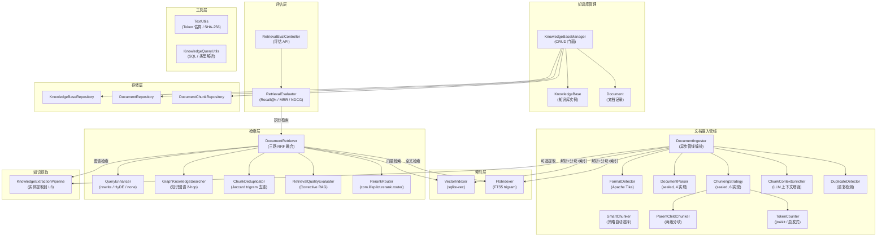
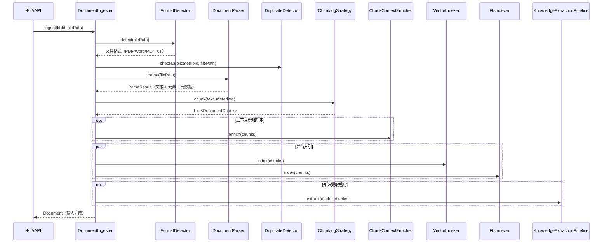
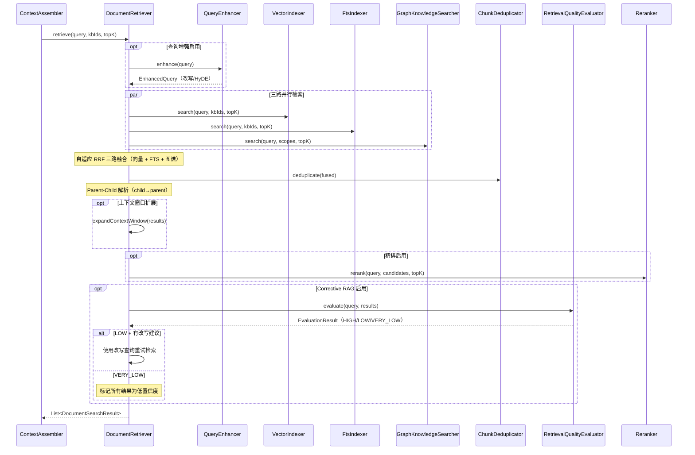
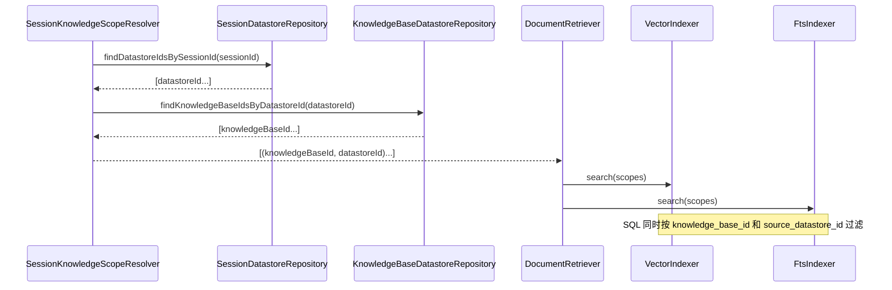

# 知识库管理 — 架构设计

> **文档性质**：架构设计文档
> **模块归属**：`com.lifepilot.knowledge`
> **最后更新**：2026-04-07

## 1. 模块概述

知识库管理模块为知微提供文档级知识管理能力，支持多格式文档导入（PDF / Word / Markdown / TXT）、智能分块（含 Parent-Child 两级分块）、向量索引、三路混合检索（向量 + FTS5 + 知识图谱）和可选精排。用户可创建多个独立知识库，每个知识库独立配置 Embedding 模型和分块策略。模块通过 `DocumentIngester` 实现完整的文档摄入管线，通过 `DocumentRetriever` 实现三路检索 + 自适应 RRF 融合 + 去重 + Corrective RAG，为 Agent 的上下文增强提供知识库片段。Token 计数基于 jtokkit（兼容 tiktoken 编码），FTS5 使用 trigram tokenizer 天然支持 CJK 子串匹配。

在当前实现中，知识库还承担 datastore 领域知识容器的角色：

- 知识库可显式挂载多个 datastore
- 文件文档可按“文档级”归属到某个 datastore，也可保持无归属共享文档
- datastore 结构化数据会异步同步为 `DATASTORE_DOCUMENT` 写入关联知识库
- 会话按 datastore 加载知识时，检索会按 `source_datastore_id` 收口，不会把同库其他领域内容混入

这意味着知识库既是通用文档容器，也是领域检索的承载层；真正决定领域边界的是文档级来源字段，而不是仅靠知识库挂载关系。

## 2. 架构图

## 3. 核心组件

### 3.1 KnowledgeBaseManager（知识库管理门面）

- 职责：提供知识库和文档的基础 CRUD 操作
- 支持创建、查询（按关键词/标签/时间范围）、更新、删除知识库
- 文档删除时级联清理分块，并刷新知识库统计（文档数、分块数）
- 写操作标注 `@Transactional`，通过 `@Bean` 注册

### 3.2 DocumentIngester（文档摄入管线）

- 职责：编排文档从导入到可检索的完整管线
- 管线阶段：格式检测 → 解析 → 分块 → 上下文增强（可选）→ 索引 → 知识提取（可选）
- 异步执行（`CompletableFuture`），支持进度回调
- 支持断点续传：记录每个阶段状态（`DocumentStatus`），失败后可从上次阶段恢复
- 重复检测：通过 `DuplicateDetector` 在摄入前检查文档是否已存在

### 3.3 DocumentParser（文档解析器体系）

- 通过 sealed interface 定义，当前 4 种实现：
  - `MarkdownParser`：Markdown 文件解析，提取标题结构
  - `PlainTextParser`：纯文本文件解析
  - `PdfParser`：PDF 文件解析（基于 Apache Tika）
  - `WordParser`：Word 文档解析（基于 Apache Tika）
- `FormatDetector` 基于 Apache Tika 自动检测文件格式，路由到对应解析器
- 解析结果包含文本内容、文档元素列表（`DocumentElement`）和元数据（`DocumentMetadata`）

### 3.4 ChunkingStrategy（分块策略体系）

- 通过 sealed interface 定义，当前 6 种实现：
  - `FixedSizeChunker`：固定大小分块，支持重叠和句子边界尊重
  - `RecursiveChunker`：递归分块，按分隔符层次递归切分
  - `HeadingChunker`：标题分块，按 Markdown 标题层级切分
  - `SemanticChunker`：语义分块，基于 Embedding 相似度检测语义断点
  - `SmartChunker`：智能策略选择器，根据文档特征自动选择最佳分块策略
  - `ParentChildChunker`：两级分块器，生成 parent（大块，用于返回给 LLM）和 child（小块，用于向量检索）
- `SmartChunker` 决策逻辑（优先级从高到低）：代码块密度高 → Recursive；标题密度高 → Heading；语义分块可用且文档足够长 → Semantic；长文档 → Recursive；默认 → FixedSize
- `ParentChildChunker` 工作方式：先用 parentChunker 切出大块（level=0），再对每个 parent 用 childChunker 切出小块（level=1）；向量索引只索引 child 块，检索命中后返回对应 parent 块

### 3.5 ChunkContextEnricher（分块上下文增强）

- 职责：使用 LLM 为每个分块生成上下文前缀，提升检索精度
- 可选启用，支持批量处理
- 为每个分块添加文档级上下文信息，使独立分块也能被正确理解

### 3.6 DocumentRetriever（文档检索器）

- 职责：三路检索 + 自适应 RRF 融合 + 去重 + Corrective RAG，返回最相关的文档分块
- 三路检索：`VectorIndexer`（向量语义检索）+ `FtsIndexer`（FTS5 全文搜索）+ `GraphKnowledgeSearcher`（知识图谱遍历），三路并行执行
- 自适应 RRF 融合：向量 Top-1 分数低于阈值时提升 FTS 权重；图谱检索权重独立配置
- 检索结果去重：`ChunkDeduplicator` 基于 Jaccard trigram 相似度移除内容高度重叠的分块
- Parent-Child 解析：命中 child 块时自动查找并返回对应 parent 块（大块上下文完整）
- Corrective RAG（可选）：`RetrievalQualityEvaluator` 评估检索质量（HIGH / LOW / VERY_LOW），LOW 时使用建议改写查询重试，VERY_LOW 时标记低置信度
- 可选查询增强（`QueryEnhancer`）：rewrite 模式生成查询改写变体，HyDE 模式生成假设文档 Embedding
- 可选精排（`Reranker`）：对初步检索结果进行二次排序
- 支持上下文窗口扩展：将命中分块的前后相邻分块也纳入结果
- 完整检索管线顺序：查询增强 → 三路并行检索 → RRF 融合 → 去重 → Parent-Child 解析 → 最低分阈值过滤 → 上下文窗口扩展 → 精排 → Corrective RAG

### 3.7 QueryEnhancer（查询增强器）

- 职责：通过 LLM 改写或扩展用户查询以提升检索精度
- 三种模式：`rewrite`（生成查询改写变体）、`hyde`（生成假设文档 Embedding）、`none`（不增强）
- 带独立超时控制，LLM 不可用时降级返回原始查询

### 3.8 Reranker（精排器）

- 精排功能由 `RerankRouter`（`com.lifepilot.rerank.router`）提供
- `RerankRouter` 统一路由到不同的精排后端（LLM 精排、外部 API 精排等），调用方无需关心具体实现
- 可选启用，通过配置选择精排类型和模型

### 3.9 KnowledgeExtractionPipeline（知识提取管线）

- 职责：从文档分块中提取结构化实体，写入 L3 语义记忆
- 可选启用，在文档摄入管线的最后阶段执行
- 为记忆系统的巩固管线提供知识提取能力

### 3.10 GraphKnowledgeSearcher（图谱检索服务）

- 职责：通过知识图谱遍历找到与查询相关的文档分块
- 算法：从查询中提取候选实体名 → 匹配 `SemanticMemory`（L3 语义记忆）中的实体 → 2-hop 图遍历 → 通过实体的 `sourceConversationId` 定位文档 → 返回该文档的 parent 分块（chunkLevel=0）
- 评分规则：直接命中实体 → 基础分 1.0 * importanceScore；1-hop 关联 → 0.5 * importanceScore；2-hop 关联 → 0.3 * importanceScore
- importanceScore 归一化到 [0.3, 1.0] 区间，避免低分实体被完全忽略
- 匹配的实体类型：PERSON、ORGANIZATION、TOPIC、PROJECT、EVENT、PLACE
- 可选启用，通过 `lifepilot.knowledge.retrieval.graph-enabled` 配置

### 3.11 ChunkDeduplicator（检索结果去重器）

- 职责：基于 Jaccard trigram 相似度移除内容高度重叠的分块
- 算法：按分数降序遍历，对每个候选检查与已保留结果的 trigram Jaccard 相似度，超过阈值的低分结果被移除
- 时间复杂度 O(n²)，但 n 一般 < 50，性能无瓶颈
- 阈值通过 `lifepilot.knowledge.retrieval.deduplication-threshold` 配置，设为 0 禁用去重

### 3.12 RetrievalQualityEvaluator（检索质量评估 / Corrective RAG）

- 职责：在检索完成后评估结果与查询的相关性，支持三级判定：HIGH（直接命中）、LOW（需改写重试）、VERY_LOW（全部不相关）
- 快速路径：Top-1 分数高于 `correction-high-threshold` 时直接返回 HIGH，跳过 LLM 调用
- LLM 调用失败时降级为 HIGH（fail-open 策略），不阻塞主检索流程
- LOW 时返回建议改写查询，由 `DocumentRetriever` 使用改写查询重试（单次重试，避免递归）
- 可选启用，通过 `lifepilot.knowledge.retrieval.correction-enabled` 配置

### 3.13 TokenCounter（Token 计数器）

- sealed interface，两种实现：
  - `Jtokkit`：基于 jtokkit 的精确 Token 计数器，兼容 tiktoken 编码（cl100k_base / o200k_base）
  - `Heuristic`：启发式估算兜底（中文 1 Token/字符，其他 4 字符/Token）
- 编码类型通过 `lifepilot.knowledge.tokenizer.encoding` 配置

### 3.14 RetrievalEvaluator（检索质量离线评估）

- 职责：基于 golden test set 计算 Recall@k / MRR / NDCG 指标
- 接收测试用例列表（查询 + 期望命中 chunkId），逐条执行混合检索并对比
- 通过 `RetrievalEvalController` 暴露评估 API

### 3.15 工具类

- `TextUtils`：Token 估算、SHA-256 哈希、字数统计等共享方法，统一替代各模块重复实现
- `KnowledgeQueryUtils`：SQL 构建、类型解析、JSON 解析等共享方法，统一替代 FtsIndexer / VectorIndexer / Repository 中的重复工具方法

### 3.16 Datastore 领域扩展

- `KnowledgeBaseDatastoreRepository`：维护知识库与 datastore 的显式挂载关系
- `KnowledgeSyncWorker`：消费 `knowledge_sync_jobs`，把 datastore 文档同步成 `DATASTORE_DOCUMENT`
- `SessionKnowledgeScopeResolver`：当会话加载 datastore 时，将其关联知识库转换为 `(knowledgeBaseId, datastoreId)` 检索范围
- `DocumentRepository` / `DocumentChunkRepository`：在文档与分块上持久化 `sourceType / sourceDatastoreId / sourceCollectionId`

文档来源模型的关键语义如下：

- `sourceType = FILE`：用户上传的文件文档，可选关联某个 datastore，也可保持共享
- `sourceType = DATASTORE_DOCUMENT`：由 datastore 同步生成，只读，不应在知识库侧直接改归属
- `sourceDatastoreId`：文档真实领域归属，检索收口按它执行
- `sourceCollectionId`：来源 datastore 集合 ID，主要用于结果溯源

## 4. 核心流程

### 4.1 文档摄入管线

### 4.2 文档检索流程

### 4.3 Datastore 范围检索流程

补充语义：

- 通过 datastore 自动带出的知识库，只检索该 datastore 归属的文档和同步文档
- 用户显式加载某个知识库时，不附带 datastore scope，检索该知识库全部文档
- 用户上传文件后可调整文档级 datastore 归属；同步生成的 `DATASTORE_DOCUMENT` 保持只读

## 5. 设计决策

| 决策 | 选择 | 理由 |
|------|------|------|
| 多知识库实例 | 每个知识库独立配置 | 不同知识域可能需要不同的 Embedding 模型和分块策略 |
| 分块策略 sealed interface | 6 种策略 + SmartChunker 自动选择 | 不同文档结构适合不同分块方式，SmartChunker 降低用户配置负担 |
| Parent-Child 分块 | 大块（parent）用于返回，小块（child）用于检索 | 兼顾检索精度（小块匹配更精准）和上下文完整性（返回大块） |
| 文档解析 | Apache Tika 格式检测 + 4 种解析器 | Tika 提供可靠的格式检测，sealed interface 保证类型安全 |
| 三路检索融合 | 向量 + FTS5 + 知识图谱 + 自适应 RRF | 语义检索、关键词检索、图谱检索三路互补，自适应权重处理低置信度场景 |
| FTS5 tokenizer | trigram tokenizer | 天然支持 CJK 子串匹配，无需外部中文分词器 |
| 检索结果去重 | Jaccard trigram 相似度 | 多路融合后可能产生内容重叠的分块，去重后减少冗余 |
| Corrective RAG | LLM 评估 + 查询改写重试 | 当检索结果质量不足时自动纠正，fail-open 降级确保不阻塞 |
| Token 计数 | jtokkit（精确）+ 启发式（兜底） | jtokkit 兼容 tiktoken 编码，提供精确 Token 计数；启发式兜底确保可用性 |
| 查询增强 | rewrite / HyDE / none 三模式 | rewrite 适合模糊查询，HyDE 适合专业领域，none 适合精确查询 |
| 精排器 | RerankRouter 统一路由 | 通过路由器统一接入不同精排后端（LLM / API），调用方无需关心实现细节 |
| 断点续传 | DocumentStatus 阶段记录 | 大文档摄入可能耗时较长，断点续传避免重复处理 |
| 上下文增强 | LLM 生成分块上下文前缀 | 独立分块可能缺乏上下文，前缀增强提升检索精度 |

## 6. 集成点

| 依赖模块 | 交互方式 | 说明 |
|---------|---------|------|
| LLM Router (`com.lifepilot.llm`) | 构造函数注入 | 向量化（embed）、查询增强、LLM 精排、上下文增强、知识提取、Corrective RAG 质量评估 |
| Memory (`com.lifepilot.memory`) | 通过 KnowledgeExtractionPipeline | 提取的实体写入 L3 语义记忆 |
| Memory (`com.lifepilot.memory.semantic`) | 通过 GraphKnowledgeSearcher | 图谱检索读取 SemanticMemory 中的实体和关系 |
| Agent Engine (`com.lifepilot.agent`) | ContextAssembler 调用 DocumentRetriever | 为 Agent 上下文提供知识库片段 |

## 7. 配置参考

| 配置键 | 默认值 | 说明 |
|--------|--------|------|
| `lifepilot.knowledge.enabled` | `true` | 知识库模块总开关 |
| `lifepilot.knowledge.data-dir` | `~/.zhiwei/data` | 文档存储目录 |
| `lifepilot.knowledge.max-file-size` | `104857600` | 最大文件大小（字节，默认 100MB） |
| `lifepilot.knowledge.chunking.default-strategy` | `smart` | 默认分块策略 |
| `lifepilot.knowledge.chunking.fixed-size.*` | — | 固定大小分块参数 |
| `lifepilot.knowledge.chunking.recursive.*` | — | 递归分块参数 |
| `lifepilot.knowledge.chunking.heading.*` | — | 标题分块参数 |
| `lifepilot.knowledge.chunking.semantic-chunking.*` | — | 语义分块参数 |
| `lifepilot.knowledge.chunking.parent-child.enabled` | `true` | 是否启用 Parent-Child 两级分块 |
| `lifepilot.knowledge.chunking.parent-child.parent-max-tokens` | `1024` | Parent 分块最大 Token 数 |
| `lifepilot.knowledge.chunking.parent-child.child-max-tokens` | `256` | Child 分块最大 Token 数 |
| `lifepilot.knowledge.chunking.parent-child.child-overlap` | `64` | Child 分块之间的重叠 Token 数 |
| `lifepilot.knowledge.tokenizer.encoding` | `cl100k_base` | Token 编码类型（cl100k_base / o200k_base / heuristic） |
| `lifepilot.knowledge.vector-indexer.*` | — | 向量索引参数（批量大小、维度等） |
| `lifepilot.knowledge.retrieval.*` | — | 检索参数（topK、权重、RRF K 等） |
| `lifepilot.knowledge.retrieval.graph-weight` | `0.2` | 图谱检索在 RRF 融合中的权重 |
| `lifepilot.knowledge.retrieval.graph-enabled` | `true` | 是否启用图谱检索 |
| `lifepilot.knowledge.retrieval.deduplication-threshold` | `0.85` | Jaccard trigram 去重阈值（0~1，设为 0 禁用） |
| `lifepilot.knowledge.retrieval.correction-enabled` | `false` | 是否启用 Corrective RAG |
| `lifepilot.knowledge.retrieval.correction-high-threshold` | `0.7` | Top-1 分数高于此阈值时跳过 LLM 评估 |
| `lifepilot.knowledge.retrieval.correction-timeout-ms` | `3000` | Corrective RAG LLM 调用超时毫秒数 |
| `lifepilot.knowledge.context-enricher.*` | — | 上下文增强参数 |
| `lifepilot.knowledge.extraction.*` | — | 知识提取参数 |
| `lifepilot.knowledge.reranker.*` | — | 精排参数（类型、模型、topK 等） |
| `lifepilot.knowledge.query-enhancer.*` | — | 查询增强参数（模式、超时等） |
