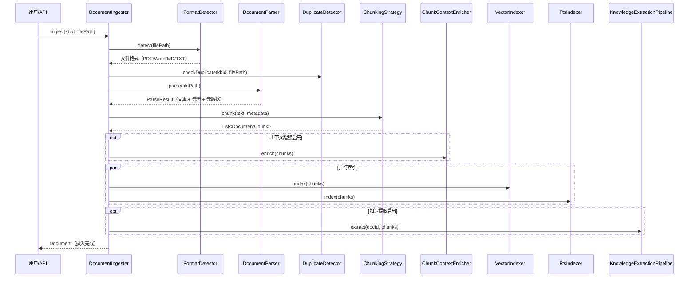
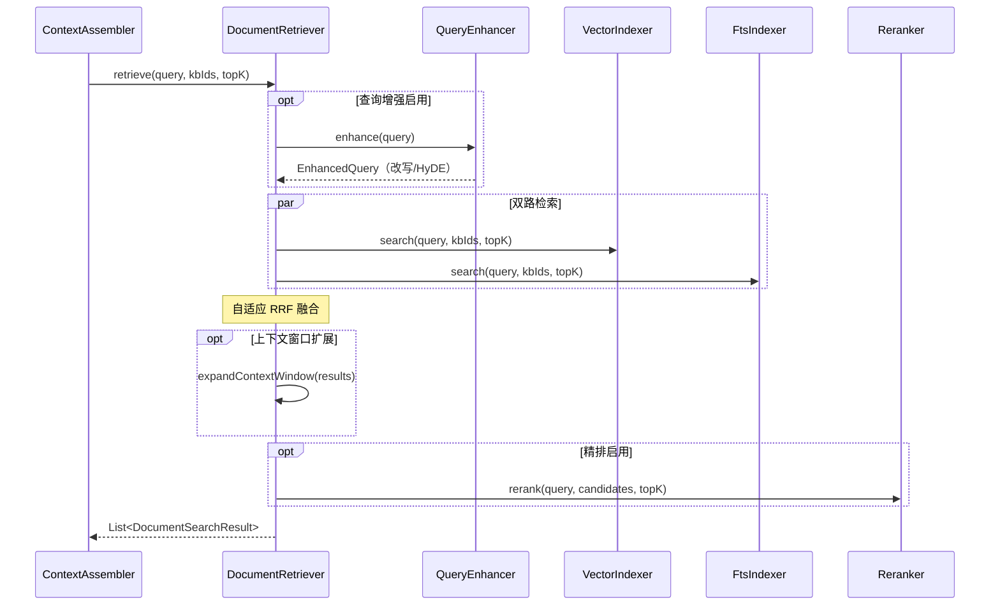

# 知识库管理 — 架构设计

> **文档性质**：架构设计文档
> **模块归属**：`com.lifepilot.knowledge`
> **最后更新**：2026-03

## 1. 模块概述

知识库管理模块为知微提供文档级知识管理能力，支持多格式文档导入（PDF / Word / Markdown / TXT）、智能分块、向量索引、混合检索和可选精排。用户可创建多个独立知识库，每个知识库独立配置 Embedding 模型和分块策略。模块通过 `DocumentIngester` 实现完整的文档摄入管线，通过 `DocumentRetriever` 实现双路检索 + RRF 融合，为 Agent 的上下文增强提供知识库片段。

## 2. 架构图

```mermaid
graph TB
    subgraph "知识库管理"
        KBM["KnowledgeBaseManager<br/>(CRUD 门面)"]
        KB["KnowledgeBase<br/>(知识库实例)"]
        DOC["Document<br/>(文档记录)"]
        KBM --> KB
        KBM --> DOC
    end

    subgraph "文档摄入管线"
        DI["DocumentIngester<br/>(异步管线编排)"]
        FD["FormatDetector<br/>(Apache Tika)"]
        DP["DocumentParser<br/>(sealed, 4 实现)"]
        CS["ChunkingStrategy<br/>(sealed, 5 实现)"]
        SC["SmartChunker<br/>(策略自动选择)"]
        CE["ChunkContextEnricher<br/>(LLM 上下文增强)"]
        DD["DuplicateDetector<br/>(重复检测)"]
        DI --> FD
        DI --> DP
        DI --> CS
        DI --> CE
        DI --> DD
    end

    subgraph "索引层"
        VI["VectorIndexer<br/>(sqlite-vec)"]
        FI["FtsIndexer<br/>(FTS5)"]
    end

    subgraph "检索层"
        DR["DocumentRetriever<br/>(双路 RRF 融合)"]
        QE["QueryEnhancer<br/>(rewrite / HyDE / none)"]
        RR["Reranker<br/>(sealed: LLM / API)"]
        DR --> QE
        DR --> RR
    end

    subgraph "知识提取"
        KEP["KnowledgeExtractionPipeline<br/>(实体提取到 L3)"]
    end

    subgraph "存储层"
        KBR["KnowledgeBaseRepository"]
        DOCR["DocumentRepository"]
        DCR["DocumentChunkRepository"]
    end

    DI -->|"解析+分块+索引"| VI
    DI -->|"解析+分块+索引"| FI
    DI -->|"可选提取"| KEP
    DR -->|"向量检索"| VI
    DR -->|"全文检索"| FI
    KBM --> KBR
    KBM --> DOCR
    KBM --> DCR
```

## 3. 核心组件

### 3.1 KnowledgeBaseManager（知识库管理门面）

- 职责：提供知识库和文档的基础 CRUD 操作
- 支持创建、查询（按关键词/标签/时间范围）、更新、删除知识库
- 文档删除时级联清理分块，并刷新知识库统计（文档数、分块数）
- 写操作标注 `@Transactional`，通过 `@Bean` 注册

### 3.2 DocumentIngester（文档摄入管线）

- 职责：编排文档从导入到可检索的完整管线
- 管线阶段：格式检测 → 解析 → 分块 → 上下文增强（可选）→ 索引 → 知识提取（可选）
- 异步执行（`CompletableFuture`），支持进度回调
- 支持断点续传：记录每个阶段状态（`DocumentStatus`），失败后可从上次阶段恢复
- 重复检测：通过 `DuplicateDetector` 在摄入前检查文档是否已存在

### 3.3 DocumentParser（文档解析器体系）

- 通过 sealed interface 定义，当前 4 种实现：
  - `MarkdownParser`：Markdown 文件解析，提取标题结构
  - `PlainTextParser`：纯文本文件解析
  - `PdfParser`：PDF 文件解析（基于 Apache Tika）
  - `WordParser`：Word 文档解析（基于 Apache Tika）
- `FormatDetector` 基于 Apache Tika 自动检测文件格式，路由到对应解析器
- 解析结果包含文本内容、文档元素列表（`DocumentElement`）和元数据（`DocumentMetadata`）

### 3.4 ChunkingStrategy（分块策略体系）

- 通过 sealed interface 定义，当前 5 种实现：
  - `FixedSizeChunker`：固定大小分块，支持重叠和句子边界尊重
  - `RecursiveChunker`：递归分块，按分隔符层次递归切分
  - `HeadingChunker`：标题分块，按 Markdown 标题层级切分
  - `SemanticChunker`：语义分块，基于 Embedding 相似度检测语义断点
  - `SmartChunker`：智能策略选择器，根据文档特征自动选择最佳分块策略
- `SmartChunker` 决策逻辑：短文档 → FixedSize；标题密度高 → Heading；代码密度高 → Recursive；长文档 + 语义分块启用 → Semantic；默认 → Recursive

### 3.5 ChunkContextEnricher（分块上下文增强）

- 职责：使用 LLM 为每个分块生成上下文前缀，提升检索精度
- 可选启用，支持批量处理
- 为每个分块添加文档级上下文信息，使独立分块也能被正确理解

### 3.6 DocumentRetriever（文档检索器）

- 职责：双路检索 + 自适应 RRF 融合，返回最相关的文档分块
- 双路检索：`VectorIndexer`（向量语义检索）+ `FtsIndexer`（FTS5 全文搜索）
- 自适应 RRF 融合：向量置信度低时自动调整权重
- 可选查询增强（`QueryEnhancer`）：rewrite 模式生成查询改写变体，HyDE 模式生成假设文档 Embedding
- 可选精排（`Reranker`）：对初步检索结果进行二次排序
- 支持上下文窗口扩展：将命中分块的前后相邻分块也纳入结果

### 3.7 QueryEnhancer（查询增强器）

- 职责：通过 LLM 改写或扩展用户查询以提升检索精度
- 三种模式：`rewrite`（生成查询改写变体）、`hyde`（生成假设文档 Embedding）、`none`（不增强）
- 带独立超时控制，LLM 不可用时降级返回原始查询

### 3.8 Reranker（精排器体系）

- 通过 sealed interface 定义，当前 2 种实现：
  - `LlmReranker`：使用 LLM 对候选结果评分排序（支持 pointwise / listwise 模式）
  - `ApiReranker`：调用外部 Reranker API（如 Jina）进行精排
- 可选启用，通过配置选择精排类型和模型

### 3.9 KnowledgeExtractionPipeline（知识提取管线）

- 职责：从文档分块中提取结构化实体，写入 L3 语义记忆
- 可选启用，在文档摄入管线的最后阶段执行
- 为记忆系统的巩固管线提供知识提取能力

## 4. 核心流程

### 4.1 文档摄入管线

### 4.2 文档检索流程

## 5. 设计决策

| 决策 | 选择 | 理由 |
|------|------|------|
| 多知识库实例 | 每个知识库独立配置 | 不同知识域可能需要不同的 Embedding 模型和分块策略 |
| 分块策略 sealed interface | 5 种策略 + SmartChunker 自动选择 | 不同文档结构适合不同分块方式，SmartChunker 降低用户配置负担 |
| 文档解析 | Apache Tika 格式检测 + 4 种解析器 | Tika 提供可靠的格式检测，sealed interface 保证类型安全 |
| 双路检索融合 | 向量 + FTS5 + 自适应 RRF | 语义检索和关键词检索互补，自适应权重处理低置信度场景 |
| 查询增强 | rewrite / HyDE / none 三模式 | rewrite 适合模糊查询，HyDE 适合专业领域，none 适合精确查询 |
| 精排器 | LLM + API 双实现 | LLM 精排无需额外服务，API 精排性能更好；sealed interface 保证穷举 |
| 断点续传 | DocumentStatus 阶段记录 | 大文档摄入可能耗时较长，断点续传避免重复处理 |
| 上下文增强 | LLM 生成分块上下文前缀 | 独立分块可能缺乏上下文，前缀增强提升检索精度 |

## 6. 集成点

| 依赖模块 | 交互方式 | 说明 |
|---------|---------|------|
| LLM Router (`com.lifepilot.llm`) | 构造函数注入 | 向量化（embed）、查询增强、LLM 精排、上下文增强、知识提取 |
| Memory (`com.lifepilot.memory`) | 通过 KnowledgeExtractionPipeline | 提取的实体写入 L3 语义记忆 |
| Agent Engine (`com.lifepilot.agent`) | ContextAssembler 调用 DocumentRetriever | 为 Agent 上下文提供知识库片段 |

## 7. 配置参考

| 配置键 | 默认值 | 说明 |
|--------|--------|------|
| `lifepilot.knowledge.enabled` | `true` | 知识库模块总开关 |
| `lifepilot.knowledge.data-dir` | `~/.zhiwei/data` | 文档存储目录 |
| `lifepilot.knowledge.max-file-size` | `104857600` | 最大文件大小（字节，默认 100MB） |
| `lifepilot.knowledge.chunking.default-strategy` | `smart` | 默认分块策略 |
| `lifepilot.knowledge.chunking.fixed-size.*` | — | 固定大小分块参数 |
| `lifepilot.knowledge.chunking.recursive.*` | — | 递归分块参数 |
| `lifepilot.knowledge.chunking.heading.*` | — | 标题分块参数 |
| `lifepilot.knowledge.chunking.semantic-chunking.*` | — | 语义分块参数 |
| `lifepilot.knowledge.vector-indexer.*` | — | 向量索引参数（批量大小、维度等） |
| `lifepilot.knowledge.retrieval.*` | — | 检索参数（topK、权重、RRF K 等） |
| `lifepilot.knowledge.context-enricher.*` | — | 上下文增强参数 |
| `lifepilot.knowledge.extraction.*` | — | 知识提取参数 |
| `lifepilot.knowledge.reranker.*` | — | 精排参数（类型、模型、topK 等） |
| `lifepilot.knowledge.query-enhancer.*` | — | 查询增强参数（模式、超时等） |