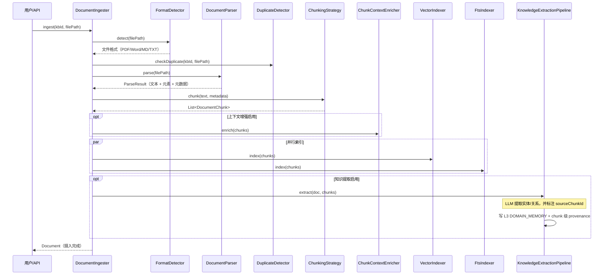
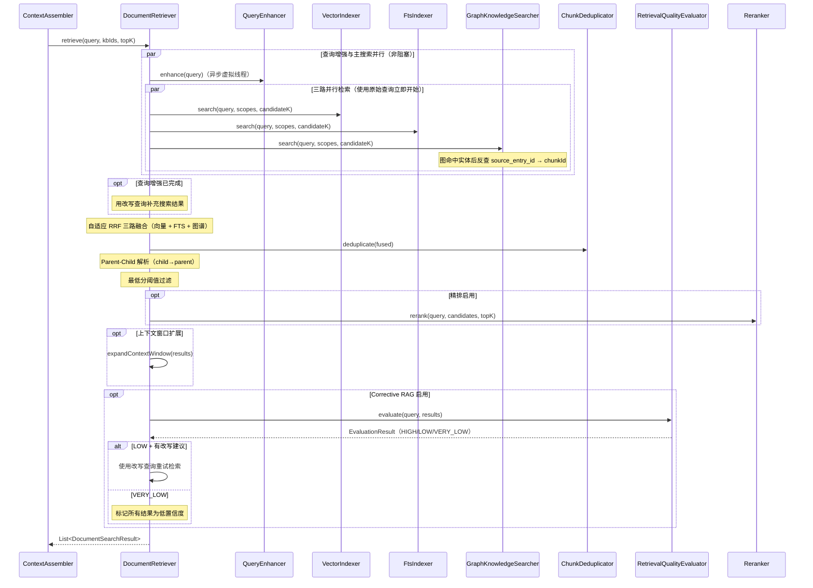

# 知识库管理 — 架构设计

> **文档性质**：架构设计文档
> **模块归属**：`com.lifepilot.knowledge`
> **最后更新**：2026-05-05（知识库图谱改为 chunk 级证据链）

## 1. 模块概述

知识库管理模块为知微提供文档级知识管理能力，支持多格式文档导入（PDF / Word / Markdown / TXT）、智能分块（含 Parent-Child 两级分块）、向量索引、三路混合检索（向量 + FTS5 + 知识图谱）和可选精排。用户可创建多个独立知识库，每个知识库独立配置 Embedding 模型和分块策略。模块通过 `DocumentIngester` 实现完整的文档摄入管线，通过 `DocumentRetriever` 实现三路检索 + 自适应 RRF 融合 + 去重 + Corrective RAG，为 Agent 的上下文增强提供知识库片段。Token 计数基于 jtokkit（兼容 tiktoken 编码），FTS5 使用 trigram tokenizer 天然支持 CJK 子串匹配。

知识库图谱不是独立图数据库。当前实现把文档 chunk 中抽取出的实体和关系写入 L3 `SemanticMemory` 的 `DOMAIN_MEMORY` space：实体 / 关系属于知识库 domain memory，证据回指 `document_id / knowledge_base_id / chunk_id`。检索时 `GraphKnowledgeSearcher` 只把图谱当成第三路冷召回信号，优先通过实体 provenance 的 `source_entry_id` 回到命中的 chunk，再由 `DocumentRetriever` 统一做 Parent-Child 解析、RRF 融合和去重。

## 2. 架构图

```mermaid
graph TB
    subgraph "知识库管理"
        KBM["KnowledgeBaseManager<br/>(CRUD 门面)"]
        KB["KnowledgeBase<br/>(知识库实例)"]
        DOC["Document<br/>(文档记录)"]
        KBM --> KB
        KBM --> DOC
    end

    subgraph "文档摄入管线"
        DI["DocumentIngester<br/>(异步管线编排)"]
        FD["FormatDetector<br/>(Apache Tika)"]
        DP["DocumentParser<br/>(sealed, 6 实现)"]
        CS["ChunkingStrategy<br/>(sealed, 6 实现)"]
        SC["SmartChunker<br/>(三层结构分块)"]
        DSA["DocumentStructureAnalyzer<br/>(Layer 1 逐行结构分类)"]
        RCR["RegionChunkingRouter<br/>(Layer 2 区域路由)"]
        CM["ChunkMerger<br/>(Layer 3 合并后处理)"]
        PC["ParentChildChunker<br/>(两级分块)"]
        CE["ChunkContextEnricher<br/>(LLM 上下文增强)"]
        DD["DuplicateDetector<br/>(重复检测)"]
        TC["TokenCounter<br/>(jtokkit / 启发式)"]
        DI --> FD
        DI --> DP
        DI --> CS
        DI --> CE
        DI --> DD
        CS --> PC
        CS --> TC
        SC --> DSA
        SC --> RCR
        SC --> CM
    end

    subgraph "索引层"
        VI["VectorIndexer<br/>(sqlite-vec)"]
        FI["FtsIndexer<br/>(FTS5 trigram)"]
    end

    subgraph "检索层"
        DR["DocumentRetriever<br/>(三路 RRF 融合)"]
        QE["QueryEnhancer<br/>(rewrite / HyDE / none)"]
        GS["GraphKnowledgeSearcher<br/>(知识图谱 2-hop)"]
        CD["ChunkDeduplicator<br/>(Jaccard trigram 去重)"]
        RQE["RetrievalQualityEvaluator<br/>(Corrective RAG)"]
        RR["RerankRouter<br/>(com.lifepilot.rerank.router)"]
        DR --> QE
        DR --> GS
        DR --> CD
        DR --> RQE
        DR --> RR
    end

    subgraph "评估层"
        RE["RetrievalEvaluator<br/>(Recall@k / MRR / NDCG)"]
        REC["RetrievalEvalController<br/>(评估 API)"]
        REC --> RE
    end

    subgraph "工具层"
        TU["TextUtils<br/>(Token 估算 / SHA-256)"]
        KQU["KnowledgeQueryUtils<br/>(SQL / 类型解析)"]
    end

    subgraph "知识提取 / 图构建"
        KEP["KnowledgeExtractionPipeline<br/>(chunk 级实体/关系提取到 L3)"]
        SM["SemanticMemory<br/>(L3 DOMAIN_MEMORY 图主库)"]
    end

    subgraph "存储层"
        KBR["KnowledgeBaseRepository"]
        DOCR["DocumentRepository"]
        DCR["DocumentChunkRepository"]
    end

    DI -->|"解析+分块+索引"| VI
    DI -->|"解析+分块+索引"| FI
    DI -->|"可选提取"| KEP
    KEP -->|"实体/关系 + chunk 证据"| SM
    DR -->|"向量检索"| VI
    DR -->|"全文检索"| FI
    DR -->|"图谱检索"| GS
    GS -->|"读 L3 图 + provenance"| SM
    RE -->|"执行检索"| DR
    KBM --> KBR
    KBM --> DOCR
    KBM --> DCR
```

## 3. 核心组件

### 3.1 KnowledgeBaseManager（知识库管理门面）

- 职责：提供知识库和文档的基础 CRUD 操作
- 支持创建、查询（按关键词/标签/时间范围）、更新、删除知识库
- 文档删除时级联清理分块，并刷新知识库统计（文档数、分块数）
- 文档 / 知识库删除后发布 `SourceInvalidated` 事件，使 L3 domain 图谱 provenance 失效；图检索只消费仍为 `VALID` 的 chunk 级证据
- 写操作标注 `@Transactional`，通过 `@Bean` 注册

### 3.2 DocumentIngester（文档摄入管线）

- 职责：编排文档从导入到可检索的完整管线
- 管线阶段：格式检测 → 解析 → 分块 → 上下文增强（可选）→ 索引 → 知识提取（可选）
- 异步执行（`CompletableFuture`），支持进度回调
- 支持断点续传：记录每个阶段状态（`DocumentStatus`），失败后可从上次阶段恢复
- 重复检测：通过 `DuplicateDetector` 在摄入前检查文档是否已存在

### 3.3 DocumentParser（文档解析器体系）

- 通过 sealed interface 定义，当前 6 种实现：
  - `MarkdownParser`：Markdown 文件解析，提取标题结构
  - `PlainTextParser`：纯文本文件解析（支持 txt / text / log / csv / tsv）
  - `PdfParser`：PDF 文件解析（基于 Apache Tika）
  - `WordParser`：Word 文档解析（.docx，基于 Apache POI）
  - `ExcelParser`：Excel 解析（.xlsx，基于 Apache POI XSSF）
  - `PowerpointParser`：PowerPoint 解析（.pptx，基于 Apache POI XSLF）
- `FormatDetector` 基于 Apache Tika 自动检测文件格式，路由到对应解析器
- 解析结果包含文本内容、文档元素列表（`DocumentElement`）和元数据（`DocumentMetadata`）

### 3.4 ChunkingStrategy（分块策略体系）

- 通过 sealed interface 定义，当前 6 种实现：
  - `FixedSizeChunker`：固定大小分块，支持重叠和句子边界尊重
  - `RecursiveChunker`：递归分块，按分隔符层次递归切分（仅保留句子级及以上分隔符，移除逗号级标点避免碎片化）
  - `HeadingChunker`：标题分块，按 Markdown 标题层级切分
  - `SemanticChunker`：语义分块，基于 Embedding 相似度检测语义断点
  - `SmartChunker`：三层结构分块器，始终通过三层架构处理文档（见下文 3.4a–3.4c）
  - `ParentChildChunker`：两级分块器，生成 parent（大块，用于返回给 LLM）和 child（小块，用于向量检索）
- `SmartChunker` 三层管线：DocumentStructureAnalyzer（逐行结构分类）→ RegionChunkingRouter（按区域类型路由）→ ChunkMerger（合并过小分块、应用重叠、重新编号）
- `ParentChildChunker` 工作方式：先用独立的 SmartChunker（不含 overlap）作为 parentChunker 切出大块（level=0），再对每个 parent 用 RecursiveChunker 切出小块（level=1）；向量索引只索引 child 块，检索命中后返回对应 parent 块；子块继承父块标题层级

#### 3.4a DocumentStructureAnalyzer（Layer 1 — 文档结构分析）

- 职责：对文档逐行进行结构分类，合并连续同类型行为结构区域（`StructureRegion`），维护标题层级堆栈
- 结构类型（`StructureType`）：HEADING / PARAGRAPH / CODE / LIST / TABLE / BLANK
- 分析流程：按行拆分 → 解析器元素覆盖行分类（如有）→ 规则分类（围栏代码块 → ATX 标题 → 中文章节标题 → 表格 → 列表 → 缩进代码 → 纯文本标题启发式 → 段落）→ 合并同类型行为区域
- 纯文本标题启发式：短行 + 不以句末标点/冒号结尾 + 不含逗号 + 不以引号开头 + 前一行为空行/标题/文档开头
- 通过 `lifepilot.knowledge.chunking.structure-analysis.*` 配置

#### 3.4b RegionChunkingRouter（Layer 2 — 区域分块路由）

- 职责：根据区域结构类型选择最佳分块策略
- 路由策略：
  - HEADING → 与后续内容区域合并为逻辑 section，整体分块
  - PARAGRAPH → 小于阈值整块保留，超过则委派 RecursiveChunker（不应用重叠，由 ChunkMerger 统一处理）
  - CODE → 小于阈值整块保留，超过则委派 FixedSizeChunker（硬切）
  - LIST → 小于阈值整块保留，超过则按列表项拆分
  - TABLE → 始终整块保留（不拆分表格行）
- section 合并规则：过小的 section 向前/向后合并（有标题的仅向前合并，无标题的优先向后合并）
- 通过 `lifepilot.knowledge.chunking.region-routing.*` 配置

#### 3.4c ChunkMerger（Layer 3 — 分块合并后处理）

- 职责：合并过小分块、应用重叠、重新编号索引
- 合并规则：HEADING 始终向后合并；极小碎片（< 50 字符）强制向后合并；同类型同 section 邻居合并（不超限）；不同结构类型（CODE/TABLE vs PARAGRAPH）不合并
- 重叠规则：从前一个分块尾部取 overlapSize 字符，在句子边界处截断；不同 section 或前一分块为 HEADING 时不应用重叠
- 使用 RecursiveChunker 的 maxChunkSize / minChunkSize / overlapSize 配置

### 3.5 ChunkContextEnricher（分块上下文增强）

- 职责：使用 LLM 为每个分块生成上下文前缀，提升检索精度
- 可选启用，支持批量处理
- 为每个分块添加文档级上下文信息，使独立分块也能被正确理解

### 3.6 DocumentRetriever（文档检索器）

- 职责：三路检索 + 自适应 RRF 融合 + 去重 + Corrective RAG，返回最相关的文档分块
- 三路检索：`VectorIndexer`（向量语义检索）+ `FtsIndexer`（FTS5 全文搜索）+ `GraphKnowledgeSearcher`（知识图谱遍历），三路并行执行
- 自适应 RRF 融合：向量 Top-1 分数低于阈值时提升 FTS 权重；图谱检索权重独立配置
- 检索结果去重：`ChunkDeduplicator` 基于 Jaccard trigram 相似度移除内容高度重叠的分块
- Parent-Child 解析：命中 child 块时自动查找并返回对应 parent 块（大块上下文完整）
- Corrective RAG（可选）：`RetrievalQualityEvaluator` 评估检索质量（HIGH / LOW / VERY_LOW），LOW 时使用建议改写查询重试，VERY_LOW 时标记低置信度
- 查询增强与主搜索并行执行（非阻塞）：查询增强（`QueryEnhancer`）使用独立虚拟线程异步运行，不阻塞主搜索；主搜索使用原始查询立即并行检索；主搜索完成后检查增强结果，已完成则用改写查询补充搜索
- 可选精排（`Reranker`）：在上下文扩展之前基于原始匹配内容评分排序
- 支持上下文窗口扩展：在精排之后执行，将命中分块的前后相邻分块纳入结果（展示层增强不影响排序）
- candidateK 动态调整：有精排时拉取 effectiveTopK * 5 的候选给 Reranker；无精排时拉取 effectiveTopK * 3
- 完整检索管线顺序：查询增强（并行非阻塞）→ 三路并行检索 → 改写补充搜索（如增强已完成）→ RRF 融合 → 去重 → Parent-Child 解析 → 最低分阈值过滤 → 精排 → 上下文窗口扩展 → Corrective RAG

### 3.7 QueryEnhancer（查询增强器）

- 职责：通过 LLM 改写或扩展用户查询以提升检索精度
- 三种模式：`rewrite`（生成查询改写变体）、`hyde`（生成假设文档 Embedding）、`none`（不增强）
- 非阻塞并行执行：查询增强在独立虚拟线程中异步运行，主搜索使用原始查询立即开始，不等待增强结果；主搜索完成后检查增强是否也完成了，已完成则用改写查询补充搜索
- 带独立超时控制（默认 15000ms），LLM 不可用时降级返回原始查询

### 3.8 Reranker（精排器）

- 精排功能由 `RerankRouter`（`com.lifepilot.rerank.router`）提供
- `RerankRouter` 统一路由到不同的精排后端（LLM 精排、外部 API 精排等），调用方无需关心具体实现
- 可选启用，通过配置选择精排类型和模型

### 3.9 KnowledgeExtractionPipeline（知识提取管线）

- 职责：从文档分块中提取结构化实体和关系，写入 L3 语义记忆的 `DOMAIN_MEMORY`
- 可选启用，在文档摄入管线的最后阶段执行
- 提取 prompt 将每个 chunk 包在带 `sourceChunkId` 的边界内，LLM 输出实体和关系时必须带来源 chunk id
- 实体写入 `memory_entity_provenances.source_entry_id = chunkId`，`source_document_id = documentId`，`source_knowledge_base_id = kbId`
- 关系写入 `memory_relation_provenances.source_reference = documentId#chunkId`，并保留 document / kb 来源
- 知识库文档不得产生用户画像类实体（`PREFERENCE / HABIT / GOAL`），这些只应从对话学习产生

知识库图构建采用 chunk 级证据图，而不是文档级粗图：

1. 分块阶段先生成 parent / child chunk。
2. 提取阶段把每个 chunk 用 `<chunk id="...">...</chunk>` 包裹交给 LLM。
3. LLM 输出实体、关系及 `sourceChunkId`；批量提取时只接受本批次真实 chunk id，单 chunk 批次允许缺省回退。
4. 写入阶段按知识库解析到独立 domain `MemorySpace`，实体和关系都写入 L3 `DOMAIN_MEMORY`。
5. provenance 记录 `knowledgeBaseId / documentId / chunkId`，其中实体的 `source_entry_id` 在 KB 场景中表示 `document_chunks.id`。
6. 删除文档时发布 `SourceInvalidated(DOCUMENT, documentId, DELETED)`；删除知识库时发布 `SourceInvalidated(KNOWLEDGE_BASE, kbId, DELETED)` 并逐文档发布 DOCUMENT 失效事件。
7. 下游 provenance listener 将相关 `memory_entity_provenances` 标为 `STALE`；`GraphKnowledgeSearcher` 只用 `status='VALID'` 的 `source_entry_id` 回到 chunk。

### 3.10 GraphKnowledgeSearcher（图谱检索服务）

- 职责：通过知识图谱遍历找到与查询相关的文档分块
- 算法：从查询中提取候选实体名 → 匹配 `SemanticMemory`（L3 语义记忆）中的 domain 实体 → 2-hop 图遍历 → 通过实体 provenance 的 `source_entry_id` 定位 chunk → 返回命中 chunk，后续由 `DocumentRetriever` 统一解析 parent chunk
- 兼容旧数据：若实体没有 chunk 级 provenance，则回退到 `sourceConversationId` / documentId 定位文档级 parent 分块
- 读取边界：指定知识库检索时，实体匹配先收窄到对应 KB domain `MemorySpace`，避免同名实体跨知识库误召回
- 污染边界：KB 图实体写在 `DOMAIN_MEMORY`，不会进入默认 `HotMemoryDigest` 自动记忆注入；只有显式 `knowledge.search` 走图谱冷召回
- 评分规则：直接命中实体 → 基础分 1.0 * importanceScore；1-hop 关联 → 0.5 * importanceScore；2-hop 关联 → 0.3 * importanceScore
- importanceScore 归一化到 [0.3, 1.0] 区间，避免低分实体被完全忽略
- 匹配的实体类型：PERSON、ORGANIZATION、TOPIC、PROJECT、EVENT、PLACE
- 可选启用，通过 `lifepilot.knowledge.retrieval.graph-enabled` 配置

### 3.11 ChunkDeduplicator（检索结果去重器）

- 职责：基于 Jaccard trigram 相似度移除内容高度重叠的分块
- 算法：按分数降序遍历，对每个候选检查与已保留结果的 trigram Jaccard 相似度，超过阈值的低分结果被移除
- 时间复杂度 O(n²)，但 n 一般 < 50，性能无瓶颈
- 阈值通过 `lifepilot.knowledge.retrieval.deduplication-threshold` 配置，设为 0 禁用去重

### 3.12 RetrievalQualityEvaluator（检索质量评估 / Corrective RAG）

- 职责：在检索完成后评估结果与查询的相关性，支持三级判定：HIGH（直接命中）、LOW（需改写重试）、VERY_LOW（全部不相关）
- 快速路径：Top-1 分数高于 `correction-high-threshold` 时直接返回 HIGH，跳过 LLM 调用
- LLM 调用失败时降级为 HIGH（fail-open 策略），不阻塞主检索流程
- LOW 时返回建议改写查询，由 `DocumentRetriever` 使用改写查询重试（单次重试，避免递归）
- 可选启用，通过 `lifepilot.knowledge.retrieval.correction-enabled` 配置

### 3.13 TokenCounter（Token 计数器）

- sealed interface，两种实现：
  - `Jtokkit`：基于 jtokkit 的精确 Token 计数器，兼容 tiktoken 编码（cl100k_base / o200k_base）
  - `Heuristic`：启发式估算兜底（中文 1 Token/字符，其他 4 字符/Token）
- 编码类型通过 `lifepilot.knowledge.tokenizer.encoding` 配置

### 3.14 RetrievalEvaluator（检索质量离线评估）

- 职责：基于 golden test set 计算 Recall@k / MRR / NDCG 指标
- 接收测试用例列表（查询 + 期望命中 chunkId），逐条执行混合检索并对比
- 通过 `RetrievalEvalController` 暴露评估 API

### 3.15 工具类

- `TextUtils`：Token 估算、SHA-256 哈希、字数统计等共享方法，统一替代各模块重复实现
- `KnowledgeQueryUtils`：SQL 构建、类型解析、JSON 解析等共享方法，统一替代 FtsIndexer / VectorIndexer / Repository 中的重复工具方法

## 4. 核心流程

### 4.1 文档摄入管线

### 4.2 文档检索流程

## 5. 设计决策

| 决策 | 选择 | 理由 |
|------|------|------|
| 多知识库实例 | 每个知识库独立配置 | 不同知识域可能需要不同的 Embedding 模型和分块策略 |
| 分块策略 sealed interface | 6 种策略 + SmartChunker 三层结构分块 | SmartChunker 通过三层管线（结构分析 → 区域路由 → 合并后处理）自动适配不同文档结构 |
| Parent-Child 分块 | 大块（parent）用于返回，小块（child）用于检索 | 兼顾检索精度（小块匹配更精准）和上下文完整性（返回大块） |
| 文档解析 | Apache Tika 格式检测 + 6 种解析器 | Tika 提供可靠的格式检测，sealed interface 保证类型安全 |
| 三路检索融合 | 向量 + FTS5 + 知识图谱 + 自适应 RRF | 语义检索、关键词检索、图谱检索三路互补，自适应权重处理低置信度场景 |
| FTS5 tokenizer | trigram tokenizer | 天然支持 CJK 子串匹配，无需外部中文分词器 |
| 检索结果去重 | Jaccard trigram 相似度 | 多路融合后可能产生内容重叠的分块，去重后减少冗余 |
| Corrective RAG | LLM 评估 + 查询改写重试 | 当检索结果质量不足时自动纠正，fail-open 降级确保不阻塞 |
| Token 计数 | jtokkit（精确）+ 启发式（兜底） | jtokkit 兼容 tiktoken 编码，提供精确 Token 计数；启发式兜底确保可用性 |
| 查询增强 | rewrite / HyDE / none 三模式 | rewrite 适合模糊查询，HyDE 适合专业领域，none 适合精确查询 |
| 精排器 | RerankRouter 统一路由 | 通过路由器统一接入不同精排后端（LLM / API），调用方无需关心实现细节 |
| 断点续传 | DocumentStatus 阶段记录 | 大文档摄入可能耗时较长，断点续传避免重复处理 |
| 上下文增强 | LLM 生成分块上下文前缀 | 独立分块可能缺乏上下文，前缀增强提升检索精度 |

## 6. 集成点

| 依赖模块 | 交互方式 | 说明 |
|---------|---------|------|
| LLM Router (`com.lifepilot.llm`) | 构造函数注入 | 向量化（embed）、查询增强、LLM 精排、上下文增强、知识提取、Corrective RAG 质量评估 |
| Memory (`com.lifepilot.memory`) | 通过 KnowledgeExtractionPipeline | 提取的实体写入 L3 语义记忆 |
| Memory (`com.lifepilot.memory.semantic`) | 通过 GraphKnowledgeSearcher | 图谱检索读取 SemanticMemory 中的实体和关系 |
| Agent Engine (`com.lifepilot.agent`) | ContextAssembler 调用 DocumentRetriever | 为 Agent 上下文提供知识库片段 |

## 7. 配置参考

| 配置键 | 默认值 | 说明 |
|--------|--------|------|
| `lifepilot.knowledge.enabled` | `true` | 知识库模块总开关 |
| `lifepilot.knowledge.data-dir` | `~/.zhiwei/data` | 文档存储目录 |
| `lifepilot.knowledge.max-file-size` | `104857600` | 最大文件大小（字节，默认 100MB） |
| `lifepilot.knowledge.chunking.default-strategy` | `smart` | 默认分块策略 |
| `lifepilot.knowledge.chunking.fixed-size.*` | — | 固定大小分块参数 |
| `lifepilot.knowledge.chunking.recursive.max-chunk-size` | `1536` | 递归分块最大字符数 |
| `lifepilot.knowledge.chunking.recursive.*` | — | 递归分块其他参数（minChunkSize / overlapSize 等） |
| `lifepilot.knowledge.chunking.heading.*` | — | 标题分块参数 |
| `lifepilot.knowledge.chunking.semantic-chunking.*` | — | 语义分块参数 |
| `lifepilot.knowledge.chunking.parent-child.enabled` | `true` | 是否启用 Parent-Child 两级分块 |
| `lifepilot.knowledge.chunking.parent-child.parent-max-tokens` | `1536` | Parent 分块最大 Token 数 |
| `lifepilot.knowledge.chunking.parent-child.child-max-tokens` | `384` | Child 分块最大 Token 数 |
| `lifepilot.knowledge.chunking.parent-child.child-overlap` | `64` | Child 分块之间的重叠 Token 数 |
| `lifepilot.knowledge.chunking.structure-analysis.max-heading-length` | `80` | 纯文本标题最大字符数 |
| `lifepilot.knowledge.chunking.structure-analysis.min-code-indent` | `4` | 缩进代码块最小缩进空格数 |
| `lifepilot.knowledge.chunking.structure-analysis.min-table-columns` | `2` | 表格最小列数 |
| `lifepilot.knowledge.chunking.region-routing.max-intact-code-size` | `4096` | 代码块整块保留最大字符数 |
| `lifepilot.knowledge.chunking.region-routing.max-intact-table-size` | `8192` | 表格整块保留最大字符数 |
| `lifepilot.knowledge.chunking.region-routing.max-intact-list-size` | `4096` | 列表整块保留最大字符数 |
| `lifepilot.knowledge.chunking.region-routing.paragraph-min-for-recursive` | `200` | 段落使用递归分块的最小长度 |
| `lifepilot.knowledge.tokenizer.encoding` | `cl100k_base` | Token 编码类型（cl100k_base / o200k_base / heuristic） |
| `lifepilot.knowledge.vector-indexer.*` | — | 向量索引参数（批量大小、维度等） |
| `lifepilot.knowledge.retrieval.context-window-size` | `0` | 上下文窗口扩展大小（0 禁用） |
| `lifepilot.knowledge.retrieval.*` | — | 检索参数（topK、权重、RRF K 等） |
| `lifepilot.knowledge.retrieval.graph-weight` | `0.2` | 图谱检索在 RRF 融合中的权重 |
| `lifepilot.knowledge.retrieval.graph-enabled` | `true` | 是否启用图谱检索 |
| `lifepilot.knowledge.retrieval.deduplication-threshold` | `0.85` | Jaccard trigram 去重阈值（0~1，设为 0 禁用） |
| `lifepilot.knowledge.retrieval.correction-enabled` | `false` | 是否启用 Corrective RAG |
| `lifepilot.knowledge.retrieval.correction-high-threshold` | `0.7` | Top-1 分数高于此阈值时跳过 LLM 评估 |
| `lifepilot.knowledge.retrieval.correction-timeout-ms` | `3000` | Corrective RAG LLM 调用超时毫秒数 |
| `lifepilot.knowledge.context-enricher.*` | — | 上下文增强参数 |
| `lifepilot.knowledge.extraction.*` | — | 知识提取参数 |
| `lifepilot.knowledge.reranker.*` | — | 精排参数（类型、模型、topK 等） |
| `lifepilot.knowledge.query-enhancer.mode` | `none` | 查询增强模式（rewrite / hyde / none） |
| `lifepilot.knowledge.query-enhancer.timeout-ms` | `15000` | 查询增强超时毫秒数 |
| `lifepilot.knowledge.query-enhancer.max-rewrites` | `3` | rewrite 模式最大改写数量 |
