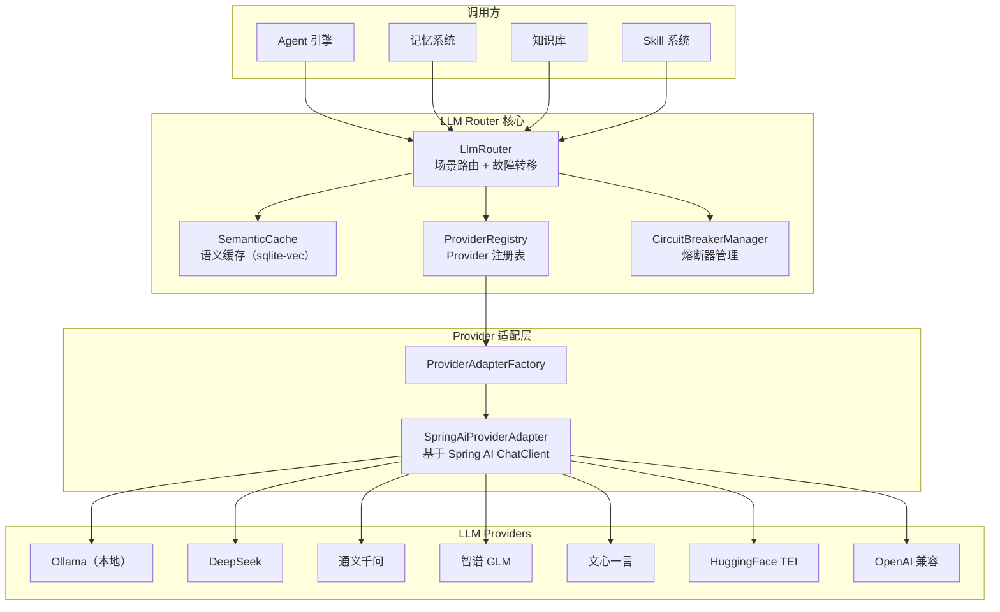
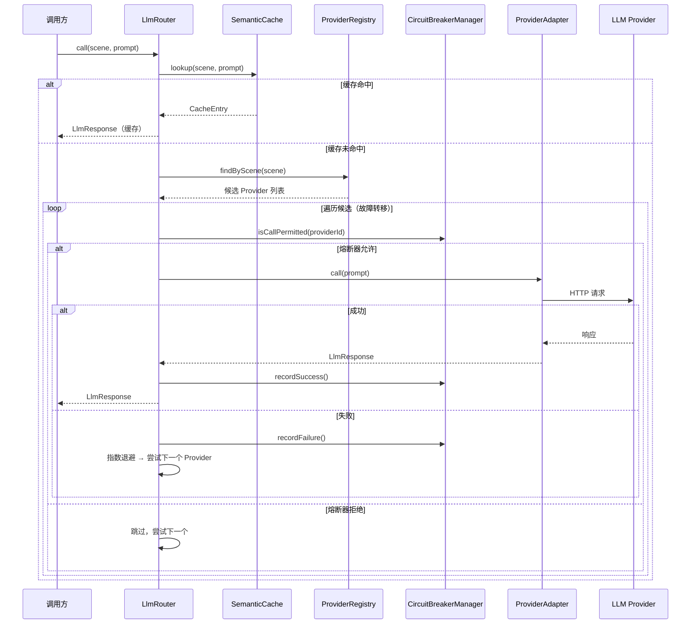

# LLM 路由 — 架构设计

> **文档性质**：架构设计文档
> **模块归属**：`com.lifepilot.llm`
> **最后更新**：2026-03

## 1. 模块概述

LLM Router 是知微的大模型调用基础设施层，负责将业务场景（Scene）路由到最优的 LLM Provider，并提供熔断器、故障转移、指数退避重试、语义缓存等可靠性保障。所有需要调用 LLM 的模块（Agent 引擎、记忆系统、知识库等）均通过 LlmRouter 统一入口访问。

## 2. 架构图

## 3. 核心组件

### 3.1 LlmRouter

- 职责：统一 LLM 调用入口，根据场景选择 Provider，处理故障转移
- 关键接口：`call(scene, prompt, outputSchema)` → `LlmResponse`、`stream(scene, prompt)` → `Flux<String>`、`embed(text)` → `float[]`、`callEntity(scene, prompt, responseType)` → `<T>`、`getChatClient(scene)` → `ChatClient`

### 3.2 ProviderRegistry

- 职责：管理所有已注册的 LLM Provider 配置，按场景查找可用候选
- 关键接口：`register(ProviderConfig)`、`deregister(providerId)`、`findByScene(scene)` → `List<ProviderConfig>`

### 3.3 CircuitBreakerManager

- 职责：为每个 Provider + 能力类型维护独立的熔断器状态（Closed → Open → HalfOpen）
- 关键接口：`isCallPermitted(providerId, capabilityType)`、`recordSuccess(...)`、`recordFailure(...)`

### 3.4 SemanticCache

- 职责：基于 sqlite-vec 向量相似度的语义缓存，减少重复 LLM 调用
- 关键接口：`lookup(scene, phase, prompt)` → `Optional<CacheEntry>`

### 3.5 ProviderAdapterFactory / SpringAiProviderAdapter

- 职责：将 ProviderConfig 转换为可调用的 ProviderAdapter 实例，底层基于 Spring AI ChatClient
- 支持 Ollama 本地适配和 OpenAI 兼容 API 适配两种模式

## 4. 核心流程

## 5. 设计决策

| 决策 | 选择 | 理由 |
|------|------|------|
| 路由粒度 | 场景（Scene）级别 | 不同场景对模型能力要求不同（如 embedding 需要专用模型），场景级路由比全局路由更灵活 |
| 熔断器粒度 | Provider + 能力类型 | 同一 Provider 的 Chat 和 Embedding 能力可能独立故障，细粒度熔断避免误杀 |
| 适配器模式 | Spring AI ChatClient | 复用 Spring AI 生态，统一不同 Provider 的调用接口 |
| 缓存方案 | sqlite-vec 向量相似度 | 语义缓存比精确匹配更有效，复用已有的 sqlite-vec 基础设施 |
| Provider 类型 | 枚举 + OpenAI 兼容 | 大部分国产 LLM 兼容 OpenAI API，统一适配降低维护成本 |

## 6. 集成点

- **Agent 引擎**（`agent`）：通过 `LlmRouter.call()` / `stream()` 驱动 Agent 推理循环
- **记忆系统**（`memory`）：通过 `LlmRouter.embed()` 生成向量嵌入，通过 `call()` 执行记忆压缩
- **知识库**（`knowledge`）：通过 `embed()` 生成文档块向量
- **Skill 系统**（`skill`）：通过 `call()` 执行 Skill 自动生成
- **可观测性**（`observability`）：GuardrailAdvisor 作为 Spring AI Advisor 注入 ChatClient 调用链

## 7. 配置参考

| 配置键 | 默认值 | 说明 |
|--------|--------|------|
| `lifepilot.llm.providers` | — | Provider 配置映射（Map 结构） |
| `lifepilot.llm.providers.{id}.type` | — | Provider 类型（ollama/deepseek/qwen/glm/wenxin/tei/openai-compatible） |
| `lifepilot.llm.providers.{id}.base-url` | — | API 基础 URL |
| `lifepilot.llm.providers.{id}.api-key` | — | API 密钥（环境变量注入） |
| `lifepilot.llm.providers.{id}.model` | — | 模型名称 |
| `lifepilot.llm.providers.{id}.scenes` | — | 支持的场景列表 |
| `lifepilot.llm.providers.{id}.capabilities` | — | 能力声明列表 |
| `lifepilot.llm.circuit-breaker.*` | — | 熔断器配置（失败阈值、恢复超时等） |
