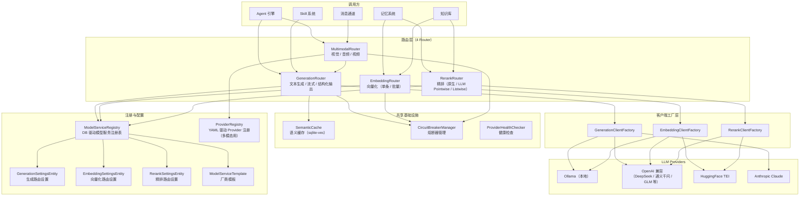
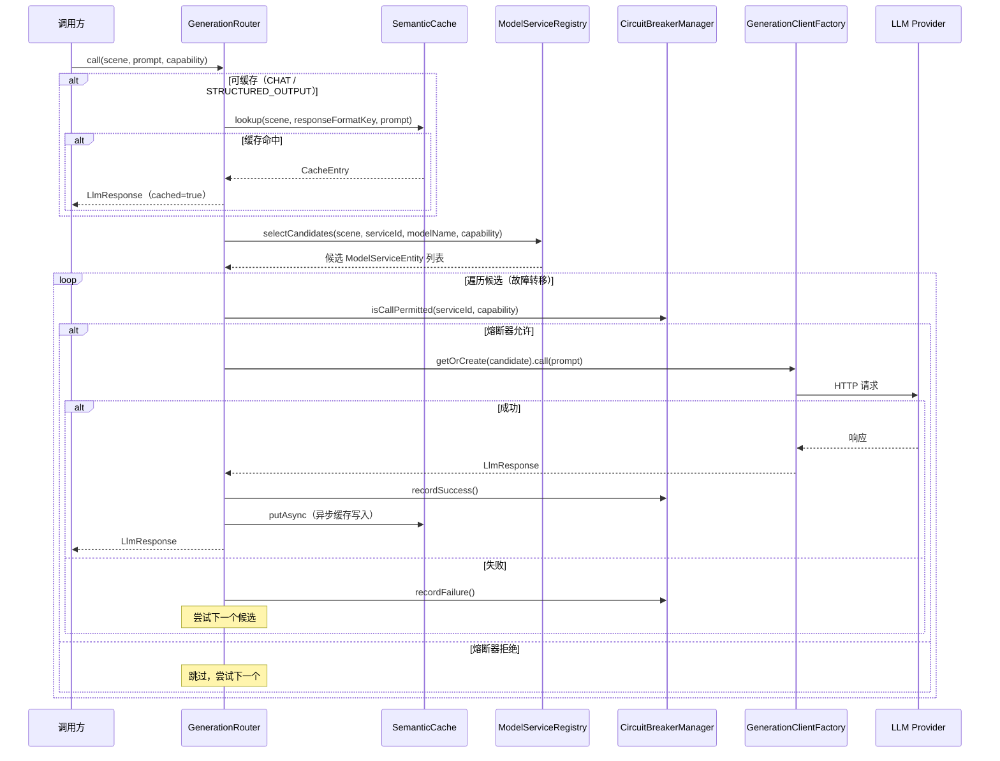
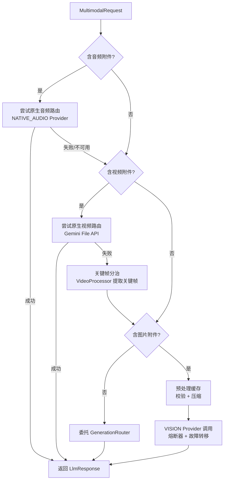

# LLM 路由 — 架构设计

> **文档性质**：架构设计文档
> **模块归属**：`com.lifepilot.generation.router`、`com.lifepilot.embedding.router`、`com.lifepilot.rerank.router`、`com.lifepilot.llm.multimodal`
> **最后更新**：2026-03

## 1. 模块概述

LLM 多模型路由是知微的大模型调用基础设施层，采用 **4 路由器分治架构**，按能力维度将路由职责拆分为生成（Generation）、向量化（Embedding）、精排（Rerank）和多模态（Multimodal）四个独立路由器。每个路由器拥有独立的客户端工厂、候选选择逻辑和能力设置，共享 `CircuitBreakerManager` 熔断器和 `SemanticCache` 语义缓存基础设施。

模型服务通过 `ModelServiceRegistry`（DB 驱动）统一注册管理，支持运行时动态增删和模板化快速接入。所有需要调用 LLM 的模块（Agent 引擎、记忆系统、知识库等）通过对应路由器访问。

## 2. 架构图



## 3. 核心组件

### 3.1 GenerationRouter（生成路由器）

- **包路径**：`com.lifepilot.generation.router.GenerationRouter`
- **职责**：文本生成、流式生成、结构化输出、ChatClient/ChatModel 获取
- **关键接口**：
  - `call(scene, prompt, outputSchema, serviceId, modelName, requiredCapability, timeoutOverride)` → `LlmResponse`
  - `callEntity(scene, prompt, responseType, serviceId, modelName, timeoutOverride)` → `<T>`
  - `streamWithInfo(scene, prompt, serviceId, modelName)` → `StreamingGenerationResponse`
  - `getChatClientWithInfo(scene, serviceId, modelName)` → `ChatClientInfo`
  - `getChatModelWithInfo(scene, serviceId, modelName)` → `ChatModelInfo`
  - `resolveMaxContextWindow(scene, serviceId, modelName)` → `int`
- **候选选择优先级**（`selectCandidates`）：显式 serviceId → 显式 modelName → GenerationSettings 场景绑定 → GenerationSettings 默认服务 → 场景匹配候选 → 全部 GENERATION 类型服务
- **依赖**：`ModelServiceRegistry`、`GenerationSettingsRepository`、`GenerationClientFactory`、`CircuitBreakerManager`、`SemanticCache`（可选）

### 3.2 EmbeddingRouter（向量路由器）

- **包路径**：`com.lifepilot.embedding.router.EmbeddingRouter`
- **职责**：单条文本向量化和批量向量化
- **关键接口**：
  - `embed(text, useCase, serviceId, modelName)` → `float[]`
  - `embedBatch(texts, useCase, serviceId, modelName)` → `float[][]`
- **用途分类**（`EmbeddingUseCase` 枚举）：`DEFAULT`、`KNOWLEDGE_BASE`、`MEMORY`
- **候选选择优先级**：显式 serviceId → 显式 modelName → EmbeddingSettings 用途绑定 → EmbeddingSettings 默认服务 → 全部 EMBEDDING 类型服务
- **依赖**：`ModelServiceRegistry`、`EmbeddingSettingsRepository`、`EmbeddingClientFactory`、`CircuitBreakerManager`

### 3.3 RerankRouter（精排路由器）

- **包路径**：`com.lifepilot.rerank.router.RerankRouter`
- **职责**：文档精排和记忆精排，统一调度原生精排 API 与 LLM 精排策略
- **关键接口**：
  - `rerankDocuments(query, candidates, requestedTopK, modelName)` → `List<DocumentSearchResult>`
  - `rerankMemoryCandidates(query, candidates)` → `List<RerankCandidate>`
  - `isKnowledgeRerankEnabled()` / `isMemoryRerankEnabled()` → `boolean`
  - `resolveKnowledgeTopK(requestedTopK)` / `memoryTopK()` → `int`
- **执行模式**（`RerankExecutionMode` 枚举）：
  - `DISABLED` — 关闭精排
  - `NATIVE` — 使用原生精排服务（如 TEI rerank API）
  - `LLM_POINTWISE` — LLM 逐条评分
  - `LLM_LISTWISE` — LLM 批量排序
- **依赖**：`ModelServiceRegistry`、`RerankSettingsRepository`、`RerankClientFactory`、`LlmPointwiseRerankStrategy`、`LlmListwiseRerankStrategy`

### 3.4 MultimodalRouter（多模态路由器）

- **包路径**：`com.lifepilot.llm.multimodal.MultimodalRouter`
- **职责**：处理包含图片、音频、视频的 LLM 调用；纯文本请求自动委托给 `GenerationRouter`
- **关键接口**：
  - `call(MultimodalRequest)` / `call(MultimodalRequest, timeoutOverride)` → `LlmResponse`
  - `stream(MultimodalRequest)` → `Flux<String>`
  - `streamWithInfo(MultimodalRequest)` → `StreamingLlmResponse`
- **路由策略**：
  - 纯文本（无图片/音频/视频）→ 委托 `GenerationRouter`
  - 图片附件 → VISION 能力 Provider，带预处理缓存（LRU，50 条，10 分钟 TTL）
  - 音频附件 → 优先原生音频（NATIVE_AUDIO Provider），失败回退默认流程
  - 视频附件 → 优先原生视频（Gemini File API + NATIVE_VIDEO Provider），失败回退关键帧分治
- **依赖**：`ProviderRegistry`（YAML 驱动）、`CircuitBreakerManager`、`MediaProcessor`、`MediaValidator`、`VideoProcessor`（可选）、`GeminiFileApiClient`（可选）、`GenerationRouter`

### 3.5 ModelServiceRegistry（模型服务注册表）

- **包路径**：`com.lifepilot.modelservice.registry.ModelServiceRegistry`
- **职责**：DB 驱动的模型服务统一注册表，为 GenerationRouter、EmbeddingRouter、RerankRouter 提供候选服务查询
- **关键接口**：
  - `findAll()` → `List<ModelServiceEntity>`
  - `findEnabledByKind(kind)` → `List<ModelServiceEntity>`
  - `findEnabledById(kind, serviceId)` → `Optional<ModelServiceEntity>`
  - `findEnabledByModelName(kind, modelName)` → `List<ModelServiceEntity>`（精确匹配 → 双向包含模糊匹配）
  - `findGenerationCandidates(scene, requiredCapability)` → `List<ModelServiceEntity>`
- **数据模型**：`ModelServiceEntity` record，字段包括 `id`、`kind`（GENERATION/EMBEDDING/RERANK）、`providerType`、`apiUrl`、`apiKey`、`modelName`、`timeoutSeconds`、`priority`、`enabled`、`supportedScenes`、`generationCapabilities`、`metadata`、`displayName`、`description`
- **模板机制**：`ModelServiceTemplate` 提供厂商级快速接入模板，预定义 API URL、支持的服务类型、默认能力和推荐模型列表

### 3.6 CircuitBreakerManager（熔断器管理）

- **包路径**：`com.lifepilot.llm.circuit.CircuitBreakerManager`
- **职责**：为每个 `providerId:capabilityType` 复合键维护独立的熔断器状态（Closed → Open → HalfOpen），状态变更异步持久化到 `circuit_breaker_states` 表
- **关键接口**：`isCallPermitted(providerId, capabilityType)`、`recordSuccess(...)`、`recordFailure(...)`、`purgeStaleBreakers(activeKeys)`
- **持久化**：启动时从 DB 恢复，状态变更时异步写入，支持陈旧状态清理

### 3.7 SemanticCache（语义缓存）

- **包路径**：`com.lifepilot.llm.cache.SemanticCache`
- **职责**：基于 sqlite-vec 向量相似度的 LLM 响应缓存，按 `scene + agentPhase + responseFormatKey` 维度隔离
- **关键接口**：`lookup(scene, phase, responseFormatKey, prompt)` → `Optional<CacheEntry>`、`putAsync(scene, phase, responseFormatKey, prompt, response, modelName)`、`invalidateByScene(scene)`、`evict()`
- **淘汰策略**：TTL + LRU 混合淘汰
- **容错**：所有数据库操作异常 catch 后降级（lookup 返回 empty，putAsync 静默跳过）
- **延迟初始化**：构造阶段 Embedding Provider 可能尚未注册，由 `ensureVecInitialized()` 在首次使用时创建 `semantic_cache_vec` 虚拟表

### 3.8 ProviderHealthChecker（Provider 健康检查）

- **包路径**：`com.lifepilot.llm.registry.ProviderHealthChecker`
- **职责**：使用 Virtual Thread 并行检查所有 Provider 的健康状态
- **关键接口**：`checkAll(adapters)` → `Map<String, Boolean>`
- **超时**：单次检查超时 10 秒，超时标记为不健康

## 4. 核心流程

### 4.1 生成路由流程（GenerationRouter）



### 4.2 多模态路由流程（MultimodalRouter）



## 5. 设计决策

| 决策 | 选择 | 理由 |
|------|------|------|
| 路由器拆分 | 4 Router 分治 | 生成、向量化、精排、多模态的候选选择逻辑和客户端协议差异大，拆分后各自独立演进，避免单体膨胀 |
| 服务注册方式 | DB 驱动（ModelServiceRegistry） | 支持运行时动态增删服务、前端管理界面操作，无需重启；YAML 配置仅保留多模态旧 Provider 兼容 |
| 路由粒度 | 场景（Scene）+ 用途（UseCase）+ 能力（Capability） | 不同场景对模型能力要求不同，生成按场景绑定，向量化按用途区分（知识库/记忆），精排按执行模式路由 |
| 熔断器粒度 | `providerId:capabilityType` 复合键 | 同一服务的不同能力可能独立故障，细粒度熔断避免误杀 |
| 熔断器持久化 | SQLite 异步持久化 | 重启后恢复熔断状态，避免对刚恢复的故障 Provider 立即压入流量 |
| 精排策略 | 原生 / LLM Pointwise / LLM Listwise 三选一 | 原生精排延迟低但需专用模型，LLM 精排无需额外部署但 Token 消耗高，用户可按需选择 |
| 缓存方案 | sqlite-vec 向量相似度 | 语义缓存比精确匹配更有效，复用已有的 sqlite-vec 基础设施 |
| Provider 类型 | 4 种：Ollama / TEI / OpenAI 兼容 / Anthropic | 大部分国产 LLM 兼容 OpenAI API，统一适配降低维护成本 |
| 模板机制 | ModelServiceTemplate | 预定义厂商配置模板（API URL、默认能力、推荐模型），用户一键创建服务实例 |

## 6. 数据模型

### 6.1 ModelServiceEntity

```java
public record ModelServiceEntity(
    String id,                              // 服务唯一标识
    ModelServiceKind kind,                  // GENERATION / EMBEDDING / RERANK
    ProviderType providerType,              // OLLAMA / TEI / OPENAI_COMPATIBLE / ANTHROPIC
    String apiUrl,                          // API 基础 URL
    @Nullable String apiKey,                // API 密钥
    String modelName,                       // 模型名称
    int timeoutSeconds,                     // 超时秒数（默认 30）
    int priority,                           // 优先级（数值越小越高）
    boolean enabled,                        // 是否启用
    List<String> supportedScenes,           // 支持的场景列表
    Set<GenerationCapability> generationCapabilities,  // 生成子能力集合
    Map<String, Object> metadata,           // 扩展元数据（如 maxContextWindow）
    @Nullable String displayName,           // 显示名称
    @Nullable String description            // 描述
) {}
```

### 6.2 能力枚举

**ModelServiceKind** — 服务类型：`GENERATION`、`EMBEDDING`、`RERANK`

**GenerationCapability** — 生成子能力：`CHAT`、`STRUCTURED_OUTPUT`、`FUNCTION_CALLING`、`STREAMING`、`VISION`、`NATIVE_AUDIO`、`NATIVE_VIDEO`

**ProviderCapability** — Provider 级能力（多模态路由用）：`CHAT`、`EMBEDDING`、`STRUCTURED_OUTPUT`、`FUNCTION_CALLING`、`STREAMING`、`VISION`、`TTS`、`STT`、`RERANK`、`NATIVE_VIDEO`、`NATIVE_AUDIO`

**RerankExecutionMode** — 精排模式：`DISABLED`、`NATIVE`、`LLM_POINTWISE`、`LLM_LISTWISE`

### 6.3 Per-Capability 设置

| 设置实体 | 关键字段 | 说明 |
|----------|----------|------|
| `GenerationSettingsEntity` | `defaultServiceId`、`sceneServiceBindings`（Map） | 生成路由默认服务和场景绑定 |
| `EmbeddingSettingsEntity` | `defaultServiceId`、`knowledgeBaseServiceId`、`memoryServiceId` | 向量化按用途绑定不同服务 |
| `RerankSettingsEntity` | `enabled`、`mode`、`nativeServiceId`、`llmServiceId`、`knowledgeTopK`、`memoryEnabled`、`memoryTopK` | 精排开关、模式和 TopK 配置 |

## 7. 集成点

- **Agent 引擎**（`agent`）：通过 `GenerationRouter.call()` / `streamWithInfo()` 驱动 Agent 推理循环，通过 `MultimodalRouter` 处理含图片/音频/视频的消息
- **记忆系统**（`memory`）：通过 `EmbeddingRouter.embed()` / `embedBatch()` 生成向量嵌入，通过 `GenerationRouter.call()` 执行记忆压缩，通过 `RerankRouter.rerankMemoryCandidates()` 执行记忆精排
- **知识库**（`knowledge`）：通过 `EmbeddingRouter.embedBatch()` 生成文档块向量，通过 `RerankRouter.rerankDocuments()` 执行知识精排
- **Skill 系统**（`skill`）：通过 `GenerationRouter.call()` / `callEntity()` 执行 Skill 自动生成
- **语义缓存**（`cache`）：`SemanticCache` 通过 `EmbeddingRouter` 获取 Prompt 向量，`GenerationRouter` 在调用前后自动查询/写入缓存
- **可观测性**（`observability`）：GuardrailAdvisor 作为 Spring AI Advisor 注入 ChatClient 调用链

## 8. 配置参考

### 8.1 模型服务注册（DB 驱动）

模型服务通过 `model_services` 数据库表管理，支持通过 API 或前端界面动态增删。核心字段：

| 字段 | 说明 |
|------|------|
| `id` | 服务唯一标识 |
| `kind` | 服务类型：`GENERATION` / `EMBEDDING` / `RERANK` |
| `provider_type` | Provider 类型：`ollama` / `tei` / `openai-compatible` / `anthropic` |
| `api_url` | API 基础 URL |
| `api_key` | API 密钥（加密存储） |
| `model_name` | 模型名称 |
| `timeout_seconds` | 超时秒数 |
| `priority` | 优先级（数值越小越高） |
| `enabled` | 是否启用 |
| `supported_scenes` | 支持的场景列表（JSON 数组） |
| `generation_capabilities` | 生成子能力集合（JSON 数组） |
| `metadata` | 扩展元数据（JSON 对象） |

### 8.2 熔断器配置

| 配置键 | 默认值 | 说明 |
|--------|--------|------|
| `lifepilot.llm.circuit-breaker.failure-threshold` | 3 | 触发熔断的连续失败阈值 |
| `lifepilot.llm.circuit-breaker.reset-timeout-seconds` | 60 | OPEN 状态恢复超时（秒） |
| `lifepilot.llm.circuit-breaker.half-open-max-attempts` | 1 | HALF_OPEN 最大探测次数 |
| `lifepilot.llm.circuit-breaker.retry-initial-delay-ms` | 500 | 重试初始延迟（毫秒） |
| `lifepilot.llm.circuit-breaker.retry-multiplier` | 2.0 | 重试延迟倍数 |
| `lifepilot.llm.circuit-breaker.retry-max-delay-ms` | 5000 | 重试最大延迟（毫秒） |

### 8.3 语义缓存配置

| 配置键 | 说明 |
|--------|------|
| `lifepilot.llm.cache.similarity-threshold` | 向量相似度命中阈值 |
| `lifepilot.llm.cache.ttl-seconds` | 缓存条目 TTL（秒） |
| `lifepilot.llm.cache.max-entries` | 缓存最大条目数 |

### 8.4 场景常量（LlmScene）

| 常量 | 值 | 主要路由器 |
|------|----|-----------|
| `CHAT` | `chat` | GenerationRouter | 通用对话（含主动提醒） |
| `AGENT_REACT` | `agent_react` | GenerationRouter | Agent ReAct 推理 |
| `KNOWLEDGE_EXTRACTION` | `knowledge_extraction` | GenerationRouter | 知识提取（含查询增强） |
| `MEMORY_COMPRESSION` | `memory_compression` | GenerationRouter | 记忆压缩（含查询改写） |
| `BACKGROUND_ANALYSIS` | `background_analysis` | GenerationRouter | 后台分析（经验/反思/对比学习） |
| `SKILL_GENERATION` | `skill_generation` | GenerationRouter | Skill 自动生成 |
| — | `embedding` | EmbeddingRouter | 向量化（独立路由） |
| — | `rerank` | RerankRouter | 精排（独立路由） |
