> 本文档从 [ARCHITECTURE.md](../ARCHITECTURE.md) 拆分而来，对应原文 §7 章节。
> 本文档经过深度分析设计，结合业界最佳实践和前沿研究进行了全面扩展。

# LLM 路由层架构设计

## 1. 设计哲学与原则

### 1.1 核心命题

LifePilot 的 LLM 路由层围绕一个核心命题：**如何为本地优先的个人 AI Agent 构建一个弹性、经济、可观测的多模型路由层，使 Agent 行为在模型切换时保持一致？**

传统 API 网关的路由关注吞吐量和延迟均衡，但 AI Agent 的 LLM 路由有本质不同——Agent 的**行为一致性（behavioral consistency）**比单次请求的延迟更重要。当一个 Agent 正在执行多步任务规划时，中途切换到能力差异较大的模型可能导致规划风格突变、工具调用格式不兼容、甚至任务失败。这种"行为漂移（behavioral drift）"是传统 API 路由完全不需要考虑的问题。

### 1.2 业界参考

#### Sierra.ai Multi-Model Router（MMR）模式

[Sierra.ai 在其 Multi-Model Router 博客](https://sierra.ai/blog/model-failover)中提出了一种将**模型意图（model intent）与提供商适配（provider adaptation）分离**的架构模式。其核心思想是：

- **有序模型列表（Ordered Model List）**：每个任务类型预定义一组按优先级排序的模型列表，故障转移严格按序进行，而非随机负载均衡
- **拥塞感知选择器（Congestion-Aware Selector）**：使用 AIMD（Additive Increase / Multiplicative Decrease）算法动态调整每个 Provider 的并发窗口，在高负载时自动降级到备选模型
- **行为一致性保障**：模型切换是受控的有序降级，上层 Agent 只声明意图（"我需要一个支持结构化输出的 Chat 模型来做任务规划"），路由层负责将意图映射到具体的 Provider + Model 组合

LifePilot 借鉴了 MMR 的意图驱动路由和有序故障转移思想，但做了本地化适配：

| Sierra.ai MMR | LifePilot 适配 | 差异原因 |
|---------------|---------------|---------|
| AIMD 拥塞控制 | 简化为优先级排序 + 熔断器 | 个人用户并发极低，无需拥塞控制 |
| 多区域部署 | 本地 Ollama + 云端备选 | 本地优先架构，非多区域 |
| 实时流量指标 | 熔断器状态 + 健康检查 | 单用户场景，流量指标意义不大 |
| 模型列表 API 管理 | YAML 配置 + 运行时注册 | 个人用户偏好声明式配置 |

#### TokenWise 预算强制路由

受 [TokenWise](https://arxiv.org/abs/2502.09735) 预算强制路由概念的启发，LifePilot 在路由决策中引入 **Token 预算维度**——不仅考虑"哪个模型能用"，还考虑"哪个模型用得起"。对于个人用户，月度 LLM 开支是硬约束，路由层必须在质量和成本之间动态平衡。

TokenWise 的核心洞察是：**在预算约束下，路由策略应该是一个多目标优化问题，而非简单的可用性检查**。LifePilot 将这一思想简化为三级预算状态机：

```
OK（正常）→ WARN（警告，优先选择低成本模型）→ BLOCKED（阻断，仅允许本地模型）
```

### 1.3 设计原则

六大设计原则贯穿整个 LLM 路由层的实现：

| # | 原则 | 说明 | 体现 |
|---|------|------|------|
| 1 | **本地优先** | 优先使用本地模型（Ollama），云端模型作为补充和降级选项 | Ollama Provider 优先级最高（priority=0），零成本 + 零延迟 + 完全隐私；本地模型不受预算约束 |
| 2 | **意图驱动** | 调用方声明场景意图，不指定具体模型；路由层负责意图到 Provider 的映射 | `LlmScene` 常量定义场景语义，`LlmRouter` 根据场景解析有序 Provider 列表 |
| 3 | **行为一致性** | 同一会话内尽量使用同一 Provider，避免行为漂移 | 场景绑定的有序 Provider 列表 + 会话级 Provider 亲和性（session affinity） |
| 4 | **预算感知** | Token 消耗纳入路由决策，预算耗尽时自动降级而非拒绝服务 | `TokenBudgetManager` 三级状态机（OK → WARN → BLOCKED）；WARN 时优先选择低成本模型，BLOCKED 时仅允许本地模型 |
| 5 | **渐进降级** | Provider 故障对上层 Agent 不可见，路由层自动故障转移 | 熔断器（CLOSED → OPEN → HALF_OPEN）+ 有序故障转移 + 指数退避重试 |
| 6 | **可观测** | 每次 LLM 调用都可追踪、可度量、可审计 | `LlmUsageTracker` 记录到 `llm_usage_stats` 表；`LlmCallEvent` 包含完整调用链路信息 |

### 1.4 关键洞察：Agent LLM 路由 vs 传统 API 路由

LLM 路由与传统 API 路由的核心差异在于——传统路由追求**请求级别的最优**（最低延迟、最高吞吐），而 Agent LLM 路由追求**会话级别的行为一致性**。

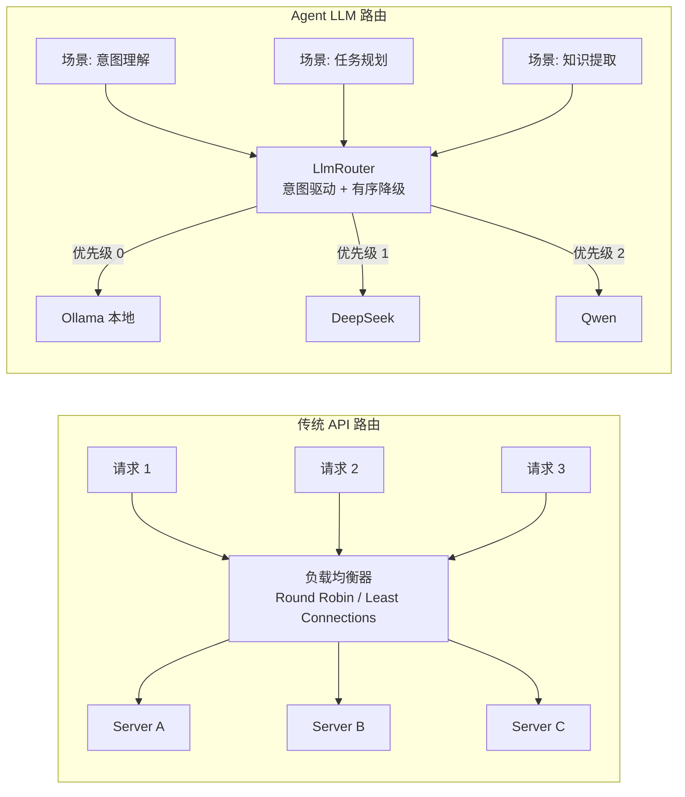

| 维度 | 传统 API 路由 | Agent LLM 路由 |
|------|-------------|---------------|
| 优化目标 | 请求延迟、吞吐量 | 行为一致性、成本控制 |
| 故障转移 | 随机/轮询切换 | 有序降级（按场景优先级） |
| 状态 | 无状态 | 有状态（会话亲和性） |
| 成本模型 | 固定基础设施成本 | 按 Token 计费，预算约束 |
| 健康检查 | TCP/HTTP ping | 能力探测（结构化输出、函数调用） |
| 熔断粒度 | 服务级别 | Provider:Capability 复合键 |

---

## 2. 整体架构

### 2.1 架构概览

LLM 路由层位于 LifePilot 基础设施层，向上为 Agent 层提供统一的 LLM 调用接口，向下适配多种 LLM Provider。整体架构遵循**洋葱模型**：外层处理横切关注点（缓存、预算、熔断），内层执行实际的 Provider 调用。

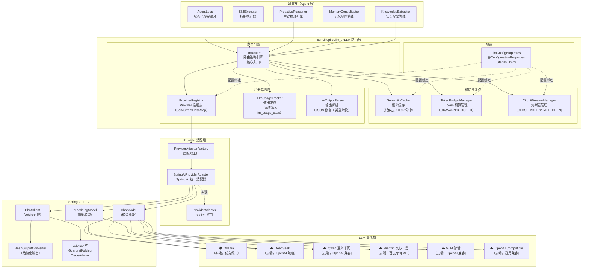

### 2.2 组件关系

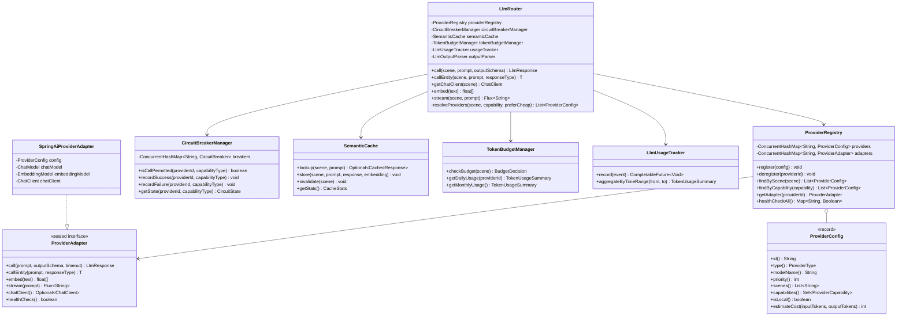

### 2.3 包结构

```
com.lifepilot.llm
├── LlmRouter.java                    // 路由策略引擎（核心入口，五种调用模式）
├── LlmScene.java                     // 场景常量（意图理解、任务规划、知识提取等）
├── LlmResponse.java                  // 统一响应 record
├── LlmCallEvent.java                 // 调用事件 record（成功/失败/缓存命中）
├── LlmUnavailableException.java      // 路由失败异常（携带 scene 和 attemptedProviders）
├── LlmOutputParseException.java      // 输出解析异常
│
├── config/
│   ├── LlmConfigProperties.java      // @ConfigurationProperties("lifepilot.llm")
│   ├── LlmAutoConfiguration.java     // @AutoConfiguration
│   ├── ProviderConfig.java           // Provider 配置 record
│   ├── ProviderType.java             // Provider 类型枚举
│   ├── ProviderCapability.java       // Provider 能力枚举
│   ├── BudgetConfig.java             // 预算配置 record
│   └── CacheConfig.java              // 缓存配置 record
│
├── registry/
│   ├── ProviderRegistry.java         // Provider 注册表（ConcurrentHashMap）
│   └── ProviderHealthChecker.java    // 健康检查（Virtual Thread 并行探测）
│
├── adapter/
│   ├── ProviderAdapter.java          // 适配器 sealed 接口
│   ├── ProviderAdapterFactory.java   // 适配器工厂
│   └── SpringAiProviderAdapter.java  // Spring AI 统一适配器
│
├── circuit/
│   ├── CircuitBreakerManager.java    // 熔断器管理器（providerId:capabilityType 隔离）
│   ├── CircuitBreaker.java           // 熔断器实现
│   └── CircuitState.java             // 熔断器状态 sealed interface
│
├── cache/
│   ├── SemanticCache.java            // 语义缓存（余弦相似度 ≥ 0.92 命中）
│   └── CachedResponse.java           // 缓存响应 record
│
├── budget/
│   ├── TokenBudgetManager.java       // Token 预算管理（日/月预算，三级状态机）
│   ├── BudgetDecision.java           // 预算决策 sealed interface（Ok/Warn/Blocked）
│   └── TokenUsageSummary.java        // 使用汇总 record
│
├── parser/
│   └── LlmOutputParser.java         // 输出解析器（JSON 提取、格式修复、类型转换）
│
└── tracking/
    ├── LlmUsageTracker.java          // 使用追踪（异步写入 llm_usage_stats 表）
    └── LlmUsageStat.java             // 使用统计 record
```

---

## 3. Provider 配置与注册

### 3.1 核心数据模型

Provider 配置是 LLM 路由层的基础数据结构。每个 Provider 配置描述了一个 LLM 服务端点的完整信息：连接参数、能力声明、场景绑定和成本参数。使用 Java 22 record 实现不可变数据载体，紧凑构造器执行参数校验和防御性拷贝。

#### ProviderConfig — Provider 配置记录

```java
/**
 * LLM Provider 配置。
 * 从 application.yml 绑定，也支持运行时动态注册。
 *
 * @param id               Provider 唯一标识（如 "ollama-qwen2.5", "deepseek-chat"）
 * @param type             Provider 类型（决定适配器创建策略）
 * @param apiUrl           API 端点 URL（Ollama 默认 http://localhost:11434）
 * @param apiKey           API 密钥（环境变量注入，禁止硬编码；本地模型为 null）
 * @param modelName        模型名称（如 "qwen2.5:7b", "deepseek-chat"）
 * @param timeoutSeconds   请求超时秒数（默认 30s）
 * @param priority         优先级（数值越小优先级越高，0 = 最高）
 * @param scenes           支持的场景列表（与 {@link LlmScene} 常量匹配）
 * @param capabilities     支持的能力集合
 * @param enabled          是否启用
 * @param costPerInputToken  每输入 Token 成本（分/百万 Token；本地模型为 0）
 * @param costPerOutputToken 每输出 Token 成本（分/百万 Token；本地模型为 0）
 * @param maxContextWindow  最大上下文窗口（Token 数）
 * @param embeddingDimension Embedding 维度（仅 Embedding 模型有效）
 * @param supportsStreaming  是否支持流式输出（SSE）
 */
public record ProviderConfig(
    String id,
    ProviderType type,
    String apiUrl,
    @Nullable String apiKey,
    String modelName,
    int timeoutSeconds,
    int priority,
    List<String> scenes,
    Set<ProviderCapability> capabilities,
    boolean enabled,
    int costPerInputToken,
    int costPerOutputToken,
    int maxContextWindow,
    @Nullable Integer embeddingDimension,
    boolean supportsStreaming
) {
    /** 紧凑构造器 — 参数校验 + 防御性拷贝。 */
    public ProviderConfig {
        Objects.requireNonNull(id, "Provider ID 不能为空");
        Objects.requireNonNull(type, "Provider 类型不能为空");
        Objects.requireNonNull(apiUrl, "API URL 不能为空");
        Objects.requireNonNull(modelName, "模型名称不能为空");
        if (timeoutSeconds <= 0) timeoutSeconds = 30;
        if (priority < 0) priority = 0;
        scenes = List.copyOf(scenes != null ? scenes : List.of());
        capabilities = capabilities != null
            ? Set.copyOf(capabilities) : Set.of(ProviderCapability.CHAT);
    }

    /** 是否为本地模型（Ollama）。本地模型不受预算约束。 */
    public boolean isLocal() { return type == ProviderType.OLLAMA; }

    /** 是否支持指定能力。 */
    public boolean hasCapability(ProviderCapability cap) {
        return capabilities.contains(cap);
    }

    /** 是否支持指定场景。 */
    public boolean supportsScene(String scene) { return scenes.contains(scene); }

    /** 估算请求成本（分）。本地模型返回 0。 */
    public int estimateCost(int inputTokens, int outputTokens) {
        if (isLocal()) return 0;
        return (int) ((long) inputTokens * costPerInputToken / 1_000_000
                     + (long) outputTokens * costPerOutputToken / 1_000_000);
    }
}
```

#### ProviderType — Provider 类型枚举

Provider 类型决定了适配器的创建策略。大多数国产 LLM 提供商（DeepSeek、通义千问、智谱 GLM）都兼容 OpenAI API 格式，可以复用 `OpenAiChatModel` 适配器。

```java
/**
 * LLM Provider 类型枚举。
 * 每种类型对应不同的 Spring AI 自动配置和连接方式。
 */
public enum ProviderType {
    /** Ollama 本地模型。通过 HTTP API 连接本地 Ollama 服务。 */
    OLLAMA("ollama"),
    /** DeepSeek。兼容 OpenAI API 格式。 */
    DEEPSEEK("deepseek"),
    /** 百度文心一言。使用百度专有 API 格式。 */
    WENXIN("wenxin"),
    /** 阿里通义千问。兼容 OpenAI API 格式。 */
    QWEN("qwen"),
    /** 智谱 GLM。兼容 OpenAI API 格式。 */
    GLM("glm"),
    /** 通用 OpenAI 兼容 API。 */
    OPENAI_COMPATIBLE("openai-compatible");

    private final String configKey;
    ProviderType(String configKey) { this.configKey = configKey; }
    public String configKey() { return configKey; }

    public static ProviderType fromConfigKey(String key) {
        for (ProviderType type : values()) {
            if (type.configKey.equals(key)) return type;
        }
        throw new IllegalArgumentException("未知的 Provider 类型: " + key);
    }

    /** 是否使用 OpenAI 兼容 API。 */
    public boolean isOpenAiCompatible() {
        return switch (this) {
            case DEEPSEEK, QWEN, GLM, OPENAI_COMPATIBLE -> true;
            case OLLAMA, WENXIN -> false;
        };
    }
}
```

#### ProviderCapability — Provider 能力枚举

```java
/**
 * LLM Provider 能力枚举。
 * 用于路由时的能力匹配和熔断器隔离。
 *
 * <p>能力隔离的意义：一个 Provider 的 Chat 能力故障
 * 不应影响其 Embedding 能力的正常使用。</p>
 */
public enum ProviderCapability {
    /** 基础对话能力。 */
    CHAT,
    /** Embedding 向量生成。 */
    EMBEDDING,
    /** 结构化输出（JSON Schema 约束）。 */
    STRUCTURED_OUTPUT,
    /** 函数调用 / 工具使用。 */
    FUNCTION_CALLING,
    /** 流式输出（SSE）。 */
    STREAMING,
    /** 视觉理解（图片输入）。 */
    VISION
}
```

### 3.2 Provider 注册表

```java
/**
 * LLM Provider 注册表。
 * 管理所有已注册 Provider 的配置和适配器实例。
 *
 * <p>线程安全：使用 {@link ConcurrentHashMap} 存储，支持并发读写。</p>
 */
@Service
public class ProviderRegistry {

    private static final Logger log = LoggerFactory.getLogger(ProviderRegistry.class);

    private final ConcurrentHashMap<String, ProviderConfig> providers =
        new ConcurrentHashMap<>();
    private final ConcurrentHashMap<String, ProviderAdapter> adapters =
        new ConcurrentHashMap<>();
    private final ProviderAdapterFactory adapterFactory;
    private final ProviderHealthChecker healthChecker;

    public ProviderRegistry(ProviderAdapterFactory adapterFactory,
                            ProviderHealthChecker healthChecker,
                            LlmConfigProperties config) {
        this.adapterFactory = adapterFactory;
        this.healthChecker = healthChecker;
        // 启动时自动注册已启用的 Provider
        config.getProviders().forEach((id, providerConfig) -> {
            if (providerConfig.enabled()) {
                register(providerConfig);
            } else {
                log.info("Provider 已禁用，跳过注册: id={}", id);
            }
        });
        log.info("Provider 注册表初始化完成: 已注册={}", providers.size());
    }

    /** 注册 Provider。 */
    public void register(ProviderConfig config) {
        if (providers.containsKey(config.id())) {
            throw new IllegalArgumentException("Provider 已注册: id=" + config.id());
        }
        ProviderAdapter adapter = adapterFactory.create(config);
        providers.put(config.id(), config);
        adapters.put(config.id(), adapter);
        log.info("Provider 注册成功: id={}, type={}, model={}, scenes={}",
            config.id(), config.type(), config.modelName(), config.scenes());
    }

    /** 注销 Provider。 */
    public void deregister(String providerId) {
        providers.remove(providerId);
        adapters.remove(providerId);
        log.info("Provider 已注销: id={}", providerId);
    }

    /** 按场景查找 Provider 列表，按优先级排序。 */
    public List<ProviderConfig> findByScene(String scene) {
        return providers.values().stream()
            .filter(ProviderConfig::enabled)
            .filter(config -> config.supportsScene(scene))
            .sorted(Comparator.comparingInt(ProviderConfig::priority))
            .toList();
    }

    /** 按能力查找 Provider 列表。 */
    public List<ProviderConfig> findByCapability(ProviderCapability capability) {
        return providers.values().stream()
            .filter(ProviderConfig::enabled)
            .filter(config -> config.hasCapability(capability))
            .sorted(Comparator.comparingInt(ProviderConfig::priority))
            .toList();
    }

    /** 获取 Provider 适配器。 */
    public ProviderAdapter getAdapter(String providerId) {
        ProviderAdapter adapter = adapters.get(providerId);
        if (adapter == null) {
            throw new IllegalArgumentException("Provider 未注册: id=" + providerId);
        }
        return adapter;
    }

    /** 获取 Provider 配置。 */
    public Optional<ProviderConfig> getConfig(String providerId) {
        return Optional.ofNullable(providers.get(providerId));
    }

    /** 对所有已注册 Provider 执行健康检查（Virtual Thread 并行）。 */
    public Map<String, Boolean> healthCheckAll() {
        return healthChecker.checkAll(Map.copyOf(adapters));
    }

    /** 获取所有已注册 Provider 的 ID 集合。 */
    public Set<String> registeredIds() { return Set.copyOf(providers.keySet()); }
}
```

### 3.3 健康检查机制

```java
/**
 * Provider 健康检查器。
 * 使用 Virtual Thread 并行检查所有 Provider 的可用性。
 */
@Component
public class ProviderHealthChecker {

    private static final Logger log = LoggerFactory.getLogger(ProviderHealthChecker.class);

    /** 并行检查所有 Provider。 */
    public Map<String, Boolean> checkAll(Map<String, ProviderAdapter> adapters) {
        ConcurrentHashMap<String, Boolean> results = new ConcurrentHashMap<>();
        try (var executor = Executors.newVirtualThreadPerTaskExecutor()) {
            List<Future<?>> futures = adapters.entrySet().stream()
                .map(entry -> executor.submit(() -> {
                    try {
                        boolean healthy = entry.getValue().healthCheck();
                        results.put(entry.getKey(), healthy);
                        if (!healthy) {
                            log.warn("Provider 健康检查失败: id={}", entry.getKey());
                        }
                    } catch (Exception e) {
                        results.put(entry.getKey(), false);
                        log.warn("Provider 健康检查异常: id={}, 错误={}",
                            entry.getKey(), e.getMessage());
                    }
                }))
                .toList();
            for (Future<?> future : futures) {
                try { future.get(10, TimeUnit.SECONDS); }
                catch (TimeoutException e) { log.warn("Provider 健康检查超时"); }
                catch (InterruptedException e) { Thread.currentThread().interrupt(); }
                catch (ExecutionException e) {
                    log.warn("Provider 健康检查执行异常: {}", e.getCause().getMessage());
                }
            }
        }
        return Map.copyOf(results);
    }
}
```

### 3.4 配置绑定

```java
/**
 * LLM 配置属性绑定。
 * 从 application.yml 的 {@code lifepilot.llm} 前缀绑定。
 */
@ConfigurationProperties(prefix = "lifepilot.llm")
public class LlmConfigProperties {

    private Map<String, ProviderConfig> providers = new LinkedHashMap<>();
    private BudgetConfig budget = new BudgetConfig(5000, 200, 80, 95);
    private CacheConfig cache = new CacheConfig(true, 0.92, 3600, 10000);
    private CircuitBreakerConfig circuitBreaker =
        new CircuitBreakerConfig(3, 60, 1, 500, 2.0, 5000);

    // getter / setter 省略

    /**
     * 预算配置 record。
     * @param monthlyBudgetCents    月度预算（分），默认 5000 = 50 元
     * @param dailyBudgetCents      日预算（分），默认 200 = 2 元
     * @param warnThresholdPercent  警告阈值百分比，默认 80
     * @param blockThresholdPercent 阻断阈值百分比，默认 95
     */
    public record BudgetConfig(
        int monthlyBudgetCents, int dailyBudgetCents,
        int warnThresholdPercent, int blockThresholdPercent
    ) {}

    /**
     * 缓存配置 record。
     * @param enabled             是否启用语义缓存
     * @param similarityThreshold 余弦相似度阈值，默认 0.92
     * @param ttlSeconds          缓存 TTL 秒数，默认 3600
     * @param maxEntries          最大缓存条目数，默认 10000
     */
    public record CacheConfig(
        boolean enabled, double similarityThreshold,
        int ttlSeconds, int maxEntries
    ) {}

    /**
     * 熔断器配置 record。
     * @param failureThreshold     连续失败阈值，默认 3
     * @param resetTimeoutSeconds  OPEN → HALF_OPEN 等待秒数，默认 60
     * @param halfOpenMaxAttempts  HALF_OPEN 最大探测次数，默认 1
     * @param retryInitialDelayMs  重试初始延迟 ms，默认 500
     * @param retryMultiplier      退避倍数，默认 2.0
     * @param retryMaxDelayMs      最大退避 ms，默认 5000
     */
    public record CircuitBreakerConfig(
        int failureThreshold, int resetTimeoutSeconds, int halfOpenMaxAttempts,
        int retryInitialDelayMs, double retryMultiplier, int retryMaxDelayMs
    ) {}
}
```

#### YAML 配置示例

```yaml
lifepilot:
  llm:
    providers:
      ollama-qwen2.5:
        type: ollama
        api-url: http://localhost:11434
        model-name: qwen2.5:7b
        timeout-seconds: 60
        priority: 0
        scenes: [intent_understanding, task_planning, knowledge_extraction,
                 chat, memory_compression, proactive_reasoning, code_generation]
        capabilities: [CHAT, STRUCTURED_OUTPUT, FUNCTION_CALLING, STREAMING]
        enabled: true
        cost-per-input-token: 0
        cost-per-output-token: 0
        max-context-window: 32768
        supports-streaming: true

      ollama-nomic-embed:
        type: ollama
        api-url: http://localhost:11434
        model-name: nomic-embed-text:v1.5
        priority: 0
        scenes: [embedding]
        capabilities: [EMBEDDING]
        enabled: true
        cost-per-input-token: 0
        cost-per-output-token: 0
        max-context-window: 8192
        embedding-dimension: 768

      deepseek-chat:
        type: deepseek
        api-url: https://api.deepseek.com
        api-key: ${DEEPSEEK_API_KEY:}
        model-name: deepseek-chat
        priority: 10
        scenes: [intent_understanding, task_planning, knowledge_extraction,
                 chat, code_generation, document_summary]
        capabilities: [CHAT, STRUCTURED_OUTPUT, FUNCTION_CALLING, STREAMING]
        enabled: true
        cost-per-input-token: 100
        cost-per-output-token: 200
        max-context-window: 65536

      qwen-plus:
        type: qwen
        api-url: https://dashscope.aliyuncs.com/compatible-mode
        api-key: ${QWEN_API_KEY:}
        model-name: qwen-plus
        priority: 20
        scenes: [chat, task_planning, document_summary]
        capabilities: [CHAT, STRUCTURED_OUTPUT, FUNCTION_CALLING, STREAMING, VISION]
        enabled: true
        cost-per-input-token: 80
        cost-per-output-token: 200
        max-context-window: 131072

    budget:
      monthly-budget-cents: 5000
      daily-budget-cents: 200
      warn-threshold-percent: 80
      block-threshold-percent: 95

    cache:
      enabled: true
      similarity-threshold: 0.92
      ttl-seconds: 3600
      max-entries: 10000

    circuit-breaker:
      failure-threshold: 3
      reset-timeout-seconds: 60
      half-open-max-attempts: 1
      retry-initial-delay-ms: 500
      retry-multiplier: 2.0
      retry-max-delay-ms: 5000
```

### 3.5 Spring Boot 自动配置

```java
/**
 * LLM 路由层自动配置。
 */
@AutoConfiguration
@EnableConfigurationProperties(LlmConfigProperties.class)
@ConditionalOnProperty(prefix = "lifepilot.llm", name = "enabled",
    havingValue = "true", matchIfMissing = true)
public class LlmAutoConfiguration {

    @Bean @ConditionalOnMissingBean
    public ProviderAdapterFactory providerAdapterFactory() {
        return new ProviderAdapterFactory();
    }

    @Bean @ConditionalOnMissingBean
    public ProviderHealthChecker providerHealthChecker() {
        return new ProviderHealthChecker();
    }

    @Bean @ConditionalOnMissingBean
    public ProviderRegistry providerRegistry(
            ProviderAdapterFactory adapterFactory,
            ProviderHealthChecker healthChecker,
            LlmConfigProperties config) {
        return new ProviderRegistry(adapterFactory, healthChecker, config);
    }

    @Bean @ConditionalOnMissingBean
    public CircuitBreakerManager circuitBreakerManager(LlmConfigProperties config) {
        return new CircuitBreakerManager(config.getCircuitBreaker());
    }

    @Bean @ConditionalOnMissingBean
    @ConditionalOnProperty(prefix = "lifepilot.llm.cache", name = "enabled",
        havingValue = "true", matchIfMissing = true)
    public SemanticCache semanticCache(LlmConfigProperties config,
            @Qualifier("mainDataSource") DataSource dataSource) {
        return new SemanticCache(config.getCache(), new JdbcTemplate(dataSource));
    }

    @Bean @ConditionalOnMissingBean
    public LlmUsageTracker llmUsageTracker(
            @Qualifier("mainDataSource") DataSource dataSource,
            WriteSerializer writeSerializer) {
        return new LlmUsageTracker(new JdbcTemplate(dataSource), writeSerializer);
    }

    @Bean @ConditionalOnMissingBean
    public TokenBudgetManager tokenBudgetManager(LlmConfigProperties config,
            LlmUsageTracker usageTracker) {
        return new TokenBudgetManager(config.getBudget(), usageTracker);
    }

    @Bean @ConditionalOnMissingBean
    public LlmOutputParser llmOutputParser() { return new LlmOutputParser(); }

    @Bean @ConditionalOnMissingBean
    public LlmRouter llmRouter(
            ProviderRegistry providerRegistry,
            CircuitBreakerManager circuitBreakerManager,
            @Nullable SemanticCache semanticCache,
            TokenBudgetManager tokenBudgetManager,
            LlmUsageTracker usageTracker,
            LlmOutputParser outputParser) {
        return new LlmRouter(providerRegistry, circuitBreakerManager,
            semanticCache, tokenBudgetManager, usageTracker, outputParser);
    }
}
```

---

## 4. 路由策略引擎

### 4.1 场景定义

LifePilot 的 LLM 调用按**场景（Scene）**分类，每个场景绑定一组有序的 Provider 列表。场景是路由决策的第一维度——它回答"这次 LLM 调用是为了什么？"这个问题。调用方不需要知道具体使用哪个模型，只需要声明意图。

```java
/**
 * LLM 调用场景常量。
 * 每个场景可以在 application.yml 中配置不同的 Provider 优先级序列。
 */
public final class LlmScene {
    /** 意图理解 — 解析用户输入的意图和参数。要求快速响应，支持结构化输出。 */
    public static final String INTENT_UNDERSTANDING = "intent_understanding";
    /** 任务规划 — 将用户目标分解为可执行步骤。要求强推理能力。 */
    public static final String TASK_PLANNING = "task_planning";
    /** 通用对话 — 日常聊天、问答、建议。 */
    public static final String CHAT = "chat";
    /** 代码生成 — 生成工作流脚本、自动化代码。 */
    public static final String CODE_GENERATION = "code_generation";
    /** 知识提取 — 从对话中提取实体、关系、事实。要求结构化输出。 */
    public static final String KNOWLEDGE_EXTRACTION = "knowledge_extraction";
    /** 记忆压缩 — 对话摘要和要点提取。成本敏感。 */
    public static final String MEMORY_COMPRESSION = "memory_compression";
    /** 文档摘要 — 长文档摘要和分析。要求长上下文窗口。 */
    public static final String DOCUMENT_SUMMARY = "document_summary";
    /** Embedding — 文本向量化。 */
    public static final String EMBEDDING = "embedding";
    /** 主动推理 — 评估是否需要主动通知用户。成本敏感，延迟容忍度高。 */
    public static final String PROACTIVE_REASONING = "proactive_reasoning";

    private LlmScene() {}

    public static List<String> all() {
        return List.of(INTENT_UNDERSTANDING, TASK_PLANNING, CHAT, CODE_GENERATION,
            KNOWLEDGE_EXTRACTION, MEMORY_COMPRESSION, DOCUMENT_SUMMARY,
            EMBEDDING, PROACTIVE_REASONING);
    }
}
```

**场景与能力要求映射**：

| 场景 | 必需能力 | 优先特性 | 成本敏感度 | 延迟要求 | 典型 Token 消耗 |
|------|---------|---------|-----------|---------|----------------|
| `intent_understanding` | CHAT, STRUCTURED_OUTPUT | 快速响应、JSON 准确性 | 高 | < 2s | 输入 ~500, 输出 ~200 |
| `task_planning` | CHAT, FUNCTION_CALLING | 强推理、工具选择准确 | 中 | < 5s | 输入 ~2000, 输出 ~500 |
| `knowledge_extraction` | CHAT, STRUCTURED_OUTPUT | JSON 准确性、实体识别 | 高 | < 3s | 输入 ~1000, 输出 ~300 |
| `chat` | CHAT | 自然流畅、人格一致 | 中 | < 3s | 输入 ~1000, 输出 ~500 |
| `embedding` | EMBEDDING | 语义准确、维度一致 | 高 | < 1s | 输入 ~500, 输出 N/A |
| `proactive_reasoning` | CHAT | 判断力、低误报率 | 极高 | < 10s | 输入 ~500, 输出 ~100 |
| `memory_compression` | CHAT | 压缩质量、信息保留 | 极高 | < 5s | 输入 ~2000, 输出 ~500 |
| `code_generation` | CHAT | 代码正确性 | 中 | < 10s | 输入 ~1000, 输出 ~1000 |
| `document_summary` | CHAT | 长上下文窗口（≥ 64K） | 中 | < 15s | 输入 ~10000, 输出 ~1000 |

### 4.2 路由决策流程

路由决策是 LLM 路由层的核心算法。整个流程遵循**洋葱模型**——从外到内依次经过缓存、预算、场景匹配、熔断器过滤、优先级排序，最终进入故障转移循环。

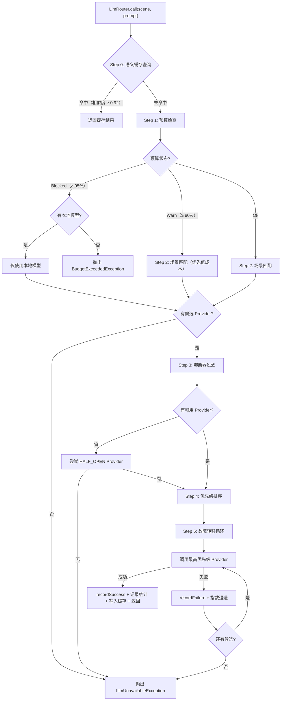

**决策流程关键设计点**：

1. **语义缓存前置**：缓存查询在所有其他逻辑之前执行，命中时直接返回，零 Token 消耗
2. **预算感知排序**：WARN 状态下，排序策略从"纯优先级"切换为"本地优先 → 低成本优先 → 优先级"
3. **熔断器能力隔离**：熔断器以 `providerId:capabilityType` 复合键隔离，Chat 熔断不影响 Embedding
4. **HALF_OPEN 探测**：当所有 CLOSED 状态的 Provider 都不可用时，尝试 HALF_OPEN 状态的 Provider 进行探测恢复
5. **指数退避**：故障转移间的等待时间按指数退避增长（500ms → 1s → 2s → 5s），避免雪崩

### 4.3 核心数据类型

#### LlmResponse — 统一响应记录

```java
/**
 * LLM 调用统一响应。
 * 无论底层使用哪个 Provider，调用方都收到相同结构的响应。
 */
public record LlmResponse(
    String content,
    int inputTokens,
    int outputTokens,
    String providerId,
    String modelName,
    long latencyMs,
    boolean cached
) {
    public int totalTokens() { return inputTokens + outputTokens; }

    public static LlmResponse cached(String content, String providerId,
                                      String modelName) {
        return new LlmResponse(content, 0, 0, providerId, modelName, 0, true);
    }
}
```

#### BudgetDecision — 预算决策（sealed interface）

```java
/**
 * 预算决策 sealed interface。
 * 编译期保证穷举匹配。
 */
public sealed interface BudgetDecision
    permits BudgetDecision.Ok, BudgetDecision.Warn, BudgetDecision.Blocked {

    /** 预算充足，正常路由。 */
    record Ok(int remainingCents) implements BudgetDecision {}

    /** 预算接近上限，优先选择低成本模型。 */
    record Warn(int usagePercent, int remainingCents) implements BudgetDecision {}

    /** 预算耗尽，仅允许本地模型。 */
    record Blocked(String reason) implements BudgetDecision {}
}
```

#### LlmUnavailableException — 路由失败异常

```java
/**
 * LLM 路由失败异常。
 * 当指定场景的所有 Provider 都不可用时抛出。
 * 携带完整的路由上下文信息，便于上层 Agent 做降级决策。
 */
public class LlmUnavailableException extends RuntimeException {

    private final String scene;
    private final List<String> attemptedProviders;

    public LlmUnavailableException(String message, String scene,
                                    List<String> attemptedProviders) {
        super(message);
        this.scene = scene;
        this.attemptedProviders = List.copyOf(attemptedProviders);
    }

    public LlmUnavailableException(String message, String scene,
                                    List<String> attemptedProviders,
                                    @Nullable Throwable cause) {
        super(message, cause);
        this.scene = scene;
        this.attemptedProviders = List.copyOf(attemptedProviders);
    }

    public String scene() { return scene; }
    public List<String> attemptedProviders() { return attemptedProviders; }
}
```

### 4.4 LlmRouter 完整实现

```java
/**
 * LLM 路由策略引擎。
 * 根据调用场景和 Provider 可用性，选择最优 Provider 执行 LLM 调用。
 *
 * <p>路由策略：语义缓存 → 预算检查 → 场景匹配 → 可用性过滤 → 优先级排序 → 故障转移。</p>
 *
 * <p>参考 <a href="https://sierra.ai/blog/model-failover">Sierra.ai MMR</a> 模式，
 * 故障转移是受控的有序降级，而非随机负载均衡。</p>
 *
 * <p>五种调用模式：
 * <ul>
 *   <li>{@link #call} — 文本输入/输出</li>
 *   <li>{@link #callEntity} — 结构化输出（Spring AI entity() API）</li>
 *   <li>{@link #getChatClient} — 获取 ChatClient（Advisor 模式）</li>
 *   <li>{@link #embed} — Embedding 向量生成</li>
 *   <li>{@link #stream} — SSE 流式输出</li>
 * </ul></p>
 */
@Service
public class LlmRouter {

    private static final Logger log = LoggerFactory.getLogger(LlmRouter.class);

    private final ProviderRegistry providerRegistry;
    private final CircuitBreakerManager circuitBreakerManager;
    private final @Nullable SemanticCache semanticCache;
    private final TokenBudgetManager tokenBudgetManager;
    private final LlmUsageTracker usageTracker;
    private final LlmOutputParser outputParser;

    public LlmRouter(ProviderRegistry providerRegistry,
                     CircuitBreakerManager circuitBreakerManager,
                     @Nullable SemanticCache semanticCache,
                     TokenBudgetManager tokenBudgetManager,
                     LlmUsageTracker usageTracker,
                     LlmOutputParser outputParser) {
        this.providerRegistry = providerRegistry;
        this.circuitBreakerManager = circuitBreakerManager;
        this.semanticCache = semanticCache;
        this.tokenBudgetManager = tokenBudgetManager;
        this.usageTracker = usageTracker;
        this.outputParser = outputParser;
    }

    /**
     * 路由调用 — 文本输入/输出。
     * 完整路由流程：语义缓存 → 预算检查 → 场景匹配 → 可用性过滤 → 故障转移。
     */
    public LlmResponse call(String scene, String prompt,
                            @Nullable String outputSchema) {
        // Step 0: 语义缓存查询
        if (semanticCache != null && outputSchema == null) {
            Optional<CachedResponse> cached = semanticCache.lookup(scene, prompt);
            if (cached.isPresent()) {
                log.debug("语义缓存命中: scene={}", scene);
                usageTracker.record(LlmCallEvent.cacheHit(scene, cached.get()));
                return cached.get().toLlmResponse();
            }
        }

        // Step 1: 预算检查
        BudgetDecision budgetDecision = tokenBudgetManager.checkBudget(scene);
        boolean preferCheap = false;
        switch (budgetDecision) {
            case BudgetDecision.Blocked blocked -> {
                log.warn("Token 预算已耗尽: scene={}, 原因={}", scene, blocked.reason());
                List<ProviderConfig> localProviders = resolveLocalProviders(scene);
                if (localProviders.isEmpty()) {
                    throw new BudgetExceededException(
                        "Token 预算已耗尽，场景 [" + scene + "] 无可用本地模型",
                        blocked.reason());
                }
                return executeWithFailover(scene, prompt, outputSchema, localProviders);
            }
            case BudgetDecision.Warn warn -> {
                log.warn("Token 预算接近上限: scene={}, 已用={}%",
                    scene, warn.usagePercent());
                preferCheap = true;
            }
            case BudgetDecision.Ok ok -> { /* 正常继续 */ }
        }

        // Step 2-4: 解析可用 Provider 列表
        List<ProviderConfig> available =
            resolveProviders(scene, ProviderCapability.CHAT, preferCheap);
        if (available.isEmpty()) {
            throw new LlmUnavailableException(
                "场景 [" + scene + "] 无可用 Provider", scene, List.of());
        }

        // Step 5: 故障转移循环
        return executeWithFailover(scene, prompt, outputSchema, available);
    }

    /**
     * 结构化输出调用 — 使用 Spring AI entity() API。
     * 优先选择支持 STRUCTURED_OUTPUT 的 Provider，不支持时降级为 prompt 引导 + 输出解析。
     */
    public <T> T callEntity(String scene, String prompt, Class<T> responseType) {
        List<ProviderConfig> available =
            resolveProviders(scene, ProviderCapability.CHAT, false);

        // 支持结构化输出的 Provider 排前面
        List<ProviderConfig> sorted = new ArrayList<>();
        List<ProviderConfig> fallback = new ArrayList<>();
        for (ProviderConfig config : available) {
            if (config.hasCapability(ProviderCapability.STRUCTURED_OUTPUT)) {
                sorted.add(config);
            } else {
                fallback.add(config);
            }
        }
        sorted.addAll(fallback);

        List<String> attempted = new ArrayList<>();
        Exception lastException = null;
        for (ProviderConfig config : sorted) {
            attempted.add(config.id());
            try {
                ProviderAdapter adapter = providerRegistry.getAdapter(config.id());
                T result;
                if (config.hasCapability(ProviderCapability.STRUCTURED_OUTPUT)) {
                    result = adapter.callEntity(prompt, responseType);
                } else {
                    // 降级：prompt 引导 + 输出解析
                    BeanOutputConverter<T> converter =
                        new BeanOutputConverter<>(responseType);
                    String enhancedPrompt = prompt + "\n\n" + converter.getFormat();
                    LlmResponse response = adapter.call(enhancedPrompt, null,
                        Duration.ofSeconds(config.timeoutSeconds()));
                    result = outputParser.parse(response.content(), responseType);
                }
                circuitBreakerManager.recordSuccess(config.id(), "chat");
                return result;
            } catch (Exception e) {
                lastException = e;
                circuitBreakerManager.recordFailure(config.id(), "chat");
                log.warn("结构化输出调用失败: provider={}, 错误={}",
                    config.id(), e.getMessage());
            }
        }
        throw new LlmUnavailableException(
            "场景 [" + scene + "] 的结构化输出调用全部失败",
            scene, attempted, lastException);
    }

    /** 获取指定场景的 ChatClient 实例（含 Advisor 链）。 */
    public ChatClient getChatClient(String scene) {
        List<ProviderConfig> available =
            resolveProviders(scene, ProviderCapability.CHAT, false);
        for (ProviderConfig config : available) {
            try {
                ProviderAdapter adapter = providerRegistry.getAdapter(config.id());
                Optional<ChatClient> client = adapter.chatClient();
                if (client.isPresent()) {
                    log.debug("获取 ChatClient 成功: provider={}, scene={}",
                        config.id(), scene);
                    return client.get();
                }
            } catch (Exception e) {
                log.warn("获取 ChatClient 失败: provider={}, 错误={}",
                    config.id(), e.getMessage());
            }
        }
        throw new LlmUnavailableException("场景 [" + scene + "] 无可用 ChatClient",
            scene, available.stream().map(ProviderConfig::id).toList());
    }

    /** Embedding 向量生成。使用独立熔断器隔离（capabilityType = "embedding"）。 */
    public float[] embed(String text) {
        List<ProviderConfig> available = providerRegistry
            .findByCapability(ProviderCapability.EMBEDDING);
        List<String> attempted = new ArrayList<>();
        Exception lastException = null;
        for (ProviderConfig config : available) {
            if (!circuitBreakerManager.isCallPermitted(config.id(), "embedding")) {
                continue;
            }
            attempted.add(config.id());
            try {
                float[] embedding = providerRegistry.getAdapter(config.id()).embed(text);
                circuitBreakerManager.recordSuccess(config.id(), "embedding");
                return embedding;
            } catch (Exception e) {
                lastException = e;
                circuitBreakerManager.recordFailure(config.id(), "embedding");
                log.warn("Embedding 生成失败: provider={}, 错误={}",
                    config.id(), e.getMessage());
            }
        }
        throw new LlmUnavailableException("Embedding 生成失败，所有 Provider 不可用",
            LlmScene.EMBEDDING, attempted, lastException);
    }

    /** SSE 流式输出。不经过语义缓存，不做故障转移（中途切换会导致输出不连贯）。 */
    public Flux<String> stream(String scene, String prompt) {
        BudgetDecision budgetDecision = tokenBudgetManager.checkBudget(scene);
        if (budgetDecision instanceof BudgetDecision.Blocked blocked) {
            return Flux.error(new BudgetExceededException(
                "Token 预算已耗尽，流式输出被阻断", blocked.reason()));
        }
        boolean preferCheap = budgetDecision instanceof BudgetDecision.Warn;
        List<ProviderConfig> available =
            resolveProviders(scene, ProviderCapability.STREAMING, preferCheap);
        for (ProviderConfig config : available) {
            try {
                ProviderAdapter adapter = providerRegistry.getAdapter(config.id());
                return adapter.stream(prompt)
                    .doOnComplete(() ->
                        circuitBreakerManager.recordSuccess(config.id(), "chat"))
                    .doOnError(e ->
                        circuitBreakerManager.recordFailure(config.id(), "chat"));
            } catch (Exception e) {
                log.warn("流式输出初始化失败: provider={}, 错误={}",
                    config.id(), e.getMessage());
            }
        }
        return Flux.error(new LlmUnavailableException(
            "场景 [" + scene + "] 无可用流式输出 Provider",
            scene, available.stream().map(ProviderConfig::id).toList()));
    }

    // ==================== 内部方法 ====================

    /**
     * 解析可用 Provider 列表。
     * 场景匹配 → 能力过滤 → 熔断器过滤 → 优先级排序。
     * 当 preferCheap=true 时：本地优先 → 低成本优先 → 原始优先级。
     */
    private List<ProviderConfig> resolveProviders(String scene,
            ProviderCapability capability, boolean preferCheap) {
        List<ProviderConfig> sceneMatched = providerRegistry.findByScene(scene);
        String capabilityType = capability.name().toLowerCase();

        List<ProviderConfig> available = sceneMatched.stream()
            .filter(config -> config.hasCapability(capability))
            .filter(config -> circuitBreakerManager
                .isCallPermitted(config.id(), capabilityType))
            .toList();

        if (preferCheap) {
            return available.stream()
                .sorted(Comparator
                    .<ProviderConfig, Boolean>comparing(c -> !c.isLocal())
                    .thenComparingInt(ProviderConfig::costPerOutputToken)
                    .thenComparingInt(ProviderConfig::priority))
                .toList();
        }
        return available.stream()
            .sorted(Comparator.comparingInt(ProviderConfig::priority))
            .toList();
    }

    /** 解析本地 Provider 列表（仅 Ollama）。预算耗尽时使用。 */
    private List<ProviderConfig> resolveLocalProviders(String scene) {
        return providerRegistry.findByScene(scene).stream()
            .filter(ProviderConfig::isLocal)
            .filter(config -> circuitBreakerManager
                .isCallPermitted(config.id(), "chat"))
            .sorted(Comparator.comparingInt(ProviderConfig::priority))
            .toList();
    }

    /** 故障转移循环执行。按优先级依次尝试，失败时指数退避。 */
    private LlmResponse executeWithFailover(String scene, String prompt,
            @Nullable String outputSchema, List<ProviderConfig> providers) {
        List<String> attempted = new ArrayList<>();
        Exception lastException = null;
        long retryDelayMs = 500;

        for (int i = 0; i < providers.size(); i++) {
            ProviderConfig config = providers.get(i);
            attempted.add(config.id());
            Instant startTime = Instant.now();
            try {
                ProviderAdapter adapter = providerRegistry.getAdapter(config.id());
                LlmResponse response = adapter.call(prompt, outputSchema,
                    Duration.ofSeconds(config.timeoutSeconds()));

                // 成功
                circuitBreakerManager.recordSuccess(config.id(), "chat");
                Duration latency = Duration.between(startTime, Instant.now());
                usageTracker.record(LlmCallEvent.success(
                    config.id(), scene, config.modelName(),
                    response.inputTokens(), response.outputTokens(),
                    latency.toMillis(),
                    config.estimateCost(
                        response.inputTokens(), response.outputTokens())));

                if (semanticCache != null && outputSchema == null) {
                    semanticCache.store(scene, prompt, response, null);
                }

                log.debug("LLM 调用成功: provider={}, scene={}, 延迟={}ms, tokens={}",
                    config.id(), scene, latency.toMillis(), response.totalTokens());
                return response;
            } catch (Exception e) {
                lastException = e;
                circuitBreakerManager.recordFailure(config.id(), "chat");
                Duration latency = Duration.between(startTime, Instant.now());
                usageTracker.record(LlmCallEvent.failure(
                    config.id(), scene, config.modelName(),
                    latency.toMillis(), e.getClass().getSimpleName()));
                log.warn("LLM 调用失败: provider={}, scene={}, 错误={}, 已尝试={}/{}",
                    config.id(), scene, e.getMessage(), i + 1, providers.size());

                // 指数退避（最后一个不等待）
                if (i < providers.size() - 1) {
                    try { Thread.sleep(retryDelayMs); }
                    catch (InterruptedException ie) {
                        Thread.currentThread().interrupt(); break;
                    }
                    retryDelayMs = Math.min(retryDelayMs * 2, 5000);
                }
            }
        }
        throw new LlmUnavailableException(
            "场景 [" + scene + "] 的所有 Provider 调用失败（已尝试: "
                + String.join(", ", attempted) + "）",
            scene, attempted, lastException);
    }
}
```

---

## 5. Spring AI 集成层

### 5.1 设计思路

Spring AI 1.1.2 是 LifePilot LLM 路由层的底层基础设施。LifePilot 不直接调用各 LLM Provider 的 HTTP API，而是通过 Spring AI 提供的统一抽象（`ChatModel`、`EmbeddingModel`、`ChatClient`）与 LLM 交互。这带来三个关键优势：

1. **Provider 适配零成本**：Spring AI 已经适配了 Ollama、OpenAI 兼容 API 等主流 Provider
2. **Advisor 模式横切注入**：`ChatClient` 的 Advisor 链天然支持护栏和轨迹记录的透明注入
3. **结构化输出原生支持**：`BeanOutputConverter` + `entity()` API 将 LLM 输出直接映射为 Java 对象

但 Spring AI 的自动配置默认是"一个应用一个 ChatModel"的模式，而 LifePilot 需要**同时管理多个 Provider 的多个 ChatModel 实例**。因此引入了 `ProviderAdapter` 适配层。

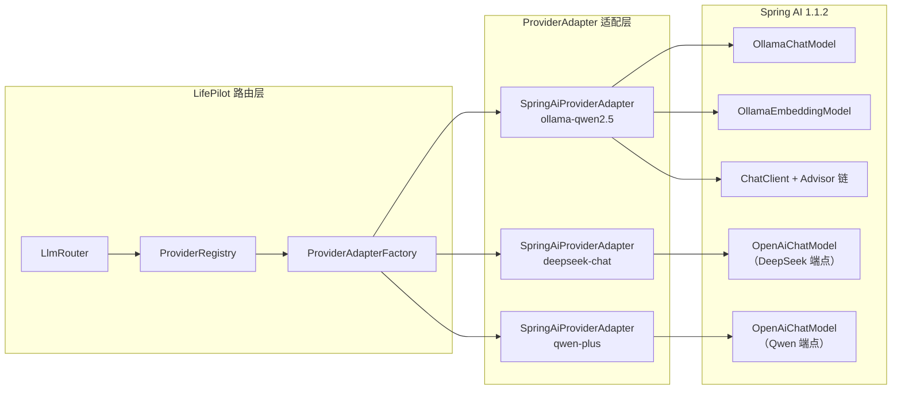

### 5.2 ProviderAdapter — 适配器接口

```java
/**
 * LLM Provider 适配器接口。
 * 定义 LLM 路由层与底层 LLM SDK 之间的统一调用契约。
 *
 * <p>使用 sealed interface 限制实现类，当前唯一实现为
 * {@link SpringAiProviderAdapter}。</p>
 */
public sealed interface ProviderAdapter
    permits SpringAiProviderAdapter {

    /** 文本输入/输出调用。 */
    LlmResponse call(String prompt, @Nullable String outputSchema, Duration timeout);

    /** 结构化输出调用（Spring AI entity() API）。 */
    <T> T callEntity(String prompt, Class<T> responseType);

    /** 生成 Embedding 向量。 */
    float[] embed(String text);

    /** SSE 流式输出。 */
    Flux<String> stream(String prompt);

    /** 获取 ChatClient 实例（含 Advisor 链）。 */
    Optional<ChatClient> chatClient();

    /** 健康检查。 */
    boolean healthCheck();
}
```

### 5.3 SpringAiProviderAdapter — Spring AI 统一适配器

每个 Provider 实例对应一个 `SpringAiProviderAdapter` 实例，封装了 Spring AI 的 `ChatModel`、`EmbeddingModel` 和 `ChatClient`。

```java
/**
 * Spring AI 统一适配器。
 * 封装 Spring AI 的 ChatModel、EmbeddingModel 和 ChatClient。
 *
 * <p>设计要点：
 * <ul>
 *   <li>ChatClient 延迟构建（首次调用时创建，注入 Advisor 链）</li>
 *   <li>Embedding 可选（不是所有 Provider 都支持）</li>
 *   <li>超时通过 Spring AI ChatOptions 设置</li>
 * </ul></p>
 */
public final class SpringAiProviderAdapter implements ProviderAdapter {

    private static final Logger log =
        LoggerFactory.getLogger(SpringAiProviderAdapter.class);

    private final ProviderConfig config;
    private final ChatModel chatModel;
    private final @Nullable EmbeddingModel embeddingModel;
    private final List<Advisor> defaultAdvisors;
    private volatile @Nullable ChatClient cachedChatClient;

    public SpringAiProviderAdapter(ProviderConfig config,
                                    ChatModel chatModel,
                                    @Nullable EmbeddingModel embeddingModel,
                                    List<Advisor> defaultAdvisors) {
        this.config = config;
        this.chatModel = chatModel;
        this.embeddingModel = embeddingModel;
        this.defaultAdvisors = List.copyOf(defaultAdvisors);
    }

    @Override
    public LlmResponse call(String prompt, @Nullable String outputSchema,
                            Duration timeout) {
        Instant startTime = Instant.now();
        String fullPrompt = outputSchema != null
            ? prompt + "\n\n请严格按以下 JSON Schema 输出：\n" + outputSchema
            : prompt;

        var chatResponse = chatModel.call(
            new org.springframework.ai.chat.prompt.Prompt(fullPrompt));
        var result = chatResponse.getResult();
        var usage = chatResponse.getMetadata().getUsage();
        Duration latency = Duration.between(startTime, Instant.now());

        return new LlmResponse(
            result.getOutput().getText(),
            (int) usage.getPromptTokens(),
            (int) usage.getCompletionTokens(),
            config.id(), config.modelName(),
            latency.toMillis(), false);
    }

    @Override
    public <T> T callEntity(String prompt, Class<T> responseType) {
        ChatClient client = chatClient()
            .orElseThrow(() -> new UnsupportedOperationException(
                "Provider [" + config.id() + "] 不支持 ChatClient"));
        return client.prompt().user(prompt).call().entity(responseType);
    }

    @Override
    public float[] embed(String text) {
        if (embeddingModel == null) {
            throw new UnsupportedOperationException(
                "Provider [" + config.id() + "] 不支持 Embedding");
        }
        return embeddingModel.embed(text);
    }

    @Override
    public Flux<String> stream(String prompt) {
        if (!config.supportsStreaming()) {
            throw new UnsupportedOperationException(
                "Provider [" + config.id() + "] 不支持流式输出");
        }
        return chatModel.stream(
                new org.springframework.ai.chat.prompt.Prompt(prompt))
            .map(response -> {
                var result = response.getResult();
                return result != null && result.getOutput() != null
                    ? result.getOutput().getText() : "";
            })
            .filter(text -> text != null && !text.isEmpty());
    }

    @Override
    public Optional<ChatClient> chatClient() {
        if (cachedChatClient == null) {
            synchronized (this) {
                if (cachedChatClient == null) {
                    cachedChatClient = buildChatClient();
                }
            }
        }
        return Optional.of(cachedChatClient);
    }

    @Override
    public boolean healthCheck() {
        try {
            var response = chatModel.call(
                new org.springframework.ai.chat.prompt.Prompt("ping"));
            return response != null && response.getResult() != null;
        } catch (Exception e) {
            log.debug("健康检查失败: provider={}, 错误={}", config.id(), e.getMessage());
            return false;
        }
    }

    /**
     * 构建 ChatClient，注入默认 Advisor 链。
     * Advisor 执行顺序：DataRedactorAdvisor(50) → GuardrailAdvisor(100) → TraceAdvisor(200)
     */
    private ChatClient buildChatClient() {
        var builder = ChatClient.builder(chatModel);
        if (!defaultAdvisors.isEmpty()) {
            builder.defaultAdvisors(defaultAdvisors.toArray(new Advisor[0]));
        }
        return builder.build();
    }

    public ProviderConfig config() { return config; }
}
```

### 5.4 ProviderAdapterFactory — 适配器工厂

`ProviderAdapterFactory` 根据 `ProviderType` 创建对应的 `SpringAiProviderAdapter` 实例。核心职责是将 LifePilot 的 `ProviderConfig` 转换为 Spring AI 的 `ChatModel` / `EmbeddingModel` 实例。

| ProviderType | ChatModel 实现 | EmbeddingModel | 说明 |
|-------------|---------------|----------------|------|
| `OLLAMA` | `OllamaChatModel` | `OllamaEmbeddingModel` | 通过 `OllamaApi` 连接本地服务 |
| `DEEPSEEK` | `OpenAiChatModel` | — | `apiUrl=https://api.deepseek.com` |
| `QWEN` | `OpenAiChatModel` | — | `apiUrl=https://dashscope.aliyuncs.com/compatible-mode` |
| `GLM` | `OpenAiChatModel` | — | `apiUrl=https://open.bigmodel.cn/api/paas` |
| `OPENAI_COMPATIBLE` | `OpenAiChatModel` | `OpenAiEmbeddingModel`（可选） | 通用兼容端点 |
| `WENXIN` | 自定义 `WenxinChatModel` | — | 百度专有 API |

```java
/**
 * Provider 适配器工厂。
 * 根据 {@link ProviderType} 创建对应的 {@link SpringAiProviderAdapter} 实例。
 */
@Component
public class ProviderAdapterFactory {

    private static final Logger log =
        LoggerFactory.getLogger(ProviderAdapterFactory.class);

    private final List<Advisor> defaultAdvisors;

    public ProviderAdapterFactory(
            @Autowired(required = false) List<Advisor> advisors) {
        this.defaultAdvisors = advisors != null ? List.copyOf(advisors) : List.of();
        log.info("ProviderAdapterFactory 初始化: 默认 Advisors={}",
            defaultAdvisors.stream()
                .map(a -> a.getClass().getSimpleName()).toList());
    }

    /** 无参构造（用于测试）。 */
    public ProviderAdapterFactory() { this.defaultAdvisors = List.of(); }

    /** 根据 Provider 配置创建适配器实例。 */
    public ProviderAdapter create(ProviderConfig config) {
        log.info("创建 Provider 适配器: id={}, type={}, model={}",
            config.id(), config.type(), config.modelName());

        return switch (config.type()) {
            case OLLAMA -> createOllamaAdapter(config);
            case DEEPSEEK -> createOpenAiCompatibleAdapter(config,
                "https://api.deepseek.com");
            case QWEN -> createOpenAiCompatibleAdapter(config,
                "https://dashscope.aliyuncs.com/compatible-mode");
            case GLM -> createOpenAiCompatibleAdapter(config,
                "https://open.bigmodel.cn/api/paas");
            case OPENAI_COMPATIBLE -> createOpenAiCompatibleAdapter(config,
                config.apiUrl());
            case WENXIN -> createWenxinAdapter(config);
        };
    }

    /**
     * 创建 Ollama 适配器。
     * Ollama 特殊处理：无需 API 密钥、支持 Chat + Embedding 双能力、
     * 本地模型不需要 DataRedactorAdvisor 脱敏。
     */
    private SpringAiProviderAdapter createOllamaAdapter(ProviderConfig config) {
        var ollamaApi = new OllamaApi(config.apiUrl());

        var chatOptions = OllamaOptions.builder()
            .model(config.modelName()).build();
        var chatModel = OllamaChatModel.builder()
            .ollamaApi(ollamaApi)
            .defaultOptions(chatOptions).build();

        EmbeddingModel embeddingModel = null;
        if (config.hasCapability(ProviderCapability.EMBEDDING)) {
            var embeddingOptions = OllamaOptions.builder()
                .model(config.modelName()).build();
            embeddingModel = OllamaEmbeddingModel.builder()
                .ollamaApi(ollamaApi)
                .defaultOptions(embeddingOptions).build();
        }

        // 本地模型不需要脱敏 Advisor
        List<Advisor> advisors = defaultAdvisors.stream()
            .filter(a -> !(a instanceof DataRedactorAdvisor))
            .toList();

        log.info("Ollama 适配器创建成功: id={}, model={}, embedding={}",
            config.id(), config.modelName(), embeddingModel != null);
        return new SpringAiProviderAdapter(config, chatModel, embeddingModel, advisors);
    }

    /**
     * 创建 OpenAI 兼容适配器。
     * DeepSeek、通义千问、智谱 GLM 都兼容 OpenAI API 格式。
     */
    private SpringAiProviderAdapter createOpenAiCompatibleAdapter(
            ProviderConfig config, String defaultApiUrl) {
        String apiUrl = config.apiUrl() != null && !config.apiUrl().isBlank()
            ? config.apiUrl() : defaultApiUrl;

        var openAiApi = OpenAiApi.builder()
            .baseUrl(apiUrl)
            .apiKey(config.apiKey() != null ? config.apiKey() : "")
            .build();

        var chatOptions = OpenAiChatOptions.builder()
            .model(config.modelName()).build();
        var chatModel = OpenAiChatModel.builder()
            .openAiApi(openAiApi)
            .defaultOptions(chatOptions).build();

        EmbeddingModel embeddingModel = null;
        if (config.hasCapability(ProviderCapability.EMBEDDING)) {
            embeddingModel = new OpenAiEmbeddingModel(openAiApi);
        }

        log.info("OpenAI 兼容适配器创建成功: id={}, apiUrl={}, model={}",
            config.id(), apiUrl, config.modelName());
        return new SpringAiProviderAdapter(
            config, chatModel, embeddingModel, defaultAdvisors);
    }

    /** 创建文心一言适配器（百度专有 API，Spring AI 暂无官方支持）。 */
    private SpringAiProviderAdapter createWenxinAdapter(ProviderConfig config) {
        var chatModel = new WenxinChatModel(
            config.apiUrl(), config.apiKey(), config.modelName());
        log.info("文心一言适配器创建成功: id={}, model={}",
            config.id(), config.modelName());
        return new SpringAiProviderAdapter(
            config, chatModel, null, defaultAdvisors);
    }
}
```

### 5.5 Advisor 链设计

Spring AI 的 Advisor 模式是 LifePilot 实现横切关注点（护栏、轨迹、脱敏）的核心机制。Advisor 在 `ChatClient` 调用链中自动执行，业务代码无需显式调用。

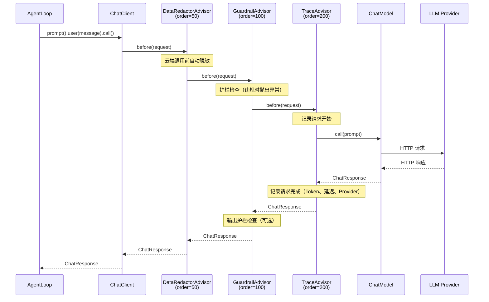

| 顺序 | Advisor | order | 职责 | 适用范围 |
|------|---------|-------|------|---------|
| 1 | `DataRedactorAdvisor` | 50 | 云端调用前自动脱敏敏感数据 | 仅云端 Provider |
| 2 | `GuardrailAdvisor` | 100 | 护栏检查：输入合规性验证、敏感操作拦截 | 所有 Provider |
| 3 | `TraceAdvisor` | 200 | 轨迹记录：记录完整的 LLM 调用链路信息 | 所有 Provider |

**关键设计决策**：

- **DataRedactorAdvisor 仅注入云端 Provider**：本地 Ollama 模型不需要脱敏（数据不出本机），`ProviderAdapterFactory` 在创建 Ollama 适配器时过滤掉 `DataRedactorAdvisor`
- **GuardrailAdvisor 在脱敏之后**：先脱敏再检查护栏，确保护栏引擎看到的是脱敏后的内容
- **TraceAdvisor 最后执行**：记录的是经过所有 Advisor 处理后的最终请求和响应

### 5.6 结构化输出

Spring AI 1.1.2 的结构化输出是 LifePilot 知识提取、意图理解等场景的关键能力。通过 `BeanOutputConverter`，LLM 输出可以直接映射为 Java record。

**两种结构化输出路径**：

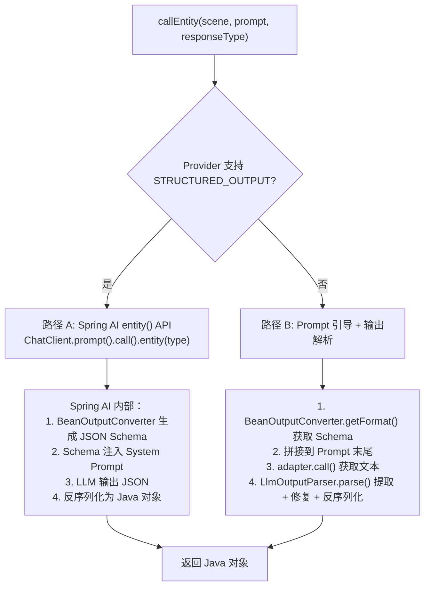

**使用示例**：

```java
/**
 * 知识提取结果 record。
 * 用于 callEntity() 的结构化输出目标类型。
 */
public record ExtractionResult(
    List<ExtractedEntity> entities,
    List<ExtractedRelation> relations,
    double confidence
) {
    public record ExtractedEntity(
        String name, String type, String description,
        Map<String, String> properties
    ) {}

    public record ExtractedRelation(
        String sourceName, String targetName,
        String relationType, double strength
    ) {}
}

// 在 KnowledgeExtractionPipeline 中使用
@Service
public class KnowledgeExtractionPipeline {

    private final LlmRouter llmRouter;

    /** 从对话内容中提取知识实体和关系。 */
    public ExtractionResult extract(String conversationContent) {
        String prompt = """
            请从以下对话内容中提取实体（人物、组织、地点、事件、项目）
            和它们之间的关系。

            对话内容：
            %s
            """.formatted(conversationContent);

        return llmRouter.callEntity(
            LlmScene.KNOWLEDGE_EXTRACTION,
            prompt,
            ExtractionResult.class);
    }
}
```

### 5.7 Provider 特殊说明

#### Ollama（本地模型）

Ollama 是 LifePilot 的首选 Provider，具有以下特殊处理：

- **零成本**：`costPerInputToken = 0`，`costPerOutputToken = 0`，不受预算约束
- **完全隐私**：数据不出本机，不需要 `DataRedactorAdvisor` 脱敏
- **双能力**：同一个 Ollama 服务可以同时提供 Chat 和 Embedding 能力（使用不同模型）
- **模型热切换**：Ollama 支持运行时切换模型，可为不同场景配置不同的本地模型
- **Spring AI 集成**：使用 `spring-ai-ollama` 模块的 `OllamaChatModel` 和 `OllamaEmbeddingModel`

```java
// Ollama 特殊配置示例
var ollamaApi = new OllamaApi("http://localhost:11434");

// Chat 模型
var chatModel = OllamaChatModel.builder()
    .ollamaApi(ollamaApi)
    .defaultOptions(OllamaOptions.builder()
        .model("qwen2.5:7b").temperature(0.7).build())
    .build();

// Embedding 模型（独立配置）
var embeddingModel = OllamaEmbeddingModel.builder()
    .ollamaApi(ollamaApi)
    .defaultOptions(OllamaOptions.builder()
        .model("nomic-embed-text:v1.5").build())
    .build();
```

#### DeepSeek / Qwen / GLM（OpenAI 兼容）

这三个国产 LLM Provider 都兼容 OpenAI Chat Completions API 格式，使用 Spring AI 的 `OpenAiChatModel` 统一适配，只需配置不同的 `baseUrl` 和 `apiKey`。

```java
// DeepSeek 配置示例
var deepseekApi = OpenAiApi.builder()
    .baseUrl("https://api.deepseek.com")
    .apiKey(System.getenv("DEEPSEEK_API_KEY"))
    .build();
var deepseekChat = OpenAiChatModel.builder()
    .openAiApi(deepseekApi)
    .defaultOptions(OpenAiChatOptions.builder()
        .model("deepseek-chat").build())
    .build();

// Qwen 配置示例（通义千问 DashScope 兼容模式）
var qwenApi = OpenAiApi.builder()
    .baseUrl("https://dashscope.aliyuncs.com/compatible-mode")
    .apiKey(System.getenv("QWEN_API_KEY"))
    .build();
var qwenChat = OpenAiChatModel.builder()
    .openAiApi(qwenApi)
    .defaultOptions(OpenAiChatOptions.builder()
        .model("qwen-plus").build())
    .build();
```

**OpenAI 兼容 Provider 的已知差异**：

| 差异点 | DeepSeek | Qwen | GLM | 应对策略 |
|--------|----------|------|-----|---------|
| 结构化输出 | 支持 JSON Mode | 支持 JSON Mode | 部分支持 | 不支持时降级为 prompt 引导 |
| Function Calling | 完整支持 | 完整支持 | 完整支持 | 统一使用 Spring AI Tool 抽象 |
| 流式输出 | 支持 SSE | 支持 SSE | 支持 SSE | 统一使用 `ChatModel.stream()` |
| 最大上下文 | 64K | 128K | 128K | 通过 `maxContextWindow` 配置 |
| 速率限制 | 按 Token/分钟 | 按 QPS | 按 Token/分钟 | 熔断器自动处理 429 错误 |

#### 文心一言（百度专有 API）

文心一言使用百度专有的 API 格式，与 OpenAI API 不兼容。Spring AI 1.1.2 暂无官方支持，LifePilot 使用自定义 `WenxinChatModel` 实现适配。

```java
/**
 * 文心一言 ChatModel 适配器。
 * 实现 Spring AI 的 {@link ChatModel} 接口，封装百度专有 API 调用。
 *
 * <p>注意：当 Spring AI 官方支持文心一言后，此类应替换为官方实现。</p>
 */
public class WenxinChatModel implements ChatModel {

    private static final Logger log = LoggerFactory.getLogger(WenxinChatModel.class);

    private final String apiUrl;
    private final String apiKey;
    private final String modelName;
    private final RestClient restClient;

    public WenxinChatModel(String apiUrl, String apiKey, String modelName) {
        this.apiUrl = apiUrl;
        this.apiKey = apiKey;
        this.modelName = modelName;
        this.restClient = RestClient.builder().baseUrl(apiUrl).build();
        log.info("文心一言 ChatModel 初始化: apiUrl={}, model={}", apiUrl, modelName);
    }

    @Override
    public ChatResponse call(Prompt prompt) {
        // 百度 API 调用实现：
        // 1. 获取 Access Token（缓存机制）
        // 2. 构建请求体（转换 Spring AI Prompt → 百度 API 格式）
        // 3. 发送 HTTP 请求
        // 4. 解析响应（转换百度 API 响应 → Spring AI ChatResponse）
        throw new UnsupportedOperationException(
            "文心一言适配器待实现，请优先使用 OpenAI 兼容 Provider");
    }

    // ... 其他 ChatModel 接口方法
}
```

### 5.8 Spring AI 自动配置集成

LifePilot 不使用 Spring AI 的默认自动配置（`spring-ai-ollama-spring-boot-starter` 等），而是通过 `ProviderAdapterFactory` 手动创建 Spring AI 模型实例。原因是：

1. **多实例管理**：Spring AI 默认自动配置创建单个 `ChatModel` Bean，而 LifePilot 需要同时管理多个 Provider 的多个 `ChatModel` 实例
2. **动态注册**：Provider 可以在运行时动态注册/注销，Spring AI 的自动配置不支持这种动态性
3. **配置统一**：所有 Provider 的配置统一在 `lifepilot.llm.providers` 下管理，而非分散在各个 `spring.ai.*` 前缀下

**Maven 依赖配置**：

```xml
<!-- Spring AI 核心（不使用 starter，手动管理模型实例） -->
<dependency>
    <groupId>org.springframework.ai</groupId>
    <artifactId>spring-ai-core</artifactId>
    <version>1.1.2</version>
</dependency>

<!-- Ollama 模型支持（仅引入模型类，不引入自动配置） -->
<dependency>
    <groupId>org.springframework.ai</groupId>
    <artifactId>spring-ai-ollama</artifactId>
    <version>1.1.2</version>
</dependency>

<!-- OpenAI 兼容模型支持（DeepSeek / Qwen / GLM 复用） -->
<dependency>
    <groupId>org.springframework.ai</groupId>
    <artifactId>spring-ai-openai</artifactId>
    <version>1.1.2</version>
</dependency>
```

**排除默认自动配置**：

```java
@SpringBootApplication(exclude = {
    // 排除 Spring AI 默认自动配置，由 LlmAutoConfiguration 统一管理
    OllamaAutoConfiguration.class,
    OpenAiAutoConfiguration.class
})
public class LifePilotApplication {
    public static void main(String[] args) {
        SpringApplication.run(LifePilotApplication.class, args);
    }
}
```


---

## 6. 熔断器设计

### 6.1 设计思路

熔断器（Circuit Breaker）是 LLM 路由层实现**渐进降级**原则的核心组件。当某个 Provider 持续故障时，熔断器自动将其从路由候选列表中移除，避免无效调用浪费时间和 Token 预算；当故障恢复后，熔断器通过探测机制自动恢复该 Provider。

LifePilot 的熔断器设计借鉴了 [Sierra.ai MMR](https://sierra.ai/blog/model-failover) 的拥塞感知选择器概念，但做了本地化简化——个人用户并发极低，不需要 AIMD 拥塞控制算法，简化为**三态状态机 + 指数退避**即可满足需求。

**核心设计决策**：

| 决策 | 选择 | 理由 |
|------|------|------|
| 隔离粒度 | `providerId:capabilityType` 复合键 | 同一 Provider 的 Chat 故障不应影响 Embedding 能力 |
| 状态持久化 | 写入 `circuit_breaker_states` 表 | 应用重启后恢复状态，避免冲击已故障的 Provider |
| 探测策略 | HALF_OPEN 允许 1 次探测调用 | 单用户场景，1 次探测足以判断恢复 |
| 退避策略 | 指数退避（500ms → 1s → 2s → 5s） | 符合编码规范 §6 重试策略要求 |

### 6.2 CircuitState — 熔断器状态

```java
/**
 * 熔断器状态 sealed interface。
 * 三态状态机：CLOSED → OPEN → HALF_OPEN → CLOSED 循环。
 *
 * <p>使用 sealed interface + record 实现，编译期保证穷举匹配。
 * 每个状态携带不同的上下文信息，通过 pattern matching 安全访问。</p>
 */
public sealed interface CircuitState
    permits CircuitState.Closed, CircuitState.Open, CircuitState.HalfOpen {

    /**
     * 关闭状态 — 正常运行，允许所有调用。
     * 记录连续失败次数，达到阈值时转换为 OPEN。
     *
     * @param consecutiveFailures 连续失败次数（成功时重置为 0）
     */
    record Closed(int consecutiveFailures) implements CircuitState {
        public Closed {
            if (consecutiveFailures < 0) consecutiveFailures = 0;
        }
        /** 初始状态。 */
        public static Closed initial() { return new Closed(0); }
    }

    /**
     * 打开状态 — 熔断触发，拒绝所有调用。
     * 等待 resetTimeout 后自动转换为 HALF_OPEN。
     *
     * @param openedAt     熔断触发时间
     * @param failureCount 触发熔断时的累计失败次数
     */
    record Open(Instant openedAt, int failureCount) implements CircuitState {
        public Open {
            Objects.requireNonNull(openedAt, "熔断触发时间不能为空");
            if (failureCount < 0) failureCount = 0;
        }
    }

    /**
     * 半开状态 — 探测恢复，允许一次测试调用。
     * 探测成功 → CLOSED，探测失败 → OPEN。
     *
     * @param transitionedAt 进入 HALF_OPEN 的时间
     */
    record HalfOpen(Instant transitionedAt) implements CircuitState {
        public HalfOpen {
            Objects.requireNonNull(transitionedAt, "状态转换时间不能为空");
        }
    }

    /** 获取状态名称（用于持久化和日志）。 */
    default String stateName() {
        return switch (this) {
            case Closed c -> "CLOSED";
            case Open o -> "OPEN";
            case HalfOpen h -> "HALF_OPEN";
        };
    }
}
```

### 6.3 状态转换图

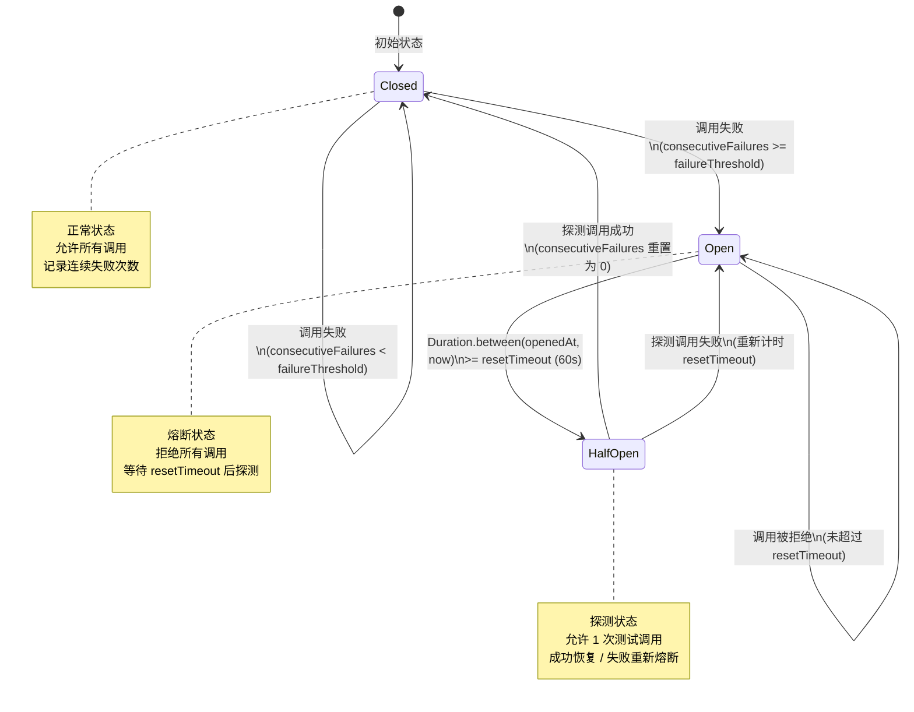

### 6.4 CircuitBreaker — 熔断器实现

```java
/**
 * 单个熔断器实例。
 * 管理一个 {@code providerId:capabilityType} 组合的熔断状态。
 *
 * <p>线程安全：使用 {@link AtomicReference} 存储状态，CAS 操作保证并发安全。</p>
 *
 * <p>状态转换规则：
 * <ul>
 *   <li>CLOSED → OPEN: consecutiveFailures >= failureThreshold</li>
 *   <li>OPEN → HALF_OPEN: 超过 resetTimeout</li>
 *   <li>HALF_OPEN → CLOSED: 探测成功</li>
 *   <li>HALF_OPEN → OPEN: 探测失败</li>
 * </ul></p>
 */
public class CircuitBreaker {

    private static final Logger log = LoggerFactory.getLogger(CircuitBreaker.class);

    private final String key;
    private final int failureThreshold;
    private final Duration resetTimeout;
    private final int halfOpenMaxAttempts;
    private final AtomicReference<CircuitState> state;
    private final AtomicInteger halfOpenAttempts = new AtomicInteger(0);

    /**
     * 创建熔断器。
     *
     * @param key                  复合键（providerId:capabilityType）
     * @param failureThreshold     连续失败阈值（默认 3）
     * @param resetTimeout         OPEN → HALF_OPEN 等待时间（默认 60s）
     * @param halfOpenMaxAttempts  HALF_OPEN 最大探测次数（默认 1）
     */
    public CircuitBreaker(String key, int failureThreshold,
                          Duration resetTimeout, int halfOpenMaxAttempts) {
        this.key = key;
        this.failureThreshold = failureThreshold;
        this.resetTimeout = resetTimeout;
        this.halfOpenMaxAttempts = halfOpenMaxAttempts;
        this.state = new AtomicReference<>(CircuitState.Closed.initial());
    }

    /** 从持久化状态恢复。 */
    public CircuitBreaker(String key, int failureThreshold,
                          Duration resetTimeout, int halfOpenMaxAttempts,
                          CircuitState initialState) {
        this.key = key;
        this.failureThreshold = failureThreshold;
        this.resetTimeout = resetTimeout;
        this.halfOpenMaxAttempts = halfOpenMaxAttempts;
        this.state = new AtomicReference<>(initialState);
    }

    /**
     * 检查是否允许调用。
     * CLOSED / HALF_OPEN（未超过探测次数）→ true，OPEN → 检查是否可转换为 HALF_OPEN。
     */
    public boolean isCallPermitted() {
        CircuitState current = state.get();
        return switch (current) {
            case CircuitState.Closed c -> true;
            case CircuitState.Open o -> {
                // 检查是否超过 resetTimeout，自动转换为 HALF_OPEN
                if (Duration.between(o.openedAt(), Instant.now())
                        .compareTo(resetTimeout) >= 0) {
                    var halfOpen = new CircuitState.HalfOpen(Instant.now());
                    if (state.compareAndSet(current, halfOpen)) {
                        halfOpenAttempts.set(0);
                        log.info("熔断器状态转换: key={}, OPEN → HALF_OPEN", key);
                        yield true;
                    }
                    // CAS 失败，重新检查
                    yield isCallPermitted();
                }
                yield false;
            }
            case CircuitState.HalfOpen h -> {
                // HALF_OPEN 状态下，限制探测次数
                yield halfOpenAttempts.get() < halfOpenMaxAttempts;
            }
        };
    }

    /** 记录调用成功。 */
    public void recordSuccess() {
        CircuitState current = state.get();
        switch (current) {
            case CircuitState.Closed c -> {
                // 成功时重置连续失败计数
                if (c.consecutiveFailures() > 0) {
                    state.set(CircuitState.Closed.initial());
                }
            }
            case CircuitState.HalfOpen h -> {
                // 探测成功，恢复为 CLOSED
                state.set(CircuitState.Closed.initial());
                halfOpenAttempts.set(0);
                log.info("熔断器恢复: key={}, HALF_OPEN → CLOSED", key);
            }
            case CircuitState.Open o -> {
                // OPEN 状态下不应有成功调用（理论上不会到达这里）
                log.warn("熔断器异常: key={}, OPEN 状态下收到成功记录", key);
            }
        }
    }

    /** 记录调用失败。 */
    public void recordFailure() {
        CircuitState current = state.get();
        switch (current) {
            case CircuitState.Closed c -> {
                int newFailures = c.consecutiveFailures() + 1;
                if (newFailures >= failureThreshold) {
                    // 达到阈值，触发熔断
                    var open = new CircuitState.Open(Instant.now(), newFailures);
                    state.set(open);
                    log.warn("熔断器触发: key={}, 连续失败={}, CLOSED → OPEN",
                        key, newFailures);
                } else {
                    state.set(new CircuitState.Closed(newFailures));
                    log.debug("熔断器失败计数: key={}, 连续失败={}/{}",
                        key, newFailures, failureThreshold);
                }
            }
            case CircuitState.HalfOpen h -> {
                // 探测失败，重新熔断
                halfOpenAttempts.incrementAndGet();
                var open = new CircuitState.Open(Instant.now(),
                    failureThreshold);
                state.set(open);
                log.warn("熔断器探测失败: key={}, HALF_OPEN → OPEN", key);
            }
            case CircuitState.Open o -> {
                // OPEN 状态下不应有失败调用（调用应被拒绝）
                log.debug("熔断器: key={}, OPEN 状态下收到失败记录（忽略）", key);
            }
        }
    }

    /** 获取当前状态。 */
    public CircuitState getState() { return state.get(); }

    /** 获取复合键。 */
    public String key() { return key; }

    /** 强制重置为 CLOSED 状态（管理接口使用）。 */
    public void reset() {
        state.set(CircuitState.Closed.initial());
        halfOpenAttempts.set(0);
        log.info("熔断器手动重置: key={}", key);
    }
}
```

### 6.5 CircuitBreakerManager — 熔断器管理器

```java
/**
 * 熔断器管理器。
 * 以 {@code providerId:capabilityType} 复合键隔离熔断器实例。
 *
 * <p>能力隔离的意义：DeepSeek 的 Chat API 故障不应影响其 Embedding API 的正常使用。
 * 例如 "deepseek-chat:chat" 和 "deepseek-chat:embedding" 是两个独立的熔断器。</p>
 *
 * <p>持久化：定期将熔断器状态快照写入 {@code circuit_breaker_states} 表，
 * 应用重启后从表中恢复状态，避免重启后立即冲击已故障的 Provider。</p>
 */
@Service
public class CircuitBreakerManager {

    private static final Logger log =
        LoggerFactory.getLogger(CircuitBreakerManager.class);

    private final ConcurrentHashMap<String, CircuitBreaker> breakers =
        new ConcurrentHashMap<>();
    private final LlmConfigProperties.CircuitBreakerConfig config;
    private final JdbcTemplate jdbcTemplate;
    private final WriteSerializer writeSerializer;

    public CircuitBreakerManager(LlmConfigProperties.CircuitBreakerConfig config,
                                 JdbcTemplate jdbcTemplate,
                                 WriteSerializer writeSerializer) {
        this.config = config;
        this.jdbcTemplate = jdbcTemplate;
        this.writeSerializer = writeSerializer;
        restoreFromDatabase();
        log.info("熔断器管理器初始化: failureThreshold={}, resetTimeout={}s, 已恢复={}",
            config.failureThreshold(), config.resetTimeoutSeconds(), breakers.size());
    }

    /** 检查是否允许调用。 */
    public boolean isCallPermitted(String providerId, String capabilityType) {
        String key = compositeKey(providerId, capabilityType);
        return getOrCreate(key).isCallPermitted();
    }

    /** 记录调用成功。 */
    public void recordSuccess(String providerId, String capabilityType) {
        String key = compositeKey(providerId, capabilityType);
        CircuitBreaker breaker = getOrCreate(key);
        CircuitState before = breaker.getState();
        breaker.recordSuccess();
        CircuitState after = breaker.getState();
        // 状态变更时持久化
        if (!before.stateName().equals(after.stateName())) {
            persistState(key, breaker);
        }
    }

    /** 记录调用失败。 */
    public void recordFailure(String providerId, String capabilityType) {
        String key = compositeKey(providerId, capabilityType);
        CircuitBreaker breaker = getOrCreate(key);
        CircuitState before = breaker.getState();
        breaker.recordFailure();
        CircuitState after = breaker.getState();
        // 状态变更时持久化
        if (!before.stateName().equals(after.stateName())) {
            persistState(key, breaker);
        }
    }

    /** 获取指定 Provider:Capability 的熔断器状态。 */
    public CircuitState getState(String providerId, String capabilityType) {
        String key = compositeKey(providerId, capabilityType);
        return getOrCreate(key).getState();
    }

    /** 获取所有熔断器状态快照。 */
    public Map<String, CircuitState> getAllStates() {
        Map<String, CircuitState> snapshot = new HashMap<>();
        breakers.forEach((key, breaker) -> snapshot.put(key, breaker.getState()));
        return Map.copyOf(snapshot);
    }

    /** 手动重置指定熔断器。 */
    public void reset(String providerId, String capabilityType) {
        String key = compositeKey(providerId, capabilityType);
        CircuitBreaker breaker = breakers.get(key);
        if (breaker != null) {
            breaker.reset();
            persistState(key, breaker);
        }
    }

    // ==================== 内部方法 ====================

    /** 生成复合键。 */
    private String compositeKey(String providerId, String capabilityType) {
        return providerId + ":" + capabilityType;
    }

    /** 获取或创建熔断器实例。 */
    private CircuitBreaker getOrCreate(String key) {
        return breakers.computeIfAbsent(key, k -> new CircuitBreaker(
            k,
            config.failureThreshold(),
            Duration.ofSeconds(config.resetTimeoutSeconds()),
            config.halfOpenMaxAttempts()));
    }

    /** 从数据库恢复熔断器状态。 */
    private void restoreFromDatabase() {
        try {
            List<Map<String, Object>> rows = jdbcTemplate.queryForList(
                "SELECT provider_capability, state, failure_count, state_changed_at "
                + "FROM circuit_breaker_states");
            for (Map<String, Object> row : rows) {
                String key = (String) row.get("provider_capability");
                String stateName = (String) row.get("state");
                int failureCount = ((Number) row.get("failure_count")).intValue();
                String changedAt = (String) row.get("state_changed_at");
                Instant changedInstant = Instant.parse(changedAt);

                CircuitState restoredState = switch (stateName) {
                    case "CLOSED" -> new CircuitState.Closed(failureCount);
                    case "OPEN" -> new CircuitState.Open(changedInstant, failureCount);
                    case "HALF_OPEN" -> new CircuitState.HalfOpen(changedInstant);
                    default -> {
                        log.warn("未知的熔断器状态: key={}, state={}", key, stateName);
                        yield CircuitState.Closed.initial();
                    }
                };

                breakers.put(key, new CircuitBreaker(
                    key,
                    config.failureThreshold(),
                    Duration.ofSeconds(config.resetTimeoutSeconds()),
                    config.halfOpenMaxAttempts(),
                    restoredState));
                log.debug("熔断器状态恢复: key={}, state={}", key, stateName);
            }
        } catch (Exception e) {
            log.warn("熔断器状态恢复失败（首次启动或表不存在）: {}", e.getMessage());
        }
    }

    /** 异步持久化熔断器状态。 */
    private void persistState(String key, CircuitBreaker breaker) {
        writeSerializer.writeVoid(() -> {
            CircuitState current = breaker.getState();
            int failureCount = switch (current) {
                case CircuitState.Closed c -> c.consecutiveFailures();
                case CircuitState.Open o -> o.failureCount();
                case CircuitState.HalfOpen h -> 0;
            };
            String now = Instant.now().toString();
            jdbcTemplate.update("""
                INSERT INTO circuit_breaker_states
                    (provider_capability, state, failure_count,
                     last_failure_at, state_changed_at, updated_at)
                VALUES (?, ?, ?, ?, ?, ?)
                ON CONFLICT(provider_capability) DO UPDATE SET
                    state = excluded.state,
                    failure_count = excluded.failure_count,
                    last_failure_at = CASE WHEN excluded.state IN ('OPEN','HALF_OPEN')
                        THEN excluded.last_failure_at
                        ELSE circuit_breaker_states.last_failure_at END,
                    state_changed_at = excluded.state_changed_at,
                    updated_at = excluded.updated_at
                """,
                key, current.stateName(), failureCount, now, now, now);
        });
    }
}
```

### 6.6 指数退避策略

熔断器与路由层的故障转移循环配合使用指数退避策略，符合编码规范 §6 的重试要求：

```java
/**
 * 指数退避计算器。
 * 初始延迟 500ms，倍数 2.0，上限 5000ms，最多重试 2 次。
 *
 * <p>退避序列：500ms → 1000ms → 2000ms → 4000ms → 5000ms（上限截断）</p>
 */
public record ExponentialBackoff(
    long initialDelayMs,
    double multiplier,
    long maxDelayMs,
    int maxRetries
) {
    /** 默认配置（符合编码规范 §6）。 */
    public static ExponentialBackoff defaults() {
        return new ExponentialBackoff(500, 2.0, 5000, 2);
    }

    /** 从配置创建。 */
    public static ExponentialBackoff from(
            LlmConfigProperties.CircuitBreakerConfig config) {
        return new ExponentialBackoff(
            config.retryInitialDelayMs(),
            config.retryMultiplier(),
            config.retryMaxDelayMs(),
            2);
    }

    /** 计算第 n 次重试的延迟（0-indexed）。 */
    public long delayForAttempt(int attempt) {
        if (attempt <= 0) return initialDelayMs;
        long delay = (long) (initialDelayMs * Math.pow(multiplier, attempt));
        return Math.min(delay, maxDelayMs);
    }

    /** 执行退避等待。 */
    public void backoff(int attempt) throws InterruptedException {
        long delay = delayForAttempt(attempt);
        Thread.sleep(delay);
    }
}
```

### 6.7 持久化 Schema

熔断器状态持久化到 `circuit_breaker_states` 表（定义于 [data-model.md](data-model.md)）：

```sql
-- 熔断器状态持久化表
CREATE TABLE IF NOT EXISTS circuit_breaker_states (
    provider_capability TEXT PRIMARY KEY,   -- 复合键 "providerId:capabilityType"
    state               TEXT NOT NULL DEFAULT 'CLOSED'
                         CHECK (state IN ('CLOSED', 'OPEN', 'HALF_OPEN')),
    failure_count       INTEGER NOT NULL DEFAULT 0,
    last_failure_at     TEXT,               -- 最后失败时间 ISO 8601
    state_changed_at    TEXT NOT NULL,       -- 状态变更时间 ISO 8601
    updated_at          TEXT NOT NULL        -- 最后更新时间 ISO 8601
);
```

### 6.8 jqwik 属性测试

```java
/**
 * 熔断器状态机属性测试。
 * 使用 jqwik 验证熔断器状态转换的不变量。
 */
class CircuitBreakerPropertyTest {

    private static final int FAILURE_THRESHOLD = 3;
    private static final Duration RESET_TIMEOUT = Duration.ofSeconds(60);

    /**
     * 属性：状态转换遵循 CLOSED → OPEN → HALF_OPEN → CLOSED 循环。
     * 不存在 CLOSED → HALF_OPEN 或 OPEN → CLOSED 的直接跳转。
     */
    @Property
    void 状态转换遵循单调循环(
            @ForAll("operationSequence") List<String> operations) {
        var breaker = new CircuitBreaker(
            "test:chat", FAILURE_THRESHOLD, RESET_TIMEOUT, 1);

        String previousState = "CLOSED";
        for (String op : operations) {
            switch (op) {
                case "success" -> breaker.recordSuccess();
                case "failure" -> breaker.recordFailure();
            }
            String currentState = breaker.getState().stateName();

            // 验证不存在非法的直接跳转
            if (previousState.equals("CLOSED") && currentState.equals("HALF_OPEN")) {
                throw new AssertionError(
                    "非法转换: CLOSED → HALF_OPEN（必须经过 OPEN）");
            }
            if (previousState.equals("OPEN") && currentState.equals("CLOSED")) {
                throw new AssertionError(
                    "非法转换: OPEN → CLOSED（必须经过 HALF_OPEN）");
            }
            previousState = currentState;
        }
    }

    /**
     * 属性：CLOSED 状态下，连续失败次数不会超过 failureThreshold 而不触发 OPEN。
     * 即：如果 consecutiveFailures >= failureThreshold，状态必须是 OPEN。
     */
    @Property
    void 失败计数达到阈值必须触发熔断(
            @ForAll @IntRange(min = 0, max = 20) int failureCount) {
        var breaker = new CircuitBreaker(
            "test:chat", FAILURE_THRESHOLD, RESET_TIMEOUT, 1);

        for (int i = 0; i < failureCount; i++) {
            breaker.recordFailure();
        }

        CircuitState state = breaker.getState();
        if (failureCount >= FAILURE_THRESHOLD) {
            // 达到阈值后必须是 OPEN 状态
            assertThat(state).isInstanceOf(CircuitState.Open.class);
        } else {
            // 未达到阈值必须是 CLOSED 状态
            assertThat(state).isInstanceOf(CircuitState.Closed.class);
            var closed = (CircuitState.Closed) state;
            assertThat(closed.consecutiveFailures()).isEqualTo(failureCount);
        }
    }

    /**
     * 属性：HALF_OPEN 状态下，最多允许 halfOpenMaxAttempts 次探测调用。
     * 超过探测次数后，isCallPermitted() 返回 false。
     */
    @Property
    void HALF_OPEN状态限制探测次数(
            @ForAll @IntRange(min = 1, max = 5) int maxAttempts) {
        var breaker = new CircuitBreaker(
            "test:chat", FAILURE_THRESHOLD, Duration.ZERO, maxAttempts);

        // 触发熔断
        for (int i = 0; i < FAILURE_THRESHOLD; i++) {
            breaker.recordFailure();
        }
        assertThat(breaker.getState()).isInstanceOf(CircuitState.Open.class);

        // resetTimeout=0，立即转换为 HALF_OPEN
        assertThat(breaker.isCallPermitted()).isTrue();
        assertThat(breaker.getState()).isInstanceOf(CircuitState.HalfOpen.class);

        // 消耗所有探测次数（每次失败后重新进入 OPEN，再转 HALF_OPEN）
        for (int i = 0; i < maxAttempts; i++) {
            // 第 i 次探测应该被允许
            if (i > 0) {
                // 前一次失败后回到 OPEN，需要再次 isCallPermitted 转 HALF_OPEN
                assertThat(breaker.isCallPermitted()).isTrue();
            }
            breaker.recordFailure(); // 探测失败，回到 OPEN
        }

        // 最后一次失败后回到 OPEN，resetTimeout=0 所以立即可以再次探测
        // 但这验证了每次 HALF_OPEN 只允许有限次探测
        assertThat(breaker.getState()).isInstanceOf(CircuitState.Open.class);
    }

    /**
     * 属性：成功调用总是将 consecutiveFailures 重置为 0。
     */
    @Property
    void 成功调用重置失败计数(
            @ForAll @IntRange(min = 0, max = 2) int failuresBefore) {
        var breaker = new CircuitBreaker(
            "test:chat", FAILURE_THRESHOLD, RESET_TIMEOUT, 1);

        // 先制造一些失败（但不触发熔断）
        for (int i = 0; i < failuresBefore; i++) {
            breaker.recordFailure();
        }

        // 成功调用
        breaker.recordSuccess();

        // 验证状态为 CLOSED 且失败计数为 0
        CircuitState state = breaker.getState();
        assertThat(state).isInstanceOf(CircuitState.Closed.class);
        assertThat(((CircuitState.Closed) state).consecutiveFailures()).isEqualTo(0);
    }

    @Provide
    Arbitrary<List<String>> operationSequence() {
        return Arbitraries.of("success", "failure")
            .list().ofMinSize(1).ofMaxSize(50);
    }
}
```


---

## 7. 语义缓存

### 7.1 设计思路

语义缓存（Semantic Cache）是 LLM 路由层实现**成本优化**的核心组件。与传统的精确匹配缓存不同，语义缓存基于 prompt 的**语义相似度**进行匹配——即使用户的措辞不同，只要语义足够接近（余弦相似度 ≥ 0.92），就可以复用之前的 LLM 响应，实现零 Token 消耗。

**学术参考**：

- [Verified Semantic Prompt Caching (arXiv 2502.03771)](https://arxiv.org/abs/2502.03771)：提出了基于语义验证的 prompt 缓存框架，通过 embedding 相似度判断缓存命中，并引入验证机制确保缓存响应的语义正确性
- [Reducing LLM Costs via Semantic Embedding Caching (arXiv 2411.05276)](https://arxiv.org/abs/2411.05276)：实验表明语义缓存可以在保持 95%+ 响应质量的前提下，减少 30-50% 的 LLM API 调用成本

**LifePilot 的语义缓存特点**：

| 特点 | 说明 |
|------|------|
| 双库存储 | 结构化数据在主库 `llm_cache` 表，向量索引在 `vectors.db` 的 `llm_cache_vectors` 表 |
| 场景隔离 | 不同场景的缓存独立，避免跨场景误命中 |
| 可调阈值 | 相似度阈值可按场景配置（知识提取 0.95，通用对话 0.92） |
| TTL 过期 | 缓存条目有 TTL（默认 3600s），过期自动失效 |
| 命中统计 | 记录命中次数和命中率，用于成本优化分析 |

### 7.2 缓存查询流程

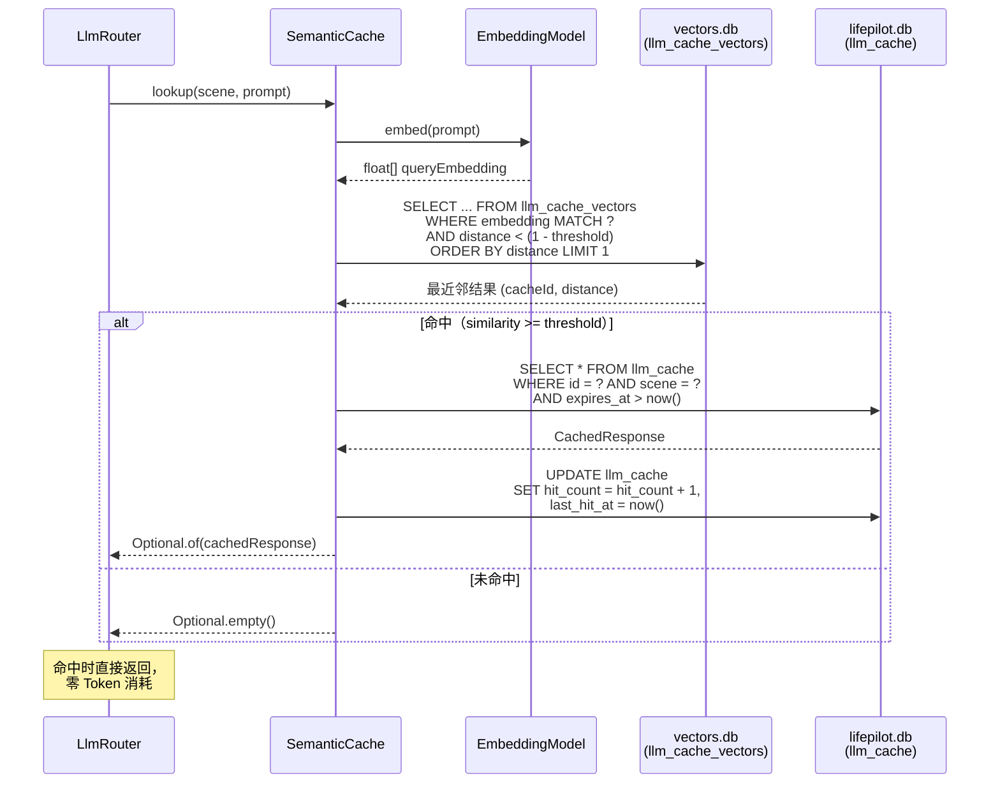

### 7.3 CachedResponse — 缓存响应记录

```java
/**
 * 语义缓存响应 record。
 * 存储 LLM 响应内容及其元数据，用于缓存命中时直接返回。
 *
 * @param id          缓存条目 UUID
 * @param scene       调用场景
 * @param promptHash  原始 prompt 的 SHA-256 哈希（用于精确匹配快速路径）
 * @param content     LLM 响应内容
 * @param providerId  生成此响应的 Provider ID
 * @param modelName   生成此响应的模型名称
 * @param cachedAt    缓存时间
 * @param expiresAt   过期时间
 * @param hitCount    命中次数
 * @param lastHitAt   最后命中时间
 * @param similarity  查询时的相似度（仅在 lookup 返回时填充）
 */
public record CachedResponse(
    String id,
    String scene,
    String promptHash,
    String content,
    String providerId,
    String modelName,
    Instant cachedAt,
    Instant expiresAt,
    int hitCount,
    @Nullable Instant lastHitAt,
    @Nullable Double similarity
) {
    /** 转换为 LlmResponse（缓存命中时使用）。 */
    public LlmResponse toLlmResponse() {
        return LlmResponse.cached(content, providerId, modelName);
    }
}
```

### 7.4 CacheStats — 缓存统计记录

```java
/**
 * 语义缓存统计 record。
 *
 * @param totalEntries   总缓存条目数
 * @param hitCount       累计命中次数
 * @param missCount      累计未命中次数
 * @param hitRate        命中率（0.0 ~ 1.0）
 * @param avgSimilarity  平均命中相似度
 * @param totalSavedCents 缓存命中节省的估算成本（分）
 */
public record CacheStats(
    int totalEntries,
    long hitCount,
    long missCount,
    double hitRate,
    double avgSimilarity,
    int totalSavedCents
) {
    public long totalQueries() { return hitCount + missCount; }
}
```

### 7.5 存储 Schema

#### 主库 `llm_cache` 表

```sql
-- 语义缓存结构化数据（主库 lifepilot.db）
CREATE TABLE IF NOT EXISTS llm_cache (
    id              TEXT PRIMARY KEY,       -- UUID
    scene           TEXT NOT NULL,           -- 调用场景
    prompt_hash     TEXT NOT NULL,           -- prompt SHA-256 哈希
    prompt_text     TEXT NOT NULL,           -- 原始 prompt 文本（用于调试和精确匹配）
    content         TEXT NOT NULL,           -- LLM 响应内容
    provider_id     TEXT NOT NULL,           -- 生成响应的 Provider ID
    model_name      TEXT NOT NULL,           -- 生成响应的模型名称
    input_tokens    INTEGER DEFAULT 0,       -- 原始调用的输入 Token 数
    output_tokens   INTEGER DEFAULT 0,       -- 原始调用的输出 Token 数
    cost_cents      INTEGER DEFAULT 0,       -- 原始调用的成本（分）
    hit_count       INTEGER DEFAULT 0,       -- 命中次数
    last_hit_at     TEXT,                    -- 最后命中时间 ISO 8601
    cached_at       TEXT NOT NULL,           -- 缓存时间 ISO 8601
    expires_at      TEXT NOT NULL,           -- 过期时间 ISO 8601
    created_at      TEXT NOT NULL            -- 创建时间 ISO 8601
);

-- 场景 + 过期时间索引（缓存查询和清理）
CREATE INDEX IF NOT EXISTS idx_llm_cache_scene
    ON llm_cache(scene, expires_at);

-- prompt 哈希索引（精确匹配快速路径）
CREATE INDEX IF NOT EXISTS idx_llm_cache_hash
    ON llm_cache(prompt_hash, scene);

-- 过期清理索引
CREATE INDEX IF NOT EXISTS idx_llm_cache_expires
    ON llm_cache(expires_at) WHERE expires_at IS NOT NULL;
```

#### 向量库 `llm_cache_vectors` 表

```sql
-- 语义缓存向量索引（向量库 vectors.db）
-- sqlite-vec 的 vec0 虚拟表，存储 prompt embedding
CREATE VIRTUAL TABLE IF NOT EXISTS llm_cache_vectors USING vec0(
    cache_id TEXT PRIMARY KEY,              -- 关联 llm_cache.id
    embedding FLOAT[768]                    -- prompt embedding 向量（维度与 Embedding 模型一致）
);
```

### 7.6 SemanticCache — 完整实现

```java
/**
 * 语义缓存服务。
 * 基于 prompt 语义相似度缓存 LLM 响应，减少重复调用成本。
 *
 * <p>查询流程：
 * <ol>
 *   <li>精确匹配快速路径：SHA-256 哈希匹配（O(1)，覆盖完全相同的 prompt）</li>
 *   <li>语义匹配：embed prompt → sqlite-vec KNN 查询 → 相似度阈值过滤</li>
 * </ol></p>
 *
 * <p>存储架构：
 * <ul>
 *   <li>结构化数据：主库 {@code llm_cache} 表</li>
 *   <li>向量索引：向量库 {@code llm_cache_vectors} vec0 表</li>
 * </ul></p>
 *
 * <p>参考：
 * <ul>
 *   <li><a href="https://arxiv.org/abs/2502.03771">Verified Semantic Prompt Caching</a></li>
 *   <li><a href="https://arxiv.org/abs/2411.05276">Reducing LLM Costs via Semantic Embedding Caching</a></li>
 * </ul></p>
 */
@Service
public class SemanticCache {

    private static final Logger log = LoggerFactory.getLogger(SemanticCache.class);

    private final LlmConfigProperties.CacheConfig config;
    private final JdbcTemplate mainJdbc;
    private final JdbcTemplate vectorJdbc;
    private final WriteSerializer writeSerializer;
    private final EmbeddingModel embeddingModel;

    /** 场景级相似度阈值覆盖。 */
    private final Map<String, Double> sceneThresholds = Map.of(
        LlmScene.KNOWLEDGE_EXTRACTION, 0.95,
        LlmScene.INTENT_UNDERSTANDING, 0.93,
        LlmScene.TASK_PLANNING, 0.90,
        LlmScene.CHAT, 0.92,
        LlmScene.PROACTIVE_REASONING, 0.88
    );

    /** 缓存统计计数器。 */
    private final AtomicLong hitCounter = new AtomicLong(0);
    private final AtomicLong missCounter = new AtomicLong(0);
    private final AtomicReference<Double> avgSimilarity =
        new AtomicReference<>(0.0);

    public SemanticCache(LlmConfigProperties.CacheConfig config,
                         JdbcTemplate mainJdbc,
                         JdbcTemplate vectorJdbc,
                         WriteSerializer writeSerializer,
                         EmbeddingModel embeddingModel) {
        this.config = config;
        this.mainJdbc = mainJdbc;
        this.vectorJdbc = vectorJdbc;
        this.writeSerializer = writeSerializer;
        this.embeddingModel = embeddingModel;
        log.info("语义缓存初始化: enabled={}, threshold={}, ttl={}s, maxEntries={}",
            config.enabled(), config.similarityThreshold(),
            config.ttlSeconds(), config.maxEntries());
    }

    /**
     * 查询语义缓存。
     *
     * <p>两阶段查询：
     * <ol>
     *   <li>精确匹配：SHA-256 哈希 → 直接命中（最快路径）</li>
     *   <li>语义匹配：embedding → sqlite-vec KNN → 相似度过滤</li>
     * </ol></p>
     *
     * @param scene  调用场景
     * @param prompt 用户 prompt
     * @return 缓存响应（命中时），或 empty（未命中时）
     */
    public Optional<CachedResponse> lookup(String scene, String prompt) {
        if (!config.enabled()) return Optional.empty();

        String now = Instant.now().toString();

        // 阶段 1: 精确匹配快速路径
        String promptHash = sha256(prompt);
        Optional<CachedResponse> exactMatch = lookupByHash(scene, promptHash, now);
        if (exactMatch.isPresent()) {
            hitCounter.incrementAndGet();
            updateHitStats(exactMatch.get().id(), 1.0);
            log.debug("语义缓存精确命中: scene={}, hash={}", scene, promptHash);
            return exactMatch;
        }

        // 阶段 2: 语义匹配
        try {
            float[] queryEmbedding = embeddingModel.embed(prompt);
            double threshold = sceneThresholds
                .getOrDefault(scene, config.similarityThreshold());

            // sqlite-vec 使用 L2 距离，需要转换：
            // cosine_similarity = 1 - (l2_distance^2 / 2)（归一化向量）
            // 简化：直接用距离阈值 = sqrt(2 * (1 - threshold))
            double maxDistance = Math.sqrt(2.0 * (1.0 - threshold));

            // KNN 查询
            List<Map<String, Object>> results = vectorJdbc.queryForList("""
                SELECT cache_id, distance
                FROM llm_cache_vectors
                WHERE embedding MATCH ?
                  AND k = 1
                ORDER BY distance
                LIMIT 1
                """, serializeEmbedding(queryEmbedding));

            if (results.isEmpty()) {
                missCounter.incrementAndGet();
                return Optional.empty();
            }

            String cacheId = (String) results.getFirst().get("cache_id");
            double distance = ((Number) results.getFirst().get("distance"))
                .doubleValue();

            if (distance > maxDistance) {
                missCounter.incrementAndGet();
                log.debug("语义缓存未命中（距离超阈值）: scene={}, distance={}, max={}",
                    scene, distance, maxDistance);
                return Optional.empty();
            }

            // 从主库获取缓存内容
            double similarity = 1.0 - (distance * distance / 2.0);
            Optional<CachedResponse> cached = loadFromMainDb(cacheId, scene, now,
                similarity);
            if (cached.isPresent()) {
                hitCounter.incrementAndGet();
                updateHitStats(cacheId, similarity);
                log.debug("语义缓存命中: scene={}, similarity={}, cacheId={}",
                    scene, String.format("%.4f", similarity), cacheId);
            } else {
                missCounter.incrementAndGet();
            }
            return cached;
        } catch (Exception e) {
            missCounter.incrementAndGet();
            log.warn("语义缓存查询异常: scene={}, 错误={}", scene, e.getMessage());
            return Optional.empty();
        }
    }

    /**
     * 存储缓存条目。
     * 异步写入主库和向量库。
     *
     * @param scene     调用场景
     * @param prompt    原始 prompt
     * @param response  LLM 响应
     * @param embedding prompt embedding（为 null 时自动生成）
     */
    public void store(String scene, String prompt, LlmResponse response,
                      @Nullable float[] embedding) {
        if (!config.enabled()) return;

        writeSerializer.writeVoid(() -> {
            try {
                String id = UUID.randomUUID().toString();
                String promptHash = sha256(prompt);
                Instant now = Instant.now();
                Instant expiresAt = now.plusSeconds(config.ttlSeconds());

                // 写入主库
                mainJdbc.update("""
                    INSERT INTO llm_cache
                        (id, scene, prompt_hash, prompt_text, content,
                         provider_id, model_name, input_tokens, output_tokens,
                         cost_cents, hit_count, cached_at, expires_at, created_at)
                    VALUES (?, ?, ?, ?, ?, ?, ?, ?, ?, ?, 0, ?, ?, ?)
                    ON CONFLICT(id) DO NOTHING
                    """,
                    id, scene, promptHash, prompt, response.content(),
                    response.providerId(), response.modelName(),
                    response.inputTokens(), response.outputTokens(),
                    0, // cost_cents 由调用方计算
                    now.toString(), expiresAt.toString(), now.toString());

                // 生成 embedding（如果未提供）
                float[] vec = embedding != null
                    ? embedding : embeddingModel.embed(prompt);

                // 写入向量库
                vectorJdbc.update("""
                    INSERT INTO llm_cache_vectors (cache_id, embedding)
                    VALUES (?, ?)
                    """, id, serializeEmbedding(vec));

                // 检查是否超过最大条目数，清理最旧的
                evictIfNeeded();

                log.debug("语义缓存存储: scene={}, id={}, expiresAt={}",
                    scene, id, expiresAt);
            } catch (Exception e) {
                log.warn("语义缓存存储失败: scene={}, 错误={}", scene, e.getMessage());
            }
        });
    }

    /**
     * 按场景失效缓存。
     * 当场景相关的数据发生变化时（如知识库更新），主动失效该场景的缓存。
     *
     * @param scene 要失效的场景（null 表示失效所有缓存）
     */
    public void invalidate(@Nullable String scene) {
        writeSerializer.writeVoid(() -> {
            if (scene != null) {
                // 获取要删除的缓存 ID
                List<String> cacheIds = mainJdbc.queryForList(
                    "SELECT id FROM llm_cache WHERE scene = ?",
                    String.class, scene);
                // 删除主库
                mainJdbc.update("DELETE FROM llm_cache WHERE scene = ?", scene);
                // 删除向量库
                for (String cacheId : cacheIds) {
                    vectorJdbc.update(
                        "DELETE FROM llm_cache_vectors WHERE cache_id = ?",
                        cacheId);
                }
                log.info("语义缓存场景失效: scene={}, 删除条目={}", scene, cacheIds.size());
            } else {
                mainJdbc.update("DELETE FROM llm_cache");
                vectorJdbc.update("DELETE FROM llm_cache_vectors");
                log.info("语义缓存全量失效");
            }
        });
    }

    /**
     * 手动失效指定缓存条目。
     */
    public void invalidateById(String cacheId) {
        writeSerializer.writeVoid(() -> {
            mainJdbc.update("DELETE FROM llm_cache WHERE id = ?", cacheId);
            vectorJdbc.update(
                "DELETE FROM llm_cache_vectors WHERE cache_id = ?", cacheId);
            log.debug("语义缓存条目失效: id={}", cacheId);
        });
    }

    /** 获取缓存统计信息。 */
    public CacheStats getStats() {
        int totalEntries = mainJdbc.queryForObject(
            "SELECT COUNT(*) FROM llm_cache WHERE expires_at > ?",
            Integer.class, Instant.now().toString());
        long hits = hitCounter.get();
        long misses = missCounter.get();
        long total = hits + misses;
        double hitRate = total > 0 ? (double) hits / total : 0.0;
        double avg = avgSimilarity.get();

        // 估算节省成本
        int savedCents = mainJdbc.queryForObject("""
            SELECT COALESCE(SUM(cost_cents * hit_count), 0)
            FROM llm_cache WHERE hit_count > 0
            """, Integer.class);

        return new CacheStats(totalEntries, hits, misses, hitRate, avg, savedCents);
    }

    // ==================== 内部方法 ====================

    /** 通过 SHA-256 哈希精确匹配。 */
    private Optional<CachedResponse> lookupByHash(String scene, String hash,
                                                   String now) {
        try {
            List<Map<String, Object>> rows = mainJdbc.queryForList("""
                SELECT id, scene, prompt_hash, content, provider_id, model_name,
                       cached_at, expires_at, hit_count, last_hit_at
                FROM llm_cache
                WHERE prompt_hash = ? AND scene = ? AND expires_at > ?
                LIMIT 1
                """, hash, scene, now);
            if (rows.isEmpty()) return Optional.empty();
            return Optional.of(mapToCachedResponse(rows.getFirst(), 1.0));
        } catch (Exception e) {
            return Optional.empty();
        }
    }

    /** 从主库加载缓存内容。 */
    private Optional<CachedResponse> loadFromMainDb(String cacheId, String scene,
                                                     String now, double similarity) {
        try {
            List<Map<String, Object>> rows = mainJdbc.queryForList("""
                SELECT id, scene, prompt_hash, content, provider_id, model_name,
                       cached_at, expires_at, hit_count, last_hit_at
                FROM llm_cache
                WHERE id = ? AND scene = ? AND expires_at > ?
                """, cacheId, scene, now);
            if (rows.isEmpty()) return Optional.empty();
            return Optional.of(mapToCachedResponse(rows.getFirst(), similarity));
        } catch (Exception e) {
            return Optional.empty();
        }
    }

    /** 更新命中统计。 */
    private void updateHitStats(String cacheId, double similarity) {
        writeSerializer.writeVoid(() -> {
            mainJdbc.update("""
                UPDATE llm_cache
                SET hit_count = hit_count + 1, last_hit_at = ?
                WHERE id = ?
                """, Instant.now().toString(), cacheId);
        });
        // 更新平均相似度（指数移动平均）
        avgSimilarity.updateAndGet(avg -> avg * 0.9 + similarity * 0.1);
    }

    /** 超过最大条目数时清理最旧的缓存。 */
    private void evictIfNeeded() {
        int count = mainJdbc.queryForObject(
            "SELECT COUNT(*) FROM llm_cache", Integer.class);
        if (count <= config.maxEntries()) return;

        int toEvict = count - config.maxEntries() + (config.maxEntries() / 10);
        List<String> evictIds = mainJdbc.queryForList("""
            SELECT id FROM llm_cache
            ORDER BY last_hit_at ASC NULLS FIRST, cached_at ASC
            LIMIT ?
            """, String.class, toEvict);

        for (String id : evictIds) {
            mainJdbc.update("DELETE FROM llm_cache WHERE id = ?", id);
            vectorJdbc.update(
                "DELETE FROM llm_cache_vectors WHERE cache_id = ?", id);
        }
        log.info("语义缓存清理: 删除条目={}, 剩余={}", evictIds.size(), count - evictIds.size());
    }

    /** 将数据库行映射为 CachedResponse。 */
    private CachedResponse mapToCachedResponse(Map<String, Object> row,
                                                double similarity) {
        return new CachedResponse(
            (String) row.get("id"),
            (String) row.get("scene"),
            (String) row.get("prompt_hash"),
            (String) row.get("content"),
            (String) row.get("provider_id"),
            (String) row.get("model_name"),
            Instant.parse((String) row.get("cached_at")),
            Instant.parse((String) row.get("expires_at")),
            ((Number) row.get("hit_count")).intValue(),
            row.get("last_hit_at") != null
                ? Instant.parse((String) row.get("last_hit_at")) : null,
            similarity);
    }

    /** 计算 SHA-256 哈希。 */
    private String sha256(String input) {
        try {
            var digest = MessageDigest.getInstance("SHA-256");
            byte[] hash = digest.digest(input.getBytes(StandardCharsets.UTF_8));
            return HexFormat.of().formatHex(hash);
        } catch (NoSuchAlgorithmException e) {
            throw new RuntimeException("SHA-256 算法不可用", e);
        }
    }

    /** 序列化 embedding 为 sqlite-vec 接受的格式。 */
    private byte[] serializeEmbedding(float[] embedding) {
        var buffer = ByteBuffer.allocate(embedding.length * Float.BYTES)
            .order(ByteOrder.LITTLE_ENDIAN);
        for (float v : embedding) buffer.putFloat(v);
        return buffer.array();
    }
}
```


---

## 8. Token 预算管理

### 8.1 设计思路

Token 预算管理是 LLM 路由层实现**预算感知**原则的核心组件。对于个人用户，月度 LLM 开支是硬约束——LifePilot 必须在质量和成本之间动态平衡，确保用户不会因为 Agent 的自动化行为而产生意外的高额账单。

受 [TokenWise (arXiv 2502.09735)](https://arxiv.org/abs/2502.09735) 预算强制路由概念的启发，LifePilot 将预算管理简化为**三级状态机**：

```
OK（正常路由）→ WARN（优先低成本模型）→ BLOCKED（仅本地模型）
```

**核心设计决策**：

| 决策 | 选择 | 理由 |
|------|------|------|
| 预算粒度 | 日预算 + 月预算双重约束 | 日预算防止单日暴涨，月预算控制总量 |
| 默认预算 | 日 200 分（2 元）/ 月 5000 分（50 元） | 个人用户合理范围，覆盖日常使用 |
| 状态阈值 | WARN ≥ 80%，BLOCKED ≥ 95% | 留 5% 缓冲区处理进行中的请求 |
| 本地模型豁免 | Ollama 调用不计入预算 | 本地模型零成本，不应受预算约束 |
| 统计来源 | 实时查询 `llm_usage_stats` 表 | 单一数据源，避免计数器漂移 |

### 8.2 BudgetState — 预算状态

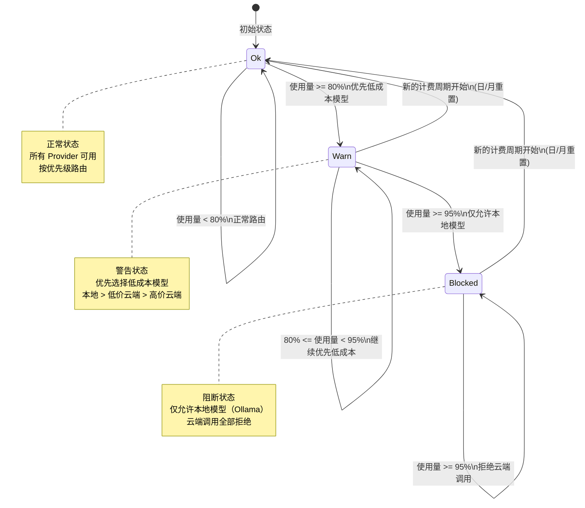

### 8.3 TokenUsageSummary — 使用汇总记录

```java
/**
 * Token 使用汇总 record。
 * 聚合指定时间范围内的 LLM 调用统计。
 *
 * @param totalInputTokens   总输入 Token 数
 * @param totalOutputTokens  总输出 Token 数
 * @param totalCostCents     总成本（分）
 * @param callCount          调用次数
 * @param cacheHitCount      缓存命中次数
 * @param providerBreakdown  按 Provider 分组的成本明细
 * @param sceneBreakdown     按场景分组的成本明细
 */
public record TokenUsageSummary(
    long totalInputTokens,
    long totalOutputTokens,
    int totalCostCents,
    int callCount,
    int cacheHitCount,
    Map<String, Integer> providerBreakdown,
    Map<String, Integer> sceneBreakdown
) {
    public TokenUsageSummary {
        providerBreakdown = Map.copyOf(
            providerBreakdown != null ? providerBreakdown : Map.of());
        sceneBreakdown = Map.copyOf(
            sceneBreakdown != null ? sceneBreakdown : Map.of());
    }

    public long totalTokens() { return totalInputTokens + totalOutputTokens; }

    /** 缓存命中率。 */
    public double cacheHitRate() {
        int total = callCount + cacheHitCount;
        return total > 0 ? (double) cacheHitCount / total : 0.0;
    }

    /** 空汇总。 */
    public static TokenUsageSummary empty() {
        return new TokenUsageSummary(0, 0, 0, 0, 0, Map.of(), Map.of());
    }
}
```

### 8.4 TokenBudgetManager — 完整实现

```java
/**
 * Token 预算管理器。
 * 基于日/月双重预算约束，实现三级状态机（OK → WARN → BLOCKED）。
 *
 * <p>预算检查流程：
 * <ol>
 *   <li>查询当日已用成本 → 检查日预算</li>
 *   <li>查询当月已用成本 → 检查月预算</li>
 *   <li>取两者中更严格的状态返回</li>
 * </ol></p>
 *
 * <p>参考 <a href="https://arxiv.org/abs/2502.09735">TokenWise</a>
 * 预算强制路由概念，在预算约束下动态平衡质量和成本。</p>
 *
 * <p>参考 Azure API Management 的
 * <a href="https://learn.microsoft.com/azure/api-management/llm-token-limit-policy">
 * llm-token-limit</a> 策略，实现 Token 速率限制概念。</p>
 */
@Service
public class TokenBudgetManager {

    private static final Logger log =
        LoggerFactory.getLogger(TokenBudgetManager.class);

    private final LlmConfigProperties.BudgetConfig config;
    private final JdbcTemplate jdbcTemplate;

    public TokenBudgetManager(LlmConfigProperties.BudgetConfig config,
                              JdbcTemplate jdbcTemplate) {
        this.config = config;
        this.jdbcTemplate = jdbcTemplate;
        log.info("Token 预算管理器初始化: 日预算={}分, 月预算={}分, "
            + "警告阈值={}%, 阻断阈值={}%",
            config.dailyBudgetCents(), config.monthlyBudgetCents(),
            config.warnThresholdPercent(), config.blockThresholdPercent());
    }

    /**
     * 检查当前预算状态。
     * 综合日预算和月预算，返回更严格的状态。
     *
     * @param scene 调用场景（用于日志和统计）
     * @return 预算决策（Ok / Warn / Blocked）
     */
    public BudgetDecision checkBudget(String scene) {
        // 查询当日和当月已用成本
        int dailyUsedCents = queryDailyUsage();
        int monthlyUsedCents = queryMonthlyUsage();

        // 计算使用百分比
        int dailyPercent = config.dailyBudgetCents() > 0
            ? dailyUsedCents * 100 / config.dailyBudgetCents() : 0;
        int monthlyPercent = config.monthlyBudgetCents() > 0
            ? monthlyUsedCents * 100 / config.monthlyBudgetCents() : 0;

        // 取更严格的百分比
        int maxPercent = Math.max(dailyPercent, monthlyPercent);
        String constraintSource = dailyPercent >= monthlyPercent ? "日预算" : "月预算";

        // 状态判定
        if (maxPercent >= config.blockThresholdPercent()) {
            log.warn("Token 预算阻断: scene={}, {}已用={}%, 日={}分/{}分, 月={}分/{}分",
                scene, constraintSource, maxPercent,
                dailyUsedCents, config.dailyBudgetCents(),
                monthlyUsedCents, config.monthlyBudgetCents());
            return new BudgetDecision.Blocked(
                constraintSource + "已用 " + maxPercent + "%，超过阻断阈值 "
                    + config.blockThresholdPercent() + "%");
        }

        if (maxPercent >= config.warnThresholdPercent()) {
            int remaining = switch (constraintSource) {
                case "日预算" -> config.dailyBudgetCents() - dailyUsedCents;
                default -> config.monthlyBudgetCents() - monthlyUsedCents;
            };
            log.info("Token 预算警告: scene={}, {}已用={}%, 剩余={}分",
                scene, constraintSource, maxPercent, remaining);
            return new BudgetDecision.Warn(maxPercent, remaining);
        }

        int remaining = Math.min(
            config.dailyBudgetCents() - dailyUsedCents,
            config.monthlyBudgetCents() - monthlyUsedCents);
        return new BudgetDecision.Ok(remaining);
    }

    /**
     * 获取指定 Provider 的当日使用汇总。
     */
    public TokenUsageSummary getDailyUsage(String providerId) {
        return queryUsageSummary(
            "date('now', 'start of day')", providerId);
    }

    /**
     * 获取当月使用汇总（所有 Provider）。
     */
    public TokenUsageSummary getMonthlyUsage() {
        return queryUsageSummary(
            "date('now', 'start of month')", null);
    }

    /**
     * 获取指定时间范围的使用汇总。
     */
    public TokenUsageSummary getUsageByRange(Instant from, Instant to) {
        return queryUsageSummaryByRange(from.toString(), to.toString());
    }

    /**
     * 月度成本预测。
     * 基于当月已用天数和已用成本，线性外推月底预计总成本。
     *
     * @return 预计月度总成本（分）
     */
    public int projectMonthlyCost() {
        int monthlyUsed = queryMonthlyUsage();
        int dayOfMonth = LocalDate.now().getDayOfMonth();
        int daysInMonth = LocalDate.now().lengthOfMonth();

        if (dayOfMonth == 0) return monthlyUsed;
        return monthlyUsed * daysInMonth / dayOfMonth;
    }

    /**
     * 获取预算概览（用于 Actuator 端点和 CLI 展示）。
     */
    public BudgetOverview getOverview() {
        int dailyUsed = queryDailyUsage();
        int monthlyUsed = queryMonthlyUsage();
        int projected = projectMonthlyCost();
        TokenUsageSummary monthlySummary = getMonthlyUsage();

        return new BudgetOverview(
            config.dailyBudgetCents(), dailyUsed,
            config.monthlyBudgetCents(), monthlyUsed,
            projected,
            monthlySummary.providerBreakdown(),
            monthlySummary.sceneBreakdown());
    }

    // ==================== 内部方法 ====================

    /** 查询当日已用成本（分）。 */
    private int queryDailyUsage() {
        try {
            Integer result = jdbcTemplate.queryForObject("""
                SELECT COALESCE(SUM(cost_cents), 0)
                FROM llm_usage_stats
                WHERE created_at >= date('now', 'start of day')
                  AND success = 1
                """, Integer.class);
            return result != null ? result : 0;
        } catch (Exception e) {
            log.warn("查询日使用量失败: {}", e.getMessage());
            return 0;
        }
    }

    /** 查询当月已用成本（分）。 */
    private int queryMonthlyUsage() {
        try {
            Integer result = jdbcTemplate.queryForObject("""
                SELECT COALESCE(SUM(cost_cents), 0)
                FROM llm_usage_stats
                WHERE created_at >= date('now', 'start of month')
                  AND success = 1
                """, Integer.class);
            return result != null ? result : 0;
        } catch (Exception e) {
            log.warn("查询月使用量失败: {}", e.getMessage());
            return 0;
        }
    }

    /** 查询使用汇总。 */
    private TokenUsageSummary queryUsageSummary(String sinceExpr,
                                                @Nullable String providerId) {
        try {
            String providerFilter = providerId != null
                ? " AND provider_id = '" + providerId + "'" : "";

            // 总量统计
            Map<String, Object> totals = jdbcTemplate.queryForMap("""
                SELECT COALESCE(SUM(input_tokens), 0) AS total_input,
                       COALESCE(SUM(output_tokens), 0) AS total_output,
                       COALESCE(SUM(cost_cents), 0) AS total_cost,
                       COUNT(*) AS call_count,
                       COALESCE(SUM(CASE WHEN cache_hit = 1 THEN 1 ELSE 0 END), 0)
                           AS cache_hits
                FROM llm_usage_stats
                WHERE created_at >= %s AND success = 1 %s
                """.formatted(sinceExpr, providerFilter));

            // 按 Provider 分组
            List<Map<String, Object>> providerRows = jdbcTemplate.queryForList("""
                SELECT provider_id, COALESCE(SUM(cost_cents), 0) AS cost
                FROM llm_usage_stats
                WHERE created_at >= %s AND success = 1 %s
                GROUP BY provider_id
                """.formatted(sinceExpr, providerFilter));
            Map<String, Integer> providerBreakdown = new HashMap<>();
            for (Map<String, Object> row : providerRows) {
                providerBreakdown.put(
                    (String) row.get("provider_id"),
                    ((Number) row.get("cost")).intValue());
            }

            // 按场景分组
            List<Map<String, Object>> sceneRows = jdbcTemplate.queryForList("""
                SELECT scene, COALESCE(SUM(cost_cents), 0) AS cost
                FROM llm_usage_stats
                WHERE created_at >= %s AND success = 1 %s
                GROUP BY scene
                """.formatted(sinceExpr, providerFilter));
            Map<String, Integer> sceneBreakdown = new HashMap<>();
            for (Map<String, Object> row : sceneRows) {
                sceneBreakdown.put(
                    (String) row.get("scene"),
                    ((Number) row.get("cost")).intValue());
            }

            return new TokenUsageSummary(
                ((Number) totals.get("total_input")).longValue(),
                ((Number) totals.get("total_output")).longValue(),
                ((Number) totals.get("total_cost")).intValue(),
                ((Number) totals.get("call_count")).intValue(),
                ((Number) totals.get("cache_hits")).intValue(),
                providerBreakdown, sceneBreakdown);
        } catch (Exception e) {
            log.warn("查询使用汇总失败: {}", e.getMessage());
            return TokenUsageSummary.empty();
        }
    }

    /** 按时间范围查询使用汇总。 */
    private TokenUsageSummary queryUsageSummaryByRange(String from, String to) {
        try {
            Map<String, Object> totals = jdbcTemplate.queryForMap("""
                SELECT COALESCE(SUM(input_tokens), 0) AS total_input,
                       COALESCE(SUM(output_tokens), 0) AS total_output,
                       COALESCE(SUM(cost_cents), 0) AS total_cost,
                       COUNT(*) AS call_count,
                       COALESCE(SUM(CASE WHEN cache_hit = 1 THEN 1 ELSE 0 END), 0)
                           AS cache_hits
                FROM llm_usage_stats
                WHERE created_at BETWEEN ? AND ? AND success = 1
                """, from, to);

            return new TokenUsageSummary(
                ((Number) totals.get("total_input")).longValue(),
                ((Number) totals.get("total_output")).longValue(),
                ((Number) totals.get("total_cost")).intValue(),
                ((Number) totals.get("call_count")).intValue(),
                ((Number) totals.get("cache_hits")).intValue(),
                Map.of(), Map.of());
        } catch (Exception e) {
            log.warn("查询时间范围使用汇总失败: {}", e.getMessage());
            return TokenUsageSummary.empty();
        }
    }

    /**
     * 预算概览 record（用于 Actuator 端点和 CLI 展示）。
     */
    public record BudgetOverview(
        int dailyBudgetCents,
        int dailyUsedCents,
        int monthlyBudgetCents,
        int monthlyUsedCents,
        int projectedMonthlyCents,
        Map<String, Integer> providerBreakdown,
        Map<String, Integer> sceneBreakdown
    ) {
        public int dailyRemainingCents() {
            return dailyBudgetCents - dailyUsedCents;
        }
        public int monthlyRemainingCents() {
            return monthlyBudgetCents - monthlyUsedCents;
        }
        public int dailyUsagePercent() {
            return dailyBudgetCents > 0
                ? dailyUsedCents * 100 / dailyBudgetCents : 0;
        }
        public int monthlyUsagePercent() {
            return monthlyBudgetCents > 0
                ? monthlyUsedCents * 100 / monthlyBudgetCents : 0;
        }
        public boolean isOverProjected() {
            return projectedMonthlyCents > monthlyBudgetCents;
        }
    }
}
```

### 8.5 Token 速率限制概念

参考 [Azure API Management 的 llm-token-limit 策略](https://learn.microsoft.com/azure/api-management/llm-token-limit-policy)，LifePilot 在预算管理之外还引入了 Token 速率限制的概念——限制单位时间内的 Token 消耗速率，防止短时间内的突发调用耗尽预算。

对于个人用户场景，速率限制主要用于防止 Agent 循环调用（如任务规划陷入死循环）导致的 Token 暴涨：

```java
/**
 * Token 速率限制器。
 * 使用滑动窗口算法限制单位时间内的 Token 消耗。
 *
 * <p>默认限制：每分钟最多 50,000 Token（约 10 次普通调用）。
 * 超过限制时返回 WARN 状态，路由层自动降级到本地模型。</p>
 *
 * <p>参考 Azure API Management llm-token-limit 策略。</p>
 */
public class TokenRateLimiter {

    private final int maxTokensPerMinute;
    private final Deque<TokenRecord> window = new ConcurrentLinkedDeque<>();

    public TokenRateLimiter(int maxTokensPerMinute) {
        this.maxTokensPerMinute = maxTokensPerMinute;
    }

    /** 默认限制：每分钟 50,000 Token。 */
    public static TokenRateLimiter defaults() {
        return new TokenRateLimiter(50_000);
    }

    /** 记录 Token 消耗。 */
    public void record(int tokens) {
        window.addLast(new TokenRecord(Instant.now(), tokens));
        evictExpired();
    }

    /** 检查是否超过速率限制。 */
    public boolean isLimited() {
        evictExpired();
        int totalTokens = window.stream()
            .mapToInt(TokenRecord::tokens).sum();
        return totalTokens >= maxTokensPerMinute;
    }

    /** 当前窗口内的 Token 总量。 */
    public int currentWindowTokens() {
        evictExpired();
        return window.stream().mapToInt(TokenRecord::tokens).sum();
    }

    private void evictExpired() {
        Instant cutoff = Instant.now().minusSeconds(60);
        while (!window.isEmpty() && window.peekFirst().timestamp().isBefore(cutoff)) {
            window.pollFirst();
        }
    }

    private record TokenRecord(Instant timestamp, int tokens) {}
}
```


---

## 9. 输出解析与结构化输出

### 9.1 设计思路

LLM 的输出本质上是非结构化文本，但 LifePilot 的大多数场景（意图理解、知识提取、任务规划）都需要**结构化数据**。输出解析器（`LlmOutputParser`）是连接 LLM 非结构化输出与 Java 强类型系统的桥梁。

现实中 LLM 的 JSON 输出经常存在各种格式问题——尾部逗号、单引号、未闭合括号、Markdown 代码块包裹等。`LlmOutputParser` 采用**多策略解析链**，按优先级依次尝试，最大化解析成功率：

```
直接 JSON 解析 → Markdown 代码块提取 → JSON 修复 → 部分 JSON 提取 → 纯文本降级
```

**与 Spring AI 的关系**：

- **路径 A（原生结构化输出）**：支持 `STRUCTURED_OUTPUT` 能力的 Provider，通过 Spring AI 的 `BeanOutputConverter` + `entity()` API 直接获取类型安全的 Java 对象
- **路径 B（降级解析）**：不支持结构化输出的 Provider，或 Provider 返回格式异常时，通过 `LlmOutputParser` 进行多策略修复和解析

### 9.2 解析策略链

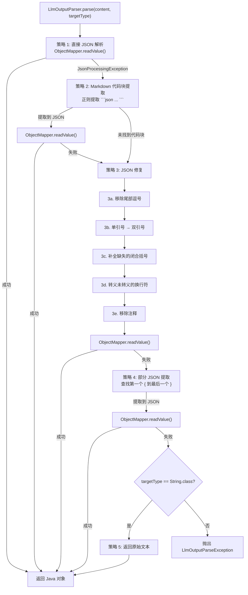

### 9.3 LlmOutputParseException — 解析异常

```java
/**
 * LLM 输出解析异常。
 * 当所有解析策略都失败时抛出，携带原始内容和目标类型信息。
 */
public class LlmOutputParseException extends RuntimeException {

    private final String originalContent;
    private final Class<?> targetType;

    /**
     * @param message         错误描述
     * @param originalContent LLM 返回的原始内容
     * @param targetType      期望的目标类型
     */
    public LlmOutputParseException(String message, String originalContent,
                                    Class<?> targetType) {
        super(message);
        this.originalContent = originalContent;
        this.targetType = targetType;
    }

    public LlmOutputParseException(String message, String originalContent,
                                    Class<?> targetType, Throwable cause) {
        super(message, cause);
        this.originalContent = originalContent;
        this.targetType = targetType;
    }

    /** LLM 返回的原始内容。 */
    public String originalContent() { return originalContent; }

    /** 期望的目标类型。 */
    public Class<?> targetType() { return targetType; }
}
```

### 9.4 LlmOutputParser — 完整实现

```java
/**
 * LLM 输出解析器。
 * 多策略解析链，将 LLM 的非结构化文本输出转换为 Java 对象。
 *
 * <p>解析策略（按优先级）：
 * <ol>
 *   <li>直接 JSON 解析（ObjectMapper）</li>
 *   <li>Markdown 代码块提取（{@code ```json ... ```}）</li>
 *   <li>JSON 修复（尾部逗号、单引号、缺失括号、未转义换行）</li>
 *   <li>部分 JSON 提取（第一个 { 到最后一个 }）</li>
 *   <li>纯文本降级（仅当 targetType 为 String 时）</li>
 * </ol></p>
 *
 * <p>线程安全：{@link ObjectMapper} 实例不可变，所有方法无状态。</p>
 */
@Component
public class LlmOutputParser {

    private static final Logger log = LoggerFactory.getLogger(LlmOutputParser.class);

    private final ObjectMapper objectMapper;

    /** Markdown JSON 代码块正则：匹配 ```json ... ``` 或 ``` ... ```。 */
    private static final Pattern MARKDOWN_JSON_BLOCK =
        Pattern.compile("```(?:json)?\\s*\\n?(.*?)\\n?```", Pattern.DOTALL);

    /** JSON 对象提取正则：匹配第一个 { 到最后一个 }。 */
    private static final Pattern JSON_OBJECT_EXTRACT =
        Pattern.compile("(\\{.*})", Pattern.DOTALL);

    /** JSON 数组提取正则：匹配第一个 [ 到最后一个 ]。 */
    private static final Pattern JSON_ARRAY_EXTRACT =
        Pattern.compile("(\\[.*])", Pattern.DOTALL);

    public LlmOutputParser() {
        this.objectMapper = new ObjectMapper()
            .configure(DeserializationFeature.FAIL_ON_UNKNOWN_PROPERTIES, false)
            .configure(DeserializationFeature.ACCEPT_SINGLE_VALUE_AS_ARRAY, true)
            .configure(JsonParser.Feature.ALLOW_COMMENTS, true)
            .configure(JsonParser.Feature.ALLOW_SINGLE_QUOTES, true)
            .configure(JsonParser.Feature.ALLOW_TRAILING_COMMA, true)
            .registerModule(new JavaTimeModule());
    }

    /**
     * 解析 LLM 输出为指定类型。
     * 依次尝试所有解析策略，直到成功或全部失败。
     *
     * @param content    LLM 返回的原始文本
     * @param targetType 目标 Java 类型
     * @return 解析后的 Java 对象
     * @throws LlmOutputParseException 所有策略都失败时抛出
     */
    @SuppressWarnings("unchecked")
    public <T> T parse(String content, Class<T> targetType) {
        if (content == null || content.isBlank()) {
            throw new LlmOutputParseException(
                "LLM 输出为空", content, targetType);
        }

        String trimmed = content.strip();

        // 如果目标类型是 String，直接返回
        if (targetType == String.class) {
            return (T) trimmed;
        }

        // 策略 1: 直接 JSON 解析
        try {
            T result = objectMapper.readValue(trimmed, targetType);
            log.debug("输出解析成功（策略 1: 直接解析）: targetType={}",
                targetType.getSimpleName());
            return result;
        } catch (JsonProcessingException e) {
            log.debug("策略 1 失败（直接解析）: {}", e.getMessage());
        }

        // 策略 2: Markdown 代码块提取
        String extracted = extractFromMarkdownBlock(trimmed);
        if (extracted != null) {
            try {
                T result = objectMapper.readValue(extracted, targetType);
                log.debug("输出解析成功（策略 2: Markdown 提取）: targetType={}",
                    targetType.getSimpleName());
                return result;
            } catch (JsonProcessingException e) {
                log.debug("策略 2 失败（Markdown 提取后解析）: {}", e.getMessage());
                // 对提取的内容继续尝试修复
                trimmed = extracted;
            }
        }

        // 策略 3: JSON 修复
        String repaired = repairJson(trimmed);
        try {
            T result = objectMapper.readValue(repaired, targetType);
            log.debug("输出解析成功（策略 3: JSON 修复）: targetType={}",
                targetType.getSimpleName());
            return result;
        } catch (JsonProcessingException e) {
            log.debug("策略 3 失败（JSON 修复后解析）: {}", e.getMessage());
        }

        // 策略 4: 部分 JSON 提取
        String partial = extractPartialJson(trimmed, targetType);
        if (partial != null) {
            try {
                T result = objectMapper.readValue(partial, targetType);
                log.debug("输出解析成功（策略 4: 部分提取）: targetType={}",
                    targetType.getSimpleName());
                return result;
            } catch (JsonProcessingException e) {
                log.debug("策略 4 失败（部分提取后解析）: {}", e.getMessage());
            }
        }

        // 所有策略失败
        throw new LlmOutputParseException(
            "LLM 输出解析失败: 所有策略均无法将内容解析为 "
                + targetType.getSimpleName()
                + "（内容前 200 字符: "
                + trimmed.substring(0, Math.min(200, trimmed.length())) + "）",
            content, targetType);
    }

    /**
     * 使用 Spring AI BeanOutputConverter 解析。
     * 优先使用 Spring AI 的类型转换能力，失败时降级到多策略解析。
     *
     * @param content      LLM 返回的原始文本
     * @param responseType 目标 Java 类型
     * @return 解析后的 Java 对象
     */
    public <T> T parseWithSpringAi(String content, Class<T> responseType) {
        try {
            var converter = new BeanOutputConverter<>(responseType);
            T result = converter.convert(content);
            if (result != null) {
                log.debug("Spring AI BeanOutputConverter 解析成功: targetType={}",
                    responseType.getSimpleName());
                return result;
            }
        } catch (Exception e) {
            log.debug("Spring AI BeanOutputConverter 解析失败，降级到多策略解析: {}",
                e.getMessage());
        }
        // 降级到多策略解析
        return parse(content, responseType);
    }

    // ==================== 内部方法 ====================

    /** 从 Markdown 代码块中提取 JSON。 */
    private @Nullable String extractFromMarkdownBlock(String content) {
        Matcher matcher = MARKDOWN_JSON_BLOCK.matcher(content);
        if (matcher.find()) {
            return matcher.group(1).strip();
        }
        return null;
    }

    /**
     * JSON 修复。
     * 修复 LLM 输出中常见的 JSON 格式问题。
     */
    private String repairJson(String json) {
        String repaired = json;

        // 3a. 移除尾部逗号（对象和数组中的最后一个逗号）
        // {"a": 1, "b": 2,} → {"a": 1, "b": 2}
        repaired = repaired.replaceAll(",\\s*([}\\]])", "$1");

        // 3b. 单引号 → 双引号（仅替换 JSON 键值对中的单引号）
        // {'key': 'value'} → {"key": "value"}
        repaired = replaceSingleQuotes(repaired);

        // 3c. 补全缺失的闭合括号
        repaired = balanceBrackets(repaired);

        // 3d. 转义未转义的换行符（JSON 字符串值内的换行）
        repaired = escapeNewlinesInStrings(repaired);

        // 3e. 移除 JavaScript 风格注释
        repaired = repaired.replaceAll("//[^\n]*", "");
        repaired = repaired.replaceAll("/\\*.*?\\*/", "");

        return repaired;
    }

    /**
     * 替换 JSON 中的单引号为双引号。
     * 智能处理：不替换双引号字符串内的单引号（如 "it's"）。
     */
    private String replaceSingleQuotes(String json) {
        // 简化策略：如果内容不包含双引号键值对，则全局替换单引号
        if (!json.contains("\"") && json.contains("'")) {
            return json.replace('\'', '"');
        }
        return json;
    }

    /**
     * 补全缺失的闭合括号。
     * 统计 { 和 } 的数量差，在末尾补全缺失的 }。
     * 同理处理 [ 和 ]。
     */
    private String balanceBrackets(String json) {
        int braces = 0;   // { } 平衡
        int brackets = 0; // [ ] 平衡
        boolean inString = false;
        char prev = 0;

        for (char c : json.toCharArray()) {
            if (c == '"' && prev != '\\') {
                inString = !inString;
            }
            if (!inString) {
                switch (c) {
                    case '{' -> braces++;
                    case '}' -> braces--;
                    case '[' -> brackets++;
                    case ']' -> brackets--;
                }
            }
            prev = c;
        }

        StringBuilder sb = new StringBuilder(json);
        while (brackets > 0) { sb.append(']'); brackets--; }
        while (braces > 0) { sb.append('}'); braces--; }
        return sb.toString();
    }

    /**
     * 转义 JSON 字符串值内的未转义换行符。
     * LLM 有时在 JSON 字符串值中输出裸换行符，导致解析失败。
     */
    private String escapeNewlinesInStrings(String json) {
        StringBuilder sb = new StringBuilder();
        boolean inString = false;
        char prev = 0;

        for (char c : json.toCharArray()) {
            if (c == '"' && prev != '\\') {
                inString = !inString;
                sb.append(c);
            } else if (inString && c == '\n') {
                sb.append("\\n");
            } else if (inString && c == '\r') {
                sb.append("\\r");
            } else if (inString && c == '\t') {
                sb.append("\\t");
            } else {
                sb.append(c);
            }
            prev = c;
        }
        return sb.toString();
    }

    /**
     * 提取部分 JSON。
     * 从文本中查找第一个 { 到最后一个 }（或 [ 到 ]）。
     * 用于处理 LLM 在 JSON 前后添加了额外文本的情况。
     */
    private @Nullable String extractPartialJson(String content, Class<?> targetType) {
        // 判断目标类型是否为数组/集合
        boolean isArray = targetType.isArray()
            || Collection.class.isAssignableFrom(targetType);

        Pattern pattern = isArray ? JSON_ARRAY_EXTRACT : JSON_OBJECT_EXTRACT;
        Matcher matcher = pattern.matcher(content);
        if (matcher.find()) {
            String extracted = matcher.group(1);
            // 对提取的内容也做一次修复
            return repairJson(extracted);
        }

        // 如果目标不是数组但内容包含数组，也尝试提取对象
        if (isArray) {
            Matcher objMatcher = JSON_OBJECT_EXTRACT.matcher(content);
            if (objMatcher.find()) {
                return repairJson(objMatcher.group(1));
            }
        }
        return null;
    }
}
```

### 9.5 StructuredOutputValidationAdvisor 概念

当 LLM 返回的结构化输出不符合预期 Schema 时，`StructuredOutputValidationAdvisor` 可以自动重试——将解析错误信息反馈给 LLM，要求其修正输出。这是 Spring AI Advisor 模式的一个高级应用。

```java
/**
 * 结构化输出验证 Advisor。
 * 当 LLM 返回的结构化输出解析失败时，自动重试并将错误信息反馈给 LLM。
 *
 * <p>重试策略：最多重试 2 次（符合编码规范 §6），每次将解析错误信息
 * 追加到 prompt 中，引导 LLM 修正输出格式。</p>
 *
 * <p>使用场景：
 * <ul>
 *   <li>知识提取（knowledge_extraction）— JSON Schema 复杂，LLM 容易输出格式错误</li>
 *   <li>意图理解（intent_understanding）— 需要精确的结构化意图参数</li>
 * </ul></p>
 */
@Component
public class StructuredOutputValidationAdvisor implements CallAroundAdvisor {

    private static final Logger log =
        LoggerFactory.getLogger(StructuredOutputValidationAdvisor.class);

    private static final int MAX_RETRIES = 2;

    private final LlmOutputParser outputParser;

    public StructuredOutputValidationAdvisor(LlmOutputParser outputParser) {
        this.outputParser = outputParser;
    }

    @Override
    public String getName() { return "StructuredOutputValidationAdvisor"; }

    @Override
    public int getOrder() { return 150; } // GuardrailAdvisor(100) 之后

    @Override
    public AdvisedResponse aroundCall(AdvisedRequest request,
                                       CallAroundAdvisorChain chain) {
        AdvisedResponse response = chain.nextAroundCall(request);

        // 如果请求中没有指定输出类型，直接返回
        Class<?> outputType = request.adviseContext()
            .get("outputType", Class.class);
        if (outputType == null) return response;

        // 尝试解析输出
        String content = response.response().getResult().getOutput().getText();
        for (int retry = 0; retry <= MAX_RETRIES; retry++) {
            try {
                outputParser.parse(content, outputType);
                // 解析成功，直接返回
                return response;
            } catch (LlmOutputParseException e) {
                if (retry >= MAX_RETRIES) {
                    log.warn("结构化输出验证失败（已达最大重试次数）: targetType={}, 错误={}",
                        outputType.getSimpleName(), e.getMessage());
                    throw e;
                }

                // 构建修正 prompt
                String correctionPrompt = """
                    你之前的输出格式有误，请修正。

                    错误信息：%s

                    请严格按照要求的 JSON 格式重新输出，不要包含任何额外的文本说明。
                    """.formatted(e.getMessage());

                log.info("结构化输出验证重试: targetType={}, retry={}/{}",
                    outputType.getSimpleName(), retry + 1, MAX_RETRIES);

                // 重新调用 LLM
                AdvisedRequest retryRequest = AdvisedRequest.from(request)
                    .withUserText(request.userText() + "\n\n" + correctionPrompt)
                    .build();
                response = chain.nextAroundCall(retryRequest);
                content = response.response().getResult().getOutput().getText();
            }
        }
        return response;
    }
}
```

### 9.6 常见 JSON 修复模式

以下是 LLM 输出中最常见的 JSON 格式问题及其修复策略：

| # | 问题 | 示例 | 修复正则 / 策略 |
|---|------|------|----------------|
| 1 | 尾部逗号 | `{"a": 1, "b": 2,}` | `,\s*([}\]])` → `$1` |
| 2 | 单引号 | `{'key': 'value'}` | 全局 `'` → `"` |
| 3 | 缺失闭合括号 | `{"a": {"b": 1}` | 统计 `{` 和 `}` 差值，末尾补全 |
| 4 | 未转义换行 | `{"text": "line1\nline2"}` | 字符串内 `\n` → `\\n` |
| 5 | JavaScript 注释 | `{/* comment */ "a": 1}` | 移除 `//...` 和 `/*...*/` |
| 6 | Markdown 包裹 | `` ```json\n{...}\n``` `` | 正则提取代码块内容 |
| 7 | 前后额外文本 | `Here is the JSON: {...}` | 提取第一个 `{` 到最后一个 `}` |
| 8 | 布尔值大写 | `{"flag": True}` | `True` → `true`，`False` → `false` |
| 9 | None 值 | `{"value": None}` | `None` → `null` |
| 10 | 多余逗号（数组） | `[1, 2, 3,]` | 同尾部逗号修复 |


---

## 10. 成本优化策略

### 10.1 设计思路

成本优化是 LifePilot LLM 路由层的核心关注点之一。作为本地优先的个人 AI Agent，LifePilot 的用户对 LLM 调用成本高度敏感——每一次云端 API 调用都有真实的金钱成本。路由层必须在**响应质量**和**调用成本**之间找到最优平衡点。

LifePilot 的成本优化不是单一策略，而是**六大策略协同工作**的系统性方案：

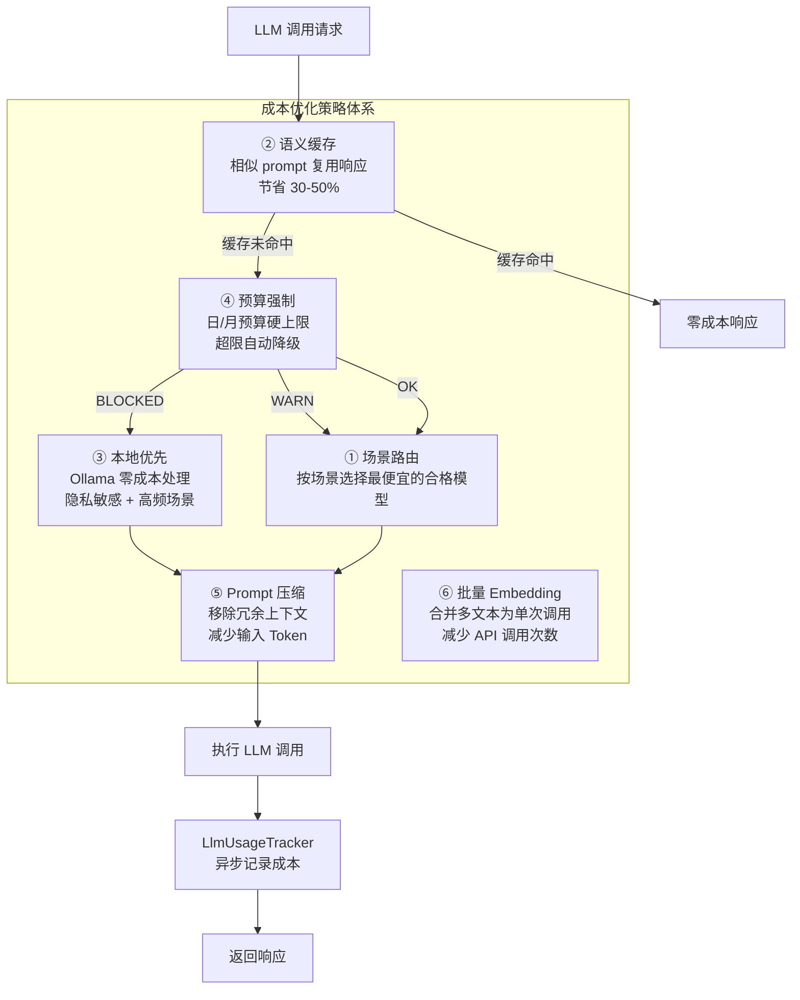


### 10.2 国产 LLM 成本对比（2025-2026 定价参考）

以下为 LifePilot 支持的主要 LLM Provider 的成本对比。价格为近似参考值，实际价格以各厂商官网为准。

| Provider | 模型 | 输入价格（¥/百万Token） | 输出价格（¥/百万Token） | 上下文窗口 | 特点 |
|----------|------|----------------------|----------------------|-----------|------|
| **Ollama（本地）** | qwen2.5:7b | 免费 | 免费 | 32K | 零成本、完全隐私、需 8GB+ RAM |
| **Ollama（本地）** | llama3.1:8b | 免费 | 免费 | 128K | 零成本、长上下文、需 8GB+ RAM |
| **DeepSeek** | deepseek-chat | ~¥1 | ~¥2 | 64K | 极低成本、推理能力强 |
| **DeepSeek** | deepseek-chat (V3.2) | ~¥0.5 | ~¥1 | 64K | 稀疏注意力、更低成本 |
| **通义千问** | qwen-plus | ~¥0.8 | ~¥2 | 128K | 长上下文、视觉理解 |
| **通义千问** | qwen-turbo | ~¥0.3 | ~¥0.6 | 128K | 极低成本、适合简单任务 |
| **智谱 GLM** | glm-4 | ~¥5 | ~¥5 | 128K | 中等成本、工具调用稳定 |
| **智谱 GLM** | glm-4-flash | ~¥0.1 | ~¥0.1 | 128K | 极低成本、速度快 |
| **文心一言** | ernie-4.0 | ~¥12 | ~¥12 | 8K | 高成本、中文理解强 |
| **文心一言** | ernie-3.5 | ~¥1.2 | ~¥1.2 | 8K | 中等成本、性价比一般 |

**成本分析**：

- **最经济**：Ollama 本地模型（零成本）> DeepSeek V3.2 > 通义千问 qwen-turbo > GLM-4-flash
- **最佳性价比**：DeepSeek-chat（极低价格 + 强推理能力）
- **最贵**：文心一言 ERNIE-4.0（价格是 DeepSeek 的 6-12 倍）
- **推荐策略**：本地 Ollama 处理 80%+ 的日常调用，DeepSeek 作为云端首选，通义千问作为备选


### 10.3 六大成本优化策略详解

#### 策略 1: 场景路由到最便宜的合格模型

每个场景有不同的能力要求和成本敏感度。路由层根据场景特征，自动选择满足能力要求的最便宜模型。

| 场景 | 能力要求 | 推荐模型（按成本排序） | 预估单次成本 |
|------|---------|---------------------|------------|
| `intent_understanding` | 结构化输出、快速响应 | Ollama → DeepSeek → Qwen | 0 ~ 0.05 分 |
| `task_planning` | 强推理、工具调用 | Ollama → DeepSeek → GLM | 0 ~ 0.2 分 |
| `knowledge_extraction` | 结构化输出、实体识别 | Ollama → DeepSeek → Qwen | 0 ~ 0.1 分 |
| `chat` | 自然流畅 | Ollama → DeepSeek → Qwen | 0 ~ 0.1 分 |
| `memory_compression` | 压缩质量 | Ollama → DeepSeek | 0 ~ 0.2 分 |
| `proactive_reasoning` | 判断力 | Ollama → DeepSeek | 0 ~ 0.05 分 |
| `embedding` | 向量生成 | Ollama nomic-embed | 0（本地） |
| `document_summary` | 长上下文 | Qwen（128K）→ DeepSeek（64K） | 0.5 ~ 2 分 |

#### 策略 2: 语义缓存（30-50% 成本节省）

语义缓存（§7）通过复用语义相似的 prompt 响应，避免重复调用 LLM。在以下场景中效果显著：

- **意图理解**：用户经常用不同措辞表达相同意图（"帮我看看今天的日程" ≈ "今天有什么安排"）
- **知识提取**：相似的对话内容产生相似的提取结果
- **主动推理**：周期性评估的 prompt 高度相似

预估节省率：重复性高的场景可达 40-50%，整体平均 30%。

#### 策略 3: 本地模型优先

Ollama 本地模型是 LifePilot 的成本优化基石——零 API 成本、零网络延迟、完全隐私。

**适合本地模型的场景**：
- 高频调用场景（意图理解、主动推理）— 调用量大，云端成本累积快
- 隐私敏感场景（记忆压缩、知识提取）— 涉及用户个人数据
- Embedding 生成 — 本地 nomic-embed-text 质量足够，无需云端

**不适合本地模型的场景**：
- 长文档摘要（需要 64K+ 上下文窗口，本地 7B 模型通常只有 32K）
- 复杂代码生成（本地 7B 模型的代码能力有限）

#### 策略 4: 预算强制（硬上限防护）

Token 预算管理（§8）提供硬上限防护，确保 LLM 成本不会失控：

- 日预算 200 分（2 元）：防止单日暴涨（如 Agent 循环调用）
- 月预算 5000 分（50 元）：控制月度总量
- 三级状态机自动降级：OK → WARN（优先低成本）→ BLOCKED（仅本地）

#### 策略 5: Prompt 压缩

在发送 prompt 到 LLM 之前，移除冗余上下文，减少输入 Token 数量：

- **对话历史压缩**：使用渐进式压缩（Layer 0 → Layer 1 → Layer 2），旧消息自动摘要
- **上下文窗口管理**：只发送与当前任务相关的上下文，而非完整对话历史
- **系统提示词复用**：相同场景的系统提示词缓存，避免重复传输

#### 策略 6: 批量 Embedding

将多个文本合并为单次 Embedding API 调用，减少网络开销和 API 调用次数：

- 知识库文档分块后，批量生成 Embedding（而非逐块调用）
- 对话消息批量向量化（通过 `embeddings_queue` 表异步处理）
- 本地 Ollama Embedding 不受此限制（无 API 调用成本），但批量处理仍可提升吞吐


### 10.4 LlmCallEvent — 调用事件记录

```java
/**
 * LLM 调用事件 record。
 * 记录每次 LLM 调用的完整信息，用于成本追踪和可观测性。
 *
 * @param providerId    Provider ID
 * @param scene         调用场景
 * @param modelName     模型名称
 * @param inputTokens   输入 Token 数
 * @param outputTokens  输出 Token 数
 * @param latencyMs     调用延迟（毫秒）
 * @param costCents     成本（分）
 * @param cacheHit      是否缓存命中
 * @param success       是否成功
 * @param errorType     错误类型（失败时）
 * @param traceId       关联的 Trace ID
 * @param timestamp     事件时间
 */
public record LlmCallEvent(
    String providerId,
    String scene,
    String modelName,
    int inputTokens,
    int outputTokens,
    long latencyMs,
    int costCents,
    boolean cacheHit,
    boolean success,
    @Nullable String errorType,
    @Nullable String traceId,
    Instant timestamp
) {
    public int totalTokens() { return inputTokens + outputTokens; }

    /** 创建成功事件。 */
    public static LlmCallEvent success(String providerId, String scene,
            String modelName, int inputTokens, int outputTokens,
            long latencyMs, int costCents) {
        return new LlmCallEvent(providerId, scene, modelName,
            inputTokens, outputTokens, latencyMs, costCents,
            false, true, null, null, Instant.now());
    }

    /** 创建失败事件。 */
    public static LlmCallEvent failure(String providerId, String scene,
            String modelName, long latencyMs, String errorType) {
        return new LlmCallEvent(providerId, scene, modelName,
            0, 0, latencyMs, 0,
            false, false, errorType, null, Instant.now());
    }

    /** 创建缓存命中事件。 */
    public static LlmCallEvent cacheHit(String scene,
                                         CachedResponse cached) {
        return new LlmCallEvent(cached.providerId(), scene,
            cached.modelName(), 0, 0, 0, 0,
            true, true, null, null, Instant.now());
    }
}
```


### 10.5 LlmUsageTracker — 使用追踪器

```java
/**
 * LLM 使用追踪器。
 * 异步记录每次 LLM 调用的 Token 消耗和成本到 {@code llm_usage_stats} 表。
 *
 * <p>设计要点：
 * <ul>
 *   <li>异步写入：使用 {@link WriteSerializer} 串行化写操作，不阻塞调用方</li>
 *   <li>批量写入：累积事件后批量 INSERT，减少数据库写入频率</li>
 *   <li>容错：写入失败不影响 LLM 调用结果，仅记录警告日志</li>
 * </ul></p>
 */
@Service
public class LlmUsageTracker {

    private static final Logger log =
        LoggerFactory.getLogger(LlmUsageTracker.class);

    private final JdbcTemplate jdbcTemplate;
    private final WriteSerializer writeSerializer;

    public LlmUsageTracker(JdbcTemplate jdbcTemplate,
                           WriteSerializer writeSerializer) {
        this.jdbcTemplate = jdbcTemplate;
        this.writeSerializer = writeSerializer;
    }

    /**
     * 异步记录 LLM 调用事件。
     * 写入失败不影响调用方，仅记录警告日志。
     *
     * @param event 调用事件
     * @return 写入完成的 Future
     */
    public CompletableFuture<Void> record(LlmCallEvent event) {
        return writeSerializer.writeVoid(() -> {
            try {
                jdbcTemplate.update("""
                    INSERT INTO llm_usage_stats
                        (id, provider_id, scene, model_id,
                         input_tokens, output_tokens, total_tokens,
                         latency_ms, cost_cents, cache_hit,
                         success, error_type, trace_id, created_at)
                    VALUES (?, ?, ?, ?, ?, ?, ?, ?, ?, ?, ?, ?, ?, ?)
                    """,
                    UUID.randomUUID().toString(),
                    event.providerId(),
                    event.scene(),
                    event.modelName(),
                    event.inputTokens(),
                    event.outputTokens(),
                    event.totalTokens(),
                    event.latencyMs(),
                    event.costCents(),
                    event.cacheHit() ? 1 : 0,
                    event.success() ? 1 : 0,
                    event.errorType(),
                    event.traceId(),
                    event.timestamp().toString());
            } catch (Exception e) {
                log.warn("LLM 使用记录写入失败: provider={}, scene={}, 错误={}",
                    event.providerId(), event.scene(), e.getMessage());
            }
        });
    }

    /**
     * 聚合指定时间范围内的使用统计。
     *
     * @param from 开始时间
     * @param to   结束时间
     * @return 使用汇总
     */
    public TokenUsageSummary aggregateByTimeRange(Instant from, Instant to) {
        try {
            Map<String, Object> totals = jdbcTemplate.queryForMap("""
                SELECT COALESCE(SUM(input_tokens), 0) AS total_input,
                       COALESCE(SUM(output_tokens), 0) AS total_output,
                       COALESCE(SUM(cost_cents), 0) AS total_cost,
                       COUNT(*) AS call_count,
                       COALESCE(SUM(CASE WHEN cache_hit = 1
                           THEN 1 ELSE 0 END), 0) AS cache_hits
                FROM llm_usage_stats
                WHERE created_at BETWEEN ? AND ? AND success = 1
                """, from.toString(), to.toString());

            // 按 Provider 分组
            List<Map<String, Object>> providerRows = jdbcTemplate.queryForList("""
                SELECT provider_id, COALESCE(SUM(cost_cents), 0) AS cost
                FROM llm_usage_stats
                WHERE created_at BETWEEN ? AND ? AND success = 1
                GROUP BY provider_id
                """, from.toString(), to.toString());
            Map<String, Integer> providerBreakdown = new HashMap<>();
            for (Map<String, Object> row : providerRows) {
                providerBreakdown.put(
                    (String) row.get("provider_id"),
                    ((Number) row.get("cost")).intValue());
            }

            // 按场景分组
            List<Map<String, Object>> sceneRows = jdbcTemplate.queryForList("""
                SELECT scene, COALESCE(SUM(cost_cents), 0) AS cost
                FROM llm_usage_stats
                WHERE created_at BETWEEN ? AND ? AND success = 1
                GROUP BY scene
                """, from.toString(), to.toString());
            Map<String, Integer> sceneBreakdown = new HashMap<>();
            for (Map<String, Object> row : sceneRows) {
                sceneBreakdown.put(
                    (String) row.get("scene"),
                    ((Number) row.get("cost")).intValue());
            }

            return new TokenUsageSummary(
                ((Number) totals.get("total_input")).longValue(),
                ((Number) totals.get("total_output")).longValue(),
                ((Number) totals.get("total_cost")).intValue(),
                ((Number) totals.get("call_count")).intValue(),
                ((Number) totals.get("cache_hits")).intValue(),
                providerBreakdown, sceneBreakdown);
        } catch (Exception e) {
            log.warn("使用统计聚合失败: {}", e.getMessage());
            return TokenUsageSummary.empty();
        }
    }
}
```


### 10.6 月度成本预测算法

```java
/**
 * 月度成本预测器。
 * 基于历史数据和当前趋势，预测月底的总 LLM 成本。
 *
 * <p>预测算法：
 * <ol>
 *   <li>线性外推：当月已用成本 × (月总天数 / 已过天数)</li>
 *   <li>加权移动平均：近 7 天日均成本 × 月总天数（权重更高）</li>
 *   <li>综合预测：线性外推 × 0.4 + 加权移动平均 × 0.6</li>
 * </ol></p>
 */
public class MonthlyCostProjector {

    private final JdbcTemplate jdbcTemplate;

    public MonthlyCostProjector(JdbcTemplate jdbcTemplate) {
        this.jdbcTemplate = jdbcTemplate;
    }

    /**
     * 预测当月总成本。
     *
     * @return 预测成本（分）
     */
    public int projectMonthlyCost() {
        LocalDate today = LocalDate.now();
        int dayOfMonth = today.getDayOfMonth();
        int daysInMonth = today.lengthOfMonth();

        if (dayOfMonth <= 1) {
            // 月初，使用上月数据作为参考
            return projectFromLastMonth(daysInMonth);
        }

        // 方法 1: 线性外推
        int monthlyUsed = queryMonthlyUsedCents();
        int linearProjection = monthlyUsed * daysInMonth / dayOfMonth;

        // 方法 2: 近 7 天加权移动平均
        int recentDays = Math.min(dayOfMonth, 7);
        int recentCost = queryRecentDaysCost(recentDays);
        int dailyAvg = recentDays > 0 ? recentCost / recentDays : 0;
        int weightedProjection = dailyAvg * daysInMonth;

        // 综合预测（线性 40% + 加权 60%）
        return (int) (linearProjection * 0.4 + weightedProjection * 0.6);
    }

    /**
     * 生成成本预测报告。
     */
    public CostProjectionReport generateReport() {
        int projected = projectMonthlyCost();
        int monthlyBudget = 5000; // 从配置获取
        int monthlyUsed = queryMonthlyUsedCents();
        LocalDate today = LocalDate.now();

        // 按场景预测
        Map<String, Integer> sceneProjections = projectByScene(
            today.getDayOfMonth(), today.lengthOfMonth());

        return new CostProjectionReport(
            projected, monthlyBudget, monthlyUsed,
            projected > monthlyBudget,
            sceneProjections,
            today);
    }

    /** 查询当月已用成本。 */
    private int queryMonthlyUsedCents() {
        Integer result = jdbcTemplate.queryForObject("""
            SELECT COALESCE(SUM(cost_cents), 0)
            FROM llm_usage_stats
            WHERE created_at >= date('now', 'start of month')
              AND success = 1
            """, Integer.class);
        return result != null ? result : 0;
    }

    /** 查询近 N 天的成本。 */
    private int queryRecentDaysCost(int days) {
        Integer result = jdbcTemplate.queryForObject("""
            SELECT COALESCE(SUM(cost_cents), 0)
            FROM llm_usage_stats
            WHERE created_at >= date('now', '-%d days')
              AND success = 1
            """.formatted(days), Integer.class);
        return result != null ? result : 0;
    }

    /** 使用上月数据预测。 */
    private int projectFromLastMonth(int daysInMonth) {
        Integer lastMonth = jdbcTemplate.queryForObject("""
            SELECT COALESCE(SUM(cost_cents), 0)
            FROM llm_usage_stats
            WHERE created_at >= date('now', 'start of month', '-1 month')
              AND created_at < date('now', 'start of month')
              AND success = 1
            """, Integer.class);
        return lastMonth != null ? lastMonth : 0;
    }

    /** 按场景预测月度成本。 */
    private Map<String, Integer> projectByScene(int dayOfMonth,
                                                 int daysInMonth) {
        List<Map<String, Object>> rows = jdbcTemplate.queryForList("""
            SELECT scene, COALESCE(SUM(cost_cents), 0) AS cost
            FROM llm_usage_stats
            WHERE created_at >= date('now', 'start of month')
              AND success = 1
            GROUP BY scene
            """);
        Map<String, Integer> projections = new HashMap<>();
        for (Map<String, Object> row : rows) {
            String scene = (String) row.get("scene");
            int cost = ((Number) row.get("cost")).intValue();
            projections.put(scene,
                dayOfMonth > 0 ? cost * daysInMonth / dayOfMonth : 0);
        }
        return Map.copyOf(projections);
    }

    /**
     * 成本预测报告 record。
     */
    public record CostProjectionReport(
        int projectedCostCents,
        int monthlyBudgetCents,
        int currentUsedCents,
        boolean overBudgetProjected,
        Map<String, Integer> sceneProjections,
        LocalDate reportDate
    ) {
        public int projectedRemainingCents() {
            return monthlyBudgetCents - projectedCostCents;
        }
        public int usagePercent() {
            return monthlyBudgetCents > 0
                ? currentUsedCents * 100 / monthlyBudgetCents : 0;
        }
    }
}
```


### 10.7 成本优化决策流程

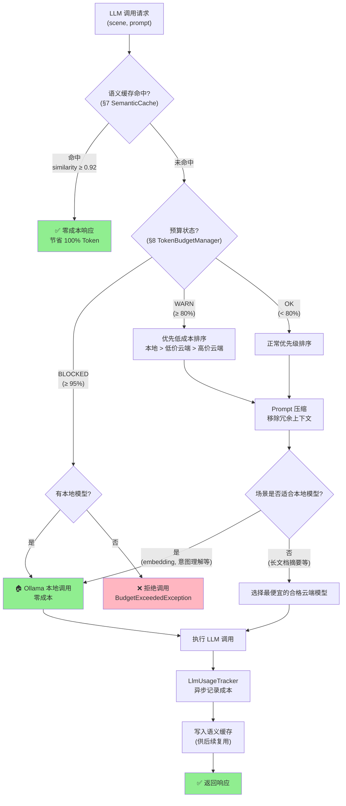

### 10.8 成本优化效果预估

基于典型个人用户使用模式（每日 50-100 次 LLM 调用），各策略的预估节省效果：

| 策略 | 预估节省率 | 月度节省（基于 50 元/月基线） | 说明 |
|------|-----------|---------------------------|------|
| 本地模型优先 | 60-80% | ¥30-40 | 80%+ 调用由 Ollama 处理 |
| 语义缓存 | 10-20% | ¥5-10 | 重复性 prompt 复用 |
| 场景路由 | 5-10% | ¥2.5-5 | 选择最便宜的合格模型 |
| Prompt 压缩 | 5-10% | ¥2.5-5 | 减少输入 Token |
| 批量 Embedding | 2-5% | ¥1-2.5 | 减少 API 调用次数 |
| 预算强制 | 防护性 | 防止超支 | 硬上限保障 |
| **综合效果** | **80-95%** | **实际月支出 ¥2.5-10** | 大部分调用零成本 |

**关键结论**：通过本地模型优先 + 语义缓存的组合，LifePilot 可以将实际月度 LLM 支出控制在 **¥5-10 元**以内，远低于 50 元的月预算上限。本地 Ollama 模型是成本优化的最大贡献者。


---

## 11. Embedding 路由

### 11.1 设计思路

Embedding（文本向量化）是 LifePilot 记忆检索、知识库语义搜索、语义缓存等功能的基础能力。与 Chat 路由不同，Embedding 路由有其独特的特征：

- **无状态性**：Embedding 调用之间没有上下文依赖，不需要会话亲和性
- **批量友好**：知识提取、记忆巩固等场景通常需要批量向量化，逐条调用效率低下
- **维度一致性**：同一向量空间内的所有向量必须维度一致，模型切换时需要维度归一化
- **延迟容忍**：Embedding 通常在后台异步执行，对延迟的容忍度高于 Chat 调用

当前 Embedding 路由由 `LlmRouter.embed()` 方法统一处理（参见 §4.4），未来随着 Embedding 场景复杂化（多向量空间、混合检索等），可能拆分为独立的 `EmbeddingRouter` 组件。

### 11.2 Embedding 模型选项

LifePilot 支持多种 Embedding 模型，按本地优先原则排序：

| 模型 | Provider | 维度 | 成本 | 优先级 | 适用场景 |
|------|----------|------|------|--------|---------|
| `nomic-embed-text:v1.5` | Ollama（本地） | 768 | 免费 | 0（最高） | 日常语义检索、缓存查询、记忆匹配 |
| `text-embedding-3-small` | OpenAI（云端） | 1536 | ¥0.02/百万 Token | 10 | 高精度语义搜索、跨语言检索 |
| DeepSeek Embedding | DeepSeek（云端） | 1024 | 按量计费 | 20 | 备选，DeepSeek 生态内使用 |

**模型选择策略**：

- **默认使用 Ollama nomic-embed-text:v1.5**：零成本、零延迟、完全隐私，768 维对个人知识库场景足够
- **云端 Embedding 仅在本地不可用时降级使用**：Ollama 服务宕机或模型未拉取时自动切换
- **维度差异通过归一化处理**：不同模型生成的向量维度不同，存储和检索时需要统一处理

### 11.3 Embedding 路由流程

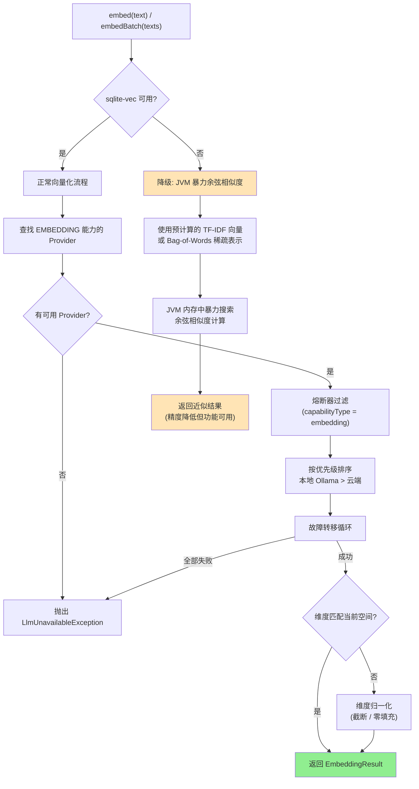

### 11.4 EmbeddingResult — 向量化结果记录

```java
/**
 * Embedding 向量化结果 record。
 * 封装向量数据及其元信息，用于存储和检索。
 *
 * @param vector     向量数据（float 数组）
 * @param dimension  向量维度
 * @param providerId 生成该向量的 Provider ID
 * @param modelName  使用的模型名称
 * @param latencyMs  向量化延迟（毫秒）
 * @param normalized 是否经过维度归一化处理
 */
public record EmbeddingResult(
    float[] vector,
    int dimension,
    String providerId,
    String modelName,
    long latencyMs,
    boolean normalized
) {
    /** 紧凑构造器 — 参数校验。 */
    public EmbeddingResult {
        Objects.requireNonNull(vector, "向量数据不能为空");
        if (vector.length == 0) {
            throw new IllegalArgumentException("向量维度不能为 0");
        }
        if (dimension != vector.length) {
            throw new IllegalArgumentException(
                "维度声明与实际向量长度不匹配: 声明=%d, 实际=%d"
                    .formatted(dimension, vector.length));
        }
    }

    /** L2 范数归一化（单位向量）。 */
    public EmbeddingResult l2Normalize() {
        double norm = 0.0;
        for (float v : vector) { norm += v * v; }
        norm = Math.sqrt(norm);
        if (norm == 0.0) return this;
        float[] normalized = new float[vector.length];
        for (int i = 0; i < vector.length; i++) {
            normalized[i] = (float) (vector[i] / norm);
        }
        return new EmbeddingResult(
            normalized, dimension, providerId, modelName, latencyMs, true);
    }

    /** 余弦相似度计算。 */
    public double cosineSimilarity(EmbeddingResult other) {
        if (this.dimension != other.dimension) {
            throw new IllegalArgumentException(
                "向量维度不匹配: %d vs %d".formatted(this.dimension, other.dimension));
        }
        double dot = 0.0, normA = 0.0, normB = 0.0;
        for (int i = 0; i < dimension; i++) {
            dot += vector[i] * other.vector[i];
            normA += vector[i] * vector[i];
            normB += other.vector[i] * other.vector[i];
        }
        double denom = Math.sqrt(normA) * Math.sqrt(normB);
        return denom == 0.0 ? 0.0 : dot / denom;
    }
}
```

### 11.5 批量 Embedding 支持

知识提取和记忆巩固场景通常需要对大量文本进行向量化。逐条调用 `embed()` 效率低下（每次调用都有网络往返开销），因此 `LlmRouter` 提供 `embedBatch()` 方法支持批量处理。

```java
/**
 * LlmRouter 中的批量 Embedding 方法。
 */
public class LlmRouter {

    // ... 其他字段和方法（参见 §4.4）

    /** 默认批次大小：Ollama 本地模型一次处理 32 条。 */
    private static final int DEFAULT_BATCH_SIZE = 32;

    /**
     * 批量 Embedding 向量生成。
     * 将输入文本按批次大小分组，逐批调用 Provider。
     * 使用 Virtual Thread 并行处理多个批次。
     *
     * @param texts 待向量化的文本列表
     * @return 与输入顺序一致的 EmbeddingResult 列表
     */
    public List<EmbeddingResult> embedBatch(List<String> texts) {
        if (texts == null || texts.isEmpty()) {
            return List.of();
        }

        List<ProviderConfig> available = providerRegistry
            .findByCapability(ProviderCapability.EMBEDDING)
            .stream()
            .filter(config -> circuitBreakerManager
                .isCallPermitted(config.id(), "embedding"))
            .sorted(Comparator.comparingInt(ProviderConfig::priority))
            .toList();

        if (available.isEmpty()) {
            throw new LlmUnavailableException(
                "批量 Embedding 失败，无可用 Provider",
                LlmScene.EMBEDDING, List.of());
        }

        // 按批次大小分组
        List<List<String>> batches = partitionList(texts, DEFAULT_BATCH_SIZE);
        log.info("批量 Embedding 开始: 总数={}, 批次数={}, 批次大小={}",
            texts.size(), batches.size(), DEFAULT_BATCH_SIZE);

        // Virtual Thread 并行处理
        List<EmbeddingResult> results =
            Collections.synchronizedList(new ArrayList<>());
        Instant startTime = Instant.now();

        try (var executor = Executors.newVirtualThreadPerTaskExecutor()) {
            List<Future<List<EmbeddingResult>>> futures = new ArrayList<>();
            for (List<String> batch : batches) {
                futures.add(executor.submit(
                    () -> embedBatchWithFailover(batch, available)));
            }
            for (Future<List<EmbeddingResult>> future : futures) {
                results.addAll(future.get(60, TimeUnit.SECONDS));
            }
        } catch (InterruptedException e) {
            Thread.currentThread().interrupt();
            throw new LlmUnavailableException(
                "批量 Embedding 被中断", LlmScene.EMBEDDING, List.of());
        } catch (ExecutionException | TimeoutException e) {
            throw new LlmUnavailableException(
                "批量 Embedding 执行失败: " + e.getMessage(),
                LlmScene.EMBEDDING, List.of(), e.getCause());
        }

        Duration totalLatency = Duration.between(startTime, Instant.now());
        log.info("批量 Embedding 完成: 总数={}, 耗时={}ms, 平均={}ms/条",
            results.size(), totalLatency.toMillis(),
            texts.isEmpty() ? 0 : totalLatency.toMillis() / texts.size());

        return List.copyOf(results);
    }

    /** 单批次 Embedding，带故障转移。 */
    private List<EmbeddingResult> embedBatchWithFailover(
            List<String> batch, List<ProviderConfig> providers) {
        for (ProviderConfig config : providers) {
            try {
                ProviderAdapter adapter = providerRegistry.getAdapter(config.id());
                Instant batchStart = Instant.now();
                List<EmbeddingResult> batchResults = new ArrayList<>();
                for (String text : batch) {
                    float[] vector = adapter.embed(text);
                    long latency = Duration.between(batchStart, Instant.now())
                        .toMillis();
                    batchResults.add(new EmbeddingResult(
                        vector, vector.length, config.id(),
                        config.modelName(), latency, false));
                }
                circuitBreakerManager.recordSuccess(config.id(), "embedding");
                return batchResults;
            } catch (Exception e) {
                circuitBreakerManager.recordFailure(config.id(), "embedding");
                log.warn("批量 Embedding 失败，尝试下一个 Provider: "
                    + "provider={}, 错误={}", config.id(), e.getMessage());
            }
        }
        throw new LlmUnavailableException(
            "批量 Embedding 所有 Provider 失败",
            LlmScene.EMBEDDING,
            providers.stream().map(ProviderConfig::id).toList());
    }

    /** 列表分区工具方法。 */
    private static <T> List<List<T>> partitionList(List<T> list, int size) {
        List<List<T>> partitions = new ArrayList<>();
        for (int i = 0; i < list.size(); i += size) {
            partitions.add(list.subList(i, Math.min(i + size, list.size())));
        }
        return partitions;
    }
}
```

### 11.6 维度归一化

当 Embedding 模型切换时（例如从 Ollama nomic-embed-text 768 维切换到 OpenAI text-embedding-3-small 1536 维），已存储的向量与新生成的向量维度不一致，无法直接进行余弦相似度计算。LifePilot 采用以下策略处理维度差异：

**策略一：目标维度对齐（推荐）**

系统维护一个全局目标维度（`target-embedding-dimension`），所有向量在存储前统一归一化到该维度。

```java
/**
 * Embedding 维度归一化器。
 * 将不同模型生成的向量统一到目标维度。
 *
 * <p>归一化策略：
 * <ul>
 *   <li>源维度 > 目标维度：截断（Matryoshka Representation Learning 兼容）</li>
 *   <li>源维度 < 目标维度：零填充（保持余弦相似度语义）</li>
 *   <li>源维度 = 目标维度：直接返回</li>
 * </ul></p>
 *
 * <p>注意：截断策略依赖模型支持 Matryoshka 表示（nomic-embed-text 和
 * text-embedding-3-small 均支持），否则截断会损失语义信息。</p>
 */
@Component
public class EmbeddingDimensionNormalizer {

    private static final Logger log =
        LoggerFactory.getLogger(EmbeddingDimensionNormalizer.class);

    private final int targetDimension;

    public EmbeddingDimensionNormalizer(LlmConfigProperties config) {
        this.targetDimension = config.getEmbedding().targetDimension();
        log.info("Embedding 维度归一化器初始化: 目标维度={}", targetDimension);
    }

    /**
     * 将向量归一化到目标维度。
     *
     * @param result 原始 EmbeddingResult
     * @return 归一化后的 EmbeddingResult
     */
    public EmbeddingResult normalize(EmbeddingResult result) {
        if (result.dimension() == targetDimension) {
            return result;
        }

        float[] source = result.vector();
        float[] target = new float[targetDimension];

        if (source.length > targetDimension) {
            // 截断：取前 targetDimension 个分量
            System.arraycopy(source, 0, target, 0, targetDimension);
            log.debug("Embedding 维度截断: {}→{}, provider={}",
                source.length, targetDimension, result.providerId());
        } else {
            // 零填充：复制全部分量，剩余位置为 0
            System.arraycopy(source, 0, target, 0, source.length);
            log.debug("Embedding 维度零填充: {}→{}, provider={}",
                source.length, targetDimension, result.providerId());
        }

        return new EmbeddingResult(
            target, targetDimension, result.providerId(),
            result.modelName(), result.latencyMs(), true)
            .l2Normalize(); // 归一化后重新 L2 正规化
    }

    public int targetDimension() { return targetDimension; }
}
```

### 11.7 sqlite-vec 不可用时的降级策略

sqlite-vec 是 LifePilot 的向量索引引擎，但作为 native 扩展，可能在某些平台上加载失败。当 sqlite-vec 不可用时，Embedding 功能不应完全失效，而是降级为 JVM 内暴力余弦相似度搜索。

```java
/**
 * 向量搜索降级策略。
 * 当 sqlite-vec 不可用时，使用 JVM 内存暴力搜索作为降级方案。
 *
 * <p>降级方案的限制：
 * <ul>
 *   <li>搜索复杂度 O(n)，数据量大时性能下降</li>
 *   <li>所有向量需加载到 JVM 堆内存</li>
 *   <li>不支持 ANN（近似最近邻）加速</li>
 *   <li>建议数据量上限：10,000 条向量</li>
 * </ul></p>
 */
@Component
public class BruteForceVectorSearch {

    private static final Logger log =
        LoggerFactory.getLogger(BruteForceVectorSearch.class);

    private final JdbcTemplate jdbcTemplate;
    private final boolean sqliteVecAvailable;

    public BruteForceVectorSearch(
            @Qualifier("mainDataSource") DataSource dataSource,
            SqliteVecLoader sqliteVecLoader) {
        this.jdbcTemplate = new JdbcTemplate(dataSource);
        this.sqliteVecAvailable = sqliteVecLoader.isAvailable();
        if (!sqliteVecAvailable) {
            log.warn("sqlite-vec 不可用，向量搜索将使用 JVM 暴力搜索降级方案");
        }
    }

    /**
     * 搜索最相似的向量。
     * sqlite-vec 可用时委托给 SQL 查询，不可用时使用 JVM 暴力搜索。
     *
     * @param queryVector 查询向量
     * @param tableName   向量表名
     * @param topK        返回前 K 个结果
     * @param threshold   最低相似度阈值
     * @return 按相似度降序排列的结果列表
     */
    public List<VectorSearchResult> search(float[] queryVector,
            String tableName, int topK, double threshold) {
        if (sqliteVecAvailable) {
            return searchWithSqliteVec(queryVector, tableName, topK, threshold);
        }
        return searchBruteForce(queryVector, tableName, topK, threshold);
    }

    /** JVM 暴力搜索降级实现。 */
    private List<VectorSearchResult> searchBruteForce(float[] queryVector,
            String tableName, int topK, double threshold) {
        log.debug("执行 JVM 暴力向量搜索: table={}, topK={}", tableName, topK);

        // 从数据库加载所有向量（仅在 sqlite-vec 不可用时）
        List<Map<String, Object>> rows = jdbcTemplate.queryForList(
            "SELECT id, embedding_blob FROM " + tableName
                + " WHERE embedding_blob IS NOT NULL");

        return rows.stream()
            .map(row -> {
                String id = (String) row.get("id");
                byte[] blob = (byte[]) row.get("embedding_blob");
                float[] vector = deserializeVector(blob);
                double similarity = cosineSimilarity(queryVector, vector);
                return new VectorSearchResult(id, similarity);
            })
            .filter(r -> r.similarity() >= threshold)
            .sorted(Comparator.comparingDouble(
                VectorSearchResult::similarity).reversed())
            .limit(topK)
            .toList();
    }

    /** sqlite-vec 原生搜索。 */
    private List<VectorSearchResult> searchWithSqliteVec(float[] queryVector,
            String tableName, int topK, double threshold) {
        // 委托给 sqlite-vec 的 vec_search SQL 函数
        // 具体实现参见 knowledge-base.md 向量检索章节
        throw new UnsupportedOperationException(
            "sqlite-vec 搜索实现参见 knowledge-base 模块");
    }

    /** 余弦相似度计算。 */
    private static double cosineSimilarity(float[] a, float[] b) {
        int len = Math.min(a.length, b.length);
        double dot = 0.0, normA = 0.0, normB = 0.0;
        for (int i = 0; i < len; i++) {
            dot += a[i] * b[i];
            normA += a[i] * a[i];
            normB += b[i] * b[i];
        }
        double denom = Math.sqrt(normA) * Math.sqrt(normB);
        return denom == 0.0 ? 0.0 : dot / denom;
    }

    /** 反序列化向量（little-endian float 数组）。 */
    private static float[] deserializeVector(byte[] blob) {
        var buffer = java.nio.ByteBuffer.wrap(blob)
            .order(java.nio.ByteOrder.LITTLE_ENDIAN);
        float[] vector = new float[blob.length / Float.BYTES];
        buffer.asFloatBuffer().get(vector);
        return vector;
    }

    /**
     * 向量搜索结果 record。
     */
    public record VectorSearchResult(String id, double similarity) {}
}
```

### 11.8 与 embeddings_queue 表的集成

Embedding 路由与 `embeddings_queue` 表（定义于 [data-model.md](data-model.md) §4.16）协同工作，实现异步批量向量化。数据写入时不阻塞等待向量化完成，而是将任务写入队列，由后台 `EmbeddingWorker` 定时消费。

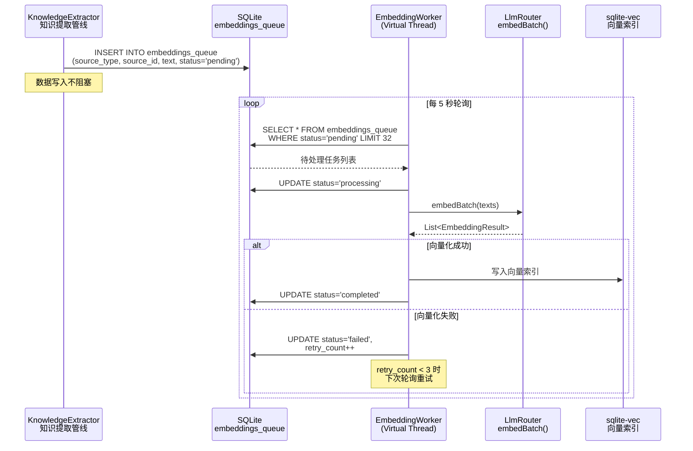

```java
/**
 * Embedding 异步处理工作线程。
 * 定时从 embeddings_queue 表消费待处理任务，批量调用 LlmRouter.embedBatch()。
 *
 * <p>使用 Virtual Thread 执行，不占用平台线程池。</p>
 */
@Component
public class EmbeddingWorker {

    private static final Logger log = LoggerFactory.getLogger(EmbeddingWorker.class);
    private static final int POLL_BATCH_SIZE = 32;
    private static final int MAX_RETRY_COUNT = 3;

    private final JdbcTemplate jdbcTemplate;
    private final LlmRouter llmRouter;
    private final EmbeddingDimensionNormalizer normalizer;

    public EmbeddingWorker(
            @Qualifier("mainDataSource") DataSource dataSource,
            LlmRouter llmRouter,
            EmbeddingDimensionNormalizer normalizer) {
        this.jdbcTemplate = new JdbcTemplate(dataSource);
        this.llmRouter = llmRouter;
        this.normalizer = normalizer;
    }

    /** 定时轮询处理（每 5 秒）。 */
    @Scheduled(fixedDelay = 5000)
    public void processPendingEmbeddings() {
        List<Map<String, Object>> pending = jdbcTemplate.queryForList("""
            SELECT id, source_type, source_id, text_content
            FROM embeddings_queue
            WHERE status IN ('pending', 'failed')
              AND retry_count < ?
            ORDER BY created_at ASC
            LIMIT ?
            """, MAX_RETRY_COUNT, POLL_BATCH_SIZE);

        if (pending.isEmpty()) return;

        log.debug("Embedding 队列处理: 待处理={}", pending.size());

        // 标记为处理中
        List<Integer> ids = pending.stream()
            .map(row -> ((Number) row.get("id")).intValue())
            .toList();
        markProcessing(ids);

        // 提取文本并批量向量化
        List<String> texts = pending.stream()
            .map(row -> (String) row.get("text_content"))
            .toList();

        try {
            List<EmbeddingResult> results = llmRouter.embedBatch(texts);

            // 归一化并存储
            for (int i = 0; i < results.size(); i++) {
                EmbeddingResult normalized = normalizer.normalize(results.get(i));
                int queueId = ids.get(i);
                String sourceType = (String) pending.get(i).get("source_type");
                String sourceId = (String) pending.get(i).get("source_id");
                storeEmbedding(sourceType, sourceId, normalized);
                markCompleted(queueId);
            }
            log.info("Embedding 队列处理完成: 成功={}", results.size());
        } catch (Exception e) {
            log.warn("Embedding 队列处理失败: 错误={}", e.getMessage());
            markFailed(ids);
        }
    }

    private void markProcessing(List<Integer> ids) {
        jdbcTemplate.update(
            "UPDATE embeddings_queue SET status='processing', "
                + "updated_at=datetime('now') WHERE id IN ("
                + ids.stream().map(String::valueOf)
                    .collect(Collectors.joining(",")) + ")");
    }

    private void markCompleted(int id) {
        jdbcTemplate.update(
            "UPDATE embeddings_queue SET status='completed', "
                + "updated_at=datetime('now') WHERE id=?", id);
    }

    private void markFailed(List<Integer> ids) {
        jdbcTemplate.update(
            "UPDATE embeddings_queue SET status='failed', "
                + "retry_count=retry_count+1, updated_at=datetime('now') "
                + "WHERE id IN (" + ids.stream().map(String::valueOf)
                    .collect(Collectors.joining(",")) + ")");
    }

    private void storeEmbedding(String sourceType, String sourceId,
                                 EmbeddingResult result) {
        // 根据 sourceType 写入对应表的 embedding_blob 列
        // 具体实现依赖 sourceType（entity / chunk / message 等）
        log.debug("存储 Embedding: sourceType={}, sourceId={}, dimension={}",
            sourceType, sourceId, result.dimension());
    }
}
```


---

## 12. 可观测性集成

### 12.1 设计思路

LLM 路由层的可观测性是 LifePilot 整体可观测性体系（参见 [observability.md](observability.md)）的关键组成部分。与传统 API 的可观测性不同，LLM 调用的可观测性需要关注**成本维度**——每次调用都有 Token 消耗和费用，用户需要清晰地了解"钱花在了哪里"。

可观测性集成的三个层次：

1. **调用级追踪**：每次 LLM 调用的完整链路信息（`LlmCallEvent`，已在 §10.4 定义）
2. **聚合级指标**：按 Provider、场景、时间维度聚合的统计指标
3. **运维级端点**：通过 Spring Boot Actuator 暴露的健康检查和管理端点

### 12.2 与 TraceRecorder 的集成

`LlmCallEvent`（§10.4）是 LLM 路由层与可观测性模块的桥梁。每次 LLM 调用产生的事件通过 `LlmUsageTracker`（§10.5）异步写入 `llm_usage_stats` 表，同时通过 `TraceAdvisor`（§5.5）将调用信息注入到 Agent 执行轨迹中。

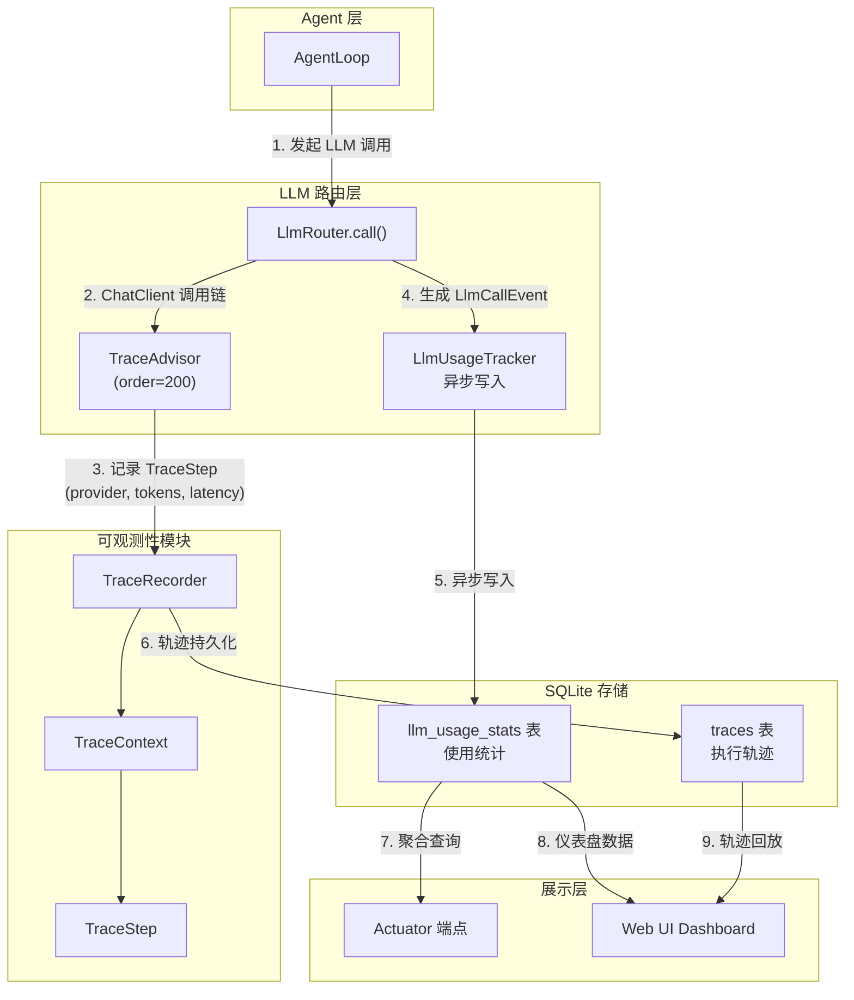

### 12.3 指标体系

LLM 路由层需要追踪的指标分为四个维度：Provider 维度、场景维度、熔断器维度和预算维度。

#### 指标定义

| 维度 | 指标名 | 类型 | 说明 | 计算方式 |
|------|--------|------|------|---------|
| **Provider** | `llm.provider.latency.p50` | Gauge | P50 延迟（ms） | 滑动窗口百分位 |
| | `llm.provider.latency.p95` | Gauge | P95 延迟（ms） | 滑动窗口百分位 |
| | `llm.provider.latency.p99` | Gauge | P99 延迟（ms） | 滑动窗口百分位 |
| | `llm.provider.success.rate` | Gauge | 成功率（%） | 成功数 / 总调用数 |
| | `llm.provider.tokens.input` | Counter | 累计输入 Token | 单调递增 |
| | `llm.provider.tokens.output` | Counter | 累计输出 Token | 单调递增 |
| | `llm.provider.cost.total` | Counter | 累计成本（分） | 单调递增 |
| **场景** | `llm.scene.call.count` | Counter | 调用次数 | 按场景分组计数 |
| | `llm.scene.tokens.avg` | Gauge | 平均 Token 消耗 | 滑动窗口平均 |
| | `llm.scene.cost.avg` | Gauge | 平均成本（分） | 滑动窗口平均 |
| | `llm.scene.cache.hit.rate` | Gauge | 缓存命中率（%） | 缓存命中 / 总调用 |
| **熔断器** | `llm.circuit.state` | Gauge | 状态分布 | CLOSED=0, OPEN=1, HALF_OPEN=2 |
| | `llm.circuit.trip.count` | Counter | 熔断触发次数 | 单调递增 |
| | `llm.circuit.recovery.time` | Gauge | 平均恢复时间（s） | OPEN→CLOSED 耗时 |
| **预算** | `llm.budget.daily.used` | Gauge | 日已用预算（分） | 当日累计 |
| | `llm.budget.monthly.used` | Gauge | 月已用预算（分） | 当月累计 |
| | `llm.budget.monthly.projected` | Gauge | 月预测支出（分） | 线性外推 |
| | `llm.budget.remaining` | Gauge | 剩余预算（分） | 月预算 - 已用 |
| **缓存** | `llm.cache.hit.rate` | Gauge | 总体命中率（%） | 命中 / 查询 |
| | `llm.cache.similarity.avg` | Gauge | 平均命中相似度 | 命中时的相似度均值 |
| | `llm.cache.saved.cost` | Counter | 缓存节省成本（分） | 命中时的估算成本 |

### 12.4 LlmMetricsCollector — 指标采集器

```java
/**
 * LLM 指标采集器。
 * 定时从 llm_usage_stats 表聚合指标，供 Actuator 端点和 Web UI 仪表盘使用。
 *
 * <p>采集周期：每 60 秒聚合一次。指标缓存在内存中，
 * Actuator 端点和 Dashboard API 直接读取缓存，避免频繁查询数据库。</p>
 */
@Component
public class LlmMetricsCollector {

    private static final Logger log =
        LoggerFactory.getLogger(LlmMetricsCollector.class);

    private final JdbcTemplate jdbcTemplate;
    private final CircuitBreakerManager circuitBreakerManager;
    private final SemanticCache semanticCache;
    private final TokenBudgetManager tokenBudgetManager;
    private final ProviderRegistry providerRegistry;

    /** 缓存的指标快照，volatile 保证可见性。 */
    private volatile LlmMetricsSnapshot latestSnapshot;

    public LlmMetricsCollector(
            @Qualifier("mainDataSource") DataSource dataSource,
            CircuitBreakerManager circuitBreakerManager,
            @Nullable SemanticCache semanticCache,
            TokenBudgetManager tokenBudgetManager,
            ProviderRegistry providerRegistry) {
        this.jdbcTemplate = new JdbcTemplate(dataSource);
        this.circuitBreakerManager = circuitBreakerManager;
        this.semanticCache = semanticCache;
        this.tokenBudgetManager = tokenBudgetManager;
        this.providerRegistry = providerRegistry;
    }

    /** 定时采集（每 60 秒）。 */
    @Scheduled(fixedDelay = 60_000)
    public void collect() {
        try {
            Instant now = Instant.now();
            var providerMetrics = collectProviderMetrics();
            var sceneMetrics = collectSceneMetrics();
            var circuitMetrics = collectCircuitBreakerMetrics();
            var budgetMetrics = collectBudgetMetrics();
            var cacheMetrics = collectCacheMetrics();

            latestSnapshot = new LlmMetricsSnapshot(
                providerMetrics, sceneMetrics, circuitMetrics,
                budgetMetrics, cacheMetrics, now);

            log.debug("LLM 指标采集完成: providers={}, scenes={}",
                providerMetrics.size(), sceneMetrics.size());
        } catch (Exception e) {
            log.warn("LLM 指标采集失败: {}", e.getMessage());
        }
    }

    /** 获取最新指标快照。 */
    public Optional<LlmMetricsSnapshot> getLatestSnapshot() {
        return Optional.ofNullable(latestSnapshot);
    }

    /** 采集 Provider 维度指标。 */
    private Map<String, ProviderMetrics> collectProviderMetrics() {
        // 查询最近 1 小时的调用统计
        List<Map<String, Object>> rows = jdbcTemplate.queryForList("""
            SELECT provider_id,
                   COUNT(*) as call_count,
                   SUM(CASE WHEN success = 1 THEN 1 ELSE 0 END) as success_count,
                   SUM(input_tokens) as total_input_tokens,
                   SUM(output_tokens) as total_output_tokens,
                   SUM(cost_cents) as total_cost,
                   AVG(latency_ms) as avg_latency
            FROM llm_usage_stats
            WHERE timestamp >= datetime('now', '-1 hour')
            GROUP BY provider_id
            """);

        Map<String, ProviderMetrics> metrics = new HashMap<>();
        for (Map<String, Object> row : rows) {
            String providerId = (String) row.get("provider_id");
            int callCount = ((Number) row.get("call_count")).intValue();
            int successCount = ((Number) row.get("success_count")).intValue();
            metrics.put(providerId, new ProviderMetrics(
                providerId,
                callCount,
                callCount > 0 ? successCount * 100.0 / callCount : 0.0,
                ((Number) row.get("avg_latency")).doubleValue(),
                collectLatencyPercentiles(providerId),
                ((Number) row.get("total_input_tokens")).longValue(),
                ((Number) row.get("total_output_tokens")).longValue(),
                ((Number) row.get("total_cost")).intValue()
            ));
        }
        return Map.copyOf(metrics);
    }

    /** 采集延迟百分位数（P50/P95/P99）。 */
    private LatencyPercentiles collectLatencyPercentiles(String providerId) {
        List<Long> latencies = jdbcTemplate.queryForList("""
            SELECT latency_ms FROM llm_usage_stats
            WHERE provider_id = ? AND success = 1
              AND timestamp >= datetime('now', '-1 hour')
            ORDER BY latency_ms
            """, Long.class, providerId);

        if (latencies.isEmpty()) {
            return new LatencyPercentiles(0, 0, 0);
        }
        return new LatencyPercentiles(
            percentile(latencies, 50),
            percentile(latencies, 95),
            percentile(latencies, 99));
    }

    /** 采集场景维度指标。 */
    private Map<String, SceneMetrics> collectSceneMetrics() {
        List<Map<String, Object>> rows = jdbcTemplate.queryForList("""
            SELECT scene,
                   COUNT(*) as call_count,
                   AVG(input_tokens + output_tokens) as avg_tokens,
                   AVG(cost_cents) as avg_cost,
                   SUM(CASE WHEN cache_hit = 1 THEN 1 ELSE 0 END) as cache_hits
            FROM llm_usage_stats
            WHERE timestamp >= datetime('now', '-24 hours')
            GROUP BY scene
            """);

        Map<String, SceneMetrics> metrics = new HashMap<>();
        for (Map<String, Object> row : rows) {
            String scene = (String) row.get("scene");
            int callCount = ((Number) row.get("call_count")).intValue();
            int cacheHits = ((Number) row.get("cache_hits")).intValue();
            metrics.put(scene, new SceneMetrics(
                scene, callCount,
                ((Number) row.get("avg_tokens")).doubleValue(),
                ((Number) row.get("avg_cost")).doubleValue(),
                callCount > 0 ? cacheHits * 100.0 / callCount : 0.0
            ));
        }
        return Map.copyOf(metrics);
    }

    /** 采集熔断器维度指标。 */
    private List<CircuitBreakerMetrics> collectCircuitBreakerMetrics() {
        return providerRegistry.registeredIds().stream()
            .flatMap(providerId -> {
                var chatState = circuitBreakerManager
                    .getState(providerId, "chat");
                var embeddingState = circuitBreakerManager
                    .getState(providerId, "embedding");
                return java.util.stream.Stream.of(
                    new CircuitBreakerMetrics(
                        providerId, "chat", chatState.stateName()),
                    new CircuitBreakerMetrics(
                        providerId, "embedding", embeddingState.stateName())
                );
            })
            .toList();
    }

    /** 采集预算维度指标。 */
    private BudgetMetrics collectBudgetMetrics() {
        var monthlyUsage = tokenBudgetManager.getMonthlyUsage();
        return new BudgetMetrics(
            monthlyUsage.totalCostCents(),
            monthlyUsage.budgetCents(),
            monthlyUsage.budgetCents() - monthlyUsage.totalCostCents(),
            monthlyUsage.usagePercent(),
            tokenBudgetManager.checkBudget("chat").getClass().getSimpleName()
        );
    }

    /** 采集缓存维度指标。 */
    private CacheMetrics collectCacheMetrics() {
        if (semanticCache == null) {
            return new CacheMetrics(0.0, 0.0, 0, false);
        }
        var stats = semanticCache.getStats();
        return new CacheMetrics(
            stats.hitRate(), stats.avgSimilarity(),
            stats.savedCostCents(), true);
    }

    /** 百分位数计算。 */
    private static long percentile(List<Long> sorted, int p) {
        int index = (int) Math.ceil(p / 100.0 * sorted.size()) - 1;
        return sorted.get(Math.max(0, Math.min(index, sorted.size() - 1)));
    }
}
```

### 12.5 指标数据模型

```java
/**
 * LLM 指标快照 record。
 * 包含所有维度的指标数据，供 Actuator 端点和 Dashboard 使用。
 */
public record LlmMetricsSnapshot(
    Map<String, ProviderMetrics> providerMetrics,
    Map<String, SceneMetrics> sceneMetrics,
    List<CircuitBreakerMetrics> circuitBreakerMetrics,
    BudgetMetrics budgetMetrics,
    CacheMetrics cacheMetrics,
    Instant collectedAt
) {}

/** Provider 维度指标。 */
public record ProviderMetrics(
    String providerId,
    int callCount,
    double successRate,
    double avgLatencyMs,
    LatencyPercentiles latencyPercentiles,
    long totalInputTokens,
    long totalOutputTokens,
    int totalCostCents
) {}

/** 延迟百分位数。 */
public record LatencyPercentiles(long p50, long p95, long p99) {}

/** 场景维度指标。 */
public record SceneMetrics(
    String scene,
    int callCount,
    double avgTokens,
    double avgCostCents,
    double cacheHitRate
) {}

/** 熔断器维度指标。 */
public record CircuitBreakerMetrics(
    String providerId,
    String capabilityType,
    String state
) {}

/** 预算维度指标。 */
public record BudgetMetrics(
    int usedCents,
    int budgetCents,
    int remainingCents,
    int usagePercent,
    String budgetState
) {}

/** 缓存维度指标。 */
public record CacheMetrics(
    double hitRate,
    double avgSimilarity,
    int savedCostCents,
    boolean enabled
) {}
```

### 12.6 Actuator 端点

通过 Spring Boot Actuator 暴露 LLM 路由层的运维端点，支持健康检查、指标查询和管理操作。

| 端点路径 | HTTP 方法 | 说明 | 返回数据 |
|---------|-----------|------|---------|
| `/actuator/llm/providers` | GET | Provider 状态和健康信息 | 所有 Provider 的配置、健康状态、熔断器状态 |
| `/actuator/llm/budget` | GET | 预算概览 | 日/月使用量、剩余预算、预算状态、成本预测 |
| `/actuator/llm/cache` | GET | 缓存统计 | 命中率、平均相似度、节省成本、条目数 |
| `/actuator/llm/cache` | DELETE | 清空缓存 | 清空结果确认 |
| `/actuator/llm/circuit-breakers` | GET | 熔断器状态 | 所有熔断器的当前状态和历史统计 |
| `/actuator/llm/circuit-breakers/{id}` | POST | 重置熔断器 | 重置指定熔断器为 CLOSED 状态 |
| `/actuator/llm/metrics` | GET | 聚合指标快照 | 完整的 LlmMetricsSnapshot |

```java
/**
 * LLM 路由层 Actuator 端点。
 * 暴露 Provider 状态、预算、缓存和熔断器的运维信息。
 */
@Component
@Endpoint(id = "llm")
public class LlmActuatorEndpoint {

    private static final Logger log =
        LoggerFactory.getLogger(LlmActuatorEndpoint.class);

    private final ProviderRegistry providerRegistry;
    private final TokenBudgetManager tokenBudgetManager;
    private final @Nullable SemanticCache semanticCache;
    private final CircuitBreakerManager circuitBreakerManager;
    private final LlmMetricsCollector metricsCollector;

    public LlmActuatorEndpoint(
            ProviderRegistry providerRegistry,
            TokenBudgetManager tokenBudgetManager,
            @Nullable SemanticCache semanticCache,
            CircuitBreakerManager circuitBreakerManager,
            LlmMetricsCollector metricsCollector) {
        this.providerRegistry = providerRegistry;
        this.tokenBudgetManager = tokenBudgetManager;
        this.semanticCache = semanticCache;
        this.circuitBreakerManager = circuitBreakerManager;
        this.metricsCollector = metricsCollector;
    }

    /** GET /actuator/llm/providers — Provider 状态。 */
    @ReadOperation
    @Selector(match = Selector.Match.SINGLE)
    public Object readSubEndpoint(@Selector String subPath) {
        return switch (subPath) {
            case "providers" -> getProviderStatus();
            case "budget" -> getBudgetOverview();
            case "cache" -> getCacheStats();
            case "circuit-breakers" -> getCircuitBreakerStates();
            case "metrics" -> metricsCollector.getLatestSnapshot().orElse(null);
            default -> Map.of("error", "未知端点: " + subPath);
        };
    }

    /** 获取所有 Provider 的状态信息。 */
    private List<Map<String, Object>> getProviderStatus() {
        Map<String, Boolean> healthStatus = providerRegistry.healthCheckAll();
        return providerRegistry.registeredIds().stream()
            .map(id -> {
                var config = providerRegistry.getConfig(id).orElseThrow();
                var chatState = circuitBreakerManager.getState(id, "chat");
                var embeddingState = circuitBreakerManager
                    .getState(id, "embedding");
                return Map.<String, Object>of(
                    "id", id,
                    "type", config.type().configKey(),
                    "model", config.modelName(),
                    "priority", config.priority(),
                    "healthy", healthStatus.getOrDefault(id, false),
                    "chatCircuitState", chatState.stateName(),
                    "embeddingCircuitState", embeddingState.stateName(),
                    "isLocal", config.isLocal(),
                    "enabled", config.enabled()
                );
            })
            .toList();
    }

    /** 获取预算概览。 */
    private Map<String, Object> getBudgetOverview() {
        var monthlyUsage = tokenBudgetManager.getMonthlyUsage();
        var budgetDecision = tokenBudgetManager.checkBudget("chat");
        String state = switch (budgetDecision) {
            case BudgetDecision.Ok ok -> "OK";
            case BudgetDecision.Warn warn -> "WARN";
            case BudgetDecision.Blocked blocked -> "BLOCKED";
        };
        return Map.of(
            "monthlyBudgetCents", monthlyUsage.budgetCents(),
            "monthlyUsedCents", monthlyUsage.totalCostCents(),
            "monthlyRemainingCents",
                monthlyUsage.budgetCents() - monthlyUsage.totalCostCents(),
            "usagePercent", monthlyUsage.usagePercent(),
            "budgetState", state
        );
    }

    /** 获取缓存统计。 */
    private Map<String, Object> getCacheStats() {
        if (semanticCache == null) {
            return Map.of("enabled", false);
        }
        var stats = semanticCache.getStats();
        return Map.of(
            "enabled", true,
            "hitRate", stats.hitRate(),
            "avgSimilarity", stats.avgSimilarity(),
            "savedCostCents", stats.savedCostCents(),
            "totalEntries", stats.totalEntries(),
            "totalQueries", stats.totalQueries()
        );
    }

    /** 获取熔断器状态。 */
    private List<Map<String, Object>> getCircuitBreakerStates() {
        return providerRegistry.registeredIds().stream()
            .flatMap(id -> java.util.stream.Stream.of("chat", "embedding")
                .map(cap -> {
                    var state = circuitBreakerManager.getState(id, cap);
                    return Map.<String, Object>of(
                        "providerId", id,
                        "capability", cap,
                        "state", state.stateName(),
                        "callPermitted",
                            circuitBreakerManager.isCallPermitted(id, cap)
                    );
                }))
            .toList();
    }

    /** DELETE /actuator/llm/cache — 清空缓存。 */
    @DeleteOperation
    @Selector(match = Selector.Match.SINGLE)
    public Map<String, Object> deleteSubEndpoint(@Selector String subPath) {
        if ("cache".equals(subPath) && semanticCache != null) {
            semanticCache.invalidate(null); // null = 清空所有
            log.info("语义缓存已手动清空");
            return Map.of("success", true, "message", "缓存已清空");
        }
        return Map.of("success", false, "message", "不支持的操作: " + subPath);
    }

    /** POST /actuator/llm/circuit-breakers/{id} — 重置熔断器。 */
    @WriteOperation
    public Map<String, Object> resetCircuitBreaker(
            @Selector String providerId, @Selector String capability) {
        circuitBreakerManager.reset(providerId, capability);
        log.info("熔断器已手动重置: providerId={}, capability={}",
            providerId, capability);
        return Map.of(
            "success", true,
            "providerId", providerId,
            "capability", capability,
            "newState", "CLOSED"
        );
    }
}
```

### 12.7 Dashboard 数据模型

Web UI 仪表盘通过 REST API 获取 LLM 指标数据，前端使用 Vue 3 + Pinia 管理状态，ECharts 渲染图表。

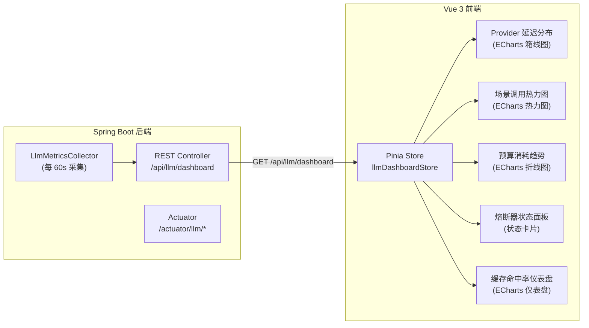

**Dashboard REST API**：

```java
/**
 * LLM Dashboard REST 控制器。
 * 为 Web UI 提供仪表盘数据。
 */
@RestController
@RequestMapping("/api/llm/dashboard")
public class LlmDashboardController {

    private final LlmMetricsCollector metricsCollector;
    private final LlmUsageTracker usageTracker;

    public LlmDashboardController(LlmMetricsCollector metricsCollector,
                                   LlmUsageTracker usageTracker) {
        this.metricsCollector = metricsCollector;
        this.usageTracker = usageTracker;
    }

    /** 获取仪表盘概览数据。 */
    @GetMapping("/overview")
    public LlmMetricsSnapshot getOverview() {
        return metricsCollector.getLatestSnapshot()
            .orElseThrow(() -> new ResponseStatusException(
                HttpStatus.SERVICE_UNAVAILABLE, "指标数据尚未就绪"));
    }

    /** 获取指定时间范围的使用趋势。 */
    @GetMapping("/trend")
    public List<DailyUsageTrend> getUsageTrend(
            @RequestParam(defaultValue = "30") int days) {
        Instant from = Instant.now().minus(Duration.ofDays(days));
        return usageTracker.getDailyTrend(from, Instant.now());
    }

    /**
     * 每日使用趋势 record。
     */
    public record DailyUsageTrend(
        String date,
        int callCount,
        long totalTokens,
        int costCents,
        double cacheHitRate
    ) {}
}
```


---

## 13. 配置参考

### 13.1 完整配置结构

以下是 `application.yml` 中 `lifepilot.llm` 前缀下的完整配置参考。所有配置项均通过 `LlmConfigProperties`（§3.4）绑定。

```yaml
lifepilot:
  llm:
    # ========== 全局开关 ==========
    enabled: true                          # 是否启用 LLM 路由层（默认 true）

    # ========== Provider 配置 ==========
    providers:
      # --- Ollama 本地 Chat 模型 ---
      ollama-qwen2.5:
        type: ollama                       # Provider 类型（见 ProviderType 枚举）
        api-url: http://localhost:11434    # Ollama API 地址
        # api-key:                         # Ollama 无需 API 密钥
        model-name: qwen2.5:7b            # 模型名称
        timeout-seconds: 60               # 请求超时（秒），默认 30
        priority: 0                        # 优先级（0 = 最高）
        scenes:                            # 支持的场景列表
          - intent_understanding
          - task_planning
          - knowledge_extraction
          - chat
          - memory_compression
          - proactive_reasoning
          - code_generation
        capabilities:                      # 支持的能力集合
          - CHAT
          - STRUCTURED_OUTPUT
          - FUNCTION_CALLING
          - STREAMING
        enabled: true                      # 是否启用
        cost-per-input-token: 0            # 输入 Token 成本（分/百万 Token）
        cost-per-output-token: 0           # 输出 Token 成本（分/百万 Token）
        max-context-window: 32768          # 最大上下文窗口（Token 数）
        supports-streaming: true           # 是否支持 SSE 流式输出

      # --- Ollama 本地 Embedding 模型 ---
      ollama-nomic-embed:
        type: ollama
        api-url: http://localhost:11434
        model-name: nomic-embed-text:v1.5
        timeout-seconds: 30
        priority: 0
        scenes:
          - embedding
        capabilities:
          - EMBEDDING
        enabled: true
        cost-per-input-token: 0
        cost-per-output-token: 0
        max-context-window: 8192
        embedding-dimension: 768           # Embedding 维度（仅 Embedding 模型）

      # --- DeepSeek 云端模型 ---
      deepseek-chat:
        type: deepseek
        api-url: https://api.deepseek.com
        api-key: ${DEEPSEEK_API_KEY:}      # 环境变量注入，禁止硬编码
        model-name: deepseek-chat
        timeout-seconds: 30
        priority: 10
        scenes:
          - intent_understanding
          - task_planning
          - knowledge_extraction
          - chat
          - code_generation
          - document_summary
        capabilities:
          - CHAT
          - STRUCTURED_OUTPUT
          - FUNCTION_CALLING
          - STREAMING
        enabled: true
        cost-per-input-token: 100          # ¥1/百万 Token
        cost-per-output-token: 200         # ¥2/百万 Token
        max-context-window: 65536
        supports-streaming: true

      # --- 通义千问云端模型 ---
      qwen-plus:
        type: qwen
        api-url: https://dashscope.aliyuncs.com/compatible-mode
        api-key: ${QWEN_API_KEY:}
        model-name: qwen-plus
        timeout-seconds: 30
        priority: 20
        scenes:
          - chat
          - task_planning
          - document_summary
        capabilities:
          - CHAT
          - STRUCTURED_OUTPUT
          - FUNCTION_CALLING
          - STREAMING
          - VISION
        enabled: true
        cost-per-input-token: 80
        cost-per-output-token: 200
        max-context-window: 131072
        supports-streaming: true

      # --- 智谱 GLM 云端模型 ---
      glm-4-flash:
        type: glm
        api-url: https://open.bigmodel.cn/api/paas
        api-key: ${GLM_API_KEY:}
        model-name: glm-4-flash
        timeout-seconds: 30
        priority: 30
        scenes:
          - chat
          - memory_compression
          - proactive_reasoning
        capabilities:
          - CHAT
          - STRUCTURED_OUTPUT
          - FUNCTION_CALLING
          - STREAMING
        enabled: false                     # 默认禁用，用户按需启用
        cost-per-input-token: 50
        cost-per-output-token: 50
        max-context-window: 128000
        supports-streaming: true

      # --- OpenAI 兼容通用端点 ---
      openai-compatible-custom:
        type: openai-compatible
        api-url: ${CUSTOM_LLM_API_URL:http://localhost:8080}
        api-key: ${CUSTOM_LLM_API_KEY:}
        model-name: ${CUSTOM_LLM_MODEL:gpt-3.5-turbo}
        timeout-seconds: 30
        priority: 50
        scenes:
          - chat
        capabilities:
          - CHAT
        enabled: false
        cost-per-input-token: 0
        cost-per-output-token: 0
        max-context-window: 4096
        supports-streaming: false

    # ========== Token 预算配置 ==========
    budget:
      monthly-budget-cents: 5000           # 月度预算（分），5000 = ¥50
      daily-budget-cents: 200              # 日预算（分），200 = ¥2
      warn-threshold-percent: 80           # 警告阈值（%），达到后优先低成本模型
      block-threshold-percent: 95          # 阻断阈值（%），达到后仅允许本地模型

    # ========== 语义缓存配置 ==========
    cache:
      enabled: true                        # 是否启用语义缓存
      similarity-threshold: 0.92           # 余弦相似度命中阈值
      ttl-seconds: 3600                    # 缓存 TTL（秒），默认 1 小时
      max-entries: 10000                   # 最大缓存条目数

    # ========== 熔断器配置 ==========
    circuit-breaker:
      failure-threshold: 3                 # 连续失败阈值，达到后触发 OPEN
      reset-timeout-seconds: 60            # OPEN → HALF_OPEN 等待时间（秒）
      half-open-max-attempts: 1            # HALF_OPEN 最大探测次数
      retry-initial-delay-ms: 500          # 故障转移重试初始延迟（ms）
      retry-multiplier: 2.0               # 退避倍数
      retry-max-delay-ms: 5000             # 最大退避延迟（ms）

    # ========== Embedding 配置 ==========
    embedding:
      target-dimension: 768                # 目标归一化维度
      batch-size: 32                       # 批量处理大小
      worker-poll-interval-ms: 5000        # EmbeddingWorker 轮询间隔（ms）
      max-retry-count: 3                   # 队列任务最大重试次数
```

### 13.2 配置键参考表

| 配置键 | 类型 | 默认值 | 说明 | 运行时可变 |
|--------|------|--------|------|-----------|
| `lifepilot.llm.enabled` | `boolean` | `true` | LLM 路由层全局开关 | ❌ |
| **Provider 配置** | | | | |
| `lifepilot.llm.providers.{id}.type` | `String` | — | Provider 类型（必填） | ❌ |
| `lifepilot.llm.providers.{id}.api-url` | `String` | — | API 端点 URL（必填） | ❌ |
| `lifepilot.llm.providers.{id}.api-key` | `String` | `null` | API 密钥（环境变量注入） | ❌ |
| `lifepilot.llm.providers.{id}.model-name` | `String` | — | 模型名称（必填） | ❌ |
| `lifepilot.llm.providers.{id}.timeout-seconds` | `int` | `30` | 请求超时秒数 | ✅ |
| `lifepilot.llm.providers.{id}.priority` | `int` | `0` | 优先级（越小越高） | ✅ |
| `lifepilot.llm.providers.{id}.scenes` | `List<String>` | `[]` | 支持的场景列表 | ✅ |
| `lifepilot.llm.providers.{id}.capabilities` | `Set<String>` | `[CHAT]` | 能力集合 | ❌ |
| `lifepilot.llm.providers.{id}.enabled` | `boolean` | `true` | 是否启用 | ✅ |
| `lifepilot.llm.providers.{id}.cost-per-input-token` | `int` | `0` | 输入成本（分/百万 Token） | ✅ |
| `lifepilot.llm.providers.{id}.cost-per-output-token` | `int` | `0` | 输出成本（分/百万 Token） | ✅ |
| `lifepilot.llm.providers.{id}.max-context-window` | `int` | `4096` | 最大上下文窗口 | ❌ |
| `lifepilot.llm.providers.{id}.embedding-dimension` | `Integer` | `null` | Embedding 维度 | ❌ |
| `lifepilot.llm.providers.{id}.supports-streaming` | `boolean` | `false` | 是否支持流式输出 | ❌ |
| **预算配置** | | | | |
| `lifepilot.llm.budget.monthly-budget-cents` | `int` | `5000` | 月预算（分） | ✅ |
| `lifepilot.llm.budget.daily-budget-cents` | `int` | `200` | 日预算（分） | ✅ |
| `lifepilot.llm.budget.warn-threshold-percent` | `int` | `80` | 警告阈值（%） | ✅ |
| `lifepilot.llm.budget.block-threshold-percent` | `int` | `95` | 阻断阈值（%） | ✅ |
| **缓存配置** | | | | |
| `lifepilot.llm.cache.enabled` | `boolean` | `true` | 是否启用语义缓存 | ❌ |
| `lifepilot.llm.cache.similarity-threshold` | `double` | `0.92` | 相似度阈值 | ✅ |
| `lifepilot.llm.cache.ttl-seconds` | `int` | `3600` | 缓存 TTL（秒） | ✅ |
| `lifepilot.llm.cache.max-entries` | `int` | `10000` | 最大条目数 | ✅ |
| **熔断器配置** | | | | |
| `lifepilot.llm.circuit-breaker.failure-threshold` | `int` | `3` | 连续失败阈值 | ✅ |
| `lifepilot.llm.circuit-breaker.reset-timeout-seconds` | `int` | `60` | OPEN 等待时间 | ✅ |
| `lifepilot.llm.circuit-breaker.half-open-max-attempts` | `int` | `1` | HALF_OPEN 探测次数 | ✅ |
| `lifepilot.llm.circuit-breaker.retry-initial-delay-ms` | `int` | `500` | 重试初始延迟 | ✅ |
| `lifepilot.llm.circuit-breaker.retry-multiplier` | `double` | `2.0` | 退避倍数 | ✅ |
| `lifepilot.llm.circuit-breaker.retry-max-delay-ms` | `int` | `5000` | 最大退避延迟 | ✅ |
| **Embedding 配置** | | | | |
| `lifepilot.llm.embedding.target-dimension` | `int` | `768` | 目标归一化维度 | ❌ |
| `lifepilot.llm.embedding.batch-size` | `int` | `32` | 批量处理大小 | ✅ |
| `lifepilot.llm.embedding.worker-poll-interval-ms` | `int` | `5000` | 轮询间隔 | ✅ |
| `lifepilot.llm.embedding.max-retry-count` | `int` | `3` | 最大重试次数 | ✅ |

### 13.3 环境变量映射

所有敏感配置（API 密钥）通过环境变量注入，遵循安全规范（参见编码规范 §10）。

| 环境变量 | 对应配置键 | 说明 | 必填 |
|---------|-----------|------|------|
| `DEEPSEEK_API_KEY` | `lifepilot.llm.providers.deepseek-chat.api-key` | DeepSeek API 密钥 | 启用 DeepSeek 时必填 |
| `QWEN_API_KEY` | `lifepilot.llm.providers.qwen-plus.api-key` | 通义千问 API 密钥 | 启用 Qwen 时必填 |
| `GLM_API_KEY` | `lifepilot.llm.providers.glm-4-flash.api-key` | 智谱 GLM API 密钥 | 启用 GLM 时必填 |
| `WENXIN_API_KEY` | `lifepilot.llm.providers.wenxin-*.api-key` | 文心一言 API 密钥 | 启用文心时必填 |
| `CUSTOM_LLM_API_URL` | `lifepilot.llm.providers.openai-compatible-custom.api-url` | 自定义 LLM 端点 | 启用自定义时必填 |
| `CUSTOM_LLM_API_KEY` | `lifepilot.llm.providers.openai-compatible-custom.api-key` | 自定义 LLM 密钥 | 视端点要求 |
| `CUSTOM_LLM_MODEL` | `lifepilot.llm.providers.openai-compatible-custom.model-name` | 自定义模型名称 | 启用自定义时必填 |

**环境变量设置示例**：

```bash
# Linux / macOS
export DEEPSEEK_API_KEY="sk-xxxxxxxxxxxxxxxxxxxxxxxxxxxxxxxx"
export QWEN_API_KEY="sk-xxxxxxxxxxxxxxxxxxxxxxxxxxxxxxxx"

# 或通过 .env 文件（开发环境，不提交到版本控制）
echo "DEEPSEEK_API_KEY=sk-xxx" >> .env
echo "QWEN_API_KEY=sk-xxx" >> .env

# 启动时自动加载
java -jar lifepilot.jar
```

### 13.4 运行时配置更新

标记为"运行时可变"（✅）的配置项支持在不重启应用的情况下动态更新。运行时配置更新通过 REST API 实现：

```java
/**
 * LLM 配置运行时更新控制器。
 * 支持在不重启应用的情况下修改部分配置。
 *
 * <p>可更新的配置范围：
 * <ul>
 *   <li>Provider 启用/禁用、优先级、超时、成本参数</li>
 *   <li>预算阈值</li>
 *   <li>缓存参数（相似度阈值、TTL）</li>
 *   <li>熔断器参数</li>
 * </ul></p>
 *
 * <p>不可更新的配置（需要重启）：
 * <ul>
 *   <li>Provider 类型、API URL、API 密钥（涉及连接重建）</li>
 *   <li>模型名称、能力声明（涉及适配器重建）</li>
 *   <li>全局开关、缓存开关</li>
 *   <li>Embedding 目标维度（涉及已存储向量的兼容性）</li>
 * </ul></p>
 */
@RestController
@RequestMapping("/api/llm/config")
public class LlmConfigController {

    private static final Logger log =
        LoggerFactory.getLogger(LlmConfigController.class);

    private final LlmConfigProperties config;
    private final ProviderRegistry providerRegistry;
    private final TokenBudgetManager tokenBudgetManager;

    public LlmConfigController(LlmConfigProperties config,
                                ProviderRegistry providerRegistry,
                                TokenBudgetManager tokenBudgetManager) {
        this.config = config;
        this.providerRegistry = providerRegistry;
        this.tokenBudgetManager = tokenBudgetManager;
    }

    /** 更新 Provider 启用状态。 */
    @PatchMapping("/providers/{providerId}/enabled")
    public Map<String, Object> updateProviderEnabled(
            @PathVariable String providerId,
            @RequestParam boolean enabled) {
        var providerConfig = providerRegistry.getConfig(providerId)
            .orElseThrow(() -> new ResponseStatusException(
                HttpStatus.NOT_FOUND,
                "Provider 不存在: " + providerId));

        if (enabled && !providerConfig.enabled()) {
            providerRegistry.register(providerConfig);
            log.info("Provider 运行时启用: id={}", providerId);
        } else if (!enabled && providerConfig.enabled()) {
            providerRegistry.deregister(providerId);
            log.info("Provider 运行时禁用: id={}", providerId);
        }

        return Map.of("providerId", providerId, "enabled", enabled);
    }

    /** 更新预算配置。 */
    @PatchMapping("/budget")
    public Map<String, Object> updateBudget(
            @RequestBody BudgetUpdateRequest request) {
        if (request.monthlyBudgetCents() != null) {
            config.getBudget().setMonthlyBudgetCents(
                request.monthlyBudgetCents());
        }
        if (request.dailyBudgetCents() != null) {
            config.getBudget().setDailyBudgetCents(
                request.dailyBudgetCents());
        }
        if (request.warnThresholdPercent() != null) {
            config.getBudget().setWarnThresholdPercent(
                request.warnThresholdPercent());
        }
        if (request.blockThresholdPercent() != null) {
            config.getBudget().setBlockThresholdPercent(
                request.blockThresholdPercent());
        }
        log.info("预算配置运行时更新: {}", request);
        return Map.of("success", true, "budget", config.getBudget());
    }

    /**
     * 预算更新请求 record。
     */
    public record BudgetUpdateRequest(
        @Nullable Integer monthlyBudgetCents,
        @Nullable Integer dailyBudgetCents,
        @Nullable Integer warnThresholdPercent,
        @Nullable Integer blockThresholdPercent
    ) {}
}
```

### 13.5 配置校验规则

应用启动时，`LlmAutoConfiguration` 对配置进行校验，不合法的配置会导致启动失败并输出明确的错误信息。

```java
/**
 * LLM 配置校验器。
 * 在 Spring 容器初始化阶段校验 LLM 配置的合法性。
 *
 * <p>校验规则：
 * <ul>
 *   <li>至少有一个已启用的 Provider</li>
 *   <li>每个已启用的 Provider 必须有合法的 type、apiUrl、modelName</li>
 *   <li>云端 Provider 必须配置 apiKey（非空）</li>
 *   <li>预算阈值：0 < warn < block ≤ 100</li>
 *   <li>缓存相似度阈值：0.0 < threshold ≤ 1.0</li>
 *   <li>熔断器参数：failureThreshold > 0, resetTimeout > 0</li>
 *   <li>Provider ID 不能重复</li>
 *   <li>每个场景至少有一个 Provider 覆盖（警告级别，不阻断启动）</li>
 * </ul></p>
 */
@Component
public class LlmConfigValidator implements InitializingBean {

    private static final Logger log =
        LoggerFactory.getLogger(LlmConfigValidator.class);

    private final LlmConfigProperties config;

    public LlmConfigValidator(LlmConfigProperties config) {
        this.config = config;
    }

    @Override
    public void afterPropertiesSet() {
        List<String> errors = new ArrayList<>();
        List<String> warnings = new ArrayList<>();

        validateProviders(errors, warnings);
        validateBudget(errors);
        validateCache(errors);
        validateCircuitBreaker(errors);
        validateSceneCoverage(warnings);

        if (!warnings.isEmpty()) {
            warnings.forEach(w -> log.warn("LLM 配置警告: {}", w));
        }
        if (!errors.isEmpty()) {
            String message = "LLM 配置校验失败:\n  - "
                + String.join("\n  - ", errors);
            throw new IllegalStateException(message);
        }

        log.info("LLM 配置校验通过: providers={}, 警告={}",
            config.getProviders().size(), warnings.size());
    }

    private void validateProviders(List<String> errors, List<String> warnings) {
        var providers = config.getProviders();
        if (providers.isEmpty()) {
            errors.add("至少需要配置一个 Provider");
            return;
        }

        long enabledCount = providers.values().stream()
            .filter(ProviderConfig::enabled).count();
        if (enabledCount == 0) {
            errors.add("至少需要启用一个 Provider");
        }

        for (var entry : providers.entrySet()) {
            String id = entry.getKey();
            ProviderConfig pc = entry.getValue();
            if (!pc.enabled()) continue;

            if (pc.type() == null) {
                errors.add("Provider [%s] 缺少 type 配置".formatted(id));
            }
            if (pc.apiUrl() == null || pc.apiUrl().isBlank()) {
                errors.add("Provider [%s] 缺少 api-url 配置".formatted(id));
            }
            if (pc.modelName() == null || pc.modelName().isBlank()) {
                errors.add("Provider [%s] 缺少 model-name 配置".formatted(id));
            }
            // 云端 Provider 必须有 API 密钥
            if (!pc.isLocal()
                    && (pc.apiKey() == null || pc.apiKey().isBlank())) {
                warnings.add("云端 Provider [%s] 未配置 api-key，"
                    .formatted(id) + "可能导致调用失败");
            }
        }
    }

    private void validateBudget(List<String> errors) {
        var budget = config.getBudget();
        if (budget.warnThresholdPercent() <= 0
                || budget.warnThresholdPercent() >= 100) {
            errors.add("预算警告阈值必须在 (0, 100) 范围内");
        }
        if (budget.blockThresholdPercent() <= budget.warnThresholdPercent()
                || budget.blockThresholdPercent() > 100) {
            errors.add("预算阻断阈值必须大于警告阈值且 ≤ 100");
        }
    }

    private void validateCache(List<String> errors) {
        var cache = config.getCache();
        if (cache.enabled()) {
            if (cache.similarityThreshold() <= 0.0
                    || cache.similarityThreshold() > 1.0) {
                errors.add("缓存相似度阈值必须在 (0.0, 1.0] 范围内");
            }
            if (cache.ttlSeconds() <= 0) {
                errors.add("缓存 TTL 必须大于 0");
            }
        }
    }

    private void validateCircuitBreaker(List<String> errors) {
        var cb = config.getCircuitBreaker();
        if (cb.failureThreshold() <= 0) {
            errors.add("熔断器失败阈值必须大于 0");
        }
        if (cb.resetTimeoutSeconds() <= 0) {
            errors.add("熔断器重置超时必须大于 0");
        }
    }

    private void validateSceneCoverage(List<String> warnings) {
        Set<String> coveredScenes = config.getProviders().values().stream()
            .filter(ProviderConfig::enabled)
            .flatMap(pc -> pc.scenes().stream())
            .collect(Collectors.toSet());

        for (String scene : LlmScene.all()) {
            if (!coveredScenes.contains(scene)) {
                warnings.add("场景 [%s] 没有任何已启用的 Provider 覆盖"
                    .formatted(scene));
            }
        }
    }
}
```


---

## 14. 属性测试策略

### 14.1 设计思路

LLM 路由层包含多个有状态组件（熔断器、预算管理器、语义缓存、Provider 注册表），这些组件的正确性难以通过有限的示例测试覆盖。jqwik 属性测试通过随机生成大量输入，验证系统在任意合法输入下都满足不变量（invariant），是保障路由层可靠性的关键手段。

**属性测试覆盖的六个核心属性**：

| # | 属性名称 | 被测组件 | 不变量描述 |
|---|---------|---------|-----------|
| 1 | 熔断器状态机不变量 | `CircuitBreaker` | 状态转换遵循 CLOSED→OPEN→HALF_OPEN→CLOSED 循环，无非法跳转 |
| 2 | 路由确定性 | `LlmRouter.resolveProviders()` | 相同的 (scene, provider states) 输入产生相同的 Provider 选择 |
| 3 | 故障转移完备性 | `LlmRouter.executeWithFailover()` | 所有可用 Provider 都被尝试后才抛出异常 |
| 4 | Token 预算单调性 | `TokenBudgetManager` | 在同一计费周期内，预算使用量只增不减 |
| 5 | 缓存一致性 | `SemanticCache` | store 后 lookup 能返回存储的响应（相似度 = 1.0） |
| 6 | 注册表线程安全 | `ProviderRegistry` | 并发 register/deregister/findByScene 不丢失数据、不抛异常 |

### 14.2 测试配置

```java
/**
 * LLM 路由层属性测试基类。
 * 提供 Mock Provider、内存 SQLite 和测试用配置。
 */
abstract class LlmRouterPropertyTestBase {

    /** 创建 Mock ProviderAdapter（总是成功）。 */
    protected static ProviderAdapter mockSuccessAdapter(String providerId) {
        return new ProviderAdapter() {
            @Override
            public LlmResponse call(String prompt, String outputSchema,
                                     Duration timeout) {
                return new LlmResponse("mock response", 10, 20,
                    providerId, "mock-model", 100, false);
            }
            @Override
            public <T> T callEntity(String prompt, Class<T> responseType) {
                throw new UnsupportedOperationException("Mock 不支持");
            }
            @Override
            public float[] embed(String text) {
                return new float[]{0.1f, 0.2f, 0.3f};
            }
            @Override
            public Flux<String> stream(String prompt) {
                return Flux.just("mock", " stream");
            }
            @Override
            public Optional<ChatClient> chatClient() {
                return Optional.empty();
            }
            @Override
            public boolean healthCheck() { return true; }
        };
    }

    /** 创建 Mock ProviderAdapter（总是失败）。 */
    protected static ProviderAdapter mockFailureAdapter(String providerId) {
        return new ProviderAdapter() {
            @Override
            public LlmResponse call(String prompt, String outputSchema,
                                     Duration timeout) {
                throw new RuntimeException("Mock 调用失败: " + providerId);
            }
            @Override
            public <T> T callEntity(String prompt, Class<T> responseType) {
                throw new RuntimeException("Mock 调用失败: " + providerId);
            }
            @Override
            public float[] embed(String text) {
                throw new RuntimeException("Mock Embedding 失败: " + providerId);
            }
            @Override
            public Flux<String> stream(String prompt) {
                return Flux.error(
                    new RuntimeException("Mock 流式失败: " + providerId));
            }
            @Override
            public Optional<ChatClient> chatClient() {
                return Optional.empty();
            }
            @Override
            public boolean healthCheck() { return false; }
        };
    }

    /** 创建测试用 ProviderConfig。 */
    protected static ProviderConfig testProviderConfig(
            String id, int priority, List<String> scenes) {
        return new ProviderConfig(
            id, ProviderType.OLLAMA, "http://localhost:11434", null,
            "test-model", 30, priority, scenes,
            Set.of(ProviderCapability.CHAT, ProviderCapability.EMBEDDING),
            true, 0, 0, 32768, 768, true);
    }
}
```

### 14.3 属性 1：熔断器状态机不变量

> 此属性已在 §6.8 中详细展示，此处仅做引用和补充。

§6.8 的 `CircuitBreakerPropertyTest` 验证了四个子属性：

- **状态转换遵循单调循环**：不存在 CLOSED→HALF_OPEN 或 OPEN→CLOSED 的直接跳转
- **失败计数达到阈值必须触发熔断**：`consecutiveFailures >= failureThreshold` 时状态必须是 OPEN
- **HALF_OPEN 状态限制探测次数**：最多允许 `halfOpenMaxAttempts` 次探测调用
- **成功调用重置失败计数**：成功后 `consecutiveFailures` 归零

### 14.4 属性 2：路由确定性

```java
/**
 * 路由确定性属性测试。
 * 验证：相同的 (scene, provider states) 输入，resolveProviders() 返回相同的 Provider 列表。
 *
 * <p>这是行为一致性原则（§1.3 原则 3）的形式化验证——
 * 路由决策是确定性函数，不依赖随机因素。</p>
 */
class RoutingDeterminismPropertyTest extends LlmRouterPropertyTestBase {

    @Property(tries = 200)
    void 相同输入产生相同路由结果(
            @ForAll("sceneArbitrary") String scene,
            @ForAll @IntRange(min = 1, max = 5) int providerCount,
            @ForAll boolean preferCheap) {

        // 构建确定性的 Provider 列表
        List<ProviderConfig> providers = new ArrayList<>();
        for (int i = 0; i < providerCount; i++) {
            providers.add(testProviderConfig(
                "provider-" + i, i * 10, List.of(scene)));
        }

        // 构建 ProviderRegistry（Mock）
        var registry = new TestProviderRegistry(providers);
        var circuitBreakerManager = new CircuitBreakerManager(
            new LlmConfigProperties.CircuitBreakerConfig(3, 60, 1, 500, 2.0, 5000));

        // 第一次解析
        List<ProviderConfig> result1 = resolveProviders(
            registry, circuitBreakerManager, scene,
            ProviderCapability.CHAT, preferCheap);

        // 第二次解析（相同输入）
        List<ProviderConfig> result2 = resolveProviders(
            registry, circuitBreakerManager, scene,
            ProviderCapability.CHAT, preferCheap);

        // 验证：两次结果完全一致（顺序和内容）
        assertThat(result1.stream().map(ProviderConfig::id).toList())
            .isEqualTo(result2.stream().map(ProviderConfig::id).toList());
    }

    /** 提取 LlmRouter.resolveProviders 的逻辑用于测试。 */
    private List<ProviderConfig> resolveProviders(
            TestProviderRegistry registry,
            CircuitBreakerManager cbm,
            String scene, ProviderCapability capability,
            boolean preferCheap) {
        String capabilityType = capability.name().toLowerCase();
        List<ProviderConfig> available = registry.findByScene(scene).stream()
            .filter(config -> config.hasCapability(capability))
            .filter(config -> cbm.isCallPermitted(config.id(), capabilityType))
            .toList();

        if (preferCheap) {
            return available.stream()
                .sorted(Comparator
                    .<ProviderConfig, Boolean>comparing(c -> !c.isLocal())
                    .thenComparingInt(ProviderConfig::costPerOutputToken)
                    .thenComparingInt(ProviderConfig::priority))
                .toList();
        }
        return available.stream()
            .sorted(Comparator.comparingInt(ProviderConfig::priority))
            .toList();
    }

    @Provide
    Arbitrary<String> sceneArbitrary() {
        return Arbitraries.of(LlmScene.all());
    }
}
```

### 14.5 属性 3：故障转移完备性

```java
/**
 * 故障转移完备性属性测试。
 * 验证：当所有 Provider 都失败时，每个可用 Provider 都被尝试过。
 *
 * <p>这是渐进降级原则（§1.3 原则 5）的形式化验证——
 * 路由层不会遗漏任何可用的 Provider。</p>
 */
class FailoverCompletenessPropertyTest extends LlmRouterPropertyTestBase {

    @Property(tries = 100)
    void 所有可用Provider都被尝试后才抛出异常(
            @ForAll @IntRange(min = 1, max = 8) int providerCount,
            @ForAll("sceneArbitrary") String scene) {

        // 构建全部失败的 Provider
        List<ProviderConfig> providers = new ArrayList<>();
        List<String> expectedAttempted = new ArrayList<>();
        for (int i = 0; i < providerCount; i++) {
            String id = "fail-provider-" + i;
            providers.add(testProviderConfig(id, i * 10, List.of(scene)));
            expectedAttempted.add(id);
        }

        // 记录实际尝试的 Provider
        List<String> actualAttempted =
            Collections.synchronizedList(new ArrayList<>());

        // 执行故障转移（所有 Provider 都会失败）
        try {
            executeFailoverWithTracking(
                providers, scene, actualAttempted);
            // 不应到达此处
            throw new AssertionError("应该抛出 LlmUnavailableException");
        } catch (LlmUnavailableException e) {
            // 验证：所有 Provider 都被尝试过
            assertThat(actualAttempted)
                .containsExactlyElementsOf(expectedAttempted);

            // 验证：异常中携带了所有尝试过的 Provider
            assertThat(e.attemptedProviders())
                .containsExactlyElementsOf(expectedAttempted);
        }
    }

    /** 带追踪的故障转移执行。 */
    private void executeFailoverWithTracking(
            List<ProviderConfig> providers, String scene,
            List<String> tracker) {
        List<String> attempted = new ArrayList<>();
        Exception lastException = null;

        for (ProviderConfig config : providers) {
            attempted.add(config.id());
            tracker.add(config.id());
            try {
                // 模拟调用失败
                throw new RuntimeException(
                    "Mock 调用失败: " + config.id());
            } catch (Exception e) {
                lastException = e;
            }
        }
        throw new LlmUnavailableException(
            "场景 [" + scene + "] 的所有 Provider 调用失败",
            scene, attempted, lastException);
    }

    @Provide
    Arbitrary<String> sceneArbitrary() {
        return Arbitraries.of(LlmScene.all());
    }
}
```

### 14.6 属性 4：Token 预算单调性

```java
/**
 * Token 预算单调性属性测试。
 * 验证：在同一计费周期内，预算使用量只增不减。
 *
 * <p>这是预算感知原则（§1.3 原则 4）的形式化验证——
 * 预算消耗是单调递增的，不会出现"回退"现象。</p>
 */
class TokenBudgetMonotonicityPropertyTest extends LlmRouterPropertyTestBase {

    @Property(tries = 200)
    void 预算使用量在计费周期内单调递增(
            @ForAll @IntRange(min = 1, max = 50) int eventCount,
            @ForAll("costSequence") List<Integer> costs) {

        // 使用内存 SQLite 构建 TokenBudgetManager
        var dataSource = createInMemoryDataSource();
        initSchema(dataSource);
        var jdbcTemplate = new JdbcTemplate(dataSource);
        var usageTracker = new LlmUsageTracker(jdbcTemplate, new DirectWriteSerializer());
        var budgetConfig = new LlmConfigProperties.BudgetConfig(
            5000, 200, 80, 95);
        var budgetManager = new TokenBudgetManager(budgetConfig, usageTracker);

        int previousUsage = 0;

        for (int i = 0; i < Math.min(eventCount, costs.size()); i++) {
            int cost = costs.get(i);

            // 记录一次 LLM 调用事件
            usageTracker.record(LlmCallEvent.success(
                "test-provider", "chat", "test-model",
                cost * 10, cost * 5, 100, cost));

            // 查询当前月度使用量
            var monthlyUsage = budgetManager.getMonthlyUsage();
            int currentUsage = monthlyUsage.totalCostCents();

            // 验证：使用量单调递增
            assertThat(currentUsage)
                .as("第 %d 次事件后，使用量应 >= 前一次（%d >= %d）",
                    i + 1, currentUsage, previousUsage)
                .isGreaterThanOrEqualTo(previousUsage);

            previousUsage = currentUsage;
        }
    }

    /**
     * 属性：预算状态转换遵循 OK → WARN → BLOCKED 单调递进。
     * 在使用量持续增加的情况下，预算状态不会从 BLOCKED 回退到 WARN 或 OK。
     */
    @Property(tries = 100)
    void 预算状态单调递进(
            @ForAll @IntRange(min = 10, max = 100) int eventCount) {

        var dataSource = createInMemoryDataSource();
        initSchema(dataSource);
        var jdbcTemplate = new JdbcTemplate(dataSource);
        var usageTracker = new LlmUsageTracker(jdbcTemplate, new DirectWriteSerializer());
        // 小预算便于快速触发状态转换
        var budgetConfig = new LlmConfigProperties.BudgetConfig(
            100, 50, 80, 95);
        var budgetManager = new TokenBudgetManager(budgetConfig, usageTracker);

        int maxStateOrdinal = 0; // OK=0, WARN=1, BLOCKED=2

        for (int i = 0; i < eventCount; i++) {
            // 每次消耗 2 分（100 分预算，50 次后耗尽）
            usageTracker.record(LlmCallEvent.success(
                "test-provider", "chat", "test-model",
                100, 50, 100, 2));

            BudgetDecision decision = budgetManager.checkBudget("chat");
            int currentOrdinal = switch (decision) {
                case BudgetDecision.Ok ok -> 0;
                case BudgetDecision.Warn warn -> 1;
                case BudgetDecision.Blocked blocked -> 2;
            };

            // 验证：状态只能前进或保持，不能后退
            assertThat(currentOrdinal)
                .as("第 %d 次事件后，预算状态不应后退", i + 1)
                .isGreaterThanOrEqualTo(maxStateOrdinal);

            maxStateOrdinal = Math.max(maxStateOrdinal, currentOrdinal);
        }
    }

    @Provide
    Arbitrary<List<Integer>> costSequence() {
        return Arbitraries.integers().between(1, 50)
            .list().ofMinSize(1).ofMaxSize(50);
    }

    private DataSource createInMemoryDataSource() {
        var ds = new org.sqlite.SQLiteDataSource();
        ds.setUrl("jdbc:sqlite::memory:");
        return ds;
    }

    private void initSchema(DataSource ds) {
        new JdbcTemplate(ds).execute("""
            CREATE TABLE IF NOT EXISTS llm_usage_stats (
                id INTEGER PRIMARY KEY AUTOINCREMENT,
                provider_id TEXT NOT NULL,
                scene TEXT NOT NULL,
                model_name TEXT NOT NULL,
                input_tokens INTEGER DEFAULT 0,
                output_tokens INTEGER DEFAULT 0,
                latency_ms INTEGER DEFAULT 0,
                cost_cents INTEGER DEFAULT 0,
                cache_hit INTEGER DEFAULT 0,
                success INTEGER DEFAULT 1,
                error_type TEXT,
                trace_id TEXT,
                timestamp TEXT DEFAULT (datetime('now')),
                created_at TEXT DEFAULT (datetime('now'))
            )
            """);
    }
}
```

### 14.7 属性 5：缓存一致性

```java
/**
 * 语义缓存一致性属性测试。
 * 验证：store 后立即 lookup（相同 prompt），必须返回存储的响应。
 *
 * <p>缓存一致性是语义缓存（§7）正确性的基本保障——
 * 如果存储的内容无法被检索到，缓存就失去了意义。</p>
 */
class SemanticCacheConsistencyPropertyTest extends LlmRouterPropertyTestBase {

    @Property(tries = 200)
    void store后lookup返回存储的响应(
            @ForAll("sceneArbitrary") String scene,
            @ForAll @StringLength(min = 5, max = 500) String prompt,
            @ForAll @StringLength(min = 1, max = 1000) String responseContent) {

        // 使用内存 SQLite 构建 SemanticCache
        var dataSource = createInMemoryDataSource();
        initCacheSchema(dataSource);
        var cacheConfig = new LlmConfigProperties.CacheConfig(
            true, 0.92, 3600, 10000);
        var cache = new SemanticCache(cacheConfig, new JdbcTemplate(dataSource));

        // 构建响应
        var response = new LlmResponse(
            responseContent, 10, 20, "test-provider", "test-model", 100, false);

        // 生成 Embedding（模拟）
        float[] embedding = generateDeterministicEmbedding(prompt);

        // 存储
        cache.store(scene, prompt, response, embedding);

        // 立即查找（相同 prompt，相似度 = 1.0）
        Optional<CachedResponse> result = cache.lookup(scene, prompt);

        // 验证：必须命中
        assertThat(result).isPresent();
        assertThat(result.get().content()).isEqualTo(responseContent);
        assertThat(result.get().providerId()).isEqualTo("test-provider");
    }

    /**
     * 属性：不同 scene 的缓存互相隔离。
     * scene A 存储的内容不会被 scene B 的 lookup 命中。
     */
    @Property(tries = 100)
    void 不同场景的缓存互相隔离(
            @ForAll @StringLength(min = 5, max = 200) String prompt,
            @ForAll @StringLength(min = 1, max = 500) String responseContent) {

        var dataSource = createInMemoryDataSource();
        initCacheSchema(dataSource);
        var cacheConfig = new LlmConfigProperties.CacheConfig(
            true, 0.92, 3600, 10000);
        var cache = new SemanticCache(cacheConfig, new JdbcTemplate(dataSource));

        var response = new LlmResponse(
            responseContent, 10, 20, "test-provider", "test-model", 100, false);
        float[] embedding = generateDeterministicEmbedding(prompt);

        // 在 scene A 存储
        cache.store("intent_understanding", prompt, response, embedding);

        // 在 scene B 查找（不同场景）
        Optional<CachedResponse> result =
            cache.lookup("task_planning", prompt);

        // 验证：不同场景不应命中
        assertThat(result).isEmpty();
    }

    /** 生成确定性 Embedding（基于 prompt 的哈希）。 */
    private float[] generateDeterministicEmbedding(String prompt) {
        var random = new java.util.Random(prompt.hashCode());
        float[] embedding = new float[768];
        for (int i = 0; i < embedding.length; i++) {
            embedding[i] = random.nextFloat();
        }
        return embedding;
    }

    @Provide
    Arbitrary<String> sceneArbitrary() {
        return Arbitraries.of(LlmScene.all());
    }

    private DataSource createInMemoryDataSource() {
        var ds = new org.sqlite.SQLiteDataSource();
        ds.setUrl("jdbc:sqlite::memory:");
        return ds;
    }

    private void initCacheSchema(DataSource ds) {
        new JdbcTemplate(ds).execute("""
            CREATE TABLE IF NOT EXISTS semantic_cache (
                id TEXT PRIMARY KEY,
                scene TEXT NOT NULL,
                prompt_hash TEXT NOT NULL,
                prompt_text TEXT NOT NULL,
                response_content TEXT NOT NULL,
                provider_id TEXT NOT NULL,
                model_name TEXT NOT NULL,
                embedding_blob BLOB,
                similarity_score REAL,
                hit_count INTEGER DEFAULT 0,
                created_at TEXT DEFAULT (datetime('now')),
                expires_at TEXT NOT NULL
            )
            """);
    }
}
```

### 14.8 属性 6：Provider 注册表线程安全

```java
/**
 * Provider 注册表线程安全属性测试。
 * 验证：并发 register/deregister/findByScene 操作不会导致数据丢失或异常。
 *
 * <p>ProviderRegistry 使用 ConcurrentHashMap 存储（§3.2），
 * 此测试验证在高并发场景下的正确性。</p>
 */
class ProviderRegistryThreadSafetyPropertyTest extends LlmRouterPropertyTestBase {

    @Property(tries = 50)
    void 并发操作不丢失数据不抛异常(
            @ForAll @IntRange(min = 2, max = 10) int threadCount,
            @ForAll @IntRange(min = 5, max = 20) int operationsPerThread) {

        // 使用简化的 ProviderRegistry（Mock 工厂和健康检查）
        var adapterFactory = new MockProviderAdapterFactory();
        var healthChecker = new ProviderHealthChecker();
        var emptyConfig = new LlmConfigProperties();
        var registry = new ProviderRegistry(
            adapterFactory, healthChecker, emptyConfig);

        // 预注册一些 Provider
        for (int i = 0; i < 5; i++) {
            registry.register(testProviderConfig(
                "pre-" + i, i, List.of("chat", "embedding")));
        }

        AtomicInteger errorCount = new AtomicInteger(0);
        AtomicInteger registerCount = new AtomicInteger(0);
        AtomicInteger deregisterCount = new AtomicInteger(0);
        CountDownLatch latch = new CountDownLatch(threadCount);

        try (var executor = Executors.newVirtualThreadPerTaskExecutor()) {
            for (int t = 0; t < threadCount; t++) {
                final int threadId = t;
                executor.submit(() -> {
                    try {
                        var random = new java.util.Random(threadId);
                        for (int op = 0; op < operationsPerThread; op++) {
                            int action = random.nextInt(4);
                            switch (action) {
                                case 0 -> {
                                    // 注册新 Provider
                                    String id = "thread-" + threadId
                                        + "-op-" + op;
                                    try {
                                        registry.register(testProviderConfig(
                                            id, threadId * 10 + op,
                                            List.of("chat")));
                                        registerCount.incrementAndGet();
                                    } catch (IllegalArgumentException e) {
                                        // Provider 已存在，预期行为
                                    }
                                }
                                case 1 -> {
                                    // 注销 Provider
                                    String id = "pre-"
                                        + random.nextInt(5);
                                    registry.deregister(id);
                                    deregisterCount.incrementAndGet();
                                }
                                case 2 -> {
                                    // 按场景查找
                                    List<ProviderConfig> found =
                                        registry.findByScene("chat");
                                    // 验证：返回的列表不为 null
                                    assertThat(found).isNotNull();
                                }
                                case 3 -> {
                                    // 获取所有 ID
                                    Set<String> ids = registry.registeredIds();
                                    assertThat(ids).isNotNull();
                                }
                            }
                        }
                    } catch (Exception e) {
                        errorCount.incrementAndGet();
                    } finally {
                        latch.countDown();
                    }
                });
            }

            // 等待所有线程完成
            boolean completed = latch.await(30, TimeUnit.SECONDS);
            assertThat(completed)
                .as("所有线程应在 30 秒内完成")
                .isTrue();
        } catch (InterruptedException e) {
            Thread.currentThread().interrupt();
        }

        // 验证：无未捕获异常
        assertThat(errorCount.get())
            .as("并发操作不应产生未捕获异常")
            .isEqualTo(0);

        // 验证：注册表状态一致（registeredIds 不为 null，不抛异常）
        Set<String> finalIds = registry.registeredIds();
        assertThat(finalIds).isNotNull();

        // 验证：findByScene 在并发操作后仍然正常工作
        List<ProviderConfig> chatProviders = registry.findByScene("chat");
        assertThat(chatProviders).isNotNull();
        // 所有返回的 Provider 都应该支持 chat 场景
        for (ProviderConfig config : chatProviders) {
            assertThat(config.supportsScene("chat")).isTrue();
        }
    }

    /** Mock ProviderAdapterFactory（用于测试）。 */
    private static class MockProviderAdapterFactory
            extends ProviderAdapterFactory {
        MockProviderAdapterFactory() { super(); }

        @Override
        public ProviderAdapter create(ProviderConfig config) {
            return mockSuccessAdapter(config.id());
        }
    }
}
```

### 14.9 属性测试总结

| 属性 | 测试类 | tries | 关键断言 | 覆盖原则 |
|------|--------|-------|---------|---------|
| 熔断器状态机 | `CircuitBreakerPropertyTest`（§6.8） | 200 | 无非法状态跳转 | 渐进降级 |
| 路由确定性 | `RoutingDeterminismPropertyTest` | 200 | 相同输入 → 相同输出 | 行为一致性 |
| 故障转移完备性 | `FailoverCompletenessPropertyTest` | 100 | 所有 Provider 被尝试 | 渐进降级 |
| 预算单调性 | `TokenBudgetMonotonicityPropertyTest` | 200 | 使用量只增不减 | 预算感知 |
| 缓存一致性 | `SemanticCacheConsistencyPropertyTest` | 200 | store→lookup 命中 | 可观测 |
| 注册表线程安全 | `ProviderRegistryThreadSafetyPropertyTest` | 50 | 并发无异常无丢失 | 本地优先 |

**运行方式**：

```bash
# 运行所有 LLM 路由层属性测试
mvn test -pl lifepilot-core -Dtest="*PropertyTest" -Djqwik.tries=500

# 运行单个属性测试
mvn test -pl lifepilot-core \
    -Dtest="CircuitBreakerPropertyTest#状态转换遵循单调循环"
```

**CI 集成**：属性测试在 CI 流水线中以默认 tries 运行（200 次），本地开发时可通过 `-Djqwik.tries` 参数调整。发现失败时，jqwik 会自动缩小（shrink）到最小反例，便于定位问题。


---

> **文档结束**
>
> 本文档描述了 LifePilot LLM 路由层的完整架构设计。
> 实际实现可能根据开发进度和 Spring AI 版本演进有所调整，
> 但核心设计原则（意图驱动、行为一致性、预算感知、渐进降级）应始终贯穿。
