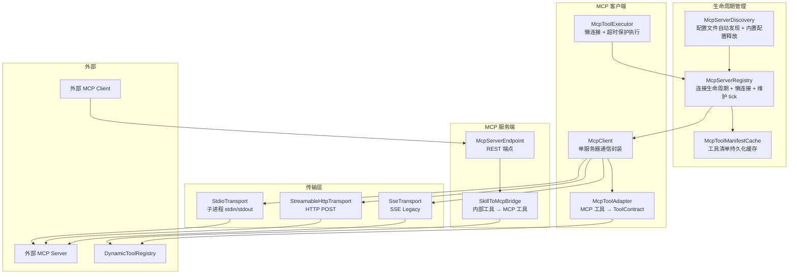
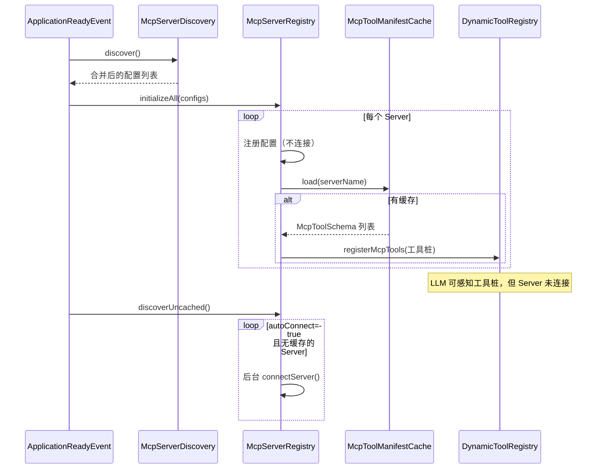
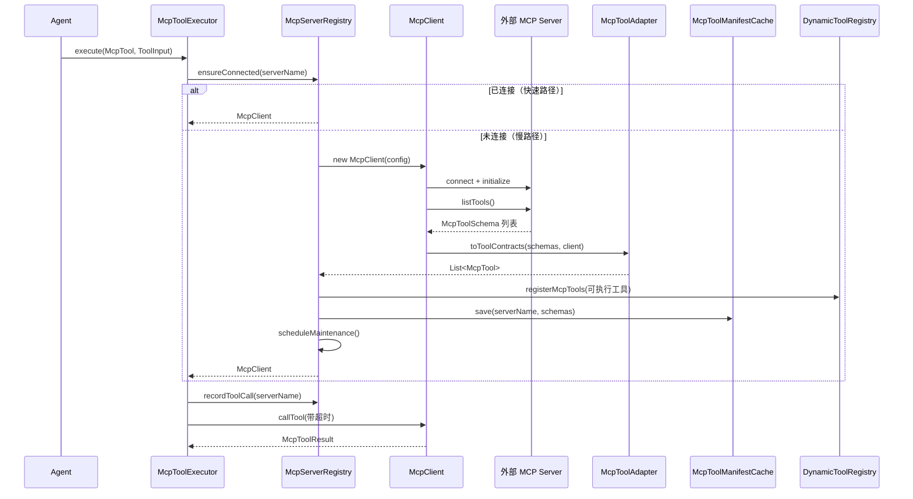

# MCP 协议支持 — 架构设计

> **文档性质**：架构设计文档
> **模块归属**：`com.lifepilot.mcp`
> **最后更新**：2026-04

## 1. 模块概述

MCP（Model Context Protocol）模块实现了 MCP 协议的客户端和服务端能力，使知微能够连接外部 MCP 服务器获取工具，同时也能将自身工具暴露为 MCP 服务供其他系统调用。支持 STDIO、Streamable HTTP、SSE（Legacy）三种传输方式。

核心设计原则：**懒连接** — 启动时仅注册 Server 配置并从本地缓存加载工具桩，首次工具调用时按需连接对应 Server。

## 2. 架构图



## 3. 核心组件

### 3.1 McpServerRegistry

- 职责：管理所有 MCP Server 连接的完整生命周期
- 实现 `DisposableBean`，Spring 关闭时自动清理所有连接和定时任务
- 核心能力：
  - **懒连接**：`ensureConnected()` — 快速路径（已连接直接返回 McpClient），慢路径（同步连接并阻塞至超时）
  - **工具缓存加载**：`initializeAll()` 时从 `McpToolManifestCache` 加载缓存的工具 Schema，注册为工具桩，LLM 无需连接即可感知工具
  - **合并维护 tick**：每个 Server 一个 `ScheduledFuture`，合并健康检查（ping）和空闲超时检测
  - **空闲超时**：无工具调用超过 `idleTimeout` 后自动断开，断开后从缓存重新注册工具桩保持工具可见性
  - **后台发现**：`discoverUncached()` — 对 `autoConnect=true` 且无缓存的 Server 后台连接以发现工具
  - **per-server 锁**：`ReentrantLock` 防止同一 Server 并发连接/断开竞态
  - **指数退避重连**：500ms x 2^n，上限 5s，最多重连 5 次（可配置）
  - **连接日志**：内存环形缓冲，每个 Server 最多 50 条状态变化记录

### 3.2 McpClient

- 职责：封装与单个 MCP Server 的完整通信
- 生命周期：`new McpClient(config)` → `initialize()` → `listTools()` / `callTool()` / `ping()` → `shutdown()`
- 协议版本：`2025-06-18`
- 由 `McpServerRegistry.connectServer()` 创建和管理

### 3.3 McpToolAdapter

- 职责：将 MCP Server 返回的 McpToolSchema 转换为知微的 ToolContract（McpTool）
- 自动推断风险等级（基于工具 Schema 分析）
- 支持两种模式：传入 McpClient 时生成可执行工具，传入 null 时生成工具桩（仅 Schema，调用时触发懒连接）

### 3.4 McpToolExecutor

- 职责：MCP 工具的实际执行器，封装懒连接 + 超时保护
- 执行流程：`ensureConnected()` → `recordToolCall()` → 带超时的 `callTool()` → 解析结果
- 每次调用记录时间戳到 `McpServerEntry.lastToolCall`，供空闲超时检测使用

### 3.5 McpToolManifestCache

- 职责：持久化 Server 的工具清单到本地文件系统
- 缓存路径：`~/.zhiwei/mcp/tool-cache/{serverName}.json`
- 用途：启动时从缓存加载工具 Schema 并注册为工具桩，使 LLM 在 Server 未连接时也能感知可用工具
- 防路径穿越：`safeCachePath()` 规范化路径后验证是否在缓存目录内

### 3.6 McpServerDiscovery

- 职责：扫描本地配置文件自动发现 MCP 服务器，与显式配置合并
- 发现路径（按优先级从高到低）：
  1. `~/.zhiwei/mcp/servers.json` — 知微内置 + 用户自定义
  2. `~/.mcp/servers.json` — 用户全局 MCP 配置
  3. `{project-root}/.mcp.json` — 项目本地配置
  4. 自定义路径 — 通过 `lifepilot.mcp.discovery.paths` 配置
- 内置配置释放：启动时将 classpath `mcp/servers.json` 中的内置服务器合并到用户目录，仅补充新增，不覆盖已有
- 合并策略：显式配置（application.yml）优先，同名 server 显式覆盖发现

### 3.7 McpServerState（状态机）

- `DISCONNECTED` → `CONNECTING` → `INITIALIZING` → `CONNECTED`
- `CONNECTED` ↔ `HEALTH_CHECK`（维护 tick 期间临时状态）
- `CONNECTED` / `HEALTH_CHECK` → `DISCONNECTING` → `DISCONNECTED`
- `CONNECTED` → `RECONNECTING` → `CONNECTING`（健康检查失败触发）
- `isAvailable()` 在 `CONNECTED` 和 `HEALTH_CHECK` 状态返回 true

### 3.8 McpTransport（传输层抽象）

- 三种实现：`StdioTransport`（子进程 stdin/stdout）、`StreamableHttpTransport`（HTTP POST）、`SseTransport`（SSE Legacy）
- 统一接口：`connect()`、`sendRequest()`、`sendNotification()`、`disconnect()`

### 3.9 SkillToMcpBridge（MCP 服务端）

- 职责：将知微内部标记为 `exportable` 的工具暴露为 MCP 工具
- 通过 REST 端点 `/mcp` 提供 MCP 服务端协议

## 4. 核心流程

### 4.1 启动注册（懒连接模式）



### 4.2 懒连接（首次工具调用）



## 5. 设计决策

| 决策 | 选择 | 理由 |
|------|------|------|
| 连接模式 | 懒连接（按需连接） | 启动时不阻塞，MCP Server 数量多时避免启动超时和资源浪费 |
| 工具缓存 | 文件持久化到 `~/.zhiwei/mcp/tool-cache/` | LLM 在 Server 未连接时也能感知工具，首次调用触发懒连接 |
| 维护模型 | 单一 ScheduledFuture 合并健康检查 + 空闲检测 | 消除多定时器泄漏和累积问题，disconnect/reconnect 时可精确取消 |
| 空闲超时 | 默认 10 分钟自动断开 | 释放长期空闲的 Server 资源，断开后从缓存恢复工具桩保持可见性 |
| 优雅关闭 | DisposableBean | Spring 容器关闭时自动取消所有定时任务并断开所有连接 |
| 传输抽象 | McpTransport sealed interface | 三种传输方式统一接口，switch 穷举确保完整处理 |
| 双向支持 | 客户端 + 服务端 | 既能消费外部工具，也能暴露内部工具，支持 Agent 互操作 |
| 风险推断 | 基于 Schema 自动推断 | MCP 协议不包含风险等级，需要本地推断以集成护栏系统 |
| 异步通信 | CompletableFuture + Virtual Thread | MCP 通信涉及网络 I/O，虚拟线程避免阻塞 Agent 循环 |
| 自动发现 | 多路径扫描 + 内置配置释放 | 兼容用户全局配置、项目配置、知微内置配置，零配置开箱可用 |
| per-server 锁 | ReentrantLock per server | 防止同一 Server 并发连接/断开竞态，不同 Server 互不阻塞 |

## 6. 集成点

- **工具系统**（`tool`）：McpTool 注册到 DynamicToolRegistry，通过 McpToolExecutor 执行
- **Skill 系统**（`skill`）：SkillToMcpBridge 暴露 exportable 工具；MCP server 条目出现在 ContextAssembler 生成的 `<available_mcp_servers>` Skill 目录中，Agent 可通过 `file.read(skill="mcp:server-name")` 按需加载 MCP server 的所有工具
- **Agent 引擎**（`agent`）：MCP 工具不会默认进入 Tier 1 常驻集合；LLM 通过 `tools.search` 发现 MCP 工具，或通过 `file.read(skill="mcp:xxx")` 激活整组 MCP 工具进 `activatedToolIds`（参见 [工具系统架构](tool-ecosystem.md)）
- **A2A 协议**（`a2a`）：A2A 可通过 MCP 工具桥接实现跨系统工具调用
- **共享调度器**（`config.threadpool`）：维护 tick 和重连任务通过 SharedScheduler.heartbeat() 调度

## 7. 配置参考

### 7.1 Server 连接配置

| 配置键 | 默认值 | 说明 |
|--------|--------|------|
| `lifepilot.mcp.enabled` | `true` | MCP 支持总开关 |
| `lifepilot.mcp.servers[].name` | — | 服务器名称（唯一标识） |
| `lifepilot.mcp.servers[].description` | — | 用户自定义描述，用于 Skill 目录中的 MCP server 展示；为空时从工具描述自动聚合 |
| `lifepilot.mcp.servers[].transport` | `STDIO` | 传输类型（STDIO / STREAMABLE_HTTP / SSE_LEGACY） |
| `lifepilot.mcp.servers[].command` | — | STDIO 模式启动命令 |
| `lifepilot.mcp.servers[].args` | `[]` | STDIO 模式命令参数 |
| `lifepilot.mcp.servers[].url` | — | HTTP/SSE 模式 URL |
| `lifepilot.mcp.servers[].env` | `{}` | 环境变量 |
| `lifepilot.mcp.servers[].timeout` | `60s` | 请求超时时间 |
| `lifepilot.mcp.servers[].autoConnect` | `true` | 是否启用后台发现（无缓存时后台连接发现工具） |
| `lifepilot.mcp.servers[].reconnect` | `true` | 断开后是否自动重连 |
| `lifepilot.mcp.servers[].reconnectDelay` | `500ms` | 重连初始延迟（指数退避，上限 5s） |
| `lifepilot.mcp.servers[].maxReconnectAttempts` | `5` | 最大重连次数 |
| `lifepilot.mcp.servers[].healthCheckInterval` | `30s` | 健康检查间隔 |
| `lifepilot.mcp.servers[].idleTimeout` | `10min` | 空闲超时（无工具调用后自动断开） |

### 7.2 自动发现配置

| 配置键 | 默认值 | 说明 |
|--------|--------|------|
| `lifepilot.mcp.discovery.enabled` | `true` | 自动发现开关 |
| `lifepilot.mcp.discovery.paths` | `[]` | 额外发现路径列表 |
| `lifepilot.mcp.discovery.seedBuiltinServers` | `true` | 启动时是否释放内置配置到用户目录 |

### 7.3 MCP Server 模式配置

| 配置键 | 默认值 | 说明 |
|--------|--------|------|
| `lifepilot.mcp.server.enabled` | `false` | MCP Server 模式（反向桥接）开关 |
| `lifepilot.mcp.server.apiKey` | — | API Key 认证密钥 |

### 7.4 servers.json 配置文件格式

`~/.zhiwei/mcp/servers.json` 和其他发现路径使用统一的 JSON 格式：

```json
{
  "mcpServers": {
    "server-name": {
      "command": "npx",
      "args": ["-y", "some-mcp-server"],
      "autoConnect": false,
      "idleTimeout": 600,
      "description": "服务器功能描述，用于 Skill 目录中展示"
    }
  }
}
```

`autoConnect` 和 `idleTimeout` 可在 servers.json 中直接配置。`idleTimeout` 支持秒数或 ISO-8601 Duration 字符串。
