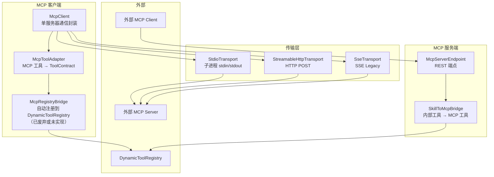
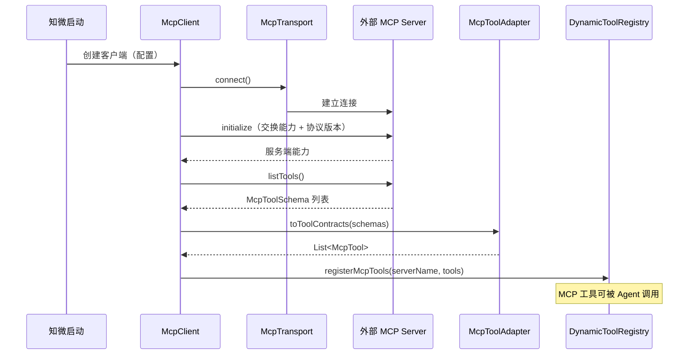

# MCP 协议支持 — 架构设计

> **文档性质**：架构设计文档
> **模块归属**：`com.lifepilot.mcp`
> **最后更新**：2026-03

## 1. 模块概述

MCP（Model Context Protocol）模块实现了 MCP 协议的客户端和服务端能力，使知微能够连接外部 MCP 服务器获取工具，同时也能将自身工具暴露为 MCP 服务供其他系统调用。支持 STDIO、Streamable HTTP、SSE（Legacy）三种传输方式。

## 2. 架构图

## 3. 核心组件

### 3.1 McpClient

- 职责：封装与单个 MCP Server 的完整通信生命周期
- 生命周期：`new McpClient(config)` → `initialize()` → `listTools()` / `callTool()` → `shutdown()`
- 协议版本：`2025-06-18`

### 3.2 McpToolAdapter

- 职责：将 MCP Server 返回的 McpToolSchema 转换为知微的 ToolContract（McpTool）
- 自动推断风险等级（基于工具 Schema 分析）

### 3.3 McpTransport（传输层抽象）

- 三种实现：`StdioTransport`（子进程 stdin/stdout）、`StreamableHttpTransport`（HTTP POST）、`SseTransport`（SSE Legacy）
- 统一接口：`connect()`、`sendRequest()`、`sendNotification()`、`disconnect()`

### 3.4 SkillToMcpBridge（MCP 服务端）

- 职责：将知微内部标记为 `exportable` 的工具暴露为 MCP 工具
- 通过 REST 端点 `/mcp` 提供 MCP 服务端协议

## 4. 核心流程

## 5. 设计决策

| 决策 | 选择 | 理由 |
|------|------|------|
| 传输抽象 | McpTransport sealed interface | 三种传输方式统一接口，switch 穷举确保完整处理 |
| 双向支持 | 客户端 + 服务端 | 既能消费外部工具，也能暴露内部工具，支持 Agent 互操作 |
| 风险推断 | 基于 Schema 自动推断 | MCP 协议不包含风险等级，需要本地推断以集成护栏系统 |
| 异步通信 | CompletableFuture | MCP 通信涉及网络 I/O，异步避免阻塞 Agent 循环 |

## 6. 集成点

- **工具系统**（`tool`）：McpTool 注册到 DynamicToolRegistry，通过 ToolExecutionPipeline 执行
- **Skill 系统**（`skill`）：SkillToMcpBridge 暴露 exportable 工具
- **A2A 协议**（`a2a`）：A2A 可通过 MCP 工具桥接实现跨系统工具调用

## 7. 配置参考

| 配置键 | 默认值 | 说明 |
|--------|--------|------|
| `lifepilot.mcp.servers` | — | MCP 服务器配置映射 |
| `lifepilot.mcp.servers.{name}.command` | — | STDIO 模式启动命令 |
| `lifepilot.mcp.servers.{name}.args` | — | 启动参数 |
| `lifepilot.mcp.servers.{name}.url` | — | HTTP/SSE 模式 URL |
| `lifepilot.mcp.servers.{name}.transport` | `STDIO` | 传输类型 |
