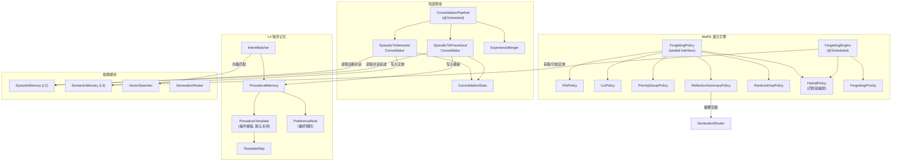
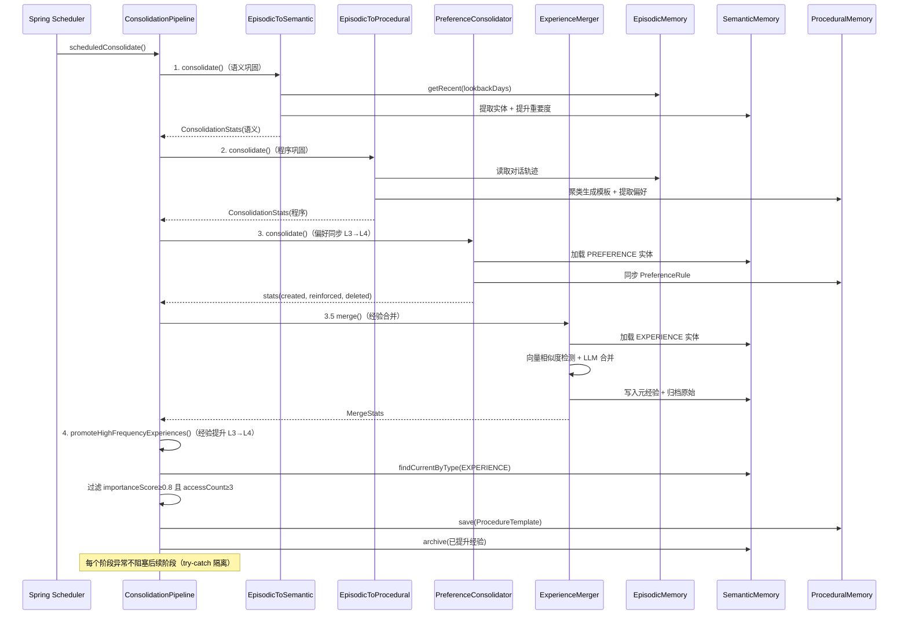
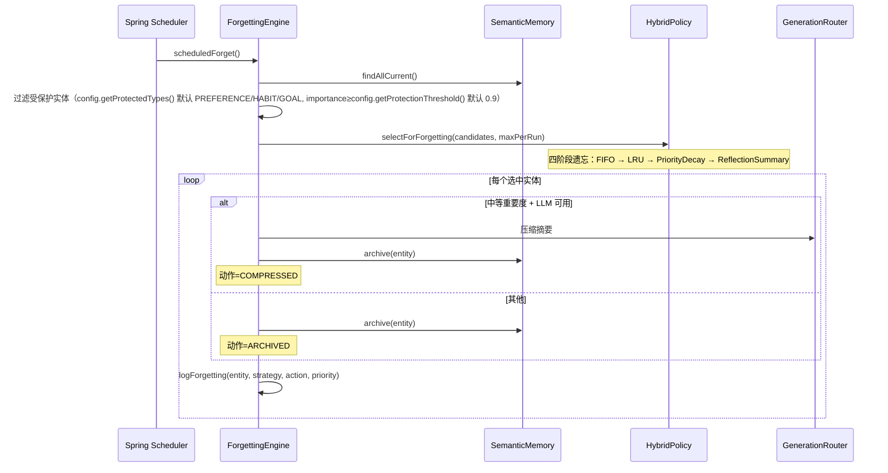

# 记忆系统进阶 — 架构设计

> **文档性质**：架构设计文档
> **模块归属**：`com.lifepilot.memory`（进阶子系统：procedural / consolidation / forgetting）
> **最后更新**：2026-04-14

## 1. 模块概述

记忆系统进阶模块构建在基础记忆系统之上，实现三大高级能力：L4 程序记忆（操作模板 + 偏好规则）、记忆巩固管线（情景→语义 / 情景→程序的自动沉淀）、MaRS 认知遗忘引擎（六策略混合遗忘 + 受保护实体机制）。这些能力使知微从"记住对话"进化为"学习行为模式并主动遗忘过时信息"。

## 2. 架构图

## 3. 核心组件

### 3.1 ProceduralMemory（L4 程序记忆）

- 职责：存储和管理用户的操作模板和偏好规则
- 两种数据类型（`StrategyPattern` 已删除）：
  - `ProcedureTemplate`：操作模板，包含步骤序列（`TemplateStep`）、触发意图、成功率、执行次数
  - `PreferenceRule`：偏好规则，按 category + key 组织，支持强化（reinforcement）
- 操作模板聚类通过 `lifepilot.memory.procedural.templateEnabled` 配置开关控制，默认关闭
- 使用 sqlite-vec 建立意图向量索引（`procedure_intent_embeddings`）
- 记录每次模板执行的成功/失败，动态更新成功率

### 3.2 IntentMatcher（意图匹配器）

- 职责：将用户输入与 L4 操作模板进行意图匹配
- 通过 VectorSearcher 进行向量相似度匹配，返回最佳匹配的 ProcedureTemplate
- 匹配结果包含模板信息、匹配分数、成功率，供 HybridRetriever 作为 ReasoningSlot 返回
- 匹配失败时静默返回空，不影响主检索流程
- 在 `ToolExecutionCoordinator` 中以 `Thread.startVirtualThread` 异步调用，不阻塞主 Agent 循环

### 3.3 EpisodicToSemanticConsolidator（情景→语义巩固器）

- 职责：分析近期对话中已有 L3 实体的提及频率，高频实体提升重要度评分
- 读取近期对话（lookback 天数可配置），统计已有实体在对话文本中的提及次数
- 高频提及的实体（≥ 阈值）通过直接 SQL UPDATE 提升 importanceScore，不创建新版本（避免与 RealtimeExtractor 并发写入时的唯一约束冲突）
- 不再触发新增知识提取，巩固阶段只强化已有实体

### 3.4 EpisodicToProceduralConsolidator（情景→程序巩固器）

- 职责：从重复行为模式中聚类生成操作模板，提取用户偏好
- 模板聚类受 `lifepilot.memory.procedural.templateEnabled` 开关控制（默认关闭）
- 分析对话轨迹中的工具调用序列，识别重复模式
- 相似度超过阈值的轨迹聚类为操作模板（`ProcedureTemplate`）
- 配置参数：聚类相似度阈值、最小聚类大小、每次运行最大模板数、最小执行步骤数

### 3.5 ConsolidationPipeline（巩固管线编排）

- 职责：编排语义巩固、经验合并和程序巩固的执行顺序
- 顺序执行：语义巩固 → 程序巩固 → 偏好同步（PreferenceConsolidator）→ 经验合并（ExperienceMerger）→ 经验提升（promoteHighFrequencyExperiences，L3→L4），故障隔离（try-catch 独立包裹）
- 经验合并阶段：通过 ExperienceMerger 将语义相似的 EXPERIENCE 实体合并为泛化的元经验
- 经验提升阶段（L3→L4）：扫描 EXPERIENCE 实体，将 importanceScore ≥ 0.8 且 accessCount ≥ 3 的高频经验提升为 ProcedureTemplate，提升后原始经验归档
- 通过 `@Scheduled` Cron 表达式定时触发
- 支持手动调用 `consolidate()` 方法（为 Idle-Driven 触发模式预留）
- 返回 `ConsolidationStats` 统计信息（分析对话数、提升实体数、创建模板数）

### 3.6 ForgettingEngine（MaRS 遗忘引擎）

- 职责：定时执行认知遗忘，维持记忆系统健康容量
- 核心流程：获取当前实体 → 过滤受保护实体 → HybridPolicy 选择候选 → 执行遗忘动作 → 记录日志
- 受保护实体（永不遗忘）：受保护类型（可配置，`config.getProtectedTypes()`，默认 PREFERENCE / HABIT / GOAL），或 importanceScore ≥ 保护阈值（可配置，`config.getProtectionThreshold()`，默认 0.9）
- 遗忘动作决策：中等重要度 + LLM 可用 → 压缩后归档；其他 → 直接归档
- LLM 压缩失败时降级为直接归档

### 3.7 ForgettingPolicy（遗忘策略体系）

- 通过 sealed interface 定义 6 种策略，确保类型安全和穷举匹配
- `FifoPolicy`：按创建时间先进先出
- `LruPolicy`：按最后访问时间淘汰最久未用的实体
- `PriorityDecayPolicy`：按优先级衰减公式计算遗忘优先级
- `ReflectionSummaryPolicy`：对中等重要度实体使用 LLM 生成摘要后遗忘原文
- `RandomDropPolicy`：随机丢弃（用于基线对比）
- `HybridPolicy`：编排四阶段遗忘流程，综合上述策略

## 4. 核心流程

### 4.1 巩固管线执行流程

### 4.2 MaRS 遗忘流程

## 5. 设计决策

| 决策 | 选择 | 理由 |
|------|------|------|
| L4 两种数据类型 | ProcedureTemplate + PreferenceRule | 分别覆盖"怎么做"和"喜欢什么"两个维度（StrategyPattern 已删除） |
| 巩固管线顺序执行 | 语义巩固 → 程序巩固 | 程序巩固可能依赖语义巩固的实体提取结果 |
| 故障隔离策略 | try-catch 独立包裹 | 单个巩固器失败不应阻塞整个管线 |
| 遗忘策略 sealed interface | 6 种策略 + HybridPolicy 编排 | 每种策略有明确适用场景，Hybrid 综合优势；sealed 保证穷举 |
| 受保护实体机制 | 类型保护 + 重要度保护 | 用户核心偏好和习惯不应被遗忘，高重要度实体代表关键知识 |
| 遗忘动作分级 | 压缩归档 vs 直接归档 | 中等重要度实体值得保留核心信息，低重要度直接归档节省资源 |
| 触发模式预留 | Cron + 手动调用接口 | 当前使用 Cron 定时触发，为未来 Idle-Driven 模式预留 consolidate() 入口 |

## 6. 集成点

| 依赖模块 | 交互方式 | 说明 |
|---------|---------|------|
| EpisodicMemory (L2) | 构造函数注入 | 巩固管线读取近期对话数据 |
| SemanticMemory (L3) | 构造函数注入 | 巩固写入实体、遗忘归档实体 |
| VectorSearcher | 构造函数注入 | IntentMatcher 和 ProceduralMemory 的向量匹配 |
| GenerationRouter | 构造函数注入（@Nullable） | ReflectionSummaryPolicy 摘要压缩、EpisodicToProcedural 模式识别 |
| EmbeddingRouter | 构造函数注入（@Nullable） | EpisodicToProcedural 轨迹向量化与模板去重 |
| PromptRegistry | 构造函数注入 | 遗忘压缩提示词模板 |

## 7. 配置参考

| 配置键 | 默认值 | 说明 |
|--------|--------|------|
| `lifepilot.memory.procedural.max-templates` | — | L4 操作模板最大数量 |
| `lifepilot.memory.procedural.min-reliability` | — | 模板最低可靠性阈值 |
| `lifepilot.memory.procedural.min-use-count` | — | 模板最低使用次数 |
| `lifepilot.memory.procedural.stale-days` | — | 模板过期天数 |
| `lifepilot.memory.procedural.match-threshold` | — | 意图匹配相似度阈值 |
| `lifepilot.memory.procedural.templateEnabled` | false | 是否启用操作模板聚类 |
| `lifepilot.memory.consolidation.cron` | — | 巩固管线 Cron 表达式 |
| `lifepilot.memory.consolidation.trigger-mode` | — | 触发模式（cron / idle） |
| `lifepilot.memory.consolidation.lookback-days` | — | 巩固回溯天数 |
| `lifepilot.memory.consolidation.high-frequency-threshold` | — | 高频实体阈值 |
| `lifepilot.memory.consolidation.cluster-similarity-threshold` | — | 聚类相似度阈值 |
| `lifepilot.memory.consolidation.min-cluster-size` | — | 最小聚类大小 |
| `lifepilot.memory.consolidation.max-templates-per-run` | — | 每次运行最大模板数 |
| `lifepilot.memory.forgetting.cron` | — | 遗忘引擎 Cron 表达式 |
| `lifepilot.memory.forgetting.max-retention-days` | — | 最大保留天数 |
| `lifepilot.memory.forgetting.lru-threshold-days` | — | LRU 淘汰天数阈值 |
| `lifepilot.memory.forgetting.priority-decay-rate` | — | 优先级衰减速率 |
| `lifepilot.memory.forgetting.max-forget-per-run` | — | 每次运行最大遗忘数 |
