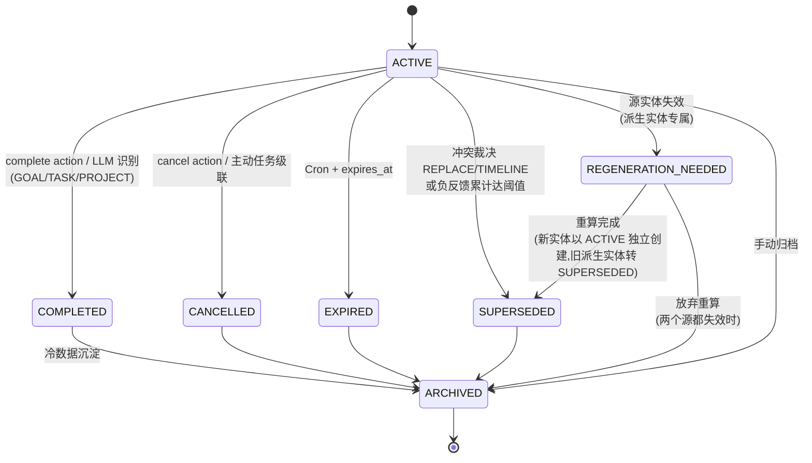

# 记忆数据流 — 长期参照物

> **文档性质**：模块级长期数据流参照（源信任文档）
> **模块归属**：`com.lifepilot.memory` + `com.lifepilot.agent.task.proactive`
> **最后更新**：2026-04-23（Phase 0 Batch 6 产出）
> **配套 spec**：`docs/superpowers/specs/2026-04-23-memory-lifecycle-closure-design.md`（一次性归档）
>
> 本文档是记忆模块"14 写入源 → 4 事件 → 7 监听器"拓扑的 **source of truth**。任何对记忆写入链路、事件契约、监听器职责、状态机、Schema 的改动，必须 **先更新本文档再改代码**；Phase 0→4 的图代码对账以本文档为准。

---

## 1. 概览图

```mermaid
flowchart TD
    subgraph Sources["写入/影响源（14 条 + 前端 CRUD）"]
        W1["① RealtimeExtractor<br/>(对话结束提取)"]
        W2["② ExperienceSummarizer<br/>(任务级 EXPERIENCE)"]
        W3["③ SubtaskReflector<br/>(工具级 EXPERIENCE)"]
        W4["④ ContrastiveLearner<br/>(成功经验增强)"]
        W5["⑤ UserProfileConsolidator<br/>(派生 __consolidated_profile)"]
        W6["⑥ ProactiveMemoryBridge.syncInsightToL3<br/>(PREFERENCE insight)"]
        W7["⑦ PreferenceConsolidator<br/>(L3→L4 偏好同步)"]
        W8["⑧ ProceduralMemory.save<br/>(L4 procedure_templates)"]
        W9["⑨ ProactiveMemoryBridge.observePreference<br/>(L4 EWMA 偏好)"]
        W10["⑩ ForgettingEngine<br/>(衰减/归档)"]
        W11["⑪ EntityDeduplicator<br/>(合并→归档从实体)"]
        W12["⑫ FeedbackProcessor<br/>(点赞/点踩)"]
        W13["⑬ TrustUpgradeService<br/>(L4 信任度, 未入事件总线)"]
        W14["⑭ EffectivenessTracker<br/>(自动有效性评估)"]
        W15["⑮ MemoryController CRUD<br/>(前端手动编辑)"]
    end

    subgraph Gateway["统一事件挂载点<br/>SemanticMemory（1355 行）"]
        SM["SemanticMemory<br/>upsertWithConflictDetection<br/>archive / updateLifecycleState<br/>updateImportanceScore / updateDescription"]
    end

    subgraph Bus["ApplicationEvent 总线（afterCommit 分发）"]
        E1[["EntityLifecycleChanged"]]
        E2[["SourceInvalidated"]]
        E3[["EntityWeightChanged"]]
        E4[["ProactiveTaskCancelled"]]
    end

    subgraph Listeners["7 监听器（planned，Phase 1 Task 15–21）"]
        H1["L4SyncListener"]
        H2["VectorListener"]
        H3["DerivedEntityListener"]
        H4["ProvenanceStaleListener"]
        H5["ReValidationListener"]
        H6["NegativeFeedbackListener"]
        H7["ProactiveTaskCancelListener"]
    end

    W1 --> SM
    W2 --> SM
    W3 --> SM
    W4 --> SM
    W5 --> SM
    W6 --> SM
    W10 --> SM
    W11 --> SM
    W12 --> SM
    W14 --> SM
    W15 --> SM
    W7 -->|savePreference| L4[("preference_rules<br/>procedure_templates")]
    W8 -->|save| L4
    W9 -->|EWMA 更新| L4
    W13 -->|reminder 信任度| L4
    SM --> E1
    SM --> E3
    PM["ProactiveMemoryBridge.markGoalFulfilled"] --> E4
    OrphanScanner["OrphanProvenanceScanner (planned)"] --> E2
    DocArchive["Document / KnowledgeBase 归档钩子 (planned)"] --> E2
    E1 --> H1
    E1 --> H2
    E1 --> H3
    E2 --> H4
    E2 --> H5
    E3 --> H6
    E4 --> H7
```



说明：
- **蓝绿三层**：写入源 → SemanticMemory 统一挂载 → 事件总线 → 监听器
- **直写 L4**（⑦⑧⑨⑬）不经过 SemanticMemory 事件路径，未来由 L4SyncListener 反向同步
- **事件总线**采用 Spring `ApplicationEventPublisher` + `TransactionSynchronization.afterCommit()`，回滚路径下不泄漏幻觉事件

---

## 2. 14 写入源详表

每条记录精确到 `file:line`，便于机械对账。所有"是否经 SemanticMemory"列，`✅` 代表已统一走事件路径，`直写 L4` 代表未经事件总线（未来由 Listener 反向同步）。

| # | 源 | 类路径 | 产物类型 | 触发时机 | `provenance.source` / 场景语义 | 经 SemanticMemory? |
|---|---|---|---|---|---|---|
| 1 | `RealtimeExtractor` | `src/main/java/com/lifepilot/memory/semantic/RealtimeExtractor.java:299`（ADD）`:333`（UPDATE）`:346`（DELETE→archive） | L3：任意 `EntityType`（依赖 LLM AUDN 判定） | 对话结束，Virtual Thread 异步 AUDN 提取 | `sourceReference=sessionId`（会话 id）— `resolveChangeSource` 归到 `LLM_SEMANTIC` | ✅ |
| 2 | `ExperienceSummarizer` | `src/main/java/com/lifepilot/memory/experience/ExperienceSummarizer.java:252`（去重命中 updateImportanceScore）`:307`（新建）`:354`（quickLearn） | L3：`EXPERIENCE`（任务级） | 对话结束 + 质量评估通过 | `sourceReference=sourceId`（trace/session）— `LLM_SEMANTIC` | ✅ |
| 3 | `SubtaskReflector` | `src/main/java/com/lifepilot/memory/experience/SubtaskReflector.java:266` | L3：`EXPERIENCE`（工具级） | 工具序列结束后即时反思 | `sourceReference="subtask-reflection"` — `LLM_SEMANTIC` | ✅ |
| 4 | `ContrastiveLearner` | `src/main/java/com/lifepilot/memory/experience/ContrastiveLearner.java:215` | L3：对现有 `EXPERIENCE` 的 `properties` 增强（写入 `lessons` + `contrastiveEnriched=true`）；**当前未产出独立 `CONTRASTIVE_INSIGHT` 实体** | Summarizer 完成后的对比学习 | `sourceReference="contrastive-learning"` — `LLM_SEMANTIC` | ✅ |
| 5 | `UserProfileConsolidator` | `src/main/java/com/lifepilot/memory/consolidation/UserProfileConsolidator.java:227`（UPDATE）`:250`（ADD） | L3：`CUSTOM` 实体，`name=__consolidated_profile`（**应派生，当前代码未标 `isDerived=true`**） | `ConsolidationPipeline` Cron（≥2h） | `sourceReference="user-profile-consolidation"` — `LLM_SEMANTIC` | ✅ |
| 6 | `ProactiveMemoryBridge.syncInsightToL3` | `src/main/java/com/lifepilot/agent/task/proactive/ProactiveMemoryBridge.java:385` | L3：`PREFERENCE`，`name=proactive_insight_{category}_{key}` | 主动引擎行为反馈回写 | `sourceReference="proactive-engine"` — `LLM_SEMANTIC` | ✅ |
| 7 | `PreferenceConsolidator` | `src/main/java/com/lifepilot/memory/consolidation/PreferenceConsolidator.java:83`（新建）`:87`（强化）`:99`（删除） | L4：`preference_rules`（`category=user-preference`） | `ConsolidationPipeline` Cron | 走 `ProceduralMemory.savePreference` / `reinforcePreference` / `deletePreference`；**不发事件**；`source_entity_id` 列未填充 | 直写 L4 |
| 8 | `ProceduralMemory.save` | `src/main/java/com/lifepilot/memory/procedural/ProceduralMemory.java:56` | L4：`procedure_templates` | 巩固管线 `promoteHighFrequencyExperiences`（`ConsolidationPipeline.java:217`） | INSERT 语句未填充 `source_entity_id` / `deactivated_reason`；**不发事件** | 直写 L4 |
| 9 | `ProactiveMemoryBridge.observePreference` | `src/main/java/com/lifepilot/agent/task/proactive/ProactiveMemoryBridge.java:347`（更新）`:355`（新建） | L4：`preference_rules`（EWMA α=0.3） | 主动引擎信号（`ProactiveMemoryBridge.java:36` `PREFERENCE_ALPHA`） | `learnedFrom="proactive-engine"`；**不发事件** | 直写 L4 |
| 10 | `ForgettingEngine` | `src/main/java/com/lifepilot/memory/forgetting/ForgettingEngine.java:215`（LLM 压缩后归档）`:221`（降级归档）`:227`（默认归档） | L3：将实体 archive → `lifecycle_state=ARCHIVED` | Cron（定时衰减扫描） | 三处均显式传 `ChangeSource.CRON_EXPIRE`；走 `semanticMemory.archive(entity, source)` 3-arg 重载 | ✅ |
| 11 | `EntityDeduplicator` | `src/main/java/com/lifepilot/memory/consolidation/EntityDeduplicator.java:198` | L3：归档 secondary 实体，primary 属性合并（**应派生 MERGED，当前未标 `isDerived=true`，未写 `derivationSources`**） | `ConsolidationPipeline` Cron | `semanticMemory.archive(secondary, ChangeSource.CONFLICT_RESOLVE)` | ✅ |
| 12 | `FeedbackProcessor` | `src/main/java/com/lifepilot/memory/feedback/FeedbackProcessor.java:92` | L3：改实体 `importance_score`（不改 lifecycle） | 用户点赞 / 点踩（`WebController` → `InjectionRecordRepository` 反查实体） | `WeightSource.USER_FEEDBACK`；经 `SemanticMemory.updateImportanceScore` 发 `EntityWeightChanged` | ✅ |
| 13 | `TrustUpgradeService` | `src/main/java/com/lifepilot/agent/task/proactive/TrustUpgradeService.java` | L4：`reminder_trust` / `proactive_reminder_topic_preferences`（非 `preference_rules`） | 主动提醒反馈（用户 "无用" 按钮） | **尚未发事件；不走 SemanticMemory；S14 提醒反馈溯源到 L3 insight 待 Task 25 实施** `(planned: Task 25)` | 未接入 `(planned)` |
| 14 | `EffectivenessTracker` | `src/main/java/com/lifepilot/memory/experience/EffectivenessTracker.java:123`（淘汰 archive）`:126`（调整分数） | L3：低分则 archive，否则调 `importance_score` | 对话完成后自动有效性评估 | `archive(entity)` 默认 `UI_EDIT`；`updateImportanceScore(..., WeightSource.EFFECTIVENESS)` | ✅ |
| 15（附加） | `MemoryController` CRUD | `src/main/java/com/lifepilot/interaction/web/controller/MemoryController.java:430`（DELETE→archive）`:477`（POST→upsert）`:524`（PUT→upsert）`:869`（PUT profile→updateDescription）`:882`（PUT profile→upsert 新建） | L3：用户直接 CRUD | 前端 UI 手动编辑 | `source=null` → `SemanticMemory` 内部归到 `LLM_SEMANTIC`（profile 编辑走 `"user-edit-description"` → `UI_EDIT`） | ✅ |

**发布点归属**（`SemanticMemory.java`）：

| 入口 | 发布事件 | 行号 |
|---|---|---|
| `upsertWithConflictDetection` 新建分支 | `EntityLifecycleChanged(null → state)` | `:193` |
| `archive(entity, ChangeSource)` | `EntityLifecycleChanged(oldState → ARCHIVED)` | `:388` |
| `updateLifecycleState` | `EntityLifecycleChanged(oldState → newState)` | `:530` |
| `updateImportanceScore(id, newScore, WeightSource)` | `EntityWeightChanged(delta, cumulativeScore)` | `:594` |
| `publishAfterCommit` 通用方法 | 任意事件挂到 `TransactionSynchronization.afterCommit()` | `:454` |
| `resolveChangeSource` 归因 | `user-edit-description → UI_EDIT` / `tool-cancel/complete/supersede → TOOL_EXPLICIT` / 其他 → `LLM_SEMANTIC` | `:440` |

**注意**：
- `upsertWithConflictDetection` 的**合并分支**（`:145-174`）目前**不发 LifecycleChanged**（只新版本化，不改状态），这与 spec §4.5 "冲突裁决 REPLACE 时旧实体 SUPERSEDED" 的差距由 Phase 2 Task 24 `ConflictResolutionService` 补齐。

---

## 3. 4 个事件契约表

| 事件 | 字段 | 取值约束 | Java 类 file:line |
|---|---|---|---|
| `EntityLifecycleChanged` | `entityId: String`<br/>`entityType: String`<br/>`oldState: LifecycleState?`（新建时 null）<br/>`newState: LifecycleState`<br/>`reason: String?`<br/>`source: ChangeSource` | newState 非 null；`oldState.canTransitionTo(newState)==true`（由调用方校验）；source 必选 | `src/main/java/com/lifepilot/memory/lifecycle/events/EntityLifecycleChanged.java:13` |
| `SourceInvalidated` | `sourceType: SourceType`（DOCUMENT / KNOWLEDGE_BASE / SESSION）<br/>`sourceId: String`<br/>`kind: InvalidationKind`（DELETED / ARCHIVED / CONTENT_CHANGED） | 三字段均非 null | `src/main/java/com/lifepilot/memory/lifecycle/events/SourceInvalidated.java:12` |
| `EntityWeightChanged` | `entityId: String`<br/>`delta: double`（首次写入退化为 newScore）<br/>`cumulativeScore: double`（调整后绝对值，typical 0.0–1.0）<br/>`source: WeightSource`（USER_FEEDBACK / EFFECTIVENESS / QUALITY_REJECT） | 无量纲浮点；阈值 `memory.feedback.negative-threshold-score` 默认 -1.0 | `src/main/java/com/lifepilot/memory/lifecycle/events/EntityWeightChanged.java:21` |
| `ProactiveTaskCancelled` | `taskId: String`（即 GOAL 实体 id）<br/>`relatedInsightEntityIds: List<String>`（compact ctor 做 `List.copyOf` 防御拷贝） | 列表元素非 null；来自 `proactive_task_insight_links` 查询 | `src/main/java/com/lifepilot/memory/lifecycle/events/ProactiveTaskCancelled.java:14` |

### 3.1 ChangeSource 枚举（8 值）

`src/main/java/com/lifepilot/memory/lifecycle/ChangeSource.java:9`

| 值 | 语义 |
|---|---|
| `TOOL_EXPLICIT` | 工具显式调用（`memory.cancel` / `complete` / `supersede` / `delete`） |
| `LLM_SEMANTIC` | LLM 语义识别（对话提取 / 反思 / 画像巩固） |
| `CRON_EXPIRE` | Cron 扫描到期（ForgettingEngine、ExpirationScanner） |
| `CONFLICT_RESOLVE` | upsert 语义冲突裁决后状态转换（EntityDeduplicator、ExperienceMerger） |
| `NEGATIVE_FEEDBACK` | 负反馈累计达阈值 |
| `PROACTIVE_CANCEL` | 主动任务取消级联 |
| `UI_EDIT` | 前端 UI 编辑 / CRUD |
| `DERIVATION_TRIGGER` | 派生实体源失效触发（防 REGENERATION 递归） |

### 3.2 LifecycleState 枚举（7 态）

`src/main/java/com/lifepilot/memory/lifecycle/LifecycleState.java:9`

| 值 | 可召回 | 说明 |
|---|---|---|
| `ACTIVE` | ✅ | 当前生效 |
| `COMPLETED` | ✅ | 已完成（GOAL/TASK/PROJECT 专属） |
| `CANCELLED` | ❌ | 用户明确取消 / 主动任务级联 |
| `EXPIRED` | ❌ | TTL 到期 |
| `SUPERSEDED` | ❌ | 被新版本替代 / 负反馈淘汰 |
| `REGENERATION_NEEDED` | ⚠️（带 isStale） | 派生实体源变化，等待重算 |
| `ARCHIVED` | ❌ | 手动归档 / 冷数据 |

合法转换由 `LifecycleState.canTransitionTo(next)` 校验（`:19`）。

### 3.3 Temporality 枚举

`src/main/java/com/lifepilot/memory/lifecycle/Temporality.java:15`：`EPHEMERAL` / `SHORT_TERM` / `PERSISTENT`（默认）。

---

## 4. 7 监听器 × 事件订阅矩阵

**所有 7 个监听器均为 Phase 1 Task 15–21 待实施**，当前仓库尚无对应 Java 类。下表给出事件 → 监听器订阅关系，以及各监听器计划订阅的事件集合。

| 事件 \ 监听器 | `L4SyncListener` | `VectorListener` | `DerivedEntityListener` | `ProvenanceStaleListener` | `ReValidationListener` | `NegativeFeedbackListener` | `ProactiveTaskCancelListener` |
|---|---|---|---|---|---|---|---|
| `EntityLifecycleChanged` | ✅ | ✅ | ✅ | — | — | — | — |
| `SourceInvalidated` | — | — | — | ✅ | ✅ | — | — |
| `EntityWeightChanged` | — | — | — | — | — | ✅ | — |
| `ProactiveTaskCancelled` | — | — | — | — | — | — | ✅ |

### 4.1 监听器职责（计划态）

| # | 监听器 | 状态 | 订阅事件 | 职责 |
|---|---|---|---|---|
| 1 | `L4SyncListener` | 🕐 `(planned: Task 15)` | `EntityLifecycleChanged` | newState ∈ {CANCELLED, EXPIRED, SUPERSEDED, ARCHIVED, REGENERATION_NEEDED} 时，通过 `source_entity_id` 反查 `preference_rules` / `procedure_templates`，`is_active=false` + 写 `deactivated_reason` |
| 2 | `VectorListener` | 🕐 `(planned: Task 16)` | `EntityLifecycleChanged` | newState ∉ {ACTIVE, COMPLETED} 时删 `entity_embeddings`；COMPLETED 保留向量 |
| 3 | `DerivedEntityListener` | 🕐 `(planned: Task 17)` | `EntityLifecycleChanged` | 源实体转 SUPERSEDED/CANCELLED/EXPIRED 时，反查 `derivation_sources` 命中的派生实体 → 打 `REGENERATION_NEEDED`，写 `derivation_regeneration_queue` |
| 4 | `ProvenanceStaleListener` | 🕐 `(planned: Task 18)` | `SourceInvalidated` | `markStale(type, sourceId, now)` 置 `status='STALE'` + `invalidated_at` |
| 5 | `ReValidationListener` | 🕐 `(planned: Task 19)` | `SourceInvalidated` | 写 `memory_revalidation_queue`，检索层命中 STALE provenance 时带提示，LLM 主动询问 |
| 6 | `NegativeFeedbackListener` | 🕐 `(planned: Task 20)` | `EntityWeightChanged` | 写 `memory_feedback_ledger`（累计）；若阈值达成（3 次点踩 或 `cumulativeScore < -1.0`）→ 发 `EntityLifecycleChanged(*, SUPERSEDED, source=NEGATIVE_FEEDBACK)` |
| 7 | `ProactiveTaskCancelListener` | 🕐 `(planned: Task 21)` | `ProactiveTaskCancelled` | 对 `relatedInsightEntityIds` 每个 insight 调 `updateLifecycleState(*, CANCELLED, source=PROACTIVE_CANCEL)` |

所有监听器要求 `@TransactionalEventListener(phase = AFTER_COMMIT)` + 幂等（为 Cron 补偿留接口）。

---

## 5. 7 态状态机



- 合法转换由 `LifecycleState.canTransitionTo(next)` 实现（`LifecycleState.java:19`）
- 非 `ACTIVE`/`REGENERATION_NEEDED` 终态不可逆（重新激活靠新建实体）
- `isRetrievable()` 返回 true 的状态：`ACTIVE` / `COMPLETED` / `REGENERATION_NEEDED`（`LifecycleState.java:30`）

---

## 6. Schema 快照（V1 + V24 + V25 + V26 后）

### 6.1 `memory_entities`（基表 + V24 扩 7 字段）

| 字段 | 类型 | 约束 | 说明 |
|---|---|---|---|
| `id` | TEXT | PRIMARY KEY | |
| `space_id` | TEXT | NOT NULL, FK→memory_spaces | 记忆空间隔离 |
| `memory_scope` | TEXT | NOT NULL | |
| `entity_type` | TEXT | NOT NULL | EntityType 枚举 |
| `canonical_name` | TEXT | NOT NULL | |
| `normalized_name` | TEXT | NOT NULL | |
| `reality_type` | TEXT | NOT NULL DEFAULT 'UNKNOWN' | |
| `status` | TEXT | NOT NULL DEFAULT 'ACTIVE' | V1 二态 ARCHIVED/ACTIVE；V24 后代码读取以 `lifecycle_state` 为准 |
| `access_count` | INTEGER | NOT NULL DEFAULT 0 | |
| `last_accessed_at` | TEXT | — | ISO-8601 |
| `first_seen_at` / `last_seen_at` / `created_at` / `updated_at` | TEXT | NOT NULL | |
| `lifecycle_state` **(V24)** | TEXT | NOT NULL DEFAULT 'ACTIVE' | LifecycleState 枚举 |
| `lifecycle_reason` **(V24)** | TEXT | — | 状态变更原因 |
| `expires_at` **(V24)** | TEXT | — | TTL（`ExpirationScanner` 消费） |
| `temporality` **(V24)** | TEXT | NOT NULL DEFAULT 'PERSISTENT' | Temporality 枚举 |
| `succeeded_by` **(V24)** | TEXT | — | TIMELINE 指向新实体 |
| `is_derived` **(V24)** | INTEGER | NOT NULL DEFAULT 0 | 1=派生实体 |
| `derivation_sources` **(V24)** | TEXT | — | JSON 数组 of 源实体 id |

**索引**：
- `idx_memory_entities_scope`（space_id, memory_scope, entity_type）
- `idx_memory_entities_name`（normalized_name, entity_type）
- `idx_memory_entities_status`（status）
- `idx_memory_entities_lifecycle`（lifecycle_state, expires_at） **(V24)**
- `idx_memory_entities_derived`（is_derived, lifecycle_state） **(V24)**

### 6.2 `memory_entity_versions`（V1 已有，V24 无变更）

| 字段 | 类型 | 约束 |
|---|---|---|
| `id` | TEXT | PRIMARY KEY |
| `entity_id` | TEXT | NOT NULL, FK→memory_entities ON DELETE CASCADE |
| `version_no` | INTEGER | NOT NULL |
| `description` | TEXT | — |
| `properties_json` | TEXT | — |
| `extraction_confidence` | REAL | NOT NULL DEFAULT 0.0 |
| `importance_score` | REAL | NOT NULL DEFAULT 0.5 |
| `is_current` | INTEGER | NOT NULL DEFAULT 1 |
| `valid_from` / `valid_to` | TEXT | valid_from NOT NULL |
| `created_at` / `updated_at` | TEXT | NOT NULL |
| UNIQUE | (entity_id, version_no) | |

### 6.3 `memory_entity_provenances`（V1 + V24 扩 2 字段）

| 字段 | 类型 | 约束 |
|---|---|---|
| `id` | TEXT | PRIMARY KEY |
| `entity_id` | TEXT | NOT NULL, FK ON DELETE CASCADE |
| `version_id` | TEXT | FK ON DELETE CASCADE |
| `origin_type` | TEXT | NOT NULL DEFAULT 'UNKNOWN' |
| `source_reference` | TEXT | — |
| `source_conversation_id` / `source_session_id` / `source_turn_id` / `source_entry_id` | TEXT | — |
| `source_document_id` / `source_knowledge_base_id` / `source_datastore_id` / `source_collection_id` | TEXT | — |
| `evidence_excerpt` / `evidence_hash` | TEXT | — |
| `confidence` | REAL | NOT NULL DEFAULT 0.0 |
| `created_at` | TEXT | NOT NULL |
| `status` **(V24)** | TEXT | NOT NULL DEFAULT 'VALID' |
| `invalidated_at` **(V24)** | TEXT | — |

### 6.4 `preference_rules`（V1 + V24 扩 2 字段）

| 字段 | 类型 | 约束 |
|---|---|---|
| `rule_id` | TEXT | PRIMARY KEY |
| `category` / `key` | TEXT | NOT NULL, UNIQUE(category, key) |
| `value` | TEXT | NOT NULL |
| `confidence` | REAL | NOT NULL DEFAULT 0.3 |
| `learned_from_json` | TEXT | NOT NULL DEFAULT '[]' |
| `observation_count` | INTEGER | NOT NULL DEFAULT 1 |
| `created_at` / `updated_at` | TEXT | NOT NULL |
| `source_entity_id` **(V24)** | TEXT | — `SQLite ALTER TABLE ADD COLUMN` 不支持 REFERENCES，FK 由应用层保证 |
| `deactivated_reason` **(V24)** | TEXT | — |

### 6.5 `procedure_templates`（V1 + V24 扩 2 字段）

类似 `preference_rules`，V24 新增 `source_entity_id` + `deactivated_reason`（应用层 FK）。V1 已有字段：`template_id` / `name` / `description` / `trigger_intent` / `steps_json` / `variables_json` / `success_rate` / `use_count` / `last_used_at` / `source_trace_ids_json` / `created_at` / `updated_at`。

### 6.6 `memory_feedback_ledger`（V24 新增）

```sql
CREATE TABLE memory_feedback_ledger (
    id TEXT PRIMARY KEY,
    entity_id TEXT NOT NULL,
    source TEXT NOT NULL
        CHECK (source IN ('USER_FEEDBACK', 'EFFECTIVENESS', 'QUALITY_REJECT')),
    delta REAL NOT NULL,
    cumulative_score REAL NOT NULL,
    created_at TEXT NOT NULL,
    FOREIGN KEY (entity_id) REFERENCES memory_entities(id) ON DELETE CASCADE
);
```

索引：`idx_feedback_ledger_entity(entity_id, created_at)`。`source` CHECK 约束硬挡非法值，阈值判定由 `NegativeFeedbackListener` 消费。

### 6.7 `memory_revalidation_queue`（V24 新增）

```sql
CREATE TABLE memory_revalidation_queue (
    id TEXT PRIMARY KEY,
    entity_id TEXT NOT NULL,
    source_type TEXT NOT NULL,
    source_id TEXT NOT NULL,
    created_at TEXT NOT NULL,
    status TEXT NOT NULL DEFAULT 'PENDING'
        CHECK (status IN ('PENDING', 'PROMPTED', 'RESOLVED')),
    FOREIGN KEY (entity_id) REFERENCES memory_entities(id) ON DELETE CASCADE
);
```

索引：`idx_revalidation_pending(status, created_at)`。

### 6.8 `conflict_resolution_queue`（V24 新增）

```sql
CREATE TABLE conflict_resolution_queue (
    id TEXT PRIMARY KEY,
    new_entity_id TEXT NOT NULL,
    candidate_entity_ids TEXT NOT NULL,
    status TEXT NOT NULL DEFAULT 'PENDING'
        CHECK (status IN ('PENDING', 'RESOLVED', 'FAILED')),
    verdict TEXT,
    rationale TEXT,
    attempt_count INTEGER NOT NULL DEFAULT 0,
    created_at TEXT NOT NULL,
    resolved_at TEXT,
    FOREIGN KEY (new_entity_id) REFERENCES memory_entities(id) ON DELETE CASCADE
);
```

索引：`idx_conflict_queue_status(status, created_at)`。

### 6.9 `derivation_regeneration_queue`（V24 新增）

```sql
CREATE TABLE derivation_regeneration_queue (
    id TEXT PRIMARY KEY,
    derived_entity_id TEXT NOT NULL,
    trigger_source_entity_id TEXT NOT NULL,
    status TEXT NOT NULL DEFAULT 'PENDING'
        CHECK (status IN ('PENDING', 'PROCESSING', 'DONE', 'FAILED')),
    created_at TEXT NOT NULL,
    processed_at TEXT,
    FOREIGN KEY (derived_entity_id) REFERENCES memory_entities(id) ON DELETE CASCADE,
    FOREIGN KEY (trigger_source_entity_id) REFERENCES memory_entities(id) ON DELETE CASCADE
);
```

索引：`idx_regeneration_pending(status, created_at)`。

### 6.10 `proactive_task_insight_links`（V26 新增）

```sql
CREATE TABLE proactive_task_insight_links (
    task_id    TEXT NOT NULL,
    entity_id  TEXT NOT NULL,
    created_at TEXT NOT NULL,
    PRIMARY KEY (task_id, entity_id),
    FOREIGN KEY (entity_id) REFERENCES memory_entities(id) ON DELETE CASCADE
);
```

索引：`idx_proactive_task_insight_task(task_id)`、`idx_proactive_task_insight_entity(entity_id)`。写入入口 `ProactiveMemoryBridge.linkInsightToTask`（`ProactiveMemoryBridge.java:179`）；读取入口 `findInsightEntityIdsByTask`（`:156`）。

### 6.11 `temporal_entities` 视图（V1 定义 + V25 重建）

V25 DROP + CREATE 重建视图以纳入 V24 新列（SQLite 不支持 `ALTER VIEW`）：

- 来源表：`memory_entities me` JOIN `memory_entity_versions mev`，LEFT JOIN `memory_entity_provenances` 子查询取 latest
- 筛选：`WHERE me.status <> 'DELETED'`
- 暴露字段含：7 V24 新字段全部透传（`lifecycle_state / lifecycle_reason / expires_at / temporality / succeeded_by / is_derived / derivation_sources`）

参见 `src/main/resources/db/migration/V25__extend_temporal_entities_view_with_lifecycle.sql:9-52`。

---

## 7. 对账校验清单（30 条）

每条可机械 grep 验证。`✅` = Phase 0 已实装；`🕐` = Phase 1–4 待实施（标注预计 Task）。

### 7.1 Phase 0 已实装（Task 1–13）

| # | 检查项 | 证据 | 状态 |
|---|---|---|---|
| 1 | `RealtimeExtractor.executeAdd` 调 `upsertWithConflictDetection` 经 SemanticMemory | `RealtimeExtractor.java:299` | ✅ |
| 2 | `RealtimeExtractor.executeDelete` 调 `semanticMemory.archive` 而非自己 SQL | `RealtimeExtractor.java:346` | ✅ |
| 3 | `ExperienceSummarizer` 去重命中路径调 3-arg `updateImportanceScore(id, score, WeightSource.EFFECTIVENESS)` | `ExperienceSummarizer.java:252-253` | ✅ |
| 4 | `ExperienceSummarizer` 新建路径 `upsertWithConflictDetection(entity, sourceId)` | `ExperienceSummarizer.java:307` | ✅ |
| 5 | `SubtaskReflector` 走 `upsertWithConflictDetection(entity, "subtask-reflection")` | `SubtaskReflector.java:266` | ✅ |
| 6 | `ContrastiveLearner` 走 `upsertWithConflictDetection(enriched, "contrastive-learning")` | `ContrastiveLearner.java:215` | ✅ |
| 7 | `UserProfileConsolidator` 新建和更新均经 `upsertWithConflictDetection` | `UserProfileConsolidator.java:227, :250` | ✅ |
| 8 | `EntityDeduplicator.mergePair` 归档 secondary 显式传 `ChangeSource.CONFLICT_RESOLVE` | `EntityDeduplicator.java:198` | ✅ |
| 9 | `ProactiveMemoryBridge.syncInsightToL3` 经 `upsertWithConflictDetection(entity, "proactive-engine")` | `ProactiveMemoryBridge.java:385` | ✅ |
| 10 | `FeedbackProcessor.applyDelta` 调 3-arg `updateImportanceScore(..., WeightSource.USER_FEEDBACK)` | `FeedbackProcessor.java:92-93` | ✅ |
| 11 | `EffectivenessTracker.adjustScore` 调 3-arg `updateImportanceScore(..., WeightSource.EFFECTIVENESS)` | `EffectivenessTracker.java:126-127` | ✅ |
| 12 | `ForgettingEngine` 三处 archive 全部传 `ChangeSource.CRON_EXPIRE` | `ForgettingEngine.java:215, :221, :227` | ✅ |
| 13 | `MemoryController.deleteEntity` 经 `semanticMemory.archive` | `MemoryController.java:430` | ✅ |
| 14 | `MemoryController.createEntity` / `updateEntity` 走 `upsertWithConflictDetection` | `MemoryController.java:477, :524` | ✅ |
| 15 | `MemoryController.updateProfile` 调 `semanticMemory.updateDescription` 走版本化路径 | `MemoryController.java:869` | ✅ |
| 16 | `SemanticMemory.updateDescription` 关闭旧版本后 `insertEntityVersion(..., v+1)` | `SemanticMemory.java:633, :647` | ✅ |
| 17 | `SemanticMemory.upsertWithConflictDetection` 新建分支发 `EntityLifecycleChanged(null → state)` | `SemanticMemory.java:193-199` | ✅ |
| 18 | `SemanticMemory.archive(entity, source)` 3-arg 重载发 `EntityLifecycleChanged(old → ARCHIVED)` | `SemanticMemory.java:388-394` | ✅ |
| 19 | `SemanticMemory.updateLifecycleState` 发 `EntityLifecycleChanged(old → new)` | `SemanticMemory.java:530-531` | ✅ |
| 20 | `SemanticMemory.updateImportanceScore(id, score, source)` 发 `EntityWeightChanged(delta, score, source)` | `SemanticMemory.java:594` | ✅ |
| 21 | `SemanticMemory.publishAfterCommit` 用 `TransactionSynchronization.afterCommit()` 而非即时 publish | `SemanticMemory.java:454-476` | ✅ |
| 22 | `ProactiveEngine.markGoalFulfilled` 委派给 `ProactiveMemoryBridge.markGoalFulfilled` | `ProactiveEngine.java:103-109` | ✅ |
| 23 | `ProactiveMemoryBridge.markGoalFulfilled` 发 `ProactiveTaskCancelled(taskId, relatedInsightIds)` | `ProactiveMemoryBridge.java:131-138` | ✅ |
| 24 | 关联表 `proactive_task_insight_links` 存在（V26） | `V26__proactive_task_insight_links.sql:17` | ✅ |
| 25 | `MemoryProvenanceRepository.markStale` 支持 `UPDATE status='STALE', invalidated_at=?` | `MemoryProvenanceRepository.java:287-294` | ✅ |
| 26 | `LifecycleState.canTransitionTo` 实现 7 态转换校验 | `LifecycleState.java:19-27` | ✅ |
| 27 | `LifecycleState.isRetrievable` 返回 {ACTIVE, COMPLETED, REGENERATION_NEEDED} | `LifecycleState.java:30-32` | ✅ |
| 28 | V24 迁移加 `memory_entities` 7 字段 + 2 索引 | `V24__memory_lifecycle_closure.sql:5-14` | ✅ |
| 29 | V24 迁移加 4 队列/账本表（`feedback_ledger` / `revalidation_queue` / `conflict_resolution_queue` / `derivation_regeneration_queue`） | `V24__memory_lifecycle_closure.sql:31-85` | ✅ |
| 30 | V25 重建 `temporal_entities` 视图包含 7 生命周期字段 | `V25__extend_temporal_entities_view_with_lifecycle.sql:42-48` | ✅ |

### 7.2 Phase 1–4 待实施

| # | 检查项 | 预计实施 | 状态 |
|---|---|---|---|
| 31 | `L4SyncListener` 订阅 `EntityLifecycleChanged`，CANCELLED/EXPIRED/SUPERSEDED/ARCHIVED/REGENERATION_NEEDED → 反查 `source_entity_id` 置 L4 规则/模板 inactive | Task 15 | 🕐 |
| 32 | `VectorListener` 订阅 `EntityLifecycleChanged`，newState ∉ {ACTIVE, COMPLETED} 则清 `entity_embeddings` | Task 16 | 🕐 |
| 33 | `DerivedEntityListener` 订阅 `EntityLifecycleChanged`，源实体 SUPERSEDED/CANCELLED/EXPIRED → 反查 `derivation_sources` → 派生 `REGENERATION_NEEDED` + 入队 | Task 17 | 🕐 |
| 34 | `ProvenanceStaleListener` 订阅 `SourceInvalidated` 调 `markStale` | Task 18 | 🕐 |
| 35 | `ReValidationListener` 订阅 `SourceInvalidated` 写 `memory_revalidation_queue` | Task 19 | 🕐 |
| 36 | `NegativeFeedbackListener` 订阅 `EntityWeightChanged`，写 `memory_feedback_ledger` + 阈值达成发 `EntityLifecycleChanged(SUPERSEDED, NEGATIVE_FEEDBACK)` | Task 20 | 🕐 |
| 37 | `ProactiveTaskCancelListener` 订阅 `ProactiveTaskCancelled`，逐 insight 转 CANCELLED | Task 21 | 🕐 |
| 38 | `RealtimeExtractor` prompt 升级产出 `temporality` + `expires_at` 字段，上传时写入 V24 列 | Task 22 | 🕐 |
| 39 | `memory` 工具新增 `complete` / `supersede` action，`cancel` 扩到所有类型 | Task 23 | 🕐 |
| 40 | `ConflictResolutionService` 基于相似度 ≥0.85 触发 LLM 裁决 REPLACE/COEXIST/TIMELINE，失败入 `conflict_resolution_queue` | Task 24 | 🕐 |
| 41 | `TrustUpgradeService` 负反馈时根据 `proactive_insight_entity_id` 发 `EntityWeightChanged(USER_FEEDBACK, 负 delta)` | Task 25 | 🕐 |
| 42 | `ExpirationScanner` Cron（每小时）扫 `expires_at < now AND lifecycle_state='ACTIVE'` → 发 `EntityLifecycleChanged(*, EXPIRED)` | Task 26 | 🕐 |
| 43 | `OrphanProvenanceScanner` Cron（每日）扫 `source_document_id` 对应 document 不存在的 → 发 `SourceInvalidated` | Task 27 | 🕐 |
| 44 | `ConflictResolutionRetry` Cron 重试失败队列 | Task 28 | 🕐 |
| 45 | `DerivationRegenerator` Cron（每 2 小时）消费 `derivation_regeneration_queue`，重算 `__consolidated_profile` / CONTRASTIVE_INSIGHT / MERGED | Task 29 | 🕐 |
| 46 | `MemoryRetriever` 默认过滤 `lifecycle_state NOT IN ('EXPIRED','SUPERSEDED','ARCHIVED','CANCELLED')` + COMPLETED 带 `isHistorical=true` + REGENERATION_NEEDED 带 `isStale=true` + STALE provenance 带 `needsRevalidation=true` | Task 30 | 🕐 |
| 47 | `UserProfileConsolidator` 产出实体设 `isDerived=true` + `derivationSources=[源偏好实体 id]` | Task 17（依赖派生监听器对齐） | 🕐 |
| 48 | `EntityDeduplicator` 合并产出实体设 `isDerived=true` + `derivationSources=[primary, secondary]` | Task 17 | 🕐 |
| 49 | `ContrastiveLearner` 改为产出独立 `CONTRASTIVE_INSIGHT` 实体（而非原地增强），设 `isDerived=true` + `derivationSources=[successExp, failureExp]` | Task 17 / Task 22 | 🕐 |
| 50 | `PreferenceConsolidator.savePreference` 填充 `source_entity_id`（当前 INSERT 语句未覆盖） | Task 15（L4SyncListener 依赖该列） | 🕐 |
| 51 | `ProceduralMemory.save` INSERT 填充 `source_entity_id` | Task 15 | 🕐 |

---

## 8. 实施完成后的更新约定

**一段话**：任何对记忆模块（写入源、事件契约、监听器职责、状态机、Schema）的改动必须**先更新本文档再改代码**。Step 12 图代码对账（审计 Agent 扫代码 vs 本文档产出两栏 diff）以本文档为唯一 source of truth — 不一致只有两条合法处置：要么改代码贴合图，要么改图并在 commit message 里明确说明漂移原因。

---

## 附录：已识别的实现-spec 漂移

| 漂移点 | 现状 | 目标（spec） | 修复 Task |
|---|---|---|---|
| `UserProfileConsolidator` 产出 `__consolidated_profile` 未标 `isDerived=true` / `derivationSources` | 字段未设置，V24 列 DEFAULT 0 / NULL | 标 `isDerived=true` + 源偏好实体 id 列表 | Task 17 依赖 |
| `EntityDeduplicator` 合并后 primary 未标 `isDerived` / `derivationSources` | 字段未设置 | 标 `isDerived=true` + [primary, secondary] | Task 17 |
| `ContrastiveLearner` 未产出独立 `CONTRASTIVE_INSIGHT` 实体 | 仅原地增强 `EXPERIENCE.properties.lessons` | 产出独立 INSIGHT 实体，标派生 | Task 17 / 22 |
| `ProceduralMemory.savePreference` / `save` INSERT 不含 V24 新列 `source_entity_id` / `deactivated_reason` | `PreferenceConsolidator` / `promoteHighFrequencyExperiences` 无法追溯源 L3 实体 | INSERT 语句覆盖新列 | Task 15 前置 |
| `ProactiveMemoryBridge.markGoalFulfilled` 直接 `publishEvent` 而非 `publishAfterCommit` | 无 `@Transactional` 注解，事件立即发 | 长期应与其他三事件一致走 AFTER_COMMIT（若扩入事务） | Phase 1 补齐 |
| `RealtimeExtractor` 未输出 `temporality` / `expires_at` 字段 | 走 TemporalEntity 16-param 兼容构造器，默认 PERSISTENT / 无过期 | Task 22 补 prompt + 字段 | Task 22 |
| `upsertWithConflictDetection` 合并分支不发 `EntityLifecycleChanged` | 仅产新版本，不改 lifecycle | `ConflictResolutionService` 接入后，冲突裁决 REPLACE 时发 SUPERSEDED 事件 | Task 24 |

上述漂移均已登记到 Task 清单，不属于 Phase 0 范围，不阻塞当前对账。
