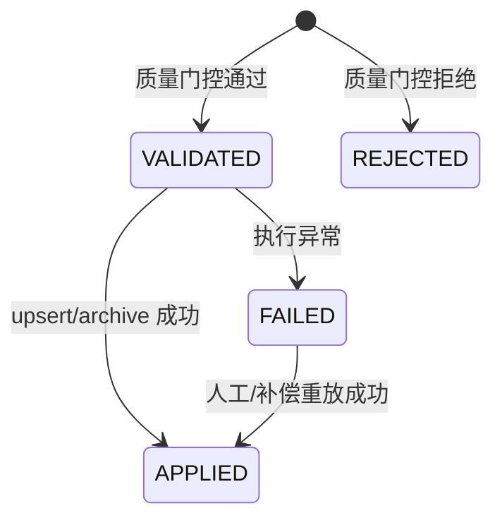
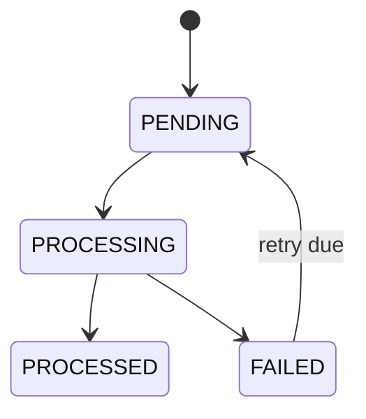
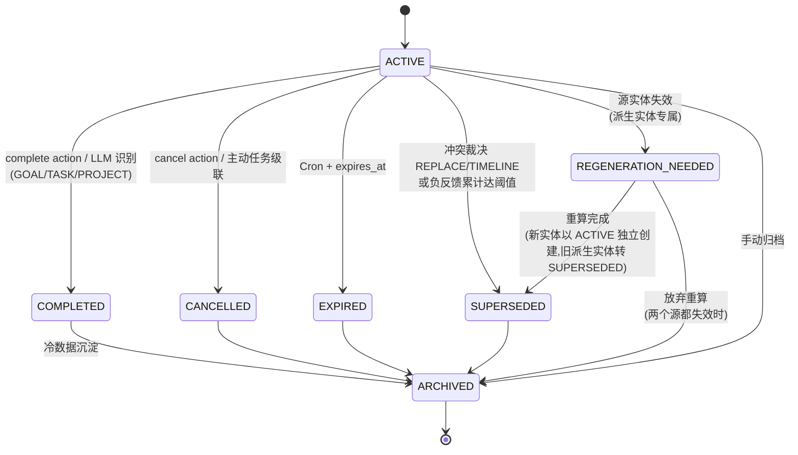

# 记忆数据流 — 长期参照物

> **文档性质**：模块级长期数据流参照（源信任文档）
> **模块归属**：`com.lifepilot.memory` + `com.lifepilot.agent.task.proactive`
> **最后更新**：2026-05-05（治理增强：统一访问策略、项目 overlay、候选提取、投影 outbox、契约测试）
> **配套 spec**：`docs/superpowers/specs/2026-04-23-memory-lifecycle-closure-design.md`（一次性归档）
>
> 本文档是记忆模块"获取 → 处理 → 存储/生命周期 → 检索/消费"全链路的 **source of truth**。任何对记忆写入链路、事件契约、监听器职责、状态机、Schema、项目隔离策略、工具/API 消费边界的改动，必须 **先更新本文档再改代码**；图代码对账以本文档为准。

---

## 0. 数据治理基准（2026-05-04）

### 0.1 项目记忆隔离语义

项目创建时选择的 `ISOLATED` 是**单向隔离**：

| 方向 | 规则 |
|---|---|
| 读取 / 注入 | 隔离项目可以读取项目自身记忆 + 主账户个人记忆 + 主账户经验记忆；这是继承读取，不视为污染。 |
| 写入 / 更新 / 删除 / 冲突合并 | 隔离项目只能写入、更新、删除、合并自己的 project `MemorySpace`；不能反向修改主账户、其他项目或知识库 domain space。 |
| 非隔离项目 | 与主账户合流，写入默认 personal / experience space。 |
| 知识库绑定对话 | 对话学习应写入绑定 KB 的 domain write space；未解析到明确 domain write space 时跳过 domain learning。 |

因此，`MemoryReadFilter.buildForProject(...)` 允许把项目 space 与主账户 space 合并读取；但 `MemoryWriteContext`、冲突检测、显式工具写操作、前端写操作必须使用**可写范围**，不能复用继承读取范围。

### 0.2 获取层治理规则

| 规则 | 说明 |
|---|---|
| 原始事实源 | 以 transcript 中用户可治理文本为准；文档 hint、系统 wrapper、自动 UI signal 不直接进入长期记忆提取。 |
| 作用域快照 | RealtimeExtractor 必须依赖 `ChatTurnMemorySnapshot` 决定本轮学习目标；缺快照、缺 turnId、解析异常时自动学习 fail-closed。 |
| 读取摘要 | 提取前的 existing summary 可以按单向隔离读取继承记忆，但后续 UPDATE/DELETE 只能命中可写 space。 |
| 审计 | 每次提取事件至少记录 `session_id / turn_id / space_id / operation / entity_type / entity_name / success / error`，便于追溯。 |

### 0.3 处理与合并治理规则

| 规则 | 说明 |
|---|---|
| 冲突检测 | 冲突检测永远在写入目标 space 内执行；`spaceId=null` 不代表全空间。 |
| 默认写入上下文 | 调用方未指定 space 时，由 `SemanticMemory` 根据 entity type 解析到默认 personal / experience space 后再检测冲突。 |
| 项目 overlay | 隔离项目内用户更新了继承记忆时，应在项目 space 形成项目局部版本，而不是修改主账户实体。 |
| LLM 决策兜底 | AUDN `UPDATE` 在可写 space 找不到实体时降级为 `ADD`，形成局部 overlay。 |

### 0.4 存储、索引与生命周期治理规则

| 规则 | 说明 |
|---|---|
| 主库优先 | `memory_entities` / `memory_entity_versions` / provenance 是事实主库；向量库是派生索引。 |
| after-commit 索引 | 向量 upsert/delete 必须在主库事务提交后执行；事务回滚不得留下幻觉向量。 |
| 删除清理 | 项目删除、实体归档、生命周期终态转换都要清理对应向量。项目删除需先收集 entityIds，提交后批量清理向量。 |
| 生命周期单轨 | TTL 过期统一走 `ExpirationScanner -> SemanticMemory.updateLifecycleState(EXPIRED)`；旧 `EntityExpirationJob` 不再注册。 |
| 可召回状态 | 默认检索只召回 `ACTIVE / COMPLETED / REGENERATION_NEEDED`，并保留 historical/stale/revalidation 标注。 |

### 0.5 消费层治理规则

| 规则 | 说明 |
|---|---|
| 工具写操作 | `memory.update/delete/cancel/complete/supersede/tag` 不能只凭裸 `entityId` 写；必须验证目标实体属于当前可写范围。 |
| 批量 cancel | 隔离项目内的语义 cancel 只能归档项目 space 内实体，不能归档继承读取到的主账户实体。 |
| Web API | 管理端可以提供全局视角，但返回 DTO 必须暴露 `spaceId / memoryScope / lifecycleState / temporality / expiresAt` 等治理字段。显式传入 `projectId` 的项目内视图必须由 `MemoryAccessPolicy` 构造 read filter / write context / writable filter：搜索、实体列表、详情、关系读取按项目可读范围；手动创建写入项目/主账户策略目标；隔离项目更新继承实体只能创建项目 overlay；隔离项目删除继承实体在 `HIDE` overlay 落地前必须 fail-closed，不能归档 base。 |
| prompt 注入 | DataRedactor 失败时不注入原文；宁可丢失该段上下文，也不能 fail-open 泄漏敏感内容。 |
| 空结果缓存 | 检索 miss 不能被缓存成全局空库状态；空库判断必须基于语料库状态，不得基于单次 query/filter。 |

### 0.6 五项治理增强基线（2026-05-05）

本节是本轮改造的落地参照；代码不得在调用方各自复写这些规则。

| 增强项 | 目标 | 强制规则 |
|---|---|---|
| `MemoryAccessPolicy` | 统一所有读写边界判断 | `RealtimeExtractor`、`MemoryToolProvider`、`MemoryController`、`ChatTurnService` 等入口只能通过策略构造 read filter / write context / writable filter；不再手写“隔离项目 + 默认空间”的组合逻辑。 |
| 项目 overlay | 让隔离项目对继承记忆的局部修改有显式血缘 | 隔离项目更新继承实体时，不修改主账户实体；在项目 space 创建/更新 overlay 实体，并写 `memory_entity_overlays(overlay_entity_id, base_entity_id, overlay_space_id, origin_space_id, overlay_kind)`。项目读取时 overlay 优先，base 实体在同一读取视图中被遮蔽。 |
| 提取候选流水线 | 把 LLM 结构化输出从“直接写库”升级为可审计候选 | `RealtimeExtractor` 执行顺序为：LLM AUDN → 质量门控产出 `VALIDATED / REJECTED` 候选记录 → `VALIDATED` 候选 governed upsert/archive → 回写候选执行结果。候选表必须记录 `session_id / turn_id / target_space_id / operation / decision_json / candidate_status / validation_status / rejection_reason / persisted_entity_id / base_entity_id / error_message`。 |
| 投影 outbox | 让向量/图谱/派生索引从主库中解耦并可重试 | `memory_entities` 是事实主库；向量 upsert/delete 进入 `memory_projection_outbox`，由 processor 幂等消费。事务回滚不得产生投影任务；投影失败必须保留 PENDING/FAILED 状态以便补偿扫描。 |
| 治理契约测试 | 用端到端规则锁住边界 | 新增/维护隔离项目读取继承、写入不污染、overlay 优先、缺快照 fail-closed、候选记录、outbox 回滚安全、查询/图遍历/filter 生效等契约测试。 |

### 0.7 数据质量终态契约

数据质量是记忆是否可写、可巩固、可注入、可派生到 L4 的第一约束。终态不再把 `importance_score` 当成质量分：`importance_score` 只表示“这条信息对未来任务的重要度”，`trust_score` / `trust_level` / `evidence_kind` 才表示“这条信息能不能被信任”。

#### 0.7.1 质量字段

| 字段 | 位置 | 语义 |
|---|---|---|
| `evidence_kind` | `memory_entities` / `memory_entity_provenances` / `memory_extraction_candidates` | 这条记忆的证据类型。 |
| `trust_level` | `memory_entities` / `memory_extraction_candidates` | 面向消费层的可信等级。 |
| `trust_score` | `memory_entities` / `memory_entity_provenances` / `memory_extraction_candidates` | 0.0-1.0 可信分，与 relevance/importance 分开计算。 |
| `evidence_count` | `memory_entities` | 当前实体累计有效证据数；版本化更新时递增或保持。 |
| `last_verified_at` | `memory_entities` | 最近一次被用户确认、工具验证或文档证据验证的时间。 |
| `evidence_excerpt` | `memory_entity_provenances` / `memory_extraction_candidates` | 最小必要证据片段，禁止长文本整段复制。 |

`evidence_kind` 枚举：

| 值 | 来源 | 默认信任 |
|---|---|---|
| `USER_EXPLICIT` | 用户在 transcript 中明确陈述的个人事实/偏好/目标 | `EXPLICIT`，基础 `trust_score=0.80` |
| `USER_CONFIRMED` | 用户通过 Web/API/tool 明确创建或修正 | `EXPLICIT`，基础 `trust_score=0.90` |
| `TOOL_VERIFIED` | 工具结果验证过的事实 | `VERIFIED`，基础 `trust_score=0.88` |
| `DOCUMENT_GROUNDED` | 文档/知识库可追溯证据 | `VERIFIED`，基础 `trust_score=0.82` |
| `CHAT_INFERRED` | 从对话语义推断但用户未直接确认 | `INFERRED`，基础 `trust_score=0.55` |
| `BEHAVIOR_INFERRED` | 主动系统/行为信号推断 | `INFERRED`，基础 `trust_score=0.50` |
| `LLM_SUMMARIZED_EXPERIENCE` | 由执行轨迹或反思总结出的经验 | `DERIVED`，基础 `trust_score=0.62` |
| `DERIVED` | 巩固、合并、对比学习等派生实体 | `DERIVED`，基础 `trust_score=0.60` |
| `UNKNOWN` | 缺少明确来源 | `UNVERIFIED`，基础 `trust_score=0.00` |

`trust_level` 消费规则：

| 等级 | 可写主库 | 可自动注入 prompt | 可派生 L4 | 规则 |
|---|---|---|---|---|
| `VERIFIED` | 是 | 是 | 是 | 工具/文档证据充分，可作为高优先级上下文。 |
| `EXPLICIT` | 是 | 是 | 是 | 用户明示或确认，除非过期/被负反馈。 |
| `INFERRED` | 是，但必须带证据片段 | 仅在 relevance 高且无负反馈时注入 | 否，需二次确认或多次观察后提升 | 推断不得直接变成长期偏好规则。 |
| `DERIVED` | 是，必须带 `derivation_sources` | 可注入，但必须标注派生 | 只有源实体仍有效时可派生 | 源失效后进入 `REGENERATION_NEEDED` 或归档。 |
| `UNVERIFIED` | 否，候选表留痕 | 否 | 否 | 缺证据、低置信、来源不明。 |

#### 0.7.2 写入门槛

| 入口 | 质量规则 |
|---|---|
| `RealtimeExtractor` | AUDN prompt 必须要求 `evidence_kind / evidence_excerpt / temporality / expires_at`；只允许从 `用户:` 内容提取。`USER_EXPLICIT` 可写；`CHAT_INFERRED` 只有 `trust_score >= 0.60` 且 evidence excerpt 非空才可写；`UNKNOWN` 进入 `REJECTED` 候选，不写主库。 |
| `ExperienceSummarizer` | 只写可迁移经验：必须包含任务目标、工具/步骤摘要、成功/失败结果、适用条件。一次偶发失败不能产出高信任经验；默认 `LLM_SUMMARIZED_EXPERIENCE / DERIVED`。 |
| `SubtaskReflector` | 只写工具级经验，不进通用经验注入；必须带 `toolId` 和 `granularity=TOOL_LEVEL`。 |
| `ProactiveMemoryBridge` | 行为推断只能是 `BEHAVIOR_INFERRED`；不得直接覆盖 `USER_EXPLICIT` 偏好。 |
| `MemoryController` / `memory.create/update` | 用户显式操作为 `USER_CONFIRMED`；隔离项目更新继承记忆走 overlay。 |
| `PreferenceConsolidator` | 只允许 `VERIFIED / EXPLICIT` 的 L3 `PREFERENCE` 同步到 L4；`INFERRED` 需要多次观察或用户确认后再升级。 |

#### 0.7.3 消费门槛

| 消费方 | 规则 |
|---|---|
| `ContextAssembler` 用户画像 | 只注入 `VERIFIED / EXPLICIT / DERIVED`；`INFERRED` 仅在与当前 query 强相关时注入，并在文本中标注“推断”。 |
| `ContextAssembler` `memory_context` | 相关度、生命周期、项目 filter、trust level 四重过滤；`UNVERIFIED` 永不注入。 |
| `ToolTipResolver` | 工具级经验必须匹配 `toolId`，且 `trust_score >= 0.55`。 |
| `IntentMatcher` / L4 | `procedure_templates.deactivated_reason IS NULL` 且源 L3 仍可召回；失活模板不得匹配。 |
| Web API | DTO 必须暴露质量字段，管理端可按 `trust_level / evidence_kind / lifecycle_state / projectId` 排查问题记忆。 |

#### 0.7.4 清理原则

不再保留以下兼容路径：

- 向量索引直写 fallback：所有向量 upsert/delete 必须通过 `memory_projection_outbox`。
- L4 无源规则：`preference_rules / procedure_templates` 必须填 `source_entity_id`；无法追溯源实体的规则不得参与消费。
- 缺 `ChatTurnMemorySnapshot` 自动学习 fallback：缺快照直接跳过，不写默认主账户空间。
- 低质量候选静默丢弃：所有 LLM 输出都必须进入候选审计表，标明 `VALIDATED / REJECTED / FAILED / APPLIED`。

### 0.8 统一访问策略契约

`MemoryAccessPolicy` 是记忆边界的唯一策略层：

| 方法语义 | 输入 | 输出 | 规则 |
|---|---|---|---|
| 项目读取范围 | projectSpaceId / personalSpaceId / experienceSpaceId / isolated / scopes | `MemoryReadFilter` | ISOLATED：项目 + personal + experience；SHARED/主账户：personal + experience；domain 读取由快照附加 domain spaces。 |
| 显式写入目标 | ProjectContext 或 ChatTurnMemorySnapshot | `MemoryWriteContext` | ISOLATED personal learning 写项目 space；SHARED/主账户写默认 personal/experience；domain learning 只在单一明确 domain write space 存在时写 domain。 |
| 可写实体范围 | ProjectContext | `MemoryReadFilter` | ISOLATED 仅项目 space；SHARED/主账户仅默认 personal + experience；未知上下文可保留 legacy 全局行为，但必须在日志中可区分。 |
| overlay 读取遮蔽 | `MemoryReadFilter` | SQL 过滤语义 | 当读取范围包含 overlay 所在项目 space 时，`base_entity_id` 对应继承实体不再返回，避免同一事实出现主账户版本和项目局部版本的冲突注入。 |

### 0.9 项目 overlay 数据语义

overlay 不改变 base 实体生命周期，不复制 base provenance 的治理权，只表示“当前项目对该继承事实的局部视图”。

| 字段 | 说明 |
|---|---|
| `overlay_entity_id` | 项目 space 内实体 id，必须属于 `overlay_space_id`。 |
| `base_entity_id` | 被覆盖的继承实体 id，通常来自 personal / experience 主账户 space。 |
| `overlay_space_id` | 项目 MemorySpace id。 |
| `origin_space_id` | base 实体所属 space，便于审计和 UI 展示。 |
| `overlay_kind` | `UPDATE` / `HIDE` / `CANCEL` / `SUPERSEDE`；本轮先落地 `UPDATE`，其余作为同表兼容语义。 |

读取优先级：项目 overlay > 项目普通实体 > 主账户 personal/experience 继承实体。overlay 实体被归档或转终态后，遮蔽关系可以保留作审计；实际遮蔽以 overlay 根实体 `status='ACTIVE'` 为准。

### 0.10 提取候选与投影 outbox 状态机

`memory_extraction_candidates.candidate_status`：



`memory_projection_outbox.status`：



投影任务必须包含 `aggregate_type / aggregate_id / projection_type / operation / payload_json / attempt_count / next_attempt_at / last_error`。向量投影的 `operation` 为 `UPSERT` 或 `DELETE`，`payload_json` 至少包含 `entityId`，UPSERT 还必须包含 `text`。

### 0.11 消费侧契约：上下文注入与搜索返回

记忆消费分成两类：**自动上下文注入** 与 **显式搜索工具返回**。两类路径都必须遵守同一套“可消费实体”门槛，但返回形态不同。

“可消费实体”是质量、生命周期、项目边界三者的交集：

- 主库当前版本：`is_current = 1`。
- 生命周期可召回：`lifecycle_state in (ACTIVE, COMPLETED, REGENERATION_NEEDED)`；自动注入必须显式标注 `COMPLETED` / `REGENERATION_NEEDED`，搜索工具必须返回 `lifecycle` 标注。
- 未过期：`valid_to is null or valid_to > now`，`expires_at` 过期实体必须先经 `ExpirationScanner` 进入 `EXPIRED`，消费侧也要防御性过滤。
- 项目读取范围：所有消费入口必须使用 `MemoryAccessPolicy` / `MemoryReadFilter`，包含 overlay 遮蔽语义。
- 质量门槛：`MemoryQualityPolicy.isPromptConsumable(...) == true`；`UNVERIFIED` 永不消费，`UNKNOWN` 证据不得被默认提升为 `USER_EXPLICIT`。

| 路径 | 目标 | 硬规则 |
|---|---|---|
| `ContextAssembler.memory_context` | 给 LLM 自动注入少量高可信长期记忆 | 只注入可消费实体；`INFERRED` 仅在相关度足够高时保留；注入文本必须带 `trustLevel/evidenceKind` 标签。 |
| `ContextAssembler.user_profile_context` | 给 LLM 自动注入用户画像摘要 | `__consolidated_profile` 与画像碎片都必须走同一“可消费实体”门槛；巩固画像是派生实体，必须带 `DERIVED` 标签、记录实际注入 ID；不可因为存在巩固画像就绕过质量/生命周期过滤。 |
| `ContextAssembler.experience_context` | 给 LLM 自动注入可迁移经验 | 只注入可消费且可迁移的任务级经验，不注入 tool-level 经验；`recordInjection` 与实际注入条目一一对应。 |
| `ToolTipResolver` | 给单个工具调用补充工具级经验提示 | 必须按当前项目上下文构造 read filter；只消费 `AGENT_EXPERIENCE`、`granularity=TOOL_LEVEL`、`toolId` 匹配、`trust_score >= 0.55` 的实体。 |
| `memory.search` | 让 Agent 主动搜索长期记忆 | 返回 `results/rawCount/qualityFilteredCount/truncatedCount/filteredOutCount`；每条结果必须附带 `quality`、`lifecycle`、`scoreBreakdown`；搜索结果只暴露可消费实体，不能把 `UNVERIFIED` 当作正常可用记忆。 |
| `memory.search-experience` | 让 Agent 主动搜索经验 | 仅返回 `AGENT_EXPERIENCE` 且可消费的经验；tool-level 粒度不作为通用经验返回。 |

#### 0.11.1 上下文注入数据结构

`ContextAssembler` 需要把“真正注入了什么”与“只是检索到了什么”分开：

- `experience_context` 只记录实际进入 prompt 的经验实体 ID。
- `memory_context` 只记录实际进入 prompt 的长期记忆实体 ID。
- `user_profile_context` 只记录实际进入 prompt 的巩固画像或画像碎片实体 ID。
- `recordInjection` / `injectedEntityIds` 只能基于最终注入集合，不能基于检索候选集合。
- 脱敏失败、预算截断、质量过滤导致未进入 prompt 的条目，不得进入注入回执。

#### 0.11.2 搜索返回数据结构

`memory.search` 返回的每条结果应携带最小消费信息：

- `entityId / entityType / name / description`
- `score`
- `sourcePath`
- `quality`: `trustLevel / evidenceKind / trustScore / evidenceCount / lastVerifiedAt`
- `lifecycle`: `isHistorical / isStale / needsRevalidation`
- `scoreBreakdown`: 各路召回、可信度、生命周期、重要度和加权分明细

`HybridRetriever` 排序必须把 `trust_score / trust_level` 与生命周期状态纳入分数解释：质量低的候选不能只靠 `importance_score` 排到前面；`REGENERATION_NEEDED` 可返回但要降权并标注，供 Agent 追问确认或触发重算。

这样 Agent 可以区分“高置信可直接使用”“需要追问确认”“仅供参考”的结果，不再把召回结果当成同质数据。

---

## 1. 概览图

```mermaid
flowchart TD
    subgraph Sources["写入/影响源（14 条 + 前端 CRUD）"]
        W1["① RealtimeExtractor<br/>(对话结束提取)"]
        W2["② ExperienceSummarizer<br/>(任务级 EXPERIENCE)"]
        W3["③ SubtaskReflector<br/>(工具级 EXPERIENCE)"]
        W4["④ ContrastiveLearner<br/>(成功经验增强)"]
        W5["⑤ UserProfileConsolidator<br/>(派生 __consolidated_profile)"]
        W6["⑥ ProactiveMemoryBridge.syncInsightToL3<br/>(PREFERENCE insight)"]
        W7["⑦ PreferenceConsolidator<br/>(L3→L4 偏好同步)"]
        W8["⑧ ProceduralMemory.save<br/>(L4 procedure_templates)"]
        W9["⑨ ProactiveMemoryBridge.observePreference<br/>(L4 EWMA 偏好)"]
        W10["⑩ ForgettingEngine<br/>(衰减/归档)"]
        W11["⑪ EntityDeduplicator<br/>(合并→归档从实体)"]
        W12["⑫ FeedbackProcessor<br/>(点赞/点踩)"]
        W13["⑬ TrustUpgradeService<br/>(L4 信任度, 未入事件总线)"]
        W14["⑭ EffectivenessTracker<br/>(自动有效性评估)"]
        W15["⑮ MemoryController CRUD<br/>(前端手动编辑)"]
    end

    subgraph Governance["治理策略层"]
        AP["MemoryAccessPolicy<br/>read filter / write context / writable filter"]
        OC["memory_entity_overlays<br/>项目局部覆盖血缘"]
        EC["memory_extraction_candidates<br/>AUDN 候选审计"]
        PO["memory_projection_outbox<br/>向量/图谱投影任务"]
    end

    subgraph Gateway["统一事件挂载点<br/>SemanticMemory"]
        SM["SemanticMemory<br/>upsertWithConflictDetection<br/>archive / updateLifecycleState<br/>updateImportanceScore / updateDescription"]
    end

    subgraph Bus["ApplicationEvent 总线（afterCommit 分发）"]
        E1[["EntityLifecycleChanged"]]
        E2[["SourceInvalidated"]]
        E3[["EntityWeightChanged"]]
        E4[["ProactiveTaskCancelled"]]
    end

    subgraph Listeners["7 监听器（planned，Phase 1 Task 15–21）"]
        H1["L4SyncListener"]
        H2["VectorListener"]
        H3["DerivedEntityListener"]
        H4["ProvenanceStaleListener"]
        H5["ReValidationListener"]
        H6["NegativeFeedbackListener"]
        H7["ProactiveTaskCancelListener"]
    end

    W1 --> AP --> EC --> SM
    W2 --> SM
    W3 --> SM
    W4 --> SM
    W5 --> SM
    W6 --> SM
    W10 --> SM
    W11 --> SM
    W12 --> SM
    W14 --> SM
    W15 --> AP --> SM
    W7 -->|savePreference| L4[("preference_rules<br/>procedure_templates")]
    W8 -->|save| L4
    W9 -->|EWMA 更新| L4
    W13 -->|reminder 信任度| L4
    SM --> E1
    SM --> E3
    SM --> OC
    SM --> PO
    PM["ProactiveMemoryBridge.markGoalFulfilled"] --> E4
    OrphanScanner["OrphanProvenanceScanner (planned)"] --> E2
    DocArchive["Document / KnowledgeBase 归档钩子 (planned)"] --> E2
    E1 --> H1
    E1 --> H2
    E1 --> H3
    E2 --> H4
    E2 --> H5
    E3 --> H6
    E4 --> H7
```



说明：
- **蓝绿三层**：写入源 → SemanticMemory 统一挂载 → 事件总线 → 监听器
- **直写 L4**（⑦⑧⑨⑬）不经过 SemanticMemory 事件路径，未来由 L4SyncListener 反向同步
- **事件总线**采用 Spring `ApplicationEventPublisher` + `TransactionSynchronization.afterCommit()`，回滚路径下不泄漏幻觉事件

---

## 2. 14 写入源详表

每条记录精确到 `file:line`，便于机械对账。所有"是否经 SemanticMemory"列，`✅` 代表已统一走事件路径，`直写 L4` 代表未经事件总线（未来由 Listener 反向同步）。

| # | 源 | 类路径 | 产物类型 | 触发时机 | `provenance.source` / 场景语义 | 经 SemanticMemory? |
|---|---|---|---|---|---|---|
| 1 | `RealtimeExtractor` | `src/main/java/com/lifepilot/memory/semantic/RealtimeExtractor.java:299`（ADD）`:333`（UPDATE）`:346`（DELETE→archive） | L3：任意 `EntityType`（依赖 LLM AUDN 判定） | 对话结束，Virtual Thread 异步 AUDN 提取 | `sourceReference=sessionId`（会话 id）— `resolveChangeSource` 归到 `LLM_SEMANTIC` | ✅ |
| 2 | `ExperienceSummarizer` | `src/main/java/com/lifepilot/memory/experience/ExperienceSummarizer.java:252`（去重命中 updateImportanceScore）`:307`（新建）`:354`（quickLearn） | L3：`EXPERIENCE`（任务级） | 对话结束 + 质量评估通过 | `sourceReference=sourceId`（trace/session）— `LLM_SEMANTIC` | ✅ |
| 3 | `SubtaskReflector` | `src/main/java/com/lifepilot/memory/experience/SubtaskReflector.java:266` | L3：`EXPERIENCE`（工具级） | 工具序列结束后即时反思 | `sourceReference="subtask-reflection"` — `LLM_SEMANTIC` | ✅ |
| 4 | `ContrastiveLearner` | `src/main/java/com/lifepilot/memory/experience/ContrastiveLearner.java:215` | L3：对现有 `EXPERIENCE` 的 `properties` 增强（写入 `lessons` + `contrastiveEnriched=true`）；**当前未产出独立 `CONTRASTIVE_INSIGHT` 实体** | Summarizer 完成后的对比学习 | `sourceReference="contrastive-learning"` — `LLM_SEMANTIC` | ✅ |
| 5 | `UserProfileConsolidator` | `src/main/java/com/lifepilot/memory/consolidation/UserProfileConsolidator.java:221`（UPDATE）`:253`（ADD） | L3：`CUSTOM` 实体，`name=__consolidated_profile`，`isDerived=true`，`derivationSources=[源画像碎片实体 id]` | `ConsolidationPipeline` Cron（≥2h） | `sourceReference="user-profile-consolidation"` — `LLM_SEMANTIC`；写入前必须过滤不可消费碎片 | ✅ |
| 6 | `ProactiveMemoryBridge.syncInsightToL3` | `src/main/java/com/lifepilot/agent/task/proactive/ProactiveMemoryBridge.java:385` | L3：`PREFERENCE`，`name=proactive_insight_{category}_{key}` | 主动引擎行为反馈回写 | `sourceReference="proactive-engine"` — `LLM_SEMANTIC` | ✅ |
| 7 | `PreferenceConsolidator` | `src/main/java/com/lifepilot/memory/consolidation/PreferenceConsolidator.java:78`（新建）`:94`（强化）`:106`（删除） | L4：`preference_rules`（`category=user-preference`） | `ConsolidationPipeline` Cron | 走 `ProceduralMemory.savePreference` / `reinforcePreference` / `deletePreference`；新建规则填 `source_entity_id`；**不发事件**，失活由 `L4SyncListener` 监听 L3 生命周期 | 直写 L4 |
| 8 | `ProceduralMemory.save` | `src/main/java/com/lifepilot/memory/procedural/ProceduralMemory.java:56` | L4：`procedure_templates` | 巩固管线 `promoteHighFrequencyExperiences`（`ConsolidationPipeline.java:217`） | INSERT 填 `source_entity_id` / `deactivated_reason`；**不发事件**，失活由 `L4SyncListener` 监听 L3 生命周期 | 直写 L4 |
| 9 | `ProactiveMemoryBridge.observePreference` | `src/main/java/com/lifepilot/agent/task/proactive/ProactiveMemoryBridge.java:347`（更新）`:355`（新建） | L4：`preference_rules`（EWMA α=0.3） | 主动引擎信号（`ProactiveMemoryBridge.java:36` `PREFERENCE_ALPHA`） | `learnedFrom="proactive-engine"`；**不发事件** | 直写 L4 |
| 10 | `ForgettingEngine` | `src/main/java/com/lifepilot/memory/forgetting/ForgettingEngine.java:215`（LLM 压缩后归档）`:221`（降级归档）`:227`（默认归档） | L3：将实体 archive → `lifecycle_state=ARCHIVED` | Cron（定时衰减扫描） | 三处均显式传 `ChangeSource.CRON_EXPIRE`；走 `semanticMemory.archive(entity, source)` 3-arg 重载 | ✅ |
| 11 | `EntityDeduplicator` | `src/main/java/com/lifepilot/memory/consolidation/EntityDeduplicator.java:198` | L3：归档 secondary 实体，primary 属性合并（**应派生 MERGED，当前未标 `isDerived=true`，未写 `derivationSources`**） | `ConsolidationPipeline` Cron | `semanticMemory.archive(secondary, ChangeSource.CONFLICT_RESOLVE)` | ✅ |
| 12 | `FeedbackProcessor` | `src/main/java/com/lifepilot/memory/feedback/FeedbackProcessor.java:92` | L3：改实体 `importance_score`（不改 lifecycle） | 用户点赞 / 点踩（`WebController` → `InjectionRecordRepository` 反查实体） | `WeightSource.USER_FEEDBACK`；经 `SemanticMemory.updateImportanceScore` 发 `EntityWeightChanged` | ✅ |
| 13 | `TrustUpgradeService` | `src/main/java/com/lifepilot/agent/task/proactive/TrustUpgradeService.java` | L4：`reminder_trust` / `proactive_reminder_topic_preferences`（非 `preference_rules`） | 主动提醒反馈（用户 "无用" 按钮） | **尚未发事件；不走 SemanticMemory；S14 提醒反馈溯源到 L3 insight 待 Task 25 实施** `(planned: Task 25)` | 未接入 `(planned)` |
| 14 | `EffectivenessTracker` | `src/main/java/com/lifepilot/memory/experience/EffectivenessTracker.java:123`（淘汰 archive）`:126`（调整分数） | L3：低分则 archive，否则调 `importance_score` | 对话完成后自动有效性评估 | `archive(entity)` 默认 `UI_EDIT`；`updateImportanceScore(..., WeightSource.EFFECTIVENESS)` | ✅ |
| 15（附加） | `MemoryController` CRUD / 项目视图 | `src/main/java/com/lifepilot/interaction/web/controller/MemoryController.java`（search/list/detail/related/relations/CRUD） | L3：用户直接 CRUD 与 Web 管理端消费 | 前端 UI 手动编辑 / 项目内记忆视图 | 显式 `projectId` 经 `MemoryAccessPolicy` 构造 filter/context；手动写入 `origin=MANUAL`；隔离项目更新继承实体走 `upsertProjectOverlay`，删除继承实体 fail-closed | ✅ |

**发布点归属**（`SemanticMemory.java`）：

| 入口 | 发布事件 | 行号 |
|---|---|---|
| `upsertWithConflictDetection` 新建分支 | `EntityLifecycleChanged(null → state)` | `:193` |
| `archive(entity, ChangeSource)` | `EntityLifecycleChanged(oldState → ARCHIVED)` | `:388` |
| `updateLifecycleState` | `EntityLifecycleChanged(oldState → newState)` | `:530` |
| `updateImportanceScore(id, newScore, WeightSource)` | `EntityWeightChanged(delta, cumulativeScore)` | `:594` |
| `publishAfterCommit` 通用方法 | 任意事件挂到 `TransactionSynchronization.afterCommit()` | `:454` |
| `resolveChangeSource` 归因 | `user-edit-description → UI_EDIT` / `tool-cancel/complete/supersede → TOOL_EXPLICIT` / 其他 → `LLM_SEMANTIC` | `:440` |

**注意**：
- `upsertWithConflictDetection` 的**合并分支**（`:145-174`）目前**不发 LifecycleChanged**（只新版本化，不改状态），这与 spec §4.5 "冲突裁决 REPLACE 时旧实体 SUPERSEDED" 的差距由 Phase 2 Task 24 `ConflictResolutionService` 补齐。

---

## 3. 4 个事件契约表

| 事件 | 字段 | 取值约束 | Java 类 file:line |
|---|---|---|---|
| `EntityLifecycleChanged` | `entityId: String`<br/>`entityType: String`<br/>`oldState: LifecycleState?`（新建时 null）<br/>`newState: LifecycleState`<br/>`reason: String?`<br/>`source: ChangeSource` | newState 非 null；`oldState.canTransitionTo(newState)==true`（由调用方校验）；source 必选 | `src/main/java/com/lifepilot/memory/lifecycle/events/EntityLifecycleChanged.java:13` |
| `SourceInvalidated` | `sourceType: SourceType`（DOCUMENT / KNOWLEDGE_BASE / SESSION）<br/>`sourceId: String`<br/>`kind: InvalidationKind`（DELETED / ARCHIVED / CONTENT_CHANGED） | 三字段均非 null | `src/main/java/com/lifepilot/memory/lifecycle/events/SourceInvalidated.java:12` |
| `EntityWeightChanged` | `entityId: String`<br/>`delta: double`（首次写入退化为 newScore）<br/>`cumulativeScore: double`（调整后绝对值，typical 0.0–1.0）<br/>`source: WeightSource`（USER_FEEDBACK / EFFECTIVENESS / QUALITY_REJECT） | 无量纲浮点；阈值 `memory.feedback.negative-threshold-score` 默认 -1.0 | `src/main/java/com/lifepilot/memory/lifecycle/events/EntityWeightChanged.java:21` |
| `ProactiveTaskCancelled` | `taskId: String`（即 GOAL 实体 id）<br/>`relatedInsightEntityIds: List<String>`（compact ctor 做 `List.copyOf` 防御拷贝） | 列表元素非 null；来自 `proactive_task_insight_links` 查询 | `src/main/java/com/lifepilot/memory/lifecycle/events/ProactiveTaskCancelled.java:14` |

### 3.1 ChangeSource 枚举（8 值）

`src/main/java/com/lifepilot/memory/lifecycle/ChangeSource.java:9`

| 值 | 语义 |
|---|---|
| `TOOL_EXPLICIT` | 工具显式调用（`memory.cancel` / `complete` / `supersede` / `delete`） |
| `LLM_SEMANTIC` | LLM 语义识别（对话提取 / 反思 / 画像巩固） |
| `CRON_EXPIRE` | Cron 扫描到期（ForgettingEngine、ExpirationScanner） |
| `CONFLICT_RESOLVE` | upsert 语义冲突裁决后状态转换（EntityDeduplicator、ExperienceMerger） |
| `NEGATIVE_FEEDBACK` | 负反馈累计达阈值 |
| `PROACTIVE_CANCEL` | 主动任务取消级联 |
| `UI_EDIT` | 前端 UI 编辑 / CRUD |
| `DERIVATION_TRIGGER` | 派生实体源失效触发（防 REGENERATION 递归） |

### 3.2 LifecycleState 枚举（7 态）

`src/main/java/com/lifepilot/memory/lifecycle/LifecycleState.java:9`

| 值 | 可召回 | 说明 |
|---|---|---|
| `ACTIVE` | ✅ | 当前生效 |
| `COMPLETED` | ✅ | 已完成（GOAL/TASK/PROJECT 专属） |
| `CANCELLED` | ❌ | 用户明确取消 / 主动任务级联 |
| `EXPIRED` | ❌ | TTL 到期 |
| `SUPERSEDED` | ❌ | 被新版本替代 / 负反馈淘汰 |
| `REGENERATION_NEEDED` | ⚠️（带 isStale） | 派生实体源变化，等待重算 |
| `ARCHIVED` | ❌ | 手动归档 / 冷数据 |

合法转换由 `LifecycleState.canTransitionTo(next)` 校验（`:19`）。

### 3.3 Temporality 枚举

`src/main/java/com/lifepilot/memory/lifecycle/Temporality.java:15`：`EPHEMERAL` / `SHORT_TERM` / `PERSISTENT`（默认）。

---

## 4. 7 监听器 × 事件订阅矩阵

7 个生命周期监听器均已存在，统一使用 `@TransactionalEventListener(phase = AFTER_COMMIT)` 或等价提交后路径承接事件。下表给出事件 → 监听器订阅关系。

| 事件 \ 监听器 | `L4SyncListener` | `VectorListener` | `DerivedEntityListener` | `ProvenanceStaleListener` | `ReValidationListener` | `NegativeFeedbackListener` | `ProactiveTaskCancelListener` |
|---|---|---|---|---|---|---|---|
| `EntityLifecycleChanged` | ✅ | ✅ | ✅ | — | — | — | — |
| `SourceInvalidated` | — | — | — | ✅ | ✅ | — | — |
| `EntityWeightChanged` | — | — | — | — | — | ✅ | — |
| `ProactiveTaskCancelled` | — | — | — | — | — | — | ✅ |

### 4.1 监听器职责

| # | 监听器 | 状态 | 订阅事件 | 职责 |
|---|---|---|---|---|
| 1 | `L4SyncListener` | ✅ | `EntityLifecycleChanged` | newState ∈ {CANCELLED, EXPIRED, SUPERSEDED, ARCHIVED, REGENERATION_NEEDED} 时，通过 `source_entity_id` 反查 `preference_rules` / `procedure_templates`，写 `deactivated_reason` |
| 2 | `VectorListener` | ✅ | `EntityLifecycleChanged` | newState ∉ {ACTIVE, COMPLETED} 时删 `entity_embeddings`；COMPLETED 保留向量 |
| 3 | `DerivedEntityListener` | ✅ | `EntityLifecycleChanged` | 源实体转 SUPERSEDED/CANCELLED/EXPIRED 时，反查 `derivation_sources` 命中的派生实体 → 打 `REGENERATION_NEEDED`，写 `derivation_regeneration_queue` |
| 4 | `ProvenanceStaleListener` | ✅ | `SourceInvalidated` | `markStale(type, sourceId, now)` 置 `status='STALE'` + `invalidated_at` |
| 5 | `ReValidationListener` | ✅ | `SourceInvalidated` | 写 `memory_revalidation_queue`，检索层命中 STALE provenance 时带提示，LLM 主动询问 |
| 6 | `NegativeFeedbackListener` | ✅ | `EntityWeightChanged` | 写 `memory_feedback_ledger`（累计）；若阈值达成（3 次点踩 或 `cumulativeScore < -1.0`）→ 发 `EntityLifecycleChanged(*, SUPERSEDED, source=NEGATIVE_FEEDBACK)` |
| 7 | `ProactiveTaskCancelListener` | ✅ | `ProactiveTaskCancelled` | 对 `relatedInsightEntityIds` 每个 insight 调 `updateLifecycleState(*, CANCELLED, source=PROACTIVE_CANCEL)` |

所有监听器要求 `@TransactionalEventListener(phase = AFTER_COMMIT)` + 幂等（为 Cron 补偿留接口）。

---

## 5. 7 态状态机



- 合法转换由 `LifecycleState.canTransitionTo(next)` 实现（`LifecycleState.java:19`）
- 非 `ACTIVE`/`REGENERATION_NEEDED` 终态不可逆（重新激活靠新建实体）
- `isRetrievable()` 返回 true 的状态：`ACTIVE` / `COMPLETED` / `REGENERATION_NEEDED`（`LifecycleState.java:30`）

---

## 6. Schema 快照（V1 + V24 + V25 + V26 + V34 + V35 后）

### 6.1 `memory_entities`（基表 + V24 生命周期 + V35 质量字段）

| 字段 | 类型 | 约束 | 说明 |
|---|---|---|---|
| `id` | TEXT | PRIMARY KEY | |
| `space_id` | TEXT | NOT NULL, FK→memory_spaces | 记忆空间隔离 |
| `memory_scope` | TEXT | NOT NULL | |
| `entity_type` | TEXT | NOT NULL | EntityType 枚举 |
| `canonical_name` | TEXT | NOT NULL | |
| `normalized_name` | TEXT | NOT NULL | |
| `reality_type` | TEXT | NOT NULL DEFAULT 'UNKNOWN' | |
| `status` | TEXT | NOT NULL DEFAULT 'ACTIVE' | V1 二态 ARCHIVED/ACTIVE；V24 后代码读取以 `lifecycle_state` 为准 |
| `access_count` | INTEGER | NOT NULL DEFAULT 0 | |
| `last_accessed_at` | TEXT | — | ISO-8601 |
| `first_seen_at` / `last_seen_at` / `created_at` / `updated_at` | TEXT | NOT NULL | |
| `lifecycle_state` **(V24)** | TEXT | NOT NULL DEFAULT 'ACTIVE' | LifecycleState 枚举 |
| `lifecycle_reason` **(V24)** | TEXT | — | 状态变更原因 |
| `expires_at` **(V24)** | TEXT | — | TTL（`ExpirationScanner` 消费） |
| `temporality` **(V24)** | TEXT | NOT NULL DEFAULT 'PERSISTENT' | Temporality 枚举 |
| `succeeded_by` **(V24)** | TEXT | — | TIMELINE 指向新实体 |
| `is_derived` **(V24)** | INTEGER | NOT NULL DEFAULT 0 | 1=派生实体 |
| `derivation_sources` **(V24)** | TEXT | — | JSON 数组 of 源实体 id |
| `evidence_kind` **(V35)** | TEXT | NOT NULL DEFAULT 'UNKNOWN' | MemoryEvidenceKind 枚举 |
| `trust_level` **(V35)** | TEXT | NOT NULL DEFAULT 'UNVERIFIED' | MemoryTrustLevel 枚举 |
| `trust_score` **(V35)** | REAL | NOT NULL DEFAULT 0.0 | 可信分，独立于 relevance/importance |
| `evidence_count` **(V35)** | INTEGER | NOT NULL DEFAULT 0 | 当前实体累计有效证据数 |
| `last_verified_at` **(V35)** | TEXT | — | 最近用户确认/工具验证/文档验证时间 |

**索引**：
- `idx_memory_entities_scope`（space_id, memory_scope, entity_type）
- `idx_memory_entities_name`（normalized_name, entity_type）
- `idx_memory_entities_status`（status）
- `idx_memory_entities_lifecycle`（lifecycle_state, expires_at） **(V24)**
- `idx_memory_entities_derived`（is_derived, lifecycle_state） **(V24)**
- `idx_memory_entities_trust`（trust_level, trust_score） **(V35)**
- `idx_memory_entities_evidence`（evidence_kind, updated_at） **(V35)**

### 6.1.1 `memory_entity_overlays`（V34 新增）

| 字段 | 类型 | 约束 | 说明 |
|---|---|---|---|
| `overlay_entity_id` | TEXT | PRIMARY KEY, FK→memory_entities ON DELETE CASCADE | 项目内 overlay 实体 |
| `base_entity_id` | TEXT | NOT NULL, FK→memory_entities ON DELETE CASCADE | 被覆盖的继承实体 |
| `overlay_space_id` | TEXT | NOT NULL, FK→memory_spaces | overlay 所属项目 space |
| `origin_space_id` | TEXT | FK→memory_spaces | base 实体来源 space |
| `overlay_kind` | TEXT | NOT NULL DEFAULT 'UPDATE' | UPDATE/HIDE/CANCEL/SUPERSEDE |
| `created_at` / `updated_at` | TEXT | NOT NULL | |

**索引**：
- `idx_memory_entity_overlays_base`（base_entity_id, overlay_space_id）
- `idx_memory_entity_overlays_space`（overlay_space_id, overlay_kind）

### 6.1.2 `memory_extraction_candidates`（V34 新增）

| 字段 | 类型 | 约束 | 说明 |
|---|---|---|---|
| `id` | TEXT | PRIMARY KEY | 候选 id |
| `session_id` / `turn_id` / `source_entry_id` | TEXT | session_id NOT NULL | 来源轮次 |
| `target_space_id` | TEXT | — | 本候选准备写入的目标 space |
| `operation` / `entity_name` / `entity_type` | TEXT | operation/entity_name/entity_type NOT NULL | AUDN 决策摘要 |
| `decision_json` | TEXT | NOT NULL | 原始/归一化 AUDN 决策 |
| `candidate_status` | TEXT | NOT NULL | VALIDATED/REJECTED/APPLIED/FAILED |
| `validation_status` | TEXT | NOT NULL DEFAULT 'VALIDATED' | 门控状态，保留扩展 |
| `rejection_reason` | TEXT | — | 质量门控拒绝原因 |
| `evidence_kind` **(V35)** | TEXT | NOT NULL DEFAULT 'UNKNOWN' | 候选证据类型 |
| `trust_level` **(V35)** | TEXT | NOT NULL DEFAULT 'UNVERIFIED' | 候选可信等级 |
| `trust_score` **(V35)** | REAL | NOT NULL DEFAULT 0.0 | 候选可信分 |
| `evidence_excerpt` **(V35)** | TEXT | — | 最小必要证据片段 |
| `persisted_entity_id` | TEXT | — | 成功写入/归档的实体 id |
| `base_entity_id` | TEXT | — | 形成 overlay 时被覆盖的继承实体 id |
| `error_message` | TEXT | — | 执行失败原因 |
| `created_at` / `updated_at` | TEXT | NOT NULL | |

**索引**：
- `idx_memory_extraction_candidates_turn`（turn_id, created_at）
- `idx_memory_extraction_candidates_status`（candidate_status, updated_at）
- `idx_memory_extraction_candidates_entity`（target_space_id, entity_type, entity_name）

### 6.1.3 `memory_projection_outbox`（V34 新增）

| 字段 | 类型 | 约束 | 说明 |
|---|---|---|---|
| `id` | TEXT | PRIMARY KEY | 任务 id |
| `aggregate_type` / `aggregate_id` | TEXT | NOT NULL | 当前使用 MEMORY_ENTITY + entityId |
| `projection_type` | TEXT | NOT NULL | VECTOR / GRAPH / DERIVED（本轮先落地 VECTOR） |
| `operation` | TEXT | NOT NULL | UPSERT / DELETE |
| `payload_json` | TEXT | NOT NULL | 投影输入 |
| `status` | TEXT | NOT NULL DEFAULT 'PENDING' | PENDING/PROCESSING/PROCESSED/FAILED |
| `attempt_count` | INTEGER | NOT NULL DEFAULT 0 | 重试次数 |
| `next_attempt_at` | TEXT | — | 失败后下次可重试时间 |
| `last_error` | TEXT | — | 最近失败原因 |
| `created_at` / `updated_at` / `processed_at` | TEXT | processed_at 可空 | |

**索引**：
- `idx_memory_projection_outbox_status`（status, next_attempt_at, created_at）
- `idx_memory_projection_outbox_aggregate`（aggregate_type, aggregate_id）

### 6.2 `memory_entity_versions`（V1 已有，V24 无变更）

| 字段 | 类型 | 约束 |
|---|---|---|
| `id` | TEXT | PRIMARY KEY |
| `entity_id` | TEXT | NOT NULL, FK→memory_entities ON DELETE CASCADE |
| `version_no` | INTEGER | NOT NULL |
| `description` | TEXT | — |
| `properties_json` | TEXT | — |
| `extraction_confidence` | REAL | NOT NULL DEFAULT 0.0 |
| `importance_score` | REAL | NOT NULL DEFAULT 0.5 |
| `is_current` | INTEGER | NOT NULL DEFAULT 1 |
| `valid_from` / `valid_to` | TEXT | valid_from NOT NULL |
| `created_at` / `updated_at` | TEXT | NOT NULL |
| UNIQUE | (entity_id, version_no) | |

### 6.3 `memory_entity_provenances`（V1 + V24 状态 + V35 质量字段）

| 字段 | 类型 | 约束 |
|---|---|---|
| `id` | TEXT | PRIMARY KEY |
| `entity_id` | TEXT | NOT NULL, FK ON DELETE CASCADE |
| `version_id` | TEXT | FK ON DELETE CASCADE |
| `origin_type` | TEXT | NOT NULL DEFAULT 'UNKNOWN' |
| `source_reference` | TEXT | — |
| `source_conversation_id` / `source_session_id` / `source_turn_id` / `source_entry_id` | TEXT | — |
| `source_document_id` / `source_knowledge_base_id` | TEXT | — |
| `evidence_excerpt` / `evidence_hash` | TEXT | — |
| `confidence` | REAL | NOT NULL DEFAULT 0.0 |
| `evidence_kind` **(V35)** | TEXT | NOT NULL DEFAULT 'UNKNOWN' |
| `trust_score` **(V35)** | REAL | NOT NULL DEFAULT 0.0 |
| `trust_level` **(V35)** | TEXT | NOT NULL DEFAULT 'UNVERIFIED' |
| `created_at` | TEXT | NOT NULL |
| `status` **(V24)** | TEXT | NOT NULL DEFAULT 'VALID' |
| `invalidated_at` **(V24)** | TEXT | — |

### 6.4 `preference_rules`（V1 + V24 扩 2 字段）

| 字段 | 类型 | 约束 |
|---|---|---|
| `rule_id` | TEXT | PRIMARY KEY |
| `category` / `key` | TEXT | NOT NULL, UNIQUE(category, key) |
| `value` | TEXT | NOT NULL |
| `confidence` | REAL | NOT NULL DEFAULT 0.3 |
| `learned_from_json` | TEXT | NOT NULL DEFAULT '[]' |
| `observation_count` | INTEGER | NOT NULL DEFAULT 1 |
| `created_at` / `updated_at` | TEXT | NOT NULL |
| `source_entity_id` **(V24)** | TEXT | — `SQLite ALTER TABLE ADD COLUMN` 不支持 REFERENCES，FK 由应用层保证 |
| `deactivated_reason` **(V24)** | TEXT | — |

### 6.5 `procedure_templates`（V1 + V24 扩 2 字段）

类似 `preference_rules`，V24 新增 `source_entity_id` + `deactivated_reason`（应用层 FK）。V1 已有字段：`template_id` / `name` / `description` / `trigger_intent` / `steps_json` / `variables_json` / `success_rate` / `use_count` / `last_used_at` / `source_trace_ids_json` / `created_at` / `updated_at`。

### 6.6 `memory_feedback_ledger`（V24 新增）

```sql
CREATE TABLE memory_feedback_ledger (
    id TEXT PRIMARY KEY,
    entity_id TEXT NOT NULL,
    source TEXT NOT NULL
        CHECK (source IN ('USER_FEEDBACK', 'EFFECTIVENESS', 'QUALITY_REJECT')),
    delta REAL NOT NULL,
    cumulative_score REAL NOT NULL,
    created_at TEXT NOT NULL,
    FOREIGN KEY (entity_id) REFERENCES memory_entities(id) ON DELETE CASCADE
);
```

索引：`idx_feedback_ledger_entity(entity_id, created_at)`。`source` CHECK 约束硬挡非法值，阈值判定由 `NegativeFeedbackListener` 消费。

### 6.7 `memory_revalidation_queue`（V24 新增）

```sql
CREATE TABLE memory_revalidation_queue (
    id TEXT PRIMARY KEY,
    entity_id TEXT NOT NULL,
    source_type TEXT NOT NULL,
    source_id TEXT NOT NULL,
    created_at TEXT NOT NULL,
    status TEXT NOT NULL DEFAULT 'PENDING'
        CHECK (status IN ('PENDING', 'PROMPTED', 'RESOLVED')),
    FOREIGN KEY (entity_id) REFERENCES memory_entities(id) ON DELETE CASCADE
);
```

索引：`idx_revalidation_pending(status, created_at)`。

### 6.8 `conflict_resolution_queue`（V24 新增）

```sql
CREATE TABLE conflict_resolution_queue (
    id TEXT PRIMARY KEY,
    new_entity_id TEXT NOT NULL,
    candidate_entity_ids TEXT NOT NULL,
    status TEXT NOT NULL DEFAULT 'PENDING'
        CHECK (status IN ('PENDING', 'RESOLVED', 'FAILED')),
    verdict TEXT,
    rationale TEXT,
    attempt_count INTEGER NOT NULL DEFAULT 0,
    created_at TEXT NOT NULL,
    resolved_at TEXT,
    FOREIGN KEY (new_entity_id) REFERENCES memory_entities(id) ON DELETE CASCADE
);
```

索引：`idx_conflict_queue_status(status, created_at)`。

### 6.9 `derivation_regeneration_queue`（V24 新增）

```sql
CREATE TABLE derivation_regeneration_queue (
    id TEXT PRIMARY KEY,
    derived_entity_id TEXT NOT NULL,
    trigger_source_entity_id TEXT NOT NULL,
    status TEXT NOT NULL DEFAULT 'PENDING'
        CHECK (status IN ('PENDING', 'PROCESSING', 'DONE', 'FAILED')),
    created_at TEXT NOT NULL,
    processed_at TEXT,
    FOREIGN KEY (derived_entity_id) REFERENCES memory_entities(id) ON DELETE CASCADE,
    FOREIGN KEY (trigger_source_entity_id) REFERENCES memory_entities(id) ON DELETE CASCADE
);
```

索引：`idx_regeneration_pending(status, created_at)`。

### 6.10 `proactive_task_insight_links`（V26 新增）

```sql
CREATE TABLE proactive_task_insight_links (
    task_id    TEXT NOT NULL,
    entity_id  TEXT NOT NULL,
    created_at TEXT NOT NULL,
    PRIMARY KEY (task_id, entity_id),
    FOREIGN KEY (entity_id) REFERENCES memory_entities(id) ON DELETE CASCADE
);
```

索引：`idx_proactive_task_insight_task(task_id)`、`idx_proactive_task_insight_entity(entity_id)`。写入入口 `ProactiveMemoryBridge.linkInsightToTask`（`ProactiveMemoryBridge.java:179`）；读取入口 `findInsightEntityIdsByTask`（`:156`）。

### 6.11 `temporal_entities` 视图（V1 定义 + V25 重建）

V25 DROP + CREATE 重建视图以纳入 V24 新列（SQLite 不支持 `ALTER VIEW`）：

- 来源表：`memory_entities me` JOIN `memory_entity_versions mev`，LEFT JOIN `memory_entity_provenances` 子查询取 latest
- 筛选：`WHERE me.status <> 'DELETED'`
- 暴露字段含：7 V24 新字段全部透传（`lifecycle_state / lifecycle_reason / expires_at / temporality / succeeded_by / is_derived / derivation_sources`）

参见 `src/main/resources/db/migration/V25__extend_temporal_entities_view_with_lifecycle.sql:9-52`。

---

## 7. 对账校验清单（30 条）

每条可机械 grep 验证。`✅` = Phase 0 已实装；`🕐` = Phase 1–4 待实施（标注预计 Task）。

### 7.1 Phase 0 已实装（Task 1–13）

| # | 检查项 | 证据 | 状态 |
|---|---|---|---|
| 1 | `RealtimeExtractor.executeAdd` 调 `upsertWithConflictDetection` 经 SemanticMemory | `RealtimeExtractor.java:299` | ✅ |
| 2 | `RealtimeExtractor.executeDelete` 调 `semanticMemory.archive` 而非自己 SQL | `RealtimeExtractor.java:346` | ✅ |
| 3 | `ExperienceSummarizer` 去重命中路径调 3-arg `updateImportanceScore(id, score, WeightSource.EFFECTIVENESS)` | `ExperienceSummarizer.java:252-253` | ✅ |
| 4 | `ExperienceSummarizer` 新建路径 `upsertWithConflictDetection(entity, sourceId)` | `ExperienceSummarizer.java:307` | ✅ |
| 5 | `SubtaskReflector` 走 `upsertWithConflictDetection(entity, "subtask-reflection")` | `SubtaskReflector.java:266` | ✅ |
| 6 | `ContrastiveLearner` 走 `upsertWithConflictDetection(enriched, "contrastive-learning")` | `ContrastiveLearner.java:215` | ✅ |
| 7 | `UserProfileConsolidator` 新建和更新均经 `upsertWithConflictDetection` | `UserProfileConsolidator.java:227, :250` | ✅ |
| 8 | `EntityDeduplicator.mergePair` 归档 secondary 显式传 `ChangeSource.CONFLICT_RESOLVE` | `EntityDeduplicator.java:198` | ✅ |
| 9 | `ProactiveMemoryBridge.syncInsightToL3` 经 `upsertWithConflictDetection(entity, "proactive-engine")` | `ProactiveMemoryBridge.java:385` | ✅ |
| 10 | `FeedbackProcessor.applyDelta` 调 3-arg `updateImportanceScore(..., WeightSource.USER_FEEDBACK)` | `FeedbackProcessor.java:92-93` | ✅ |
| 11 | `EffectivenessTracker.adjustScore` 调 3-arg `updateImportanceScore(..., WeightSource.EFFECTIVENESS)` | `EffectivenessTracker.java:126-127` | ✅ |
| 12 | `ForgettingEngine` 三处 archive 全部传 `ChangeSource.CRON_EXPIRE` | `ForgettingEngine.java:215, :221, :227` | ✅ |
| 13 | `MemoryController.deleteEntity` 先校验可写范围；隔离项目继承实体删除 fail-closed；可写实体经 `semanticMemory.archive` | `MemoryController.java` | ✅ |
| 14 | `MemoryController.createEntity` / `updateEntity` 经 `MemoryAccessPolicy` 构造手动写入上下文；隔离项目继承实体更新走 overlay | `MemoryController.java` | ✅ |
| 15 | `MemoryController.updateProfile` 调 `semanticMemory.updateDescription` 走版本化路径 | `MemoryController.java:869` | ✅ |
| 16 | `SemanticMemory.updateDescription` 关闭旧版本后 `insertEntityVersion(..., v+1)` | `SemanticMemory.java:633, :647` | ✅ |
| 17 | `SemanticMemory.upsertWithConflictDetection` 新建分支发 `EntityLifecycleChanged(null → state)` | `SemanticMemory.java:193-199` | ✅ |
| 18 | `SemanticMemory.archive(entity, source)` 3-arg 重载发 `EntityLifecycleChanged(old → ARCHIVED)` | `SemanticMemory.java:388-394` | ✅ |
| 19 | `SemanticMemory.updateLifecycleState` 发 `EntityLifecycleChanged(old → new)` | `SemanticMemory.java:530-531` | ✅ |
| 20 | `SemanticMemory.updateImportanceScore(id, score, source)` 发 `EntityWeightChanged(delta, score, source)` | `SemanticMemory.java:594` | ✅ |
| 21 | `SemanticMemory.publishAfterCommit` 用 `TransactionSynchronization.afterCommit()` 而非即时 publish | `SemanticMemory.java:454-476` | ✅ |
| 22 | `ProactiveEngine.markGoalFulfilled` 委派给 `ProactiveMemoryBridge.markGoalFulfilled` | `ProactiveEngine.java:103-109` | ✅ |
| 23 | `ProactiveMemoryBridge.markGoalFulfilled` 发 `ProactiveTaskCancelled(taskId, relatedInsightIds)` | `ProactiveMemoryBridge.java:131-138` | ✅ |
| 24 | 关联表 `proactive_task_insight_links` 存在（V26） | `V26__proactive_task_insight_links.sql:17` | ✅ |
| 25 | `MemoryProvenanceRepository.markStale` 支持 `UPDATE status='STALE', invalidated_at=?` | `MemoryProvenanceRepository.java:287-294` | ✅ |
| 26 | `LifecycleState.canTransitionTo` 实现 7 态转换校验 | `LifecycleState.java:19-27` | ✅ |
| 27 | `LifecycleState.isRetrievable` 返回 {ACTIVE, COMPLETED, REGENERATION_NEEDED} | `LifecycleState.java:30-32` | ✅ |
| 28 | V24 迁移加 `memory_entities` 7 字段 + 2 索引 | `V24__memory_lifecycle_closure.sql:5-14` | ✅ |
| 29 | V24 迁移加 4 队列/账本表（`feedback_ledger` / `revalidation_queue` / `conflict_resolution_queue` / `derivation_regeneration_queue`） | `V24__memory_lifecycle_closure.sql:31-85` | ✅ |
| 30 | V25 重建 `temporal_entities` 视图包含 7 生命周期字段 | `V25__extend_temporal_entities_view_with_lifecycle.sql:42-48` | ✅ |

### 7.2 Phase 1–4 待实施

| # | 检查项 | 预计实施 | 状态 |
|---|---|---|---|
| 31 | `L4SyncListener` 订阅 `EntityLifecycleChanged`，CANCELLED/EXPIRED/SUPERSEDED/ARCHIVED/REGENERATION_NEEDED → 反查 `source_entity_id` 置 L4 规则/模板 inactive | Task 15 | 🕐 |
| 32 | `VectorListener` 订阅 `EntityLifecycleChanged`，newState ∉ {ACTIVE, COMPLETED} 则清 `entity_embeddings` | Task 16 | 🕐 |
| 33 | `DerivedEntityListener` 订阅 `EntityLifecycleChanged`，源实体 SUPERSEDED/CANCELLED/EXPIRED → 反查 `derivation_sources` → 派生 `REGENERATION_NEEDED` + 入队 | Task 17 | 🕐 |
| 34 | `ProvenanceStaleListener` 订阅 `SourceInvalidated` 调 `markStale` | Task 18 | 🕐 |
| 35 | `ReValidationListener` 订阅 `SourceInvalidated` 写 `memory_revalidation_queue` | Task 19 | 🕐 |
| 36 | `NegativeFeedbackListener` 订阅 `EntityWeightChanged`，写 `memory_feedback_ledger` + 阈值达成发 `EntityLifecycleChanged(SUPERSEDED, NEGATIVE_FEEDBACK)` | Task 20 | 🕐 |
| 37 | `ProactiveTaskCancelListener` 订阅 `ProactiveTaskCancelled`，逐 insight 转 CANCELLED | Task 21 | 🕐 |
| 38 | `RealtimeExtractor` prompt 升级产出 `temporality` + `expires_at` 字段，上传时写入 V24 列 | Task 22 | 🕐 |
| 39 | `memory` 工具新增 `complete` / `supersede` action，`cancel` 扩到所有类型 | Task 23 | 🕐 |
| 40 | `ConflictResolutionService` 基于相似度 ≥0.85 触发 LLM 裁决 REPLACE/COEXIST/TIMELINE，失败入 `conflict_resolution_queue` | Task 24 | 🕐 |
| 41 | `TrustUpgradeService` 负反馈时根据 `proactive_insight_entity_id` 发 `EntityWeightChanged(USER_FEEDBACK, 负 delta)` | Task 25 | 🕐 |
| 42 | `ExpirationScanner` Cron（每小时）扫 `expires_at < now AND lifecycle_state='ACTIVE'` → 发 `EntityLifecycleChanged(*, EXPIRED)` | Task 26 | 🕐 |
| 43 | `OrphanProvenanceScanner` Cron（每日）扫 `source_document_id` 对应 document 不存在的 → 发 `SourceInvalidated` | Task 27 | 🕐 |
| 44 | `ConflictResolutionRetry` Cron 重试失败队列 | Task 28 | 🕐 |
| 45 | `DerivationRegenerator` Cron（每 2 小时）消费 `derivation_regeneration_queue`，重算 `__consolidated_profile` / CONTRASTIVE_INSIGHT / MERGED | Task 29 | 🕐 |
| 46 | `MemoryRetriever` 默认过滤 `lifecycle_state NOT IN ('EXPIRED','SUPERSEDED','ARCHIVED','CANCELLED')` + COMPLETED 带 `isHistorical=true` + REGENERATION_NEEDED 带 `isStale=true` + STALE provenance 带 `needsRevalidation=true` | Task 30 | 🕐 |
| 47 | `UserProfileConsolidator` 产出实体设 `isDerived=true` + `derivationSources=[源画像碎片实体 id]` | `UserProfileConsolidator` | ✅ |
| 48 | `EntityDeduplicator` 合并产出实体设 `isDerived=true` + `derivationSources=[primary, secondary]` | Task 17 | 🕐 |
| 49 | `ContrastiveLearner` 改为产出独立 `CONTRASTIVE_INSIGHT` 实体（而非原地增强），设 `isDerived=true` + `derivationSources=[successExp, failureExp]` | Task 17 / Task 22 | 🕐 |
| 50 | `PreferenceConsolidator.savePreference` 填充 `source_entity_id` | `PreferenceConsolidator` + `ProceduralMemory.savePreference` | ✅ |
| 51 | `ProceduralMemory.save` INSERT 填充 `source_entity_id` | `ProceduralMemory.save` | ✅ |

### 7.3 2026-05-04 数据治理对账清单

| # | 检查项 | 目标证据 | 状态 |
|---|---|---|---|
| G1 | `ISOLATED` 项目读取继承主账户，但写入/更新/删除只作用于项目 space | `MemoryReadFilter.buildForProject` + 工具/API 可写 filter | 本轮对齐 |
| G2 | `SemanticMemory.resolveWriteContext` 对非空 writeContext 的 `spaceId=null` 解析成确定默认 space 后再冲突检测 | `SemanticMemory.resolveWriteContext` | 本轮对齐 |
| G3 | `ConflictDetector` 不再把 `spaceId=null` 当作全空间匹配 | `ConflictDetector.detectConflict` | 本轮对齐 |
| G4 | `RealtimeExtractor` 缺 `turnId` / 缺 snapshot 时跳过自动学习，而不是写主账户 fallback | `RealtimeExtractor.resolveWriteContext` | 本轮对齐 |
| G5 | KB 绑定对话开启 domain learning；没有 domain write space 时跳过 | `ChatTurnService.persistTurnMemorySnapshot` + `RealtimeExtractor.resolveWriteContext` | 本轮对齐 |
| G6 | AUDN summary 允许按单向隔离读取继承记忆；AUDN UPDATE/DELETE 只查可写 space | `RealtimeExtractor.buildSummaryReadFilter` / `buildEntityReadFilter` | 本轮对齐 |
| G7 | `memory` 工具显式写操作按当前可写范围校验裸 `entityId` | `MemoryToolProvider` update/delete/cancel/complete/supersede/tag | 本轮对齐 |
| G8 | 批量 cancel 在隔离项目只归档项目 space 实体，不归档继承读取的主账户实体 | `MemoryToolProvider.executeCancel` | 本轮对齐 |
| G9 | 向量 upsert 只在主库事务提交后执行；Summarizer/Reflector/Merger 不重复手写向量 | `SemanticMemory.updateVectorAfterCommit` + experience/consolidation 写入源 | 本轮对齐 |
| G10 | 项目删除提交后按 entityId 清理向量索引 | `ProjectService.deleteProject` | 本轮对齐 |
| G11 | 旧 `EntityExpirationJob` 不再注册，TTL 过期只走 `ExpirationScanner` | `MemoryAutoConfiguration` | 本轮对齐 |
| G12 | `HybridRetriever` 不再用 query/filter 无关的 `knownEmpty` 全局短路 | `HybridRetriever.retrieve` | 本轮对齐 |
| G13 | Graph traversal 起始实体识别支持读取 filter，避免同名实体跨 space 误导遍历 | `GraphTraverser.traverse(..., filter)` | 本轮对齐 |
| G14 | 管理 API DTO 暴露生命周期/时效治理字段 | `EntitySummaryDto` / `EntityDetailDto` | 本轮对齐 |
| G15 | prompt 注入脱敏失败时 fail-closed | `ContextAssembler.safeRedact` | 本轮对齐 |
| G16 | extraction event log 记录 turn/space 等关键审计维度 | `V33__extend_extraction_event_log_governance.sql` + `RealtimeExtractor.logExtractionEvent` | 本轮对齐 |

---

## 8. 实施完成后的更新约定

**一段话**：任何对记忆模块（写入源、事件契约、监听器职责、状态机、Schema）的改动必须**先更新本文档再改代码**。Step 12 图代码对账（审计 Agent 扫代码 vs 本文档产出两栏 diff）以本文档为唯一 source of truth — 不一致只有两条合法处置：要么改代码贴合图，要么改图并在 commit message 里明确说明漂移原因。

---

## 附录：已识别的实现-spec 漂移

| 漂移点 | 现状 | 目标（spec） | 修复 Task |
|---|---|---|---|
| `EntityDeduplicator` 合并后 primary 未标 `isDerived` / `derivationSources` | 字段未设置 | 标 `isDerived=true` + [primary, secondary] | Task 17 |
| `ContrastiveLearner` 未产出独立 `CONTRASTIVE_INSIGHT` 实体 | 仅原地增强 `EXPERIENCE.properties.lessons` | 产出独立 INSIGHT 实体，标派生 | Task 17 / 22 |
| `ContextAssembler.user_profile_context` 巩固画像可绕过质量/生命周期过滤 | `__consolidated_profile` 命中后直接注入 description | 巩固画像和碎片画像统一走“可消费实体”门槛，并记录实际注入 ID | 本轮 |
| `ToolTipResolver` 工具级经验未接入 ProjectContext | 仅按主账户 `agentExperience()` 读取 | 按当前会话项目上下文构造 read filter，缓存按项目/工具分桶 | 本轮 |
| 搜索排序未纳入 trust/lifecycle 维度 | `HybridRetriever` 只融合召回、时近度、重要度 | scoreBreakdown 增加可信度和生命周期分；低信任/待重算实体降权 | 本轮 |
| `ProactiveMemoryBridge.markGoalFulfilled` 直接 `publishEvent` 而非 `publishAfterCommit` | 无 `@Transactional` 注解，事件立即发 | 长期应与其他三事件一致走 AFTER_COMMIT（若扩入事务） | Phase 1 补齐 |
| `RealtimeExtractor` 未输出 `temporality` / `expires_at` 字段 | 走 TemporalEntity 16-param 兼容构造器，默认 PERSISTENT / 无过期 | Task 22 补 prompt + 字段 | Task 22 |
| `upsertWithConflictDetection` 合并分支不发 `EntityLifecycleChanged` | 仅产新版本，不改 lifecycle | `ConflictResolutionService` 接入后，冲突裁决 REPLACE 时发 SUPERSEDED 事件 | Task 24 |

上述漂移均已登记到 Task 清单，不属于 Phase 0 范围，不阻塞当前对账。
