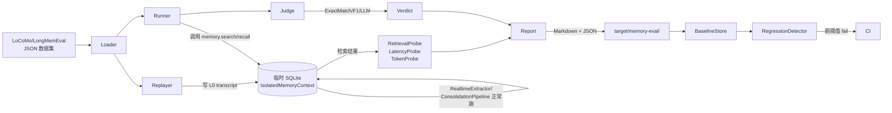

# 记忆评估 Harness — 架构设计

> **文档性质**：架构设计文档
> **模块归属**：`com.lifepilot.memory.eval`（新建）
> **最后更新**：2026-05-09
> **上位 gap**：`docs/planned/memory-and-proactive-evolution-gaps.md` §1 M-P0-1
> **关联既有**：Phase 5 已有的 `com.lifepilot.eval`（Agentic Evals），两者**职责不同**，不共用入口

---

## 1. 定位与非目标

**定位**：面向**开发期迭代**的记忆模块离线回归 harness。每次改动记忆读写链路（listener、质量阈值、遗忘权重、投影策略等）后，跑一遍 harness 可以量化回答"整体召回/误召回/延迟/token 成本是变好了还是变差了"。

**核心用户**：知微开发者本人与 CI 流水线。不面向终端用户，不暴露到 Web UI，不在产品包里默认启用。

**非目标**：

- **不构造**面向知微用户的"个性化数据集"——普通用户无法也不需要参与评估数据贡献
- **不替代** Phase 5 的 Agentic Evals（模块 20.5），后者面向 Agent 轨迹评估，本模块面向**记忆子系统质量**
- **不承担**线上在线评估职责，所有测量都在开发机/CI 上一次性跑完后出报告
- **不自建新数据集**，复用开源社区已有标注数据

---

## 2. 前沿调研

### 2.1 可复用的开源基准

| 基准 | 出处 | 规模 | 特点 | 许可 |
|---|---|---|---|---|
| LoCoMo | `snap-research/locomo`, arXiv:2402.09727 | 10 对话 / 平均 300 turns / 9 K tokens / 对话 | multi-session、event graph 标注、5 类 QA（单跳/多跳/时序/开放/对抗）| Apache-2.0 |
| LongMemEval | `xiaowu0162/LongMemEval`, ICLR 2025, arXiv:2410.10813 | 500 question / 可扩展 session history / 评估 5 项能力（info extraction / multi-session reasoning / knowledge update / temporal reasoning / abstention）| 纯文本对话 + 标准答案 | MIT |
| BEAM | Mem0 研究页面，arXiv:2504.19413 | 1M / 10M 规模长上下文 | 商用向、规模最大 | 未明确公开，待确认 |

**首批选择 LoCoMo + LongMemEval**：两者都公开可下载、格式清晰、许可宽松、规模适合单机跑批（LoCoMo 10 对话几分钟，LongMemEval-S 小时级）；BEAM 先不纳入，等前两者跑通后评估是否引入。

### 2.2 业界做法参考

- **Mem0 ECAI 2025 paper** (arXiv:2504.19413)：在 LoCoMo 上评估 10 种方法（Mem0 / Mem0g / MemGPT / RAG / LangMem / Zep / OpenAI Memory / ReadAgent / MemoryBank / A-Mem），指标是 LLM-Score + F1 + BLEU + latency + token 成本。知微直接沿用这四维度。
- **memobase/locomo-benchmark**：社区开源的 LoCoMo 跑批脚本，值得参考目录结构。
- **Backboard-io/Backboard-Locomo-Benchmark**：完整的 LoCoMo 评估框架参考。
- **Mem0 changelog 2026-01 (v1.0.3)**：加了 `memory depth / inclusion prompts / exclusion prompts / usecase` 作为项目级配置，**说明运维侧确实需要一个可配置的 evaluation harness**。

### 2.3 我们的技术栈约束

- Java 22 + Spring Boot + JUnit 5 + jqwik：evaluation runner 用 `@Tag("memory-eval")` JUnit case 触发，Maven profile 控制是否纳入默认构建
- SQLite：评估期需要一个可重置的独立内存数据库，不能污染开发者本机的真实记忆
- 本地 LLM 优先：Ollama / 本地 embedding 模型；LLM-as-judge 路径可选 OpenAI/Anthropic，但必须可配置跳过
- 单 JAR 部署：评估代码默认打进 `target/zhiwei.jar` 但只有 `-Deval` 时加载，不增加生产启动开销

---

## 3. 架构设计

### 3.1 模块结构

```
com.lifepilot.memory.eval/
├── loader/                   # 数据集加载
│   ├── BenchmarkLoader       # sealed interface
│   ├── LocomoLoader          # permits
│   └── LongMemEvalLoader     # permits
├── runner/                   # 评估执行
│   ├── BenchmarkRunner       # 主入口
│   ├── ConversationReplayer  # 将数据集 session 重放为 L0 transcript
│   └── IsolatedMemoryContext # 每个用例独立 SQLite + space，结束回滚
├── probe/                    # 指标采集
│   ├── RetrievalProbe        # 记录 memory.search/recall 的每次调用
│   ├── LatencyProbe          # 记录 p50/p95/p99
│   └── TokenProbe            # 记录每次召回拼进 prompt 的 token 数
├── judge/                    # 答案判定
│   ├── AnswerJudge           # sealed interface
│   ├── ExactMatchJudge       # 对 single-hop / knowledge-update
│   ├── F1Judge               # 对 open-ended
│   └── LlmAsJudge            # 对复杂 / 多跳（可选关闭）
├── report/                   # 报告生成
│   ├── EvalReport            # record
│   ├── MarkdownReporter      # target/memory-eval/<timestamp>.md
│   └── JsonReporter          # 机器可读（CI 对比用）
├── baseline/                 # 基线对比
│   ├── BaselineStore         # 历史基线落盘
│   └── RegressionDetector    # 对比前后差值，超阈值 fail
└── config/
    ├── MemoryEvalProperties  # Maven profile 可覆盖
    └── MemoryEvalAutoConfiguration  # @ConditionalOnProperty("lifepilot.memory.eval.enabled")
```

### 3.2 数据流



### 3.3 关键设计决策

#### D-1 评估期使用隔离的 SQLite 环境

- 每个 benchmark case 启动时创建临时 SQLite 文件（`java.io.tmpdir/zhiwei-eval-<uuid>.db`），跑完删除
- 复用现有 `SqliteVecInitializer` 和 Flyway 迁移
- 不碰开发者本机 `zhiwei.db`，避免评估数据污染真实记忆

**理由**：评估要求可重复、可并行；碰真实记忆会破坏开发者自己的画像和习惯。

#### D-2 Replay 通过 L0 transcript 入口，不绕过质量门控

数据集 session 中的每条用户消息都通过 `ChatTurnService.persistTurnMemorySnapshot` 写入 L0，然后由 `RealtimeExtractor` 正常抽取候选，走完整的 AUDN → 质量门控 → L3 主库链路。

**理由**：评估目的就是衡量"整条读写链路"的表现，绕过任何一段都会失真。LoCoMo 的 session 格式天然就是多轮对话，与知微的 L0 transcript 1:1 对应。

#### D-3 指标四维：召回质量 + 效率 + 成本 + 稳定性

| 维度 | 指标 | 采集点 |
|---|---|---|
| 召回质量 | LLM-Score（0/1）/ F1 / BLEU / 精确匹配率 | `AnswerJudge` 对比 ground truth |
| 效率 | 召回 p50 / p95 / p99 延迟 | `LatencyProbe` 包围每次 `memory.search/recall` |
| 成本 | 每次召回拼进 prompt 的 token 数；整个 session 的总 LLM call 次数 | `TokenProbe` |
| 稳定性 | 多次跑同一 benchmark，结果方差 | `RegressionDetector` 统计 N 次均值 + 标准差 |

#### D-4 LLM-as-judge 可降级

- 首选本地规则（ExactMatch、F1），无需 LLM
- 对开放问答 / 多跳推理题用 LLM-as-judge（Claude Opus / GPT-4o / 本地 DeepSeek）
- `lifepilot.memory.eval.judge.llm-enabled=false` 时自动跳过这类题，标记为 `skipped_judge_required`，不阻塞整体跑批

**理由**：离线评估可能在没有付费 LLM Key 的开发机上跑。规则 judge 覆盖大部分题目，LLM judge 只是增强项。

#### D-5 基线对比采用 `memory-eval-baseline.json`

- 每次 merge 到 develop 前跑一次 harness，结果写入 `docs/memory-eval/baseline.json`（纳入 git）
- `RegressionDetector` 读 baseline，当前跑批结果差值超阈值（LLM-Score 掉 >3 个百分点 / 延迟涨 >20% / token 涨 >30%）则 fail
- 每次主观上 "我就是要这个退化" 时，需要人工 update baseline 并在 commit message 说明理由

**理由**：基线对比是 harness 最大的价值——没有基线，所有数字都只是"快照"。

#### D-6 接入 JUnit 5 但不纳入默认测试

- `@Tag("memory-eval")` 标记所有 eval case
- `mvn test` 默认跳过（`<excludedGroups>memory-eval</excludedGroups>`）
- `mvn test -Dgroups=memory-eval` 或专用 profile `-Pmemory-eval` 触发
- 单用例执行时间控制在 15 分钟以内

**理由**：记忆评估耗时（可能达数十分钟到小时），不应拖慢日常开发的 `mvn test`；但进入 CI 的 nightly job / pre-merge 时必须跑。

---

## 4. 与既有模块的集成点

### 4.1 对现有 memory 模块的依赖（只读 + 只调用公开接口）

| 模块 | 使用方式 |
|---|---|
| `memory.semantic.SemanticMemory` | 通过 `memory.search` 工具间接调用 |
| `memory.episodic.EpisodicMemory` | 通过 `memory.recall` 工具间接调用 |
| `memory.retrieval.HybridRetriever` | 间接 |
| `memory.consolidation.ConsolidationPipeline` | Replayer 跑完后手动触发一次（可配置） |
| `memory.forgetting.ForgettingEngine` | 不触发（避免评估期误删候选答案） |
| `memory.config.MemoryAutoConfiguration` | 全套 Bean 在 eval profile 下重新注册指向临时 SQLite |
| `conversation.session` | `ChatTurnService` 写 L0 transcript |
| `meta.infra.memory` | 通过 `memory.*` 工具入口 |

### 4.2 与 Phase 5 Agentic Evals 的边界

| 维度 | Agentic Evals (模块 20.5) | Memory Eval Harness (本模块) |
|---|---|---|
| 评估对象 | Agent 轨迹（工具选择、步骤效率、策略合规） | 记忆读写链路（召回质量、staleness、token 成本） |
| 输入 | Benchmark scenario YAML | LoCoMo / LongMemEval JSON |
| 运行时 | 完整 Agent 执行 | 只触发 memory.search/recall |
| 目标用户 | Agent 开发者 | 记忆模块开发者 |
| 共享点 | `EvalStore` schema 可能复用（待定）；`LlmAsJudge` 可能提取到 `com.lifepilot.common.judge` |

短期不共用 Bean，只在 `common.judge` 抽取 `AnswerJudge` 公共接口，长期看 `EvalStore` 是否合并。

---

## 5. 风险与缓解

| 风险 | 缓解 |
|---|---|
| LoCoMo/LongMemEval 数据集下载依赖外网，离线环境无法跑 | 提供 `scripts/download-eval-datasets.sh`，首次下载缓存到 `~/.zhiwei/eval-cache`，之后可离线 |
| 评估耗时过长阻塞 CI | 默认只跑 `LongMemEval-tiny`（前 50 题）+ `LoCoMo` 前 2 对话；完整跑批 nightly 单独调度 |
| 基线对比 false positive（网络波动、LLM 判官偶发抖动） | 每次跑 3 次取 median；允许 ±3% 噪音窗口 |
| LLM-as-judge 费钱 | 默认关闭，只在 `lifepilot.memory.eval.judge.llm-enabled=true` 时开 |
| 评估数据污染真实数据库 | 强制隔离 SQLite（D-1），且启动时校验 `isEvalMode`，主库 Bean 在 eval profile 下重置 |
| 指标选择过细导致优化方向错 | 只保留 4 维，每维 1-3 个核心指标；不追随 mem0/zep 的全套指标 |

---

## 6. 参考资料

- [LoCoMo: Evaluating Very Long-Term Conversational Memory of LLM Agents](https://arxiv.org/abs/2402.17753)
- [LoCoMo GitHub](https://github.com/snap-research/locomo)
- [LongMemEval: Benchmarking Chat Assistants on Long-Term Interactive Memory (ICLR 2025)](https://arxiv.org/abs/2410.10813)
- [LongMemEval GitHub](https://github.com/xiaowu0162/LongMemEval)
- [Mem0: Building Production-Ready AI Agents with Scalable Long-Term Memory (ECAI 2025)](https://arxiv.org/abs/2504.19413)
- [Memobase LoCoMo benchmark reference](https://github.com/memodb-io/memobase/blob/main/docs/experiments/locomo-benchmark/README.md)
- [State of AI Agent Memory 2026 (Mem0)](https://mem0.ai/blog/state-of-ai-agent-memory-2026)
- 知微内部：`docs/features/agentic-evals.md`、`docs/architecture/agentic-evals.md`、`docs/architecture/memory-system.md`
