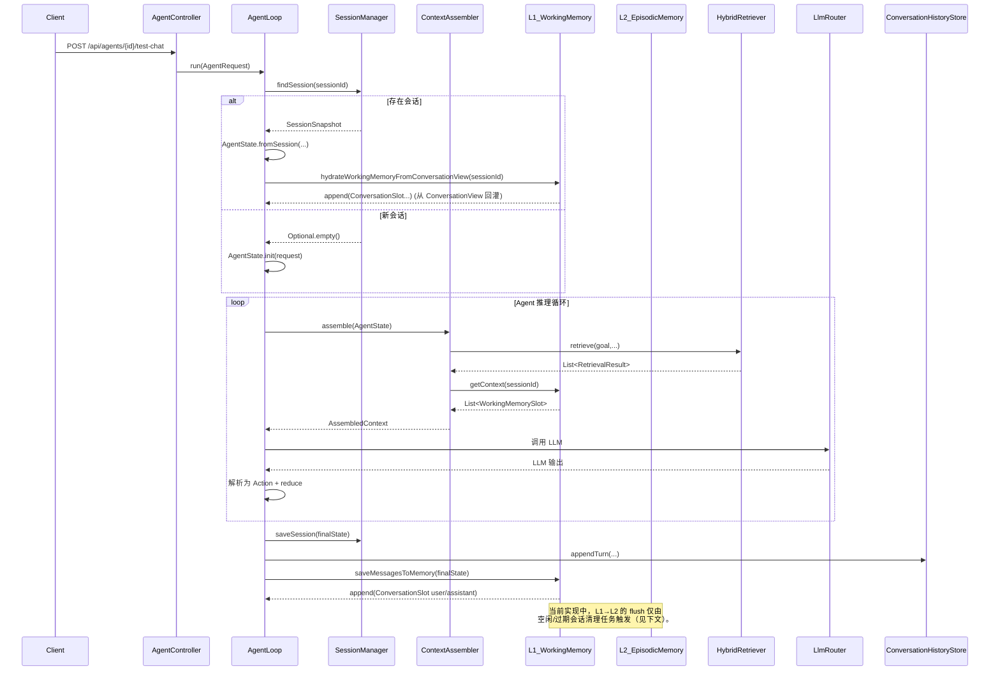

## LifePilot L1 工作记忆运行时调用链（当前实现快照）

> 本文档描述当前代码实现下，从用户消息进入到 L1/L2 记忆系统的真实调用链与数据流，用于与 `memory-system.md` 的目标架构对比。

---

## 1. 顶层调用链总览（非流式路径）

用户通过 Web 接口发起请求时，主要调用链如下：

---

## 2. 顶层调用链总览（流式路径）

流式 SSE 路径与非流式类似，差异主要在 LLM 调用和事件推送方式：

- 入口为 `AgentLoop.runStreaming(AgentRequest, streamId, SseSessionManager)`。
- 上下文组装同样通过 `ContextAssembler.assemble(state)` 完成。
- LLM 调用通过 `LlmRouter.stream(...)` 或 `MultimodalRouter.stream(...)`，分片结果通过 `SseSessionManager` 发送 `TOKEN` 事件。
- 循环结束后，同样调用 `asyncPostProcess(finalState)`，完成：
  - `SessionManager.saveSession(finalState)`
  - `ConversationHistoryStore.appendTurn(...)`
  - `WorkingMemory.saveMessagesToMemory(finalState)` → `append(ConversationSlot...)`

L1 的写入与 L2 的 flush 行为与非流式路径一致。

---

## 3. L1 工作记忆的写入与读取路径

### 3.1 写入（append）路径

当前所有对 `WorkingMemory.append(...)` 的调用主要来自：

- `AgentLoop.saveMessagesToMemory(AgentState)`：
  - 在一次 Agent 循环完成后异步执行；
  - 将本轮的用户意图（`state.goal()`）和最终 AI 响应（`state.finalOutput()`）分别封装为：
    - `ConversationSlot.userMessage(content, tokenCount)`
    - `ConversationSlot.assistantMessage(content, tokenCount)`
  - 调用 `workingMemory.append(sessionId, slot)` 写入 L1。

- `AgentLoop.hydrateWorkingMemoryFromConversationView(String sessionId)`：
  - 当存在会话快照但 L1 中该 `sessionId` 尚无槽位时，从 `ConversationViewService.getFullTimeline(sessionId)` 读取历史对话；
  - 逐条转换为 `ConversationSlot`（区分 `USER` / `ASSISTANT` / 其他角色，并设置 `importance` / `pinned` / `createdAt`）；
  - 通过 `workingMemory.append(sessionId, slot)` 回灌至 L1。

在 `WorkingMemory.append` 内部：

- 更新 `sessions`, `tokenUsage`, `lastActivity` 三个映射；
- 基于 `MemoryProperties.workingMemoryTokenBudget` 和 `TokenBudgetAllocator.allocate(...)` 计算当前会话的工作记忆预算；
- 当 `tokenUsage` 超过预算时，调用 `SlotEvictionPolicy.selectEvictionCandidate(...)` 选择淘汰槽位并更新使用量。

> 结论：**L1 的写入发生在每轮推理完成后的异步阶段，以及会话恢复时的回灌阶段。**

### 3.2 读取（getContext）路径

`WorkingMemory.getContext(sessionId)` 目前主要被 `ContextAssembler` 使用：

- `ContextAssembler.assemble(AgentState)` 在 full mode 下会执行：
  - `safeGetContext(workingMemory, state.sessionId())` → `workingMemory.getContext(sessionId)`；
  - 返回 `List<WorkingMemorySlot>`，后续用于：
    - 统计会话轮次（`countConversationTurns`）；
    - 通过 `truncateSlotsByBudget(...)` 结合 `TokenBudgetAllocator` 截断为工作记忆窗口；
    - 构造增强版 user prompt 中的：
      - “对话历史”（`ConversationSlot` 按时间排序）、
      - “工具结果”（`ToolResultSlot`）、
      - “推理上下文”（`ReasoningSlot`）。

> 结论：**L1 的读取在每次 Agent 循环的“上下文组装”阶段发生，用于构建对话历史与推理上下文。**

---

## 4. HybridRetriever 与检索上下文路径

在 `ContextAssembler.assemble(AgentState)` 中，当记忆系统处于 full mode 时：

1. 根据当前 `AgentPhase` 通过 `MemoryRetrievalStrategy.getStrategy(phase)` 获取检索策略（topK、权重等）。
2. 调用 `safeRetrieve(hybridRetriever, state.goal(), strategyConfig)`，内部执行：
   - `hybridRetriever.retrieve(query, topK, weights)`，实际完成：
     - 向量搜索（`VectorSearcher`）
     - FTS5 搜索（`FtsSearcher`）
     - 图遍历（`GraphTraverser`）
     - 三路融合打分（`fusedScore`）
3. 可选地获取最近一次 L4 意图匹配结果：
   - `safeGetLastProcedureSlot(hybridRetriever)` → `Optional<ReasoningSlot>`，由 HybridRetriever 内部的 `IntentMatcher` 提供。
4. 对检索结果进行：
   - 基于 token 预算的截断（`truncateByBudget`）；
   - 文本格式化（`formatRetrievalResults`），形成“相关记忆”字符串列表；
   - 将 L4 提示以 `[PROCEDURE] ...` 形式注入到“相关记忆”首位（`injectProcedureHint`）。

当前实现中：

- L4 意图提示通过 `ReasoningSlot` 暂存在 HybridRetriever 内部，并以字符串形式注入到“相关记忆”列表；
- **检索上下文尚未以 `ReasoningSlot` 形式写回 L1**，仅出现在拼接后的 user prompt 中。

---

## 5. L1 → L2 flush 与会话生命周期

### 5.1 WorkingMemory.flush(String sessionId)

`WorkingMemory.flush(sessionId)` 的当前行为：

- 遍历该会话的所有 `WorkingMemorySlot`，仅将 `ConversationSlot` 转换为 `MessageRecord` 列表；
- 生成新的 `conversationId` 和 `ConversationRecord`：
  - `goal` 当前固定为 `"会话记录"`；
  - `summary` 为空；
  - `CompressionLevel` 固定为 `ORIGINAL`；
- 调用 `EpisodicMemory.save(record)` 写入 L2；
- 从 L1 内存结构中移除该 `sessionId` 的所有数据（`sessions` / `tokenUsage` / `lastActivity`）。

### 5.2 flush 的触发点

当前代码中，`flush(sessionId)` 的触发完全依赖于“空闲/过期会话清理”：

- `MemoryAutoConfiguration.cleanupIdleWorkingMemorySessions()`（每 5 分钟运行一次）：
  - 使用 `MemoryProperties.idleSessionTimeoutMinutes` 作为 L1 空闲阈值；
  - 调用 `workingMemory.cleanupIdleSessions(Duration.ofMinutes(timeoutMinutes))`；
  - `cleanupIdleSessions` 内部判断 `lastActivity` 超过阈值 → 调用 `flush(sessionId)`。

- `SessionManager.cleanupExpiredSessions()`（根据 `lifepilot.agent.session.cleanup-interval-ms` 定时运行）：
  - 使用 `AgentConfigProperties.session.timeoutMinutes` 作为会话过期阈值；
  - 查询过期未归档的会话 ID；
  - 若注入了 `WorkingMemory`，则对每个过期会话调用 `workingMemory.flush(sessionId)`；
  - 将会话标记为 `archived=1`。

> 关键现状：
>
> - **当前并没有显式的“会话结束事件 → flush”路径**；
> - L1 → L2 的落盘主要依赖：
>   - L1 空闲时间超过阈值（MemoryProperties.idleSessionTimeoutMinutes），或
>   - 会话在 `agent_sessions` 表中被标记为过期（AgentConfigProperties.session.timeoutMinutes）。

---

## 6. 与目标设计的主要差异（L1 视角）

结合 `memory-system.md` 中的目标架构，当前 L1 实现场景下存在的主要差异包括：

1. **会话结束信号缺失**  
   - 目标设计期望：在“会话真正结束”时，由上层显式调用 `WorkingMemory.flush(sessionId, goal)`，并将本次会话的目标写入 `ConversationRecord.goal`。  
   - 当前实现：仅有 `flush(sessionId)`，且只在空闲/过期清理任务中被动触发，`goal` 固定为 `"会话记录"`。

2. **检索上下文未回写 L1**  
   - 目标设计：`ContextAssembler` 在检索后将检索上下文和 L4 程序提示封装为 `ReasoningSlot`，通过 `WorkingMemory.append` 写入 L1，形成可追踪的推理上下文。  
   - 当前实现：检索结果仅以字符串形式拼接到 user prompt 中，`ReasoningSlot` 只在 HybridRetriever 内部存在，未统一进入 L1。

3. **L1→L2 仅持久化对话槽位**  
   - 目标设计：L1 作为“短期工作区”，在会话结束时整体抽象为 L2 的 `ConversationRecord`，并与后续 L2→L3/L4 管线联动。  
   - 当前实现：`flush` 只转换并持久化 `ConversationSlot`，忽略 `ToolResultSlot` / `ReasoningSlot` 等其他工作记忆内容。

4. **会话目标（goal）缺乏一致来源**  
   - 目标设计：会话目标来自 AgentState/会话管理并贯穿 L1/L2/L3/L4。  
   - 当前实现：L1→L2 时使用固定字符串 `"会话记录"` 作为 goal，无法在 L2 中区分不同类型的任务/意图。

---

## 7. 后续改造方向（仅列出与 L1 生命周期相关的部分）

基于上述分析，L1 相关的首要改造点包括：

1. 在 `WorkingMemory` 中引入标准化 API：
   - `ConversationRecord flush(String sessionId, String goal)`；
   - `void endSession(String sessionId, String goal)`（封装 `flush`，处理空会话等边界）。
2. 在会话管理与交互层（如 `SessionManager`、前端显式结束会话操作）增加“会话结束”路径，调用 `endSession`：
   - 保留现有 idle/过期清理逻辑作为兜底；
   - 优先让正常结束的会话立即落盘到 L2。
3. 在 `ContextAssembler` 中，将检索上下文和 L4 程序提示封装为 `ReasoningSlot` 并写回 L1，同时保留现有 prompt 拼接行为。
4. 评估并升级 `flush` 时对 `ToolResultSlot` / `ReasoningSlot` 的处理策略，保证关键推理上下文的可追踪性。

上述改造会在后续步骤中按计划逐项落地。

