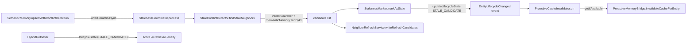

# 记忆老化与邻居回链 — 架构设计

> **文档性质**：架构设计
> **模块归属**：`com.lifepilot.memory.lifecycle.staleness` + `com.lifepilot.agent.task.proactive.cache`
> **最后更新**：2026-05-09
> **上位 Gap**：`docs/planned/memory-and-proactive-evolution-gaps.md` §1 M-P0-2 / M-P1-5 + §3 C-P0-1

## 1. 问题背景

知微记忆系统的 `trust_score` 只度量"新证据质量"，无法识别**一条高 trust_score 的事实已过时**。典型场景：

- 2 年前用户说"住北京"，trust_score=0.88（EXPLICIT）
- 今天用户说"搬家到上海"，新实体被写入
- 旧"住北京"实体仍在 ACTIVE 且 trust_score 未变，Prompt 注入时可能被优先选中

同时，现有记忆事件总线虽有 7 个监听器，但**主动引擎完全没订阅**，L3 归档的偏好可能继续影响主动提醒决策。

## 2. 解决方案

### 2.1 核心思路

新事实写入 → **识别语义冲突的邻居** → **转入 STALE_CANDIDATE** 生命周期态 → **召回时显著降权但仍可召回** → Agent 命中时自然发起追问 → 用户回复后再转 SUPERSEDED / ACTIVE。

同时：

- 新事实触发时，生成"邻居刷新候选"进入审计，供后续 Consolidator 消费（本 spec 开关默认关）
- `EntityLifecycleChanged` 事件新增主动引擎监听器，L3 失活立刻通知 Bridge

### 2.2 关键架构决策

| 决策 | 方案 | 理由 |
|---|---|---|
| 新增 LifecycleState | `STALE_CANDIDATE`（介于 ACTIVE 与 ARCHIVED 之间，可召回） | 不归档数据，允许召回时降权 + Agent 追问；转 ACTIVE 或 SUPERSEDED 由后续证据决定 |
| 识别触发点 | `SemanticMemory.upsertWithConflictDetection` afterCommit 虚拟线程 | 不阻塞主事务；新实体已可见供向量检索；既有 triggerConflictResolution 同模式 |
| 邻居识别 | `VectorSearcher.searchEntities` 顶 K + 类型白名单 + lifecycle=ACTIVE + trust ≥ INFERRED | 复用现有向量索引；阈值保守（默认 0.85），配置可回滚 |
| 召回降权 | `lifecycleAdjustment -= retrievalPenalty`（默认 0.35） | 复用既有 REGENERATION_NEEDED 降权位置；保持可召回 |
| Bridge 失效 | `ObjectProvider<ProactiveMemoryBridge>.getIfAvailable()` | 主动引擎关闭时不阻塞 listener 启动 |
| NeighborRefresh | 日志式 hook，配置默认关 | 等后续 Consolidator 消费时再接入；不绕过 AudnDecision 候选契约 |

## 3. 组件



### 3.1 LifecycleState 扩展

`STALE_CANDIDATE` 转换矩阵（新增部分）：

| From → To | 允许 | 说明 |
|---|:-:|---|
| ACTIVE → STALE_CANDIDATE | ✓ | 被新事实暗示过时 |
| STALE_CANDIDATE → ACTIVE | ✓ | 用户确认仍有效 |
| STALE_CANDIDATE → SUPERSEDED | ✓ | 被新实体替代 |
| STALE_CANDIDATE → ARCHIVED | ✓ | 归档 |
| COMPLETED / CANCELLED / EXPIRED / REGENERATION_NEEDED → STALE_CANDIDATE | ✗ | 终态或已有降权含义 |

`isRetrievable()` 对 STALE_CANDIDATE 返回 `true`。

### 3.2 StaleConflictDetector 过滤规则

1. `newEntity.type.name()` ∈ `staleness.detectable-types`（默认 {PREFERENCE, HABIT, LOCATION, GOAL}）
2. `name + description` 长度 ≥ 4 字符
3. `VectorSearcher.searchEntities(query, K*3, threshold)` 初筛，K=max-neighbors=3
4. 排除自身 ID
5. `neighbor.lifecycleState == ACTIVE`
6. `neighbor.trustLevel != UNVERIFIED`
7. 按相似度降序取前 K

### 3.3 HybridRetriever 降权公式

```
fusedScore = rrfScore + recencyBoost + impBoost + trustBoost + lifecycleAdjustment + lexicalBoost

lifecycleAdjustment += {
  -retrieval.staleLifecyclePenalty       if REGENERATION_NEEDED
  -staleness.retrievalPenalty            if STALE_CANDIDATE   <-- 新增
  -retrieval.historicalLifecyclePenalty  if COMPLETED
  0                                      otherwise
}
```

## 4. 配置

```yaml
lifepilot:
  memory:
    staleness:
      enabled: true
      detection-similarity-threshold: 0.85
      max-neighbors-per-detection: 3
      detectable-types:
        - PREFERENCE
        - HABIT
        - LOCATION
        - GOAL
      retrieval-penalty: 0.35
      neighbor-refresh-enabled: false
```

## 5. 监控要点

- `staleness: entity={} marked={} refreshCandidates={}` — 每次 coordinator 成功后 INFO
- `retrieval: STALE_CANDIDATE 降权 entity={} penalty={}` — HybridRetriever DEBUG
- `ProactiveCacheInvalidator: Bridge 不存在` — DEBUG（主动引擎关闭时正常）

## 6. 限制与未来

- NeighborRefreshService 首版仅日志落地，未写入 candidates 表；等后续 spec 落地消费侧
- `STALE_CANDIDATE` 只靠向量相似度触发；未来可考虑时间距离 + 显式否定词（"我改了"/"现在是"）融合判定
- 尚未暴露给 Web UI 展示"哪些实体被标记为 STALE_CANDIDATE"——可作为 memory-management-ui 后续增强
