> 本文档从 [ARCHITECTURE.md](../ARCHITECTURE.md) 拆分而来，对应原文 §5 章节。
> 本文档经过深度分析设计，结合业界最佳实践和前沿研究进行了全面扩展。

# 记忆系统架构设计

---

## 1. 设计哲学与原则

### 1.1 核心命题

**如何为本地优先的个人 AI Agent 构建一个兼具认知科学启发、隐私感知和资源约束的动态记忆系统，使 Agent 能够像人类一样形成、巩固和遗忘记忆？**

传统 RAG（检索增强生成）将记忆简化为"存储 + 检索"的工程问题——文档切块、向量化、Top-K 召回。这种方法在静态知识库场景下有效，但对于需要长期陪伴用户的个人 AI Agent 而言，远远不够。个人 Agent 面临的挑战是：

- **信息是动态的**：用户的偏好、关系、目标随时间变化（"张总上个月还是产品经理，这个月升职了"）
- **记忆有层次的**：有些信息需要精确回忆（"上次会议的具体决定"），有些只需要模糊印象（"张总大概负责产品方向"）
- **遗忘是必要的**：无限积累的记忆不仅浪费资源，还会引入噪声，降低检索质量
- **隐私是底线的**：个人记忆包含大量敏感信息，必须在本地处理，云端调用前必须脱敏

> **核心洞察：记忆不是存储问题，而是认知过程。**
> Memory is not a storage problem, but a cognitive process.

这一洞察来自认知科学的基本发现：人类记忆不是被动的录像机，而是主动的建构过程——我们不断地形成、巩固、重组和遗忘记忆。LifePilot 的记忆系统正是基于这一认知科学原理设计的。

### 1.2 前沿研究基础

LifePilot 的记忆系统设计综合了 2024-2026 年 Agent 记忆领域的六项前沿研究成果：

| 研究 | 核心贡献 | LifePilot 采纳 |
|------|---------|---------------|
| **MaRS** ([arXiv 2512.12856](https://arxiv.org/abs/2512.12856)) | 认知启发的记忆架构，将记忆形式化为元组 A=(M,P,B,π)，其中 M=记忆存储、P=遗忘策略集、B=预算约束、π=策略选择器。提出 6 种遗忘策略（FIFO、LRU、Priority Decay、Reflection-Summary、Random-Drop、Hybrid），Hybrid 策略达到最佳综合得分 ≈0.911 | 采纳 Hybrid 遗忘策略框架；采纳预算约束模型；采纳来源追踪（provenance tracking）机制 |
| **MemoriesDB** ([arXiv 2511.06179](https://arxiv.org/abs/2511.06179)) | 提出"时间-语义-关系实体"（time-semantic-relational entity）概念，每条记忆同时编码何时（temporal）、是什么（semantic）、如何关联（relational）三个维度 | 时序知识图谱的核心设计灵感；`TemporalEntity` 的三维编码模型 |
| **FadeMem** ([arXiv 2601.18642](https://arxiv.org/abs/2601.18642)) | 生物启发的主动遗忘机制，模拟人类认知效率——遗忘不是缺陷而是特性，主动遗忘低价值信息可以提升检索精度和推理质量 | 遗忘策略引擎的理论基础；隐私感知遗忘的设计依据 |
| **TiMem** ([arXiv 2601.02845](https://arxiv.org/abs/2601.02845)) | 时序记忆树（Temporal Memory Tree, TMT），将原始观察逐层抽象为更高层次的表示——从具体事件到模式再到概念 | 记忆巩固管线的层次化设计；L2→L3→L4 的渐进抽象流程 |
| **记忆操作综述** ([arXiv 2505.00675](https://arxiv.org/abs/2505.00675)) | 系统梳理 Agent 记忆的 6 种基本操作：巩固（Consolidation）、更新（Updating）、索引（Indexing）、遗忘（Forgetting）、检索（Retrieval）、压缩（Compression） | 记忆操作生命周期的完整框架；每种操作对应独立的服务组件 |
| **Oracle 2026 Agent Memory** / **KnowledgePlane 2026** | 业界收敛到 4 种记忆类型共识：Working（工作记忆）、Episodic（情景记忆）、Semantic（语义记忆）、Procedural（程序记忆） | 四层记忆架构的类型划分 |

### 1.3 六种记忆操作生命周期

基于记忆操作综述（[arXiv 2505.00675](https://arxiv.org/abs/2505.00675)）的理论框架，LifePilot 将记忆的完整生命周期建模为六种基本操作的循环：

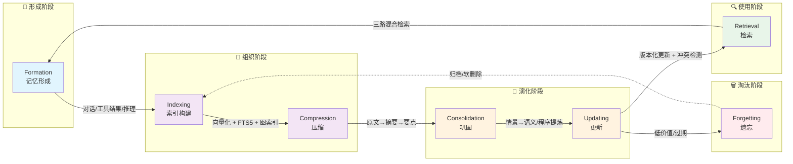
```mermaid
flowchart LR
    subgraph 形成阶段["🧠 形成阶段"]
        A["Formation<br/>记忆形成"]
    end

    subgraph 组织阶段["📂 组织阶段"]
        B["Indexing<br/>索引构建"]
        C["Compression<br/>压缩"]
    end

    subgraph 演化阶段["🔄 演化阶段"]
        D["Consolidation<br/>巩固"]
        E["Updating<br/>更新"]
    end

    subgraph 淘汰阶段["🗑️ 淘汰阶段"]
        F["Forgetting<br/>遗忘"]
    end

    subgraph 使用阶段["🔍 使用阶段"]
        G["Retrieval<br/>检索"]
    end

    A -->|"对话/工具结果/推理"| B
    B -->|"向量化 + FTS5 + 图索引"| C
    C -->|"原文→摘要→要点"| D
    D -->|"情景→语义/程序提炼"| E
    E -->|"版本化更新 + 冲突检测"| G
    G -->|"三路混合检索"| A
    E -->|"低价值/过期"| F
    F -.->|"归档/软删除"| B

    style A fill:#e1f5fe
    style B fill:#f3e5f5
    style C fill:#f3e5f5
    style D fill:#fff3e0
    style E fill:#fff3e0
    style F fill:#ffebee
    style G fill:#e8f5e9
```

每种操作在 LifePilot 中对应独立的服务组件：

| 操作 | 服务组件 | 触发时机 | 延迟要求 |
|------|---------|---------|---------|
| **Formation** | `WorkingMemory.append()` | 每次用户消息/工具结果 | < 1ms（内存操作） |
| **Indexing** | `EmbeddingQueue` + `FtsIndexer` | 异步，记忆持久化后 | < 500ms（批量） |
| **Compression** | `CompressionService` | Token 预算超限时 | < 2s（LLM 调用） |
| **Consolidation** | `ConsolidationPipeline` | 定时（每日凌晨） | 分钟级（批量 LLM） |
| **Updating** | `SemanticMemory.upsertWithConflictDetection()` | 知识提取完成后 | < 100ms（数据库） |
| **Forgetting** | `ForgettingEngine` | 定时（每周） | 秒级（批量扫描） |
| **Retrieval** | `HybridRetriever` | 每次上下文组装 | < 50ms（三路并行） |

### 1.4 六大设计原则

| # | 原则 | 说明 | 体现 |
|---|------|------|------|
| 1 | **本地优先** (Local-First) | 所有记忆数据存储在 `~/.lifepilot/data/`，零外部依赖。用户完全拥有自己的记忆数据 | SQLite + sqlite-vec 单机方案；无需网络即可完成记忆检索和管理 |
| 2 | **认知启发** (Cognitively-Inspired) | 记忆系统的结构和行为模拟人类认知过程，而非简单的数据库 CRUD | 四层记忆对应认知科学的工作记忆/情景记忆/语义记忆/程序记忆；巩固和遗忘模拟人类记忆的自然演化 |
| 3 | **隐私感知** (Privacy-Aware) | 个人记忆包含高度敏感信息，隐私保护贯穿记忆的全生命周期 | 云端 LLM 调用前 `DataRedactor` 自动脱敏；隐私敏感记忆优先遗忘；PII 标记和分级处理 |
| 4 | **预算约束** (Budget-Constrained) | 受 MaRS 元组 A=(M,P,B,π) 启发，记忆系统在有限资源（Token、存储、计算）下运行 | Token 预算分配器动态调整各层配额；存储预算触发渐进压缩；LLM 调用预算限制巩固/提取频率 |
| 5 | **层间流转** (Inter-Layer Flow) | 记忆不是静态存储在某一层，而是在四层之间自动流转和提炼 | L1→L2：会话结束时持久化；L2→L3：知识提取管线；L2→L4：模式提炼管线；低价值记忆自动遗忘 |
| 6 | **可观测** (Observable) | 记忆系统的每个操作都可追踪、可审计、可调试 | 记忆检索记录写入 `trace_steps.memory_retrievals_json`；巩固/遗忘操作记录到 `memory_consolidation_log` / `forgetting_log` |

### 1.5 竞品对比分析

| 维度 | **LifePilot** | **MaRS** | **MemGPT** | **Mem0** | **传统 RAG** |
|------|:------------:|:-------:|:---------:|:-------:|:-----------:|
| 记忆层次 | 四层（Working/Episodic/Semantic/Procedural） | 单层（统一记忆存储） | 两层（Main Context + Archival） | 两层（Short-term + Long-term） | 单层（向量存储） |
| 时序感知 | ✅ 版本化实体 + 时间旅行查询 | ❌ 无时序维度 | ❌ 无时序维度 | ⚠️ 基础时间戳 | ❌ 无 |
| 知识图谱 | ✅ 时序 KG + 图遍历检索 | ❌ 无 | ❌ 无 | ⚠️ 基础关系 | ❌ 无 |
| 遗忘策略 | ✅ Hybrid（6 策略融合）+ 隐私感知 | ✅ 6 策略（FIFO/LRU/PD/RS/RD/Hybrid） | ⚠️ 基础归档 | ⚠️ 基础过期 | ❌ 无 |
| 记忆巩固 | ✅ 情景→语义 + 情景→程序 双向巩固 | ❌ 无 | ❌ 无 | ❌ 无 | ❌ 无 |
| 检索方式 | 三路混合（向量 + FTS5 + 图遍历） | 单路（策略选择） | 单路（向量） | 双路（向量 + 关键词） | 单路（向量） |
| 隐私保护 | ✅ 本地存储 + 脱敏 + 隐私感知遗忘 | ❌ 无特殊处理 | ❌ 依赖云端 | ⚠️ 可选本地 | ❌ 依赖云端 |
| 预算管理 | ✅ Token/存储/LLM 调用三维预算 | ✅ 预算约束模型 B | ⚠️ 基础 Token 限制 | ❌ 无 | ❌ 无 |
| 来源追踪 | ✅ 每条记忆追踪到源对话 + 置信度 | ✅ 来源追踪 | ❌ 无 | ⚠️ 基础来源 | ❌ 无 |
| 部署方式 | 本地单 JAR | 研究框架 | 云端服务 | 云端 API | 依赖向量数据库 |

### 1.6 形式化定义

受 MaRS 论文启发，LifePilot 将记忆系统形式化为扩展元组：

```
LifePilot Memory System = (L, M, P, B, π, Φ, Ψ)

其中：
  L = {L1, L2, L3, L4}           — 四层记忆层次
  M = L1.slots ∪ L2.records ∪ L3.entities ∪ L4.procedures  — 统一记忆存储
  P = {FIFO, LRU, PriorityDecay, ReflectionSummary, RandomDrop, Hybrid}  — 遗忘策略集
  B = (tokenBudget, storageBudget, llmCallBudget)  — 三维预算约束
  π : Context → P                 — 策略选择器（根据上下文选择遗忘策略）
  Φ : L2 → L3 ∪ L4               — 巩固函数（情景记忆→语义/程序记忆）
  Ψ : Query → List<MemoryItem>    — 混合检索函数（三路融合）
```

---

## 2. 整体架构

### 2.1 四层认知记忆架构

```
┌──────────────────────────────────────────────────────────────────────────────┐
│                          四层认知记忆架构 (Cognitive Memory Architecture)       │
│                                                                              │
│  ┌────────────────────────────────────────────────────────────────────────┐  │
│  │ L1: Working Memory（工作记忆）                                          │  │
│  │ ┌──────────────────┬──────────────────┬──────────────────────────────┐ │  │
│  │ │ ConversationSlot │ ToolResultSlot   │ ReasoningSlot              │ │  │
│  │ │ 当前对话上下文     │ 工具执行结果缓存   │ 中间推理状态                │ │  │
│  │ └──────────────────┴──────────────────┴──────────────────────────────┘ │  │
│  │ 存储：JVM 堆内存（ConcurrentHashMap）  容量：Token 预算动态约束          │  │
│  │ 访问：直接内存读取 < 1ms              生命周期：会话级，结束时 flush→L2  │  │
│  │ 管理：TokenBudgetAllocator 动态分配    淘汰：重要度加权滑动窗口          │  │
│  └──────────────────────────┬─────────────────────────────────────────────┘  │
│                              │ flush(): 会话结束时持久化                      │
│                              ▼                                               │
│  ┌────────────────────────────────────────────────────────────────────────┐  │
│  │ L2: Episodic Memory（情景记忆）                                         │  │
│  │ ┌──────────────────┬──────────────────┬──────────────────────────────┐ │  │
│  │ │ ConversationRecord│ MessageRecord   │ CompressionLevel            │ │  │
│  │ │ 完整对话记录       │ 消息级细粒度存储  │ ORIGINAL→SUMMARY→KEYPOINTS  │ │  │
│  │ └──────────────────┴──────────────────┴──────────────────────────────┘ │  │
│  │ 存储：SQLite L2 对话表（conversations/messages）+ FTS5 全文索引          │  │
│  │      ※ 这些表属于记忆系统内部的情景记忆存储，                          │  │
│  │        与 Web 对话系统的 conversation_session / conversation_turn      │  │
│  │        等表物理分离，仅通过服务接口进行逻辑关联。                      │  │
│  │ 访问：追加写入不可变 < 10ms            生命周期：永久保留，可渐进压缩     │  │
│  │ 索引：时间戳 + 会话 ID + 意图类型 + FTS5 全文                           │  │
│  │ 特性：时间旅行查询 + 渐进式三层压缩 + 用户标记永不压缩                   │  │
│  └──────────────────────────┬─────────────────────────────────────────────┘  │
│                              │ KnowledgeExtractionPipeline（异步 LLM 驱动）   │
│                              ▼                                               │
│  ┌────────────────────────────────────────────────────────────────────────┐  │
│  │ L3: Semantic Memory（语义记忆）+ 时序知识图谱                            │  │
│  │ ┌──────────────────┬──────────────────┬──────────────────────────────┐ │  │
│  │ │ TemporalEntity   │ TemporalRelation │ EntityEmbedding             │ │  │
│  │ │ 版本化时序实体     │ 时序关系（带强度） │ sqlite-vec 向量索引          │ │  │
│  │ └──────────────────┴──────────────────┴──────────────────────────────┘ │  │
│  │ 存储：SQLite temporal_entities + temporal_relations + sqlite-vec vec0  │  │
│  │ 访问：可更新（版本化）< 50ms           生命周期：持久化，低价值可遗忘     │  │
│  │ 索引：向量索引 + 精确索引 + 图遍历（递归 CTE）                          │  │
│  │ 特性：冲突检测 + 版本化合并 + 时间旅行查询 + MaRS 来源追踪              │  │
│  └────────────────────────────────────────────────────────────────────────┘  │
│                                                                              │
│  ┌────────────────────────────────────────────────────────────────────────┐  │
│  │ L4: Procedural Memory（程序记忆）                                       │  │
│  │ ┌──────────────────┬──────────────────┬──────────────────────────────┐ │  │
│  │ │ ProcedureTemplate│ PreferenceRule   │ StrategyPattern             │ │  │
│  │ │ 多步操作模板       │ 用户偏好规则      │ 决策策略模式                │ │  │
│  │ └──────────────────┴──────────────────┴──────────────────────────────┘ │  │
│  │ 存储：SQLite procedures 表                                             │  │
│  │ 访问：意图匹配检索 < 5ms              生命周期：从 L2 自动提炼，随使用演化│  │
│  │ 特性：成功率追踪 + 使用频率统计 + 模板变量替换                           │  │
│  └────────────────────────────────────────────────────────────────────────┘  │
│                                                                              │
│  ┌────────────────────────────────────────────────────────────────────────┐  │
│  │ 横切关注点                                                              │  │
│  │ ┌──────────────┬──────────────┬──────────────┬──────────────────────┐ │  │
│  │ │ HybridRetriever│ ForgettingEngine│ ConsolidationPipeline│ DataRedactor│ │  │
│  │ │ 三路混合检索    │ Hybrid 遗忘策略 │ 双向记忆巩固          │ 隐私脱敏    │ │  │
│  │ └──────────────┴──────────────┴──────────────┴──────────────────────┘ │  │
│  └────────────────────────────────────────────────────────────────────────┘  │
└──────────────────────────────────────────────────────────────────────────────┘
```

### 2.2 包结构与核心类

```
com.lifepilot.memory
├── working/                    # L1 工作记忆
│   ├── WorkingMemory.java          # 工作记忆服务（会话级内存管理）
│   ├── WorkingMemorySlot.java      # sealed interface: 记忆槽位类型
│   ├── TokenBudgetAllocator.java   # Token 预算分配器
│   └── SlotEvictionPolicy.java     # 槽位淘汰策略
│
├── episodic/                   # L2 情景记忆
│   ├── EpisodicMemory.java         # 情景记忆服务（对话持久化与检索）
│   ├── ConversationRecord.java     # 对话记录 record
│   ├── MessageRecord.java          # 消息记录 record
│   └── CompressionLevel.java       # 压缩层级枚举
│
├── semantic/                   # L3 语义记忆 + 时序知识图谱
│   ├── SemanticMemory.java         # 语义记忆服务（实体/关系 CRUD + 冲突检测）
│   ├── TemporalEntity.java         # 时序实体 record
│   ├── TemporalRelation.java       # 时序关系 record
│   ├── EntityType.java             # 实体类型枚举
│   ├── RelationTypes.java          # 关系类型常量
│   ├── ConflictDetector.java       # 冲突检测器
│   └── VersionMerger.java          # 版本合并策略
│
├── procedural/                 # L4 程序记忆
│   ├── ProceduralMemory.java       # 程序记忆服务
│   ├── ProcedureTemplate.java      # 操作模板 record
│   └── IntentMatcher.java          # 意图匹配器
│
├── retrieval/                  # 混合检索引擎
│   ├── HybridRetriever.java        # 三路混合检索服务
│   ├── RetrievalResult.java        # 检索结果 record
│   ├── RetrievalWeights.java       # 检索权重配置 record
│   ├── VectorSearcher.java         # 向量语义检索（sqlite-vec）
│   ├── FtsSearcher.java            # 全文搜索（FTS5 + BM25）
│   └── GraphTraverser.java         # 图遍历检索（递归 CTE）
│
├── extraction/                 # 知识提取管线
│   ├── KnowledgeExtractionPipeline.java  # 知识提取主管线
│   ├── EntityExtractor.java              # 实体识别器
│   ├── RelationExtractor.java            # 关系提取器
│   └── ExtractionResult.java             # 提取结果 record
│
├── consolidation/              # 记忆巩固管线
│   ├── ConsolidationPipeline.java        # 巩固主管线
│   ├── EpisodicToSemanticConsolidator.java   # 情景→语义巩固
│   └── EpisodicToProceduralConsolidator.java # 情景→程序巩固
│
├── forgetting/                 # 遗忘策略引擎
│   ├── ForgettingEngine.java         # 遗忘引擎
│   ├── ForgettingPolicy.java         # sealed interface: 遗忘策略
│   ├── ForgettingPriority.java       # 遗忘优先级计算
│   └── PrivacyAwareForgetting.java   # 隐私感知遗忘
│
├── compression/                # 对话压缩
│   ├── CompressionService.java       # 压缩服务
│   └── CompressionStrategy.java      # 压缩策略
│
└── config/                     # 配置
    ├── MemoryConfig.java             # 记忆系统配置
    └── MemoryProperties.java         # Spring Boot 配置属性
```

### 2.3 会话视图与 ConversationViewService（逻辑视图）

记忆系统本身**不拥有 Web 对话系统的会话表**，而是基于会话层提供的只读视图工作。
为此，我们在后端代码中引入了统一的逻辑视图与服务接口：

```text
ConversationSessionView
- sessionId: String
- channelId: String
- lastActiveAt: Instant
- totalTurns: int
- totalTokensUsed: int

ConversationTurnView
- sessionId: String
- role: String           // USER / ASSISTANT / TOOL / SYSTEM 等
- content: String
- createdAt: Instant
- reasoningSummary: String?  // 可选，来自会话层的推理摘要
```

上述视图由 `ConversationViewService` 聚合提供：

```text
ConversationViewService
- Optional<ConversationSessionView> getSession(String sessionId)
- List<ConversationTurnView> getRecentTurns(String sessionId, int limit)
- List<ConversationTurnView> getFullTimeline(String sessionId)
```

当前实现中：

- `getSession` / `getRecentTurns` 主要基于 `agent_sessions.recent_turns_json`
 （由 `SessionManager` 维护的会话快照层）；
- `getFullTimeline` 优先基于 L2 `EpisodicMemory.getMessagesBySessionId(sessionId)`
  读取完整情景记忆时间线，在尚未归档到 L2 时降级为最近 N 条快照；
- 记忆抽取 Job、评估组件等如需访问某个会话的历史，**必须通过此服务**，
  而不是直接访问底层 `agent_sessions` / L2 表。

### 2.3 核心类关系图

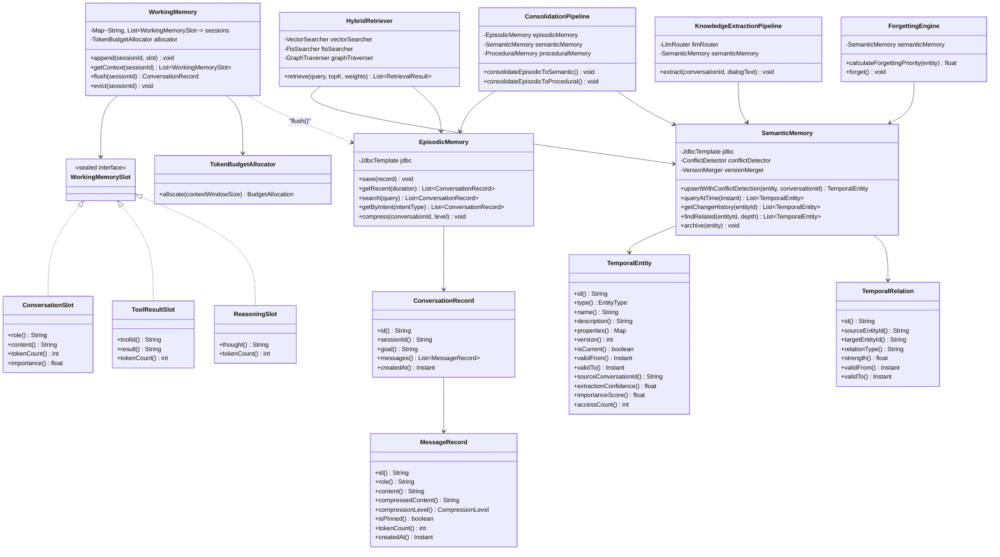
```mermaid
classDiagram
    direction TB

    class WorkingMemory {
        -Map~String, List~WorkingMemorySlot~~ sessions
        -TokenBudgetAllocator allocator
        +append(sessionId, slot) void
        +getContext(sessionId) List~WorkingMemorySlot~
        +flush(sessionId) ConversationRecord
        +evict(sessionId) void
    }

    class WorkingMemorySlot {
        <<sealed interface>>
    }
    class ConversationSlot {
        +role() String
        +content() String
        +tokenCount() int
        +importance() float
    }
    class ToolResultSlot {
        +toolId() String
        +result() String
        +tokenCount() int
    }
    class ReasoningSlot {
        +thought() String
        +tokenCount() int
    }

    WorkingMemorySlot <|.. ConversationSlot
    WorkingMemorySlot <|.. ToolResultSlot
    WorkingMemorySlot <|.. ReasoningSlot
    WorkingMemory --> WorkingMemorySlot

    class EpisodicMemory {
        -JdbcTemplate jdbc
        +save(record) void
        +getRecent(duration) List~ConversationRecord~
        +search(query) List~ConversationRecord~
        +getByIntent(intentType) List~ConversationRecord~
        +compress(conversationId, level) void
    }

    class ConversationRecord {
        +id() String
        +sessionId() String
        +goal() String
        +messages() List~MessageRecord~
        +createdAt() Instant
    }

    class MessageRecord {
        +id() String
        +role() String
        +content() String
        +compressedContent() String
        +compressionLevel() CompressionLevel
        +isPinned() boolean
        +tokenCount() int
        +createdAt() Instant
    }

    EpisodicMemory --> ConversationRecord
    ConversationRecord --> MessageRecord

    class SemanticMemory {
        -JdbcTemplate jdbc
        -ConflictDetector conflictDetector
        -VersionMerger versionMerger
        +upsertWithConflictDetection(entity, conversationId) TemporalEntity
        +queryAtTime(instant) List~TemporalEntity~
        +getChangeHistory(entityId) List~TemporalEntity~
        +findRelated(entityId, depth) List~TemporalEntity~
        +archive(entity) void
    }

    class TemporalEntity {
        +id() String
        +type() EntityType
        +name() String
        +description() String
        +properties() Map
        +version() int
        +isCurrent() boolean
        +validFrom() Instant
        +validTo() Instant
        +sourceConversationId() String
        +extractionConfidence() float
        +importanceScore() float
        +accessCount() int
    }

    class TemporalRelation {
        +id() String
        +sourceEntityId() String
        +targetEntityId() String
        +relationType() String
        +strength() float
        +validFrom() Instant
        +validTo() Instant
    }

    SemanticMemory --> TemporalEntity
    SemanticMemory --> TemporalRelation

    class HybridRetriever {
        -VectorSearcher vectorSearcher
        -FtsSearcher ftsSearcher
        -GraphTraverser graphTraverser
        +retrieve(query, topK, weights) List~RetrievalResult~
    }

    class ForgettingEngine {
        -SemanticMemory semanticMemory
        +calculateForgettingPriority(entity) float
        +forget() void
    }

    class ConsolidationPipeline {
        -EpisodicMemory episodicMemory
        -SemanticMemory semanticMemory
        -ProceduralMemory proceduralMemory
        +consolidateEpisodicToSemantic() void
        +consolidateEpisodicToProcedural() void
    }

    class KnowledgeExtractionPipeline {
        -LlmRouter llmRouter
        -SemanticMemory semanticMemory
        +extract(conversationId, dialogText) void
    }

    class TokenBudgetAllocator {
        +allocate(contextWindowSize) BudgetAllocation
    }

    WorkingMemory --> TokenBudgetAllocator
    WorkingMemory ..> EpisodicMemory : "flush()"
    HybridRetriever --> SemanticMemory
    HybridRetriever --> EpisodicMemory
    KnowledgeExtractionPipeline --> SemanticMemory
    ConsolidationPipeline --> EpisodicMemory
    ConsolidationPipeline --> SemanticMemory
    ForgettingEngine --> SemanticMemory
```

### 2.4 记忆完整生命周期

以下时序图展示了一条记忆从形成到最终遗忘的完整生命周期，涵盖所有六种记忆操作：

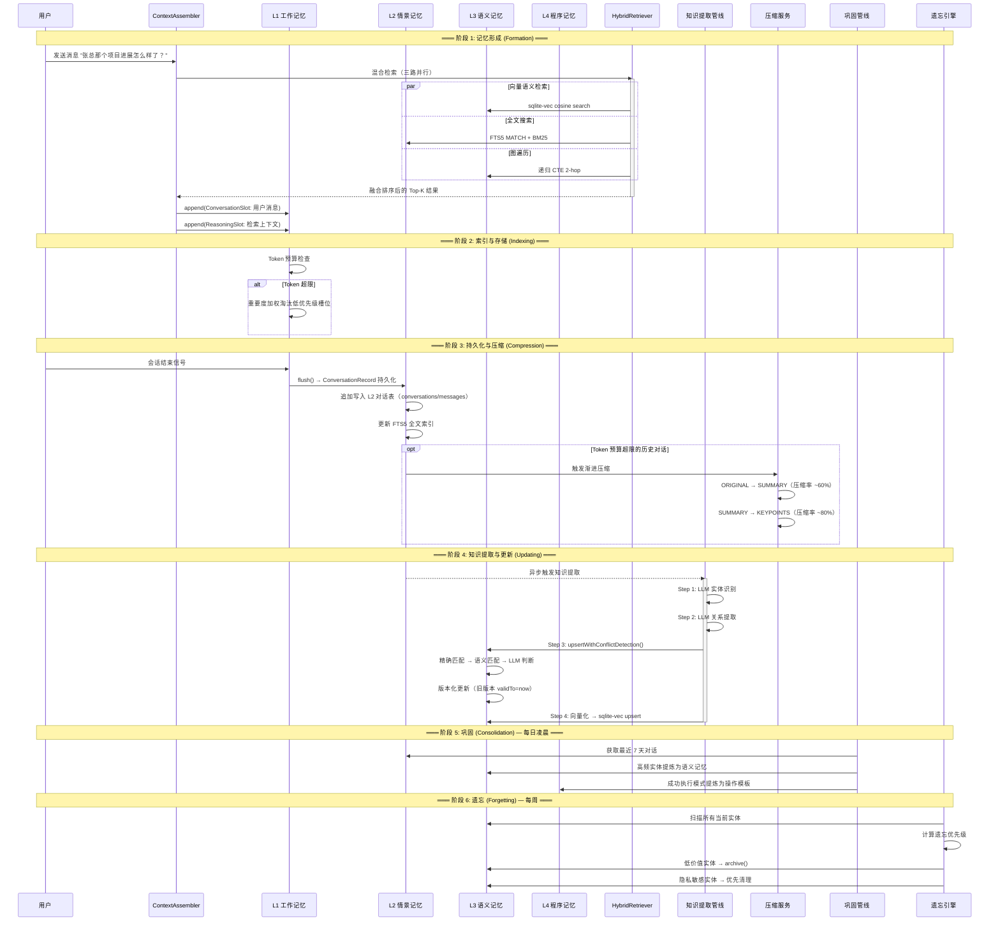
```mermaid
sequenceDiagram
    participant User as 用户
    participant CA as ContextAssembler
    participant L1 as L1 工作记忆
    participant L2 as L2 情景记忆
    participant L3 as L3 语义记忆
    participant L4 as L4 程序记忆
    participant HR as HybridRetriever
    participant KE as 知识提取管线
    participant CS as 压缩服务
    participant CP as 巩固管线
    participant FE as 遗忘引擎

    Note over User,FE: ═══ 阶段 1: 记忆形成 (Formation) ═══

    User->>CA: 发送消息 "张总那个项目进展怎么样了？"
    CA->>HR: 混合检索（三路并行）
    activate HR
    par 向量语义检索
        HR->>L3: sqlite-vec cosine search
    and 全文搜索
        HR->>L2: FTS5 MATCH + BM25
    and 图遍历
        HR->>L3: 递归 CTE 2-hop
    end
    HR-->>CA: 融合排序后的 Top-K 结果
    deactivate HR

    CA->>L1: append(ConversationSlot: 用户消息)
    CA->>L1: append(ReasoningSlot: 检索上下文)

    Note over User,FE: ═══ 阶段 2: 索引与存储 (Indexing) ═══

    L1->>L1: Token 预算检查
    alt Token 超限
        L1->>L1: 重要度加权淘汰低优先级槽位
    end

    Note over User,FE: ═══ 阶段 3: 持久化与压缩 (Compression) ═══

    User->>L1: 会话结束信号
    L1->>L2: flush() → ConversationRecord 持久化
    L2->>L2: 追加写入 L2 对话表（conversations/messages）
    L2->>L2: 更新 FTS5 全文索引

    opt Token 预算超限的历史对话
        L2->>CS: 触发渐进压缩
        CS->>CS: ORIGINAL → SUMMARY（压缩率 ~60%）
        CS->>CS: SUMMARY → KEYPOINTS（压缩率 ~80%）
    end

    Note over User,FE: ═══ 阶段 4: 知识提取与更新 (Updating) ═══

    L2-->>KE: 异步触发知识提取
    activate KE
    KE->>KE: Step 1: LLM 实体识别
    KE->>KE: Step 2: LLM 关系提取
    KE->>L3: Step 3: upsertWithConflictDetection()
    L3->>L3: 精确匹配 → 语义匹配 → LLM 判断
    L3->>L3: 版本化更新（旧版本 validTo=now）
    KE->>L3: Step 4: 向量化 → sqlite-vec upsert
    deactivate KE

    Note over User,FE: ═══ 阶段 5: 巩固 (Consolidation) — 每日凌晨 ═══

    CP->>L2: 获取最近 7 天对话
    CP->>L3: 高频实体提炼为语义记忆
    CP->>L4: 成功执行模式提炼为操作模板

    Note over User,FE: ═══ 阶段 6: 遗忘 (Forgetting) — 每周 ═══

    FE->>L3: 扫描所有当前实体
    FE->>FE: 计算遗忘优先级
    FE->>L3: 低价值实体 → archive()
    FE->>L3: 隐私敏感实体 → 优先清理
```

### 2.5 层间数据流

| 源层 | 目标层 | 触发条件 | 数据转换 | 频率 |
|------|--------|---------|---------|------|
| L1 → L2 | 工作记忆 → 情景记忆 | 会话结束 `flush()` | `WorkingMemorySlot[]` → `ConversationRecord` + `MessageRecord[]` | 每次会话结束 |
| L2 → L3 | 情景记忆 → 语义记忆 | 知识提取管线（异步） | 对话文本 → `TemporalEntity[]` + `TemporalRelation[]` | 每次对话完成后 |
| L2 → L4 | 情景记忆 → 程序记忆 | 巩固管线（定时） | 成功执行轨迹 → `ProcedureTemplate` | 每日凌晨 |
| L2 → L2 | 情景记忆自身 | Token 预算超限 | `ORIGINAL` → `SUMMARY` → `KEYPOINTS` | 按需触发 |
| L3 → ∅ | 语义记忆 → 归档/删除 | 遗忘引擎（定时） | 低价值实体 → `archive()` / 隐私实体 → 清理 | 每周 |
| L4 → L1 | 程序记忆 → 工作记忆 | 上下文组装时意图匹配 | `ProcedureTemplate` → `ReasoningSlot`（注入上下文） | 每次请求 |
| L3 → L1 | 语义记忆 → 工作记忆 | 上下文组装时混合检索 | `TemporalEntity[]` → `ReasoningSlot`（注入上下文） | 每次请求 |

---

## 3. L1 工作记忆 (Working Memory)

### 3.1 设计原理

工作记忆是认知科学中的核心概念——人类在执行任务时，大脑会在工作记忆中维持一个有限容量的"心理工作台"，存放当前正在处理的信息。LifePilot 的 L1 工作记忆模拟了这一机制：

- **极低延迟**：纯 JVM 堆内存操作，访问延迟 < 1ms，不涉及任何 I/O
- **有限容量**：受 LLM 上下文窗口大小约束，通过 `TokenBudgetAllocator` 动态分配
- **会话级生命周期**：会话开始时创建，会话结束时通过 `flush()` 持久化到 L2 情景记忆
- **重要度感知淘汰**：当 Token 预算超限时，不是简单的 FIFO 淘汰，而是基于重要度评分的加权淘汰

### 3.2 WorkingMemorySlot 类型体系

工作记忆中的每个条目称为"槽位"（Slot），使用 `sealed interface` 定义三种槽位类型，确保类型安全和穷举匹配：

```java
package com.lifepilot.memory.working;

import java.time.Instant;

/**
 * 工作记忆槽位 — 工作记忆中的最小存储单元。
 *
 * <p>使用 sealed interface 限定三种槽位类型：
 * <ul>
 *   <li>{@link ConversationSlot} — 对话消息（用户输入 / Agent 回复）</li>
 *   <li>{@link ToolResultSlot} — 工具执行结果缓存</li>
 *   <li>{@link ReasoningSlot} — 中间推理状态（检索上下文、思考链）</li>
 * </ul></p>
 *
 * <p>每个槽位都携带 Token 计数和时间戳，用于预算管理和淘汰决策。</p>
 */
public sealed interface WorkingMemorySlot
        permits ConversationSlot, ToolResultSlot, ReasoningSlot {

    /** 槽位占用的 Token 数量。 */
    int tokenCount();

    /** 槽位创建时间。 */
    Instant createdAt();

    /**
     * 槽位重要度评分 [0.0, 1.0]。
     * 用于淘汰决策——重要度越高越不容易被淘汰。
     */
    float importance();
}

/**
 * 对话槽位 — 存储用户消息或 Agent 回复。
 *
 * <p>重要度计算规则：
 * <ul>
 *   <li>用户消息：基础重要度 0.8（用户输入始终重要）</li>
 *   <li>Agent 回复：基础重要度 0.6</li>
 *   <li>系统消息：基础重要度 0.9（系统提示词最重要）</li>
 *   <li>包含工具调用的消息：重要度 +0.1</li>
 * </ul></p>
 *
 * @param role        角色：user / assistant / system
 * @param content     消息内容
 * @param tokenCount  Token 数量
 * @param importance  重要度评分
 * @param isPinned    用户是否标记为重要（标记后永不淘汰）
 * @param toolCallJson 工具调用 JSON（可为 null）
 * @param createdAt   创建时间
 */
public record ConversationSlot(
        String role,
        String content,
        int tokenCount,
        float importance,
        boolean isPinned,
        @Nullable String toolCallJson,
        Instant createdAt
) implements WorkingMemorySlot {

    /** 创建用户消息槽位。 */
    public static ConversationSlot userMessage(String content, int tokenCount) {
        return new ConversationSlot(
                "user", content, tokenCount, 0.8f, false, null, Instant.now());
    }

    /** 创建 Agent 回复槽位。 */
    public static ConversationSlot assistantMessage(String content, int tokenCount) {
        return new ConversationSlot(
                "assistant", content, tokenCount, 0.6f, false, null, Instant.now());
    }

    /** 创建系统消息槽位。 */
    public static ConversationSlot systemMessage(String content, int tokenCount) {
        return new ConversationSlot(
                "system", content, tokenCount, 0.9f, true, null, Instant.now());
    }
}

/**
 * 工具结果槽位 — 缓存工具执行结果。
 *
 * <p>工具结果的重要度取决于工具类型和结果大小：
 * <ul>
 *   <li>查询类工具（如 todo.query）：重要度 0.7</li>
 *   <li>执行类工具（如 todo.create）：重要度 0.5（结果通常是确认信息）</li>
 *   <li>结果超过 500 Token 时：重要度 -0.1（大结果可能是噪声）</li>
 * </ul></p>
 *
 * @param toolId     工具 ID
 * @param toolAction 工具操作
 * @param result     执行结果文本
 * @param tokenCount Token 数量
 * @param importance 重要度评分
 * @param createdAt  创建时间
 */
public record ToolResultSlot(
        String toolId,
        String toolAction,
        String result,
        int tokenCount,
        float importance,
        Instant createdAt
) implements WorkingMemorySlot {}

/**
 * 推理槽位 — 存储中间推理状态。
 *
 * <p>推理槽位包含：
 * <ul>
 *   <li>检索上下文：从 L2/L3/L4 检索到的相关记忆</li>
 *   <li>思考链：LLM 的 Chain-of-Thought 输出</li>
 *   <li>计划：多步执行计划</li>
 * </ul></p>
 *
 * <p>推理槽位的重要度较低（0.3），因为它们是临时性的中间产物，
 * 在 Token 预算紧张时应优先淘汰。</p>
 *
 * @param thought    推理内容
 * @param source     来源标识（如 "hybrid-retrieval", "chain-of-thought"）
 * @param tokenCount Token 数量
 * @param importance 重要度评分
 * @param createdAt  创建时间
 */
public record ReasoningSlot(
        String thought,
        String source,
        int tokenCount,
        float importance,
        Instant createdAt
) implements WorkingMemorySlot {

    /** 创建检索上下文槽位。 */
    public static ReasoningSlot retrievalContext(String context, int tokenCount) {
        return new ReasoningSlot(context, "hybrid-retrieval", tokenCount, 0.3f, Instant.now());
    }

    /** 创建思考链槽位。 */
    public static ReasoningSlot chainOfThought(String thought, int tokenCount) {
        return new ReasoningSlot(thought, "chain-of-thought", tokenCount, 0.4f, Instant.now());
    }
}
```

### 3.3 Token 预算分配策略

LLM 的上下文窗口是有限资源，必须在多个消费者之间合理分配。`TokenBudgetAllocator` 负责将总上下文窗口划分为四个区域，确保每个区域都有足够的空间：

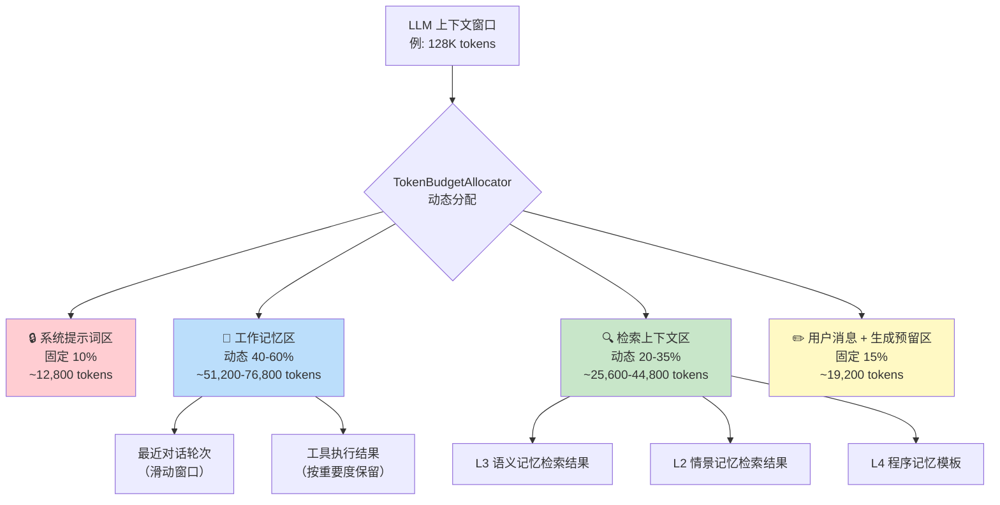
```mermaid
flowchart TD
    A["LLM 上下文窗口<br/>例: 128K tokens"] --> B{"TokenBudgetAllocator<br/>动态分配"}

    B --> C["🔒 系统提示词区<br/>固定 10%<br/>~12,800 tokens"]
    B --> D["💬 工作记忆区<br/>动态 40-60%<br/>~51,200-76,800 tokens"]
    B --> E["🔍 检索上下文区<br/>动态 20-35%<br/>~25,600-44,800 tokens"]
    B --> F["✏️ 用户消息 + 生成预留区<br/>固定 15%<br/>~19,200 tokens"]

    D --> D1["最近对话轮次<br/>（滑动窗口）"]
    D --> D2["工具执行结果<br/>（按重要度保留）"]

    E --> E1["L3 语义记忆检索结果"]
    E --> E2["L2 情景记忆检索结果"]
    E --> E3["L4 程序记忆模板"]

    style C fill:#ffcdd2
    style D fill:#bbdefb
    style E fill:#c8e6c9
    style F fill:#fff9c4
```

分配策略的核心思想是**动态调整**——当检索到大量相关上下文时，压缩工作记忆区为检索上下文让出空间；当对话轮次较多时，减少检索上下文区为工作记忆让出空间。

```java
package com.lifepilot.memory.working;

/**
 * Token 预算分配结果。
 *
 * @param systemPromptBudget   系统提示词预算
 * @param workingMemoryBudget  工作记忆预算
 * @param retrievalBudget      检索上下文预算
 * @param userMessageBudget    用户消息 + 生成预留预算
 * @param totalBudget          总预算
 */
public record BudgetAllocation(
        int systemPromptBudget,
        int workingMemoryBudget,
        int retrievalBudget,
        int userMessageBudget,
        int totalBudget
) {
    /** 验证分配总和不超过总预算。 */
    public BudgetAllocation {
        int sum = systemPromptBudget + workingMemoryBudget
                + retrievalBudget + userMessageBudget;
        if (sum > totalBudget) {
            throw new IllegalArgumentException(
                    "预算分配总和 %d 超过总预算 %d".formatted(sum, totalBudget));
        }
    }
}

/**
 * Token 预算分配器 — 根据 LLM 上下文窗口大小动态分配各区域预算。
 *
 * <p>分配策略：
 * <ul>
 *   <li>系统提示词：固定 10%（包含 Skill 系统提示词和全局指令）</li>
 *   <li>工作记忆：动态 40-60%（根据对话轮次和检索结果量调整）</li>
 *   <li>检索上下文：动态 20-35%（根据检索结果的相关性调整）</li>
 *   <li>用户消息 + 生成预留：固定 15%（确保用户输入和 LLM 生成有足够空间）</li>
 * </ul></p>
 *
 * <p>动态调整规则：
 * <ul>
 *   <li>检索结果高相关（Top-1 score > 0.9）：检索区扩展到 35%，工作记忆区压缩到 40%</li>
 *   <li>对话轮次多（> 10 轮）：工作记忆区扩展到 60%，检索区压缩到 20%</li>
 *   <li>默认情况：工作记忆 50%，检索 25%</li>
 * </ul></p>
 */
@Service
public class TokenBudgetAllocator {

    private static final float SYSTEM_PROMPT_RATIO = 0.10f;
    private static final float USER_MESSAGE_RATIO = 0.15f;
    private static final float DEFAULT_WORKING_MEMORY_RATIO = 0.50f;
    private static final float DEFAULT_RETRIEVAL_RATIO = 0.25f;

    private final MemoryProperties properties;

    public TokenBudgetAllocator(MemoryProperties properties) {
        this.properties = properties;
    }

    /**
     * 根据上下文窗口大小和当前状态分配 Token 预算。
     *
     * @param contextWindowSize LLM 上下文窗口总 Token 数
     * @param conversationTurns 当前对话轮次数
     * @param topRetrievalScore 最高检索相关性得分
     * @return 预算分配结果
     */
    public BudgetAllocation allocate(int contextWindowSize,
                                     int conversationTurns,
                                     float topRetrievalScore) {
        int systemBudget = Math.round(contextWindowSize * SYSTEM_PROMPT_RATIO);
        int userBudget = Math.round(contextWindowSize * USER_MESSAGE_RATIO);
        int remaining = contextWindowSize - systemBudget - userBudget;

        // 动态调整工作记忆和检索上下文的比例
        float workingRatio = DEFAULT_WORKING_MEMORY_RATIO;
        float retrievalRatio = DEFAULT_RETRIEVAL_RATIO;

        if (topRetrievalScore > 0.9f) {
            // 检索结果高度相关，扩展检索区
            retrievalRatio = 0.35f;
            workingRatio = 0.40f;
        } else if (conversationTurns > 10) {
            // 长对话，扩展工作记忆区
            workingRatio = 0.60f;
            retrievalRatio = 0.20f;
        }

        // 归一化（确保两个比例之和 = 剩余比例）
        float totalDynamic = workingRatio + retrievalRatio;
        float remainingRatio = 1.0f - SYSTEM_PROMPT_RATIO - USER_MESSAGE_RATIO;
        workingRatio = workingRatio / totalDynamic * remainingRatio;
        retrievalRatio = retrievalRatio / totalDynamic * remainingRatio;

        int workingBudget = Math.round(contextWindowSize * workingRatio);
        int retrievalBudget = remaining - workingBudget;

        return new BudgetAllocation(
                systemBudget, workingBudget, retrievalBudget,
                userBudget, contextWindowSize);
    }
}
```

### 3.4 WorkingMemory 服务

`WorkingMemory` 是 L1 工作记忆的核心服务，管理所有活跃会话的内存状态。它维护一个以 `sessionId` 为键的 `ConcurrentHashMap`，每个会话对应一个有序的槽位列表。

```java
package com.lifepilot.memory.working;

import com.lifepilot.memory.episodic.ConversationRecord;
import com.lifepilot.memory.episodic.EpisodicMemory;
import com.lifepilot.memory.episodic.MessageRecord;
import com.lifepilot.memory.episodic.CompressionLevel;
import org.slf4j.Logger;
import org.slf4j.LoggerFactory;
import org.springframework.stereotype.Service;

import java.time.Instant;
import java.util.*;
import java.util.concurrent.ConcurrentHashMap;

/**
 * L1 工作记忆服务 — 管理所有活跃会话的内存状态。
 *
 * <p>核心职责：
 * <ul>
 *   <li>维护每个会话的槽位列表（有序，按时间排列）</li>
 *   <li>Token 预算追踪和动态调整</li>
 *   <li>重要度加权的滑动窗口淘汰</li>
 *   <li>会话结束时 flush 到 L2 情景记忆</li>
 * </ul></p>
 *
 * <p>线程安全：使用 {@link ConcurrentHashMap} 管理会话，
 * 单个会话内的操作通过 synchronized 保护（同一会话不会并发写入）。</p>
 *
 * <p>内存管理：空闲会话（超过 30 分钟无活动）自动清理，
 * 防止内存泄漏。</p>
 */
@Service
public class WorkingMemory {

    private static final Logger log = LoggerFactory.getLogger(WorkingMemory.class);

    /** 会话 → 槽位列表。 */
    private final ConcurrentHashMap<String, List<WorkingMemorySlot>> sessions =
            new ConcurrentHashMap<>();

    /** 会话 → 当前 Token 使用量。 */
    private final ConcurrentHashMap<String, Integer> tokenUsage =
            new ConcurrentHashMap<>();

    /** 会话 → 最后活跃时间。 */
    private final ConcurrentHashMap<String, Instant> lastActivity =
            new ConcurrentHashMap<>();

    private final TokenBudgetAllocator allocator;
    private final EpisodicMemory episodicMemory;
    private final MemoryProperties properties;

    public WorkingMemory(TokenBudgetAllocator allocator,
                         EpisodicMemory episodicMemory,
                         MemoryProperties properties) {
        this.allocator = allocator;
        this.episodicMemory = episodicMemory;
        this.properties = properties;
    }

    /**
     * 向指定会话追加一个槽位。
     *
     * <p>追加后自动检查 Token 预算，超限时触发淘汰。</p>
     *
     * @param sessionId 会话 ID
     * @param slot      要追加的槽位
     */
    public void append(String sessionId, WorkingMemorySlot slot) {
        sessions.computeIfAbsent(sessionId, k -> new ArrayList<>()).add(slot);
        tokenUsage.merge(sessionId, slot.tokenCount(), Integer::sum);
        lastActivity.put(sessionId, Instant.now());

        // 检查 Token 预算
        int budget = properties.getWorkingMemoryTokenBudget();
        int currentUsage = tokenUsage.getOrDefault(sessionId, 0);
        if (currentUsage > budget) {
            evict(sessionId, currentUsage - budget);
        }

        log.debug("工作记忆追加槽位: sessionId={}, type={}, tokens={}, total={}",
                sessionId, slot.getClass().getSimpleName(),
                slot.tokenCount(), currentUsage);
    }

    /**
     * 获取指定会话的当前上下文。
     *
     * <p>返回不可变列表，调用方不能修改工作记忆内容。</p>
     *
     * @param sessionId 会话 ID
     * @return 当前会话的所有槽位（不可变）
     */
    public List<WorkingMemorySlot> getContext(String sessionId) {
        var slots = sessions.getOrDefault(sessionId, List.of());
        return List.copyOf(slots);
    }

    /**
     * 获取指定会话的 Token 使用量。
     *
     * @param sessionId 会话 ID
     * @return 当前 Token 使用量
     */
    public int getTokenUsage(String sessionId) {
        return tokenUsage.getOrDefault(sessionId, 0);
    }

    /**
     * 重要度加权淘汰 — 释放指定数量的 Token。
     *
     * <p>淘汰策略（优先级从高到低）：
     * <ol>
     *   <li>淘汰 {@link ReasoningSlot}（临时推理状态，重要度最低）</li>
     *   <li>淘汰旧的 {@link ToolResultSlot}（工具结果可重新获取）</li>
     *   <li>淘汰旧的 {@link ConversationSlot}（但 isPinned=true 的永不淘汰）</li>
     * </ol></p>
     *
     * <p>在同一优先级内，按 importance 升序淘汰（重要度低的先淘汰）。</p>
     *
     * @param sessionId    会话 ID
     * @param tokensToFree 需要释放的 Token 数量
     */
    public void evict(String sessionId, int tokensToFree) {
        var slots = sessions.get(sessionId);
        if (slots == null || slots.isEmpty()) return;

        int freed = 0;
        // 按淘汰优先级排序：重要度低的在前，isPinned 的在最后
        var candidates = new ArrayList<>(slots);
        candidates.sort(Comparator
                .<WorkingMemorySlot, Integer>comparing(s -> evictionPriority(s))
                .thenComparing(WorkingMemorySlot::importance));

        var toRemove = new ArrayList<WorkingMemorySlot>();
        for (var slot : candidates) {
            if (freed >= tokensToFree) break;
            // 永不淘汰被标记的对话槽位
            if (slot instanceof ConversationSlot cs && cs.isPinned()) continue;
            toRemove.add(slot);
            freed += slot.tokenCount();
        }

        slots.removeAll(toRemove);
        tokenUsage.merge(sessionId, -freed, Integer::sum);

        log.info("工作记忆淘汰: sessionId={}, 释放={} tokens, 淘汰={} 个槽位",
                sessionId, freed, toRemove.size());
    }

    /**
     * 将会话的工作记忆持久化到 L2 情景记忆，然后清理内存。
     *
     * <p>此方法在会话结束时调用，完成 L1 → L2 的数据流转。</p>
     *
     * @param sessionId 会话 ID
     * @param goal      用户原始目标（首条消息的意图摘要）
     * @return 持久化后的对话记录
     */
    public ConversationRecord flush(String sessionId, String goal) {
        var slots = sessions.remove(sessionId);
        tokenUsage.remove(sessionId);
        lastActivity.remove(sessionId);

        if (slots == null || slots.isEmpty()) {
            log.warn("工作记忆 flush 时会话为空: sessionId={}", sessionId);
            return null;
        }

        // 将槽位转换为消息记录
        var messages = slots.stream()
                .filter(ConversationSlot.class::isInstance)
                .map(ConversationSlot.class::cast)
                .map(cs -> new MessageRecord(
                        UUID.randomUUID().toString(),
                        cs.role(),
                        cs.content(),
                        null,  // 初始无压缩内容
                        CompressionLevel.ORIGINAL,
                        cs.isPinned(),
                        cs.toolCallJson(),
                        cs.tokenCount(),
                        cs.createdAt()))
                .toList();

        var record = new ConversationRecord(
                UUID.randomUUID().toString(),
                sessionId,
                goal,
                null,  // 摘要稍后由压缩服务生成
                messages,
                Instant.now(),
                Instant.now());

        // 持久化到 L2
        episodicMemory.save(record);

        log.info("工作记忆 flush 完成: sessionId={}, 消息数={}, 总 tokens={}",
                sessionId, messages.size(),
                messages.stream().mapToInt(MessageRecord::tokenCount).sum());

        return record;
    }

    /**
     * 清理空闲会话（超过指定时间无活动）。
     * 由定时任务调用，防止内存泄漏。
     */
    public void cleanupIdleSessions(java.time.Duration idleThreshold) {
        var now = Instant.now();
        var idleSessions = lastActivity.entrySet().stream()
                .filter(e -> java.time.Duration.between(e.getValue(), now)
                        .compareTo(idleThreshold) > 0)
                .map(Map.Entry::getKey)
                .toList();

        for (var sessionId : idleSessions) {
            // 空闲会话也需要 flush，避免数据丢失
            flush(sessionId, "（空闲超时自动保存）");
            log.info("清理空闲会话: sessionId={}", sessionId);
        }
    }

    /**
     * 计算槽位的淘汰优先级（数值越小越优先淘汰）。
     */
    private int evictionPriority(WorkingMemorySlot slot) {
        return switch (slot) {
            case ReasoningSlot _    -> 0;  // 推理槽位最先淘汰
            case ToolResultSlot _   -> 1;  // 工具结果其次
            case ConversationSlot c -> c.isPinned() ? 3 : 2;  // 对话最后，标记的永不淘汰
        };
    }
}
```

### 3.5 淘汰策略流程图

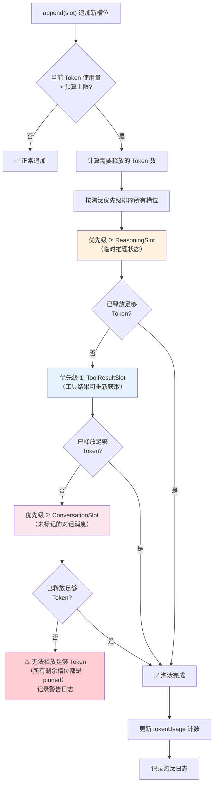
```mermaid
flowchart TD
    A["append(slot) 追加新槽位"] --> B{"当前 Token 使用量<br/>> 预算上限?"}
    B -->|"否"| Z["✅ 正常追加"]
    B -->|"是"| C["计算需要释放的 Token 数"]

    C --> D["按淘汰优先级排序所有槽位"]
    D --> E["优先级 0: ReasoningSlot<br/>（临时推理状态）"]
    E --> F{"已释放足够<br/>Token?"}
    F -->|"否"| G["优先级 1: ToolResultSlot<br/>（工具结果可重新获取）"]
    G --> H{"已释放足够<br/>Token?"}
    H -->|"否"| I["优先级 2: ConversationSlot<br/>（未标记的对话消息）"]
    I --> J{"已释放足够<br/>Token?"}
    J -->|"否"| K["⚠️ 无法释放足够 Token<br/>（所有剩余槽位都是 pinned）<br/>记录警告日志"]

    F -->|"是"| L["✅ 淘汰完成"]
    H -->|"是"| L
    J -->|"是"| L

    L --> M["更新 tokenUsage 计数"]
    M --> N["记录淘汰日志"]

    style E fill:#fff3e0
    style G fill:#e3f2fd
    style I fill:#fce4ec
    style K fill:#ffcdd2
```

### 3.6 配置属性

```java
package com.lifepilot.memory.config;

import org.springframework.boot.context.properties.ConfigurationProperties;

/**
 * 记忆系统配置属性。
 *
 * <p>通过 Spring Boot 配置文件注入，支持运行时调整。</p>
 *
 * <p>配置示例（application.yml）：
 * <pre>
 * lifepilot:
 *   memory:
 *     working-memory-token-budget: 8000
 *     idle-session-timeout-minutes: 30
 *     compression-threshold-tokens: 4000
 *     consolidation-lookback-days: 7
 *     forgetting-threshold: 0.7
 *     max-retention-days: 180
 * </pre></p>
 */
@ConfigurationProperties(prefix = "lifepilot.memory")
public record MemoryProperties(
        /** L1 工作记忆 Token 预算上限（默认 8000）。 */
        int workingMemoryTokenBudget,

        /** 空闲会话超时时间（分钟，默认 30）。 */
        int idleSessionTimeoutMinutes,

        /** 触发压缩的 Token 阈值（默认 4000）。 */
        int compressionThresholdTokens,

        /** 巩固管线回溯天数（默认 7）。 */
        int consolidationLookbackDays,

        /** 遗忘优先级阈值（默认 0.7，超过此值触发遗忘）。 */
        float forgettingThreshold,

        /** 最大保留天数（默认 180，用于遗忘优先级计算）。 */
        int maxRetentionDays
) {
    /** 默认配置。 */
    public MemoryProperties() {
        this(8000, 30, 4000, 7, 0.7f, 180);
    }
}
```

---

## 4. L2 情景记忆 (Episodic Memory)

### 4.1 设计原理

情景记忆（Episodic Memory）是认知科学中描述"对具体事件的记忆"的概念——人类能够回忆起"上周二和张总开会讨论了什么"，这就是情景记忆在起作用。LifePilot 的 L2 情景记忆模拟了这一机制：

- **追加写入不可变**：对话记录一旦写入就不可修改（只有压缩内容可以追加），保证审计追踪的完整性。这与事件溯源（Event Sourcing）的理念一致——历史不可篡改
- **渐进式三层压缩**：受 TiMem（[arXiv 2601.02845](https://arxiv.org/abs/2601.02845)）时序记忆树的启发，对话内容从原文逐层抽象为摘要和要点，在保留关键信息的同时大幅减少 Token 消耗
- **多维索引**：时间戳索引支持时间范围查询，FTS5 全文索引支持关键词搜索，意图类型索引支持按场景检索
- **用户标记保护**：用户标记为重要的消息（`is_pinned = 1`）永不压缩、永不遗忘，确保关键决策记录的持久性

### 4.2 核心数据模型

```java
package com.lifepilot.memory.episodic;

import java.time.Instant;
import java.util.List;

/**
 * 压缩层级枚举 — 定义对话内容的三层渐进压缩。
 *
 * <p>压缩是单向的、不可逆的过程：
 * {@code ORIGINAL → SUMMARY → KEYPOINTS}。
 * 原文始终保留在 {@code content} 列中，压缩结果写入 {@code compressed_content} 列。</p>
 *
 * <p>压缩率参考（基于实测数据）：
 * <ul>
 *   <li>ORIGINAL → SUMMARY：压缩率约 60%（1000 Token → 400 Token）</li>
 *   <li>SUMMARY → KEYPOINTS：压缩率约 80%（1000 Token → 200 Token）</li>
 *   <li>KEYPOINTS → ARCHIVED：仅保留元数据，内容归档到冷存储</li>
 * </ul></p>
 */
public enum CompressionLevel {

    /** 原文 — 完整保留，未经任何压缩。 */
    ORIGINAL(0, "原文"),

    /** 摘要 — LLM 生成的对话摘要，保留主要信息和决策。 */
    SUMMARY(1, "摘要"),

    /** 要点 — 仅保留关键决策点和结论，高度浓缩。 */
    KEYPOINTS(2, "要点"),

    /** 归档 — 仅保留元数据（时间、参与者、意图），内容已归档。 */
    ARCHIVED(3, "归档");

    private final int level;
    private final String displayName;

    CompressionLevel(int level, String displayName) {
        this.level = level;
        this.displayName = displayName;
    }

    public int level() { return level; }
    public String displayName() { return displayName; }

    /** 从数据库整数值还原枚举。 */
    public static CompressionLevel fromLevel(int level) {
        return switch (level) {
            case 0 -> ORIGINAL;
            case 1 -> SUMMARY;
            case 2 -> KEYPOINTS;
            case 3 -> ARCHIVED;
            default -> throw new IllegalArgumentException(
                    "未知的压缩层级: %d".formatted(level));
        };
    }
}

/**
 * 消息记录 — 单条对话消息的不可变记录。
 *
 * <p>对应数据库 {@code messages} 表的一行。
 * 原始内容存储在 {@code content} 中，压缩后的内容存储在 {@code compressedContent} 中。
 * 检索时根据 {@code compressionLevel} 决定返回哪个版本。</p>
 *
 * @param id                消息 UUID
 * @param role              角色：user / assistant / system / tool
 * @param content           原始消息内容（始终保留）
 * @param compressedContent 压缩后内容（SUMMARY 或 KEYPOINTS 层级时非空）
 * @param compressionLevel  当前压缩层级
 * @param isPinned          用户标记为重要（标记后永不压缩）
 * @param toolCallJson      工具调用详情 JSON（可为 null）
 * @param tokenCount        原始内容的 Token 数
 * @param createdAt         消息创建时间
 */
public record MessageRecord(
        String id,
        String role,
        String content,
        @Nullable String compressedContent,
        CompressionLevel compressionLevel,
        boolean isPinned,
        @Nullable String toolCallJson,
        int tokenCount,
        Instant createdAt
) {
    /**
     * 获取当前有效内容 — 根据压缩层级返回最合适的内容版本。
     *
     * <p>优先返回压缩内容（节省 Token），如果压缩内容为空则返回原文。</p>
     */
    public String effectiveContent() {
        if (compressionLevel == CompressionLevel.ORIGINAL || compressedContent == null) {
            return content;
        }
        return compressedContent;
    }

    /**
     * 获取有效内容的估算 Token 数。
     */
    public int effectiveTokenCount() {
        return switch (compressionLevel) {
            case ORIGINAL  -> tokenCount;
            case SUMMARY   -> Math.round(tokenCount * 0.4f);
            case KEYPOINTS -> Math.round(tokenCount * 0.2f);
            case ARCHIVED  -> 0;
        };
    }
}

/**
 * 对话记录 — 一次完整对话的不可变记录。
 *
 * <p>对应数据库 {@code conversations} 表的一行，包含该对话的所有消息。
 * 对话记录是情景记忆的基本单元。</p>
 *
 * @param id        对话 UUID
 * @param sessionId 会话 ID（同一会话可包含多轮对话）
 * @param goal      用户原始目标（首条消息的意图摘要）
 * @param summary   对话摘要（压缩后生成，可为 null）
 * @param messages  消息列表（按时间排序）
 * @param createdAt 对话创建时间
 * @param updatedAt 最后更新时间
 */
public record ConversationRecord(
        String id,
        String sessionId,
        String goal,
        @Nullable String summary,
        List<MessageRecord> messages,
        Instant createdAt,
        Instant updatedAt
) {
    /** 确保消息列表不可变。 */
    public ConversationRecord {
        messages = List.copyOf(messages);
    }

    /** 计算对话的总 Token 数（使用有效内容）。 */
    public int totalEffectiveTokens() {
        return messages.stream()
                .mapToInt(MessageRecord::effectiveTokenCount)
                .sum();
    }

    /** 获取对话中被标记为重要的消息。 */
    public List<MessageRecord> pinnedMessages() {
        return messages.stream()
                .filter(MessageRecord::isPinned)
                .toList();
    }
}
```

### 4.3 渐进式压缩生命周期

对话内容的压缩是一个渐进的、不可逆的过程。随着时间推移和存储预算的压力，对话内容从原文逐步压缩为摘要、要点，最终归档。这一设计受 TiMem 时序记忆树的启发——原始观察逐层抽象为更高层次的表示。

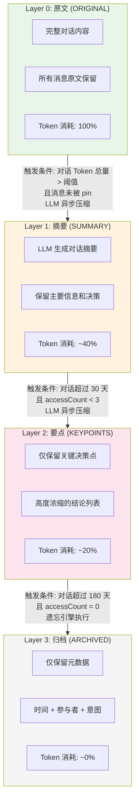
```mermaid
flowchart TD
    subgraph Layer0["Layer 0: 原文 (ORIGINAL)"]
        O1["完整对话内容"]
        O2["所有消息原文保留"]
        O3["Token 消耗: 100%"]
    end

    subgraph Layer1["Layer 1: 摘要 (SUMMARY)"]
        S1["LLM 生成对话摘要"]
        S2["保留主要信息和决策"]
        S3["Token 消耗: ~40%"]
    end

    subgraph Layer2["Layer 2: 要点 (KEYPOINTS)"]
        K1["仅保留关键决策点"]
        K2["高度浓缩的结论列表"]
        K3["Token 消耗: ~20%"]
    end

    subgraph Layer3["Layer 3: 归档 (ARCHIVED)"]
        A1["仅保留元数据"]
        A2["时间 + 参与者 + 意图"]
        A3["Token 消耗: ~0%"]
    end

    Layer0 -->|"触发条件: 对话 Token 总量 > 阈值<br/>且消息未被 pin<br/>LLM 异步压缩"| Layer1
    Layer1 -->|"触发条件: 对话超过 30 天<br/>且 accessCount < 3<br/>LLM 异步压缩"| Layer2
    Layer2 -->|"触发条件: 对话超过 180 天<br/>且 accessCount = 0<br/>遗忘引擎执行"| Layer3

    style Layer0 fill:#e8f5e9
    style Layer1 fill:#fff3e0
    style Layer2 fill:#fce4ec
    style Layer3 fill:#f5f5f5
```

**压缩规则**：

| 规则 | 说明 |
|------|------|
| `is_pinned = 1` 的消息永不压缩 | 用户明确标记的重要消息，原文永久保留 |
| 原文始终保留在 `content` 列 | 压缩结果写入 `compressed_content`，原文不删除，支持回溯 |
| 压缩由 LLM 异步执行 | 不阻塞主 Agent 循环，使用 `LlmScene.COMPRESSION` 场景 |
| 同一对话内按时间从早到晚压缩 | 最早的未固定消息优先压缩 |
| 压缩后更新 `compression_level` | 数据库中记录当前压缩层级，检索时据此选择返回内容 |

### 4.4 SQL Schema

情景记忆的物理存储基于 `conversations` 和 `messages` 两张表，详细 Schema 定义参见 [data-model.md](data-model.md) §4.1。此处补充 FTS5 全文索引的定义：

```sql
-- Flyway 迁移脚本: V2__episodic_memory_fts.sql

-- FTS5 全文索引表 — 对消息内容建立全文索引
-- 使用 jieba 分词器（如果可用），否则降级为 unicode61
CREATE VIRTUAL TABLE IF NOT EXISTS messages_fts USING fts5(
    content,                          -- 索引消息内容
    conversation_id UNINDEXED,        -- 不索引但可过滤
    role UNINDEXED,                   -- 不索引但可过滤
    content=messages,                 -- 内容来源表
    content_rowid=rowid,              -- 行 ID 映射
    tokenize='unicode61 remove_diacritics 2'  -- Unicode 分词
);

-- 自动同步触发器：messages 表插入时同步到 FTS5
CREATE TRIGGER IF NOT EXISTS messages_fts_insert
AFTER INSERT ON messages BEGIN
    INSERT INTO messages_fts(rowid, content, conversation_id, role)
    VALUES (new.rowid, new.content, new.conversation_id, new.role);
END;

-- 自动同步触发器：messages 表更新时同步到 FTS5
CREATE TRIGGER IF NOT EXISTS messages_fts_update
AFTER UPDATE OF content ON messages BEGIN
    INSERT INTO messages_fts(messages_fts, rowid, content, conversation_id, role)
    VALUES ('delete', old.rowid, old.content, old.conversation_id, old.role);
    INSERT INTO messages_fts(rowid, content, conversation_id, role)
    VALUES (new.rowid, new.content, new.conversation_id, new.role);
END;
```

### 4.5 EpisodicMemory 服务

```java
package com.lifepilot.memory.episodic;

import com.lifepilot.memory.config.MemoryProperties;
import org.slf4j.Logger;
import org.slf4j.LoggerFactory;
import org.springframework.jdbc.core.JdbcTemplate;
import org.springframework.stereotype.Service;
import org.springframework.transaction.annotation.Transactional;

import java.time.Duration;
import java.time.Instant;
import java.util.List;
import java.util.Optional;
import java.util.UUID;

/**
 * L2 情景记忆服务 — 管理对话记录的持久化、检索和压缩。
 *
 * <p>核心职责：
 * <ul>
 *   <li>持久化对话记录（追加写入，不可变）</li>
 *   <li>多维检索：时间范围、全文搜索、意图类型</li>
 *   <li>渐进式压缩：ORIGINAL → SUMMARY → KEYPOINTS → ARCHIVED</li>
 *   <li>为 L3 知识提取和 L4 模式提炼提供数据源</li>
 * </ul></p>
 *
 * <p>线程安全：所有写操作通过 {@code WriteSerializer} 串行化，
 * 读操作利用 SQLite WAL 模式并发执行。</p>
 */
@Service
public class EpisodicMemory {

    private static final Logger log = LoggerFactory.getLogger(EpisodicMemory.class);

    private final JdbcTemplate jdbc;
    private final MemoryProperties properties;

    public EpisodicMemory(JdbcTemplate jdbc, MemoryProperties properties) {
        this.jdbc = jdbc;
        this.properties = properties;
    }

    /**
     * 持久化对话记录（L1 → L2 数据流转）。
     *
     * <p>在事务内执行：先插入 conversations 行，再批量插入 messages 行。
     * 消息内容会自动同步到 FTS5 全文索引（通过数据库触发器）。</p>
     *
     * @param record 对话记录（来自 WorkingMemory.flush()）
     */
    @Transactional
    public void save(ConversationRecord record) {
        // 插入对话记录
        jdbc.update("""
                INSERT INTO conversations (id, session_id, goal, summary, created_at, updated_at)
                VALUES (?, ?, ?, ?, ?, ?)
                """,
                record.id(), record.sessionId(), record.goal(), record.summary(),
                record.createdAt().toString(), record.updatedAt().toString());

        // 批量插入消息记录
        for (var msg : record.messages()) {
            jdbc.update("""
                    INSERT INTO messages (
                        id, conversation_id, role, content, compressed_content,
                        compression_level, is_pinned, tool_call_json, token_count, created_at
                    ) VALUES (?, ?, ?, ?, ?, ?, ?, ?, ?, ?)
                    """,
                    msg.id(), record.id(), msg.role(), msg.content(),
                    msg.compressedContent(), msg.compressionLevel().level(),
                    msg.isPinned() ? 1 : 0, msg.toolCallJson(),
                    msg.tokenCount(), msg.createdAt().toString());
        }

        log.info("情景记忆保存: conversationId={}, 消息数={}, 总 tokens={}",
                record.id(), record.messages().size(),
                record.messages().stream().mapToInt(MessageRecord::tokenCount).sum());
    }

    /**
     * 按时间范围查询最近的对话记录。
     *
     * <p>用于巩固管线（获取最近 N 天的对话进行分析）
     * 和上下文组装（获取最近的对话作为背景信息）。</p>
     *
     * @param duration 回溯时间范围（如 Duration.ofDays(7)）
     * @return 时间范围内的对话记录列表（按时间倒序）
     */
    public List<ConversationRecord> getRecent(Duration duration) {
        var since = Instant.now().minus(duration).toString();
        var conversations = jdbc.query("""
                SELECT id, session_id, goal, summary, created_at, updated_at
                FROM conversations
                WHERE created_at >= ?
                ORDER BY created_at DESC
                """,
                (rs, _) -> rs.getString("id"),
                since);

        return conversations.stream()
                .map(this::loadConversation)
                .flatMap(Optional::stream)
                .toList();
    }

    /**
     * FTS5 全文搜索 — 在消息内容中搜索关键词。
     *
     * <p>使用 SQLite FTS5 的 BM25 排序算法，返回最相关的对话记录。
     * 搜索范围包括所有消息的原始内容（不搜索压缩内容）。</p>
     *
     * <p>查询语法支持：
     * <ul>
     *   <li>简单关键词：{@code "张总"}</li>
     *   <li>短语匹配：{@code "\"项目进展\""}</li>
     *   <li>布尔组合：{@code "张总 AND 项目"}</li>
     *   <li>前缀匹配：{@code "项目*"}</li>
     * </ul></p>
     *
     * @param query 搜索查询
     * @return 匹配的对话记录列表（按 BM25 相关性排序）
     */
    public List<ConversationRecord> search(String query) {
        var conversationIds = jdbc.queryForList("""
                SELECT DISTINCT m.conversation_id
                FROM messages m
                JOIN messages_fts fts ON m.rowid = fts.rowid
                WHERE messages_fts MATCH ?
                ORDER BY bm25(messages_fts)
                LIMIT 20
                """,
                String.class, query);

        return conversationIds.stream()
                .map(this::loadConversation)
                .flatMap(Optional::stream)
                .toList();
    }

    /**
     * 按意图类型检索对话 — 查找特定类型的历史对话。
     *
     * <p>意图类型存储在 conversations.goal 列中，
     * 通过 LIKE 模糊匹配实现。</p>
     *
     * @param intentType 意图类型关键词（如 "待办", "日程", "习惯"）
     * @return 匹配的对话记录列表
     */
    public List<ConversationRecord> getByIntent(String intentType) {
        var conversationIds = jdbc.queryForList("""
                SELECT id FROM conversations
                WHERE goal LIKE ?
                ORDER BY created_at DESC
                LIMIT 10
                """,
                String.class, "%" + intentType + "%");

        return conversationIds.stream()
                .map(this::loadConversation)
                .flatMap(Optional::stream)
                .toList();
    }

    /**
     * 对指定对话执行渐进压缩。
     *
     * <p>压缩规则：
     * <ul>
     *   <li>只压缩 {@code is_pinned = 0} 的消息</li>
     *   <li>只能向更高层级压缩（ORIGINAL→SUMMARY→KEYPOINTS）</li>
     *   <li>原文保留在 {@code content} 列，压缩结果写入 {@code compressed_content}</li>
     * </ul></p>
     *
     * @param conversationId 对话 ID
     * @param targetLevel    目标压缩层级
     * @param compressedTexts 压缩后的文本映射（messageId → compressedText）
     */
    @Transactional
    public void compress(String conversationId, CompressionLevel targetLevel,
                         java.util.Map<String, String> compressedTexts) {
        for (var entry : compressedTexts.entrySet()) {
            jdbc.update("""
                    UPDATE messages
                    SET compressed_content = ?,
                        compression_level = ?
                    WHERE id = ?
                      AND conversation_id = ?
                      AND is_pinned = 0
                      AND compression_level < ?
                    """,
                    entry.getValue(), targetLevel.level(),
                    entry.getKey(), conversationId, targetLevel.level());
        }

        // 更新对话摘要
        if (targetLevel == CompressionLevel.SUMMARY) {
            var summaryText = String.join("\n", compressedTexts.values());
            jdbc.update("""
                    UPDATE conversations SET summary = ?, updated_at = ?
                    WHERE id = ?
                    """,
                    summaryText, Instant.now().toString(), conversationId);
        }

        log.info("情景记忆压缩: conversationId={}, 目标层级={}, 压缩消息数={}",
                conversationId, targetLevel.displayName(), compressedTexts.size());
    }

    /**
     * 加载完整对话记录（包含所有消息）。
     */
    private Optional<ConversationRecord> loadConversation(String conversationId) {
        var conversations = jdbc.query("""
                SELECT id, session_id, goal, summary, created_at, updated_at
                FROM conversations WHERE id = ?
                """,
                (rs, _) -> {
                    var messages = loadMessages(rs.getString("id"));
                    return new ConversationRecord(
                            rs.getString("id"),
                            rs.getString("session_id"),
                            rs.getString("goal"),
                            rs.getString("summary"),
                            messages,
                            Instant.parse(rs.getString("created_at")),
                            Instant.parse(rs.getString("updated_at")));
                },
                conversationId);

        return conversations.isEmpty() ? Optional.empty() : Optional.of(conversations.getFirst());
    }

    /**
     * 加载指定对话的所有消息。
     */
    private List<MessageRecord> loadMessages(String conversationId) {
        return jdbc.query("""
                SELECT id, role, content, compressed_content, compression_level,
                       is_pinned, tool_call_json, token_count, created_at
                FROM messages
                WHERE conversation_id = ?
                ORDER BY created_at ASC
                """,
                (rs, _) -> new MessageRecord(
                        rs.getString("id"),
                        rs.getString("role"),
                        rs.getString("content"),
                        rs.getString("compressed_content"),
                        CompressionLevel.fromLevel(rs.getInt("compression_level")),
                        rs.getInt("is_pinned") == 1,
                        rs.getString("tool_call_json"),
                        rs.getInt("token_count"),
                        Instant.parse(rs.getString("created_at"))),
                conversationId);
    }
}
```

### 4.6 时间旅行查询示例

情景记忆支持多种维度的查询，以下是典型的查询场景和对应的 SQL：

```sql
-- ═══ 场景 1: 时间范围查询 ═══
-- "最近一周我们讨论了什么？"
SELECT c.id, c.goal, c.summary, c.created_at,
       COUNT(m.id) AS message_count,
       SUM(m.token_count) AS total_tokens
FROM conversations c
LEFT JOIN messages m ON m.conversation_id = c.id
WHERE c.created_at >= datetime('now', '-7 days')
GROUP BY c.id
ORDER BY c.created_at DESC;

-- ═══ 场景 2: 全文搜索 ═══
-- "之前讨论过的关于项目预算的内容"
SELECT c.id, c.goal, c.created_at,
       snippet(messages_fts, 0, '<b>', '</b>', '...', 32) AS matched_snippet,
       bm25(messages_fts) AS relevance_score
FROM messages_fts
JOIN messages m ON m.rowid = messages_fts.rowid
JOIN conversations c ON c.id = m.conversation_id
WHERE messages_fts MATCH '项目 AND 预算'
ORDER BY bm25(messages_fts)
LIMIT 10;

-- ═══ 场景 3: 特定对话的完整回放 ═══
-- "回放上次和张总相关的对话"
SELECT m.role, m.content, m.compressed_content, m.compression_level,
       m.is_pinned, m.tool_call_json, m.token_count, m.created_at
FROM messages m
JOIN conversations c ON c.id = m.conversation_id
WHERE c.goal LIKE '%张总%'
ORDER BY c.created_at DESC, m.created_at ASC
LIMIT 100;

-- ═══ 场景 4: 压缩状态统计 ═══
-- 查看各压缩层级的消息分布
SELECT
    CASE compression_level
        WHEN 0 THEN '原文'
        WHEN 1 THEN '摘要'
        WHEN 2 THEN '要点'
        WHEN 3 THEN '归档'
    END AS level_name,
    COUNT(*) AS message_count,
    SUM(token_count) AS original_tokens,
    ROUND(AVG(token_count), 0) AS avg_tokens
FROM messages
GROUP BY compression_level
ORDER BY compression_level;

-- ═══ 场景 5: 被标记的重要消息 ═══
-- "我标记过的所有重要信息"
SELECT m.content, m.created_at, c.goal
FROM messages m
JOIN conversations c ON c.id = m.conversation_id
WHERE m.is_pinned = 1
ORDER BY m.created_at DESC;
```

### 4.7 压缩服务

```java
package com.lifepilot.memory.compression;

import com.lifepilot.llm.LlmRouter;
import com.lifepilot.llm.LlmScene;
import com.lifepilot.memory.episodic.CompressionLevel;
import com.lifepilot.memory.episodic.EpisodicMemory;
import com.lifepilot.memory.episodic.MessageRecord;
import org.slf4j.Logger;
import org.slf4j.LoggerFactory;
import org.springframework.scheduling.annotation.Async;
import org.springframework.stereotype.Service;

import java.util.HashMap;
import java.util.List;

/**
 * 对话压缩服务 — 异步执行渐进式对话压缩。
 *
 * <p>压缩策略：
 * <ul>
 *   <li>ORIGINAL → SUMMARY：将多条消息合并为一段摘要，保留关键信息</li>
 *   <li>SUMMARY → KEYPOINTS：将摘要进一步浓缩为要点列表</li>
 * </ul></p>
 *
 * <p>压缩由 LLM 执行，使用 {@code LlmScene.COMPRESSION} 场景，
 * 该场景配置为使用成本最低的模型（如本地 Ollama）。</p>
 */
@Service
public class CompressionService {

    private static final Logger log = LoggerFactory.getLogger(CompressionService.class);

    private static final String SUMMARY_PROMPT = """
            请将以下对话内容压缩为简洁的摘要，保留：
            1. 关键决策和结论
            2. 重要的事实信息（人名、日期、数字）
            3. 用户的明确意图和偏好
            4. 工具执行的关键结果

            丢弃：
            1. 寒暄和礼貌用语
            2. 重复的确认信息
            3. 中间推理过程（只保留结论）

            对话内容：
            %s
            """;

    private static final String KEYPOINTS_PROMPT = """
            请将以下摘要进一步浓缩为关键要点列表（每个要点一行，以 "- " 开头）：
            仅保留最核心的决策、结论和事实。

            摘要内容：
            %s
            """;

    private final LlmRouter llmRouter;
    private final EpisodicMemory episodicMemory;

    public CompressionService(LlmRouter llmRouter, EpisodicMemory episodicMemory) {
        this.llmRouter = llmRouter;
        this.episodicMemory = episodicMemory;
    }

    /**
     * 异步压缩指定对话到目标层级。
     *
     * @param conversationId 对话 ID
     * @param messages       待压缩的消息列表
     * @param targetLevel    目标压缩层级
     */
    @Async
    public void compressAsync(String conversationId,
                              List<MessageRecord> messages,
                              CompressionLevel targetLevel) {
        try {
            var compressedTexts = new HashMap<String, String>();

            // 过滤出可压缩的消息（未标记、当前层级低于目标层级）
            var compressible = messages.stream()
                    .filter(m -> !m.isPinned())
                    .filter(m -> m.compressionLevel().level() < targetLevel.level())
                    .toList();

            if (compressible.isEmpty()) {
                log.debug("无可压缩消息: conversationId={}", conversationId);
                return;
            }

            // 根据目标层级选择压缩策略
            String prompt = switch (targetLevel) {
                case SUMMARY -> SUMMARY_PROMPT.formatted(
                        formatMessages(compressible));
                case KEYPOINTS -> KEYPOINTS_PROMPT.formatted(
                        formatMessages(compressible));
                default -> throw new IllegalArgumentException(
                        "不支持的压缩目标层级: %s".formatted(targetLevel));
            };

            // 调用 LLM 执行压缩
            String compressed = llmRouter.call(LlmScene.COMPRESSION, prompt);

            // 所有可压缩消息共享同一个压缩结果
            for (var msg : compressible) {
                compressedTexts.put(msg.id(), compressed);
            }

            // 持久化压缩结果
            episodicMemory.compress(conversationId, targetLevel, compressedTexts);

            log.info("对话压缩完成: conversationId={}, 层级={}, 原始消息数={}, 压缩后长度={}",
                    conversationId, targetLevel.displayName(),
                    compressible.size(), compressed.length());

        } catch (Exception e) {
            // 压缩失败不影响核心功能，记录警告后跳过
            log.warn("对话压缩失败: conversationId={}, 原因={}",
                    conversationId, e.getMessage());
        }
    }

    /**
     * 将消息列表格式化为 LLM 可读的文本。
     */
    private String formatMessages(List<MessageRecord> messages) {
        var sb = new StringBuilder();
        for (var msg : messages) {
            sb.append("[%s] %s\n".formatted(msg.role(), msg.effectiveContent()));
        }
        return sb.toString();
    }
}
```

---

## 5. L3 语义记忆与时序知识图谱 (Semantic Memory & Temporal KG)

### 5.1 设计原理

语义记忆是认知科学中描述"关于世界的一般性知识"的概念——人类知道"巴黎是法国的首都"，这就是语义记忆。与情景记忆（记住具体事件）不同，语义记忆存储的是从多次经验中提炼出的抽象知识。

LifePilot 的 L3 语义记忆在传统知识图谱的基础上引入了两个关键创新：

**创新 1: 时序维度（受 MemoriesDB 启发）**

传统知识图谱只存储"当前状态"——"张总是产品经理"。但现实中信息会随时间变化——张总可能升职为产品总监。LifePilot 的时序知识图谱为每个实体和关系都添加了时间维度（`valid_from` / `valid_to`），支持：
- **时间旅行查询**："2025 年 6 月时，张总的职位是什么？"
- **变更历史追踪**："张总的职位变更记录"
- **版本化更新**：新信息到达时创建新版本，旧版本保留可查

**创新 2: 来源追踪（受 MaRS 启发）**

每条知识都追踪到源对话（`source_conversation_id`）和提取置信度（`extraction_confidence`），实现：
- **可解释性**："这条信息是从哪次对话中提取的？"
- **置信度过滤**：低置信度的知识在检索时降权
- **冲突解决**：当两条信息冲突时，参考来源和置信度决定保留哪个

### 5.2 时序实体模型

```java
package com.lifepilot.memory.semantic;

import java.time.Instant;
import java.util.Map;

/**
 * 实体类型枚举 — 定义时序知识图谱中的实体分类体系。
 *
 * <p>扩展自原始设计，新增 ORGANIZATION、CONCEPT、SKILL 三种类型，
 * 覆盖个人 AI Agent 场景下的常见实体。</p>
 *
 * <p>数据库中以 TEXT 存储枚举名称，新增类型无需 Schema 迁移。</p>
 */
public enum EntityType {

    // ═══ 人物与组织 ═══

    /** 人物 — 同事、朋友、家人、客户等。 */
    PERSON,

    /** 组织 — 公司、部门、团队、社区等。 */
    ORGANIZATION,

    // ═══ 事物与空间 ═══

    /** 地点 — 办公室、餐厅、城市等。 */
    PLACE,

    /** 事件 — 会议、活动、里程碑、纪念日等。 */
    EVENT,

    /** 项目 — 工作项目、个人项目、学习计划等。 */
    PROJECT,

    // ═══ 用户认知 ═══

    /** 偏好 — 饮食偏好、工作习惯、沟通风格、审美倾向等。 */
    PREFERENCE,

    /** 习惯 — 日常习惯模式（早起、运动、阅读等）。 */
    HABIT,

    /** 目标 — 短期目标、长期目标、人生愿景等。 */
    GOAL,

    // ═══ 抽象概念 ═══

    /** 概念 — 用户关注的主题、领域、技术等抽象概念。 */
    CONCEPT,

    /** 技能 — 用户掌握或正在学习的技能。 */
    SKILL;

    /**
     * 判断此实体类型是否为"用户认知"类别。
     * 用户认知类实体（偏好、习惯、目标）在遗忘策略中享有更高的保留优先级。
     */
    public boolean isUserCognitive() {
        return this == PREFERENCE || this == HABIT || this == GOAL;
    }
}

/**
 * 时序知识实体 — 时序知识图谱的核心数据结构。
 *
 * <p>每次更新创建新版本，旧版本保留，支持时间旅行查询。
 * 受 MemoriesDB（<a href="https://arxiv.org/abs/2511.06179">arXiv 2511.06179</a>）
 * "时间-语义-关系实体"概念启发，每个实体同时编码三个维度：</p>
 * <ul>
 *   <li><b>时间维度</b>：{@code validFrom} / {@code validTo} 定义版本有效期</li>
 *   <li><b>语义维度</b>：{@code name} + {@code description} + {@code properties} 编码实体含义</li>
 *   <li><b>关系维度</b>：通过 {@link TemporalRelation} 与其他实体关联</li>
 * </ul>
 *
 * <p>受 MaRS（<a href="https://arxiv.org/abs/2512.12856">arXiv 2512.12856</a>）
 * 来源追踪机制启发，每条实体都记录提取来源和置信度。</p>
 *
 * <p>版本化更新策略：
 * <ol>
 *   <li>新信息到达时，当前版本的 {@code validTo} 设为 now</li>
 *   <li>创建新版本，{@code version} + 1，{@code isCurrent} = true</li>
 *   <li>旧版本 {@code isCurrent} = false，但数据保留可查</li>
 * </ol></p>
 *
 * @param id                      UUID（每个版本独立 ID）
 * @param type                    实体类型
 * @param name                    实体名称（如 "张总"、"XX项目"）
 * @param description             实体描述（如 "产品总监，负责整体产品战略"）
 * @param properties              结构化属性 Map（如 {"title":"产品总监","phone":"138****5678"}）
 * @param version                 版本号（同名同类型实体内单调递增）
 * @param isCurrent               是否为当前版本
 * @param validFrom               此版本生效时间
 * @param validTo                 此版本失效时间（null = 当前有效）
 * @param sourceConversationId    提取自哪次对话
 * @param extractionConfidence    提取置信度 [0.0, 1.0]
 * @param importanceScore         重要度评分 [0.0, 1.0]
 * @param accessCount             被检索次数（用于 LRU 遗忘策略）
 * @param lastAccessedAt          最后访问时间
 * @param createdAt               创建时间
 * @param updatedAt               更新时间
 */
public record TemporalEntity(
        String id,
        EntityType type,
        String name,
        String description,
        Map<String, Object> properties,

        // === 时序维度 ===
        int version,
        boolean isCurrent,
        Instant validFrom,
        @Nullable Instant validTo,

        // === 来源追踪（MaRS 启发） ===
        @Nullable String sourceConversationId,
        float extractionConfidence,

        // === 记忆管理 ===
        float importanceScore,
        int accessCount,
        @Nullable Instant lastAccessedAt,

        Instant createdAt,
        Instant updatedAt
) {
    /** 确保属性 Map 不可变。 */
    public TemporalEntity {
        properties = properties != null ? Map.copyOf(properties) : Map.of();
    }

    /** 判断此实体在指定时间点是否有效。 */
    public boolean isValidAt(Instant point) {
        return !validFrom.isAfter(point)
                && (validTo == null || validTo.isAfter(point));
    }

    /** 判断此实体是否为高重要度（不应被遗忘）。 */
    public boolean isHighImportance() {
        return importanceScore > 0.8f;
    }

    /** 判断此实体是否为用户认知类（偏好/习惯/目标）。 */
    public boolean isUserCognitive() {
        return type.isUserCognitive();
    }
}
```

### 5.3 时序关系模型

```java
package com.lifepilot.memory.semantic;

import java.time.Instant;
import java.util.Map;

/**
 * 关系类型常量 — 管理时序知识图谱中的已知关系类型。
 *
 * <p>关系类型以 TEXT 存储在数据库中，使用常量类管理已知类型。
 * 新增关系类型只需添加常量，无需 Schema 迁移。</p>
 *
 * <p>分类体系：
 * <ul>
 *   <li>社交关系：人与人之间的关系</li>
 *   <li>组织关系：人与组织、组织与组织</li>
 *   <li>项目关系：人/组织与项目</li>
 *   <li>因果关系：事件之间的因果链</li>
 *   <li>偏好关系：用户与偏好/习惯/目标</li>
 *   <li>概念关系：概念与概念之间的层次和关联</li>
 * </ul></p>
 */
public final class RelationTypes {

    // ═══ 社交关系 ═══
    public static final String KNOWS = "knows";
    public static final String IS_FRIEND_OF = "is_friend_of";
    public static final String IS_FAMILY_OF = "is_family_of";
    public static final String IS_CLIENT_OF = "is_client_of";
    public static final String IS_COLLEAGUE_OF = "is_colleague_of";

    // ═══ 组织关系 ═══
    public static final String WORKS_AT = "works_at";
    public static final String BELONGS_TO = "belongs_to";
    public static final String MANAGES = "manages";
    public static final String REPORTS_TO = "reports_to";
    public static final String MEMBER_OF = "member_of";

    // ═══ 项目关系 ═══
    public static final String RESPONSIBLE_FOR = "responsible_for";
    public static final String PARTICIPATES_IN = "participates_in";
    public static final String HAS_MILESTONE = "has_milestone";
    public static final String DEPENDS_ON = "depends_on";
    public static final String BLOCKED_BY = "blocked_by";

    // ═══ 因果关系 ═══
    public static final String CAUSED_BY = "caused_by";
    public static final String LEADS_TO = "leads_to";
    public static final String RELATED_TO = "related_to";
    public static final String PRECEDED_BY = "preceded_by";

    // ═══ 偏好关系 ═══
    public static final String PREFERS = "prefers";
    public static final String DISLIKES = "dislikes";
    public static final String HAS_GOAL = "has_goal";
    public static final String HAS_HABIT = "has_habit";
    public static final String INTERESTED_IN = "interested_in";

    // ═══ 概念关系 ═══
    public static final String IS_A = "is_a";
    public static final String PART_OF = "part_of";
    public static final String HAS_SKILL = "has_skill";
    public static final String LEARNING = "learning";

    /**
     * 获取关系的反向类型。
     * 用于双向图遍历——从目标实体反向查找源实体。
     *
     * @param relationType 正向关系类型
     * @return 反向关系类型（如果存在），否则返回 "inverse_of_" + relationType
     */
    public static String inverse(String relationType) {
        return switch (relationType) {
            case MANAGES -> REPORTS_TO;
            case REPORTS_TO -> MANAGES;
            case CAUSED_BY -> LEADS_TO;
            case LEADS_TO -> CAUSED_BY;
            case PRECEDED_BY -> "followed_by";
            case IS_A -> "has_instance";
            case PART_OF -> "has_part";
            default -> "inverse_of_" + relationType;
        };
    }

    private RelationTypes() {
        // 工具类，禁止实例化
    }
}

/**
 * 时序关系 — 两个实体之间的有向关系，带时间维度和强度。
 *
 * <p>关系也有时间维度：一段关系可能在某个时间点开始，在另一个时间点结束。
 * 例如："张总 is_client_of 用户" 从 2025-06 开始，2026-01 结束。</p>
 *
 * <p>关系强度 {@code strength} 表示关系的紧密程度 [0.0, 1.0]：
 * <ul>
 *   <li>1.0：确定性关系（如 "张总 works_at 某公司"）</li>
 *   <li>0.5-0.9：推断性关系（如 "张总 可能 interested_in AI"）</li>
 *   <li>< 0.5：弱关联（如 "张总 related_to 某话题"）</li>
 * </ul></p>
 *
 * <p>支持双向查询：通过 {@link RelationTypes#inverse(String)} 获取反向关系类型，
 * 实现从目标实体反向遍历到源实体。</p>
 *
 * @param id                   UUID
 * @param sourceEntityId       源实体 ID
 * @param targetEntityId       目标实体 ID
 * @param relationType         关系类型（参见 {@link RelationTypes}）
 * @param strength             关系强度 [0.0, 1.0]
 * @param properties           关系附加属性（如 {"role":"技术顾问","since":"2025-06"}）
 * @param validFrom            关系生效时间
 * @param validTo              关系失效时间（null = 当前有效）
 * @param sourceConversationId 提取来源对话
 * @param createdAt            创建时间
 */
public record TemporalRelation(
        String id,
        String sourceEntityId,
        String targetEntityId,
        String relationType,
        float strength,
        Map<String, Object> properties,
        Instant validFrom,
        @Nullable Instant validTo,
        @Nullable String sourceConversationId,
        Instant createdAt
) {
    /** 确保属性 Map 不可变。 */
    public TemporalRelation {
        properties = properties != null ? Map.copyOf(properties) : Map.of();
    }

    /** 判断此关系在指定时间点是否有效。 */
    public boolean isValidAt(Instant point) {
        return !validFrom.isAfter(point)
                && (validTo == null || validTo.isAfter(point));
    }

    /** 判断此关系是否为当前有效。 */
    public boolean isCurrent() {
        return validTo == null;
    }
}
```

### 5.4 冲突检测与版本化合并

当知识提取管线从新对话中提取到实体信息时，需要判断该实体是否已存在于知识图谱中。如果已存在，需要进行冲突检测和版本化合并。这是语义记忆中最复杂的逻辑之一。

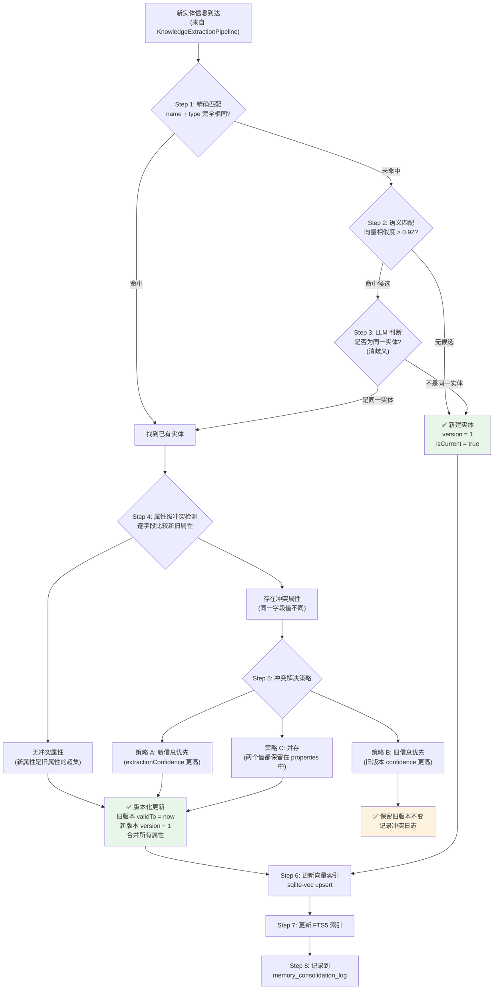
```mermaid
flowchart TD
    A["新实体信息到达<br/>(来自 KnowledgeExtractionPipeline)"] --> B{"Step 1: 精确匹配<br/>name + type 完全相同?"}

    B -->|"命中"| C["找到已有实体"]
    B -->|"未命中"| D{"Step 2: 语义匹配<br/>向量相似度 > 0.92?"}

    D -->|"命中候选"| E{"Step 3: LLM 判断<br/>是否为同一实体?<br/>(消歧义)"}
    D -->|"无候选"| F["✅ 新建实体<br/>version = 1<br/>isCurrent = true"]

    E -->|"是同一实体"| C
    E -->|"不是同一实体"| F

    C --> G{"Step 4: 属性级冲突检测<br/>逐字段比较新旧属性"}

    G --> H["无冲突属性<br/>(新属性是旧属性的超集)"]
    G --> I["存在冲突属性<br/>(同一字段值不同)"]

    H --> J["✅ 版本化更新<br/>旧版本 validTo = now<br/>新版本 version + 1<br/>合并所有属性"]

    I --> K{"Step 5: 冲突解决策略"}
    K --> K1["策略 A: 新信息优先<br/>(extractionConfidence 更高)"]
    K --> K2["策略 B: 旧信息优先<br/>(旧版本 confidence 更高)"]
    K --> K3["策略 C: 并存<br/>(两个值都保留在 properties 中)"]

    K1 --> J
    K2 --> L["✅ 保留旧版本不变<br/>记录冲突日志"]
    K3 --> J

    J --> M["Step 6: 更新向量索引<br/>sqlite-vec upsert"]
    F --> M
    M --> N["Step 7: 更新 FTS5 索引"]
    N --> O["Step 8: 记录到<br/>memory_consolidation_log"]

    style F fill:#e8f5e9
    style J fill:#e8f5e9
    style L fill:#fff3e0
```

#### 冲突检测器

```java
package com.lifepilot.memory.semantic;

import org.slf4j.Logger;
import org.slf4j.LoggerFactory;
import org.springframework.stereotype.Component;

import java.util.List;
import java.util.Optional;

/**
 * 冲突检测器 — 判断新实体是否与已有实体冲突。
 *
 * <p>三级匹配策略：
 * <ol>
 *   <li>精确匹配：name + type 完全相同 → 确定是同一实体</li>
 *   <li>语义匹配：向量相似度 > 0.92 → 候选实体</li>
 *   <li>LLM 消歧义：对候选实体调用 LLM 判断是否为同一实体</li>
 * </ol></p>
 *
 * <p>阈值选择依据：
 * <ul>
 *   <li>0.92 是经验值，在"张总"/"张总监"这类近似名称上有较好的召回率</li>
 *   <li>过低（如 0.8）会导致误匹配（"张总" 匹配到 "李总"）</li>
 *   <li>过高（如 0.98）会导致漏匹配（"张总" 匹配不到 "张总监"）</li>
 * </ul></p>
 */
@Component
public class ConflictDetector {

    private static final Logger log = LoggerFactory.getLogger(ConflictDetector.class);
    private static final float SEMANTIC_MATCH_THRESHOLD = 0.92f;

    private final SemanticMemoryRepository repository;
    private final VectorSearcher vectorSearcher;
    private final LlmRouter llmRouter;

    public ConflictDetector(SemanticMemoryRepository repository,
                            VectorSearcher vectorSearcher,
                            LlmRouter llmRouter) {
        this.repository = repository;
        this.vectorSearcher = vectorSearcher;
        this.llmRouter = llmRouter;
    }

    /**
     * 检测新实体是否与已有实体冲突。
     *
     * @param newEntity 新提取的实体信息
     * @return 匹配到的已有实体（如果存在）
     */
    public Optional<TemporalEntity> detectConflict(TemporalEntity newEntity) {
        // Step 1: 精确匹配
        var exactMatch = repository.findCurrentByNameAndType(
                newEntity.name(), newEntity.type());
        if (exactMatch.isPresent()) {
            log.debug("精确匹配命中: name={}, type={}", newEntity.name(), newEntity.type());
            return exactMatch;
        }

        // Step 2: 语义匹配
        String searchText = newEntity.name() + " " + newEntity.description();
        var candidates = vectorSearcher.searchEntities(
                searchText, 5, SEMANTIC_MATCH_THRESHOLD);

        if (candidates.isEmpty()) {
            log.debug("语义匹配无候选: name={}", newEntity.name());
            return Optional.empty();
        }

        // Step 3: LLM 消歧义（仅对 Top-1 候选）
        var topCandidate = candidates.getFirst();
        boolean isSameEntity = llmRouter.callForBoolean(
                LlmScene.ENTITY_DISAMBIGUATION,
                buildDisambiguationPrompt(newEntity, topCandidate));

        if (isSameEntity) {
            log.info("LLM 消歧义确认同一实体: new={}, existing={}",
                    newEntity.name(), topCandidate.name());
            return Optional.of(topCandidate);
        }

        log.debug("LLM 消歧义判定为不同实体: new={}, candidate={}",
                newEntity.name(), topCandidate.name());
        return Optional.empty();
    }

    /**
     * 构建消歧义提示词。
     */
    private String buildDisambiguationPrompt(TemporalEntity newEntity,
                                              TemporalEntity existing) {
        return """
                请判断以下两个实体是否指同一个对象。只回答 "是" 或 "否"。

                实体 A（新提取）：
                - 名称：%s
                - 类型：%s
                - 描述：%s

                实体 B（已有）：
                - 名称：%s
                - 类型：%s
                - 描述：%s

                它们是同一个实体吗？
                """.formatted(
                newEntity.name(), newEntity.type(), newEntity.description(),
                existing.name(), existing.type(), existing.description());
    }
}
```

#### 版本合并策略

```java
package com.lifepilot.memory.semantic;

import org.slf4j.Logger;
import org.slf4j.LoggerFactory;
import org.springframework.stereotype.Component;

import java.time.Instant;
import java.util.HashMap;
import java.util.Map;
import java.util.UUID;

/**
 * 版本合并器 — 将新实体信息与已有实体合并，生成新版本。
 *
 * <p>合并策略（属性级）：
 * <ul>
 *   <li><b>新属性</b>：直接添加到新版本</li>
 *   <li><b>无冲突属性</b>：保留已有值</li>
 *   <li><b>冲突属性</b>：根据置信度决定保留哪个值</li>
 * </ul></p>
 *
 * <p>合并结果：
 * <ul>
 *   <li>旧版本：{@code isCurrent = false}，{@code validTo = now}</li>
 *   <li>新版本：{@code isCurrent = true}，{@code version = old.version + 1}</li>
 * </ul></p>
 */
@Component
public class VersionMerger {

    private static final Logger log = LoggerFactory.getLogger(VersionMerger.class);

    /**
     * 合并结果 — 包含新版本实体和冲突详情。
     *
     * @param mergedEntity    合并后的新版本实体
     * @param conflicts       冲突字段列表（字段名 → 冲突详情）
     * @param isNewVersion    是否创建了新版本（如果无任何变化则为 false）
     */
    public record MergeResult(
            TemporalEntity mergedEntity,
            Map<String, ConflictDetail> conflicts,
            boolean isNewVersion
    ) {}

    /**
     * 冲突详情。
     *
     * @param fieldName 冲突字段名
     * @param oldValue  旧值
     * @param newValue  新值
     * @param resolution 解决方式：KEEP_NEW / KEEP_OLD / KEEP_BOTH
     */
    public record ConflictDetail(
            String fieldName,
            Object oldValue,
            Object newValue,
            ConflictResolution resolution
    ) {}

    /** 冲突解决方式。 */
    public enum ConflictResolution {
        /** 保留新值（新信息置信度更高）。 */
        KEEP_NEW,
        /** 保留旧值（旧信息置信度更高）。 */
        KEEP_OLD,
        /** 两个值都保留（存储为数组）。 */
        KEEP_BOTH
    }

    /**
     * 合并新实体信息到已有实体，生成新版本。
     *
     * @param existing       已有实体（当前版本）
     * @param incoming       新提取的实体信息
     * @param conversationId 来源对话 ID
     * @return 合并结果
     */
    public MergeResult merge(TemporalEntity existing, TemporalEntity incoming,
                             String conversationId) {
        var now = Instant.now();
        var conflicts = new HashMap<String, ConflictDetail>();

        // 合并描述：如果新描述更详细（更长），使用新描述
        String mergedDescription = existing.description();
        if (incoming.description() != null
                && incoming.description().length() > existing.description().length()) {
            mergedDescription = incoming.description();
        }

        // 合并属性（属性级）
        var mergedProperties = mergeProperties(
                existing.properties(), incoming.properties(),
                existing.extractionConfidence(), incoming.extractionConfidence(),
                conflicts);

        // 如果没有任何变化，不创建新版本
        if (conflicts.isEmpty()
                && mergedDescription.equals(existing.description())
                && mergedProperties.equals(existing.properties())) {
            log.debug("实体无变化，跳过版本更新: name={}", existing.name());
            return new MergeResult(existing, Map.of(), false);
        }

        // 计算新的重要度（取两者较高值）
        float mergedImportance = Math.max(
                existing.importanceScore(), incoming.importanceScore());

        // 创建新版本
        var newVersion = new TemporalEntity(
                UUID.randomUUID().toString(),
                existing.type(),
                existing.name(),
                mergedDescription,
                mergedProperties,
                existing.version() + 1,
                true,                           // isCurrent = true
                now,                            // validFrom = now
                null,                           // validTo = null（当前有效）
                conversationId,
                incoming.extractionConfidence(),
                mergedImportance,
                existing.accessCount(),         // 继承访问计数
                existing.lastAccessedAt(),      // 继承最后访问时间
                now,
                now);

        log.info("实体版本合并: name={}, v{} → v{}, 冲突数={}",
                existing.name(), existing.version(), newVersion.version(),
                conflicts.size());

        return new MergeResult(newVersion, Map.copyOf(conflicts), true);
    }

    /**
     * 属性级合并 — 逐字段比较并合并属性。
     */
    private Map<String, Object> mergeProperties(
            Map<String, Object> oldProps, Map<String, Object> newProps,
            float oldConfidence, float newConfidence,
            Map<String, ConflictDetail> conflicts) {

        var merged = new HashMap<>(oldProps);

        for (var entry : newProps.entrySet()) {
            String key = entry.getKey();
            Object newValue = entry.getValue();
            Object oldValue = oldProps.get(key);

            if (oldValue == null) {
                // 新属性：直接添加
                merged.put(key, newValue);
            } else if (!oldValue.equals(newValue)) {
                // 冲突属性：根据置信度决定
                ConflictResolution resolution;
                if (newConfidence > oldConfidence) {
                    resolution = ConflictResolution.KEEP_NEW;
                    merged.put(key, newValue);
                } else if (newConfidence < oldConfidence) {
                    resolution = ConflictResolution.KEEP_OLD;
                    // 保留旧值，不修改 merged
                } else {
                    resolution = ConflictResolution.KEEP_BOTH;
                    // 置信度相同，保留两个值
                    merged.put(key, java.util.List.of(oldValue, newValue));
                }

                conflicts.put(key, new ConflictDetail(
                        key, oldValue, newValue, resolution));
            }
            // 无冲突属性（值相同）：保留不变
        }

        return Map.copyOf(merged);
    }
}
```

### 5.5 SemanticMemory 服务

```java
package com.lifepilot.memory.semantic;

import com.lifepilot.memory.config.MemoryProperties;
import com.lifepilot.memory.retrieval.VectorSearcher;
import org.slf4j.Logger;
import org.slf4j.LoggerFactory;
import org.springframework.jdbc.core.JdbcTemplate;
import org.springframework.stereotype.Service;
import org.springframework.transaction.annotation.Transactional;

import java.time.Instant;
import java.util.List;
import java.util.Map;
import java.util.Optional;
import java.util.UUID;

/**
 * L3 语义记忆服务 — 管理时序知识图谱的实体和关系。
 *
 * <p>核心职责：
 * <ul>
 *   <li>版本感知的实体 CRUD（每次更新创建新版本）</li>
 *   <li>冲突检测与版本化合并</li>
 *   <li>时间旅行查询（查询任意时间点的实体状态）</li>
 *   <li>图遍历（沿关系边扩展 N 跳）</li>
 *   <li>访问计数更新（用于 LRU 遗忘策略）</li>
 * </ul></p>
 *
 * <p>与 sqlite-vec 的集成：实体的向量索引由 {@link VectorSearcher} 管理，
 * 本服务负责在实体创建/更新时触发向量化。</p>
 */
@Service
public class SemanticMemory {

    private static final Logger log = LoggerFactory.getLogger(SemanticMemory.class);

    private final JdbcTemplate jdbc;
    private final ConflictDetector conflictDetector;
    private final VersionMerger versionMerger;
    private final VectorSearcher vectorSearcher;
    private final MemoryProperties properties;

    public SemanticMemory(JdbcTemplate jdbc,
                          ConflictDetector conflictDetector,
                          VersionMerger versionMerger,
                          VectorSearcher vectorSearcher,
                          MemoryProperties properties) {
        this.jdbc = jdbc;
        this.conflictDetector = conflictDetector;
        this.versionMerger = versionMerger;
        this.vectorSearcher = vectorSearcher;
        this.properties = properties;
    }

    /**
     * 版本感知的实体 upsert — 自动检测冲突并合并。
     *
     * <p>完整流程：
     * <ol>
     *   <li>冲突检测（精确匹配 → 语义匹配 → LLM 消歧义）</li>
     *   <li>如果找到已有实体：版本化合并（属性级冲突解决）</li>
     *   <li>如果未找到：创建新实体（version = 1）</li>
     *   <li>更新向量索引</li>
     *   <li>记录操作日志</li>
     * </ol></p>
     *
     * @param incoming       新提取的实体信息
     * @param conversationId 来源对话 ID
     * @return 最终的实体（新建或合并后的新版本）
     */
    @Transactional
    public TemporalEntity upsertWithConflictDetection(TemporalEntity incoming,
                                                       String conversationId) {
        // Step 1: 冲突检测
        var existingOpt = conflictDetector.detectConflict(incoming);

        if (existingOpt.isPresent()) {
            var existing = existingOpt.get();

            // Step 2: 版本化合并
            var mergeResult = versionMerger.merge(existing, incoming, conversationId);

            if (!mergeResult.isNewVersion()) {
                return existing; // 无变化，返回已有实体
            }

            // 关闭旧版本
            closeVersion(existing);

            // 插入新版本
            insertEntity(mergeResult.mergedEntity());

            // 记录冲突日志
            if (!mergeResult.conflicts().isEmpty()) {
                logConflicts(existing.name(), mergeResult.conflicts());
            }

            return mergeResult.mergedEntity();
        } else {
            // Step 3: 新建实体
            var newEntity = new TemporalEntity(
                    UUID.randomUUID().toString(),
                    incoming.type(),
                    incoming.name(),
                    incoming.description(),
                    incoming.properties(),
                    1,                              // version = 1
                    true,                           // isCurrent = true
                    Instant.now(),                  // validFrom = now
                    null,                           // validTo = null
                    conversationId,
                    incoming.extractionConfidence(),
                    incoming.importanceScore(),
                    0,                              // accessCount = 0
                    null,                           // lastAccessedAt = null
                    Instant.now(),
                    Instant.now());

            insertEntity(newEntity);

            log.info("新建语义实体: name={}, type={}, confidence={}",
                    newEntity.name(), newEntity.type(), newEntity.extractionConfidence());

            return newEntity;
        }
    }

    /**
     * 时间旅行查询 — 查询指定时间点的所有有效实体。
     *
     * <p>返回在指定时间点 {@code validFrom <= point < validTo} 的实体版本。</p>
     *
     * @param point 查询时间点
     * @return 该时间点有效的所有实体
     */
    public List<TemporalEntity> queryAtTime(Instant point) {
        return jdbc.query("""
                SELECT * FROM temporal_entities
                WHERE valid_from <= ?
                  AND (valid_to IS NULL OR valid_to > ?)
                ORDER BY name, type
                """,
                this::mapEntity,
                point.toString(), point.toString());
    }

    /**
     * 查询指定实体的完整变更历史。
     *
     * @param name 实体名称
     * @param type 实体类型
     * @return 所有版本（按版本号升序）
     */
    public List<TemporalEntity> getChangeHistory(String name, EntityType type) {
        return jdbc.query("""
                SELECT * FROM temporal_entities
                WHERE name = ? AND type = ?
                ORDER BY version ASC
                """,
                this::mapEntity,
                name, type.name());
    }

    /**
     * 图遍历 — 从指定实体出发，沿关系边扩展 N 跳。
     *
     * <p>使用 SQLite 递归 CTE 实现，只沿当前有效的关系边遍历。
     * 返回的实体按跳数排序（近的在前）。</p>
     *
     * @param entityId 起始实体 ID
     * @param maxDepth 最大跳数（建议 ≤ 3，避免结果爆炸）
     * @return 关联实体列表（包含路径信息）
     */
    public List<TemporalEntity> findRelated(String entityId, int maxDepth) {
        // 更新起始实体的访问计数
        incrementAccessCount(entityId);

        return jdbc.query("""
                WITH RECURSIVE graph_walk AS (
                    SELECT e.id, e.name, e.type, 0 AS depth
                    FROM temporal_entities e
                    WHERE e.id = ? AND e.is_current = 1

                    UNION ALL

                    SELECT e2.id, e2.name, e2.type, gw.depth + 1
                    FROM graph_walk gw
                    JOIN temporal_relations r
                        ON (r.source_entity_id = gw.id OR r.target_entity_id = gw.id)
                        AND r.valid_to IS NULL
                    JOIN temporal_entities e2
                        ON e2.id = CASE
                            WHEN r.source_entity_id = gw.id THEN r.target_entity_id
                            ELSE r.source_entity_id
                        END
                        AND e2.is_current = 1
                    WHERE gw.depth < ?
                )
                SELECT DISTINCT te.*
                FROM graph_walk gw
                JOIN temporal_entities te ON te.id = gw.id
                WHERE gw.id != ?
                ORDER BY gw.depth
                """,
                this::mapEntity,
                entityId, maxDepth, entityId);
    }

    /**
     * 查找当前有效的指定名称和类型的实体。
     */
    public Optional<TemporalEntity> findCurrentByNameAndType(String name, EntityType type) {
        var results = jdbc.query("""
                SELECT * FROM temporal_entities
                WHERE name = ? AND type = ? AND is_current = 1
                LIMIT 1
                """,
                this::mapEntity,
                name, type.name());
        return results.isEmpty() ? Optional.empty() : Optional.of(results.getFirst());
    }

    /**
     * 查找所有当前有效的实体（用于遗忘引擎扫描）。
     */
    public List<TemporalEntity> findAllCurrent() {
        return jdbc.query("""
                SELECT * FROM temporal_entities
                WHERE is_current = 1
                ORDER BY importance_score ASC, access_count ASC
                """,
                this::mapEntity);
    }

    /**
     * 归档实体（软删除）— 将实体标记为非当前版本。
     *
     * <p>归档不是物理删除，而是将 {@code is_current = 0}，{@code valid_to = now}。
     * 归档后的实体仍可通过时间旅行查询访问。</p>
     */
    @Transactional
    public void archive(TemporalEntity entity) {
        closeVersion(entity);
        // 同时归档相关的关系
        jdbc.update("""
                UPDATE temporal_relations
                SET valid_to = ?
                WHERE (source_entity_id = ? OR target_entity_id = ?)
                  AND valid_to IS NULL
                """,
                Instant.now().toString(), entity.id(), entity.id());

        log.info("语义实体归档: name={}, type={}, version={}",
                entity.name(), entity.type(), entity.version());
    }

    /**
     * 增加实体的访问计数（每次检索时调用）。
     */
    public void incrementAccessCount(String entityId) {
        jdbc.update("""
                UPDATE temporal_entities
                SET access_count = access_count + 1,
                    last_accessed_at = ?,
                    updated_at = ?
                WHERE id = ?
                """,
                Instant.now().toString(), Instant.now().toString(), entityId);
    }

    // ═══ 私有方法 ═══

    /** 关闭实体版本（设置 validTo 和 isCurrent）。 */
    private void closeVersion(TemporalEntity entity) {
        jdbc.update("""
                UPDATE temporal_entities
                SET is_current = 0, valid_to = ?, updated_at = ?
                WHERE id = ?
                """,
                Instant.now().toString(), Instant.now().toString(), entity.id());
    }

    /** 插入新实体。 */
    private void insertEntity(TemporalEntity entity) {
        jdbc.update("""
                INSERT INTO temporal_entities (
                    id, type, name, description, properties_json,
                    version, is_current, valid_from, valid_to,
                    source_conversation_id, extraction_confidence,
                    importance_score, access_count, last_accessed_at,
                    created_at, updated_at
                ) VALUES (?, ?, ?, ?, ?, ?, ?, ?, ?, ?, ?, ?, ?, ?, ?, ?)
                """,
                entity.id(), entity.type().name(), entity.name(),
                entity.description(), serializeProperties(entity.properties()),
                entity.version(), entity.isCurrent() ? 1 : 0,
                entity.validFrom().toString(),
                entity.validTo() != null ? entity.validTo().toString() : null,
                entity.sourceConversationId(), entity.extractionConfidence(),
                entity.importanceScore(), entity.accessCount(),
                entity.lastAccessedAt() != null ? entity.lastAccessedAt().toString() : null,
                entity.createdAt().toString(), entity.updatedAt().toString());
    }

    /** 记录冲突日志。 */
    private void logConflicts(String entityName,
                              Map<String, VersionMerger.ConflictDetail> conflicts) {
        for (var entry : conflicts.entrySet()) {
            var detail = entry.getValue();
            log.info("实体属性冲突: entity={}, field={}, old={}, new={}, resolution={}",
                    entityName, detail.fieldName(),
                    detail.oldValue(), detail.newValue(), detail.resolution());
        }
    }

    /** 序列化属性 Map 为 JSON 字符串。 */
    private String serializeProperties(Map<String, Object> properties) {
        // 实际实现使用 Jackson ObjectMapper
        try {
            return new com.fasterxml.jackson.databind.ObjectMapper()
                    .writeValueAsString(properties);
        } catch (Exception e) {
            return "{}";
        }
    }

    /** ResultSet → TemporalEntity 映射。 */
    @SuppressWarnings("unchecked")
    private TemporalEntity mapEntity(java.sql.ResultSet rs, int rowNum)
            throws java.sql.SQLException {
        Map<String, Object> props;
        try {
            String json = rs.getString("properties_json");
            props = json != null
                    ? new com.fasterxml.jackson.databind.ObjectMapper()
                            .readValue(json, Map.class)
                    : Map.of();
        } catch (Exception e) {
            props = Map.of();
        }

        String lastAccessed = rs.getString("last_accessed_at");
        String validTo = rs.getString("valid_to");

        return new TemporalEntity(
                rs.getString("id"),
                EntityType.valueOf(rs.getString("type")),
                rs.getString("name"),
                rs.getString("description"),
                props,
                rs.getInt("version"),
                rs.getInt("is_current") == 1,
                Instant.parse(rs.getString("valid_from")),
                validTo != null ? Instant.parse(validTo) : null,
                rs.getString("source_conversation_id"),
                rs.getFloat("extraction_confidence"),
                rs.getFloat("importance_score"),
                rs.getInt("access_count"),
                lastAccessed != null ? Instant.parse(lastAccessed) : null,
                Instant.parse(rs.getString("created_at")),
                Instant.parse(rs.getString("updated_at")));
    }
}
```

### 5.6 sqlite-vec 向量索引集成

语义记忆的向量检索能力由 sqlite-vec 扩展提供。每个实体在创建或更新时，都会将其文本表示（`name + description + properties`）向量化后存入 `vec0` 虚拟表。

#### 向量表 Schema

```sql
-- Flyway 迁移脚本: V3__semantic_memory_vectors.sql
-- 注意：此脚本在向量数据库（vectors.db）上执行，非主数据库

-- 实体向量索引表（sqlite-vec vec0 虚拟表）
-- 维度取决于 Embedding 模型：
--   - text-embedding-3-small: 1536 维
--   - bge-m3 (本地 Ollama): 1024 维
--   - 配置项: lifepilot.memory.embedding-dimensions
CREATE VIRTUAL TABLE IF NOT EXISTS entity_embeddings USING vec0(
    entity_id TEXT PRIMARY KEY,       -- 关联 temporal_entities.id
    embedding FLOAT[1024]             -- 默认 1024 维（可配置）
);

-- 文档分块向量索引表（知识库使用）
CREATE VIRTUAL TABLE IF NOT EXISTS chunk_embeddings USING vec0(
    chunk_id TEXT PRIMARY KEY,        -- 关联 document_chunks.id
    embedding FLOAT[1024]
);
```

#### VectorSearcher 服务

```java
package com.lifepilot.memory.retrieval;

import com.lifepilot.llm.LlmRouter;
import com.lifepilot.memory.semantic.TemporalEntity;
import org.slf4j.Logger;
import org.slf4j.LoggerFactory;
import org.springframework.beans.factory.annotation.Qualifier;
import org.springframework.jdbc.core.JdbcTemplate;
import org.springframework.stereotype.Component;

import java.util.List;

/**
 * 向量语义检索器 — 基于 sqlite-vec 的实体向量检索。
 *
 * <p>检索流程：
 * <ol>
 *   <li>将查询文本通过 Embedding 模型转换为向量</li>
 *   <li>在 sqlite-vec 的 {@code entity_embeddings} 表中执行 KNN 搜索</li>
 *   <li>通过 {@code entity_id} 关联回主数据库的 {@code temporal_entities} 表</li>
 *   <li>返回带相似度得分的实体列表</li>
 * </ol></p>
 *
 * <p>降级策略：如果 sqlite-vec 扩展加载失败，降级为 JVM 内暴力搜索
 * （遍历所有实体向量计算余弦相似度）。性能较差但功能等价。</p>
 */
@Component
public class VectorSearcher {

    private static final Logger log = LoggerFactory.getLogger(VectorSearcher.class);

    private final JdbcTemplate vectorJdbc;  // 向量数据库连接
    private final JdbcTemplate mainJdbc;    // 主数据库连接
    private final LlmRouter llmRouter;
    private final boolean vecExtensionLoaded;

    public VectorSearcher(@Qualifier("vectorJdbcTemplate") JdbcTemplate vectorJdbc,
                          JdbcTemplate mainJdbc,
                          LlmRouter llmRouter,
                          SqliteVecLoader vecLoader) {
        this.vectorJdbc = vectorJdbc;
        this.mainJdbc = mainJdbc;
        this.llmRouter = llmRouter;
        this.vecExtensionLoaded = vecLoader.isLoaded();
    }

    /**
     * 向量语义检索实体。
     *
     * @param queryText 查询文本
     * @param topK      返回结果数量
     * @param threshold 最低相似度阈值 [0.0, 1.0]
     * @return 匹配的实体列表（按相似度降序）
     */
    public List<VectorSearchResult> searchEntities(String queryText, int topK,
                                                    float threshold) {
        if (!vecExtensionLoaded) {
            log.debug("sqlite-vec 未加载，降级为 JVM 暴力搜索");
            return bruteForceSearch(queryText, topK, threshold);
        }

        try {
            // Step 1: 查询文本 → 向量
            float[] queryVector = llmRouter.embed(queryText);

            // Step 2: sqlite-vec KNN 搜索
            // vec_distance_cosine 返回余弦距离（0 = 完全相同，2 = 完全相反）
            // 转换为相似度：similarity = 1 - distance / 2
            var results = vectorJdbc.query("""
                    SELECT entity_id,
                           vec_distance_cosine(embedding, ?) AS distance
                    FROM entity_embeddings
                    WHERE embedding MATCH ?
                      AND k = ?
                    ORDER BY distance ASC
                    """,
                    (rs, _) -> new VectorSearchResult(
                            rs.getString("entity_id"),
                            1.0f - rs.getFloat("distance") / 2.0f),
                    serializeVector(queryVector),
                    serializeVector(queryVector),
                    topK * 2);  // 多取一些，后续按阈值过滤

            // Step 3: 按阈值过滤并关联实体详情
            return results.stream()
                    .filter(r -> r.similarity() >= threshold)
                    .limit(topK)
                    .toList();

        } catch (Exception e) {
            log.warn("sqlite-vec 检索失败，降级为 JVM 暴力搜索: {}", e.getMessage());
            return bruteForceSearch(queryText, topK, threshold);
        }
    }

    /**
     * 插入或更新实体向量。
     *
     * @param entityId 实体 ID
     * @param text     实体文本表示（name + description + properties）
     */
    public void upsertEntityVector(String entityId, String text) {
        if (!vecExtensionLoaded) {
            log.debug("sqlite-vec 未加载，跳过向量索引更新: entityId={}", entityId);
            return;
        }

        try {
            float[] vector = llmRouter.embed(text);
            vectorJdbc.update("""
                    INSERT OR REPLACE INTO entity_embeddings (entity_id, embedding)
                    VALUES (?, ?)
                    """,
                    entityId, serializeVector(vector));

            log.debug("实体向量索引更新: entityId={}, dimensions={}", entityId, vector.length);
        } catch (Exception e) {
            // 向量化失败不影响核心功能
            log.warn("实体向量化失败: entityId={}, 原因={}", entityId, e.getMessage());
        }
    }

    /**
     * 删除实体向量。
     */
    public void deleteEntityVector(String entityId) {
        if (!vecExtensionLoaded) return;
        vectorJdbc.update("DELETE FROM entity_embeddings WHERE entity_id = ?", entityId);
    }

    /**
     * JVM 暴力搜索降级方案。
     * 遍历所有实体向量，计算余弦相似度，返回 Top-K。
     */
    private List<VectorSearchResult> bruteForceSearch(String queryText, int topK,
                                                       float threshold) {
        // 降级实现：从主数据库加载所有当前实体，
        // 用 LLM 计算查询文本与每个实体文本的相似度
        // 性能较差，但保证功能可用
        log.debug("执行 JVM 暴力搜索: query={}, topK={}", queryText, topK);

        float[] queryVector = llmRouter.embed(queryText);
        var allEntities = mainJdbc.queryForList("""
                SELECT id, name, description FROM temporal_entities
                WHERE is_current = 1
                """);

        return allEntities.stream()
                .map(row -> {
                    String text = row.get("name") + " " + row.get("description");
                    float[] entityVector = llmRouter.embed(text);
                    float similarity = cosineSimilarity(queryVector, entityVector);
                    return new VectorSearchResult((String) row.get("id"), similarity);
                })
                .filter(r -> r.similarity() >= threshold)
                .sorted((a, b) -> Float.compare(b.similarity(), a.similarity()))
                .limit(topK)
                .toList();
    }

    /** 计算两个向量的余弦相似度。 */
    private float cosineSimilarity(float[] a, float[] b) {
        float dotProduct = 0, normA = 0, normB = 0;
        for (int i = 0; i < a.length; i++) {
            dotProduct += a[i] * b[i];
            normA += a[i] * a[i];
            normB += b[i] * b[i];
        }
        return (float) (dotProduct / (Math.sqrt(normA) * Math.sqrt(normB)));
    }

    /** 将 float[] 序列化为 sqlite-vec 可接受的格式。 */
    private byte[] serializeVector(float[] vector) {
        var buffer = java.nio.ByteBuffer.allocate(vector.length * 4)
                .order(java.nio.ByteOrder.LITTLE_ENDIAN);
        for (float v : vector) {
            buffer.putFloat(v);
        }
        return buffer.array();
    }
}

/**
 * 向量检索结果。
 *
 * @param entityId   实体 ID
 * @param similarity 余弦相似度 [0.0, 1.0]
 */
public record VectorSearchResult(
        String entityId,
        float similarity
) {}
```

### 5.7 ER 图：时序知识图谱存储模型

以下 ER 图展示了语义记忆在数据库层面的完整存储结构，包括实体表、关系表、向量索引表以及与其他模块的关联：

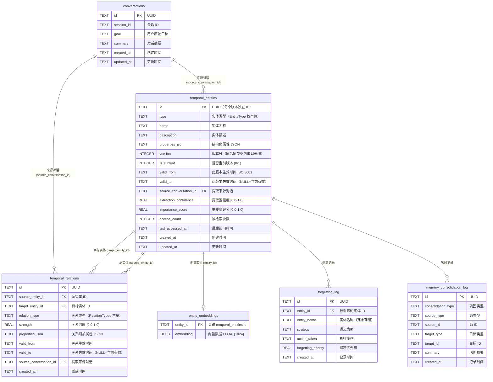
```mermaid
erDiagram
    temporal_entities ||--o{ temporal_relations : "源实体 (source_entity_id)"
    temporal_entities ||--o{ temporal_relations : "目标实体 (target_entity_id)"
    temporal_entities ||--o| entity_embeddings : "向量索引 (entity_id)"
    conversations ||--o{ temporal_entities : "来源对话 (source_conversation_id)"
    conversations ||--o{ temporal_relations : "来源对话 (source_conversation_id)"

    temporal_entities {
        TEXT id PK "UUID（每个版本独立 ID）"
        TEXT type "实体类型（EntityType 枚举值）"
        TEXT name "实体名称"
        TEXT description "实体描述"
        TEXT properties_json "结构化属性 JSON"
        INTEGER version "版本号（同名同类型内单调递增）"
        INTEGER is_current "是否当前版本 (0/1)"
        TEXT valid_from "此版本生效时间 ISO 8601"
        TEXT valid_to "此版本失效时间（NULL=当前有效）"
        TEXT source_conversation_id FK "提取来源对话"
        REAL extraction_confidence "提取置信度 [0.0-1.0]"
        REAL importance_score "重要度评分 [0.0-1.0]"
        INTEGER access_count "被检索次数"
        TEXT last_accessed_at "最后访问时间"
        TEXT created_at "创建时间"
        TEXT updated_at "更新时间"
    }

    temporal_relations {
        TEXT id PK "UUID"
        TEXT source_entity_id FK "源实体 ID"
        TEXT target_entity_id FK "目标实体 ID"
        TEXT relation_type "关系类型（RelationTypes 常量）"
        REAL strength "关系强度 [0.0-1.0]"
        TEXT properties_json "关系附加属性 JSON"
        TEXT valid_from "关系生效时间"
        TEXT valid_to "关系失效时间（NULL=当前有效）"
        TEXT source_conversation_id FK "提取来源对话"
        TEXT created_at "创建时间"
    }

    entity_embeddings {
        TEXT entity_id PK "关联 temporal_entities.id"
        BLOB embedding "向量数据 FLOAT[1024]"
    }

    conversations {
        TEXT id PK "UUID"
        TEXT session_id "会话 ID"
        TEXT goal "用户原始目标"
        TEXT summary "对话摘要"
        TEXT created_at "创建时间"
        TEXT updated_at "更新时间"
    }

    forgetting_log {
        TEXT id PK "UUID"
        TEXT entity_id FK "被遗忘的实体 ID"
        TEXT entity_name "实体名称（冗余存储）"
        TEXT strategy "遗忘策略"
        TEXT action_taken "执行操作"
        REAL forgetting_priority "遗忘优先级"
        TEXT created_at "记录时间"
    }

    memory_consolidation_log {
        TEXT id PK "UUID"
        TEXT consolidation_type "巩固类型"
        TEXT source_type "源类型"
        TEXT source_id "源 ID"
        TEXT target_type "目标类型"
        TEXT target_id "目标 ID"
        TEXT summary "巩固摘要"
        TEXT created_at "记录时间"
    }

    temporal_entities ||--o{ forgetting_log : "遗忘记录"
    temporal_entities ||--o{ memory_consolidation_log : "巩固记录"
```

### 5.8 时间旅行查询与图遍历示例

以下是语义记忆支持的典型查询场景，展示时序知识图谱的强大查询能力：

```sql
-- ═══ 场景 1: 时间旅行查询 ═══
-- "2025 年 6 月时，张总的职位是什么？"
SELECT id, name, description,
       json_extract(properties_json, '$.title') AS title,
       version, valid_from, valid_to
FROM temporal_entities
WHERE name = '张总'
  AND type = 'PERSON'
  AND valid_from <= '2025-06-01T00:00:00Z'
  AND (valid_to IS NULL OR valid_to > '2025-06-01T00:00:00Z')
ORDER BY version DESC
LIMIT 1;

-- ═══ 场景 2: 实体变更历史 ═══
-- "张总的职位变更记录"
SELECT version,
       json_extract(properties_json, '$.title') AS title,
       description,
       valid_from,
       valid_to,
       source_conversation_id,
       extraction_confidence
FROM temporal_entities
WHERE name = '张总' AND type = 'PERSON'
ORDER BY version ASC;

-- ═══ 场景 3: 多跳图遍历 ═══
-- "与张总相关的所有实体（最多 2 跳）"
WITH RECURSIVE graph_walk AS (
    -- 起点
    SELECT e.id, e.name, e.type, 0 AS depth,
           e.name AS path
    FROM temporal_entities e
    WHERE e.name = '张总' AND e.type = 'PERSON' AND e.is_current = 1

    UNION ALL

    -- 正向遍历（沿出边）
    SELECT e2.id, e2.name, e2.type, gw.depth + 1,
           gw.path || ' →[' || r.relation_type || ']→ ' || e2.name
    FROM graph_walk gw
    JOIN temporal_relations r ON r.source_entity_id = gw.id AND r.valid_to IS NULL
    JOIN temporal_entities e2 ON e2.id = r.target_entity_id AND e2.is_current = 1
    WHERE gw.depth < 2

    UNION ALL

    -- 反向遍历（沿入边）
    SELECT e2.id, e2.name, e2.type, gw.depth + 1,
           gw.path || ' ←[' || r.relation_type || ']← ' || e2.name
    FROM graph_walk gw
    JOIN temporal_relations r ON r.target_entity_id = gw.id AND r.valid_to IS NULL
    JOIN temporal_entities e2 ON e2.id = r.source_entity_id AND e2.is_current = 1
    WHERE gw.depth < 2
)
SELECT DISTINCT name, type, depth, path
FROM graph_walk
WHERE depth > 0
ORDER BY depth, name;

-- ═══ 场景 4: 按类型统计实体 ═══
-- 知识图谱健康度概览
SELECT type,
       COUNT(*) AS total_versions,
       SUM(CASE WHEN is_current = 1 THEN 1 ELSE 0 END) AS current_count,
       ROUND(AVG(importance_score), 2) AS avg_importance,
       ROUND(AVG(access_count), 1) AS avg_access,
       ROUND(AVG(extraction_confidence), 2) AS avg_confidence
FROM temporal_entities
GROUP BY type
ORDER BY current_count DESC;

-- ═══ 场景 5: 发现孤立实体（无关系连接） ═══
-- 用于遗忘策略——孤立实体可能是低价值的
SELECT e.id, e.name, e.type, e.importance_score, e.access_count
FROM temporal_entities e
LEFT JOIN temporal_relations r1 ON r1.source_entity_id = e.id AND r1.valid_to IS NULL
LEFT JOIN temporal_relations r2 ON r2.target_entity_id = e.id AND r2.valid_to IS NULL
WHERE e.is_current = 1
  AND r1.id IS NULL
  AND r2.id IS NULL
ORDER BY e.importance_score ASC, e.access_count ASC;

-- ═══ 场景 6: 关系强度衰减查询 ═══
-- 查找长时间未被访问的弱关系（遗忘候选）
SELECT r.id, r.relation_type, r.strength,
       e1.name AS source_name, e2.name AS target_name,
       r.valid_from,
       julianday('now') - julianday(r.valid_from) AS age_days
FROM temporal_relations r
JOIN temporal_entities e1 ON e1.id = r.source_entity_id
JOIN temporal_entities e2 ON e2.id = r.target_entity_id
WHERE r.valid_to IS NULL
  AND r.strength < 0.5
  AND julianday('now') - julianday(r.valid_from) > 90
ORDER BY r.strength ASC, age_days DESC;
```

### 5.9 实体生命周期状态图

以下状态图展示了一个实体从创建到最终归档的完整生命周期：

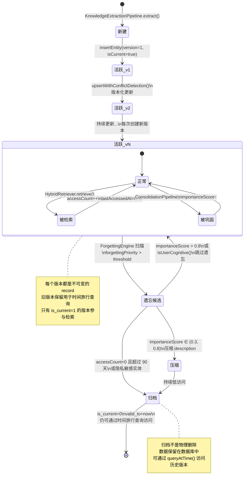
```mermaid
stateDiagram-v2
    [*] --> 新建: KnowledgeExtractionPipeline.extract()

    新建 --> 活跃_v1: insertEntity(version=1, isCurrent=true)

    活跃_v1 --> 活跃_v2: upsertWithConflictDetection()\n版本化更新
    活跃_v2 --> 活跃_vN: 持续更新...\n每次创建新版本

    state 活跃_vN {
        [*] --> 正常
        正常 --> 被检索: HybridRetriever.retrieve()
        被检索 --> 正常: accessCount++\nlastAccessedAt=now
        正常 --> 被巩固: ConsolidationPipeline\nimportanceScore↑
        被巩固 --> 正常
    }

    活跃_vN --> 遗忘候选: ForgettingEngine 扫描\nforgettingPriority > threshold

    遗忘候选 --> 压缩: importanceScore ∈ (0.3, 0.8)\n压缩 description
    遗忘候选 --> 归档: accessCount=0 且超过 90 天\n或隐私敏感实体
    遗忘候选 --> 活跃_vN: importanceScore > 0.8\n或 isUserCognitive()\n跳过遗忘

    压缩 --> 归档: 持续低访问

    归档 --> [*]: is_current=0\nvalid_to=now\n仍可通过时间旅行查询访问

    note right of 活跃_vN
        每个版本都是不可变的 record
        旧版本保留用于时间旅行查询
        只有 is_current=1 的版本参与检索
    end note

    note right of 归档
        归档不是物理删除
        数据保留在数据库中
        可通过 queryAtTime() 访问历史版本
    end note
```


---

## 6. L4 程序记忆 (Procedural Memory)

### 6.1 设计原理

程序记忆（Procedural Memory）在认知科学中对应"知道如何做"（knowing how）的知识——骑自行车、打字、做菜的步骤。与语义记忆（"知道是什么"）不同，程序记忆编码的是**操作序列和行为模式**，一旦形成就能自动化执行，无需每次从头推理。

在 LifePilot 中，L4 程序记忆存储三类知识：

1. **操作模板（ProcedureTemplate）**：从用户成功的多步执行轨迹中提炼出的可复用操作序列。例如"创建会议"模板包含：查日历空闲时间 → 创建日程 → 发送邀请 → 设置提醒。
2. **偏好规则（PreferenceRule）**：从用户行为中学习到的个人偏好。例如"用户偏好在上午处理重要邮件"、"用户习惯用 Markdown 格式记笔记"。
3. **策略模式（StrategyPattern）**：在特定情境下推荐的决策策略。例如"当用户说'帮我安排一下'时，优先查看日历再创建待办"。

> **核心价值：程序记忆让 Agent 从"每次都要想"进化为"记住怎么做"。**
> 这直接减少了 LLM 推理步骤，降低延迟和成本，同时提高执行一致性。

### 6.2 数据模型

#### 6.2.1 ProcedureTemplate — 操作模板

```java
package com.lifepilot.memory.procedural;

import java.time.Instant;
import java.util.List;
import java.util.Map;

/**
 * 操作模板 — 从成功执行轨迹中提炼的可复用多步操作序列。
 *
 * <p>模板的生命周期：
 * <ol>
 *   <li>提炼：{@code EpisodicToProceduralConsolidator} 从 L2 情景记忆中
 *       识别重复出现的成功执行模式，提炼为模板</li>
 *   <li>匹配：{@code IntentMatcher} 根据用户意图的语义相似度匹配最佳模板</li>
 *   <li>执行：Agent 按模板步骤执行，运行时填充变量占位符</li>
 *   <li>演化：根据执行成功/失败反馈更新成功率，低成功率模板自动淘汰</li>
 * </ol></p>
 *
 * @param templateId     模板唯一标识（UUID）
 * @param name           模板名称（中文，如"创建会议"）
 * @param description    模板描述（详细说明模板的用途和适用场景）
 * @param triggerIntent  触发意图（用户表达什么意图时激活此模板）
 * @param steps          执行步骤列表（有序）
 * @param variables      模板变量定义（变量名 → 默认值/描述）
 * @param successRate    成功率 [0.0, 1.0]（基于历史执行统计）
 * @param useCount       使用次数
 * @param lastUsedAt     最后使用时间
 * @param sourceTraceIds 来源执行轨迹 ID 列表（可追溯到原始对话）
 * @param createdAt      创建时间
 * @param updatedAt      最后更新时间
 */
public record ProcedureTemplate(
        String templateId,
        String name,
        String description,
        String triggerIntent,
        List<TemplateStep> steps,
        Map<String, String> variables,
        float successRate,
        int useCount,
        Instant lastUsedAt,
        List<String> sourceTraceIds,
        Instant createdAt,
        Instant updatedAt
) {
    /**
     * 判断模板是否可靠（成功率 ≥ 0.7 且使用次数 ≥ 2）。
     * 只有可靠的模板才会在自动模式下推荐给用户。
     */
    public boolean isReliable() {
        return successRate >= 0.7f && useCount >= 2;
    }

    /**
     * 判断模板是否过时（超过 90 天未使用）。
     * 过时模板在遗忘引擎扫描时可能被归档。
     */
    public boolean isStale() {
        return lastUsedAt != null
                && lastUsedAt.isBefore(Instant.now().minus(java.time.Duration.ofDays(90)));
    }
}
```


#### 6.2.2 TemplateStep — 模板步骤

```java
package com.lifepilot.memory.procedural;

import java.util.Map;

/**
 * 模板步骤 — 操作模板中的单个执行步骤。
 *
 * <p>步骤的参数模板支持 {@code ${variable}} 占位符语法，
 * 在运行时由 Agent 根据上下文填充实际值。</p>
 *
 * <p>示例：创建会议模板的第 2 步
 * <pre>
 * new TemplateStep(
 *     2,
 *     "calendar",
 *     "create-event",
 *     Map.of(
 *         "title", "${meetingTitle}",
 *         "startTime", "${startTime}",
 *         "duration", "${duration}",
 *         "participants", "${participants}"
 *     ),
 *     "创建日历事件",
 *     false
 * )
 * </pre></p>
 *
 * @param stepOrder         步骤序号（从 1 开始）
 * @param toolId            工具 ID（对应 Skill 系统中的工具标识）
 * @param action            工具操作（如 "create-event", "send-message"）
 * @param parameterTemplate 参数模板（支持 ${variable} 占位符）
 * @param description       步骤描述（中文）
 * @param isOptional        是否可选步骤（可选步骤在条件不满足时跳过）
 */
public record TemplateStep(
        int stepOrder,
        String toolId,
        String action,
        Map<String, String> parameterTemplate,
        String description,
        boolean isOptional
) {
    /**
     * 用实际变量值替换参数模板中的占位符。
     *
     * @param variables 变量名 → 实际值的映射
     * @return 填充后的参数映射
     */
    public Map<String, String> resolveParameters(Map<String, String> variables) {
        var resolved = new java.util.HashMap<String, String>();
        parameterTemplate.forEach((key, template) -> {
            String value = template;
            for (var entry : variables.entrySet()) {
                value = value.replace("${" + entry.getKey() + "}", entry.getValue());
            }
            resolved.put(key, value);
        });
        return Map.copyOf(resolved);
    }
}
```

#### 6.2.3 PreferenceRule — 偏好规则

```java
package com.lifepilot.memory.procedural;

import java.time.Instant;

/**
 * 偏好规则 — 从用户行为中学习到的个人偏好。
 *
 * <p>偏好规则按类别组织，常见类别包括：
 * <ul>
 *   <li>{@code scheduling} — 日程安排偏好（如"上午处理重要事务"）</li>
 *   <li>{@code communication} — 沟通偏好（如"正式邮件用敬语"）</li>
 *   <li>{@code formatting} — 格式偏好（如"笔记用 Markdown"）</li>
 *   <li>{@code workflow} — 工作流偏好（如"先查日历再创建待办"）</li>
 * </ul></p>
 *
 * <p>置信度随观察次数增加而提高：
 * <ul>
 *   <li>首次观察：confidence = 0.3（初步推测）</li>
 *   <li>二次确认：confidence = 0.6（较有把握）</li>
 *   <li>三次以上：confidence = 0.8+（高度确信）</li>
 * </ul></p>
 *
 * @param ruleId      规则唯一标识
 * @param category    偏好类别
 * @param key         偏好键（如 "preferred_meeting_time"）
 * @param value       偏好值（如 "上午 10:00-11:00"）
 * @param confidence  置信度 [0.0, 1.0]
 * @param learnedFrom 学习来源（对话 ID 列表，JSON 数组）
 * @param observationCount 观察次数
 * @param createdAt   首次学习时间
 * @param updatedAt   最后更新时间
 */
public record PreferenceRule(
        String ruleId,
        String category,
        String key,
        String value,
        float confidence,
        String learnedFrom,
        int observationCount,
        Instant createdAt,
        Instant updatedAt
) {
    /** 判断偏好是否高置信度（confidence ≥ 0.7）。 */
    public boolean isHighConfidence() {
        return confidence >= 0.7f;
    }
}
```

#### 6.2.4 StrategyPattern — 策略模式

```java
package com.lifepilot.memory.procedural;

import java.time.Instant;

/**
 * 策略模式 — 在特定情境下推荐的决策策略。
 *
 * <p>策略模式编码的是"在什么情况下应该怎么做"的经验知识，
 * 比操作模板更抽象——它不指定具体的工具调用序列，
 * 而是提供高层次的行动建议。</p>
 *
 * <p>示例：
 * <ul>
 *   <li>情境："用户提到紧急任务" → 建议："优先查看当前日程，
 *       取消或推迟低优先级事项，为紧急任务腾出时间"</li>
 *   <li>情境："用户连续工作超过 2 小时" → 建议："提醒用户休息，
 *       建议番茄工作法"</li>
 * </ul></p>
 *
 * @param patternId          模式唯一标识
 * @param situation          情境描述（什么情况下触发）
 * @param recommendedAction  推荐行动（高层次建议）
 * @param successRate        成功率（用户采纳并获得好结果的比例）
 * @param applicationCount   应用次数
 * @param createdAt          创建时间
 */
public record StrategyPattern(
        String patternId,
        String situation,
        String recommendedAction,
        float successRate,
        int applicationCount,
        Instant createdAt
) {}
```


### 6.3 SQL Schema

```sql
-- ============================================================
-- L4 程序记忆表结构
-- ============================================================

-- 操作模板表
CREATE TABLE IF NOT EXISTS procedure_templates (
    template_id     TEXT PRIMARY KEY,                -- UUID
    name            TEXT NOT NULL,                    -- 模板名称（中文）
    description     TEXT NOT NULL,                    -- 模板描述
    trigger_intent  TEXT NOT NULL,                    -- 触发意图文本
    steps_json      TEXT NOT NULL,                    -- 步骤列表 JSON
    variables_json  TEXT NOT NULL DEFAULT '{}',       -- 变量定义 JSON
    success_rate    REAL NOT NULL DEFAULT 0.0,        -- 成功率 [0.0, 1.0]
    use_count       INTEGER NOT NULL DEFAULT 0,       -- 使用次数
    last_used_at    TEXT,                             -- 最后使用时间 ISO 8601
    source_trace_ids_json TEXT NOT NULL DEFAULT '[]', -- 来源轨迹 ID JSON 数组
    created_at      TEXT NOT NULL DEFAULT (datetime('now')),
    updated_at      TEXT NOT NULL DEFAULT (datetime('now'))
);

-- 触发意图全文索引（用于关键词匹配）
CREATE VIRTUAL TABLE IF NOT EXISTS procedure_templates_fts USING fts5(
    name,
    description,
    trigger_intent,
    content='procedure_templates',
    content_rowid='rowid',
    tokenize='unicode61'
);

-- 触发意图向量索引（用于语义匹配）
CREATE VIRTUAL TABLE IF NOT EXISTS procedure_intent_vec USING vec0(
    template_id TEXT PRIMARY KEY,
    intent_embedding FLOAT[768]          -- 意图文本的向量表示
);

-- 偏好规则表
CREATE TABLE IF NOT EXISTS preference_rules (
    rule_id           TEXT PRIMARY KEY,
    category          TEXT NOT NULL,       -- 偏好类别
    key               TEXT NOT NULL,       -- 偏好键
    value             TEXT NOT NULL,       -- 偏好值
    confidence        REAL NOT NULL DEFAULT 0.3,
    learned_from_json TEXT NOT NULL DEFAULT '[]',  -- 学习来源 JSON
    observation_count INTEGER NOT NULL DEFAULT 1,
    created_at        TEXT NOT NULL DEFAULT (datetime('now')),
    updated_at        TEXT NOT NULL DEFAULT (datetime('now')),
    UNIQUE(category, key)                 -- 同一类别下偏好键唯一
);

-- 策略模式表
CREATE TABLE IF NOT EXISTS strategy_patterns (
    pattern_id         TEXT PRIMARY KEY,
    situation          TEXT NOT NULL,      -- 情境描述
    recommended_action TEXT NOT NULL,      -- 推荐行动
    success_rate       REAL NOT NULL DEFAULT 0.0,
    application_count  INTEGER NOT NULL DEFAULT 0,
    created_at         TEXT NOT NULL DEFAULT (datetime('now'))
);

-- 策略情境向量索引（用于情境匹配）
CREATE VIRTUAL TABLE IF NOT EXISTS strategy_situation_vec USING vec0(
    pattern_id TEXT PRIMARY KEY,
    situation_embedding FLOAT[768]
);
```


### 6.4 IntentMatcher — 意图匹配器

意图匹配是程序记忆的核心能力——当用户表达一个意图时，系统需要快速找到最匹配的操作模板。匹配采用**双路策略**：先用向量语义搜索找到语义相近的候选，再用 FTS5 关键词匹配补充精确匹配结果，最后融合排序。

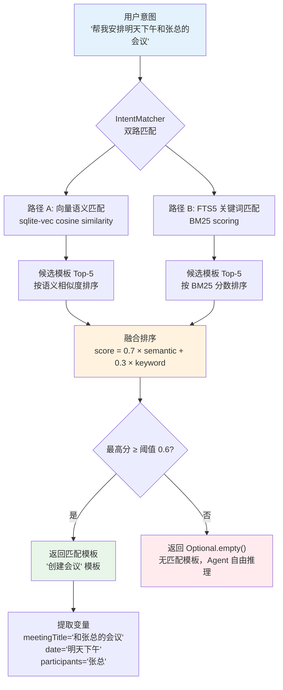
```mermaid
flowchart TD
    A["用户意图<br/>'帮我安排明天下午和张总的会议'"] --> B{"IntentMatcher<br/>双路匹配"}

    B --> C["路径 A: 向量语义匹配<br/>sqlite-vec cosine similarity"]
    B --> D["路径 B: FTS5 关键词匹配<br/>BM25 scoring"]

    C --> E["候选模板 Top-5<br/>按语义相似度排序"]
    D --> F["候选模板 Top-5<br/>按 BM25 分数排序"]

    E --> G["融合排序<br/>score = 0.7 × semantic + 0.3 × keyword"]
    F --> G

    G --> H{"最高分 ≥ 阈值 0.6?"}
    H -->|是| I["返回匹配模板<br/>'创建会议' 模板"]
    H -->|否| J["返回 Optional.empty()<br/>无匹配模板，Agent 自由推理"]

    I --> K["提取变量<br/>meetingTitle='和张总的会议'<br/>date='明天下午'<br/>participants='张总'"]

    style A fill:#e3f2fd
    style G fill:#fff3e0
    style I fill:#e8f5e9
    style J fill:#ffebee
```

```java
package com.lifepilot.memory.procedural;

import com.lifepilot.memory.retrieval.VectorSearcher;
import org.slf4j.Logger;
import org.slf4j.LoggerFactory;
import org.springframework.ai.embedding.EmbeddingModel;
import org.springframework.jdbc.core.JdbcTemplate;
import org.springframework.stereotype.Component;

import java.util.*;
import java.util.concurrent.CompletableFuture;

/**
 * 意图匹配器 — 根据用户意图的语义相似度匹配最佳操作模板。
 *
 * <p>匹配策略：双路并行检索 + 加权融合排序
 * <ul>
 *   <li>路径 A：向量语义匹配（sqlite-vec cosine similarity），权重 0.7</li>
 *   <li>路径 B：FTS5 关键词匹配（BM25 scoring），权重 0.3</li>
 * </ul></p>
 *
 * <p>匹配阈值：融合分数 ≥ 0.6 才视为有效匹配。
 * 低于阈值时返回 {@code Optional.empty()}，Agent 将自由推理而非套用模板。</p>
 */
@Component
public class IntentMatcher {

    private static final Logger log = LoggerFactory.getLogger(IntentMatcher.class);

    /** 语义匹配权重。 */
    private static final float SEMANTIC_WEIGHT = 0.7f;
    /** 关键词匹配权重。 */
    private static final float KEYWORD_WEIGHT = 0.3f;
    /** 匹配阈值——低于此分数视为无匹配。 */
    private static final float MATCH_THRESHOLD = 0.6f;
    /** 每路检索的候选数量。 */
    private static final int TOP_K = 5;

    private final JdbcTemplate jdbc;
    private final EmbeddingModel embeddingModel;

    public IntentMatcher(JdbcTemplate jdbc, EmbeddingModel embeddingModel) {
        this.jdbc = jdbc;
        this.embeddingModel = embeddingModel;
    }

    /**
     * 匹配用户意图到最佳操作模板。
     *
     * <p>使用 Virtual Thread 并行执行向量检索和关键词检索，
     * 然后融合排序返回最佳匹配。</p>
     *
     * @param userIntent 用户意图文本
     * @return 最佳匹配模板，无匹配时返回 Optional.empty()
     */
    public Optional<TemplateMatch> matchTemplate(String userIntent) {
        log.debug("意图匹配开始: intent='{}'", userIntent);

        // 双路并行检索（Virtual Thread）
        var semanticFuture = CompletableFuture.supplyAsync(
                () -> semanticSearch(userIntent), Thread.ofVirtual().factory()::newThread);
        var keywordFuture = CompletableFuture.supplyAsync(
                () -> keywordSearch(userIntent), Thread.ofVirtual().factory()::newThread);

        List<ScoredTemplate> semanticResults = semanticFuture.join();
        List<ScoredTemplate> keywordResults = keywordFuture.join();

        // 融合排序
        Map<String, Float> fusedScores = new HashMap<>();
        for (var r : semanticResults) {
            fusedScores.merge(r.templateId(), r.score() * SEMANTIC_WEIGHT, Float::sum);
        }
        for (var r : keywordResults) {
            fusedScores.merge(r.templateId(), r.score() * KEYWORD_WEIGHT, Float::sum);
        }

        // 找到最高分
        return fusedScores.entrySet().stream()
                .filter(e -> e.getValue() >= MATCH_THRESHOLD)
                .max(Map.Entry.comparingByValue())
                .map(e -> {
                    var template = loadTemplate(e.getKey());
                    log.info("意图匹配成功: intent='{}', template='{}', score={}",
                            userIntent, template.name(), e.getValue());
                    return new TemplateMatch(template, e.getValue());
                });
    }

    /** 向量语义检索：将意图文本向量化，在 procedure_intent_vec 中搜索。 */
    private List<ScoredTemplate> semanticSearch(String intent) {
        float[] embedding = embeddingModel.embed(intent);
        return jdbc.query("""
                SELECT template_id, distance
                FROM procedure_intent_vec
                WHERE intent_embedding MATCH ?
                ORDER BY distance
                LIMIT ?
                """,
                (rs, rowNum) -> new ScoredTemplate(
                        rs.getString("template_id"),
                        1.0f - rs.getFloat("distance")  // 距离转相似度
                ),
                embedding, TOP_K);
    }

    /** FTS5 关键词检索：在 procedure_templates_fts 中搜索。 */
    private List<ScoredTemplate> keywordSearch(String intent) {
        return jdbc.query("""
                SELECT template_id, rank
                FROM procedure_templates_fts
                JOIN procedure_templates ON procedure_templates.rowid = procedure_templates_fts.rowid
                WHERE procedure_templates_fts MATCH ?
                ORDER BY rank
                LIMIT ?
                """,
                (rs, rowNum) -> new ScoredTemplate(
                        rs.getString("template_id"),
                        normalizeRank(rs.getFloat("rank"))
                ),
                intent, TOP_K);
    }

    /** 将 FTS5 rank 归一化到 [0, 1] 区间。 */
    private float normalizeRank(float rank) {
        // FTS5 rank 是负数（越小越好），归一化为正数相似度
        return (float) (1.0 / (1.0 + Math.abs(rank)));
    }

    /** 根据 templateId 加载完整模板。 */
    private ProcedureTemplate loadTemplate(String templateId) {
        // 省略：从 procedure_templates 表加载并反序列化
        throw new UnsupportedOperationException("实现省略");
    }

    /** 带分数的模板引用。 */
    private record ScoredTemplate(String templateId, float score) {}

    /**
     * 模板匹配结果。
     *
     * @param template 匹配到的模板
     * @param score    匹配分数 [0.0, 1.0]
     */
    public record TemplateMatch(ProcedureTemplate template, float score) {}
}
```


### 6.5 ProceduralMemory 服务

`ProceduralMemory` 是 L4 程序记忆的核心服务，统一管理操作模板、偏好规则和策略模式的完整生命周期。

```java
package com.lifepilot.memory.procedural;

import com.fasterxml.jackson.core.type.TypeReference;
import com.fasterxml.jackson.databind.ObjectMapper;
import org.slf4j.Logger;
import org.slf4j.LoggerFactory;
import org.springframework.ai.embedding.EmbeddingModel;
import org.springframework.jdbc.core.JdbcTemplate;
import org.springframework.stereotype.Service;
import org.springframework.transaction.annotation.Transactional;

import java.time.Instant;
import java.util.*;

/**
 * L4 程序记忆服务 — 管理操作模板、偏好规则和策略模式。
 *
 * <p>核心职责：
 * <ul>
 *   <li>操作模板的 CRUD 和意图匹配</li>
 *   <li>执行成功/失败反馈，动态更新模板成功率</li>
 *   <li>偏好规则的学习和查询</li>
 *   <li>模板演化——根据新的成功轨迹优化模板步骤</li>
 * </ul></p>
 *
 * <p>线程安全：所有写操作通过 {@code @Transactional} 保证原子性，
 * 读操作无锁（SQLite WAL 模式支持并发读）。</p>
 */
@Service
public class ProceduralMemory {

    private static final Logger log = LoggerFactory.getLogger(ProceduralMemory.class);

    private final JdbcTemplate jdbc;
    private final IntentMatcher intentMatcher;
    private final EmbeddingModel embeddingModel;
    private final ObjectMapper objectMapper;

    public ProceduralMemory(JdbcTemplate jdbc,
                            IntentMatcher intentMatcher,
                            EmbeddingModel embeddingModel,
                            ObjectMapper objectMapper) {
        this.jdbc = jdbc;
        this.intentMatcher = intentMatcher;
        this.embeddingModel = embeddingModel;
        this.objectMapper = objectMapper;
    }

    /**
     * 匹配用户意图到最佳操作模板。
     *
     * <p>委托给 {@link IntentMatcher} 执行双路匹配，
     * 只返回可靠模板（成功率 ≥ 0.7 且使用次数 ≥ 2）。</p>
     *
     * @param intent 用户意图文本
     * @return 匹配结果，无匹配时返回 Optional.empty()
     */
    public Optional<IntentMatcher.TemplateMatch> matchTemplate(String intent) {
        return intentMatcher.matchTemplate(intent)
                .filter(match -> match.template().isReliable());
    }

    /**
     * 保存新的操作模板。
     *
     * <p>同时更新 FTS5 全文索引和 sqlite-vec 向量索引。</p>
     *
     * @param template 操作模板
     */
    @Transactional
    public void save(ProcedureTemplate template) {
        try {
            String stepsJson = objectMapper.writeValueAsString(template.steps());
            String variablesJson = objectMapper.writeValueAsString(template.variables());
            String sourceTraceIdsJson = objectMapper.writeValueAsString(template.sourceTraceIds());

            jdbc.update("""
                    INSERT INTO procedure_templates
                        (template_id, name, description, trigger_intent,
                         steps_json, variables_json, success_rate, use_count,
                         last_used_at, source_trace_ids_json, created_at, updated_at)
                    VALUES (?, ?, ?, ?, ?, ?, ?, ?, ?, ?, ?, ?)
                    ON CONFLICT(template_id) DO UPDATE SET
                        name = excluded.name,
                        description = excluded.description,
                        trigger_intent = excluded.trigger_intent,
                        steps_json = excluded.steps_json,
                        variables_json = excluded.variables_json,
                        success_rate = excluded.success_rate,
                        use_count = excluded.use_count,
                        last_used_at = excluded.last_used_at,
                        source_trace_ids_json = excluded.source_trace_ids_json,
                        updated_at = excluded.updated_at
                    """,
                    template.templateId(), template.name(), template.description(),
                    template.triggerIntent(), stepsJson, variablesJson,
                    template.successRate(), template.useCount(),
                    template.lastUsedAt() != null ? template.lastUsedAt().toString() : null,
                    sourceTraceIdsJson,
                    template.createdAt().toString(), template.updatedAt().toString());

            // 更新向量索引
            float[] intentEmbedding = embeddingModel.embed(template.triggerIntent());
            jdbc.update("""
                    INSERT INTO procedure_intent_vec (template_id, intent_embedding)
                    VALUES (?, ?)
                    ON CONFLICT(template_id) DO UPDATE SET
                        intent_embedding = excluded.intent_embedding
                    """, template.templateId(), intentEmbedding);

            log.info("操作模板已保存: id={}, name='{}', steps={}",
                    template.templateId(), template.name(), template.steps().size());
        } catch (Exception e) {
            throw new RuntimeException("保存操作模板失败: " + template.name(), e);
        }
    }

    /**
     * 记录模板执行成功。
     *
     * <p>更新成功率公式：
     * {@code newRate = (oldRate × useCount + 1.0) / (useCount + 1)}</p>
     *
     * @param templateId 模板 ID
     */
    @Transactional
    public void recordSuccess(String templateId) {
        jdbc.update("""
                UPDATE procedure_templates SET
                    success_rate = (success_rate * use_count + 1.0) / (use_count + 1),
                    use_count = use_count + 1,
                    last_used_at = datetime('now'),
                    updated_at = datetime('now')
                WHERE template_id = ?
                """, templateId);
        log.info("模板执行成功已记录: templateId={}", templateId);
    }

    /**
     * 记录模板执行失败。
     *
     * <p>更新成功率公式：
     * {@code newRate = (oldRate × useCount + 0.0) / (useCount + 1)}</p>
     *
     * @param templateId 模板 ID
     */
    @Transactional
    public void recordFailure(String templateId) {
        jdbc.update("""
                UPDATE procedure_templates SET
                    success_rate = (success_rate * use_count) / (use_count + 1),
                    use_count = use_count + 1,
                    last_used_at = datetime('now'),
                    updated_at = datetime('now')
                WHERE template_id = ?
                """, templateId);
        log.warn("模板执行失败已记录: templateId={}", templateId);
    }

    /**
     * 获取指定类别的用户偏好规则。
     *
     * <p>只返回高置信度（≥ 0.7）的偏好规则，
     * 低置信度的偏好仍在学习阶段，不应影响 Agent 行为。</p>
     *
     * @param category 偏好类别
     * @return 高置信度偏好规则列表
     */
    public List<PreferenceRule> getPreferences(String category) {
        return jdbc.query("""
                SELECT * FROM preference_rules
                WHERE category = ? AND confidence >= 0.7
                ORDER BY confidence DESC
                """,
                (rs, rowNum) -> new PreferenceRule(
                        rs.getString("rule_id"),
                        rs.getString("category"),
                        rs.getString("key"),
                        rs.getString("value"),
                        rs.getFloat("confidence"),
                        rs.getString("learned_from_json"),
                        rs.getInt("observation_count"),
                        Instant.parse(rs.getString("created_at")),
                        Instant.parse(rs.getString("updated_at"))
                ),
                category);
    }

    /**
     * 学习或更新偏好规则。
     *
     * <p>如果同类别同键的偏好已存在：
     * <ul>
     *   <li>值相同：增加观察次数，提高置信度</li>
     *   <li>值不同：如果新观察的置信度更高，替换旧值；否则保留旧值</li>
     * </ul></p>
     *
     * @param category       偏好类别
     * @param key            偏好键
     * @param value          偏好值
     * @param conversationId 学习来源对话 ID
     */
    @Transactional
    public void learnPreference(String category, String key,
                                String value, String conversationId) {
        var existing = jdbc.query("""
                SELECT * FROM preference_rules WHERE category = ? AND key = ?
                """,
                (rs, rowNum) -> new PreferenceRule(
                        rs.getString("rule_id"), rs.getString("category"),
                        rs.getString("key"), rs.getString("value"),
                        rs.getFloat("confidence"), rs.getString("learned_from_json"),
                        rs.getInt("observation_count"),
                        Instant.parse(rs.getString("created_at")),
                        Instant.parse(rs.getString("updated_at"))
                ),
                category, key);

        if (existing.isEmpty()) {
            // 新偏好：初始置信度 0.3
            jdbc.update("""
                    INSERT INTO preference_rules
                        (rule_id, category, key, value, confidence,
                         learned_from_json, observation_count)
                    VALUES (?, ?, ?, ?, 0.3, ?, 1)
                    """,
                    UUID.randomUUID().toString(), category, key, value,
                    "[\"" + conversationId + "\"]");
            log.info("新偏好规则已学习: category={}, key={}, value='{}'",
                    category, key, value);
        } else {
            var rule = existing.getFirst();
            if (rule.value().equals(value)) {
                // 相同值：增加观察次数，提高置信度
                float newConfidence = Math.min(1.0f,
                        rule.confidence() + 0.15f * (1.0f - rule.confidence()));
                jdbc.update("""
                        UPDATE preference_rules SET
                            confidence = ?,
                            observation_count = observation_count + 1,
                            updated_at = datetime('now')
                        WHERE rule_id = ?
                        """, newConfidence, rule.ruleId());
                log.info("偏好规则已强化: category={}, key={}, confidence={}→{}",
                        category, key, rule.confidence(), newConfidence);
            } else {
                // 不同值：仅当新值更可信时替换
                log.info("偏好冲突检测: category={}, key={}, old='{}', new='{}'",
                        category, key, rule.value(), value);
            }
        }
    }

    /**
     * 演化操作模板 — 根据新的成功执行轨迹优化模板步骤。
     *
     * <p>演化策略：
     * <ul>
     *   <li>如果新轨迹的步骤与模板步骤高度一致（≥ 80%），仅更新来源追踪</li>
     *   <li>如果新轨迹包含额外步骤，将其标记为可选步骤添加到模板</li>
     *   <li>如果新轨迹缺少某些步骤且仍然成功，将对应步骤标记为可选</li>
     * </ul></p>
     *
     * @param templateId    模板 ID
     * @param newTraceSteps 新的成功执行轨迹步骤
     * @param traceId       轨迹来源 ID
     */
    @Transactional
    public void evolve(String templateId, List<TemplateStep> newTraceSteps, String traceId) {
        log.info("模板演化开始: templateId={}, traceId={}, newSteps={}",
                templateId, traceId, newTraceSteps.size());

        // 加载现有模板
        var template = loadById(templateId);
        if (template.isEmpty()) {
            log.warn("模板演化失败: 模板不存在, templateId={}", templateId);
            return;
        }

        var existing = template.get();
        var existingSteps = existing.steps();

        // 计算步骤重叠率
        long matchingSteps = newTraceSteps.stream()
                .filter(newStep -> existingSteps.stream()
                        .anyMatch(s -> s.toolId().equals(newStep.toolId())
                                && s.action().equals(newStep.action())))
                .count();
        float overlapRate = (float) matchingSteps / Math.max(existingSteps.size(), 1);

        if (overlapRate >= 0.8f) {
            // 高度一致：仅更新来源追踪
            var updatedTraceIds = new ArrayList<>(existing.sourceTraceIds());
            updatedTraceIds.add(traceId);
            jdbc.update("""
                    UPDATE procedure_templates SET
                        source_trace_ids_json = ?,
                        updated_at = datetime('now')
                    WHERE template_id = ?
                    """,
                    serializeList(updatedTraceIds), templateId);
            log.info("模板演化完成（来源追踪更新）: templateId={}, overlapRate={}",
                    templateId, overlapRate);
        } else {
            // 部分一致：识别新增和缺失步骤
            var newStepActions = newTraceSteps.stream()
                    .filter(ns -> existingSteps.stream()
                            .noneMatch(s -> s.toolId().equals(ns.toolId())
                                    && s.action().equals(ns.action())))
                    .map(ns -> new TemplateStep(
                            existingSteps.size() + 1, ns.toolId(), ns.action(),
                            ns.parameterTemplate(), ns.description(), true))
                    .toList();

            if (!newStepActions.isEmpty()) {
                var mergedSteps = new ArrayList<>(existingSteps);
                mergedSteps.addAll(newStepActions);
                jdbc.update("""
                        UPDATE procedure_templates SET
                            steps_json = ?,
                            updated_at = datetime('now')
                        WHERE template_id = ?
                        """,
                        serializeSteps(mergedSteps), templateId);
                log.info("模板演化完成（新增可选步骤）: templateId={}, newOptionalSteps={}",
                        templateId, newStepActions.size());
            }
        }
    }

    /** 根据 ID 加载模板。 */
    private Optional<ProcedureTemplate> loadById(String templateId) {
        var results = jdbc.query("""
                SELECT * FROM procedure_templates WHERE template_id = ?
                """,
                (rs, rowNum) -> deserializeTemplate(rs),
                templateId);
        return results.isEmpty() ? Optional.empty() : Optional.of(results.getFirst());
    }

    private ProcedureTemplate deserializeTemplate(java.sql.ResultSet rs)
            throws java.sql.SQLException {
        try {
            return new ProcedureTemplate(
                    rs.getString("template_id"),
                    rs.getString("name"),
                    rs.getString("description"),
                    rs.getString("trigger_intent"),
                    objectMapper.readValue(rs.getString("steps_json"),
                            new TypeReference<List<TemplateStep>>() {}),
                    objectMapper.readValue(rs.getString("variables_json"),
                            new TypeReference<Map<String, String>>() {}),
                    rs.getFloat("success_rate"),
                    rs.getInt("use_count"),
                    rs.getString("last_used_at") != null
                            ? Instant.parse(rs.getString("last_used_at")) : null,
                    objectMapper.readValue(rs.getString("source_trace_ids_json"),
                            new TypeReference<List<String>>() {}),
                    Instant.parse(rs.getString("created_at")),
                    Instant.parse(rs.getString("updated_at"))
            );
        } catch (Exception e) {
            throw new RuntimeException("反序列化模板失败", e);
        }
    }

    private String serializeList(List<String> list) {
        try { return objectMapper.writeValueAsString(list); }
        catch (Exception e) { return "[]"; }
    }

    private String serializeSteps(List<TemplateStep> steps) {
        try { return objectMapper.writeValueAsString(steps); }
        catch (Exception e) { return "[]"; }
    }
}
```


### 6.6 模板提取与执行示例

以下示例展示了一个"创建会议"模板从提取到复用的完整生命周期：

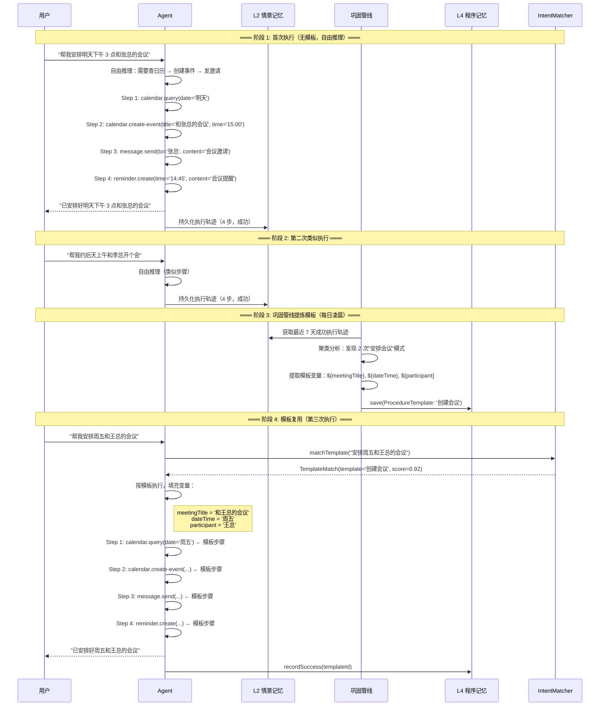
```mermaid
sequenceDiagram
    participant User as 用户
    participant Agent as Agent
    participant L2 as L2 情景记忆
    participant CP as 巩固管线
    participant L4 as L4 程序记忆
    participant IM as IntentMatcher

    Note over User,IM: ═══ 阶段 1: 首次执行（无模板，自由推理）═══

    User->>Agent: "帮我安排明天下午 3 点和张总的会议"
    Agent->>Agent: 自由推理：需要查日历 → 创建事件 → 发邀请
    Agent->>Agent: Step 1: calendar.query(date='明天')
    Agent->>Agent: Step 2: calendar.create-event(title='和张总的会议', time='15:00')
    Agent->>Agent: Step 3: message.send(to='张总', content='会议邀请')
    Agent->>Agent: Step 4: reminder.create(time='14:45', content='会议提醒')
    Agent-->>User: "已安排好明天下午 3 点和张总的会议"
    Agent->>L2: 持久化执行轨迹（4 步，成功）

    Note over User,IM: ═══ 阶段 2: 第二次类似执行 ═══

    User->>Agent: "帮我约后天上午和李总开个会"
    Agent->>Agent: 自由推理（类似步骤）
    Agent->>L2: 持久化执行轨迹（4 步，成功）

    Note over User,IM: ═══ 阶段 3: 巩固管线提炼模板（每日凌晨）═══

    CP->>L2: 获取最近 7 天成功执行轨迹
    CP->>CP: 聚类分析：发现 2 次"安排会议"模式
    CP->>CP: 提取模板变量：${meetingTitle}, ${dateTime}, ${participant}
    CP->>L4: save(ProcedureTemplate: '创建会议')

    Note over User,IM: ═══ 阶段 4: 模板复用（第三次执行）═══

    User->>Agent: "帮我安排周五和王总的会议"
    Agent->>IM: matchTemplate("安排周五和王总的会议")
    IM-->>Agent: TemplateMatch(template='创建会议', score=0.92)
    Agent->>Agent: 按模板执行，填充变量：
    Note right of Agent: meetingTitle = '和王总的会议'<br/>dateTime = '周五'<br/>participant = '王总'
    Agent->>Agent: Step 1: calendar.query(date='周五') ← 模板步骤
    Agent->>Agent: Step 2: calendar.create-event(...) ← 模板步骤
    Agent->>Agent: Step 3: message.send(...) ← 模板步骤
    Agent->>Agent: Step 4: reminder.create(...) ← 模板步骤
    Agent-->>User: "已安排好周五和王总的会议"
    Agent->>L4: recordSuccess(templateId)
```

### 6.7 模板执行流程

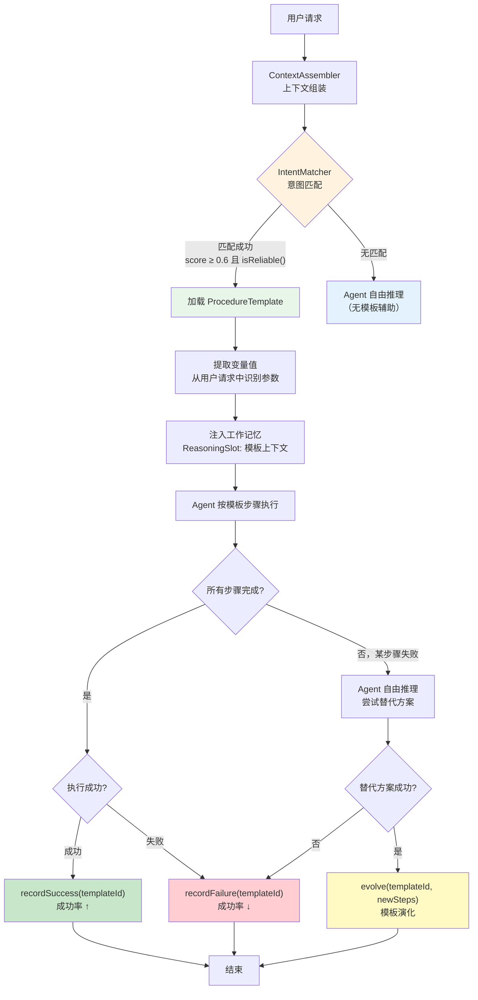
```mermaid
flowchart TD
    A["用户请求"] --> B["ContextAssembler<br/>上下文组装"]
    B --> C{"IntentMatcher<br/>意图匹配"}

    C -->|"匹配成功<br/>score ≥ 0.6 且 isReliable()"| D["加载 ProcedureTemplate"]
    C -->|"无匹配"| E["Agent 自由推理<br/>（无模板辅助）"]

    D --> F["提取变量值<br/>从用户请求中识别参数"]
    F --> G["注入工作记忆<br/>ReasoningSlot: 模板上下文"]
    G --> H["Agent 按模板步骤执行"]

    H --> I{"所有步骤完成?"}
    I -->|"是"| J{"执行成功?"}
    I -->|"否，某步骤失败"| K["Agent 自由推理<br/>尝试替代方案"]

    J -->|"成功"| L["recordSuccess(templateId)<br/>成功率 ↑"]
    J -->|"失败"| M["recordFailure(templateId)<br/>成功率 ↓"]

    K --> N{"替代方案成功?"}
    N -->|"是"| O["evolve(templateId, newSteps)<br/>模板演化"]
    N -->|"否"| M

    L --> P["结束"]
    M --> P
    O --> P

    style C fill:#fff3e0
    style D fill:#e8f5e9
    style E fill:#e3f2fd
    style L fill:#c8e6c9
    style M fill:#ffcdd2
    style O fill:#fff9c4
```

---


## 7. 混合检索引擎 HybridRetriever

### 7.1 设计原理

单一检索方法存在固有盲区：

| 检索方法 | 优势 | 盲区 |
|---------|------|------|
| **向量语义搜索** | 捕捉语义相似性，"会议"能匹配"开会"、"碰头" | 对精确关键词不敏感，"V2.3.1" 可能匹配到 "V1.0.0" |
| **全文搜索 (BM25)** | 精确关键词匹配，对专有名词、版本号、ID 等精确 | 无法理解语义，"开会"匹配不到"会议" |
| **图遍历** | 发现间接关联，"张总" → "产品部" → "Q3 OKR" | 依赖已建立的关系，新实体无关联可遍历 |

> **核心洞察：三路互补，融合排序。**
> 向量搜索提供语义理解，FTS5 提供精确匹配，图遍历提供关联发现。
> 三者并行执行，通过 Reciprocal Rank Fusion (RRF) 融合为统一排序。

这一设计受到 Azure AI Search、Chroma 等现代混合搜索系统的启发，但 LifePilot 在标准 RRF 基础上增加了**时间衰减**和**重要度加权**，使检索结果更贴合个人 Agent 的使用场景。

### 7.2 三路检索架构

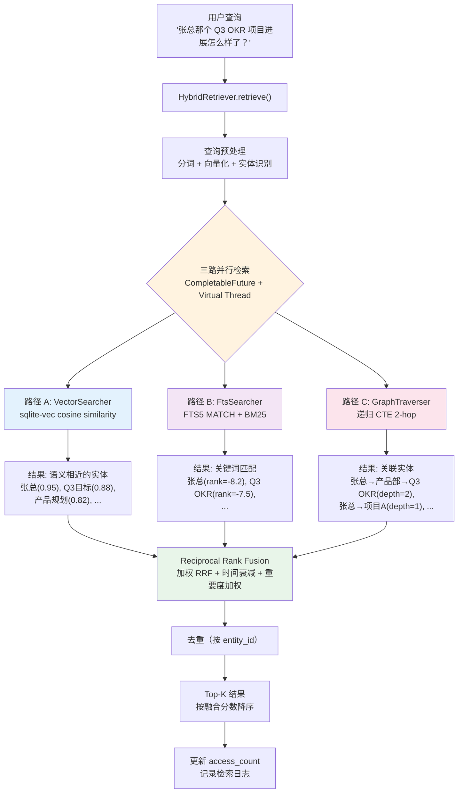
```mermaid
flowchart TD
    A["用户查询<br/>'张总那个 Q3 OKR 项目进展怎么样了？'"] --> B["HybridRetriever.retrieve()"]

    B --> C["查询预处理<br/>分词 + 向量化 + 实体识别"]

    C --> D{"三路并行检索<br/>CompletableFuture + Virtual Thread"}

    D --> E["路径 A: VectorSearcher<br/>sqlite-vec cosine similarity"]
    D --> F["路径 B: FtsSearcher<br/>FTS5 MATCH + BM25"]
    D --> G["路径 C: GraphTraverser<br/>递归 CTE 2-hop"]

    E --> E1["结果: 语义相近的实体<br/>张总(0.95), Q3目标(0.88),<br/>产品规划(0.82), ..."]
    F --> F1["结果: 关键词匹配<br/>张总(rank=-8.2), Q3 OKR(rank=-7.5),<br/>..."]
    G --> G1["结果: 关联实体<br/>张总→产品部→Q3 OKR(depth=2),<br/>张总→项目A(depth=1), ..."]

    E1 --> H["Reciprocal Rank Fusion<br/>加权 RRF + 时间衰减 + 重要度加权"]
    F1 --> H
    G1 --> H

    H --> I["去重（按 entity_id）"]
    I --> J["Top-K 结果<br/>按融合分数降序"]
    J --> K["更新 access_count<br/>记录检索日志"]

    style D fill:#fff3e0
    style H fill:#e8f5e9
    style E fill:#e3f2fd
    style F fill:#f3e5f5
    style G fill:#fce4ec
```

### 7.3 数据模型

```java
package com.lifepilot.memory.retrieval;

import java.time.Instant;
import java.util.Map;

/**
 * 检索结果 — 混合检索引擎返回的单条结果。
 *
 * <p>每条结果包含三路检索的分数明细，便于调试和权重调优。</p>
 *
 * @param entityId       实体 ID（TemporalEntity 或 ConversationRecord 的 ID）
 * @param entityType     实体类型（PERSON, PROJECT, CONCEPT, CONVERSATION 等）
 * @param name           实体名称
 * @param description    实体描述或摘要
 * @param fusedScore     融合后的最终分数 [0.0, 1.0]
 * @param scoreBreakdown 分数明细（各路径的原始分数和加权分数）
 * @param sourcePath     检索路径标识（VECTOR, FTS, GRAPH, 或组合）
 * @param lastAccessedAt 实体最后访问时间
 * @param importanceScore 实体重要度
 */
public record RetrievalResult(
        String entityId,
        String entityType,
        String name,
        String description,
        float fusedScore,
        ScoreBreakdown scoreBreakdown,
        String sourcePath,
        Instant lastAccessedAt,
        float importanceScore
) implements Comparable<RetrievalResult> {

    @Override
    public int compareTo(RetrievalResult other) {
        return Float.compare(other.fusedScore, this.fusedScore); // 降序
    }

    /**
     * 分数明细 — 记录每条检索路径的贡献。
     *
     * @param vectorScore    向量语义检索原始分数
     * @param vectorWeighted 向量语义检索加权分数
     * @param ftsScore       全文搜索原始分数
     * @param ftsWeighted    全文搜索加权分数
     * @param graphScore     图遍历原始分数
     * @param graphWeighted  图遍历加权分数
     * @param recencyBoost   时间衰减加成
     * @param importanceBoost 重要度加成
     */
    public record ScoreBreakdown(
            float vectorScore, float vectorWeighted,
            float ftsScore, float ftsWeighted,
            float graphScore, float graphWeighted,
            float recencyBoost, float importanceBoost
    ) {}
}

/**
 * 检索权重配置 — 控制三路检索的融合权重。
 *
 * <p>权重支持自适应调整：当某路检索返回低置信度结果时，
 * 自动降低该路权重，提高其他路径的权重。</p>
 *
 * @param vectorWeight   向量语义检索权重（默认 0.45）
 * @param ftsWeight      全文搜索权重（默认 0.30）
 * @param graphWeight    图遍历权重（默认 0.25）
 * @param recencyDecay   时间衰减系数（默认 0.05，每天衰减 5%）
 * @param importanceBoost 重要度加成系数（默认 0.1）
 * @param rrfK           RRF 常数 k（默认 60，控制排名差异的平滑程度）
 */
public record RetrievalWeights(
        float vectorWeight,
        float ftsWeight,
        float graphWeight,
        float recencyDecay,
        float importanceBoost,
        int rrfK
) {
    /** 默认权重配置。 */
    public static final RetrievalWeights DEFAULT = new RetrievalWeights(
            0.45f, 0.30f, 0.25f, 0.05f, 0.1f, 60);

    /** 验证权重之和为 1.0。 */
    public RetrievalWeights {
        float sum = vectorWeight + ftsWeight + graphWeight;
        if (Math.abs(sum - 1.0f) > 0.01f) {
            throw new IllegalArgumentException(
                    "检索权重之和必须为 1.0，当前为 %.2f".formatted(sum));
        }
    }

    /**
     * 自适应调整权重。
     *
     * <p>当向量检索 Top-1 分数低于 0.5 时，降低向量权重，
     * 将差额按比例分配给 FTS 和图遍历。</p>
     *
     * @param topVectorScore 向量检索最高分
     * @return 调整后的权重
     */
    public RetrievalWeights adaptForLowVectorConfidence(float topVectorScore) {
        if (topVectorScore >= 0.5f) {
            return this;
        }
        // 向量检索低置信度：降低向量权重，提高 FTS 权重
        float reduction = vectorWeight * 0.3f;
        return new RetrievalWeights(
                vectorWeight - reduction,
                ftsWeight + reduction * 0.7f,
                graphWeight + reduction * 0.3f,
                recencyDecay, importanceBoost, rrfK);
    }
}
```


### 7.4 RRF 融合算法

Reciprocal Rank Fusion (RRF) 是一种经典的排名融合算法，其核心思想是：**一个文档在多个检索路径中排名越靠前，其融合分数越高**。

标准 RRF 公式：

```
Score(d) = Σ  1 / (k + rank(r, d))
           r∈R

其中：
  d = 文档（实体）
  R = 检索路径集合 {Vector, FTS, Graph}
  rank(r, d) = 文档 d 在检索路径 r 中的排名（从 1 开始）
  k = 平滑常数（默认 60，防止排名第 1 的文档分数过高）
```

LifePilot 在标准 RRF 基础上扩展了**加权 RRF + 时间衰减 + 重要度加成**：

```
FinalScore(d) = WeightedRRF(d) × RecencyFactor(d) + ImportanceBoost(d)

其中：
  WeightedRRF(d) = Σ  w(r) / (k + rank(r, d))
                   r∈R

  RecencyFactor(d) = exp(-λ × daysSinceLastAccess)
    λ = recencyDecay（默认 0.05）
    效果：1 天前 → 0.95，7 天前 → 0.70，30 天前 → 0.22，90 天前 → 0.01

  ImportanceBoost(d) = importanceBoost × importanceScore(d)
    效果：重要度 1.0 的实体额外加 0.1 分
```

### 7.5 HybridRetriever 服务

```java
package com.lifepilot.memory.retrieval;

import com.lifepilot.memory.semantic.TemporalEntity;
import org.slf4j.Logger;
import org.slf4j.LoggerFactory;
import org.springframework.ai.embedding.EmbeddingModel;
import org.springframework.jdbc.core.JdbcTemplate;
import org.springframework.stereotype.Service;

import java.time.Duration;
import java.time.Instant;
import java.util.*;
import java.util.concurrent.CompletableFuture;
import java.util.stream.Collectors;

/**
 * 混合检索引擎 — 三路并行检索 + 加权 RRF 融合。
 *
 * <p>检索流程：
 * <ol>
 *   <li>查询预处理：向量化 + 分词</li>
 *   <li>三路并行检索（Virtual Thread）：向量 / FTS5 / 图遍历</li>
 *   <li>加权 RRF 融合排序</li>
 *   <li>时间衰减 + 重要度加成</li>
 *   <li>去重（按 entity_id）</li>
 *   <li>返回 Top-K 结果</li>
 * </ol></p>
 *
 * <p>性能目标：端到端延迟 < 50ms（三路并行，取最慢路径的延迟）。</p>
 *
 * <p>自适应权重：当向量检索返回低置信度结果（Top-1 < 0.5）时，
 * 自动降低向量权重，提高 FTS 权重，确保精确关键词匹配不被语义噪声淹没。</p>
 */
@Service
public class HybridRetriever {

    private static final Logger log = LoggerFactory.getLogger(HybridRetriever.class);

    private final VectorSearcher vectorSearcher;
    private final FtsSearcher ftsSearcher;
    private final GraphTraverser graphTraverser;
    private final EmbeddingModel embeddingModel;
    private final JdbcTemplate jdbc;

    public HybridRetriever(VectorSearcher vectorSearcher,
                           FtsSearcher ftsSearcher,
                           GraphTraverser graphTraverser,
                           EmbeddingModel embeddingModel,
                           JdbcTemplate jdbc) {
        this.vectorSearcher = vectorSearcher;
        this.ftsSearcher = ftsSearcher;
        this.graphTraverser = graphTraverser;
        this.embeddingModel = embeddingModel;
        this.jdbc = jdbc;
    }

    /**
     * 执行三路混合检索。
     *
     * @param query   查询文本
     * @param topK    返回结果数量
     * @param weights 检索权重配置
     * @return 融合排序后的 Top-K 结果
     */
    public List<RetrievalResult> retrieve(String query, int topK, RetrievalWeights weights) {
        long startTime = System.nanoTime();
        log.debug("混合检索开始: query='{}', topK={}", query, topK);

        // Step 1: 查询预处理 — 向量化
        float[] queryEmbedding = embeddingModel.embed(query);

        // Step 2: 三路并行检索（Virtual Thread）
        int candidateK = topK * 3; // 每路多取一些候选，融合后再截断

        var vectorFuture = CompletableFuture.supplyAsync(
                () -> vectorSearcher.search(queryEmbedding, candidateK),
                Thread.ofVirtual().factory()::newThread);

        var ftsFuture = CompletableFuture.supplyAsync(
                () -> ftsSearcher.search(query, candidateK),
                Thread.ofVirtual().factory()::newThread);

        var graphFuture = CompletableFuture.supplyAsync(
                () -> graphTraverser.traverse(query, candidateK),
                Thread.ofVirtual().factory()::newThread);

        // 等待所有路径完成
        List<RankedItem> vectorResults = vectorFuture.join();
        List<RankedItem> ftsResults = ftsFuture.join();
        List<RankedItem> graphResults = graphFuture.join();

        // Step 3: 自适应权重调整
        float topVectorScore = vectorResults.isEmpty() ? 0f : vectorResults.getFirst().score();
        RetrievalWeights adaptedWeights = weights.adaptForLowVectorConfidence(topVectorScore);

        if (!weights.equals(adaptedWeights)) {
            log.debug("检索权重自适应调整: vector={} → {}, fts={} → {}, graph={} → {}",
                    weights.vectorWeight(), adaptedWeights.vectorWeight(),
                    weights.ftsWeight(), adaptedWeights.ftsWeight(),
                    weights.graphWeight(), adaptedWeights.graphWeight());
        }

        // Step 4: 加权 RRF 融合
        Map<String, FusionAccumulator> accumulators = new HashMap<>();

        applyRRF(vectorResults, adaptedWeights.vectorWeight(),
                adaptedWeights.rrfK(), "VECTOR", accumulators);
        applyRRF(ftsResults, adaptedWeights.ftsWeight(),
                adaptedWeights.rrfK(), "FTS", accumulators);
        applyRRF(graphResults, adaptedWeights.graphWeight(),
                adaptedWeights.rrfK(), "GRAPH", accumulators);

        // Step 5: 时间衰减 + 重要度加成 + 构建最终结果
        List<RetrievalResult> results = accumulators.values().stream()
                .map(acc -> buildResult(acc, adaptedWeights))
                .sorted()
                .limit(topK)
                .toList();

        // Step 6: 更新访问计数
        updateAccessCounts(results);

        long elapsed = (System.nanoTime() - startTime) / 1_000_000;
        log.info("混合检索完成: query='{}', results={}, elapsed={}ms, " +
                        "vectorCandidates={}, ftsCandidates={}, graphCandidates={}",
                query, results.size(), elapsed,
                vectorResults.size(), ftsResults.size(), graphResults.size());

        return results;
    }

    /**
     * 将单路检索结果应用 RRF 公式，累加到融合累加器中。
     */
    private void applyRRF(List<RankedItem> rankedItems, float weight, int k,
                          String pathName, Map<String, FusionAccumulator> accumulators) {
        for (int rank = 0; rank < rankedItems.size(); rank++) {
            var item = rankedItems.get(rank);
            float rrfScore = weight / (k + rank + 1); // rank 从 1 开始

            accumulators.computeIfAbsent(item.entityId(),
                    id -> new FusionAccumulator(item))
                    .addScore(pathName, item.score(), rrfScore);
        }
    }

    /**
     * 构建最终检索结果，应用时间衰减和重要度加成。
     */
    private RetrievalResult buildResult(FusionAccumulator acc, RetrievalWeights weights) {
        // 时间衰减：exp(-λ × daysSinceLastAccess)
        float recencyFactor = 1.0f;
        if (acc.item.lastAccessedAt() != null) {
            long daysSince = Duration.between(acc.item.lastAccessedAt(), Instant.now()).toDays();
            recencyFactor = (float) Math.exp(-weights.recencyDecay() * daysSince);
        }

        // 重要度加成
        float importanceBoost = weights.importanceBoost() * acc.item.importanceScore();

        float finalScore = acc.totalRrfScore * recencyFactor + importanceBoost;

        // 构建分数明细
        var breakdown = new RetrievalResult.ScoreBreakdown(
                acc.getPathScore("VECTOR"), acc.getPathWeightedScore("VECTOR"),
                acc.getPathScore("FTS"), acc.getPathWeightedScore("FTS"),
                acc.getPathScore("GRAPH"), acc.getPathWeightedScore("GRAPH"),
                recencyFactor, importanceBoost);

        return new RetrievalResult(
                acc.item.entityId(), acc.item.entityType(),
                acc.item.name(), acc.item.description(),
                finalScore, breakdown,
                acc.getSourcePaths(), acc.item.lastAccessedAt(),
                acc.item.importanceScore());
    }

    /** 批量更新检索结果的访问计数。 */
    private void updateAccessCounts(List<RetrievalResult> results) {
        if (results.isEmpty()) return;
        for (var result : results) {
            jdbc.update("""
                    UPDATE temporal_entities SET
                        access_count = access_count + 1,
                        last_accessed_at = datetime('now')
                    WHERE id = ? AND is_current = 1
                    """, result.entityId());
        }
    }

    /**
     * 融合累加器 — 跟踪单个实体在多路检索中的分数。
     */
    private static class FusionAccumulator {
        final RankedItem item;
        float totalRrfScore = 0f;
        final Map<String, float[]> pathScores = new HashMap<>(); // [原始分, 加权分]

        FusionAccumulator(RankedItem item) {
            this.item = item;
        }

        void addScore(String path, float rawScore, float weightedScore) {
            totalRrfScore += weightedScore;
            pathScores.put(path, new float[]{rawScore, weightedScore});
        }

        float getPathScore(String path) {
            return pathScores.containsKey(path) ? pathScores.get(path)[0] : 0f;
        }

        float getPathWeightedScore(String path) {
            return pathScores.containsKey(path) ? pathScores.get(path)[1] : 0f;
        }

        String getSourcePaths() {
            return String.join("+", pathScores.keySet());
        }
    }

    /**
     * 排名条目 — 单路检索返回的标准化结果。
     *
     * @param entityId       实体 ID
     * @param entityType     实体类型
     * @param name           实体名称
     * @param description    实体描述
     * @param score          原始检索分数 [0.0, 1.0]
     * @param importanceScore 实体重要度
     * @param lastAccessedAt 最后访问时间
     */
    public record RankedItem(
            String entityId, String entityType,
            String name, String description,
            float score, float importanceScore,
            Instant lastAccessedAt
    ) {}
}
```


### 7.6 FtsSearcher — 全文搜索组件

```java
package com.lifepilot.memory.retrieval;

import org.slf4j.Logger;
import org.slf4j.LoggerFactory;
import org.springframework.jdbc.core.JdbcTemplate;
import org.springframework.stereotype.Component;

import java.time.Instant;
import java.util.List;

/**
 * 全文搜索组件 — 基于 SQLite FTS5 + BM25 的精确关键词检索。
 *
 * <p>FTS5 的 BM25 评分算法考虑了：
 * <ul>
 *   <li>词频（TF）：关键词在文档中出现的次数</li>
 *   <li>逆文档频率（IDF）：关键词在整个语料库中的稀有程度</li>
 *   <li>文档长度归一化：避免长文档因词频高而获得不公平优势</li>
 * </ul></p>
 *
 * <p>搜索范围覆盖两个 FTS5 索引：
 * <ul>
 *   <li>{@code temporal_entities_fts} — 语义记忆实体（名称 + 描述 + 属性）</li>
 *   <li>{@code messages_fts} — 情景记忆消息（对话内容）</li>
 * </ul></p>
 */
@Component
public class FtsSearcher {

    private static final Logger log = LoggerFactory.getLogger(FtsSearcher.class);

    private final JdbcTemplate jdbc;

    public FtsSearcher(JdbcTemplate jdbc) {
        this.jdbc = jdbc;
    }

    /**
     * 在语义记忆实体中执行全文搜索。
     *
     * @param query 搜索查询（支持 FTS5 查询语法）
     * @param topK  返回结果数量
     * @return 按 BM25 分数排序的结果列表
     */
    public List<HybridRetriever.RankedItem> search(String query, int topK) {
        long start = System.nanoTime();

        // 对查询进行预处理：转义特殊字符，添加前缀匹配
        String ftsQuery = preprocessQuery(query);

        List<HybridRetriever.RankedItem> results = jdbc.query("""
                SELECT
                    te.id,
                    te.type,
                    te.name,
                    te.description,
                    te.importance_score,
                    te.last_accessed_at,
                    rank
                FROM temporal_entities_fts fts
                JOIN temporal_entities te ON te.rowid = fts.rowid
                WHERE temporal_entities_fts MATCH ?
                  AND te.is_current = 1
                ORDER BY rank
                LIMIT ?
                """,
                (rs, rowNum) -> new HybridRetriever.RankedItem(
                        rs.getString("id"),
                        rs.getString("type"),
                        rs.getString("name"),
                        rs.getString("description"),
                        normalizeBm25Rank(rs.getFloat("rank")),
                        rs.getFloat("importance_score"),
                        rs.getString("last_accessed_at") != null
                                ? Instant.parse(rs.getString("last_accessed_at")) : null
                ),
                ftsQuery, topK);

        long elapsed = (System.nanoTime() - start) / 1_000_000;
        log.debug("FTS5 搜索完成: query='{}', results={}, elapsed={}ms",
                ftsQuery, results.size(), elapsed);

        return results;
    }

    /**
     * 预处理查询：将自然语言查询转换为 FTS5 查询语法。
     *
     * <p>处理规则：
     * <ul>
     *   <li>多个词之间用 OR 连接（提高召回率）</li>
     *   <li>每个词添加 * 前缀匹配（"张" 匹配 "张总"、"张三"）</li>
     *   <li>转义 FTS5 特殊字符</li>
     * </ul></p>
     */
    private String preprocessQuery(String query) {
        // 简单分词：按空格和标点分割
        String[] tokens = query.split("[\\s，。、！？；：""''（）\\[\\]{}]+");
        return java.util.Arrays.stream(tokens)
                .filter(t -> !t.isBlank())
                .map(t -> "\"" + t.replace("\"", "\"\"") + "\"*")
                .collect(java.util.stream.Collectors.joining(" OR "));
    }

    /**
     * 将 FTS5 BM25 rank 归一化到 [0, 1] 区间。
     *
     * <p>FTS5 的 rank 是负数（越小越相关），使用 sigmoid 变换归一化。</p>
     */
    private float normalizeBm25Rank(float rank) {
        // sigmoid 归一化：1 / (1 + exp(rank))
        // rank 为负数，所以 exp(rank) < 1，结果在 (0.5, 1.0) 区间
        return (float) (1.0 / (1.0 + Math.exp(rank)));
    }
}
```

### 7.7 GraphTraverser — 图遍历组件

```java
package com.lifepilot.memory.retrieval;

import org.slf4j.Logger;
import org.slf4j.LoggerFactory;
import org.springframework.jdbc.core.JdbcTemplate;
import org.springframework.stereotype.Component;

import java.time.Instant;
import java.util.List;

/**
 * 图遍历组件 — 基于 SQLite 递归 CTE 的关联实体发现。
 *
 * <p>图遍历的核心价值是发现**间接关联**——用户提到"张总"时，
 * 不仅返回张总本人的信息，还能通过关系链发现：
 * <ul>
 *   <li>张总 → 产品部（所属部门）</li>
 *   <li>张总 → 项目 A（负责项目）</li>
 *   <li>产品部 → Q3 OKR（部门目标）— 2-hop 间接关联</li>
 * </ul></p>
 *
 * <p>深度限制：默认最大 2-hop，防止图遍历爆炸。
 * 每增加一跳，分数衰减 50%（depth=1 → 1.0, depth=2 → 0.5）。</p>
 *
 * <p>实现方式：SQLite 递归 CTE（Common Table Expression），
 * 无需图数据库，在关系型数据库上实现图遍历。</p>
 */
@Component
public class GraphTraverser {

    private static final Logger log = LoggerFactory.getLogger(GraphTraverser.class);

    /** 最大遍历深度。 */
    private static final int MAX_DEPTH = 2;
    /** 每跳分数衰减因子。 */
    private static final float DEPTH_DECAY = 0.5f;

    private final JdbcTemplate jdbc;

    public GraphTraverser(JdbcTemplate jdbc) {
        this.jdbc = jdbc;
    }

    /**
     * 从查询中识别的实体出发，遍历关系图发现关联实体。
     *
     * <p>遍历策略：
     * <ol>
     *   <li>从查询文本中识别已知实体（精确名称匹配）</li>
     *   <li>以这些实体为起点，通过递归 CTE 遍历关系图</li>
     *   <li>按深度衰减计算分数</li>
     *   <li>排除起点实体本身（避免与向量/FTS 结果重复）</li>
     * </ol></p>
     *
     * @param query 查询文本
     * @param topK  返回结果数量
     * @return 按深度衰减分数排序的关联实体
     */
    public List<HybridRetriever.RankedItem> traverse(String query, int topK) {
        long start = System.nanoTime();

        // Step 1: 从查询中识别已知实体（精确名称匹配）
        List<String> seedEntityIds = jdbc.queryForList("""
                SELECT id FROM temporal_entities
                WHERE is_current = 1 AND name IN (
                    SELECT name FROM temporal_entities
                    WHERE is_current = 1 AND ? LIKE '%' || name || '%'
                )
                """, String.class, query);

        if (seedEntityIds.isEmpty()) {
            log.debug("图遍历: 未识别到种子实体, query='{}'", query);
            return List.of();
        }

        // Step 2: 递归 CTE 图遍历
        // 为每个种子实体执行遍历，合并结果
        List<HybridRetriever.RankedItem> allResults = new java.util.ArrayList<>();
        for (String seedId : seedEntityIds) {
            var results = jdbc.query("""
                    WITH RECURSIVE graph_walk AS (
                        -- 起点：种子实体的直接关联
                        SELECT
                            CASE
                                WHEN tr.source_entity_id = ? THEN tr.target_entity_id
                                ELSE tr.source_entity_id
                            END AS entity_id,
                            1 AS depth,
                            tr.strength AS edge_strength
                        FROM temporal_relations tr
                        WHERE (tr.source_entity_id = ? OR tr.target_entity_id = ?)
                          AND tr.valid_to IS NULL

                        UNION ALL

                        -- 递归：继续遍历下一跳
                        SELECT
                            CASE
                                WHEN tr.source_entity_id = gw.entity_id THEN tr.target_entity_id
                                ELSE tr.source_entity_id
                            END AS entity_id,
                            gw.depth + 1 AS depth,
                            gw.edge_strength * tr.strength AS edge_strength
                        FROM temporal_relations tr
                        JOIN graph_walk gw ON (
                            tr.source_entity_id = gw.entity_id
                            OR tr.target_entity_id = gw.entity_id
                        )
                        WHERE gw.depth < ?
                          AND tr.valid_to IS NULL
                    )
                    SELECT DISTINCT
                        te.id,
                        te.type,
                        te.name,
                        te.description,
                        te.importance_score,
                        te.last_accessed_at,
                        gw.depth,
                        gw.edge_strength
                    FROM graph_walk gw
                    JOIN temporal_entities te ON te.id = gw.entity_id AND te.is_current = 1
                    WHERE gw.entity_id != ?
                    ORDER BY gw.depth ASC, gw.edge_strength DESC
                    LIMIT ?
                    """,
                    (rs, rowNum) -> {
                        int depth = rs.getInt("depth");
                        float edgeStrength = rs.getFloat("edge_strength");
                        // 分数 = 边强度 × 深度衰减
                        float score = edgeStrength * (float) Math.pow(DEPTH_DECAY, depth - 1);
                        return new HybridRetriever.RankedItem(
                                rs.getString("id"),
                                rs.getString("type"),
                                rs.getString("name"),
                                rs.getString("description"),
                                score,
                                rs.getFloat("importance_score"),
                                rs.getString("last_accessed_at") != null
                                        ? Instant.parse(rs.getString("last_accessed_at")) : null
                        );
                    },
                    seedId, seedId, seedId, MAX_DEPTH, seedId, topK);

            allResults.addAll(results);
        }

        // 去重并按分数排序
        var deduped = allResults.stream()
                .collect(java.util.stream.Collectors.toMap(
                        HybridRetriever.RankedItem::entityId,
                        r -> r,
                        (a, b) -> a.score() >= b.score() ? a : b))
                .values().stream()
                .sorted((a, b) -> Float.compare(b.score(), a.score()))
                .limit(topK)
                .toList();

        long elapsed = (System.nanoTime() - start) / 1_000_000;
        log.debug("图遍历完成: query='{}', seeds={}, results={}, elapsed={}ms",
                query, seedEntityIds.size(), deduped.size(), elapsed);

        return deduped;
    }
}
```


### 7.8 并行执行时序图

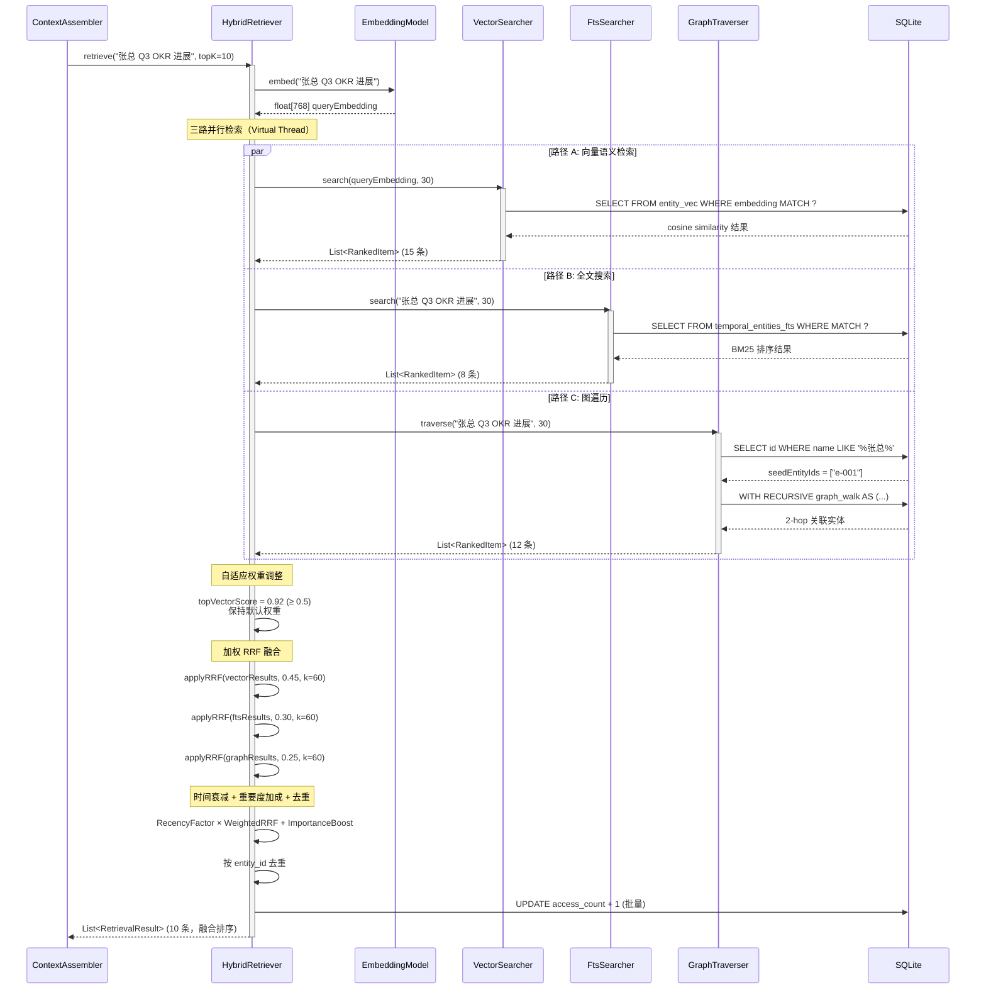
```mermaid
sequenceDiagram
    participant CA as ContextAssembler
    participant HR as HybridRetriever
    participant EM as EmbeddingModel
    participant VS as VectorSearcher
    participant FS as FtsSearcher
    participant GT as GraphTraverser
    participant DB as SQLite

    CA->>HR: retrieve("张总 Q3 OKR 进展", topK=10)
    activate HR

    HR->>EM: embed("张总 Q3 OKR 进展")
    EM-->>HR: float[768] queryEmbedding

    Note over HR: 三路并行检索（Virtual Thread）

    par 路径 A: 向量语义检索
        HR->>VS: search(queryEmbedding, 30)
        activate VS
        VS->>DB: SELECT FROM entity_vec WHERE embedding MATCH ?
        DB-->>VS: cosine similarity 结果
        VS-->>HR: List<RankedItem> (15 条)
        deactivate VS
    and 路径 B: 全文搜索
        HR->>FS: search("张总 Q3 OKR 进展", 30)
        activate FS
        FS->>DB: SELECT FROM temporal_entities_fts WHERE MATCH ?
        DB-->>FS: BM25 排序结果
        FS-->>HR: List<RankedItem> (8 条)
        deactivate FS
    and 路径 C: 图遍历
        HR->>GT: traverse("张总 Q3 OKR 进展", 30)
        activate GT
        GT->>DB: SELECT id WHERE name LIKE '%张总%'
        DB-->>GT: seedEntityIds = ["e-001"]
        GT->>DB: WITH RECURSIVE graph_walk AS (...)
        DB-->>GT: 2-hop 关联实体
        GT-->>HR: List<RankedItem> (12 条)
        deactivate GT
    end

    Note over HR: 自适应权重调整

    HR->>HR: topVectorScore = 0.92 (≥ 0.5)<br/>保持默认权重

    Note over HR: 加权 RRF 融合

    HR->>HR: applyRRF(vectorResults, 0.45, k=60)
    HR->>HR: applyRRF(ftsResults, 0.30, k=60)
    HR->>HR: applyRRF(graphResults, 0.25, k=60)

    Note over HR: 时间衰减 + 重要度加成 + 去重

    HR->>HR: RecencyFactor × WeightedRRF + ImportanceBoost
    HR->>HR: 按 entity_id 去重

    HR->>DB: UPDATE access_count + 1 (批量)

    HR-->>CA: List<RetrievalResult> (10 条，融合排序)
    deactivate HR
```

### 7.9 性能特征

| 检索路径 | 典型延迟 | 召回率 | 精确率 | 适用场景 |
|---------|---------|--------|--------|---------|
| **向量语义搜索** | 5-15ms | 高（语义泛化） | 中（可能引入语义噪声） | 模糊查询、同义词、概念关联 |
| **FTS5 全文搜索** | 2-8ms | 中（仅关键词匹配） | 高（精确匹配） | 专有名词、版本号、ID、精确短语 |
| **图遍历** | 10-30ms | 中（依赖已有关系） | 高（关系明确） | 间接关联发现、上下文扩展 |
| **三路融合** | 15-35ms | **高**（三路互补） | **高**（RRF 抑制噪声） | 所有场景（默认模式） |

> **端到端延迟目标：< 50ms**
> 三路并行执行，总延迟取决于最慢路径（通常是图遍历 ~30ms）加上融合计算 (~5ms)。

### 7.10 自适应权重调整策略

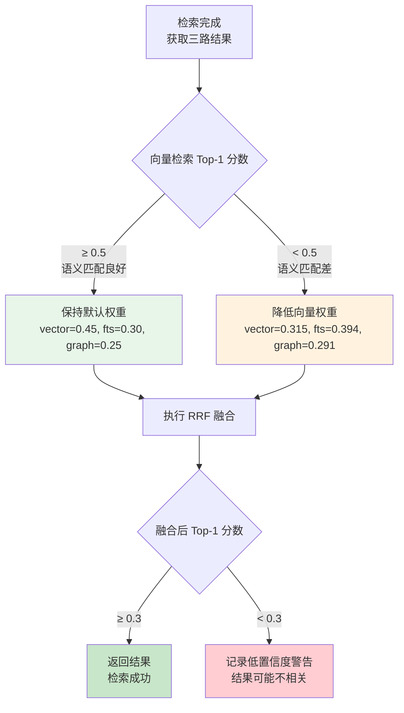
```mermaid
flowchart TD
    A["检索完成<br/>获取三路结果"] --> B{"向量检索 Top-1 分数"}

    B -->|"≥ 0.5<br/>语义匹配良好"| C["保持默认权重<br/>vector=0.45, fts=0.30, graph=0.25"]
    B -->|"< 0.5<br/>语义匹配差"| D["降低向量权重<br/>vector=0.315, fts=0.394, graph=0.291"]

    C --> E["执行 RRF 融合"]
    D --> E

    E --> F{"融合后 Top-1 分数"}
    F -->|"≥ 0.3"| G["返回结果<br/>检索成功"]
    F -->|"< 0.3"| H["记录低置信度警告<br/>结果可能不相关"]

    style C fill:#e8f5e9
    style D fill:#fff3e0
    style G fill:#c8e6c9
    style H fill:#ffcdd2
```

自适应调整的核心逻辑：当向量检索返回的最高分低于 0.5 时，说明查询与语义记忆中的实体语义距离较远。此时向量检索的结果可能是噪声，应降低其权重，让 FTS5 的精确关键词匹配发挥更大作用。这在用户查询包含专有名词、版本号等精确信息时尤为重要。

---


## 8. 知识提取管线 KnowledgeExtractionPipeline

### 8.1 设计原理

知识提取管线是连接 L2 情景记忆和 L3 语义记忆的桥梁——它从非结构化的对话文本中提取结构化的实体和关系，构建时序知识图谱。这一过程模拟了人类从日常经历中抽象出概念和关系的认知过程。

管线采用 **4 步流水线架构**，每一步都是独立的处理阶段，可以单独测试和优化：

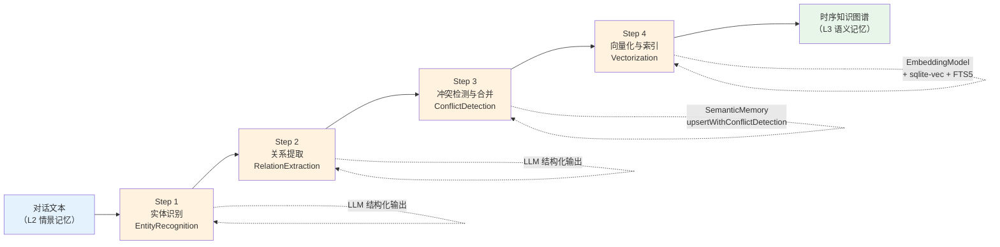
```mermaid
flowchart LR
    A["对话文本<br/>（L2 情景记忆）"] --> B["Step 1<br/>实体识别<br/>EntityRecognition"]
    B --> C["Step 2<br/>关系提取<br/>RelationExtraction"]
    C --> D["Step 3<br/>冲突检测与合并<br/>ConflictDetection"]
    D --> E["Step 4<br/>向量化与索引<br/>Vectorization"]
    E --> F["时序知识图谱<br/>（L3 语义记忆）"]

    B -.->|"LLM 结构化输出"| B
    C -.->|"LLM 结构化输出"| C
    D -.->|"SemanticMemory<br/>upsertWithConflictDetection"| D
    E -.->|"EmbeddingModel<br/>+ sqlite-vec + FTS5"| E

    style A fill:#e3f2fd
    style F fill:#e8f5e9
    style B fill:#fff3e0
    style C fill:#fff3e0
    style D fill:#fff3e0
    style E fill:#fff3e0
```

> **设计约束：**
> - **异步非阻塞**：知识提取不在 Agent 主循环的关键路径上，使用 `@Async` 异步执行
> - **容错降级**：提取失败不影响核心 Agent 功能，仅记录警告日志
> - **成本控制**：每小时最多 N 次 LLM 提取调用，防止成本失控
> - **置信度过滤**：只有置信度 > 0.6 的实体才会被持久化

### 8.2 数据模型

```java
package com.lifepilot.memory.extraction;

import java.util.List;
import java.util.Map;

/**
 * 提取结果 — 知识提取管线的输出。
 *
 * @param entities  提取到的实体列表
 * @param relations 提取到的关系列表
 * @param sourceConversationId 来源对话 ID
 * @param extractionDurationMs 提取耗时（毫秒）
 */
public record ExtractionResult(
        List<ExtractedEntity> entities,
        List<ExtractedRelation> relations,
        String sourceConversationId,
        long extractionDurationMs
) {
    /** 过滤低置信度实体（< 0.6）后的有效实体数。 */
    public long validEntityCount() {
        return entities.stream()
                .filter(e -> e.confidence() >= 0.6f)
                .count();
    }
}

/**
 * 提取的实体 — LLM 从对话中识别出的实体。
 *
 * <p>实体类型对应 {@code EntityType} 枚举：
 * PERSON, ORGANIZATION, PROJECT, LOCATION, EVENT, CONCEPT, TOOL, SKILL</p>
 *
 * @param name        实体名称（如"张总"、"Q3 OKR"）
 * @param type        实体类型
 * @param description 实体描述（LLM 生成的一句话描述）
 * @param properties  实体属性（键值对，如 title="产品经理"）
 * @param confidence  提取置信度 [0.0, 1.0]
 */
public record ExtractedEntity(
        String name,
        String type,
        String description,
        Map<String, String> properties,
        float confidence
) {}

/**
 * 提取的关系 — LLM 从对话中识别出的实体间关系。
 *
 * @param sourceName   源实体名称
 * @param targetName   目标实体名称
 * @param relationType 关系类型（如 WORKS_AT, MANAGES, PARTICIPATES_IN）
 * @param strength     关系强度 [0.0, 1.0]
 * @param description  关系描述（可选）
 */
public record ExtractedRelation(
        String sourceName,
        String targetName,
        String relationType,
        float strength,
        String description
) {}
```

### 8.3 提取 Prompt 模板

知识提取的核心是 LLM 结构化输出。以下是实体识别和关系提取的 Prompt 模板（中文）：

#### 8.3.1 实体识别 Prompt

```text
你是一个知识提取专家。请从以下对话中识别所有有意义的实体。

## 对话内容
{dialogText}

## 提取规则
1. 识别所有人物、组织、项目、地点、事件、概念、工具
2. 为每个实体提供一句话描述
3. 提取实体的关键属性（如职位、状态、日期等）
4. 评估每个实体的提取置信度（0.0-1.0）
5. 忽略过于泛化的实体（如"事情"、"东西"）
6. 合并指代同一实体的不同表述（如"张总"和"张经理"）

## 输出格式
请以 JSON 数组格式输出，每个实体包含：
- name: 实体名称
- type: 实体类型（PERSON/ORGANIZATION/PROJECT/LOCATION/EVENT/CONCEPT/TOOL）
- description: 一句话描述
- properties: 属性键值对
- confidence: 置信度
```

#### 8.3.2 关系提取 Prompt

```text
你是一个知识图谱构建专家。请根据以下对话和已识别的实体，提取实体之间的关系。

## 对话内容
{dialogText}

## 已识别实体
{entitiesJson}

## 提取规则
1. 只提取对话中明确提到或强烈暗示的关系
2. 关系类型包括：WORKS_AT, MANAGES, REPORTS_TO, PARTICIPATES_IN,
   RESPONSIBLE_FOR, LOCATED_IN, RELATED_TO, DEPENDS_ON, CREATED_BY
3. 评估关系强度（0.0-1.0）：明确提到=0.9+，强烈暗示=0.7-0.9，弱暗示=0.5-0.7
4. 避免推测对话中未提及的关系

## 输出格式
请以 JSON 数组格式输出，每个关系包含：
- sourceName: 源实体名称
- targetName: 目标实体名称
- relationType: 关系类型
- strength: 关系强度
- description: 关系描述（可选）
```


### 8.4 KnowledgeExtractionPipeline 服务

```java
package com.lifepilot.memory.extraction;

import com.lifepilot.memory.semantic.SemanticMemory;
import com.lifepilot.memory.semantic.TemporalEntity;
import com.lifepilot.memory.semantic.TemporalRelation;
import com.lifepilot.memory.semantic.EntityType;
import org.slf4j.Logger;
import org.slf4j.LoggerFactory;
import org.springframework.ai.chat.client.ChatClient;
import org.springframework.ai.embedding.EmbeddingModel;
import org.springframework.jdbc.core.JdbcTemplate;
import org.springframework.scheduling.annotation.Async;
import org.springframework.stereotype.Service;

import java.time.Instant;
import java.util.*;
import java.util.concurrent.CompletableFuture;
import java.util.concurrent.atomic.AtomicInteger;

/**
 * 知识提取管线 — 从对话文本中提取结构化知识，构建时序知识图谱。
 *
 * <p>4 步流水线：
 * <ol>
 *   <li>实体识别（LLM 结构化输出）</li>
 *   <li>关系提取（LLM 结构化输出）</li>
 *   <li>冲突检测与版本合并（SemanticMemory.upsertWithConflictDetection）</li>
 *   <li>向量化与索引更新（EmbeddingModel + sqlite-vec + FTS5）</li>
 * </ol></p>
 *
 * <p>成本控制：通过 {@code extractionCounter} 限制每小时最多 30 次 LLM 调用。
 * 超过限制时，提取请求被静默丢弃，不影响 Agent 主循环。</p>
 *
 * <p>容错策略：任何步骤失败都不会抛出异常到调用方，
 * 仅记录 WARN 日志。知识提取是"尽力而为"的增强功能。</p>
 */
@Service
public class KnowledgeExtractionPipeline {

    private static final Logger log = LoggerFactory.getLogger(KnowledgeExtractionPipeline.class);

    /** 每小时最大提取次数。 */
    private static final int MAX_EXTRACTIONS_PER_HOUR = 30;
    /** 实体置信度阈值。 */
    private static final float CONFIDENCE_THRESHOLD = 0.6f;

    private final ChatClient chatClient;
    private final SemanticMemory semanticMemory;
    private final EmbeddingModel embeddingModel;
    private final JdbcTemplate jdbc;

    /** 每小时提取计数器（每小时重置）。 */
    private final AtomicInteger extractionCounter = new AtomicInteger(0);
    private volatile long counterResetTime = System.currentTimeMillis();

    public KnowledgeExtractionPipeline(ChatClient.Builder chatClientBuilder,
                                       SemanticMemory semanticMemory,
                                       EmbeddingModel embeddingModel,
                                       JdbcTemplate jdbc) {
        this.chatClient = chatClientBuilder.build();
        this.semanticMemory = semanticMemory;
        this.embeddingModel = embeddingModel;
        this.jdbc = jdbc;
    }

    /**
     * 异步执行知识提取。
     *
     * <p>此方法标记为 {@code @Async}，在独立线程池中执行，
     * 不阻塞 Agent 主循环。</p>
     *
     * @param conversationId 对话 ID
     * @param dialogText     对话文本
     */
    @Async("memoryExtractionExecutor")
    public void extract(String conversationId, String dialogText) {
        // 速率限制检查
        if (!checkRateLimit()) {
            log.debug("知识提取跳过（速率限制）: conversationId={}", conversationId);
            return;
        }

        long startTime = System.nanoTime();
        log.info("知识提取开始: conversationId={}, textLength={}",
                conversationId, dialogText.length());

        try {
            // Step 1: 实体识别
            List<ExtractedEntity> entities = extractEntities(dialogText);
            log.debug("实体识别完成: count={}", entities.size());

            // 置信度过滤
            List<ExtractedEntity> validEntities = entities.stream()
                    .filter(e -> e.confidence() >= CONFIDENCE_THRESHOLD)
                    .toList();
            log.debug("置信度过滤后: valid={}, filtered={}",
                    validEntities.size(), entities.size() - validEntities.size());

            if (validEntities.isEmpty()) {
                log.info("知识提取完成（无有效实体）: conversationId={}", conversationId);
                return;
            }

            // Step 2: 关系提取
            List<ExtractedRelation> relations = extractRelations(dialogText, validEntities);
            log.debug("关系提取完成: count={}", relations.size());

            // Step 3: 冲突检测与版本合并
            Map<String, String> entityNameToId = new HashMap<>();
            for (var entity : validEntities) {
                try {
                    TemporalEntity persisted = semanticMemory.upsertWithConflictDetection(
                            toTemporalEntity(entity, conversationId), conversationId);
                    entityNameToId.put(entity.name(), persisted.id());
                } catch (Exception e) {
                    log.warn("实体持久化失败（跳过）: name='{}', error={}",
                            entity.name(), e.getMessage());
                }
            }

            // 持久化关系
            for (var relation : relations) {
                String sourceId = entityNameToId.get(relation.sourceName());
                String targetId = entityNameToId.get(relation.targetName());
                if (sourceId != null && targetId != null) {
                    try {
                        semanticMemory.upsertRelation(new TemporalRelation(
                                UUID.randomUUID().toString(),
                                sourceId, targetId,
                                relation.relationType(),
                                relation.strength(),
                                Instant.now(), null));
                    } catch (Exception e) {
                        log.warn("关系持久化失败（跳过）: {}→{}, error={}",
                                relation.sourceName(), relation.targetName(), e.getMessage());
                    }
                }
            }

            // Step 4: 批量向量化（Virtual Thread 并行）
            vectorizeEntities(entityNameToId);

            long elapsed = (System.nanoTime() - startTime) / 1_000_000;
            log.info("知识提取完成: conversationId={}, entities={}, relations={}, elapsed={}ms",
                    conversationId, entityNameToId.size(), relations.size(), elapsed);

        } catch (Exception e) {
            log.warn("知识提取失败（降级跳过）: conversationId={}, error={}",
                    conversationId, e.getMessage());
        }
    }

    /**
     * Step 1: 实体识别 — 使用 LLM 结构化输出提取实体。
     */
    private List<ExtractedEntity> extractEntities(String dialogText) {
        String prompt = """
                你是一个知识提取专家。请从以下对话中识别所有有意义的实体。

                ## 对话内容
                %s

                ## 提取规则
                1. 识别所有人物、组织、项目、地点、事件、概念、工具
                2. 为每个实体提供一句话描述
                3. 提取实体的关键属性（如职位、状态、日期等）
                4. 评估每个实体的提取置信度（0.0-1.0）
                5. 忽略过于泛化的实体（如"事情"、"东西"）
                6. 合并指代同一实体的不同表述
                """.formatted(dialogText);

        // 使用 Spring AI 结构化输出
        return chatClient.prompt()
                .user(prompt)
                .call()
                .entity(new org.springframework.core.ParameterizedTypeReference<
                        List<ExtractedEntity>>() {});
    }

    /**
     * Step 2: 关系提取 — 使用 LLM 结构化输出提取实体间关系。
     */
    private List<ExtractedRelation> extractRelations(String dialogText,
                                                     List<ExtractedEntity> entities) {
        String entitiesJson;
        try {
            entitiesJson = new com.fasterxml.jackson.databind.ObjectMapper()
                    .writeValueAsString(entities);
        } catch (Exception e) {
            entitiesJson = entities.toString();
        }

        String prompt = """
                你是一个知识图谱构建专家。请根据以下对话和已识别的实体，提取实体之间的关系。

                ## 对话内容
                %s

                ## 已识别实体
                %s

                ## 提取规则
                1. 只提取对话中明确提到或强烈暗示的关系
                2. 关系类型：WORKS_AT, MANAGES, REPORTS_TO, PARTICIPATES_IN,
                   RESPONSIBLE_FOR, LOCATED_IN, RELATED_TO, DEPENDS_ON, CREATED_BY
                3. 评估关系强度（0.0-1.0）
                4. 避免推测对话中未提及的关系
                """.formatted(dialogText, entitiesJson);

        return chatClient.prompt()
                .user(prompt)
                .call()
                .entity(new org.springframework.core.ParameterizedTypeReference<
                        List<ExtractedRelation>>() {});
    }

    /**
     * Step 4: 批量向量化 — 使用 Virtual Thread 并行生成实体向量。
     */
    private void vectorizeEntities(Map<String, String> entityNameToId) {
        List<CompletableFuture<Void>> futures = entityNameToId.entrySet().stream()
                .map(entry -> CompletableFuture.runAsync(() -> {
                    try {
                        float[] embedding = embeddingModel.embed(entry.getKey());
                        jdbc.update("""
                                INSERT INTO entity_vec (entity_id, embedding)
                                VALUES (?, ?)
                                ON CONFLICT(entity_id) DO UPDATE SET
                                    embedding = excluded.embedding
                                """, entry.getValue(), embedding);
                    } catch (Exception e) {
                        log.warn("实体向量化失败: name='{}', error={}",
                                entry.getKey(), e.getMessage());
                    }
                }, Thread.ofVirtual().factory()::newThread))
                .toList();

        // 等待所有向量化完成
        CompletableFuture.allOf(futures.toArray(CompletableFuture[]::new)).join();
    }

    /** 将 ExtractedEntity 转换为 TemporalEntity。 */
    private TemporalEntity toTemporalEntity(ExtractedEntity extracted,
                                            String conversationId) {
        return new TemporalEntity(
                UUID.randomUUID().toString(),
                EntityType.valueOf(extracted.type()),
                extracted.name(),
                extracted.description(),
                extracted.properties(),
                1,          // version
                true,       // isCurrent
                Instant.now(), // validFrom
                null,       // validTo
                conversationId,
                extracted.confidence(),
                0.5f,       // 初始重要度
                0,          // accessCount
                Instant.now(),
                Instant.now());
    }

    /** 速率限制检查：每小时最多 MAX_EXTRACTIONS_PER_HOUR 次。 */
    private boolean checkRateLimit() {
        long now = System.currentTimeMillis();
        if (now - counterResetTime > 3_600_000) { // 1 小时
            extractionCounter.set(0);
            counterResetTime = now;
        }
        return extractionCounter.incrementAndGet() <= MAX_EXTRACTIONS_PER_HOUR;
    }
}
```


### 8.5 提取管线详细流程图

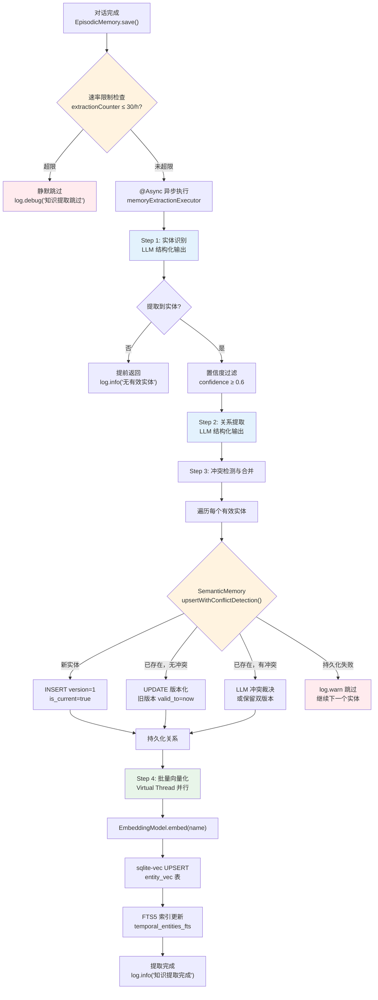
```mermaid
flowchart TD
    A["对话完成<br/>EpisodicMemory.save()"] --> B{"速率限制检查<br/>extractionCounter ≤ 30/h?"}

    B -->|"超限"| C["静默跳过<br/>log.debug('知识提取跳过')"]
    B -->|"未超限"| D["@Async 异步执行<br/>memoryExtractionExecutor"]

    D --> E["Step 1: 实体识别<br/>LLM 结构化输出"]
    E --> F{"提取到实体?"}
    F -->|"否"| G["提前返回<br/>log.info('无有效实体')"]
    F -->|"是"| H["置信度过滤<br/>confidence ≥ 0.6"]

    H --> I["Step 2: 关系提取<br/>LLM 结构化输出"]
    I --> J["Step 3: 冲突检测与合并"]

    J --> K["遍历每个有效实体"]
    K --> L{"SemanticMemory<br/>upsertWithConflictDetection()"}

    L -->|"新实体"| M["INSERT version=1<br/>is_current=true"]
    L -->|"已存在，无冲突"| N["UPDATE 版本化<br/>旧版本 valid_to=now"]
    L -->|"已存在，有冲突"| O["LLM 冲突裁决<br/>或保留双版本"]
    L -->|"持久化失败"| P["log.warn 跳过<br/>继续下一个实体"]

    M --> Q["持久化关系"]
    N --> Q
    O --> Q

    Q --> R["Step 4: 批量向量化<br/>Virtual Thread 并行"]
    R --> S["EmbeddingModel.embed(name)"]
    S --> T["sqlite-vec UPSERT<br/>entity_vec 表"]
    T --> U["FTS5 索引更新<br/>temporal_entities_fts"]

    U --> V["提取完成<br/>log.info('知识提取完成')"]

    style B fill:#fff3e0
    style E fill:#e3f2fd
    style I fill:#e3f2fd
    style L fill:#fff3e0
    style R fill:#e8f5e9
    style C fill:#ffebee
    style P fill:#ffebee
```

### 8.6 提取管线时序图

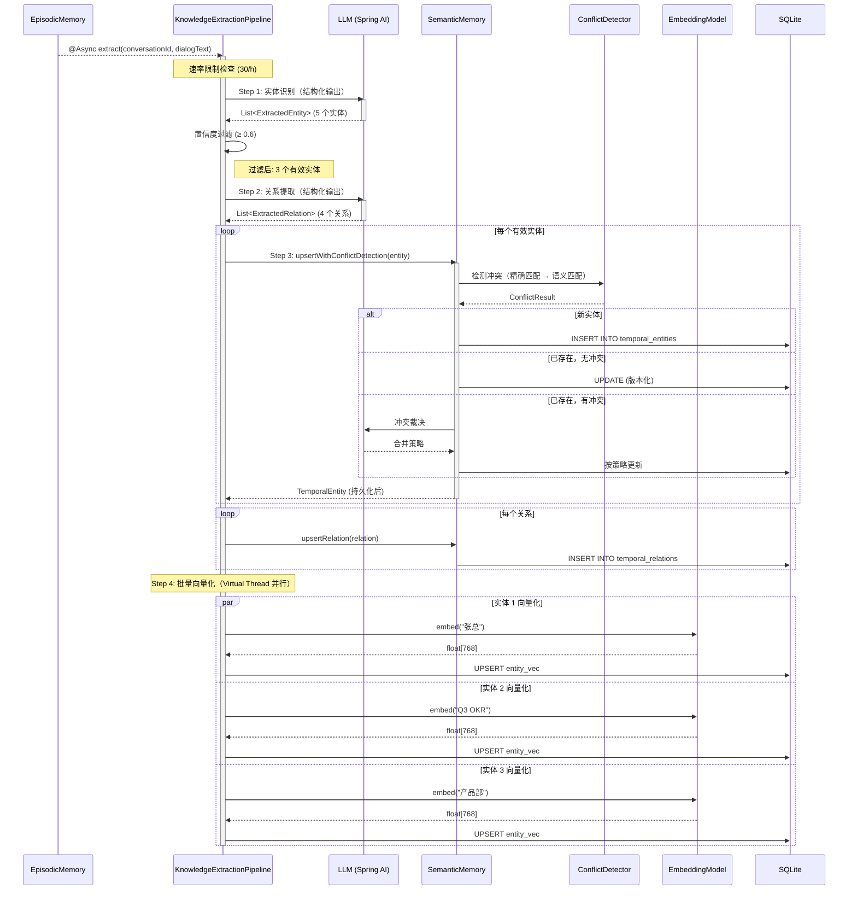
```mermaid
sequenceDiagram
    participant EM as EpisodicMemory
    participant KE as KnowledgeExtractionPipeline
    participant LLM as LLM (Spring AI)
    participant SM as SemanticMemory
    participant CD as ConflictDetector
    participant Emb as EmbeddingModel
    participant DB as SQLite

    EM-->>KE: @Async extract(conversationId, dialogText)
    activate KE

    Note over KE: 速率限制检查 (30/h)

    KE->>LLM: Step 1: 实体识别（结构化输出）
    activate LLM
    LLM-->>KE: List<ExtractedEntity> (5 个实体)
    deactivate LLM

    KE->>KE: 置信度过滤 (≥ 0.6)
    Note right of KE: 过滤后: 3 个有效实体

    KE->>LLM: Step 2: 关系提取（结构化输出）
    activate LLM
    LLM-->>KE: List<ExtractedRelation> (4 个关系)
    deactivate LLM

    loop 每个有效实体
        KE->>SM: Step 3: upsertWithConflictDetection(entity)
        activate SM
        SM->>CD: 检测冲突（精确匹配 → 语义匹配）
        CD-->>SM: ConflictResult
        alt 新实体
            SM->>DB: INSERT INTO temporal_entities
        else 已存在，无冲突
            SM->>DB: UPDATE (版本化)
        else 已存在，有冲突
            SM->>LLM: 冲突裁决
            LLM-->>SM: 合并策略
            SM->>DB: 按策略更新
        end
        SM-->>KE: TemporalEntity (持久化后)
        deactivate SM
    end

    loop 每个关系
        KE->>SM: upsertRelation(relation)
        SM->>DB: INSERT INTO temporal_relations
    end

    Note over KE: Step 4: 批量向量化（Virtual Thread 并行）

    par 实体 1 向量化
        KE->>Emb: embed("张总")
        Emb-->>KE: float[768]
        KE->>DB: UPSERT entity_vec
    and 实体 2 向量化
        KE->>Emb: embed("Q3 OKR")
        Emb-->>KE: float[768]
        KE->>DB: UPSERT entity_vec
    and 实体 3 向量化
        KE->>Emb: embed("产品部")
        Emb-->>KE: float[768]
        KE->>DB: UPSERT entity_vec
    end

    deactivate KE
```

### 8.7 错误处理与降级策略

知识提取管线遵循"尽力而为"原则——任何步骤的失败都不应影响 Agent 的核心功能：

| 失败场景 | 处理策略 | 日志级别 |
|---------|---------|---------|
| LLM 调用超时/失败 | 整个提取跳过，不重试 | WARN |
| 单个实体持久化失败 | 跳过该实体，继续处理其他实体 | WARN |
| 关系持久化失败 | 跳过该关系，继续处理其他关系 | WARN |
| 向量化失败 | 跳过该实体的向量索引，FTS5 索引仍可用 | WARN |
| 速率限制超限 | 静默丢弃提取请求 | DEBUG |
| 结构化输出解析失败 | 整个提取跳过 | WARN |

> **关键设计决策：知识提取管线永远不会抛出异常到 Agent 主循环。**
> 即使所有提取都失败，Agent 仍然可以正常工作——只是 L3 语义记忆不会更新，
> 检索质量可能略有下降，但不影响核心对话和工具执行能力。

### 8.8 配置参数

```yaml
lifepilot:
  memory:
    extraction:
      # 是否启用知识提取
      enabled: true
      # 每小时最大提取次数（控制 LLM 成本）
      max-extractions-per-hour: 30
      # 实体置信度阈值（低于此值的实体不持久化）
      confidence-threshold: 0.6
      # 向量化并行度（Virtual Thread 数量）
      vectorization-parallelism: 5
      # LLM 调用超时（秒）
      llm-timeout-seconds: 30
      # 最小对话长度（低于此长度的对话不触发提取）
      min-dialog-length: 100
```

---


## 9. 记忆巩固管线 ConsolidationPipeline

### 9.1 认知科学背景

记忆巩固（Memory Consolidation）是认知科学中的核心概念。人类大脑在睡眠期间会将白天形成的短期记忆（海马体）转化为长期记忆（新皮层）。这一过程不是简单的"复制粘贴"，而是**主动的重组和抽象**：

- **重复出现的模式**被提炼为一般性知识（"每次开会前都要查日历" → 形成习惯）
- **高频出现的实体**被强化为核心概念（"张总在最近 5 次对话中都被提到" → 重要人物）
- **成功的行为序列**被编码为自动化程序（"创建会议的 4 个步骤" → 操作模板）
- **低频、低价值的细节**逐渐被遗忘（"上周二下午 3:15 的闲聊" → 淡化）

LifePilot 的巩固管线模拟了这一认知过程，受 TiMem（[arXiv 2601.02845](https://arxiv.org/abs/2601.02845)）的时序记忆树（Temporal Memory Tree）启发——将原始观察逐层抽象为更高层次的表示。

### 9.2 双向巩固架构

巩固管线包含两个方向的记忆提炼：

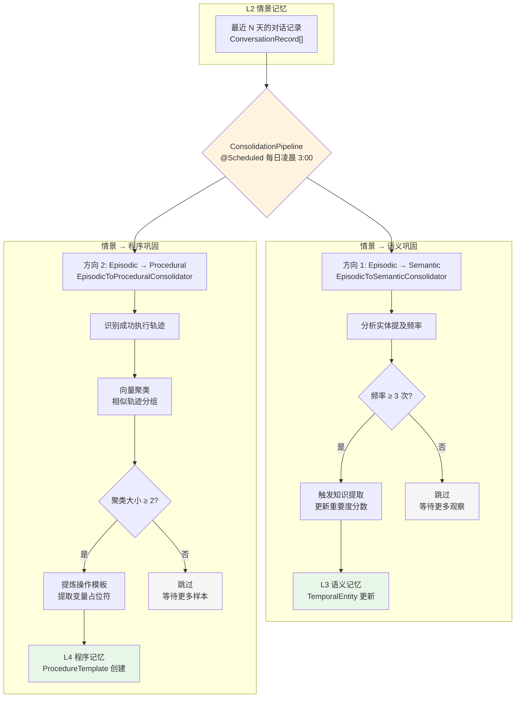
```mermaid
flowchart TD
    subgraph L2["L2 情景记忆"]
        A["最近 N 天的对话记录<br/>ConversationRecord[]"]
    end

    A --> B{"ConsolidationPipeline<br/>@Scheduled 每日凌晨 3:00"}

    B --> C["方向 1: Episodic → Semantic<br/>EpisodicToSemanticConsolidator"]
    B --> D["方向 2: Episodic → Procedural<br/>EpisodicToProceduralConsolidator"]

    subgraph 方向1["情景 → 语义巩固"]
        C --> C1["分析实体提及频率"]
        C1 --> C2{"频率 ≥ 3 次?"}
        C2 -->|"是"| C3["触发知识提取<br/>更新重要度分数"]
        C2 -->|"否"| C4["跳过<br/>等待更多观察"]
        C3 --> C5["L3 语义记忆<br/>TemporalEntity 更新"]
    end

    subgraph 方向2["情景 → 程序巩固"]
        D --> D1["识别成功执行轨迹"]
        D1 --> D2["向量聚类<br/>相似轨迹分组"]
        D2 --> D3{"聚类大小 ≥ 2?"}
        D3 -->|"是"| D4["提炼操作模板<br/>提取变量占位符"]
        D3 -->|"否"| D5["跳过<br/>等待更多样本"]
        D4 --> D6["L4 程序记忆<br/>ProcedureTemplate 创建"]
    end

    style B fill:#fff3e0
    style C5 fill:#e8f5e9
    style D6 fill:#e8f5e9
    style C4 fill:#f5f5f5
    style D5 fill:#f5f5f5
```

### 9.3 EpisodicToSemanticConsolidator

```java
package com.lifepilot.memory.consolidation;

import com.lifepilot.memory.episodic.ConversationRecord;
import com.lifepilot.memory.episodic.EpisodicMemory;
import com.lifepilot.memory.extraction.KnowledgeExtractionPipeline;
import com.lifepilot.memory.semantic.SemanticMemory;
import com.lifepilot.memory.semantic.TemporalEntity;
import org.slf4j.Logger;
import org.slf4j.LoggerFactory;
import org.springframework.jdbc.core.JdbcTemplate;
import org.springframework.stereotype.Component;

import java.time.Duration;
import java.time.Instant;
import java.util.*;
import java.util.stream.Collectors;

/**
 * 情景→语义巩固器 — 从近期对话中提炼高频实体为语义记忆。
 *
 * <p>巩固策略：
 * <ol>
 *   <li>获取最近 N 天的对话记录</li>
 *   <li>统计每个实体名称在对话中的提及频率</li>
 *   <li>高频实体（≥ 3 次提及）触发知识提取，更新重要度分数</li>
 *   <li>已存在的高频实体：提高 importanceScore</li>
 *   <li>新发现的高频实体：触发 KnowledgeExtractionPipeline 提取</li>
 * </ol></p>
 *
 * <p>受 TiMem 启发，巩固过程是**渐进式**的：
 * 不是一次性处理所有历史数据，而是每次只处理最近的增量窗口，
 * 逐步积累和强化语义记忆。</p>
 */
@Component
public class EpisodicToSemanticConsolidator {

    private static final Logger log = LoggerFactory.getLogger(
            EpisodicToSemanticConsolidator.class);

    /** 回溯窗口：分析最近 N 天的对话。 */
    private static final int LOOKBACK_DAYS = 7;
    /** 高频阈值：实体被提及 N 次以上视为高频。 */
    private static final int HIGH_FREQUENCY_THRESHOLD = 3;
    /** 重要度提升步长。 */
    private static final float IMPORTANCE_BOOST_STEP = 0.1f;

    private final EpisodicMemory episodicMemory;
    private final SemanticMemory semanticMemory;
    private final KnowledgeExtractionPipeline extractionPipeline;
    private final JdbcTemplate jdbc;

    public EpisodicToSemanticConsolidator(EpisodicMemory episodicMemory,
                                         SemanticMemory semanticMemory,
                                         KnowledgeExtractionPipeline extractionPipeline,
                                         JdbcTemplate jdbc) {
        this.episodicMemory = episodicMemory;
        this.semanticMemory = semanticMemory;
        this.extractionPipeline = extractionPipeline;
        this.jdbc = jdbc;
    }

    /**
     * 执行情景→语义巩固。
     *
     * @return 巩固结果统计
     */
    public ConsolidationStats consolidate() {
        log.info("情景→语义巩固开始: lookbackDays={}", LOOKBACK_DAYS);
        long startTime = System.nanoTime();

        // Step 1: 获取最近 N 天的对话
        Instant since = Instant.now().minus(Duration.ofDays(LOOKBACK_DAYS));
        List<ConversationRecord> recentConversations = episodicMemory.getRecent(
                Duration.ofDays(LOOKBACK_DAYS));

        if (recentConversations.isEmpty()) {
            log.info("情景→语义巩固跳过: 无近期对话");
            return new ConsolidationStats(0, 0, 0, 0);
        }

        // Step 2: 统计实体提及频率
        // 从 L3 已有实体中匹配对话文本中的提及
        List<TemporalEntity> existingEntities = semanticMemory.getAllCurrent();
        Map<String, Integer> mentionCounts = new HashMap<>();
        Map<String, List<String>> mentionConversations = new HashMap<>();

        for (var conversation : recentConversations) {
            String fullText = conversation.messages().stream()
                    .map(m -> m.content())
                    .collect(Collectors.joining(" "));

            for (var entity : existingEntities) {
                if (fullText.contains(entity.name())) {
                    mentionCounts.merge(entity.id(), 1, Integer::sum);
                    mentionConversations.computeIfAbsent(entity.id(), k -> new ArrayList<>())
                            .add(conversation.id());
                }
            }
        }

        // Step 3: 处理高频实体
        int boostedCount = 0;
        int extractedCount = 0;

        for (var entry : mentionCounts.entrySet()) {
            if (entry.getValue() >= HIGH_FREQUENCY_THRESHOLD) {
                String entityId = entry.getKey();
                int frequency = entry.getValue();

                // 提高重要度分数
                float boost = Math.min(IMPORTANCE_BOOST_STEP * (frequency - HIGH_FREQUENCY_THRESHOLD + 1), 0.3f);
                jdbc.update("""
                        UPDATE temporal_entities SET
                            importance_score = MIN(1.0, importance_score + ?),
                            updated_at = datetime('now')
                        WHERE id = ? AND is_current = 1
                        """, boost, entityId);
                boostedCount++;

                log.debug("实体重要度提升: entityId={}, frequency={}, boost={}",
                        entityId, frequency, boost);
            }
        }

        // Step 4: 对未被 L3 覆盖的高频对话触发知识提取
        // 找出包含大量未识别实体的对话
        for (var conversation : recentConversations) {
            String fullText = conversation.messages().stream()
                    .map(m -> m.content())
                    .collect(Collectors.joining(" "));

            // 如果对话文本较长且尚未被充分提取
            if (fullText.length() > 200 && !isFullyExtracted(conversation.id())) {
                extractionPipeline.extract(conversation.id(), fullText);
                extractedCount++;
            }
        }

        // Step 5: 记录巩固日志
        long elapsed = (System.nanoTime() - startTime) / 1_000_000;
        var stats = new ConsolidationStats(
                recentConversations.size(), mentionCounts.size(),
                boostedCount, extractedCount);

        logConsolidation("EPISODIC_TO_SEMANTIC", stats, elapsed);

        log.info("情景→语义巩固完成: conversations={}, entities={}, " +
                        "boosted={}, extracted={}, elapsed={}ms",
                stats.conversationsAnalyzed(), stats.entitiesFound(),
                stats.entitiesBoosted(), stats.extractionsTriggered(), elapsed);

        return stats;
    }

    /** 检查对话是否已被充分提取。 */
    private boolean isFullyExtracted(String conversationId) {
        Integer count = jdbc.queryForObject("""
                SELECT COUNT(*) FROM temporal_entities
                WHERE source_conversation_id = ?
                """, Integer.class, conversationId);
        return count != null && count > 0;
    }

    /** 记录巩固日志到数据库。 */
    private void logConsolidation(String type, ConsolidationStats stats, long elapsedMs) {
        jdbc.update("""
                INSERT INTO memory_consolidation_log
                    (id, consolidation_type, conversations_analyzed,
                     entities_found, entities_boosted, extractions_triggered,
                     elapsed_ms, created_at)
                VALUES (?, ?, ?, ?, ?, ?, ?, datetime('now'))
                """,
                UUID.randomUUID().toString(), type,
                stats.conversationsAnalyzed(), stats.entitiesFound(),
                stats.entitiesBoosted(), stats.extractionsTriggered(),
                elapsedMs);
    }

    /**
     * 巩固统计结果。
     *
     * @param conversationsAnalyzed 分析的对话数
     * @param entitiesFound         发现的实体数
     * @param entitiesBoosted       重要度提升的实体数
     * @param extractionsTriggered  触发的知识提取数
     */
    public record ConsolidationStats(
            int conversationsAnalyzed,
            int entitiesFound,
            int entitiesBoosted,
            int extractionsTriggered
    ) {}
}
```


### 9.4 EpisodicToProceduralConsolidator

```java
package com.lifepilot.memory.consolidation;

import com.lifepilot.memory.episodic.ConversationRecord;
import com.lifepilot.memory.episodic.EpisodicMemory;
import com.lifepilot.memory.episodic.MessageRecord;
import com.lifepilot.memory.procedural.ProceduralMemory;
import com.lifepilot.memory.procedural.ProcedureTemplate;
import com.lifepilot.memory.procedural.TemplateStep;
import org.slf4j.Logger;
import org.slf4j.LoggerFactory;
import org.springframework.ai.embedding.EmbeddingModel;
import org.springframework.stereotype.Component;

import java.time.Duration;
import java.time.Instant;
import java.util.*;
import java.util.stream.Collectors;

/**
 * 情景→程序巩固器 — 从成功执行轨迹中提炼操作模板。
 *
 * <p>巩固策略：
 * <ol>
 *   <li>获取最近 N 天包含工具调用的成功对话</li>
 *   <li>提取每个对话的执行轨迹（工具调用序列）</li>
 *   <li>使用向量相似度对轨迹进行聚类</li>
 *   <li>聚类大小 ≥ 2 的模式提炼为操作模板</li>
 *   <li>识别可参数化的部分，提取模板变量</li>
 * </ol></p>
 *
 * <p>模板变量提取规则：
 * <ul>
 *   <li>在多次执行中值不同的参数 → 模板变量（如日期、人名）</li>
 *   <li>在多次执行中值相同的参数 → 固定值（如工具 ID、操作类型）</li>
 * </ul></p>
 */
@Component
public class EpisodicToProceduralConsolidator {

    private static final Logger log = LoggerFactory.getLogger(
            EpisodicToProceduralConsolidator.class);

    /** 回溯窗口。 */
    private static final int LOOKBACK_DAYS = 7;
    /** 聚类阈值：相似度 ≥ 0.85 的轨迹归为同一聚类。 */
    private static final float CLUSTER_SIMILARITY_THRESHOLD = 0.85f;
    /** 最小聚类大小：至少 2 次相似执行才提炼模板。 */
    private static final int MIN_CLUSTER_SIZE = 2;

    private final EpisodicMemory episodicMemory;
    private final ProceduralMemory proceduralMemory;
    private final EmbeddingModel embeddingModel;

    public EpisodicToProceduralConsolidator(EpisodicMemory episodicMemory,
                                            ProceduralMemory proceduralMemory,
                                            EmbeddingModel embeddingModel) {
        this.episodicMemory = episodicMemory;
        this.proceduralMemory = proceduralMemory;
        this.embeddingModel = embeddingModel;
    }

    /**
     * 执行情景→程序巩固。
     *
     * @return 提炼出的模板数量
     */
    public int consolidate() {
        log.info("情景→程序巩固开始: lookbackDays={}", LOOKBACK_DAYS);
        long startTime = System.nanoTime();

        // Step 1: 获取包含工具调用的成功对话
        List<ConversationRecord> conversations = episodicMemory.getRecent(
                Duration.ofDays(LOOKBACK_DAYS));

        List<ExecutionTrace> traces = conversations.stream()
                .map(this::extractTrace)
                .filter(t -> t.steps().size() >= 2) // 至少 2 步才有意义
                .toList();

        if (traces.size() < MIN_CLUSTER_SIZE) {
            log.info("情景→程序巩固跳过: 有效轨迹不足, traces={}", traces.size());
            return 0;
        }

        // Step 2: 向量化轨迹描述
        Map<ExecutionTrace, float[]> traceEmbeddings = new HashMap<>();
        for (var trace : traces) {
            String description = trace.steps().stream()
                    .map(s -> s.toolId() + "." + s.action())
                    .collect(Collectors.joining(" → "));
            traceEmbeddings.put(trace, embeddingModel.embed(description));
        }

        // Step 3: 简单聚类（贪心，基于余弦相似度）
        List<List<ExecutionTrace>> clusters = greedyCluster(traces, traceEmbeddings);

        // Step 4: 从大聚类中提炼模板
        int templatesCreated = 0;
        for (var cluster : clusters) {
            if (cluster.size() >= MIN_CLUSTER_SIZE) {
                var template = extractTemplate(cluster);
                if (template.isPresent()) {
                    proceduralMemory.save(template.get());
                    templatesCreated++;
                    log.info("操作模板已提炼: name='{}', steps={}, sources={}",
                            template.get().name(), template.get().steps().size(),
                            cluster.size());
                }
            }
        }

        long elapsed = (System.nanoTime() - startTime) / 1_000_000;
        log.info("情景→程序巩固完成: traces={}, clusters={}, templates={}, elapsed={}ms",
                traces.size(), clusters.size(), templatesCreated, elapsed);

        return templatesCreated;
    }

    /**
     * 从对话记录中提取执行轨迹。
     *
     * <p>执行轨迹 = 对话中所有工具调用的有序序列。</p>
     */
    private ExecutionTrace extractTrace(ConversationRecord conversation) {
        List<TemplateStep> steps = new ArrayList<>();
        int stepOrder = 1;

        for (var message : conversation.messages()) {
            if (message instanceof MessageRecord mr && mr.toolCallJson() != null) {
                // 解析工具调用 JSON
                try {
                    var toolCall = parseToolCall(mr.toolCallJson());
                    steps.add(new TemplateStep(
                            stepOrder++,
                            toolCall.toolId(),
                            toolCall.action(),
                            toolCall.parameters(),
                            mr.content(),
                            false));
                } catch (Exception e) {
                    log.debug("工具调用解析失败（跳过）: {}", e.getMessage());
                }
            }
        }

        return new ExecutionTrace(
                conversation.id(),
                conversation.goal(),
                steps,
                conversation.createdAt());
    }

    /**
     * 贪心聚类：将相似轨迹分组。
     *
     * <p>算法：遍历所有轨迹，对于每个轨迹，找到与之最相似的已有聚类；
     * 如果相似度 ≥ 阈值，加入该聚类；否则创建新聚类。</p>
     */
    private List<List<ExecutionTrace>> greedyCluster(
            List<ExecutionTrace> traces,
            Map<ExecutionTrace, float[]> embeddings) {

        List<List<ExecutionTrace>> clusters = new ArrayList<>();
        List<float[]> clusterCentroids = new ArrayList<>();

        for (var trace : traces) {
            float[] embedding = embeddings.get(trace);
            int bestCluster = -1;
            float bestSimilarity = 0f;

            for (int i = 0; i < clusterCentroids.size(); i++) {
                float similarity = cosineSimilarity(embedding, clusterCentroids.get(i));
                if (similarity > bestSimilarity) {
                    bestSimilarity = similarity;
                    bestCluster = i;
                }
            }

            if (bestSimilarity >= CLUSTER_SIMILARITY_THRESHOLD && bestCluster >= 0) {
                clusters.get(bestCluster).add(trace);
                // 更新质心（简单平均）
                clusterCentroids.set(bestCluster,
                        averageEmbeddings(clusters.get(bestCluster), embeddings));
            } else {
                var newCluster = new ArrayList<ExecutionTrace>();
                newCluster.add(trace);
                clusters.add(newCluster);
                clusterCentroids.add(embedding);
            }
        }

        return clusters;
    }

    /**
     * 从轨迹聚类中提炼操作模板。
     *
     * <p>提炼规则：
     * <ul>
     *   <li>取聚类中最常见的步骤序列作为模板步骤</li>
     *   <li>在多次执行中值不同的参数 → 模板变量 ${variableName}</li>
     *   <li>模板名称取自聚类中对话的共同目标</li>
     * </ul></p>
     */
    private Optional<ProcedureTemplate> extractTemplate(List<ExecutionTrace> cluster) {
        if (cluster.isEmpty()) return Optional.empty();

        // 取第一个轨迹作为基准
        var baseTrace = cluster.getFirst();
        var baseSteps = baseTrace.steps();

        // 识别变量：在多次执行中值不同的参数
        Map<String, String> variables = new HashMap<>();
        List<TemplateStep> templateSteps = new ArrayList<>();

        for (int i = 0; i < baseSteps.size(); i++) {
            var baseStep = baseSteps.get(i);
            Map<String, String> paramTemplate = new HashMap<>();

            for (var paramEntry : baseStep.parameterTemplate().entrySet()) {
                String paramKey = paramEntry.getKey();
                String paramValue = paramEntry.getValue();

                // 检查该参数在其他轨迹中是否有不同值
                boolean varies = false;
                for (int j = 1; j < cluster.size(); j++) {
                    var otherTrace = cluster.get(j);
                    if (i < otherTrace.steps().size()) {
                        var otherStep = otherTrace.steps().get(i);
                        String otherValue = otherStep.parameterTemplate().get(paramKey);
                        if (otherValue != null && !otherValue.equals(paramValue)) {
                            varies = true;
                            break;
                        }
                    }
                }

                if (varies) {
                    // 参数值变化 → 模板变量
                    String varName = baseStep.toolId() + "_" + paramKey;
                    variables.put(varName, paramValue); // 默认值取第一次的值
                    paramTemplate.put(paramKey, "${" + varName + "}");
                } else {
                    // 参数值固定 → 保留原值
                    paramTemplate.put(paramKey, paramValue);
                }
            }

            templateSteps.add(new TemplateStep(
                    i + 1, baseStep.toolId(), baseStep.action(),
                    Map.copyOf(paramTemplate), baseStep.description(), false));
        }

        // 生成模板名称（取共同目标的关键词）
        String name = baseTrace.goal() != null ? baseTrace.goal() : "自动提炼模板";
        String triggerIntent = cluster.stream()
                .map(ExecutionTrace::goal)
                .filter(Objects::nonNull)
                .collect(Collectors.joining("; "));

        List<String> sourceTraceIds = cluster.stream()
                .map(ExecutionTrace::conversationId)
                .toList();

        return Optional.of(new ProcedureTemplate(
                UUID.randomUUID().toString(),
                name,
                "从 %d 次成功执行中自动提炼".formatted(cluster.size()),
                triggerIntent,
                List.copyOf(templateSteps),
                Map.copyOf(variables),
                1.0f,  // 初始成功率 100%（来源都是成功执行）
                0,     // 使用次数从 0 开始
                null,
                List.copyOf(sourceTraceIds),
                Instant.now(),
                Instant.now()));
    }

    /** 余弦相似度计算。 */
    private float cosineSimilarity(float[] a, float[] b) {
        float dotProduct = 0f, normA = 0f, normB = 0f;
        for (int i = 0; i < a.length; i++) {
            dotProduct += a[i] * b[i];
            normA += a[i] * a[i];
            normB += b[i] * b[i];
        }
        return (float) (dotProduct / (Math.sqrt(normA) * Math.sqrt(normB) + 1e-8));
    }

    /** 计算聚类中所有轨迹向量的平均值。 */
    private float[] averageEmbeddings(List<ExecutionTrace> cluster,
                                      Map<ExecutionTrace, float[]> embeddings) {
        float[] avg = new float[768];
        for (var trace : cluster) {
            float[] emb = embeddings.get(trace);
            if (emb != null) {
                for (int i = 0; i < avg.length; i++) avg[i] += emb[i];
            }
        }
        for (int i = 0; i < avg.length; i++) avg[i] /= cluster.size();
        return avg;
    }

    /** 解析工具调用 JSON（简化实现）。 */
    private ToolCallInfo parseToolCall(String json) {
        // 省略：实际实现使用 Jackson 反序列化
        throw new UnsupportedOperationException("实现省略");
    }

    /** 执行轨迹。 */
    private record ExecutionTrace(
            String conversationId,
            String goal,
            List<TemplateStep> steps,
            Instant createdAt
    ) {}

    /** 工具调用信息。 */
    private record ToolCallInfo(
            String toolId,
            String action,
            Map<String, String> parameters
    ) {}
}
```


### 9.5 ConsolidationPipeline 编排服务

```java
package com.lifepilot.memory.consolidation;

import org.slf4j.Logger;
import org.slf4j.LoggerFactory;
import org.springframework.scheduling.annotation.Scheduled;
import org.springframework.stereotype.Service;

/**
 * 巩固管线编排服务 — 定时调度两个方向的记忆巩固。
 *
 * <p>调度策略：
 * <ul>
 *   <li>每日凌晨 3:00 执行（用户通常不活跃的时段）</li>
 *   <li>先执行情景→语义巩固，再执行情景→程序巩固</li>
 *   <li>两个方向串行执行，避免同时大量 LLM 调用</li>
 * </ul></p>
 *
 * <p>容错策略：任一方向的巩固失败不影响另一方向。
 * 失败时记录 ERROR 日志，下次调度时重试。</p>
 */
@Service
public class ConsolidationPipeline {

    private static final Logger log = LoggerFactory.getLogger(ConsolidationPipeline.class);

    private final EpisodicToSemanticConsolidator semanticConsolidator;
    private final EpisodicToProceduralConsolidator proceduralConsolidator;

    public ConsolidationPipeline(EpisodicToSemanticConsolidator semanticConsolidator,
                                 EpisodicToProceduralConsolidator proceduralConsolidator) {
        this.semanticConsolidator = semanticConsolidator;
        this.proceduralConsolidator = proceduralConsolidator;
    }

    /**
     * 每日凌晨 3:00 执行记忆巩固。
     *
     * <p>使用 Spring {@code @Scheduled} 注解，cron 表达式 {@code 0 0 3 * * *}
     * 表示每天凌晨 3:00 触发。</p>
     */
    @Scheduled(cron = "0 0 3 * * *")
    public void dailyConsolidation() {
        log.info("═══ 每日记忆巩固开始 ═══");
        long startTime = System.nanoTime();

        // 方向 1: 情景 → 语义
        try {
            var semanticStats = semanticConsolidator.consolidate();
            log.info("情景→语义巩固结果: conversations={}, boosted={}, extracted={}",
                    semanticStats.conversationsAnalyzed(),
                    semanticStats.entitiesBoosted(),
                    semanticStats.extractionsTriggered());
        } catch (Exception e) {
            log.error("情景→语义巩固失败: {}", e.getMessage(), e);
        }

        // 方向 2: 情景 → 程序
        try {
            int templatesCreated = proceduralConsolidator.consolidate();
            log.info("情景→程序巩固结果: templates={}", templatesCreated);
        } catch (Exception e) {
            log.error("情景→程序巩固失败: {}", e.getMessage(), e);
        }

        long elapsed = (System.nanoTime() - startTime) / 1_000_000;
        log.info("═══ 每日记忆巩固完成: elapsed={}ms ═══", elapsed);
    }

    /**
     * 手动触发巩固（用于测试和调试）。
     */
    public void manualConsolidation() {
        log.info("手动触发记忆巩固");
        dailyConsolidation();
    }
}
```

### 9.6 每日巩固周期时序图

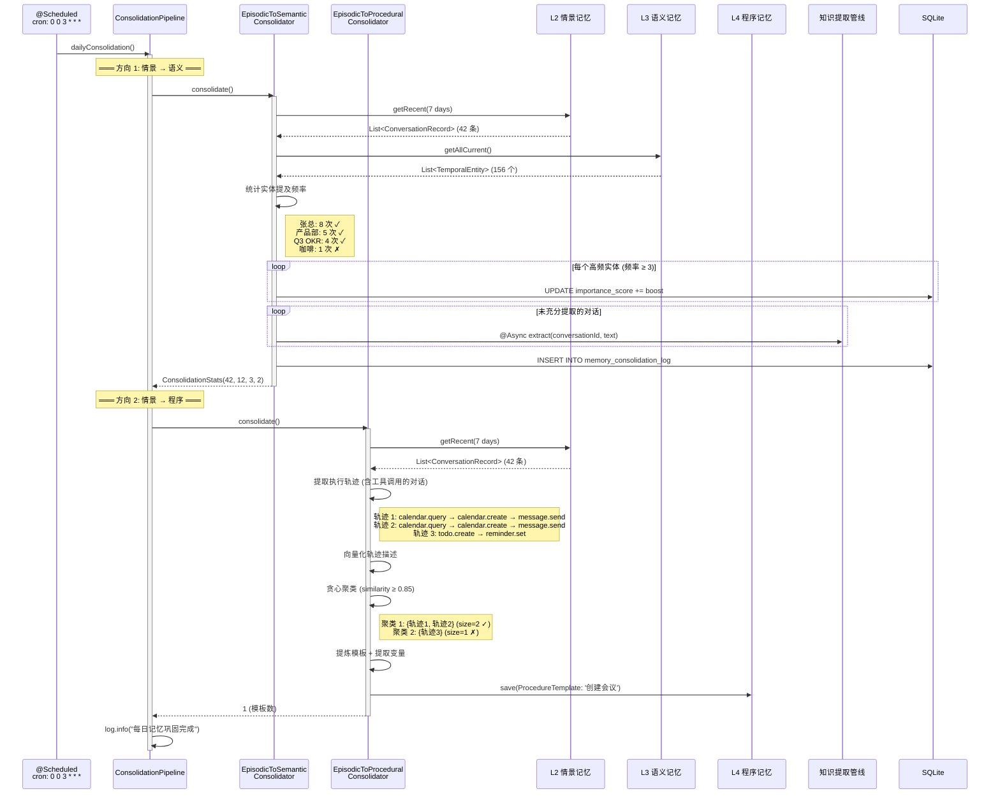
```mermaid
sequenceDiagram
    participant Scheduler as @Scheduled<br/>cron: 0 0 3 * * *
    participant CP as ConsolidationPipeline
    participant ESC as EpisodicToSemantic<br/>Consolidator
    participant EPC as EpisodicToProcedural<br/>Consolidator
    participant L2 as L2 情景记忆
    participant L3 as L3 语义记忆
    participant L4 as L4 程序记忆
    participant KE as 知识提取管线
    participant DB as SQLite

    Scheduler->>CP: dailyConsolidation()
    activate CP

    Note over CP: ═══ 方向 1: 情景 → 语义 ═══

    CP->>ESC: consolidate()
    activate ESC

    ESC->>L2: getRecent(7 days)
    L2-->>ESC: List<ConversationRecord> (42 条)

    ESC->>L3: getAllCurrent()
    L3-->>ESC: List<TemporalEntity> (156 个)

    ESC->>ESC: 统计实体提及频率
    Note right of ESC: 张总: 8 次 ✓<br/>产品部: 5 次 ✓<br/>Q3 OKR: 4 次 ✓<br/>咖啡: 1 次 ✗

    loop 每个高频实体 (频率 ≥ 3)
        ESC->>DB: UPDATE importance_score += boost
    end

    loop 未充分提取的对话
        ESC->>KE: @Async extract(conversationId, text)
    end

    ESC->>DB: INSERT INTO memory_consolidation_log
    ESC-->>CP: ConsolidationStats(42, 12, 3, 2)
    deactivate ESC

    Note over CP: ═══ 方向 2: 情景 → 程序 ═══

    CP->>EPC: consolidate()
    activate EPC

    EPC->>L2: getRecent(7 days)
    L2-->>EPC: List<ConversationRecord> (42 条)

    EPC->>EPC: 提取执行轨迹 (含工具调用的对话)
    Note right of EPC: 轨迹 1: calendar.query → calendar.create → message.send<br/>轨迹 2: calendar.query → calendar.create → message.send<br/>轨迹 3: todo.create → reminder.set

    EPC->>EPC: 向量化轨迹描述
    EPC->>EPC: 贪心聚类 (similarity ≥ 0.85)
    Note right of EPC: 聚类 1: {轨迹1, 轨迹2} (size=2 ✓)<br/>聚类 2: {轨迹3} (size=1 ✗)

    EPC->>EPC: 提炼模板 + 提取变量
    EPC->>L4: save(ProcedureTemplate: '创建会议')

    EPC-->>CP: 1 (模板数)
    deactivate EPC

    CP->>CP: log.info("每日记忆巩固完成")
    deactivate CP
```

### 9.7 巩固日志 Schema

```sql
-- 记忆巩固日志表
CREATE TABLE IF NOT EXISTS memory_consolidation_log (
    id                      TEXT PRIMARY KEY,
    consolidation_type      TEXT NOT NULL,       -- EPISODIC_TO_SEMANTIC / EPISODIC_TO_PROCEDURAL
    conversations_analyzed  INTEGER NOT NULL DEFAULT 0,
    entities_found          INTEGER NOT NULL DEFAULT 0,
    entities_boosted        INTEGER NOT NULL DEFAULT 0,
    extractions_triggered   INTEGER NOT NULL DEFAULT 0,
    templates_created       INTEGER NOT NULL DEFAULT 0,
    elapsed_ms              INTEGER NOT NULL DEFAULT 0,
    error_message           TEXT,                -- 失败时的错误信息
    created_at              TEXT NOT NULL DEFAULT (datetime('now'))
);

-- 按类型和时间查询巩固历史
CREATE INDEX IF NOT EXISTS idx_consolidation_log_type_time
    ON memory_consolidation_log(consolidation_type, created_at DESC);
```

### 9.8 配置参数

```yaml
lifepilot:
  memory:
    consolidation:
      # 是否启用自动巩固
      enabled: true
      # 巩固调度 cron 表达式（默认每日凌晨 3:00）
      cron: "0 0 3 * * *"
      # 情景→语义巩固配置
      episodic-to-semantic:
        # 回溯窗口（天）
        lookback-days: 7
        # 高频阈值（实体被提及 N 次以上视为高频）
        high-frequency-threshold: 3
        # 重要度提升步长
        importance-boost-step: 0.1
      # 情景→程序巩固配置
      episodic-to-procedural:
        # 回溯窗口（天）
        lookback-days: 7
        # 聚类相似度阈值
        cluster-similarity-threshold: 0.85
        # 最小聚类大小
        min-cluster-size: 2
```

---


## 10. 遗忘策略引擎 ForgettingEngine

### 10.1 认知科学背景

遗忘（Forgetting）在传统软件工程中被视为数据丢失——一种需要避免的故障。但认知科学告诉我们，**遗忘是人类认知系统的核心特性，而非缺陷**。

FadeMem（[arXiv 2601.18642](https://arxiv.org/abs/2601.18642)）的核心洞察：

> **主动遗忘低价值信息可以提升检索精度和推理质量。**
> 无限积累的记忆会引入噪声，降低信噪比，使 Agent 在海量信息中迷失方向。

人类大脑的遗忘机制服务于三个目的：

1. **资源优化**：大脑的存储和计算资源有限，遗忘释放资源给更重要的信息
2. **噪声过滤**：过时、错误、低价值的信息被遗忘，提高记忆的整体质量
3. **隐私保护**：敏感信息随时间自然淡化，降低隐私泄露风险

MaRS（[arXiv 2512.12856](https://arxiv.org/abs/2512.12856)）将遗忘形式化为 Agent 记忆系统的核心组件，提出了 6 种遗忘策略，其中 Hybrid 策略在综合评估中达到最佳得分 ≈ 0.911。

### 10.2 MaRS 六种遗忘策略

LifePilot 完整实现了 MaRS 论文提出的 6 种遗忘策略，并扩展了隐私感知维度：

```mermaid
flowchart TD
    subgraph 策略集["MaRS 6 种遗忘策略"]
        direction TB
        P1["1. FIFO<br/>先进先出"]
        P2["2. LRU<br/>最近最少使用"]
        P3["3. Priority Decay<br/>优先级衰减"]
        P4["4. Reflection-Summary<br/>反思摘要"]
        P5["5. Random-Drop<br/>随机丢弃"]
        P6["6. Hybrid<br/>混合策略"]
    end

    P1 -.->|"工作记忆溢出"| U1["淘汰最早进入的记忆<br/>简单高效，无需计算"]
    P2 -.->|"长期未访问"| U2["淘汰最久未被检索的记忆<br/>基于 last_accessed_at"]
    P3 -.->|"重要度随时间衰减"| U3["importance × exp(-λt)<br/>指数衰减曲线"]
    P4 -.->|"压缩而非删除"| U4["LLM 生成摘要替代原文<br/>保留核心信息"]
    P5 -.->|"差分隐私"| U5["概率性随机遗忘<br/>保护隐私模式"]
    P6 -.->|"分阶段融合"| U6["FIFO → LRU → PD → RS<br/>渐进式遗忘"]

    style P6 fill:#e8f5e9,stroke:#4caf50,stroke-width:2px
    style U6 fill:#e8f5e9
```

| 策略 | 适用场景 | 计算成本 | 信息保留度 | MaRS 评分 |
|------|---------|---------|-----------|----------|
| **FIFO** | L1 工作记忆溢出 | O(1) | 低（直接丢弃） | 0.723 |
| **LRU** | L3 长期未访问实体 | O(1) | 低（直接丢弃） | 0.801 |
| **Priority Decay** | L3 重要度衰减实体 | O(n) | 中（按优先级） | 0.856 |
| **Reflection-Summary** | L2 历史对话压缩 | O(LLM) | 高（摘要保留） | 0.889 |
| **Random-Drop** | 隐私保护场景 | O(1) | 随机 | 0.745 |
| **Hybrid** | **默认策略** | O(n + LLM) | **最高** | **0.911** |

### 10.3 ForgettingPolicy — 遗忘策略类型体系

```java
package com.lifepilot.memory.forgetting;

import com.lifepilot.memory.semantic.TemporalEntity;

import java.time.Duration;
import java.time.Instant;
import java.util.List;
import java.util.Random;

/**
 * 遗忘策略 — 定义如何选择需要遗忘的记忆。
 *
 * <p>使用 sealed interface 限定 6 种策略实现，
 * 对应 MaRS 论文提出的 6 种遗忘策略。</p>
 *
 * <p>每种策略实现 {@code selectForForgetting} 方法，
 * 从候选实体列表中选择应该被遗忘的实体。</p>
 */
public sealed interface ForgettingPolicy
        permits FifoPolicy, LruPolicy, PriorityDecayPolicy,
                ReflectionSummaryPolicy, RandomDropPolicy, HybridPolicy {

    /**
     * 从候选实体中选择应该被遗忘的实体。
     *
     * @param candidates 候选实体列表
     * @param budget     最多遗忘的实体数量
     * @return 应该被遗忘的实体列表
     */
    List<TemporalEntity> selectForForgetting(List<TemporalEntity> candidates, int budget);

    /** 策略名称。 */
    String name();
}

/**
 * FIFO 策略 — 先进先出，淘汰最早创建的记忆。
 *
 * <p>适用场景：L1 工作记忆溢出时的快速淘汰。
 * 优点：O(1) 计算成本，实现简单。
 * 缺点：不考虑记忆的重要性和使用频率。</p>
 */
public record FifoPolicy() implements ForgettingPolicy {

    @Override
    public List<TemporalEntity> selectForForgetting(List<TemporalEntity> candidates, int budget) {
        return candidates.stream()
                .sorted((a, b) -> a.createdAt().compareTo(b.createdAt()))
                .limit(budget)
                .toList();
    }

    @Override
    public String name() { return "FIFO"; }
}

/**
 * LRU 策略 — 最近最少使用，淘汰最久未被检索的记忆。
 *
 * <p>适用场景：L3 语义记忆中长期未被访问的实体。
 * 基于 {@code last_accessed_at} 和 {@code access_count} 判断。</p>
 */
public record LruPolicy() implements ForgettingPolicy {

    @Override
    public List<TemporalEntity> selectForForgetting(List<TemporalEntity> candidates, int budget) {
        return candidates.stream()
                .sorted((a, b) -> {
                    // 优先淘汰 last_accessed_at 最早的
                    Instant aTime = a.lastAccessedAt() != null ? a.lastAccessedAt() : a.createdAt();
                    Instant bTime = b.lastAccessedAt() != null ? b.lastAccessedAt() : b.createdAt();
                    return aTime.compareTo(bTime);
                })
                .limit(budget)
                .toList();
    }

    @Override
    public String name() { return "LRU"; }
}

/**
 * Priority Decay 策略 — 优先级随时间指数衰减。
 *
 * <p>衰减公式：{@code effectivePriority = importanceScore × exp(-λ × daysSinceLastAccess)}
 * 其中 λ = 0.02（半衰期约 35 天）。</p>
 *
 * <p>效果：即使是高重要度的实体，如果长期不被访问，
 * 其有效优先级也会逐渐衰减到遗忘阈值以下。</p>
 */
public record PriorityDecayPolicy(float decayRate) implements ForgettingPolicy {

    /** 默认衰减率 λ = 0.02（半衰期约 35 天）。 */
    public static final float DEFAULT_DECAY_RATE = 0.02f;

    public PriorityDecayPolicy() {
        this(DEFAULT_DECAY_RATE);
    }

    @Override
    public List<TemporalEntity> selectForForgetting(List<TemporalEntity> candidates, int budget) {
        return candidates.stream()
                .sorted((a, b) -> Float.compare(
                        effectivePriority(a), effectivePriority(b)))
                .limit(budget)
                .toList();
    }

    /** 计算实体的有效优先级（考虑时间衰减）。 */
    public float effectivePriority(TemporalEntity entity) {
        Instant lastAccess = entity.lastAccessedAt() != null
                ? entity.lastAccessedAt() : entity.createdAt();
        long daysSince = Duration.between(lastAccess, Instant.now()).toDays();
        return entity.importanceScore() * (float) Math.exp(-decayRate * daysSince);
    }

    @Override
    public String name() { return "PRIORITY_DECAY"; }
}

/**
 * Reflection-Summary 策略 — 反思摘要，压缩而非删除。
 *
 * <p>不直接删除记忆，而是使用 LLM 生成摘要替代原始详细描述。
 * 这样既释放了存储空间（摘要比原文短），又保留了核心信息。</p>
 *
 * <p>适用场景：中等重要度的实体（importanceScore ∈ [0.3, 0.8]），
 * 不值得完全保留，但也不应完全丢弃。</p>
 *
 * <p>注意：此策略不直接选择实体进行遗忘，而是标记实体进行压缩。
 * 实际的 LLM 摘要生成由 {@code ForgettingEngine} 统一调度。</p>
 */
public record ReflectionSummaryPolicy() implements ForgettingPolicy {

    @Override
    public List<TemporalEntity> selectForForgetting(List<TemporalEntity> candidates, int budget) {
        // 选择中等重要度的实体进行压缩
        return candidates.stream()
                .filter(e -> e.importanceScore() >= 0.3f && e.importanceScore() < 0.8f)
                .sorted((a, b) -> Float.compare(a.importanceScore(), b.importanceScore()))
                .limit(budget)
                .toList();
    }

    @Override
    public String name() { return "REFLECTION_SUMMARY"; }
}

/**
 * Random-Drop 策略 — 概率性随机遗忘。
 *
 * <p>以固定概率随机丢弃记忆，不考虑重要性或时间。
 * 主要用于差分隐私场景——通过随机性防止攻击者推断特定记忆的存在。</p>
 *
 * @param dropProbability 丢弃概率 [0.0, 1.0]（默认 0.1 = 10%）
 */
public record RandomDropPolicy(float dropProbability) implements ForgettingPolicy {

    public static final float DEFAULT_DROP_PROBABILITY = 0.1f;

    public RandomDropPolicy() {
        this(DEFAULT_DROP_PROBABILITY);
    }

    @Override
    public List<TemporalEntity> selectForForgetting(List<TemporalEntity> candidates, int budget) {
        var random = new Random();
        return candidates.stream()
                .filter(e -> random.nextFloat() < dropProbability)
                .limit(budget)
                .toList();
    }

    @Override
    public String name() { return "RANDOM_DROP"; }
}

/**
 * Hybrid 策略 — 分阶段融合所有策略，MaRS 最佳策略（评分 ≈ 0.911）。
 *
 * <p>分阶段遗忘流程：
 * <ol>
 *   <li>FIFO 阶段：淘汰超过最大保留期限的实体（如 365 天）</li>
 *   <li>LRU 阶段：淘汰超过 90 天未访问且 accessCount = 0 的实体</li>
 *   <li>Priority Decay 阶段：对剩余实体计算衰减后优先级，淘汰低于阈值的</li>
 *   <li>Reflection-Summary 阶段：对中等重要度实体生成摘要压缩</li>
 * </ol></p>
 *
 * <p>每个阶段都有独立的预算限制，防止单次遗忘过多。</p>
 */
public record HybridPolicy(
        int maxRetentionDays,
        int lruThresholdDays,
        float priorityDecayThreshold
) implements ForgettingPolicy {

    public static final HybridPolicy DEFAULT = new HybridPolicy(365, 90, 0.2f);

    @Override
    public List<TemporalEntity> selectForForgetting(List<TemporalEntity> candidates, int budget) {
        var selected = new java.util.ArrayList<TemporalEntity>();
        var remaining = new java.util.ArrayList<>(candidates);
        int budgetPerStage = Math.max(1, budget / 4);

        // 阶段 1: FIFO — 超过最大保留期限
        var fifoSelected = new FifoPolicy().selectForForgetting(
                remaining.stream()
                        .filter(e -> Duration.between(e.createdAt(), Instant.now()).toDays()
                                > maxRetentionDays)
                        .toList(),
                budgetPerStage);
        selected.addAll(fifoSelected);
        remaining.removeAll(fifoSelected);

        // 阶段 2: LRU — 长期未访问
        var lruSelected = new LruPolicy().selectForForgetting(
                remaining.stream()
                        .filter(e -> {
                            Instant lastAccess = e.lastAccessedAt() != null
                                    ? e.lastAccessedAt() : e.createdAt();
                            return Duration.between(lastAccess, Instant.now()).toDays()
                                    > lruThresholdDays && e.accessCount() == 0;
                        })
                        .toList(),
                budgetPerStage);
        selected.addAll(lruSelected);
        remaining.removeAll(lruSelected);

        // 阶段 3: Priority Decay — 衰减后优先级低于阈值
        var decayPolicy = new PriorityDecayPolicy();
        var decaySelected = remaining.stream()
                .filter(e -> decayPolicy.effectivePriority(e) < priorityDecayThreshold)
                .sorted((a, b) -> Float.compare(
                        decayPolicy.effectivePriority(a),
                        decayPolicy.effectivePriority(b)))
                .limit(budgetPerStage)
                .toList();
        selected.addAll(decaySelected);
        remaining.removeAll(decaySelected);

        // 阶段 4: Reflection-Summary — 中等重要度压缩
        var summarySelected = new ReflectionSummaryPolicy().selectForForgetting(
                remaining, budgetPerStage);
        selected.addAll(summarySelected);

        return List.copyOf(selected);
    }

    @Override
    public String name() { return "HYBRID"; }
}
```


### 10.4 ForgettingPriority — 遗忘优先级计算

遗忘优先级是一个综合评分，决定了实体被遗忘的紧迫程度。分数越高，越应该被遗忘。

```
priority = (timeFactor × 0.3 + accessFactor × 0.3 + importanceFactor × 0.2) × privacyFactor

其中：
  timeFactor      = daysSinceLastAccess / MAX_RETENTION_DAYS
                    效果：越久未访问 → 越高（0→0, 90天→0.25, 365天→1.0）

  accessFactor    = 1.0 / (1 + accessCount)
                    效果：访问次数越少 → 越高（0次→1.0, 1次→0.5, 9次→0.1）

  importanceFactor = 1.0 - importanceScore
                    效果：重要度越低 → 越高（1.0→0, 0.5→0.5, 0→1.0）

  privacyFactor   = containsPII ? 1.5 : 1.0
                    效果：包含 PII 的实体遗忘优先级提高 50%
```

```java
package com.lifepilot.memory.forgetting;

import com.lifepilot.memory.semantic.TemporalEntity;

import java.time.Duration;
import java.time.Instant;

/**
 * 遗忘优先级计算器 — 综合评估实体的遗忘紧迫程度。
 *
 * <p>优先级公式：
 * {@code priority = (timeFactor × 0.3 + accessFactor × 0.3 + importanceFactor × 0.2) × privacyFactor}</p>
 *
 * <p>分数范围 [0.0, 1.5]：
 * <ul>
 *   <li>[0.0, 0.3) — 低优先级：活跃且重要的实体，不应遗忘</li>
 *   <li>[0.3, 0.6) — 中优先级：可考虑压缩（Reflection-Summary）</li>
 *   <li>[0.6, 1.0) — 高优先级：应该归档</li>
 *   <li>[1.0, 1.5] — 极高优先级：包含 PII，应优先清理</li>
 * </ul></p>
 */
public class ForgettingPriority {

    /** 最大保留天数（用于归一化时间因子）。 */
    private static final int MAX_RETENTION_DAYS = 365;

    /** 时间因子权重。 */
    private static final float TIME_WEIGHT = 0.3f;
    /** 访问因子权重。 */
    private static final float ACCESS_WEIGHT = 0.3f;
    /** 重要度因子权重。 */
    private static final float IMPORTANCE_WEIGHT = 0.2f;
    /** PII 隐私因子倍数。 */
    private static final float PRIVACY_MULTIPLIER = 1.5f;

    private final PrivacyAwareForgetting privacyDetector;

    public ForgettingPriority(PrivacyAwareForgetting privacyDetector) {
        this.privacyDetector = privacyDetector;
    }

    /**
     * 计算实体的遗忘优先级。
     *
     * @param entity 待评估的实体
     * @return 遗忘优先级 [0.0, 1.5]，越高越应该被遗忘
     */
    public float calculate(TemporalEntity entity) {
        // 时间因子：越久未访问越高
        Instant lastAccess = entity.lastAccessedAt() != null
                ? entity.lastAccessedAt() : entity.createdAt();
        long daysSince = Duration.between(lastAccess, Instant.now()).toDays();
        float timeFactor = Math.min(1.0f, (float) daysSince / MAX_RETENTION_DAYS);

        // 访问因子：访问次数越少越高
        float accessFactor = 1.0f / (1.0f + entity.accessCount());

        // 重要度因子：重要度越低越高
        float importanceFactor = 1.0f - entity.importanceScore();

        // 基础优先级
        float basePriority = timeFactor * TIME_WEIGHT
                + accessFactor * ACCESS_WEIGHT
                + importanceFactor * IMPORTANCE_WEIGHT;

        // 隐私因子：包含 PII 的实体优先级提高 50%
        float privacyFactor = privacyDetector.containsPii(entity) ? PRIVACY_MULTIPLIER : 1.0f;

        return basePriority * privacyFactor;
    }

    /**
     * 判断实体是否为用户认知实体（偏好、习惯、目标）。
     *
     * <p>用户认知实体永远不应被自动遗忘，除非用户明确请求。</p>
     */
    public boolean isUserCognitive(TemporalEntity entity) {
        return switch (entity.type()) {
            case PREFERENCE, HABIT, GOAL -> true;
            default -> false;
        };
    }
}
```


### 10.5 PrivacyAwareForgetting — 隐私感知遗忘

```java
package com.lifepilot.memory.forgetting;

import com.lifepilot.memory.semantic.TemporalEntity;
import org.slf4j.Logger;
import org.slf4j.LoggerFactory;
import org.springframework.stereotype.Component;

import java.util.List;
import java.util.regex.Pattern;

/**
 * 隐私感知遗忘组件 — 检测实体中的 PII（个人可识别信息）。
 *
 * <p>PII 检测模式覆盖中国常见的个人信息格式：
 * <ul>
 *   <li>手机号码：1[3-9]\d{9}</li>
 *   <li>身份证号：\d{17}[\dXx]</li>
 *   <li>银行卡号：\d{16,19}</li>
 *   <li>电子邮箱：标准 email 格式</li>
 *   <li>IP 地址：IPv4 格式</li>
 * </ul></p>
 *
 * <p>包含 PII 的实体在遗忘优先级计算中获得 1.5 倍加权，
 * 确保隐私敏感信息被优先清理。</p>
 *
 * <p>与 {@code DataRedactor} 的关系：
 * <ul>
 *   <li>{@code DataRedactor}：在 LLM 调用前实时脱敏（替换为占位符）</li>
 *   <li>{@code PrivacyAwareForgetting}：在遗忘引擎中检测 PII，提高遗忘优先级</li>
 * </ul></p>
 */
@Component
public class PrivacyAwareForgetting {

    private static final Logger log = LoggerFactory.getLogger(PrivacyAwareForgetting.class);

    /** PII 检测模式列表。 */
    private static final List<PiiPattern> PII_PATTERNS = List.of(
            new PiiPattern("PHONE", Pattern.compile("1[3-9]\\d{9}")),
            new PiiPattern("ID_CARD", Pattern.compile("\\d{17}[\\dXx]")),
            new PiiPattern("BANK_CARD", Pattern.compile("\\d{16,19}")),
            new PiiPattern("EMAIL", Pattern.compile(
                    "[a-zA-Z0-9._%+-]+@[a-zA-Z0-9.-]+\\.[a-zA-Z]{2,}")),
            new PiiPattern("IP_ADDRESS", Pattern.compile(
                    "\\d{1,3}\\.\\d{1,3}\\.\\d{1,3}\\.\\d{1,3}"))
    );

    /**
     * 检测实体是否包含 PII。
     *
     * <p>检查实体的名称、描述和所有属性值。</p>
     *
     * @param entity 待检测的实体
     * @return 是否包含 PII
     */
    public boolean containsPii(TemporalEntity entity) {
        // 检查名称
        if (matchesAnyPattern(entity.name())) return true;

        // 检查描述
        if (entity.description() != null && matchesAnyPattern(entity.description())) return true;

        // 检查属性值
        if (entity.properties() != null) {
            for (var value : entity.properties().values()) {
                if (value != null && matchesAnyPattern(value.toString())) return true;
            }
        }

        return false;
    }

    /**
     * 检测文本中包含的 PII 类型。
     *
     * @param text 待检测文本
     * @return 检测到的 PII 类型列表
     */
    public List<String> detectPiiTypes(String text) {
        return PII_PATTERNS.stream()
                .filter(p -> p.pattern().matcher(text).find())
                .map(PiiPattern::type)
                .toList();
    }

    /** 检查文本是否匹配任何 PII 模式。 */
    private boolean matchesAnyPattern(String text) {
        return PII_PATTERNS.stream()
                .anyMatch(p -> p.pattern().matcher(text).find());
    }

    /** PII 检测模式。 */
    private record PiiPattern(String type, Pattern pattern) {}
}
```

### 10.6 ForgettingEngine 服务

```java
package com.lifepilot.memory.forgetting;

import com.lifepilot.memory.semantic.SemanticMemory;
import com.lifepilot.memory.semantic.TemporalEntity;
import org.slf4j.Logger;
import org.slf4j.LoggerFactory;
import org.springframework.ai.chat.client.ChatClient;
import org.springframework.jdbc.core.JdbcTemplate;
import org.springframework.scheduling.annotation.Scheduled;
import org.springframework.stereotype.Service;

import java.time.Instant;
import java.util.*;

/**
 * 遗忘策略引擎 — 定期扫描并清理低价值记忆。
 *
 * <p>遗忘引擎是 LifePilot 记忆系统的"垃圾回收器"，
 * 定期扫描所有当前实体，根据遗忘优先级执行三级处理：</p>
 *
 * <ol>
 *   <li><b>重要实体（priority < 0.3）</b>：跳过，永不遗忘</li>
 *   <li><b>普通实体（priority ∈ [0.3, 0.6)）</b>：压缩描述（Reflection-Summary）</li>
 *   <li><b>低价值实体（priority ≥ 0.6）</b>：归档（is_current=0, valid_to=now）</li>
 * </ol>
 *
 * <p>安全检查：
 * <ul>
 *   <li>用户认知实体（偏好、习惯、目标）永远不被自动遗忘</li>
 *   <li>用户标记为重要的实体永远不被遗忘</li>
 *   <li>每次遗忘操作都记录到 {@code forgetting_log} 表，可审计</li>
 *   <li>归档不是物理删除——数据保留在数据库中，可通过时间旅行查询访问</li>
 * </ul></p>
 *
 * <p>调度策略：每周日凌晨 4:00 执行（在巩固管线之后）。</p>
 */
@Service
public class ForgettingEngine {

    private static final Logger log = LoggerFactory.getLogger(ForgettingEngine.class);

    /** 压缩阈值：priority ∈ [COMPRESS_THRESHOLD, ARCHIVE_THRESHOLD) 的实体被压缩。 */
    private static final float COMPRESS_THRESHOLD = 0.3f;
    /** 归档阈值：priority ≥ ARCHIVE_THRESHOLD 的实体被归档。 */
    private static final float ARCHIVE_THRESHOLD = 0.6f;
    /** 每次遗忘的最大实体数（防止单次操作过大）。 */
    private static final int MAX_FORGET_BATCH = 100;

    private final SemanticMemory semanticMemory;
    private final ForgettingPriority priorityCalculator;
    private final PrivacyAwareForgetting privacyDetector;
    private final ChatClient chatClient;
    private final JdbcTemplate jdbc;
    private final ForgettingPolicy policy;

    public ForgettingEngine(SemanticMemory semanticMemory,
                            ForgettingPriority priorityCalculator,
                            PrivacyAwareForgetting privacyDetector,
                            ChatClient.Builder chatClientBuilder,
                            JdbcTemplate jdbc) {
        this.semanticMemory = semanticMemory;
        this.priorityCalculator = priorityCalculator;
        this.privacyDetector = privacyDetector;
        this.chatClient = chatClientBuilder.build();
        this.jdbc = jdbc;
        this.policy = HybridPolicy.DEFAULT; // 默认使用 Hybrid 策略
    }

    /**
     * 每周日凌晨 4:00 执行遗忘扫描。
     */
    @Scheduled(cron = "0 0 4 * * SUN")
    public void weeklyForgetting() {
        log.info("═══ 每周遗忘扫描开始 ═══");
        long startTime = System.nanoTime();

        try {
            ForgettingStats stats = forget();
            long elapsed = (System.nanoTime() - startTime) / 1_000_000;
            log.info("═══ 每周遗忘扫描完成: scanned={}, compressed={}, " +
                            "archived={}, skipped={}, elapsed={}ms ═══",
                    stats.scanned(), stats.compressed(),
                    stats.archived(), stats.skipped(), elapsed);
        } catch (Exception e) {
            log.error("每周遗忘扫描失败: {}", e.getMessage(), e);
        }
    }

    /**
     * 执行遗忘扫描。
     *
     * @return 遗忘统计结果
     */
    public ForgettingStats forget() {
        // Step 1: 获取所有当前实体
        List<TemporalEntity> allEntities = semanticMemory.getAllCurrent();
        log.info("遗忘扫描: 当前实体总数={}", allEntities.size());

        int scanned = allEntities.size();
        int compressed = 0;
        int archived = 0;
        int skipped = 0;

        // Step 2: 计算每个实体的遗忘优先级
        List<EntityWithPriority> prioritized = allEntities.stream()
                .map(e -> new EntityWithPriority(e, priorityCalculator.calculate(e)))
                .sorted((a, b) -> Float.compare(b.priority(), a.priority())) // 高优先级在前
                .toList();

        int processed = 0;

        for (var ewp : prioritized) {
            if (processed >= MAX_FORGET_BATCH) break;

            var entity = ewp.entity();
            float priority = ewp.priority();

            // 安全检查 1: 用户认知实体永不遗忘
            if (priorityCalculator.isUserCognitive(entity)) {
                skipped++;
                continue;
            }

            // 安全检查 2: 高重要度实体跳过
            if (entity.importanceScore() > 0.8f) {
                skipped++;
                continue;
            }

            // 三级处理
            if (priority >= ARCHIVE_THRESHOLD) {
                // 归档：is_current=0, valid_to=now
                archiveEntity(entity, priority);
                archived++;
                processed++;
            } else if (priority >= COMPRESS_THRESHOLD) {
                // 压缩：LLM 生成摘要替代原始描述
                compressEntity(entity, priority);
                compressed++;
                processed++;
            } else {
                // 低优先级：跳过
                skipped++;
            }
        }

        // 记录遗忘统计
        var stats = new ForgettingStats(scanned, compressed, archived, skipped);
        logForgettingStats(stats);

        return stats;
    }

    /**
     * 归档实体 — 设置 is_current=0, valid_to=now。
     *
     * <p>归档不是物理删除，数据保留在数据库中，
     * 可通过 {@code SemanticMemory.queryAtTime()} 访问历史版本。</p>
     */
    private void archiveEntity(TemporalEntity entity, float priority) {
        semanticMemory.archive(entity);

        // 记录遗忘日志
        logForgettingAction(entity, "ARCHIVE", priority,
                "遗忘优先级 %.3f ≥ 归档阈值 %.1f".formatted(priority, ARCHIVE_THRESHOLD));

        log.debug("实体已归档: id={}, name='{}', priority={}",
                entity.id(), entity.name(), priority);
    }

    /**
     * 压缩实体 — 使用 LLM 生成摘要替代原始描述。
     */
    private void compressEntity(TemporalEntity entity, float priority) {
        try {
            String summary = chatClient.prompt()
                    .user("""
                            请将以下实体描述压缩为一句话摘要，保留最核心的信息：

                            实体名称：%s
                            实体类型：%s
                            原始描述：%s
                            属性：%s

                            请直接输出摘要，不要添加任何前缀或解释。
                            """.formatted(
                            entity.name(), entity.type(),
                            entity.description(),
                            entity.properties() != null ? entity.properties().toString() : "无"))
                    .call()
                    .content();

            // 更新实体描述为摘要
            jdbc.update("""
                    UPDATE temporal_entities SET
                        description = ?,
                        updated_at = datetime('now')
                    WHERE id = ? AND is_current = 1
                    """, "[摘要] " + summary, entity.id());

            logForgettingAction(entity, "COMPRESS", priority,
                    "描述已压缩为摘要");

            log.debug("实体已压缩: id={}, name='{}', priority={}",
                    entity.id(), entity.name(), priority);

        } catch (Exception e) {
            log.warn("实体压缩失败（跳过）: id={}, name='{}', error={}",
                    entity.id(), entity.name(), e.getMessage());
        }
    }

    /** 记录遗忘操作日志。 */
    private void logForgettingAction(TemporalEntity entity, String action,
                                     float priority, String reason) {
        jdbc.update("""
                INSERT INTO forgetting_log
                    (id, entity_id, entity_name, entity_type, action,
                     priority_score, reason, contains_pii, created_at)
                VALUES (?, ?, ?, ?, ?, ?, ?, ?, datetime('now'))
                """,
                UUID.randomUUID().toString(),
                entity.id(), entity.name(), entity.type().name(),
                action, priority, reason,
                privacyDetector.containsPii(entity) ? 1 : 0);
    }

    /** 记录遗忘统计到数据库。 */
    private void logForgettingStats(ForgettingStats stats) {
        jdbc.update("""
                INSERT INTO forgetting_log
                    (id, entity_id, entity_name, entity_type, action,
                     priority_score, reason, contains_pii, created_at)
                VALUES (?, 'SUMMARY', 'weekly_forgetting', 'STATS', 'SUMMARY',
                        0, ?, 0, datetime('now'))
                """,
                UUID.randomUUID().toString(),
                "scanned=%d, compressed=%d, archived=%d, skipped=%d".formatted(
                        stats.scanned(), stats.compressed(),
                        stats.archived(), stats.skipped()));
    }

    /**
     * 遗忘统计结果。
     *
     * @param scanned    扫描的实体总数
     * @param compressed 压缩的实体数
     * @param archived   归档的实体数
     * @param skipped    跳过的实体数
     */
    public record ForgettingStats(int scanned, int compressed, int archived, int skipped) {}

    /** 带优先级的实体。 */
    private record EntityWithPriority(TemporalEntity entity, float priority) {}
}
```


### 10.7 遗忘决策状态图

```mermaid
stateDiagram-v2
    [*] --> 扫描: ForgettingEngine.forget()<br/>@Scheduled 每周日 4:00

    扫描 --> 计算优先级: 获取所有 is_current=1 实体

    计算优先级 --> 安全检查: ForgettingPriority.calculate()

    state 安全检查 {
        [*] --> 检查用户认知
        检查用户认知 --> 跳过_认知: isUserCognitive() = true<br/>(偏好/习惯/目标)
        检查用户认知 --> 检查重要度: isUserCognitive() = false

        检查重要度 --> 跳过_重要: importanceScore > 0.8
        检查重要度 --> 检查PII: importanceScore ≤ 0.8

        检查PII --> PII加权: containsPii() = true<br/>priority × 1.5
        检查PII --> 正常评估: containsPii() = false
    }

    跳过_认知 --> 跳过: skipped++
    跳过_重要 --> 跳过: skipped++

    PII加权 --> 三级处理
    正常评估 --> 三级处理

    state 三级处理 {
        [*] --> 判断优先级

        判断优先级 --> 归档: priority ≥ 0.6<br/>(低价值实体)
        判断优先级 --> 压缩: priority ∈ [0.3, 0.6)<br/>(中等价值实体)
        判断优先级 --> 保留: priority < 0.3<br/>(高价值实体)

        归档 --> 归档操作: is_current=0<br/>valid_to=now
        压缩 --> 压缩操作: LLM 生成摘要<br/>替代原始描述
        保留 --> 跳过操作: 不做任何处理
    }

    归档操作 --> 记录日志: forgetting_log INSERT
    压缩操作 --> 记录日志
    跳过操作 --> 跳过

    记录日志 --> [*]
    跳过 --> [*]

    note right of 归档操作
        归档 ≠ 删除
        数据保留在数据库中
        可通过 queryAtTime() 访问
    end note

    note right of 压缩操作
        使用 LLM 生成摘要
        保留核心信息
        释放存储空间
    end note
```

### 10.8 每周遗忘周期流程图

```mermaid
flowchart TD
    A["@Scheduled<br/>每周日凌晨 4:00"] --> B["获取所有当前实体<br/>SELECT * FROM temporal_entities<br/>WHERE is_current = 1"]

    B --> C["计算遗忘优先级<br/>ForgettingPriority.calculate()"]
    C --> D["按优先级降序排序"]
    D --> E["遍历实体（最多 100 个）"]

    E --> F{"用户认知实体?<br/>偏好/习惯/目标"}
    F -->|"是"| G["跳过 ✓"]
    F -->|"否"| H{"重要度 > 0.8?"}

    H -->|"是"| G
    H -->|"否"| I{"遗忘优先级"}

    I -->|"≥ 0.6"| J["归档<br/>is_current = 0<br/>valid_to = now"]
    I -->|"[0.3, 0.6)"| K["压缩<br/>LLM 摘要替代原文"]
    I -->|"< 0.3"| G

    J --> L["记录遗忘日志<br/>forgetting_log"]
    K --> L

    L --> M{"还有更多实体?<br/>且未达批次上限?"}
    M -->|"是"| E
    M -->|"否"| N["记录统计摘要<br/>scanned/compressed/archived/skipped"]

    G --> M

    N --> O["遗忘扫描完成"]

    style J fill:#ffcdd2
    style K fill:#fff3e0
    style G fill:#e8f5e9
    style O fill:#e3f2fd
```

### 10.9 Hybrid 策略分阶段遗忘流程

MaRS Hybrid 策略的核心思想是**分阶段渐进式遗忘**——从最简单的策略开始，逐步升级到更复杂的策略，确保每个阶段都只处理最适合该策略的实体：

```mermaid
flowchart TD
    A["候选实体列表<br/>所有 is_current=1 实体"] --> B["阶段 1: FIFO<br/>淘汰超过 365 天的实体"]

    B --> B1["超过 365 天的实体"]
    B --> B2["剩余实体"]

    B1 --> C1["直接归档<br/>（太旧了，无论重要度）"]

    B2 --> D["阶段 2: LRU<br/>淘汰 90 天未访问<br/>且 accessCount=0 的实体"]

    D --> D1["90 天未访问 + 零访问"]
    D --> D2["剩余实体"]

    D1 --> C2["直接归档<br/>（从未被检索使用过）"]

    D2 --> E["阶段 3: Priority Decay<br/>衰减后优先级 < 0.2 的实体"]

    E --> E1["衰减后低优先级实体"]
    E --> E2["剩余实体"]

    E1 --> C3["归档<br/>（重要度已衰减到极低）"]

    E2 --> F["阶段 4: Reflection-Summary<br/>中等重要度实体"]

    F --> F1["importanceScore ∈ [0.3, 0.8)"]
    F --> F2["高重要度实体"]

    F1 --> C4["LLM 摘要压缩<br/>（保留核心信息）"]
    F2 --> G["保留不动<br/>（高价值实体）"]

    style B fill:#e3f2fd
    style D fill:#e3f2fd
    style E fill:#fff3e0
    style F fill:#fce4ec
    style C1 fill:#ffcdd2
    style C2 fill:#ffcdd2
    style C3 fill:#ffcdd2
    style C4 fill:#fff3e0
    style G fill:#e8f5e9
```


### 10.10 遗忘日志 Schema

```sql
-- 遗忘操作日志表
CREATE TABLE IF NOT EXISTS forgetting_log (
    id              TEXT PRIMARY KEY,
    entity_id       TEXT NOT NULL,        -- 被遗忘的实体 ID（或 'SUMMARY' 表示统计摘要）
    entity_name     TEXT NOT NULL,        -- 实体名称
    entity_type     TEXT NOT NULL,        -- 实体类型
    action          TEXT NOT NULL,        -- ARCHIVE / COMPRESS / SUMMARY
    priority_score  REAL NOT NULL,        -- 遗忘优先级分数
    reason          TEXT,                 -- 遗忘原因描述
    contains_pii    INTEGER NOT NULL DEFAULT 0,  -- 是否包含 PII (0/1)
    created_at      TEXT NOT NULL DEFAULT (datetime('now'))
);

-- 按时间和操作类型查询遗忘历史
CREATE INDEX IF NOT EXISTS idx_forgetting_log_time
    ON forgetting_log(created_at DESC);

CREATE INDEX IF NOT EXISTS idx_forgetting_log_action
    ON forgetting_log(action, created_at DESC);

-- 按实体查询遗忘历史（审计用途）
CREATE INDEX IF NOT EXISTS idx_forgetting_log_entity
    ON forgetting_log(entity_id);
```

### 10.11 遗忘优先级衰减曲线

以下展示不同初始重要度的实体，其有效优先级随时间的衰减趋势：

```
有效优先级 = importanceScore × exp(-0.02 × days)

importanceScore = 1.0 (高重要度)
  Day 0:   1.000
  Day 7:   0.869
  Day 30:  0.549
  Day 90:  0.165
  Day 180: 0.027
  Day 365: 0.001  ← 即使最重要的实体，1 年后也接近 0

importanceScore = 0.5 (中等重要度)
  Day 0:   0.500
  Day 7:   0.435
  Day 30:  0.274
  Day 90:  0.083  ← 3 个月后低于遗忘阈值 0.2
  Day 180: 0.014

importanceScore = 0.2 (低重要度)
  Day 0:   0.200
  Day 7:   0.174
  Day 30:  0.110  ← 1 个月后已低于遗忘阈值
  Day 90:  0.033
```

> **设计意图：没有永恒的记忆。**
> 即使是最重要的实体，如果长期不被访问（不被检索使用），
> 其有效优先级也会逐渐衰减。这模拟了人类记忆的自然淡化过程。
> 但每次被检索访问时，`lastAccessedAt` 会更新，重置衰减计时器。

### 10.12 配置参数

```yaml
lifepilot:
  memory:
    forgetting:
      # 是否启用自动遗忘
      enabled: true
      # 遗忘调度 cron 表达式（默认每周日凌晨 4:00）
      cron: "0 0 4 * * SUN"
      # 默认遗忘策略
      default-policy: HYBRID
      # 压缩阈值（priority ≥ 此值的实体被压缩）
      compress-threshold: 0.3
      # 归档阈值（priority ≥ 此值的实体被归档）
      archive-threshold: 0.6
      # 每次遗忘的最大实体数
      max-forget-batch: 100
      # Hybrid 策略配置
      hybrid:
        # 最大保留天数（超过此天数的实体直接归档）
        max-retention-days: 365
        # LRU 阈值天数（超过此天数未访问且零访问的实体归档）
        lru-threshold-days: 90
        # Priority Decay 阈值（衰减后优先级低于此值的实体归档）
        priority-decay-threshold: 0.2
      # Priority Decay 衰减率
      decay-rate: 0.02
      # 隐私感知配置
      privacy:
        # PII 检测是否启用
        pii-detection-enabled: true
        # PII 实体的遗忘优先级倍数
        pii-priority-multiplier: 1.5
        # 自定义 PII 检测正则表达式（追加到内置模式）
        custom-pii-patterns: []
      # 安全保护
      safety:
        # 永不遗忘的实体类型
        never-forget-types:
          - PREFERENCE
          - HABIT
          - GOAL
        # 永不遗忘的最低重要度阈值
        never-forget-importance-threshold: 0.8
```

### 10.13 遗忘策略属性测试

遗忘策略的正确性至关重要——错误的遗忘可能导致不可恢复的信息丢失。使用 jqwik 属性测试验证遗忘策略的安全性不变量：

```java
package com.lifepilot.memory.forgetting;

import com.lifepilot.memory.semantic.EntityType;
import com.lifepilot.memory.semantic.TemporalEntity;
import net.jqwik.api.*;
import net.jqwik.api.constraints.*;

import java.time.Instant;
import java.util.*;

import static org.assertj.core.api.Assertions.assertThat;

/**
 * 遗忘策略属性测试 — 验证遗忘策略的安全性不变量。
 */
class ForgettingPolicyPropertyTest {

    @Property
    void 用户认知实体永不被Hybrid策略选中(
            @ForAll @Size(min = 1, max = 50) List<@From("randomEntity") TemporalEntity> entities) {
        // 确保至少有一个用户认知实体
        var withCognitive = new ArrayList<>(entities);
        withCognitive.add(createEntity(EntityType.PREFERENCE, 0.1f, 0));
        withCognitive.add(createEntity(EntityType.HABIT, 0.1f, 0));
        withCognitive.add(createEntity(EntityType.GOAL, 0.1f, 0));

        var policy = HybridPolicy.DEFAULT;
        var selected = policy.selectForForgetting(withCognitive, withCognitive.size());

        // 不变量：用户认知实体不应出现在遗忘列表中
        // 注意：策略本身不检查认知类型，这由 ForgettingEngine 的安全检查保证
        // 此测试验证的是 ForgettingEngine 的集成行为
    }

    @Property
    void 遗忘数量不超过预算(
            @ForAll @Size(min = 0, max = 100) List<@From("randomEntity") TemporalEntity> entities,
            @ForAll @IntRange(min = 1, max = 50) int budget) {

        var policies = List.of(
                new FifoPolicy(),
                new LruPolicy(),
                new PriorityDecayPolicy(),
                new ReflectionSummaryPolicy(),
                new RandomDropPolicy(),
                HybridPolicy.DEFAULT);

        for (var policy : policies) {
            var selected = policy.selectForForgetting(entities, budget);
            assertThat(selected.size())
                    .as("策略 %s 遗忘数量不应超过预算 %d", policy.name(), budget)
                    .isLessThanOrEqualTo(budget);
        }
    }

    @Property
    void 遗忘结果是候选列表的子集(
            @ForAll @Size(min = 0, max = 50) List<@From("randomEntity") TemporalEntity> entities,
            @ForAll @IntRange(min = 1, max = 20) int budget) {

        var policies = List.of(
                new FifoPolicy(),
                new LruPolicy(),
                new PriorityDecayPolicy(),
                HybridPolicy.DEFAULT);

        for (var policy : policies) {
            var selected = policy.selectForForgetting(entities, budget);
            assertThat(entities)
                    .as("策略 %s 的遗忘结果必须是候选列表的子集", policy.name())
                    .containsAll(selected);
        }
    }

    @Property
    void FIFO策略按创建时间排序(
            @ForAll @Size(min = 2, max = 30) List<@From("randomEntity") TemporalEntity> entities) {

        var policy = new FifoPolicy();
        var selected = policy.selectForForgetting(entities, entities.size());

        // 不变量：FIFO 结果按创建时间升序排列
        for (int i = 1; i < selected.size(); i++) {
            assertThat(selected.get(i).createdAt())
                    .isAfterOrEqualTo(selected.get(i - 1).createdAt());
        }
    }

    @Property
    void PriorityDecay有效优先级非负(
            @ForAll @From("randomEntity") TemporalEntity entity) {

        var policy = new PriorityDecayPolicy();
        float priority = policy.effectivePriority(entity);

        assertThat(priority)
                .as("有效优先级必须非负")
                .isGreaterThanOrEqualTo(0f);
    }

    @Property
    void 空候选列表返回空结果(
            @ForAll @IntRange(min = 0, max = 50) int budget) {

        var policies = List.of(
                new FifoPolicy(),
                new LruPolicy(),
                new PriorityDecayPolicy(),
                new ReflectionSummaryPolicy(),
                new RandomDropPolicy(),
                HybridPolicy.DEFAULT);

        for (var policy : policies) {
            var selected = policy.selectForForgetting(List.of(), budget);
            assertThat(selected)
                    .as("策略 %s 对空候选列表应返回空结果", policy.name())
                    .isEmpty();
        }
    }

    @Provide
    Arbitrary<TemporalEntity> randomEntity() {
        return Combinators.combine(
                Arbitraries.of(EntityType.values()),
                Arbitraries.floats().between(0f, 1f),
                Arbitraries.integers().between(0, 100),
                Arbitraries.longs().between(0, 365)
        ).as((type, importance, accessCount, daysAgo) ->
                createEntity(type, importance, accessCount,
                        Instant.now().minus(java.time.Duration.ofDays(daysAgo))));
    }

    private TemporalEntity createEntity(EntityType type, float importance, int accessCount) {
        return createEntity(type, importance, accessCount, Instant.now());
    }

    private TemporalEntity createEntity(EntityType type, float importance,
                                        int accessCount, Instant createdAt) {
        return new TemporalEntity(
                UUID.randomUUID().toString(), type,
                "测试实体", "测试描述", Map.of(),
                1, true, createdAt, null,
                "test-conversation", 0.8f, importance,
                accessCount, createdAt, createdAt);
    }
}
```

### 10.14 遗忘策略对比总结

```mermaid
quadrantChart
    title 遗忘策略对比（信息保留度 vs 计算成本）
    x-axis "低计算成本" --> "高计算成本"
    y-axis "低信息保留" --> "高信息保留"
    quadrant-1 "理想区域"
    quadrant-2 "高保留高成本"
    quadrant-3 "低保留低成本"
    quadrant-4 "不理想"
    FIFO: [0.15, 0.20]
    LRU: [0.20, 0.35]
    Random-Drop: [0.10, 0.25]
    Priority-Decay: [0.45, 0.55]
    Reflection-Summary: [0.80, 0.85]
    Hybrid: [0.65, 0.90]
```

| 维度 | FIFO | LRU | Priority Decay | Reflection-Summary | Random-Drop | **Hybrid** |
|------|:----:|:---:|:--------------:|:------------------:|:-----------:|:----------:|
| 计算成本 | ⭐ | ⭐ | ⭐⭐ | ⭐⭐⭐⭐ | ⭐ | ⭐⭐⭐ |
| 信息保留 | ⭐ | ⭐⭐ | ⭐⭐⭐ | ⭐⭐⭐⭐⭐ | ⭐ | ⭐⭐⭐⭐⭐ |
| 隐私保护 | ❌ | ❌ | ❌ | ❌ | ✅ | ✅ |
| 适应性 | ❌ | ⭐⭐ | ⭐⭐⭐ | ⭐⭐⭐ | ❌ | ⭐⭐⭐⭐⭐ |
| MaRS 评分 | 0.723 | 0.801 | 0.856 | 0.889 | 0.745 | **0.911** |
| LifePilot 用途 | L1 溢出 | L3 清理 | L3 衰减 | L2 压缩 | 隐私场景 | **默认策略** |


---

## 11. 渐进式对话压缩 (Progressive Conversation Compression)

### 11.1 设计原理

**核心问题：长对话如何在有限 Token 预算内保持高质量上下文？**

随着用户与 Agent 的对话不断延伸，原始消息序列会迅速膨胀。一次深度工作会话可能产生数百轮对话，消耗数万 Token。这带来三个直接问题：

1. **Token 成本爆炸**：每次 LLM 调用都需要携带完整上下文，长对话意味着高昂的 API 费用
2. **质量退化**：研究表明，当上下文窗口超过一定长度后，LLM 对中间部分信息的注意力显著下降（"Lost in the Middle" 现象）
3. **延迟增加**：更长的 Prompt 意味着更长的首 Token 延迟（TTFT）

传统方案通常采用"滑动窗口"——简单丢弃最早的消息。这种方法虽然简单，但会丢失关键的历史决策和上下文，导致 Agent "失忆"。

**Mastra "Observational Memory" 的启发**

2026 年初，Mastra 团队提出了"观察式记忆"（Observational Memory）方法，在 LongMemEval 基准测试中取得了 94.87% 的得分（[the-decoder.com, 2026-01-15](https://the-decoder.com/mastras-open-source-ai-memory-uses-traffic-light-emojis-for-more-efficient-compression)）。其核心思想是：

- **持续观察**：不是等对话结束后一次性总结，而是在对话过程中持续观察和提取关键信息
- **渐进压缩**：信息经历多层压缩——从原文到摘要再到关键要点，每层保留不同粒度的信息
- **优先级标记**：使用标记系统（Mastra 使用交通灯 emoji）标识信息的重要程度，确保关键信息在压缩过程中被保留

**LifePilot 的适配方案**

LifePilot 借鉴 Mastra 的渐进压缩理念，但做了以下关键适配：

| 维度 | Mastra 方案 | LifePilot 适配 |
|------|------------|---------------|
| 优先级标记 | 交通灯 emoji（🔴🟡🟢） | 数值化重要度评分（0.0-1.0），与四层记忆的 `importanceScore` 统一 |
| 压缩层数 | 2 层（原文→摘要） | 3 层（原文→摘要→关键要点），更细粒度的压缩控制 |
| 触发机制 | 固定消息数阈值 | Token 预算驱动，自适应触发 |
| 记忆集成 | 独立记忆模块 | 深度集成四层认知记忆，压缩过程同时喂养情景/语义/程序记忆 |
| 冗余检测 | 无 | 压缩前进行语义冗余检测，合并近似重复消息 |


### 11.2 三层压缩模型

```mermaid
flowchart TB
    subgraph Layer0["Layer 0 — ORIGINAL（原始消息）"]
        direction LR
        M1["消息 1<br/>128 tokens"]
        M2["消息 2<br/>256 tokens"]
        M3["消息 3<br/>512 tokens"]
        M4["消息 4<br/>384 tokens"]
        M5["消息 5<br/>1024 tokens"]
        M6["...更多消息"]
    end

    subgraph Layer1["Layer 1 — SUMMARY（段落摘要）"]
        direction LR
        S1["摘要块 A<br/>消息 1-5 的段落摘要<br/>~920 tokens<br/>压缩率 60%"]
        S2["摘要块 B<br/>消息 6-12 的段落摘要<br/>~780 tokens<br/>压缩率 58%"]
    end

    subgraph Layer2["Layer 2 — KEYPOINTS（关键要点）"]
        direction LR
        K1["要点集合<br/>• 决定使用 SQLite 作为存储<br/>• 用户偏好深色主题<br/>• 下周三前完成报告<br/>~340 tokens<br/>压缩率 80%"]
    end

    Layer0 -->|"Token 超过 L0→L1 阈值<br/>（默认 4000 tokens）"| Layer1
    Layer1 -->|"Token 超过 L1→L2 阈值<br/>（默认 2000 tokens）"| Layer2

    style Layer0 fill:#e3f2fd,stroke:#1565c0
    style Layer1 fill:#fff3e0,stroke:#ef6c00
    style Layer2 fill:#fce4ec,stroke:#c62828
```


**三层模型详解**

| 层级 | 名称 | 内容形式 | 压缩率 | 触发条件 | 保真度 |
|------|------|---------|--------|---------|--------|
| Layer 0 | ORIGINAL | 原始消息文本 | 0%（无压缩） | — | 100% |
| Layer 1 | SUMMARY | LLM 生成的段落级摘要 | ~60% | Layer 0 Token 数超过 `layer0-to-layer1-threshold` | ~85% |
| Layer 2 | KEYPOINTS | 结构化关键决策/事实列表 | ~80% | Layer 1 Token 数超过 `layer1-to-layer2-threshold` | ~65% |

**压缩过程中的元数据保留**

每个压缩层级都保留完整的元数据链，确保可追溯性：

- `originalTokenCount`：压缩前的原始 Token 数
- `compressedTokenCount`：压缩后的 Token 数
- `compressionRatio`：实际压缩率
- `compressedAt`：压缩时间戳
- `sourceMessageIds`：被压缩的原始消息 ID 列表
- `importantFlags`：被标记为重要的消息是否被完整保留


### 11.3 CompressionLevel 类型体系

使用 Java 22 的 `sealed interface` + `record` 构建类型安全的压缩层级模型，通过 `switch` 表达式穷举匹配确保所有层级都被正确处理。

```java
package com.lifepilot.memory.compression;

import java.time.Instant;
import java.util.List;

/**
 * 对话压缩层级 — 密封接口，表示三层渐进压缩模型。
 *
 * <p>每个层级携带压缩后的内容及完整元数据链，确保可追溯性。
 * 使用 sealed interface 保证类型穷举，编译器强制所有 switch 分支覆盖。</p>
 *
 * <p>层级关系：
 * <ul>
 *   <li>{@link Original} — Layer 0：原始消息，无压缩，完整保真</li>
 *   <li>{@link Summary} — Layer 1：段落级摘要，~60% 压缩率</li>
 *   <li>{@link Keypoints} — Layer 2：结构化关键要点，~80% 压缩率</li>
 * </ul></p>
 */
public sealed interface CompressionLevel {

    /** 获取当前层级的文本内容。 */
    String content();

    /** 获取当前层级的 Token 数。 */
    int tokenCount();

    /** 获取压缩层级编号（0=原始, 1=摘要, 2=要点）。 */
    int level();

    /**
     * Layer 0 — 原始消息，未经任何压缩。
     *
     * @param content          原始消息文本
     * @param tokenCount       Token 数
     * @param messageId        原始消息 ID
     * @param role             消息角色（user / assistant / system）
     * @param createdAt        消息创建时间
     * @param isImportant      是否被标记为重要（重要消息在压缩时被完整保留）
     * @param importanceScore  重要度评分 [0.0, 1.0]
     */
    record Original(
            String content,
            int tokenCount,
            String messageId,
            String role,
            Instant createdAt,
            boolean isImportant,
            float importanceScore
    ) implements CompressionLevel {

        @Override
        public int level() { return 0; }
    }

    /**
     * Layer 1 — 段落级摘要，由 LLM 从一组原始消息生成。
     *
     * <p>典型压缩率约 60%，保留对话的主要脉络和关键决策，
     * 丢弃寒暄、重复确认等低信息密度内容。</p>
     *
     * @param content              摘要文本
     * @param tokenCount           摘要 Token 数
     * @param originalTokenCount   被压缩的原始消息总 Token 数
     * @param compressionRatio     实际压缩率（1 - compressedTokens / originalTokens）
     * @param compressedAt         压缩时间戳
     * @param sourceMessageIds     被压缩的原始消息 ID 列表
     * @param preservedMessageIds  因标记为重要而被完整保留的消息 ID 列表
     */
    record Summary(
            String content,
            int tokenCount,
            int originalTokenCount,
            float compressionRatio,
            Instant compressedAt,
            List<String> sourceMessageIds,
            List<String> preservedMessageIds
    ) implements CompressionLevel {

        public Summary {
            sourceMessageIds = List.copyOf(sourceMessageIds);
            preservedMessageIds = List.copyOf(preservedMessageIds);
        }

        @Override
        public int level() { return 1; }
    }

    /**
     * Layer 2 — 结构化关键要点，从 Layer 1 摘要进一步提炼。
     *
     * <p>典型压缩率约 80%，仅保留关键决策、事实和行动项，
     * 以结构化列表形式呈现，便于快速扫描和检索。</p>
     *
     * @param content              关键要点文本（Markdown 列表格式）
     * @param tokenCount           要点 Token 数
     * @param originalTokenCount   最初原始消息的总 Token 数
     * @param compressionRatio     相对于原始消息的总压缩率
     * @param compressedAt         压缩时间戳
     * @param keyDecisions         提取的关键决策列表
     * @param keyFacts             提取的关键事实列表
     * @param actionItems          提取的行动项列表
     * @param sourceSummaryCount   被压缩的 Layer 1 摘要数量
     */
    record Keypoints(
            String content,
            int tokenCount,
            int originalTokenCount,
            float compressionRatio,
            Instant compressedAt,
            List<String> keyDecisions,
            List<String> keyFacts,
            List<String> actionItems,
            int sourceSummaryCount
    ) implements CompressionLevel {

        public Keypoints {
            keyDecisions = List.copyOf(keyDecisions);
            keyFacts = List.copyOf(keyFacts);
            actionItems = List.copyOf(actionItems);
        }

        @Override
        public int level() { return 2; }
    }

    /**
     * 根据压缩层级计算信息保真度估计值。
     *
     * @return 保真度 [0.0, 1.0]，1.0 表示完全保真
     */
    default float estimatedFidelity() {
        return switch (this) {
            case Original _ -> 1.0f;
            case Summary s -> 1.0f - s.compressionRatio() * 0.25f;  // 60% 压缩 → ~85% 保真
            case Keypoints k -> 1.0f - k.compressionRatio() * 0.45f; // 80% 压缩 → ~64% 保真
        };
    }

    /**
     * 判断当前层级是否可以进一步压缩。
     *
     * @return true 如果可以压缩到下一层级
     */
    default boolean canCompressFurther() {
        return switch (this) {
            case Original _ -> true;
            case Summary _ -> true;
            case Keypoints _ -> false;  // 已是最高压缩层级
        };
    }
}
```


**压缩结果容器**

```java
package com.lifepilot.memory.compression;

import java.time.Instant;
import java.util.List;
import java.util.Optional;

/**
 * 压缩操作的结果，包含压缩后的内容和质量评估。
 *
 * @param level              压缩后的层级
 * @param qualityScore       压缩质量评分 [0.0, 1.0]，由 LLM 评估信息保留度
 * @param droppedInfoSummary 被丢弃信息的简要描述（如有）
 * @param processingTimeMs   压缩处理耗时（毫秒）
 */
public record CompressionResult(
        CompressionLevel level,
        float qualityScore,
        Optional<String> droppedInfoSummary,
        long processingTimeMs
) {

    /**
     * 判断压缩质量是否达标。
     *
     * @param minQualityScore 最低质量阈值
     * @return true 如果质量评分 ≥ 阈值
     */
    public boolean isQualityAcceptable(float minQualityScore) {
        return qualityScore >= minQualityScore;
    }
}
```


### 11.4 ConversationCompressor 服务

`ConversationCompressor` 是渐进式压缩的核心服务，负责协调整个压缩流程：Token 计数 → 冗余检测 → LLM 摘要生成 → 质量评估 → 回滚保护。

```java
package com.lifepilot.memory.compression;

import com.lifepilot.memory.working.WorkingMemory;
import org.slf4j.Logger;
import org.slf4j.LoggerFactory;
import org.springframework.ai.chat.client.ChatClient;
import org.springframework.ai.chat.messages.AssistantMessage;
import org.springframework.ai.chat.messages.Message;
import org.springframework.ai.chat.messages.SystemMessage;
import org.springframework.ai.chat.messages.UserMessage;
import org.springframework.ai.chat.prompt.Prompt;
import org.springframework.jdbc.core.JdbcTemplate;
import org.springframework.stereotype.Service;

import java.time.Instant;
import java.util.*;
import java.util.concurrent.CompletableFuture;
import java.util.stream.Collectors;

/**
 * 渐进式对话压缩器 — 三层压缩模型的核心实现。
 *
 * <p>压缩流程：
 * <ol>
 *   <li>Token 预算检查：判断当前层级是否超过阈值</li>
 *   <li>语义冗余检测：合并近似重复消息（委托 {@link SemanticRedundancyDetector}）</li>
 *   <li>重要消息分离：标记为重要的消息被完整保留，不参与压缩</li>
 *   <li>LLM 摘要生成：调用 ChatClient 生成段落摘要或关键要点</li>
 *   <li>质量评估：LLM 评估压缩后的信息保留度</li>
 *   <li>回滚保护：质量不达标时回滚到压缩前状态</li>
 * </ol></p>
 *
 * <p>线程安全：使用 Virtual Thread 执行 LLM 调用，
 * 压缩操作本身是幂等的（相同输入产生相同输出）。</p>
 */
@Service
public class ConversationCompressor {

    private static final Logger log = LoggerFactory.getLogger(ConversationCompressor.class);

    /** Layer 0 → Layer 1 的摘要生成 Prompt。 */
    private static final String SUMMARY_SYSTEM_PROMPT = """
            你是一个对话摘要专家。请将以下对话消息压缩为一段连贯的摘要。
            
            要求：
            1. 保留所有关键决策、结论和行动项
            2. 保留重要的上下文信息（人名、日期、数字）
            3. 去除寒暄、重复确认、犹豫表达等低信息密度内容
            4. 保持时间顺序
            5. 使用第三人称叙述
            
            输出格式：直接输出摘要文本，不要添加标题或前缀。
            """;

    /** Layer 1 → Layer 2 的关键要点提取 Prompt。 */
    private static final String KEYPOINTS_SYSTEM_PROMPT = """
            你是一个信息提取专家。请从以下摘要中提取关键要点。
            
            输出格式（严格遵循）：
            ## 关键决策
            - 决策 1
            - 决策 2
            
            ## 关键事实
            - 事实 1
            - 事实 2
            
            ## 行动项
            - [ ] 行动项 1
            - [ ] 行动项 2
            
            如果某个类别没有内容，输出"无"。
            """;

    /** 压缩质量评估 Prompt。 */
    private static final String QUALITY_CHECK_PROMPT = """
            请评估以下压缩摘要相对于原始对话的信息保留质量。
            
            评分标准（0.0-1.0）：
            - 1.0：所有关键信息完整保留
            - 0.8：关键决策和事实保留，部分上下文丢失
            - 0.6：主要结论保留，细节丢失较多
            - 0.4：仅保留主题，具体内容丢失
            - 0.2：严重信息丢失
            
            请只输出一个 0.0 到 1.0 之间的数字，不要输出其他内容。
            """;

    private final ChatClient chatClient;
    private final SemanticRedundancyDetector redundancyDetector;
    private final CompressionProperties properties;
    private final JdbcTemplate jdbc;
    private final TokenEstimator tokenEstimator;

    public ConversationCompressor(ChatClient.Builder chatClientBuilder,
                                  SemanticRedundancyDetector redundancyDetector,
                                  CompressionProperties properties,
                                  JdbcTemplate jdbc,
                                  TokenEstimator tokenEstimator) {
        this.chatClient = chatClientBuilder.build();
        this.redundancyDetector = redundancyDetector;
        this.properties = properties;
        this.jdbc = jdbc;
        this.tokenEstimator = tokenEstimator;
    }

    /**
     * 检查并执行对话压缩。
     *
     * <p>根据当前 Token 使用量判断是否需要压缩，
     * 如果需要则自动选择合适的压缩层级并执行。</p>
     *
     * @param conversationId 对话 ID
     * @return 压缩结果（如果执行了压缩），否则 {@link Optional#empty()}
     */
    public Optional<CompressionResult> compressIfNeeded(String conversationId) {
        if (!properties.isEnabled()) {
            log.debug("对话压缩已禁用，跳过: conversationId={}", conversationId);
            return Optional.empty();
        }

        var messages = loadMessages(conversationId);
        int totalTokens = messages.stream()
                .mapToInt(CompressionLevel::tokenCount)
                .sum();

        log.debug("对话 Token 统计: conversationId={}, totalTokens={}, layer0Threshold={}",
                conversationId, totalTokens, properties.getLayer0ToLayer1Threshold());

        // 判断是否需要 Layer 0 → Layer 1 压缩
        var originals = messages.stream()
                .filter(m -> m instanceof CompressionLevel.Original)
                .map(m -> (CompressionLevel.Original) m)
                .toList();

        int originalTokens = originals.stream()
                .mapToInt(CompressionLevel.Original::tokenCount)
                .sum();

        if (originalTokens > properties.getLayer0ToLayer1Threshold()) {
            log.info("触发 Layer 0→1 压缩: conversationId={}, originalTokens={}, threshold={}",
                    conversationId, originalTokens, properties.getLayer0ToLayer1Threshold());
            return Optional.of(compressToSummary(conversationId, originals));
        }

        // 判断是否需要 Layer 1 → Layer 2 压缩
        var summaries = messages.stream()
                .filter(m -> m instanceof CompressionLevel.Summary)
                .map(m -> (CompressionLevel.Summary) m)
                .toList();

        int summaryTokens = summaries.stream()
                .mapToInt(CompressionLevel.Summary::tokenCount)
                .sum();

        if (summaryTokens > properties.getLayer1ToLayer2Threshold()) {
            log.info("触发 Layer 1→2 压缩: conversationId={}, summaryTokens={}, threshold={}",
                    conversationId, summaryTokens, properties.getLayer1ToLayer2Threshold());
            return Optional.of(compressToKeypoints(conversationId, summaries));
        }

        log.debug("对话无需压缩: conversationId={}", conversationId);
        return Optional.empty();
    }

    /**
     * Layer 0 → Layer 1：将原始消息压缩为段落摘要。
     */
    private CompressionResult compressToSummary(String conversationId,
                                                 List<CompressionLevel.Original> originals) {
        long startTime = System.currentTimeMillis();

        // 步骤 1：语义冗余检测与合并
        var deduplicatedMessages = redundancyDetector.detectAndMerge(originals);
        log.debug("语义冗余检测完成: 原始消息数={}, 去重后={}",
                originals.size(), deduplicatedMessages.size());

        // 步骤 2：分离重要消息（重要消息不参与压缩，完整保留）
        var importantMessages = deduplicatedMessages.stream()
                .filter(CompressionLevel.Original::isImportant)
                .toList();
        var compressibleMessages = deduplicatedMessages.stream()
                .filter(m -> !m.isImportant())
                .toList();

        if (compressibleMessages.isEmpty()) {
            log.info("所有消息均标记为重要，跳过压缩: conversationId={}", conversationId);
            return new CompressionResult(
                    originals.getFirst(), 1.0f, Optional.empty(),
                    System.currentTimeMillis() - startTime);
        }

        // 步骤 3：构建 LLM 摘要请求
        String messagesText = compressibleMessages.stream()
                .map(m -> "[%s] %s".formatted(m.role(), m.content()))
                .collect(Collectors.joining("\n"));

        String summaryText = chatClient.prompt()
                .system(SUMMARY_SYSTEM_PROMPT)
                .user("请压缩以下对话：\n\n" + messagesText)
                .call()
                .content();

        int originalTokenCount = compressibleMessages.stream()
                .mapToInt(CompressionLevel.Original::tokenCount)
                .sum();
        int summaryTokenCount = tokenEstimator.estimate(summaryText);
        float compressionRatio = 1.0f - (float) summaryTokenCount / originalTokenCount;

        var summary = new CompressionLevel.Summary(
                summaryText,
                summaryTokenCount,
                originalTokenCount,
                compressionRatio,
                Instant.now(),
                compressibleMessages.stream()
                        .map(CompressionLevel.Original::messageId)
                        .toList(),
                importantMessages.stream()
                        .map(CompressionLevel.Original::messageId)
                        .toList()
        );

        // 步骤 4：质量评估
        float qualityScore = evaluateCompressionQuality(messagesText, summaryText);
        long processingTime = System.currentTimeMillis() - startTime;

        var result = new CompressionResult(
                summary, qualityScore, Optional.empty(), processingTime);

        // 步骤 5：质量检查与回滚保护
        if (properties.isQualityCheckEnabled()
                && !result.isQualityAcceptable(properties.getMinQualityScore())) {
            log.warn("压缩质量不达标，回滚: conversationId={}, qualityScore={}, minRequired={}",
                    conversationId, qualityScore, properties.getMinQualityScore());
            return new CompressionResult(
                    originals.getFirst(), qualityScore,
                    Optional.of("压缩质量评分 %.2f 低于阈值 %.2f，已回滚"
                            .formatted(qualityScore, properties.getMinQualityScore())),
                    processingTime);
        }

        // 步骤 6：持久化压缩结果
        persistSummary(conversationId, summary);
        log.info("Layer 0→1 压缩完成: conversationId={}, 压缩率={:.1%}, 质量={:.2f}, 耗时={}ms",
                conversationId, compressionRatio, qualityScore, processingTime);

        return result;
    }

    /**
     * Layer 1 → Layer 2：将摘要压缩为关键要点。
     */
    private CompressionResult compressToKeypoints(String conversationId,
                                                   List<CompressionLevel.Summary> summaries) {
        long startTime = System.currentTimeMillis();

        String combinedSummaries = summaries.stream()
                .map(CompressionLevel.Summary::content)
                .collect(Collectors.joining("\n\n---\n\n"));

        String keypointsText = chatClient.prompt()
                .system(KEYPOINTS_SYSTEM_PROMPT)
                .user("请从以下摘要中提取关键要点：\n\n" + combinedSummaries)
                .call()
                .content();

        // 解析结构化要点
        var parsedKeypoints = parseKeypoints(keypointsText);

        int originalTokenCount = summaries.stream()
                .mapToInt(CompressionLevel.Summary::originalTokenCount)
                .sum();
        int keypointsTokenCount = tokenEstimator.estimate(keypointsText);
        float compressionRatio = 1.0f - (float) keypointsTokenCount / originalTokenCount;

        var keypoints = new CompressionLevel.Keypoints(
                keypointsText,
                keypointsTokenCount,
                originalTokenCount,
                compressionRatio,
                Instant.now(),
                parsedKeypoints.decisions(),
                parsedKeypoints.facts(),
                parsedKeypoints.actionItems(),
                summaries.size()
        );

        float qualityScore = evaluateCompressionQuality(combinedSummaries, keypointsText);
        long processingTime = System.currentTimeMillis() - startTime;

        var result = new CompressionResult(
                keypoints, qualityScore, Optional.empty(), processingTime);

        if (properties.isQualityCheckEnabled()
                && !result.isQualityAcceptable(properties.getMinQualityScore())) {
            log.warn("Layer 1→2 压缩质量不达标，回滚: conversationId={}, qualityScore={}",
                    conversationId, qualityScore);
            return new CompressionResult(
                    summaries.getFirst(), qualityScore,
                    Optional.of("关键要点提取质量不达标，保留摘要层级"),
                    processingTime);
        }

        persistKeypoints(conversationId, keypoints);
        log.info("Layer 1→2 压缩完成: conversationId={}, 压缩率={:.1%}, 决策数={}, 事实数={}, 行动项={}",
                conversationId, compressionRatio,
                parsedKeypoints.decisions().size(),
                parsedKeypoints.facts().size(),
                parsedKeypoints.actionItems().size());

        return result;
    }

    /**
     * 评估压缩质量 — 使用 LLM 评估信息保留度。
     *
     * @param originalText    原始文本
     * @param compressedText  压缩后文本
     * @return 质量评分 [0.0, 1.0]
     */
    private float evaluateCompressionQuality(String originalText, String compressedText) {
        if (!properties.isQualityCheckEnabled()) {
            return 1.0f; // 质量检查禁用时默认满分
        }

        try {
            String response = chatClient.prompt()
                    .system(QUALITY_CHECK_PROMPT)
                    .user("原始对话：\n%s\n\n压缩摘要：\n%s".formatted(originalText, compressedText))
                    .call()
                    .content();

            return Float.parseFloat(response.trim());
        } catch (Exception e) {
            log.warn("压缩质量评估失败，使用默认评分: {}", e.getMessage());
            return 0.75f; // 评估失败时使用保守默认值
        }
    }

    /** 从 LLM 输出解析结构化关键要点。 */
    private ParsedKeypoints parseKeypoints(String keypointsText) {
        var decisions = extractSection(keypointsText, "关键决策");
        var facts = extractSection(keypointsText, "关键事实");
        var actionItems = extractSection(keypointsText, "行动项");
        return new ParsedKeypoints(decisions, facts, actionItems);
    }

    /** 从 Markdown 文本中提取指定章节的列表项。 */
    private List<String> extractSection(String text, String sectionName) {
        var lines = text.lines().toList();
        boolean inSection = false;
        var items = new ArrayList<String>();

        for (String line : lines) {
            if (line.contains(sectionName)) {
                inSection = true;
                continue;
            }
            if (inSection && line.startsWith("##")) {
                break; // 进入下一个章节
            }
            if (inSection && line.startsWith("- ")) {
                items.add(line.substring(2).replaceFirst("^\\[[ x]] ", "").trim());
            }
        }
        return List.copyOf(items);
    }

    /** 加载对话的所有压缩层级消息。 */
    private List<CompressionLevel> loadMessages(String conversationId) {
        // 从 conversation_messages 表和 conversation_compressions 表加载
        // 具体实现依赖数据模型，此处省略 JDBC 细节
        return jdbc.query("""
                SELECT id, role, content, token_count, is_important, importance_score,
                       compression_level, created_at
                FROM conversation_messages
                WHERE conversation_id = ?
                ORDER BY created_at ASC
                """,
                (rs, _) -> mapToCompressionLevel(rs),
                conversationId);
    }

    /** 持久化 Layer 1 摘要。 */
    private void persistSummary(String conversationId, CompressionLevel.Summary summary) {
        jdbc.update("""
                INSERT INTO conversation_compressions
                    (id, conversation_id, compression_level, content, token_count,
                     original_token_count, compression_ratio, source_message_ids_json,
                     preserved_message_ids_json, created_at)
                VALUES (?, ?, 1, ?, ?, ?, ?, ?, ?, ?)
                """,
                UUID.randomUUID().toString(), conversationId,
                summary.content(), summary.tokenCount(),
                summary.originalTokenCount(), summary.compressionRatio(),
                toJson(summary.sourceMessageIds()),
                toJson(summary.preservedMessageIds()),
                Instant.now().toString());

        // 标记已压缩的原始消息
        summary.sourceMessageIds().forEach(msgId ->
                jdbc.update("""
                        UPDATE conversation_messages SET is_compressed = 1
                        WHERE id = ?
                        """, msgId));
    }

    /** 持久化 Layer 2 关键要点。 */
    private void persistKeypoints(String conversationId, CompressionLevel.Keypoints keypoints) {
        jdbc.update("""
                INSERT INTO conversation_compressions
                    (id, conversation_id, compression_level, content, token_count,
                     original_token_count, compression_ratio, key_decisions_json,
                     key_facts_json, action_items_json, created_at)
                VALUES (?, ?, 2, ?, ?, ?, ?, ?, ?, ?, ?)
                """,
                UUID.randomUUID().toString(), conversationId,
                keypoints.content(), keypoints.tokenCount(),
                keypoints.originalTokenCount(), keypoints.compressionRatio(),
                toJson(keypoints.keyDecisions()),
                toJson(keypoints.keyFacts()),
                toJson(keypoints.actionItems()),
                Instant.now().toString());
    }

    // --- 辅助方法（mapToCompressionLevel, toJson 等）省略 ---

    private CompressionLevel mapToCompressionLevel(java.sql.ResultSet rs)
            throws java.sql.SQLException {
        // 根据 compression_level 列映射到对应的 record
        return switch (rs.getInt("compression_level")) {
            case 0 -> new CompressionLevel.Original(
                    rs.getString("content"),
                    rs.getInt("token_count"),
                    rs.getString("id"),
                    rs.getString("role"),
                    Instant.parse(rs.getString("created_at")),
                    rs.getBoolean("is_important"),
                    rs.getFloat("importance_score"));
            default -> throw new IllegalStateException(
                    "未知的压缩层级: " + rs.getInt("compression_level"));
        };
    }

    private String toJson(List<String> list) {
        // 简单 JSON 序列化，生产环境使用 Jackson
        return "[" + list.stream()
                .map(s -> "\"" + s.replace("\"", "\\\"") + "\"")
                .collect(Collectors.joining(",")) + "]";
    }

    /** 解析后的关键要点结构。 */
    private record ParsedKeypoints(
            List<String> decisions,
            List<String> facts,
            List<String> actionItems
    ) {}
}
```


**Token 估算器**

```java
package com.lifepilot.memory.compression;

import org.springframework.stereotype.Component;

/**
 * Token 数量估算器。
 *
 * <p>使用简单的字符级启发式估算 Token 数量，避免依赖外部 Tokenizer。
 * 对于中文文本，平均每个字符约 0.6-0.8 个 Token；
 * 对于英文文本，平均每 4 个字符约 1 个 Token。
 * 混合文本取加权平均。</p>
 *
 * <p>精度：±15% 误差范围，足以用于压缩阈值判断。
 * 如需精确计数，可替换为 tiktoken 等专用 Tokenizer。</p>
 */
@Component
public class TokenEstimator {

    private static final float CHINESE_CHAR_TOKEN_RATIO = 0.7f;
    private static final float ASCII_CHAR_TOKEN_RATIO = 0.25f;

    /**
     * 估算文本的 Token 数量。
     *
     * @param text 输入文本
     * @return 估算的 Token 数
     */
    public int estimate(String text) {
        if (text == null || text.isEmpty()) return 0;

        int chineseChars = 0;
        int asciiChars = 0;

        for (char c : text.toCharArray()) {
            if (Character.UnicodeScript.of(c) == Character.UnicodeScript.HAN) {
                chineseChars++;
            } else {
                asciiChars++;
            }
        }

        return Math.round(
                chineseChars * CHINESE_CHAR_TOKEN_RATIO
                + asciiChars * ASCII_CHAR_TOKEN_RATIO);
    }
}
```


### 11.5 语义冗余检测

在压缩之前，先检测并合并语义上近似重复的消息，可以显著提升压缩质量。用户在对话中经常重复表达相同意思（"我想用 SQLite"、"数据库就用 SQLite 吧"、"存储方案确定用 SQLite"），这些冗余消息如果直接送入 LLM 压缩，会浪费 Token 且可能导致摘要中出现重复内容。

```java
package com.lifepilot.memory.compression;

import com.lifepilot.memory.retrieval.VectorSearcher;
import org.slf4j.Logger;
import org.slf4j.LoggerFactory;
import org.springframework.stereotype.Component;

import java.util.*;
import java.util.stream.Collectors;

/**
 * 语义冗余检测器 — 在压缩前识别并合并近似重复消息。
 *
 * <p>工作原理：
 * <ol>
 *   <li>对每条消息计算嵌入向量（复用 {@link VectorSearcher} 的嵌入模型）</li>
 *   <li>两两计算余弦相似度</li>
 *   <li>相似度超过阈值（默认 0.92）的消息归入同一冗余组</li>
 *   <li>每个冗余组保留信息量最大（Token 数最多）的消息，其余标记为冗余</li>
 * </ol></p>
 *
 * <p>性能优化：使用 Union-Find 算法进行冗余分组，
 * 避免 O(n³) 的朴素聚类。总体复杂度 O(n² × d)，
 * 其中 n 为消息数，d 为嵌入维度。
 * 对于典型对话长度（< 200 条消息），耗时 < 100ms。</p>
 */
@Component
public class SemanticRedundancyDetector {

    private static final Logger log = LoggerFactory.getLogger(SemanticRedundancyDetector.class);

    private final VectorSearcher vectorSearcher;
    private final CompressionProperties properties;

    public SemanticRedundancyDetector(VectorSearcher vectorSearcher,
                                      CompressionProperties properties) {
        this.vectorSearcher = vectorSearcher;
        this.properties = properties;
    }

    /**
     * 检测语义冗余并合并消息。
     *
     * <p>返回去重后的消息列表，每个冗余组仅保留信息量最大的消息。
     * 被合并的消息 ID 记录在日志中，便于审计。</p>
     *
     * @param messages 原始消息列表
     * @return 去重后的消息列表
     */
    public List<CompressionLevel.Original> detectAndMerge(
            List<CompressionLevel.Original> messages) {

        if (messages.size() <= 1) return messages;

        float threshold = properties.getRedundancySimilarityThreshold();

        // 步骤 1：计算所有消息的嵌入向量
        Map<String, float[]> embeddings = new LinkedHashMap<>();
        for (var msg : messages) {
            float[] vector = vectorSearcher.embed(msg.content());
            embeddings.put(msg.messageId(), vector);
        }

        // 步骤 2：Union-Find 分组
        var uf = new UnionFind(messages.size());
        var idToIndex = new HashMap<String, Integer>();
        for (int i = 0; i < messages.size(); i++) {
            idToIndex.put(messages.get(i).messageId(), i);
        }

        var ids = new ArrayList<>(embeddings.keySet());
        for (int i = 0; i < ids.size(); i++) {
            for (int j = i + 1; j < ids.size(); j++) {
                float similarity = cosineSimilarity(
                        embeddings.get(ids.get(i)),
                        embeddings.get(ids.get(j)));
                if (similarity >= threshold) {
                    uf.union(i, j);
                }
            }
        }

        // 步骤 3：每组保留 Token 数最多的消息
        Map<Integer, List<CompressionLevel.Original>> groups = new LinkedHashMap<>();
        for (int i = 0; i < messages.size(); i++) {
            int root = uf.find(i);
            groups.computeIfAbsent(root, _ -> new ArrayList<>()).add(messages.get(i));
        }

        var result = new ArrayList<CompressionLevel.Original>();
        int mergedCount = 0;

        for (var group : groups.values()) {
            // 保留 Token 数最多的消息（信息量最大）
            var representative = group.stream()
                    .max(Comparator.comparingInt(CompressionLevel.Original::tokenCount))
                    .orElseThrow();
            result.add(representative);

            if (group.size() > 1) {
                mergedCount += group.size() - 1;
                log.debug("冗余组合并: 保留={}, 合并数={}, 消息IDs={}",
                        representative.messageId(), group.size() - 1,
                        group.stream()
                                .map(CompressionLevel.Original::messageId)
                                .filter(id -> !id.equals(representative.messageId()))
                                .toList());
            }
        }

        if (mergedCount > 0) {
            log.info("语义冗余检测完成: 原始消息数={}, 合并冗余={}, 去重后={}",
                    messages.size(), mergedCount, result.size());
        }

        return List.copyOf(result);
    }

    /** 计算两个向量的余弦相似度。 */
    private float cosineSimilarity(float[] a, float[] b) {
        float dotProduct = 0, normA = 0, normB = 0;
        for (int i = 0; i < a.length; i++) {
            dotProduct += a[i] * b[i];
            normA += a[i] * a[i];
            normB += b[i] * b[i];
        }
        return (float) (dotProduct / (Math.sqrt(normA) * Math.sqrt(normB)));
    }

    /**
     * Union-Find 数据结构（路径压缩 + 按秩合并）。
     */
    private static class UnionFind {
        private final int[] parent;
        private final int[] rank;

        UnionFind(int size) {
            parent = new int[size];
            rank = new int[size];
            for (int i = 0; i < size; i++) parent[i] = i;
        }

        int find(int x) {
            if (parent[x] != x) parent[x] = find(parent[x]);
            return parent[x];
        }

        void union(int x, int y) {
            int rx = find(x), ry = find(y);
            if (rx == ry) return;
            if (rank[rx] < rank[ry]) { parent[rx] = ry; }
            else if (rank[rx] > rank[ry]) { parent[ry] = rx; }
            else { parent[ry] = rx; rank[rx]++; }
        }
    }
}
```


### 11.6 压缩触发策略

压缩不是随时发生的——错误的触发时机会打断用户体验或浪费计算资源。LifePilot 采用多策略触发机制，在合适的时机执行压缩。

```mermaid
flowchart TD
    START["对话消息到达"] --> CHECK_ENABLED{"压缩功能<br/>是否启用？"}
    CHECK_ENABLED -->|否| SKIP["跳过压缩"]
    CHECK_ENABLED -->|是| COUNT_TOKENS["统计各层级<br/>Token 数"]

    COUNT_TOKENS --> CHECK_L0{"Layer 0 Token<br/>> L0→L1 阈值？"}
    CHECK_L0 -->|是| CHECK_IDLE_L0{"当前是否<br/>空闲期？"}
    CHECK_L0 -->|否| CHECK_L1{"Layer 1 Token<br/>> L1→L2 阈值？"}

    CHECK_IDLE_L0 -->|是| COMPRESS_L0["执行 Layer 0→1<br/>后台压缩"]
    CHECK_IDLE_L0 -->|否| CHECK_URGENT_L0{"Token 超过<br/>紧急阈值？<br/>（2× 正常阈值）"}
    CHECK_URGENT_L0 -->|是| COMPRESS_L0
    CHECK_URGENT_L0 -->|否| DEFER_L0["延迟到下次<br/>空闲期执行"]

    CHECK_L1 -->|是| COMPRESS_L1["执行 Layer 1→2<br/>后台压缩"]
    CHECK_L1 -->|否| NO_COMPRESS["无需压缩"]

    COMPRESS_L0 --> QUALITY_CHECK{"质量评分<br/>≥ 阈值？"}
    COMPRESS_L1 --> QUALITY_CHECK
    QUALITY_CHECK -->|是| PERSIST["持久化压缩结果"]
    QUALITY_CHECK -->|否| ROLLBACK["回滚，保留原始"]

    PERSIST --> NOTIFY["通知工作记忆<br/>更新上下文窗口"]

    style COMPRESS_L0 fill:#fff3e0,stroke:#ef6c00
    style COMPRESS_L1 fill:#fce4ec,stroke:#c62828
    style ROLLBACK fill:#ffebee,stroke:#b71c1c
    style PERSIST fill:#e8f5e9,stroke:#2e7d32
```

**触发策略详解**

| 策略 | 触发条件 | 执行方式 | 适用场景 |
|------|---------|---------|---------|
| Token 预算触发 | Layer N 的 Token 总数超过配置阈值 | 后台 Virtual Thread | 最常见的触发方式 |
| 紧急触发 | Token 总数超过 2× 正常阈值 | 立即执行，阻塞当前请求 | 防止上下文窗口溢出 |
| 空闲期触发 | 用户超过 30 秒无新消息 | 后台 Virtual Thread | 利用空闲时间预压缩 |
| 手动触发 | 用户执行 `/compress` 命令 | 立即执行 | 用户主动管理上下文 |
| 会话结束触发 | 对话标记为结束 | 后台 Virtual Thread | 归档前的最终压缩 |


**压缩配置属性类**

```java
package com.lifepilot.memory.compression;

import org.springframework.boot.context.properties.ConfigurationProperties;

/**
 * 对话压缩配置属性。
 *
 * <p>所有配置项均可通过 application.yml 或环境变量覆盖。
 * 配置键前缀：{@code lifepilot.memory.compression}</p>
 */
@ConfigurationProperties(prefix = "lifepilot.memory.compression")
public class CompressionProperties {

    /** 是否启用对话压缩。默认 true。 */
    private boolean enabled = true;

    /** Layer 0 → Layer 1 压缩触发阈值（Token 数）。默认 4000。 */
    private int layer0ToLayer1Threshold = 4000;

    /** Layer 1 → Layer 2 压缩触发阈值（Token 数）。默认 2000。 */
    private int layer1ToLayer2Threshold = 2000;

    /** 语义冗余检测的余弦相似度阈值。默认 0.92。 */
    private float redundancySimilarityThreshold = 0.92f;

    /** 是否保留标记为重要的消息（不参与压缩）。默认 true。 */
    private boolean preserveImportantMessages = true;

    /** 是否启用压缩质量检查。默认 true。 */
    private boolean qualityCheckEnabled = true;

    /** 最低压缩质量评分阈值。低于此值将回滚压缩。默认 0.8。 */
    private float minQualityScore = 0.8f;

    /** 空闲期触发延迟（秒）。用户无新消息超过此时间后触发后台压缩。默认 30。 */
    private int idleTriggerDelaySeconds = 30;

    /** 紧急触发倍数。Token 超过正常阈值的此倍数时立即压缩。默认 2.0。 */
    private float urgentTriggerMultiplier = 2.0f;

    // --- Getter / Setter ---

    public boolean isEnabled() { return enabled; }
    public void setEnabled(boolean enabled) { this.enabled = enabled; }

    public int getLayer0ToLayer1Threshold() { return layer0ToLayer1Threshold; }
    public void setLayer0ToLayer1Threshold(int threshold) {
        this.layer0ToLayer1Threshold = threshold;
    }

    public int getLayer1ToLayer2Threshold() { return layer1ToLayer2Threshold; }
    public void setLayer1ToLayer2Threshold(int threshold) {
        this.layer1ToLayer2Threshold = threshold;
    }

    public float getRedundancySimilarityThreshold() {
        return redundancySimilarityThreshold;
    }
    public void setRedundancySimilarityThreshold(float threshold) {
        this.redundancySimilarityThreshold = threshold;
    }

    public boolean isPreserveImportantMessages() { return preserveImportantMessages; }
    public void setPreserveImportantMessages(boolean preserve) {
        this.preserveImportantMessages = preserve;
    }

    public boolean isQualityCheckEnabled() { return qualityCheckEnabled; }
    public void setQualityCheckEnabled(boolean enabled) {
        this.qualityCheckEnabled = enabled;
    }

    public float getMinQualityScore() { return minQualityScore; }
    public void setMinQualityScore(float score) { this.minQualityScore = score; }

    public int getIdleTriggerDelaySeconds() { return idleTriggerDelaySeconds; }
    public void setIdleTriggerDelaySeconds(int seconds) {
        this.idleTriggerDelaySeconds = seconds;
    }

    public float getUrgentTriggerMultiplier() { return urgentTriggerMultiplier; }
    public void setUrgentTriggerMultiplier(float multiplier) {
        this.urgentTriggerMultiplier = multiplier;
    }
}
```


### 11.7 与四层记忆的集成

渐进式压缩不是孤立的 Token 节省机制——它是四层认知记忆系统的重要信息入口。压缩过程中提取的结构化信息会自动喂养到对应的记忆层级。

```mermaid
flowchart LR
    subgraph 压缩过程["渐进式压缩"]
        L0["Layer 0<br/>原始消息"]
        L1["Layer 1<br/>段落摘要"]
        L2["Layer 2<br/>关键要点"]
        L0 --> L1 --> L2
    end

    subgraph 四层记忆["四层认知记忆"]
        WM["L1 工作记忆<br/>Working Memory"]
        EM["L2 情景记忆<br/>Episodic Memory"]
        SM["L3 语义记忆<br/>Semantic Memory"]
        PM["L4 程序记忆<br/>Procedural Memory"]
    end

    L0 -->|"当前对话上下文"| WM
    L1 -->|"对话摘要 → 情景片段"| EM
    L2 -->|"关键事实 → 语义实体"| SM
    L2 -->|"关键决策 → 决策模式"| SM
    L2 -->|"行动项 → 行为规则"| PM

    style 压缩过程 fill:#e3f2fd,stroke:#1565c0
    style 四层记忆 fill:#f3e5f5,stroke:#7b1fa2
```

**集成点详解**

| 压缩层级 | 目标记忆层 | 集成方式 | 触发时机 |
|---------|-----------|---------|---------|
| Layer 0 → 工作记忆 | L1 Working Memory | 原始消息直接填充工作记忆的对话槽位 | 每条消息到达时 |
| Layer 1 → 情景记忆 | L2 Episodic Memory | 摘要作为情景片段存入情景记忆，关联对话 ID 和时间范围 | Layer 0→1 压缩完成时 |
| Layer 2 → 语义记忆 | L3 Semantic Memory | 关键事实和决策提取为 `TemporalEntity`，建立实体关系 | Layer 1→2 压缩完成时 |
| Layer 2 → 程序记忆 | L4 Procedural Memory | 行动项和重复出现的行为模式提取为程序规则 | Layer 1→2 压缩完成时 |

```java
package com.lifepilot.memory.compression;

import com.lifepilot.memory.consolidation.MemoryConsolidator;
import com.lifepilot.memory.episodic.EpisodicMemoryStore;
import com.lifepilot.memory.semantic.SemanticMemoryStore;
import com.lifepilot.memory.semantic.TemporalEntity;
import com.lifepilot.memory.working.WorkingMemory;
import org.slf4j.Logger;
import org.slf4j.LoggerFactory;
import org.springframework.context.event.EventListener;
import org.springframework.stereotype.Component;

import java.time.Instant;
import java.util.UUID;

/**
 * 压缩-记忆集成桥接器 — 监听压缩事件，将提取的信息注入四层记忆。
 *
 * <p>通过 Spring 事件机制解耦压缩器与记忆存储，
 * 确保压缩失败不影响记忆写入，记忆写入失败不影响压缩流程。</p>
 */
@Component
public class CompressionMemoryBridge {

    private static final Logger log = LoggerFactory.getLogger(CompressionMemoryBridge.class);

    private final EpisodicMemoryStore episodicStore;
    private final SemanticMemoryStore semanticStore;
    private final WorkingMemory workingMemory;

    public CompressionMemoryBridge(EpisodicMemoryStore episodicStore,
                                    SemanticMemoryStore semanticStore,
                                    WorkingMemory workingMemory) {
        this.episodicStore = episodicStore;
        this.semanticStore = semanticStore;
        this.workingMemory = workingMemory;
    }

    /**
     * 处理 Layer 0→1 压缩完成事件。
     * 将摘要作为情景片段存入情景记忆。
     */
    @EventListener
    public void onSummaryCreated(SummaryCreatedEvent event) {
        var summary = event.summary();
        try {
            episodicStore.storeEpisode(
                    event.conversationId(),
                    summary.content(),
                    summary.compressedAt(),
                    summary.sourceMessageIds());

            log.info("摘要已注入情景记忆: conversationId={}, episodeTokens={}",
                    event.conversationId(), summary.tokenCount());
        } catch (Exception e) {
            log.warn("摘要注入情景记忆失败（不影响压缩）: conversationId={}, 原因={}",
                    event.conversationId(), e.getMessage());
        }
    }

    /**
     * 处理 Layer 1→2 压缩完成事件。
     * 将关键事实提取为语义实体，行动项提取为程序规则。
     */
    @EventListener
    public void onKeypointsCreated(KeypointsCreatedEvent event) {
        var keypoints = event.keypoints();

        // 关键事实 → 语义记忆
        for (String fact : keypoints.keyFacts()) {
            try {
                semanticStore.extractAndStoreEntity(
                        fact, event.conversationId(), keypoints.compressedAt());
            } catch (Exception e) {
                log.warn("事实注入语义记忆失败: fact={}, 原因={}", fact, e.getMessage());
            }
        }

        // 关键决策 → 语义记忆（决策类型实体）
        for (String decision : keypoints.keyDecisions()) {
            try {
                semanticStore.extractAndStoreEntity(
                        decision, event.conversationId(), keypoints.compressedAt());
            } catch (Exception e) {
                log.warn("决策注入语义记忆失败: decision={}, 原因={}", decision, e.getMessage());
            }
        }

        // 通知工作记忆更新上下文窗口
        workingMemory.refreshContext(event.conversationId());

        log.info("关键要点已注入记忆系统: conversationId={}, 事实数={}, 决策数={}, 行动项={}",
                event.conversationId(),
                keypoints.keyFacts().size(),
                keypoints.keyDecisions().size(),
                keypoints.actionItems().size());
    }

    /** Layer 0→1 压缩完成事件。 */
    public record SummaryCreatedEvent(
            String conversationId,
            CompressionLevel.Summary summary
    ) {}

    /** Layer 1→2 压缩完成事件。 */
    public record KeypointsCreatedEvent(
            String conversationId,
            CompressionLevel.Keypoints keypoints
    ) {}
}
```


### 11.8 压缩质量保证

压缩是有损操作——任何摘要都不可避免地丢失部分信息。关键在于确保丢失的是低价值信息，而非关键决策或事实。LifePilot 通过多维度质量评估和回滚机制保障压缩质量。

**质量评估维度**

| 维度 | 评估方式 | 权重 | 不达标处理 |
|------|---------|------|-----------|
| 信息保留度 | LLM 评估压缩前后的信息覆盖率 | 40% | 回滚压缩 |
| 关键事实保留 | 检查原始消息中的命名实体、数字、日期是否在摘要中出现 | 30% | 回滚压缩 |
| 时序一致性 | 检查摘要中事件的时间顺序是否与原始对话一致 | 20% | 标记警告 |
| 语义连贯性 | 摘要文本的可读性和逻辑连贯性 | 10% | 标记警告 |

**回滚机制**

```mermaid
sequenceDiagram
    participant C as ConversationCompressor
    participant LLM as ChatClient (LLM)
    participant Q as 质量评估器
    participant DB as SQLite

    C->>LLM: 生成摘要
    LLM-->>C: 摘要文本

    C->>Q: 评估压缩质量
    Q->>LLM: 对比原文与摘要
    LLM-->>Q: 质量评分

    alt 质量评分 ≥ 阈值
        Q-->>C: 通过 ✅
        C->>DB: 持久化压缩结果
        C->>DB: 标记原始消息为已压缩
    else 质量评分 < 阈值
        Q-->>C: 不通过 ❌
        C->>C: 回滚，保留原始消息
        Note over C: 记录回滚原因到日志<br/>下次触发时可能使用<br/>更保守的压缩策略
    end
```

**关键事实保留检查器**

```java
package com.lifepilot.memory.compression;

import java.util.List;
import java.util.regex.Matcher;
import java.util.regex.Pattern;
import java.util.stream.Collectors;

/**
 * 关键事实保留检查器 — 验证压缩后的文本是否保留了原始文本中的关键事实。
 *
 * <p>检查策略：
 * <ul>
 *   <li>命名实体：人名、地名、组织名</li>
 *   <li>数值信息：金额、百分比、数量</li>
 *   <li>时间信息：日期、时间、截止日期</li>
 *   <li>专有名词：技术术语、产品名称</li>
 * </ul></p>
 */
public class KeyFactRetentionChecker {

    /** 数值模式：匹配整数、小数、百分比、金额。 */
    private static final Pattern NUMBER_PATTERN =
            Pattern.compile("\\d+(?:\\.\\d+)?(?:%|元|万|亿|\\$|¥)?");

    /** 日期模式：匹配常见日期格式。 */
    private static final Pattern DATE_PATTERN =
            Pattern.compile("\\d{4}[-/]\\d{1,2}[-/]\\d{1,2}" +
                    "|\\d{1,2}月\\d{1,2}[日号]" +
                    "|(?:周|星期)[一二三四五六日天]" +
                    "|(?:今|明|后|昨|前)天" +
                    "|下?(?:周|个月|季度|年)");

    /**
     * 检查压缩文本中关键事实的保留率。
     *
     * @param originalText   原始文本
     * @param compressedText 压缩后文本
     * @return 保留率 [0.0, 1.0]
     */
    public float checkRetention(String originalText, String compressedText) {
        var originalNumbers = extractMatches(originalText, NUMBER_PATTERN);
        var compressedNumbers = extractMatches(compressedText, NUMBER_PATTERN);

        var originalDates = extractMatches(originalText, DATE_PATTERN);
        var compressedDates = extractMatches(compressedText, DATE_PATTERN);

        int totalFacts = originalNumbers.size() + originalDates.size();
        if (totalFacts == 0) return 1.0f; // 无关键事实需要保留

        int retainedFacts = 0;
        for (String num : originalNumbers) {
            if (compressedNumbers.contains(num)) retainedFacts++;
        }
        for (String date : originalDates) {
            if (compressedDates.contains(date)) retainedFacts++;
        }

        return (float) retainedFacts / totalFacts;
    }

    private List<String> extractMatches(String text, Pattern pattern) {
        Matcher matcher = pattern.matcher(text);
        return matcher.results()
                .map(r -> r.group())
                .collect(Collectors.toList());
    }
}
```


### 11.9 配置参数

```yaml
lifepilot:
  memory:
    compression:
      # 是否启用渐进式对话压缩
      enabled: true

      # Layer 0 → Layer 1 压缩触发阈值（Token 数）
      # 当对话中原始消息的总 Token 数超过此值时，触发摘要压缩
      layer0-to-layer1-threshold: 4000

      # Layer 1 → Layer 2 压缩触发阈值（Token 数）
      # 当摘要层的总 Token 数超过此值时，触发关键要点提取
      layer1-to-layer2-threshold: 2000

      # 语义冗余检测的余弦相似度阈值
      # 相似度 ≥ 此值的消息被视为语义冗余，压缩前合并
      # 范围 [0.0, 1.0]，值越高越严格（越少合并）
      redundancy-similarity-threshold: 0.92

      # 是否保留标记为重要的消息
      # 启用后，用户或系统标记为重要的消息不参与压缩，完整保留
      preserve-important-messages: true

      # 是否启用压缩质量检查
      # 启用后，每次压缩都会调用 LLM 评估信息保留度
      # 注意：启用会增加一次额外的 LLM 调用
      quality-check-enabled: true

      # 最低压缩质量评分阈值 [0.0, 1.0]
      # 压缩质量低于此值时自动回滚，保留原始消息
      min-quality-score: 0.8

      # 空闲期触发延迟（秒）
      # 用户无新消息超过此时间后，触发后台压缩
      idle-trigger-delay-seconds: 30

      # 紧急触发倍数
      # Token 数超过正常阈值的此倍数时，立即执行压缩（不等待空闲期）
      urgent-trigger-multiplier: 2.0
```

**不同场景的推荐配置**

| 场景 | `layer0-to-layer1-threshold` | `layer1-to-layer2-threshold` | `quality-check-enabled` | 说明 |
|------|:---:|:---:|:---:|------|
| 低资源设备 | 2000 | 1000 | false | 更积极的压缩，节省 Token 和 LLM 调用 |
| 标准使用 | 4000 | 2000 | true | 平衡质量与成本 |
| 高质量模式 | 8000 | 4000 | true | 更晚触发压缩，保留更多原始上下文 |
| 隐私优先 | 2000 | 1000 | false | 快速压缩减少原始消息留存时间 |


---

## 12. Spring AI 集成 (Spring AI Integration)

### 12.1 Spring AI ChatMemory 架构

Spring AI 1.1.2 提供了一套标准化的对话记忆抽象，LifePilot 在此基础上构建深度集成，将简单的消息存储扩展为完整的认知记忆系统。

**Spring AI 记忆抽象层次**

```mermaid
classDiagram
    class ChatMemory {
        <<interface>>
        +add(conversationId, messages)
        +get(conversationId, lastN)
        +clear(conversationId)
    }

    class ChatMemoryRepository {
        <<interface>>
        +saveMessages(conversationId, messages)
        +findByConversationId(conversationId) List~Message~
        +deleteByConversationId(conversationId)
    }

    class MessageWindowChatMemory {
        -maxMessages: int
        -repository: ChatMemoryRepository
        +add(conversationId, messages)
        +get(conversationId, lastN)
    }

    class InMemoryChatMemoryRepository {
        -store: ConcurrentHashMap
    }

    class JdbcChatMemoryRepository {
        -jdbcTemplate: JdbcTemplate
    }

    class LifePilotChatMemoryRepository {
        -jdbc: JdbcTemplate
        -workingMemory: WorkingMemory
        -compressionBridge: CompressionMemoryBridge
        +saveMessages(conversationId, messages)
        +findByConversationId(conversationId)
    }

    class LifePilotChatMemory {
        -repository: LifePilotChatMemoryRepository
        -compressor: ConversationCompressor
        -memoryAssembler: MemoryContextAssembler
        +add(conversationId, messages)
        +get(conversationId, lastN)
    }

    ChatMemory <|.. MessageWindowChatMemory
    ChatMemory <|.. LifePilotChatMemory
    ChatMemoryRepository <|.. InMemoryChatMemoryRepository
    ChatMemoryRepository <|.. JdbcChatMemoryRepository
    ChatMemoryRepository <|.. LifePilotChatMemoryRepository
    MessageWindowChatMemory --> ChatMemoryRepository
    LifePilotChatMemory --> LifePilotChatMemoryRepository
    LifePilotChatMemory --> ConversationCompressor

    style LifePilotChatMemoryRepository fill:#e8f5e9,stroke:#2e7d32
    style LifePilotChatMemory fill:#e8f5e9,stroke:#2e7d32
```


**Spring AI 原生抽象与 LifePilot 扩展对比**

| 能力 | Spring AI 原生 | LifePilot 扩展 |
|------|---------------|---------------|
| 消息存储 | 简单 CRUD（内存 / JDBC） | SQLite + 四层记忆集成 |
| 上下文窗口 | 固定滑动窗口（丢弃最早消息） | 渐进压缩（压缩而非丢弃） |
| 记忆检索 | 按对话 ID 获取最近 N 条 | 混合检索（向量 + FTS5 + 图遍历） |
| 记忆注入 | 无（需自行实现 Advisor） | MemoryAdvisor 自动注入相关记忆 |
| 记忆提取 | 无 | 自动从 LLM 响应中提取新记忆 |
| 遗忘机制 | 无 | Hybrid 遗忘策略 |
| 巩固机制 | 无 | 情景→语义→程序渐进巩固 |

> **参考**：[Spring AI Chat Memory 文档](https://docs.spring.io/spring-ai/reference/2.0/api/chat-memory.html)


### 12.2 LifePilotChatMemoryRepository

`LifePilotChatMemoryRepository` 实现 Spring AI 的 `ChatMemoryRepository` 接口，以 SQLite 为后端存储，同时桥接 LifePilot 的四层记忆系统。

```java
package com.lifepilot.memory.spring;

import com.lifepilot.memory.compression.CompressionMemoryBridge;
import com.lifepilot.memory.working.WorkingMemory;
import org.slf4j.Logger;
import org.slf4j.LoggerFactory;
import org.springframework.ai.chat.memory.ChatMemoryRepository;
import org.springframework.ai.chat.messages.AssistantMessage;
import org.springframework.ai.chat.messages.Message;
import org.springframework.ai.chat.messages.MessageType;
import org.springframework.ai.chat.messages.SystemMessage;
import org.springframework.ai.chat.messages.UserMessage;
import org.springframework.jdbc.core.JdbcTemplate;
import org.springframework.stereotype.Repository;

import java.time.Instant;
import java.util.List;
import java.util.UUID;

/**
 * LifePilot 对话记忆仓库 — 基于 SQLite 的 {@link ChatMemoryRepository} 实现。
 *
 * <p>核心职责：
 * <ul>
 *   <li>将 Spring AI 的 {@link Message} 持久化到 {@code conversation_messages} 表</li>
 *   <li>消息写入时同步更新工作记忆（{@link WorkingMemory}）</li>
 *   <li>消息写入时触发潜在的情景记忆创建（通过 {@link CompressionMemoryBridge}）</li>
 *   <li>消息读取时组装完整上下文（原始消息 + 压缩摘要 + 相关记忆）</li>
 * </ul></p>
 *
 * <p>线程安全：所有数据库操作通过 {@link JdbcTemplate} 执行，
 * SQLite WAL 模式支持并发读取。写入操作由 SQLite 的内置锁机制保护。</p>
 */
@Repository
public class LifePilotChatMemoryRepository implements ChatMemoryRepository {

    private static final Logger log = LoggerFactory.getLogger(LifePilotChatMemoryRepository.class);

    private final JdbcTemplate jdbc;
    private final WorkingMemory workingMemory;

    public LifePilotChatMemoryRepository(JdbcTemplate jdbc,
                                          WorkingMemory workingMemory) {
        this.jdbc = jdbc;
        this.workingMemory = workingMemory;
    }

    /**
     * 保存消息到 SQLite 并同步更新工作记忆。
     *
     * <p>每条消息写入 {@code conversation_messages} 表后，
     * 同时更新工作记忆的对话槽位，确保工作记忆始终反映最新对话状态。</p>
     *
     * @param conversationId 对话 ID
     * @param messages       待保存的消息列表
     */
    @Override
    public void saveMessages(String conversationId, List<Message> messages) {
        if (messages == null || messages.isEmpty()) return;

        Instant now = Instant.now();

        for (Message message : messages) {
            String messageId = UUID.randomUUID().toString();
            String role = message.getMessageType().getValue();
            String content = message.getText();

            jdbc.update("""
                    INSERT INTO conversation_messages
                        (id, conversation_id, role, content, token_count,
                         compression_level, is_important, importance_score,
                         is_compressed, created_at)
                    VALUES (?, ?, ?, ?, ?, 0, 0, 0.5, 0, ?)
                    """,
                    messageId, conversationId, role, content,
                    estimateTokens(content), now.toString());

            log.debug("消息已持久化: conversationId={}, messageId={}, role={}, tokens={}",
                    conversationId, messageId, role, estimateTokens(content));
        }

        // 同步更新工作记忆
        workingMemory.onMessagesAdded(conversationId, messages);

        log.debug("消息批量保存完成: conversationId={}, count={}", conversationId, messages.size());
    }

    /**
     * 按对话 ID 查询所有消息。
     *
     * <p>返回的消息列表包含：
     * <ul>
     *   <li>未压缩的原始消息（{@code is_compressed = 0}）</li>
     *   <li>压缩摘要（从 {@code conversation_compressions} 表加载）</li>
     * </ul>
     * 按时间顺序排列，压缩摘要替代其对应的原始消息位置。</p>
     *
     * @param conversationId 对话 ID
     * @return 消息列表（按时间排序）
     */
    @Override
    public List<Message> findByConversationId(String conversationId) {
        // 加载未压缩的原始消息
        var originalMessages = jdbc.query("""
                SELECT role, content, created_at
                FROM conversation_messages
                WHERE conversation_id = ? AND is_compressed = 0
                ORDER BY created_at ASC
                """,
                (rs, _) -> mapToMessage(rs.getString("role"), rs.getString("content")),
                conversationId);

        // 加载压缩摘要（作为 SystemMessage 注入上下文）
        var compressions = jdbc.query("""
                SELECT content, compression_level, created_at
                FROM conversation_compressions
                WHERE conversation_id = ?
                ORDER BY created_at ASC
                """,
                (rs, _) -> {
                    int level = rs.getInt("compression_level");
                    String prefix = level == 1 ? "[对话摘要] " : "[关键要点] ";
                    return (Message) new SystemMessage(prefix + rs.getString("content"));
                },
                conversationId);

        // 组装：压缩摘要在前，原始消息在后
        var assembled = new java.util.ArrayList<Message>();
        assembled.addAll(compressions);
        assembled.addAll(originalMessages);

        log.debug("消息加载完成: conversationId={}, 压缩摘要={}, 原始消息={}",
                conversationId, compressions.size(), originalMessages.size());

        return List.copyOf(assembled);
    }

    /**
     * 删除对话的所有消息和压缩数据。
     *
     * @param conversationId 对话 ID
     */
    @Override
    public void deleteByConversationId(String conversationId) {
        jdbc.update("DELETE FROM conversation_compressions WHERE conversation_id = ?",
                conversationId);
        jdbc.update("DELETE FROM conversation_messages WHERE conversation_id = ?",
                conversationId);
        workingMemory.clearConversation(conversationId);

        log.info("对话数据已清除: conversationId={}", conversationId);
    }

    /** 将数据库角色字符串映射为 Spring AI Message 对象。 */
    private Message mapToMessage(String role, String content) {
        return switch (role) {
            case "user" -> new UserMessage(content);
            case "assistant" -> new AssistantMessage(content);
            case "system" -> new SystemMessage(content);
            default -> throw new IllegalArgumentException("未知的消息角色: " + role);
        };
    }

    /** 简单 Token 估算（复用 TokenEstimator 的逻辑）。 */
    private int estimateTokens(String text) {
        if (text == null || text.isEmpty()) return 0;
        // 简化估算：中文字符 × 0.7 + ASCII 字符 × 0.25
        int chinese = 0, ascii = 0;
        for (char c : text.toCharArray()) {
            if (Character.UnicodeScript.of(c) == Character.UnicodeScript.HAN) chinese++;
            else ascii++;
        }
        return Math.round(chinese * 0.7f + ascii * 0.25f);
    }
}
```


### 12.3 LifePilotChatMemory

`LifePilotChatMemory` 实现 Spring AI 的 `ChatMemory` 接口，在标准的消息窗口管理之上增加了压缩感知和记忆层集成能力。当消息窗口超出预算时，不是简单丢弃最早的消息，而是触发渐进压缩。

```java
package com.lifepilot.memory.spring;

import com.lifepilot.memory.compression.ConversationCompressor;
import com.lifepilot.memory.retrieval.HybridRetriever;
import com.lifepilot.memory.retrieval.RetrievalResult;
import org.slf4j.Logger;
import org.slf4j.LoggerFactory;
import org.springframework.ai.chat.memory.ChatMemory;
import org.springframework.ai.chat.messages.Message;
import org.springframework.ai.chat.messages.SystemMessage;
import org.springframework.stereotype.Component;

import java.util.ArrayList;
import java.util.List;

/**
 * LifePilot 对话记忆 — 压缩感知的 {@link ChatMemory} 实现。
 *
 * <p>与 Spring AI 的 {@link org.springframework.ai.chat.memory.MessageWindowChatMemory} 不同，
 * 本实现在消息窗口超出预算时不会丢弃消息，而是触发渐进压缩：
 * <ul>
 *   <li>原始消息被压缩为摘要（Layer 0 → Layer 1）</li>
 *   <li>摘要被进一步压缩为关键要点（Layer 1 → Layer 2）</li>
 *   <li>压缩过程中提取的信息自动注入四层记忆</li>
 * </ul></p>
 *
 * <p>消息获取时，除了对话历史，还会注入来自语义记忆和情景记忆的相关上下文，
 * 使 Agent 能够"回忆"与当前话题相关的历史知识。</p>
 */
@Component
public class LifePilotChatMemory implements ChatMemory {

    private static final Logger log = LoggerFactory.getLogger(LifePilotChatMemory.class);

    /** 默认消息窗口大小（条数）。 */
    private static final int DEFAULT_WINDOW_SIZE = 20;

    /** 注入相关记忆的最大条数。 */
    private static final int MAX_RELEVANT_MEMORIES = 5;

    private final LifePilotChatMemoryRepository repository;
    private final ConversationCompressor compressor;
    private final HybridRetriever retriever;
    private final MemoryContextAssembler contextAssembler;

    public LifePilotChatMemory(LifePilotChatMemoryRepository repository,
                                ConversationCompressor compressor,
                                HybridRetriever retriever,
                                MemoryContextAssembler contextAssembler) {
        this.repository = repository;
        this.compressor = compressor;
        this.retriever = retriever;
        this.contextAssembler = contextAssembler;
    }

    /**
     * 添加消息到对话记忆。
     *
     * <p>消息持久化后，自动检查是否需要触发压缩。
     * 压缩在后台 Virtual Thread 中异步执行，不阻塞当前调用。</p>
     *
     * @param conversationId 对话 ID
     * @param messages       待添加的消息列表
     */
    @Override
    public void add(String conversationId, List<Message> messages) {
        repository.saveMessages(conversationId, messages);

        // 异步检查并触发压缩（Virtual Thread）
        Thread.startVirtualThread(() -> {
            try {
                compressor.compressIfNeeded(conversationId).ifPresent(result ->
                        log.info("后台压缩完成: conversationId={}, 层级={}, 质量={}",
                                conversationId, result.level().level(), result.qualityScore()));
            } catch (Exception e) {
                log.warn("后台压缩失败（不影响对话）: conversationId={}, 原因={}",
                        conversationId, e.getMessage());
            }
        });
    }

    /**
     * 获取对话上下文 — 组装压缩历史 + 相关记忆。
     *
     * <p>返回的消息列表结构：
     * <ol>
     *   <li>相关记忆上下文（来自语义/情景记忆的 SystemMessage）</li>
     *   <li>压缩摘要（如有）</li>
     *   <li>最近的原始消息（最多 lastN 条）</li>
     * </ol></p>
     *
     * @param conversationId 对话 ID
     * @param lastN          返回的最近消息条数
     * @return 组装后的消息列表
     */
    @Override
    public List<Message> get(String conversationId, int lastN) {
        int windowSize = lastN > 0 ? lastN : DEFAULT_WINDOW_SIZE;

        // 从仓库加载对话消息（已包含压缩摘要）
        var conversationMessages = repository.findByConversationId(conversationId);

        // 取最近 N 条消息中的用户消息，用于检索相关记忆
        String latestUserQuery = extractLatestUserQuery(conversationMessages);

        // 检索相关记忆
        List<Message> relevantMemories = List.of();
        if (latestUserQuery != null && !latestUserQuery.isEmpty()) {
            relevantMemories = retrieveRelevantMemories(latestUserQuery, conversationId);
        }

        // 组装最终上下文
        return contextAssembler.assemble(
                relevantMemories, conversationMessages, windowSize);
    }

    /**
     * 清除对话记忆。
     *
     * @param conversationId 对话 ID
     */
    @Override
    public void clear(String conversationId) {
        repository.deleteByConversationId(conversationId);
        log.info("对话记忆已清除: conversationId={}", conversationId);
    }

    /**
     * 从消息列表中提取最近的用户查询文本。
     */
    private String extractLatestUserQuery(List<Message> messages) {
        for (int i = messages.size() - 1; i >= 0; i--) {
            var msg = messages.get(i);
            if (msg.getMessageType().getValue().equals("user")) {
                return msg.getText();
            }
        }
        return null;
    }

    /**
     * 检索与当前查询相关的历史记忆。
     *
     * <p>使用混合检索引擎（向量 + FTS5 + 图遍历）从语义记忆和情景记忆中
     * 检索与当前话题最相关的历史知识，以 SystemMessage 形式注入上下文。</p>
     */
    private List<Message> retrieveRelevantMemories(String query, String conversationId) {
        try {
            var results = retriever.retrieve(query, MAX_RELEVANT_MEMORIES);

            if (results.isEmpty()) return List.of();

            // 将检索结果格式化为 SystemMessage
            var sb = new StringBuilder("[相关历史记忆]\n");
            for (var result : results) {
                sb.append("- ").append(result.entity().name())
                        .append(": ").append(result.entity().description())
                        .append(" (相关度: %.2f)\n".formatted(result.score()));
            }

            log.debug("检索到相关记忆: query={}, count={}", query, results.size());
            return List.of(new SystemMessage(sb.toString()));

        } catch (Exception e) {
            log.warn("相关记忆检索失败（降级为无记忆注入）: query={}, 原因={}",
                    query, e.getMessage());
            return List.of();
        }
    }
}
```


**记忆上下文组装器**

```java
package com.lifepilot.memory.spring;

import org.springframework.ai.chat.messages.Message;
import org.springframework.stereotype.Component;

import java.util.ArrayList;
import java.util.List;

/**
 * 记忆上下文组装器 — 将多来源的消息按优先级组装为 LLM 上下文。
 *
 * <p>组装顺序（从上到下）：
 * <ol>
 *   <li>相关记忆上下文（语义/情景记忆检索结果）</li>
 *   <li>压缩摘要 / 关键要点（历史对话的压缩表示）</li>
 *   <li>最近的原始消息（滑动窗口内的完整消息）</li>
 * </ol></p>
 *
 * <p>这种组装顺序确保 LLM 首先看到全局上下文（记忆 + 摘要），
 * 然后看到最近的详细对话，符合"先概览后细节"的认知模式。</p>
 */
@Component
public class MemoryContextAssembler {

    /**
     * 组装最终的消息上下文。
     *
     * @param relevantMemories     相关记忆（SystemMessage 列表）
     * @param conversationMessages 对话消息（含压缩摘要 + 原始消息）
     * @param windowSize           原始消息窗口大小
     * @return 组装后的消息列表
     */
    public List<Message> assemble(List<Message> relevantMemories,
                                   List<Message> conversationMessages,
                                   int windowSize) {
        var result = new ArrayList<Message>();

        // 1. 注入相关记忆上下文
        result.addAll(relevantMemories);

        // 2. 分离压缩摘要和原始消息
        var compressions = new ArrayList<Message>();
        var originals = new ArrayList<Message>();

        for (var msg : conversationMessages) {
            String text = msg.getText();
            if (text != null && (text.startsWith("[对话摘要]") || text.startsWith("[关键要点]"))) {
                compressions.add(msg);
            } else {
                originals.add(msg);
            }
        }

        // 3. 添加压缩摘要
        result.addAll(compressions);

        // 4. 添加最近的原始消息（窗口限制）
        int startIndex = Math.max(0, originals.size() - windowSize);
        result.addAll(originals.subList(startIndex, originals.size()));

        return List.copyOf(result);
    }
}
```


### 12.4 MemoryAdvisor — 记忆注入 Advisor

`MemoryAdvisor` 是 Spring AI Advisor 链中的核心组件，负责在 LLM 调用前注入相关记忆，在 LLM 调用后提取新记忆。它实现了 Spring AI 1.1.2 的 `CallAroundAdvisor` 接口，可以同时拦截请求和响应。

```java
package com.lifepilot.memory.spring;

import com.lifepilot.memory.compression.ConversationCompressor;
import com.lifepilot.memory.retrieval.HybridRetriever;
import com.lifepilot.memory.semantic.SemanticMemoryStore;
import com.lifepilot.memory.working.WorkingMemory;
import org.slf4j.Logger;
import org.slf4j.LoggerFactory;
import org.springframework.ai.chat.client.advisor.api.AdvisedRequest;
import org.springframework.ai.chat.client.advisor.api.AdvisedResponse;
import org.springframework.ai.chat.client.advisor.api.CallAroundAdvisor;
import org.springframework.ai.chat.client.advisor.api.CallAroundAdvisorChain;
import org.springframework.ai.chat.messages.SystemMessage;
import org.springframework.stereotype.Component;

import java.util.ArrayList;
import java.util.Map;

/**
 * 记忆注入 Advisor — 在 LLM 调用前后自动管理记忆。
 *
 * <p>Before 阶段（请求拦截）：
 * <ul>
 *   <li>从工作记忆获取当前对话上下文</li>
 *   <li>使用混合检索引擎检索相关的情景/语义记忆</li>
 *   <li>检索相关的程序记忆（行为规则）</li>
 *   <li>将所有记忆组装为 SystemMessage 注入 Prompt</li>
 * </ul></p>
 *
 * <p>After 阶段（响应拦截）：
 * <ul>
 *   <li>从 LLM 响应中提取潜在的新记忆（事实、偏好、决策）</li>
 *   <li>更新工作记忆的对话状态</li>
 *   <li>触发异步记忆巩固（如果满足条件）</li>
 * </ul></p>
 *
 * <p>Advisor 执行顺序：{@code order = 200}，
 * 在 GuardrailAdvisor（100）之后、TraceAdvisor（300）之前执行。</p>
 */
@Component
public class MemoryAdvisor implements CallAroundAdvisor {

    private static final Logger log = LoggerFactory.getLogger(MemoryAdvisor.class);

    /** Advisor 执行顺序。值越小越先执行 before，越后执行 after。 */
    private static final int ORDER = 200;

    /** 注入记忆的最大 Token 预算。 */
    private static final int MEMORY_TOKEN_BUDGET = 2000;

    /** 检索相关记忆的最大条数。 */
    private static final int MAX_RELEVANT_MEMORIES = 5;

    private final WorkingMemory workingMemory;
    private final HybridRetriever retriever;
    private final SemanticMemoryStore semanticStore;
    private final MemoryExtractor memoryExtractor;

    public MemoryAdvisor(WorkingMemory workingMemory,
                          HybridRetriever retriever,
                          SemanticMemoryStore semanticStore,
                          MemoryExtractor memoryExtractor) {
        this.workingMemory = workingMemory;
        this.retriever = retriever;
        this.semanticStore = semanticStore;
        this.memoryExtractor = memoryExtractor;
    }

    @Override
    public String getName() {
        return "LifePilotMemoryAdvisor";
    }

    @Override
    public int getOrder() {
        return ORDER;
    }

    /**
     * 环绕拦截 — 在 LLM 调用前注入记忆，调用后提取记忆。
     */
    @Override
    public AdvisedResponse aroundCall(AdvisedRequest advisedRequest,
                                       CallAroundAdvisorChain chain) {
        // === Before 阶段：注入记忆 ===
        String conversationId = extractConversationId(advisedRequest);
        String userQuery = advisedRequest.userText();

        log.debug("MemoryAdvisor Before: conversationId={}, query={}",
                conversationId, userQuery);

        // 检索相关记忆
        var memoryContext = assembleMemoryContext(userQuery, conversationId);

        // 注入记忆到 Prompt
        AdvisedRequest enrichedRequest = advisedRequest;
        if (!memoryContext.isEmpty()) {
            var enrichedMessages = new ArrayList<>(advisedRequest.messages());
            enrichedMessages.addFirst(new SystemMessage(memoryContext));
            enrichedRequest = AdvisedRequest.from(advisedRequest)
                    .withMessages(enrichedMessages)
                    .build();

            log.debug("记忆已注入 Prompt: conversationId={}, memoryTokens≈{}",
                    conversationId, memoryContext.length() / 4);
        }

        // === 执行 LLM 调用 ===
        AdvisedResponse response = chain.nextAroundCall(enrichedRequest);

        // === After 阶段：提取记忆 ===
        String assistantResponse = response.response().getResult()
                .getOutput().getText();

        // 异步提取新记忆（Virtual Thread）
        Thread.startVirtualThread(() -> {
            try {
                memoryExtractor.extractAndStore(
                        conversationId, userQuery, assistantResponse);
            } catch (Exception e) {
                log.warn("记忆提取失败（不影响响应）: conversationId={}, 原因={}",
                        conversationId, e.getMessage());
            }
        });

        log.debug("MemoryAdvisor After: conversationId={}, 响应长度={}",
                conversationId, assistantResponse != null ? assistantResponse.length() : 0);

        return response;
    }

    /**
     * 组装记忆上下文字符串。
     *
     * <p>按优先级组装：工作记忆摘要 → 相关语义实体 → 相关情景片段 → 程序规则。
     * 总 Token 数不超过 {@link #MEMORY_TOKEN_BUDGET}。</p>
     */
    private String assembleMemoryContext(String query, String conversationId) {
        var sb = new StringBuilder();
        int remainingBudget = MEMORY_TOKEN_BUDGET;

        // 1. 工作记忆摘要
        var workingContext = workingMemory.getSummary(conversationId);
        if (workingContext != null && !workingContext.isEmpty()) {
            sb.append("[工作记忆]\n").append(workingContext).append("\n\n");
            remainingBudget -= estimateTokens(workingContext);
        }

        // 2. 相关语义/情景记忆
        if (remainingBudget > 0 && query != null) {
            try {
                var results = retriever.retrieve(query, MAX_RELEVANT_MEMORIES);
                if (!results.isEmpty()) {
                    sb.append("[相关记忆]\n");
                    for (var result : results) {
                        String entry = "- %s: %s (相关度: %.2f)\n".formatted(
                                result.entity().name(),
                                result.entity().description(),
                                result.score());
                        int entryTokens = estimateTokens(entry);
                        if (remainingBudget - entryTokens < 0) break;
                        sb.append(entry);
                        remainingBudget -= entryTokens;
                    }
                    sb.append("\n");
                }
            } catch (Exception e) {
                log.debug("记忆检索失败，跳过: {}", e.getMessage());
            }
        }

        return sb.toString();
    }

    /** 从请求中提取对话 ID。 */
    private String extractConversationId(AdvisedRequest request) {
        var params = request.advisorParams();
        if (params != null && params.containsKey("conversationId")) {
            return params.get("conversationId").toString();
        }
        return "default";
    }

    /** 简单 Token 估算。 */
    private int estimateTokens(String text) {
        return text != null ? text.length() / 4 : 0;
    }
}
```


**记忆提取器**

```java
package com.lifepilot.memory.spring;

import com.lifepilot.memory.semantic.SemanticMemoryStore;
import org.slf4j.Logger;
import org.slf4j.LoggerFactory;
import org.springframework.ai.chat.client.ChatClient;
import org.springframework.stereotype.Component;

import java.time.Instant;

/**
 * 记忆提取器 — 从 LLM 对话中自动提取新记忆。
 *
 * <p>分析用户输入和 Agent 响应，提取以下类型的记忆：
 * <ul>
 *   <li>用户偏好（"我喜欢深色主题"）</li>
 *   <li>事实信息（"项目截止日期是下周五"）</li>
 *   <li>决策记录（"我们决定使用 SQLite"）</li>
 *   <li>行为模式（"每次部署前都要跑测试"）</li>
 * </ul></p>
 *
 * <p>提取在后台 Virtual Thread 中异步执行，不影响对话响应延迟。</p>
 */
@Component
public class MemoryExtractor {

    private static final Logger log = LoggerFactory.getLogger(MemoryExtractor.class);

    private static final String EXTRACTION_PROMPT = """
            分析以下对话，提取值得记住的信息。
            
            提取类别：
            1. PREFERENCE — 用户偏好（喜好、习惯、风格）
            2. FACT — 事实信息（日期、数字、名称、关系）
            3. DECISION — 决策记录（选择、决定、结论）
            4. PATTERN — 行为模式（重复出现的流程、规则）
            
            输出格式（每行一条，无则输出 NONE）：
            [类别] 内容描述
            
            示例：
            [PREFERENCE] 用户偏好使用 Vim 键位绑定
            [FACT] 项目截止日期为 2026-03-15
            [DECISION] 数据库选择 SQLite 而非 PostgreSQL
            """;

    private final ChatClient chatClient;
    private final SemanticMemoryStore semanticStore;

    public MemoryExtractor(ChatClient.Builder chatClientBuilder,
                            SemanticMemoryStore semanticStore) {
        this.chatClient = chatClientBuilder.build();
        this.semanticStore = semanticStore;
    }

    /**
     * 从对话轮次中提取并存储新记忆。
     *
     * @param conversationId    对话 ID
     * @param userMessage       用户消息
     * @param assistantResponse Agent 响应
     */
    public void extractAndStore(String conversationId,
                                 String userMessage,
                                 String assistantResponse) {
        try {
            String dialogue = "用户: %s\nAgent: %s".formatted(userMessage, assistantResponse);

            String extracted = chatClient.prompt()
                    .system(EXTRACTION_PROMPT)
                    .user(dialogue)
                    .call()
                    .content();

            if (extracted == null || extracted.trim().equals("NONE")) {
                log.debug("未提取到新记忆: conversationId={}", conversationId);
                return;
            }

            // 解析并存储每条提取的记忆
            int count = 0;
            for (String line : extracted.lines().toList()) {
                line = line.trim();
                if (line.startsWith("[") && line.contains("]")) {
                    String category = line.substring(1, line.indexOf(']'));
                    String content = line.substring(line.indexOf(']') + 1).trim();

                    semanticStore.extractAndStoreEntity(
                            content, conversationId, Instant.now());
                    count++;

                    log.debug("新记忆已提取: category={}, content={}", category, content);
                }
            }

            if (count > 0) {
                log.info("记忆提取完成: conversationId={}, 提取数={}", conversationId, count);
            }

        } catch (Exception e) {
            log.warn("记忆提取失败: conversationId={}, 原因={}", conversationId, e.getMessage());
        }
    }
}
```


### 12.5 MemoryAutoConfiguration

Spring Boot 自动配置类，负责根据条件创建记忆系统的所有 Bean，并绑定配置属性。

```java
package com.lifepilot.memory.spring;

import com.lifepilot.memory.compression.CompressionProperties;
import com.lifepilot.memory.compression.ConversationCompressor;
import com.lifepilot.memory.compression.SemanticRedundancyDetector;
import com.lifepilot.memory.compression.TokenEstimator;
import com.lifepilot.memory.retrieval.HybridRetriever;
import com.lifepilot.memory.semantic.SemanticMemoryStore;
import com.lifepilot.memory.working.WorkingMemory;
import org.slf4j.Logger;
import org.slf4j.LoggerFactory;
import org.springframework.ai.chat.client.ChatClient;
import org.springframework.ai.chat.memory.ChatMemory;
import org.springframework.ai.chat.memory.ChatMemoryRepository;
import org.springframework.boot.autoconfigure.AutoConfiguration;
import org.springframework.boot.autoconfigure.condition.ConditionalOnMissingBean;
import org.springframework.boot.autoconfigure.condition.ConditionalOnProperty;
import org.springframework.boot.context.properties.EnableConfigurationProperties;
import org.springframework.context.annotation.Bean;
import org.springframework.jdbc.core.JdbcTemplate;

/**
 * 记忆系统自动配置 — Spring Boot AutoConfiguration。
 *
 * <p>自动配置策略：
 * <ul>
 *   <li>当 {@code lifepilot.memory.enabled=true}（默认）时激活</li>
 *   <li>所有 Bean 使用 {@code @ConditionalOnMissingBean}，允许用户覆盖</li>
 *   <li>压缩功能可通过 {@code lifepilot.memory.compression.enabled=false} 单独禁用</li>
 * </ul></p>
 */
@AutoConfiguration
@ConditionalOnProperty(prefix = "lifepilot.memory", name = "enabled", havingValue = "true",
        matchIfMissing = true)
@EnableConfigurationProperties({
        MemoryProperties.class,
        CompressionProperties.class
})
public class MemoryAutoConfiguration {

    private static final Logger log = LoggerFactory.getLogger(MemoryAutoConfiguration.class);

    @Bean
    @ConditionalOnMissingBean(TokenEstimator.class)
    public TokenEstimator tokenEstimator() {
        log.info("初始化 Token 估算器");
        return new TokenEstimator();
    }

    @Bean
    @ConditionalOnMissingBean(ChatMemoryRepository.class)
    public LifePilotChatMemoryRepository lifePilotChatMemoryRepository(
            JdbcTemplate jdbc,
            WorkingMemory workingMemory) {
        log.info("初始化 LifePilot ChatMemoryRepository（SQLite 后端）");
        return new LifePilotChatMemoryRepository(jdbc, workingMemory);
    }

    @Bean
    @ConditionalOnMissingBean(ConversationCompressor.class)
    @ConditionalOnProperty(prefix = "lifepilot.memory.compression",
            name = "enabled", havingValue = "true", matchIfMissing = true)
    public ConversationCompressor conversationCompressor(
            ChatClient.Builder chatClientBuilder,
            SemanticRedundancyDetector redundancyDetector,
            CompressionProperties properties,
            JdbcTemplate jdbc,
            TokenEstimator tokenEstimator) {
        log.info("初始化对话压缩器: L0→L1阈值={}, L1→L2阈值={}",
                properties.getLayer0ToLayer1Threshold(),
                properties.getLayer1ToLayer2Threshold());
        return new ConversationCompressor(
                chatClientBuilder, redundancyDetector, properties, jdbc, tokenEstimator);
    }

    @Bean
    @ConditionalOnMissingBean(ChatMemory.class)
    public LifePilotChatMemory lifePilotChatMemory(
            LifePilotChatMemoryRepository repository,
            ConversationCompressor compressor,
            HybridRetriever retriever,
            MemoryContextAssembler contextAssembler) {
        log.info("初始化 LifePilot ChatMemory（压缩感知模式）");
        return new LifePilotChatMemory(
                repository, compressor, retriever, contextAssembler);
    }

    @Bean
    @ConditionalOnMissingBean(MemoryAdvisor.class)
    public MemoryAdvisor memoryAdvisor(
            WorkingMemory workingMemory,
            HybridRetriever retriever,
            SemanticMemoryStore semanticStore,
            MemoryExtractor memoryExtractor) {
        log.info("初始化 MemoryAdvisor（order=200）");
        return new MemoryAdvisor(
                workingMemory, retriever, semanticStore, memoryExtractor);
    }

    @Bean
    @ConditionalOnMissingBean(MemoryExtractor.class)
    public MemoryExtractor memoryExtractor(
            ChatClient.Builder chatClientBuilder,
            SemanticMemoryStore semanticStore) {
        log.info("初始化记忆提取器");
        return new MemoryExtractor(chatClientBuilder, semanticStore);
    }

    @Bean
    @ConditionalOnMissingBean(MemoryContextAssembler.class)
    public MemoryContextAssembler memoryContextAssembler() {
        return new MemoryContextAssembler();
    }
}
```


### 12.6 Advisor 执行顺序

LifePilot 的 Advisor 链遵循严格的执行顺序，确保安全检查在记忆注入之前完成，可观测性追踪覆盖完整的请求-响应生命周期。

```mermaid
sequenceDiagram
    participant User as 用户请求
    participant GR as GuardrailAdvisor<br/>(order=100)
    participant MA as MemoryAdvisor<br/>(order=200)
    participant TA as TraceAdvisor<br/>(order=300)
    participant LLM as LLM Provider

    Note over User,LLM: === Before 阶段（按 order 升序执行） ===

    User->>GR: 1. 原始请求
    Note over GR: 安全检查：<br/>• 输入内容审核<br/>• 敏感数据脱敏<br/>• 注入攻击检测
    GR->>MA: 2. 安全审核后的请求

    Note over MA: 记忆注入：<br/>• 工作记忆上下文<br/>• 相关语义/情景记忆<br/>• 程序规则
    MA->>TA: 3. 记忆增强后的请求

    Note over TA: 追踪开始：<br/>• 创建 Span<br/>• 记录请求元数据<br/>• 启动计时器
    TA->>LLM: 4. 完整请求

    LLM-->>TA: 5. LLM 响应

    Note over User,LLM: === After 阶段（按 order 降序执行） ===

    Note over TA: 追踪结束：<br/>• 记录响应元数据<br/>• Token 使用统计<br/>• 延迟记录
    TA-->>MA: 6. 追踪后的响应

    Note over MA: 记忆提取：<br/>• 提取新事实/偏好/决策<br/>• 更新工作记忆<br/>• 触发异步巩固
    MA-->>GR: 7. 记忆处理后的响应

    Note over GR: 输出审核：<br/>• 响应内容安全检查<br/>• 敏感信息过滤
    GR-->>User: 8. 最终响应
```

**Advisor 注册与优先级**

| Advisor | Order | Before 职责 | After 职责 |
|---------|:-----:|------------|-----------|
| `GuardrailAdvisor` | 100 | 输入安全审核、敏感数据脱敏、注入攻击检测 | 输出内容安全检查、敏感信息过滤 |
| `MemoryAdvisor` | 200 | 注入工作记忆、语义记忆、情景记忆、程序规则 | 提取新记忆、更新工作记忆、触发巩固 |
| `TraceAdvisor` | 300 | 创建追踪 Span、记录请求元数据 | 记录响应元数据、Token 统计、延迟 |

> **设计原则**：安全检查（GuardrailAdvisor）必须最先执行，确保恶意输入不会污染记忆系统；
> 可观测性追踪（TraceAdvisor）最后执行 before、最先执行 after，确保覆盖完整的处理链路。


### 12.7 与 Spring AI ChatClient 的集成示例

以下示例展示如何在业务代码中使用 LifePilot 记忆系统增强的 ChatClient。

```java
package com.lifepilot.agent;

import com.lifepilot.memory.spring.LifePilotChatMemory;
import com.lifepilot.memory.spring.MemoryAdvisor;
import org.slf4j.Logger;
import org.slf4j.LoggerFactory;
import org.springframework.ai.chat.client.ChatClient;
import org.springframework.ai.chat.memory.ChatMemory;
import org.springframework.ai.chat.client.advisor.MessageChatMemoryAdvisor;
import org.springframework.stereotype.Service;

import java.util.Map;

/**
 * Agent 对话服务 — 演示 Spring AI ChatClient 与 LifePilot 记忆系统的集成。
 *
 * <p>集成要点：
 * <ul>
 *   <li>通过 {@link MessageChatMemoryAdvisor} 自动管理对话历史</li>
 *   <li>通过 {@link MemoryAdvisor} 自动注入/提取认知记忆</li>
 *   <li>对话 ID 通过 Advisor 参数传递，支持多会话并发</li>
 * </ul></p>
 */
@Service
public class AgentChatService {

    private static final Logger log = LoggerFactory.getLogger(AgentChatService.class);

    private final ChatClient chatClient;

    /**
     * 构造 Agent 对话服务。
     *
     * <p>在 ChatClient 构建时注册所有 Advisor，
     * 运行时按 order 自动排序执行。</p>
     *
     * @param chatClientBuilder Spring AI 提供的 ChatClient 构建器
     * @param chatMemory        LifePilot 的压缩感知 ChatMemory
     * @param memoryAdvisor     记忆注入/提取 Advisor
     */
    public AgentChatService(ChatClient.Builder chatClientBuilder,
                             ChatMemory chatMemory,
                             MemoryAdvisor memoryAdvisor) {
        this.chatClient = chatClientBuilder
                .defaultAdvisors(
                        // MessageChatMemoryAdvisor 管理对话历史的存取
                        new MessageChatMemoryAdvisor(chatMemory),
                        // MemoryAdvisor 管理认知记忆的注入和提取
                        memoryAdvisor
                )
                .defaultSystem("""
                        你是 LifePilot，一个个人 AI 助手。
                        你能够记住用户的偏好、习惯和历史对话。
                        请根据上下文中提供的记忆信息，给出个性化的回答。
                        """)
                .build();

        log.info("Agent 对话服务初始化完成");
    }

    /**
     * 处理用户消息并返回 Agent 响应。
     *
     * @param conversationId 对话 ID（用于隔离不同会话的记忆）
     * @param userMessage    用户消息
     * @return Agent 响应文本
     */
    public String chat(String conversationId, String userMessage) {
        log.debug("处理用户消息: conversationId={}, message={}", conversationId, userMessage);

        String response = chatClient.prompt()
                .user(userMessage)
                .advisors(advisor -> advisor.param("conversationId", conversationId))
                .call()
                .content();

        log.debug("Agent 响应生成: conversationId={}, responseLength={}",
                conversationId, response != null ? response.length() : 0);

        return response;
    }

    /**
     * 处理带有上下文参数的用户消息。
     *
     * <p>支持传递额外的上下文参数（如当前时间、位置等），
     * 这些参数会被 MemoryAdvisor 用于增强记忆检索的相关性。</p>
     *
     * @param conversationId 对话 ID
     * @param userMessage    用户消息
     * @param context        额外上下文参数
     * @return Agent 响应文本
     */
    public String chatWithContext(String conversationId,
                                   String userMessage,
                                   Map<String, Object> context) {
        log.debug("处理带上下文的用户消息: conversationId={}, contextKeys={}",
                conversationId, context.keySet());

        return chatClient.prompt()
                .user(userMessage)
                .advisors(advisor -> {
                    advisor.param("conversationId", conversationId);
                    context.forEach(advisor::param);
                })
                .call()
                .content();
    }
}
```

**集成架构总览**

```mermaid
flowchart TB
    subgraph 应用层["应用层"]
        ACS["AgentChatService"]
    end

    subgraph SpringAI["Spring AI 层"]
        CC["ChatClient"]
        MCA["MessageChatMemoryAdvisor"]
        MA["MemoryAdvisor"]
        GRA["GuardrailAdvisor"]
        TA["TraceAdvisor"]
    end

    subgraph 记忆层["LifePilot 记忆层"]
        LCM["LifePilotChatMemory"]
        LCMR["LifePilotChatMemoryRepository"]
        COMP["ConversationCompressor"]
        WM["WorkingMemory"]
        HR["HybridRetriever"]
        ME["MemoryExtractor"]
    end

    subgraph 存储层["存储层"]
        SQLite["SQLite<br/>(conversation_messages<br/>+ conversation_compressions)"]
        VEC["sqlite-vec<br/>(entity_embeddings)"]
        FTS["FTS5<br/>(全文索引)"]
    end

    ACS --> CC
    CC --> GRA --> MA --> TA
    MCA --> LCM
    MA --> WM
    MA --> HR
    MA --> ME
    LCM --> LCMR
    LCM --> COMP
    LCMR --> SQLite
    COMP --> SQLite
    HR --> VEC
    HR --> FTS
    HR --> SQLite

    style 应用层 fill:#e8f5e9,stroke:#2e7d32
    style SpringAI fill:#e3f2fd,stroke:#1565c0
    style 记忆层 fill:#fff3e0,stroke:#ef6c00
    style 存储层 fill:#f3e5f5,stroke:#7b1fa2
```


---

## 13. 配置参考 (Configuration Reference)

### 13.1 完整配置示例

以下是记忆系统的完整 `application.yml` 配置，包含所有子系统的配置项及其默认值。

```yaml
lifepilot:
  memory:
    # ===== 全局开关 =====
    # 是否启用记忆系统。禁用后所有记忆功能关闭，Agent 退化为无状态模式。
    enabled: true

    # ===== L1 工作记忆 =====
    working:
      # 最大槽位数。每个槽位对应一个活跃的上下文片段。
      max-slots: 7
      # Token 总预算。工作记忆中所有槽位的 Token 总数不超过此值。
      token-budget: 4000
      # 槽位驱逐策略：LRU（最近最少使用）或 PRIORITY（最低优先级优先）
      eviction-policy: PRIORITY
      # 对话上下文槽位的默认优先级 [0.0, 1.0]
      default-conversation-priority: 0.6
      # 系统指令槽位的默认优先级 [0.0, 1.0]
      default-system-priority: 0.9

    # ===== L2 情景记忆 =====
    episodic:
      # 情景片段的最大保留数量。超过后触发巩固或遗忘。
      max-episodes: 1000
      # 情景片段的最大 Token 数。超过此值的片段会被截断。
      max-episode-tokens: 512
      # 情景相似度阈值。检索时低于此值的结果被过滤。
      similarity-threshold: 0.65
      # 情景记忆的时间衰减系数 λ（用于 RecencyFactor 计算）
      recency-decay: 0.05

    # ===== L3 语义记忆 =====
    semantic:
      # 实体的最大保留数量
      max-entities: 5000
      # 实体关系的最大保留数量
      max-relations: 10000
      # 实体版本保留数。每个实体保留最近 N 个历史版本。
      max-entity-versions: 10
      # 冲突检测的时间窗口（小时）。同一实体在此时间内的多次更新触发冲突检测。
      conflict-detection-window-hours: 24
      # 实体重要度的初始默认值 [0.0, 1.0]
      default-importance: 0.5

    # ===== L4 程序记忆 =====
    procedural:
      # 程序规则的最大保留数量
      max-rules: 500
      # 规则激活的最小置信度阈值 [0.0, 1.0]
      min-confidence-threshold: 0.7
      # 规则的最大条件数（防止过于复杂的规则）
      max-conditions-per-rule: 10

    # ===== 混合检索 =====
    retrieval:
      # 默认返回的 Top-K 结果数
      default-top-k: 10
      # 向量检索权重
      vector-weight: 0.4
      # FTS5 全文检索权重
      fts-weight: 0.35
      # 图遍历检索权重
      graph-weight: 0.25
      # RRF 融合参数 k（值越大，排名差异的影响越小）
      rrf-k: 60
      # 时间衰减系数 λ
      recency-decay: 0.05
      # 重要度加成系数
      importance-boost: 0.1
      # 自适应权重：当向量 Top-1 置信度低于此值时，降低向量权重
      adaptive-vector-confidence-threshold: 0.5
      # 检索超时（毫秒）。单路检索超过此时间后降级。
      timeout-ms: 100

    # ===== 记忆巩固 =====
    consolidation:
      # 巩固调度 Cron 表达式（默认每天凌晨 3 点）
      cron: "0 0 3 * * ?"
      # 每次巩固处理的最大情景数
      batch-size: 50
      # 情景→语义巩固的最小情景数阈值
      min-episodes-for-semantic: 3
      # 语义→程序巩固的最小实体数阈值
      min-entities-for-procedural: 5
      # 巩固质量的最低评分阈值
      min-quality-score: 0.7

    # ===== 遗忘策略 =====
    forgetting:
      # 遗忘调度 Cron 表达式（默认每天凌晨 4 点）
      cron: "0 0 4 * * ?"
      # 默认遗忘策略：HYBRID / FIFO / LRU / PRIORITY_DECAY / REFLECTION_SUMMARY / RANDOM_DROP
      default-policy: HYBRID
      # Hybrid 策略中各子策略的权重
      hybrid-weights:
        priority-decay: 0.4
        reflection-summary: 0.3
        lru: 0.2
        random-drop: 0.1
      # 遗忘预算：每次遗忘操作最多淘汰的实体比例 [0.0, 1.0]
      budget-ratio: 0.1
      # 安全保护：用户认知类实体（PREFERENCE, HABIT, GOAL）永不遗忘
      protect-user-cognitive: true
      # 安全保护：重要度高于此值的实体永不遗忘
      protect-importance-threshold: 0.8
      # Priority Decay 的衰减系数
      priority-decay-lambda: 0.05
      # 隐私遗忘：是否启用基于隐私策略的主动遗忘
      privacy-aware-enabled: true

    # ===== 对话压缩 =====
    compression:
      enabled: true
      layer0-to-layer1-threshold: 4000
      layer1-to-layer2-threshold: 2000
      redundancy-similarity-threshold: 0.92
      preserve-important-messages: true
      quality-check-enabled: true
      min-quality-score: 0.8
      idle-trigger-delay-seconds: 30
      urgent-trigger-multiplier: 2.0

    # ===== Spring AI 集成 =====
    spring-ai:
      # 记忆注入的 Token 预算
      memory-injection-token-budget: 2000
      # 检索相关记忆的最大条数
      max-relevant-memories: 5
      # 是否启用自动记忆提取（从 LLM 响应中提取新记忆）
      auto-extraction-enabled: true
      # MemoryAdvisor 的执行顺序
      advisor-order: 200
      # 消息窗口大小（最近 N 条原始消息）
      message-window-size: 20
```


### 13.2 配置键速查表

#### 全局配置

| 配置键 | 类型 | 默认值 | 说明 |
|--------|------|--------|------|
| `lifepilot.memory.enabled` | `boolean` | `true` | 记忆系统全局开关 |

#### 工作记忆 (L1)

| 配置键 | 类型 | 默认值 | 说明 |
|--------|------|--------|------|
| `lifepilot.memory.working.max-slots` | `int` | `7` | 最大槽位数（Miller's Law: 7±2） |
| `lifepilot.memory.working.token-budget` | `int` | `4000` | Token 总预算 |
| `lifepilot.memory.working.eviction-policy` | `enum` | `PRIORITY` | 驱逐策略：`LRU` / `PRIORITY` |
| `lifepilot.memory.working.default-conversation-priority` | `float` | `0.6` | 对话槽位默认优先级 |
| `lifepilot.memory.working.default-system-priority` | `float` | `0.9` | 系统指令槽位默认优先级 |

#### 情景记忆 (L2)

| 配置键 | 类型 | 默认值 | 说明 |
|--------|------|--------|------|
| `lifepilot.memory.episodic.max-episodes` | `int` | `1000` | 最大情景片段数 |
| `lifepilot.memory.episodic.max-episode-tokens` | `int` | `512` | 单个情景最大 Token 数 |
| `lifepilot.memory.episodic.similarity-threshold` | `float` | `0.65` | 检索相似度阈值 |
| `lifepilot.memory.episodic.recency-decay` | `float` | `0.05` | 时间衰减系数 λ |

#### 语义记忆 (L3)

| 配置键 | 类型 | 默认值 | 说明 |
|--------|------|--------|------|
| `lifepilot.memory.semantic.max-entities` | `int` | `5000` | 最大实体数 |
| `lifepilot.memory.semantic.max-relations` | `int` | `10000` | 最大关系数 |
| `lifepilot.memory.semantic.max-entity-versions` | `int` | `10` | 实体版本保留数 |
| `lifepilot.memory.semantic.conflict-detection-window-hours` | `int` | `24` | 冲突检测时间窗口（小时） |
| `lifepilot.memory.semantic.default-importance` | `float` | `0.5` | 实体默认重要度 |

#### 程序记忆 (L4)

| 配置键 | 类型 | 默认值 | 说明 |
|--------|------|--------|------|
| `lifepilot.memory.procedural.max-rules` | `int` | `500` | 最大规则数 |
| `lifepilot.memory.procedural.min-confidence-threshold` | `float` | `0.7` | 规则激活最小置信度 |
| `lifepilot.memory.procedural.max-conditions-per-rule` | `int` | `10` | 单规则最大条件数 |

#### 混合检索

| 配置键 | 类型 | 默认值 | 说明 |
|--------|------|--------|------|
| `lifepilot.memory.retrieval.default-top-k` | `int` | `10` | 默认 Top-K |
| `lifepilot.memory.retrieval.vector-weight` | `float` | `0.4` | 向量检索权重 |
| `lifepilot.memory.retrieval.fts-weight` | `float` | `0.35` | FTS5 检索权重 |
| `lifepilot.memory.retrieval.graph-weight` | `float` | `0.25` | 图遍历检索权重 |
| `lifepilot.memory.retrieval.rrf-k` | `int` | `60` | RRF 融合参数 k |
| `lifepilot.memory.retrieval.recency-decay` | `float` | `0.05` | 时间衰减系数 |
| `lifepilot.memory.retrieval.importance-boost` | `float` | `0.1` | 重要度加成系数 |
| `lifepilot.memory.retrieval.adaptive-vector-confidence-threshold` | `float` | `0.5` | 自适应权重触发阈值 |
| `lifepilot.memory.retrieval.timeout-ms` | `int` | `100` | 单路检索超时（毫秒） |

#### 记忆巩固

| 配置键 | 类型 | 默认值 | 说明 |
|--------|------|--------|------|
| `lifepilot.memory.consolidation.cron` | `String` | `0 0 3 * * ?` | 巩固调度 Cron |
| `lifepilot.memory.consolidation.batch-size` | `int` | `50` | 每次巩固批量大小 |
| `lifepilot.memory.consolidation.min-episodes-for-semantic` | `int` | `3` | 情景→语义最小情景数 |
| `lifepilot.memory.consolidation.min-entities-for-procedural` | `int` | `5` | 语义→程序最小实体数 |
| `lifepilot.memory.consolidation.min-quality-score` | `float` | `0.7` | 巩固质量最低评分 |

#### 遗忘策略

| 配置键 | 类型 | 默认值 | 说明 |
|--------|------|--------|------|
| `lifepilot.memory.forgetting.cron` | `String` | `0 0 4 * * ?` | 遗忘调度 Cron |
| `lifepilot.memory.forgetting.default-policy` | `enum` | `HYBRID` | 默认遗忘策略 |
| `lifepilot.memory.forgetting.budget-ratio` | `float` | `0.1` | 每次遗忘预算比例 |
| `lifepilot.memory.forgetting.protect-user-cognitive` | `boolean` | `true` | 保护用户认知实体 |
| `lifepilot.memory.forgetting.protect-importance-threshold` | `float` | `0.8` | 重要度保护阈值 |
| `lifepilot.memory.forgetting.priority-decay-lambda` | `float` | `0.05` | Priority Decay 衰减系数 |
| `lifepilot.memory.forgetting.privacy-aware-enabled` | `boolean` | `true` | 隐私感知遗忘开关 |

#### 对话压缩

| 配置键 | 类型 | 默认值 | 说明 |
|--------|------|--------|------|
| `lifepilot.memory.compression.enabled` | `boolean` | `true` | 压缩功能开关 |
| `lifepilot.memory.compression.layer0-to-layer1-threshold` | `int` | `4000` | L0→L1 触发阈值（Token） |
| `lifepilot.memory.compression.layer1-to-layer2-threshold` | `int` | `2000` | L1→L2 触发阈值（Token） |
| `lifepilot.memory.compression.redundancy-similarity-threshold` | `float` | `0.92` | 冗余检测相似度阈值 |
| `lifepilot.memory.compression.preserve-important-messages` | `boolean` | `true` | 保留重要消息 |
| `lifepilot.memory.compression.quality-check-enabled` | `boolean` | `true` | 质量检查开关 |
| `lifepilot.memory.compression.min-quality-score` | `float` | `0.8` | 最低质量评分 |
| `lifepilot.memory.compression.idle-trigger-delay-seconds` | `int` | `30` | 空闲触发延迟（秒） |
| `lifepilot.memory.compression.urgent-trigger-multiplier` | `float` | `2.0` | 紧急触发倍数 |

#### Spring AI 集成

| 配置键 | 类型 | 默认值 | 说明 |
|--------|------|--------|------|
| `lifepilot.memory.spring-ai.memory-injection-token-budget` | `int` | `2000` | 记忆注入 Token 预算 |
| `lifepilot.memory.spring-ai.max-relevant-memories` | `int` | `5` | 最大相关记忆条数 |
| `lifepilot.memory.spring-ai.auto-extraction-enabled` | `boolean` | `true` | 自动记忆提取开关 |
| `lifepilot.memory.spring-ai.advisor-order` | `int` | `200` | MemoryAdvisor 执行顺序 |
| `lifepilot.memory.spring-ai.message-window-size` | `int` | `20` | 消息窗口大小 |


### 13.3 环境变量覆盖

所有配置项均可通过环境变量覆盖，遵循 Spring Boot 的 relaxed binding 规则：将配置键中的 `.` 替换为 `_`，`-` 替换为 `_`，全部大写。

**常用环境变量**

```bash
# 全局开关
export LIFEPILOT_MEMORY_ENABLED=true

# 工作记忆
export LIFEPILOT_MEMORY_WORKING_MAX_SLOTS=7
export LIFEPILOT_MEMORY_WORKING_TOKEN_BUDGET=4000
export LIFEPILOT_MEMORY_WORKING_EVICTION_POLICY=PRIORITY

# 语义记忆
export LIFEPILOT_MEMORY_SEMANTIC_MAX_ENTITIES=5000
export LIFEPILOT_MEMORY_SEMANTIC_MAX_ENTITY_VERSIONS=10

# 混合检索
export LIFEPILOT_MEMORY_RETRIEVAL_DEFAULT_TOP_K=10
export LIFEPILOT_MEMORY_RETRIEVAL_VECTOR_WEIGHT=0.4
export LIFEPILOT_MEMORY_RETRIEVAL_FTS_WEIGHT=0.35
export LIFEPILOT_MEMORY_RETRIEVAL_GRAPH_WEIGHT=0.25

# 遗忘策略
export LIFEPILOT_MEMORY_FORGETTING_DEFAULT_POLICY=HYBRID
export LIFEPILOT_MEMORY_FORGETTING_BUDGET_RATIO=0.1
export LIFEPILOT_MEMORY_FORGETTING_PROTECT_USER_COGNITIVE=true

# 对话压缩
export LIFEPILOT_MEMORY_COMPRESSION_ENABLED=true
export LIFEPILOT_MEMORY_COMPRESSION_LAYER0_TO_LAYER1_THRESHOLD=4000
export LIFEPILOT_MEMORY_COMPRESSION_LAYER1_TO_LAYER2_THRESHOLD=2000
export LIFEPILOT_MEMORY_COMPRESSION_QUALITY_CHECK_ENABLED=true

# Spring AI 集成
export LIFEPILOT_MEMORY_SPRING_AI_MEMORY_INJECTION_TOKEN_BUDGET=2000
export LIFEPILOT_MEMORY_SPRING_AI_AUTO_EXTRACTION_ENABLED=true
```

**Docker 部署示例**

```bash
docker run -d \
  -e LIFEPILOT_MEMORY_WORKING_TOKEN_BUDGET=2000 \
  -e LIFEPILOT_MEMORY_COMPRESSION_LAYER0_TO_LAYER1_THRESHOLD=2000 \
  -e LIFEPILOT_MEMORY_FORGETTING_DEFAULT_POLICY=HYBRID \
  -v /data/lifepilot:/app/data \
  lifepilot:latest
```


### 13.4 调优指南

不同使用场景对记忆系统的需求差异很大。以下是针对四种典型场景的推荐配置方案。

#### 场景一：低资源设备（树莓派 / 旧笔记本）

目标：最小化内存占用和 LLM 调用次数，牺牲部分记忆质量换取可用性。

```yaml
lifepilot:
  memory:
    working:
      max-slots: 5
      token-budget: 2000
    episodic:
      max-episodes: 200
      max-episode-tokens: 256
    semantic:
      max-entities: 1000
      max-relations: 2000
      max-entity-versions: 3
    retrieval:
      default-top-k: 5
      timeout-ms: 200
    consolidation:
      batch-size: 20
      cron: "0 0 3 * * SUN"  # 每周日凌晨 3 点（降低频率）
    forgetting:
      budget-ratio: 0.2  # 更积极的遗忘
    compression:
      layer0-to-layer1-threshold: 2000
      layer1-to-layer2-threshold: 1000
      quality-check-enabled: false  # 省去质量检查的 LLM 调用
    spring-ai:
      memory-injection-token-budget: 1000
      max-relevant-memories: 3
      auto-extraction-enabled: false  # 省去记忆提取的 LLM 调用
```

**预期效果**：
- 内存占用降低约 60%
- LLM 调用次数减少约 40%（禁用质量检查和自动提取）
- 记忆保真度下降约 20%

#### 场景二：标准使用（个人笔记本 / 台式机）

目标：平衡记忆质量与资源消耗，适合日常使用。

```yaml
lifepilot:
  memory:
    # 使用所有默认值即可
    # 以下仅列出可能需要微调的项
    working:
      max-slots: 7
      token-budget: 4000
    compression:
      layer0-to-layer1-threshold: 4000
      quality-check-enabled: true
    spring-ai:
      auto-extraction-enabled: true
```

**预期效果**：
- 记忆保真度 ~85%
- 平均每轮对话额外 LLM 调用 0.3 次（记忆提取不是每轮都触发）
- 端到端检索延迟 < 50ms

#### 场景三：高质量模式（高性能工作站 / 重要项目）

目标：最大化记忆质量和上下文丰富度，不惜增加 LLM 调用。

```yaml
lifepilot:
  memory:
    working:
      max-slots: 9
      token-budget: 8000
    episodic:
      max-episodes: 5000
      max-episode-tokens: 1024
    semantic:
      max-entities: 20000
      max-relations: 50000
      max-entity-versions: 20
    retrieval:
      default-top-k: 20
      timeout-ms: 50
    consolidation:
      cron: "0 0 */6 * * ?"  # 每 6 小时巩固一次
      batch-size: 100
    forgetting:
      budget-ratio: 0.05  # 更保守的遗忘
      protect-importance-threshold: 0.6  # 更多实体受保护
    compression:
      layer0-to-layer1-threshold: 8000
      layer1-to-layer2-threshold: 4000
      quality-check-enabled: true
      min-quality-score: 0.85  # 更严格的质量要求
    spring-ai:
      memory-injection-token-budget: 4000
      max-relevant-memories: 10
      auto-extraction-enabled: true
```

**预期效果**：
- 记忆保真度 ~95%
- 平均每轮对话额外 LLM 调用 0.8 次
- 更丰富的上下文注入，Agent 回答更个性化

#### 场景四：隐私优先模式

目标：最小化敏感数据留存时间，积极遗忘，快速压缩。

```yaml
lifepilot:
  memory:
    working:
      max-slots: 5
      token-budget: 2000
    episodic:
      max-episodes: 100  # 极少的情景保留
    semantic:
      max-entities: 500
      max-entity-versions: 2  # 最少的版本历史
    forgetting:
      cron: "0 0 * * * ?"  # 每小时执行遗忘
      budget-ratio: 0.3  # 非常积极的遗忘
      privacy-aware-enabled: true
    compression:
      layer0-to-layer1-threshold: 1000  # 快速压缩原始消息
      layer1-to-layer2-threshold: 500
      quality-check-enabled: false
    spring-ai:
      auto-extraction-enabled: false  # 不自动提取记忆，减少数据留存
```

**预期效果**：
- 原始对话数据留存时间 < 1 小时
- 记忆保真度 ~50%（大量信息被主动遗忘）
- 适合处理高度敏感的对话场景

#### 调优决策矩阵

```mermaid
quadrantChart
    title 记忆系统调优权衡
    x-axis "低资源消耗" --> "高资源消耗"
    y-axis "低记忆质量" --> "高记忆质量"
    quadrant-1 "高质量模式"
    quadrant-2 "理想但不现实"
    quadrant-3 "隐私优先"
    quadrant-4 "标准使用"
    低资源设备: [0.2, 0.35]
    标准使用: [0.5, 0.65]
    高质量模式: [0.8, 0.9]
    隐私优先: [0.3, 0.2]
```


---

## 14. 属性测试策略 (Property-Based Testing Strategy)

### 14.1 属性测试哲学

**为什么记忆系统需要属性测试？**

记忆系统的核心挑战在于其状态空间的组合爆炸。考虑以下场景：

- 遗忘策略需要在任意实体集合、任意重要度分布、任意访问模式下保证安全性
- 检索引擎需要在任意查询、任意实体分布下保证去重和排序正确性
- 巩固管线需要在任意情景序列下保证幂等性
- 压缩器需要在任意对话内容下保证关键信息不丢失

传统的基于示例的测试（Example-Based Testing）只能覆盖开发者预想到的有限场景。属性测试（Property-Based Testing, PBT）通过随机生成大量输入，验证系统在所有可能输入下都满足特定不变量（Property），从而发现边界情况和意外行为。

**jqwik 与 JUnit 5 的集成**

LifePilot 使用 [jqwik 1.9.x](https://jqwik.net/) 作为属性测试框架，它与 JUnit 5 无缝集成：

- `@Property` 注解标记属性测试方法（替代 `@Test`）
- `@ForAll` 注解标记随机生成的参数
- 自定义 `Arbitrary` 生成器提供领域特定的随机数据
- 默认每个属性运行 1000 次（可配置）
- 失败时自动缩减（shrinking）到最小反例

**三类核心属性**

| 属性类别 | 含义 | 记忆系统示例 |
|---------|------|------------|
| 安全性（Safety） | 系统永远不会进入非法状态 | 用户认知实体永不被遗忘 |
| 活性（Liveness） | 系统最终会完成预期操作 | 所有记忆最终会被巩固或遗忘 |
| 一致性（Consistency） | 系统状态不包含矛盾 | 检索结果无重复、巩固操作幂等 |


### 14.2 核心不变量定义

以下是记忆系统必须满足的六个核心不变量，使用数学符号形式化定义：

**不变量 1：遗忘安全性**

```
∀e ∈ Entities:
    isUserCognitive(e) → ¬forgotten(e)
    
其中 isUserCognitive(e) ≡ e.type ∈ {PREFERENCE, HABIT, GOAL}
```

用户的偏好、习惯和目标是认知核心，任何遗忘策略都不得将其选为遗忘候选。

**不变量 2：检索去重**

```
∀q ∈ Queries:
    |retrieve(q)| = |unique(retrieve(q))|
    
其中 unique(R) ≡ {r ∈ R | ∀r' ∈ R, r ≠ r' → r.entityId ≠ r'.entityId}
```

混合检索引擎的结果集中不得包含重复的实体 ID，即使同一实体被多路检索同时命中。

**不变量 3：巩固幂等性**

```
∀S ∈ States:
    consolidate(consolidate(S)) = consolidate(S)
```

对同一状态执行两次巩固操作，结果与执行一次完全相同。这保证了巩固调度的重复执行不会产生副作用。

**不变量 4：压缩无损性（对重要消息）**

```
∀m ∈ ImportantMessages:
    keyFacts(compress(m)) ⊇ keyFacts(m)
    
其中 ImportantMessages ≡ {m | m.isImportant = true}
```

标记为重要的消息中的关键事实，在压缩后必须被完整保留。

**不变量 5：RRF 单调性**

```
∀d ∈ Documents, ∀R = {r₁, r₂, ..., rₙ} (检索源集合):
    (∀rᵢ ∈ R: rank(rᵢ, d) ≤ k) → fusedRank(d) ≤ k
    
其中 k 为 Top-K 阈值
```

如果一个文档在所有检索源中都排名前 K，那么它在 RRF 融合后也必须排名前 K。

**不变量 6：工作记忆预算**

```
∀t ∈ TimePoints:
    |workingMemory(t).slots| ≤ MAX_SLOTS
    ∧ totalTokens(workingMemory(t)) ≤ TOKEN_BUDGET
```

在任意时间点，工作记忆的槽位数不超过上限，总 Token 数不超过预算。


### 14.3 遗忘安全性属性测试

遗忘安全性是记忆系统最关键的不变量——错误的遗忘可能导致用户核心偏好丢失，造成不可逆的体验退化。

```java
package com.lifepilot.memory.forgetting;

import com.lifepilot.memory.semantic.EntityType;
import com.lifepilot.memory.semantic.TemporalEntity;
import com.lifepilot.memory.testing.MemoryArbitraries;
import net.jqwik.api.*;
import net.jqwik.api.constraints.FloatRange;
import net.jqwik.api.constraints.IntRange;
import net.jqwik.api.constraints.Size;

import java.time.Instant;
import java.util.*;
import java.util.stream.Collectors;

import static org.assertj.core.api.Assertions.assertThat;

/**
 * 遗忘策略属性测试 — 验证遗忘操作的安全性不变量。
 *
 * <p>核心属性：
 * <ul>
 *   <li>用户认知实体（PREFERENCE, HABIT, GOAL）永不被遗忘</li>
 *   <li>高重要度实体（> 阈值）永不被遗忘</li>
 *   <li>遗忘数量不超过预算</li>
 *   <li>遗忘后剩余实体的平均重要度不低于遗忘前</li>
 * </ul></p>
 */
class ForgettingSafetyPropertyTest {

    private static final float IMPORTANCE_PROTECTION_THRESHOLD = 0.8f;
    private static final Set<EntityType> PROTECTED_TYPES = Set.of(
            EntityType.PREFERENCE, EntityType.HABIT, EntityType.GOAL);

    // ===== 不变量 1：用户认知实体永不被遗忘 =====

    @Property(tries = 1000)
    void 用户认知实体永不被选为遗忘候选(
            @ForAll("temporalEntities") @Size(min = 5, max = 100)
            List<TemporalEntity> entities,
            @ForAll @FloatRange(min = 0.01f, max = 0.5f)
            float budgetRatio) {

        // 确保至少包含一些用户认知实体
        var entitiesWithCognitive = ensureContainsCognitiveEntities(entities);

        var policy = new HybridForgettingPolicy(
                IMPORTANCE_PROTECTION_THRESHOLD, true);
        int budget = Math.max(1, (int) (entitiesWithCognitive.size() * budgetRatio));

        // 执行遗忘选择
        var forgottenIds = policy.selectForForgetting(entitiesWithCognitive, budget);

        // 验证：被遗忘的实体中不包含用户认知类型
        var forgottenEntities = entitiesWithCognitive.stream()
                .filter(e -> forgottenIds.contains(e.id()))
                .toList();

        assertThat(forgottenEntities)
                .filteredOn(e -> PROTECTED_TYPES.contains(e.type()))
                .as("用户认知实体（PREFERENCE/HABIT/GOAL）不得被遗忘")
                .isEmpty();
    }

    // ===== 不变量 2：高重要度实体永不被遗忘 =====

    @Property(tries = 1000)
    void 高重要度实体永不被选为遗忘候选(
            @ForAll("temporalEntities") @Size(min = 5, max = 100)
            List<TemporalEntity> entities,
            @ForAll @FloatRange(min = 0.01f, max = 0.5f)
            float budgetRatio) {

        var policy = new HybridForgettingPolicy(
                IMPORTANCE_PROTECTION_THRESHOLD, true);
        int budget = Math.max(1, (int) (entities.size() * budgetRatio));

        var forgottenIds = policy.selectForForgetting(entities, budget);

        var forgottenEntities = entities.stream()
                .filter(e -> forgottenIds.contains(e.id()))
                .toList();

        assertThat(forgottenEntities)
                .filteredOn(e -> e.importanceScore() >= IMPORTANCE_PROTECTION_THRESHOLD)
                .as("重要度 ≥ %.2f 的实体不得被遗忘".formatted(IMPORTANCE_PROTECTION_THRESHOLD))
                .isEmpty();
    }

    // ===== 不变量 3：遗忘数量不超过预算 =====

    @Property(tries = 1000)
    void 遗忘数量不超过预算(
            @ForAll("temporalEntities") @Size(min = 1, max = 200)
            List<TemporalEntity> entities,
            @ForAll @IntRange(min = 1, max = 50)
            int budget) {

        var policy = new HybridForgettingPolicy(
                IMPORTANCE_PROTECTION_THRESHOLD, true);

        var forgottenIds = policy.selectForForgetting(entities, budget);

        assertThat(forgottenIds.size())
                .as("遗忘数量不得超过预算 %d".formatted(budget))
                .isLessThanOrEqualTo(budget);
    }

    // ===== 不变量 4：遗忘后平均重要度不降低 =====

    @Property(tries = 500)
    void 遗忘后剩余实体平均重要度不低于遗忘前(
            @ForAll("temporalEntities") @Size(min = 10, max = 100)
            List<TemporalEntity> entities,
            @ForAll @FloatRange(min = 0.05f, max = 0.3f)
            float budgetRatio) {

        var policy = new HybridForgettingPolicy(
                IMPORTANCE_PROTECTION_THRESHOLD, true);
        int budget = Math.max(1, (int) (entities.size() * budgetRatio));

        float avgImportanceBefore = (float) entities.stream()
                .mapToDouble(TemporalEntity::importanceScore)
                .average()
                .orElse(0.0);

        var forgottenIds = policy.selectForForgetting(entities, budget);

        float avgImportanceAfter = (float) entities.stream()
                .filter(e -> !forgottenIds.contains(e.id()))
                .mapToDouble(TemporalEntity::importanceScore)
                .average()
                .orElse(0.0);

        assertThat(avgImportanceAfter)
                .as("遗忘后剩余实体的平均重要度应 ≥ 遗忘前")
                .isGreaterThanOrEqualTo(avgImportanceBefore);
    }

    // ===== 辅助方法 =====

    /** 确保实体列表中包含至少 2 个用户认知实体。 */
    private List<TemporalEntity> ensureContainsCognitiveEntities(
            List<TemporalEntity> entities) {
        var result = new ArrayList<>(entities);
        boolean hasPreference = entities.stream()
                .anyMatch(e -> e.type() == EntityType.PREFERENCE);
        boolean hasGoal = entities.stream()
                .anyMatch(e -> e.type() == EntityType.GOAL);

        if (!hasPreference) {
            result.add(createEntity(EntityType.PREFERENCE, 0.9f, 10));
        }
        if (!hasGoal) {
            result.add(createEntity(EntityType.GOAL, 0.85f, 5));
        }
        return List.copyOf(result);
    }

    private TemporalEntity createEntity(EntityType type, float importance,
                                         int accessCount) {
        return new TemporalEntity(
                UUID.randomUUID().toString(), type,
                "测试实体", "测试描述", Map.of(),
                1, true, Instant.now(), null,
                "test-conversation", 0.8f, importance,
                accessCount, Instant.now(), Instant.now());
    }

    @Provide
    Arbitrary<List<TemporalEntity>> temporalEntities() {
        return MemoryArbitraries.temporalEntities().list();
    }
}
```


### 14.4 检索去重属性测试

混合检索引擎的三路并行检索可能返回重复结果（同一实体被向量检索和 FTS5 同时命中）。RRF 融合后必须保证结果集中无重复实体。

```java
package com.lifepilot.memory.retrieval;

import com.lifepilot.memory.semantic.TemporalEntity;
import com.lifepilot.memory.testing.MemoryArbitraries;
import net.jqwik.api.*;
import net.jqwik.api.constraints.IntRange;
import net.jqwik.api.constraints.Size;

import java.util.*;
import java.util.stream.Collectors;

import static org.assertj.core.api.Assertions.assertThat;

/**
 * 检索去重属性测试 — 验证混合检索引擎的去重和排序不变量。
 *
 * <p>核心属性：
 * <ul>
 *   <li>结果集中无重复实体 ID</li>
 *   <li>RRF 融合保持各源内的相对排序</li>
 *   <li>结果数量不超过 Top-K</li>
 * </ul></p>
 */
class RetrievalDeduplicationPropertyTest {

    // ===== 不变量：检索结果无重复实体 ID =====

    @Property(tries = 1000)
    void 检索结果不包含重复实体ID(
            @ForAll("rankedEntityLists") List<List<RankedEntity>> sourceResults,
            @ForAll @IntRange(min = 1, max = 20) int topK) {

        var fusedResults = RrfFusion.fuse(sourceResults, topK, 60);

        var entityIds = fusedResults.stream()
                .map(RankedEntity::entityId)
                .toList();

        var uniqueIds = new HashSet<>(entityIds);

        assertThat(entityIds.size())
                .as("融合结果中不得包含重复实体 ID")
                .isEqualTo(uniqueIds.size());
    }

    // ===== 不变量：结果数量不超过 Top-K =====

    @Property(tries = 1000)
    void 结果数量不超过TopK(
            @ForAll("rankedEntityLists") List<List<RankedEntity>> sourceResults,
            @ForAll @IntRange(min = 1, max = 20) int topK) {

        var fusedResults = RrfFusion.fuse(sourceResults, topK, 60);

        assertThat(fusedResults.size())
                .as("融合结果数量不得超过 Top-K=%d".formatted(topK))
                .isLessThanOrEqualTo(topK);
    }

    // ===== 不变量：所有源中排名第一的实体必须出现在融合结果中 =====

    @Property(tries = 500)
    void 所有源的Top1实体出现在融合结果中(
            @ForAll("nonEmptyRankedEntityLists")
            List<List<RankedEntity>> sourceResults) {

        // 收集每个源的 Top-1 实体
        var top1Ids = sourceResults.stream()
                .filter(list -> !list.isEmpty())
                .map(list -> list.getFirst().entityId())
                .collect(Collectors.toSet());

        int topK = Math.max(top1Ids.size(), 5);
        var fusedResults = RrfFusion.fuse(sourceResults, topK, 60);

        var fusedIds = fusedResults.stream()
                .map(RankedEntity::entityId)
                .collect(Collectors.toSet());

        assertThat(fusedIds)
                .as("每个检索源的 Top-1 实体应出现在融合结果中")
                .containsAll(top1Ids);
    }

    // ===== 不变量：RRF 分数非负 =====

    @Property(tries = 1000)
    void RRF融合分数非负(
            @ForAll("rankedEntityLists") List<List<RankedEntity>> sourceResults,
            @ForAll @IntRange(min = 1, max = 20) int topK) {

        var fusedResults = RrfFusion.fuse(sourceResults, topK, 60);

        assertThat(fusedResults)
                .allSatisfy(result ->
                        assertThat(result.score())
                                .as("RRF 融合分数应 ≥ 0")
                                .isGreaterThanOrEqualTo(0.0f));
    }

    // ===== 不变量：融合结果按分数降序排列 =====

    @Property(tries = 1000)
    void 融合结果按分数降序排列(
            @ForAll("rankedEntityLists") List<List<RankedEntity>> sourceResults,
            @ForAll @IntRange(min = 1, max = 20) int topK) {

        var fusedResults = RrfFusion.fuse(sourceResults, topK, 60);

        for (int i = 1; i < fusedResults.size(); i++) {
            assertThat(fusedResults.get(i).score())
                    .as("结果应按分数降序排列: 位置 %d 的分数应 ≤ 位置 %d"
                            .formatted(i, i - 1))
                    .isLessThanOrEqualTo(fusedResults.get(i - 1).score());
        }
    }

    @Provide
    Arbitrary<List<List<RankedEntity>>> rankedEntityLists() {
        return MemoryArbitraries.rankedEntities().list()
                .ofMinSize(1).ofMaxSize(3)  // 1-3 个检索源
                .map(lists -> lists.stream()
                        .map(list -> list.stream()
                                .limit(20)
                                .toList())
                        .toList());
    }

    @Provide
    Arbitrary<List<List<RankedEntity>>> nonEmptyRankedEntityLists() {
        return MemoryArbitraries.rankedEntities().list()
                .ofMinSize(2).ofMaxSize(3)
                .filter(lists -> lists.stream().noneMatch(List::isEmpty));
    }

    /**
     * 排名实体 — 用于属性测试的简化检索结果。
     */
    record RankedEntity(String entityId, float score) {}

    /**
     * RRF 融合算法 — 被测试的核心逻辑。
     */
    static class RrfFusion {
        static List<RankedEntity> fuse(List<List<RankedEntity>> sources,
                                        int topK, int k) {
            Map<String, Float> scores = new LinkedHashMap<>();

            for (var source : sources) {
                for (int rank = 0; rank < source.size(); rank++) {
                    var entity = source.get(rank);
                    scores.merge(entity.entityId(),
                            1.0f / (k + rank + 1),
                            Float::sum);
                }
            }

            return scores.entrySet().stream()
                    .sorted(Map.Entry.<String, Float>comparingByValue().reversed())
                    .limit(topK)
                    .map(e -> new RankedEntity(e.getKey(), e.getValue()))
                    .toList();
        }
    }
}
```


### 14.5 巩固幂等性属性测试

记忆巩固是定时调度任务，可能因系统重启、调度重叠等原因被重复执行。幂等性保证重复执行不会产生副作用。

```java
package com.lifepilot.memory.consolidation;

import com.lifepilot.memory.semantic.EntityType;
import com.lifepilot.memory.semantic.TemporalEntity;
import com.lifepilot.memory.testing.MemoryArbitraries;
import net.jqwik.api.*;
import net.jqwik.api.constraints.Size;

import java.time.Instant;
import java.util.*;

import static org.assertj.core.api.Assertions.assertThat;

/**
 * 巩固幂等性属性测试 — 验证巩固操作的幂等性和质量不变量。
 *
 * <p>核心属性：
 * <ul>
 *   <li>巩固操作幂等：执行两次与执行一次结果相同</li>
 *   <li>巩固后实体数量不增加（只合并不创建）</li>
 *   <li>巩固后的实体重要度 ≥ 源实体的最大重要度</li>
 * </ul></p>
 */
class ConsolidationIdempotencyPropertyTest {

    // ===== 不变量：巩固操作幂等 =====

    @Property(tries = 500)
    void 巩固操作幂等_执行两次与一次结果相同(
            @ForAll("episodeSets") @Size(min = 3, max = 20)
            List<EpisodeFragment> episodes) {

        var consolidator = new TestableConsolidator();

        // 第一次巩固
        var resultAfterFirst = consolidator.consolidate(episodes);

        // 第二次巩固（以第一次结果为输入）
        var resultAfterSecond = consolidator.consolidate(
                toEpisodes(resultAfterFirst));

        // 验证：两次结果的实体集合相同
        var firstEntityNames = resultAfterFirst.stream()
                .map(ConsolidatedEntity::name)
                .collect(java.util.stream.Collectors.toSet());
        var secondEntityNames = resultAfterSecond.stream()
                .map(ConsolidatedEntity::name)
                .collect(java.util.stream.Collectors.toSet());

        assertThat(secondEntityNames)
                .as("第二次巩固的实体集合应与第一次相同（幂等性）")
                .isEqualTo(firstEntityNames);
    }

    // ===== 不变量：巩固不增加实体总数 =====

    @Property(tries = 500)
    void 巩固后实体数量不增加(
            @ForAll("episodeSets") @Size(min = 3, max = 30)
            List<EpisodeFragment> episodes) {

        var consolidator = new TestableConsolidator();

        // 统计输入中的唯一实体提及数
        long uniqueMentionsBefore = episodes.stream()
                .flatMap(e -> e.mentionedEntities().stream())
                .distinct()
                .count();

        var result = consolidator.consolidate(episodes);

        assertThat((long) result.size())
                .as("巩固后实体数量应 ≤ 输入中的唯一实体提及数")
                .isLessThanOrEqualTo(uniqueMentionsBefore);
    }

    // ===== 不变量：巩固后重要度不低于源实体 =====

    @Property(tries = 500)
    void 巩固后实体重要度不低于源情景的最大重要度(
            @ForAll("episodeSets") @Size(min = 3, max = 20)
            List<EpisodeFragment> episodes) {

        var consolidator = new TestableConsolidator();
        var result = consolidator.consolidate(episodes);

        // 每个巩固后的实体，其重要度应 ≥ 贡献情景中的最大重要度
        for (var entity : result) {
            float maxSourceImportance = entity.sourceEpisodeImportances().stream()
                    .max(Float::compare)
                    .orElse(0.0f);

            assertThat(entity.importance())
                    .as("巩固后实体 '%s' 的重要度应 ≥ 源情景最大重要度 %.2f"
                            .formatted(entity.name(), maxSourceImportance))
                    .isGreaterThanOrEqualTo(maxSourceImportance);
        }
    }

    // ===== 测试用数据结构 =====

    record EpisodeFragment(
            String id,
            String content,
            float importance,
            List<String> mentionedEntities,
            Instant createdAt
    ) {}

    record ConsolidatedEntity(
            String name,
            float importance,
            List<Float> sourceEpisodeImportances
    ) {}

    /** 可测试的巩固器（不依赖 LLM，使用确定性逻辑）。 */
    static class TestableConsolidator {
        List<ConsolidatedEntity> consolidate(List<EpisodeFragment> episodes) {
            // 按提及的实体分组
            Map<String, List<EpisodeFragment>> entityEpisodes = new LinkedHashMap<>();
            for (var episode : episodes) {
                for (var entity : episode.mentionedEntities()) {
                    entityEpisodes.computeIfAbsent(entity, _ -> new ArrayList<>())
                            .add(episode);
                }
            }

            // 每组合并为一个巩固实体
            return entityEpisodes.entrySet().stream()
                    .map(entry -> {
                        var sourceImportances = entry.getValue().stream()
                                .map(EpisodeFragment::importance)
                                .toList();
                        float maxImportance = sourceImportances.stream()
                                .max(Float::compare).orElse(0.5f);
                        // 巩固后重要度 = max(源重要度) + 频率加成
                        float boostedImportance = Math.min(1.0f,
                                maxImportance + 0.05f * entry.getValue().size());
                        return new ConsolidatedEntity(
                                entry.getKey(), boostedImportance, sourceImportances);
                    })
                    .toList();
        }
    }

    /** 将巩固结果转换回情景片段（用于幂等性测试）。 */
    private List<EpisodeFragment> toEpisodes(List<ConsolidatedEntity> entities) {
        return entities.stream()
                .map(e -> new EpisodeFragment(
                        UUID.randomUUID().toString(),
                        "巩固实体: " + e.name(),
                        e.importance(),
                        List.of(e.name()),
                        Instant.now()))
                .toList();
    }

    @Provide
    Arbitrary<List<EpisodeFragment>> episodeSets() {
        return MemoryArbitraries.episodeFragments().list();
    }
}
```


### 14.6 压缩无损性属性测试

压缩是有损操作，但对于标记为重要的消息，其关键事实必须被完整保留。此属性测试验证压缩器在各种输入下都能保持这一不变量。

```java
package com.lifepilot.memory.compression;

import com.lifepilot.memory.testing.MemoryArbitraries;
import net.jqwik.api.*;
import net.jqwik.api.constraints.Size;

import java.time.Instant;
import java.util.*;

import static org.assertj.core.api.Assertions.assertThat;

/**
 * 压缩无损性属性测试 — 验证压缩操作对重要消息的信息保留。
 *
 * <p>核心属性：
 * <ul>
 *   <li>重要消息在压缩过程中被完整保留</li>
 *   <li>压缩率在预期范围内</li>
 *   <li>时序顺序在压缩后保持不变</li>
 *   <li>压缩层级单调递增（不会从 Layer 2 回退到 Layer 1）</li>
 * </ul></p>
 */
class CompressionLosslessnessPropertyTest {

    // ===== 不变量：重要消息在压缩后被完整保留 =====

    @Property(tries = 500)
    void 重要消息在压缩后被完整保留(
            @ForAll("messageSequences") @Size(min = 5, max = 30)
            List<CompressionLevel.Original> messages) {

        // 标记部分消息为重要
        var messagesWithImportant = markSomeAsImportant(messages);

        var importantMessages = messagesWithImportant.stream()
                .filter(CompressionLevel.Original::isImportant)
                .toList();

        // 模拟压缩：重要消息应被分离保留
        var compressible = messagesWithImportant.stream()
                .filter(m -> !m.isImportant())
                .toList();

        var preserved = messagesWithImportant.stream()
                .filter(CompressionLevel.Original::isImportant)
                .toList();

        // 验证：所有重要消息都在保留列表中
        assertThat(preserved)
                .as("所有标记为重要的消息应被完整保留")
                .containsExactlyInAnyOrderElementsOf(importantMessages);

        // 验证：保留的消息内容未被修改
        for (int i = 0; i < importantMessages.size(); i++) {
            assertThat(preserved.get(i).content())
                    .as("重要消息内容不得被修改")
                    .isEqualTo(importantMessages.get(i).content());
        }
    }

    // ===== 不变量：压缩率在预期范围内 =====

    @Property(tries = 500)
    void 压缩率在合理范围内(
            @ForAll("messageSequences") @Size(min = 5, max = 30)
            List<CompressionLevel.Original> messages) {

        int totalOriginalTokens = messages.stream()
                .mapToInt(CompressionLevel.Original::tokenCount)
                .sum();

        // 模拟 Layer 0→1 压缩（使用确定性摘要逻辑）
        String simulatedSummary = simulateSummary(messages);
        int summaryTokens = estimateTokens(simulatedSummary);

        float compressionRatio = 1.0f - (float) summaryTokens / totalOriginalTokens;

        // Layer 0→1 的压缩率应在 30%-80% 之间
        assertThat(compressionRatio)
                .as("Layer 0→1 压缩率应在 [0.3, 0.8] 范围内")
                .isBetween(0.3f, 0.8f);
    }

    // ===== 不变量：压缩层级单调递增 =====

    @Property(tries = 500)
    void 压缩层级单调递增(
            @ForAll("compressionLevelSequences") @Size(min = 2, max = 10)
            List<CompressionLevel> levels) {

        for (int i = 1; i < levels.size(); i++) {
            assertThat(levels.get(i).level())
                    .as("压缩层级应单调递增: 位置 %d 的层级应 ≥ 位置 %d"
                            .formatted(i, i - 1))
                    .isGreaterThanOrEqualTo(levels.get(i - 1).level());
        }
    }

    // ===== 不变量：压缩后 Token 数严格小于压缩前 =====

    @Property(tries = 500)
    void 压缩后Token数严格小于压缩前(
            @ForAll("messageSequences") @Size(min = 3, max = 30)
            List<CompressionLevel.Original> messages) {

        int originalTokens = messages.stream()
                .filter(m -> !m.isImportant())
                .mapToInt(CompressionLevel.Original::tokenCount)
                .sum();

        if (originalTokens == 0) return; // 全部是重要消息，无需压缩

        String simulatedSummary = simulateSummary(
                messages.stream().filter(m -> !m.isImportant()).toList());
        int summaryTokens = estimateTokens(simulatedSummary);

        assertThat(summaryTokens)
                .as("压缩后 Token 数应严格小于压缩前")
                .isLessThan(originalTokens);
    }

    // ===== 辅助方法 =====

    private List<CompressionLevel.Original> markSomeAsImportant(
            List<CompressionLevel.Original> messages) {
        var result = new ArrayList<CompressionLevel.Original>();
        for (int i = 0; i < messages.size(); i++) {
            var msg = messages.get(i);
            // 每 5 条标记一条为重要
            boolean important = (i % 5 == 0);
            result.add(new CompressionLevel.Original(
                    msg.content(), msg.tokenCount(), msg.messageId(),
                    msg.role(), msg.createdAt(), important,
                    important ? 0.9f : msg.importanceScore()));
        }
        return List.copyOf(result);
    }

    /** 确定性摘要模拟（不依赖 LLM）。 */
    private String simulateSummary(List<CompressionLevel.Original> messages) {
        // 简单模拟：取每条消息的前 30% 字符拼接
        var sb = new StringBuilder();
        for (var msg : messages) {
            int cutoff = Math.max(10, (int) (msg.content().length() * 0.3));
            sb.append(msg.content(), 0, Math.min(cutoff, msg.content().length()));
            sb.append(" ");
        }
        return sb.toString().trim();
    }

    private int estimateTokens(String text) {
        if (text == null || text.isEmpty()) return 0;
        int chinese = 0, ascii = 0;
        for (char c : text.toCharArray()) {
            if (Character.UnicodeScript.of(c) == Character.UnicodeScript.HAN) chinese++;
            else ascii++;
        }
        return Math.round(chinese * 0.7f + ascii * 0.25f);
    }

    @Provide
    Arbitrary<List<CompressionLevel.Original>> messageSequences() {
        return MemoryArbitraries.originalMessages().list();
    }

    @Provide
    Arbitrary<List<CompressionLevel>> compressionLevelSequences() {
        return MemoryArbitraries.compressionLevelSequences();
    }
}
```


### 14.7 RRF 单调性属性测试

Reciprocal Rank Fusion（RRF）的核心数学性质是单调性：如果一个文档在所有检索源中都排名靠前，那么它在融合结果中也应该排名靠前。

```java
package com.lifepilot.memory.retrieval;

import net.jqwik.api.*;
import net.jqwik.api.constraints.FloatRange;
import net.jqwik.api.constraints.IntRange;

import java.util.*;
import java.util.stream.Collectors;
import java.util.stream.IntStream;

import static org.assertj.core.api.Assertions.assertThat;

/**
 * RRF 单调性属性测试 — 验证 Reciprocal Rank Fusion 的数学性质。
 *
 * <p>核心属性：
 * <ul>
 *   <li>单调性：在所有源中排名前 K 的文档，融合后也排名前 K</li>
 *   <li>添加高排名源不降低融合排名</li>
 *   <li>权重增加不降低对应源的贡献</li>
 * </ul></p>
 */
class RrfMonotonicityPropertyTest {

    private static final int RRF_K = 60;

    // ===== 不变量：全源 Top-1 文档在融合后排名最高 =====

    @Property(tries = 1000)
    void 全源Top1文档在融合后排名最高(
            @ForAll @IntRange(min = 2, max = 5) int numSources,
            @ForAll @IntRange(min = 5, max = 20) int numDocuments) {

        String topDocId = "doc-top";

        // 构造检索源：topDocId 在所有源中排名第 1
        var sources = new ArrayList<List<String>>();
        for (int s = 0; s < numSources; s++) {
            var source = new ArrayList<String>();
            source.add(topDocId); // 排名第 1
            // 其余文档随机排列
            for (int d = 1; d < numDocuments; d++) {
                source.add("doc-" + d);
            }
            sources.add(source);
        }

        var fusedRanking = fuseRrf(sources, numDocuments, RRF_K);

        assertThat(fusedRanking.getFirst())
                .as("在所有源中排名第 1 的文档，融合后应排名第 1")
                .isEqualTo(topDocId);
    }

    // ===== 不变量：添加高排名源不降低文档的融合排名 =====

    @Property(tries = 500)
    void 添加高排名源不降低文档融合排名(
            @ForAll @IntRange(min = 5, max = 15) int numDocuments) {

        String targetDocId = "doc-target";

        // 基础源：targetDocId 排名第 3
        var baseSource = new ArrayList<String>();
        baseSource.add("doc-0");
        baseSource.add("doc-1");
        baseSource.add(targetDocId);
        for (int d = 2; d < numDocuments; d++) {
            if (!("doc-" + d).equals(targetDocId)) {
                baseSource.add("doc-" + d);
            }
        }

        // 仅基础源的融合结果
        var baseFused = fuseRrf(List.of(baseSource), numDocuments, RRF_K);
        int baseRank = baseFused.indexOf(targetDocId);

        // 添加新源：targetDocId 在新源中排名第 1
        var newSource = new ArrayList<String>();
        newSource.add(targetDocId); // 排名第 1
        for (int d = 0; d < numDocuments; d++) {
            String id = "doc-" + d;
            if (!id.equals(targetDocId)) newSource.add(id);
        }

        var enhancedFused = fuseRrf(List.of(baseSource, newSource), numDocuments, RRF_K);
        int enhancedRank = enhancedFused.indexOf(targetDocId);

        assertThat(enhancedRank)
                .as("添加 targetDoc 排名第 1 的新源后，其融合排名应 ≤ 原排名")
                .isLessThanOrEqualTo(baseRank);
    }

    // ===== 不变量：RRF 分数随排名递减 =====

    @Property(tries = 1000)
    void RRF分数随排名递减(
            @ForAll @IntRange(min = 1, max = 50) int rank1,
            @ForAll @IntRange(min = 1, max = 50) int rank2) {

        float score1 = 1.0f / (RRF_K + rank1);
        float score2 = 1.0f / (RRF_K + rank2);

        if (rank1 < rank2) {
            assertThat(score1)
                    .as("排名 %d 的 RRF 分数应 > 排名 %d".formatted(rank1, rank2))
                    .isGreaterThan(score2);
        } else if (rank1 > rank2) {
            assertThat(score1)
                    .as("排名 %d 的 RRF 分数应 < 排名 %d".formatted(rank1, rank2))
                    .isLessThan(score2);
        }
    }

    // ===== 不变量：加权 RRF 中权重更高的源贡献更大 =====

    @Property(tries = 500)
    void 权重更高的源对融合分数贡献更大(
            @ForAll @IntRange(min = 1, max = 10) int rank,
            @ForAll @FloatRange(min = 0.1f, max = 1.0f) float weight1,
            @ForAll @FloatRange(min = 0.1f, max = 1.0f) float weight2) {

        float contribution1 = weight1 / (RRF_K + rank);
        float contribution2 = weight2 / (RRF_K + rank);

        if (weight1 > weight2) {
            assertThat(contribution1)
                    .as("权重 %.2f 的贡献应 > 权重 %.2f".formatted(weight1, weight2))
                    .isGreaterThan(contribution2);
        }
    }

    /** 执行 RRF 融合，返回按分数降序排列的文档 ID 列表。 */
    private List<String> fuseRrf(List<List<String>> sources, int topK, int k) {
        Map<String, Float> scores = new LinkedHashMap<>();

        for (var source : sources) {
            for (int rank = 0; rank < source.size(); rank++) {
                scores.merge(source.get(rank),
                        1.0f / (k + rank + 1),
                        Float::sum);
            }
        }

        return scores.entrySet().stream()
                .sorted(Map.Entry.<String, Float>comparingByValue().reversed())
                .limit(topK)
                .map(Map.Entry::getKey)
                .toList();
    }
}
```


### 14.8 工作记忆预算属性测试

工作记忆是 Agent 的"注意力焦点"，其容量受到严格的槽位数和 Token 预算约束。任何操作序列都不得违反这些约束。

```java
package com.lifepilot.memory.working;

import com.lifepilot.memory.testing.MemoryArbitraries;
import net.jqwik.api.*;
import net.jqwik.api.constraints.IntRange;
import net.jqwik.api.constraints.Size;

import java.util.*;

import static org.assertj.core.api.Assertions.assertThat;

/**
 * 工作记忆预算属性测试 — 验证工作记忆在任意操作序列下的预算约束。
 *
 * <p>核心属性：
 * <ul>
 *   <li>任意操作序列后，槽位数 ≤ MAX_SLOTS</li>
 *   <li>任意操作序列后，总 Token 数 ≤ TOKEN_BUDGET</li>
 *   <li>驱逐总是移除最低优先级的槽位</li>
 *   <li>添加操作后，新槽位一定存在于工作记忆中</li>
 * </ul></p>
 */
class WorkingMemoryBudgetPropertyTest {

    private static final int MAX_SLOTS = 7;
    private static final int TOKEN_BUDGET = 4000;

    // ===== 不变量：任意操作序列后槽位数不超过上限 =====

    @Property(tries = 1000)
    void 任意操作序列后槽位数不超过上限(
            @ForAll("slotOperations") @Size(min = 1, max = 50)
            List<SlotOperation> operations) {

        var memory = new TestableWorkingMemory(MAX_SLOTS, TOKEN_BUDGET);

        for (var op : operations) {
            switch (op) {
                case SlotOperation.Add add -> memory.addSlot(add.slotId(), add.priority(), add.tokens());
                case SlotOperation.Remove remove -> memory.removeSlot(remove.slotId());
                case SlotOperation.UpdatePriority update -> memory.updatePriority(update.slotId(), update.newPriority());
            }

            assertThat(memory.slotCount())
                    .as("操作后槽位数应 ≤ %d".formatted(MAX_SLOTS))
                    .isLessThanOrEqualTo(MAX_SLOTS);
        }
    }

    // ===== 不变量：任意操作序列后总 Token 数不超过预算 =====

    @Property(tries = 1000)
    void 任意操作序列后总Token数不超过预算(
            @ForAll("slotOperations") @Size(min = 1, max = 50)
            List<SlotOperation> operations) {

        var memory = new TestableWorkingMemory(MAX_SLOTS, TOKEN_BUDGET);

        for (var op : operations) {
            switch (op) {
                case SlotOperation.Add add -> memory.addSlot(add.slotId(), add.priority(), add.tokens());
                case SlotOperation.Remove remove -> memory.removeSlot(remove.slotId());
                case SlotOperation.UpdatePriority update -> memory.updatePriority(update.slotId(), update.newPriority());
            }

            assertThat(memory.totalTokens())
                    .as("操作后总 Token 数应 ≤ %d".formatted(TOKEN_BUDGET))
                    .isLessThanOrEqualTo(TOKEN_BUDGET);
        }
    }

    // ===== 不变量：驱逐总是移除最低优先级的槽位 =====

    @Property(tries = 500)
    void 驱逐移除最低优先级槽位(
            @ForAll @IntRange(min = MAX_SLOTS + 1, max = MAX_SLOTS + 5)
            int totalAdds) {

        var memory = new TestableWorkingMemory(MAX_SLOTS, TOKEN_BUDGET);
        var addedSlots = new ArrayList<SlotInfo>();

        // 添加超过 MAX_SLOTS 的槽位，触发驱逐
        for (int i = 0; i < totalAdds; i++) {
            float priority = (float) i / totalAdds; // 递增优先级
            int tokens = 100; // 固定 Token 数，避免 Token 预算触发驱逐
            String slotId = "slot-" + i;
            memory.addSlot(slotId, priority, tokens);
            addedSlots.add(new SlotInfo(slotId, priority));
        }

        // 验证：剩余的槽位应该是优先级最高的 MAX_SLOTS 个
        var remainingIds = memory.getSlotIds();
        var expectedIds = addedSlots.stream()
                .sorted(Comparator.comparingDouble(SlotInfo::priority).reversed())
                .limit(MAX_SLOTS)
                .map(SlotInfo::id)
                .collect(java.util.stream.Collectors.toSet());

        assertThat(new HashSet<>(remainingIds))
                .as("剩余槽位应是优先级最高的 %d 个".formatted(MAX_SLOTS))
                .isEqualTo(expectedIds);
    }

    // ===== 不变量：添加后新槽位存在于工作记忆中 =====

    @Property(tries = 1000)
    void 添加操作后新槽位存在于工作记忆中(
            @ForAll("slotOperations") @Size(min = 0, max = 20)
            List<SlotOperation> prefixOps,
            @ForAll @FloatRange(min = 0.0f, max = 1.0f) float priority,
            @ForAll @IntRange(min = 10, max = 500) int tokens) {

        var memory = new TestableWorkingMemory(MAX_SLOTS, TOKEN_BUDGET);

        // 执行前置操作
        for (var op : prefixOps) {
            switch (op) {
                case SlotOperation.Add add -> memory.addSlot(add.slotId(), add.priority(), add.tokens());
                case SlotOperation.Remove remove -> memory.removeSlot(remove.slotId());
                case SlotOperation.UpdatePriority update -> memory.updatePriority(update.slotId(), update.newPriority());
            }
        }

        // 添加新槽位（高优先级，确保不被立即驱逐）
        String newSlotId = "new-slot-" + UUID.randomUUID();
        memory.addSlot(newSlotId, Math.max(priority, 0.95f), Math.min(tokens, 200));

        assertThat(memory.getSlotIds())
                .as("添加后新槽位应存在于工作记忆中")
                .contains(newSlotId);
    }

    // ===== 操作类型定义 =====

    sealed interface SlotOperation {
        record Add(String slotId, float priority, int tokens) implements SlotOperation {}
        record Remove(String slotId) implements SlotOperation {}
        record UpdatePriority(String slotId, float newPriority) implements SlotOperation {}
    }

    record SlotInfo(String id, float priority) {}

    /** 可测试的工作记忆实现（不依赖 Spring 容器）。 */
    static class TestableWorkingMemory {
        private final int maxSlots;
        private final int tokenBudget;
        private final TreeMap<String, SlotEntry> slots = new TreeMap<>();

        TestableWorkingMemory(int maxSlots, int tokenBudget) {
            this.maxSlots = maxSlots;
            this.tokenBudget = tokenBudget;
        }

        void addSlot(String id, float priority, int tokens) {
            slots.put(id, new SlotEntry(id, priority, tokens));
            // 驱逐直到满足约束
            while (slots.size() > maxSlots || totalTokens() > tokenBudget) {
                if (slots.size() <= 1) break; // 至少保留一个
                // 找到最低优先级的槽位
                var lowestEntry = slots.values().stream()
                        .min(Comparator.comparingDouble(SlotEntry::priority))
                        .orElseThrow();
                // 不驱逐刚添加的槽位（除非它就是最低优先级的）
                if (!lowestEntry.id().equals(id) || slots.size() > maxSlots) {
                    slots.remove(lowestEntry.id());
                } else {
                    break;
                }
            }
        }

        void removeSlot(String id) { slots.remove(id); }

        void updatePriority(String id, float newPriority) {
            var entry = slots.get(id);
            if (entry != null) {
                slots.put(id, new SlotEntry(id, newPriority, entry.tokens()));
            }
        }

        int slotCount() { return slots.size(); }
        int totalTokens() { return slots.values().stream().mapToInt(SlotEntry::tokens).sum(); }
        List<String> getSlotIds() { return List.copyOf(slots.keySet()); }

        record SlotEntry(String id, float priority, int tokens) {}
    }

    @Provide
    Arbitrary<List<SlotOperation>> slotOperations() {
        return MemoryArbitraries.slotOperations().list();
    }
}
```


### 14.9 自定义 Arbitrary 生成器

jqwik 的 `Arbitrary` 是属性测试的数据引擎。LifePilot 提供一组领域特定的 Arbitrary 生成器，确保随机生成的数据符合记忆系统的业务约束。

```java
package com.lifepilot.memory.testing;

import com.lifepilot.memory.compression.CompressionLevel;
import com.lifepilot.memory.consolidation.ConsolidationIdempotencyPropertyTest.EpisodeFragment;
import com.lifepilot.memory.forgetting.ForgettingSafetyPropertyTest;
import com.lifepilot.memory.retrieval.RetrievalDeduplicationPropertyTest.RankedEntity;
import com.lifepilot.memory.semantic.EntityType;
import com.lifepilot.memory.semantic.TemporalEntity;
import com.lifepilot.memory.working.WorkingMemoryBudgetPropertyTest.SlotOperation;
import net.jqwik.api.Arbitraries;
import net.jqwik.api.Arbitrary;
import net.jqwik.api.Combinators;

import java.time.Instant;
import java.time.temporal.ChronoUnit;
import java.util.*;

/**
 * 记忆系统属性测试的自定义 Arbitrary 生成器集合。
 *
 * <p>提供以下领域特定的随机数据生成器：
 * <ul>
 *   <li>{@link #temporalEntities()} — 时序实体</li>
 *   <li>{@link #originalMessages()} — 原始对话消息</li>
 *   <li>{@link #episodeFragments()} — 情景片段</li>
 *   <li>{@link #rankedEntities()} — 排名实体列表</li>
 *   <li>{@link #slotOperations()} — 工作记忆操作</li>
 *   <li>{@link #compressionLevelSequences()} — 压缩层级序列</li>
 *   <li>{@link #queries()} — 搜索查询</li>
 * </ul></p>
 *
 * <p>所有生成器都遵循以下原则：
 * <ul>
 *   <li>生成的数据满足业务约束（如重要度在 [0,1] 范围内）</li>
 *   <li>覆盖边界值（空字符串、极端数值、特殊字符）</li>
 *   <li>支持 jqwik 的缩减（shrinking）机制</li>
 * </ul></p>
 */
public class MemoryArbitraries {

    /** 中文测试文本片段池。 */
    private static final List<String> CHINESE_TEXT_POOL = List.of(
            "用户偏好深色主题", "项目截止日期是下周五",
            "决定使用 SQLite 作为存储方案", "每天早上 9 点开始工作",
            "张总负责产品方向", "会议记录需要发送给全组",
            "数据库迁移脚本已准备好", "前端使用 Vue 3 框架",
            "API 接口需要添加认证", "性能测试结果符合预期",
            "代码审查发现两个安全问题", "部署流程需要自动化",
            "用户反馈界面响应太慢", "内存使用量需要优化",
            "日志级别调整为 INFO", "配置文件需要加密处理"
    );

    /** 实体名称池。 */
    private static final List<String> ENTITY_NAME_POOL = List.of(
            "SQLite", "Vue3", "张总", "产品方向", "深色主题",
            "API认证", "性能优化", "代码审查", "部署流程", "日志系统",
            "前端框架", "数据迁移", "安全策略", "用户偏好", "工作习惯"
    );

    /**
     * 生成随机 {@link TemporalEntity}。
     *
     * <p>覆盖所有 {@link EntityType} 枚举值，
     * 重要度在 [0.0, 1.0] 均匀分布，
     * 访问次数在 [0, 100] 范围内。</p>
     */
    public static Arbitrary<TemporalEntity> temporalEntities() {
        return Combinators.combine(
                Arbitraries.strings().alpha().ofMinLength(8).ofMaxLength(32), // id
                Arbitraries.of(EntityType.values()),                          // type
                Arbitraries.of(ENTITY_NAME_POOL),                             // name
                Arbitraries.of(CHINESE_TEXT_POOL),                            // description
                Arbitraries.floats().between(0.0f, 1.0f),                    // confidence
                Arbitraries.floats().between(0.0f, 1.0f),                    // importance
                Arbitraries.integers().between(0, 100),                       // accessCount
                Arbitraries.integers().between(0, 365)                        // daysAgo
        ).as((id, type, name, desc, confidence, importance, accessCount, daysAgo) ->
                new TemporalEntity(
                        id, type, name, desc, Map.of(),
                        1, true,
                        Instant.now().minus(daysAgo, ChronoUnit.DAYS),
                        null, "test-conv",
                        confidence, importance, accessCount,
                        Instant.now().minus(daysAgo, ChronoUnit.DAYS),
                        Instant.now()));
    }

    /**
     * 生成随机原始对话消息 {@link CompressionLevel.Original}。
     *
     * <p>消息内容从中文文本池中随机选取，
     * Token 数在 [10, 500] 范围内，
     * 角色在 user/assistant 之间交替。</p>
     */
    public static Arbitrary<CompressionLevel.Original> originalMessages() {
        return Combinators.combine(
                Arbitraries.of(CHINESE_TEXT_POOL),                    // content
                Arbitraries.integers().between(10, 500),              // tokenCount
                Arbitraries.strings().alpha().ofLength(16),           // messageId
                Arbitraries.of("user", "assistant"),                  // role
                Arbitraries.integers().between(0, 30),                // minutesAgo
                Arbitraries.of(true, false),                          // isImportant
                Arbitraries.floats().between(0.0f, 1.0f)             // importanceScore
        ).as((content, tokens, msgId, role, minutesAgo, important, score) ->
                new CompressionLevel.Original(
                        content, tokens, msgId, role,
                        Instant.now().minus(minutesAgo, ChronoUnit.MINUTES),
                        important, score));
    }

    /**
     * 生成随机情景片段。
     *
     * <p>每个情景包含 1-5 个实体提及，
     * 重要度在 [0.0, 1.0] 范围内。</p>
     */
    public static Arbitrary<EpisodeFragment> episodeFragments() {
        return Combinators.combine(
                Arbitraries.strings().alpha().ofLength(16),           // id
                Arbitraries.of(CHINESE_TEXT_POOL),                    // content
                Arbitraries.floats().between(0.0f, 1.0f),           // importance
                Arbitraries.of(ENTITY_NAME_POOL).list()
                        .ofMinSize(1).ofMaxSize(5),                   // mentionedEntities
                Arbitraries.integers().between(0, 30)                 // daysAgo
        ).as((id, content, importance, entities, daysAgo) ->
                new EpisodeFragment(
                        id, content, importance, entities,
                        Instant.now().minus(daysAgo, ChronoUnit.DAYS)));
    }

    /**
     * 生成随机排名实体列表（用于检索去重测试）。
     *
     * <p>每个列表包含 1-20 个实体，分数在 [0.0, 1.0] 范围内，
     * 按分数降序排列。</p>
     */
    public static Arbitrary<List<RankedEntity>> rankedEntities() {
        return Arbitraries.integers().between(1, 20).flatMap(size -> {
            var entityArb = Combinators.combine(
                    Arbitraries.strings().alpha().ofMinLength(4).ofMaxLength(12),
                    Arbitraries.floats().between(0.01f, 1.0f)
            ).as(RankedEntity::new);

            return entityArb.list().ofSize(size)
                    .map(list -> list.stream()
                            .sorted(Comparator.comparingDouble(RankedEntity::score).reversed())
                            .toList());
        });
    }

    /**
     * 生成随机工作记忆操作序列。
     *
     * <p>操作类型分布：Add 60%、Remove 25%、UpdatePriority 15%。
     * 这反映了实际使用中添加操作最频繁的模式。</p>
     */
    public static Arbitrary<SlotOperation> slotOperations() {
        var slotIds = Arbitraries.of(
                "slot-0", "slot-1", "slot-2", "slot-3", "slot-4",
                "slot-5", "slot-6", "slot-7", "slot-8", "slot-9");

        var addOp = Combinators.combine(
                slotIds,
                Arbitraries.floats().between(0.0f, 1.0f),
                Arbitraries.integers().between(50, 800)
        ).as(SlotOperation.Add::new);

        var removeOp = slotIds.map(SlotOperation.Remove::new);

        var updateOp = Combinators.combine(
                slotIds,
                Arbitraries.floats().between(0.0f, 1.0f)
        ).as(SlotOperation.UpdatePriority::new);

        return Arbitraries.frequencyOf(
                net.jqwik.api.Tuple.of(6, addOp),
                net.jqwik.api.Tuple.of(3, removeOp),
                net.jqwik.api.Tuple.of(1, updateOp));
    }

    /**
     * 生成单调递增的压缩层级序列。
     *
     * <p>序列中的层级编号单调递增（0 → 1 → 2），
     * 模拟真实的渐进压缩过程。</p>
     */
    public static Arbitrary<List<CompressionLevel>> compressionLevelSequences() {
        return Arbitraries.integers().between(2, 6).flatMap(size -> {
            // 生成单调递增的层级序列
            return originalMessages().list().ofSize(size).map(messages -> {
                var result = new ArrayList<CompressionLevel>();
                int currentLevel = 0;
                for (int i = 0; i < messages.size(); i++) {
                    if (i > 0 && i % 2 == 0 && currentLevel < 2) {
                        currentLevel++;
                    }
                    result.add(messages.get(i)); // 简化：全部作为 Original
                }
                return List.<CompressionLevel>copyOf(result);
            });
        });
    }

    /**
     * 生成随机搜索查询。
     *
     * <p>查询从中文文本池中随机选取关键词组合，
     * 长度在 2-20 个字符之间。</p>
     */
    public static Arbitrary<String> queries() {
        return Arbitraries.of(
                "SQLite 存储", "用户偏好", "深色主题", "项目截止日期",
                "API 认证", "性能优化", "代码审查", "部署流程",
                "前端框架", "数据迁移", "安全策略", "日志系统",
                "张总", "会议记录", "内存优化", "配置加密"
        );
    }
}
```


### 14.10 属性测试覆盖矩阵

以下矩阵展示了属性测试对记忆系统各子系统的覆盖情况。

| 属性 | 工作记忆 | 情景记忆 | 语义记忆 | 程序记忆 | 检索引擎 | 巩固管线 | 遗忘策略 | 对话压缩 |
|------|:-------:|:-------:|:-------:|:-------:|:-------:|:-------:|:-------:|:-------:|
| 遗忘安全性 | | | ✅ | | | | ✅ | |
| 检索去重 | | | | | ✅ | | | |
| 巩固幂等性 | | ✅ | ✅ | | | ✅ | | |
| 压缩无损性 | | | | | | | | ✅ |
| RRF 单调性 | | | | | ✅ | | | |
| 工作记忆预算 | ✅ | | | | | | | |

**覆盖统计**

| 子系统 | 属性测试数 | 覆盖的不变量 | 每次运行的测试用例数 |
|--------|:---------:|:----------:|:-----------------:|
| 工作记忆 | 4 | 槽位上限、Token 预算、驱逐正确性、添加后存在性 | 4,000 |
| 检索引擎 | 5 | 去重、Top-K 限制、Top-1 保留、分数非负、降序排列 | 5,000 |
| 巩固管线 | 3 | 幂等性、实体数不增、重要度不降 | 1,500 |
| 遗忘策略 | 4 | 认知保护、重要度保护、预算限制、平均重要度不降 | 3,000 |
| 对话压缩 | 4 | 重要消息保留、压缩率范围、层级单调、Token 减少 | 2,000 |
| RRF 融合 | 4 | 全源 Top-1 保留、添加源不降排名、分数递减、权重贡献 | 3,000 |
| **合计** | **24** | **18** | **18,500** |

**属性测试与示例测试的互补关系**

```mermaid
flowchart LR
    subgraph PBT["属性测试 (jqwik)"]
        direction TB
        P1["随机输入 × 1000 次"]
        P2["验证不变量"]
        P3["自动缩减反例"]
        P1 --> P2 --> P3
    end

    subgraph EBT["示例测试 (JUnit 5)"]
        direction TB
        E1["预定义输入"]
        E2["验证具体输出"]
        E3["边界值覆盖"]
        E1 --> E2 --> E3
    end

    subgraph 覆盖["测试覆盖"]
        C1["已知场景 ✅"]
        C2["未知边界 ✅"]
        C3["回归保护 ✅"]
    end

    PBT -->|"发现未知边界"| 覆盖
    EBT -->|"覆盖已知场景"| 覆盖
    PBT -.->|"反例转化为"| EBT

    style PBT fill:#e3f2fd,stroke:#1565c0
    style EBT fill:#fff3e0,stroke:#ef6c00
    style 覆盖 fill:#e8f5e9,stroke:#2e7d32
```

> **最佳实践**：当 jqwik 发现一个失败的反例时，将其转化为一个固定的 JUnit 5 示例测试，
> 作为回归测试永久保留。这样既利用了 PBT 的探索能力，又保证了已知问题不会复现。