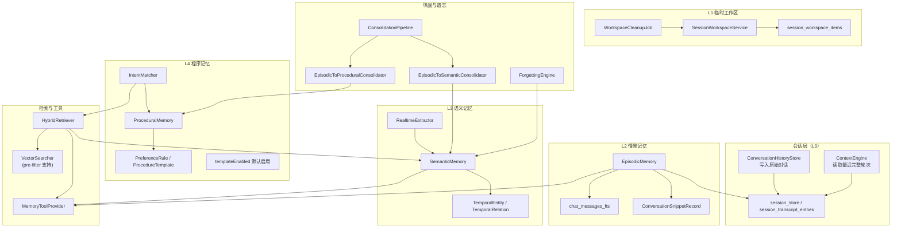
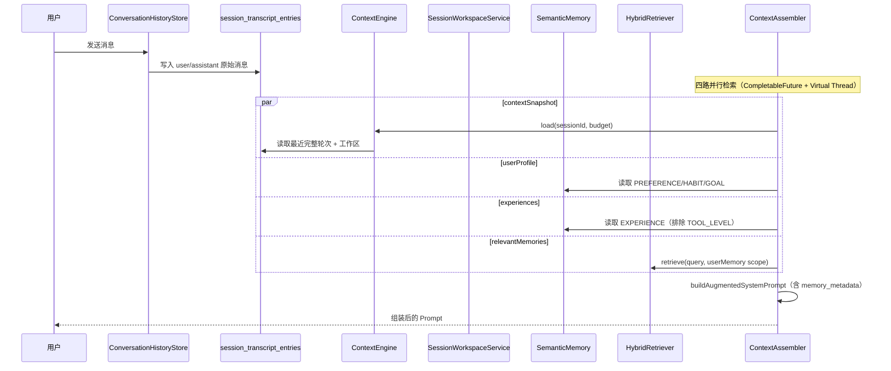
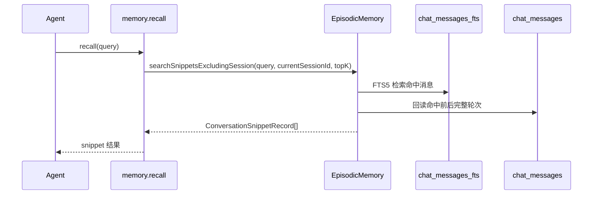

# 记忆系统 — 架构设计

> **文档性质**：架构设计文档
> **模块归属**：`com.lifepilot.memory`
> **最后更新**：2026-05-03

## 1. 模块概述

当前记忆系统采用“会话层 + L1 临时工作区 + L2 情景记忆 + L3 语义记忆 + L4 程序记忆”的分层模型：

- **会话层（L0）**：`session_store / session_transcript_entries`，是原始对话的唯一真源
- **L1 临时工作区**：`session_workspace_items`，保存跨轮但临时的任务状态
- **L2 情景记忆**：基于会话层和 `chat_messages_fts` 提供跨会话片段回忆
- **L3 语义记忆**：维护时序知识图谱，存放稳定事实、画像和经验实体
- **L4 程序记忆**：存放偏好规则和操作模板（策略模式已删除）

这套设计明确取消了“L1 作为对话缓存并 flush 到 L2”的旧链路。当前会话连续性直接来自会话层，跨会话对话检索通过 `memory.recall` 显式触发，L1 不再承载原始对话。

## 2. 架构图



## 3. 核心组件

### 3.1 会话层（L0）

- 原始对话统一写入 `session_transcript_entries`，由 `ConversationHistoryStore` 承担写入抽象
- 当前会话的最近完整轮次由 `ContextEngine` 直接从会话层读取
- `ContextAssembler` 组装当前上下文时做四路并行检索（contextSnapshot + userProfile + experiences + relevantMemories），不再依赖 L1 或 L2 的对话副本
- `ContextAssembler` 在 system prompt 中注入 `<memory_metadata>` 标签（记忆统计信息：画像数、经验数、事实数），带 5 分钟 TTL 缓存

### 3.2 SessionWorkspaceService（L1 临时工作区）

- `SessionWorkspaceService` 负责持久化跨轮临时状态，底层表为 `session_workspace_items`
- 当前定义三类工作区条目：
  - `PendingDecisionItem`：等待用户确认
  - `TaskStateItem`：未完成任务的进度状态（由 `ReflectContentBuilder.buildTaskStateSummary()` 生成逐步执行明细，包含每步工具的关键参数和结果摘要，超过 10 步时折叠早期步骤为统计汇总）
  - `WorkingSetItem`：供下一轮继续使用的中间结果摘要
- 工作区明确不保存原始 user/assistant 消息、思维链和原始工具大结果
- `WorkspaceCleanupJob` 按 TTL 过期活动项，并清理终态条目
- 主写入点有三处：
  - `AgentPersistenceHandler.saveWorkspaceForSuspend()`：用于挂起、确认等待和任务续跑
  - `ToolExecutionCoordinator.persistToolResultToWorkspace()`：关键工具（`memory.create/update/tag`、`code`）执行成功后自动写入 `WorkingSetItem`
  - `ReactAgentLoop`：反思触发后将反思结论写入 `WorkingSetItem`（截断至 300 字符），增强长对话上下文保持

### 3.3 EpisodicMemory（L2 情景记忆）

- `EpisodicMemory` 的主读路径基于 `chat_sessions / chat_messages`
- 跨会话回忆使用 `chat_messages_fts` 做全文检索，再回到 `chat_messages` 组装 snippet
- `searchSnippetsExcludingSession()` 会：
  - 排除当前 session
  - 先命中消息，再按前后完整轮次扩展为片段
  - 返回 `ConversationSnippetRecord`，而不是零散单条消息
- L2 不再承担“当前会话连续性”的职责，也不再接收来自 L1 的 flush

### 3.4 SemanticMemory（L3 语义记忆）

- `SemanticMemory` 存放版本化实体与关系，是稳定事实、用户画像和经验实体的主存储
- `EntityType` 枚举包含 12 种类型：PERSON、ORGANIZATION、PLACE、EVENT、PROJECT、TOPIC、PREFERENCE、HABIT、GOAL、SKILL、EXPERIENCE、CUSTOM
- `RealtimeExtractor` 在对话后异步提取实体写入 L3
- SQL 聚合方法（`countCurrentByType`、`countRecentlyAccessed`、`averageImportanceScore`）用于记忆健康度 API，避免全量加载实体到 JVM 内存
- `ContextAssembler` 当前自动注入的长期信息主要来自：
  - `PREFERENCE / HABIT / GOAL`（用户画像）
  - `EXPERIENCE`（排除工具级经验；工具级经验由 `ProviderMessageBuilder` + `ToolTipResolver` 在构造 LLM 消息时按 toolId 动态前置到工具输出之前，不污染 `Observation.output`）
  - 通过 `HybridRetriever` 检索的相关记忆实体（排除已由画像和经验路径覆盖的类型），注入到 `<memory_context>` 标签

### 3.5 ProceduralMemory（L4 程序记忆）

- `ProceduralMemory` 保存偏好规则和操作模板（`StrategyPattern` 已删除）
- 操作模板聚类通过 `lifepilot.memory.procedural.templateEnabled` 配置开关控制，默认启用
- `IntentMatcher` 负责在检索和编排阶段提供程序化建议
- 当前上下文组装会读取高置信度偏好规则，与 L3 画像一起构成用户画像区

### 3.6 HybridRetriever 与记忆工具

- `HybridRetriever` 继续负责 L3/L4 的混合检索，包含向量、FTS 和图遍历三路融合
- `HybridRetriever` 支持可选的 `RerankRouter` 步骤，对记忆候选进行精排重排序
- `HybridRetriever` 实现 `knownEmpty` 短路优化：当检索空间已知为空时，跳过实际检索直接返回空结果
- `HybridRetriever` 向量路径支持 pre-filter：当 `MemoryReadFilter` 限制了 space_id / memory_scope 时，先通过 `SemanticMemory.findEligibleEntityIds()` 查询合规实体 ID 集合，传入 `VectorSearcher` 做内存过滤；候选集超过 1000 时自动回退为后过滤，避免内存压力
- `MemoryToolProvider` 注册的 `memory` 工具通过单个 `action` 参数暴露 11 种操作，另加独立的 `knowledge.search` 工具：
  - `memory(action=search)`：搜索知识实体
  - `memory(action=recall)`：回忆别的会话里的对话片段
  - `memory(action=create)` / `update` / `delete`：实体 CRUD，其中 `delete` 按已知 `entityId` 归档单条
  - `memory(action=cancel)`：按语义描述批量归档已取消的实体（默认 `GOAL / EXPERIENCE / HABIT`，可通过 `entityTypes` 覆盖到任意类型）；支持 `entityId` 精确单条 或 `query` 语义批量；可选 `maxArchive`（默认 5）/ `minScore`（默认 0.5）；覆盖"取消定时任务 / 撤销目标 / 不再做 X"这类需要清理多个旧目标/经验的场景
  - `memory(action=complete)`：标记 `GOAL / PROJECT` 已完成，驱动 lifecycle 状态机进入终态
  - `memory(action=supersede)`：旧实体被新实体替代，lifecycle 上建立 superseded_by 关系
  - `memory(action=tag)`：建立实体关系
  - `memory(action=query-at-time)`：时间点查询
  - `memory(action=search-experience)`：检索执行经验
  - `knowledge.search`：独立工具，搜索会话绑定的资料文档
- `cancel` 调用 `HybridRetriever.retrieve` + `MemoryReadFilter.all()` 召回候选（覆盖 USER_PROFILE/USER_FACT 与 AGENT_EXPERIENCE 双域），按类型和阈值过滤后逐条 `semanticMemory.archive()`；LLM 在用户表达"取消 / 撤销 / 不再做 / 以后别提 / X 不做了"等语义时应优先调用该 action，仅 `create PREFERENCE` 无法挡住后续对旧 GOAL/EXPERIENCE 的召回
- `recall` 只在工具调用时显式触发，不会自动把别的 session 对话塞进主 prompt
- 归档链路（`delete` / `cancel` / 巩固流程 / 遗忘引擎）统一走 `SemanticMemory.archive()`：事务内置 `is_current=0` + 关系收尾，通过 `afterCommit` 钩子调 `VectorSearcher.deleteEntityVector()` 级联清理向量索引，避免归档实体继续被向量路径召回；回滚路径下向量保持原状，失败仅告警由后续 archive 重试兜底
- 检索链路对归档实体的屏蔽双保险：主库 `is_current = 1` 过滤 + 向量索引级联清理；`temporal_entities` / `temporal_relations` 视图仍然 `WHERE status <> 'DELETED'`，保留时间旅行查询能力

### 3.7 ConsolidationPipeline 与 ForgettingEngine

- 巩固链路仍然负责将情景信息沉淀为语义和程序记忆
- `ConsolidationPipeline` 顺序执行六步：语义巩固 → 程序巩固 → 偏好同步 → 经验合并 → 用户画像巩固 → 经验提升
- `checkIdleConsolidation()` 基于空闲时间触发巩固，不依赖 L1 flush
- `ForgettingEngine` 继续负责实体遗忘、压缩和归档；LLM 压缩调用走 `skipCache=true`，避免不同实体共享同一条摘要；归档动作统一经由 `SemanticMemory.archive()` 在事务提交后级联清理向量索引（详见 `memory-advanced.md`）

### 3.8 经验学习子系统

- `ExperienceSummarizer`、`EffectivenessTracker`、`ContrastiveLearner`、`SubtaskReflector` 继续保留
- 经验写入 L3 的 `EXPERIENCE` 实体
- `ExperienceSummarizer.quickLearn()` 提供即时经验写入路径：反思触发时由 `ReactAgentLoop` 异步调用（虚拟线程），仅在工具失败反思时触发，跳过质量评估和 LLM 提炼，直接从反思内容提取关键教训写入 L3 EXPERIENCE 实体
- `ContrastiveLearner` 不再创建独立的对比洞察实体，改为增强源经验（成功经验）的 lessons 列表，追加 `[对比]` 前缀的 lesson 条目并标记 `contrastiveEnriched=true`
- `ContrastiveInsight` 记录包含 `failureReason`、`successFactor`、`contrastiveLessons` 三个字段（`avoidanceStrategy` 已删除）
- `SubtaskReflector` 产出的经验带 `toolId`（主工具 ID）和 `granularity=TOOL_LEVEL` 标记
- 工具级经验不在 `ContextAssembler` 的通用经验注入中出现，而是由 `ProviderMessageBuilder` 在构造 LLM 消息时借助 `ToolTipResolver.tipsFor(toolId)` 动态拼接到工具原始输出之前（呈现层装饰）
- `ToolTipResolver`（`com.lifepilot.memory.experience.ToolTipResolver`）是独立 Bean，持有 `SemanticMemory` 引用，按 toolId 缓存 30 分钟，仅选取 `granularity=TOOL_LEVEL` 且 `toolId` 匹配的经验 top 2
- 关注点分离：`Observation.output` 始终保持工具原始 JSON（事实源纯净），工具提示等装饰文本仅出现在发送给 LLM 的消息中；Skill 激活、Trace 回放、审计、经验提取等下游消费者解析 `Observation.output` 时都能拿到未被污染的纯 JSON
- `ToolExecutionCoordinator` 不再感知工具级经验，内部不再持有 `semanticMemory` 字段或 `loadToolTips()` 缓存
- `ContextAssembler` 会按重要度和适用条件自动注入非工具级经验
- `memory.search-experience` 允许 Agent 主动检索经验

## 4. 核心流程

### 4.1 当前会话上下文组装



当前自动注入顺序是：

1. 系统提示词（含 `<memory_metadata>` 记忆统计）
2. 当前用户请求
3. 当前 session 最近完整轮次
4. 活跃工作区摘要（`workspace_context`）
5. 用户画像（`user_profile_context`）
6. 经验（`experience_context`，排除工具级经验）
7. 相关记忆（`memory_context`，通过 HybridRetriever 检索，排除已被画像和经验覆盖的类型）
8. 其他段落按需预留

### 4.2 跨会话回忆



### 4.3 挂起与恢复

```mermaid
sequenceDiagram
    participant Loop as ReactAgentLoop
    participant PH as AgentPersistenceHandler
    participant SWS as SessionWorkspaceService
    participant CA as ContextAssembler

    Loop->>PH: saveWorkspaceForSuspend(state)
    PH->>SWS: savePendingDecision()/saveTaskState()
    Note over SWS: 状态落入 session_workspace_items
    CA->>SWS: listActive(sessionId)
    CA-->>Loop: 将活跃工作区摘要注入下一轮 Prompt
    PH->>SWS: resolveByTaskId()/resolveBySourceTraceId()
```

## 5. 设计决策

| 决策 | 选择 | 理由 |
|------|------|------|
| 原始对话真源 | 会话层 | 避免 L1/L2 与会话存储重复维护同一份对话 |
| L1 定位 | 临时工作区 | 用于保存跨轮临时状态，而不是聊天记录缓存 |
| 当前上下文拼接 | 最近完整轮次按时间正序 | 保证 user/assistant 成对保留，不按 importance 打散 |
| 跨会话对话进入 Prompt | 仅通过 recall 工具显式触发 | 避免在主上下文里自动混入别的会话 |
| L2 数据来源 | 会话层读模型 | 消除 L1 flush 才可见的时序问题 |
| 工作区持久化 | SQLite + TTL | 支持挂起恢复，同时保留自动清理能力 |

## 6. 集成点

| 集成模块 | 方向 | 说明 |
|---------|------|------|
| Agent 引擎（`com.lifepilot.agent`） | Agent → Memory | `ContextAssembler` 四路并行读取最近轮次、工作区、用户画像、经验和相关记忆；按 `ProjectContext` 构造 `MemoryReadFilter`（`buildForProject` / `fromProjectContextOrFallback`），ISOLATED 项目允许读取 `[项目 space + 主账户 personal + 主账户 experience]`；`metadataCache` 按 filter 分键避免跨项目污染；`ProviderMessageBuilder` 借助 `ToolTipResolver` 在构造 LLM 消息时按 toolId 动态前置工具级经验提示（`Observation.output` 保持纯 JSON）；`ToolExecutionCoordinator` 在关键工具执行成功后写入 L1 工作区；`ReactAgentLoop` 反思触发时异步写入即时经验并将反思结论写入 L1 工作区 |
| 对话系统（`com.lifepilot.conversation`） | Memory → Conversation | L0 对话真源来自 `ConversationHistoryStore` 与 transcript 读模型；`ChatTurnService.persistTurnMemorySnapshot` 按 `ChatSession.projectId` 反查 `ProjectContext`，ISOLATED 时把 `projectSpaceId` 固化到 `chat_turn_memory_snapshots.project_space_id`（V18） |
| 项目工作空间（`com.lifepilot.project`） | Project → Memory | `ProjectService.createProject` 通过 `MemorySpaceRepository.ensureProjectSpace` 创建 `type=PROJECT` 空间；`ProjectContext` / `ProjectContextResolver` 是记忆读写路径的决策载体；隔离语义与 PROJECT 类型说明详见 [项目工作空间架构](./project.md) 与 [记忆领域隔离设计](./memory-domain-isolation.md) |
| 元能力工具（`com.lifepilot.meta.infra.memory`） | Tool → Memory | `MemoryToolProvider`（完整路径：`com.lifepilot.meta.infra.memory.MemoryToolProvider`）暴露记忆检索、资料检索、实体写入与经验检索工具 |
| 知识库（`com.lifepilot.knowledge`） | Memory → Knowledge | `knowledge.search` 工具通过知识库检索补充外部文档片段 |
| 主动引擎（`com.lifepilot.agent.task.proactive`） | Proactive → Memory | `ImplicitSignalCollector` 隐式信号同时回写 L4 偏好（`observePreference`）和 L3 语义记忆（`syncInsightToL3`），使洞察可被 `HybridRetriever` 检索 |
| Web API（`com.lifepilot.interaction.web.controller`） | REST → Memory | `MemoryController` 提供记忆健康度（`GET /api/memories/health`）和用户画像（`GET/PUT /api/memories/profile`）REST 端点 |

## 7. 配置参考

当前主路径最关键的配置为：

| 配置键 | 说明 |
|--------|------|
| `lifepilot.memory.enabled` | 记忆系统总开关 |
| `lifepilot.memory.workspace.enabled` | 是否启用 L1 临时工作区 |
| `lifepilot.memory.workspace.prompt-max-items` | 注入 Prompt 的工作区条目上限 |
| `lifepilot.memory.workspace.pending-decision-ttl-hours` | 待确认条目 TTL |
| `lifepilot.memory.workspace.task-state-ttl-hours` | 任务状态条目 TTL |
| `lifepilot.memory.workspace.working-set-ttl-hours` | 工作集条目 TTL |
| `lifepilot.memory.workspace.cleanup-cron` | 工作区清理调度 |
| `lifepilot.memory.agentic-tool.*` | 记忆工具默认检索参数 |
| `lifepilot.memory.retrieval.*` | L3/L4 检索、用户画像和回退参数 |
| `lifepilot.memory.retrieval.injectionWeights` | 记忆注入权重（relevance/importance/recency，默认 0.4/0.3/0.3） |
| `lifepilot.memory.retrieval.memoryContextEnabled` | 是否启用 `<memory_context>` 注入（默认 true） |
| `lifepilot.memory.retrieval.memoryContextMaxEntities` | memory_context 最大实体数（默认 5） |
| `lifepilot.memory.retrieval.memoryContextTokenBudget` | memory_context token 预算（默认 800） |
| `lifepilot.memory.retrieval.memoryContextScoreThreshold` | memory_context 最低相关度阈值（默认 0.6） |
| `lifepilot.memory.procedural.templateEnabled` | 是否启用 L4 操作模板聚类（默认 true） |
| `lifepilot.memory.consolidation.*` | 巩固触发模式与阈值 |
| `lifepilot.memory.forgetting.recentAccessProtectionDays` | 近期访问保护天数（默认 7），在此天数内被访问过的实体受保护 |
| `lifepilot.memory.forgetting.highAccessCountProtection` | 高频访问保护阈值（默认 10），accessCount 达到此值的实体受保护 |
| `lifepilot.memory.episodic-cleanup.*` | L2 清理策略 |
| `lifepilot.memory.experience.*` | 经验注入、隔离、合并与反馈配置 |

## 8. 当前限制

- `WorkingSetItem` 已在工具执行（关键工具结果）和反思结论两个场景形成主链路写入
- `ContextAssembler` 目前自动注入的是最近轮次、工作区、画像、经验和相关记忆（`memory_context`），知识库与跨会话对话仍以工具调用为主
- `MemoryProperties` 内仍保留部分历史配置字段，但当前主架构已不再依赖旧的 `WorkingMemory`/`flush` 语义
