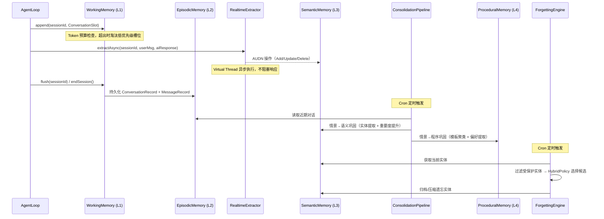
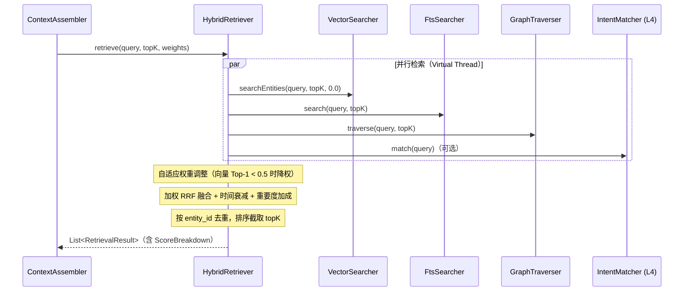

# 记忆系统 — 架构设计

> **文档性质**：架构设计文档
> **模块归属**：`com.lifepilot.memory`
> **最后更新**：2026-03

## 1. 模块概述

记忆系统是知微的认知核心，实现四层认知记忆架构（L1 工作记忆 → L2 情景记忆 → L3 语义记忆 → L4 程序记忆），为 Agent 提供短期上下文管理、长期知识积累、混合检索和自动遗忘能力。系统基于 SQLite + sqlite-vec 实现全部存储，通过 Flyway 管理 Schema 迁移，所有组件通过 Spring AutoConfiguration 按条件注册。

## 2. 架构图

```mermaid
graph TB
    subgraph "L1 工作记忆"
        WM["WorkingMemory"]
        TBA["TokenBudgetAllocator"]
        SEP["SlotEvictionPolicy"]
        WMS["WorkingMemorySlot<br/>(sealed interface)"]
        CS["ConversationSlot"]
        TRS["ToolResultSlot"]
        RS["ReasoningSlot"]
        WMS --> CS
        WMS --> TRS
        WMS --> RS
        WM --> TBA
        WM --> SEP
        WM --> WMS
    end

    subgraph "L2 情景记忆"
        EM["EpisodicMemory"]
        COMP["CompressionService"]
        CR["ConversationRecord"]
        MR["MessageRecord"]
        EM --> CR
        EM --> MR
        COMP --> EM
    end

    subgraph "L3 语义记忆"
        SM["SemanticMemory"]
        CD["ConflictDetector<br/>(三级冲突检测)"]
        VM["VersionMerger"]
        RE["RealtimeExtractor<br/>(AUDN 模式)"]
        TE["TemporalEntity"]
        TR["TemporalRelation"]
        SM --> CD
        SM --> VM
        SM --> TE
        SM --> TR
        RE --> SM
    end

    subgraph "L4 程序记忆"
        PM["ProceduralMemory"]
        IM["IntentMatcher"]
        PT["ProcedureTemplate"]
        PR["PreferenceRule"]
        SP["StrategyPattern"]
        PM --> PT
        PM --> PR
        PM --> SP
        IM --> PM
    end

    subgraph "混合检索引擎"
        HR["HybridRetriever"]
        VS["VectorSearcher<br/>(sqlite-vec / JVM 降级)"]
        FS["FtsSearcher<br/>(FTS5)"]
        GT["GraphTraverser<br/>(CTE 图遍历)"]
        HR --> VS
        HR --> FS
        HR --> GT
    end

    subgraph "生命周期管理"
        CP["ConsolidationPipeline"]
        E2S["EpisodicToSemantic<br/>Consolidator"]
        E2P["EpisodicToProcedural<br/>Consolidator"]
        FE["ForgettingEngine<br/>(MaRS)"]
        FP["ForgettingPolicy<br/>(sealed, 6 策略)"]
        CP --> E2S
        CP --> E2P
        FE --> FP
    end

    WM -->|"flush"| EM
    EM -->|"巩固"| CP
    CP -->|"情景→语义"| SM
    CP -->|"情景→程序"| PM
    FE -->|"遗忘"| SM
    HR -->|"检索 L3"| SM
    HR -->|"检索 L4"| IM
```

## 3. 核心组件

### 3.1 WorkingMemory（L1 工作记忆）

- 职责：管理当前会话的短期上下文，按 Token 预算控制槽位容量
- 槽位类型通过 `WorkingMemorySlot` sealed interface 定义三种：`ConversationSlot`（对话历史）、`ToolResultSlot`（工具执行结果）、`ReasoningSlot`（推理上下文）
- 每个槽位携带 `tokenCount()`、`createdAt()`、`importance()` 三个属性
- 超出预算时通过 `SlotEvictionPolicy` 淘汰低优先级槽位
- `flush()` 将会话数据持久化到 L2 情景记忆，`cleanupIdleSessions()` 定期清理空闲会话

### 3.2 TokenBudgetAllocator（Token 预算分配器）

- 职责：根据上下文窗口大小和会话状态动态分配九区域 Token 预算
- 固定区域：系统提示词（10%）、用户消息（15%）
- 六个记忆区域按优先级从高到低：当前会话历史 → 用户画像 → 跨会话摘要 → 知识实体 → 操作模板 → 知识库片段
- 场景自适应：长对话时增大当前会话权重，高检索相关度时增大知识实体权重
- 超出预算时按优先级从低到高截断（知识库最先截断，当前会话最后截断）
- 无记忆数据时记忆区域归零，释放预算重新分配给用户消息和当前会话

### 3.3 EpisodicMemory（L2 情景记忆）

- 职责：持久化对话记录，支持按时间、关键词、意图类型检索历史对话
- 数据模型：`ConversationRecord`（对话级）包含多条 `MessageRecord`（消息级）
- 支持 FTS5 全文搜索、按时间范围查询、按意图类型查询
- 提供跨会话搜索（排除当前会话）用于上下文增强

### 3.4 CompressionService（对话压缩服务）

- 职责：使用 LLM 将 L2 情景记忆中的对话压缩为摘要或要点
- 支持两级压缩：`SUMMARY`（摘要）和 `KEYPOINTS`（要点提取）
- 异步执行（`@Async`），压缩失败不影响主流程
- 通过 `PromptRegistry` 获取压缩提示词模板

### 3.5 SemanticMemory（L3 语义记忆）

- 职责：管理时序知识图谱，存储版本化实体和关系
- 核心数据模型：`TemporalEntity`（时序实体，含版本号、有效时间区间、重要度评分、访问计数）
- 实体类型通过 `EntityType` 枚举定义 11 种：PERSON / ORGANIZATION / PLACE / EVENT / PROJECT / TOPIC / PREFERENCE / HABIT / GOAL / SKILL / CUSTOM
- 写入时通过 `ConflictDetector` 三级冲突检测，通过 `VersionMerger` 版本合并
- 支持时间点查询、变更历史查询、关联实体查询

### 3.6 ConflictDetector（三级冲突检测器）

- 职责：写入新实体前检测与已有实体的冲突
- 三级检测流程：精确匹配（name + type）→ 语义匹配（向量相似度）→ LLM 消歧义
- LLM 不可用时降级为仅精确匹配，语义匹配失败时同样降级

### 3.7 RealtimeExtractor（AUDN 实时实体提取器）

- 职责：每轮对话后异步提取关键实体写入 L3
- 采用 Mem0 AUDN 模式：通过 LLM 结构化输出判断操作类型（Add / Update / Delete / Noop）
- 在 Virtual Thread 中异步执行，带独立超时控制，不阻塞 AgentLoop 响应
- UPDATE 找不到已有实体时自动降级为 ADD

### 3.8 ProceduralMemory（L4 程序记忆）

- 职责：存储用户的操作模板、偏好规则和策略模式
- 三种数据类型：`ProcedureTemplate`（操作模板，含步骤序列和成功率）、`PreferenceRule`（偏好规则）、`StrategyPattern`（策略模式）
- 支持向量化意图匹配和情境匹配（通过 sqlite-vec）
- 记录执行次数和成功率，用于模板可靠性评估

### 3.9 HybridRetriever（混合检索引擎）

- 职责：并行执行三路检索并融合结果，为 ContextAssembler 提供统一检索接口
- 三路检索：`VectorSearcher`（向量语义检索）+ `FtsSearcher`（FTS5 全文搜索）+ `GraphTraverser`（CTE 图遍历）
- 使用 Virtual Thread 并行执行，加权 RRF（Reciprocal Rank Fusion）融合
- 自适应权重调整：向量 Top-1 分数低于 0.5 时降低向量权重 30%，补偿给 FTS 和图遍历
- 融合后叠加时间衰减（指数衰减）和重要度加成，按 entity_id 去重
- 空数据短路优化：三路检索全部返回空时设置 `knownEmpty` 标记，后续检索直接返回
- 可选集成 L4 `IntentMatcher`（不参与 RRF 融合，独立返回操作模板建议）

### 3.10 VectorSearcher（向量语义检索器）

- 职责：基于 sqlite-vec 的实体向量检索
- sqlite-vec 可用时使用 KNN 搜索（余弦距离），不可用时降级为 JVM 暴力搜索
- 程序化创建 `entity_embeddings` vec0 虚拟表
- 通过 `LlmRouter.embed()` 获取文本向量

### 3.11 ConsolidationPipeline（巩固管线）

- 职责：定时将 L2 情景记忆巩固到 L3 语义记忆和 L4 程序记忆
- 顺序执行：`EpisodicToSemanticConsolidator`（情景→语义）→ `EpisodicToProceduralConsolidator`（情景→程序）
- 故障隔离：单个巩固器异常不阻塞另一个
- 通过 `@Scheduled` Cron 表达式定时触发，也支持手动调用（为 Idle-Driven 模式预留）

### 3.12 ForgettingEngine（MaRS 遗忘引擎）

- 职责：定时执行认知遗忘，维持记忆系统健康容量
- 受保护实体永不遗忘：PREFERENCE / HABIT / GOAL 类型，或 importanceScore ≥ 0.9
- 遗忘策略通过 `ForgettingPolicy` sealed interface 定义 6 种：`FifoPolicy` / `LruPolicy` / `PriorityDecayPolicy` / `ReflectionSummaryPolicy` / `RandomDropPolicy` / `HybridPolicy`
- `HybridPolicy` 编排四阶段遗忘流程
- 遗忘动作：中等重要度实体尝试 LLM 压缩后归档，其余直接归档
- 所有遗忘操作记录到 `forgetting_log` 表

## 4. 核心流程

### 4.1 对话记忆生命周期

### 4.2 混合检索流程

## 5. 设计决策

| 决策 | 选择 | 理由 |
|------|------|------|
| 四层认知记忆架构 | L1 工作 → L2 情景 → L3 语义 → L4 程序 | 模拟人类认知记忆层次，短期记忆自动沉淀为长期知识 |
| 向量存储方案 | sqlite-vec + JVM 暴力搜索降级 | 保持单 JAR 部署，无需外部向量数据库；降级保证功能等价 |
| 混合检索融合算法 | 加权 RRF（Reciprocal Rank Fusion） | 对不同量纲的分数天然归一化，无需额外标准化步骤 |
| 冲突检测策略 | 三级递进（精确→语义→LLM） | 精确匹配零成本，语义匹配覆盖同义词，LLM 处理复杂歧义 |
| 实体提取模式 | Mem0 AUDN（Add/Update/Delete/Noop） | 结构化输出易于解析，四种操作覆盖所有实体变更场景 |
| 遗忘策略 | MaRS Hybrid 四阶段模型 | 综合 FIFO / LRU / 优先级衰减 / 反思摘要，平衡遗忘效率和知识保留 |
| Token 预算分配 | 九区域动态分配 + 优先级截断 | 场景自适应（长对话 vs 高检索相关度），截断保证不超预算 |
| 向量数据库独立 | 独立 DataSource + JdbcTemplate | sqlite-vec 需要按连接加载扩展，独立连接池避免干扰主数据库 |

## 6. 集成点

| 依赖模块 | 交互方式 | 说明 |
|---------|---------|------|
| LLM Router (`com.lifepilot.llm`) | 构造函数注入 | 向量化（embed）、对话压缩、实体提取、冲突消歧义、遗忘压缩 |
| Prompt Management (`com.lifepilot.prompt`) | 构造函数注入 PromptRegistry | 压缩提示词、消歧义提示词、实体压缩提示词模板 |
| Agent Engine (`com.lifepilot.agent`) | Agent 调用 WorkingMemory / HybridRetriever | ContextAssembler 通过 HybridRetriever 检索记忆，AgentLoop 通过 WorkingMemory 管理会话 |
| Knowledge Base (`com.lifepilot.knowledge`) | ObjectProvider 延迟获取 | EpisodicToSemanticConsolidator 可选使用 KnowledgeExtractionPipeline |

## 7. 配置参考

| 配置键 | 默认值 | 说明 |
|--------|--------|------|
| `lifepilot.memory.enabled` | `true` | 记忆系统总开关 |
| `lifepilot.memory.working-memory-token-budget` | — | L1 工作记忆 Token 预算上限 |
| `lifepilot.memory.idle-session-timeout-minutes` | — | 空闲会话清理超时（分钟） |
| `lifepilot.memory.compression-threshold-tokens` | — | 触发对话压缩的 Token 阈值 |
| `lifepilot.memory.embedding-dimensions` | — | 向量维度 |
| `lifepilot.memory.semantic-match-threshold` | — | 语义匹配相似度阈值 |
| `lifepilot.memory.vector-db-url` | — | 向量数据库 SQLite URL |
| `lifepilot.memory.token-budget.*` | — | 九区域预算分配比例和上限 |
| `lifepilot.memory.procedural.*` | — | L4 程序记忆参数（模板上限、可靠性阈值等） |
| `lifepilot.memory.consolidation.cron` | — | 巩固管线 Cron 表达式 |
| `lifepilot.memory.consolidation.trigger-mode` | — | 触发模式（cron / idle） |
| `lifepilot.memory.forgetting.cron` | — | 遗忘引擎 Cron 表达式 |
| `lifepilot.memory.forgetting.max-retention-days` | — | 最大保留天数 |
| `lifepilot.memory.forgetting.priority-decay-rate` | — | 优先级衰减速率 |
| `lifepilot.memory.extraction.timeout-seconds` | — | AUDN 实体提取超时（秒） |