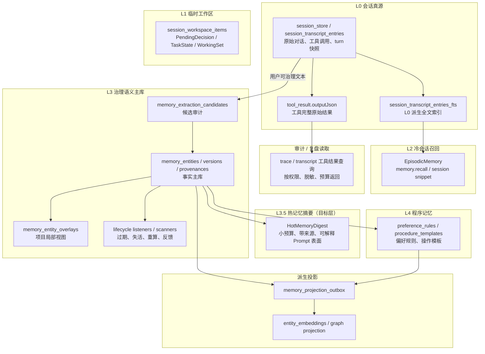
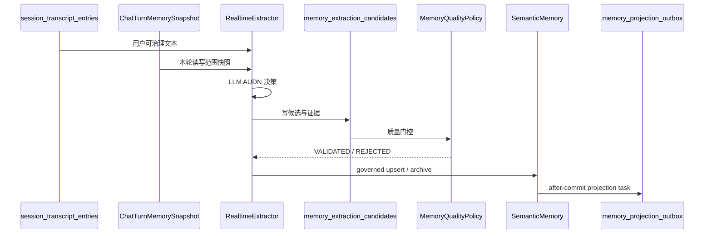

# 记忆系统 — 架构设计与演进路线

> **文档性质**：记忆模块整体心智模型与演进路线
> **模块归属**：`com.lifepilot.memory` + `com.lifepilot.agent.context` + `com.lifepilot.meta.infra.memory`
> **最后更新**：2026-05-07（补充统一检索编排未来演进方向）
> **当前基线**：`ffd39833 feat(memory): 完善记忆治理与消费链路`
> **配套终态契约**：[memory-data-flow.md](./memory-data-flow.md)
>
> 本文档回答“知微记忆系统应该如何理解、如何演进”。涉及写入链路、事件契约、Schema、生命周期、项目隔离、质量门槛和消费边界时，以 `memory-data-flow.md` 为 source of truth。

---

## 0. 一句话模型

知微记忆不是一个“自动塞进 Prompt 的大数据库”，而是一条分层闭环：

**L0 会话真源保存原始事实，L1 工作区保存短期任务状态，L2 会话检索负责冷召回，L3 语义主库存放可治理事实，L3.5 热记忆摘要提供小而稳定的 Prompt 表面，L4 程序记忆沉淀可执行偏好和流程，Projection outbox 维护向量/图谱等派生索引。**

后续改造的核心目标是让用户和 Agent 都能清楚区分：

| 类型 | 定位 | 是否默认进 Prompt | 典型入口 |
|---|---|---:|---|
| 热记忆 | 少量、高信任、总是有用的用户画像 / 项目约定 / 经验摘要 | 是，严格预算 | `ContextAssembler` |
| 冷记忆 | 大量长期事实、历史对话、证据、经验细节 | 否，按需搜索 | `memory.search` / `memory.recall` |
| 深层记忆 | L3 主库、L4 规则、向量/图谱投影、候选审计 | 否，系统内部治理 | `SemanticMemory` / outbox / scanner |

这与 Hermes Agent 的设计取向一致：常驻上下文必须小、可解释、可治理；历史对话和深层知识应该按需搜索，而不是长期污染系统提示词。

参考调研：

- Hermes Persistent Memory：<https://hermes-agent.nousresearch.com/docs/user-guide/features/memory/>
- Hermes Memory Providers：<https://hermes-agent.nousresearch.com/docs/user-guide/features/memory-providers/>
- Hermes Sessions / session_search：<https://hermes-agent.nousresearch.com/docs/user-guide/sessions/>
- Hindsight memory graph：<https://github.com/vectorize-io/hindsight>
- Hindsight 0.5 图检索变更：<https://hindsight.vectorize.io/blog/2026/04/07/version-0-5-0>
- LangChain MultiQueryRetriever：<https://python.langchain.com/docs/how_to/MultiQueryRetriever/>
- LlamaIndex RouterQueryEngine / SubQuestionQueryEngine：<https://docs.llamaindex.ai/>
- Haystack ConditionalRouter：<https://docs.haystack.deepset.ai/docs/conditionalrouter>
- Microsoft GraphRAG / DRIFT：<https://microsoft.github.io/graphrag/>
- Letta Memory：<https://docs.letta.com/concepts/memory/overview>
- Mem0：<https://docs.mem0.ai/>

---

## 1. Hermes 对知微的启发

Hermes 的内置记忆分成三块：

| Hermes 做法 | 关键思想 | 知微对应设计 |
|---|---|---|
| `MEMORY.md` / `USER.md` 有严格字符预算 | 常驻记忆必须小而精，不追求全量 | `L3.5 HotMemoryDigest`，从 L3 派生小型热摘要 |
| session_search 搜索全量历史会话 | 历史对话不自动进 Prompt，只在需要时召回 | L2 `memory.recall` 基于 transcript / FTS 召回片段 |
| 外部 provider 与内置记忆并存 | 深层能力是 additive，不替代核心热记忆 | L3/L4/Projection 是内建 provider，未来可抽象 `MemoryProviderPort` |
| 写入后不立即改当前 Prompt 快照 | 保持当前轮上下文稳定，避免自污染 | 当前 turn 的写入只影响下一次上下文组装 |
| provider 可 prefetch / sync / extract | 写入、召回、注入解耦 | 候选表 + outbox + ContextAssembler 分层消费 |

知微不应照搬 markdown 文件存储。知微已有项目隔离、overlay、质量字段、生命周期和主库版本化能力，更适合做成数据库内的**派生热摘要层**，而不是把 L3 降级为文件。

### 1.1 Hindsight 对图记忆的启发

Hindsight 的图记忆重点不是“把图谱文本塞进 Prompt”，而是把事实、实体、实体共现、事实间链接变成冷召回信号。它的 retain 阶段把 sentence / fact 级记忆写成 `memory_units`，再抽取 canonical `entities`、`unit_entities`、`entity_cooccurrences` 和 `memory_links`；recall 阶段并行跑语义、BM25、时间和图扩展，再融合排序。

| Hindsight 做法 | 关键思想 | 知微对应设计 |
|---|---|---|
| fact / unit 级记忆与实体分离 | 检索对象和实体索引不要混成一张表 | L3 当前以实体为主；后续可把对话/文档证据片段作为检索关键事实单元，实体是索引和治理锚点 |
| `memory_links` 支持 temporal / semantic / entity / causal 等类型和权重 | 图边是 typed weighted signal，不只是“有关系” | `memory_relations.relation_type + strength + properties_json` 应继续强化类型、方向、证据和质量 |
| entity co-occurrence 物化 | 高频共现用于召回扩展，但要限制 fanout | 知微图遍历必须有 depth / seed / fanout 上限，避免高连接实体污染搜索 |
| recall 从语义/BM25/时间种子出发再做 link expansion | 图扩展应补充强种子，而不是只靠 query 文本精确命中实体名 | `HybridRetriever` 中图路径应从多路候选实体扩展；当前 `GraphTraverser` 先做多起点 name seed，后续升级为 vector / FTS seed expansion |
| causal / semantic link 在融合前加权累积 | 不同边类型对答案价值不同 | 知微后续应按 `relation_type` 给 graph score 加权，因果/依赖类边高于弱共现边 |
| 反思 observation 必须引用原始 memory id / quote | 洞察必须可追溯 | 知微 L3 派生洞察、L3.5 热摘要和 L4 规则都必须保留 L3 source entity id |

Hindsight 0.5 又进一步把传统 BFS / 多路径传播收敛为 `LinkExpansionRetriever`，优先使用预计算的一等链接信号（entity / semantic kNN / causal），并把高 fanout 实体扩展做 per-entity cap 或超时降级。知微现阶段仍是 SQL 递归图，因此先用 depth / seed 上限控制风险；后续物化图投影时再靠预计算链接减少在线遍历成本。

因此，知微图记忆的目标不是替代热摘要，而是增强 `memory.search` / `knowledge.search` 等冷召回：从高质量种子出发，沿有证据、有生命周期、有读取边界的关系边做有界扩展，并把图分数作为 score breakdown 的一部分。

---

## 2. 分层架构



### 2.1 L0 会话真源

- `session_store` / `session_transcript_entries` 是原始对话的唯一真源。
- L0 保存完整执行事实，不只是 user/assistant 文本。典型 `entry_type` 包含 `user_message`、`assistant_message`、`tool_call`、`tool_result`、`artifact_ref`、`compaction_summary`、`memory_flush_event`。
- 工具调用与工具结果通过 `toolId / callId / turnId / traceId` 关联；`tool_result.payload_json.outputJson` 保存工具返回的完整原始结果，`tool_call.payload_json.inputJson` 保存完整入参。
- `ToolExecutionCoordinator` 中的 `rawOutput` 是工具完整结果。写入 `ReactStep.Observation` 时可能因媒体提取产生面向模型的 `observationOutput`，但 transcript 的 `tool_result.outputJson` 仍记录原始 `rawOutput`。
- 工具级经验提示只允许在 `ProviderMessageBuilder + ToolTipResolver` 呈现层拼到模型消息前面，不能写回 `Observation.output`、transcript 或 trace，避免污染 JSON、审计和回放。
- `tool_result` 默认 `visibleToModel=true`、`visibleToUser=false`：它是模型续跑、审计、trace 回放和经验提取的事实源，不等同于前端时间线可见内容。
- 自动学习只能从用户可治理文本提取事实，不能从系统 wrapper、提示词注入片段、自动 UI signal 直接提取长期记忆。
- `ChatTurnMemorySnapshot` 是自动学习的治理凭证：缺快照、缺 turnId、解析异常时自动学习 fail-closed。

工具完整结果与其他层的关系：

| 去向 | 是否保存完整结果 | 说明 |
|---|---:|---|
| L0 transcript | 是 | `tool_result.outputJson` 是完整原始结果，供审计、回放和后续证据追溯。 |
| ReAct state / Observation | 否，不保证完整 | 面向模型续跑，可经过媒体占位、失败输出截断或 provider 消息 hygiene。 |
| L1 WorkingSet | 否 | 只对少量关键工具保存最长约 300 字摘要和 `toolId` 元数据。 |
| L2 recall snippet | 否 | 默认只返回过去会话的 user/assistant 可见片段，不直接展开工具大结果。 |
| L3 语义记忆 | 否 | 只有经过候选、质量门控或显式工具写入后，工具结果中的事实才会变成长期记忆。 |

### 2.2 L1 临时工作区

- L1 只保存跨轮任务状态，不保存原始聊天记录。
- 典型条目：
  - `PendingDecisionItem`：等待用户确认。
  - `TaskStateItem`：未完成任务进度。
  - `WorkingSetItem`：下一轮仍可能使用的中间结果摘要。
- 关键工具成功后可以写入 `WorkingSetItem`，但只保存截断摘要，不保存完整工具输出；完整结果仍以 L0 `tool_result` 为准。
- L1 到期后清理；L1 内容不是长期事实，不能绕过候选表直接写 L3。

### 2.3 L2 冷会话召回

- L2 面向“我们之前聊过什么”的问题。
- L2 没有独立事实主库；它是 L0 transcript 的读模型：`session_transcript_entries_fts` 是 L0 的全文索引，`session_transcript_compressions` 是 L0 条目的压缩读模型。
- `memory.recall` 通过 `session_transcript_entries_fts` 命中过去会话，再回读 `session_transcript_entries` 组装上下文片段。
- 当前 snippet 组装只使用 `user_message / assistant_message` 且 `visible_to_user=1` 的可见对话文本；工具完整结果不直接出现在 L2 片段里。
- L2 不默认进入 Prompt，不承担当前会话连续性，也不承担长期事实主库职责。

L0 与 L2 的关系可以理解为：

| 层 | 数据形态 | 是否真源 | 典型用途 |
|---|---|---:|---|
| L0 transcript | 原始条目：消息、工具调用、工具结果、artifact 引用、压缩事件 | 是 | 审计、回放、当前会话上下文、证据追溯 |
| L2 FTS | `session_transcript_entries_fts` 命中行 | 否 | 找到相关 session / entry |
| L2 snippet | 基于命中 entry 前后轮次拼出的 `ConversationSnippetRecord` | 否 | 给 Agent 按需回忆过去对话 |
| L2 compression | `session_transcript_compressions` | 否 | 长上下文压缩和片段读模型 |

因此，删除 session 或 transcript 条目会级联影响 L2；重建 L2 索引不能反向恢复 L0 原始事实。

### 2.4 L3 治理语义主库

- L3 是长期事实主库，维护实体、版本、provenance、质量字段、生命周期和项目隔离。
- `memory_entities` / `memory_entity_versions` / `memory_entity_provenances` 是事实来源；向量和图谱只是派生索引。
- 所有自动提取先落 `memory_extraction_candidates`，通过质量门控后才能写实体。
- `MemoryAccessPolicy` 是唯一读写边界策略层。
- 隔离项目读取可继承主账户 personal / experience，写入只能进入项目 space；更新继承实体时创建项目 overlay。

### 2.5 L3.5 热记忆摘要

L3.5 是本轮 Hermes 调研后新增的目标层，解决“记忆模块能力强但 Prompt 消费面混乱”的问题。

热记忆摘要不是新事实主库，而是从 L3 派生出来的**小型、可解释、带来源的 Prompt 表面**：

| 属性 | 规则 |
|---|---|
| 来源 | 只能来自可消费 L3 实体，不从 transcript 或 L2 直接生成长期热记忆 |
| 预算 | 严格 token / char 上限，超限必须合并、替换或降级为冷召回 |
| 证据 | 每条摘要必须能追溯 `source_entity_ids` |
| 质量 | 只允许 `VERIFIED / EXPLICIT / DERIVED` 默认进入；`INFERRED` 需强相关且显式标注 |
| 生命周期 | 源实体过期、取消、归档、重算时摘要失效或重建 |
| 项目隔离 | 按 `MemoryAccessPolicy` 构造读取视图，overlay 优先 |
| 写入稳定性 | 当前 turn 内的记忆写入不修改已组装 Prompt，只影响下一次组装 |

概念数据结构：

| 字段 | 说明 |
|---|---|
| `digest_id` | 摘要版本 ID |
| `view_key` | 主账户 / 项目 / domain 视图键 |
| `section` | `USER_PROFILE` / `PROJECT_MEMORY` / `EXPERIENCE` / `FACTS`；L4 偏好规则归入 `USER_PROFILE` |
| `content` | 已脱敏、已压缩、可直接注入 Prompt 的文本 |
| `source_entity_ids` | 来源 L3 实体 ID 列表 |
| `budget_tokens` | 生成时预算 |
| `source_revision` | 来源集合版本或 hash |
| `built_at` / `expires_at` | 构建时间与缓存过期时间 |

当前最小实现是 `HotMemoryDigestService` 按读取视图实时构建快照，不新增事实表：它读取 `SemanticMemory.findAllCurrent(filter)`，经 `MemoryQualityPolicy.isPromptConsumable`、生命周期、默认排除 `INFERRED`、工具级经验过滤和脱敏后，输出 `USER_PROFILE / PROJECT_MEMORY / EXPERIENCE / FACTS` 四类 section；同时读取高置信 L4 `PreferenceRule`，只在其 `source_entity_id` 指向可消费 L3 实体时合并进 `USER_PROFILE`。`source_revision` 覆盖 L3 实体和被注入的 L4 规则，固定本次组装版本。

是否落独立表由后续实现决定；文档终态要求是：`ContextAssembler` 不再各处拼散乱实体，自动记忆注入只消费统一热摘要。热摘要为空、构建失败或服务缺失时，本轮不回退旧画像 / 经验 / 相关记忆检索；需要更多历史或事实时由 Agent 显式调用冷召回工具。

`__consolidated_profile` 是 `USER_PROFILE` 的 L3 派生输入之一，但它自身的重算不应只靠时间到点。`UserProfileConsolidator` 以可消费 L3 画像碎片、可消费源校验后的 L4 偏好反馈和最近对话摘要生成源签名，签名未变化时直接跳过 LLM；签名变化后再套用最小间隔防抖。最近对话摘要只作为当前语境辅助，不允许绕过 L3 质量门控沉淀新的长期事实。

### 2.6 L4 程序记忆

- L4 存放可执行偏好和操作模板。
- `preference_rules` / `procedure_templates` 必须带 `source_entity_id`，失活规则不得匹配。
- L4 不是事实主库。L3 源实体失效时，L4 规则或模板必须同步失活或重算。
- Prompt 层只自动注入高置信 L4 偏好规则，并且统一经 `HotMemoryDigest.USER_PROFILE` 输出；无源或源实体不可消费的规则不注入。
- L4 操作模板不默认文本注入 Prompt，继续由 `IntentMatcher` / 工具执行链路按意图匹配消费。

### 2.7 Projection outbox

- 向量、图谱、持久化摘要、L4 同步都应视为主库派生投影。
- 派生投影必须通过 outbox 进入可重试状态机，禁止在主事务外直接写索引。
- 事务回滚不得留下向量或持久化摘要幻影。
- 当前热摘要按需从 L3 读取构建，尚未持久化，因此暂不需要 outbox 失效任务。

### 2.8 图记忆：检索关键图与可视化图

知微当前已有 L3 SQL 图：

- 节点：`memory_entities` + `memory_entity_versions` + `memory_entity_provenances`。
- 边：`memory_relations` + `memory_relation_versions` + `memory_relation_provenances`。
- 读视图：`temporal_relations`。
- 入口：知识库文档提取实体/关系、`memory(action="tag")` 显式标注、`HybridRetriever` 图遍历、`GraphKnowledgeSearcher` 领域图检索。

终态要把图分成两类：

| 类型 | 用途 | 写入要求 | 消费方式 |
|---|---|---|---|
| 检索关键图 | 影响 `memory.search` / `knowledge.search` 的召回和排序 | 必须有来源、质量、生命周期、space 和方向/类型 | 从多路种子出发有界扩展，进入 score breakdown |
| 可视化/治理图 | 管理端展示、审计、人工整理 | 可以包含低置信候选或弱关联，但要标注状态 | 不直接影响默认 Prompt；需提升为检索关键图后才能参与召回 |

图记忆不默认进入 `HotMemoryDigest`。热摘要只保留少量高信任事实；图扩展属于冷召回，只有 Agent 调用 `memory.search` / `knowledge.search` 后才进入本轮上下文。

图读路径必须遵守以下规则：

- 起始种子不能只取第一个匹配实体；至少支持多个有界 seed，并按读取 filter / overlay 先过滤。
- 反向边遍历必须返回相反端点，不能把起点自身作为 related 节点。
- 只沿当前有效关系边遍历：`memory_relations.status='ACTIVE'` 且当前 relation version `valid_to is null`。
- 只返回可召回实体：`ACTIVE / COMPLETED / REGENERATION_NEEDED / STALE_CANDIDATE`，并防御性过滤 `valid_to / expires_at`（`STALE_CANDIDATE` 由 memory-staleness spec 引入，可召回但显著降权）。
- 图分数要可解释：depth、relation strength、relation type、seed source 都应能进入 `scoreBreakdown` 或调试日志。
- 高 fanout 实体必须限流；后续图投影可以物化 entity co-occurrence / semantic links，但仍必须走 outbox。

当前本轮先修正 SQL 图读路径的反向边和多起点问题；关系候选治理、relation quality 字段、图投影 outbox 和对话关系自动提取作为后续阶段推进。

---

## 3. 写入链路

### 3.1 自动对话学习



硬规则：

- 缺 `ChatTurnMemorySnapshot` 直接跳过自动学习。
- `RealtimeExtractor` 的 existing summary 可以读取继承空间，但 UPDATE / DELETE 只能命中可写空间。
- `UNKNOWN` 证据不得写主库；低质量候选必须留审计。
- `importance_score` 不是质量分；是否可写、可注入、可派生由 `trust_level` / `trust_score` / `evidence_kind` 决定。

### 3.2 经验学习

- `ExperienceSummarizer` 只写可迁移的任务级经验。
- `SubtaskReflector` 只写工具级经验，带 `toolId` 和 `granularity=TOOL_LEVEL`。
- 工具级经验不进入通用经验注入；只由 `ToolTipResolver` 在匹配工具时提供提示。
- `ContrastiveLearner` 的终态应产出独立派生洞察，而不是无血缘地原地增强。

### 3.3 显式工具与 Web 写入

- `memory.create/update/delete/cancel/complete/supersede/tag` 必须通过 `MemoryAccessPolicy` 校验可写范围。
- 隔离项目更新继承实体时创建 overlay，不能改主账户实体。
- 隔离项目删除继承实体在 `HIDE` overlay 落地前必须 fail-closed。
- 用户显式操作默认是 `USER_CONFIRMED`，质量等级高于自动推断。

---

## 4. 消费链路

### 4.1 默认上下文组装

`ContextAssembler` 的默认记忆注入已收口为单一路径：同一次上下文组装只构建并消费一次 `HotMemoryDigest` 快照。组装顺序如下：

1. 系统提示词与工具/skill 能力说明。
2. 当前用户请求。
3. 当前 session 最近完整轮次。
4. L1 工作区摘要。
5. L3.5 热记忆摘要：用户画像、L4 高置信偏好、项目约定、高价值经验、常用事实。
6. 工具级经验只在工具 observation 呈现层由 `ToolTipResolver` 注入。

消费门槛：

- 自动注入只允许可消费实体。
- `UNVERIFIED` 永不注入。
- `INFERRED` 只有在当前 query 强相关时才可注入，并且必须标注“推断”。
- 脱敏失败时丢弃该条，不允许 fail-open 注入原文。
- `recordInjection` 只能记录最终进入 Prompt 的实体 ID，不能记录检索候选。
- 自动上下文组装不再额外运行旧画像拼接、任务经验检索或相关记忆冷搜索。

### 4.2 冷召回工具

| 工具 | 数据层 | 用途 | 约束 |
|---|---|---|---|
| `memory.recall` | L2 | 找过去会话片段 | 只在用户或 Agent 明确需要历史对话时调用 |
| `memory.search` | L3 | 搜长期事实 | 返回质量、生命周期、scoreBreakdown |
| `memory.search-experience` | L3 | 搜任务级经验 | 排除工具级经验 |
| `knowledge.search` | KB / domain | 搜绑定资料 | 不直接变成长期个人记忆 |
| trace / transcript 工具结果查询 | L0 | 复盘某次工具完整输入输出 | 不属于默认记忆注入；返回前必须按权限、脱敏和预算处理 |

Prompt 中应明确引导 Agent：当用户提到“上次、之前、我们聊过、你还记得”时，优先使用冷召回工具，不要凭热记忆猜测。

### 4.3 热摘要快照策略

借鉴 Hermes 的 frozen snapshot 思路，知微采用“本次上下文组装快照稳定”原则：

- `ContextAssembler` 开始组装后，本轮 Prompt 看到的是同一个热摘要版本。
- 本轮工具写入记忆后，工具响应可展示 live state，但不回写已组装 Prompt。
- 下一轮或下一次上下文组装时，才读取新热摘要或触发重建。

这样可以避免 Agent 在同一轮里把自己刚写入的候选记忆当成外部事实再次放大。

---

## 5. 项目与空间语义

项目隔离是读写非对称的：

| 场景 | 规则 |
|---|---|
| ISOLATED 项目读取 | 项目 space + 主账户 personal + 主账户 experience |
| ISOLATED 项目写入 | 仅项目 space |
| ISOLATED 更新继承实体 | 创建项目 overlay |
| SHARED / 主账户读取 | personal + experience |
| SHARED / 主账户写入 | 默认 personal / experience |
| KB 绑定对话 | 仅在明确 domain write space 存在时写 domain memory |

热记忆摘要必须按同一规则构建。项目视图中若存在 overlay，应遮蔽对应 base 实体，避免 Prompt 同时看到主账户版本和项目局部版本。

---

## 6. 旧代码清理方向

不考虑兼容性后，旧路径应按以下优先级清理：

| 优先级 | 清理项 | 状态 | 原因 |
|---:|---|---|---|
| P0 | 删除旧 `EntityExpirationJob` | 已完成 | TTL 终态只允许 `ExpirationScanner -> updateLifecycleState(EXPIRED)` |
| P0 | 移除向量直写 / 直删 fallback | 已完成 | 所有派生索引必须走 outbox |
| P0 | 项目删除后的向量清理改为 projection task | 已完成 | 避免绕过 outbox，保留失败补偿能力 |
| P1 | `VectorListener` 去掉 `VectorSearcher` fallback 依赖 | 已完成 | projection 缺失应 fail-fast，而不是静默直删 |
| P1 | L4 模板向量改为独立 projection 类型 | 已完成 | 程序记忆索引也应有投影状态与重试 |
| P1 | 清理 `MemoryProperties` 中旧 WorkingMemory / flush 语义字段 | 已完成 | 降低心智负担，防止误用 |
| P2 | 收敛 `ContextAssembler` 中分散的画像 / 经验 / 相关记忆拼接 | 本轮处理 | 由热摘要层提供稳定消费表面 |
| P2 | 清理文档里的旧 `knownEmpty`、直删向量、原地对比增强描述 | 已完成 | 文档必须只描述终态 |

---

## 7. 演进路线

### Phase A：文档与对账

目标：让团队先拥有同一张图。

- `memory-system.md` 采用本文的热 / 冷 / 深层模型。
- `memory-data-flow.md` 增补热摘要消费契约。
- grep 清单标出所有旧向量直写、旧过期任务、旧 WorkingMemory 配置（本轮已清理）。

验收：

- 文档不再把 L3 描述成“所有相关实体都可自动注入”。
- 文档不再保留 `knownEmpty` 全局空库、向量直删、旧 `EntityExpirationJob` 作为主路径。

### Phase B：清理旧路径

目标：先把不符合终态的旧代码删干净。

- 删除未注册但仍存在的旧过期任务。
- 所有实体向量 upsert/delete 统一通过 `memory_projection_outbox`。
- 项目删除、生命周期 listener、程序模板索引补齐 outbox。
- 删除兼容 fallback 后补契约测试。

验收：

- `rg "deleteEntityVector"` 只允许出现在 projection processor 或低层实现中。
- 缺 projection service 时写入链路 fail-fast。

### Phase C：实现 L3.5 热记忆摘要

目标：给 Prompt 一个小而清晰的记忆入口。

- 已新增 `HotMemoryDigestService`：按主账户 / 项目视图实时构建摘要。
- 已接入 `ContextAssembler`：`user_profile_context / experience_context / memory_context` 只消费热摘要。
- 已保证摘要内容只来自可消费实体，记录 `source_entity_ids`，并执行脱敏。
- 已将高置信 L4 偏好规则并入 `USER_PROFILE`，但必须校验可消费 L3 源实体。
- 已按 section 配置预算：用户画像、项目约定、任务级经验、常用事实分开限额。
- 待后续：如需持久化热摘要，再通过 outbox 标记摘要失效或重建。

验收：

- 热摘要中每条内容都能追溯源实体。
- 隔离项目 overlay 优先。
- `UNVERIFIED` 和过期实体不会进入摘要。
- `HotMemoryDigestService_单元测试` 覆盖质量过滤、默认排除推断记忆、巩固画像优先、L4 偏好源实体校验和脱敏。

### Phase D：改造 ContextAssembler

目标：上下文消费从“多处拼实体”收口为“只消费热摘要；冷召回走工具”。

- `user_profile_context` 来自热摘要 `USER_PROFILE`，其中包含 L3 画像和 L4 高置信偏好规则。
- `experience_context` 来自热摘要 `EXPERIENCE`。
- `memory_context` 来自热摘要 `PROJECT_MEMORY / FACTS`。
- 删除旧画像路径、旧经验检索路径和自动相关记忆冷搜索路径。
- `recordInjection` 与 access count 只记录实际注入实体。

验收：

- 一次上下文组装中，热摘要版本稳定。
- 脱敏失败不会注入原文。
- 注入 ID 与最终 Prompt 内容一致。

### Phase E：强化冷召回

目标：让 Agent 主动查，而不是让 Prompt 背负所有历史。

- `memory.recall` 强化 session snippet 摘要与元数据。
- `memory.search` 输出 `rawCount / qualityFilteredCount / truncatedCount / scoreBreakdown`。
- 明确 trace / transcript 级工具结果查询入口，供复盘工具完整结果，不混入 L2 默认 snippet。
- Prompt 中强化使用冷召回的触发条件。

验收：

- 用户问“上次聊过什么”时走 L2 recall。
- 用户问稳定事实时走 L3 search。
- 搜索结果能区分高置信、需确认、仅参考。

### Phase F：强化图记忆召回

目标：把图从“单实体名递归扩展”升级为“多路种子 + 有界 typed link expansion”。

- 本轮修正 `SemanticMemory.findRelated` 反向边遍历，确保反向一跳返回源实体，并按生命周期过滤返回实体。
- 本轮修正 `GraphTraverser` 只取第一个起始实体的问题，改为读取 filter 后的多起点有界遍历。
- 后续让图扩展从 vector / FTS 种子出发，而不是只依赖 query 文本包含实体名。
- 后续为关系补齐 `evidence_kind / trust_level / trust_score / evidence_excerpt` 或独立 relation candidate 表。
- 后续将 entity co-occurrence、semantic link、causal link 等派生图边纳入 `memory_projection_outbox`。

验收：

- 正向和反向关系在 `maxDepth=1` 下都能召回相反端实体。
- 不可召回生命周期实体不会通过图路径返回。
- 多个起始实体不会被第一个命中实体吞掉。
- 图结果能在 `scoreBreakdown.graphScore` 中解释来源。

### Phase G：治理 UI 与运维

目标：让用户看得懂、改得动、追得回。

- 管理端展示热摘要、源实体、质量、生命周期、space、overlay 血缘。
- 支持用户 pin / hide / confirm / reject 摘要条目。
- 补偿任务可重放 FAILED projection。

验收：

- 用户可以解释“为什么这条记忆进了 Prompt”。
- 用户可以把错误热记忆降级、隐藏或删除。

### Phase H：统一检索编排（已落地骨架）

目标：把记忆召回和知识库检索从"多个工具各自触发"升级为"面向最终答案质量的证据编排层"。骨架已在 `retrieval-orchestrator` spec 落地，作为上层可选接口；默认 `enabled=false`，不替换既有 `memory.search / memory.recall / 知识库搜索` 工具链路。

实现位置与落地范围参考 #[[file:docs/architecture/retrieval-orchestrator.md]]。当前骨架包含：

| 组件 | 职责 | 本期范围 |
|---|---|---|
| `RetrievalOrchestrator` | 顺序调用各 source、按 score 融合排序、返回 `EvidenceBundle` | 本地单机串行调用，不并行 |
| `QueryPlanner` | 按 `RetrievalIntent(FACT/EXPERIENCE/GENERAL)` 选 source 集合 | 规则映射（非 LLM），过滤 `isAvailable=false` 的 adapter |
| `SourceAdapter` sealed interface | 把 L3 混合检索、L3 EXPERIENCE、KB 统一为 `EvidenceItem` | 三子类：HybridRetrievalSource / ExperienceRetrievalSource / KnowledgeBaseSource（KB 为占位，`isAvailable=false`） |
| `EvidenceBundle` / `EvidenceItem` | 结构化多源证据 + sources + latency + scoreBreakdown | 替代散乱工具结果，便于测试断言 |

后续演进（本期未实现）：

- QueryDecomposer：把复杂问题改写为子查询（LangChain `MultiQueryRetriever` / NVIDIA Query Decomposition 的思路，受预算门控）
- 图扩展：Microsoft GraphRAG / DRIFT 模式，作为 EvidenceBundle 之上的扩展层
- KnowledgeBaseSource 真实实现：对接既有 KB 检索工具
- Agent 工具化：新增 `memory.retrieve` 作为统一冷召回入口

### Phase I：记忆老化与邻居回链（已落地）

新事实写入时自动识别与之语义冲突的老邻居，将其迁入新的 `STALE_CANDIDATE` 生命周期态；召回时降权但不丢弃，Agent 命中时可自然追问确认。

实现参考 #[[file:docs/architecture/memory-staleness.md]]。核心：

- `LifecycleState` 增 `STALE_CANDIDATE`；可从 `ACTIVE` 进入，可回到 `ACTIVE` 或转 `SUPERSEDED/ARCHIVED`
- `VectorBasedStaleConflictDetector`：类型白名单（默认 PREFERENCE/HABIT/LOCATION/GOAL）+ 相似度阈值 + UNVERIFIED 过滤
- `StalenessCoordinator`：虚拟线程 afterCommit 异步调度 Detector → Marker → NeighborRefreshService
- `HybridRetriever`：`STALE_CANDIDATE` 命中分数乘 0.65（默认 penalty 0.35），`scoreBreakdown.lifecycleAdjustment` 可审
- `ProactiveCacheInvalidator` 订阅 `EntityLifecycleChanged`，让主动引擎感知 L3 失活

### Phase J：REM 式联想巩固（已落地）

巩固管线增加第 7 步：对 L3 高 importance seed 实体（GOAL/TOPIC/PROJECT）用 HybridRetriever 找邻居，调 LLM 推断未被显式记录的潜在关系，合格候选落 `target/cache/memory-rem-associations/{date}.json` 审计文件。

实现参考 #[[file:docs/architecture/memory-rem-consolidation.md]]。关键设计：

- **候选落文件而非 `memory_extraction_candidates`**：避免与 AudnDecision 语义强绑定
- **只生产候选不直写 L3 relations**：未来 spec 加"关联应用器"做人工/自动审阅后再落主库
- 默认 `enabled=false`；`seedLimit=10 × neighborLimit=5 = 50 次检索 + 10 次 LLM`，开启前确认成本可接受

### Phase K：开发期回归基线（已落地）

`memory.eval` 子系统：LoCoMo / LongMemEval 开源数据集 Loader + ExactMatch / F1 / LlmAsJudge 三策略 AnswerJudge + RetrievalProbe/LatencyProbe/TokenProbe + EvalReport + Baseline 退化检测 + BenchmarkRunner 主流程。

实现参考 #[[file:docs/architecture/memory-eval-harness.md]]。触发方式：

```bash
mvn test -Pmemory-eval-quick     # 冒烟（几条样本）
mvn test -Pmemory-eval-full      # 完整 eval（全量数据集）
```

报告输出到 `target/memory-eval-report/`；baseline 按时间戳归档到 `docs/memory-eval/baseline/`，每次迭代前后对比。

### Phase L：记忆暴露为 MCP Server（可选）

通过 `POST /api/mcp/memory` JSON-RPC 2.0 端点把知微记忆暴露给外部 Agent（Claude Desktop / Cursor）。实现最小子集：`initialize` / `tools/list` / `tools/call`，3 个工具 `memory_search / memory_recall / memory_create`。

实现参考 #[[file:docs/architecture/memory-mcp-server.md]]。默认 `enabled=false`，开启后仅建议本地回环使用（未实现认证）。

---

## 8. 不变量

这些规则不应再被局部代码绕过：

- 原始对话真源只在 L0。
- L1 不是长期记忆。
- L2 是冷召回，不默认注入。
- L3 是事实主库，向量 / 图谱 / 热摘要都是派生。
- `importance_score` 不代表可信度。
- 项目继承读取不等于可写。
- 自动学习缺快照必须 fail-closed。
- 低质量候选不能静默丢弃。
- Prompt 常驻记忆必须小预算、带来源、可解释。
- L4 规则必须能追溯 L3 源实体。

---

## 9. 与相关模块的边界

| 模块 | 边界 |
|---|---|
| `conversation` | 负责 L0 transcript 和 turn snapshot，不直接治理长期事实 |
| `agent.context` | 负责消费记忆，不能绕过质量 / 生命周期 / 项目 filter |
| `meta.infra.memory` | 暴露工具入口，所有写操作必须校验可写范围 |
| `project` | 决定 project space 与隔离语义，不直接改主账户记忆 |
| `knowledge` | 提供 domain evidence 和资料搜索；KB 图实体写入 `DOMAIN_MEMORY`，不进入默认热记忆注入，不自动污染 personal memory |
| `proactive` | 只能写带来源和信任等级的洞察，行为推断不得覆盖用户显式偏好 |

---

## 10. 文档更新约定

记忆模块后续改动按以下顺序推进：

1. 先更新 `memory-data-flow.md` 的数据契约。
2. 再更新本文档的整体模型或路线。
3. 最后改代码和测试。

如果代码与本文档不一致，不能用“兼容旧路径”解释漂移；要么改代码贴合终态，要么更新文档并说明为什么终态变了。
