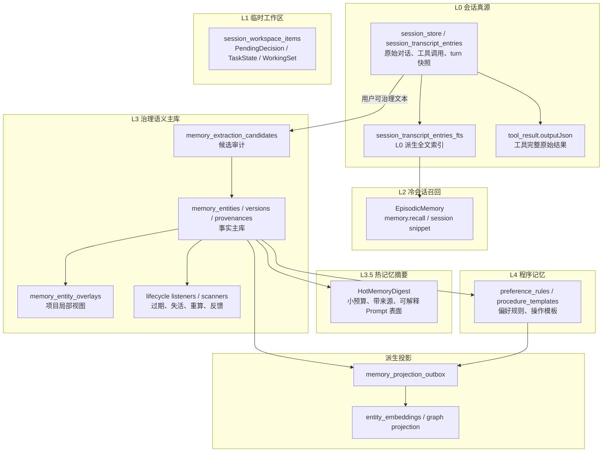

# 记忆系统 — 架构设计

> **文档性质**：记忆模块整体心智模型、分层模型、子系统设计与演进路线
> **模块归属**：`com.lifepilot.memory.{store,retrieval,consumption,governance}` + `com.lifepilot.agent.learning` + `com.lifepilot.meta.infra.memory`
> **最后更新**：2026-05-21（MemoryProperties 拆分完成，配置前缀迁移至子模块）
> **配套数据流契约**：[memory-data-flow.md](./memory-data-flow.md) 是写入链路、事件契约、Schema、生命周期、项目隔离、质量门槛和消费边界的 **source of truth**
>
> 涉及这些治理契约的改动，必须先更新 `memory-data-flow.md`，再更新本文档的心智模型或路线，最后改代码。

---

## 0. 一句话模型

知微记忆不是一个"自动塞进 Prompt 的大数据库"，而是一条分层闭环：

**L0 会话真源保存原始事实，L1 工作区保存短期任务状态，L2 会话检索负责冷召回，L3 语义主库存放可治理事实，L3.5 热记忆摘要提供小而稳定的 Prompt 表面，L4 程序记忆沉淀可执行偏好和流程，Projection outbox 维护向量/图谱等派生索引。**

用户和 Agent 能清楚区分：

| 类型 | 定位 | 是否默认进 Prompt | 典型入口 |
|---|---|---:|---|
| 热记忆 | 少量、高信任、总是有用的用户画像 / 项目约定 / 经验摘要 | 是，严格预算 | `ContextAssembler` |
| 冷记忆 | 大量长期事实、历史对话、证据、经验细节 | 否，按需搜索 | `memory.search` / `memory.recall` |
| 深层记忆 | L3 主库、L4 规则、向量/图谱投影、候选审计 | 否，系统内部治理 | `SemanticMemory` / outbox / scanner |

这与 Hermes Agent 的取向一致：常驻上下文必须小、可解释、可治理；历史对话和深层知识按需搜索，而不是长期污染系统提示词。

主要调研来源：

- Hermes Persistent Memory / session_search：<https://hermes-agent.nousresearch.com/docs/user-guide/features/memory/>
- Hindsight memory graph：<https://github.com/vectorize-io/hindsight>
- LangChain MultiQueryRetriever / LlamaIndex RouterQueryEngine / Haystack ConditionalRouter / Microsoft GraphRAG
- Letta Memory：<https://docs.letta.com/concepts/memory/overview>
- Mem0：<https://docs.mem0.ai/>
- MaRS 认知遗忘：[ACL 2024](https://aclanthology.org/2024.findings-acl.321/)
- A-MEM（NeurIPS 2025，arXiv:2502.12110）、SCM Sleep-Consolidated Memory

---

## 1. 分层架构

### 1.1 L0 会话真源

- `session_store` / `session_transcript_entries` 是原始对话的唯一真源。
- 典型 `entry_type` 包含 `user_message`、`assistant_message`、`tool_call`、`tool_result`、`artifact_ref`、`compaction_summary`、`memory_flush_event`。
- 工具调用与工具结果通过 `toolId / callId / turnId / traceId` 关联；`tool_result.payload_json.outputJson` 保存工具返回的完整原始结果，`tool_call.payload_json.inputJson` 保存完整入参。
- `ToolExecutionCoordinator` 的 `rawOutput` 是工具完整结果。transcript 的 `tool_result.outputJson` 始终记录原始 `rawOutput`；面向模型的 `observationOutput` 可能经媒体提取/截断，但不是真源。
- 工具级经验提示只允许在 `ProviderMessageBuilder + ToolTipResolver` 呈现层拼到模型消息前，不能写回 `Observation.output`、transcript 或 trace，避免污染 JSON、审计和回放。
- `tool_result` 默认 `visibleToModel=true`、`visibleToUser=false`：它是模型续跑、审计、trace 回放和经验提取的事实源，不等同于前端时间线可见内容。
- 自动学习只能从用户可治理文本提取事实，不能从系统 wrapper、提示词注入片段、自动 UI signal 直接提取长期记忆。
- `ChatTurnMemorySnapshot` 是自动学习的治理凭证：缺快照、缺 turnId、解析异常时自动学习 fail-closed。

工具完整结果到各层的扩散规则：

| 去向 | 是否保存完整结果 | 说明 |
|---|---:|---|
| L0 transcript | 是 | 供审计、回放和后续证据追溯 |
| ReAct state / Observation | 否 | 面向模型续跑，可经媒体占位、失败截断或 provider 消息 hygiene |
| L1 WorkingSet | 否 | 只对少量关键工具保存最长约 300 字摘要和 `toolId` 元数据 |
| L2 recall snippet | 否 | 默认只返回过去会话的 user/assistant 可见片段，不直接展开工具大结果 |
| L3 语义记忆 | 否 | 只有经过候选、质量门控或显式工具写入后，工具结果中的事实才能变成长期记忆 |

### 1.2 L1 临时工作区

- L1 只保存跨轮任务状态，不保存原始聊天记录。
- 典型条目：
  - `PendingDecisionItem`：等待用户确认
  - `TaskStateItem`：未完成任务进度
  - `WorkingSetItem`：下一轮仍可能使用的中间结果摘要
- 关键工具成功后可以写入 `WorkingSetItem`，但只保存截断摘要；完整结果仍以 L0 `tool_result` 为准。
- L1 到期后清理；L1 内容不是长期事实，不能绕过候选表直接写 L3。

### 1.3 L2 冷会话召回

- L2 面向"我们之前聊过什么"的问题。
- L2 没有独立事实主库；它是 L0 transcript 的读模型：`session_transcript_entries_fts` 是 L0 的全文索引，`session_transcript_compressions` 是 L0 条目的压缩读模型。
- `memory.recall` 通过 `session_transcript_entries_fts` 命中过去会话，再回读 `session_transcript_entries` 组装上下文片段。
- 当前 snippet 组装只使用 `user_message / assistant_message` 且 `visible_to_user=1` 的可见对话文本；工具完整结果不直接出现在 L2 片段里。
- L2 不默认进入 Prompt，不承担当前会话连续性，也不承担长期事实主库职责。

L0 与 L2 的关系：

| 层 | 数据形态 | 是否真源 | 典型用途 |
|---|---|---:|---|
| L0 transcript | 原始条目（消息、工具调用、工具结果、artifact 引用、压缩事件） | 是 | 审计、回放、当前会话上下文、证据追溯 |
| L2 FTS | `session_transcript_entries_fts` 命中行 | 否 | 找到相关 session / entry |
| L2 snippet | 基于命中 entry 前后轮次拼出的 `ConversationSnippetRecord` | 否 | 给 Agent 按需回忆过去对话 |
| L2 compression | `session_transcript_compressions` | 否 | 长上下文压缩和片段读模型 |

删除 session 或 transcript 条目会级联影响 L2；重建 L2 索引不能反向恢复 L0 原始事实。

### 1.4 L3 治理语义主库

- L3 是长期事实主库，维护实体、版本、provenance、质量字段、生命周期和项目隔离。
- `memory_entities` / `memory_entity_versions` / `memory_entity_provenances` 是事实来源；向量和图谱只是派生索引。
- 所有自动提取先落 `memory_extraction_candidates`，通过质量门控后才写实体。
- `MemoryAccessPolicy` 是唯一读写边界策略层。
- 隔离项目读取可继承主账户 personal / experience，写入只能进入项目 space；更新继承实体时创建项目 overlay。

### 1.5 L3.5 热记忆摘要

L3.5 是从 L3 派生的**小型、可解释、带来源的 Prompt 表面**，解决"记忆模块能力强但 Prompt 消费面混乱"：

| 属性 | 规则 |
|---|---|
| 来源 | 只能来自可消费 L3 实体，不从 transcript 或 L2 直接生成长期热记忆 |
| 预算 | 严格 token / char 上限，超限必须合并、替换或降级为冷召回 |
| 证据 | 每条摘要必须能追溯 `source_entity_ids` |
| 质量 | 只允许 `VERIFIED / EXPLICIT / DERIVED` 默认进入；`INFERRED` 需强相关且显式标注 |
| 生命周期 | 源实体过期、取消、归档、重算时摘要失效或重建 |
| 项目隔离 | 按 `MemoryAccessPolicy` 构造读取视图，overlay 优先 |
| 写入稳定性 | 当前 turn 内的记忆写入不修改已组装 Prompt，只影响下一次组装 |

当前最小实现是 `HotMemoryDigestService` 按读取视图实时构建快照，不新增事实表：读 `SemanticMemory.findAllCurrent(filter)`，经 `MemoryQualityPolicy.isPromptConsumable`、生命周期、默认排除 `INFERRED`、工具级经验过滤和脱敏后，输出 `USER_PROFILE / PROJECT_MEMORY / EXPERIENCE / FACTS` 四类 section；同时读取高置信 L4 `PreferenceRule`，只在其 `source_entity_id` 指向可消费 L3 实体时合并进 `USER_PROFILE`。`source_revision` 覆盖 L3 实体和被注入的 L4 规则，固定本次组装版本。

终态要求：`ContextAssembler` 不再各处拼散乱实体，自动记忆注入只消费统一热摘要。热摘要为空、构建失败或服务缺失时，本轮不回退旧画像 / 经验 / 相关记忆检索；需要更多历史或事实时由 Agent 显式调用冷召回工具。

`__consolidated_profile` 是 `USER_PROFILE` 的 L3 派生输入之一，但它自身的重算不靠定时到点。`UserProfileConsolidator` 以可消费 L3 画像碎片、可消费源校验后的 L4 偏好反馈和最近对话摘要生成源签名，签名未变化时直接跳过 LLM；签名变化后再套用最小间隔防抖。最近对话摘要只作当前语境辅助，不允许绕过 L3 质量门控沉淀新的长期事实。

### 1.6 L4 程序记忆

- L4 存放可执行偏好和操作模板。
- `preference_rules` / `procedure_templates` 必须带 `source_entity_id`，失活规则不得匹配。
- L4 不是事实主库。L3 源实体失效时，L4 规则或模板必须同步失活或重算。
- Prompt 层只自动注入高置信 L4 偏好规则，并且统一经 `HotMemoryDigest.USER_PROFILE` 输出；无源或源实体不可消费的规则不注入。
- L4 操作模板不默认文本注入 Prompt，继续由 `IntentMatcher` / 工具执行链路按意图匹配消费。

### 1.7 Projection outbox

- 向量、图谱、持久化摘要、L4 同步都是主库派生投影。
- 派生投影必须通过 outbox 进入可重试状态机，禁止在主事务外直接写索引。
- 事务回滚不得留下向量或持久化摘要幻影。
- 当前热摘要按需从 L3 读取构建，尚未持久化，因此暂不需要 outbox 失效任务。

---

## 2. 图记忆

知微当前已有 L3 SQL 图：

- 节点：`memory_entities` + `memory_entity_versions` + `memory_entity_provenances`
- 边：`memory_relations` + `memory_relation_versions` + `memory_relation_provenances`
- 读视图：`temporal_relations`
- 入口：知识库文档提取实体/关系、对话期关系抽取（`RealtimeExtractor` 二阶段，写入 memory_relations）、`memory(action="tag")` 显式标注、`HybridRetriever` 图遍历、`GraphKnowledgeSearcher` 领域图检索

终态要把图分成两类：

| 类型 | 用途 | 写入要求 | 消费方式 |
|---|---|---|---|
| 检索关键图 | 影响 `memory.search` / `knowledge.search` 的召回和排序 | 必须有来源、质量、生命周期、space 和方向/类型 | 从多路种子出发有界扩展，进入 score breakdown |
| 可视化/治理图 | 管理端展示、审计、人工整理 | 可以包含低置信候选或弱关联，但要标注状态 | 不直接影响默认 Prompt；需提升为检索关键图后才能参与召回 |

图记忆不默认进入 `HotMemoryDigest`。图扩展属于冷召回，只有 Agent 调用 `memory.search` / `knowledge.search` 后才进入本轮上下文。

图读路径规则：

- 起始种子不能只取第一个匹配实体；至少支持多个有界 seed，并按读取 filter / overlay 先过滤
- 反向边遍历必须返回相反端点，不能把起点自身作为 related 节点
- 只沿当前有效关系边遍历：`memory_relations.status='ACTIVE'` 且当前 relation version `valid_to is null`
- 只返回可召回实体：`ACTIVE / COMPLETED / REGENERATION_NEEDED / STALE_CANDIDATE`，并防御性过滤 `valid_to / expires_at`
- 图分数要可解释：depth、relation strength、relation type、seed source 都应能进入 `scoreBreakdown` 或调试日志
- 高 fanout 实体必须限流

Hindsight 0.5 的经验：把传统 BFS / 多路径传播收敛为 `LinkExpansionRetriever`，优先使用预计算的一等链接信号（entity / semantic kNN / causal），并把高 fanout 实体扩展做 per-entity cap 或超时降级。知微现阶段仍是 SQL 递归图，先用 depth / seed 上限控制风险；后续物化图投影时再靠预计算链接减少在线遍历成本。

---

## 3. 写入链路

> **学习相关的写入链路**（自动对话学习、经验学习）已迁移到 [agent-learning.md](./agent-learning.md)。本节只保留记忆系统自身的写入入口。

### 3.1 自动对话学习

详见 [agent-learning.md §2.1](./agent-learning.md)。学习系统通过 `SemanticMemory.upsertWithConflictDetection()` 写入记忆，记忆系统只负责存储和治理，不参与提取决策。

### 3.2 经验学习

详见 [agent-learning.md §2.2](./agent-learning.md)。经验写入同样通过 `SemanticMemory` 标准接口，记忆系统按质量门槛和项目隔离规则治理。

### 3.3 显式工具与 Web 写入

- `memory.create/update/delete/cancel/complete/supersede/tag` 必须通过 `MemoryAccessPolicy` 校验可写范围
- 隔离项目更新继承实体时创建 overlay，不能改主账户实体
- 隔离项目删除继承实体在 `HIDE` overlay 落地前必须 fail-closed
- 用户显式操作默认是 `USER_CONFIRMED`，质量等级高于自动推断

---

## 4. 消费链路

### 4.1 默认上下文组装

`ContextAssembler` 的默认记忆注入已收口为单一路径：同一次上下文组装只构建并消费一次 `HotMemoryDigest` 快照。组装顺序：

1. 系统提示词与工具 / skill 能力说明
2. 当前用户请求
3. 当前 session 最近完整轮次
4. L1 工作区摘要
5. L3.5 热记忆摘要：用户画像、L4 高置信偏好、项目约定、高价值经验、常用事实
6. 工具级经验只在工具 observation 呈现层由 `ToolTipResolver` 注入

消费门槛：

- 自动注入只允许可消费实体
- `UNVERIFIED` 永不注入
- `INFERRED` 只有在当前 query 强相关时才可注入，并且必须标注"推断"
- 脱敏失败时丢弃该条，不允许 fail-open 注入原文
- `recordInjection` 只能记录最终进入 Prompt 的实体 ID，不能记录检索候选
- 自动上下文组装不再额外运行旧画像拼接、任务经验检索或相关记忆冷搜索

### 4.2 冷召回工具

| 工具 | 数据层 | 用途 | 约束 |
|---|---|---|---|
| `memory.recall` | L2 | 找过去会话片段 | 只在用户或 Agent 明确需要历史对话时调用 |
| `memory.search` | L3 | 搜长期事实 | 返回质量、生命周期、scoreBreakdown |
| `memory.search-experience` | L3 | 搜任务级经验 | 排除工具级经验 |
| `knowledge.search` | KB / domain | 搜绑定资料 | 不直接变成长期个人记忆 |
| trace / transcript 工具结果查询 | L0 | 复盘某次工具完整输入输出 | 不属于默认记忆注入；返回前必须按权限、脱敏和预算处理 |

Prompt 应明确引导 Agent：当用户提到"上次、之前、我们聊过、你还记得"时，优先使用冷召回工具，不要凭热记忆猜测。

### 4.3 热摘要快照策略

借鉴 Hermes 的 frozen snapshot 思路，知微采用"本次上下文组装快照稳定"原则：

- `ContextAssembler` 开始组装后，本轮 Prompt 看到的是同一个热摘要版本
- 本轮工具写入记忆后，工具响应可展示 live state，但不回写已组装 Prompt
- 下一轮或下一次上下文组装时，才读取新热摘要或触发重建

避免 Agent 在同一轮里把自己刚写入的候选记忆当成外部事实再次放大。

---

## 5. 项目与空间语义

### 5.1 设计起源

"project / memory space / memory scope / provenance / turn snapshot" 这套模型是为了解决六类问题：

- 用户真实长期记忆不能被知识库、小说设定、角色扮演内容污染
- 领域资料仍然可以被稳定检索、引用、扩展，必要时还能沉淀为项目级领域记忆
- 单轮 `@知识库` 这类临时作用域必须是硬边界，不能受会话后续恢复配置影响
- 记忆边界必须可解释、可追踪、可删除，不能只依赖提示词"尽量别学错"
- 知识源删除后，相关领域记忆必须能反查来源并安全清理，不能形成"知识泄露感"
- 向量、FTS、图检索三条链路必须共用同一套边界模型，不能各自理解一套"作用域"

不采用"当前会话挂了知识库就整体跳过记忆"的粗粒度方案，也不采用"知识库 ID 直接充当记忆命名空间"的弱模型，而是采用：

| 概念 | 职责 |
|---|---|
| `memory_space` | **归属边界**：记忆实体属于哪个空间 |
| `memory_scope` | **类型**：`USER_PROFILE / USER_FACT / AGENT_EXPERIENCE / DOMAIN_MEMORY` 等 |
| `memory_entity_provenances` | **来源证据**：这条记忆从哪里学来，支持多来源与按来源删除 |
| `chat_turn_memory_snapshots` | **turn 真实作用域快照**：固化本轮实际生效的 space / scope / 学习策略 |

### 5.2 四种 space 类型

- `PERSONAL`：主账户个人记忆（用户画像、事实）
- `EXPERIENCE`：主账户 Agent 经验
- `DOMAIN`：知识库绑定对话派生的领域记忆，`space_key=domain:knowledge-base:{kbId}`
- `PROJECT`：用户显式创建的"项目（Project）"容器联动的 space，`space_key=project:{projectId}`

`DOMAIN` 与 `PROJECT` 并存：`DOMAIN` 承载从知识源学到的领域记忆，`PROJECT` 承载项目上下文下用户偏好/事实/经验的隔离。两者不互相覆盖。

### 5.3 项目隔离（ISOLATED / SHARED）

项目隔离是**读写非对称**的：

| 场景 | 规则 |
|---|---|
| ISOLATED 项目读取 | 项目 space + 主账户 personal + 主账户 experience |
| ISOLATED 项目写入 | 仅项目 space |
| ISOLATED 更新继承实体 | 创建项目 overlay |
| SHARED / 主账户读取 | personal + experience |
| SHARED / 主账户写入 | 默认 personal / experience |
| KB 绑定对话 | 仅在明确 domain write space 存在时写 domain memory |

### 5.4 overlay 数据语义

overlay 不改变 base 实体生命周期，不复制 base provenance 的治理权，只表示"当前项目对该继承事实的局部视图"。

| 字段 | 说明 |
|---|---|
| `overlay_entity_id` | 项目 space 内实体 id，必须属于 `overlay_space_id` |
| `base_entity_id` | 被覆盖的继承实体 id，通常来自 personal / experience 主账户 space |
| `overlay_space_id` | 项目 MemorySpace id |
| `origin_space_id` | base 实体所属 space，便于审计和 UI 展示 |
| `overlay_kind` | `UPDATE` / `HIDE` / `CANCEL` / `SUPERSEDE`；本轮先落地 `UPDATE` |

读取优先级：项目 overlay > 项目普通实体 > 主账户 personal/experience 继承实体。

### 5.5 读取规则总结

热记忆摘要按同一规则构建。项目视图中若存在 overlay，应遮蔽对应 base 实体，避免 Prompt 同时看到主账户版本和项目局部版本。

详细字段、Schema、`MemoryAccessPolicy` 契约见 [memory-data-flow.md §0.1 / §0.8 / §0.9](./memory-data-flow.md)。

---

## 6. 进阶子系统

> **巩固管线、遗忘引擎、经验学习**等学习相关子系统已迁移到 [agent-learning.md](./agent-learning.md)。本节只保留记忆系统自身的进阶能力。

### 6.1 L4 程序记忆与意图匹配

- `ProcedureTemplate`：操作模板，包含步骤序列（`TemplateStep`）、触发意图、成功率、执行次数；模板聚类由 `lifepilot.memory.store.procedural.template-enabled` 控制，默认启用
- `PreferenceRule`：偏好规则，按 category + key 组织，支持强化（reinforcement）
- 使用 sqlite-vec 建立意图向量索引（`procedure_intent_embeddings`），记录每次模板执行的成功 / 失败，动态更新成功率
- `IntentMatcher`：通过 VectorSearcher 进行向量相似度匹配，返回最佳匹配的 `ProcedureTemplate`；结果供 `HybridRetriever` 冷检索链路参考，**不进入 `ContextAssembler` 默认自动注入**
- 在 `ToolExecutionCoordinator` 中以 `Thread.startVirtualThread` 异步调用，不阻塞主 Agent 循环

> 注：L4 的数据（ProcedureTemplate / PreferenceRule）由学习系统的巩固管线写入，但 L4 的**存储和检索**属于记忆系统。IntentMatcher 是纯检索组件，不产出新知识。

### 6.2 巩固管线

详见 [agent-learning.md §3](./agent-learning.md)。

### 6.3 MaRS 认知遗忘

详见 [agent-learning.md §4](./agent-learning.md)。

### 6.4 子系统关键配置

| 配置键 | 默认 | 说明 |
|--------|------|------|
| `lifepilot.memory.store.procedural.template-enabled` | true | 操作模板聚类开关 |
| `lifepilot.memory.store.procedural.match-threshold` | 0.6 | 意图匹配相似度阈值 |
| `lifepilot.agent.learning.consolidation.cron` | `0 0 3 * * *` | 巩固管线 Cron |
| `lifepilot.agent.learning.consolidation.trigger-mode` | CRON | `CRON` / `IDLE` / `HYBRID` |
| `lifepilot.agent.learning.forgetting.cron` | `0 0 4 * * SUN` | 遗忘引擎 Cron |
| `lifepilot.agent.learning.forgetting.max-forget-per-run` | 100 | 每次运行最大遗忘数 |
| `lifepilot.agent.learning.forgetting.recent-access-protection-days` | 7 | 近期访问保护天数 |
| `lifepilot.agent.learning.forgetting.high-access-count-protection` | 10 | 高频访问保护阈值 |

---

## 7. 不变量

这些规则不应再被局部代码绕过：

- 原始对话真源只在 L0
- L1 不是长期记忆
- L2 是冷召回，不默认注入
- L3 是事实主库，向量 / 图谱 / 热摘要都是派生
- `importance_score` 不代表可信度
- 项目继承读取不等于可写
- 自动学习缺快照必须 fail-closed
- 低质量候选不能静默丢弃
- Prompt 常驻记忆必须小预算、带来源、可解释
- L4 规则必须能追溯 L3 源实体

---

## 8. 演进历史与本轮能力

知微记忆系统沿下列 Phase 从基础治理逐步走到开发期回归 + 进阶召回：

| Phase | 主题 | 状态 | 说明 |
|---|---|---|---|
| A | 文档与对账 | ✅ | 采用热 / 冷 / 深层分层模型；grep 清单标出所有旧向量直写、旧过期任务、旧 WorkingMemory 配置 |
| B | 清理旧路径 | ✅ | 删除未注册的旧过期任务；实体向量 upsert/delete 统一经 `memory_projection_outbox`；项目删除 / 生命周期 listener / 程序模板索引补齐 outbox |
| C | 实现 L3.5 热记忆摘要 | ✅ | `HotMemoryDigestService` 按视图构建；`ContextAssembler` 接入；默认排除 `INFERRED`；L4 偏好经源实体校验后合入 `USER_PROFILE` |
| D | 改造 ContextAssembler | ✅ | 上下文消费从"多处拼实体"收口为"只消费热摘要；冷召回走工具" |
| E | 强化冷召回 | ✅ | `memory.recall` 强化 snippet；`memory.search` 输出 `rawCount / qualityFilteredCount / truncatedCount / scoreBreakdown`；明确 trace / transcript 工具结果查询入口 |
| F | 强化图记忆召回 | 🟡 | `SemanticMemory.findRelated` 反向边修正；`GraphTraverser` 多起点遍历；relation 质量字段 / 图投影 outbox 待后续 |
| G | 治理 UI 与运维 | 🟡 | 管理端展示热摘要、源实体、质量、生命周期、space、overlay 血缘；补偿任务可重放 FAILED projection；前端血缘页待前端独立迭代 |
| **H** | **统一检索编排骨架** | ✅ | 见 §8.1 |
| **I** | **记忆老化与邻居回链** | ✅ | 见 §8.2 |
| **J** | **REM 式联想巩固** | ✅ | 见 §8.5 |
| **K** | **开发期回归基线** | ✅ | 见 §8.3 |
| **L** | **记忆暴露为 MCP Server** | ✅ | 见 §8.6 |
| **M** | **记忆注入安全加固** | ✅ | 见 §8.4 |

本轮 `feature/memory-evolution` 分支落地的 6 个记忆 spec 简介如下；每个 spec 的详细设计由 `.kiro/specs/{name}/` 下的 requirements / design / tasks 文档承载，本节只做索引。

### 8.1 retrieval-orchestrator（Phase H）

把 HybridRetriever / L3 EXPERIENCE 检索 / 知识库检索统一到 `RetrievalOrchestrator` 入口，返回统一的 `EvidenceBundle`。

- `SourceAdapter` sealed interface：`HybridRetrievalSource` / `ExperienceRetrievalSource` / `KnowledgeBaseSource` 占位
- `QueryPlanner` 按 `RetrievalIntent(FACT / EXPERIENCE / GENERAL)` 选 source，过滤 `isAvailable=false` 的 adapter
- 本期为上层可选接口，默认 `lifepilot.memory.retrieval.orchestrator.enabled=false`，不替换既有 `memory.search / recall` 工具链路
- 后续演进：`QueryDecomposer`（复杂问题改写为子查询）、图扩展（GraphRAG / DRIFT）、`KnowledgeBaseSource` 真实实现、Agent 工具化 `memory.retrieve`

Spec：`.kiro/specs/retrieval-orchestrator/`

### 8.2 memory-staleness（Phase I）

新事实写入时自动识别与之语义冲突的老邻居，迁入新的 `STALE_CANDIDATE` 生命周期态；召回时降权但不丢弃，Agent 命中时可自然追问确认。

- `LifecycleState` 增 `STALE_CANDIDATE`；允许 `ACTIVE → STALE_CANDIDATE`、`STALE_CANDIDATE → ACTIVE / SUPERSEDED / ARCHIVED`，其他终态禁止进入
- `VectorBasedStaleConflictDetector`：类型白名单（默认 `PREFERENCE / HABIT / PLACE / GOAL`）+ 相似度阈值（默认 0.85）+ UNVERIFIED 过滤
- `StalenessCoordinator`：虚拟线程 afterCommit 异步调度 `Detector → StalenessMarker → NeighborRefreshService`
- `HybridRetriever`：`STALE_CANDIDATE` 命中分数乘 0.65（默认 penalty 0.35），`scoreBreakdown.lifecycleAdjustment` 可审
- `ProactiveCacheInvalidator` 订阅 `EntityLifecycleChanged`，让主动引擎感知 L3 失活
- `NeighborRefreshService` 首版仅日志落地（`neighbor-refresh-enabled` 默认关），等后续 Consolidator 侧消费能力就绪再写候选表

Spec：`.kiro/specs/memory-staleness/`

### 8.3 memory-eval-harness（Phase K）

开发期记忆模块离线回归 harness。每次改动读写链路后，跑一遍量化回答"召回 / 误召回 / 延迟 / token 成本是否变好"。

- 数据集：`LoCoMo`（10 对话 / ~300 turns）+ `LongMemEval`（500 题，5 类能力）；下载脚本 `scripts/download-eval-datasets.sh`，缓存到 `~/.zhiwei/eval-cache`
- 判定：`AnswerJudge` sealed interface + `ExactMatchJudge / F1Judge / LlmAsJudge`（LLM 判官默认关闭）
- 指标：`RetrievalProbe / LatencyProbe / TokenProbe`（召回 / 延迟 / token 四维）
- 基线：`BaselineStore` + `RegressionDetector`；默认阈值 LLM-Score 掉 3% / 延迟涨 20% / token 涨 30%
- 隔离：每个 case 独立 SQLite 文件（`java.io.tmpdir/zhiwei-eval-<uuid>.db`），跑完自动清理
- 触发：`mvn test -Pmemory-eval-quick`（冒烟，~5 分钟）/ `mvn test -Pmemory-eval-full`（全量，~60-120 分钟）；默认 `mvn test` 不跑
- 报告：`target/memory-eval/{timestamp}.md` 和 `.json`；基线归档到 `docs/memory-eval/baseline.json`

与既有 `com.lifepilot.eval`（Agentic Evals）并存，前者面向 Agent 轨迹评估，后者面向记忆子系统质量。

Spec：`.kiro/specs/memory-eval-harness/`

### 8.4 memory-security-polish（Phase M）

对所有外部文本进入 L3 前做两层检测：

- `PromptInjectionPatternScanner`：已知注入正则库（中英 16 条）
- `SpaceTrustDistribution`：每 space 的 trustScore 滑动窗口 + Mahalanobis 1D 距离异常检测
- `MemoryInjectionDetector.detect(spaceId, text, trustScore)` 返回 `PASS / SUSPICIOUS / BLOCKED`；`blockOnSuspicious=true` 时 SUSPICIOUS 也按 BLOCKED 处理
- 本 spec 只落地可用组件，**不强制注入到 RealtimeExtractor 等写入链路**；接入节奏由未来 spec 按实际风险场景推进
- M-P2-7 前端血缘展示（EntityDetailDrawer 血缘 Tab / Provenance 时间线 / Overlay 关系图 / HotDigest 命中统计）作为前端独立迭代，后端 API 已就绪

默认 `lifepilot.memory.governance.security.injection-detection-enabled=false`。

Spec：`.kiro/specs/memory-security-polish/`

### 8.5 memory-rem-consolidation（Phase J）

巩固管线第 7 步：对 L3 高 importance seed 实体（默认 `GOAL / TOPIC / PROJECT`）用 HybridRetriever 找邻居，调 LLM 推断未被显式记录的潜在语义关系，合格候选落文件审计。

- `AssociationCandidate / AssociationType`：5 种关系枚举 `RELATED_TO / CAUSES / SIMILAR_TO / SUPPORTS / CONTRADICTS`
- `AssociationCandidateGenerator`：seed 选择（top-K 按 importance） + 邻居拉取 + LLM JSON 输出
- `AssociationConsolidator`：confidence 过滤（默认 ≥0.65） + 24h 窗口去重
- `AssociationCandidateStore`：文件持久化 `target/cache/memory-rem-associations/{yyyy-MM-dd}.json`（当天多次巩固合并到同一文件）
- **候选先落文件、再由 `AssociationCandidateApplier` 应用到 L3 relations**：阈值 `apply-min-confidence`（默认 0.75）+ 端点存活校验 + `relationExists` 幂等；巩固周期 `runRemAssociation` 末尾自动触发，亦可经 `POST /api/memories/rem/apply` 手动触发
- 默认 `enabled=false`；开启后 `seedLimit=10 × neighborLimit=5 = 50 次检索 + 10 次 LLM`

Spec：`.kiro/specs/memory-rem-consolidation/`

### 8.6 memory-mcp-server（Phase L）

通过 `POST /api/mcp/memory` JSON-RPC 2.0 端点把知微记忆暴露给外部 Agent（Claude Desktop / Cursor）。

- 最小子集：`initialize / tools/list / tools/call`
- 3 个工具：`memory_search` / `memory_recall` / `memory_create`
- 错误码遵循 JSON-RPC 2.0（-32600 / -32601 / -32602 / -32603）
- 默认 `enabled=false`；**不实现认证**，仅建议本地回环使用

Spec：`.kiro/specs/memory-mcp-server/`

### 8.7 剩余演进方向

- **图记忆持续加固**：relation 级 `evidence_kind / trust_level / trust_score / evidence_excerpt` 补齐、entity co-occurrence / semantic link / causal link 图投影 outbox（对话关系自动提取已落地，见 §3.x / agent-learning §3.3.8）
- **统一检索编排进阶**：并行 source 调用、`QueryDecomposer`、学习型 reranker、`KnowledgeBaseSource` 真实实现、`memory.retrieve` Agent 工具化
- **REM 候选应用器**：✅ 已落地（`AssociationCandidateApplier`，文件候选 → 阈值+幂等 → L3 relations 主库）
- **前端血缘展示**：`EntityDetailDrawer` 血缘 Tab、Provenance 时间线、overlay / derivation 关系图、HotDigest 命中次数统计
- **Staleness 精度提升**：时间距离 + 显式否定词（"我改了"/"现在是"）融合判定
- **记忆注入安全接入**：把 `MemoryInjectionDetector` 真正前置到 `RealtimeExtractor` / KB 抽取链路
- **记忆注意力**：✅ 已落地（`MemoryAttentionService` + `GraphReasoner`，主动浮现 EXPIRING/NEGLECTED/EVOLVING/CONNECTION，经 `GET /api/memories/attention` 与 `ProactiveMemoryBridge.getAttentionItems` 出口，见 agent-learning §3.3.9）
- **目标截止日期感知**：✅ 已落地（`properties.dueAt` 独立于 `expires_at`，`DueDateExtractor` 确定性兜底覆盖 AUDN + memory 工具两条写入路径，注意力 DUE_SOON 信号，见 agent-learning §3.3.9）

---

## 9. 模块边界

| 模块 | 边界 |
|---|---|
| `memory` | 负责存储、检索、消费视图、数据治理；不做学习决策 |
| `agent.learning` | 负责从经历中提炼知识（提取、巩固、遗忘、经验）；通过记忆标准接口读写，见 [agent-learning.md](./agent-learning.md) |
| `conversation` | 负责 L0 transcript 和 turn snapshot，不直接治理长期事实 |
| `agent.context` | 负责消费记忆，不能绕过质量 / 生命周期 / 项目 filter |
| `meta.infra.memory` | 暴露工具入口，所有写操作必须校验可写范围 |
| `project` | 决定 project space 与隔离语义，不直接改主账户记忆 |
| `knowledge` | 提供 domain evidence 和资料搜索；KB 图实体写入 `DOMAIN_MEMORY`，不进入默认热记忆注入 |
| `proactive` | 只能写带来源和信任等级的洞察，行为推断不得覆盖用户显式偏好 |

---

## 10. 文档更新约定

记忆模块后续改动按以下顺序推进：

1. 先更新 [memory-data-flow.md](./memory-data-flow.md) 的数据契约
2. 再更新本文档的整体模型或路线
3. 最后改代码和测试

如果代码与本文档不一致，不能用"兼容旧路径"解释漂移；要么改代码贴合终态，要么更新文档并说明为什么终态变了。
