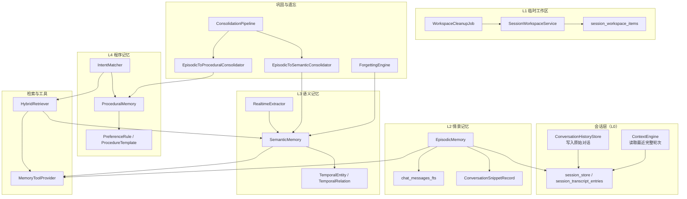
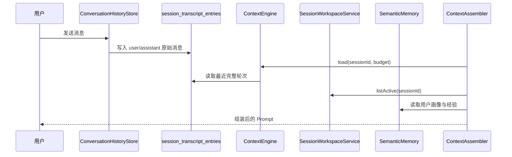
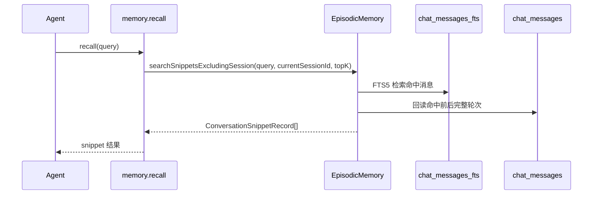

# 记忆系统 — 架构设计

> **文档性质**：架构设计文档
> **模块归属**：`com.lifepilot.memory`
> **最后更新**：2026-03-27

## 1. 模块概述

当前记忆系统采用“会话层 + L1 临时工作区 + L2 情景记忆 + L3 语义记忆 + L4 程序记忆”的分层模型：

- **会话层（L0）**：`session_store / session_transcript_entries`，是原始对话的唯一真源
- **L1 临时工作区**：`session_workspace_items`，保存跨轮但临时的任务状态
- **L2 情景记忆**：基于会话层和 `chat_messages_fts` 提供跨会话片段回忆
- **L3 语义记忆**：维护时序知识图谱，存放稳定事实、画像和经验实体
- **L4 程序记忆**：存放偏好规则、操作模板和策略模式

这套设计明确取消了“L1 作为对话缓存并 flush 到 L2”的旧链路。当前会话连续性直接来自会话层，跨会话对话检索通过 `memory.recall` 显式触发，L1 不再承载原始对话。

## 2. 架构图



## 3. 核心组件

### 3.1 会话层（L0）

- 原始对话统一写入 `session_transcript_entries`，由 `ConversationHistoryStore` 承担写入抽象
- 当前会话的最近完整轮次由 `ContextEngine` 直接从会话层读取
- `ContextAssembler` 组装当前上下文时只使用会话层，不再依赖 L1 或 L2 的对话副本

### 3.2 SessionWorkspaceService（L1 临时工作区）

- `SessionWorkspaceService` 负责持久化跨轮临时状态，底层表为 `session_workspace_items`
- 当前定义三类工作区条目：
  - `PendingDecisionItem`：等待用户确认
  - `TaskStateItem`：未完成任务的进度状态
  - `WorkingSetItem`：供下一轮继续使用的中间结果摘要
- 工作区明确不保存原始 user/assistant 消息、思维链和原始工具大结果
- `WorkspaceCleanupJob` 按 TTL 过期活动项，并清理终态条目
- 当前主写入点在 `AgentPersistenceHandler.saveWorkspaceForSuspend()`，用于挂起、确认等待和任务续跑

### 3.3 EpisodicMemory（L2 情景记忆）

- `EpisodicMemory` 的主读路径基于 `chat_sessions / chat_messages`
- 跨会话回忆使用 `chat_messages_fts` 做全文检索，再回到 `chat_messages` 组装 snippet
- `searchSnippetsExcludingSession()` 会：
  - 排除当前 session
  - 先命中消息，再按前后完整轮次扩展为片段
  - 返回 `ConversationSnippetRecord`，而不是零散单条消息
- L2 不再承担“当前会话连续性”的职责，也不再接收来自 L1 的 flush

### 3.4 SemanticMemory（L3 语义记忆）

- `SemanticMemory` 存放版本化实体与关系，是稳定事实、用户画像和经验实体的主存储
- `EntityType` 枚举包含 12 种类型：PERSON、ORGANIZATION、PLACE、EVENT、PROJECT、TOPIC、PREFERENCE、HABIT、GOAL、SKILL、EXPERIENCE、CUSTOM
- `RealtimeExtractor` 在对话后异步提取实体写入 L3
- `ContextAssembler` 当前自动注入的长期信息主要来自：
  - `PREFERENCE / HABIT / GOAL`
  - `EXPERIENCE`

### 3.5 ProceduralMemory（L4 程序记忆）

- `ProceduralMemory` 保存偏好规则、操作模板和策略模式
- `IntentMatcher` 负责在检索和编排阶段提供程序化建议
- 当前上下文组装会读取高置信度偏好规则，与 L3 画像一起构成用户画像区

### 3.6 HybridRetriever 与记忆工具

- `HybridRetriever` 继续负责 L3/L4 的混合检索，包含向量、FTS 和图遍历三路融合
- `HybridRetriever` 支持可选的 `RerankRouter` 步骤，对记忆候选进行精排重排序
- `HybridRetriever` 实现 `knownEmpty` 短路优化：当检索空间已知为空时，跳过实际检索直接返回空结果
- `MemoryToolProvider` 当前注册 9 个记忆工具：
  - `memory.search`
  - `memory.recall`
  - `knowledge.search`
  - `memory.create`
  - `memory.update`
  - `memory.delete`
  - `memory.tag`
  - `memory.query-at-time`
  - `memory.search-experience`
- 其中 `recall` 只在工具调用时显式触发，不会自动把别的 session 对话塞进主 prompt

### 3.7 ConsolidationPipeline 与 ForgettingEngine

- 巩固链路仍然负责将情景信息沉淀为语义和程序记忆
- `checkIdleConsolidation()` 基于空闲时间触发巩固，不依赖 L1 flush
- `ForgettingEngine` 继续负责实体遗忘、压缩和归档

### 3.8 经验学习子系统

- `ExperienceSummarizer`、`EffectivenessTracker`、`ContrastiveLearner`、`SubtaskReflector` 继续保留
- 经验写入 L3 的 `EXPERIENCE` 实体
- `ContextAssembler` 会按重要度和适用条件自动注入少量经验
- `memory.search-experience` 允许 Agent 主动检索经验

## 4. 核心流程

### 4.1 当前会话上下文组装



当前自动注入顺序是：

1. 系统提示词
2. 当前用户请求
3. 当前 session 最近完整轮次
4. 活跃工作区摘要
5. 用户画像与经验
6. 其他段落按需预留

### 4.2 跨会话回忆



### 4.3 挂起与恢复

```mermaid
sequenceDiagram
    participant Loop as ReactAgentLoop
    participant PH as AgentPersistenceHandler
    participant SWS as SessionWorkspaceService
    participant CA as ContextAssembler

    Loop->>PH: saveWorkspaceForSuspend(state)
    PH->>SWS: savePendingDecision()/saveTaskState()
    Note over SWS: 状态落入 session_workspace_items
    CA->>SWS: listActive(sessionId)
    CA-->>Loop: 将活跃工作区摘要注入下一轮 Prompt
    PH->>SWS: resolveByTaskId()/resolveBySourceTraceId()
```

## 5. 设计决策

| 决策 | 选择 | 理由 |
|------|------|------|
| 原始对话真源 | 会话层 | 避免 L1/L2 与会话存储重复维护同一份对话 |
| L1 定位 | 临时工作区 | 用于保存跨轮临时状态，而不是聊天记录缓存 |
| 当前上下文拼接 | 最近完整轮次按时间正序 | 保证 user/assistant 成对保留，不按 importance 打散 |
| 跨会话对话进入 Prompt | 仅通过 recall 工具显式触发 | 避免在主上下文里自动混入别的会话 |
| L2 数据来源 | 会话层读模型 | 消除 L1 flush 才可见的时序问题 |
| 工作区持久化 | SQLite + TTL | 支持挂起恢复，同时保留自动清理能力 |

## 6. 集成点

| 集成模块 | 方向 | 说明 |
|---------|------|------|
| Agent 引擎（`com.lifepilot.agent`） | Agent → Memory | `ContextAssembler` 读取最近轮次、工作区、用户画像和经验 |
| 对话系统（`com.lifepilot.conversation`） | Memory → Conversation | L0 对话真源来自 `ConversationHistoryStore` 与 transcript 读模型 |
| 元能力工具（`com.lifepilot.meta.infra.memory`） | Tool → Memory | `MemoryToolProvider`（完整路径：`com.lifepilot.meta.infra.memory.MemoryToolProvider`）暴露记忆检索、资料检索、实体写入与经验检索工具 |
| 知识库（`com.lifepilot.knowledge`） | Memory → Knowledge | `knowledge.search` 工具通过知识库检索补充外部文档片段 |

## 7. 配置参考

当前主路径最关键的配置为：

| 配置键 | 说明 |
|--------|------|
| `lifepilot.memory.enabled` | 记忆系统总开关 |
| `lifepilot.memory.workspace.enabled` | 是否启用 L1 临时工作区 |
| `lifepilot.memory.workspace.prompt-max-items` | 注入 Prompt 的工作区条目上限 |
| `lifepilot.memory.workspace.pending-decision-ttl-hours` | 待确认条目 TTL |
| `lifepilot.memory.workspace.task-state-ttl-hours` | 任务状态条目 TTL |
| `lifepilot.memory.workspace.working-set-ttl-hours` | 工作集条目 TTL |
| `lifepilot.memory.workspace.cleanup-cron` | 工作区清理调度 |
| `lifepilot.memory.agentic-tool.*` | 记忆工具默认检索参数 |
| `lifepilot.memory.retrieval.*` | L3/L4 检索、用户画像和回退参数 |
| `lifepilot.memory.consolidation.*` | 巩固触发模式与阈值 |
| `lifepilot.memory.episodic-cleanup.*` | L2 清理策略 |
| `lifepilot.memory.experience.*` | 经验注入、隔离、合并与反馈配置 |

## 8. 当前限制

- 工作区的主写入点目前集中在挂起/确认场景，`WorkingSetItem` 还没有形成完整主链路
- `ContextAssembler` 目前自动注入的是最近轮次、工作区、画像和经验，知识库与跨会话对话仍以工具调用为主
- `MemoryProperties` 内仍保留部分历史配置字段，但当前主架构已不再依赖旧的 `WorkingMemory`/`flush` 语义
