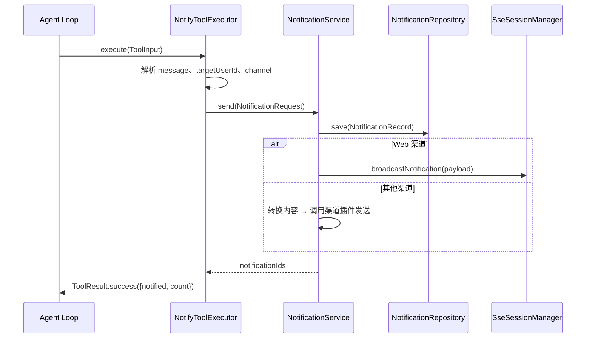
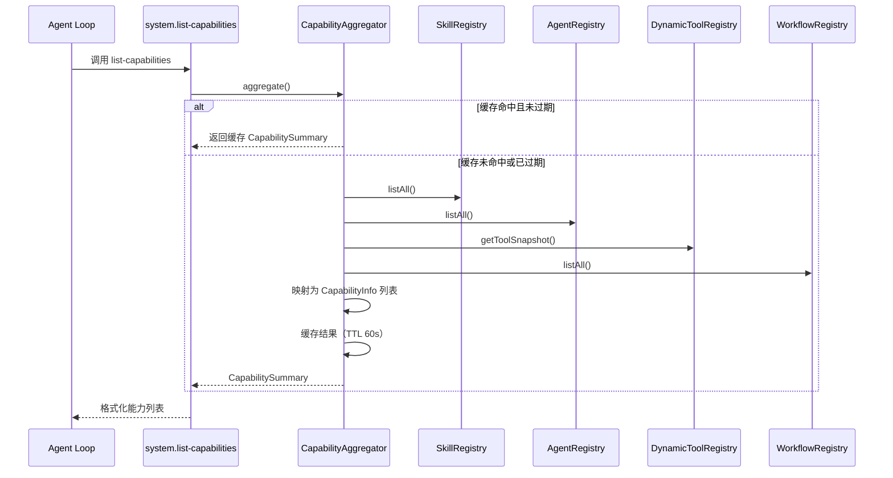

# 元能力系统 — 架构设计

> **文档性质**：架构设计文档
> **模块归属**：`com.lifepilot.meta`
> **最后更新**：2026-04

## 1. 模块概述

元能力系统（Meta Capabilities）为 Agent 提供通用执行基础设施和系统自省能力。模块分为两大子系统：**基础工具集**（Infra）提供 30+ 个内置工具覆盖环境感知、Web 信息获取、Shell 执行、浏览器自动化、代码执行、文件系统操作和通知推送；**便利层**（Convenience）提供系统自省和 Skill 发现能力。内置 MCP 服务器（mcp-installer、desktop-control 等）通过 JSON 配置文件由 `McpServerDiscovery` 统一发现和管理。元能力模块是 Agent 执行循环中最底层的工具供给者，所有工具在 `MetaAutoConfiguration` 中通过 `ApplicationReadyEvent` 注册到 `DynamicToolRegistry`。

## 2. 架构图

```mermaid
graph TB
    subgraph meta["com.lifepilot.meta"]
        subgraph convenience["convenience — 便利层"]
            CA["CapabilityAggregator<br/>能力聚合器"]
            ISP["IntrospectionSkillProvider<br/>系统自省 Skill"]
            SDR["SkillDiscoveryRegistrar<br/>find-skills 提取器"]
        end

        subgraph infra["infra — 基础工具集"]
            ITP["InfraToolProvider<br/>编排器（纯委托）"]
            subgraph tools["内置工具"]
                ENV["环境感知<br/>datetime / user-profile / system-info"]
                WTP["WebToolProvider<br/>web.search / web.fetch"]
                SHELL["Shell 执行<br/>shell.exec + shell.process"]
                BROWSER["浏览器自动化<br/>browser（14 actions）"]
                CTP["CodeToolProvider<br/>code.execute"]
                FILE["文件系统<br/>read / write / list / edit / manage"]
                NTP["NotifyToolProvider<br/>notify"]
                GIT["Git 操作<br/>git.query / git.mutate"]
            end
            STP["ShellToolProvider<br/>Shell 工具构建"]
            SPF["ShellProcessFactory<br/>进程创建工厂"]
            BPM["BackgroundProcessManager<br/>后台进程管理"]
            TSM["TmuxSessionManager<br/>持久会话管理"]
            BSM["BrowserSessionManager<br/>浏览器会话管理"]
        end
    end

    subgraph external["外部依赖"]
        SR["SkillRegistry"]
        AR["AgentRegistry"]
        DTR["DynamicToolRegistry"]
        WR["WorkflowRegistry"]
        SB["SandboxSessionManager"]
        SSE["SseSessionManager"]
        WSR["WorkspaceResolver<br/>统一工作目录"]
    end

    CA --> SR
    CA --> AR
    CA --> DTR
    CA --> WR
    ISP --> CA
    ISP --> DTR
    ITP --> DTR
    ITP --> STP
    ITP --> WTP
    ITP --> CTP
    ITP --> NTP
    ITP --> BSM
    STP --> SPF
    STP --> BPM
    STP --> TSM
    CTP --> SB
    NTP --> NS

    subgraph notification["外部通知"]
        NS["NotificationService"]
    end

```

## 3. 核心组件

### 3.1 InfraToolProvider — 基础工具编排器

- 职责：纯编排器，不直接构建任何工具。创建各子 Provider → 委托构建 → 统一注册到 `DynamicToolRegistry`
- Skill ID：`builtin.infrastructure`
- 子 Provider 列表（按注册顺序）：
  - `WebToolProvider` — web.search / web.fetch
  - `BrowserToolProvider` — browser（14 个 action）
  - `FileToolProvider` — file.read / file.write / file.list / file.edit / file.manage
  - `NotifyToolProvider` — notify（需 NotificationService）
  - `WorkflowToolProvider` — 工作流管理（需 WorkflowRegistry + WorkflowCommandService）
  - `TaskToolProvider` — 自主任务 cron（需 CronTaskRepository + CronScheduler）
  - `ChannelToolProvider` — 渠道操作（需渠道组件完整）
  - `GitToolProvider` — git.query / git.mutate（需 git 可用）
  - `ShellToolProvider` — shell.exec + shell.process（由 ShellExecToolExecutor 驱动）
  - `CodeToolProvider` — code.execute（支持一次性沙箱和持久内核两种模式）
- 浏览器工具特别说明：`browser` 工具的 `action` 参数决定操作类型；支持通过 `acquisitionMode`（LAUNCH/CDP/PERSISTENT）、`cdpUrl`、`userDataDir` 三个可选参数在工具调用时动态指定浏览器获取模式，仅首次创建会话时生效，优先级高于 `application.yml` 静态配置
- Shell 工具特别说明：`shell.exec` 支持 `env`（环境变量注入，有安全黑名单过滤）和 `shell`（Unix 解释器指定，仅 Unix 生效）两个参数；未指定 `workingDirectory` 时默认使用 `WorkspaceResolver` 解析的统一工作目录（默认 `~/.zhiwei/workspace/`）；进程创建统一通过 `ShellProcessFactory`（消除 Windows PowerShell / Unix shell 的重复构建逻辑）
- 必需依赖：`WorkspaceResolver`（统一工作目录解析）
- 可选依赖：`SandboxSessionManager`（代码执行）、`NotificationService`（通知）、`BrowserSessionManager`（浏览器自动化，需 Playwright）、`BackgroundProcessManager`（后台进程）、`TmuxSessionManager`（持久会话，需 tmux）

### 3.2 NotifyToolProvider — 通知工具提供者

- 职责：管理独立的 `notify` 工具（id: "notify"），通过 `NotificationService` 向用户推送非阻塞通知
- 工具参数：`message`（必需，通知内容）、`channel`（可选，指定通知渠道；不传则使用当前会话渠道）
- 渠道路由优先级：显式 `channel` 参数 > 当前请求上下文的渠道实例 > 平台 > 渠道类型 > sessionId 前缀 > "web.default"
- 与 `channel` 工具的区别：notify 面向"告知用户"（系统自动路由渠道），channel 面向"发到指定渠道实例"（显式控制目标）
- 依赖：`NotificationService`、`NotificationProperties`

### 3.3 WebToolProvider — Web 工具提供者

- 职责：集中管理 `web.search` 和 `web.fetch` 两个信息获取工具
- `web.search`：搜索互联网信息，返回标题、URL 和摘要。参数 `query`（必需）、`maxResults`、`offset`、`limit`
- `web.fetch`：抓取 URL 内容或调用外部 REST API。参数 `url`（必需）、`method`、`headers`、`body`、`selector`、`renderJs`、`timeoutSeconds`
- 依赖：`MetaProperties`、`WebSearchConfigProvider`、`BrowserSessionManager`（可选，用于 `renderJs` 渲染）

### 3.4 CodeToolProvider — 代码执行工具提供者

- 职责：管理 `code.execute` 工具，支持一次性沙箱和持久内核两种模式
- 工具参数：`code`（必需）、`language`（python/javascript/shell）、`timeoutSeconds`、`kernelId`（传入后变量和导入跨调用保持）
- 持久内核：同一 `kernelId` 共享状态，支持 `kernel:reset`（清空状态）和 `kernel:inspect`（查看变量）特殊指令
- 依赖：`MetaProperties`、`SandboxSessionManager`（可选）、`CodeValidator`（可选）、`SandboxRepository`（可选）、`PersistentKernelManager`（可选，需 tmux）

### 3.5 BrowserSessionManager — 浏览器会话管理

- 职责：管理 Playwright 浏览器实例的生命周期
- 可用性检测：通过反射检测 Playwright API JAR 和 driver-bundle 两个类，任一缺失时 `isAvailable()` 返回 false，所有浏览器工具返回降级提示
- 支持三种浏览器获取模式（`BrowserAcquisitionMode`）：
  - **LAUNCH**（默认）— Playwright 自行启动并管理 Chromium 实例，每个会话独立 BrowserContext
  - **CDP** — 通过 Chrome DevTools Protocol 连接到用户预先启动的 Chrome，所有会话共享 CDP 默认上下文
  - **PERSISTENT** — 使用 `userDataDir` 启动带完整用户配置文件的 Chromium（无独立 Browser 对象），所有会话共享持久上下文
- 获取模式可在两个层级指定：`application.yml` 全局配置（静态默认值）和 `browser` 工具输入参数 `acquisitionMode`/`cdpUrl`/`userDataDir`（动态覆盖，仅首次创建会话时生效）
- `ensureBrowser()` 已简化：LAUNCH 模式下懒初始化；CDP/PERSISTENT 由各自 ForSession 变体提前初始化，ensureBrowser 仅作守卫确认
- `close()` 已改为 `synchronized`，按序关闭所有 Page → 持久 BrowserContext → Browser → Playwright
- storageState 持久化：LAUNCH 模式下可配置 `storage-state-dir` + `persist-storage-state`，在会话关闭时保存/恢复 Cookie 和 localStorage
- 支持无头模式、空闲超时自动关闭

### 3.6 CapabilityAggregator — 能力聚合器

- 职责：从 SkillRegistry、AgentRegistry、DynamicToolRegistry、WorkflowRegistry 四个注册中心拉取信息，统一为 `CapabilitySummary`
- 缓存策略：首次调用聚合并缓存，TTL 由 `lifepilot.meta.introspection.cache-ttl-seconds` 控制（默认 60s）
- 事件驱动失效：监听 `SkillRegistryEvent`、`ToolRegistryEvent`、`AgentRegistryEvent`，触发防抖缓存失效（窗口 500ms）
- 支持按类型过滤：skill / agent / tool / workflow / mcp

### 3.7 IntrospectionSkillProvider — 系统自省 Skill

- 职责：注册 4 个自省工具，让 Agent 能够查询和了解自身能力
- Skill ID：`builtin.introspection`
- 工具列表：
  - `system.list-capabilities` — 列出所有已注册能力，支持按类型过滤
  - `system.explain` — 按 ID 查看能力详情，支持类型路由
  - `system.status` — 系统状态概览（各注册中心计数 + 工具层次分布 + JVM 内存）
  - `system.suggest` — 关键词匹配 + 语义搜索推荐能力

### 3.8 SkillDiscoveryRegistrar — find-skills 提取器

- 职责：启动时将内置 `find-skills` SKILL.md 从 classpath 提取到用户 Skill 目录
- 提取路径：`~/.zhiwei/skills/builtin.find-skills/SKILL.md`
- 不覆盖策略：目标文件已存在时跳过，保留用户自定义内容
- 后续由 `MarkdownSkillLoader` 在 `ApplicationReadyEvent` 时作为 UserDefined Skill 加载

### 3.9 ShellToolProvider — Shell 工具构建

- 职责：按领域边界将 Shell 能力拆分为 `shell.exec`（命令执行）和 `shell.process`（后台进程与持久会话管理）两个工具
- `shell.exec` 参数：`command`（必需）、`workingDirectory`、`timeoutSeconds`、`background`、`yieldMs`、`pty`、`shell`（Unix 解释器覆盖）、`env`（环境变量注入）
- `shell.process` 根据运行时可用组件动态生成 action 枚举：`BackgroundProcessManager` 提供 list/output/write/kill，`TmuxSessionManager` 提供 session-create/session-exec/session-write/session-read/session-signal/session-list/session-close/session-resize
- 当 `processManager` 和 `sessionManager` 均不可用时，仅注册 `shell.exec`

### 3.10 ShellProcessFactory — 进程创建工厂

- 职责：统一 Windows/Unix 下的 `ProcessBuilder` 创建逻辑，消除 `ShellExecToolExecutor` 和 `BackgroundProcessManager` 中重复的进程构建代码
- Windows：PowerShell + `EncodedCommand`，通过环境变量 `LIFEPILOT_SHELL_COMMAND` 传递命令（避免参数转义问题）
- Unix：默认 `sh -c`，支持通过 `shellOverride` 指定 bash/zsh 等解释器；PTY 模式下通过 `script -qec` 分配伪终端
- 环境变量安全黑名单：`PATH`、`LD_PRELOAD`、`LD_LIBRARY_PATH`、`DYLD_INSERT_LIBRARIES`、`DYLD_LIBRARY_PATH`、`LIFEPILOT_SHELL_COMMAND` 禁止通过 `env` 参数覆盖

### 3.11 BackgroundProcessManager — 后台进程管理

- 职责：管理通过 `shell.exec(background=true)` 或 `yieldMs` 启动的长时间运行进程
- 输出存储：每个进程 stdout/stderr 分别存入独立的 `RingBuffer`（环形缓冲区，`System.arraycopy` 批量拷贝优化），支持增量读取
- SSE 推送：输出读取线程通过 `ApplicationEventPublisher` 发布 `ProcessOutputEvent`，由 `ProcessSseController` 广播到前端
- `awaitCompletion()` 方法替代 `Thread.sleep(yieldMs)` — 进程提前退出时立即返回，不浪费等待时间
- 空闲清理：每分钟检查一次，超过 `idle-timeout-minutes` 的进程自动终止并移除

### 3.12 TmuxSessionManager — 持久会话管理

- 职责：管理 tmux 持久终端会话的完整生命周期
- 依赖 `WorkspaceResolver` 解析默认工作目录，未指定 `workDir` 时使用统一工作目录（默认 `~/.zhiwei/workspace/`）
- 启动时孤儿回收：扫描以 `zhiwei-` 为前缀的 tmux 会话，逐一 kill，防止后端重启后遗留无主会话
- 命令执行机制：发送命令 + 唯一结束标记 → 轮询 `capture-pane` 直到标记出现 → 提取命令输出
- 空闲清理：按配置间隔（`cleanup-interval-seconds`）定期检查，超过 `ttl-minutes` 的会话自动关闭

### 3.13 内置 MCP 服务器（JSON 发现机制）

- 职责：通过 `classpath:mcp/servers.json` 定义内置 MCP 服务器（mcp-installer、desktop-control 等）
- 启动时由 `McpServerDiscovery.seedBuiltinServers()` 将内置配置合并到用户目录 `~/.zhiwei/mcp/servers.json`
- 合并策略：仅添加新条目，不覆盖用户已有配置（保留用户自定义修改）
- `McpServerDiscovery` 扫描用户目录 JSON 作为最高优先级发现路径
- 发现的 MCP 服务器通过 `McpServerRegistry` → `DynamicToolRegistry` → Agent 链路注册

## 4. 核心流程

### 4.1 通知推送流程

### 4.2 能力聚合与自省流程

## 5. 设计决策

| 决策 | 选择 | 理由 |
|------|------|------|
| 工具注册方式 | `BuiltinToolRegistrar` + `DynamicToolRegistry` | 工具自动纳入 DynamicToolRegistry 管理 |
| InfraToolProvider 纯编排 | 不直接构建任何工具，仅委托子 Provider | 每个功能域独立 Provider，职责清晰；InfraToolProvider 仅负责创建、注册 |
| 通知工具独立 | `NotifyToolProvider` 独立于交互系统 | notify 是非阻塞单向推送，不需要 InteractionBridge 的请求/响应机制 |
| 能力聚合缓存 | ConcurrentHashMap + TTL + 事件防抖 | 避免每次自省都遍历四个注册中心，防抖合并短时间内的多次注册事件 |
| 浏览器自动化 | Playwright + 条件注册 | Playwright 是可选重依赖，通过 @ConditionalOnClass 避免强制引入 |
| Shell 进程创建 | ShellProcessFactory 统一工厂 | 消除 ShellExecToolExecutor 和 BackgroundProcessManager 中重复的 PowerShell/Unix 构建逻辑 |
| yieldMs 等待 | awaitCompletion（Process.waitFor） | 替代 Thread.sleep，进程提前退出时立即返回，不浪费等待时间 |
| 后台进程输出推送 | ApplicationEvent + SSE 广播 | BackgroundProcessManager 发布 ProcessOutputEvent，ProcessSseController 监听并广播 |
| tmux 孤儿回收 | 启动时扫描 zhiwei-* 前缀会话 | 防止后端重启后遗留无主 tmux 会话 |
| find-skills 提取 | classpath → 用户目录 | 提取后作为 UserDefined Skill 加载，用户可查看和编辑 |
| 内置 MCP 服务器 | JSON 配置 + 启动时 seed | 内置 MCP 定义在 classpath JSON 中，启动时合并到用户目录，由 McpServerDiscovery 统一发现 |

## 6. 集成点

| 集成模块 | 方向 | 说明 |
|---------|------|------|
| tool（DynamicToolRegistry） | meta → tool | 注册内置工具（数量取决于运行时可用的子系统） |
| skill（SkillRegistry） | meta → skill | 注册 2 个 BuiltinSkill（infrastructure + introspection） |
| skill（SkillRegistry） | meta ← skill | 自省时查询 Skill 列表和语义搜索 |
| multiagent（AgentRegistry） | meta ← multiagent | 自省时查询 Agent 列表 |
| workflow（WorkflowRegistry） | meta ← workflow | 自省时查询工作流列表 |
| mcp（McpServerRegistry） | meta → mcp | 内置 MCP 服务器通过 JSON 发现机制注册（McpServerDiscovery） |
| sandbox（SandboxSessionManager） | meta ← sandbox | 代码执行工具委托沙箱执行 |
| notification（NotificationService） | meta → notification | notify 工具通过 NotificationService 推送通知 |
| interaction（ProcessSseController） | meta → interaction | 后台进程输出通过 `/api/processes/stream` SSE 端点实时推送到前端 |

## 7. 配置参考

| 配置键 | 默认值 | 说明 |
|--------|--------|------|
| `zhiwei.workspace-dir` | `${zhiwei.data-dir}/workspace` | 统一工作目录（Shell / Tmux / 沙箱共享），用户可通过前端设置页面覆盖 |
| `lifepilot.meta.infra.web-search.provider` | `tavily` | 搜索引擎提供商（当前固定为 Tavily） |
| `lifepilot.meta.infra.web-search.max-results` | `5` | 搜索最大返回数 |
| `lifepilot.meta.infra.web-search.search-depth` | `basic` | Tavily 搜索深度（basic / advanced） |
| `lifepilot.meta.infra.web-search.topic` | `general` | Tavily 搜索主题（general / news / finance） |
| `lifepilot.meta.infra.web-search.include-answer` | `true` | 是否附带 Tavily answer 摘要 |
| `lifepilot.meta.infra.web-fetch.max-content-length` | `50000` | Web 抓取最大字符数 |
| `lifepilot.meta.infra.web-fetch.timeout-seconds` | `10` | HTTP 请求超时 |
| `lifepilot.meta.infra.shell.timeout-seconds` | `120` | Shell 命令执行超时 |
| `lifepilot.meta.infra.shell.max-output-length` | `50000` | Shell 输出最大字符数 |
| `lifepilot.meta.infra.shell.output-read-timeout-seconds` | `0` | 输出读取超时（0 = 自动计算为 timeout-seconds + 5） |
| `lifepilot.meta.infra.shell.transient-retries` | `1` | 瞬时故障最大重试次数 |
| `lifepilot.meta.infra.process.max-concurrent` | `5` | 最大并发后台进程数 |
| `lifepilot.meta.infra.process.max-output-buffer-size` | `100000` | 输出环形缓冲区最大大小（字符） |
| `lifepilot.meta.infra.process.idle-timeout-minutes` | `30` | 后台进程空闲超时（分钟） |
| `lifepilot.meta.infra.shell-session.enabled` | `true` | 持久会话功能开关 |
| `lifepilot.meta.infra.shell-session.max-concurrent-sessions` | `5` | 最大并发持久会话数 |
| `lifepilot.meta.infra.shell-session.ttl-minutes` | `30` | 持久会话空闲超时（分钟） |
| `lifepilot.meta.infra.shell-session.exec-timeout-seconds` | `120` | 持久会话命令执行超时 |
| `lifepilot.meta.infra.browser.enabled` | `true` | 浏览器功能开关 |
| `lifepilot.meta.infra.browser.headless` | `true` | 无头模式 |
| `lifepilot.meta.infra.browser.idle-timeout-seconds` | `300` | 浏览器空闲超时 |
| `lifepilot.meta.infra.browser.storage-state-dir` | `${zhiwei.data-dir}/cache/browser/storage-state` | storageState 持久化目录 |
| `lifepilot.meta.infra.browser.persist-storage-state` | `false` | 是否在会话关闭时自动保存 storageState |
| `lifepilot.meta.infra.browser.acquisition-mode` | `LAUNCH` | 浏览器获取模式（LAUNCH / CDP / PERSISTENT） |
| `lifepilot.meta.infra.browser.cdp-url` | `""` | CDP 模式的远程调试端口 URL |
| `lifepilot.meta.infra.browser.user-data-dir` | `${zhiwei.data-dir}/cache/browser/profile` | PERSISTENT 模式的用户数据目录 |
| `lifepilot.meta.infra.code-execute.enabled` | `true` | 代码执行开关 |
| `lifepilot.meta.infra.code-execute.default-language` | `python` | 默认执行语言 |
| `lifepilot.meta.infra.file.max-read-size` | `1048576` | 文件最大读取字节数（1MB） |
| `lifepilot.meta.introspection.cache-ttl-seconds` | `60` | 能力聚合缓存 TTL |
| `lifepilot.meta.introspection.debounce-millis` | `500` | 事件防抖窗口 |
| `lifepilot.meta.skill-discovery.enabled` | `true` | find-skills 提取开关 |
| `lifepilot.meta.onboarding.auto-trigger` | `true` | 引导 Agent 自动触发 |
