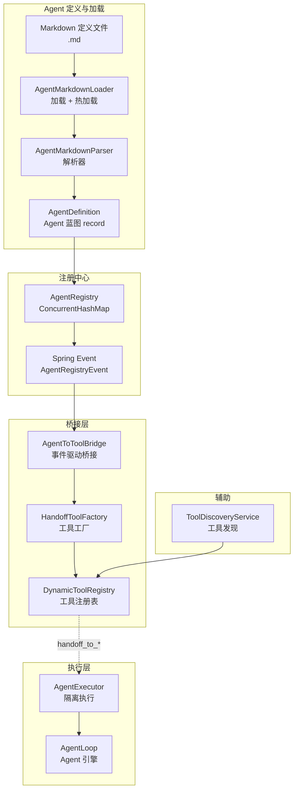
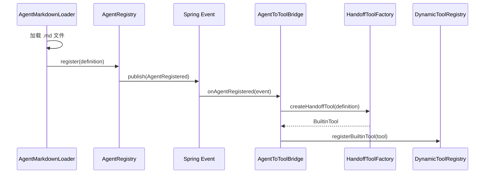
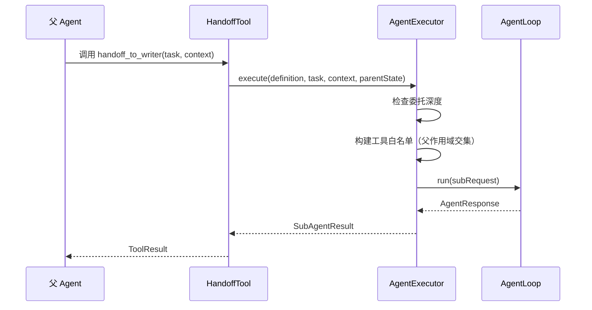

# 多 Agent 协作 — 架构设计

> **文档性质**：架构设计文档
> **模块归属**：`com.lifepilot.multiagent`
> **最后更新**：2026-03

## 1. 模块概述

多 Agent 协作模块实现了基于 HandoffTool 委托模式的多 Agent 协作能力。主 Agent 通过调用 `handoff_to_{agentId}` 工具将子任务委托给专家 Agent，每个子 Agent 拥有独立的 System Prompt、工具白名单、预算约束和可选的差异化模型。Agent 定义支持 Markdown 文件声明式配置和热加载，通过 Spring Event 机制实现 Agent 注册与 HandoffTool 的自动桥接。

## 2. 架构图

## 3. 核心组件

### 3.1 AgentDefinition — Agent 蓝图

`@Builder(toBuilder = true)` 的 record，包含 Agent 完整配置：`id`、`name`、`systemPrompt`、`allowedTools`（工具白名单）、`canDelegate`（是否允许再委托）、`budget`（独立预算）、`preferredProvider`（差异化模型）、`source`（来源类型）、`metadata`。紧凑构造器执行防御性拷贝和非空校验。

### 3.2 AgentSource — 来源密封接口

`sealed interface`，三个 permit：
- `Builtin`：内置预设（JAR classpath 资源）
- `MarkdownDefined`：用户 Markdown 定义（文件系统 `.md` 文件，含 filePath 和 lastModified）
- `Marketplace`：市场安装来源（packageId + version）

### 3.3 AgentBudget — 独立预算

record，包含 `maxTokens`、`maxSteps`、`timeoutSeconds` 三个维度。提供三个预设常量：`DEFAULT`（16000/15/180s）、`LIGHTWEIGHT`（4000/8/60s）、`HEAVYWEIGHT`（32000/25/300s）。`toAgentBudget()` 方法转换为 AgentLoop 使用的 `Budget` record。

### 3.4 AgentRegistry — 注册中心

基于 `ConcurrentHashMap` 的运行时注册表，支持注册、强制注册、注销、按 ID 查找、列出全部、按来源类型批量注销。注册/注销时通过 `ApplicationEventPublisher` 发布 `AgentRegistryEvent`。注册规则：Builtin 不允许被 Builtin 覆盖，MarkdownDefined 可覆盖 Builtin。

### 3.5 AgentMarkdownLoader — 加载器

从配置目录加载 `.md` 文件，通过 `AgentMarkdownParser` 解析为 `AgentDefinition` 并注册到 `AgentRegistry`。支持热加载：`ScheduledExecutorService` 定期扫描目录，检测新增/修改/删除文件，自动同步注册表。使用 `ConcurrentHashMap` 缓存文件 lastModified 实现变更检测。

### 3.6 AgentToToolBridge — 事件驱动桥接

监听 `AgentRegistryEvent.AgentRegistered` 和 `AgentRegistryEvent.AgentUnregistered` 事件，自动创建/注销对应的 HandoffTool。通过 `@EventListener` 实现 Agent 注册表与工具注册表的解耦同步。

### 3.7 HandoffToolFactory — 工具工厂

为每个 `AgentDefinition` 创建 `BuiltinTool` 实例，工具 ID 格式 `handoff_to_{agentId}`。输入 Schema 包含 `task`（必填）和 `context`（选填）。executor lambda 内部委托 `AgentExecutor.execute()` 执行子 Agent 任务。

### 3.8 AgentExecutor — 隔离执行器

执行子 Agent 委托任务的核心组件。流程：检查委托深度 → 创建独立 Budget → 构建工具白名单（父作用域交集约束 + 自递归防护 + infrastructure 工具保留）→ 调用 `AgentLoop.run()` → 转换为 `SubAgentResult`。所有异常均被捕获，返回 `success=false` 的结果。

### 3.9 ToolDiscoveryService — 工具发现

列出所有可用工具（排除 HandoffTool），按来源类型分类（builtin / skill / mcp）。使用 `switch` 表达式对 `ToolContract` sealed interface 穷举匹配。

## 4. 核心流程

### 4.1 Agent 注册与 HandoffTool 桥接

### 4.2 HandoffTool 委托执行

## 5. 设计决策

| 决策 | 选择 | 理由 |
|------|------|------|
| 委托模式 | HandoffTool 工具模式 | Agent 通过工具调用委托，复用现有工具系统，无需新增通信协议 |
| Agent 定义格式 | Markdown 文件 | 人类可读、易编辑，与 Skill YAML 互补 |
| 注册-桥接解耦 | Spring Event 事件驱动 | AgentRegistry 不直接依赖 DynamicToolRegistry，通过事件桥接 |
| 委托深度限制 | 可配置 maxDelegationDepth | 防止无限递归委托，默认 2 层 |
| 工具白名单交集 | 子 Agent ∩ 父 Agent 作用域 | 防止通过委托实现权限提升 |
| 自递归防护 | 排除 handoff_to_self | 独立于 canDelegate 标志，始终排除指向自身的 handoff 工具 |

## 6. 集成点

| 集成模块 | 方向 | 说明 |
|---------|------|------|
| Agent 引擎（`agent`） | multiagent → agent | `AgentExecutor` 调用 `AgentLoop.run()` 执行子 Agent |
| 工具系统（`tool`） | multiagent ↔ tool | HandoffTool 注册到 `DynamicToolRegistry`，`ToolDiscoveryService` 查询工具 |
| A2A 协议（`a2a`） | multiagent ← a2a | A2A 远程 Agent 可注册为 AgentDefinition |
| 插件市场（`marketplace`） | multiagent ← marketplace | `AgentSource.Marketplace` 来源类型 |

## 7. 配置参考

| 配置键 | 默认值 | 说明 |
|--------|--------|------|
| `lifepilot.agent.multi-agent.enabled` | `true` | 多 Agent 协作总开关 |
| `lifepilot.agent.multi-agent.max-delegation-depth` | `2` | 最大委托深度 |
| `lifepilot.agent.multi-agent.agent-definitions-path` | `~/.zhiwei/agents/` | Agent Markdown 定义文件目录 |
| `lifepilot.agent.multi-agent.register-handoff-tools` | `true` | 是否自动注册 HandoffTool |
| `lifepilot.agent.multi-agent.hot-reload.enabled` | `true` | 热加载开关 |
| `lifepilot.agent.multi-agent.hot-reload.scan-interval-seconds` | `5` | 热加载扫描间隔（秒） |
| `lifepilot.agent.multi-agent.budget.default-max-tokens` | `16000` | 子 Agent 默认 Token 上限 |
| `lifepilot.agent.multi-agent.budget.default-max-steps` | `15` | 子 Agent 默认步骤上限 |
| `lifepilot.agent.multi-agent.budget.default-timeout-seconds` | `180` | 子 Agent 默认超时（秒） |
