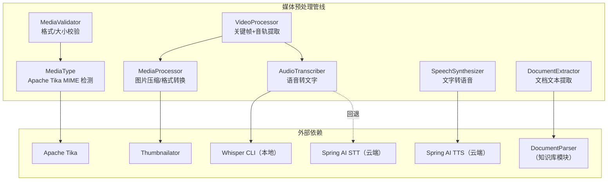
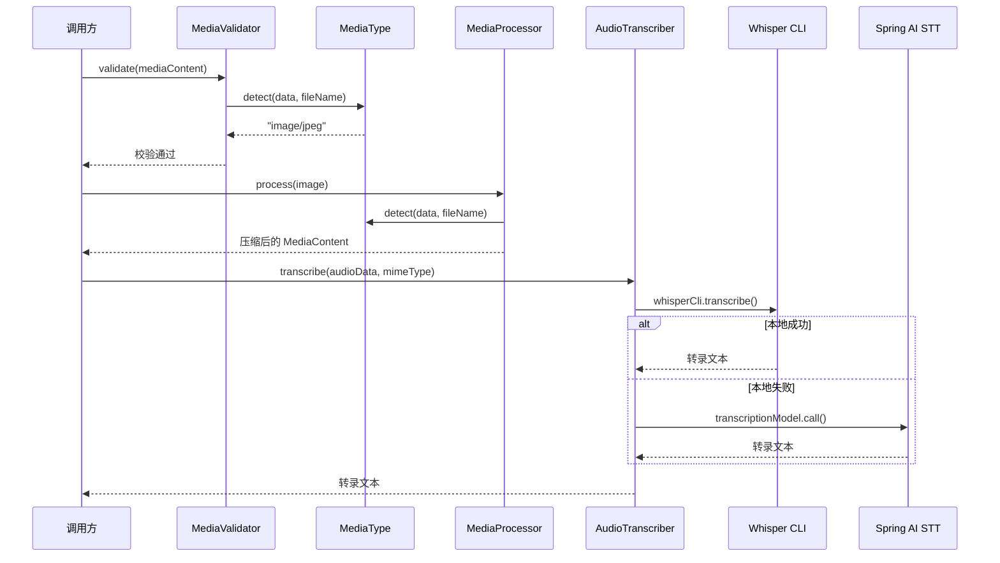

# 多模态能力 — 架构设计

> **文档性质**：架构设计文档
> **模块归属**：`com.lifepilot.media`
> **最后更新**：2026-03

## 1. 模块概述

多模态模块为知微（ZhiWei）提供图片、文档、音频、视频的预处理和转换能力。它不直接与 LLM 交互，而是作为媒体预处理管线，将各类媒体内容转换为 LLM 可消费的格式（压缩图片、提取文档文本、语音转文字、视频关键帧提取）。使用 Apache Tika 进行 MIME 类型检测，Thumbnailator 处理图片，Whisper CLI / Spring AI STT 处理音频。

## 2. 架构图

## 3. 核心组件

### 3.0 MultimodalRouter 与 Gemini 集成

- `MultimodalRouter`（`com.lifepilot.llm.multimodal`）负责将媒体内容路由到支持多模态的 LLM 提供商
- `GeminiFileApiClient` 集成 Gemini File API，支持大文件上传和处理
- `MediaContent` 是统一的媒体内容模型类，承载图片、文档、音频、视频等预处理后的数据

### 3.1 MediaType

- 职责：基于 Apache Tika 的 MIME 类型检测与分类
- 关键方法：`detect(byte[], fileName)` → MIME 字符串，`isImage()`/`isDocument()`/`isAudio()`/`isVideo()` 分类判断
- 检测策略：优先使用文件二进制魔数字节，文件名仅作辅助

### 3.2 MediaValidator

- 职责：媒体内容合法性校验（数据非空、文件大小、MIME 类型、数量限制）
- 校验维度：按媒体类别使用不同的大小限制和格式白名单
- 批量校验：`validateAll()` 额外检查单次请求图片数量上限

### 3.3 MediaProcessor

- 职责：图片预处理（尺寸压缩、质量压缩、格式转换）
- 处理逻辑：最长边超过 `maxDimension` 时等比缩放，JPEG 按配置质量压缩，BMP/WebP 转换为 PNG
- 优化：尺寸和大小均在限制内时跳过处理，直接返回原始数据

### 3.4 DocumentExtractor

- 职责：从文档中提取纯文本，复用知识库模块的 `DocumentParser`
- 支持格式：PDF、Word（.docx）、Excel（.xlsx）、PowerPoint（.pptx）、Markdown、纯文本（txt / log / csv / tsv）
- 实现：写入临时文件 → 委托 DocumentParser 解析 → 返回文本 → 清理临时文件

### 3.5 AudioTranscriber

- 职责：语音转文字，采用"本地优先"级联策略
- 级联顺序：本地 Whisper CLI → 云端 Spring AI TranscriptionModel → 全部不可用时抛异常
- 设计参考：借鉴 OpenClaw 音频处理架构的本地优先策略

### 3.6 SpeechSynthesizer

- 职责：文字转语音，基于 Spring AI `TextToSpeechModel`
- 支持模式：同步合成（`synthesize()`）和流式合成（`stream()`）
- 文本截断：超过 `maxTextLength` 时自动截断并追加省略提示

### 3.7 VideoProcessor

- 职责：视频预处理，拆分为关键帧序列和音轨转录文本
- 处理流程：校验大小/时长 → 提取关键帧（`KeyFrameExtractor`）→ 分离音轨（`AudioTrackExtractor`）→ 音轨转录
- 设计参考：借鉴 OmAgent 的视频分治策略

## 4. 核心流程

## 5. 设计决策

| 决策 | 选择 | 理由 |
|------|------|------|
| MIME 检测 | Apache Tika | 基于魔数字节检测，不依赖文件扩展名，准确可靠 |
| 图片处理 | Thumbnailator | Java 生态成熟的图片处理库，API 简洁 |
| 语音转文字 | 本地 Whisper CLI 优先 | 隐私保护、无网络延迟、无 Token 成本 |
| 文档解析 | 复用知识库 DocumentParser | 避免重复实现，PDF/Word 解析逻辑统一 |
| 视频处理 | 关键帧 + 音轨分治 | 视频直接送 LLM 不现实，拆分为图片序列和文本更实用 |

## 6. 集成点

| 依赖方向 | 模块 | 交互方式 |
|---------|------|---------|
| media → llm | `com.lifepilot.llm.multimodal` | 使用 `MediaContent` 数据模型 |
| media → knowledge | `com.lifepilot.knowledge.parser` | 复用 `DocumentParser` 提取文档文本 |
| media → Spring AI | STT/TTS 接口 | `TranscriptionModel`、`TextToSpeechModel` |
| agent → media | `com.lifepilot.agent` | Agent 工具调用时触发媒体预处理 |

## 7. 配置参考

| 配置键 | 默认值 | 说明 |
|--------|--------|------|
| `lifepilot.media.image.max-size-bytes` | `10485760`（10MB） | 图片最大文件大小 |
| `lifepilot.media.image.max-dimension` | `2048` | 图片最长边最大像素 |
| `lifepilot.media.image.jpeg-quality` | `0.85` | JPEG 压缩质量 |
| `lifepilot.media.image.max-per-request` | `5` | 单次请求最大图片数 |
| `lifepilot.media.document.max-size-bytes` | `52428800`（50MB） | 文档最大文件大小 |
| `lifepilot.media.audio.max-size-bytes` | `26214400`（25MB） | 音频最大文件大小 |
| `lifepilot.media.audio.max-duration-seconds` | `300` | 音频最大时长（秒） |
| `lifepilot.media.audio.whisper-model` | `base` | Whisper 模型名称 |
| `lifepilot.media.video.max-size-bytes` | `524288000`（500MB） | 视频最大文件大小 |
| `lifepilot.media.video.max-duration-seconds` | `1800` | 视频最大时长（秒） |
| `lifepilot.media.video.max-key-frames` | `120` | 最大关键帧数量 |
| `lifepilot.media.tts.voice` | `alloy` | TTS 语音风格 |
| `lifepilot.media.tts.speed` | `1.0` | TTS 语速倍率 |
| `lifepilot.media.tts.max-text-length` | `4096` | TTS 最大文本长度 |
