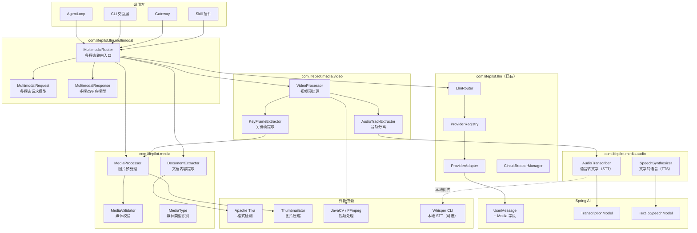
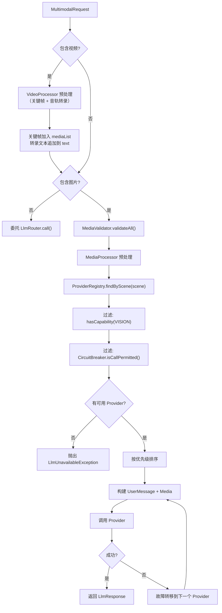

> 本文档为模块 14（多模态能力）的架构设计文档。
> 基于 ROADMAP.md §3.4 初步方案深化，结合 Spring AI 多模态/音频 API、业界前沿实践和开源项目分析设计。

# 多模态能力架构设计

## 1. 设计目标

### 1.1 核心命题

LifePilot 当前仅支持纯文本交互，`LlmRouter` 的所有调用方法（`call`、`callEntity`、`stream`）均以 `String prompt` 为输入。多模态能力的目标是：**在不破坏现有文本调用链路的前提下，扩展 LLM 路由层以支持图片理解、视频理解、文档内容提取、语音转文字（STT）和文字转语音（TTS），使 Agent 能够处理用户发送的图片、视频、文档和语音消息，并以语音形式回复。**

### 1.2 场景定义

| 场景 | 输入 | 输出 | 典型用例 |
|------|------|------|---------|
| 图片理解 | 文本 + 图片 | 文本描述/结构化数据 | 截图分析、照片识别、图表解读 |
| 视频理解 | 文本 + 视频 | 文本描述/结构化数据 | 视频摘要、教程分析、会议回放理解 |
| 文档解析 | 文档文件（PDF/Word/Markdown/TXT） | 提取的纯文本 | 文档摘要、内容提取、格式转换 |
| 混合输入 | 文本 + 多张图片/视频 | 文本 | 多图对比、图文混合问答 |
| 语音输入 | 语音消息/音频文件 | 文本（转录后作为用户输入） | 语音指令、会议录音摘要 |
| 语音输出 | 文本（Agent 回复） | 音频流 | 语音播报、无障碍交互 |

### 1.3 业界参考

#### OpenClaw 多模态媒体处理架构

[OpenClaw](https://github.com/openclaw/openclaw)（186k+ Stars）的 `src/media/` 模块实现了完整的多模态媒体处理管线，其核心设计值得借鉴：

- **分层媒体节点（Media Nodes）**：将图片理解、音频转录、文档解析拆分为独立的处理节点（`src/nodes/audio`、`src/nodes/image`），每个节点有独立的 Provider 优先级列表和降级策略
- **音频转录级联降级**：OpenClaw 的音频处理采用"本地 CLI → 云端 Provider"的级联策略——优先检测本地 `whisper-cli`（whisper.cpp）或 `sherpa-onnx-offline`，不可用时回退到 OpenAI / Groq / Deepgram 等云端 STT Provider。这与 LifePilot 的"本地优先"原则高度一致
- **转录即消息体**：语音消息转录后，转录文本直接替换消息体（`Body`），后续处理流程与文本消息完全一致。这种"转录前置"设计避免了在 Agent 引擎中引入音频模态的复杂性

**借鉴要点**：LifePilot 采用类似的"转录前置"策略——语音消息在进入 `AgentLoop` 前由 `AudioTranscriber` 转为文本，Agent 引擎无需感知音频模态。TTS 则作为输出后处理，在 Agent 回复文本后可选地转为语音。

#### AstrBot ProviderType 能力枚举

[AstrBot](https://github.com/AstrBotDevs/AstrBot)（13k+ Stars）的 Provider 系统通过 `ProviderType` 枚举明确区分 Provider 的能力类型：`CHAT_COMPLETION`、`SPEECH_TO_TEXT`、`TEXT_TO_SPEECH`、`EMBEDDING`、`RERANK`。每个 Provider 声明自己支持的能力类型，路由层根据请求类型选择匹配的 Provider。

**借鉴要点**：LifePilot 的 `ProviderCapability` 枚举已有 `VISION`，本模块扩展新增 `TTS` 和 `STT` 能力值，使路由层能够根据请求类型（视觉/语音/文本）选择合适的 Provider。

#### OpenAI 图片 Token 计算模型

OpenAI 的视觉模型采用基于 Tile 的图片 Token 计算方式：图片先缩放到 2048×2048 以内，再按 512×512 的 Tile 切分，每个 Tile 消耗 170 Token，加上基础的 85 Token。公式为 `total = 85 + 170 × n`（n 为 Tile 数）。例如 1024×1536 的图片需要 6 个 Tile，消耗 85 + 170×6 = 1105 Token。

**借鉴要点**：LifePilot 的图片预处理策略（最大边长 2048、等比缩放）与 OpenAI 的 Tile 计算模型对齐——将图片控制在 2048 以内可以有效限制 Token 消耗。未来可在 `MediaProcessor` 中实现 Token 估算方法，为 `TokenBudget` 提供图片 Token 预估。

#### Spring AI 统一音频 API

Spring AI 2.0 提供了统一的 TTS/STT 接口抽象：
- **TTS**：`TextToSpeechModel` / `StreamingTextToSpeechModel` 接口，支持 OpenAI（`gpt-4o-mini-tts`）和 ElevenLabs 等 Provider，通过 Spring Boot 配置切换 Provider
- **STT**：`TranscriptionModel` 接口，支持 OpenAI Whisper（`whisper-1`、`gpt-4o-transcribe`）等模型

LifePilot 当前使用 Spring AI 1.1.2，该版本已有 `OpenAiAudioTranscriptionModel` 和 `OpenAiAudioSpeechModel`。本模块基于这些已有 API 构建音频处理能力，同时通过 `AudioTranscriber` / `SpeechSynthesizer` 抽象层隔离 Spring AI 版本变化。

#### LangChain 多模态 Agent 模式

[LangChain 多模态文档](https://python.langchain.com/docs/concepts/multimodality/)定义了多模态 Agent 的三种集成模式：
1. **原生多模态**：直接将图片/音频传给支持多模态的 LLM（如 GPT-4o、Gemini）
2. **预处理转换**：将非文本模态预处理为文本（如 OCR、STT），再传给纯文本 LLM
3. **工具调用**：Agent 通过工具调用专门的视觉/音频模型

LifePilot 采用混合策略：图片理解使用"原生多模态"模式（直接传给 VISION Provider），音频使用"预处理转换"模式（STT 转文本后进入 Agent），文档使用"预处理转换"模式（解析为纯文本）。

#### NVIDIA 多模态 RAG 音视频处理

[NVIDIA Enterprise RAG Blueprint](https://developer.nvidia.com/blog/an-easy-introduction-to-multimodal-retrieval-augmented-generation-for-video-and-audio/) 提出了音视频 RAG 的处理模式：音频通过 ASR 模型（如 Parakeet-CTC）转录为文本，视频通过关键帧提取 + 下采样获取代表性帧，再分别进行文本和视觉检索。

**借鉴要点**：视频理解的"关键帧提取"模式可作为 LifePilot 远期扩展方向——将视频拆分为关键帧图片 + 音轨转录文本，复用现有的图片理解和 STT 能力。本模块暂不实现视频理解，但架构预留扩展点。

#### OmAgent 视频理解分治框架

[OmAgent](https://arxiv.org/abs/2406.16620)（EMNLP 2024）提出了面向复杂视频理解的多模态 Agent 框架，核心思想是**任务分治（Divide-and-Conquer）**：将复杂的视频问答任务拆分为多个子任务，由专门的 Agent 分别处理视觉帧检索、音频转录、时间定位等子问题，最后汇总结果。OmAgent 集成了多模态 RAG，能高效存储和检索视频帧，处理 24 小时以上的长视频。

**借鉴要点**：LifePilot 的视频理解采用类似的分治策略——`VideoProcessor` 将视频拆分为关键帧序列 + 音轨，关键帧复用 `MediaProcessor` 的图片预处理管线，音轨复用 `AudioTranscriber` 的 STT 管线，最终将视觉描述和转录文本合并为结构化上下文传给 LLM。

#### Qwen2.5-VL 本地视频理解

[Qwen2.5-VL](https://github.com/QwenLM/Qwen2.5-VL) 是通义千问团队的视觉语言模型，支持 20 分钟以上的视频理解，已在 Ollama 上提供本地部署（`ollama pull qwen2.5vl`）。Qwen2.5-VL 采用动态分辨率处理，能自适应不同尺寸的视频帧，在 VideoMME、MVBench 等视频理解基准上达到 SOTA 水平。

**借鉴要点**：Qwen2.5-VL 的 Ollama 本地部署能力与 LifePilot 的"本地优先"原则完美契合。对于短视频（< 2 分钟），可直接将采样帧序列传给 Qwen2.5-VL 进行原生视频理解；对于长视频，仍采用关键帧提取 + STT 的分治策略。

#### AKeyS 智能关键帧搜索

[AKeyS（Agentic Keyframe Search）](https://arxiv.org/html/2503.16032)提出了一种 Agent 驱动的视频关键帧搜索方法，通过迭代推理动态选择最相关的视频帧，而非传统的均匀采样或固定间隔提取。在 EgoSchema 和 NExT-QA 数据集上，AKeyS 以最少的计算开销实现了最高的关键帧搜索效率。

**借鉴要点**：LifePilot 的 `VideoProcessor` 初期采用均匀采样策略（简单可靠），远期可引入类似 AKeyS 的智能关键帧选择——根据用户问题动态选择最相关的视频帧，减少传给 LLM 的帧数，降低 Token 消耗。

#### Gemini 原生视频理解

[Gemini 2.5](https://developers.googleblog.com/en/gemini-2-5-video-understanding/) 支持原生视频输入（最长 90 分钟），无需手动提取帧，模型内部自动处理视频的时序信息。Gemini 的视频理解在 ActivityNet、VideoMME 等基准上达到 SOTA。通过 File API 上传视频文件或直接传入 YouTube URL。

**借鉴要点**：Gemini 的原生视频理解代表了未来方向——模型直接消费视频流而非关键帧序列。LifePilot 当前通过关键帧提取 + STT 的方式实现视频理解（兼容更多 Provider），但架构预留了原生视频输入的扩展点（`VIDEO_UNDERSTANDING` 能力值），待 Spring AI 支持 Gemini 视频 API 后可无缝切换。

### 1.4 设计原则

| # | 原则 | 说明 |
|---|------|------|
| 1 | **渐进增强** | 多模态是对现有文本能力的增强，不改变现有调用方的行为 |
| 2 | **能力感知路由** | 多模态请求自动路由到支持对应能力（VISION/TTS/STT）的 Provider，不可用时明确告知而非静默降级 |
| 3 | **预处理前置** | 图片在发送给 LLM 前经过压缩、格式转换、大小校验，控制 Token 消耗和传输成本 |
| 4 | **转录前置** | 语音消息在进入 Agent 引擎前转为文本，Agent 无需感知音频模态 |
| 5 | **视频分治** | 视频拆分为关键帧序列 + 音轨转录，复用图片理解和 STT 管线，Agent 无需感知视频模态 |
| 6 | **格式无关** | 文档解析层屏蔽格式差异，上层统一获取纯文本内容 |
| 7 | **本地优先** | Ollama 支持视觉模型（LLaVA、Qwen2.5-VL），优先使用本地多模态模型；本地 Whisper CLI 优先于云端 STT |

---

## 2. 整体架构

### 2.1 架构概览

多模态能力分为四个子系统：视觉（图片/视频理解）、音频（STT/TTS）、文档（内容提取）、视频（关键帧提取 + 音轨分离）。



### 2.2 与现有 LLM Router 的关系

多模态路由不修改 `LlmRouter` 的现有方法签名，而是通过新增 `MultimodalRouter` 类提供多模态调用入口。`MultimodalRouter` 内部组合 `LlmRouter` 的 Provider 解析和熔断器能力，在此基础上增加：

1. **媒体预处理**：图片压缩、格式转换
2. **能力过滤**：仅选择支持 `VISION` 能力的 Provider
3. **Spring AI Media 封装**：将预处理后的媒体转为 `UserMessage` + `Media` 对象

音频处理（STT/TTS）独立于 `MultimodalRouter`，作为消息管线的前置/后置处理器：
- **STT（前置）**：语音消息 → `AudioTranscriber` → 文本消息 → `AgentLoop`
- **TTS（后置）**：Agent 文本回复 → `SpeechSynthesizer` → 音频流 → Channel 输出

### 2.3 ProviderAdapter 扩展

现有 `ProviderAdapter` sealed interface 需要新增多模态调用方法：

```java
public sealed interface ProviderAdapter permits SpringAiProviderAdapter {
    // 现有方法保持不变
    LlmResponse call(String prompt, @Nullable String outputSchema, Duration timeout);
    <T> T callEntity(String prompt, Class<T> responseType);
    float[] embed(String text);
    Flux<String> stream(String prompt);
    Optional<ChatClient> chatClient();
    boolean healthCheck();

    // 新增：多模态调用
    LlmResponse callWithMedia(String prompt, List<MediaContent> mediaContents, Duration timeout);
}
```

### 2.4 ProviderCapability 扩展

```java
public enum ProviderCapability {
    CHAT, EMBEDDING, STRUCTURED_OUTPUT, FUNCTION_CALLING, STREAMING,
    VISION,      // 已有 — 图片理解
    TTS,         // 新增 — 文字转语音
    STT,         // 新增 — 语音转文字
    // 远期扩展（当前 spec 不实现）：
    // RERANK,   // 重排序
}
```

---

## 3. 核心数据模型

### 3.1 MediaContent — 媒体内容载体

```java
/**
 * 媒体内容载体。
 * 封装图片、文档或音频的二进制数据及元信息。
 */
public record MediaContent(
    String id,           // UUID
    String mimeType,     // 如 image/png, audio/wav
    byte[] data,         // 二进制数据
    @Nullable String fileName,  // 原始文件名
    long sizeBytes,      // 数据大小（字节）
    Map<String, String> metadata  // 附加元数据（如图片宽高、音频时长）
) {}
```

### 3.2 MultimodalRequest — 多模态请求

```java
public record MultimodalRequest(
    String scene,
    String text,
    List<MediaContent> mediaList,
    @Nullable String outputSchema
) {}
```

### 3.3 MultimodalResponse

复用现有 `LlmResponse`，无需新增响应类型（当前 LLM 多模态输出仍为文本）。

---

## 4. 媒体处理层

### 4.1 MediaProcessor — 图片预处理器

**处理流程**：

```
原始图片 → 格式检测（Tika） → 格式校验 → 尺寸压缩 → 质量压缩 → 格式转换（统一为 PNG/JPEG） → MediaContent
```

**关键参数**（通过 `@ConfigurationProperties` 外部化）：

| 参数 | 默认值 | 说明 |
|------|--------|------|
| `max-image-size-bytes` | 10MB | 单张图片最大大小 |
| `max-image-dimension` | 2048 | 最大边长（像素），与 OpenAI Tile 计算模型对齐 |
| `jpeg-quality` | 0.85 | JPEG 压缩质量 |
| `max-images-per-request` | 5 | 单次请求最大图片数 |
| `supported-formats` | png,jpeg,gif,webp,bmp | 支持的图片格式 |

**技术选型**：
- 格式检测：Apache Tika（`tika-core`，轻量级，仅用 MIME 检测）
- 图片压缩/缩放：Thumbnailator（纯 Java，无 native 依赖）

### 4.2 DocumentExtractor — 文档内容提取器

复用知识库模块已有的 `DocumentParser` 实现（`PdfParser`、`WordParser`、`MarkdownParser`、`PlainTextParser`）。

### 4.3 MediaValidator — 媒体校验器

校验媒体内容的合法性：文件大小、MIME 类型、图片数量、数据完整性。

---

## 5. 音频处理层

### 5.1 AudioTranscriber — 语音转文字（STT）

借鉴 OpenClaw 的级联降级策略，`AudioTranscriber` 按以下优先级尝试转录：

1. **本地 Whisper CLI**（如果已安装）：零成本、完全隐私，适合日常使用
2. **Spring AI TranscriptionModel**（云端）：OpenAI `whisper-1` / `gpt-4o-transcribe`，精度更高

```java
/**
 * 语音转文字转录器。
 * 采用"本地优先"级联策略：优先使用本地 Whisper CLI，不可用时回退到云端 STT Provider。
 */
public class AudioTranscriber {
    /**
     * 将音频转录为文本。
     *
     * @param audioData 音频二进制数据
     * @param mimeType  音频 MIME 类型（如 audio/wav, audio/mp3）
     * @return 转录文本
     */
    public String transcribe(byte[] audioData, String mimeType);
}
```

**支持的音频格式**：WAV、MP3、OGG、M4A、FLAC、WebM（通过配置 `lifepilot.media.audio.supported-formats`）

**关键参数**：

| 参数 | 默认值 | 说明 |
|------|--------|------|
| `max-audio-size-bytes` | 25MB | 单个音频文件最大大小（OpenAI Whisper 限制） |
| `max-duration-seconds` | 300 | 最大音频时长（秒） |
| `whisper-cli-path` | auto | 本地 Whisper CLI 路径，auto 表示自动检测 PATH |
| `whisper-model` | base | 本地 Whisper 模型大小（tiny/base/small/medium/large） |
| `supported-formats` | wav,mp3,ogg,m4a,flac,webm | 支持的音频格式 |

### 5.2 SpeechSynthesizer — 文字转语音（TTS）

```java
/**
 * 文字转语音合成器。
 * 基于 Spring AI TextToSpeechModel 接口，支持同步和流式合成。
 */
public class SpeechSynthesizer {
    /** 同步合成：文本 → 完整音频 byte[]。 */
    public byte[] synthesize(String text);

    /** 流式合成：文本 → 音频流 Flux<byte[]>。 */
    public Flux<byte[]> stream(String text);
}
```

**关键参数**：

| 参数 | 默认值 | 说明 |
|------|--------|------|
| `voice` | alloy | TTS 语音风格 |
| `speed` | 1.0 | 语速倍率 |
| `output-format` | mp3 | 输出音频格式 |
| `max-text-length` | 4096 | 单次合成最大文本长度（字符） |

### 5.3 音频处理在消息管线中的位置

```
用户语音消息 → Channel 适配器 → AudioTranscriber（STT）→ 文本消息 → AgentLoop → 文本回复
                                                                                    ↓
用户 ← Channel 适配器 ← 音频流 ← SpeechSynthesizer（TTS，可选）← 文本回复
```

音频处理不在 `MultimodalRouter` 内部，而是作为消息管线的前置/后置处理器。这样设计的原因：
- STT 的输出是文本，与 Agent 引擎的输入格式一致，无需修改 `AgentLoop`
- TTS 是可选的输出增强，不影响 Agent 的核心逻辑
- 与 OpenClaw 的"转录即消息体"模式一致

---

## 6. 视频处理层

### 6.1 VideoProcessor — 视频预处理器

视频理解采用"分治"策略（借鉴 OmAgent）：将视频拆分为关键帧序列 + 音轨，分别复用图片理解和 STT 管线处理，最终合并为结构化上下文。

```java
/**
 * 视频预处理器。
 * 将视频拆分为关键帧序列和音轨，分别交给图片处理和音频转录管线。
 */
public class VideoProcessor {
    /**
     * 处理视频，提取关键帧和音轨转录文本。
     *
     * @param videoData 视频二进制数据
     * @param mimeType  视频 MIME 类型
     * @return 视频处理结果（关键帧列表 + 音轨转录文本）
     */
    public VideoProcessResult process(byte[] videoData, String mimeType);
}
```

**处理流程**：

```
视频文件 → 写入临时文件 → FFmpeg 提取关键帧（均匀采样）
                        → FFmpeg 分离音轨
                        ↓                    ↓
              关键帧图片列表          音频 byte[]
                        ↓                    ↓
              MediaProcessor 预处理   AudioTranscriber 转录
                        ↓                    ↓
              List<MediaContent>      String transcript
                        ↓
              VideoProcessResult(keyFrames, transcript)
```

### 6.2 VideoProcessResult — 视频处理结果

```java
/**
 * 视频处理结果。
 *
 * @param keyFrames  关键帧列表（已预处理的 MediaContent）
 * @param transcript 音轨转录文本（可能为空，如静音视频）
 * @param durationSeconds 视频时长（秒）
 * @param frameCount 提取的关键帧数量
 */
public record VideoProcessResult(
    List<MediaContent> keyFrames,
    @Nullable String transcript,
    int durationSeconds,
    int frameCount
) {}
```

### 6.3 关键帧提取策略

初期采用**均匀采样**策略（简单可靠）：

| 视频时长 | 采样间隔 | 最大帧数 | 说明 |
|---------|---------|---------|------|
| ≤ 30 秒 | 每 2 秒 1 帧 | 15 | 短视频，高密度采样 |
| 30 秒 ~ 5 分钟 | 每 5 秒 1 帧 | 60 | 中等视频 |
| 5 ~ 30 分钟 | 每 15 秒 1 帧 | 120 | 长视频，稀疏采样 |
| > 30 分钟 | 每 30 秒 1 帧 | 120 | 超长视频，最大帧数限制 |

**关键参数**（通过 `@ConfigurationProperties` 外部化）：

| 参数 | 默认值 | 说明 |
|------|--------|------|
| `max-video-size-bytes` | 500MB | 单个视频文件最大大小 |
| `max-duration-seconds` | 1800 | 最大视频时长（30 分钟） |
| `max-key-frames` | 120 | 最大关键帧数量 |
| `supported-formats` | mp4,avi,mov,mkv,webm,flv | 支持的视频格式 |

### 6.4 技术选型

- **视频解码/帧提取/音轨分离**：JavaCV（FFmpeg 的 Java 绑定），通过 `FFmpegFrameGrabber` 提取帧，`FFmpegFrameRecorder` 分离音轨
- JavaCV 已内嵌各平台 FFmpeg native library（Windows / macOS / Linux），无需用户安装 FFmpeg
- 帧图片经 `MediaProcessor` 预处理后作为 `MediaContent` 传给 `MultimodalRouter`

### 6.5 视频理解在 MultimodalRouter 中的集成

当 `MultimodalRequest` 包含视频附件时，`MultimodalRouter` 的处理流程：

1. `VideoProcessor.process(videoData, mimeType)` → 获取关键帧 + 转录文本
2. 将关键帧作为图片附件加入请求的 `mediaList`
3. 将转录文本追加到请求的 `text` 提示词中（作为上下文）
4. 后续流程与图片理解一致（VISION 能力过滤 → 故障转移 → callWithMedia）

---

## 7. 多模态路由策略

### 7.1 路由决策流程



---

## 8. Spring AI 集成

### 8.1 UserMessage + Media 构建

Spring AI 1.1.2 通过 `UserMessage` 的 `media` 字段支持多模态输入：

```java
var media = new Media(MimeTypeUtils.IMAGE_PNG, new ByteArrayResource(imageBytes));
var userMessage = UserMessage.builder()
    .text(prompt)
    .media(media)
    .build();
ChatResponse response = chatModel.call(new Prompt(userMessage));
```

### 8.2 支持的多模态 Provider

| Provider | 视觉模型 | 视频理解 | STT | TTS | Spring AI 支持 |
|----------|---------|---------|-----|-----|---------------|
| Ollama | llava, qwen2.5vl, minicpm-v | qwen2.5vl（短视频） | ❌ | ❌ | ✅ spring-ai-ollama |
| OpenAI | gpt-4o, gpt-4o-mini | ❌（需关键帧提取） | whisper-1, gpt-4o-transcribe | gpt-4o-mini-tts | ✅ spring-ai-openai |
| Qwen（通义千问） | qwen-vl-plus, qwen-vl-max | qwen-vl-max（原生） | ❌ | ❌ | ✅ spring-ai-openai（兼容模式） |
| GLM（智谱） | glm-4v | ❌ | ❌ | ❌ | ✅ spring-ai-openai（兼容模式） |
| 本地 Whisper CLI | ❌ | ❌ | ✅ whisper.cpp | ❌ | N/A（进程调用） |

---

## 9. 包结构

```
com.lifepilot.llm.multimodal/
├── MultimodalRouter.java          // 多模态路由入口
├── MultimodalRequest.java         // 多模态请求 record
└── MediaContent.java              // 媒体内容载体 record

com.lifepilot.media/
├── MediaProcessor.java            // 图片预处理器
├── MediaValidator.java            // 媒体校验器
├── MediaValidationException.java  // 校验异常
├── MediaType.java                 // 媒体类型识别（基于 Tika）
├── DocumentExtractor.java         // 文档内容提取器
├── DocumentExtractionException.java // 文档提取异常
├── audio/
│   ├── AudioTranscriber.java      // 语音转文字（STT）
│   ├── SpeechSynthesizer.java     // 文字转语音（TTS）
│   ├── WhisperCliTranscriber.java // 本地 Whisper CLI 适配
│   └── AudioTranscriptionException.java // 转录异常
├── video/
│   ├── VideoProcessor.java        // 视频预处理器
│   ├── VideoProcessResult.java    // 视频处理结果 record
│   ├── KeyFrameExtractor.java     // 关键帧提取（基于 JavaCV）
│   ├── AudioTrackExtractor.java   // 音轨分离（基于 JavaCV）
│   └── VideoProcessException.java // 视频处理异常
└── config/
    ├── MediaProperties.java       // @ConfigurationProperties("lifepilot.media")
    └── MediaAutoConfiguration.java // 自动配置
```

---

## 10. 配置

```yaml
lifepilot:
  media:
    image:
      max-size-bytes: 10485760        # 10MB
      max-dimension: 2048             # 最大边长像素，与 OpenAI Tile 模型对齐
      jpeg-quality: 0.85
      max-per-request: 5
      supported-formats: png,jpeg,gif,webp,bmp
    document:
      max-size-bytes: 52428800        # 50MB
      supported-formats: pdf,docx,doc,md,txt
    audio:
      max-size-bytes: 26214400        # 25MB（OpenAI Whisper 限制）
      max-duration-seconds: 300       # 5 分钟
      supported-formats: wav,mp3,ogg,m4a,flac,webm
      whisper-cli-path: auto          # auto = 自动检测 PATH
      whisper-model: base             # tiny/base/small/medium/large
    video:
      max-size-bytes: 524288000       # 500MB
      max-duration-seconds: 1800      # 30 分钟
      max-key-frames: 120             # 最大关键帧数量
      supported-formats: mp4,avi,mov,mkv,webm,flv
    tts:
      voice: alloy
      speed: 1.0
      output-format: mp3
      max-text-length: 4096
```

---

## 11. 依赖

### 11.1 新增 Maven 依赖

| 依赖 | 用途 | 备注 |
|------|------|------|
| `org.apache.tika:tika-core` | MIME 类型检测 | 轻量级核心模块 |
| `net.coobird:thumbnailator` | 图片压缩/缩放 | 纯 Java，无 native 依赖 |
| `org.bytedeco:javacv-platform` | 视频帧提取/音轨分离 | 内嵌 FFmpeg native library，无需用户安装 |

### 11.2 已有依赖复用

- `spring-ai-ollama`：Ollama 多模态支持
- `spring-ai-openai`：OpenAI 多模态 + STT + TTS 支持
- 知识库模块的文档解析器（`PdfParser`、`WordParser` 等）

### 11.3 可选外部依赖

- **whisper.cpp / whisper CLI**：本地 STT，用户自行安装，LifePilot 自动检测

---

## 12. 远期扩展（本模块不实现）

以下能力在模块依赖图中属于远期规划，本模块预留架构扩展点但不实现：

- **图片生成**（Image Generation）
- **Rerank 重排序能力**
- **实时语音对话**（Realtime Voice）：需要 WebSocket 双向流，复杂度较高
- **原生视频输入**：当前通过关键帧提取 + STT 实现视频理解，待 Spring AI 支持 Gemini 视频 API 后可切换为原生视频输入模式
- **智能关键帧选择**：当前采用均匀采样，远期可引入类似 AKeyS 的 Agent 驱动关键帧搜索，根据用户问题动态选择最相关帧
