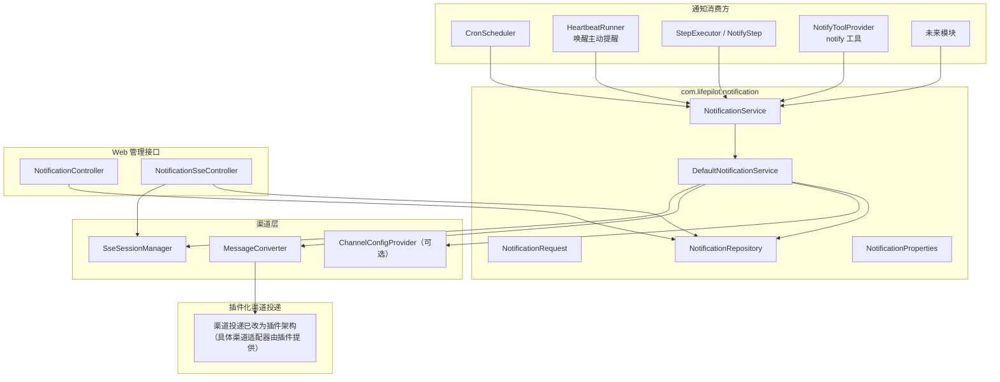
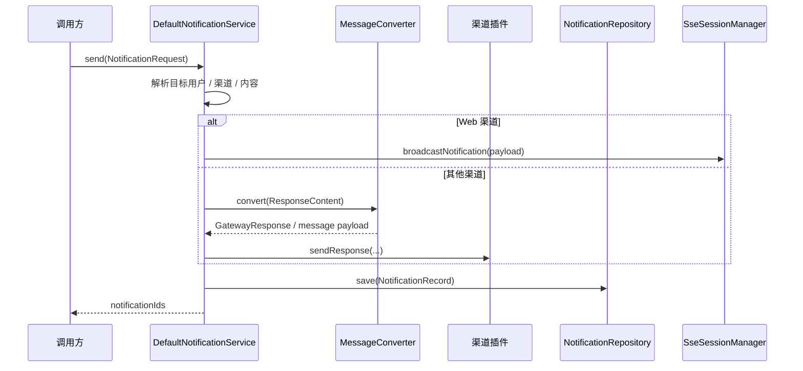

# 通知系统 — 架构设计

> **文档性质**：架构设计文档
> **模块归属**：`com.lifepilot.notification`
> **最后更新**：2026-04

## 1. 模块概述

通知系统是知微的统一结果投递基础设施。任意模块只要拿到 `NotificationService`，就可以把需要用户看到的结果发送到 Web、企微、飞书或钉钉等渠道，并写入通知历史。

当前设计已经收敛为简单模型：
- 没有通知等级
- 没有被动队列
- 没有通知设置
- 有结果直接投递

对自主任务而言，“无结果静默”不在通知模块内部实现，而由上游协议保证：
- cron 无结果时返回 `TASK_SILENT`
- 主动提醒内部评估无结果时保持静默

## 2. 架构图

## 3. 核心组件

### 3.1 NotificationService

统一通知接口，定义 `send(NotificationRequest)`。调用方不需要知道底层渠道实现，只负责提供目标用户、内容和可选路由信息。

### 3.2 DefaultNotificationService

通知模块的核心实现，职责包括：
1. 解析请求中的目标用户、内容和渠道
2. 将 `ResponseContent` 转换成各渠道可发送格式
3. 调用渠道插件发送（渠道投递已改为插件架构，具体渠道适配器由插件提供）
4. 针对 Web 渠道广播 SSE 通知事件
5. 将 `SENT / FAILED` 结果持久化到 `notification_history`

设计原则：
- 默认直接发送
- 单渠道失败不中断其他渠道
- 历史记录与实时推送共用同一次发送结果

### 3.3 NotificationRequest

当前请求模型字段如下：
- `targetUserId`
- `content`
- `channel`：可选，指定时走定向投递
- `typeId`：可选，标记通知业务类型
- `metadata`：扩展元数据

`urgency` 已被移除。

### 3.4 NotificationRepository

当前只管理 `notification_history` 一张表，提供：
- `save`
- `findById`
- `findByUserId`
- `countByUserId`
- `countUnreadByUserId`
- `markAsRead`
- `markAllAsRead`

通知设置表和被动队列表已删除。

### 3.5 NotificationController

提供通知历史查询与已读管理 REST API：
- `GET /api/notifications`
- `PUT /api/notifications/{id}/read`
- `PUT /api/notifications/read-all`

### 3.6 NotificationSseController

提供通知专用 SSE 流：
- `GET /api/notifications/stream`

连接建立时先推送未读数快照，后续由 `SseSessionManager.broadcastNotification(...)` 广播实时通知。

### 3.7 NotificationAutoConfiguration

自动配置类负责注册：
- `NotificationProperties`
- `NotificationRepository`
- `NotificationService`

调度器、被动队列和通知设置相关 Bean 不再存在。

## 4. 发送流程

## 5. 数据模型

### 5.1 notification_history

| 列 | 类型 | 说明 |
|----|------|------|
| id | TEXT PK | 通知记录 ID |
| user_id | TEXT NOT NULL | 目标用户 |
| type_id | TEXT | 业务类型标识 |
| content_json | TEXT NOT NULL | `ResponseContent` 序列化结果 |
| channel | TEXT NOT NULL | 实际发送渠道 |
| read_status | TEXT NOT NULL | `UNREAD / READ` |
| status | TEXT NOT NULL | `SENT / FAILED` |
| metadata_json | TEXT | 扩展元数据 |
| sent_at | TEXT NOT NULL | 发送时间 |
| created_at | TEXT NOT NULL | 创建时间 |
| updated_at | TEXT NOT NULL | 更新时间 |

### 5.2 迁移策略

`V2__simplify_notifications.sql` 完成了通知模型收敛：
- 删除 `urgency` 列
- 删除 `notification_settings`
- 删除 `passive_notification_queue`
- 保留并重建 `notification_history`

## 6. 与其他模块的集成

| 方向 | 模块 | 交互方式 |
|------|------|---------|
| 被依赖 | `agent.task` | cron / 主动提醒通过 `NotificationService` 发送结果 |
| 被依赖 | `workflow` | `NotifyStep` 通过 `NotificationService` 投递通知 |
| 被依赖 | `meta` | 独立的 `notify` 工具（`NotifyToolProvider` → `NotifyToolExecutor`）直接调用通知服务 |
| 依赖 | `interaction.channel` | 通过插件架构向外部渠道发送（具体渠道适配器由插件提供） |
| 依赖 | `interaction.web.sse` | 通过 `SseSessionManager` 实时广播 Web 通知 |
| 依赖 | SQLite | 持久化通知历史 |

## 7. 配置参考

| 配置键 | 默认值 | 说明 |
|--------|--------|------|
| `lifepilot.notification.enabled` | `true` | 是否启用通知系统 |
| `lifepilot.notification.history-page-size` | `20` | 通知历史默认分页大小 |
| `lifepilot.notification.max-history-page-size` | `100` | 通知历史最大分页大小 |
| `lifepilot.notification.default-user-id` | `default` | 内部通知默认目标用户 |

## 8. 设计决策

| 决策 | 选择 | 理由 |
|------|------|------|
| 通知模型 | 直接投递 | 个人助手场景下，“有结果就通知”比多级通知更清晰 |
| 无结果处理 | 上游静默协议 | 让 cron / 主动提醒自己决定是否需要打扰用户 |
| 路由策略 | 默认广播，可选定向渠道 | 既保留多渠道能力，也允许 notify 工具回到当前会话 |
| 历史存储 | 仅保留 `notification_history` | 删除无效复杂度，保留用户可见的结果记录 |
| Web 推送 | SSE 广播 | 与现有 Web 前端通知中心直接对接，成本最低 |
