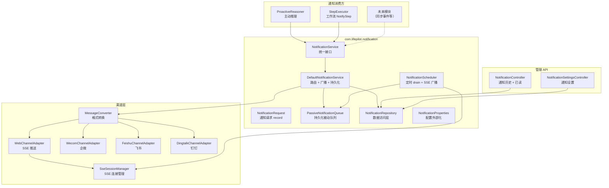

# 通知系统 — 架构设计

> **文档性质**：架构设计文档
> **模块归属**：`com.lifepilot.notification`
> **最后更新**：2026-03

## 1. 模块概述

通知系统是知微的统一通知基础设施，从主动推理模块（`agent.proactive`）解耦为独立的 `com.lifepilot.notification` 包。任意模块（主动推理、工作流引擎、未来扩展）均可通过 `NotificationService` 接口发送通知，无需依赖特定业务模块。

核心能力：
- **统一接口**：`NotificationService.send(NotificationRequest)` 提供标准化通知发送入口
- **Urgency 路由**：HIGH/MEDIUM 实时推送到所有渠道，LOW 入队被动通知队列
- **多渠道广播**：遍历所有已注册 `ChannelAdapter`（Web SSE / 企微 / 飞书 / 钉钉），单渠道失败不中断
- **富媒体支持**：TextContent / MarkdownContent / CardContent / ImageContent 四种内容格式，各渠道自动适配渲染
- **被动队列持久化**：LOW 紧急度通知持久化到 SQLite，系统重启不丢失
- **用户设置过滤**：按用户偏好过滤通知类型、渠道和紧急度阈值
- **通知管理 API**：历史查询、已读标记、设置管理

## 2. 架构图



## 3. 核心组件

### 3.1 NotificationService 接口

统一通知服务接口，定义 `send(NotificationRequest)` 方法，返回通知 ID 列表（每个成功渠道一条记录）。所有通知消费方（ProactiveReasoner、StepExecutor 等）通过此接口发送通知，与具体渠道实现解耦。

### 3.2 DefaultNotificationService 实现

核心路由逻辑：
1. 检查用户通知设置（`notification_settings` 表），过滤类型启用状态、渠道和紧急度阈值
2. HIGH/MEDIUM 紧急度：遍历用户启用的 `ChannelAdapter`，使用对应 `MessageConverter` 转换 `ResponseContent` 为渠道格式后发送
3. LOW 紧急度：入队 `PassiveNotificationQueue`，由 `NotificationScheduler` 定时 drain
4. 每个成功渠道生成独立 `notification_history` 记录，channel 字段为该渠道的 `ChannelType` 值
5. 单渠道发送失败记录 WARN 日志，不中断其他渠道
6. 未配置用户设置时使用系统默认（所有类型启用、所有渠道、最低 LOW）

### 3.3 NotificationRequest record

通知请求数据载体，包含：
- `targetUserId` — 目标用户标识
- `content` — `ResponseContent` 类型（TextContent / MarkdownContent / CardContent / ImageContent）
- `urgency` — 紧急程度（HIGH / MEDIUM / LOW）
- `channel` — 指定渠道（可选，null 表示广播）
- `typeId` — 通知类型标识（可选）
- `metadata` — 扩展元数据 Map（不可变）

### 3.4 PassiveNotificationQueue（持久化被动队列）

从 `agent.proactive.channel` 迁移到 `com.lifepilot.notification`，增加 SQLite 持久化：
- `enqueue()`：同时写入 `passive_notification_queue` 表和内存 `ConcurrentLinkedQueue`
- `drainAll()`：从内存队列取出，更新数据库 `delivered=true`
- 启动时从数据库加载 `delivered=false` 的记录到内存队列，确保重启不丢失
- 数据库写入失败时记录 WARN 日志但不阻塞入队操作（降级为纯内存）

### 3.5 NotificationScheduler（定时 drain 调度器）

- 使用 `@Scheduled` 按 `lifepilot.notification.passive-drain-interval` 配置间隔（默认 30s）定时执行
- 调用 `PassiveNotificationQueue.drainAll()` 获取待推送通知
- 通过 `SseSessionManager.broadcastNotification()` 广播给对应用户的 SSE 连接
- 异常时记录 WARN 日志，不中断定时任务

### 3.6 NotificationRepository（数据访问层）

统一管理三张通知相关表的数据访问：
- `notification_history` — 通知历史记录（CRUD + 分页查询 + urgency 过滤 + 已读标记）
- `passive_notification_queue` — 被动队列（入队 + drain + 启动加载）
- `notification_settings` — 用户通知设置（查询 + UPSERT）

### 3.7 Urgency 枚举

从 `agent.proactive.model` 迁移到 `com.lifepilot.notification`，包含三个值：
- `HIGH` — 高紧急度，实时推送到所有渠道
- `MEDIUM` — 中紧急度，实时推送到所有渠道
- `LOW` — 低紧急度，入队被动通知队列

### 3.8 NotificationAutoConfiguration

Spring Boot 自动配置类，通过 `lifepilot.notification.enabled` 控制启用。注册以下 Bean：
- `NotificationProperties` — 配置外部化
- `NotificationRepository` — 数据访问层
- `PassiveNotificationQueue` — 持久化被动队列
- `DefaultNotificationService` — 通知服务实现
- `NotificationScheduler` — 定时 drain 调度器


## 4. 渠道渲染规则

### 4.1 MessageConverter 内容格式映射

| 内容类型 | 企微 (Wecom) | 飞书 (Feishu) | Web (SSE) |
|---------|-------------|--------------|-----------|
| TextContent | `sendText` 纯文本 | `sendText` 纯文本 | SSE 纯文本事件 |
| MarkdownContent | `sendMarkdown` 企微 Markdown | `sendPost` 富文本（链接语法转 `{tag:"a"}` 标签） | SSE Markdown 原文 |
| CardContent | Markdown 格式（标题加粗 + 正文 + `[label](url)` 链接） | `sendInteractiveCard` 交互式卡片（button 元素 + multi_url） | SSE 结构化 JSON `{title, body, actions}` |
| ImageContent | `sendNews` 图文消息（picurl） | `sendImage` 图片消息 | SSE JSON `{imageUrl, altText, caption}` |
| StreamingContent | 降级为 `toPlainText()` | 降级为 `toPlainText()` | 降级为 `toPlainText()` |

### 4.2 降级规则

当渠道不支持当前格式时，`MessageConverter` 自动降级：
- `ImageContent` → 包含图片链接的 `TextContent`
- `CardContent` 按钮在纯文本渠道 → `[label](url)` 链接格式

### 4.3 ResponseContent.ImageContent

新增的 `ResponseContent` sealed interface permit，包含：
- `imageUrl` — 图片 URL
- `altText` — 替代文本
- `caption` — 可选图片说明

`toPlainText()` 返回 `[图片: altText] caption` 格式。

## 5. 工作流 NotifyStep 集成

`WorkflowStep` sealed interface 新增 `NotifyStep` record，支持在工作流任意节点发送通知：

```java
record NotifyStep(
    String id,
    String name,
    String targetUserId,    // 支持 ${} 表达式
    String content,         // 支持 ${} 表达式
    String contentType,     // TEXT / MARKDOWN / CARD
    Urgency urgency,
    List<String> dependsOn,
    @Nullable ErrorStrategy errorStrategy
) implements WorkflowStep {}
```

`StepExecutor` 新增 `executeNotify` 分支：
1. 解析 `targetUserId` 和 `content` 中的 `${}` 表达式
2. 根据 `contentType` 构造对应的 `ResponseContent` 子类型
3. 调用 `NotificationService.send()`
4. 将发送结果写入步骤输出上下文

## 6. 旧组件清理

本次重构彻底清理了 `com.lifepilot.agent.proactive` 包中的旧通知组件：

| 已删除类 | 原包路径 | 替代方案 |
|---------|---------|---------|
| `NotificationChannel` | `agent.proactive.channel` | `NotificationService` 直接遍历 `ChannelAdapter` |
| `LogNotificationChannel` | `agent.proactive.channel` | `DefaultNotificationService` 内部日志已覆盖 |
| `GatewayNotificationChannel` | `agent.proactive.channel` | `DefaultNotificationService` 直接遍历 `ChannelAdapter` |
| `NotificationDispatcher` | `agent.proactive` | `ProactiveReasoner` 直接注入 `NotificationService` |
| `PassiveNotificationQueue`（旧版） | `agent.proactive.channel` | `com.lifepilot.notification.PassiveNotificationQueue`（持久化版） |
| `Urgency`（旧位置） | `agent.proactive.model` | `com.lifepilot.notification.Urgency` |

`ProactiveReasoner` 重构为注入 `NotificationService`，通过 `NotificationRequest` 发送通知，不再依赖 `NotificationDispatcher`。

`WebChannelAdapter` 移除 `PassiveNotificationQueue` 依赖和 `drainAndBroadcastPassiveNotifications()` 方法，被动通知 drain 由 `NotificationScheduler` 统一负责。

## 7. 数据模型

### 7.1 notification_history 表

| 列 | 类型 | 说明 |
|----|------|------|
| id | TEXT PK | UUID |
| user_id | TEXT NOT NULL | 目标用户 |
| type_id | TEXT | 通知类型标识 |
| urgency | TEXT NOT NULL | HIGH / MEDIUM / LOW |
| content_json | TEXT NOT NULL | ResponseContent 序列化 JSON |
| channel | TEXT NOT NULL | WEB / WECOM / FEISHU / DINGTALK / passive |
| read_status | TEXT NOT NULL | UNREAD / READ |
| status | TEXT NOT NULL | SENT / FAILED |
| metadata_json | TEXT | 扩展元数据 |
| sent_at | TEXT NOT NULL | ISO 8601 |
| created_at | TEXT NOT NULL | 创建时间 |
| updated_at | TEXT NOT NULL | 更新时间 |

### 7.2 passive_notification_queue 表

| 列 | 类型 | 说明 |
|----|------|------|
| id | TEXT PK | UUID |
| user_id | TEXT NOT NULL | 目标用户 |
| type_id | TEXT | 通知类型标识 |
| urgency | TEXT NOT NULL | 紧急程度 |
| content_json | TEXT NOT NULL | 内容 JSON |
| delivered | INTEGER NOT NULL | 0=未投递, 1=已投递 |
| enqueued_at | TEXT NOT NULL | 入队时间 ISO 8601 |
| created_at | TEXT NOT NULL | 创建时间 |

### 7.3 notification_settings 表

| 列 | 类型 | 说明 |
|----|------|------|
| id | TEXT PK | UUID |
| user_id | TEXT NOT NULL | 用户 |
| type_id | TEXT NOT NULL | 通知类型标识 |
| enabled | INTEGER NOT NULL | 是否启用 |
| channels_json | TEXT NOT NULL | 启用的渠道列表 JSON |
| min_urgency | TEXT NOT NULL | 最低紧急度阈值 |
| created_at | TEXT NOT NULL | 创建时间 |
| updated_at | TEXT NOT NULL | 更新时间 |

UNIQUE 约束：`(user_id, type_id)`

## 8. 通知管理 REST API

| 端点 | 方法 | 说明 |
|------|------|------|
| `/api/notifications` | GET | 查询通知历史（分页、urgency 过滤） |
| `/api/notifications/{id}/read` | PUT | 标记单条通知已读 |
| `/api/notifications/read-all` | PUT | 标记所有通知已读 |
| `/api/notification-settings` | GET | 查询通知设置 |
| `/api/notification-settings/{typeId}` | PUT | 更新通知设置（UPSERT） |

## 9. 集成点

| 方向 | 模块 | 交互方式 |
|------|------|---------|
| 被依赖 | 主动推理（`agent.proactive`） | `ProactiveReasoner` 注入 `NotificationService` 发送通知 |
| 被依赖 | 工作流引擎（`workflow`） | `StepExecutor` 通过 `NotificationService` 执行 `NotifyStep` |
| 依赖 | 渠道适配器（`interaction.channel`） | 遍历 `ChannelAdapter` 广播通知 |
| 依赖 | 消息转换器（`interaction.channel.converter`） | `MessageConverter` 将 `ResponseContent` 转换为渠道格式 |
| 依赖 | SSE 管理（`interaction.web.sse`） | `SseSessionManager` 广播被动通知 |
| 依赖 | 数据库（SQLite） | 三张表：notification_history / passive_notification_queue / notification_settings |

## 10. 配置参考

| 配置键 | 默认值 | 说明 |
|--------|--------|------|
| `lifepilot.notification.enabled` | `true` | 是否启用通知系统 |
| `lifepilot.notification.passive-drain-interval` | `30` | 被动队列 drain 间隔（秒） |
| `lifepilot.notification.history-page-size` | `20` | 通知历史默认分页大小 |
| `lifepilot.notification.max-history-page-size` | `100` | 通知历史最大分页大小 |

## 11. 设计决策

| 决策 | 选择 | 理由 |
|------|------|------|
| 独立模块 vs 保留在 proactive | 独立 `com.lifepilot.notification` | 工作流和未来模块都需要通知能力，不应依赖主动推理模块 |
| 广播 vs 指定渠道 | 默认广播，可选指定 | 大多数场景需要全渠道覆盖，指定渠道作为可选优化 |
| 被动队列持久化 | SQLite + ConcurrentLinkedQueue 双写 | 重启不丢失 + 内存队列保证 drain 性能 |
| Urgency 路由 | HIGH/MEDIUM 实时，LOW 入队 | 避免低优先级通知打扰用户，定时批量推送 |
| 用户设置过滤 | 发送时实时查询 | 设置变更即时生效，无需缓存失效机制 |
| 旧组件彻底清理 | 删除 6 个旧类 | 避免两套通知系统并存，降低维护成本 |
| ImageContent 新增 | 扩展 ResponseContent sealed interface | 飞书和企微原生支持图片/图文消息，丰富通知体验 |
