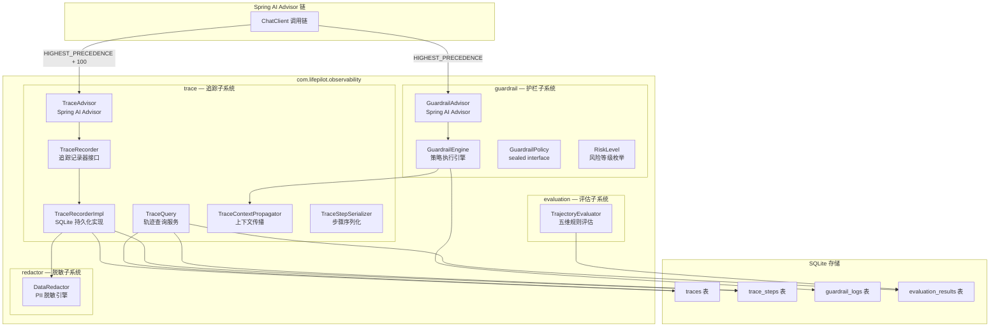
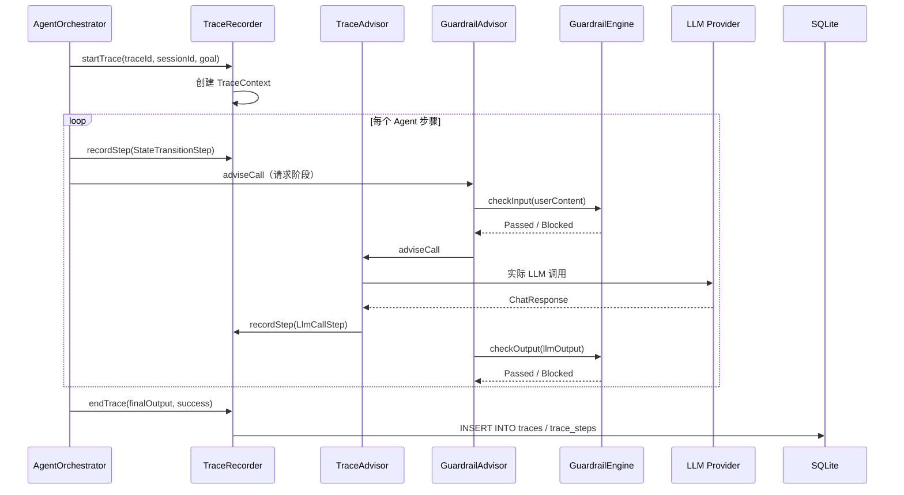
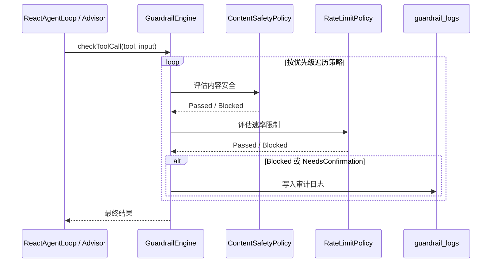

# 可观测性 — 架构设计

> **文档性质**：架构设计文档
> **模块归属**：`com.lifepilot.observability`
> **最后更新**：2026-03

## 1. 模块概述

可观测性模块（Observability）为 Agent 执行全链路提供追踪记录、护栏策略引擎、数据脱敏和轨迹评估四大能力。通过 Spring AI Advisor 模式横切注入，TraceAdvisor 记录每次 LLM 调用的 Token 消耗和延迟，GuardrailAdvisor 在 LLM 调用前后执行内容安全检查。模块内部按子系统划分为 trace（追踪）、guardrail（护栏）、redactor（脱敏）和 evaluation（评估）四个包。

## 2. 架构图

## 3. 核心组件

### 3.1 TraceRecorder / TraceRecorderImpl — 追踪记录器

- 职责：管理 Trace 生命周期（startTrace → recordStep → endTrace），持久化到 SQLite
- 接口方法：`startTrace()` 创建 TraceContext、`recordStep()` 记录步骤、`endTrace()` 汇总并写入 traces 表
- 实时事件：`onStep()` 和 `onTraceEnd()` 注册回调监听器，支持 Web UI 实时推送
- 上下文传播：通过 TraceContextPropagator 在 Virtual Thread 间传播（支持 ScopedValue 和 ThreadLocal 两种模式）
- 脱敏集成：记录前通过 DataRedactor 对敏感数据脱敏

### 3.2 TraceStep — 追踪步骤类型

- sealed interface，5 种步骤类型：
  - `LlmCallStep` — LLM 调用（provider、model、Token 消耗、延迟）
  - `ToolCallStep` — 工具调用（toolId、action、成功/失败、耗时）
  - `GuardrailStep` — 护栏检查（policyId、通过/拦截、风险等级）
  - `StateTransitionStep` — 状态转换（阶段变化、动作类型）
  - `EvaluationStep` — 轨迹评估（综合评分、违规项）

### 3.3 TraceAdvisor — 追踪 Advisor

- 职责：通过 Spring AI Advisor（CallAdvisor + StreamAdvisor）横切注入 LLM 调用追踪
- 优先级：`HIGHEST_PRECEDENCE + 100`（在 GuardrailAdvisor 之后）
- 同步调用：从 ChatResponse 提取 Token 使用量、模型 ID、完成原因，构建 LlmCallStep
- 流式调用：在流完成（`doOnComplete`）或出错（`doOnError`）时记录最后一条 ChatClientResponse 的追踪信息

### 3.4 TraceQuery — 轨迹查询服务

- 职责：提供多维度查询、FTS5 全文搜索、回放、导出和统计功能
- 查询：按时间范围、会话 ID、成功/失败、步骤数、Token 数过滤
- 回放：将步骤转换为包含人类可读摘要的 ReplayStep
- 统计：Token 消耗统计、概览统计（24h/7d/30d）、工具使用统计
- 导出：JSON 格式导出完整轨迹详情

### 3.5 GuardrailEngine — 护栏策略引擎

- 职责：管理策略注册表，执行工具调用/输入/输出安全检查
- 策略类型（sealed interface，3 permits）：
  - `ContentSafetyPolicy` — 阻断正则模式 + 敏感话题检测
  - `RateLimitPolicy` — 调用频率限制（每分钟最大调用次数）
  - `DataRedactionPolicy` — 数据脱敏标记
- 执行逻辑：按优先级排序遍历启用策略，短路返回（Blocked/NeedsConfirmation 立即返回）
- 容错策略：策略执行异常时 fail-open（记录 ERROR 日志，视为 Passed）
- 白名单：支持工具白名单，白名单内工具跳过检查
- 审计：Blocked/NeedsConfirmation 结果写入 guardrail_logs 表

### 3.6 GuardrailAdvisor — 护栏 Advisor

- 职责：通过 Spring AI Advisor（CallAdvisor + StreamAdvisor）横切注入内容安全检查
- 优先级：`HIGHEST_PRECEDENCE`（在所有 Advisor 之前）
- 同步调用：请求阶段检查用户输入内容安全（checkInput），响应阶段检查 LLM 输出内容合规（checkOutput）
- 流式调用：流开始前同步检查输入安全，流式响应的输出合规检查由上层负责
- 异常：Blocked 抛出 `GuardrailBlockedException`，NeedsConfirmation 抛出 `GuardrailConfirmationRequiredException`

### 3.7 DataRedactor — 数据脱敏引擎

- 职责：基于可扩展规则系统的 PII 脱敏
- 内置规则（6 条）：API 密钥、手机号、身份证号、银行卡号、邮箱、IP 地址
- 脱敏策略：保留部分可识别信息（如手机号 138****5678）
- 扩展：支持动态注册/注销自定义规则和自定义替换函数
- 审计：`redactWithAudit()` 返回脱敏结果和应用的规则列表
- 检测：`containsSensitiveData()` 和 `detectSensitiveTypes()` 用于敏感数据检测

### 3.8 TrajectoryEvaluator — 轨迹评估引擎

- 职责：对 Agent 执行轨迹进行五维规则评估
- 五个维度（可配置权重）：
  - 工具选择正确性（0.30）
  - 参数合法性（0.20）
  - 步骤效率（0.20）
  - 策略合规性（0.20）
  - Token 效率（0.10）
- 评估模式：在线评估（Agent 执行完成后自动触发）和离线评估
- 结果持久化：写入 evaluation_results 表

## 4. 核心流程

### 4.1 Agent 执行全链路追踪

### 4.2 护栏策略执行流程

## 5. 设计决策

| 决策 | 选择 | 理由 |
|------|------|------|
| 横切注入方式 | Spring AI Advisor 模式（CallAdvisor + StreamAdvisor） | 与 Spring AI ChatClient 原生集成，无侵入式拦截，同步和流式调用链均覆盖 |
| 上下文传播 | ScopedValue（默认）+ ThreadLocal 降级 | ScopedValue 适合 Virtual Thread，ThreadLocal 作为兼容降级 |
| 策略类型系统 | sealed interface + record | 编译时穷举检查，确保每种策略类型都被正确处理 |
| 护栏容错 | fail-open | 护栏异常不应阻塞 Agent 正常执行 |
| 脱敏规则 | 可扩展规则系统 + 内置中国 PII | 内置常见场景，支持动态扩展 |
| 评估维度 | 五维加权评分 | 覆盖工具选择、参数、效率、合规、Token 五个关键维度 |

## 6. 集成点

| 集成模块 | 方向 | 说明 |
|---------|------|------|
| agent（AgentOrchestrator / ReactAgentLoop） | agent → observability | 调用 TraceRecorder 记录 Trace 生命周期和步骤 |
| agent（ContextAssembler） | agent → observability | 通过 TraceContextPropagator 获取当前 Trace 上下文 |
| tool（DynamicToolRegistry） | tool → observability | 工具执行前调用 GuardrailEngine.checkToolCall() |
| llm（GenerationRouter） | llm → observability | LLM 调用前通过 DataRedactor 脱敏 |
| interaction（Web Controller） | interaction → observability | 调用 TraceQuery 提供轨迹查询 API |
| eval（Agentic Evals） | eval → observability | 使用 TrajectoryEvaluator 进行评估 |

## 7. 配置参考

| 配置键 | 默认值 | 说明 |
|--------|--------|------|
| `lifepilot.observability.trace.enabled` | `true` | 追踪总开关 |
| `lifepilot.observability.trace.record-prompts` | `false` | 是否记录完整 prompt |
| `lifepilot.observability.trace.retention-days` | `30` | Trace 数据保留天数 |
| `lifepilot.observability.trace.use-scoped-value` | `true` | 使用 ScopedValue 传播上下文 |
| `lifepilot.observability.guardrail.enabled` | `true` | 护栏总开关 |
| `lifepilot.observability.guardrail.tool-risk.default-risk-level` | `LOW` | 默认工具风险等级 |
| `lifepilot.observability.guardrail.rate-limit.max-calls-per-minute` | `60` | 每分钟最大调用次数 |
| `lifepilot.observability.redaction.enabled` | `true` | 脱敏总开关 |
| `lifepilot.observability.redaction.redact-before-llm` | `true` | LLM 调用前脱敏 |
| `lifepilot.observability.evaluation.enabled` | `true` | 评估总开关 |
| `lifepilot.observability.evaluation.online-evaluation` | `true` | 在线自动评估 |
| `lifepilot.observability.evaluation.pass-threshold` | `0.7` | 通过阈值 |
| `lifepilot.observability.metrics.enabled` | `true` | 指标收集开关 |
| `lifepilot.observability.metrics.snapshot-interval-seconds` | `300` | 快照间隔 |
