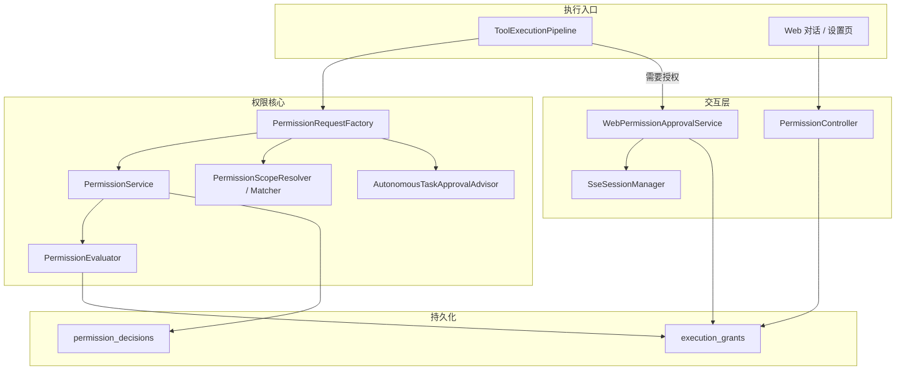
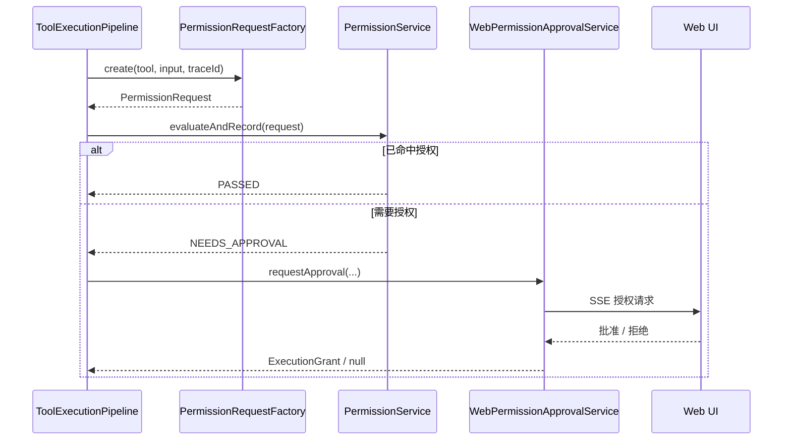

# 工具权限系统 — 架构设计

> **文档性质**：架构设计文档
> **模块归属**：`com.lifepilot.permission` + `com.lifepilot.interaction.web.controller`
> **最后更新**：2026-03

## 1. 模块概述

工具权限系统负责把“高风险工具能否执行”从一次性确认改为可复用的授权模型。

当前实现的核心规则是：

- `LOW / MEDIUM` 风险工具默认直接执行
- `HIGH / CRITICAL` 风险工具先构造 `PermissionRequest`
- 交互式渠道命中已有授权则直接执行，否则发起授权请求
- `cron / heartbeat / autonomous workflow` 这类自主执行场景只认预授权
- 创建可能执行高风险动作的定时任务时，会优先收集一次任务级预授权

## 2. 架构图

## 3. 核心组件

### 3.1 PermissionRequestFactory

把一次工具调用正规化为 `PermissionRequest`，负责提取：

- `actionType`：把底层工具映射为可授权动作，如 `WRITE_FILE`、`EXECUTE_SHELL`
- `riskLevel`：结合工具声明风险和可信工作区降级策略
- `resourceScope`：文件路径、工作区目录、网络 origin、数据集合等作用域
- `taskId / workspaceId / sessionId`：为后续作用域匹配提供主体信息
- `autonomousTaskGrantRequired`：创建高风险定时任务时，标记需要任务级预授权

### 3.2 PermissionScopeResolver / PermissionScopeMatcher

这组组件负责：

- 把运行时输入统一归一为路径、origin、collection 等授权范围
- 按目录边界做路径匹配，避免 `News` 意外匹配 `NewsBackup`
- 从作用域中反推出 `workspaceId`

### 3.3 PermissionEvaluator

权限判定器按以下顺序工作：

1. 低中风险直接放行
2. 高风险加载候选授权记录
3. 依次检查主体、风险上限、渠道、是否允许自主执行、作用域是否匹配
4. 对命中的授权按主体粒度优先级排序：`TASK > SESSION > WORKSPACE > USER`
5. 未命中时：
   - 交互式渠道返回 `NEEDS_APPROVAL`
   - 自主渠道返回 `BLOCKED`

### 3.4 WebPermissionApprovalService

Web 交互式授权服务通过 SSE 把审批请求发到前端。

常规高风险操作会创建一条具体动作授权；而创建高风险定时任务时，会创建：

- `subjectType = TASK`
- `actionType = GENERIC_TOOL_OPERATION`
- `channels = ["cron", "heartbeat", "workflow"]`
- `autonomousAllowed = true`

这条授权用于后续无人值守执行复用。

### 3.5 PermissionController

提供授权记录管理接口：

- 查询授权
- 手动创建授权
- 撤销授权
- 回传授权审批结果

## 4. 执行流程

### 4.1 交互式高风险工具

### 4.2 高风险定时任务创建

创建 `cron.create` 时，如果任务说明里包含写文件、删文件、执行命令、联网等高风险意图：

1. `AutonomousTaskApprovalAdvisor` 标记 `requiresAutonomousPreAuthorization`
2. 当前请求不会直接放行，而是进入授权流程
3. 用户批准后落一条任务级通用高风险授权
4. 后续 `cron / heartbeat / workflow` 执行命中该授权即可继续运行

## 5. 数据模型

### 5.1 execution_grants

记录已批准的授权，关键字段包括：

- `subject_type / subject_id`
- `action_type`
- `risk_ceiling`
- `scope_json`
- `channels_json`
- `autonomous_allowed`
- `expires_at / revoked_at`

### 5.2 permission_decisions

记录每次权限判定结果，用于审计、排查和后续统计。

## 6. 设计决策

| 决策 | 当前选择 | 原因 |
|------|----------|------|
| 高风险控制模型 | 授权而非逐次确认 | 个人助手场景下更适合复用，减少重复打断 |
| 自主执行策略 | 只认预授权 | 无人值守执行必须更保守 |
| 作用域模型 | 会话 / 工作区 / 任务 / 长期 | 既能覆盖一次性授权，也能覆盖项目级和任务级复用 |
| 定时任务高风险能力 | 创建时一次性预授权 | 避免任务运行时卡在无人值守场景 |
