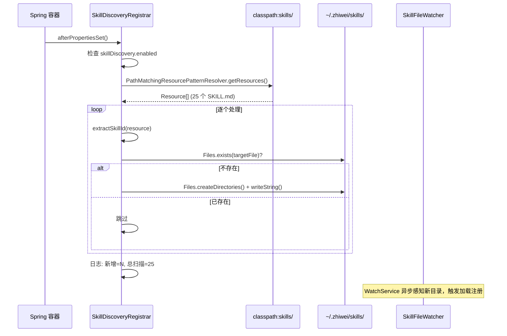

# 预置 Skill — 架构设计

> **文档性质**：架构设计文档
> **模块归属**：`com.lifepilot.meta.convenience` / `com.lifepilot.skill`
> **最后更新**：2026-04

## 1. 模块概述

预置 Skill（种子 Skill）是知微随应用分发的 25 个 Skill 定义，打包在 classpath 的 `skills/` 目录下。启动时由 `SkillDiscoveryRegistrar` 提取到用户 Skill 目录，之后由 Skill 系统的 `MarkdownSkillLoader` + `SkillFileWatcher` 统一加载和管理。

提取完成后，预置 Skill 的来源类型为 `SkillSource.UserDefined`——与用户手动创建的 Skill 完全等同，不存在单独的 "Builtin" 来源类型。

## 2. 架构图


## 3. 核心组件

### 3.1 SkillDiscoveryRegistrar

- 位于 `com.lifepilot.meta.convenience`
- 实现 `InitializingBean`，在 Bean 初始化后执行提取
- 由 `MetaProperties.skillDiscovery.enabled` 控制开关

**提取流程**：

1. 使用 `PathMatchingResourcePatternResolver` 扫描 `classpath:skills/*/SKILL.md`
2. 从 Resource URL 解析 Skill ID（父目录名）
3. 检查用户目录 `~/.zhiwei/skills/{skill-id}/SKILL.md` 是否已存在
4. 不存在时创建目录并写入文件内容；已存在则跳过
5. 记录日志：新增数量 + 总扫描数量

**关键设计**：
- 提取目标路径取自 `SkillConfigProperties.directory`，与 Skill 系统共享同一配置
- 读取文件内容使用 `resource.getContentAsString(UTF_8)`，避免流未关闭
- 已存在则跳过，保证用户自定义修改不被覆盖

### 3.2 classpath 资源结构

```
src/main/resources/skills/
├── a2ui/SKILL.md
├── api-debugger/SKILL.md
├── browser-automation/SKILL.md
├── code-assistant/SKILL.md
├── content-creator/SKILL.md
├── cron-scheduler/SKILL.md
├── daily-manager/SKILL.md
├── data-analyst/SKILL.md
├── database-query/SKILL.md
├── datastore/SKILL.md
├── desktop-automation/SKILL.md
├── doc-processor/SKILL.md
├── feishu/SKILL.md
├── file-organizer/SKILL.md
├── find-skills/SKILL.md
├── gitee/SKILL.md
├── github-workflow/SKILL.md
├── healthcheck/SKILL.md
├── introspection/SKILL.md
├── log-analyzer/SKILL.md
├── research-assistant/SKILL.md
├── summarizer/SKILL.md
├── teaching-assistant/SKILL.md
├── web-novel-writer/SKILL.md
└── workflow-creator/SKILL.md
```

每个 `SKILL.md` 遵循标准格式：YAML Frontmatter（`id`、`name`、`description`、`version`、`suggested-tools`）+ Markdown Body（instructions）。

### 3.3 与 Skill 系统的衔接

`SkillDiscoveryRegistrar` 只负责文件提取，不直接注册 Skill。提取完成后：

1. `SkillFileWatcher` 检测到新目录，触发 `MarkdownSkillLoader.loadFolder()`
2. `MarkdownSkillParser` 解析 SKILL.md，构建 `SkillDefinition`（来源为 `SkillSource.UserDefined`）
3. `SkillRegistry.register()` 完成注册
4. Agent 可通过 `file.read(skill="...")` 按需激活

## 4. 核心流程

### 4.1 启动提取流程



## 5. 设计决策

| 决策 | 选择 | 理由 |
|------|------|------|
| 预置 Skill 存储位置 | classpath 打包 + 启动提取到用户目录 | 预置 Skill 需要随应用分发，但提取后用户可编辑定制 |
| 来源类型 | 提取后为 `UserDefined`，无单独的 Builtin 类型 | 简化模型，预置与自定义走同一加载/激活/搜索流程 |
| 覆盖策略 | 已存在则跳过 | 用户自定义修改优先，避免升级时丢失定制内容 |
| 提取时机 | `InitializingBean.afterPropertiesSet()` | 确保在 `SkillFileWatcher` 启动前完成提取，被 WatchService 感知 |
| 配置复用 | 共享 `SkillConfigProperties.directory` | 预置 Skill 落入与自定义 Skill 相同的目录，统一管理 |

## 6. 集成点

| 集成模块 | 方向 | 说明 |
|---------|------|------|
| Skill 系统 (`com.lifepilot.skill`) | Meta → Skill | 提取文件到 Skill 目录，由 Skill 系统加载注册 |
| MetaAutoConfiguration | 配置 | 控制 `SkillDiscoveryRegistrar` Bean 创建和 `enabled` 开关 |
| SkillConfigProperties | 配置 | 共享 `directory` 配置项确定提取目标路径 |
