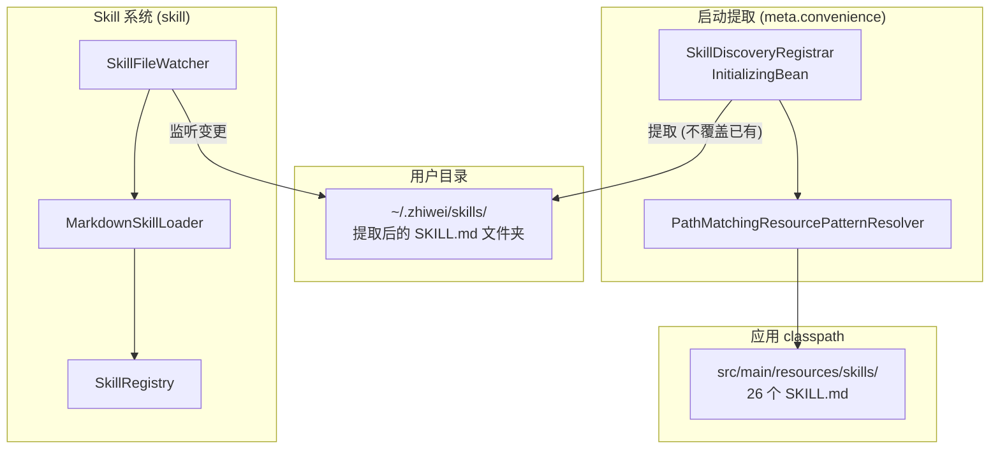
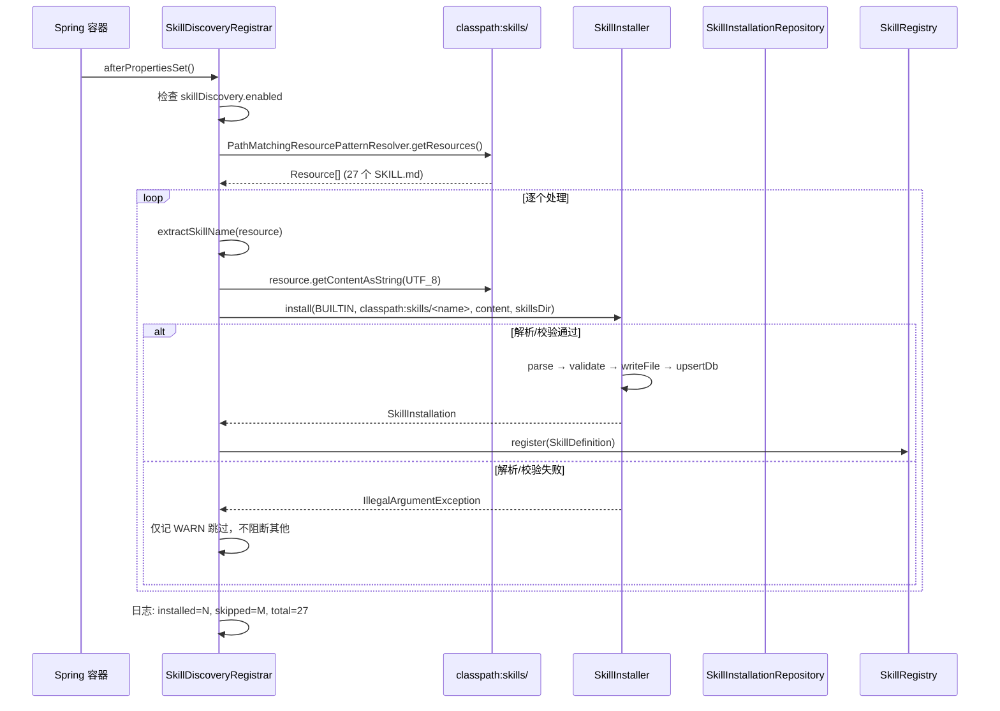

# 预置 Skill — 架构设计

> **文档性质**：架构设计文档
> **模块归属**：`com.lifepilot.meta.convenience` / `com.lifepilot.skill`
> **最后更新**：2026-04-24

## 1. 模块概述

预置 Skill（BUILTIN）是知微随应用分发的 27 个 Skill 定义，打包在 classpath `skills/<name>/SKILL.md`。启动时由 `SkillDiscoveryRegistrar`（`src/main/java/com/lifepilot/meta/convenience/SkillDiscoveryRegistrar.java`）作为统一安装入口——扫描 classpath 资源后逐个走 `SkillInstaller.install`（parse → validate → writeFile → upsertDb）完成四步安装流水线，`source_type = BUILTIN` 写入 `skills` 表（V17 迁移），同时注册到 `SkillRegistry` 内存索引。

v2 起 Skill 系统明确区分四种来源：`BUILTIN` / `USER_IMPORTED` / `MARKETPLACE` / `AUTO_GENERATED`，预置 Skill 有独立的 `BUILTIN` 源类型枚举（与用户手动创建的 `USER_IMPORTED` 区分），前端按徽章显示来源。

## 2. 架构图



## 3. 核心组件

### 3.1 SkillDiscoveryRegistrar

- 位于 `com.lifepilot.meta.convenience.SkillDiscoveryRegistrar`
- 实现 `InitializingBean`，在 Bean 初始化后执行安装
- 由 `MetaProperties.skillDiscovery.enabled` 控制开关

**安装流程**（v2 起走统一 `SkillInstaller` 流水线）：

1. `PathMatchingResourcePatternResolver` 扫描 `classpath:skills/*/SKILL.md`
2. 对每个 Resource 解析父目录名作为候选 `name`
3. 读取 Resource 内容为 UTF-8 字符串
4. 调用 `SkillInstaller.install(InstallRequest(BUILTIN, "classpath:skills/<name>", null, content, skillsDir))`：
   - `MarkdownSkillParser.parse` — 拒绝老 `id` 字段，强制 v2 frontmatter
   - `SkillDescriptionValidator` + `SkillBodyValidator` — 硬约束校验
   - 写入 `<skills.directory>/<name>/SKILL.md`
   - `SkillInstallationRepository.upsert` — 写入 `skills` 表，`source_type = BUILTIN`
5. 安装成功后再 `SkillRegistry.register(SkillDefinition)` 让 Activator / Catalog 可见
6. 日志 `installed=N, skipped=M, total=K`

**关键设计**：

- 任一 skill 解析/校验失败只记 WARN 跳过，不阻断其他 BUILTIN 安装，也不阻塞应用启动
- 写入路径取自 `SkillConfigProperties.directory`，与 Skill 系统共享配置
- SkillInstaller 内部的 upsert 语义保证重复启动不会重复安装；仅当 SKILL.md checksum 变化时才刷新表记录
- 当前 classpath 下所有预置 skill 仅含 SKILL.md，无 `references/scripts/assets` 辅助文件；后续若出现带资产的 BUILTIN，需补充 aux 目录复制逻辑

### 3.2 classpath 资源结构

```
src/main/resources/skills/
├── a2ui/SKILL.md
├── api-debugger/SKILL.md
├── browser-automation/SKILL.md
├── code-assistant/SKILL.md
├── content-creator/SKILL.md
├── cron-scheduler/SKILL.md
├── daily-manager/SKILL.md
├── data-analyst/SKILL.md
├── database-query/SKILL.md
├── desktop-automation/SKILL.md
├── doc-processor/SKILL.md
├── feishu/SKILL.md
├── file-organizer/SKILL.md
├── github-workflow/SKILL.md
├── healthcheck/SKILL.md
├── log-analyzer/SKILL.md
├── research-assistant/SKILL.md
├── skill-creator/SKILL.md
├── summarizer/SKILL.md
└── teaching-assistant/SKILL.md
```

每个 `SKILL.md` 遵循 v2 规范（见 `docs/skill-spec.md`）：YAML frontmatter 必含 `name / description / version`（拒绝老 `id` 字段），可选 `metadata.zhiwei.{category / priority / tags / suggested_tools / requires}` + Markdown body（含 `## 适用场景` / `## 不适用场景` / `## 工作流` 三必需小节）。

### 3.3 与 Skill 系统的衔接

`SkillDiscoveryRegistrar` 同时完成文件安装与注册，不再像 v1 那样只复制文件。流程：

1. `SkillInstaller.install` — 校验 SKILL.md + 写入用户目录 + upsert `skills` 表
2. `SkillRegistry.register(SkillDefinition)` — 建立内存索引供 Activator / SearchIndex 使用
3. 后续 `SkillFileWatcher` 只负责对用户手工编辑 SKILL.md 的热加载，不参与初次安装
4. Agent 运行时通过 `skill.load(names=[...])` 按需激活，BUILTIN 与其他来源走同一激活路径

## 4. 核心流程

### 4.1 启动安装流程



## 5. 设计决策

| 决策 | 选择 | 理由 |
|------|------|------|
| 预置 Skill 存储位置 | classpath 打包 + 启动安装到用户目录 | Skill 需要随应用分发，提取后用户仍可编辑；文件在用户目录便于审计 |
| 来源类型 | `BUILTIN`（V17 表枚举值之一）| 与 USER_IMPORTED / MARKETPLACE / AUTO_GENERATED 并列，前端按徽章区分 |
| 安装路径 | 统一 `SkillInstaller.install` 流水线 | 四来源用同一条 parse → validate → writeFile → upsertDb 流程，避免实现漂移 |
| 覆盖策略 | upsert by name；内容变更自动更新 checksum | 每次重启即可同步 classpath 变更，无需手动清理用户目录 |
| 失败隔离 | 任一 skill 失败只 WARN 跳过 | 多达 27 个 BUILTIN，任一 skill 的 v2 格式迁移问题都不应阻塞启动 |
| 启动时机 | `InitializingBean.afterPropertiesSet()` | 确保在 `SkillFileWatcher` 启动前完成安装与注册 |

## 6. 集成点

| 集成模块 | 方向 | 说明 |
|---------|------|------|
| Skill 系统 (`com.lifepilot.skill`) | Meta → Skill | 通过 `SkillInstaller` 写入 skills 表，`SkillRegistry` 建立内存索引 |
| MetaAutoConfiguration | 配置 | 控制 `SkillDiscoveryRegistrar` Bean 创建与 `enabled` 开关 |
| SkillConfigProperties | 配置 | 共享 `directory` 配置项确定安装目标路径 |
| Flyway V17 迁移 | 数据 | `skills` 表 `source_type` 列 CHECK 约束包含 `BUILTIN` |
