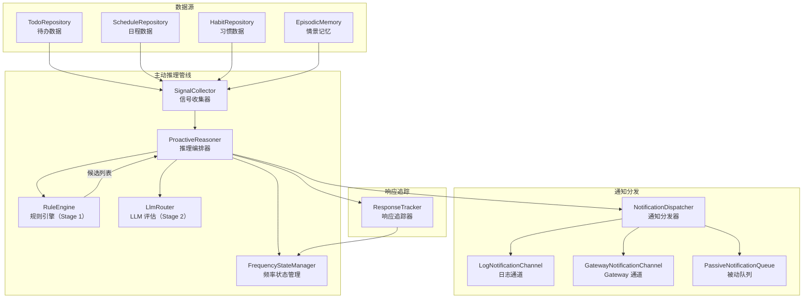
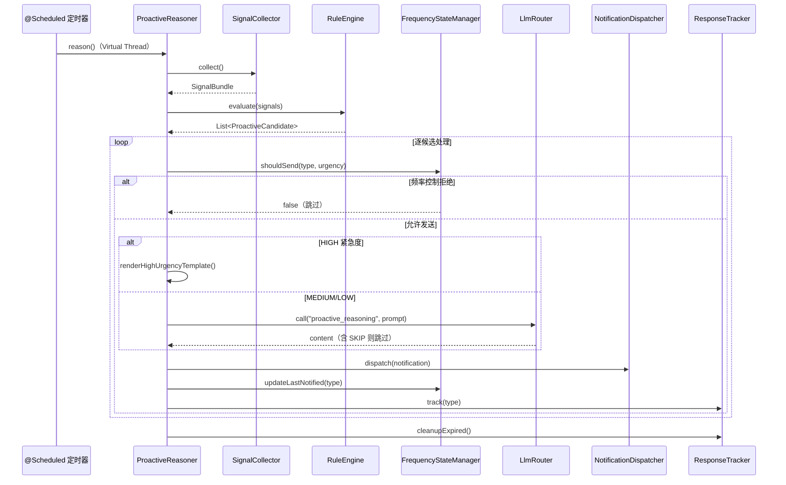
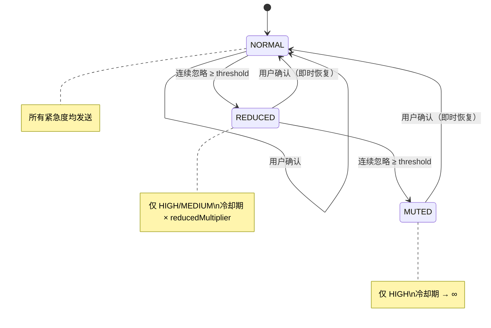

# 主动推理引擎 — 架构设计

> **文档性质**：架构设计文档
> **模块归属**：`com.lifepilot.agent.proactive`
> **最后更新**：2026-03

## 1. 模块概述

主动推理引擎是知微的"主动关怀"核心，负责在用户未主动发起对话时，基于待办截止、日程临近、习惯打卡等信号，自动生成个性化提醒通知。引擎采用两阶段推理管线（规则过滤 + LLM 精细判断），配合三态频率状态机实现智能降频，避免过度打扰用户。

## 2. 架构图

## 3. 核心组件

### 3.1 ProactiveReasoner（推理编排器）

- 职责：编排完整的推理周期，协调信号收集、规则过滤、LLM 评估、通知分发
- 通过 `@Scheduled` 定时触发，使用 Virtual Thread 执行推理周期
- HIGH 紧急度候选跳过 LLM，直接模板渲染；MEDIUM/LOW 经 LLM 评估后决定是否发送
- LLM 返回含 `SKIP` 的内容时跳过该候选

### 3.2 SignalCollector（信号收集器）

- 职责：从待办、日程、习惯、情景记忆四个数据源收集信号，输出不可变 `SignalBundle`
- 每个数据源独立 try-catch，单个数据源故障不阻塞整体收集
- 信号类型：24 小时内到期待办、2 小时内开始日程、今日未打卡习惯、连续打卡风险、最近 24 小时对话数、距上次交互时长

### 3.3 RuleEngine（规则引擎 — Stage 1）

- 职责：确定性规则过滤，纯规则逻辑，不依赖 LLM，目标执行时间 < 10ms
- 过滤规则链：免打扰时段 → 类型开关 → 冷却期 → 信号阈值映射
- 支持 6 种通知类型的规则：截止提醒、日程提醒、习惯提醒、连续打卡风险、每日总结、每周回顾
- 紧急度映射：待办 ≤2h → HIGH / ≤12h → MEDIUM / 其他 → LOW；日程 ≤30min → HIGH

### 3.4 FrequencyStateManager（频率状态管理器）

- 职责：管理每个通知类型的独立频率状态，实现智能降频
- 运行时 `ConcurrentHashMap` 缓存 + SQLite `frequency_states` 表持久化
- 持久化失败时降级为纯内存模式，不阻塞业务
- 启动时从 SQLite 加载已有状态

### 3.5 NotificationDispatcher（通知分发器）

- 职责：根据紧急程度选择通道并发送通知
- HIGH/MEDIUM → 遍历所有 `NotificationChannel` 广播；LOW → 入队 `PassiveNotificationQueue`
- 所有通知持久化到 `proactive_notifications` 表
- 单通道失败不中断其他通道

### 3.6 ResponseTracker（响应追踪器）

- 职责：追踪已发送通知的用户响应，反馈给 FrequencyStateManager
- 使用关键词匹配判断用户消息与通知的相关性
- 超过响应窗口的条目标记为忽略，触发降频

### 3.7 通知通道

| 通道 | 类 | 说明 |
|------|-----|------|
| 日志通道 | `LogNotificationChannel` | 默认通道，INFO 级别日志输出 |
| Gateway 通道 | `GatewayNotificationChannel` | 桥接 `ChannelAdapter`，广播到企微/钉钉/飞书等 |
| 被动队列 | `PassiveNotificationQueue` | 存储 LOW 紧急度通知，等待用户主动查看 |

## 4. 核心流程

### 4.1 推理周期时序

### 4.2 频率状态机转换

## 5. 设计决策

| 决策 | 选择 | 理由 |
|------|------|------|
| 两阶段推理管线 | 规则过滤 + LLM 精细判断 | 规则引擎快速过滤大量无关信号（< 10ms），LLM 仅处理少量候选，节省 Token |
| HIGH 紧急度跳过 LLM | 模板渲染直出 | 紧急通知不应等待 LLM 响应，确保低延迟 |
| 三态频率状态机 | NORMAL → REDUCED → MUTED | 渐进降频避免突然静默，用户确认即时恢复体现尊重 |
| 每类型独立频率状态 | `ConcurrentHashMap<NotificationType, FrequencyStateEntry>` | 用户可能只对某类通知不感兴趣，不应影响其他类型 |
| 被动通知队列 | LOW 紧急度入队而非直接发送 | 低优先级通知不主动打扰，等用户下次交互时附带展示 |
| 信号收集容错 | 每个数据源独立 try-catch | 单个数据源故障不阻塞整体推理周期 |
| 持久化降级 | SQLite 写入失败时降级为纯内存 | 频率状态丢失可接受（重启后恢复默认），不应阻塞通知发送 |

## 6. 集成点

| 方向 | 模块 | 交互方式 |
|------|------|---------|
| 依赖 | LLM Router（`llm`） | `LlmRouter.call()` 进行 Stage 2 LLM 评估 |
| 依赖 | 提示词管理（`prompt`） | `PromptRegistry.render()` 渲染评估提示词和 HIGH 紧急度模板 |
| 依赖 | 内置技能（`skill.builtin`） | `TodoRepository` / `ScheduleRepository` / `HabitRepository` 读取业务数据 |
| 依赖 | 情景记忆（`memory.episodic`） | `EpisodicMemory.getRecent()` 获取行为信号 |
| 依赖 | Gateway（`interaction.channel`） | `GatewayNotificationChannel` 通过 `ChannelAdapter` 广播通知 |
| 被依赖 | Agent 引擎 | `ResponseTracker.onUserInteraction()` 在用户交互时调用 |

## 7. 配置参考

| 配置键 | 默认值 | 说明 |
|--------|--------|------|
| `lifepilot.agent.proactive.enabled` | `true` | 是否启用主动推理 |
| `lifepilot.agent.proactive.interval-ms` | `1800000` | 推理间隔（毫秒），默认 30 分钟 |
| `lifepilot.agent.proactive.quiet-hours-start` | `22` | 免打扰开始小时 |
| `lifepilot.agent.proactive.quiet-hours-end` | `8` | 免打扰结束小时 |
| `lifepilot.agent.proactive.cooldown-minutes-per-type.*` | 按类型不同 | 各通知类型独立冷却时间 |
| `lifepilot.agent.proactive.daily-summary-hour` | `21` | 每日总结触发小时 |
| `lifepilot.agent.proactive.weekly-review-day` | `7` | 每周回顾触发星期（7=周日） |
| `lifepilot.agent.proactive.weekly-review-hour` | `10` | 每周回顾触发小时 |
| `lifepilot.agent.proactive.response-window-minutes` | `30` | 用户响应窗口 |
| `lifepilot.agent.proactive.ignore-threshold` | `3` | 连续忽略降频阈值 |
| `lifepilot.agent.proactive.reduced-multiplier` | `3` | REDUCED 状态冷却期倍数 |
| `lifepilot.agent.proactive.max-content-length` | `100` | LLM 生成通知内容最大字符数 |
