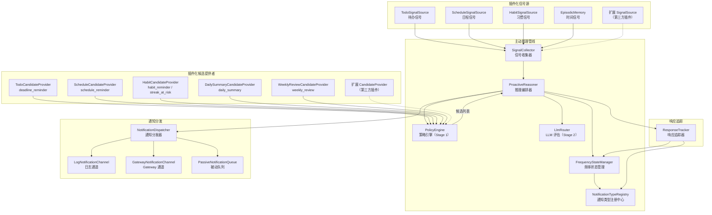
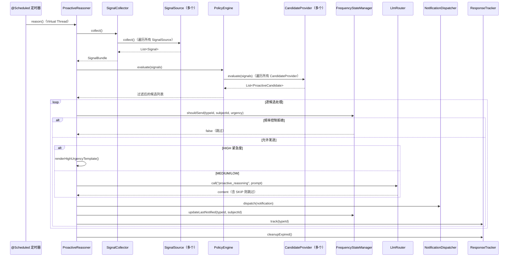
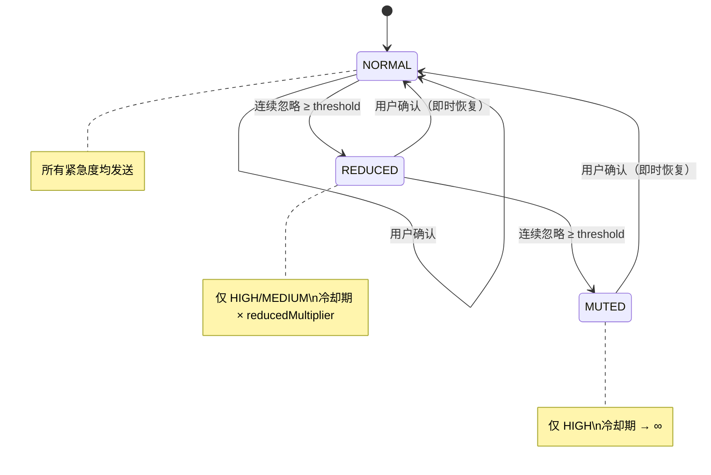
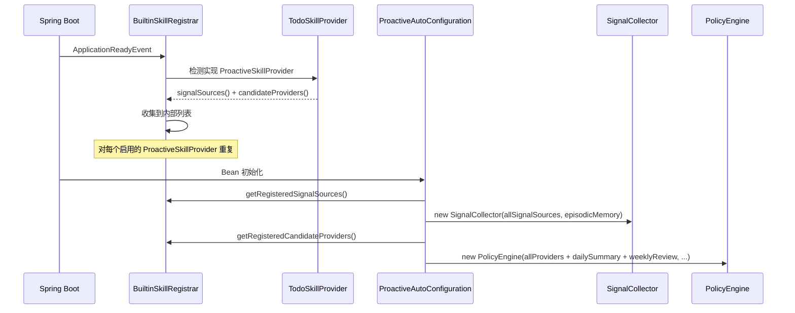

# 主动推理引擎 — 架构设计

> **文档性质**：架构设计文档
> **模块归属**：`com.lifepilot.agent.proactive`
> **最后更新**：2026-03

## 1. 模块概述

主动推理引擎是知微的"主动关怀"核心，负责在用户未主动发起对话时，基于插件化信号源采集的各类信号（待办截止、日程临近、习惯打卡等），自动生成个性化提醒通知。引擎采用两阶段推理管线（策略过滤 + LLM 精细判断），配合三态频率状态机实现智能降频，避免过度打扰用户。

架构已从硬编码模式重构为插件化可扩展架构：信号采集通过 `SignalSource` 接口插件化，候选评估通过 `CandidateProvider` 接口插件化，通知类型通过 `NotificationTypeRegistry` 动态注册，频率控制支持 `typeId + subjectId` 复合粒度。内置 Skill（Todo/Schedule/Habit）通过实现 `ProactiveSkillProvider` 接口自动贡献信号源和候选提供者。

## 2. 架构图

## 3. 核心组件

### 3.1 Signal 和 SignalSource（信号模型与信号源接口）

`Signal` record 是泛化的信号数据载体，包含 `typeId`（信号类型标识）、`urgency`（紧急度枚举）、`summary`（摘要）、`sourceId`（来源标识）、`subjectId`（主体标识，如具体待办 ID）、`metadata`（扩展元数据）。

`SignalSource` 接口定义信号采集契约：`id()` 返回唯一标识，`collect()` 返回 `List<Signal>`。内置 Skill 通过 `ProactiveSkillProvider.signalSources()` 提供实现，第三方插件可直接注册为 Spring Bean。

### 3.2 NotificationTypeDefinition 和 NotificationTypeRegistry（通知类型注册中心）

`NotificationTypeDefinition` record 定义通知类型元数据：`typeId`（字符串标识）、`displayName`（显示名称）、`keywords`（关键词列表，用于响应匹配）、`defaultCooldownMinutes`（默认冷却时间）。

`NotificationTypeRegistry` 替代原有的 `NotificationType` 枚举，支持运行时动态注册新通知类型。构造时预注册 6 种默认类型：`deadline_reminder`、`schedule_reminder`、`habit_reminder`、`streak_at_risk`、`daily_summary`、`weekly_review`。提供 `register()`、`resolve()`、`listAll()` 方法。

### 3.3 CandidateProvider 和 InitiativeType（候选提供者接口）

`CandidateProvider` 接口定义候选评估契约：`id()` 返回唯一标识，`evaluate(SignalBundle)` 从信号包中评估并返回 `List<ProactiveCandidate>`。

`InitiativeType` 枚举区分两种主动行为：`NOTIFICATION`（主动通知，按紧急度分发）和 `PASSIVE_HINT`（被动提示，直接入队被动队列）。

### 3.4 ProactiveReasoner（推理编排器）

- 职责：编排完整的推理周期，协调信号收集、策略过滤、LLM 评估、通知分发
- 通过 `@Scheduled` 定时触发，使用 Virtual Thread 执行推理周期
- 编排链路：`SignalCollector` → `PolicyEngine` → `NotificationDispatcher`
- HIGH 紧急度候选跳过 LLM，直接模板渲染；MEDIUM/LOW 经 LLM 评估后决定是否发送
- LLM 返回含 `SKIP` 的内容时跳过该候选
- 适配 `ProactiveCandidate` 的 `typeId`、`subjectId`、`initiativeType` 字段

### 3.5 SignalCollector（信号收集器）

- 职责：遍历所有 `SignalSource` Bean 收集信号，结合时间信号输出不可变 `SignalBundle`
- 构造函数注入 `List<SignalSource>`（来自 `BuiltinSkillRegistrar` 收集）+ `EpisodicMemory`
- 每个 SignalSource 独立 try-catch，异常时 WARN 日志并跳过，不阻塞整体收集
- `SignalBundle` 包含泛化的 `List<Signal> signals` 和时间信号字段（currentTime, dayOfWeek, timeSinceLastInteraction, recentConversationCount）

### 3.6 PolicyEngine（策略引擎 — Stage 1）

- 职责：遍历所有 `CandidateProvider` 收集候选，执行全局前置/后置过滤
- 构造函数注入 `List<CandidateProvider>` + `FrequencyStateManager` + `ProactiveConfigProperties` + `NotificationTypeRegistry`
- 过滤链：免打扰时段前置过滤 → 遍历 CandidateProvider 收集候选 → 类型开关后置过滤 → 冷却期后置过滤
- 每个 CandidateProvider 独立 try-catch，异常时 WARN 日志并跳过
- 替代原有的 `RuleEngine`，移除硬编码的 Todo/Schedule/Habit 评估逻辑

### 3.7 FrequencyStateManager（频率状态管理器）

- 职责：管理每个通知类型（支持 typeId + subjectId 复合粒度）的独立频率状态
- 缓存键：`ConcurrentHashMap<String, FrequencyStateEntry>`，键生成规则 `subjectId != null ? typeId + ":" + subjectId : typeId`
- 注入 `NotificationTypeRegistry` 查询默认冷却时间
- SQLite `frequency_states` 表使用 `notification_type + subject_id` 复合主键（V43 迁移）
- 持久化失败时降级为纯内存模式，不阻塞业务

### 3.8 NotificationDispatcher（通知分发器）

- 职责：根据 `InitiativeType` 和紧急程度选择通道并发送通知
- `NOTIFICATION` 类型：HIGH/MEDIUM → 遍历所有 `NotificationChannel` 广播；LOW → 入队 `PassiveNotificationQueue`
- `PASSIVE_HINT` 类型：直接入队 `PassiveNotificationQueue`
- 所有通知持久化到 `proactive_notifications` 表（使用 `typeId` 字符串）
- 单通道失败不中断其他通道

### 3.9 ResponseTracker（响应追踪器）

- 职责：追踪已发送通知的用户响应，反馈给 FrequencyStateManager
- 注入 `NotificationTypeRegistry` 查询关键词进行消息匹配
- 超过响应窗口的条目标记为忽略，触发降频

### 3.10 通知通道

| 通道 | 类 | 说明 |
|------|-----|------|
| 日志通道 | `LogNotificationChannel` | 默认通道，INFO 级别日志输出 |
| Gateway 通道 | `GatewayNotificationChannel` | 桥接 `ChannelAdapter`，广播到企微/钉钉/飞书等 |
| 被动队列 | `PassiveNotificationQueue` | 存储 LOW 紧急度和 PASSIVE_HINT 通知，等待用户主动查看 |

## 4. 核心流程

### 4.1 推理周期时序

### 4.2 频率状态机转换

### 4.3 插件化信号源与候选提供者注册流程

## 5. 设计决策

| 决策 | 选择 | 理由 |
|------|------|------|
| 两阶段推理管线 | 策略过滤 + LLM 精细判断 | PolicyEngine 快速过滤大量无关信号，LLM 仅处理少量候选，节省 Token |
| HIGH 紧急度跳过 LLM | 模板渲染直出 | 紧急通知不应等待 LLM 响应，确保低延迟 |
| 三态频率状态机 | NORMAL → REDUCED → MUTED | 渐进降频避免突然静默，用户确认即时恢复体现尊重 |
| 信号源插件化 | `SignalSource` 接口 + `List<SignalSource>` 注入 | 解耦数据源依赖，第三方可通过实现接口扩展信号源 |
| 候选评估插件化 | `CandidateProvider` 接口 + `List<CandidateProvider>` 注入 | 评估逻辑从 PolicyEngine 解耦，每个 Skill 自包含评估逻辑 |
| 通知类型动态注册 | `NotificationTypeRegistry` 替代枚举 | 支持运行时注册新通知类型，第三方插件可定义自己的通知类型 |
| 复合粒度频率控制 | `typeId + subjectId` 复合键 | 同一类型不同主体（如不同待办）独立控制冷却期 |
| InitiativeType 区分 | NOTIFICATION vs PASSIVE_HINT | 被动提示不走紧急度分发逻辑，直接入队被动队列 |
| 被动通知队列 | LOW 紧急度和 PASSIVE_HINT 入队 | 低优先级通知不主动打扰，等用户下次交互时附带展示 |
| 信号收集容错 | 每个 SignalSource 独立 try-catch | 单个信号源故障不阻塞整体推理周期 |
| 持久化降级 | SQLite 写入失败时降级为纯内存 | 频率状态丢失可接受（重启后恢复默认），不应阻塞通知发送 |

## 6. 集成点

| 方向 | 模块 | 交互方式 |
|------|------|---------|
| 依赖 | LLM Router（`llm`） | `LlmRouter.call()` 进行 Stage 2 LLM 评估 |
| 依赖 | 提示词管理（`prompt`） | `PromptRegistry.render()` 渲染评估提示词和 HIGH 紧急度模板 |
| 依赖 | 内置技能（`skill.builtin`） | `BuiltinSkillRegistrar` 收集 `ProactiveSkillProvider` 的 SignalSource 和 CandidateProvider |
| 依赖 | 情景记忆（`memory.episodic`） | `EpisodicMemory` 提供时间信号（最近对话数、距上次交互时长） |
| 依赖 | Gateway（`interaction.channel`） | `GatewayNotificationChannel` 通过 `ChannelAdapter` 广播通知 |
| 被依赖 | Agent 引擎 | `ResponseTracker.onUserInteraction()` 在用户交互时调用 |

## 7. 配置参考

| 配置键 | 默认值 | 说明 |
|--------|--------|------|
| `lifepilot.agent.proactive.enabled` | `true` | 是否启用主动推理 |
| `lifepilot.agent.proactive.interval-ms` | `1800000` | 推理间隔（毫秒），默认 30 分钟 |
| `lifepilot.agent.proactive.quiet-hours-start` | `22` | 免打扰开始小时 |
| `lifepilot.agent.proactive.quiet-hours-end` | `8` | 免打扰结束小时 |
| `lifepilot.agent.proactive.cooldown-minutes-per-type.*` | 按类型不同 | 各通知类型独立冷却时间（String typeId 作为键） |
| `lifepilot.agent.proactive.type-enabled.*` | `true` | 各通知类型独立启用开关（String typeId 作为键） |
| `lifepilot.agent.proactive.daily-summary-hour` | `21` | 每日总结触发小时 |
| `lifepilot.agent.proactive.weekly-review-day` | `7` | 每周回顾触发星期（7=周日） |
| `lifepilot.agent.proactive.weekly-review-hour` | `10` | 每周回顾触发小时 |
| `lifepilot.agent.proactive.response-window-minutes` | `30` | 用户响应窗口 |
| `lifepilot.agent.proactive.ignore-threshold` | `3` | 连续忽略降频阈值 |
| `lifepilot.agent.proactive.reduced-multiplier` | `3` | REDUCED 状态冷却期倍数 |
| `lifepilot.agent.proactive.max-content-length` | `100` | LLM 生成通知内容最大字符数 |
