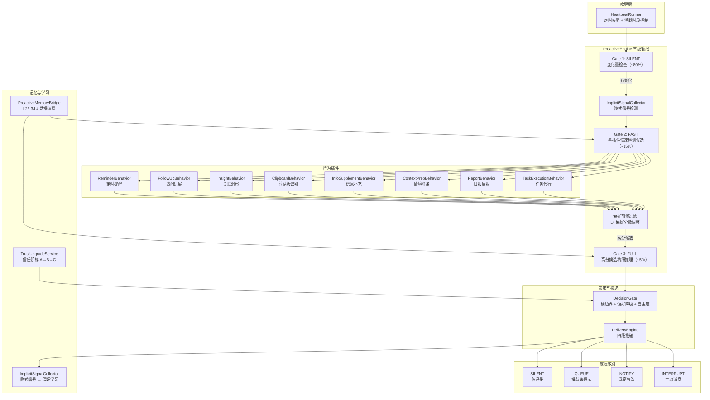
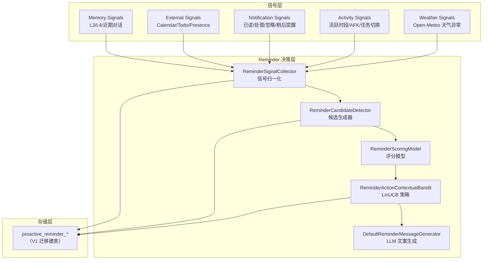

# 主动智能引擎 — 架构设计

> **文档性质**：架构设计文档
> **模块归属**：`com.lifepilot.agent.task.proactive`（+ `agent.task.reminder` 子系统）
> **最后更新**：2026-04-15

## 1. 文档定位

本文档描述知微主动智能引擎的架构设计。系统由两层组成：

- **ProactiveEngine 框架层**（`agent.task.proactive`）：三级需求检测管线、行为插件编排、决策门控、四级投递引擎、信任阶梯。这是当前生产代码的主入口。
- **Reminder 子系统**（`agent.task.reminder`）：作为一个行为插件（`ReminderBehavior`）接入 ProactiveEngine，保留了原有的信号采集、候选检测、Contextual Bandit 策略、LLM 文案生成等能力。

### 模块关系

```
HeartbeatRunner（定时唤醒）
  └─ ProactiveEngine（三级管线 + 行为编排）
       ├─ ReminderBehavior（定时提醒插件）
       ├─ FollowUpBehavior（追问进展插件）
       ├─ InsightBehavior（关联洞察插件）
       ├─ ClipboardBehavior（剪贴板识别插件）
       ├─ InfoSupplementBehavior（信息补充插件）
       ├─ ContextPrepBehavior（情境准备插件）
       ├─ ReportBehavior（日报周报插件）
       └─ TaskExecutionBehavior（任务代行插件）
```

### 实现进度

| 模块 | 状态 | 说明 |
|------|------|------|
| **ProactiveEngine 三级管线** | ✅ 已实现 | Gate 1 变化量检查 → Gate 2 快速检测 → Gate 3 精细推理 |
| **行为插件框架**（`ProactiveBehavior`） | ✅ 已实现 | 7 个行为插件 + `ReminderBehavior` 适配 |
| **DecisionGate 决策门控** | ✅ 已实现 | 硬边界 + 偏好降级 + 自主度约束 |
| **DeliveryEngine 四级投递** | ✅ 已实现 | SILENT → QUEUE → NOTIFY → INTERRUPT |
| **信任阶梯**（`TrustUpgradeService`） | ✅ 已实现 | A/B/C 三级自主度 + 连续正反馈升级建议 + 用户确认 |
| **ProactiveMemoryBridge 记忆桥接** | ✅ 已实现 | 从 L2/L3/L4 消费数据 + 偏好 EWMA 写入 |
| **ConversationCompletionHook** | ✅ 已实现 | 对话完成后触发隐式信号 + 摘要生成 + 画像巩固 |
| **ProactiveController REST API** | ✅ 已实现 | queue/trust/config 三组端点 |
| 信号采集（`DefaultReminderSignalCollector`） | ✅ 已实现 | L3/L4/L2/Workspace/通知反馈/topic alias/天气 |
| 候选生成与评分（`ReminderCandidateDetector` / `ReminderScoringModel`） | ✅ 已实现 | 5 类检测器 + 统一评分模型 |
| Contextual Bandit 策略（`ReminderActionContextualBandit`） | ✅ 已实现 | LinUCB 在线学习，机会层 + 动作层双层 Bandit |
| LLM 文案生成（`DefaultReminderMessageGenerator`） | ✅ 已实现 | StringTemplate + GenerationRouter |
| 隐式结果推断（`ReminderOutcomeInferenceService`） | ✅ 已实现 | Workspace/Workflow/Trace/Semantic/Conversation 多源推断 |
| 离线回放与策略评估 | ✅ 已实现 | `ReminderReplayService` + 定时调度器 |
| 策略调优与版本化 | ✅ 已实现 | `ReminderPolicyTuner` + 安全护栏 + 版本持久化 |
| 天气信号接入（`OpenMeteoWeatherService`） | ✅ 已实现 | 零配置 Open-Meteo API，温差/降水/强降水三类信号 |
| 隐式信号检测（`ImplicitSignalCollector`） | ✅ 已实现 | 投递忽略检测 + 对话参与度 + 未命中检测 |
| 时机预测模型（危险率 / 时序点过程） | ⏳ 待定 | 当前为规则回退，点过程模型为后续迭代方向 |
| 外部系统信号接入（日历/AFK/Focus） | ⏳ 待定 | 依赖 sync 模块后续对接 |

## 2. 问题定义

知微中的自主执行需要拆分为三条明确轨道：

- `cron`：用户显式声明的定时承诺。到点执行，不做主观推断。
- `heartbeat`：AI 基于长期记忆、近期上下文和外部信号，主动判断“现在是否值得提醒”。
- `workflow`：满足条件后的多步骤自动化编排，不等价于单次提醒。

当前 heartbeat 更接近“固定间隔巡检器”，而不是“真正的主动提醒引擎”。目标态需要把 heartbeat 收敛为：

- 定时唤醒只是底层机制
- 提醒决策由结构化信号、时机预测和反馈学习共同驱动
- LLM 只负责语义压缩、主题抽取和提醒文案，不负责主决策

## 3. 设计目标

- 让系统根据用户不经意留下的信息，主动判断何时值得提醒
- 明确区分显式任务与隐式提醒，避免 heartbeat 和 cron 语义混淆
- 提醒必须可解释，可回放，可根据用户反馈持续收敛
- 运行态数据全部结构化落库，不依赖 Markdown 作为核心状态存储
- 保持本地优先，可在 SQLite 上完成主要能力

## 4. 非目标

- 不让 heartbeat 自动创建长期 Cron 任务
- 不让 heartbeat 在无明确授权时直接执行高风险工具动作
- 不追求“一次性全知全能”的端到端 LLM 决策
- 不把一次随口提及、低置信度记忆直接变成强提醒

## 5. 核心原则

### 5.1 双轨原则

- 显式计划归 `cron`
- 隐式机会归 `heartbeat`

### 5.2 证据优先原则

- 每条主动提醒都必须附带证据链
- 证据链来自记忆、近期对话、外部事件、通知反馈、用户活跃模式中的至少一部分

### 5.3 时机优先原则

- “何时提醒”优先级高于“提醒什么”
- 系统优先在任务切换、空闲窗口、习惯窗口、截止前准备窗口等机会点提醒

### 5.4 渐进学习原则

- 所有提醒都记录候选、策略、投递和反馈
- 提醒策略由反馈数据持续调优，而不是仅靠改 Prompt

### 5.5 存储分工原则

- Markdown：仅用于人工维护的说明、Prompt、策略模板、调试输出
- 数据库：用于候选提醒、主题状态、策略特征、反馈结果等运行态数据

## 6. 总体架构

### 6.1 ProactiveEngine 三级管线



### 6.2 Reminder 子系统（原有架构，现作为行为插件运行）



## 7. 数据来源

### 7.1 L3 语义记忆

重点使用以下实体类型：

- `PREFERENCE`
- `HABIT`
- `GOAL`
- `EVENT`
- `PROJECT`

提取的关键字段：

- `properties`
- `extractionConfidence`
- `importanceScore`
- `accessCount`
- `lastAccessedAt`
- `sourceConversationId`
- `validFrom / validTo`

作用：

- 判断某条偏好或习惯是否可信
- 判断提醒主题是否仍然有效
- 判断是否存在“事件临近”或“目标未闭环”

### 7.2 L4 程序记忆

重点使用：

- `PreferenceRule`
- `StrategyPattern`

提取的关键字段：

- `category / key / value`
- `confidence`
- `observationCount`

作用：

- 识别用户的稳定提醒偏好
- 判断用户通常在哪个时间窗口更愿意处理某类事项
- 为“提醒方式”而不是“提醒主题”提供个性化先验

### 7.3 近期对话与情景记忆

重点抽取：

- 用户明确提过但未完成的承诺
- 最近重复提及但未设为 cron 的模糊事项
- 新出现的截止时间、会议、准备事项

作用：

- 形成短期高相关候选主题
- 修正长期记忆的陈旧结论

### 7.4 外部系统信号

优先接入：

- 日历
- 待办
- 同步任务源
- Presence / AFK / Focus 状态

作用：

- 形成硬时间约束
- 判断用户当前是否处于合适打扰窗口
- 为“事件前准备提醒”提供事实锚点

### 7.5 天气信号

数据来源：`OpenMeteoWeatherService`（基于 Open-Meteo 免费 API，无需 API key）

位置解析：通过 `LocationResolver` 获取城市名 → Open-Meteo Geocoding API 转经纬度 → 缓存

产生的信号类型：

- **温差提醒**：明日最高温与最低温之差超过阈值（默认 10°C）
- **降水提醒**：明日降水量超过阈值（默认 5mm）且用户有外出事件
- **强降水提醒**：明日降水量超过重度阈值（默认 20mm），无论是否有外出安排

天气数据通过后台 virtual thread 异步预取并缓存（TTL 由 `weatherCacheTtlHours` 控制，默认 6 小时），不阻塞对话路径。

同一 topic key `weather:tomorrow` 下的多个信号会合并到同一 `ReminderTopicSnapshot`。

### 7.6 通知反馈

目标态反馈事件：

- `read`
- `acted`
- `snoozed`
- `dismissed`
- `not_relevant`

作用：

- 调整提醒主题的优先级
- 学习最佳提醒时机
- 控制提醒疲劳

## 8. 算法总流程

### 8.1 流程概览

```text
collect signals
-> build reminder topics
-> generate candidates
-> predict opportunity window
-> choose action by policy
-> render message
-> deliver
-> collect feedback
-> update topic/policy
```

### 8.2 第一层：候选生成

候选生成不依赖 LLM 自由发挥，采用“规则检测器 + 轻量语义抽取”的混合方式。

基础检测器包括：

1. `DueSoonDetector`
   - 截止时间或会议时间临近
   - 适合事件、日程、待办
2. `CommitmentGapDetector`
   - 用户近期承诺过但尚未完成
   - 适合近期对话和项目推进
3. `HabitWindowDetector`
   - 用户通常会在某时间窗口做某类事
   - 适合稳定习惯
4. `PreparationWindowDetector`
   - 事件发生前存在准备窗口
   - 适合会议、出行、缴费、复盘
5. `AnomalyDetector`
   - 最近行为偏离稳定习惯
   - 适合遗漏型提醒

每个候选至少输出：

- `topicKey`
- `candidateType`
- `evidenceIds`
- `evidenceSummary`
- `baseScore`
- `suggestedWindowStart`
- `suggestedWindowEnd`

### 8.3 第二层：时机预测

目标态采用”规则回退 + 时机预测模型”的双层机制。

> **当前实现**：仅使用规则回退层（`ReminderScoringModel.calcTimingScore`），
> 危险率模型和时序点过程为后续迭代方向。

优先策略：

- 有明确截止时间：直接使用硬时间窗口
- 有稳定历史行为：使用习惯窗口预测
- 历史不足：回退到规则窗口

推荐模型：

- 短期先验：危险率模型（hazard model）
- 目标态主模型：时序点过程 / 下一次行为时间预测模型

预测目标：

- 该主题下一次最可能被用户接受的提醒窗口
- 当前时间是否处于任务切换、空闲、准备窗口、习惯窗口

关键特征：

- 小时、星期、节假日、是否工作日
- 最近一次相关行为时间
- 最近一次相似提醒结果
- 当前是否活跃、是否 AFK、是否在会议中
- 用户对此类提醒的历史接受度
- 主题重要性、记忆置信度、截止剩余时间

### 8.4 第三层：策略选择

目标态采用 Contextual Bandit，而不是直接用全量 RL。

> **当前实现**：`ReminderActionContextualBandit` 已落地 LinUCB 策略，
> 分为机会层（`ReminderOpportunityPolicySelector`）和动作层（`ReminderActionPolicySelector`）双层 Bandit。
> LinTS 为后续可选替换方案。

推荐策略：

- `LinTS` 作为默认策略
- `LinUCB` 作为可解释回退策略

动作空间：

- `SKIP`：本轮不提醒
- `SOFT_PUSH`：轻提醒
- `NORMAL_PUSH`：标准提醒
- `DEFER_30M`：延后 30 分钟重评估
- `DEFER_TO_WINDOW`：延后到预测机会窗口

策略输入特征：

- 候选得分
- 主题类型
- 当前时机特征
- 历史反馈统计
- 用户疲劳度
- 同主题最近提醒间隔

建议奖励函数：

> **实现说明**：当前 `ReminderRewardModel` 采用 `[0, 1]` 归一化区间，
> 无反馈时使用被动基线 `0.42` 而非负分，以适配 LinUCB 的非负奖励假设。
> 下表同时列出目标态语义方向和当前实现值。

| 结果 | 语义方向 | 当前实现值（[0,1]） |
|------|----------|---------------------|
| `acted`（显式处理） | 最强正反馈 | `1.0` |
| `snoozed`（稍后提醒） | 弱正反馈 | `0.72` |
| `read`（已读未行动） | 中性偏正 | `0.58` |
| 无反馈（被动基线） | 中性 | `0.42` |
| `dismissed`（忽略） | 弱负反馈 | `0.18` |
| `not_relevant`（不相关） | 最强负反馈 | `0.0` |
| 隐式完成（推断归因） | 视归因置信度而定 | `max(0.42, attributionScore)` |

### 8.5 第四层：提醒文案生成

LLM 只负责：

- 归纳证据链为自然语言
- 生成符合当前渠道的提醒文案
- 输出提醒的“为什么现在提醒你”

LLM 不负责：

- 决定是否提醒
- 决定优先级排序
- 决定是否突破边界规则

文案要求：

- 用概率化和建议式语气
- 不把推断包装成事实
- 明确当前提醒依据

示例：

```text
你最近几次通常会在周日晚处理下周计划。结合你今天还有两个未完成事项，现在适合花 10 分钟快速整理一下。需要的话我也可以顺手把它转成固定周计划任务。
```

## 9. 评分与边界

### 9.1 统一评分模型

候选总分由以下部分组成：

```text
finalScore =
  0.30 * evidenceScore +
  0.25 * timingScore +
  0.20 * urgencyScore +
  0.15 * userFitScore +
  0.10 * actionabilityScore -
  duplicatePenalty -
  fatiguePenalty
```

分项定义：

- `evidenceScore`：证据置信度、来源数量、数据新鲜度
- `timingScore`：是否命中机会窗口
- `urgencyScore`：截止压力或准备窗口强度
- `userFitScore`：用户对该类提醒的历史接受度
- `actionabilityScore`：提醒后是否存在明确动作
- `duplicatePenalty`：同主题近期是否已提醒
- `fatiguePenalty`：当日提醒密度是否过高

### 9.2 硬边界

heartbeat 必须满足以下硬条件才允许发出提醒：

1. 存在明确 `topicKey`
2. 至少存在可解释证据链
3. 没有命中冷却窗口
4. 当前不处于静默时段
5. 没有与已有 `cron` 或 workflow 的明确职责冲突

### 9.3 业务边界

- heartbeat 可以提醒，也可以建议“是否要转成 cron”
- heartbeat 不能偷偷创建长期任务
- heartbeat 不能直接执行高风险动作
- heartbeat 不得因为单次对话中的随口提及就形成高强度提醒

### 9.4 打扰控制

默认策略：

- 每日主动提醒总量限制
- 同主题冷却窗口
- 深夜与会议中默认静默
- 对连续 `dismissed / not_relevant` 的主题快速降权

## 10. 数据模型

目标态不再使用 Markdown 作为运行态数据源，所有运行态状态统一落库。

### 10.1 reminder_topic_profile

表示一个长期存在的提醒主题画像。

| 列 | 类型 | 说明 |
|----|------|------|
| id | TEXT PK | 主题 ID |
| topic_key | TEXT UNIQUE | 主题稳定键 |
| topic_type | TEXT | 主题类型 |
| title | TEXT | 主题标题 |
| source_kind | TEXT | 主要来源类型 |
| source_refs_json | TEXT | 关联实体/任务/事件 ID |
| confidence_score | REAL | 主题置信度 |
| importance_score | REAL | 主题重要性 |
| preferred_windows_json | TEXT | 学习到的时间窗口 |
| cooldown_until | TEXT | 冷却结束时间 |
| last_reminded_at | TEXT | 上次提醒时间 |
| last_feedback | TEXT | 上次反馈结果 |
| status | TEXT | `ACTIVE / PAUSED / ARCHIVED` |
| created_at | TEXT | 创建时间 |
| updated_at | TEXT | 更新时间 |

### 10.2 reminder_candidate

表示一次 heartbeat 扫描中生成的候选提醒。

| 列 | 类型 | 说明 |
|----|------|------|
| id | TEXT PK | 候选 ID |
| topic_profile_id | TEXT | 关联主题 |
| candidate_type | TEXT | 候选类型 |
| evidence_json | TEXT | 证据链 |
| feature_snapshot_json | TEXT | 策略输入快照 |
| base_score | REAL | 初始分 |
| opportunity_score | REAL | 时机分 |
| final_score | REAL | 总分 |
| proposed_action | TEXT | 策略动作 |
| status | TEXT | `SKIPPED / DELIVERED / EXPIRED` |
| generated_at | TEXT | 生成时间 |
| expires_at | TEXT | 过期时间 |

### 10.3 reminder_delivery

表示一次真实投递结果。

| 列 | 类型 | 说明 |
|----|------|------|
| id | TEXT PK | 投递 ID |
| candidate_id | TEXT | 关联候选 |
| channel | TEXT | 投递渠道 |
| message_text | TEXT | 实际文案 |
| explanation_json | TEXT | 对用户可见的提醒依据 |
| notification_id | TEXT | 关联通知记录 |
| delivered_at | TEXT | 投递时间 |
| status | TEXT | `SENT / FAILED / CANCELED` |

### 10.4 reminder_feedback

表示用户对提醒的反馈。

| 列 | 类型 | 说明 |
|----|------|------|
| id | TEXT PK | 反馈 ID |
| delivery_id | TEXT | 关联投递 |
| feedback_type | TEXT | `READ / ACTED / SNOOZED / DISMISSED / NOT_RELEVANT` |
| feedback_value | TEXT | 可选附加值 |
| reward | REAL | 策略学习奖励 |
| created_at | TEXT | 反馈时间 |

### 10.5 reminder_policy_snapshot

用于离线回放和策略评估。

| 列 | 类型 | 说明 |
|----|------|------|
| id | TEXT PK | 快照 ID |
| candidate_id | TEXT | 关联候选 |
| policy_name | TEXT | 策略名 |
| policy_version | TEXT | 策略版本 |
| context_json | TEXT | 输入上下文 |
| action_probs_json | TEXT | 动作概率或打分 |
| chosen_action | TEXT | 选中动作 |
| created_at | TEXT | 创建时间 |

## 11. 反馈协议

目标态需要从“通知历史”升级为“可学习反馈”。

### 11.1 前端反馈动作

Web 与 IM 渠道应支持以下动作：

- 标记已读
- 立即处理
- 稍后提醒
- 不感兴趣
- 不要再提醒这类内容

### 11.2 反馈写回路径

```text
UI action
-> Notification feedback endpoint
-> ReminderFeedbackService
-> reward mapping
-> update topic profile
-> update policy
```

### 11.3 学习方式

- 主题层学习：调整同主题冷却、重要性、窗口偏好
- 策略层学习：调整动作选择倾向
- 文案层学习：总结用户更接受的提醒表述风格

## 12. 与现有模块的职责映射

| 组件 | 当前角色 |
|------|----------|
| `HeartbeatRunner` | 纯唤醒器，按固定频率调用 `ProactiveEngine.heartbeat()`，不做任何决策 |
| `ProactiveEngine` | 三级检测管线 + 行为插件编排的主入口 |
| `ProactiveBehavior`（接口） | 行为插件规范：`detect()` → `reason()` → `execute()` → `onDelivered()` |
| `DecisionGate` | 统一决策门控，硬边界 + 偏好降级 + 自主度约束 |
| `DeliveryEngine` | 四级投递引擎（SILENT / QUEUE / NOTIFY / INTERRUPT） |
| `ProactiveMemoryBridge` | 记忆数据消费唯一入口（L2/L3/L4），替代旧的 IntentMemoryService / UserProfileService |
| `TrustUpgradeService` | 信任阶梯管理（A/B/C 自主度 + 连续反馈追踪 + 用户确认升级） |
| `ImplicitSignalCollector` | 隐式信号检测（投递忽略 / 对话参与度 / 未命中检测） |
| `ConversationCompletionHook` | 对话完成后触发隐式信号检测 + 摘要生成 + 画像巩固 |
| `UserProfileConsolidator` | 画像巩固（L3 碎片 → LLM → `__consolidated_profile` 实体，2h 防抖） |
| `ConversationSummaryGenerator` | 对话摘要（LLM 生成 → `session_store.summary`） |
| `CronScheduler` | 保持不变，只负责显式定时任务 |
| `NotificationService` | 继续负责统一投递，`DeliveryEngine` 通过它发送 NOTIFY/INTERRUPT 级通知 |
| `QueuedActionRepository` | 管理 QUEUE 级投递的排队动作持久化 |
| `AutonomyRepository` | 管理每用户每行为的自主度配置 |
| `BehaviorHealthTracker` | 插件健康追踪（连续失败 → 自动降级） |

已删除组件：

- `ProactiveReminderService` — 职责由 `ProactiveEngine` + `ReminderBehavior` 替代
- `ReminderWakeupScheduler` — 职责由 `HeartbeatRunner` 直接调用 `ProactiveEngine` 替代

## 13. 配置参考

### 13.1 ProactiveEngine 框架配置

| 配置键 | 默认值 | 说明 |
|--------|--------|------|
| `lifepilot.agent.task.proactive-reminder-enabled` | `true` | 主动引擎总开关 |
| `lifepilot.agent.task.proactive-reminder-daily-max-reminders` | `3` | 每日最大主动行为数 |
| `lifepilot.agent.task.proactive-reminder-quiet-hours-start` | `23:00` | 静默时段开始 |
| `lifepilot.agent.task.proactive-reminder-quiet-hours-end` | `08:00` | 静默时段结束 |
| `lifepilot.agent.task.proactive-engine-gate2-threshold` | `0.4` | Gate 2 候选进入阈值 |
| `lifepilot.agent.task.proactive-engine-llm-timeout-seconds` | `15` | 行为插件 LLM 调用超时 |
| `lifepilot.agent.task.proactive-engine-trust-upgrade-threshold` | `5` | 信任升级所需连续正反馈次数 |
| `lifepilot.agent.task.proactive-engine-trust-downgrade-cooldown-days` | `7` | 信任降级后冷却天数 |
| `lifepilot.agent.task.proactive-engine-daily-report-hour` | `20` | 日报触发小时 |
| `lifepilot.agent.task.proactive-engine-follow-up-min-age-hours` | `24` | 追问最小间隔 |
| `lifepilot.agent.task.proactive-engine-follow-up-max-check-count` | `5` | 追问最大次数 |
| `lifepilot.agent.task.proactive-engine-clipboard-buffer-max-size` | `20` | 剪贴板缓冲区大小 |
| `lifepilot.agent.task.heartbeat-interval-seconds` | `1800` | 心跳间隔（秒） |
| `lifepilot.agent.task.active-hours-start` | — | 活跃时段开始（未配置则全天活跃） |
| `lifepilot.agent.task.active-hours-end` | — | 活跃时段结束 |

### 13.2 Reminder 子系统配置

| 配置键 | 默认值 | 说明 |
|--------|--------|------|
| `lifepilot.agent.task.proactive-reminder-cooldown-hours` | `24` | 同主题默认冷却 |
| `lifepilot.agent.task.proactive-reminder-bandit-enabled` | `true` | 是否启用 Contextual Bandit |
| `lifepilot.agent.task.proactive-reminder-bandit-exploration-alpha` | `0.18` | LinUCB 探索强度 |
| `lifepilot.agent.task.proactive-reminder-llm-scene` | `chat` | LLM 文案生成场景 |
| `lifepilot.agent.task.proactive-reminder-llm-timeout-seconds` | `15` | LLM 文案生成超时 |
| `lifepilot.agent.task.proactive-reminder-replay-tuning-enabled` | `true` | 是否启用离线回放调优 |
| `lifepilot.agent.task.proactive-reminder-retention-days` | `180` | 决策记录保留天数 |
| `lifepilot.agent.task.weather-cache-ttl-hours` | `6` | 天气缓存 TTL（小时） |
| `lifepilot.agent.task.weather-temp-diff-threshold` | `10` | 天气温差提醒阈值（°C） |
| `lifepilot.agent.task.weather-precipitation-threshold` | `5.0` | 天气降水提醒阈值（mm，有外出事件时生效） |
| `lifepilot.agent.task.weather-heavy-precipitation-threshold` | `20.0` | 天气强降水提醒阈值（mm，无论是否外出） |

## 14. 数据模型（ProactiveEngine 新增）

### 14.1 proactive_queued_actions（V5）

QUEUE 级投递的排队动作。同一 userId + topicKey 走 UPSERT 去重。

| 列 | 类型 | 说明 |
|----|------|------|
| id | TEXT PK | 确定性 UUID（userId + topicKey） |
| user_id | TEXT NOT NULL | 目标用户 |
| behavior_name | TEXT NOT NULL | 行为插件名 |
| topic_key | TEXT NOT NULL | 主题键 |
| title | TEXT | 标题 |
| content | TEXT | 投递内容 |
| score | REAL | 候选分数 |
| notification_id | TEXT | 关联通知 ID（QUEUE 级无） |
| shown | INTEGER NOT NULL DEFAULT 0 | 是否已展示 |
| created_at | TEXT NOT NULL | 创建时间 |
| shown_at | TEXT | 展示时间 |

### 14.2 proactive_behavior_autonomy（V6）

每用户每行为的自主度配置与信任追踪。

| 列 | 类型 | 说明 |
|----|------|------|
| user_id | TEXT NOT NULL | 用户 ID |
| behavior_name | TEXT NOT NULL | 行为插件名 |
| autonomy_level | TEXT NOT NULL | A/B/C |
| consecutive_positive | INTEGER NOT NULL DEFAULT 0 | 连续正反馈次数 |
| consecutive_negative | INTEGER NOT NULL DEFAULT 0 | 连续负反馈次数 |
| upgrade_suggested | INTEGER NOT NULL DEFAULT 0 | 是否建议升级 |
| cooldown_until | TEXT | 冷却截止时间 |
| updated_at | TEXT NOT NULL | 更新时间 |

主键：`(user_id, behavior_name)`

### 14.3 proactive_goal_tracking（V8）

目标追踪状态（与 L3 GOAL 实体配合）。

| 列 | 类型 | 说明 |
|----|------|------|
| entity_id | TEXT PK | L3 GOAL 实体 ID |
| check_count | INTEGER NOT NULL DEFAULT 0 | 追问次数 |
| last_follow_up_at | TEXT | 上次追问时间 |

## 15. 设计决策

| 决策 | 选择 | 理由 |
|------|------|------|
| 架构模式 | ProactiveEngine 框架 + 行为插件 | 将 Reminder 降级为插件之一，统一编排所有主动行为 |
| 检测管线 | 三级门控（SILENT / FAST / FULL） | ~80% 心跳在 Gate 1 直接跳过，降低 LLM 调用频次 |
| 投递分级 | 四级（SILENT / QUEUE / NOTIFY / INTERRUPT） | 按候选分数和自主度精细控制打扰程度 |
| 信任模型 | A/B/C 三级阶梯 + 用户确认升级 | 渐进信任，永远不自动升级 |
| 偏好学习 | L4 PreferenceRule EWMA | 轻量在线学习，三维度（时段/领域/风格） |
| 记忆消费 | ProactiveMemoryBridge 统一入口 | 所有记忆 bean 可为 null，缺失时安全降级 |
| 运行态存储 | SQLite | 结构化查询、反馈学习、策略回放都依赖结构化数据 |
| Reminder 策略 | Contextual Bandit (LinUCB) | 适合”有限动作 + 在线反馈”的提醒问题 |
| LLM 角色 | 行为插件 `reason()` 中调用 | 保留表达能力，不参与主决策 |
| 边界控制 | DecisionGate 强规则硬约束 | 防止过度打扰（安静时段/全屏/额度/偏好降级） |

## 16. 研究参考

以下研究与开源项目用于支撑目标态方案：

- Intelligent Notification Systems: A Survey of the State of the Art and Research Challenges  
  https://arxiv.org/abs/1711.10171
- Modeling Opportune Moments for Interruptions at Work  
  https://www.microsoft.com/en-us/research/uploads/prod/2020/02/Modeling-Opportune-Moments-for-Transitions-and-Breaks-at-Work.pdf
- TIPAS: Mining Interdependent and Periodic Real-World Action Sequences  
  https://cs.stanford.edu/people/jure/pubs/tipas-www18.pdf
- Modeling and Predicting Personalized Timing of Mobile Notifications  
  https://pmc.ncbi.nlm.nih.gov/articles/PMC8523513/
- A Reinforcement Learning Approach to Just-in-Time Adaptive Interventions  
  https://arxiv.org/abs/1706.09090
- Personalizing Reminder Timing Through Large-Scale User Behavior Analysis  
  https://www.microsoft.com/en-us/research/wp-content/uploads/2017/01/umap-2016-graus-et-al.pdf
- ActivityWatch  
  https://github.com/ActivityWatch/activitywatch
- Home Assistant Companion Sensors / Actionable Notifications  
  https://companion.home-assistant.io/docs/core/sensors/  
  https://companion.home-assistant.io/docs/notifications/actionable-notifications/
- Vowpal Wabbit Contextual Bandit  
  https://vowpalwabbit.org/docs/vowpal_wabbit/python/latest/tutorials/python_Contextual_bandits_and_Vowpal_Wabbit.html
- MABWiser  
  https://github.com/fidelity/mabwiser
