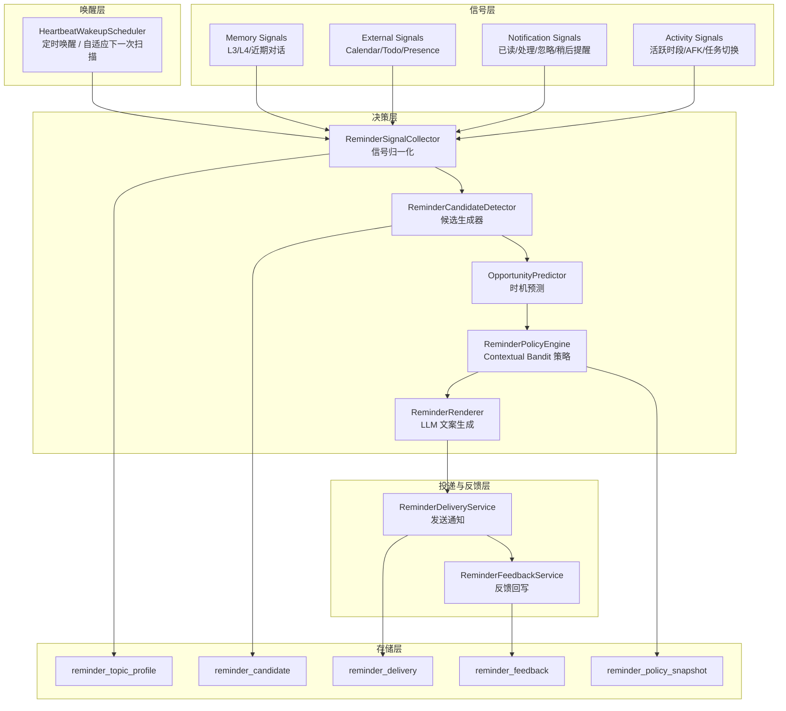

# 主动提醒引擎 — 目标态架构设计

> **文档性质**：目标态架构设计文档
> **模块归属**：跨模块（`agent.task` / `memory` / `notification` / `sync` / `observability`）
> **最后更新**：2026-03

## 1. 文档定位

本文档定义知微主动提醒能力的目标态设计，用于替代当前“heartbeat 巡检 + HEARTBEAT.md checklist”的过渡实现。

本文档描述的是最终形态，不代表当前代码已经全部实现。

### 实现进度

| 模块 | 状态 | 说明 |
|------|------|------|
| 信号采集（`DefaultReminderSignalCollector`） | ✅ 已实现 | L3/L4/L2/Workspace/通知反馈/topic alias |
| 候选生成与评分（`ReminderCandidateDetector` / `ReminderScoringModel`） | ✅ 已实现 | 5 类检测器 + 统一评分模型 |
| 规则决策引擎（`ReminderDecisionEngine`） | ✅ 已实现 | 硬边界 + 评分阈值控制 |
| Contextual Bandit 策略（`ReminderActionContextualBandit`） | ✅ 已实现 | LinUCB 在线学习，机会层 + 动作层双层 Bandit |
| LLM 文案生成（`DefaultReminderMessageGenerator`） | ✅ 已实现 | StringTemplate + GenerationRouter |
| 通知投递与反馈闭环 | ✅ 已实现 | 反馈接口 + 主题静默 + 奖励映射 |
| 隐式结果推断（`ReminderOutcomeInferenceService`） | ✅ 已实现 | Workspace/Workflow/Trace/Semantic/Conversation 多源推断 |
| 离线回放与策略评估 | ✅ 已实现 | `ReminderReplayService` + 定时调度器 |
| 策略调优与版本化 | ✅ 已实现 | `ReminderPolicyTuner` + 安全护栏 + 版本持久化 |
| 时机预测模型（危险率 / 时序点过程） | ⏳ 待定 | 当前为规则回退，点过程模型为后续迭代方向 |
| 外部系统信号接入（日历/AFK/Focus） | ⏳ 待定 | 依赖 sync 模块后续对接 |

## 2. 问题定义

知微中的自主执行需要拆分为三条明确轨道：

- `cron`：用户显式声明的定时承诺。到点执行，不做主观推断。
- `heartbeat`：AI 基于长期记忆、近期上下文和外部信号，主动判断“现在是否值得提醒”。
- `workflow`：满足条件后的多步骤自动化编排，不等价于单次提醒。

当前 heartbeat 更接近“固定间隔巡检器”，而不是“真正的主动提醒引擎”。目标态需要把 heartbeat 收敛为：

- 定时唤醒只是底层机制
- 提醒决策由结构化信号、时机预测和反馈学习共同驱动
- LLM 只负责语义压缩、主题抽取和提醒文案，不负责主决策

## 3. 设计目标

- 让系统根据用户不经意留下的信息，主动判断何时值得提醒
- 明确区分显式任务与隐式提醒，避免 heartbeat 和 cron 语义混淆
- 提醒必须可解释，可回放，可根据用户反馈持续收敛
- 运行态数据全部结构化落库，不依赖 Markdown 作为核心状态存储
- 保持本地优先，可在 SQLite 上完成主要能力

## 4. 非目标

- 不让 heartbeat 自动创建长期 Cron 任务
- 不让 heartbeat 在无明确授权时直接执行高风险工具动作
- 不追求“一次性全知全能”的端到端 LLM 决策
- 不把一次随口提及、低置信度记忆直接变成强提醒

## 5. 核心原则

### 5.1 双轨原则

- 显式计划归 `cron`
- 隐式机会归 `heartbeat`

### 5.2 证据优先原则

- 每条主动提醒都必须附带证据链
- 证据链来自记忆、近期对话、外部事件、通知反馈、用户活跃模式中的至少一部分

### 5.3 时机优先原则

- “何时提醒”优先级高于“提醒什么”
- 系统优先在任务切换、空闲窗口、习惯窗口、截止前准备窗口等机会点提醒

### 5.4 渐进学习原则

- 所有提醒都记录候选、策略、投递和反馈
- 提醒策略由反馈数据持续调优，而不是仅靠改 Prompt

### 5.5 存储分工原则

- Markdown：仅用于人工维护的说明、Prompt、策略模板、调试输出
- 数据库：用于候选提醒、主题状态、策略特征、反馈结果等运行态数据

## 6. 总体架构



## 7. 数据来源

### 7.1 L3 语义记忆

重点使用以下实体类型：

- `PREFERENCE`
- `HABIT`
- `GOAL`
- `EVENT`
- `PROJECT`

提取的关键字段：

- `properties`
- `extractionConfidence`
- `importanceScore`
- `accessCount`
- `lastAccessedAt`
- `sourceConversationId`
- `validFrom / validTo`

作用：

- 判断某条偏好或习惯是否可信
- 判断提醒主题是否仍然有效
- 判断是否存在“事件临近”或“目标未闭环”

### 7.2 L4 程序记忆

重点使用：

- `PreferenceRule`
- `StrategyPattern`

提取的关键字段：

- `category / key / value`
- `confidence`
- `observationCount`

作用：

- 识别用户的稳定提醒偏好
- 判断用户通常在哪个时间窗口更愿意处理某类事项
- 为“提醒方式”而不是“提醒主题”提供个性化先验

### 7.3 近期对话与情景记忆

重点抽取：

- 用户明确提过但未完成的承诺
- 最近重复提及但未设为 cron 的模糊事项
- 新出现的截止时间、会议、准备事项

作用：

- 形成短期高相关候选主题
- 修正长期记忆的陈旧结论

### 7.4 外部系统信号

优先接入：

- 日历
- 待办
- 同步任务源
- Presence / AFK / Focus 状态

作用：

- 形成硬时间约束
- 判断用户当前是否处于合适打扰窗口
- 为“事件前准备提醒”提供事实锚点

### 7.5 通知反馈

目标态反馈事件：

- `read`
- `acted`
- `snoozed`
- `dismissed`
- `not_relevant`

作用：

- 调整提醒主题的优先级
- 学习最佳提醒时机
- 控制提醒疲劳

## 8. 算法总流程

### 8.1 流程概览

```text
collect signals
-> build reminder topics
-> generate candidates
-> predict opportunity window
-> choose action by policy
-> render message
-> deliver
-> collect feedback
-> update topic/policy
```

### 8.2 第一层：候选生成

候选生成不依赖 LLM 自由发挥，采用“规则检测器 + 轻量语义抽取”的混合方式。

基础检测器包括：

1. `DueSoonDetector`
   - 截止时间或会议时间临近
   - 适合事件、日程、待办
2. `CommitmentGapDetector`
   - 用户近期承诺过但尚未完成
   - 适合近期对话和项目推进
3. `HabitWindowDetector`
   - 用户通常会在某时间窗口做某类事
   - 适合稳定习惯
4. `PreparationWindowDetector`
   - 事件发生前存在准备窗口
   - 适合会议、出行、缴费、复盘
5. `AnomalyDetector`
   - 最近行为偏离稳定习惯
   - 适合遗漏型提醒

每个候选至少输出：

- `topicKey`
- `candidateType`
- `evidenceIds`
- `evidenceSummary`
- `baseScore`
- `suggestedWindowStart`
- `suggestedWindowEnd`

### 8.3 第二层：时机预测

目标态采用”规则回退 + 时机预测模型”的双层机制。

> **当前实现**：仅使用规则回退层（`ReminderScoringModel.calcTimingScore`），
> 危险率模型和时序点过程为后续迭代方向。

优先策略：

- 有明确截止时间：直接使用硬时间窗口
- 有稳定历史行为：使用习惯窗口预测
- 历史不足：回退到规则窗口

推荐模型：

- 短期先验：危险率模型（hazard model）
- 目标态主模型：时序点过程 / 下一次行为时间预测模型

预测目标：

- 该主题下一次最可能被用户接受的提醒窗口
- 当前时间是否处于任务切换、空闲、准备窗口、习惯窗口

关键特征：

- 小时、星期、节假日、是否工作日
- 最近一次相关行为时间
- 最近一次相似提醒结果
- 当前是否活跃、是否 AFK、是否在会议中
- 用户对此类提醒的历史接受度
- 主题重要性、记忆置信度、截止剩余时间

### 8.4 第三层：策略选择

目标态采用 Contextual Bandit，而不是直接用全量 RL。

> **当前实现**：`ReminderActionContextualBandit` 已落地 LinUCB 策略，
> 分为机会层（`ReminderOpportunityPolicySelector`）和动作层（`ReminderActionPolicySelector`）双层 Bandit。
> LinTS 为后续可选替换方案。

推荐策略：

- `LinTS` 作为默认策略
- `LinUCB` 作为可解释回退策略

动作空间：

- `SKIP`：本轮不提醒
- `SOFT_PUSH`：轻提醒
- `NORMAL_PUSH`：标准提醒
- `DEFER_30M`：延后 30 分钟重评估
- `DEFER_TO_WINDOW`：延后到预测机会窗口

策略输入特征：

- 候选得分
- 主题类型
- 当前时机特征
- 历史反馈统计
- 用户疲劳度
- 同主题最近提醒间隔

建议奖励函数：

> **实现说明**：当前 `ReminderRewardModel` 采用 `[0, 1]` 归一化区间，
> 无反馈时使用被动基线 `0.42` 而非负分，以适配 LinUCB 的非负奖励假设。
> 下表同时列出目标态语义方向和当前实现值。

| 结果 | 语义方向 | 当前实现值（[0,1]） |
|------|----------|---------------------|
| `acted`（显式处理） | 最强正反馈 | `1.0` |
| `snoozed`（稍后提醒） | 弱正反馈 | `0.72` |
| `read`（已读未行动） | 中性偏正 | `0.58` |
| 无反馈（被动基线） | 中性 | `0.42` |
| `dismissed`（忽略） | 弱负反馈 | `0.18` |
| `not_relevant`（不相关） | 最强负反馈 | `0.0` |
| 隐式完成（推断归因） | 视归因置信度而定 | `max(0.42, attributionScore)` |

### 8.5 第四层：提醒文案生成

LLM 只负责：

- 归纳证据链为自然语言
- 生成符合当前渠道的提醒文案
- 输出提醒的“为什么现在提醒你”

LLM 不负责：

- 决定是否提醒
- 决定优先级排序
- 决定是否突破边界规则

文案要求：

- 用概率化和建议式语气
- 不把推断包装成事实
- 明确当前提醒依据

示例：

```text
你最近几次通常会在周日晚处理下周计划。结合你今天还有两个未完成事项，现在适合花 10 分钟快速整理一下。需要的话我也可以顺手把它转成固定周计划任务。
```

## 9. 评分与边界

### 9.1 统一评分模型

候选总分由以下部分组成：

```text
finalScore =
  0.30 * evidenceScore +
  0.25 * timingScore +
  0.20 * urgencyScore +
  0.15 * userFitScore +
  0.10 * actionabilityScore -
  duplicatePenalty -
  fatiguePenalty
```

分项定义：

- `evidenceScore`：证据置信度、来源数量、数据新鲜度
- `timingScore`：是否命中机会窗口
- `urgencyScore`：截止压力或准备窗口强度
- `userFitScore`：用户对该类提醒的历史接受度
- `actionabilityScore`：提醒后是否存在明确动作
- `duplicatePenalty`：同主题近期是否已提醒
- `fatiguePenalty`：当日提醒密度是否过高

### 9.2 硬边界

heartbeat 必须满足以下硬条件才允许发出提醒：

1. 存在明确 `topicKey`
2. 至少存在可解释证据链
3. 没有命中冷却窗口
4. 当前不处于静默时段
5. 没有与已有 `cron` 或 workflow 的明确职责冲突

### 9.3 业务边界

- heartbeat 可以提醒，也可以建议“是否要转成 cron”
- heartbeat 不能偷偷创建长期任务
- heartbeat 不能直接执行高风险动作
- heartbeat 不得因为单次对话中的随口提及就形成高强度提醒

### 9.4 打扰控制

默认策略：

- 每日主动提醒总量限制
- 同主题冷却窗口
- 深夜与会议中默认静默
- 对连续 `dismissed / not_relevant` 的主题快速降权

## 10. 数据模型

目标态不再使用 Markdown 作为运行态数据源，所有运行态状态统一落库。

### 10.1 reminder_topic_profile

表示一个长期存在的提醒主题画像。

| 列 | 类型 | 说明 |
|----|------|------|
| id | TEXT PK | 主题 ID |
| topic_key | TEXT UNIQUE | 主题稳定键 |
| topic_type | TEXT | 主题类型 |
| title | TEXT | 主题标题 |
| source_kind | TEXT | 主要来源类型 |
| source_refs_json | TEXT | 关联实体/任务/事件 ID |
| confidence_score | REAL | 主题置信度 |
| importance_score | REAL | 主题重要性 |
| preferred_windows_json | TEXT | 学习到的时间窗口 |
| cooldown_until | TEXT | 冷却结束时间 |
| last_reminded_at | TEXT | 上次提醒时间 |
| last_feedback | TEXT | 上次反馈结果 |
| status | TEXT | `ACTIVE / PAUSED / ARCHIVED` |
| created_at | TEXT | 创建时间 |
| updated_at | TEXT | 更新时间 |

### 10.2 reminder_candidate

表示一次 heartbeat 扫描中生成的候选提醒。

| 列 | 类型 | 说明 |
|----|------|------|
| id | TEXT PK | 候选 ID |
| topic_profile_id | TEXT | 关联主题 |
| candidate_type | TEXT | 候选类型 |
| evidence_json | TEXT | 证据链 |
| feature_snapshot_json | TEXT | 策略输入快照 |
| base_score | REAL | 初始分 |
| opportunity_score | REAL | 时机分 |
| final_score | REAL | 总分 |
| proposed_action | TEXT | 策略动作 |
| status | TEXT | `SKIPPED / DELIVERED / EXPIRED` |
| generated_at | TEXT | 生成时间 |
| expires_at | TEXT | 过期时间 |

### 10.3 reminder_delivery

表示一次真实投递结果。

| 列 | 类型 | 说明 |
|----|------|------|
| id | TEXT PK | 投递 ID |
| candidate_id | TEXT | 关联候选 |
| channel | TEXT | 投递渠道 |
| message_text | TEXT | 实际文案 |
| explanation_json | TEXT | 对用户可见的提醒依据 |
| notification_id | TEXT | 关联通知记录 |
| delivered_at | TEXT | 投递时间 |
| status | TEXT | `SENT / FAILED / CANCELED` |

### 10.4 reminder_feedback

表示用户对提醒的反馈。

| 列 | 类型 | 说明 |
|----|------|------|
| id | TEXT PK | 反馈 ID |
| delivery_id | TEXT | 关联投递 |
| feedback_type | TEXT | `READ / ACTED / SNOOZED / DISMISSED / NOT_RELEVANT` |
| feedback_value | TEXT | 可选附加值 |
| reward | REAL | 策略学习奖励 |
| created_at | TEXT | 反馈时间 |

### 10.5 reminder_policy_snapshot

用于离线回放和策略评估。

| 列 | 类型 | 说明 |
|----|------|------|
| id | TEXT PK | 快照 ID |
| candidate_id | TEXT | 关联候选 |
| policy_name | TEXT | 策略名 |
| policy_version | TEXT | 策略版本 |
| context_json | TEXT | 输入上下文 |
| action_probs_json | TEXT | 动作概率或打分 |
| chosen_action | TEXT | 选中动作 |
| created_at | TEXT | 创建时间 |

## 11. 反馈协议

目标态需要从“通知历史”升级为“可学习反馈”。

### 11.1 前端反馈动作

Web 与 IM 渠道应支持以下动作：

- 标记已读
- 立即处理
- 稍后提醒
- 不感兴趣
- 不要再提醒这类内容

### 11.2 反馈写回路径

```text
UI action
-> Notification feedback endpoint
-> ReminderFeedbackService
-> reward mapping
-> update topic profile
-> update policy
```

### 11.3 学习方式

- 主题层学习：调整同主题冷却、重要性、窗口偏好
- 策略层学习：调整动作选择倾向
- 文案层学习：总结用户更接受的提醒表述风格

## 12. 与现有模块的职责映射

| 当前组件 | 目标态角色 |
|----------|------------|
| `CronScheduler` | 保持不变，只负责显式定时任务 |
| `HeartbeatRunner` | 收敛为唤醒器，不再直接读取 `HEARTBEAT.md` 做主决策 |
| `NotificationService` | 继续负责统一投递，但上层新增提醒投递与反馈语义 |
| `memory` | 提供结构化长期信号与近期上下文 |
| `sync` | 提供外部日历、待办、状态等事实信号 |
| `observability` | 提供策略回放、效果评估、特征审计 |

建议新增组件：

- `HeartbeatWakeupScheduler`
- `ReminderSignalCollector`
- `ReminderTopicBuilder`
- `ReminderCandidateDetector`
- `OpportunityPredictor`
- `ReminderPolicyEngine`
- `ReminderRenderer`
- `ReminderDeliveryService`
- `ReminderFeedbackService`

## 13. 配置参考

建议新增如下配置：

| 配置键 | 默认值 | 说明 |
|--------|--------|------|
| `lifepilot.agent.reminder.enabled` | `true` | 主动提醒总开关 |
| `lifepilot.agent.reminder.scan-interval-seconds` | `900` | 基础扫描间隔 |
| `lifepilot.agent.reminder.daily-max-reminders` | `3` | 每日最大主动提醒数 |
| `lifepilot.agent.reminder.default-cooldown-hours` | `24` | 同主题默认冷却 |
| `lifepilot.agent.reminder.quiet-hours-start` | `23:00` | 静默开始 |
| `lifepilot.agent.reminder.quiet-hours-end` | `08:00` | 静默结束 |
| `lifepilot.agent.reminder.policy.name` | `lin_ts` | 默认策略 |
| `lifepilot.agent.reminder.policy.exploration-alpha` | `0.2` | 探索强度 |
| `lifepilot.agent.reminder.renderer.llm-enabled` | `true` | 是否启用 LLM 文案生成 |

## 14. 实现顺序

虽然本文档定义的是最终形态，但落地时推荐按以下顺序推进：

1. 建表与运行态数据模型
2. 候选生成器与统一评分模型
3. 提醒投递与反馈闭环
4. 时机预测模型
5. Contextual Bandit 策略
6. 文案优化与离线评估

## 15. 设计决策

| 决策 | 选择 | 理由 |
|------|------|------|
| 运行态存储 | SQLite | 结构化查询、反馈学习、策略回放都依赖结构化数据 |
| 提醒主决策 | 规则 + 预测 + Bandit | 比端到端 LLM 更稳定、更可解释 |
| 时机预测 | 危险率模型 / 时序点过程 | 适合建模习惯和下一次行为时间 |
| 策略优化 | Contextual Bandit | 适合“有限动作 + 在线反馈”的提醒问题 |
| LLM 角色 | 文案与语义压缩 | 保留表达能力，避免主决策漂移 |
| 边界控制 | 强规则硬约束 | 防止 heartbeat 越权或过度打扰 |

## 16. 研究参考

以下研究与开源项目用于支撑目标态方案：

- Intelligent Notification Systems: A Survey of the State of the Art and Research Challenges  
  https://arxiv.org/abs/1711.10171
- Modeling Opportune Moments for Interruptions at Work  
  https://www.microsoft.com/en-us/research/uploads/prod/2020/02/Modeling-Opportune-Moments-for-Transitions-and-Breaks-at-Work.pdf
- TIPAS: Mining Interdependent and Periodic Real-World Action Sequences  
  https://cs.stanford.edu/people/jure/pubs/tipas-www18.pdf
- Modeling and Predicting Personalized Timing of Mobile Notifications  
  https://pmc.ncbi.nlm.nih.gov/articles/PMC8523513/
- A Reinforcement Learning Approach to Just-in-Time Adaptive Interventions  
  https://arxiv.org/abs/1706.09090
- Personalizing Reminder Timing Through Large-Scale User Behavior Analysis  
  https://www.microsoft.com/en-us/research/wp-content/uploads/2017/01/umap-2016-graus-et-al.pdf
- ActivityWatch  
  https://github.com/ActivityWatch/activitywatch
- Home Assistant Companion Sensors / Actionable Notifications  
  https://companion.home-assistant.io/docs/core/sensors/  
  https://companion.home-assistant.io/docs/notifications/actionable-notifications/
- Vowpal Wabbit Contextual Bandit  
  https://vowpalwabbit.org/docs/vowpal_wabbit/python/latest/tutorials/python_Contextual_bandits_and_Vowpal_Wabbit.html
- MABWiser  
  https://github.com/fidelity/mabwiser
