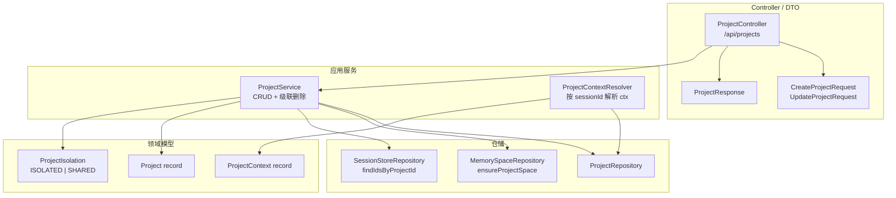

# 项目工作空间 — 架构设计

> **文档性质**：架构设计文档
> **模块归属**：`com.lifepilot.project`
> **最后更新**：2026-04-24

## 1. 模块概述

项目（Project）是用户显式创建的领域级任务容器。每个项目与一个 `type=PROJECT` 的 MemorySpace 一一绑定，用于承载项目相关的会话归属与记忆隔离。

核心概念：

- **项目（Project）**：领域级任务容器，拥有名称、指示词、隔离模式等元信息
- **项目记忆空间（PROJECT MemorySpace）**：每个项目创建时自动联动创建一个 `space_key = "project:{projectId}"` 的 MemorySpace
- **项目上下文（ProjectContext）**：请求/对话阶段的运行时上下文，承载 `projectId` / `projectSpaceId` / `personalSpaceId` / `experienceSpaceId` / `isolated` 五个字段，是下游记忆读写路径的决策依据

不在本模块职责内：

- L3 用户偏好 / L4 程序记忆的 key-level override（后续 Plan）

已在后续 Plan 落地：

- **Plan 2（定时任务全局入口）**：`cron_tasks.project_id` 字段（V19） + `/api/scheduled-tasks` REST + 前端 `/scheduled-tasks` 管理页。详见本文 §5.4 与 §7 集成点表。
- **Plan 3（Datastore 用户侧下架）**：LLM 工具集下线 + 前端路由/侧栏入口下架；后端能力保留。详见 [通用数据存储架构](./generic-data-store.md)。

## 2. 数据模型

### 2.1 `projects` 表（V15）

```
id              TEXT PRIMARY KEY
name            TEXT NOT NULL UNIQUE           -- 1..64 字符，同账户唯一
instructions    TEXT NOT NULL DEFAULT ''       -- 0..1000 字符，可注入 system prompt
isolation       TEXT NOT NULL DEFAULT 'ISOLATED'
                CHECK (isolation IN ('ISOLATED', 'SHARED'))
memory_space_id TEXT NOT NULL
                FOREIGN KEY -> memory_spaces(id) ON DELETE RESTRICT
created_at      TEXT NOT NULL
updated_at      TEXT NOT NULL
```

关键索引：`idx_projects_created_at`（创建时间倒序）、`idx_projects_memory_space`。

FK 约束为 `RESTRICT` 而非 `CASCADE`：级联策略由应用层 `ProjectService.deleteProject` 统一实现，避免数据库隐式副作用。

### 2.2 `session_store.project_id`（V16 → V17）

V16 曾给死表 `conversations` 加过 `project_id`；真实对话表是 `session_store`，因此 V17 删除 V16 的列和索引，将 `project_id` 挂到 `session_store`。

```
session_store.project_id TEXT                  -- NULL = 归属主账户；非 NULL = 归属具体项目
idx_session_store_project_id                   -- 部分索引：WHERE project_id IS NOT NULL
```

不加 FK 到 `projects(id)`：级联语义由 `ProjectService.deleteProject` 统一实现（与 V15 思路一致）。

### 2.3 `chat_turn_memory_snapshots.project_space_id`（V18）

```
chat_turn_memory_snapshots.project_space_id TEXT
```

`ChatTurnService.persistTurnMemorySnapshot` 按 `ChatSession.projectId` 反查 `ProjectContext`，ISOLATED 时填入；SHARED / 主账户对话留 NULL。下游 `RealtimeExtractor` / 经验写入路径从 snapshot 拿该字段决定 `writeContext.spaceId`。

不加 FK 到 `memory_spaces`：SQLite 的 `ALTER TABLE ADD COLUMN` 不支持同时声明外键约束，后续若需强制引用完整性需走表重建（对现有数据影响较大），此处保持与应用层校验一致。

### 2.4 `MemorySpaceType.PROJECT`

`memory_spaces` 表已有字段 `space_type`，V15 引入新的枚举值 `PROJECT`。对应 `MemorySpaceKeys.project(projectId)` 生成的 `space_key` 形如 `project:{uuid}`。

### 2.5 `cron_tasks.project_id`（V19，Plan 2）

```
cron_tasks.project_id TEXT                     -- NULL = 归属主账户；非 NULL = 归属具体项目
idx_cron_tasks_project_id                      -- 部分索引：WHERE project_id IS NOT NULL
```

不加 FK 到 `projects(id)`：级联策略由应用层 `ProjectService.deleteProject` 统一实现（与 V15 / V17 思路一致），避免跨迁移的 FK 依赖环。

`CronTaskEntry` record 新增 `@Nullable String projectId` 字段并保留两种兼容构造器（无 skillIds 的旧调用点和无 projectId 的旧调用点均等价于归属主账户）。

## 3. 核心组件



### 3.1 `Project` 领域模型

`com.lifepilot.project.model.Project`：不可变 record，字段 `id / name / instructions / isolation / memorySpaceId / createdAt / updatedAt`。构造器强校验：

- `name` 非空、长度 ≤ 64
- `instructions` null 规范化为空串、长度 ≤ 1000
- `isolation` 非空
- `memorySpaceId` 非空

### 3.2 `ProjectIsolation` 枚举

`ISOLATED`（默认）/ `SHARED`。`defaultValue()` 返回 `ISOLATED`，`fromString()` 大小写不敏感。

### 3.3 `ProjectContext` 运行时载体

`com.lifepilot.project.context.ProjectContext`：record，5 字段。

| 字段 | 主账户对话 | ISOLATED 项目对话 | SHARED 项目对话 |
|------|-----------|------------------|----------------|
| `projectId` | null | 项目 id | 项目 id |
| `projectSpaceId` | null | 项目 MemorySpace id | 项目 MemorySpace id（仍非 null） |
| `personalSpaceId` | 主账户 personal space id | 同 | 同 |
| `experienceSpaceId` | 主账户 experience space id | 同 | 同 |
| `isolated` | false | true | false |

`ProjectContext.personal(personalSpaceId, experienceSpaceId)` 静态工厂用于构造主账户上下文。

### 3.4 `ProjectContextResolver`

按 `sessionId` 反查对应的 `ChatSession.projectId`，再结合 `ProjectRepository` 与 `MemorySpaceRepository` 组装出完整的 `ProjectContext`。主账户对话（`projectId IS NULL`）返回 `ProjectContext.personal(...)`。

调用方：`ContextAssembler` / `MemoryToolProvider` / `ChatTurnService` 在记忆读写决策前解析 ctx。

### 3.5 `ProjectService`

`@Transactional` 方法：

- **createProject(name, instructions, isolation)**：同名重复校验 → `MemorySpaceRepository.ensureProjectSpace(newId)` 创建 PROJECT 级空间 → 持久化 `Project` 行 → 若 `KnowledgeBaseManager` 可用则创建"项目默认知识库"（tags=`["project"]`）并绑定到项目 MemorySpace（KB 建失败不中止，记 warn）。规范化：`instructions=null → ""`，`isolation=null → ISOLATED`
- **updateProject(id, name, instructions, isolation)**：改名重名校验；`instructions` / `isolation` 传 null 时保留原值
- **deleteProject(id)**：6 步级联（见下节）

### 3.6 级联删除顺序（`ProjectService.deleteProject`）

FK 约束决定的固定顺序（代码中编号 0–5）：

0. **级联删项目默认 KB 本体**（仅 `KnowledgeBaseManager` 可用时） —— 通过 `memory_space_knowledge_bases` 反查项目 space 下的 KB id，仅对 `tags` 含 `"project"` 的调 `KnowledgeBaseManager.deleteKnowledgeBase`；避免误删用户手动挂到项目的非默认 KB，也避免 Step 5 级联清关联表后留下孤儿 KB 本体
1. **清归属项目的会话**（`SessionStoreRepository.batchDelete(sessionIds)`）—— FK CASCADE 连带清 `chat_turns` / `session_transcript_entries` 等全部子表
2. **清项目记忆空间下的 `memory_relations`** —— `memory_relations` FK 到 `memory_entities` 不带 CASCADE，必须先于 `memory_entities` 删
3. **清项目记忆空间下的 `memory_entities`** —— FK CASCADE 连带清 `memory_entity_versions` / `memory_entity_provenances`
4. **删 `projects` 行** —— V15 的 FK 对 `memory_spaces` 是 RESTRICT，必须先删 project 再删 space
5. **删 `memory_spaces` 行** —— `memory_space_knowledge_bases` / `memory_space_datastores` 通过 FK CASCADE 自动清理

注意 `memory_entities` / `memory_relations` 两张表 FK 到 `memory_spaces` 的是 RESTRICT（V1 init schema），因此不能依赖 `memory_spaces` 的删除自动带走它们，必须在代码里显式清空。

## 4. 记忆隔离语义

### 4.1 读取（`MemoryReadFilter.buildForProject`）

Plan 1 的基础版本只做 space-level 合并，不做 key-level override：

- **ISOLATED 项目**：允许读取 `[项目 space + 主账户 personal + 主账户 experience]`
- **SHARED 项目**：等同主账户读取（项目 space 不加入）
- **主账户对话**：只读主账户 space

L3 用户偏好 / L4 程序记忆的"项目级覆盖主账户同键"留给后续 plan。

### 4.2 写入（`MemoryWriteContext`）

`MemoryToolProvider` / `RealtimeExtractor` / `ExperienceSummarizer` / `SubtaskReflector` 均通过 `ProjectContext` 构造 `MemoryWriteContext`：

- **ISOLATED 项目**：写入目标 `spaceId = projectSpaceId`（只落项目 space）
- **SHARED 项目 / 主账户对话**：写入目标 `spaceId = personalSpaceId` 或 `experienceSpaceId`（合流到主账户）

对话级写入（`ChatTurnService.persistTurnMemorySnapshot`）按 `ChatSession.projectId` 反查 ctx，ISOLATED 时把 `projectSpaceId` 固化到 `chat_turn_memory_snapshots.project_space_id`；后续异步抽取路径（`RealtimeExtractor` 等）从 snapshot 拿该字段决定最终写入目标。

### 4.3 `MemoryReadFilter.fromProjectContextOrFallback`

集中处理"resolver/chatSession 查不到"的回退分支。当 ctx 相关参数全为空时，按 scopes 回退到 `MemoryReadFilter.userMemory()` / `agentExperience()` / `userProfile()` / `all()`；否则走 `buildForProject`。调用方 `ContextAssembler` / `MemoryToolProvider` 通过该工厂避免各自维护判定逻辑。

## 5. 会话归属语义

### 5.1 创建会话

`POST /api/chat/sessions` 请求体含可选 `projectId`：

- 不传 / null → 归属主账户（`session_store.project_id = NULL`）
- 非 null → 归属具体项目

### 5.2 列出会话

`GET /api/chat/sessions` 支持可选 `projectId` 参数。**Plan 1 语义变更**：

- 不传 `projectId` → 仅返回主账户对话（`project_id IS NULL`），而非历史上的"全部 web 会话"
- 传 `projectId=xxx` → 仅返回归属该项目的对话

前端在项目详情页显示对话时必须显式传 `projectId`。此变更在前端改造完成前对现有数据（全部 `project_id = NULL`）无可见影响。

内部 `SessionStoreRepository` 使用 `ProjectScope` sealed interface 表达两种互斥语义：`MainAccount` 与 `OfProject(projectId)`。

### 5.3 Fork 会话

`POST /api/chat/sessions/{id}/fork` 产生的新会话继承源会话的 `projectId`，保证项目内 fork 不泄漏到主账户。

### 5.4 定时任务归属（Plan 2）

- **创建**：`CronActionDispatchExecutor` 在 `action=create` 路径上通过 `ChatSessionRepository.findById(sessionId)` 反查 `ChatSession.projectId`，填入新建的 `CronTaskEntry`——在隔离项目对话中创建的定时任务自动归属该项目；`ChatSessionRepository` 缺失、sessionId 缺失或 session 不存在时一律回退 `null`（归属主账户），保证功能降级不破坏 cron 创建路径
- **归属不可迁移**：`PUT /api/scheduled-tasks/{id}` 故意不接受 `projectId` 字段；要换归属需删除重建
- **全局管理**：`GET /api/scheduled-tasks` 不传 `projectId` 时返回主账户 + 所有项目的任务（供全局管理页使用）；传 `projectId=xxx` 时精确等值过滤
- **项目删除级联**：`ProjectService.deleteProject` 未显式清理 cron_tasks（V19 不带 FK）；按当前实现，归属被删项目的定时任务会被留成"孤儿 project_id"，由前端按项目 tag 显示时过滤处理

内部 `CronTaskRepository.findByProjectId(projectId)` 对应 Plan 2 新增的按项目过滤查询。

## 6. 前端入口

- **侧栏项目分组**（`src/components/sidebar/ProjectSection.vue`）：展示项目列表入口
- **新建项目对话框**（`src/components/project/CreateProjectDialog.vue`）：填写 name / instructions / isolation
- **项目详情页**（`/projects/:id` 路由 → `src/views/ProjectDetailView.vue`）：顶部为项目名 + 资料/设置入口，主区为"开始新对话"按钮与该项目下的对话列表
- **项目资料抽屉**（`src/components/project/ProjectResourcePanel.vue`）：知识库/文档 tab 骨架
- **项目设置抽屉**（`src/components/project/ProjectSettingsPanel.vue`）：编辑 + 删除
- **新建对话继承**：`ChatView.vue` 读取 `route.query.projectId` 作为创建新对话时的项目归属
- **定时任务全局管理**（Plan 2）：侧栏"定时任务"一级入口 `data-testid=scheduled-tasks-entry` → `/scheduled-tasks` 路由 → `src/views/ScheduledTasksView.vue`，列表带项目 tag + 暂停/恢复/删除操作

前端 API 客户端：`src/api/project.ts` / `src/api/scheduledTask.ts`；Pinia store：`src/stores/project.ts` / `src/stores/scheduledTask.ts`。

## 7. 集成点

| 集成模块 | 方向 | 说明 |
|---------|------|------|
| 对话系统（`com.lifepilot.conversation`） | Project → Conversation | `session_store.project_id` 作为归属字段；`SessionStoreRepository` 提供 `findIdsByProjectId` / `ProjectScope` 查询 |
| 记忆系统（`com.lifepilot.memory`） | Project → Memory | `MemorySpaceType.PROJECT` 类型；`MemoryReadFilter.buildForProject` 读路径；`chat_turn_memory_snapshots.project_space_id` 写路径；`MemorySpaceRepository.ensureProjectSpace` 创建联动 |
| 上下文组装（`com.lifepilot.agent.context`） | Agent → Project | `ContextAssembler` 通过 `ProjectContextResolver` 解析 ctx，按 filter 分键缓存 metadata 避免跨项目污染 |
| 记忆工具（`com.lifepilot.meta.infra.memory`） | Tool → Project | `MemoryToolProvider` 从 `ToolInput.context.sessionId` 反查 ctx，构造 `toProjectFilter` 读 / `toProjectWriteContext` 写 |
| 对话轮持久化（`com.lifepilot.conversation.chatturn`） | Turn → Project | `ChatTurnService.persistTurnMemorySnapshot` 按 session 的 projectId 填 `project_space_id`，固化到 snapshot |
| 经验学习（`com.lifepilot.memory.experience`） | Memory → Project | `ExperienceSummarizer` / `SubtaskReflector` 写入按 `ProjectContext.writeContext` 路由 |
| 定时任务（`com.lifepilot.agent.task` + `com.lifepilot.meta.infra.task`） | Project → Cron | `cron_tasks.project_id`；`CronActionDispatchExecutor` 创建时按 `ChatSession.projectId` 填充；`CronTaskRepository.findByProjectId` 供 `ScheduledTaskController` 过滤查询使用 |

## 8. 当前限制

- Plan 1 仅做 space-level 合并，不做 key-level override：同名的用户偏好 / 程序记忆条目不会按项目版本优先覆盖主账户版本
- `session_store.project_id` / `chat_turn_memory_snapshots.project_space_id` / `cron_tasks.project_id` 均不在 DB 层加 FK，依赖应用层级联，误操作裸 SQL 可能产生孤立数据
- `ProjectService.deleteProject` 未显式清理 `cron_tasks`：归属被删项目的定时任务会留成"孤儿 project_id"，前端按项目 tag 显示时需自行过滤；如果严格清理需求出现再补充级联步骤
- 未做项目级配额、审计、多用户共享语义
- 前端项目资料 tab（知识库 / 文档归属）目前仅为骨架，完整的项目内知识库 / 文档管理是后续 Plan 范围
