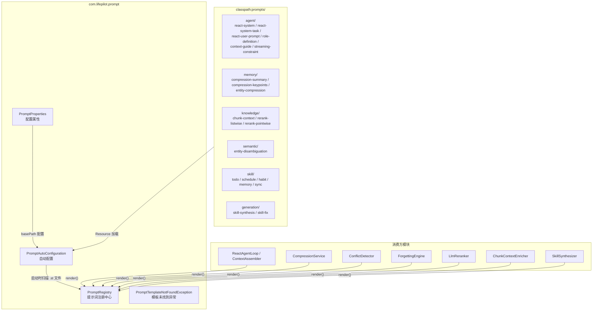
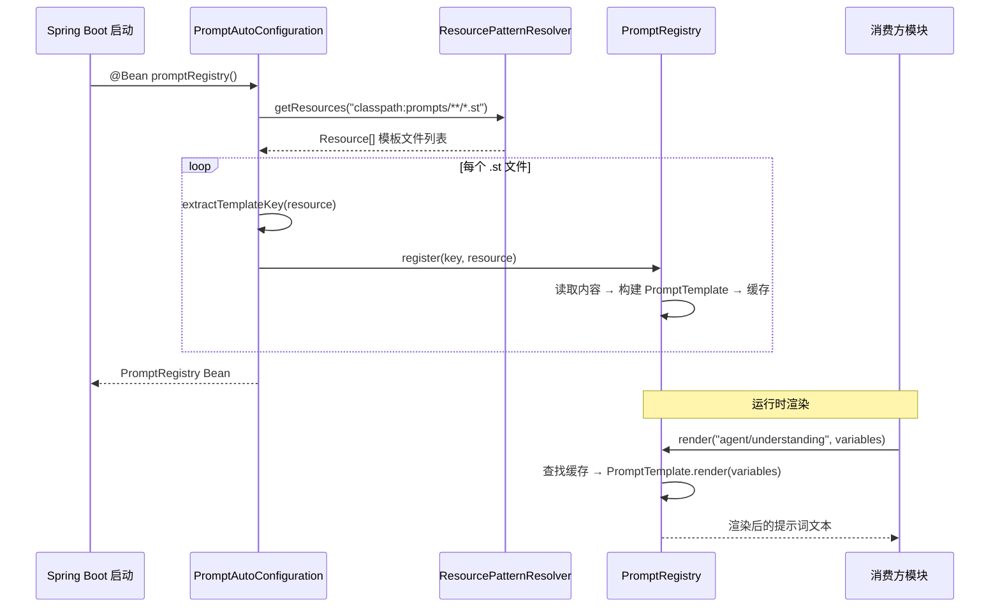

# 提示词管理 — 架构设计

> **文档性质**：架构设计文档
> **模块归属**：`com.lifepilot.prompt`
> **最后更新**：2026-03

## 1. 模块概述

提示词管理模块（Prompt Management）为系统提供统一的提示词模板注册、缓存和渲染能力。所有需要构造 LLM 提示词的模块（Agent 引擎、记忆系统、知识库、Skill 系统等）通过 `PromptRegistry` 获取渲染后的提示词文本，实现提示词与业务逻辑的解耦。模板文件采用 Spring AI 的 StringTemplate（`.st`）格式，按功能域组织在 `classpath:prompts/` 目录下，启动时自动扫描注册。

## 2. 架构图



## 3. 核心组件

### 3.1 PromptRegistry — 提示词注册中心

- 职责：统一管理所有提示词模板的注册、缓存和渲染
- 存储：`ConcurrentHashMap<String, PromptTemplate>` 内存缓存
- 注册：`register(key, Resource)` 从 classpath Resource 读取模板内容并缓存
- 渲染：`render(key, variables)` 使用 Spring AI `PromptTemplate` 进行变量替换
- 查询：`getTemplate(key)` 返回 `Optional<PromptTemplate>`，`keys()` 返回所有已注册键的不可变集合
- 异常：模板不存在时抛出 `PromptTemplateNotFoundException`

### 3.2 PromptAutoConfiguration — 自动配置

- 职责：启动时扫描 `classpath:prompts/` 下所有 `.st` 文件并注册到 `PromptRegistry`
- 扫描模式：`{basePath}**/*.st`（递归扫描所有子目录）
- 键提取规则：从 Resource URL 中提取相对路径并去除 `.st` 后缀（如 `agent/understanding.st` → `agent/understanding`）
- 条件注册：`@ConditionalOnMissingBean` 允许测试中替换

### 3.3 PromptProperties — 配置属性

- 配置前缀：`lifepilot.prompt`
- `basePath`：模板根目录（默认 `classpath:prompts/`）

## 4. 核心流程

### 4.1 模板加载与渲染流程



## 5. 设计决策

| 决策 | 选择 | 理由 |
|------|------|------|
| 模板格式 | Spring AI StringTemplate（.st） | 与 Spring AI PromptTemplate 原生集成，支持变量替换 |
| 模板组织 | 按功能域分目录 | 模板键自然映射为路径（如 `agent/understanding`），直观易维护 |
| 加载时机 | 启动时全量扫描 | 模板数量有限（约 20 个），启动时一次性加载避免运行时 I/O |
| 缓存策略 | ConcurrentHashMap 永久缓存 | 模板在运行时不变，无需过期或刷新 |
| 模板与代码分离 | 独立 .st 文件 | 提示词可独立修改和版本管理，不需要重新编译 |

## 6. 集成点

| 集成模块 | 方向 | 说明 |
|---------|------|------|
| agent（ContextAssembler / ReactAgentLoop） | agent → prompt | 渲染 Agent 系统提示词与任务模式提示词（react-system / react-system-task / react-user-prompt） |
| memory（CompressionService / ForgettingEngine） | memory → prompt | 渲染对话压缩和实体压缩提示词 |
| memory（ConflictDetector） | memory → prompt | 渲染实体消歧义提示词 |
| knowledge（RerankRouter / ChunkContextEnricher） | knowledge → prompt | 渲染重排序和分块上下文提示词 |
| skill（SkillSynthesizer） | skill → prompt | 渲染 `generation/skill-synthesis` 和 `generation/skill-fix` 模板，用于 AUTO_GENERATED Skill 自生成与迭代修正 |
| sync（SyncSkillProvider） | sync → prompt | 渲染同步 Skill 的 instructions 提示词 |

## 7. 配置参考

| 配置键 | 默认值 | 说明 |
|--------|--------|------|
| `lifepilot.prompt.base-path` | `classpath:prompts/` | 模板根目录路径 |

## 8. 模板目录结构

```
prompts/
├── agent/                    # Agent 引擎提示词
│   ├── react-system.st       # 交互模式系统提示词
│   ├── react-system-task.st  # 自主任务模式提示词
│   ├── react-user-prompt.st  # 用户侧运行时上下文
│   ├── role-definition.st    # 角色定义
│   ├── context-guide.st      # 上下文注入说明
│   └── streaming-constraint.st # 流式约束
├── memory/                   # 记忆系统提示词
│   ├── compression-summary.st    # 摘要压缩
│   ├── compression-keypoints.st  # 关键点压缩
│   └── entity-compression.st     # 实体压缩
├── knowledge/                # 知识库提示词
│   ├── chunk-context.st      # 分块上下文增强
│   ├── rerank-listwise.st    # 列表式重排序
│   └── rerank-pointwise.st   # 逐点式重排序
├── semantic/                 # 语义处理提示词
│   └── entity-disambiguation.st  # 实体消歧义
├── skill/                    # 内置 Skill 提示词
│   ├── todo.st / schedule.st / habit.st / memory.st / sync.st
└── generation/               # Skill 自生成与迭代修正提示词
    ├── skill-synthesis.st    # SkillSynthesizer 首次生成
    └── skill-fix.st          # SkillSynthesizer 迭代修正
```
