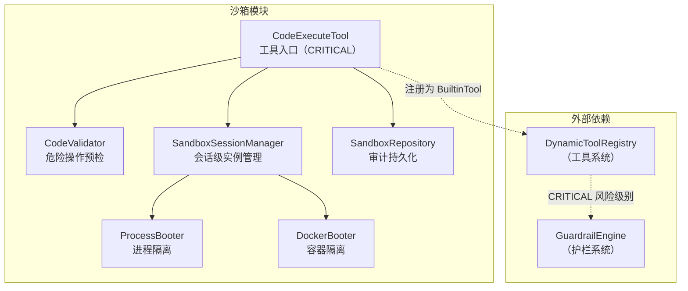
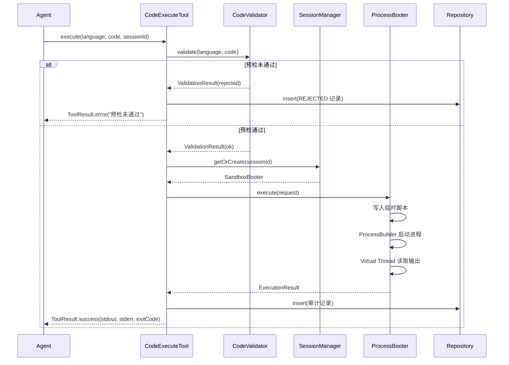

# 代码执行沙箱 — 架构设计

> **文档性质**：架构设计文档
> **模块归属**：`com.lifepilot.sandbox`
> **最后更新**：2026-03

## 1. 模块概述

沙箱模块为知微提供安全的代码执行环境，支持 Python、JavaScript、Shell 三种语言。通过 `SandboxBooter` sealed interface 抽象两种隔离策略（ProcessBooter 进程隔离 / DockerBooter 容器隔离），结合 `CodeValidator` 危险操作预检和 `SandboxSessionManager` 会话级实例复用，确保 Agent 生成的代码在受控环境中执行。作为 CRITICAL 风险级别的 BuiltinTool 注册到工具系统。

## 2. 架构图

## 3. 核心组件

### 3.1 SandboxBooter（sealed interface）

- 职责：沙箱启动器抽象，定义统一的生命周期接口
- 两个实现：`ProcessBooter`（进程隔离）和 `DockerBooter`（容器隔离）
- 核心方法：`boot(workingDirectory)` 启动、`execute(request)` 执行、`shutdown()` 关闭、`available()` 可用性检查

### 3.2 ProcessBooter

- 职责：基于 ProcessBuilder 的轻量级进程沙箱，零外部依赖，默认方案
- 隔离措施：在统一工作目录下的 `sandbox/` 子目录中创建隔离会话目录、清洗环境变量（仅保留 PATH）、超时强制终止
- 异步读取：Virtual Thread 异步读取 stdout/stderr，避免阻塞
- 执行流程：写入临时脚本文件 → 构建 ProcessBuilder → 启动进程 → 等待完成或超时 → 清理临时文件

### 3.3 DockerBooter

- 职责：基于 Docker 容器的强隔离沙箱，提供资源限制和网络隔离
- 资源限制：内存（默认 256MB）、CPU（默认 1 核）、磁盘（默认 512MB）
- 网络策略：默认禁用网络（`--network none`）
- 可用性检查：通过 `docker info` 命令检测 Docker 是否可用

### 3.4 CodeValidator

- 职责：代码执行前的危险操作预检，基于正则模式匹配
- 按语言维护危险模式列表（Python / JavaScript / Shell）
- 违规分级：CRITICAL（拒绝执行）/ HIGH / MEDIUM
- 输出 `ValidationResult`：包含是否通过和违规项列表（模式、描述、严重程度、行号）

### 3.5 SandboxSessionManager

- 职责：会话级沙箱实例管理，支持 TTL 自动续期和过期清理
- 依赖 `WorkspaceResolver` 解析工作目录，会话工作目录创建在 `{workspace}/sandbox/session-{id}/` 下
- `getOrCreate(sessionId)`：已有会话续期返回，新会话检查上限后创建
- 定时清理：`ScheduledExecutorService` 定期扫描过期会话并销毁
- 销毁流程：shutdown booter → 删除工作目录 → 移除 entry
- 线程安全：`ConcurrentHashMap` + `compute` 原子操作

### 3.6 CodeExecuteTool

- 职责：作为 BuiltinTool 注册到 DynamicToolRegistry，编排完整执行流程
- 风险级别：CRITICAL（需用户确认 + 二次验证）
- 执行流程：语言校验 → CodeValidator 预检 → SessionManager 获取沙箱 → 执行 → 审计持久化 → 返回结果
- 审计：每次执行（含预检拒绝）都持久化 ExecutionRecord，写入失败降级跳过

## 4. 核心流程

## 5. 设计决策

| 决策 | 选择 | 理由 |
|------|------|------|
| 隔离策略抽象 | sealed interface（Process/Docker） | 编译期穷举，两种策略覆盖轻量和强隔离场景 |
| 默认隔离方案 | ProcessBooter | 零外部依赖，开箱即用，适合个人部署 |
| 危险操作预检 | 正则模式匹配 | 轻量高效，无需 AST 解析，覆盖常见危险操作 |
| 会话复用 | TTL 自动续期 | 避免频繁创建/销毁沙箱实例，提升响应速度 |
| 风险级别 | CRITICAL | 代码执行是最高风险操作，必须经过护栏确认 |
| 输出截断 | 最大字节数限制 | 防止恶意代码通过大量输出消耗内存 |
| 环境变量清洗 | 仅保留 PATH | 防止泄露敏感环境变量（API Key 等） |

## 6. 集成点

| 依赖方向 | 模块 | 交互方式 |
|---------|------|---------|
| sandbox → tool | `com.lifepilot.tool` | CodeExecuteTool 注册为 BuiltinTool |
| sandbox → guardrail | `com.lifepilot.guardrail` | CRITICAL 风险级别触发护栏确认 |
| sandbox → observability | `com.lifepilot.observability` | 使用 RiskLevel 枚举 |
| agent → sandbox | `com.lifepilot.agent` | Agent 通过工具调用执行代码 |

## 7. 配置参考

| 配置键 | 默认值 | 说明 |
|--------|--------|------|
| `zhiwei.workspace-dir` | `${zhiwei.data-dir}/workspace` | 统一工作目录，沙箱会话目录创建在 `{workspace}/sandbox/` 下 |
| `lifepilot.sandbox.enabled` | `true` | 沙箱总开关 |
| `lifepilot.sandbox.booter` | `process` | 沙箱类型（process / docker） |
| `lifepilot.sandbox.supported-languages` | `[python, javascript, shell]` | 支持的语言列表 |
| `lifepilot.sandbox.execution-timeout-seconds` | `30` | 执行超时（秒） |
| `lifepilot.sandbox.max-output-bytes` | `65536` | 输出最大字节数 |
| `lifepilot.sandbox.session.ttl-seconds` | `600` | 会话 TTL（秒） |
| `lifepilot.sandbox.session.max-active-sessions` | `5` | 最大活跃会话数 |
| `lifepilot.sandbox.session.cleanup-interval-seconds` | `60` | 清理间隔（秒） |
| `lifepilot.sandbox.validator.enabled` | `true` | 预检开关 |
| `lifepilot.sandbox.validator.reject-critical` | `true` | 是否拒绝 CRITICAL 违规 |
| `lifepilot.sandbox.docker.memory-limit-mb` | `256` | Docker 内存限制（MB） |
| `lifepilot.sandbox.docker.cpu-limit` | `1.0` | Docker CPU 限制（核数） |
| `lifepilot.sandbox.docker.network-enabled` | `false` | Docker 网络开关 |
